Introduction to the tidyverse
================
Joschka Schwarz

-   [1. Data Wrangling](#1-data-wrangling)
    -   [The gapminder dataset](#the-gapminder-dataset)
    -   [Loading the gapminder and dplyr
        packages](#loading-the-gapminder-and-dplyr-packages)
    -   [Understanding a data frame](#understanding-a-data-frame)
    -   [The filter verb](#the-filter-verb)
    -   [Filtering for one year](#filtering-for-one-year)
    -   [Filtering for one country and one
        year](#filtering-for-one-country-and-one-year)
    -   [The arrange verb](#the-arrange-verb)
    -   [Arranging observations by life
        expectancy](#arranging-observations-by-life-expectancy)
    -   [Filtering and arranging](#filtering-and-arranging)
    -   [The mutate verb](#the-mutate-verb)
    -   [Using mutate to change or create a
        column](#using-mutate-to-change-or-create-a-column)
    -   [Combining filter, mutate, and
        arrange](#combining-filter-mutate-and-arrange)
-   [2. Data visualization](#2-data-visualization)
    -   [Visualizing with ggplot2](#visualizing-with-ggplot2)
    -   [Variable assignment](#variable-assignment)
    -   [Comparing population and GDP per
        capita](#comparing-population-and-gdp-per-capita)
    -   [Comparing population and life
        expectancy](#comparing-population-and-life-expectancy)
    -   [Log scales](#log-scales)
    -   [Putting the x-axis on a log
        scale](#putting-the-x-axis-on-a-log-scale)
    -   [Putting the x- and y- axes on a log
        scale](#putting-the-x--and-y--axes-on-a-log-scale)
    -   [Additional aesthetics](#additional-aesthetics)
    -   [Adding color to a scatter
        plot](#adding-color-to-a-scatter-plot)
    -   [Adding size and color to a
        plot](#adding-size-and-color-to-a-plot)
    -   [Faceting](#faceting)
    -   [Creating a subgraph for each
        continent](#creating-a-subgraph-for-each-continent)
    -   [Faceting by year](#faceting-by-year)
-   [3. Grouping and summarizing](#3-grouping-and-summarizing)
    -   [The summarize verb](#the-summarize-verb)
    -   [Summarizing the median life
        expectancy](#summarizing-the-median-life-expectancy)
    -   [Summarizing the median life expectancy in
        1957](#summarizing-the-median-life-expectancy-in-1957)
    -   [Summarizing multiple variables in
        1957](#summarizing-multiple-variables-in-1957)
    -   [The group_by verb](#the-group_by-verb)
    -   [Summarizing by year](#summarizing-by-year)
    -   [Summarizing by continent](#summarizing-by-continent)
    -   [Summarizing by continent and
        year](#summarizing-by-continent-and-year)
    -   [Visualizing summarized data](#visualizing-summarized-data)
    -   [Visualizing median life expectancy over
        time](#visualizing-median-life-expectancy-over-time)
    -   [Visualizing median GDP per capita per continent over
        time](#visualizing-median-gdp-per-capita-per-continent-over-time)
    -   [Comparing median life expectancy and median GDP per continent
        in
        2007](#comparing-median-life-expectancy-and-median-gdp-per-continent-in-2007)
-   [4. Types of visualizations](#4-types-of-visualizations)
    -   [Line plots](#line-plots)
    -   [Visualizing median GDP per capita over
        time](#visualizing-median-gdp-per-capita-over-time)
    -   [Visualizing median GDP per capita per continent over
        time](#visualizing-median-gdp-per-capita-per-continent-over-time-1)
    -   [Comparing median life expectancy and median GDP per continent
        in
        2007](#comparing-median-life-expectancy-and-median-gdp-per-continent-in-2007-1)
    -   [Visualizing median GDP per capita over
        time](#visualizing-median-gdp-per-capita-over-time-1)
    -   [Visualizing median GDP per capita by continent over
        time](#visualizing-median-gdp-per-capita-by-continent-over-time)
    -   [Bar plots](#bar-plots)
    -   [Visualizing median GDP per capita by
        continent](#visualizing-median-gdp-per-capita-by-continent)
    -   [Visualizing GDP per capita by country in
        Oceania](#visualizing-gdp-per-capita-by-country-in-oceania)
    -   [Histograms](#histograms)
    -   [Visualizing population](#visualizing-population)
    -   [Visualizing population with x-axis on a log
        scale](#visualizing-population-with-x-axis-on-a-log-scale)
    -   [Boxplots](#boxplots)
    -   [Comparing GDP per capita across
        continents](#comparing-gdp-per-capita-across-continents)
    -   [Adding a title to your graph](#adding-a-title-to-your-graph)

**Short Description**

Get started on the path to exploring and visualizing your own data with
the tidyverse, a powerful and popular collection of data science tools
within R. Discover the fundamentals of the Tidyverse, and learn all
about renaming and reordering variables, while becoming familiar with
binomial distribution.

**Long Description**

This is an introduction to the programming language R, focused on a
powerful set of tools known as the Tidyverse. You’ll learn the
intertwined processes of data manipulation and visualization using the
tools dplyr and ggplot2. You’ll learn to manipulate data by filtering,
sorting, and summarizing a real dataset of historical country data in
order to answer exploratory questions. You’ll then learn to turn this
processed data into informative line plots, bar plots, histograms, and
more with the ggplot2 package. You’ll get a taste of the value of
exploratory data analysis and the power of Tidyverse tools. This is a
suitable introduction for those who have no previous experience in R and
are interested in performing data analysis.

# 1. Data Wrangling

In this chapter, you’ll learn to do three things with a table: filter
for particular observations, arrange the observations in a desired
order, and mutate to add or change a column. You’ll see how each of
these steps allows you to answer questions about your data.

## The gapminder dataset

Theory. Coming soon …

## Loading the gapminder and dplyr packages

Before you can work with the `gapminder` dataset, you’ll need to load
two R packages that contain the tools for working with it, then display
the `gapminder` dataset so that you can see what it contains.

To your right, you’ll see two windows inside which you can enter code:
The `script.R` window, and the R Console. All of your code to solve each
exercise must go inside `script.R`.

If you hit *Submit Answer*, your R script is executed and the output is
shown in the R Console. DataCamp checks whether your submission is
correct and gives you feedback. You can hit *Submit Answer* as often as
you want. If you’re stuck, you can ask for a hint or a solution.

You can use the R Console interactively by simply typing R code and
hitting Enter. When you work in the console directly, your code will not
be checked for correctness so it is a great way to experiment and
explore.

*This course introduces a lot of new concepts, so if you ever need a
quick refresher, download the
<a href="https://datacamp-community-prod.s3.amazonaws.com/e63a8f6b-2aa3-4006-89e0-badc294b179c" target="_blank" rel="noopener noreferrer">tidyverse
for beginners Cheat Sheet</a> and keep it handy!*

**Steps**

1.  Use the `library()` function to load the `dplyr` package, just like
    we’ve loaded the `gapminder` package for you.
2.  Type `gapminder`, on its own line, to look at the gapminder dataset.

``` r
# Load the gapminder package
library(gapminder)

# Load the dplyr package
library(dplyr)
```

    ## 
    ## Attaching package: 'dplyr'

    ## The following objects are masked from 'package:stats':
    ## 
    ##     filter, lag

    ## The following objects are masked from 'package:base':
    ## 
    ##     intersect, setdiff, setequal, union

``` r
# Look at the gapminder dataset
gapminder
```

    ## # A tibble: 1,704 × 6
    ##    country     continent  year lifeExp      pop gdpPercap
    ##    <fct>       <fct>     <int>   <dbl>    <int>     <dbl>
    ##  1 Afghanistan Asia       1952    28.8  8425333      779.
    ##  2 Afghanistan Asia       1957    30.3  9240934      821.
    ##  3 Afghanistan Asia       1962    32.0 10267083      853.
    ##  4 Afghanistan Asia       1967    34.0 11537966      836.
    ##  5 Afghanistan Asia       1972    36.1 13079460      740.
    ##  6 Afghanistan Asia       1977    38.4 14880372      786.
    ##  7 Afghanistan Asia       1982    39.9 12881816      978.
    ##  8 Afghanistan Asia       1987    40.8 13867957      852.
    ##  9 Afghanistan Asia       1992    41.7 16317921      649.
    ## 10 Afghanistan Asia       1997    41.8 22227415      635.
    ## # … with 1,694 more rows

Great job! Notice that you can see the gapminder dataset in the output.
This is called ‘printing’ a dataset.

## Understanding a data frame

Now that you’ve loaded the `gapminder` dataset, you can start examining
and understanding it.

We’ve already loaded the `gapminder` and `dplyr` packages. Type
`gapminder` in the console, to display the object.

> ## *Question*
>
> How many observations (rows) are in the dataset?<br> <br> ✅ 1704<br>
> ⬜ 6<br> ⬜ 1694<br> ⬜ 1952<br>

## The filter verb

Theory. Coming soon …

## Filtering for one year

The `filter` verb extracts particular observations based on a condition.
In this exercise you’ll filter for observations from a particular year.

**Steps**

1.  Add a `filter()` line after the pipe (`%>%`) to extract only the
    observations from the year 1957. Remember that you use `==` to
    compare two values.

``` r
# Filter the gapminder dataset for the year 1957
gapminder %>% filter(year == 1957)
```

    ## # A tibble: 142 × 6
    ##    country     continent  year lifeExp      pop gdpPercap
    ##    <fct>       <fct>     <int>   <dbl>    <int>     <dbl>
    ##  1 Afghanistan Asia       1957    30.3  9240934      821.
    ##  2 Albania     Europe     1957    59.3  1476505     1942.
    ##  3 Algeria     Africa     1957    45.7 10270856     3014.
    ##  4 Angola      Africa     1957    32.0  4561361     3828.
    ##  5 Argentina   Americas   1957    64.4 19610538     6857.
    ##  6 Australia   Oceania    1957    70.3  9712569    10950.
    ##  7 Austria     Europe     1957    67.5  6965860     8843.
    ##  8 Bahrain     Asia       1957    53.8   138655    11636.
    ##  9 Bangladesh  Asia       1957    39.3 51365468      662.
    ## 10 Belgium     Europe     1957    69.2  8989111     9715.
    ## # … with 132 more rows

That’s right! Notice that all the observations in the output have the
year 1957.

## Filtering for one country and one year

You can also use the `filter()` verb to set two conditions, which could
retrieve a single observation.

Just like in the last exercise, you can do this in two lines of code,
starting with `gapminder %>%` and having the `filter()` on the second
line. Keeping one verb on each line helps keep the code readable. Note
that each time, you’ll put the pipe `%>%` at the end of the first line
(like `gapminder %>%`); putting the pipe at the beginning of the second
line will throw an error.

**Steps**

1.  Filter the `gapminder` data to retrieve only the observation from
    China in the year 2002.

``` r
# Filter for China in 2002
gapminder %>% 
  filter(country == "China") %>%
  filter(year == 2002)
```

    ## # A tibble: 1 × 6
    ##   country continent  year lifeExp        pop gdpPercap
    ##   <fct>   <fct>     <int>   <dbl>      <int>     <dbl>
    ## 1 China   Asia       2002    72.0 1280400000     3119.

Good work! This is a useful way to grab a single observation you’re
interested in.

## The arrange verb

Theory. Coming soon …

## Arranging observations by life expectancy

You use `arrange()` to sort observations in ascending or descending
order of a particular variable. In this case, you’ll sort the dataset
based on the `lifeExp` variable.

**Steps**

1.  Sort the `gapminder` dataset in ascending order of life expectancy
    (`lifeExp`).

``` r
# Sort in ascending order of lifeExp
gapminder %>% arrange(lifeExp)
```

    ## # A tibble: 1,704 × 6
    ##    country      continent  year lifeExp     pop gdpPercap
    ##    <fct>        <fct>     <int>   <dbl>   <int>     <dbl>
    ##  1 Rwanda       Africa     1992    23.6 7290203      737.
    ##  2 Afghanistan  Asia       1952    28.8 8425333      779.
    ##  3 Gambia       Africa     1952    30    284320      485.
    ##  4 Angola       Africa     1952    30.0 4232095     3521.
    ##  5 Sierra Leone Africa     1952    30.3 2143249      880.
    ##  6 Afghanistan  Asia       1957    30.3 9240934      821.
    ##  7 Cambodia     Asia       1977    31.2 6978607      525.
    ##  8 Mozambique   Africa     1952    31.3 6446316      469.
    ##  9 Sierra Leone Africa     1957    31.6 2295678     1004.
    ## 10 Burkina Faso Africa     1952    32.0 4469979      543.
    ## # … with 1,694 more rows

2.  Sort the `gapminder` dataset in descending order of life expectancy.

``` r
# Sort in descending order of lifeExp
gapminder %>% arrange(desc(lifeExp))
```

    ## # A tibble: 1,704 × 6
    ##    country          continent  year lifeExp       pop gdpPercap
    ##    <fct>            <fct>     <int>   <dbl>     <int>     <dbl>
    ##  1 Japan            Asia       2007    82.6 127467972    31656.
    ##  2 Hong Kong, China Asia       2007    82.2   6980412    39725.
    ##  3 Japan            Asia       2002    82   127065841    28605.
    ##  4 Iceland          Europe     2007    81.8    301931    36181.
    ##  5 Switzerland      Europe     2007    81.7   7554661    37506.
    ##  6 Hong Kong, China Asia       2002    81.5   6762476    30209.
    ##  7 Australia        Oceania    2007    81.2  20434176    34435.
    ##  8 Spain            Europe     2007    80.9  40448191    28821.
    ##  9 Sweden           Europe     2007    80.9   9031088    33860.
    ## 10 Israel           Asia       2007    80.7   6426679    25523.
    ## # … with 1,694 more rows

That’s right! Take a look at the countries with the highest and lowest
life expectancy- is it similar to what you expected?

## Filtering and arranging

You’ll often need to use the pipe operator (`%>%`) to combine multiple
dplyr verbs in a row. In this case, you’ll combine a `filter()` with an
`arrange()` to find the highest population countries in a particular
year.

**Steps**

1.  Use `filter()` to extract observations from just the year 1957, then
    use `arrange()` to sort in descending order of population (`pop`).

``` r
# Filter for the year 1957, then arrange in descending order of population
gapminder %>% 
  filter(year == 1957) %>%
  arrange(desc(pop))
```

    ## # A tibble: 142 × 6
    ##    country        continent  year lifeExp       pop gdpPercap
    ##    <fct>          <fct>     <int>   <dbl>     <int>     <dbl>
    ##  1 China          Asia       1957    50.5 637408000      576.
    ##  2 India          Asia       1957    40.2 409000000      590.
    ##  3 United States  Americas   1957    69.5 171984000    14847.
    ##  4 Japan          Asia       1957    65.5  91563009     4318.
    ##  5 Indonesia      Asia       1957    39.9  90124000      859.
    ##  6 Germany        Europe     1957    69.1  71019069    10188.
    ##  7 Brazil         Americas   1957    53.3  65551171     2487.
    ##  8 United Kingdom Europe     1957    70.4  51430000    11283.
    ##  9 Bangladesh     Asia       1957    39.3  51365468      662.
    ## 10 Italy          Europe     1957    67.8  49182000     6249.
    ## # … with 132 more rows

Great work! A lot of the exercises in this course will involve combining
multiple steps with the `%>%` operator.

## The mutate verb

Theory. Coming soon …

## Using mutate to change or create a column

Suppose we want life expectancy to be measured in months instead of
years: you’d have to multiply the existing value by 12. You can use the
`mutate()` verb to change this column, or to create a new column that’s
calculated this way.

**Steps**

1.  Use `mutate()` to change the existing `lifeExp` column, by
    multiplying it by 12: `12 * lifeExp`.

``` r
# Use mutate to change lifeExp to be in months
gapminder %>% 
  mutate(lifeExp = 12 * lifeExp)
```

    ## # A tibble: 1,704 × 6
    ##    country     continent  year lifeExp      pop gdpPercap
    ##    <fct>       <fct>     <int>   <dbl>    <int>     <dbl>
    ##  1 Afghanistan Asia       1952    346.  8425333      779.
    ##  2 Afghanistan Asia       1957    364.  9240934      821.
    ##  3 Afghanistan Asia       1962    384. 10267083      853.
    ##  4 Afghanistan Asia       1967    408. 11537966      836.
    ##  5 Afghanistan Asia       1972    433. 13079460      740.
    ##  6 Afghanistan Asia       1977    461. 14880372      786.
    ##  7 Afghanistan Asia       1982    478. 12881816      978.
    ##  8 Afghanistan Asia       1987    490. 13867957      852.
    ##  9 Afghanistan Asia       1992    500. 16317921      649.
    ## 10 Afghanistan Asia       1997    501. 22227415      635.
    ## # … with 1,694 more rows

2.  Use `mutate()` to add a new column, called `lifeExpMonths`,
    calculated as `12 * lifeExp`.

``` r
# Use mutate to create a new column called lifeExpMonths
gapminder %>%
  mutate(lifeExpMonths = 12 * lifeExp )
```

    ## # A tibble: 1,704 × 7
    ##    country     continent  year lifeExp      pop gdpPercap lifeExpMonths
    ##    <fct>       <fct>     <int>   <dbl>    <int>     <dbl>         <dbl>
    ##  1 Afghanistan Asia       1952    28.8  8425333      779.          346.
    ##  2 Afghanistan Asia       1957    30.3  9240934      821.          364.
    ##  3 Afghanistan Asia       1962    32.0 10267083      853.          384.
    ##  4 Afghanistan Asia       1967    34.0 11537966      836.          408.
    ##  5 Afghanistan Asia       1972    36.1 13079460      740.          433.
    ##  6 Afghanistan Asia       1977    38.4 14880372      786.          461.
    ##  7 Afghanistan Asia       1982    39.9 12881816      978.          478.
    ##  8 Afghanistan Asia       1987    40.8 13867957      852.          490.
    ##  9 Afghanistan Asia       1992    41.7 16317921      649.          500.
    ## 10 Afghanistan Asia       1997    41.8 22227415      635.          501.
    ## # … with 1,694 more rows

## Combining filter, mutate, and arrange

In this exercise, you’ll combine all three of the verbs you’ve learned
in this chapter, to find the countries with the highest life expectancy,
in months, in the year 2007.

**Steps**

1.  In one sequence of pipes on the `gapminder` dataset:
2.  `filter()` for observations from the year 2007,
3.  `mutate()` to create a column `lifeExpMonths`, calculated as
    `12 * lifeExp`, and
4.  `arrange()` in descending order of that new column

``` r
# Filter, mutate, and arrange the gapminder dataset
gapminder %>% 
  filter(year == 2007) %>%
  mutate(lifeExpMonths = 12 * lifeExp) %>%
  arrange(desc(lifeExpMonths))
```

    ## # A tibble: 142 × 7
    ##    country          continent  year lifeExp       pop gdpPercap lifeExpMonths
    ##    <fct>            <fct>     <int>   <dbl>     <int>     <dbl>         <dbl>
    ##  1 Japan            Asia       2007    82.6 127467972    31656.          991.
    ##  2 Hong Kong, China Asia       2007    82.2   6980412    39725.          986.
    ##  3 Iceland          Europe     2007    81.8    301931    36181.          981.
    ##  4 Switzerland      Europe     2007    81.7   7554661    37506.          980.
    ##  5 Australia        Oceania    2007    81.2  20434176    34435.          975.
    ##  6 Spain            Europe     2007    80.9  40448191    28821.          971.
    ##  7 Sweden           Europe     2007    80.9   9031088    33860.          971.
    ##  8 Israel           Asia       2007    80.7   6426679    25523.          969.
    ##  9 France           Europe     2007    80.7  61083916    30470.          968.
    ## 10 Canada           Americas   2007    80.7  33390141    36319.          968.
    ## # … with 132 more rows

Great work! Notice how you can combine several `dplyr` operations to
answer a more complicated question like this.

# 2. Data visualization

Often a better way to understand and present data as a graph. In this
chapter, you’ll learn the essential skills of data visualization using
the ggplot2 package, and you’ll see how the dplyr and ggplot2 packages
work closely together to create informative graphs.

## Visualizing with ggplot2

Theory. Coming soon …

## Variable assignment

Throughout the exercises in this chapter, you’ll be visualizing a subset
of the gapminder data from the year 1952. First, you’ll have to load the
ggplot2 package, and create a `gapminder_1952` dataset to visualize.

*By the way, if you haven’t downloaded it already, check out the
<a href="https://datacamp-community-prod.s3.amazonaws.com/c1fae72f-d2d7-4646-9dce-dd0f8fb5c5e8" target="_blank" rel="noopener noreferrer">tidyverse
for beginners Cheat Sheet</a>. It includes an overview of the most
important concepts, functions and methods and might come in handy if you
ever need a quick refresher!*

**Steps**

1.  Load the `ggplot2` package after the gapminder and dplyr packages.
2.  Filter `gapminder` for observations from the year 1952, and assign
    it to a new dataset `gapminder_1952` using the assignment operator
    (`<-`).

``` r
# Load the ggplot2 package as well
library(ggplot2)

# Create gapminder_1952
gapminder_1952 <- gapminder %>%
                    filter(year == 1952)
```

Great! If you typed `gapminder_1952` now, you’d see the filtered
dataset.

## Comparing population and GDP per capita

In the video you learned to create a scatter plot with GDP per capita on
the x-axis and life expectancy on the y-axis (the code for that graph
has been provided in the exercise code). When you’re exploring data
visually, you’ll often need to try different combinations of variables
and aesthetics.

**Steps**

1.  Change the scatter plot of `gapminder_1952` so that (`pop`) is on
    the x-axis and GDP per capita (`gdpPercap`) is on the y-axis.

``` r
# Change to put pop on the x-axis and gdpPercap on the y-axis
ggplot(gapminder_1952, aes(x = pop, y = gdpPercap)) +
  geom_point()
```

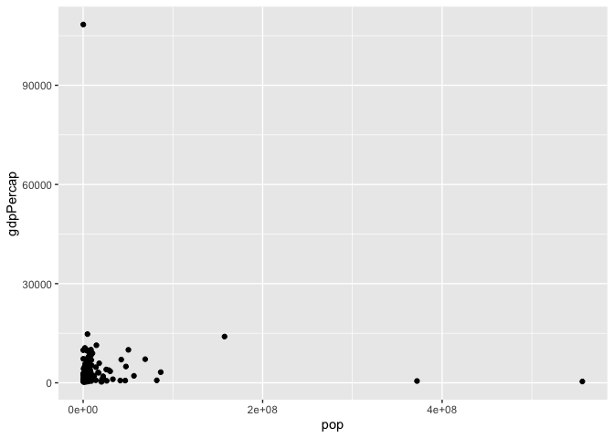<!-- -->

Great work on your first graph! Each point represents a country: can you
guess which country any of the points are?

## Comparing population and life expectancy

In this exercise, you’ll use `ggplot2` to create a scatter plot from
scratch, to compare each country’s population with its life expectancy
in the year 1952.

**Steps**

1.  Create a scatter plot of `gapminder_1952` with population (`pop`) is
    on the x-axis and life expectancy (`lifeExp`) on the y-axis.

``` r
# Create a scatter plot with pop on the x-axis and lifeExp on the y-axis
ggplot(gapminder_1952, aes(x = pop, y = lifeExp)) +
  geom_point()
```

<!-- -->

Great! You might notice the points are crowded towards the left side of
the plot, making them hard to distinguish. This next video will help
solve that problem.

## Log scales

Theory. Coming soon …

## Putting the x-axis on a log scale

You previously created a scatter plot with population on the x-axis and
life expectancy on the y-axis. Since population is spread over several
orders of magnitude, with some countries having a much higher population
than others, it’s a good idea to put the x-axis on a log scale.

**Steps**

1.  Change the existing scatter plot (code provided) to put the x-axis
    (representing population) on a log scale.

``` r
# Change this plot to put the x-axis on a log scale
ggplot(gapminder_1952, aes(x = pop, y = lifeExp)) +
  geom_point() + 
  scale_x_log10()
```

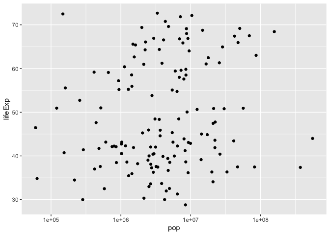<!-- -->

Great! Notice the points are more spread out on the x-axis. This makes
it easy to see that there isn’t a correlation between population and
life expectancy.

## Putting the x- and y- axes on a log scale

Suppose you want to create a scatter plot with population on the x-axis
and GDP per capita on the y-axis. Both population and GDP per-capita are
better represented with log scales, since they vary over many orders of
magnitude.

**Steps**

1.  Create a scatter plot with population (`pop`) on the x-axis and GDP
    per capita (`gdpPercap`) on the y-axis. Put **both** the x- and y-
    axes on a log scale.

``` r
# Scatter plot comparing pop and gdpPercap, with both axes on a log scale
ggplot(gapminder_1952, aes(x = pop, y = gdpPercap)) +
  geom_point() +
  scale_x_log10() + 
  scale_y_log10()
```

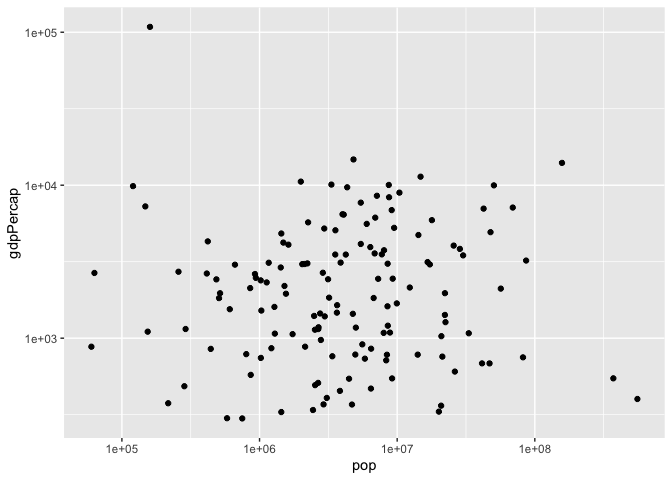<!-- -->

Great! Notice that the y-axis goes from 1e3 (1000) to 1e4 (10,000) to
1e5 (100,000) in equal increments.

## Additional aesthetics

Theory. Coming soon …

## Adding color to a scatter plot

In this lesson you learned how to use the color aesthetic, which can be
used to show which continent each point in a scatter plot represents.

**Steps**

1.  Create a scatter plot with population (`pop`) on the x-axis, life
    expectancy (`lifeExp`) on the y-axis, and with continent
    (`continent`) represented by the color of the points. Put the x-axis
    on a log scale.

``` r
# Scatter plot comparing pop and lifeExp, with color representing continent
ggplot(gapminder_1952, aes(x = pop, y = lifeExp, color = continent)) +
  geom_point() +
  scale_x_log10() +
  scale_y_log10()
```

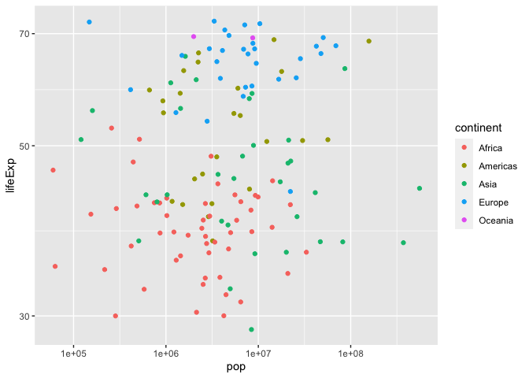<!-- -->

Good work! What differences can you see between continents, in terms of
their population and life expectancy?

## Adding size and color to a plot

In the last exercise, you created a scatter plot communicating
information about each country’s population, life expectancy, and
continent. Now you’ll use the size of the points to communicate even
more.

**Steps**

1.  Modify the scatter plot so that the size of the points represents
    each country’s GDP per capita (`gdpPercap`).

``` r
# Add the size aesthetic to represent a country's gdpPercap
ggplot(gapminder_1952, aes(x = pop, y = lifeExp, color = continent, size = gdpPercap)) +
  geom_point() +
  scale_x_log10()
```

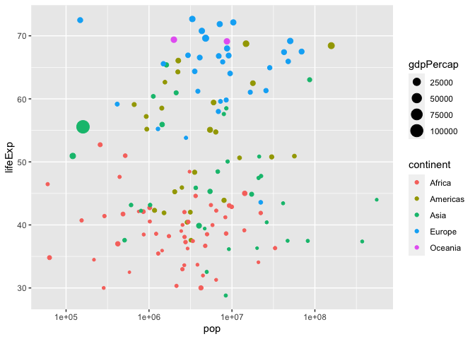<!-- -->

Good work! Are you able to guess which point represents your own
country?

## Faceting

Theory. Coming soon …

## Creating a subgraph for each continent

You’ve learned to use faceting to divide a graph into subplots based on
one of its variables, such as the continent.

**Steps**

1.  Create a scatter plot of `gapminder_1952` with the x-axis
    representing population (`pop`), the y-axis representing life
    expectancy (`lifeExp`), and faceted to have one subplot per
    continent (`continent`). Put the x-axis on a log scale.

``` r
# Scatter plot comparing pop and lifeExp, faceted by continent
ggplot(gapminder_1952, aes(x = pop, y = lifeExp)) +
  geom_point() + 
  scale_x_log10() + 
  facet_wrap(~ continent)
```

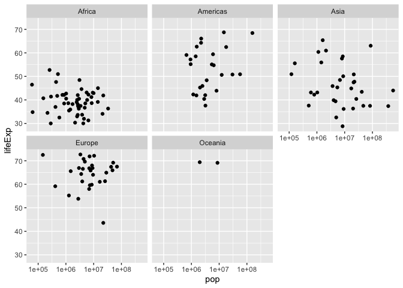<!-- -->

Great work! Faceting is a powerful way to understand subsets of your
data separately.

## Faceting by year

All of the graphs in this chapter have been visualizing statistics
within one year. Now that you’re able to use faceting, however, you can
create a graph showing **all** the country-level data from 1952 to 2007,
to understand how global statistics have changed over time.

**Steps**

1.  Create a scatter plot of the `gapminder` data:
2.  Put GDP per capita (`gdpPercap`) on the x-axis and life expectancy
    (`lifeExp`) on the y-axis, with continent (`continent`) represented
    by color and population (`pop`) represented by size.
3.  Put the x-axis on a log scale
4.  Facet by the `year` variable

``` r
# Scatter plot comparing gdpPercap and lifeExp, with color representing continent
# and size representing population, faceted by year
ggplot(gapminder, aes(x = gdpPercap, y = lifeExp, color = continent, size = pop)) + 
  geom_point() +
  scale_x_log10() + 
  facet_wrap(~ year)
```

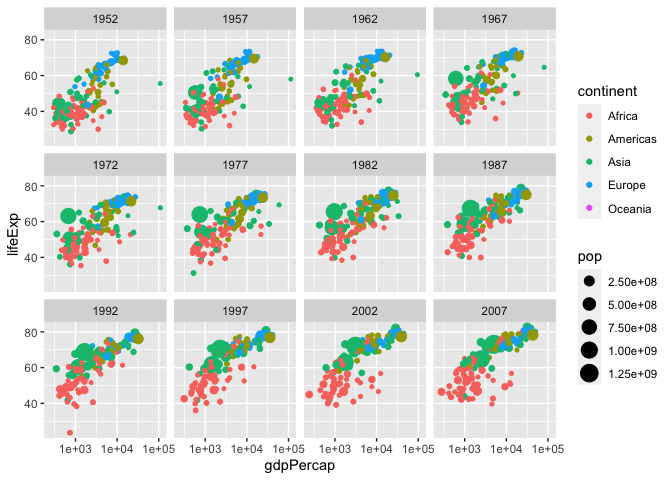<!-- -->

Awesome! That’s a lot of information you’re now able to share in one
graph.

# 3. Grouping and summarizing

So far you’ve been answering questions about individual country-year
pairs, but you may be interested in aggregations of the data, such as
the average life expectancy of all countries within each year. Here
you’ll learn to use the group by and summarize verbs, which collapse
large datasets into manageable summaries.

## The summarize verb

Theory. Coming soon …

## Summarizing the median life expectancy

You’ve seen how to find the mean life expectancy and the total
population across a set of observations, but `mean()` and `sum()` are
only two of the functions R provides for summarizing a collection of
numbers. Here, you’ll learn to use the `median()` function in
combination with `summarize()`.

By the way, `dplyr` displays some messages when it’s loaded that we’ve
been hiding so far. They’ll show up in red and start with:

``` r
`Attaching package: 'dplyr'

The following objects are masked from 'package:stats':
```

This will occur in future exercises each time you load `dplyr`: it’s
mentioning some built-in functions that are overwritten by `dplyr`. You
won’t need to worry about this message within this course.

**Steps**

1.  Use the `median()` function within a `summarize()` to find the
    median life expectancy. Save it into a column called
    `medianLifeExp`.

``` r
# Summarize to find the median life expectancy
gapminder %>% 
    summarize(medianLifeExp = median(lifeExp))
```

    ## # A tibble: 1 × 1
    ##   medianLifeExp
    ##           <dbl>
    ## 1          60.7

That’s right! Note that this is the median across all countries and all
years in the dataset.

## Summarizing the median life expectancy in 1957

Rather than summarizing the entire dataset, you may want to find the
median life expectancy for only one particular year. In this case,
you’ll find the median in the year 1957.

**Steps**

1.  Filter for the year 1957, then use the `median()` function within a
    `summarize()` to calculate the median life expectancy into a column
    called `medianLifeExp`.

``` r
# Filter for 1957 then summarize the median life expectancy
gapminder %>% 
  filter(year == 1957) %>%
  summarize(medianLifeExp = median(lifeExp))
```

    ## # A tibble: 1 × 1
    ##   medianLifeExp
    ##           <dbl>
    ## 1          48.4

Great! Just like in Chapter 1, this chapter will often involve
performing multiple `dplyr` steps in a row.

## Summarizing multiple variables in 1957

The `summarize()` verb allows you to summarize multiple variables at
once. In this case, you’ll use the `median()` function to find the
median life expectancy and the `max()` function to find the maximum GDP
per capita.

**Steps**

1.  Find both the median life expectancy (`lifeExp`) and the maximum GDP
    per capita (`gdpPercap`) in the year 1957, calling them
    `medianLifeExp` and `maxGdpPercap` respectively. You can use the
    `max()` function to find the maximum.

``` r
# Filter for 1957 then summarize the median life expectancy and the maximum GDP per capita
gapminder %>% 
  filter(year == 1957) %>%
  summarize(medianLifeExp = median(lifeExp), 
            maxGdpPercap  = max(gdpPercap))
```

    ## # A tibble: 1 × 2
    ##   medianLifeExp maxGdpPercap
    ##           <dbl>        <dbl>
    ## 1          48.4      113523.

That’s right! Think about what other kinds of information about
countries you might want to summarize within one year.

## The group_by verb

Theory. Coming soon …

## Summarizing by year

In a previous exercise, you found the median life expectancy and the
maximum GDP per capita in the year 1957. Now, you’ll perform those two
summaries within each year in the dataset, using the `group_by` verb.

**Steps**

1.  Find the median life expectancy (`lifeExp`) and maximum GDP per
    capita (`gdpPercap`) **within each year**, saving them into
    `medianLifeExp` and `maxGdpPercap`, respectively.

``` r
# Find median life expectancy and maximum GDP per capita in each year
gapminder %>% 
  group_by(year) %>%
  summarize(medianLifeExp = median(lifeExp), 
            maxGdpPercap  = max(gdpPercap))
```

    ## # A tibble: 12 × 3
    ##     year medianLifeExp maxGdpPercap
    ##    <int>         <dbl>        <dbl>
    ##  1  1952          45.1      108382.
    ##  2  1957          48.4      113523.
    ##  3  1962          50.9       95458.
    ##  4  1967          53.8       80895.
    ##  5  1972          56.5      109348.
    ##  6  1977          59.7       59265.
    ##  7  1982          62.4       33693.
    ##  8  1987          65.8       31541.
    ##  9  1992          67.7       34933.
    ## 10  1997          69.4       41283.
    ## 11  2002          70.8       44684.
    ## 12  2007          71.9       49357.

Great! Interesting: notice that median life expectancy across countries
is generally going up over time, but maximum GDP per capita is not.

## Summarizing by continent

You can group by any variable in your dataset to create a summary.
Rather than comparing across time, you might be interested in comparing
among continents. You’ll want to do that within one year of the dataset:
let’s use 1957.

**Steps**

1.  Filter the `gapminder` data for the year 1957. Then find the median
    life expectancy (`lifeExp`) and maximum GDP per capita (`gdpPercap`)
    **within each continent**, saving them into `medianLifeExp` and
    `maxGdpPercap`, respectively.

``` r
# Find median life expectancy and maximum GDP per capita in each continent in 1957
gapminder %>%
  filter(year == 1957) %>%
  group_by(continent) %>%
  summarize(medianLifeExp = median(lifeExp), 
            maxGdpPercap  = max(gdpPercap))
```

    ## # A tibble: 5 × 3
    ##   continent medianLifeExp maxGdpPercap
    ##   <fct>             <dbl>        <dbl>
    ## 1 Africa             40.6        5487.
    ## 2 Americas           56.1       14847.
    ## 3 Asia               48.3      113523.
    ## 4 Europe             67.6       17909.
    ## 5 Oceania            70.3       12247.

Great work! Which continent had the highest median life expectancy in
1957?

## Summarizing by continent and year

Instead of grouping just by year, or just by continent, you’ll now group
by both continent and year to summarize within each.

**Steps**

1.  Find the median life expectancy (`lifeExp`) and maximum GDP per
    capita (`gdpPercap`) **within each combination of continent and
    year**, saving them into `medianLifeExp` and `maxGdpPercap`,
    respectively.

``` r
# Find median life expectancy and maximum GDP per capita in each continent/year combination
gapminder %>%
  group_by(continent, year) %>%
  summarise(medianLifeExp = median(lifeExp),
            maxGdpPercap  = max(gdpPercap))
```

    ## `summarise()` has grouped output by 'continent'. You can override using the `.groups` argument.

    ## # A tibble: 60 × 4
    ## # Groups:   continent [5]
    ##    continent  year medianLifeExp maxGdpPercap
    ##    <fct>     <int>         <dbl>        <dbl>
    ##  1 Africa     1952          38.8        4725.
    ##  2 Africa     1957          40.6        5487.
    ##  3 Africa     1962          42.6        6757.
    ##  4 Africa     1967          44.7       18773.
    ##  5 Africa     1972          47.0       21011.
    ##  6 Africa     1977          49.3       21951.
    ##  7 Africa     1982          50.8       17364.
    ##  8 Africa     1987          51.6       11864.
    ##  9 Africa     1992          52.4       13522.
    ## 10 Africa     1997          52.8       14723.
    ## # … with 50 more rows

Excellent! In the next chapter, you’ll learn to turn this data into an
informative graph.

## Visualizing summarized data

Theory. Coming soon …

## Visualizing median life expectancy over time

In the last chapter, you summarized the gapminder data to calculate the
median life expectancy within each year. This code is provided for you,
and is saved (with `<-`) as the `by_year` dataset.

Now you can use the ggplot2 package to turn this into a visualization of
changing life expectancy over time.

**Steps**

1.  Use the `by_year` dataset to create a scatter plot showing the
    change of median life expectancy over time, with `year` on the
    x-axis and `medianLifeExp` on the y-axis. Be sure to add
    `expand_limits(y = 0)` to make sure the plot’s y-axis includes zero.

``` r
by_year <- gapminder %>%
  group_by(year) %>%
  summarize(medianLifeExp = median(lifeExp),
            maxGdpPercap = max(gdpPercap))

# Create a scatter plot showing the change in medianLifeExp over time
ggplot(by_year, aes(x = year, y = medianLifeExp)) +
  geom_point() +
  expand_limits(y = 0)
```

Great! It looks like median life expectancy across countries is
increasing over time.

## Visualizing median GDP per capita per continent over time

In the last exercise you were able to see how the median life expectancy
of countries changed over time. Now you’ll examine the median GDP per
capita instead, and see how the trend differs among continents.

**Steps**

1.  Summarize the gapminder dataset by continent and year, finding the
    median GDP per capita (`gdpPercap`) within each and putting it into
    a column called `medianGdpPercap`. Use the assignment operator \`
2.  Create a scatter plot showing the change in `medianGdpPercap` by
    continent over time. Use color to distinguish between continents,
    and be sure to add `expand_limits(y = 0)` so that the y-axis starts
    at zero.

``` r
# Summarize medianGdpPercap within each continent within each year: by_year_continent
by_year_continent <- gapminder %>%
  group_by(continent, year) %>%
  summarize(medianGdpPercap = median(gdpPercap))

# Plot the change in medianGdpPercap in each continent over time
ggplot(by_year_continent, aes(x = year, y = medianGdpPercap, color = continent)) +
  geom_point() +
  expand_limits(y = 0)
```

Great! You might be wondering how you can connect these points with
lines. You’ll learn that in Chapter 4!

## Comparing median life expectancy and median GDP per continent in 2007

In these exercises you’ve generally created plots that show change over
time. But as another way of exploring your data visually, you can also
use ggplot2 to plot summarized data to compare continents within a
single year.

**Steps**

1.  Filter the gapminder dataset for the year 2007, then summarize the
    median GDP per capita and the median life expectancy **within each
    continent**, into columns called `medianLifeExp` and
    `medianGdpPercap`. Save this as `by_continent_2007`.
2.  Use the `by_continent_2007` data to create a scatterplot comparing
    these summary statistics for continents in 2007, putting the median
    GDP per capita on the x-axis to the median life expectancy on the
    y-axis. Color the scatter plot by `continent`. You don’t need to add
    `expand_limits(y = 0)` for this plot.

``` r
# Summarize the median GDP and median life expectancy per continent in 2007
by_continent_2007 <- gapminder %>%
  filter(year == 2007) %>%
  group_by(continent) %>%
  summarize(medianGdpPercap = median(gdpPercap),
            medianLifeExp = median(lifeExp))

# Use a scatter plot to compare the median GDP and median life expectancy
ggplot(by_continent_2007, aes(x = medianGdpPercap, y = medianLifeExp, color = continent)) +
  geom_point()
```

Great work! Scatter plots are a very flexible tool for examining
relationships.

# 4. Types of visualizations

In this chapter, you’ll learn how to create line plots, bar plots,
histograms, and boxplots. You’ll see how each plot requires different
methods of data manipulation and preparation, and you’ll understand how
each of these plot types plays a different role in data analysis.

## Line plots

Theory. Coming soon …

## Visualizing median GDP per capita over time

A line plot is useful for visualizing trends over time. In this
exercise, you’ll examine how the median GDP per capita has changed over
time.

**Steps**

1.  Use `group_by()` and `summarize()` to find the median GDP per capita
    **within each year**, calling the output column `medianGdpPercap`.
    Use the assignment operator \`
2.  Use the `by_year` dataset to create a line plot showing the change
    in median GDP per capita over time. **Be sure** to use
    `expand_limits(y = 0)` to include 0 on the y-axis.

``` r
# Summarize the median gdpPercap by year, then save it as by_year
by_year <- gapminder %>%
  group_by(year) %>%
  summarize(medianGdpPercap = median(gdpPercap))

# Create a line plot showing the change in medianGdpPercap over time
ggplot(by_year, aes(x = year, y = medianGdpPercap)) +
  geom_line() +
  expand_limits(y = 0)
```

<!-- -->

Great! Looks like median GDP per capita across countries has gone up
over time.

## Visualizing median GDP per capita per continent over time

In the last exercise you were able to see how the median life expectancy
of countries changed over time. Now you’ll examine the median GDP per
capita instead, and see how the trend differs among continents.

**Steps**

1.  Summarize the gapminder dataset by continent and year, finding the
    median GDP per capita (`gdpPercap`) within each and putting it into
    a column called `medianGdpPercap`. Use the assignment operator `<-`
    to save this summarized data as `by_year_continent`.
2.  Create a scatter plot showing the change in `medianGdpPercap` by
    continent over time. Use color to distinguish between continents,
    and be sure to add `expand_limits(y = 0)` so that the y-axis starts
    at zero.

``` r
# Summarize medianGdpPercap within each continent within each year: by_year_continent
by_year_continent <- gapminder %>%
  group_by(continent, year) %>%
  summarize(medianGdpPercap = median(gdpPercap))
```

    ## `summarise()` has grouped output by 'continent'. You can override using the `.groups` argument.

``` r
# Plot the change in medianGdpPercap in each continent over time
ggplot(by_year_continent, aes(x = year, y = medianGdpPercap, color = continent)) + 
  geom_point() + 
  expand_limits(y = 0)
```

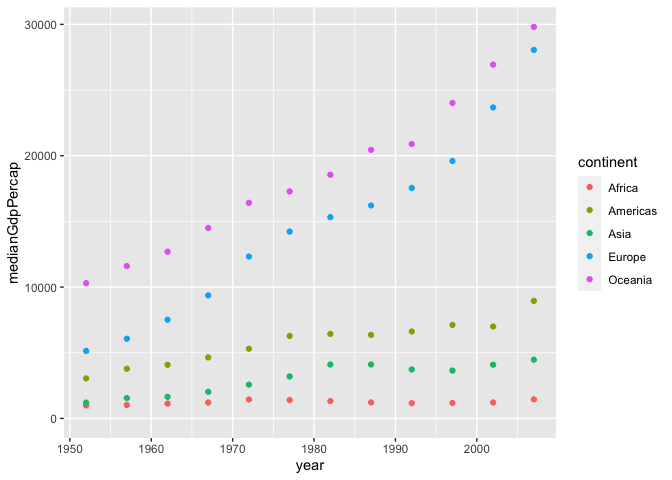<!-- -->

Excellent work! Take a look at the plot: did the growth in median GDP
per capita differ between continents?

## Comparing median life expectancy and median GDP per continent in 2007

In these exercises you’ve generally created plots that show change over
time. But as another way of exploring your data visually, you can also
use ggplot2 to plot summarized data to compare continents within a
single year.

**Steps**

-   Filter the gapminder dataset for the year 2007, then summarize the
    median GDP per capita and the median life expectancy **within each
    continent**, into columns called `medianLifeExp` and
    `medianGdpPercap`. Save this as `by_continent_2007`.
-   Use the `by_continent_2007` data to create a scatterplot comparing
    these summary statistics for continents in 2007, putting the median
    GDP per capita on the x-axis to the median life expectancy on the
    y-axis. Color the scatter plot by `continent`. You don’t need to add
    `expand_limits(y = 0)` for this plot.

``` r
# Summarize the median GDP and median life expectancy per continent in 2007
by_continent_2007 <- gapminder %>% 
  filter(year == 2007) %>%
  group_by(continent) %>%
  summarize(medianLifeExp = median(lifeExp), medianGdpPercap = median(gdpPercap))

# Use a scatter plot to compare the median GDP and median life expectancy
ggplot(by_continent_2007, aes(x = medianGdpPercap, y = medianLifeExp, color = continent)) + 
  geom_point() + 
  expand_limits(y = 0)
```

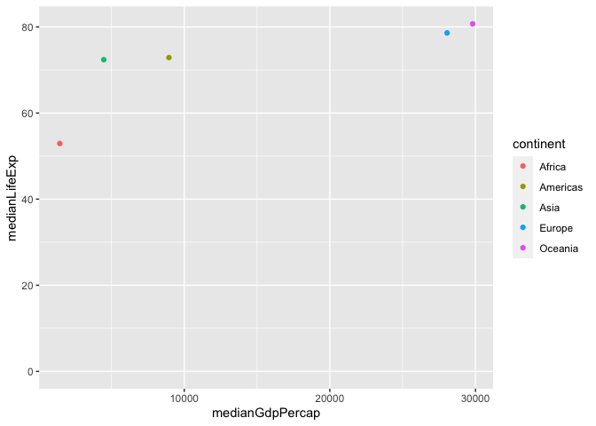<!-- -->

## Visualizing median GDP per capita over time

A line plot is useful for visualizing trends over time. In this
exercise, you’ll examine how the median GDP per capita has changed over
time.

**Steps**

-   Use `group_by()` and `summarize()` to find the median GDP per capita
    **within each year**, calling the output column `medianGdpPercap`.
    Use the assignment operator `<-` to save it to a dataset called
    `by_year`.
-   Use the `by_year` dataset to create a line plot showing the change
    in median GDP per capita over time. **Be sure** to use
    `expand_limits(y = 0)` to include 0 on the y-axis.

``` r
# Summarize the median gdpPercap by year, then save it as by_year
by_year <- gapminder %>%
  group_by(year) %>%
  summarize(medianGdpPercap = median(gdpPercap))

# Create a line plot showing the change in medianGdpPercap over time
ggplot(by_year, aes(x = year, y = medianGdpPercap)) +
  geom_line() +
  expand_limits(y = 0)
```

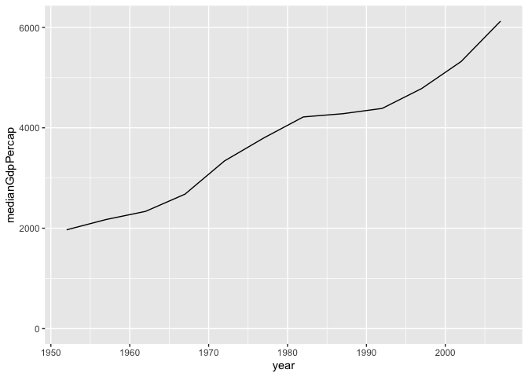<!-- -->

## Visualizing median GDP per capita by continent over time

In the last exercise you used a line plot to visualize the increase in
median GDP per capita over time. Now you’ll examine the change within
each continent.

**Steps**

-   Use `group_by()` and `summarize()` to find the median GDP per capita
    **within each year and continent**, calling the output column
    `medianGdpPercap`. Use the assignment operator `<-` to save it to a
    dataset called `by_year_continent`.
-   Use the `by_year_continent` dataset to create a line plot showing
    the change in median GDP per capita over time, with color
    representing continent. **Be sure** to use `expand_limits(y = 0)` to
    include 0 on the y-axis.

``` r
# Summarize the median gdpPercap by year & continent, save as by_year_continent
by_year_continent <- gapminder %>%
  group_by(year, continent) %>%
  summarize(medianGdpPercap = median(gdpPercap))
```

    ## `summarise()` has grouped output by 'year'. You can override using the `.groups` argument.

``` r
# Create a line plot showing the change in medianGdpPercap by continent over time
ggplot(by_year_continent, aes(x = year, y = medianGdpPercap, color = continent)) +
  geom_line() +
  expand_limits(y = 0)
```

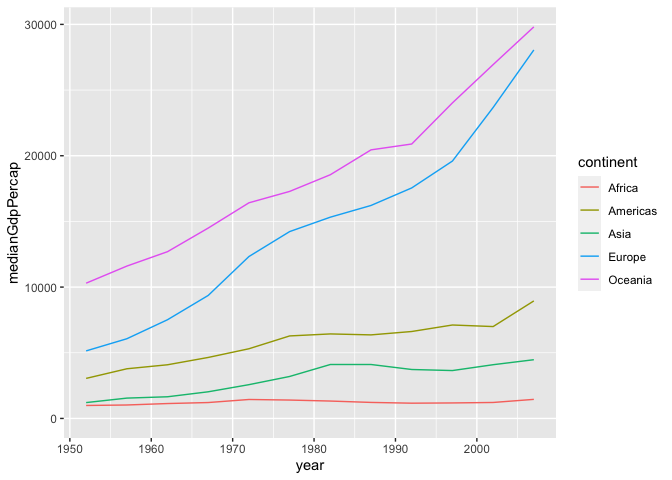<!-- -->

Excellent work! Take a look at the plot: did the growth in median GDP
per capita differ between continents?

## Bar plots

Theory. Coming soon …

## Visualizing median GDP per capita by continent

A bar plot is useful for visualizing summary statistics, such as the
median GDP in each continent.

**Steps**

1.  Use `group_by()` and `summarize()` to find the median GDP per capita
    **within each continent** in the year 1952, calling the output
    column `medianGdpPercap`. Use the assignment operator `<-` to save
    it to a dataset called `by_continent`.
2.  Use the `by_continent` dataset to create a bar plot showing the
    median GDP per capita in each continent.

``` r
# Summarize the median gdpPercap by year and continent in 1952
by_continent <- gapminder %>%
  filter(year == 1952) %>%
  group_by(continent) %>%
  summarize(medianGdpPercap = median(gdpPercap))

# Create a bar plot showing medianGdp by continent
ggplot(by_continent, aes(x = continent, y = medianGdpPercap)) + 
  geom_col()
```

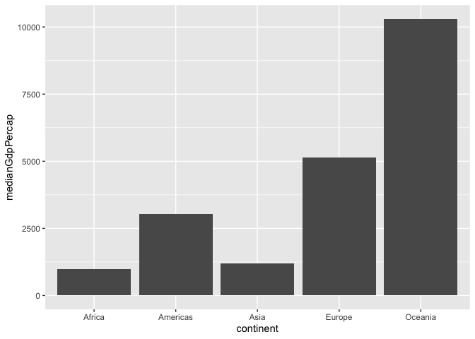<!-- -->

Excellent! That’s three kinds of plots you’re now able to make with
ggplot2.

## Visualizing GDP per capita by country in Oceania

You’ve created a plot where each bar represents one continent, showing
the median GDP per capita for each. But the x-axis of the bar plot
doesn’t have to be the continent: you can instead create a bar plot
where each bar represents a country.

In this exercise, you’ll create a bar plot comparing the GDP per capita
between the two countries in the Oceania continent (Australia and New
Zealand).

**Steps**

1.  Filter for observations in the **Oceania** continent in the
    year 1952. Save this as `oceania_1952`.
2.  Use the `oceania_1952` dataset to create a bar plot, with country on
    the x-axis and `gdpPercap` on the y-axis.

``` r
# Filter for observations in the Oceania continent in 1952
oceania_1952 <- gapminder %>%
  filter(year == 1952, continent == "Oceania")
  
# Create a bar plot of gdpPercap by country
ggplot(oceania_1952, aes(x = country, y = gdpPercap)) +
  geom_col()
```

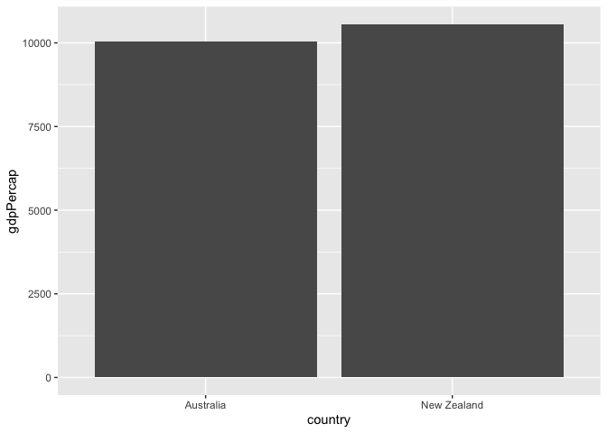<!-- -->

Good work! Looks like the GDP per capita of these two countries was
similar in 1952.

## Histograms

Theory. Coming soon …

## Visualizing population

A histogram is useful for examining the distribution of a numeric
variable. In this exercise, you’ll create a histogram showing the
distribution of country populations (by millions) in the year 1952.

Code for generating this dataset, `gapminder_1952`, is provided.

**Steps**

1.  Use the `gapminder_1952` dataset to create a histogram of country
    population (`pop_by_mil`) in the year 1952. Inside the histogram
    geom, set the number of `bins` to `50`.

``` r
gapminder_1952 <- gapminder %>%
  filter(year == 1952) %>%
  mutate(pop_by_mil = pop / 1000000)

# Create a histogram of population (pop_by_mil)
ggplot(gapminder_1952, aes(x = pop_by_mil)) +
  geom_histogram(bins = 50)
```

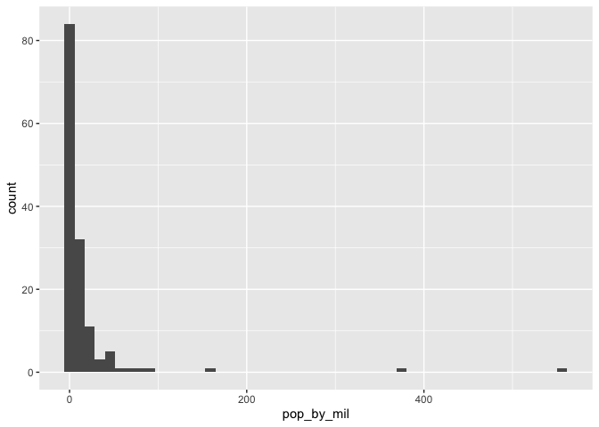<!-- -->

That’s right! Notice that most of the distribution is in the smallest
(leftmost) bins. In the next exercise you’ll put the x-axis on a log
scale.

## Visualizing population with x-axis on a log scale

In the last exercise you created a histogram of populations across
countries. You might have noticed that there were several countries with
a much higher population than others, which causes the distribution to
be very skewed, with most of the distribution crammed into a small part
of the graph. (Consider that it’s hard to tell the median or the minimum
population from that histogram).

To make the histogram more informative, you can try putting the x-axis
on a log scale.

**Steps**

1.  Use the `gapminder_1952` dataset (code is provided) to create a
    histogram of country population (`pop`) in the year 1952, putting
    the x-axis on a log scale with `scale_x_log10()`.

``` r
gapminder_1952 <- gapminder %>%
  filter(year == 1952)

# Create a histogram of population (pop), with x on a log scale
ggplot(gapminder_1952, aes(x = pop)) +
  geom_histogram() +
  scale_x_log10()
```

    ## `stat_bin()` using `bins = 30`. Pick better value with `binwidth`.

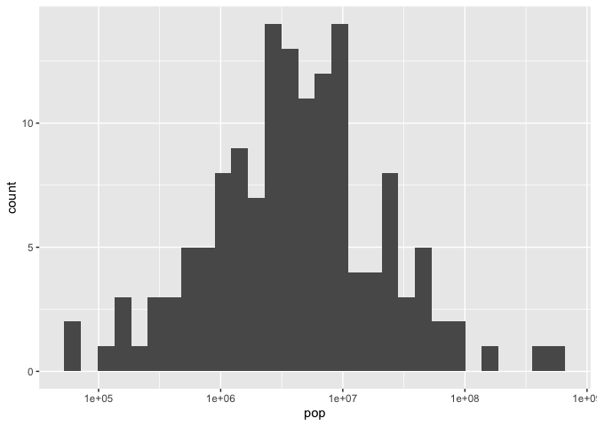<!-- -->

Great! Notice that on a log scale, the distribution of country
populations is approximately symmetrical.

## Boxplots

Theory. Coming soon …

## Comparing GDP per capita across continents

A boxplot is useful for comparing a distribution of values across
several groups. In this exercise, you’ll examine the distribution of GDP
per capita by continent. Since GDP per capita varies across several
orders of magnitude, you’ll need to put the y-axis on a log scale.

**Steps**

1.  Use the `gapminder_1952` dataset (code is provided) to create a
    boxplot comparing GDP per capita (`gdpPercap`) among continents. Put
    the y-axis on a log scale with `scale_y_log10()`.

``` r
# Create a boxplot comparing gdpPercap among continents
ggplot(gapminder_1952, aes(x = continent, y = gdpPercap)) +
  geom_boxplot() +
  scale_y_log10()
```

<!-- -->

Looks good! What continents had countries with the highest GDP per
capita?

## Adding a title to your graph

There are many other options for customizing a `ggplot2` graph, which
you can learn about in other DataCamp courses. You can also learn about
them from online resources, which is an important skill to develop.

As the final exercise in this course, you’ll practice looking up
`ggplot2` instructions by completing a task we haven’t shown you how to
do.

**Steps**

1.  Add a title to the graph: **Comparing GDP per capita across
    continents**. Use a search engine, such as Google or Bing, to learn
    how to do so.
2.  After this exercise you are almost done with your course. If you
    enjoyed the material, feel free to send Dave a thank you via
    twitter. He’ll appreciate it.
    <a href="http://twitter.com/home?status=Thoroughly%20enjoyed%20the%20Introduction%20to%20the%20Tidyverse%20course%20%40DataCamp%20by%20%40drob.%20Great%20instructor!%20https%3A%2F%2Fbit.ly%2F2AmGt3t%0A" target="_blank" rel="noopener noreferrer">Tweet
    to Dave</a>

``` r
# Add a title to this graph: "Comparing GDP per capita across continents"
ggplot(gapminder_1952, aes(x = continent, y = gdpPercap)) +
  geom_boxplot() +
  scale_y_log10() +
  ggtitle("Comparing GDP per capita across continents")
```

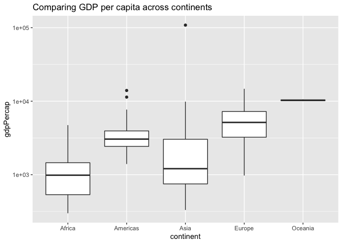<!-- -->

Brilliant! Now you know how to look up additional methods for
customizing graphs. That will be very useful in your career as an R
user!<br><br><i> Don’t forget to download the
<a href='https://datacamp-community-prod.s3.amazonaws.com/c1fae72f-d2d7-4646-9dce-dd0f8fb5c5e8'>Cheat
Sheet</a> for this course to keep track of what you’ve learned today!
<i>
