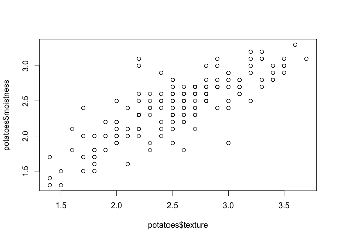

Introduction to Importing Data in R
================
Joschka Schwarz

-   [1. Importing data from flat files with
    utils](#1-importing-data-from-flat-files-with-utils)
    -   [Introduction & read.csv](#introduction--readcsv)
    -   [read.csv](#readcsv)
    -   [stringsAsFactors](#stringsasfactors)
    -   [Any changes?](#any-changes)
    -   [read.delim & read.table](#readdelim--readtable)
    -   [read.delim](#readdelim)
    -   [read.table](#readtable)
    -   [Arguments](#arguments)
    -   [Column classes](#column-classes)
-   [2. readr & data.table](#2-readr--datatable)
    -   [read_csv](#read_csv)
    -   [read_tsv](#read_tsv)
    -   [readr: read_delim](#readr-read_delim)
    -   [read_delim](#read_delim)
    -   [skip and n_max](#skip-and-n_max)
    -   [col_types](#col_types)
    -   [col_types with collectors](#col_types-with-collectors)
    -   [fread](#fread)
    -   [fread: more advanced use](#fread-more-advanced-use)
    -   [Dedicated classes](#dedicated-classes)
-   [3. Importing Excel data](#3-importing-excel-data)
    -   [readxl (1)](#readxl-1)
    -   [List the sheets of an Excel
        file](#list-the-sheets-of-an-excel-file)
    -   [Import an Excel sheet](#import-an-excel-sheet)
    -   [Reading a workbook](#reading-a-workbook)
    -   [readxl (2)](#readxl-2)
    -   [The col_names argument](#the-col_names-argument)
    -   [The skip argument](#the-skip-argument)
    -   [gdata](#gdata)
    -   [Import a local file](#import-a-local-file)
    -   [read.xls() wraps around
        read.table()](#readxls-wraps-around-readtable)
    -   [Work that Excel data!](#work-that-excel-data)
-   [4. Reproducible Excel work with
    XLConnect](#4-reproducible-excel-work-with-xlconnect)
    -   [Reading sheets](#reading-sheets)
    -   [Connect to a workbook](#connect-to-a-workbook)
    -   [List and read Excel sheets](#list-and-read-excel-sheets)
    -   [Customize readWorksheet](#customize-readworksheet)
    -   [Adapting sheets](#adapting-sheets)
    -   [Add worksheet](#add-worksheet)
    -   [Populate worksheet](#populate-worksheet)
    -   [Renaming sheets](#renaming-sheets)
    -   [Removing sheets](#removing-sheets)

**Short Description**

Learn to read .xls, .csv, and text files in R using readxl and gdata,
before learning how to use readr and data.table packages to import flat
file data.

**Long Description**

Importing data into R should be the easiest step in your analysis.
Unfortunately, that is almost never the case. Data can come in many
formats, ranging from .csv and text files, to statistical software
files, to databases and HTML data. Knowing which approach to use is key
to getting started with the actual analysis.this course, you’ll start by
learning how to read .csv and text files in R. You will then cover the
readr and data.table packages to easily and efficiently import flat file
data. After that, you will learn how to read .xls files in R using
readxl and gdata.

# 1. Importing data from flat files with utils

A lot of data comes in the form of flat files: simple tabular text
files. Learn how to import the common formats of flat file data with
base R functions.

## Introduction & read.csv

Theory. Coming soon …

## read.csv

The `utils` package, which is automatically loaded in your R session on
startup, can import CSV files with the
<a href="http://www.rdocumentation.org/packages/utils/functions/read.table" target="_blank" rel="noopener noreferrer">`read.csv()`</a>
function.

In this exercise, you’ll be working with
<a href="http://s3.amazonaws.com/assets.datacamp.com/production/course_1477/datasets/swimming_pools.csv" target="_blank" rel="noopener noreferrer">`swimming_pools.csv`</a>;
it contains data on swimming pools in Brisbane, Australia (Source:
<a href="https://data.gov.au/dataset/swimming-pools-brisbane-city-council" target="_blank" rel="noopener noreferrer">data.gov.au</a>).
The file contains the column names in the first row. It uses a comma to
separate values within rows.

Type
<a href="http://www.rdocumentation.org/packages/base/functions/list.files" target="_blank" rel="noopener noreferrer">`dir()`</a>
in the console to list the files in your working directory. You’ll see
that it contains `swimming_pools.csv`, so you can start straight away.

**Steps**

1.  Use
    <a href="http://www.rdocumentation.org/packages/utils/functions/read.table" target="_blank" rel="noopener noreferrer">`read.csv()`</a>
    to import `"swimming_pools.csv"` as a data frame with the name
    `pools`.
2.  Print the structure of `pools` using
    <a href="http://www.rdocumentation.org/packages/utils/functions/str" target="_blank" rel="noopener noreferrer">`str()`</a>.

``` r
# Import swimming_pools.csv: pools
pools <- read.csv("data/swimming_pools.csv")

# Print the structure of pools
str(pools)
```

    ## 'data.frame':    20 obs. of  4 variables:
    ##  $ Name     : chr  "Acacia Ridge Leisure Centre" "Bellbowrie Pool" "Carole Park" "Centenary Pool (inner City)" ...
    ##  $ Address  : chr  "1391 Beaudesert Road, Acacia Ridge" "Sugarwood Street, Bellbowrie" "Cnr Boundary Road and Waterford Road Wacol" "400 Gregory Terrace, Spring Hill" ...
    ##  $ Latitude : num  -27.6 -27.6 -27.6 -27.5 -27.4 ...
    ##  $ Longitude: num  153 153 153 153 153 ...

## stringsAsFactors

With `stringsAsFactors`, you can tell R whether it should convert
strings in the flat file to factors.

For all importing functions in the `utils` package, this argument is
`TRUE`, which means that you import strings as factors. This only makes
sense if the strings you import represent categorical variables in R. If
you set `stringsAsFactors` to `FALSE`, the data frame columns
corresponding to strings in your text file will be `character`.

You’ll again be working with the
<a href="http://s3.amazonaws.com/assets.datacamp.com/production/course_1477/datasets/swimming_pools.csv" target="_blank" rel="noopener noreferrer">`swimming_pools.csv`</a>
file. It contains two columns (`Name` and `Address`), which shouldn’t be
factors.

**Steps**

1.  Use `read.csv()` to import the data in
    <a href="http://s3.amazonaws.com/assets.datacamp.com/production/course_1477/datasets/swimming_pools.csv" target="_blank" rel="noopener noreferrer">`"swimming_pools.csv"`</a>
    as a data frame called `pools`; make sure that strings are imported
    as characters, not as factors.
2.  Using
    <a href="http://www.rdocumentation.org/packages/utils/functions/str" target="_blank" rel="noopener noreferrer">`str()`</a>,
    display the structure of the dataset and check that you indeed get
    character vectors instead of factors.

``` r
# Import swimming_pools.csv correctly: pools
pools <- read.csv("data/swimming_pools.csv", stringsAsFactors = F)

# Check the structure of pools
str(pools)
```

    ## 'data.frame':    20 obs. of  4 variables:
    ##  $ Name     : chr  "Acacia Ridge Leisure Centre" "Bellbowrie Pool" "Carole Park" "Centenary Pool (inner City)" ...
    ##  $ Address  : chr  "1391 Beaudesert Road, Acacia Ridge" "Sugarwood Street, Bellbowrie" "Cnr Boundary Road and Waterford Road Wacol" "400 Gregory Terrace, Spring Hill" ...
    ##  $ Latitude : num  -27.6 -27.6 -27.6 -27.5 -27.4 ...
    ##  $ Longitude: num  153 153 153 153 153 ...

## Any changes?

Consider the code below that loads data from `swimming_pools.csv` in two
distinct ways:

``` r
# Option A
pools <- read.csv("swimming_pools.csv", stringsAsFactors = TRUE)

# Option B
pools <- read.csv("swimming_pools.csv", stringsAsFactors = FALSE)
```

> ## *Question*
>
> How many variables in the resulting `pools` data frame have different
> types if you specify the `stringsAsFactors` argument differently?<br>
> <br> ⬜ Just one: `Name`.<br> ✅ Two variables: `Name` and
> `Address`.<br> ⬜ Three columns: all but `Longitude`.<br> ⬜ All four
> of them!<br>

## read.delim & read.table

Theory. Coming soon …

## read.delim

Aside from `.csv` files, there are also the `.txt` files which are
basically text files. You can import these functions with
<a href="http://www.rdocumentation.org/packages/utils/functions/read.table" target="_blank" rel="noopener noreferrer">`read.delim()`</a>.
By default, it sets the `sep` argument to `"\t"` (fields in a record are
delimited by tabs) and the `header` argument to `TRUE` (the first row
contains the field names).

In this exercise, you will import
<a href="http://s3.amazonaws.com/assets.datacamp.com/production/course_1477/datasets/hotdogs.txt" target="_blank" rel="noopener noreferrer">`hotdogs.txt`</a>,
containing information on sodium and calorie levels in different hotdogs
(Source:
<a href="http://wiki.stat.ucla.edu/socr/index.php/SOCR_012708_ID_Data_HotDogs" target="_blank" rel="noopener noreferrer">UCLA</a>).
The dataset has 3 variables, but the variable names are *not* available
in the first line of the file. The file uses tabs as field separators.

**Steps**

1.  Import the data in `"hotdogs.txt"` with
    <a href="http://www.rdocumentation.org/packages/utils/functions/read.table" target="_blank" rel="noopener noreferrer">`read.delim()`</a>.
    Call the resulting data frame `hotdogs`. The variable names are
    **not** on the first line, so make sure to set the `header` argument
    appropriately.
2.  Call
    <a href="http://www.rdocumentation.org/packages/base/functions/summary" target="_blank" rel="noopener noreferrer">`summary()`</a>
    on `hotdogs`. This will print out some summary statistics about all
    variables in the data frame.

``` r
# Import hotdogs.txt: hotdogs
hotdogs <- read.delim("data/hotdogs.txt", header = F)

# Summarize hotdogs
summary(hotdogs)
```

    ##       V1                  V2              V3       
    ##  Length:54          Min.   : 86.0   Min.   :144.0  
    ##  Class :character   1st Qu.:132.0   1st Qu.:362.5  
    ##  Mode  :character   Median :145.0   Median :405.0  
    ##                     Mean   :145.4   Mean   :424.8  
    ##                     3rd Qu.:172.8   3rd Qu.:503.5  
    ##                     Max.   :195.0   Max.   :645.0

## read.table

If you’re dealing with more exotic flat file formats, you’ll want to use
<a href="http://www.rdocumentation.org/packages/utils/functions/read.table" target="_blank" rel="noopener noreferrer">`read.table()`</a>.
It’s the most basic importing function; you can specify tons of
different arguments in this function. Unlike
<a href="http://www.rdocumentation.org/packages/utils/functions/read.table" target="_blank" rel="noopener noreferrer">`read.csv()`</a>
and
<a href="http://www.rdocumentation.org/packages/utils/functions/read.table" target="_blank" rel="noopener noreferrer">`read.delim()`</a>,
the `header` argument defaults to `FALSE` and the `sep` argument is `""`
by default.

Up to you again! The data is still
<a href="http://s3.amazonaws.com/assets.datacamp.com/production/course_1477/datasets/hotdogs.txt" target="_blank" rel="noopener noreferrer">`hotdogs.txt`</a>.
It has no column names in the first row, and the field separators are
tabs. This time, though, the file is in the `data` folder inside your
current working directory. A variable `path` with the location of this
file is already coded for you.

**Steps**

1.  Finish the `read.table()` call that’s been prepared for you. Use the
    `path` variable, and make sure to set `sep` correctly.
2.  Call `head()` on `hotdogs`; this will print the first 6 observations
    in the data frame.

``` r
# Path to the hotdogs.txt file: path
path <- file.path("data", "hotdogs.txt")

# Import the hotdogs.txt file: hotdogs
hotdogs <- read.table(path, 
                      sep = "\t", 
                      col.names = c("type", "calories", "sodium"))

# Call head() on hotdogs
head(hotdogs)
```

    ##   type calories sodium
    ## 1 Beef      186    495
    ## 2 Beef      181    477
    ## 3 Beef      176    425
    ## 4 Beef      149    322
    ## 5 Beef      184    482
    ## 6 Beef      190    587

Great! No need to specify the `header` argument: it is `FALSE` by
default for `read.table()`, which is exactly what you want here.

## Arguments

Lily and Tom are having an argument because they want to share a hot dog
but they can’t seem to agree on which one to choose. After some time,
they simply decide that they will have one each. Lily wants to have the
one with the fewest calories while Tom wants to have the one with the
most sodium.

Next to `calories` and `sodium`, the hotdogs have one more variable:
`type`. This can be one of three things: `Beef`, `Meat`, or `Poultry`,
so a categorical variable: a factor is fine.

**Steps**

1.  Finish the `read.delim()` call to import the data in
    <a href="http://s3.amazonaws.com/assets.datacamp.com/production/course_1477/datasets/hotdogs.txt" target="_blank" rel="noopener noreferrer">`"hotdogs.txt"`</a>.
    It’s a tab-delimited file without names in the first row.
2.  The code that selects the observation with the lowest calorie count
    and stores it in the variable `lily` is already available. It uses
    the function
    <a href="http://www.rdocumentation.org/packages/base/functions/which.min" target="_blank" rel="noopener noreferrer">`which.min()`</a>,
    that returns the index the smallest value in a vector.
3.  Do a similar thing for Tom: select the observation with the *most
    sodium* and store it in `tom`. Use
    <a href="http://www.rdocumentation.org/packages/base/functions/which.min" target="_blank" rel="noopener noreferrer">`which.max()`</a>
    this time.
4.  Finally, print both the observations `lily` and `tom`.

``` r
# Finish the read.delim() call
hotdogs <- read.delim("data/hotdogs.txt", header = F, col.names = c("type", "calories", "sodium"))

# Select the hot dog with the least calories: lily
lily <- hotdogs[which.min(hotdogs$calories), ]

# Select the observation with the most sodium: tom
tom <- hotdogs[which.max(hotdogs$sodium),]

# Print lily and tom
lily
```

    ##       type calories sodium
    ## 50 Poultry       86    358

``` r
tom
```

    ##    type calories sodium
    ## 15 Beef      190    645

## Column classes

Next to column names, you can also specify the column types or column
classes of the resulting data frame. You can do this by setting the
`colClasses` argument to a vector of strings representing classes:

``` r
read.delim("data/my_file.txt", 
           colClasses = c("character",
                          "numeric",
                          "logical"))
```

This approach can be useful if you have some columns that should be
factors and others that should be characters. You don’t have to bother
with `stringsAsFactors` anymore; just state for each column what the
class should be.

If a column is set to `"NULL"` in the `colClasses` vector, this column
will be skipped and will not be loaded into the data frame.

**Steps**

1.  The `read.delim()` call from before is already included and creates
    the `hotdogs` data frame. Go ahead and display the structure of
    `hotdogs`.
2.  **Edit** the second
    <a href="http://www.rdocumentation.org/packages/utils/functions/read.table" target="_blank" rel="noopener noreferrer">`read.delim()`</a>
    call. Assign the correct vector to the `colClasses` argument. `NA`
    should be replaced with a character vector:
    `c("factor", "NULL", "numeric")`.
3.  Display the structure of `hotdogs2` and look for the difference.

``` r
# Previous call to import hotdogs.txt
hotdogs <- read.delim("data/hotdogs.txt", header = FALSE, col.names = c("type", "calories", "sodium"))

# Display structure of hotdogs
str(hotdogs)
```

    ## 'data.frame':    54 obs. of  3 variables:
    ##  $ type    : chr  "Beef" "Beef" "Beef" "Beef" ...
    ##  $ calories: int  186 181 176 149 184 190 158 139 175 148 ...
    ##  $ sodium  : int  495 477 425 322 482 587 370 322 479 375 ...

``` r
# Edit the colClasses argument to import the data correctly: hotdogs2
hotdogs2 <- read.delim("hotdogs.txt", header = FALSE, 
                       col.names = c("type", "calories", "sodium"),
                       colClasses = c("factor", "NULL", "numeric"))


# Display structure of hotdogs2
str(hotdogs2)
```

# 2. readr & data.table

In addition to base R, there are dedicated packages to easily and
efficiently import flat file data. We’ll talk about two such packages:
readr and data.table.

## read_csv

CSV files can be imported with
<a href="http://www.rdocumentation.org/packages/readr/versions/1.0.0/topics/read_delim" target="_blank" rel="noopener noreferrer">`read_csv()`</a>.
It’s a wrapper function around
<a href="http://www.rdocumentation.org/packages/readr/versions/1.0.0/topics/read_delim" target="_blank" rel="noopener noreferrer">`read_delim()`</a>
that handles all the details for you. For example, it will assume that
the first row contains the column names.

The dataset you’ll be working with here is
<a href="http://s3.amazonaws.com/assets.datacamp.com/production/course_1477/datasets/potatoes.csv" target="_blank" rel="noopener noreferrer">`potatoes.csv`</a>.
It gives information on the impact of storage period and cooking on
potatoes’ flavor. It uses commas to delimit fields in a record, and
contains column names in the first row. The file is available in your
workspace. Remember that you can inspect your workspace with `dir()`.

**Steps**

1.  Load the `readr` package with
    <a href="http://www.rdocumentation.org/packages/base/functions/library" target="_blank" rel="noopener noreferrer">`library()`</a>.
    You **do not** need to install the package, it is already installed
    on DataCamp’s servers.
2.  Import `"potatoes.csv"` using `read_csv()`. Assign the resulting
    data frame to the variable `potatoes`.

``` r
# Load the readr package
library(readr)

# Import potatoes.csv with read_csv(): potatoes
potatoes <- read_csv("data/potatoes.csv")
```

    ## Rows: 160 Columns: 8

    ## ── Column specification ────────────────────────────────────────────────────────
    ## Delimiter: ","
    ## dbl (8): area, temp, size, storage, method, texture, flavor, moistness

    ## 
    ## ℹ Use `spec()` to retrieve the full column specification for this data.
    ## ℹ Specify the column types or set `show_col_types = FALSE` to quiet this message.

## read_tsv

Where you use `read_csv()` to easily read in CSV files, you use
<a href="http://www.rdocumentation.org/packages/readr/versions/1.0.0/topics/read_delim" target="_blank" rel="noopener noreferrer">`read_tsv()`</a>
to easily read in TSV files. TSV is short for tab-separated values.

This time, the potatoes data comes in the form of a tab-separated values
file;
<a href="http://s3.amazonaws.com/assets.datacamp.com/production/course_1477/datasets/potatoes.txt" target="_blank" rel="noopener noreferrer">`potatoes.txt`</a>
is available in your workspace. In contrast to `potatoes.csv`, this file
does **not** contain columns names in the first row, though.

There’s a vector `properties` that you can use to specify these column
names manually.

**Steps**

1.  Use `read_tsv()` to import the potatoes data from `potatoes.txt` and
    store it in the data frame `potatoes`. In addition to the path to
    the file, you’ll also have to specify the `col_names` argument; you
    can use the `properties` vector for this.
2.  Call `head()` on `potatoes` to show the first observations of your
    dataset.

``` r
# Column names
properties <- c("area", "temp", "size", "storage", "method",
                "texture", "flavor", "moistness")

# Import potatoes.txt: potatoes
potatoes <- read_tsv("data/potatoes.txt" , col_names = properties)
```

    ## Rows: 160 Columns: 8

    ## ── Column specification ────────────────────────────────────────────────────────
    ## Delimiter: "\t"
    ## dbl (8): area, temp, size, storage, method, texture, flavor, moistness

    ## 
    ## ℹ Use `spec()` to retrieve the full column specification for this data.
    ## ℹ Specify the column types or set `show_col_types = FALSE` to quiet this message.

``` r
# Call head() on potatoes
head(potatoes)
```

    ## # A tibble: 6 × 8
    ##    area  temp  size storage method texture flavor moistness
    ##   <dbl> <dbl> <dbl>   <dbl>  <dbl>   <dbl>  <dbl>     <dbl>
    ## 1     1     1     1       1      1     2.9    3.2       3  
    ## 2     1     1     1       1      2     2.3    2.5       2.6
    ## 3     1     1     1       1      3     2.5    2.8       2.8
    ## 4     1     1     1       1      4     2.1    2.9       2.4
    ## 5     1     1     1       1      5     1.9    2.8       2.2
    ## 6     1     1     1       2      1     1.8    3         1.7

## readr: read_delim

Theory. Coming soon …

## read_delim

Just as
<a href="http://www.rdocumentation.org/packages/utils/functions/read.table" target="_blank" rel="noopener noreferrer">`read.table()`</a>
was the main `utils` function,
<a href="http://www.rdocumentation.org/packages/readr/versions/1.0.0/topics/read_delim" target="_blank" rel="noopener noreferrer">`read_delim()`</a>
is the main `readr` function.

<a href="http://www.rdocumentation.org/packages/readr/versions/1.0.0/topics/read_delim" target="_blank" rel="noopener noreferrer">`read_delim()`</a>
takes two mandatory arguments:

-   `file`: the file that contains the data
-   `delim`: the character that separates the values in the data file

You’ll again be working
<a href="http://s3.amazonaws.com/assets.datacamp.com/production/course_1477/datasets/potatoes.txt" target="_blank" rel="noopener noreferrer">`potatoes.txt`</a>;
the file uses tabs (`"\t"`) to delimit values and does **not** contain
column names in its first line. It’s available in your working directory
so you can start right away. As before, the vector `properties` is
available to set the `col_names`.

**Steps**

1.  Import all the data in
    <a href="http://s3.amazonaws.com/assets.datacamp.com/production/course_1477/datasets/potatoes.txt" target="_blank" rel="noopener noreferrer">`"potatoes.txt"`</a>
    using
    <a href="http://www.rdocumentation.org/packages/readr/versions/1.0.0/topics/read_delim" target="_blank" rel="noopener noreferrer">`read_delim()`</a>;
    store the resulting data frame in `potatoes`.
2.  Print out `potatoes`.

``` r
# Column names
properties <- c("area", "temp", "size", "storage", "method",
                "texture", "flavor", "moistness")

# Import potatoes.txt using read_delim(): potatoes
potatoes <- read_delim("data/potatoes.txt", delim = "\t", col_names = properties)

# Print out potatoes
potatoes
```

Good job! Notice that you could just as well have used
[`read_tsv()`](http://www.rdocumentation.org/packages/readr/versions/1.0.0/topics/read_delim)
here.

## skip and n_max

Through `skip` and `n_max` you can control *which part* of your flat
file you’re actually importing into R.

-   `skip` specifies the number of lines you’re ignoring in the flat
    file before actually starting to import data.
-   `n_max` specifies the number of lines you’re actually importing.

Say for example you have a CSV file with 20 lines, and set `skip = 2`
and `n_max = 3`, you’re only reading in lines 3, 4 and 5 of the file.

Watch out: Once you `skip` some lines, you also skip the first line that
can contain column names!

<a href="http://s3.amazonaws.com/assets.datacamp.com/production/course_1477/datasets/potatoes.txt" target="_blank" rel="noopener noreferrer">`potatoes.txt`</a>,
a flat file with tab-delimited records and without column names, is
available in your workspace.

**Steps**

1.  Finish the first
    <a href="http://www.rdocumentation.org/packages/readr/versions/1.0.0/topics/read_delim" target="_blank" rel="noopener noreferrer">`read_tsv()`</a>
    call to import observations 7, 8, 9, 10 and 11 from `potatoes.txt`.

``` r
# Column names
properties <- c("area", "temp", "size", "storage", "method",
                "texture", "flavor", "moistness")

# Import 5 observations from potatoes.txt: potatoes_fragment
potatoes_fragment <- read_tsv("data/potatoes.txt", skip = 6, n_max = 5, col_names = properties)
```

    ## Rows: 5 Columns: 8

    ## ── Column specification ────────────────────────────────────────────────────────
    ## Delimiter: "\t"
    ## dbl (8): area, temp, size, storage, method, texture, flavor, moistness

    ## 
    ## ℹ Use `spec()` to retrieve the full column specification for this data.
    ## ℹ Specify the column types or set `show_col_types = FALSE` to quiet this message.

## col_types

You can also specify which types the columns in your imported data frame
should have. You can do this with `col_types`. If set to `NULL`, the
default, functions from the `readr` package will try to find the correct
types themselves. You can manually set the types with a string, where
each character denotes the class of the column: `c`haracter, `d`ouble,
`i`nteger and `l`ogical. `_` skips the column as a whole.

<a href="http://s3.amazonaws.com/assets.datacamp.com/production/course_1477/datasets/potatoes.txt" target="_blank" rel="noopener noreferrer">`potatoes.txt`</a>,
a flat file with tab-delimited records and without column names, is
again available in your workspace.

**Steps**

1.  In the second
    <a href="http://www.rdocumentation.org/packages/readr/versions/1.0.0/topics/read_delim" target="_blank" rel="noopener noreferrer">`read_tsv()`</a>
    call, edit the `col_types` argument to import *all* columns as
    characters (`c`). Store the resulting data frame in `potatoes_char`.
2.  Print out the structure of `potatoes_char` and verify whether all
    column types are `chr`, short for `character`.

``` r
# Column names
properties <- c("area", "temp", "size", "storage", "method",
                "texture", "flavor", "moistness")

# Import all data, but force all columns to be character: potatoes_char
potatoes_char <- read_tsv("data/potatoes.txt", col_types = "cccccccc", col_names = properties)

# Print out structure of potatoes_char
str(potatoes_char)
```

    ## spec_tbl_df [160 × 8] (S3: spec_tbl_df/tbl_df/tbl/data.frame)
    ##  $ area     : chr [1:160] "1" "1" "1" "1" ...
    ##  $ temp     : chr [1:160] "1" "1" "1" "1" ...
    ##  $ size     : chr [1:160] "1" "1" "1" "1" ...
    ##  $ storage  : chr [1:160] "1" "1" "1" "1" ...
    ##  $ method   : chr [1:160] "1" "2" "3" "4" ...
    ##  $ texture  : chr [1:160] "2.9" "2.3" "2.5" "2.1" ...
    ##  $ flavor   : chr [1:160] "3.2" "2.5" "2.8" "2.9" ...
    ##  $ moistness: chr [1:160] "3.0" "2.6" "2.8" "2.4" ...
    ##  - attr(*, "spec")=
    ##   .. cols(
    ##   ..   area = col_character(),
    ##   ..   temp = col_character(),
    ##   ..   size = col_character(),
    ##   ..   storage = col_character(),
    ##   ..   method = col_character(),
    ##   ..   texture = col_character(),
    ##   ..   flavor = col_character(),
    ##   ..   moistness = col_character()
    ##   .. )
    ##  - attr(*, "problems")=<externalptr>

## col_types with collectors

Another way of setting the types of the imported columns is using
**collectors**. Collector functions can be passed in a
<a href="http://www.rdocumentation.org/packages/base/functions/list" target="_blank" rel="noopener noreferrer">`list()`</a>
to the `col_types` argument of `read_` functions to tell them how to
interpret values in a column.

For a complete list of collector functions, you can take a look at the
<a href="https://www.rdocumentation.org/packages/readr/topics/collector" target="_blank" rel="noopener noreferrer">`collector`</a>
documentation. For this exercise you will need two collector functions:

-   `col_integer()`: the column should be interpreted as an integer.
-   `col_factor(levels, ordered = FALSE)`: the column should be
    interpreted as a factor with `levels`.

In this exercise, you will work with
<a href="http://s3.amazonaws.com/assets.datacamp.com/production/course_1477/datasets/hotdogs.txt" target="_blank" rel="noopener noreferrer">`hotdogs.txt`</a>,
which is a tab-delimited file without column names in the first row.

**Steps**

1.  `hotdogs` is created for you without setting the column types.
    Inspect its summary using the
    <a href="http://www.rdocumentation.org/packages/base/functions/summary" target="_blank" rel="noopener noreferrer">`summary()`</a>
    function.
2.  Two collector functions are defined for you: `fac` and `int`. Have a
    look at them, do you understand what they’re collecting?
3.  In the second `read_tsv()` call, edit the `col_types` argument: Pass
    a `list()` with the elements `fac`, `int` and `int`, so the first
    column is imported as a factor, and the second and third column as
    integers.
4.  Create a
    <a href="http://www.rdocumentation.org/packages/base/functions/summary" target="_blank" rel="noopener noreferrer">`summary()`</a>
    of `hotdogs_factor`. Compare this to the summary of `hotdogs`.

``` r
# Import without col_types
hotdogs <- read_tsv("data/hotdogs.txt", col_names = c("type", "calories", "sodium"))
```

    ## Rows: 54 Columns: 3

    ## ── Column specification ────────────────────────────────────────────────────────
    ## Delimiter: "\t"
    ## chr (1): type
    ## dbl (2): calories, sodium

    ## 
    ## ℹ Use `spec()` to retrieve the full column specification for this data.
    ## ℹ Specify the column types or set `show_col_types = FALSE` to quiet this message.

``` r
# Display the summary of hotdogs
summary(hotdogs)
```

    ##      type              calories         sodium     
    ##  Length:54          Min.   : 86.0   Min.   :144.0  
    ##  Class :character   1st Qu.:132.0   1st Qu.:362.5  
    ##  Mode  :character   Median :145.0   Median :405.0  
    ##                     Mean   :145.4   Mean   :424.8  
    ##                     3rd Qu.:172.8   3rd Qu.:503.5  
    ##                     Max.   :195.0   Max.   :645.0

``` r
# The collectors you will need to import the data
fac <- col_factor(levels = c("Beef", "Meat", "Poultry"))
int <- col_integer()

# Edit the col_types argument to import the data correctly: hotdogs_factor
hotdogs_factor <- read_tsv("data/hotdogs.txt",
                           col_names = c("type", "calories", "sodium"),
                           col_types = list(fac, int, int))

# Display the summary of hotdogs_factor
summary(hotdogs_factor)
```

    ##       type       calories         sodium     
    ##  Beef   :20   Min.   : 86.0   Min.   :144.0  
    ##  Meat   :17   1st Qu.:132.0   1st Qu.:362.5  
    ##  Poultry:17   Median :145.0   Median :405.0  
    ##               Mean   :145.4   Mean   :424.8  
    ##               3rd Qu.:172.8   3rd Qu.:503.5  
    ##               Max.   :195.0   Max.   :645.0

Awesome! The summary of `hotdogs_factor` clearly contains more
interesting information for the `type` column, right?

## fread

You still remember how to use
<a href="http://www.rdocumentation.org/packages/utils/functions/read.table" target="_blank" rel="noopener noreferrer">`read.table()`</a>,
right? Well,
<a href="http://www.rdocumentation.org/packages/data.table/functions/fread" target="_blank" rel="noopener noreferrer">`fread()`</a>
is a function that does the same job with very similar arguments. It is
extremely easy to use and blazingly fast! Often, simply specifying the
path to the file is enough to successfully import your data.

Don’t take our word for it, try it yourself! You’ll be working with the
<a href="http://s3.amazonaws.com/assets.datacamp.com/production/course_1477/datasets/potatoes.csv" target="_blank" rel="noopener noreferrer">`potatoes.csv`</a>
file, that’s available in your workspace. Fields are delimited by
commas, and the first line contains the column names.

**Steps**

1.  Use
    <a href="http://www.rdocumentation.org/packages/base/functions/library" target="_blank" rel="noopener noreferrer">`library()`</a>
    to load (NOT install) the `data.table` package. You **do not** need
    to install the package, it is already installed on DataCamp’s
    servers.
2.  Import `"potatoes.csv"` with
    <a href="http://www.rdocumentation.org/packages/data.table/functions/fread" target="_blank" rel="noopener noreferrer">`fread()`</a>.
    Simply pass it the file path and see if it worked. Store the result
    in a variable `potatoes`.
3.  Print out `potatoes`.

``` r
# load the data.table package
library(data.table)

# Import potatoes.csv with fread(): potatoes
potatoes <- fread("data/potatoes.csv")

# Print out potatoes
potatoes
```

    ##      area temp size storage method texture flavor moistness
    ##   1:    1    1    1       1      1     2.9    3.2       3.0
    ##   2:    1    1    1       1      2     2.3    2.5       2.6
    ##   3:    1    1    1       1      3     2.5    2.8       2.8
    ##   4:    1    1    1       1      4     2.1    2.9       2.4
    ##   5:    1    1    1       1      5     1.9    2.8       2.2
    ##  ---                                                       
    ## 156:    2    2    2       4      1     2.7    3.3       2.6
    ## 157:    2    2    2       4      2     2.6    2.8       2.3
    ## 158:    2    2    2       4      3     2.5    3.1       2.6
    ## 159:    2    2    2       4      4     3.4    3.3       3.0
    ## 160:    2    2    2       4      5     2.5    2.8       2.3

## fread: more advanced use

Now that you know the basics about
<a href="http://www.rdocumentation.org/packages/data.table/functions/fread" target="_blank" rel="noopener noreferrer">`fread()`</a>,
you should know about two arguments of the function: `drop` and
`select`, to drop or select variables of interest.

Suppose you have a dataset that contains 5 variables and you want to
keep the first and fifth variable, named “a” and “e”. The following
options will all do the trick:

``` r
fread("path/to/file.txt", drop = 2:4)
fread("path/to/file.txt", select = c(1, 5))
fread("path/to/file.txt", drop = c("b", "c", "d"))
fread("path/to/file.txt", select = c("a", "e"))
```

Let’s stick with potatoes since we’re particularly fond of them here at
DataCamp. The data is again available in the file
<a href="http://s3.amazonaws.com/assets.datacamp.com/production/course_1477/datasets/potatoes.csv" target="_blank" rel="noopener noreferrer">`potatoes.csv`</a>,
containing comma-separated records.

**Steps**

1.  Using
    <a href="http://www.rdocumentation.org/packages/data.table/functions/fread" target="_blank" rel="noopener noreferrer">`fread()`</a>
    and `select` or `drop` as arguments, only import the `texture` and
    `moistness` columns of the flat file. They correspond to the columns
    6 and 8 in `"potatoes.csv"`. Store the result in a variable
    `potatoes`.
2.  <a href="http://www.rdocumentation.org/packages/graphics/functions/plot" target="_blank" rel="noopener noreferrer">`plot()`</a>
    2 columns of the `potatoes` data frame: `texture` on the x-axis,
    `moistness` on the y-axis. Use the dollar sign notation twice. Feel
    free to name your axes and plot.

``` r
# Import columns 6 and 8 of potatoes.csv: potatoes
potatoes <- fread("data/potatoes.csv", select = c("texture", "moistness"))

# Plot texture (x) and moistness (y) of potatoes
plot(potatoes$texture, potatoes$moistness)
```

<!-- -->

Congratulations! We can see that moistness and texture are positively
correlated.

## Dedicated classes

You might have noticed that the
<a href="http://www.rdocumentation.org/packages/data.table/functions/fread" target="_blank" rel="noopener noreferrer">`fread()`</a>
function produces data frames that look slightly different when you
print them out. That’s because another class named `data.table` is
assigned to the resulting data frames. The printout of such `data.table`
objects is different. Does something similar happen with the data frames
generated by `readr`?

In your current working directory, we prepared the
<a href="http://s3.amazonaws.com/assets.datacamp.com/production/course_1477/datasets/potatoes.csv" target="_blank" rel="noopener noreferrer">`potatoes.csv`</a>
file. The packages `data.table` and `readr` are both loaded, so you can
experiment straight away.

> ## *Question*
>
> Which of the following statements is true?<br> <br> ⬜
> <a href="http://www.rdocumentation.org/packages/data.table/functions/fread">`fread()`</a>
> creates an object whose only class is `data.table` class.
> <a href="http://www.rdocumentation.org/packages/readr/topics/read_delim">`read_csv()`</a>
> creates an object with class `tbl_df`.<br> ⬜ The class of the result
> of
> <a href="http://www.rdocumentation.org/packages/data.table/functions/fread">`fread()`</a>
> is only `data.table`. That of the result of
> <a href="http://www.rdocumentation.org/packages/readr/topics/read_delim">`read_csv()`</a>
> is both `tbl_df` and `tbl`.<br> ✅ The class of the result of
> <a href="http://www.rdocumentation.org/packages/data.table/functions/fread">`fread()`</a>
> is both `data.table` and `data.frame`.
> <a href="http://www.rdocumentation.org/packages/readr/topics/read_delim">`read_csv()`</a>
> creates an object with three classes: `tbl_df`, `tbl` and
> `data.frame`.<br> ⬜
> <a href="http://www.rdocumentation.org/packages/data.table/functions/fread">`fread()`</a>
> creates an object of the `data.table` class, while
> <a href="http://www.rdocumentation.org/packages/readr/topics/read_delim">`read_csv()`</a>
> simply generates a `data.frame`, nothing more.<br>

Correct! What’s the benefit of these additional classes? Well, it allows
for a different treatment of printouts, for example. To learn all about
it, you can check out the DataCamp courses dedicated to dplyr and
data.table. For now, you can proceed to the next chapter in this course!

# 3. Importing Excel data

Excel is a widely used data analysis tool. If you prefer to do your
analyses in R, though, you’ll need an understanding of how to import
.csv data into R. This chapter will show you how to use readxl and gdata
to do so.

## readxl (1)

Theory. Coming soon …

## List the sheets of an Excel file

Before you can start importing from Excel, you should find out which
sheets are available in the workbook. You can use the
<a href="https://cran.r-project.org/web/packages/readxl/readxl.pdf" target="_blank" rel="noopener noreferrer">`excel_sheets()`</a>
function for this.

You will find the Excel file
<a href="http://s3.amazonaws.com/assets.datacamp.com/production/course_1477/datasets/urbanpop.xlsx" target="_blank" rel="noopener noreferrer">`urbanpop.xlsx`</a>
in your working directory (type
<a href="http://www.rdocumentation.org/packages/base/functions/list.files" target="_blank" rel="noopener noreferrer">`dir()`</a>
to see it). This dataset contains urban population metrics for
practically all countries in the world throughout time (Source:
<a href="http://www.gapminder.org/" target="_blank" rel="noopener noreferrer">Gapminder</a>).
It contains three sheets for three different time periods. In each
sheet, the first row contains the column names.

**Steps**

1.  Load the `readxl` package using
    <a href="http://www.rdocumentation.org/packages/base/functions/library" target="_blank" rel="noopener noreferrer">`library()`</a>.
    It’s already installed on DataCamp’s servers.
2.  Use
    <a href="https://cran.r-project.org/web/packages/readxl/readxl.pdf" target="_blank" rel="noopener noreferrer">`excel_sheets()`</a>
    to print out the names of the sheets in `urbanpop.xlsx`.

``` r
# Load the readxl package
library("readxl")

# Print the names of all worksheets
excel_sheets("data/urbanpop.xlsx")
```

    ## [1] "1960-1966" "1967-1974" "1975-2011"

Congratulations! As you can see, the result of
[`excel_sheets()`](https://cran.r-project.org/web/packages/readxl/readxl.pdf)
is simply a character vector; you haven’t imported anything yet. That’s
something for the
[`read_excel()`](https://cran.r-project.org/web/packages/readxl/readxl.pdf)
function. Learn all about it in the next exercise!

## Import an Excel sheet

Now that you know the names of the sheets in the Excel file you want to
import, it is time to import those sheets into R. You can do this with
the
<a href="https://cran.r-project.org/web/packages/readxl/readxl.pdf" target="_blank" rel="noopener noreferrer">`read_excel()`</a>
function. Have a look at this recipe:

``` r
data <- read_excel("data.xlsx", sheet = "my_sheet")
```

This call simply imports the sheet with the name `"my_sheet"` from the
`"data.xlsx"` file. You can also pass a number to the `sheet` argument;
this will cause
<a href="https://cran.r-project.org/web/packages/readxl/readxl.pdf" target="_blank" rel="noopener noreferrer">`read_excel()`</a>
to import the sheet with the given sheet number. `sheet = 1` will import
the first sheet, `sheet = 2` will import the second sheet, and so on.

In this exercise, you’ll continue working with the
<a href="http://s3.amazonaws.com/assets.datacamp.com/production/course_1477/datasets/urbanpop.xlsx" target="_blank" rel="noopener noreferrer">`urbanpop.xlsx`</a>
file.

**Steps**

1.  The code to import the first and second sheets is already included.
    Can you add a command to also import the third sheet, and store the
    resulting data frame in `pop_3`?
2.  Store the data frames `pop_1`, `pop_2` and `pop_3` in a list, that
    you call `pop_list`.
3.  Display the structure of `pop_list`.

``` r
# Read the sheets, one by one
pop_1 <- read_excel("data/urbanpop.xlsx", sheet = 1)
pop_2 <- read_excel("data/urbanpop.xlsx", sheet = 2)
pop_3 <- read_excel("data/urbanpop.xlsx", sheet = 3)

# Put pop_1, pop_2 and pop_3 in a list: pop_list
pop_list <- list(pop_1, pop_2, pop_3)

# Display the structure of pop_list
str(pop_list)
```

    ## List of 3
    ##  $ : tibble [209 × 8] (S3: tbl_df/tbl/data.frame)
    ##   ..$ country: chr [1:209] "Afghanistan" "Albania" "Algeria" "American Samoa" ...
    ##   ..$ 1960   : num [1:209] 769308 494443 3293999 NA NA ...
    ##   ..$ 1961   : num [1:209] 814923 511803 3515148 13660 8724 ...
    ##   ..$ 1962   : num [1:209] 858522 529439 3739963 14166 9700 ...
    ##   ..$ 1963   : num [1:209] 903914 547377 3973289 14759 10748 ...
    ##   ..$ 1964   : num [1:209] 951226 565572 4220987 15396 11866 ...
    ##   ..$ 1965   : num [1:209] 1000582 583983 4488176 16045 13053 ...
    ##   ..$ 1966   : num [1:209] 1058743 602512 4649105 16693 14217 ...
    ##  $ : tibble [209 × 9] (S3: tbl_df/tbl/data.frame)
    ##   ..$ country: chr [1:209] "Afghanistan" "Albania" "Algeria" "American Samoa" ...
    ##   ..$ 1967   : num [1:209] 1119067 621180 4826104 17349 15440 ...
    ##   ..$ 1968   : num [1:209] 1182159 639964 5017299 17996 16727 ...
    ##   ..$ 1969   : num [1:209] 1248901 658853 5219332 18619 18088 ...
    ##   ..$ 1970   : num [1:209] 1319849 677839 5429743 19206 19529 ...
    ##   ..$ 1971   : num [1:209] 1409001 698932 5619042 19752 20929 ...
    ##   ..$ 1972   : num [1:209] 1502402 720207 5815734 20263 22406 ...
    ##   ..$ 1973   : num [1:209] 1598835 741681 6020647 20742 23937 ...
    ##   ..$ 1974   : num [1:209] 1696445 763385 6235114 21194 25482 ...
    ##  $ : tibble [209 × 38] (S3: tbl_df/tbl/data.frame)
    ##   ..$ country: chr [1:209] "Afghanistan" "Albania" "Algeria" "American Samoa" ...
    ##   ..$ 1975   : num [1:209] 1793266 785350 6460138 21632 27019 ...
    ##   ..$ 1976   : num [1:209] 1905033 807990 6774099 22047 28366 ...
    ##   ..$ 1977   : num [1:209] 2021308 830959 7102902 22452 29677 ...
    ##   ..$ 1978   : num [1:209] 2142248 854262 7447728 22899 31037 ...
    ##   ..$ 1979   : num [1:209] 2268015 877898 7810073 23457 32572 ...
    ##   ..$ 1980   : num [1:209] 2398775 901884 8190772 24177 34366 ...
    ##   ..$ 1981   : num [1:209] 2493265 927224 8637724 25173 36356 ...
    ##   ..$ 1982   : num [1:209] 2590846 952447 9105820 26342 38618 ...
    ##   ..$ 1983   : num [1:209] 2691612 978476 9591900 27655 40983 ...
    ##   ..$ 1984   : num [1:209] 2795656 1006613 10091289 29062 43207 ...
    ##   ..$ 1985   : num [1:209] 2903078 1037541 10600112 30524 45119 ...
    ##   ..$ 1986   : num [1:209] 3006983 1072365 11101757 32014 46254 ...
    ##   ..$ 1987   : num [1:209] 3113957 1109954 11609104 33548 47019 ...
    ##   ..$ 1988   : num [1:209] 3224082 1146633 12122941 35095 47669 ...
    ##   ..$ 1989   : num [1:209] 3337444 1177286 12645263 36618 48577 ...
    ##   ..$ 1990   : num [1:209] 3454129 1198293 13177079 38088 49982 ...
    ##   ..$ 1991   : num [1:209] 3617842 1215445 13708813 39600 51972 ...
    ##   ..$ 1992   : num [1:209] 3788685 1222544 14248297 41049 54469 ...
    ##   ..$ 1993   : num [1:209] 3966956 1222812 14789176 42443 57079 ...
    ##   ..$ 1994   : num [1:209] 4152960 1221364 15322651 43798 59243 ...
    ##   ..$ 1995   : num [1:209] 4347018 1222234 15842442 45129 60598 ...
    ##   ..$ 1996   : num [1:209] 4531285 1228760 16395553 46343 60927 ...
    ##   ..$ 1997   : num [1:209] 4722603 1238090 16935451 47527 60462 ...
    ##   ..$ 1998   : num [1:209] 4921227 1250366 17469200 48705 59685 ...
    ##   ..$ 1999   : num [1:209] 5127421 1265195 18007937 49906 59281 ...
    ##   ..$ 2000   : num [1:209] 5341456 1282223 18560597 51151 59719 ...
    ##   ..$ 2001   : num [1:209] 5564492 1315690 19198872 52341 61062 ...
    ##   ..$ 2002   : num [1:209] 5795940 1352278 19854835 53583 63212 ...
    ##   ..$ 2003   : num [1:209] 6036100 1391143 20529356 54864 65802 ...
    ##   ..$ 2004   : num [1:209] 6285281 1430918 21222198 56166 68301 ...
    ##   ..$ 2005   : num [1:209] 6543804 1470488 21932978 57474 70329 ...
    ##   ..$ 2006   : num [1:209] 6812538 1512255 22625052 58679 71726 ...
    ##   ..$ 2007   : num [1:209] 7091245 1553491 23335543 59894 72684 ...
    ##   ..$ 2008   : num [1:209] 7380272 1594351 24061749 61118 73335 ...
    ##   ..$ 2009   : num [1:209] 7679982 1635262 24799591 62357 73897 ...
    ##   ..$ 2010   : num [1:209] 7990746 1676545 25545622 63616 74525 ...
    ##   ..$ 2011   : num [1:209] 8316976 1716842 26216968 64817 75207 ...

Great! Now you imported the sheets from `urbanpop.xlsx` correctly. From
here on you are able to read and to operate on the imported file. In the
next exercise you will learn how to use both the
[`excel_sheets()`](https://cran.r-project.org/web/packages/readxl/readxl.pdf)
and the
[`read_excel()`](https://cran.r-project.org/web/packages/readxl/readxl.pdf)
function in combination with
[`lapply()`](http://www.rdocumentation.org/packages/base/functions/lapply)
to read multiple sheets at once.

## Reading a workbook

In the previous exercise you generated a list of three Excel sheets that
you imported. However, loading in every sheet manually and then merging
them in a list can be quite tedious. Luckily, you can automate this with
<a href="http://www.rdocumentation.org/packages/base/functions/lapply" target="_blank" rel="noopener noreferrer">`lapply()`</a>.
If you have no experience with
<a href="http://www.rdocumentation.org/packages/base/functions/lapply" target="_blank" rel="noopener noreferrer">`lapply()`</a>,
feel free to take
<a href="https://campus.datacamp.com/courses/intermediate-r/chapter-4-the-apply-family?ex=1" target="_blank" rel="noopener noreferrer">Chapter
4 of the Intermediate R course</a>.

Have a look at the example code below:

``` r
my_workbook <- lapply(excel_sheets("data.xlsx"),
                      read_excel,
                      path = "data.xlsx")
```

The
<a href="https://cran.r-project.org/web/packages/readxl/readxl.pdf" target="_blank" rel="noopener noreferrer">`read_excel()`</a>
function is called multiple times on the `"data.xlsx"` file and each
sheet is loaded in one after the other. The result is a list of data
frames, each data frame representing one of the sheets in `data.xlsx`.

You’re still working with the
<a href="http://s3.amazonaws.com/assets.datacamp.com/production/course_1477/datasets/urbanpop.xlsx" target="_blank" rel="noopener noreferrer">`urbanpop.xlsx`</a>
file.

**Steps**

1.  Use
    <a href="http://www.rdocumentation.org/packages/base/functions/lapply" target="_blank" rel="noopener noreferrer">`lapply()`</a>
    in combination with
    <a href="https://cran.r-project.org/web/packages/readxl/readxl.pdf" target="_blank" rel="noopener noreferrer">`excel_sheets()`</a>
    and
    <a href="https://cran.r-project.org/web/packages/readxl/readxl.pdf" target="_blank" rel="noopener noreferrer">`read_excel()`</a>
    to read all the Excel sheets in `"urbanpop.xlsx"`. Name the
    resulting list `pop_list`.
2.  Print the structure of `pop_list`.

``` r
# Read all Excel sheets with lapply(): pop_list
pop_list <- lapply(excel_sheets("data/urbanpop.xlsx"), read_excel, path = "data/urbanpop.xlsx")

# Display the structure of pop_list
str(pop_list)
```

Congratulations! If you’re clever, reading multiple Excel sheets doesn’t
require a lot of coding at all!

## readxl (2)

Theory. Coming soon …

## The col_names argument

Apart from `path` and `sheet`, there are several other arguments you can
specify in
<a href="https://cran.r-project.org/web/packages/readxl/readxl.pdf" target="_blank" rel="noopener noreferrer">`read_excel()`</a>.
One of these arguments is called `col_names`.

By default it is `TRUE`, denoting whether the first row in the Excel
sheets contains the column names. If this is not the case, you can set
`col_names` to `FALSE`. In this case, R will choose column names for
you. You can also choose to set `col_names` to a character vector with
names for each column. It works exactly the same as in the `readr`
package.

You’ll be working with the
<a href="http://s3.amazonaws.com/assets.datacamp.com/production/course_1477/datasets/urbanpop_nonames.xlsx" target="_blank" rel="noopener noreferrer">`urbanpop_nonames.xlsx`</a>
file. It contains the same data as
<a href="http://s3.amazonaws.com/assets.datacamp.com/production/course_1477/datasets/urbanpop.xlsx" target="_blank" rel="noopener noreferrer">`urbanpop.xlsx`</a>
but has no column names in the first row of the excel sheets.

**Steps**

1.  Import the *first* Excel sheet of `"urbanpop_nonames.xlsx"` and
    store the result in `pop_a`. Have R set the column names of the
    resulting data frame itself.
2.  Import the first Excel sheet of `urbanpop_nonames.xlsx`; this time,
    use the `cols` vector that has already been prepared for you to
    specify the column names. Store the resulting data frame in `pop_b`.
3.  Print out the summary of `pop_a`.
4.  Print out the summary of `pop_b`. Can you spot the difference with
    the other summary?

``` r
# Import the first Excel sheet of urbanpop_nonames.xlsx (R gives names): pop_a
pop_a <- read_excel("data/urbanpop_nonames.xlsx", col_names = F)
```

    ## New names:
    ## * `` -> ...1
    ## * `` -> ...2
    ## * `` -> ...3
    ## * `` -> ...4
    ## * `` -> ...5
    ## * ...

``` r
# Import the first Excel sheet of urbanpop_nonames.xlsx (specify col_names): pop_b
cols <- c("country", paste0("year_", 1960:1966))
pop_b <- read_excel("data/urbanpop_nonames.xlsx", col_names = cols)

# Print the summary of pop_a
summary(pop_a)
```

    ##      ...1                ...2                ...3                ...4          
    ##  Length:209         Min.   :     3378   Min.   :     1028   Min.   :     1090  
    ##  Class :character   1st Qu.:    88978   1st Qu.:    70644   1st Qu.:    74974  
    ##  Mode  :character   Median :   580675   Median :   570159   Median :   593968  
    ##                     Mean   :  4988124   Mean   :  4991613   Mean   :  5141592  
    ##                     3rd Qu.:  3077228   3rd Qu.:  2807280   3rd Qu.:  2948396  
    ##                     Max.   :126469700   Max.   :129268133   Max.   :131974143  
    ##                     NA's   :11                                                 
    ##       ...5                ...6                ...7          
    ##  Min.   :     1154   Min.   :     1218   Min.   :     1281  
    ##  1st Qu.:    81870   1st Qu.:    84953   1st Qu.:    88633  
    ##  Median :   619331   Median :   645262   Median :   679109  
    ##  Mean   :  5303711   Mean   :  5468966   Mean   :  5637394  
    ##  3rd Qu.:  3148941   3rd Qu.:  3296444   3rd Qu.:  3317422  
    ##  Max.   :134599886   Max.   :137205240   Max.   :139663053  
    ##                                                             
    ##       ...8          
    ##  Min.   :     1349  
    ##  1st Qu.:    93638  
    ##  Median :   735139  
    ##  Mean   :  5790281  
    ##  3rd Qu.:  3418036  
    ##  Max.   :141962708  
    ## 

``` r
# Print the summary of pop_b
summary(pop_b)
```

    ##    country            year_1960           year_1961           year_1962        
    ##  Length:209         Min.   :     3378   Min.   :     1028   Min.   :     1090  
    ##  Class :character   1st Qu.:    88978   1st Qu.:    70644   1st Qu.:    74974  
    ##  Mode  :character   Median :   580675   Median :   570159   Median :   593968  
    ##                     Mean   :  4988124   Mean   :  4991613   Mean   :  5141592  
    ##                     3rd Qu.:  3077228   3rd Qu.:  2807280   3rd Qu.:  2948396  
    ##                     Max.   :126469700   Max.   :129268133   Max.   :131974143  
    ##                     NA's   :11                                                 
    ##    year_1963           year_1964           year_1965        
    ##  Min.   :     1154   Min.   :     1218   Min.   :     1281  
    ##  1st Qu.:    81870   1st Qu.:    84953   1st Qu.:    88633  
    ##  Median :   619331   Median :   645262   Median :   679109  
    ##  Mean   :  5303711   Mean   :  5468966   Mean   :  5637394  
    ##  3rd Qu.:  3148941   3rd Qu.:  3296444   3rd Qu.:  3317422  
    ##  Max.   :134599886   Max.   :137205240   Max.   :139663053  
    ##                                                             
    ##    year_1966        
    ##  Min.   :     1349  
    ##  1st Qu.:    93638  
    ##  Median :   735139  
    ##  Mean   :  5790281  
    ##  3rd Qu.:  3418036  
    ##  Max.   :141962708  
    ## 

Well done! Did you spot the difference between the summaries? It’s
really crucial to correctly tell R whether your Excel data contains
column names. If you don’t, the head of the data frame you end up with
will contain incorrect information…

## The skip argument

Another argument that can be very useful when reading in Excel files
that are less tidy, is `skip`. With `skip`, you can tell R to ignore a
specified number of rows inside the Excel sheets you’re trying to pull
data from. Have a look at this example:

``` r
read_excel("data.xlsx", skip = 15)
```

In this case, the first 15 rows in the first sheet of `"data.xlsx"` are
ignored.

If the first row of this sheet contained the column names, this
information will also be ignored by `readxl`. Make sure to set
`col_names` to `FALSE` or manually specify column names in this case!

The file
<a href="http://s3.amazonaws.com/assets.datacamp.com/production/course_1477/datasets/urbanpop.xlsx" target="_blank" rel="noopener noreferrer">`urbanpop.xlsx`</a>
is available in your directory; it has column names in the first rows.

**Steps**

1.  Import the *second* sheet of `"urbanpop.xlsx"`, but skip the first
    21 rows. Make sure to set `col_names = FALSE`. Store the resulting
    data frame in a variable `urbanpop_sel`.
2.  Select the first observation from `urbanpop_sel` and print it out.

``` r
# Import the second sheet of urbanpop.xlsx, skipping the first 21 rows: urbanpop_sel
urbanpop_sel <- read_excel("data/urbanpop.xlsx", sheet = 2, col_names = F, skip = 21)
```

    ## New names:
    ## * `` -> ...1
    ## * `` -> ...2
    ## * `` -> ...3
    ## * `` -> ...4
    ## * `` -> ...5
    ## * ...

``` r
# Print out the first observation from urbanpop_sel
urbanpop_sel[1,]
```

    ## # A tibble: 1 × 9
    ##   ...1     ...2    ...3    ...4    ...5    ...6    ...7    ...8    ...9
    ##   <chr>   <dbl>   <dbl>   <dbl>   <dbl>   <dbl>   <dbl>   <dbl>   <dbl>
    ## 1 Benin 382022. 411859. 443013. 475611. 515820. 557938. 602093. 648410.

Nice job! This is about as complicated as the
[`read_excel()`](https://cran.r-project.org/web/packages/readxl/readxl.pdf)
call can get! Time to learn about another package to import data from
Excel: gdata.

## gdata

Theory. Coming soon …

## Import a local file

In this part of the chapter you’ll learn how to import `.xls` files
using the `gdata` package. Similar to the `readxl` package, you can
import single Excel sheets from Excel sheets to start your analysis in
R.

You’ll be working with the
<a href="http://s3.amazonaws.com/assets.datacamp.com/production/course_1477/datasets/urbanpop.xls" target="_blank" rel="noopener noreferrer">`urbanpop.xls`</a>
dataset, the `.xls` version of the Excel file you’ve been working with
before. It’s available in your current working directory.

**Steps**

1.  Load the `gdata` package with
    <a href="http://www.rdocumentation.org/packages/base/functions/library" target="_blank" rel="noopener noreferrer">`library()`</a>.
    `gdata` and Perl are already installed on DataCamp’s Servers.
2.  Import the second sheet, named `"1967-1974"`, of `"urbanpop.xls"`
    with
    <a href="http://www.rdocumentation.org/packages/gdata/functions/read.xls" target="_blank" rel="noopener noreferrer">`read.xls()`</a>.
    Store the resulting data frame as `urban_pop`.
3.  Print the first 11 observations of `urban_pop` with
    <a href="http://www.rdocumentation.org/packages/utils/functions/head" target="_blank" rel="noopener noreferrer">`head()`</a>.

``` r
# Load the gdata package
library("gdata")
```

    ## gdata: read.xls support for 'XLS' (Excel 97-2004) files ENABLED.

    ## 

    ## gdata: read.xls support for 'XLSX' (Excel 2007+) files ENABLED.

    ## 
    ## Attaching package: 'gdata'

    ## The following objects are masked from 'package:data.table':
    ## 
    ##     first, last

    ## The following object is masked from 'package:stats':
    ## 
    ##     nobs

    ## The following object is masked from 'package:utils':
    ## 
    ##     object.size

    ## The following object is masked from 'package:base':
    ## 
    ##     startsWith

``` r
# Import the second sheet of urbanpop.xls: urban_pop
urban_pop <- read.xls("data/urbanpop.xls", sheet = "1967-1974")

# Print the first 11 observations using head()
head(urban_pop, n = 11)
```

    ##                country       X1967       X1968       X1969       X1970
    ## 1          Afghanistan  1119067.20  1182159.06  1248900.79  1319848.78
    ## 2              Albania   621179.85   639964.46   658853.12   677839.12
    ## 3              Algeria  4826104.22  5017298.60  5219331.87  5429743.08
    ## 4       American Samoa    17348.66    17995.51    18618.68    19206.39
    ## 5              Andorra    15439.62    16726.99    18088.32    19528.96
    ## 6               Angola   757496.32   798459.26   841261.96   886401.63
    ## 7  Antigua and Barbuda    22086.25    22149.39    22182.92    22180.87
    ## 8            Argentina 17753280.98 18124103.64 18510462.30 18918072.79
    ## 9              Armenia  1337032.09  1392892.13  1449641.49  1507619.77
    ## 10               Aruba    29414.72    29576.09    29737.87    29901.57
    ## 11           Australia  9934404.03 10153969.77 10412390.67 10664093.55
    ##          X1971       X1972       X1973       X1974
    ## 1   1409001.09  1502401.79  1598835.45  1696444.83
    ## 2    698932.25   720206.57   741681.04   763385.45
    ## 3   5619041.53  5815734.49  6020647.35  6235114.38
    ## 4     19752.02    20262.67    20741.97    21194.38
    ## 5     20928.73    22405.84    23937.05    25481.98
    ## 6    955010.09  1027397.35  1103829.78  1184486.23
    ## 7     22560.87    22907.76    23221.29    23502.92
    ## 8  19329718.16 19763078.00 20211424.85 20664728.90
    ## 9   1564367.60  1622103.53  1680497.75  1739063.02
    ## 10    30081.36    30279.76    30467.42    30602.87
    ## 11 11047706.39 11269945.50 11461120.68 11772934.25

Congratulations! There seems to be a lot of missing data, but
[`read.xls()`](http://www.rdocumentation.org/packages/gdata/functions/read.xls)
knows how to handle it. In the next exercise you will learn which
arguments you can use in `read.xls()`.

## read.xls() wraps around read.table()

Remember how
<a href="http://www.rdocumentation.org/packages/gdata/functions/read.xls" target="_blank" rel="noopener noreferrer">`read.xls()`</a>
actually works? It basically comes down to two steps: converting the
Excel file to a `.csv` file using a Perl script, and then reading that
`.csv` file with the
<a href="http://www.rdocumentation.org/packages/utils/functions/read.table" target="_blank" rel="noopener noreferrer">`read.csv()`</a>
function that is loaded by default in R, through the `utils` package.

This means that all the options that you can specify in
<a href="http://www.rdocumentation.org/packages/utils/functions/read.table" target="_blank" rel="noopener noreferrer">`read.csv()`</a>,
can also be specified in
<a href="http://www.rdocumentation.org/packages/gdata/functions/read.xls" target="_blank" rel="noopener noreferrer">`read.xls()`</a>.

The
<a href="http://s3.amazonaws.com/assets.datacamp.com/production/course_1477/datasets/urbanpop.xls" target="_blank" rel="noopener noreferrer">`urbanpop.xls`</a>
dataset is already available in your workspace. It’s still comprised of
three sheets, and has column names in the first row of each sheet.

**Steps**

1.  Finish the `read.xls()` call that reads data from the second sheet
    of `urbanpop.xls`: skip the first 50 rows of the sheet. Make sure to
    set `header` appropriately and that the country names are not
    imported as factors.
2.  Print the first 10 observations of `urban_pop` with `head()`.

``` r
# Column names for urban_pop
columns <- c("country", paste0("year_", 1967:1974))

# Finish the read.xls call
urban_pop <- read.xls("data/urbanpop.xls", sheet = 2,
                      skip = 50, header = F, stringsAsFactors = F,
                      col.names = columns)

# Print first 10 observation of urban_pop
head(urban_pop, n = 10)
```

    ##               country   year_1967   year_1968   year_1969   year_1970
    ## 1              Cyprus   231929.74   237831.38   243983.34   250164.52
    ## 2      Czech Republic  6204409.91  6266304.50  6326368.97  6348794.89
    ## 3             Denmark  3777552.62  3826785.08  3874313.99  3930042.97
    ## 4            Djibouti    77788.04    84694.35    92045.77    99845.22
    ## 5            Dominica    27550.36    29527.32    31475.62    33328.25
    ## 6  Dominican Republic  1535485.43  1625455.76  1718315.40  1814060.00
    ## 7             Ecuador  2059355.12  2151395.14  2246890.79  2345864.41
    ## 8               Egypt 13798171.00 14248342.19 14703858.22 15162858.52
    ## 9         El Salvador  1345528.98  1387218.33  1429378.98  1472181.26
    ## 10  Equatorial Guinea    75364.50    77295.03    78445.74    78411.07
    ##      year_1971   year_1972   year_1973   year_1974
    ## 1    261213.21   272407.99   283774.90   295379.83
    ## 2   6437055.17  6572632.32  6718465.53  6873458.18
    ## 3   3981360.12  4028247.92  4076867.28  4120201.43
    ## 4    107799.69   116098.23   125391.58   136606.25
    ## 5     34761.52    36049.99    37260.05    38501.47
    ## 6   1915590.38  2020157.01  2127714.45  2238203.87
    ## 7   2453817.78  2565644.81  2681525.25  2801692.62
    ## 8  15603661.36 16047814.69 16498633.27 16960827.93
    ## 9   1527985.34  1584758.18  1642098.95  1699470.87
    ## 10    77055.29    74596.06    71438.96    68179.26

## Work that Excel data!

Now that you can read in Excel data, let’s try to clean and merge it.
You already used the
<a href="http://www.rdocumentation.org/packages/base/functions/cbind" target="_blank" rel="noopener noreferrer">`cbind()`</a>
function some exercises ago. Let’s take it one step further now.

The
<a href="http://s3.amazonaws.com/assets.datacamp.com/production/course_1477/datasets/urbanpop.xls" target="_blank" rel="noopener noreferrer">`urbanpop.xls`</a>
dataset is available in your working directory. The file still contains
three sheets, and has column names in the first row of each sheet.

**Steps**

1.  Add code to read the data from the third sheet in `"urbanpop.xls"`.
    You want to end up with three data frames: `urban_sheet1`,
    `urban_sheet2` and `urban_sheet3`.
2.  Extend the `cbind()` call so that it also includes `urban_sheet3`.
    Make sure the first column of `urban_sheet2` and `urban_sheet3` are
    removed, so you don’t have duplicate columns. Store the result in
    `urban`.
3.  Use
    <a href="http://www.rdocumentation.org/packages/stats/functions/na.fail" target="_blank" rel="noopener noreferrer">`na.omit()`</a>
    on the `urban` data frame to remove all rows that contain `NA`
    values. Store the cleaned data frame as `urban_clean`.
4.  Print a summary of `urban_clean` and assert that there are no more
    `NA` values.

``` r
# Add code to import data from all three sheets in urbanpop.xls
path <- "data/urbanpop.xls"
urban_sheet1 <- read.xls(path, sheet = 1, stringsAsFactors = FALSE)
urban_sheet2 <- read.xls(path, sheet = 2, stringsAsFactors = FALSE)
urban_sheet3 <- read.xls(path, sheet = 3, stringsAsFactors = FALSE)

# Extend the cbind() call to include urban_sheet3: urban
urban <- cbind(urban_sheet1, urban_sheet2[-1], urban_sheet3[-1])

# Remove all rows with NAs from urban: urban_clean
urban_clean <- na.omit(urban)

# Print out a summary of urban_clean
summary(urban_clean)
```

    ##    country              X1960               X1961               X1962          
    ##  Length:197         Min.   :     3378   Min.   :     3433   Min.   :     3481  
    ##  Class :character   1st Qu.:    87735   1st Qu.:    92905   1st Qu.:    98331  
    ##  Mode  :character   Median :   599714   Median :   630788   Median :   659464  
    ##                     Mean   :  5012388   Mean   :  5282488   Mean   :  5440972  
    ##                     3rd Qu.:  3130085   3rd Qu.:  3155370   3rd Qu.:  3250211  
    ##                     Max.   :126469700   Max.   :129268133   Max.   :131974143  
    ##      X1963               X1964               X1965          
    ##  Min.   :     3532   Min.   :     3586   Min.   :     3644  
    ##  1st Qu.:   104988   1st Qu.:   112084   1st Qu.:   119322  
    ##  Median :   704989   Median :   740609   Median :   774957  
    ##  Mean   :  5612312   Mean   :  5786961   Mean   :  5964970  
    ##  3rd Qu.:  3416490   3rd Qu.:  3585464   3rd Qu.:  3666724  
    ##  Max.   :134599886   Max.   :137205240   Max.   :139663053  
    ##      X1966               X1967               X1968          
    ##  Min.   :     3706   Min.   :     3771   Min.   :     3835  
    ##  1st Qu.:   128565   1st Qu.:   138024   1st Qu.:   147846  
    ##  Median :   809768   Median :   838449   Median :   890270  
    ##  Mean   :  6126413   Mean   :  6288771   Mean   :  6451367  
    ##  3rd Qu.:  3871757   3rd Qu.:  4019906   3rd Qu.:  4158186  
    ##  Max.   :141962708   Max.   :144201722   Max.   :146340364  
    ##      X1969               X1970               X1971          
    ##  Min.   :     3893   Min.   :     3941   Min.   :     4017  
    ##  1st Qu.:   158252   1st Qu.:   171063   1st Qu.:   181483  
    ##  Median :   929450   Median :   976471   Median :  1008630  
    ##  Mean   :  6624909   Mean   :  6799110   Mean   :  6980895  
    ##  3rd Qu.:  4300669   3rd Qu.:  4440047   3rd Qu.:  4595966  
    ##  Max.   :148475901   Max.   :150922373   Max.   :152863831  
    ##      X1972               X1973               X1974          
    ##  Min.   :     4084   Min.   :     4146   Min.   :     4206  
    ##  1st Qu.:   189492   1st Qu.:   197792   1st Qu.:   205410  
    ##  Median :  1048738   Median :  1097293   Median :  1159402  
    ##  Mean   :  7165338   Mean   :  7349454   Mean   :  7540446  
    ##  3rd Qu.:  4766545   3rd Qu.:  4838297   3rd Qu.:  4906384  
    ##  Max.   :154530473   Max.   :156034106   Max.   :157488074  
    ##      X1975               X1976               X1977          
    ##  Min.   :     4267   Min.   :     4334   Min.   :     4402  
    ##  1st Qu.:   211746   1st Qu.:   216991   1st Qu.:   222209  
    ##  Median :  1223146   Median :  1249829   Median :  1311276  
    ##  Mean   :  7731973   Mean   :  7936401   Mean   :  8145945  
    ##  3rd Qu.:  5003370   3rd Qu.:  5121118   3rd Qu.:  5227677  
    ##  Max.   :159452730   Max.   :165583752   Max.   :171550310  
    ##      X1978               X1979               X1980          
    ##  Min.   :     4470   Min.   :     4539   Min.   :     4607  
    ##  1st Qu.:   227605   1st Qu.:   233461   1st Qu.:   242583  
    ##  Median :  1340811   Median :  1448185   Median :  1592397  
    ##  Mean   :  8361360   Mean   :  8583138   Mean   :  8808772  
    ##  3rd Qu.:  5352746   3rd Qu.:  5558850   3rd Qu.:  5815772  
    ##  Max.   :177605736   Max.   :183785364   Max.   :189947471  
    ##      X1981               X1982               X1983          
    ##  Min.   :     4645   Min.   :     4681   Min.   :     4716  
    ##  1st Qu.:   248948   1st Qu.:   257944   1st Qu.:   274139  
    ##  Median :  1673079   Median :  1713060   Median :  1730626  
    ##  Mean   :  9049163   Mean   :  9295226   Mean   :  9545035  
    ##  3rd Qu.:  6070457   3rd Qu.:  6337995   3rd Qu.:  6619987  
    ##  Max.   :199385258   Max.   :209435968   Max.   :219680098  
    ##      X1984               X1985               X1986          
    ##  Min.   :     4750   Min.   :     4782   Min.   :     4809  
    ##  1st Qu.:   284939   1st Qu.:   300928   1st Qu.:   307699  
    ##  Median :  1749033   Median :  1786125   Median :  1850910  
    ##  Mean   :  9798559   Mean   : 10058661   Mean   : 10323839  
    ##  3rd Qu.:  6918261   3rd Qu.:  6931780   3rd Qu.:  6935763  
    ##  Max.   :229872397   Max.   :240414890   Max.   :251630158  
    ##      X1987               X1988               X1989          
    ##  Min.   :     4835   Min.   :     4859   Min.   :     4883  
    ##  1st Qu.:   321125   1st Qu.:   334616   1st Qu.:   347348  
    ##  Median :  1953694   Median :  1997011   Median :  1993544  
    ##  Mean   : 10595817   Mean   : 10873041   Mean   : 11154458  
    ##  3rd Qu.:  6939905   3rd Qu.:  6945022   3rd Qu.:  6885378  
    ##  Max.   :263433513   Max.   :275570541   Max.   :287810747  
    ##      X1990               X1991               X1992          
    ##  Min.   :     4907   Min.   :     4946   Min.   :     4985  
    ##  1st Qu.:   370152   1st Qu.:   394611   1st Qu.:   418788  
    ##  Median :  2066505   Median :  2150230   Median :  2237405  
    ##  Mean   : 11438543   Mean   : 11725076   Mean   : 12010922  
    ##  3rd Qu.:  6830026   3rd Qu.:  6816589   3rd Qu.:  6820099  
    ##  Max.   :300165618   Max.   :314689997   Max.   :329099365  
    ##      X1993               X1994               X1995          
    ##  Min.   :     5024   Min.   :     5062   Min.   :     5100  
    ##  1st Qu.:   427457   1st Qu.:   435959   1st Qu.:   461993  
    ##  Median :  2322158   Median :  2410297   Median :  2482393  
    ##  Mean   : 12296949   Mean   : 12582930   Mean   : 12871480  
    ##  3rd Qu.:  7139656   3rd Qu.:  7499901   3rd Qu.:  7708571  
    ##  Max.   :343555327   Max.   :358232230   Max.   :373035157  
    ##      X1996               X1997               X1998          
    ##  Min.   :     5079   Min.   :     5055   Min.   :     5029  
    ##  1st Qu.:   488136   1st Qu.:   494203   1st Qu.:   498002  
    ##  Median :  2522460   Median :  2606125   Median :  2664983  
    ##  Mean   : 13165924   Mean   : 13463675   Mean   : 13762861  
    ##  3rd Qu.:  7686092   3rd Qu.:  7664316   3rd Qu.:  7784056  
    ##  Max.   :388936607   Max.   :405031716   Max.   :421147610  
    ##      X1999               X2000               X2001          
    ##  Min.   :     5001   Min.   :     4971   Min.   :     5003  
    ##  1st Qu.:   505144   1st Qu.:   525629   1st Qu.:   550638  
    ##  Median :  2737809   Median :  2826647   Median :  2925851  
    ##  Mean   : 14063387   Mean   : 14369278   Mean   : 14705743  
    ##  3rd Qu.:  8083488   3rd Qu.:  8305564   3rd Qu.:  8421967  
    ##  Max.   :437126845   Max.   :452999147   Max.   :473204511  
    ##      X2002               X2003               X2004          
    ##  Min.   :     5034   Min.   :     5064   Min.   :     5090  
    ##  1st Qu.:   567531   1st Qu.:   572094   1st Qu.:   593900  
    ##  Median :  2928252   Median :  2944934   Median :  2994356  
    ##  Mean   : 15043381   Mean   : 15384513   Mean   : 15730299  
    ##  3rd Qu.:  8448628   3rd Qu.:  8622732   3rd Qu.:  8999112  
    ##  Max.   :493402140   Max.   :513607776   Max.   :533892175  
    ##      X2005               X2006               X2007          
    ##  Min.   :     5111   Min.   :     5135   Min.   :     5155  
    ##  1st Qu.:   620511   1st Qu.:   632659   1st Qu.:   645172  
    ##  Median :  3057923   Median :  3269963   Median :  3432024  
    ##  Mean   : 16080262   Mean   : 16435872   Mean   : 16797484  
    ##  3rd Qu.:  9394001   3rd Qu.:  9689807   3rd Qu.:  9803381  
    ##  Max.   :554367818   Max.   :575050081   Max.   :595731464  
    ##      X2008               X2009               X2010          
    ##  Min.   :     5172   Min.   :     5189   Min.   :     5206  
    ##  1st Qu.:   658017   1st Qu.:   671085   1st Qu.:   684302  
    ##  Median :  3589395   Median :  3652338   Median :  3676309  
    ##  Mean   : 17164898   Mean   : 17533997   Mean   : 17904811  
    ##  3rd Qu.: 10210317   3rd Qu.: 10518289   3rd Qu.: 10618596  
    ##  Max.   :616552722   Max.   :637533976   Max.   :658557734  
    ##      X2011          
    ##  Min.   :     5233  
    ##  1st Qu.:   698009  
    ##  Median :  3664664  
    ##  Mean   : 18276297  
    ##  3rd Qu.: 10731193  
    ##  Max.   :678796403

Awesome! Time for something totally different: `XLConnect`.

# 4. Reproducible Excel work with XLConnect

Beyond importing data from Excel, you can take things one step further
with XLConnect. Learn all about it and bridge the gap between R and
Excel.

## Reading sheets

Theory. Coming soon …

## Connect to a workbook

When working with `XLConnect`, the first step will be to load a workbook
in your R session with
<a href="http://www.rdocumentation.org/packages/XLConnect/functions/loadWorkbook" target="_blank" rel="noopener noreferrer">`loadWorkbook()`</a>;
this function will build a “bridge” between your Excel file and your R
session.

In this and the following exercises, you will continue to work with
<a href="http://s3.amazonaws.com/assets.datacamp.com/production/course_1477/datasets/urbanpop.xlsx" target="_blank" rel="noopener noreferrer">`urbanpop.xlsx`</a>,
containing urban population data throughout time. The Excel file is
available in your current working directory.

**Steps**

1.  Load the `XLConnect` package using
    <a href="http://www.rdocumentation.org/packages/base/functions/library" target="_blank" rel="noopener noreferrer">`library()`</a>;
    it is already installed on DataCamp’s servers.
2.  Use
    <a href="http://www.rdocumentation.org/packages/XLConnect/functions/loadWorkbook" target="_blank" rel="noopener noreferrer">`loadWorkbook()`</a>
    to build a connection to the `"urbanpop.xlsx"` file in R. Call the
    workbook `my_book`.
3.  Print out the class of `my_book`. What does this tell you?

``` r
# Load the XLConnect package
library("XLConnect")
```

    ## XLConnect 1.0.5 by Mirai Solutions GmbH [aut],
    ##   Martin Studer [cre],
    ##   The Apache Software Foundation [ctb, cph] (Apache POI),
    ##   Graph Builder [ctb, cph] (Curvesapi Java library),
    ##   Brett Woolridge [ctb, cph] (SparseBitSet Java library)

    ## https://mirai-solutions.ch
    ## https://github.com/miraisolutions/xlconnect

``` r
# Build connection to urbanpop.xlsx: my_book
my_book <- loadWorkbook("data/urbanpop.xlsx")

# Print out the class of my_book
class(my_book)
```

    ## [1] "workbook"
    ## attr(,"package")
    ## [1] "XLConnect"

## List and read Excel sheets

Just as `readxl` and `gdata`, you can use `XLConnect` to import data
from Excel file into R.

To list the sheets in an Excel file, use
<a href="http://www.rdocumentation.org/packages/XLConnect/functions/getSheets-methods" target="_blank" rel="noopener noreferrer">`getSheets()`</a>.
To actually import data from a sheet, you can use
<a href="http://www.rdocumentation.org/packages/XLConnect/functions/readWorksheet-methods" target="_blank" rel="noopener noreferrer">`readWorksheet()`</a>.
Both functions require an XLConnect workbook object as the first
argument.

You’ll again be working with
<a href="http://s3.amazonaws.com/assets.datacamp.com/production/course_1477/datasets/urbanpop.xlsx" target="_blank" rel="noopener noreferrer">`urbanpop.xlsx`</a>.
The `my_book` object that links to this Excel file has already been
created.

**Steps**

1.  Print out the sheets of the Excel file that `my_book` links to.
2.  Import the second sheet in `my_book` as a data frame. Print it out.

``` r
# Build connection to urbanpop.xlsx
my_book <- loadWorkbook("data/urbanpop.xlsx")

# List the sheets in my_book
getSheets(my_book)
```

    ## [1] "1960-1966" "1967-1974" "1975-2011"

``` r
# Import the second sheet in my_book
readWorksheet(my_book, "1967-1974")
```

    ##                            country        X1967        X1968        X1969
    ## 1                      Afghanistan 1.119067e+06 1.182159e+06 1.248901e+06
    ## 2                          Albania 6.211798e+05 6.399645e+05 6.588531e+05
    ## 3                          Algeria 4.826104e+06 5.017299e+06 5.219332e+06
    ## 4                   American Samoa 1.734866e+04 1.799551e+04 1.861868e+04
    ## 5                          Andorra 1.543962e+04 1.672699e+04 1.808832e+04
    ## 6                           Angola 7.574963e+05 7.984593e+05 8.412620e+05
    ## 7              Antigua and Barbuda 2.208625e+04 2.214939e+04 2.218292e+04
    ## 8                        Argentina 1.775328e+07 1.812410e+07 1.851046e+07
    ## 9                          Armenia 1.337032e+06 1.392892e+06 1.449641e+06
    ## 10                           Aruba 2.941472e+04 2.957609e+04 2.973787e+04
    ## 11                       Australia 9.934404e+06 1.015397e+07 1.041239e+07
    ## 12                         Austria 4.803149e+06 4.831817e+06 4.852208e+06
    ## 13                      Azerbaijan 2.446990e+06 2.495725e+06 2.542062e+06
    ## 14                         Bahamas 9.868390e+04 1.036697e+05 1.084730e+05
    ## 15                         Bahrain 1.619616e+05 1.663785e+05 1.714590e+05
    ## 16                      Bangladesh 4.173453e+06 4.484842e+06 4.790505e+06
    ## 17                        Barbados 8.819371e+04 8.858041e+04 8.902489e+04
    ## 18                         Belarus 3.556448e+06 3.696854e+06 3.838003e+06
    ## 19                         Belgium 8.950504e+06 8.999366e+06 9.038506e+06
    ## 20                          Belize 5.879024e+04 5.971173e+04 6.049220e+04
    ## 21                           Benin 3.820221e+05 4.118595e+05 4.430131e+05
    ## 22                         Bermuda 5.200000e+04 5.300000e+04 5.400000e+04
    ## 23                          Bhutan 1.437897e+04 1.561689e+04 1.694642e+04
    ## 24                         Bolivia 1.527065e+06 1.575177e+06 1.625173e+06
    ## 25          Bosnia and Herzegovina 8.516924e+05 8.902697e+05 9.294496e+05
    ## 26                        Botswana 3.431976e+04 4.057616e+04 4.722223e+04
    ## 27                          Brazil 4.719352e+07 4.931688e+07 5.148910e+07
    ## 28                          Brunei 6.128905e+04 6.622218e+04 7.150276e+04
    ## 29                        Bulgaria 4.019906e+06 4.158186e+06 4.300669e+06
    ## 30                    Burkina Faso 2.968238e+05 3.086611e+05 3.209607e+05
    ## 31                         Burundi 7.616560e+04 7.881625e+04 8.135573e+04
    ## 32                        Cambodia 8.357562e+05 9.263155e+05 1.017799e+06
    ## 33                        Cameroon 1.157892e+06 1.231243e+06 1.308158e+06
    ## 34                          Canada 1.510423e+07 1.546449e+07 1.579236e+07
    ## 35                      Cape Verde 4.724476e+04 4.923400e+04 5.135658e+04
    ## 36                  Cayman Islands 8.875000e+03 9.002000e+03 9.216000e+03
    ## 37        Central African Republic 4.303721e+05 4.529338e+05 4.761054e+05
    ## 38                            Chad 3.315042e+05 3.605791e+05 3.909776e+05
    ## 39                 Channel Islands 4.329456e+04 4.344349e+04 4.358417e+04
    ## 40                           Chile 6.606825e+06 6.805959e+06 7.005123e+06
    ## 41                           China 1.343974e+08 1.368900e+08 1.396005e+08
    ## 42                        Colombia 1.033119e+07 1.078053e+07 1.123560e+07
    ## 43                         Comoros 3.978906e+04 4.183902e+04 4.396565e+04
    ## 44                Congo, Dem. Rep. 5.161472e+06 5.475208e+06 5.802069e+06
    ## 45                     Congo, Rep. 4.506698e+05 4.733352e+05 4.972107e+05
    ## 46                      Costa Rica 6.217858e+05 6.499164e+05 6.782539e+05
    ## 47                   Cote d'Ivoire 1.243350e+06 1.330719e+06 1.424438e+06
    ## 48                         Croatia 1.608233e+06 1.663051e+06 1.717607e+06
    ## 49                            Cuba 4.927341e+06 5.032014e+06 5.137260e+06
    ## 50                          Cyprus 2.319297e+05 2.378314e+05 2.439833e+05
    ## 51                  Czech Republic 6.204410e+06 6.266305e+06 6.326369e+06
    ## 52                         Denmark 3.777553e+06 3.826785e+06 3.874314e+06
    ## 53                        Djibouti 7.778804e+04 8.469435e+04 9.204577e+04
    ## 54                        Dominica 2.755036e+04 2.952732e+04 3.147562e+04
    ## 55              Dominican Republic 1.535485e+06 1.625456e+06 1.718315e+06
    ## 56                         Ecuador 2.059355e+06 2.151395e+06 2.246891e+06
    ## 57                           Egypt 1.379817e+07 1.424834e+07 1.470386e+07
    ## 58                     El Salvador 1.345529e+06 1.387218e+06 1.429379e+06
    ## 59               Equatorial Guinea 7.536450e+04 7.729503e+04 7.844574e+04
    ## 60                         Eritrea 2.025150e+05 2.121646e+05 2.221863e+05
    ## 61                         Estonia 8.283882e+05 8.472205e+05 8.662579e+05
    ## 62                        Ethiopia 2.139904e+06 2.249670e+06 2.365149e+06
    ## 63                  Faeroe Islands 9.878976e+03 1.017780e+04 1.047732e+04
    ## 64                            Fiji 1.632216e+05 1.690663e+05 1.749364e+05
    ## 65                         Finland 2.822234e+06 2.872371e+06 2.908120e+06
    ## 66                          France 3.486791e+07 3.554830e+07 3.622608e+07
    ## 67                French Polynesia 5.087720e+04 5.421077e+04 5.768190e+04
    ## 68                           Gabon 1.380242e+05 1.478459e+05 1.582525e+05
    ## 69                          Gambia 7.036836e+04 7.628527e+04 8.261546e+04
    ## 70                         Georgia 1.863610e+06 1.900576e+06 1.938616e+06
    ## 71                         Germany 5.546852e+07 5.576506e+07 5.625874e+07
    ## 72                           Ghana 2.219604e+06 2.311442e+06 2.408851e+06
    ## 73                          Greece 4.300274e+06 4.415310e+06 4.518763e+06
    ## 74                       Greenland 2.879686e+04 3.040882e+04 3.206093e+04
    ## 75                         Grenada 3.004680e+04 3.019593e+04 3.031077e+04
    ## 76                            Guam 4.629560e+04 4.844571e+04 5.065242e+04
    ## 77                       Guatemala 1.739459e+06 1.802725e+06 1.868309e+06
    ## 78                          Guinea 5.618868e+05 5.962425e+05 6.304226e+05
    ## 79                   Guinea-Bissau 8.719596e+04 8.804516e+04 8.932212e+04
    ## 80                          Guyana 1.979563e+05 2.033071e+05 2.081042e+05
    ## 81                           Haiti 8.205857e+05 8.567168e+05 8.934834e+05
    ## 82                        Honduras 6.700552e+05 7.041621e+05 7.396318e+05
    ## 83                Hong Kong, China 3.236781e+06 3.316190e+06 3.379661e+06
    ## 84                         Hungary 6.013289e+06 6.079237e+06 6.147720e+06
    ## 85                         Iceland 1.661399e+05 1.693063e+05 1.717736e+05
    ## 86                           India 9.936339e+07 1.025948e+08 1.059532e+08
    ## 87                       Indonesia 1.786885e+07 1.862152e+07 1.940053e+07
    ## 88                            Iran 1.024223e+07 1.074839e+07 1.127204e+07
    ## 89                            Iraq 4.785700e+06 5.053788e+06 5.335012e+06
    ## 90                         Ireland 1.448735e+06 1.472843e+06 1.499153e+06
    ## 91                     Isle of Man 2.974060e+04 3.041582e+04 3.107182e+04
    ## 92                          Israel 2.257543e+06 2.323491e+06 2.403561e+06
    ## 93                           Italy 3.322924e+07 3.369844e+07 3.414982e+07
    ## 94                         Jamaica 7.040407e+05 7.257254e+05 7.482876e+05
    ## 95                           Japan 6.997406e+07 7.101819e+07 7.332929e+07
    ## 96                          Jordan 7.024333e+05 7.513107e+05 7.991228e+05
    ## 97                      Kazakhstan 6.018757e+06 6.209379e+06 6.396692e+06
    ## 98                           Kenya 9.424282e+05 1.010199e+06 1.082085e+06
    ## 99                        Kiribati 9.944575e+03 1.054187e+04 1.115324e+04
    ## 100                    North Korea 6.359134e+06 6.797010e+06 7.252939e+06
    ## 101                    South Korea 1.067144e+07 1.142358e+07 1.219746e+07
    ## 102                         Kuwait 4.812897e+05 5.332849e+05 5.878232e+05
    ## 103                Kyrgyz Republic 9.987404e+05 1.037698e+06 1.075216e+06
    ## 104                            Lao 2.214381e+05 2.333150e+05 2.458144e+05
    ## 105                         Latvia 1.343553e+06 1.374667e+06 1.404423e+06
    ## 106                        Lebanon 1.253621e+06 1.320402e+06 1.390579e+06
    ## 107                        Lesotho 7.042371e+04 7.636722e+04 8.253367e+04
    ## 108                        Liberia 3.145211e+05 3.336211e+05 3.536543e+05
    ## 109                          Libya 7.048490e+05 7.933851e+05 8.884915e+05
    ## 110                  Liechtenstein 3.771201e+03 3.835222e+03 3.893073e+03
    ## 111                      Lithuania 1.415402e+06 1.462854e+06 1.508107e+06
    ## 112                     Luxembourg 2.442931e+05 2.465394e+05 2.493815e+05
    ## 113                   Macao, China 2.193452e+05 2.292781e+05 2.376078e+05
    ## 114                 Macedonia, FYR 6.524718e+05 6.802103e+05 7.086757e+05
    ## 115                     Madagascar 7.919615e+05 8.337642e+05 8.775250e+05
    ## 116                         Malawi 2.242118e+05 2.398927e+05 2.565303e+05
    ## 117                       Malaysia 3.168042e+06 3.324289e+06 3.484442e+06
    ## 118                       Maldives 1.252289e+04 1.289746e+04 1.330701e+04
    ## 119                           Mali 7.656009e+05 7.972307e+05 8.302079e+05
    ## 120                          Malta 2.796928e+05 2.763384e+05 2.730307e+05
    ## 121               Marshall Islands 8.640897e+03 9.323270e+03 1.007123e+04
    ## 122                     Mauritania 1.236419e+05 1.367608e+05 1.505604e+05
    ## 123                      Mauritius 3.058232e+05 3.195152e+05 3.332923e+05
    ## 124                         Mexico 2.691017e+07 2.808642e+07 2.931700e+07
    ## 125          Micronesia, Fed. Sts. 1.354285e+04 1.419170e+04 1.477304e+04
    ## 126                        Moldova 8.569232e+05 8.959091e+05 9.356514e+05
    ## 127                         Monaco 2.304600e+04 2.323400e+04 2.344800e+04
    ## 128                       Mongolia 5.089148e+05 5.307544e+05 5.535133e+05
    ## 129                     Montenegro 1.244879e+05 1.292181e+05 1.340713e+05
    ## 130                        Morocco 4.639516e+06 4.848380e+06 5.061952e+06
    ## 131                     Mozambique 4.491451e+05 4.803006e+05 5.127060e+05
    ## 132                        Myanmar 5.297725e+06 5.512884e+06 5.737830e+06
    ## 133                        Namibia 1.504638e+05 1.578102e+05 1.656184e+05
    ## 134                          Nepal 4.268625e+05 4.411255e+05 4.559937e+05
    ## 135                    Netherlands 7.699643e+06 7.803192e+06 7.917513e+06
    ## 136                  New Caledonia 4.587712e+04 4.868702e+04 5.183153e+04
    ## 137                    New Zealand 2.173205e+06 2.204526e+06 2.236624e+06
    ## 138                      Nicaragua 9.730101e+05 1.022348e+06 1.073928e+06
    ## 139                          Niger 3.039535e+05 3.295439e+05 3.563980e+05
    ## 140                        Nigeria 1.131884e+07 1.186224e+07 1.242960e+07
    ## 141       Northern Mariana Islands 7.518953e+03 8.073316e+03 8.655527e+03
    ## 142                         Norway 2.297185e+06 2.376327e+06 2.456007e+06
    ## 143                           Oman 1.682955e+05 1.833677e+05 1.995581e+05
    ## 144                       Pakistan 1.316562e+07 1.366756e+07 1.419101e+07
    ## 145                          Palau 6.521346e+03 6.627161e+03 6.736073e+03
    ## 146                         Panama 6.330562e+05 6.609825e+05 6.897512e+05
    ## 147               Papua New Guinea 1.626460e+05 1.865556e+05 2.117910e+05
    ## 148                       Paraguay 8.397317e+05 8.662660e+05 8.931292e+05
    ## 149                           Peru 6.560955e+06 6.884271e+06 7.220337e+06
    ## 150                    Philippines 1.045064e+07 1.085199e+07 1.126489e+07
    ## 151                         Poland 1.628965e+07 1.657536e+07 1.683567e+07
    ## 152                       Portugal 3.340476e+06 3.360472e+06 3.364395e+06
    ## 153                    Puerto Rico 1.435077e+06 1.480203e+06 1.529021e+06
    ## 154                          Qatar 7.500451e+04 8.116982e+04 8.804065e+04
    ## 155                        Romania 7.568698e+06 7.775433e+06 7.962558e+06
    ## 156                         Russia 7.677947e+07 7.832602e+07 7.988771e+07
    ## 157                         Rwanda 1.005126e+05 1.065866e+05 1.129610e+05
    ## 158            St. Kitts and Nevis 1.516557e+04 1.522598e+04 1.528050e+04
    ## 159                      St. Lucia 2.232508e+04 2.291663e+04 2.351565e+04
    ## 160 St. Vincent and the Grenadines 2.564178e+04 2.633043e+04 2.703429e+04
    ## 161                          Samoa 2.636036e+04 2.727841e+04 2.815593e+04
    ## 162                     San Marino 1.030941e+04 1.071427e+04 1.109522e+04
    ## 163          Sao Tome and Principe 1.684635e+04 1.841719e+04 2.006490e+04
    ## 164                   Saudi Arabia 2.195007e+06 2.382635e+06 2.586258e+06
    ## 165                        Senegal 1.035987e+06 1.096955e+06 1.161241e+06
    ## 166                         Serbia 2.505613e+06 2.595006e+06 2.683242e+06
    ## 167                     Seychelles 1.771880e+04 1.876104e+04 1.983538e+04
    ## 168                   Sierra Leone 5.281695e+05 5.535685e+05 5.797787e+05
    ## 169                      Singapore 1.978000e+06 2.012000e+06 2.043000e+06
    ## 170                Slovak Republic 1.719618e+06 1.768967e+06 1.818929e+06
    ## 171                       Slovenia 5.795047e+05 6.000206e+05 6.187531e+05
    ## 172                Solomon Islands 1.151482e+04 1.237527e+04 1.329659e+04
    ## 173                        Somalia 7.047038e+05 7.433007e+05 7.810217e+05
    ## 174                   South Africa 9.830232e+06 1.006591e+07 1.030848e+07
    ## 175                          Spain 2.064974e+07 2.123678e+07 2.176544e+07
    ## 176                      Sri Lanka 2.151152e+06 2.249555e+06 2.344592e+06
    ## 177                          Sudan 1.466502e+06 1.571927e+06 1.683562e+06
    ## 178                       Suriname 1.638993e+05 1.673102e+05 1.698198e+05
    ## 179                      Swaziland 3.199762e+04 3.554773e+04 3.929612e+04
    ## 180                         Sweden 6.187907e+06 6.285731e+06 6.393453e+06
    ## 181                    Switzerland 3.324087e+06 3.404449e+06 3.481651e+06
    ## 182                          Syria 2.377889e+06 2.499429e+06 2.626816e+06
    ## 183                     Tajikistan 9.611929e+05 1.000669e+06 1.041608e+06
    ## 184                       Tanzania 8.384494e+05 9.108258e+05 9.872961e+05
    ## 185                       Thailand 6.919690e+06 7.176231e+06 7.440174e+06
    ## 186                    Timor-Leste 6.802067e+04 7.108209e+04 7.435281e+04
    ## 187                           Togo 3.221940e+05 3.621139e+05 4.040164e+05
    ## 188                          Tonga 1.563131e+04 1.614767e+04 1.661674e+04
    ## 189            Trinidad and Tobago 1.232921e+05 1.208498e+05 1.181071e+05
    ## 190                        Tunisia 1.992479e+06 2.070869e+06 2.149857e+06
    ## 191                         Turkey 1.191986e+07 1.244807e+07 1.299329e+07
    ## 192                   Turkmenistan 9.517698e+05 9.822601e+05 1.013434e+06
    ## 193       Turks and Caicos Islands 2.798837e+03 2.804887e+03 2.829033e+03
    ## 194                         Tuvalu 1.415014e+03 1.480186e+03 1.545270e+03
    ## 195                         Uganda 5.120829e+05 5.499091e+05 5.891064e+05
    ## 196                        Ukraine 2.416635e+07 2.475757e+07 2.534887e+07
    ## 197           United Arab Emirates 1.280378e+05 1.390527e+05 1.555970e+05
    ## 198                 United Kingdom 4.260294e+07 4.273308e+07 4.283308e+07
    ## 199                  United States 1.442017e+08 1.463404e+08 1.484759e+08
    ## 200                        Uruguay 2.247503e+06 2.273438e+06 2.295858e+06
    ## 201                     Uzbekistan 3.913188e+06 4.067599e+06 4.227790e+06
    ## 202                        Vanuatu 9.208354e+03 9.621427e+03 1.005774e+04
    ## 203                      Venezuela 6.678933e+06 6.994264e+06 7.324840e+06
    ## 204                        Vietnam 6.865532e+06 7.169607e+06 7.487421e+06
    ## 205          Virgin Islands (U.S.) 3.342853e+04 3.661847e+04 4.004103e+04
    ## 206                          Yemen 6.973814e+05 7.369436e+05 7.769681e+05
    ## 207                         Zambia 9.841980e+05 1.069557e+06 1.160044e+06
    ## 208                       Zimbabwe 7.416051e+05 7.927728e+05 8.467739e+05
    ## 209                    South Sudan 3.157901e+05 3.210970e+05 3.268101e+05
    ##            X1970        X1971        X1972        X1973        X1974
    ## 1   1.319849e+06 1.409001e+06 1.502402e+06 1.598835e+06 1.696445e+06
    ## 2   6.778391e+05 6.989322e+05 7.202066e+05 7.416810e+05 7.633855e+05
    ## 3   5.429743e+06 5.619042e+06 5.815734e+06 6.020647e+06 6.235114e+06
    ## 4   1.920639e+04 1.975202e+04 2.026267e+04 2.074197e+04 2.119438e+04
    ## 5   1.952896e+04 2.092873e+04 2.240584e+04 2.393705e+04 2.548198e+04
    ## 6   8.864016e+05 9.550101e+05 1.027397e+06 1.103830e+06 1.184486e+06
    ## 7   2.218087e+04 2.256087e+04 2.290776e+04 2.322129e+04 2.350292e+04
    ## 8   1.891807e+07 1.932972e+07 1.976308e+07 2.021142e+07 2.066473e+07
    ## 9   1.507620e+06 1.564368e+06 1.622104e+06 1.680498e+06 1.739063e+06
    ## 10  2.990157e+04 3.008136e+04 3.027976e+04 3.046742e+04 3.060287e+04
    ## 11  1.066409e+07 1.104771e+07 1.126995e+07 1.146112e+07 1.177293e+07
    ## 12  4.872871e+06 4.895910e+06 4.925699e+06 4.954325e+06 4.964026e+06
    ## 13  2.586413e+06 2.660993e+06 2.734825e+06 2.807955e+06 2.880447e+06
    ## 14  1.130101e+05 1.171566e+05 1.209989e+05 1.246644e+05 1.283499e+05
    ## 15  1.775008e+05 1.844398e+05 1.923163e+05 2.014935e+05 2.124162e+05
    ## 16  5.078286e+06 5.456170e+06 5.812548e+06 6.161815e+06 6.530579e+06
    ## 17  8.956543e+04 9.055245e+04 9.164208e+04 9.277639e+04 9.387156e+04
    ## 18  3.978504e+06 4.132164e+06 4.286801e+06 4.440936e+06 4.592935e+06
    ## 19  9.061057e+06 9.089909e+06 9.137946e+06 9.179155e+06 9.220531e+06
    ## 20  6.114133e+04 6.183991e+04 6.240329e+04 6.294338e+04 6.362671e+04
    ## 21  4.756114e+05 5.158195e+05 5.579376e+05 6.020932e+05 6.484097e+05
    ## 22  5.500000e+04 5.460000e+04 5.420000e+04 5.380000e+04 5.340000e+04
    ## 23  1.838141e+04 2.017266e+04 2.209976e+04 2.415974e+04 2.634254e+04
    ## 24  1.677184e+06 1.731437e+06 1.787719e+06 1.845894e+06 1.905749e+06
    ## 25  9.695495e+05 1.008630e+06 1.048738e+06 1.089648e+06 1.130966e+06
    ## 26  5.428641e+04 6.186900e+04 6.992963e+04 7.852997e+04 8.775392e+04
    ## 27  5.371642e+07 5.600051e+07 5.834048e+07 6.074473e+07 6.322438e+07
    ## 28  7.714802e+04 8.088400e+04 8.478142e+04 8.880798e+04 9.291945e+04
    ## 29  4.440047e+06 4.554372e+06 4.665864e+06 4.780947e+06 4.904324e+06
    ## 30  3.336985e+05 3.475107e+05 3.618362e+05 3.767243e+05 3.922410e+05
    ## 31  8.369155e+04 9.049313e+04 9.717071e+04 1.038732e+05 1.108747e+05
    ## 32  1.107998e+06 9.614523e+05 8.076237e+05 6.470452e+05 4.811320e+05
    ## 33  1.388878e+06 1.523689e+06 1.665342e+06 1.814545e+06 1.972201e+06
    ## 34  1.613246e+07 1.637385e+07 1.663528e+07 1.691758e+07 1.722167e+07
    ## 35  5.364682e+04 5.638241e+04 5.931521e+04 6.221562e+04 6.475257e+04
    ## 36  9.545000e+03 1.000400e+04 1.058100e+04 1.125300e+04 1.199000e+04
    ## 37  4.997496e+05 5.268630e+05 5.546158e+05 5.832534e+05 6.131560e+05
    ## 38  4.229151e+05 4.628673e+05 5.049060e+05 5.488032e+05 5.940966e+05
    ## 39  4.371195e+04 4.368323e+04 4.363962e+04 4.355859e+04 4.341204e+04
    ## 40  7.204920e+06 7.398470e+06 7.592419e+06 7.785880e+06 7.977602e+06
    ## 41  1.423868e+08 1.463523e+08 1.499932e+08 1.534576e+08 1.566609e+08
    ## 42  1.169300e+07 1.214719e+07 1.260270e+07 1.306371e+07 1.353659e+07
    ## 43  4.615440e+04 4.811136e+04 5.012270e+04 5.227286e+04 5.468356e+04
    ## 44  6.140904e+06 6.282834e+06 6.425372e+06 6.570538e+06 6.721175e+06
    ## 45  5.224066e+05 5.497894e+05 5.786398e+05 6.088504e+05 6.402364e+05
    ## 46  7.067986e+05 7.335459e+05 7.604308e+05 7.879183e+05 8.166588e+05
    ## 47  1.525425e+06 1.638738e+06 1.760508e+06 1.891241e+06 2.031395e+06
    ## 48  1.773046e+06 1.826422e+06 1.879428e+06 1.932436e+06 1.984976e+06
    ## 49  5.244279e+06 5.407254e+06 5.572975e+06 5.738231e+06 5.898512e+06
    ## 50  2.501645e+05 2.612132e+05 2.724080e+05 2.837749e+05 2.953798e+05
    ## 51  6.348795e+06 6.437055e+06 6.572632e+06 6.718466e+06 6.873458e+06
    ## 52  3.930043e+06 3.981360e+06 4.028248e+06 4.076867e+06 4.120201e+06
    ## 53  9.984522e+04 1.077997e+05 1.160982e+05 1.253916e+05 1.366062e+05
    ## 54  3.332825e+04 3.476152e+04 3.604999e+04 3.726005e+04 3.850147e+04
    ## 55  1.814060e+06 1.915590e+06 2.020157e+06 2.127714e+06 2.238204e+06
    ## 56  2.345864e+06 2.453818e+06 2.565645e+06 2.681525e+06 2.801693e+06
    ## 57  1.516286e+07 1.560366e+07 1.604781e+07 1.649863e+07 1.696083e+07
    ## 58  1.472181e+06 1.527985e+06 1.584758e+06 1.642099e+06 1.699471e+06
    ## 59  7.841107e+04 7.705529e+04 7.459606e+04 7.143896e+04 6.817926e+04
    ## 60  2.325927e+05 2.420318e+05 2.517894e+05 2.620127e+05 2.729047e+05
    ## 61  8.847697e+05 9.015668e+05 9.191148e+05 9.354101e+05 9.510326e+05
    ## 62  2.487032e+06 2.609266e+06 2.738496e+06 2.870320e+06 2.998291e+06
    ## 63  1.077427e+04 1.106567e+04 1.135462e+04 1.164494e+04 1.194279e+04
    ## 64  1.809345e+05 1.868715e+05 1.929448e+05 1.991372e+05 2.054102e+05
    ## 65  2.934402e+06 2.976176e+06 3.032239e+06 3.088022e+06 3.142947e+06
    ## 66  3.691751e+07 3.740758e+07 3.790747e+07 3.840573e+07 3.888504e+07
    ## 67  6.125900e+04 6.368624e+04 6.613374e+04 6.861999e+04 7.117748e+04
    ## 68  1.694483e+05 1.845557e+05 2.007952e+05 2.181618e+05 2.365466e+05
    ## 69  8.942094e+04 9.676352e+04 1.047188e+05 1.132281e+05 1.221660e+05
    ## 70  1.904782e+06 1.943501e+06 2.058124e+06 2.096168e+06 2.134461e+06
    ## 71  5.649607e+07 5.664462e+07 5.696131e+07 5.718614e+07 5.725360e+07
    ## 72  2.515296e+06 2.601135e+06 2.695926e+06 2.795186e+06 2.892229e+06
    ## 73  4.616575e+06 4.686154e+06 4.766545e+06 4.838297e+06 4.906384e+06
    ## 74  3.375322e+04 3.449046e+04 3.545317e+04 3.612819e+04 3.665970e+04
    ## 75  3.040587e+04 3.039084e+04 3.037836e+04 3.034479e+04 3.025489e+04
    ## 76  5.291621e+04 5.791466e+04 6.308539e+04 6.843879e+04 7.399464e+04
    ## 77  1.936380e+06 2.002850e+06 2.071676e+06 2.142378e+06 2.214270e+06
    ## 78  6.636291e+05 7.000651e+05 7.353800e+05 7.696670e+05 8.032624e+05
    ## 79  9.123325e+04 9.389158e+04 9.722136e+04 1.011893e+05 1.057146e+05
    ## 80  2.120772e+05 2.155336e+05 2.181112e+05 2.201426e+05 2.221226e+05
    ## 81  9.307198e+05 9.535772e+05 9.764460e+05 9.996672e+05 1.023722e+06
    ## 82  7.769459e+05 8.163257e+05 8.577454e+05 9.014120e+05 9.475283e+05
    ## 83  3.473191e+06 3.564807e+06 3.650021e+06 3.771147e+06 3.870519e+06
    ## 84  6.214324e+06 6.276071e+06 6.338877e+06 6.403550e+06 6.476603e+06
    ## 85  1.735679e+05 1.757064e+05 1.790372e+05 1.825107e+05 1.857581e+05
    ## 86  1.094455e+08 1.137519e+08 1.182288e+08 1.228790e+08 1.277043e+08
    ## 87  2.020553e+07 2.127053e+07 2.237329e+07 2.351361e+07 2.469105e+07
    ## 88  1.181219e+07 1.239191e+07 1.299286e+07 1.362195e+07 1.428880e+07
    ## 89  5.627633e+06 5.924798e+06 6.232252e+06 6.551369e+06 6.884387e+06
    ## 90  1.529549e+06 1.558990e+06 1.593945e+06 1.631517e+06 1.670769e+06
    ## 91  3.166567e+04 3.182827e+04 3.189547e+04 3.190477e+04 3.190731e+04
    ## 92  2.503959e+06 2.598970e+06 2.681284e+06 2.808059e+06 2.909400e+06
    ## 93  3.459238e+07 3.490238e+07 3.525021e+07 3.564021e+07 3.602531e+07
    ## 94  7.723456e+05 7.935444e+05 8.162612e+05 8.398898e+05 8.633533e+05
    ## 95  7.500006e+07 7.678337e+07 7.868950e+07 8.017343e+07 8.256444e+07
    ## 96  8.440427e+05 8.861825e+05 9.252900e+05 9.628976e+05 1.001686e+06
    ## 97  6.585936e+06 6.756162e+06 6.928193e+06 7.100036e+06 7.268241e+06
    ## 98  1.158426e+06 1.261182e+06 1.370525e+06 1.486815e+06 1.610388e+06
    ## 99  1.177903e+04 1.253191e+04 1.329569e+04 1.407663e+04 1.488213e+04
    ## 100 7.721750e+06 8.009574e+06 8.299056e+06 8.584095e+06 8.857069e+06
    ## 101 1.299394e+07 1.374559e+07 1.451567e+07 1.530510e+07 1.611498e+07
    ## 102 6.451490e+05 7.009110e+05 7.585954e+05 8.180756e+05 8.792009e+05
    ## 103 1.108956e+06 1.136687e+06 1.165919e+06 1.195227e+06 1.226436e+06
    ## 104 2.590287e+05 2.739823e+05 2.898053e+05 3.060341e+05 3.219629e+05
    ## 105 1.432319e+06 1.459146e+06 1.487488e+06 1.516637e+06 1.546838e+06
    ## 106 1.465634e+06 1.541721e+06 1.622874e+06 1.705275e+06 1.783166e+06
    ## 107 8.892443e+04 9.542557e+04 1.021606e+05 1.091860e+05 1.165855e+05
    ## 108 3.746759e+05 3.980213e+05 4.225051e+05 4.482161e+05 4.752605e+05
    ## 109 9.904397e+05 1.087657e+06 1.191671e+06 1.302852e+06 1.421573e+06
    ## 110 3.941192e+03 4.016945e+03 4.084375e+03 4.146087e+03 4.206141e+03
    ## 111 1.555873e+06 1.614349e+06 1.671308e+06 1.727112e+06 1.782930e+06
    ## 112 2.522550e+05 2.566740e+05 2.618327e+05 2.667899e+05 2.723674e+05
    ## 113 2.435455e+05 2.467800e+05 2.476067e+05 2.466418e+05 2.448335e+05
    ## 114 7.381837e+05 7.584522e+05 7.793806e+05 8.010906e+05 8.237298e+05
    ## 115 9.233980e+05 9.783692e+05 1.035964e+06 1.096280e+06 1.159402e+06
    ## 116 2.742784e+05 2.974752e+05 3.221866e+05 3.484584e+05 3.762949e+05
    ## 117 3.649615e+06 3.835042e+06 4.026657e+06 4.224277e+06 4.427442e+06
    ## 118 1.376876e+04 1.548045e+04 1.732799e+04 1.930163e+04 2.137255e+04
    ## 119 8.646754e+05 9.031346e+05 9.433393e+05 9.851630e+05 1.028372e+06
    ## 120 2.714740e+05 2.715449e+05 2.713466e+05 2.711483e+05 2.709913e+05
    ## 121 1.091076e+04 1.170290e+04 1.258814e+04 1.354212e+04 1.452511e+04
    ## 122 1.650886e+05 1.839591e+05 2.038400e+05 2.247698e+05 2.467774e+05
    ## 123 3.471843e+05 3.551136e+05 3.629438e+05 3.708224e+05 3.789698e+05
    ## 124 3.061321e+07 3.194150e+07 3.333305e+07 3.478046e+07 3.627178e+07
    ## 125 1.523980e+04 1.553743e+04 1.571629e+04 1.584482e+04 1.602333e+04
    ## 126 9.764706e+05 1.015915e+06 1.056411e+06 1.097293e+06 1.137827e+06
    ## 127 2.368900e+04 2.396800e+04 2.428200e+04 2.460500e+04 2.490200e+04
    ## 128 5.773571e+05 6.041172e+05 6.320703e+05 6.610724e+05 6.908953e+05
    ## 129 1.392938e+05 1.454891e+05 1.521163e+05 1.591069e+05 1.663149e+05
    ## 130 5.278427e+06 5.516718e+06 5.759042e+06 6.006727e+06 6.261899e+06
    ## 131 5.464057e+05 6.150199e+05 6.864334e+05 7.611387e+05 8.399119e+05
    ## 132 5.973271e+06 6.178716e+06 6.392781e+06 6.613581e+06 6.838424e+06
    ## 133 1.739636e+05 1.814829e+05 1.894921e+05 1.977924e+05 2.060961e+05
    ## 134 4.714710e+05 5.035432e+05 5.369944e+05 5.718580e+05 6.081574e+05
    ## 135 8.039946e+06 8.176234e+06 8.299848e+06 8.409656e+06 8.516996e+06
    ## 136 5.533056e+04 5.909833e+04 6.291106e+04 6.663068e+04 7.014487e+04
    ## 137 2.279646e+06 2.323472e+06 2.374612e+06 2.431429e+06 2.492750e+06
    ## 138 1.127855e+06 1.171246e+06 1.216288e+06 1.263026e+06 1.311513e+06
    ## 139 3.845578e+05 4.198226e+05 4.568167e+05 4.956246e+05 5.363483e+05
    ## 140 1.302354e+07 1.367088e+07 1.434773e+07 1.506111e+07 1.582041e+07
    ## 141 9.250286e+03 9.855667e+03 1.050168e+04 1.115197e+04 1.175108e+04
    ## 142 2.534594e+06 2.574218e+06 2.615935e+06 2.656406e+06 2.695182e+06
    ## 143 2.170597e+05 2.378383e+05 2.603733e+05 2.850917e+05 3.125531e+05
    ## 144 1.473699e+07 1.533278e+07 1.595552e+07 1.661011e+07 1.730286e+07
    ## 145 6.855879e+03 6.993553e+03 7.145486e+03 7.295512e+03 7.421072e+03
    ## 146 7.192792e+05 7.438996e+05 7.689286e+05 7.943853e+05 8.203103e+05
    ## 147 2.385030e+05 2.558776e+05 2.743358e+05 2.938021e+05 3.141259e+05
    ## 148 9.201416e+05 9.528178e+05 9.860213e+05 1.020057e+06 1.055359e+06
    ## 149 7.570234e+06 7.894058e+06 8.229659e+06 8.577138e+06 8.936488e+06
    ## 150 1.169151e+07 1.222076e+07 1.276980e+07 1.333929e+07 1.392968e+07
    ## 151 1.702627e+07 1.729526e+07 1.764742e+07 1.801889e+07 1.840518e+07
    ## 152 3.368354e+06 3.388266e+06 3.417132e+06 3.452290e+06 3.535363e+06
    ## 153 1.585301e+06 1.635614e+06 1.693250e+06 1.755806e+06 1.818827e+06
    ## 154 9.580697e+04 1.046010e+05 1.144858e+05 1.249279e+05 1.351680e+05
    ## 155 8.164758e+06 8.352698e+06 8.536653e+06 8.714774e+06 8.901463e+06
    ## 156 8.146468e+07 8.297123e+07 8.449242e+07 8.602837e+07 8.757920e+07
    ## 157 1.196576e+05 1.296515e+05 1.401857e+05 1.513041e+05 1.630587e+05
    ## 158 1.532931e+04 1.530592e+04 1.531596e+04 1.529062e+04 1.526421e+04
    ## 159 2.424170e+04 2.484224e+04 2.542559e+04 2.606504e+04 2.668730e+04
    ## 160 2.775738e+04 2.852298e+04 2.931059e+04 3.011692e+04 3.093551e+04
    ## 161 2.897331e+04 2.960049e+04 3.015656e+04 3.065566e+04 3.112000e+04
    ## 162 1.144333e+04 1.199178e+04 1.250465e+04 1.300464e+04 1.352865e+04
    ## 163 2.173410e+04 2.255666e+04 2.335055e+04 2.415061e+04 2.501460e+04
    ## 164 2.809100e+06 3.050817e+06 3.315971e+06 3.607779e+06 3.929807e+06
    ## 165 1.228874e+06 1.300559e+06 1.375866e+06 1.453826e+06 1.533013e+06
    ## 166 2.770952e+06 2.834711e+06 2.898614e+06 2.962223e+06 3.025922e+06
    ## 167 2.094045e+04 2.221236e+04 2.351875e+04 2.485369e+04 2.620824e+04
    ## 168 6.067908e+05 6.355432e+05 6.652061e+05 6.959255e+05 7.279029e+05
    ## 169 2.075000e+06 2.113000e+06 2.152000e+06 2.193000e+06 2.230000e+06
    ## 170 1.863258e+06 1.918549e+06 1.982845e+06 2.050451e+06 2.120507e+06
    ## 171 6.382787e+05 6.619232e+05 6.860343e+05 7.106715e+05 7.335425e+05
    ## 172 1.429003e+04 1.487728e+04 1.550905e+04 1.617813e+04 1.687314e+04
    ## 173 8.166815e+05 8.475888e+05 8.745210e+05 9.078108e+05 9.626845e+05
    ## 174 1.055957e+07 1.081953e+07 1.108419e+07 1.135223e+07 1.162297e+07
    ## 175 2.233044e+07 2.282103e+07 2.327235e+07 2.373034e+07 2.420854e+07
    ## 176 2.441982e+06 2.475540e+06 2.508101e+06 2.552143e+06 2.588945e+06
    ## 177 1.802344e+06 1.912728e+06 2.030472e+06 2.155450e+06 2.287267e+06
    ## 178 1.710630e+05 1.743836e+05 1.764727e+05 1.777444e+05 1.788532e+05
    ## 179 4.325858e+04 4.845133e+04 5.395107e+04 5.977098e+04 6.591935e+04
    ## 180 6.517403e+06 6.589874e+06 6.636926e+06 6.675974e+06 6.723052e+06
    ## 181 3.545846e+06 3.564515e+06 3.591810e+06 3.618437e+06 3.637988e+06
    ## 182 2.760217e+06 2.878588e+06 3.002034e+06 3.130344e+06 3.263171e+06
    ## 183 1.084708e+06 1.111673e+06 1.139645e+06 1.168044e+06 1.196054e+06
    ## 184 1.068227e+06 1.195298e+06 1.330036e+06 1.472583e+06 1.622882e+06
    ## 185 7.711257e+06 8.156822e+06 8.618420e+06 9.093762e+06 9.579568e+06
    ## 186 7.788066e+04 8.202655e+04 8.651331e+04 9.088243e+04 9.445747e+04
    ## 187 4.462997e+05 4.679159e+05 4.881497e+05 5.073627e+05 5.262916e+05
    ## 188 1.703157e+04 1.728917e+04 1.748268e+04 1.763734e+04 1.779015e+04
    ## 189 1.149191e+05 1.151237e+05 1.150568e+05 1.148504e+05 1.146878e+05
    ## 190 2.229322e+06 2.307379e+06 2.389032e+06 2.475875e+06 2.569238e+06
    ## 191 1.355938e+07 1.410119e+07 1.466411e+07 1.524684e+07 1.584676e+07
    ## 192 1.045665e+06 1.075185e+06 1.105506e+06 1.136380e+06 1.167443e+06
    ## 193 2.878290e+03 2.961101e+03 3.073893e+03 3.205822e+03 3.342540e+03
    ## 194 1.611030e+03 1.683666e+03 1.756818e+03 1.830905e+03 1.905153e+03
    ## 195 6.294769e+05 6.557359e+05 6.822662e+05 7.093838e+05 7.375558e+05
    ## 196 2.594411e+07 2.648578e+07 2.703029e+07 2.757233e+07 2.810411e+07
    ## 197 1.800752e+05 2.128010e+05 2.533435e+05 3.021131e+05 3.593418e+05
    ## 198 4.292583e+07 4.316876e+07 4.337887e+07 4.352637e+07 4.361748e+07
    ## 199 1.509224e+08 1.528638e+08 1.545305e+08 1.560341e+08 1.574881e+08
    ## 200 2.313813e+06 2.326524e+06 2.334879e+06 2.341153e+06 2.348533e+06
    ## 201 4.395765e+06 4.595966e+06 4.805551e+06 5.022305e+06 5.242853e+06
    ## 202 1.052469e+04 1.103796e+04 1.158368e+04 1.215890e+04 1.275908e+04
    ## 203 7.674281e+06 8.023652e+06 8.391094e+06 8.777606e+06 9.184011e+06
    ## 204 7.819407e+06 8.043735e+06 8.277023e+06 8.518466e+06 8.766839e+06
    ## 205 4.384296e+04 5.021305e+04 5.460843e+04 6.130639e+04 6.670296e+04
    ## 206 8.172839e+05 8.485446e+05 8.800627e+05 9.133326e+05 9.504883e+05
    ## 207 1.256178e+06 1.337898e+06 1.424498e+06 1.515871e+06 1.611725e+06
    ## 208 9.039055e+05 9.620288e+05 1.023588e+06 1.088377e+06 1.155992e+06
    ## 209 3.330133e+05 3.396491e+05 3.466912e+05 3.542318e+05 3.623528e+05

## Customize readWorksheet

To get a clear overview about
<a href="http://s3.amazonaws.com/assets.datacamp.com/production/course_1477/datasets/urbanpop.xlsx" target="_blank" rel="noopener noreferrer">`urbanpop.xlsx`</a>
without having to open up the Excel file, you can execute the following
code:

``` r
my_book <- loadWorkbook("urbanpop.xlsx")
sheets <- getSheets(my_book)
all <- lapply(sheets, readWorksheet, object = my_book)
str(all)
```

Suppose we’re only interested in urban population data of the years
1968, 1969 and 1970. The data for these years is in the columns 3, 4,
and 5 of the second sheet. Only selecting these columns will leave us in
the dark about the actual countries the figures belong to.

**Steps**

1.  Extend the `readWorksheet()` command with the `startCol` and
    `endCol` arguments to only import the columns 3, 4, and 5 of the
    second sheet.
2.  `urbanpop_sel` no longer contains information about the countries
    now. Can you write another `readWorksheet()` command that imports
    only the first column from the second sheet? Store the resulting
    data frame as `countries`.
3.  Use `cbind()` to paste together `countries` and `urbanpop_sel`, in
    this order. Store the result as `selection`.

``` r
# Build connection to urbanpop.xlsx
my_book <- loadWorkbook("data/urbanpop.xlsx")

# Import columns 3, 4, and 5 from second sheet in my_book: urbanpop_sel
urbanpop_sel <- readWorksheet(my_book, sheet = 2, startCol = 3, endCol = 5)

# Import first column from second sheet in my_book: countries
countries <- readWorksheet(my_book, sheet = 2, startCol = 1, endCol = 1)

# cbind() urbanpop_sel and countries together: selection
selection <- cbind(countries, urbanpop_sel)
```

## Adapting sheets

Theory. Coming soon …

## Add worksheet

Where `readxl` and `gdata` were only able to import Excel data,
`XLConnect`’s approach of providing an actual interface to an Excel file
makes it able to edit your Excel files from inside R. In this exercise,
you’ll create a new sheet. In the next exercise, you’ll populate the
sheet with data, and save the results in a new Excel file.

You’ll continue to work with
<a href="http://s3.amazonaws.com/assets.datacamp.com/production/course_1477/datasets/urbanpop.xlsx" target="_blank" rel="noopener noreferrer">`urbanpop.xlsx`</a>.
The `my_book` object that links to this Excel file is already available.

**Steps**

1.  Use
    <a href="http://www.rdocumentation.org/packages/XLConnect/functions/createSheet-methods" target="_blank" rel="noopener noreferrer">`createSheet()`</a>,
    to create a new sheet in `my_book`, named `"data_summary"`.
2.  Use
    <a href="https://www.rdocumentation.org/packages/XLConnect/topics/getSheets-methods" target="_blank" rel="noopener noreferrer">`getSheets()`</a>
    to verify that `my_book` now represents an Excel file with four
    sheets.

``` r
# Build connection to urbanpop.xlsx
my_book <- loadWorkbook("data/urbanpop.xlsx")

# Add a worksheet to my_book, named "data_summary"
createSheet(my_book, "data_summary")

# Use getSheets() on my_book
getSheets(my_book)
```

    ## [1] "1960-1966"    "1967-1974"    "1975-2011"    "data_summary"

Great! It’s time to populate your newly created worksheet!

## Populate worksheet

The first step of creating a sheet is done; let’s populate it with some
data now! `summ`, a data frame with some summary statistics on the two
Excel sheets is already coded so you can take it from there.

**Steps**

1.  Use
    <a href="http://www.rdocumentation.org/packages/XLConnect/functions/writeWorksheet-methods" target="_blank" rel="noopener noreferrer">`writeWorksheet()`</a>
    to populate the `"data_summary"` sheet with the `summ` data frame.
2.  Call
    <a href="http://www.rdocumentation.org/packages/XLConnect/functions/saveWorkbook-methods" target="_blank" rel="noopener noreferrer">`saveWorkbook()`</a>
    to store the adapted Excel workbook as a new file, `"summary.xlsx"`.

``` r
# Build connection to urbanpop.xlsx
my_book <- loadWorkbook("data/urbanpop.xlsx")

# Add a worksheet to my_book, named "data_summary"
createSheet(my_book, "data_summary")

# Create data frame: summ
sheets <- getSheets(my_book)[1:3]
dims <- sapply(sheets, function(x) dim(readWorksheet(my_book, sheet = x)), USE.NAMES = FALSE)
summ <- data.frame(sheets = sheets,
                   nrows = dims[1, ],
                   ncols = dims[2, ])

# Add data in summ to "data_summary" sheet
writeWorksheet(my_book, data = summ, sheet = "data_summary")

# Save workbook as summary.xlsx
saveWorkbook(my_book, "data/summary.xlsx")
```

Great! If you took the correct steps, the resulting Excel file looks
like [this
file](https://s3.amazonaws.com/assets.datacamp.com/production/course_1477/datasets/summary.xlsx).

## Renaming sheets

Come to think of it, `"data_summary"` is not an ideal name. As the
summary of these excel sheets is always data-related, you simply want to
name the sheet `"summary"`.

The code to build a connection to `"urbanpop.xlsx"` and create `my_book`
is already provided for you. It refers to an Excel file with 4 sheets:
the three data sheets, and the `"data_summary"` sheet.

**Steps**

1.  Use `renameSheet()` to rename the fourth sheet to `"summary"`.
2.  Next, call `getSheets()` on `my_book` to print out the sheet names.
3.  Finally, make sure to actually save the `my_book` object to a new
    Excel file, `"renamed.xlsx"`.

``` r
# Rename "data_summary" sheet to "summary"
renameSheet(my_book, "data_summary", "summary")

# Print out sheets of my_book
getSheets(my_book)
```

    ## [1] "1960-1966" "1967-1974" "1975-2011" "summary"

``` r
# Save workbook to "renamed.xlsx"
saveWorkbook(my_book, "data/renamed.xlsx")
```

Nice one! You can find the file you just created
[here](https://s3.amazonaws.com/assets.datacamp.com/production/course_1477/datasets/renamed.xlsx).

## Removing sheets

After presenting the new Excel sheet to your peers, it appears not
everybody is a big fan. Why summarize sheets and store the info in Excel
if all the information is implicitly available? To hell with it, just
remove the entire fourth sheet!

**Steps**

1.  Load the `XLConnect` package.
2.  Build a connection to `"renamed.xlsx"`, the Excel file that you’ve
    built in the previous exercise; it’s available in your working
    directory. Store this connection as `my_book`.
3.  Use `removeSheet()` to remove the fourth sheet from `my_book`. The
    sheet name is `"summary"`. Recall that `removeSheet()` accepts
    either the index or the name of the sheet as the second argument.
4.  Save the resulting workbook, `my_book`, to a file `"clean.xlsx"`.

``` r
# Load the XLConnect package
library("XLConnect")

# Build connection to renamed.xlsx: my_book
my_book <- loadWorkbook("data/renamed.xlsx")

# Remove the fourth sheet
removeSheet(my_book, 4)

# Save workbook to "clean.xlsx"
saveWorkbook(my_book, "data/clean.xlsx")
```

Nice one! The file you’ve created in this exercise is available
[here](https://s3.amazonaws.com/assets.datacamp.com/production/course_1477/datasets/clean.xlsx).
