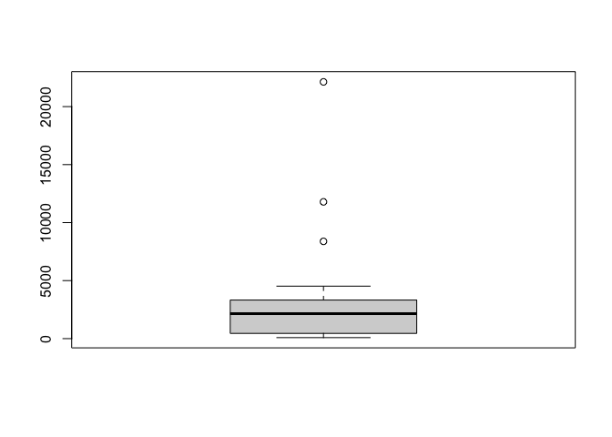

Intermediate Importing Data in R
================
Joschka Schwarz

-   [1. Importing data from databases (Part
    1)](#1-importing-data-from-databases-part-1)
    -   [Connect to a database](#connect-to-a-database)
    -   [Establish a connection](#establish-a-connection)
    -   [Inspect the connection](#inspect-the-connection)
    -   [Import table data](#import-table-data)
    -   [List the database tables](#list-the-database-tables)
    -   [Import users](#import-users)
    -   [Import all tables](#import-all-tables)
    -   [How do the tables relate?](#how-do-the-tables-relate)
-   [2. Importing data from databases (Part
    2)](#2-importing-data-from-databases-part-2)
    -   [SQL Queries from inside R](#sql-queries-from-inside-r)
    -   [Query tweater (1)](#query-tweater-1)
    -   [Query tweater (2)](#query-tweater-2)
    -   [Query tweater (3)](#query-tweater-3)
    -   [Query tweater (4)](#query-tweater-4)
    -   [Join the query madness!](#join-the-query-madness)
    -   [DBI internals](#dbi-internals)
    -   [Send - Fetch - Clear](#send---fetch---clear)
    -   [Be polite and …](#be-polite-and-)
-   [3. Importing data from the web (Part
    1)](#3-importing-data-from-the-web-part-1)
    -   [HTTP](#http)
    -   [Import flat files from the
        web](#import-flat-files-from-the-web)
    -   [Secure importing](#secure-importing)
    -   [Downloading files](#downloading-files)
    -   [Import Excel files from the
        web](#import-excel-files-from-the-web)
    -   [Downloading any file, secure or
        not](#downloading-any-file-secure-or-not)
    -   [Reading a text file from the
        web](#reading-a-text-file-from-the-web)
    -   [HTTP? httr! (1)](#http-httr-1)
    -   [HTTP? httr! (2)](#http-httr-2)
-   [4. Importing data from the web (Part
    2)](#4-importing-data-from-the-web-part-2)
    -   [APIs & JSON](#apis--json)
    -   [From JSON to R](#from-json-to-r)
    -   [Quandl API](#quandl-api)
    -   [OMDb API](#omdb-api)
    -   [JSON & jsonlite](#json--jsonlite)
    -   [JSON practice (1)](#json-practice-1)
    -   [JSON practice (2)](#json-practice-2)
    -   [toJSON()](#tojson)
    -   [Minify and prettify](#minify-and-prettify)
-   [5. Importing data from statistical software
    packages](#5-importing-data-from-statistical-software-packages)
    -   [haven](#haven)
    -   [Import SAS data with haven](#import-sas-data-with-haven)
    -   [Import STATA data with haven](#import-stata-data-with-haven)
    -   [What does the graphic tell?](#what-does-the-graphic-tell)
    -   [Import SPSS data with haven](#import-spss-data-with-haven)
    -   [Factorize, round two](#factorize-round-two)
    -   [foreign](#foreign)
    -   [Import STATA data with foreign
        (1)](#import-stata-data-with-foreign-1)
    -   [Import STATA data with foreign
        (2)](#import-stata-data-with-foreign-2)
    -   [Do you know your data?](#do-you-know-your-data)
    -   [Import SPSS data with foreign
        (1)](#import-spss-data-with-foreign-1)
    -   [Excursion: Correlation](#excursion-correlation)
    -   [Import SPSS data with foreign
        (2)](#import-spss-data-with-foreign-2)

**Short Description**

Parse data in any format. Whether it’s flat files, statistical software,
databases, or data right from the web.

**Long Description**

In this course, you will take a deeper dive into the wide range of data
formats out there. More specifically, you’ll learn how to import data
from relational databases and how to import and work with data coming
from the web. Finally, you’ll get hands-on experience with importing
data from statistical software packages such as SAS, STATA, and SPSS.

# 1. Importing data from databases (Part 1)

Many companies store their information in relational databases. The R
community has also developed R packages to get data from these
architectures. You’ll learn how to connect to a database and how to
retrieve data from it.

## Connect to a database

Theory. Coming soon …

**1. Connect to a database**

Welcome to part two of importing data in R!

**2. Up to now**

The previous course dealt with accessing data stored in flat files or
Excel files. In a professional setting, you’ll also encounter data
stored in relational databases.

**3. Relational Databases**

In this video, I’ll briefly talk about what a relational database is,
and then I’ll explain how you can connect to it. In the next video, I’ll
explain how you can import data from it!So, what’s a relational
database? There’s no better way to show this than with an example.

**4. company**

Take this database, called company. It contains three tables,

**5. company**

employees,

**6. company**

products and

**7. company**

sales.Like a flat file, information is displayed in a table format. The
employees table has 5 records and three fields, namely id, name and
started_at. The id here serves as a unique key for each row or record.
Next, the products table contains the details on four products. We’re
dealing with data from a telecom company that’s selling both with and
without a contract. Also here, each product has an identifier. Finally,
there’s the sales table. It lists what products were sold by who, when,
and for what price. Notice here that the ids in

**8. company**

employee_id and

**9. company**

product_id correspond to the ids that you can find in the employees and
products table respectively.

**10. company**

The third sale for example, was done by the employee with id 6, so
Julie. She sold the product with id 9, so the Biz Unlimited contract.

**11. company**

These relations make this database very powerful. You only store all
necessary information once in nicely separated tables, but can connect
the dots between different records to model what’s happening.

**12. Database Management System**

How the data in a relational database is stored and shuffled around when
you make adaptations, depends on the so-called database management
system, or DBMS you’re using. Open-source implementations such as MySQL,
postgreSQL and SQLite are very popular, but there are also proprietary
implementations such as Oracle Database and Microsoft SQL server.
Practically all of these implementations use SQL, or sequel, as the
language for querying and maintaining the database. SQL stands for
Structured Query Language.

**13. Databases in R**

Depending on the type of database you want to connect to, you’ll have to
use different packages. Suppose the company database I introduced before
is a MySQL database. This means you’ll need the RMySQL package. For
postgreSQL you’ll need RpostgreSQL, for Oracle, you’ll use ROracle and
so on. How you interact with the database, so which R functions you use
to access and manipulate the database, is specified in another R package
called DBI. In more technical terms, DBI is an interface, and RMySQL is
the implementation. Let’s install the RMySQL package, which
automatically installs the DBI package as well. Loading only the DBI
package will be enough to get started.

**14. Connect to database**

The first step is creating a connection to the remote MySQL database.
You do this with dbConnect, as follows.The first argument specifies the
driver that you will use to connect to the MySQL database. It sure looks
a bit strange, but the MySQL function from the RMySQL package simply
constructs a driver for us that dbConnect can use. Next, you have to
specify the database name, where the database is hosted, through which
port you want to connect, and finally the credentials to authenticate
yourself. This is an actual database that we’re hosting, so you can try
these commands yourself!The result of the dbConnect call, con, is a DBI
connection object. You’ll need to pass this object to whatever function
you’re using to interact with the database.

## Establish a connection

The first step to import data from a SQL database is creating a
connection to it. As Filip explained, you need different packages
depending on the database you want to connect to. All of these packages
do this in a uniform way, as specified in the `DBI` package.

<a href="http://www.rdocumentation.org/packages/DBI/functions/dbConnect" target="_blank" rel="noopener noreferrer">`dbConnect()`</a>
creates a connection between your R session and a SQL database. The
first argument has to be a `DBIdriver` object, that specifies how
connections are made and how data is mapped between R and the database.
Specifically for MySQL databases, you can build such a driver with
<a href="http://www.rdocumentation.org/packages/RMySQL/functions/MySQLDriver-class" target="_blank" rel="noopener noreferrer">`RMySQL::MySQL()`</a>.

If the MySQL database is a remote database hosted on a server, you’ll
also have to specify the following arguments in
<a href="http://www.rdocumentation.org/packages/DBI/functions/dbConnect" target="_blank" rel="noopener noreferrer">`dbConnect()`</a>:
`dbname`, `host`, `port`, `user` and `password`. Most of these details
have already been provided.

**Steps**

1.  Load the `DBI` library, which is already installed on DataCamp’s
    servers.
2.  Edit the
    <a href="http://www.rdocumentation.org/packages/DBI/functions/dbConnect" target="_blank" rel="noopener noreferrer">`dbConnect()`</a>
    call to connect to the MySQL database. Change the `port` argument
    (`3306`) and `user` argument (`"student"`).

``` r
# Load the DBI package
library(DBI)

# Edit dbConnect() call
con <- dbConnect(RMySQL::MySQL(), 
                 dbname = "tweater", 
                 host = "courses.csrrinzqubik.us-east-1.rds.amazonaws.com", 
                 port = 3306,
                 user = "student",
                 password = "datacamp")
```

## Inspect the connection

Now that you’ve successfully created the database connection, let’s have
a closer look at it.

> ## *Question*
>
> With the object `con` available in your workspace, can you tell which
> of the following statements is true?<br> <br> ⬜ `con` is an
> `SQLConnection` object.<br> ⬜ `con` is a `PostgreSQLConnection`
> object.<br> ✅ `con` is an `MySQLConnection` object.<br> ⬜ `con` is
> an `NoSQLConnection` object.<br>

## Import table data

Theory. Coming soon …

**1. Import table data**

After successfully connecting to a database,

**2. con**

like this, you’ll probably want to see what’s in there.

**3. List and import tables**

The first step is listing all the table in the database. You can do this
with the dbListTables function. Simply pass the con variable.As
expected, we get a character vector of length three, corresponding to
the table names I’ve introduced earlier. Next, you can choose to
actually read the data from one of these tables, for example from the
employees table. You use the dbReadTable function for this. Again, you
specify the connection to use, con, but this time you also specify which
table data you want to import:The result is a data frame, with exactly
the same contents as in the original database table.DBI also specifies
functions to create new tables, store new data in tables and to remove
tables, but this is not really related to importing data so I won’t talk
about that here. The functions we’ve covered up to now already provide a
pretty good starting point. Oh no, wait, there’s one last thing!It’s
always polite to explicitly disconnect your database after you’re done.
You do this with dbDisconnect, as follows.If you now try to print con,
you’ll see that it is no longer available. Good riddance,

## List the database tables

After you’ve successfully connected to a remote MySQL database, the next
step is to see what tables the database contains. You can do this with
the
<a href="http://www.rdocumentation.org/packages/DBI/functions/dbListTables" target="_blank" rel="noopener noreferrer">`dbListTables()`</a>
function. As you might remember from the video, this function requires
the connection object as an input, and outputs a character vector with
the table names.

**Steps**

1.  Add code to create a vector `tables`, that contains the tables in
    the tweater database. You can connect to this database through the
    `con` object.
2.  Display the structure of `tables`; what’s the class of this vector?

``` r
# Build a vector of table names: tables
tables <- dbListTables(con)

# Display structure of tables
str(tables)
```

    ##  chr [1:3] "comments" "tweats" "users"

Good!
[`dbListTables()`](http://www.rdocumentation.org/packages/DBI/functions/dbListTables)
can be very useful to get a first idea about the contents of your
database. Can you guess what kind of information this database contains?

## Import users

As you might have guessed by now, the database contains data on a more
tasty version of Twitter, namely Tweater. Users can post tweats with
short recipes for delicious snacks. People can comment on these tweats.
There are three tables: **users**, **tweats**, and **comments** that
have relations among them. Which ones, you ask? You’ll discover in a
moment!

Let’s start by importing the data on the users into your R session. You
do this with the
<a href="http://www.rdocumentation.org/packages/DBI/functions/dbReadTable" target="_blank" rel="noopener noreferrer">`dbReadTable()`</a>
function. Simply pass it the connection object (`con`), followed by the
name of the table you want to import. The resulting object is a standard
R data frame.

**Steps**

1 Add code that imports the `"users"` table from the tweater database
and store the resulting data frame as `users`. 2. Print the `users` data
frame.

``` r
# Import the users table from tweater: users
users <- dbReadTable(con, "users")

# Print users
users
```

    ##   id      name     login
    ## 1  1 elisabeth  elismith
    ## 2  2      mike     mikey
    ## 3  3      thea   teatime
    ## 4  4    thomas tomatotom
    ## 5  5    oliver olivander
    ## 6  6      kate  katebenn
    ## 7  7    anjali    lianja

## Import all tables

Next to the `users`, we’re also interested in the `tweats` and
`comments` tables. However, separate `dbReadTable()` calls for each and
every one of the tables in your database would mean a lot of code
duplication. Remember about the `lapply()` function? You can use it
again here! A connection is already coded for you, as well as a vector
`table_names`, containing the names of all the tables in the database.

**Steps**

1.  Finish the `lapply()` function to import the `users`, `tweats` and
    `comments` tables in a single call. The result, a list of data
    frames, will be stored in the variable `tables`.
2.  Print `tables` to check if you got it right.

``` r
# Get table names
table_names <- dbListTables(con)

# Import all tables
tables <- lapply(table_names, dbReadTable, conn = con)

# Print out tables
tables
```

    ## [[1]]
    ##      id tweat_id user_id            message
    ## 1  1022       87       7              nice!
    ## 2  1000       77       7             great!
    ## 3  1011       49       5            love it
    ## 4  1012       87       1   awesome! thanks!
    ## 5  1010       88       6              yuck!
    ## 6  1026       77       4      not my thing!
    ## 7  1004       49       1  this is fabulous!
    ## 8  1030       75       6           so easy!
    ## 9  1025       88       2             oh yes
    ## 10 1007       49       3           serious?
    ## 11 1020       77       1 couldn't be better
    ## 12 1014       77       1       saved my day
    ## 
    ## [[2]]
    ##   id user_id
    ## 1 75       3
    ## 2 88       4
    ## 3 77       6
    ## 4 87       5
    ## 5 49       1
    ## 6 24       7
    ##                                                                  post
    ## 1                                       break egg. bake egg. eat egg.
    ## 2                           wash strawberries. add ice. blend. enjoy.
    ## 3                       2 slices of bread. add cheese. grill. heaven.
    ## 4               open and crush avocado. add shrimps. perfect starter.
    ## 5 nachos. add tomato sauce, minced meat and cheese. oven for 10 mins.
    ## 6                              just eat an apple. simply and healthy.
    ##         date
    ## 1 2015-09-05
    ## 2 2015-09-14
    ## 3 2015-09-21
    ## 4 2015-09-22
    ## 5 2015-09-22
    ## 6 2015-09-24
    ## 
    ## [[3]]
    ##   id      name     login
    ## 1  1 elisabeth  elismith
    ## 2  2      mike     mikey
    ## 3  3      thea   teatime
    ## 4  4    thomas tomatotom
    ## 5  5    oliver olivander
    ## 6  6      kate  katebenn
    ## 7  7    anjali    lianja

Wonderful! Now that you have an R version of all data that is contained
in the database, you can dive a little deeper into the relations between
the different data frames.

## How do the tables relate?

The connection to the MySQL database `con` has already been created for
you. `tables`, a list containing the three tables as data frames that
you’ve created in the previous exercise, is also available.

If you have a closer look at these tables, you’ll see that the `tweats`
table, for example, contains a column `user_id`. The ids in the column
refer to the users that have posted the tweat. Similarly, the `comments`
contain both a `user_id` and a `tweat_id` column. It specifies which
user posted a comment on which tweat.

> ## *Question*
>
> With this new knowledge, can you tell **who** posted the **tweat** on
> which somebody **commented** “awesome! thanks!” (comment 1012)?<br>
> <br> ⬜ The user with id 1, so Kate.<br> ⬜ There is not enough
> information to solve this.<br> ⬜ The user with id 4, so Thomas.<br>
> ✅ The user with user_id 5, so Oliver.<br>

# 2. Importing data from databases (Part 2)

Importing an entire table from a database while you might only need a
tiny bit of information seems like a lot of unncessary work. In this
chapter, you’ll learn about SQL queries, which will help you make things
more efficient by performing some computations on the database side.

## SQL Queries from inside R

Theory. Coming soon …

**1. SQL Queries from inside R**

So, connecting to and importing from a database is something you’re
familiar with by now.

**2. dbReadTable()**

However, with dbReadTable,

**3. dbReadTable()**

you’re importing an entire table. For the company example that had
little data, that’s not a problem, but what if you’re dealing with a
database that contains tables with millions of records? You’d have to
import the entire table into R before you can do an analysis that might
only need a fraction of this data.

**4. dbReadTable()**

If there was a way to perform a lot of the data selection work

**5. dbReadTable()**

on the database side,

**6. dbReadTable()**

you only have to import those elements that you actually need inside R.
This makes much more sense, doesn’t it?

**7. Selective importing**

I am glad to tell you that this is possible, all from inside R! Remember
that relational databases typically use SQL as the language for
querying? Well, you’ll be writing so called SQL Queries to retrieve data
based on specific criteria. You can send these queries through R
functions specified by the DBI package and implemented by an R package
that depends on the database you’re using. As we’re working with MySQL
databases, that’s RMySQL here. Writing SQL queries is a entire topic of
its own, so I will only treat some basic examples so that you got the
idea.

**8. company**

Let’s have a look at the company database again, that contained
informations on sales of telecom products made by different employees.

**9. company**

Suppose that we want to have the names of the employees that started
after the first of september in 2012. How to go about this?

**10. Load package and connect**

In any case, we have to start with loading the DBI package, and creating
a connection to the company database. This is an actual database, so you
can try the code in this video yourself!

**11. Example 1**

To solve the task at hand, you can read the entire employees table, and
then subset it using the subset function.But there is another way. Have
a look at this call of the dbGetQuery function.The result is exactly the
same. The strange syntax inside the string here, is actually a very
common SQL query, that uses three SQL keywords: SELECT, FROM, and WHERE.
The SELECT keyword specifies which column to select, and corresponds to
the select argument in the subset function. The FROM keyword specifies
which table you want to get data from, and corresponds to the first
argument in the subset function. Finally, the WHERE keyword specifies a
condition that a record in the table has to meet. If you read this
sentence out loud with some additions here and there, it sounds pretty
natural: “Select the name column from the employees table, where the
started_at field is greater than the first of september in 2012.”The
first approach and the second approach might seem similar, but the
conceptual difference is huge.

**12. Example 1**

In the first case,

**13. Example 1**

you’re importing the entire employees table,

**14. Example 1**

and then do some subsetting in R. In the second case,

**15. Example 1**

you’re sending a SQL query to the database,

**16. Example 1**

this query is run on the database side, and

**17. Example 1**

only the results are imported into R. If you’re dealing with huge
tables, the second approach is way more efficient.Let’s try another
example.

**18. company**

Suppose you want to select the products that imply a contract,

**19. company**

so where contract is one. For these products, we’re interested in all
variables. The old approach of reading the entire table and then
subsetting

**20. Example 2**

would look like this.The new approach of sending an SQL query to the
database and fetching the result, looks like this.The results are again
exactly the same. Notice how the star after the SELECT keyword specifies
to keep all columns from the products table. Also notice that in the SQL
query, you have to use a single equals sign to specify a condition for
the WHERE keyword, instead of a double equals sign, like you’re used to
in R.

**21. Let’s practice!**

After this crash course on SQL syntax, let’s see how you perform in some
exercises. Good luck!

## Query tweater (1)

In your life as a data scientist, you’ll often be working with huge
databases that contain tables with millions of rows. If you want to do
some analyses on this data, it’s possible that you only need a fraction
of this data. In this case, it’s a good idea to send SQL queries to your
database, and only import the data you actually need into R.

<a href="http://www.rdocumentation.org/packages/DBI/functions/dbGetQuery" target="_blank" rel="noopener noreferrer">`dbGetQuery()`</a>
is what you need. As usual, you first pass the connection object to it.
The second argument is an SQL query in the form of a character string.
This example selects the `age` variable from the `people` dataset where
`gender` equals `"male"`:

``` r
dbGetQuery(con, "SELECT age FROM people WHERE gender = 'male'")
```

**Steps**

1.  Use
    <a href="http://www.rdocumentation.org/packages/DBI/functions/dbGetQuery" target="_blank" rel="noopener noreferrer">`dbGetQuery()`</a>
    to create a data frame, `elisabeth`, that **selects** the `tweat_id`
    column **from** the `comments` table **where** elisabeth is the
    commenter, her `user_id` is 1
2.  Print out `elisabeth` so you can see if you queried the database
    correctly.

``` r
# Import tweat_id column of comments where user_id is 1: elisabeth
elisabeth <- dbGetQuery(con, "SELECT tweat_id FROM comments WHERE user_id = 1")

# Print elisabeth
elisabeth
```

    ##   tweat_id
    ## 1       87
    ## 2       49
    ## 3       77
    ## 4       77

Nice! To make sure you understood SQL’s `SELECT` - `FROM` - `WHERE`
syntax, let’s practice some more.

## Query tweater (2)

Apart from checking equality, you can also check for *less than* and
*greater than* relationships, with `<` and `>`, just like in R.

**Steps**

1.  Create a data frame, `latest`, that **selects** the `post` column
    **from** the `tweats` table observations **where** the `date` is
    higher than `'2015-09-21'`.
2.  Print out `latest`.

``` r
# Import post column of tweats where date is higher than '2015-09-21': latest
# Import post column of tweats where date is higher than '2015-09-21': latest
latest <- dbGetQuery(con, "SELECT post 
                           FROM tweats 
                           WHERE date > '2015-09-21'")

# Print latest
latest
```

    ##                                                                  post
    ## 1               open and crush avocado. add shrimps. perfect starter.
    ## 2 nachos. add tomato sauce, minced meat and cheese. oven for 10 mins.
    ## 3                              just eat an apple. simply and healthy.

Nice! To make sure you understood SQL’s `SELECT` - `FROM` - `WHERE`
syntax, let’s practice some more.

## Query tweater (3)

Suppose that you have a `people` table, with a bunch of information.
This time, you want to find out the `age` and `country` of married
males. Provided that there is a `married` column that’s 1 when the
person in question is married, the following query would work.

``` sql
SELECT age, country
  FROM people
    WHERE gender = "male" AND married = 1
```

Can you use a similar approach for a more specialized query on the
`tweater` database?

**Steps**

1.  Create an R data frame, `specific`, that **selects** the `message`
    column **from** the `comments` table **where** the `tweat_id` is 77
    **and** the `user_id` is greater than 4.
2.  Print `specific`.

``` r
# Create data frame specific
specific <- dbGetQuery(con, "SELECT message
                             FROM comments
                             WHERE tweat_id = 77 AND user_id > 4")

# Print specific
specific
```

    ##   message
    ## 1  great!

## Query tweater (4)

There are also dedicated SQL functions that you can use in the `WHERE`
clause of an SQL query. For example, `CHAR_LENGTH()` returns the number
of characters in a string.

**Steps**

1.  Create a data frame, `short`, that **selects** the `id` and `name`
    columns **from** the `users` table **where** the number of
    characters in the `name` is strictly less than 5.
2.  Print `short`.

``` r
# Create data frame short
short <- dbGetQuery(con, "SELECT id, name
                          FROM users
                          WHERE CHAR_LENGTH(name) < 5")

# Print short
short
```

    ##   id name
    ## 1  2 mike
    ## 2  3 thea
    ## 3  6 kate

## Join the query madness!

Of course, SQL does not stop with the the three keywords `SELECT`,
`FROM` and `WHERE`. Another very often used keyword is `JOIN`, and more
specifically `INNER JOIN`. Take this call for example:

``` sql
SELECT name, post
  FROM users INNER JOIN tweats on users.id = user_id
    WHERE date > "2015-09-19"
```

Here, the `users` table is joined with the `tweats` table. This is
possible because the `id` column in the `users` table corresponds to the
`user_id` column in the `tweats` table. Also notice how `name`, from the
`users` table, and `post` and `date`, from the `tweats` table, can be
referenced to without problems.

> ## *Question*
>
> Can you predict the outcome of the following query?<br> <br> ⬜ Trying
> to get the results of this SQL query throws an error.<br> ✅ A table
> with four observations, containing two columns: `post` and
> `message`.<br> ⬜ A table with six observations, containing all
> columns in the `tweats` table.<br> ⬜ A table with six observations,
> containing the columns `post` and `message`.<br>

``` sql
SELECT post, message
  FROM tweats INNER JOIN comments on tweats.id = tweat_id
    WHERE tweat_id = 77
```

## DBI internals

Theory. Coming soon …

**1. DBI internals**

Let’s turn back to a dbGetQuery function call from before.

**2. dbGetQuery()**

It was incredibly easy to use. Simply pass the connection object and an
SQL query, and you get a result.What it actually does behind the scenes
is sending a query, with dbSendQuery, like this. This function returns a
result, but this does not actually contain any records you wanted to
import. For that, you need to use the function dbFetch. Finally, you
have to manually clear the result.The combination of dbSendQuery,
dbFetch and, dbClearResult gives the exact same result as dbGetQuery did
before, so why do this? Well, the dbFetch query calls allow you to
specify a maximum number of records to retrieve per fetch. This can be
useful when you need to load in tons of records, but want to do this
chunk by chunk.Suppose, for example,

**3. dbFetch() one by one**

you want to get the result of the previous query, record by record. You
can use this construction for that, with the same SQL query as
before.This code first sends a query to the database, and then goes into
a while loop that checks whether the query result still has data that
has not yet been fetched. If there is still data available, the chunks
are fetched record by record, and this chunk is printed at each
iteration. The output indeed shows the two records, printed separately,
one after the other.In this toy example, this approach is not really
useful, but if you’re working on a super complicated algorithm that
involves millions of database records, you might want to consider a
treatment of data in chunks, right?After all your hard work on the
database,

**4. Disconnect**

don’t forget to disconnect from it.Give these more low-level DBI
functions a try in the exercises.

**5. Let’s practice!**

In the next chapter, I’ll be back to tell you more about importing data
from the web. See you there!

## Send - Fetch - Clear

You’ve used
<a href="http://www.rdocumentation.org/packages/DBI/functions/dbGetQuery" target="_blank" rel="noopener noreferrer">`dbGetQuery()`</a>
multiple times now. This is a virtual function from the `DBI` package,
but is actually implemented by the `RMySQL` package. Behind the scenes,
the following steps are performed:

-   Sending the specified query with
    <a href="http://www.rdocumentation.org/packages/DBI/functions/dbSendQuery" target="_blank" rel="noopener noreferrer">`dbSendQuery()`</a>;
-   Fetching the result of executing the query on the database with
    <a href="http://www.rdocumentation.org/packages/DBI/functions/dbFetch" target="_blank" rel="noopener noreferrer">`dbFetch()`</a>;
-   Clearing the result with
    <a href="http://www.rdocumentation.org/packages/DBI/functions/dbClearResult" target="_blank" rel="noopener noreferrer">`dbClearResult()`</a>.

Let’s not use
<a href="http://www.rdocumentation.org/packages/DBI/functions/dbGetQuery" target="_blank" rel="noopener noreferrer">`dbGetQuery()`</a>
this time and implement the steps above. This is tedious to write, but
it gives you the ability to fetch the query’s result in chunks rather
than all at once. You can do this by specifying the `n` argument inside
<a href="http://www.rdocumentation.org/packages/DBI/functions/dbFetch" target="_blank" rel="noopener noreferrer">`dbFetch()`</a>.

**Steps**

1.  Inspect the
    <a href="http://www.rdocumentation.org/packages/DBI/functions/dbSendQuery" target="_blank" rel="noopener noreferrer">`dbSendQuery()`</a>
    call that has already been coded for you. It selects the comments
    for the users with an id above 4.
2.  Use
    <a href="http://www.rdocumentation.org/packages/DBI/functions/dbFetch" target="_blank" rel="noopener noreferrer">`dbFetch()`</a>
    twice. In the first call, import only two records of the query
    result by setting the `n` argument to `2`. In the second call,
    import all remaining queries (don’t specify `n`). In both calls,
    simply print the resulting data frames.
3.  Clear `res` with
    <a href="http://www.rdocumentation.org/packages/DBI/functions/dbClearResult" target="_blank" rel="noopener noreferrer">`dbClearResult()`</a>.

``` r
# Send query to the database
res <- dbSendQuery(con, "SELECT * FROM comments WHERE user_id > 4")

# Use dbFetch() twice
dbFetch(res, n = 2)
```

    ##     id tweat_id user_id message
    ## 1 1022       87       7   nice!
    ## 2 1000       77       7  great!

``` r
dbFetch(res)
```

    ##     id tweat_id user_id  message
    ## 1 1011       49       5  love it
    ## 2 1010       88       6    yuck!
    ## 3 1030       75       6 so easy!

``` r
# Clear res
dbClearResult(res)
```

    ## [1] TRUE

Perfect! In our toy example, chopping up the fetches doesn’t make a lot
of sense, but make sure to remember this technique when you’re
struggling with huge databases!

## Be polite and …

Every time you connect to a database using
<a href="http://www.rdocumentation.org/packages/DBI/functions/dbConnect" target="_blank" rel="noopener noreferrer">`dbConnect()`</a>,
you’re creating a new connection to the database you’re referencing.
`RMySQL` automatically specifies a maximum of open connections and
closes some of the connections for you, but still: it’s always polite to
manually disconnect from the database afterwards. You do this with the
<a href="http://www.rdocumentation.org/packages/DBI/functions/dbDisconnect" target="_blank" rel="noopener noreferrer">`dbDisconnect()`</a>
function.

The code that connects you to the database is already available, can you
finish the script?

**Steps**

1.  Using the technique you prefer, build a data frame `long_tweats`. It
    **selects** the `post` and `date` columns **from** the observations
    in `tweats` **where** the character length of the `post` variable
    exceeds `40`.
2.  Print `long_tweats`.
3.  Disconnect from the database by using
    <a href="http://www.rdocumentation.org/packages/DBI/functions/dbDisconnect" target="_blank" rel="noopener noreferrer">`dbDisconnect()`</a>.

``` r
# Create the data frame  long_tweats
long_tweats <- dbGetQuery(con, "SELECT post, date
                                FROM tweats
                                WHERE CHAR_LENGTH(post) > 40")

# Print long_tweats
print(long_tweats)
```

    ##                                                                  post
    ## 1                           wash strawberries. add ice. blend. enjoy.
    ## 2                       2 slices of bread. add cheese. grill. heaven.
    ## 3               open and crush avocado. add shrimps. perfect starter.
    ## 4 nachos. add tomato sauce, minced meat and cheese. oven for 10 mins.
    ##         date
    ## 1 2015-09-14
    ## 2 2015-09-21
    ## 3 2015-09-22
    ## 4 2015-09-22

``` r
# Disconnect from the database
dbDisconnect(con)
```

    ## [1] TRUE

Wonderful! This concludes the chapter on databases. Of course, there is
tons more to learn about interfacing to databases and working with them
as efficiently as possible, but that’s something for more advanced
courses.

# 3. Importing data from the web (Part 1)

More and more of the information that data scientists are using resides
on the web. Importing this data into R requires an understanding of the
protocols used on the web. In this chapter, you’ll get a crash course in
HTTP and learn to perform your own HTTP requests from inside R.

## HTTP

Theory. Coming soon …

**1. HTTP**

More and more of the information you’ll be working with as a data
scientist resides on the web.

**2. Data on the web**

In fact, you’ve already worked with such data. Remember how you
connected to a remote relational database to get the exact information
you needed? The DBI package abstracted the fact that the data was in
some remote location and fixed everything for you. In this chapter,
you’ll look at file formats that are specifically useful when used for
web technology, like the JSON file. I’m first going to discuss what
actually happens behind the scenes when you’re importing data that’s on
the web.To understand what happens in the examples that follow, I’m
going to give you a crash course on the basics of HTTP,

**3. HTTP**

short for HyperText Transfer Protocol. It’s basically a system of rules
for how data should be exchanged between computers. In short, HTTP is
the language of the web. If you browse to a webpage for example, your
computer, the client, is actually sending an

**4. HTTP**

HTTP request to the

**5. HTTP**

server. The server then sends back

**6. HTTP**

data representing the webpage, so it sends a response, and the webpage
pops up on your screen. There are several HTTP Methods, as they are
called. To simply get a webpage from a server,

**7. HTTP**

you use the GET Method, for example. Apart from GET, there are also
other HTTP methods, but let’s not dive into those here.Instead, let’s
have a look at some examples you might remember from the previous
chapters, but this time all of the data will be residing on the web.

**8. Example: CSV**

Let’s start with the states-dot-csv file for example, that’s located at
this link. The typical workflow would be to manually download the file
through your favorite web browser, and then point to the path inside
read dot csv.However,

**9. Example: CSV**

it can be done much easier! Have a look at this line, where we simply
pass the URL as a character string.The result is exactly the same: a
data frame with 5 observations and 4 variables. How could this be so
easy? Well, behind the scenes, R figures out that you referred to a URL,
and requests it using an HTTP GET request. The server responds with the
csv file, that R can then read in just like it did before. Pretty nice,
huh?Nowadays, there are many websites that only accept secure
connections. You can only visit these websites, or download their files
with the http_S\_ prefix. Does R also know how to handle that? Well,
let’s find out with the same CSV file, but this time

**10. Example: CSV**

with the HTTPS prefix.This works just the same, awesome. HTTPS support
is baked in to R since R version 3 point 2 point 2.Experiment with
importing data from the web

## Import flat files from the web

In the video, you saw that the `utils` functions to import flat file
data, such as
<a href="http://www.rdocumentation.org/packages/utils/functions/read.table" target="_blank" rel="noopener noreferrer">`read.csv()`</a>
and
<a href="http://www.rdocumentation.org/packages/utils/functions/read.table" target="_blank" rel="noopener noreferrer">`read.delim()`</a>,
are capable of automatically importing from URLs that point to flat
files on the web.

You must be wondering whether Hadley Wickham’s alternative package,
`readr`, is equally potent. Well, figure it out in this exercise! The
URLs for both a `.csv` file as well as a `.delim` file are already coded
for you. It’s up to you to actually import the data. If it works, that
is…

**Steps**

1.  Load the `readr` package. It’s already installed on DataCamp’s
    servers.
2.  Use `url_csv` to read in the `.csv` file it is pointing to. Use the
    <a href="https://cran.r-project.org/web/packages/readr/readr.pdf" target="_blank" rel="noopener noreferrer">`read_csv()`</a>
    function. The `.csv` contains column names in the first row. Save
    the resulting data frame as `pools`.
3.  Similarly, use `url_delim` to read in the online `.txt` file. Use
    the
    <a href="https://cran.r-project.org/web/packages/readr/readr.pdf" target="_blank" rel="noopener noreferrer">`read_tsv()`</a>
    function and store the result as `potatoes`.
4.  Print `pools` and `potatoes`. Looks correct?

``` r
# Load the readr package
library(readr)

# Import the csv file: pools
url_csv <- "http://s3.amazonaws.com/assets.datacamp.com/production/course_1478/datasets/swimming_pools.csv"

pools <- read_csv(url_csv)
```

    ## Rows: 20 Columns: 4
    ## ── Column specification ────────────────────────────────────────────────────────
    ## Delimiter: ","
    ## chr (2): Name, Address
    ## dbl (2): Latitude, Longitude
    ## 
    ## ℹ Use `spec()` to retrieve the full column specification for this data.
    ## ℹ Specify the column types or set `show_col_types = FALSE` to quiet this message.

``` r
# Import the txt file: potatoes
url_delim <- "http://s3.amazonaws.com/assets.datacamp.com/production/course_1478/datasets/potatoes.txt"

potatoes <- read_tsv(url_delim)
```

    ## Rows: 160 Columns: 8
    ## ── Column specification ────────────────────────────────────────────────────────
    ## Delimiter: "\t"
    ## dbl (8): area, temp, size, storage, method, texture, flavor, moistness
    ## 
    ## ℹ Use `spec()` to retrieve the full column specification for this data.
    ## ℹ Specify the column types or set `show_col_types = FALSE` to quiet this message.

``` r
# Print pools and potatoes
print(pools)
```

    ## # A tibble: 20 × 4
    ##    Name                                      Address          Latitude Longitude
    ##    <chr>                                     <chr>               <dbl>     <dbl>
    ##  1 Acacia Ridge Leisure Centre               1391 Beaudesert…    -27.6      153.
    ##  2 Bellbowrie Pool                           Sugarwood Stree…    -27.6      153.
    ##  3 Carole Park                               Cnr Boundary Ro…    -27.6      153.
    ##  4 Centenary Pool (inner City)               400 Gregory Ter…    -27.5      153.
    ##  5 Chermside Pool                            375 Hamilton Ro…    -27.4      153.
    ##  6 Colmslie Pool (Morningside)               400 Lytton Road…    -27.5      153.
    ##  7 Spring Hill Baths (inner City)            14 Torrington S…    -27.5      153.
    ##  8 Dunlop Park Pool (Corinda)                794 Oxley Road,…    -27.5      153.
    ##  9 Fortitude Valley Pool                     432 Wickham Str…    -27.5      153.
    ## 10 Hibiscus Sports Complex (upper MtGravatt) 90 Klumpp Road,…    -27.6      153.
    ## 11 Ithaca Pool ( Paddington)                 131 Caxton Stre…    -27.5      153.
    ## 12 Jindalee Pool                             11 Yallambee Ro…    -27.5      153.
    ## 13 Manly Pool                                1 Fairlead Cres…    -27.5      153.
    ## 14 Mt Gravatt East Aquatic Centre            Cnr wecker Road…    -27.5      153.
    ## 15 Musgrave Park Pool (South Brisbane)       100 Edmonstone …    -27.5      153.
    ## 16 Newmarket Pool                            71 Alderson Str…    -27.4      153.
    ## 17 Runcorn Pool                              37 Bonemill Roa…    -27.6      153.
    ## 18 Sandgate Pool                             231 Flinders Pa…    -27.3      153.
    ## 19 Langlands Parks Pool (Stones Corner)      5 Panitya Stree…    -27.5      153.
    ## 20 Yeronga Park Pool                         81 School Road,…    -27.5      153.

``` r
print(potatoes)
```

    ## # A tibble: 160 × 8
    ##     area  temp  size storage method texture flavor moistness
    ##    <dbl> <dbl> <dbl>   <dbl>  <dbl>   <dbl>  <dbl>     <dbl>
    ##  1     1     1     1       1      1     2.9    3.2       3  
    ##  2     1     1     1       1      2     2.3    2.5       2.6
    ##  3     1     1     1       1      3     2.5    2.8       2.8
    ##  4     1     1     1       1      4     2.1    2.9       2.4
    ##  5     1     1     1       1      5     1.9    2.8       2.2
    ##  6     1     1     1       2      1     1.8    3         1.7
    ##  7     1     1     1       2      2     2.6    3.1       2.4
    ##  8     1     1     1       2      3     3      3         2.9
    ##  9     1     1     1       2      4     2.2    3.2       2.5
    ## 10     1     1     1       2      5     2      2.8       1.9
    ## # … with 150 more rows

Great! It seems to work without any additional problems!

## Secure importing

In the previous exercises, you have been working with URLs that all
start with `http://`. There is, however, a safer alternative to HTTP,
namely HTTPS, which stands for HypterText Transfer Protocol Secure. Just
remember this: HTTPS is relatively safe, HTTP is not.

Luckily for us, you can use the standard importing functions with
`https://` connections since R version 3.2.2.

**Steps**

1.  Take a look at the URL in `url_csv`. It uses a secure connection,
    `https://`.
2.  Use
    <a href="http://www.rdocumentation.org/packages/utils/functions/read.table" target="_blank" rel="noopener noreferrer">`read.csv()`</a>
    to import the file at `url_csv`. The `.csv` file it is referring to
    contains column names in the first row. Call it `pools1`.
3.  Use
    <a href="https://cran.r-project.org/web/packages/readr/readr.pdf" target="_blank" rel="noopener noreferrer">`read_csv()`</a>
    to read in the same `.csv` file in `url_csv`. Call it `pools2`.
4.  Print out the structure of `pools1` and `pools2`. Looks like the
    importing went equally well as with a normal `http` connection!

``` r
# https URL to the swimming_pools csv file.
url_csv <- "https://s3.amazonaws.com/assets.datacamp.com/production/course_1478/datasets/swimming_pools.csv"

# Import the file using read.csv(): pools1
pools1 <- read.csv(url_csv)

# Import the file using read_csv(): pools2
pools2 <- read_csv(url_csv)
```

    ## Rows: 20 Columns: 4
    ## ── Column specification ────────────────────────────────────────────────────────
    ## Delimiter: ","
    ## chr (2): Name, Address
    ## dbl (2): Latitude, Longitude
    ## 
    ## ℹ Use `spec()` to retrieve the full column specification for this data.
    ## ℹ Specify the column types or set `show_col_types = FALSE` to quiet this message.

``` r
# Print the structure of pools1 and pools2
str(pools1)
```

    ## 'data.frame':    20 obs. of  4 variables:
    ##  $ Name     : chr  "Acacia Ridge Leisure Centre" "Bellbowrie Pool" "Carole Park" "Centenary Pool (inner City)" ...
    ##  $ Address  : chr  "1391 Beaudesert Road, Acacia Ridge" "Sugarwood Street, Bellbowrie" "Cnr Boundary Road and Waterford Road Wacol" "400 Gregory Terrace, Spring Hill" ...
    ##  $ Latitude : num  -27.6 -27.6 -27.6 -27.5 -27.4 ...
    ##  $ Longitude: num  153 153 153 153 153 ...

``` r
str(pools2)
```

    ## spec_tbl_df [20 × 4] (S3: spec_tbl_df/tbl_df/tbl/data.frame)
    ##  $ Name     : chr [1:20] "Acacia Ridge Leisure Centre" "Bellbowrie Pool" "Carole Park" "Centenary Pool (inner City)" ...
    ##  $ Address  : chr [1:20] "1391 Beaudesert Road, Acacia Ridge" "Sugarwood Street, Bellbowrie" "Cnr Boundary Road and Waterford Road Wacol" "400 Gregory Terrace, Spring Hill" ...
    ##  $ Latitude : num [1:20] -27.6 -27.6 -27.6 -27.5 -27.4 ...
    ##  $ Longitude: num [1:20] 153 153 153 153 153 ...
    ##  - attr(*, "spec")=
    ##   .. cols(
    ##   ..   Name = col_character(),
    ##   ..   Address = col_character(),
    ##   ..   Latitude = col_double(),
    ##   ..   Longitude = col_double()
    ##   .. )
    ##  - attr(*, "problems")=<externalptr>

Great! It seems to work without any additional problems!

## Downloading files

Theory. Coming soon …

**1. Downloading files**

Similar to what we did in the previous video,

**2. Example: Excel**

let’s now use the readxl package to import Excel data stored at this
URL. Will the read_excel work out of the box here?Apparently, readxl
does not know how to handle Excel files that are stored on the web,
although I expect that Hadley Wickham will add this functionality in
future releases. Does this mean we’ll have to manually download the
file, and then point to the local file like you would do before? Not at
all!

**3. download.file()**

You can use download dot file here, a function from the utils package.
Let’s first define the URL and the destination path, so where we want to
place the downloaded file on our system. I’m going to call the file
local_cities dot xlsx and place it my home directory.If you now use
download dot file with the url as the first argument and the destination
path as the second argument you’re good to go.Perfect. What download dot
file did is simple. It performed a GET request to the URL you specified
and stored the contents of the response to the location you specified.
The last step is to use the read_excel function from before to import
the Excel data from the local file this time. We can again use the
dest_path variable here.

**4. Why download.file()?**

You might wonder why using download dot file is useful. The answer is
again: reproducibility. You can specify URLs in your R scripts and
download them through R functions instead of manually browsing the web
which requires several mouseclicks.There’s much more to learn about
performing GET requests and other HTTP requests from inside R. In some
cases, you’ll have to authenticate yourself before you can download
files, and pass additional parameters to your GET request. If you want
to learn more about this, I suggest you check out the httr package by
Hadley Wickham.

## Import Excel files from the web

When you learned about `gdata`, it was already mentioned that `gdata`
can handle `.xls` files that are on the internet. `readxl` can’t, at
least not yet. The URL with which you’ll be working is already available
in the sample code. You will import it once using `gdata` and once with
the `readxl` package via a workaround.

**Steps**

1.  Load the `readxl` and `gdata` packages. They are already installed
    on DataCamp’s servers.
2.  Import the `.xls` file located at the URL `url_xls` using
    <a href="http://www.rdocumentation.org/packages/gdata/functions/read.xls" target="_blank" rel="noopener noreferrer">`read.xls()`</a>
    from `gdata`. Store the resulting data frame as `excel_gdata`.
3.  You can not use
    <a href="https://cran.r-project.org/web/packages/readxl/readxl.pdf" target="_blank" rel="noopener noreferrer">`read_excel()`</a>
    directly with a URL. Complete the following instructions to work
    around this problem:
4.  Use
    <a href="http://www.rdocumentation.org/packages/utils/functions/download.file" target="_blank" rel="noopener noreferrer">`download.file()`</a>
    to download the `.xls` file behind the URL and store it locally as
    `"local_latitude.xls"`.
5.  Call
    <a href="https://cran.r-project.org/web/packages/readxl/readxl.pdf" target="_blank" rel="noopener noreferrer">`read_excel()`</a>
    to import the local file, `"local_latitude.xls"`. Name the resulting
    data frame `excel_readxl`.

``` r
# Load the readxl and gdata package
library(readxl)
library(gdata)
```

    ## gdata: read.xls support for 'XLS' (Excel 97-2004) files ENABLED.

    ## 

    ## gdata: read.xls support for 'XLSX' (Excel 2007+) files ENABLED.

    ## 
    ## Attaching package: 'gdata'

    ## The following object is masked from 'package:stats':
    ## 
    ##     nobs

    ## The following object is masked from 'package:utils':
    ## 
    ##     object.size

    ## The following object is masked from 'package:base':
    ## 
    ##     startsWith

``` r
# Specification of url: url_xls
url_xls <- "http://s3.amazonaws.com/assets.datacamp.com/production/course_1478/datasets/latitude.xls"

# Import the .xls file with gdata: excel_gdata
excel_gdata <- read.xls(url_xls)

# Download file behind URL, name it local_latitude.xls
download.file(url_xls, "data//local_latitude.xls")

# Import the local .xls file with readxl: excel_readxl
excel_readxl <- read_excel("data//local_latitude.xls")
```

Nice! It appears that `readxl` is not (yet?) able to deal with Excel
files that are on the web. However, a simply workaround with
[`download.file()`](http://www.rdocumentation.org/packages/utils/functions/download.file)
fixes this.

## Downloading any file, secure or not

In the previous exercise you’ve seen how you can read excel files on the
web using the `read_excel` package by first downloading the file with
the
<a href="http://www.rdocumentation.org/packages/utils/functions/download.file" target="_blank" rel="noopener noreferrer">`download.file()`</a>
function.

There’s more: with
<a href="http://www.rdocumentation.org/packages/utils/functions/download.file" target="_blank" rel="noopener noreferrer">`download.file()`</a>
you can download any kind of file from the web, using HTTP and HTTPS:
images, executable files, but also `.RData` files. An `RData` file is
very efficient format to store R data.

You can load data from an `RData` file using the
<a href="http://www.rdocumentation.org/packages/base/functions/load" target="_blank" rel="noopener noreferrer">`load()`</a>
function, but this function does not accept a URL string as an argument.
In this exercise, you’ll first download the `RData` file securely, and
then import the local data file.

**Steps**

1.  Take a look at the URL in `url_rdata`. It uses a secure connection,
    `https://`. This URL points to an `RData` file containing a data
    frame with some metrics on different kinds of wine.
2.  Download the file at `url_rdata` using
    <a href="http://www.rdocumentation.org/packages/utils/functions/download.file" target="_blank" rel="noopener noreferrer">`download.file()`</a>.
    Call the file `"wine_local.RData"` in your working directory.
3.  Load the file you created, `wine_local.RData`, using the
    <a href="http://www.rdocumentation.org/packages/base/functions/load" target="_blank" rel="noopener noreferrer">`load()`</a>
    function. It takes one argument, the path to the file, which is just
    the filename in our case. After running this command, the variable
    `wine` will automatically be available in your workspace.
4.  Print out the
    <a href="http://www.rdocumentation.org/packages/base/functions/summary" target="_blank" rel="noopener noreferrer">`summary()`</a>
    of the `wine` dataset.

``` r
# https URL to the wine RData file.
url_rdata <- "https://s3.amazonaws.com/assets.datacamp.com/production/course_1478/datasets/wine.RData"

# Download the wine file to your working directory
download.file(url_rdata, "data/wine_local.RData")

# Load the wine data into your workspace using load()
load("data/wine_local.RData")

# Print out the summary of the wine data
summary(wine)
```

    ##     Alcohol        Malic acid        Ash        Alcalinity of ash
    ##  Min.   :11.03   Min.   :0.74   Min.   :1.360   Min.   :10.60    
    ##  1st Qu.:12.36   1st Qu.:1.60   1st Qu.:2.210   1st Qu.:17.20    
    ##  Median :13.05   Median :1.87   Median :2.360   Median :19.50    
    ##  Mean   :12.99   Mean   :2.34   Mean   :2.366   Mean   :19.52    
    ##  3rd Qu.:13.67   3rd Qu.:3.10   3rd Qu.:2.560   3rd Qu.:21.50    
    ##  Max.   :14.83   Max.   :5.80   Max.   :3.230   Max.   :30.00    
    ##    Magnesium      Total phenols     Flavanoids    Nonflavanoid phenols
    ##  Min.   : 70.00   Min.   :0.980   Min.   :0.340   Min.   :0.1300      
    ##  1st Qu.: 88.00   1st Qu.:1.740   1st Qu.:1.200   1st Qu.:0.2700      
    ##  Median : 98.00   Median :2.350   Median :2.130   Median :0.3400      
    ##  Mean   : 99.59   Mean   :2.292   Mean   :2.023   Mean   :0.3623      
    ##  3rd Qu.:107.00   3rd Qu.:2.800   3rd Qu.:2.860   3rd Qu.:0.4400      
    ##  Max.   :162.00   Max.   :3.880   Max.   :5.080   Max.   :0.6600      
    ##  Proanthocyanins Color intensity       Hue           Proline      
    ##  Min.   :0.410   Min.   : 1.280   Min.   :1.270   Min.   : 278.0  
    ##  1st Qu.:1.250   1st Qu.: 3.210   1st Qu.:1.930   1st Qu.: 500.0  
    ##  Median :1.550   Median : 4.680   Median :2.780   Median : 672.0  
    ##  Mean   :1.587   Mean   : 5.055   Mean   :2.604   Mean   : 745.1  
    ##  3rd Qu.:1.950   3rd Qu.: 6.200   3rd Qu.:3.170   3rd Qu.: 985.0  
    ##  Max.   :3.580   Max.   :13.000   Max.   :4.000   Max.   :1680.0

Great! Another way to load remote `RData` files is to use the
[`url()`](http://www.rdocumentation.org/packages/base/functions/connections)
function inside
[`load()`](http://www.rdocumentation.org/packages/base/functions/load).
However, this will not save the `RData` file to a local file.

## Reading a text file from the web

Wow, you’ve learned a lot of ways to import a data file from the web in
the previous exercises. Let’s see if you can remember what’s possible
and what’s not.

> ## *Question*
>
> Which way of importing data is *NOT* possible?<br> <br> ⬜ Importing a
> `.csv` file residing on the web using the URL with
> <a href="http://www.rdocumentation.org/packages/utils/functions/read.table">`read.csv()`</a>:
> `read.csv("http://s3.amazonaws.com/assets.datacamp.com/production/course_1478/datasets/swimming_pools.csv")`<br>
> ⬜ Downloading a remote excel and saving it to your working directory
> using
> <a href="http://www.rdocumentation.org/packages/utils/functions/download.file">`download.file()`</a>:
> `download.file("http://s3.amazonaws.com/assets.datacamp.com/production/course_1478/datasets/latitude.xlsx", "lat.xlsx")`<br>
> ⬜ Importing a `.txt` file residing on the web using the URL with
> <a href="https://cran.r-project.org/web/packages/readr/readr.pdf">`read_tsv()`</a>:
> `read_tsv("http://s3.amazonaws.com/assets.datacamp.com/production/course_1478/datasets/potatoes.txt")`<br>
> ✅ Using the
> <a href="http://www.rdocumentation.org/packages/base/functions/load">`load()`</a>
> function to load a remote `RData` file into the workspace with only
> the URL string:
> `load("https://s3.amazonaws.com/assets.datacamp.com/production/course_1478/datasets/wine.RData")`<br>

## HTTP? httr! (1)

Downloading a file from the Internet means sending a GET request and
receiving the file you asked for. Internally, all the previously
discussed functions use a GET request to download files.

`httr` provides a convenient function,
<a href="http://www.rdocumentation.org/packages/httr/functions/GET" target="_blank" rel="noopener noreferrer">`GET()`</a>
to execute this GET request. The result is a `response` object, that
provides easy access to the status code, content-type and, of course,
the actual content.

You can extract the content from the request using the
<a href="http://www.rdocumentation.org/packages/httr/functions/content" target="_blank" rel="noopener noreferrer">`content()`</a>
function. At the time of writing, there are three ways to retrieve this
content: as a raw object, as a character vector, or an R object, such as
a list. If you don’t tell
<a href="http://www.rdocumentation.org/packages/httr/functions/content" target="_blank" rel="noopener noreferrer">`content()`</a>
how to retrieve the content through the `as` argument, it’ll try its
best to figure out which type is most appropriate based on the
content-type.

**Steps**

1.  Load the `httr` package. It’s already installed on DataCamp’s
    servers.
2.  Use
    <a href="http://www.rdocumentation.org/packages/httr/functions/GET" target="_blank" rel="noopener noreferrer">`GET()`</a>
    to get the URL stored in `url`. Store the result of this `GET()`
    call as `resp`.
3.  Print the `resp` object. What information does it contain?
4.  Get the content of `resp` using
    <a href="http://www.rdocumentation.org/packages/httr/functions/content" target="_blank" rel="noopener noreferrer">`content()`</a>
    and set the `as` argument to `"raw"`. Assign the resulting vector to
    `raw_content`.
5.  Print the first values in `raw_content` with
    <a href="http://www.rdocumentation.org/packages/utils/functions/head" target="_blank" rel="noopener noreferrer">`head()`</a>.

``` r
# Load the httr package
library(httr)

# Get the url, save response to resp
url  <- "http://www.example.com/"
resp <- GET(url) 

# Print resp
resp
```

    ## Response [http://www.example.com/]
    ##   Date: 2022-03-11 11:21
    ##   Status: 200
    ##   Content-Type: text/html; charset=UTF-8
    ##   Size: 1.26 kB
    ## <!doctype html>
    ## <html>
    ## <head>
    ##     <title>Example Domain</title>
    ## 
    ##     <meta charset="utf-8" />
    ##     <meta http-equiv="Content-type" content="text/html; charset=utf-8" />
    ##     <meta name="viewport" content="width=device-width, initial-scale=1" />
    ##     <style type="text/css">
    ##     body {
    ## ...

``` r
# Get the raw content of resp: raw_content
raw_content <- content(resp, as = "raw")

# Print the head of raw_content
head(raw_content)
```

    ## [1] 3c 21 64 6f 63 74

Great! The raw content of the response doesn’t make a lot of sense, does
it? Luckily, the
[`content()`](http://www.rdocumentation.org/packages/httr/functions/content)
function by default, if you don’t specify the `as` argument, figures out
what type of data you’re dealing with and parses it for you.

## HTTP? httr! (2)

Web content does not limit itself to HTML pages and files stored on
remote servers such as DataCamp’s Amazon S3 instances. There are many
other data formats out there. A very common one is JSON. This format is
very often used by so-called Web APIs, interfaces to web servers with
which you as a client can communicate to get or store information in
more complicated ways.

You’ll learn about Web APIs and JSON in the video and exercises that
follow, but some experimentation never hurts, does it?

**Steps**

1.  Use
    <a href="http://www.rdocumentation.org/packages/httr/functions/GET" target="_blank" rel="noopener noreferrer">`GET()`</a>
    to get the `url` that has already been specified in the sample code.
    Store the response as `resp`.
2.  Print `resp`. What is the content-type?
3.  Use
    <a href="http://www.rdocumentation.org/packages/httr/functions/content" target="_blank" rel="noopener noreferrer">`content()`</a>
    to get the content of `resp`. Set the `as` argument to `"text"`.
    Simply print out the result. What do you see?
4.  Use
    <a href="http://www.rdocumentation.org/packages/httr/functions/content" target="_blank" rel="noopener noreferrer">`content()`</a>
    to get the content of `resp`, but this time do not specify a second
    argument. R figures out automatically that you’re dealing with a
    JSON, and converts the JSON to a named R list.

``` r
# Get the url
url <- "http://www.omdbapi.com/?apikey=72bc447a&t=Annie+Hall&y=&plot=short&r=json"

# Print resp
resp <- GET(url)
print(resp)
```

    ## Response [http://www.omdbapi.com/?apikey=72bc447a&t=Annie+Hall&y=&plot=short&r=json]
    ##   Date: 2022-03-11 11:21
    ##   Status: 200
    ##   Content-Type: application/json; charset=utf-8
    ##   Size: 1.02 kB

``` r
# Print content of resp as text
print(content(resp, as = "text"))
```

    ## [1] "{\"Title\":\"Annie Hall\",\"Year\":\"1977\",\"Rated\":\"PG\",\"Released\":\"20 Apr 1977\",\"Runtime\":\"93 min\",\"Genre\":\"Comedy, Romance\",\"Director\":\"Woody Allen\",\"Writer\":\"Woody Allen, Marshall Brickman\",\"Actors\":\"Woody Allen, Diane Keaton, Tony Roberts\",\"Plot\":\"Alvy Singer, a divorced Jewish comedian, reflects on his relationship with ex-lover Annie Hall, an aspiring nightclub singer, which ended abruptly just like his previous marriages.\",\"Language\":\"English, German\",\"Country\":\"United States\",\"Awards\":\"Won 4 Oscars. 31 wins & 8 nominations total\",\"Poster\":\"https://m.media-amazon.com/images/M/MV5BZDg1OGQ4YzgtM2Y2NS00NjA3LWFjYTctMDRlMDI3NWE1OTUyXkEyXkFqcGdeQXVyMjUzOTY1NTc@._V1_SX300.jpg\",\"Ratings\":[{\"Source\":\"Internet Movie Database\",\"Value\":\"8.0/10\"},{\"Source\":\"Rotten Tomatoes\",\"Value\":\"96%\"},{\"Source\":\"Metacritic\",\"Value\":\"92/100\"}],\"Metascore\":\"92\",\"imdbRating\":\"8.0\",\"imdbVotes\":\"261,237\",\"imdbID\":\"tt0075686\",\"Type\":\"movie\",\"DVD\":\"05 Jul 2000\",\"BoxOffice\":\"$38,251,425\",\"Production\":\"N/A\",\"Website\":\"N/A\",\"Response\":\"True\"}"

``` r
# Print content of resp
print(content(resp))
```

    ## $Title
    ## [1] "Annie Hall"
    ## 
    ## $Year
    ## [1] "1977"
    ## 
    ## $Rated
    ## [1] "PG"
    ## 
    ## $Released
    ## [1] "20 Apr 1977"
    ## 
    ## $Runtime
    ## [1] "93 min"
    ## 
    ## $Genre
    ## [1] "Comedy, Romance"
    ## 
    ## $Director
    ## [1] "Woody Allen"
    ## 
    ## $Writer
    ## [1] "Woody Allen, Marshall Brickman"
    ## 
    ## $Actors
    ## [1] "Woody Allen, Diane Keaton, Tony Roberts"
    ## 
    ## $Plot
    ## [1] "Alvy Singer, a divorced Jewish comedian, reflects on his relationship with ex-lover Annie Hall, an aspiring nightclub singer, which ended abruptly just like his previous marriages."
    ## 
    ## $Language
    ## [1] "English, German"
    ## 
    ## $Country
    ## [1] "United States"
    ## 
    ## $Awards
    ## [1] "Won 4 Oscars. 31 wins & 8 nominations total"
    ## 
    ## $Poster
    ## [1] "https://m.media-amazon.com/images/M/MV5BZDg1OGQ4YzgtM2Y2NS00NjA3LWFjYTctMDRlMDI3NWE1OTUyXkEyXkFqcGdeQXVyMjUzOTY1NTc@._V1_SX300.jpg"
    ## 
    ## $Ratings
    ## $Ratings[[1]]
    ## $Ratings[[1]]$Source
    ## [1] "Internet Movie Database"
    ## 
    ## $Ratings[[1]]$Value
    ## [1] "8.0/10"
    ## 
    ## 
    ## $Ratings[[2]]
    ## $Ratings[[2]]$Source
    ## [1] "Rotten Tomatoes"
    ## 
    ## $Ratings[[2]]$Value
    ## [1] "96%"
    ## 
    ## 
    ## $Ratings[[3]]
    ## $Ratings[[3]]$Source
    ## [1] "Metacritic"
    ## 
    ## $Ratings[[3]]$Value
    ## [1] "92/100"
    ## 
    ## 
    ## 
    ## $Metascore
    ## [1] "92"
    ## 
    ## $imdbRating
    ## [1] "8.0"
    ## 
    ## $imdbVotes
    ## [1] "261,237"
    ## 
    ## $imdbID
    ## [1] "tt0075686"
    ## 
    ## $Type
    ## [1] "movie"
    ## 
    ## $DVD
    ## [1] "05 Jul 2000"
    ## 
    ## $BoxOffice
    ## [1] "$38,251,425"
    ## 
    ## $Production
    ## [1] "N/A"
    ## 
    ## $Website
    ## [1] "N/A"
    ## 
    ## $Response
    ## [1] "True"

Great! The fact that `httr` converts the JSON response body
automatically to an R list is very convenient.

# 4. Importing data from the web (Part 2)

Importing data from the web is one thing; actually being able to extract
useful information is another. Learn more about the JSON format to get
one step closer to web domination.

## APIs & JSON

Theory. Coming soon …

**1. APIs & JSON**

In the previous video and exercises,

**2. Other data formats**

you’ve seen how you can get files from the web. In the last exercise,
you also saw that there is also another format to represent data, namely
JSON. The JSON format is very simple, concise and well-structured. On
top of that, it is human-readable, but also easy to interpret and
generate for machines. This makes it perfect to communicate with Web
APIs.

**3. API**

What is an API, I hear you asking? Well, it’s short for Application
Programming Interface. Very generally put, it is a set of routines and
protocols for building software components. It is a way in which
different software components interact. This can happen in thousands of
ways, but we will only focus on the web API. Typically, this is an
interface to get data and processed information from a server or to add
data to a server, through the HTTP methods you learned about earlier.

**4. Twitter**

As an example, take Twitter. They also have an API, which you can check
out here. After authentication, you can simply request particular URLs
from twitter with the GET request, allowing you to get the tweets for a
particular person for example. Twitter does all the work for you on
their servers, and spits out the information you need. You can also use
the API to programatically place comments on somebody’s tweets for
example. The possible applications are endless. Say you’re an avid
tweeter and want to find out which tweets had the most impact. Maybe
some of your more controversial tweets caused a lot of retweets and
reactions? With the raw data from Twitter’s API you can research
this.But why are APIs and JSON useful in the first place? All the
information is available on webpage already, right?

**5. Info on Rain Man (1988)**

Well, suppose you want to get some data on the movie Rain Man, from
1988. You could download the corresponding URL of IMDb, read it in, and
then start programmatically searching your way through the HTML code,
which is more than 4000 lines, to get the information you need. This is
pretty error-prone and really slow.Luckily, there are alternatives. As
it happens,

**6. Rain Man JSON (OMDb API)**

there’s an API called the OMDb API, able to give you information on
pratically any movie you can think of. It simply takes a URL, with some
additional parameters such as the id of the movie you want to get info
about and what type the response should be, that the API understands.If
you simply visit this web page, you will see something like this. This
is a JSON, containing everything we need to know in a nicely structured
format.To convert this JSON into an R data structure,

**7. jsonlite**

you can use the jsonlite package by Jeroen Ooms. The package is an
improvement of earlier R packages to handle JSONs, where converting from
and to JSONs is more consistent and robust, such that it works nicely in
all use cases.

**8. Rain Man list in R**

Let’s install and load jsonlite, and then simply call fromJSON on the
URL. This will download the JSON data for you and convert it to a named
R list. We now have all the information in R, ready to do our analysis.
This is way better than the messy HTML page where we would have to dig
through to get the bits and pieces of interest, isn’t it?

## From JSON to R

In the simplest setting,
<a href="http://www.rdocumentation.org/packages/jsonlite/functions/fromJSON" target="_blank" rel="noopener noreferrer">`fromJSON()`</a>
can convert character strings that represent JSON data into a nicely
structured R list. Give it a try!

**Steps**

1.  Load the `jsonlite` package. It’s already installed on DataCamp’s
    servers.
2.  `wine_json` represents a JSON. Use `fromJSON()` to convert it to a
    list, named `wine`.
3.  Display the structure of `wine`

``` r
# Load the jsonlite package
library(jsonlite)

# wine_json is a JSON
wine_json <- '{"name":"Chateau Migraine", "year":1997, "alcohol_pct":12.4, "color":"red", "awarded":false}'

# Convert wine_json into a list: wine
wine <- fromJSON(wine_json)

# Print structure of wine
str(wine)
```

    ## List of 5
    ##  $ name       : chr "Chateau Migraine"
    ##  $ year       : int 1997
    ##  $ alcohol_pct: num 12.4
    ##  $ color      : chr "red"
    ##  $ awarded    : logi FALSE

## Quandl API

As Filip showed in the video,
<a href="http://www.rdocumentation.org/packages/jsonlite/functions/fromJSON" target="_blank" rel="noopener noreferrer">`fromJSON()`</a>
also works if you pass a URL as a character string or the path to a
local file that contains JSON data. Let’s try this out on the Quandl
API, where you can fetch all sorts of financial and economical data.

**Steps**

1.  `quandl_url` represents a URL. Use `fromJSON()` directly on this URL
    and store the result in `quandl_data`.
2.  Display the structure of `quandl_data`.

``` r
# Definition of quandl_url
quandl_url <- "https://www.quandl.com/api/v3/datasets/WIKI/FB/data.json?auth_token=i83asDsiWUUyfoypkgMz"

# Import Quandl data: quandl_data
quandl_data <- fromJSON(quandl_url)

# Print structure of quandl_data
str(quandl_data)
```

    ## List of 1
    ##  $ dataset_data:List of 10
    ##   ..$ limit       : NULL
    ##   ..$ transform   : NULL
    ##   ..$ column_index: NULL
    ##   ..$ column_names: chr [1:13] "Date" "Open" "High" "Low" ...
    ##   ..$ start_date  : chr "2012-05-18"
    ##   ..$ end_date    : chr "2018-03-27"
    ##   ..$ frequency   : chr "daily"
    ##   ..$ data        : chr [1:1472, 1:13] "2018-03-27" "2018-03-26" "2018-03-23" "2018-03-22" ...
    ##   ..$ collapse    : NULL
    ##   ..$ order       : NULL

Great! You successfully imported JSON data directly from the web. If you
have a close look at the structure of `quandl_data`, you’ll see that the
`data` element is a matrix.

## OMDb API

In the video, you saw how easy it is to interact with an API once you
know how to formulate requests. You also saw how to fetch all
information on Rain Man from OMDb. Simply perform a
<a href="http://www.rdocumentation.org/packages/httr/functions/GET" target="_blank" rel="noopener noreferrer">`GET()`</a>
call, and next ask for the contents with the
<a href="http://www.rdocumentation.org/packages/httr/functions/content" target="_blank" rel="noopener noreferrer">`content()`</a>
function. This
<a href="http://www.rdocumentation.org/packages/httr/functions/content" target="_blank" rel="noopener noreferrer">`content()`</a>
function, which is part of the `httr` package, uses `jsonlite` behind
the scenes to import the JSON data into R.

However, by now you also know that `jsonlite` can handle URLs itself.
Simply passing the request URL to
<a href="http://www.rdocumentation.org/packages/jsonlite/functions/fromJSON" target="_blank" rel="noopener noreferrer">`fromJSON()`</a>
will get your data into R. In this exercise, you will be using this
technique to compare the release year of two movies in the Open Movie
Database.

**Steps**

1.  Two URLs are included in the sample code, as well as a `fromJSON()`
    call to build `sw4`. Add a similar call to build `sw3`.
2.  Print out the element named `Title` of both `sw4` and `sw3`. You can
    use the `$` operator. What movies are we dealing with here?
3.  Write an expression that evaluates to `TRUE` if `sw4` was released
    later than `sw3`. This information is stored in the `Year` element
    of the named lists.

``` r
# Definition of the URLs
url_sw4 <- "http://www.omdbapi.com/?apikey=72bc447a&i=tt0076759&r=json"
url_sw3 <- "http://www.omdbapi.com/?apikey=72bc447a&i=tt0121766&r=json"

# Import two URLs with fromJSON(): sw4 and sw3
sw4 <- fromJSON(url_sw4)
sw3 <- fromJSON(url_sw3)


# Print out the Title element of both lists
print(sw4$Title)
```

    ## [1] "Star Wars: Episode IV - A New Hope"

``` r
print(sw3$Title)
```

    ## [1] "Star Wars: Episode III - Revenge of the Sith"

``` r
# Is the release year of sw4 later than sw3?
sw4$Year > sw3$Year
```

    ## [1] FALSE

Well done! The fourth episode of the Star Wars saga was released before
the third one! Enough of the
[`fromJSON()`](http://www.rdocumentation.org/packages/jsonlite/functions/fromJSON)
now. Let’s try to convert some R data into JSON format now.

## JSON & jsonlite

Theory. Coming soon …

**1. JSON & jsonlite**

In this video, let’s dive into the JSON format and the jsonlite package
some more.So, what does a typical JSON look like? I’ll try to be short
on this.You have JSON objects, and you have JSON arrays.

**2. JSON object**

A typical JSON object looks like this. It’s unordered collection of
name/value pairs. where the name is a string and the value can be a
string, a number, boolean, null, another JSON object, or a JSON array.

**3. JSON object**

Let’s convert this JSON to an R string by wrapping it in quotes. I use
single quotes here so that I don’t have to escape every double quote.
Now let’s pass this string to jsonlite’s fromJSON function, that
converts a JSON to R code, and ask for the structure of the result.The
result is a named list in R, which contains the same information. You
can also see that the elements have different classes: we have
characters, integers and logicals.

**4. JSON array**

Next, there are also JSON arrays. This is an ordered sequence of zero or
more values, like this one.Calling fromJSON on this JSON structure
results in an integer vector.However, this actually is a simplification,
because JSON arrays, just like JSON objects, are heterogeneous; they can
contain elements of different types. This JSON array for example, is
perfectly valid as well.Trying to convert this JSON into R, give the
following result.The numbers were coerced to characters, as was the
logical value. The null keyword was converted to an NA in R. This had to
be done because R vectors can only contain a single basic type,
remember?Both the JSON object as the JSON array can contain other JSON
objects and arrays, how would that work?

**5. JSON Nesting**

Suppose we add some information to the JSON object from before. This
time, I formatted the JSON such that it becomes more readable.We can
extend it as follows.

**6. JSON Nesting**

Let’s fromJSON this, and see what we get.We get a nested named list,
makes perfect sense if you ask me.

**7. JSON Array of JSON Objects**

Finally, let’s build an array of JSON objects, of three persons for
example, like this.Wow, this was unexpected. We simply got a data frame.
But if you think of it, this is a great mapping. We have three JSON
objects, on Frank, Julie and Zach, and they all have the same fields, id
and name. This perfectly fits the description of an R data frame. The
wonderful thing is that jsonlite deals with all of this for us. There
are many more use cases of JSON objects and arrays, but I won’t go
through each and every one of them.next to fromJSON,

**8. Other jsonlite functions**

there are other useful functions in the jsonlite package, such as
tojson, to convert r data structures back to json, and prettify and
minify, to change how jsons are displayed. you’ll learn all about these
in the exercises that follow!If you use the jsonlite package you
normally won’t be dealing with JSONs directly, but it’s good to have a
basic level of understanding of them.

## JSON practice (1)

JSON is built on two structures: objects and arrays. To help you
experiment with these, two JSON strings are included in the sample code.
It’s up to you to change them appropriately and then call `jsonlite`’s
<a href="http://www.rdocumentation.org/packages/jsonlite/functions/fromJSON" target="_blank" rel="noopener noreferrer">`fromJSON()`</a>
function on them each time.

**Steps**

1.  Change the assignment of `json1` such that the R vector after
    conversion contains the numbers 1 up to 6, in ascending order. Next,
    call
    <a href="http://www.rdocumentation.org/packages/jsonlite/functions/fromJSON" target="_blank" rel="noopener noreferrer">`fromJSON()`</a>
    on `json1`.
2.  Adapt the code for `json2` such that it’s converted to a named list
    with two elements: `a`, containing the numbers 1, 2 and 3 and `b`,
    containing the numbers 4, 5 and 6. Next, call
    <a href="http://www.rdocumentation.org/packages/jsonlite/functions/fromJSON" target="_blank" rel="noopener noreferrer">`fromJSON()`</a>
    on `json2`.

``` r
# Challenge 1
json1 <- '[1, 2, 3, 4, 5, 6]'
fromJSON(json1)
```

    ## [1] 1 2 3 4 5 6

``` r
# Challenge 2
json2 <- '{"a": [1, 2, 3], "b": [4, 5, 6]}'
fromJSON(json2)
```

    ## $a
    ## [1] 1 2 3
    ## 
    ## $b
    ## [1] 4 5 6

## JSON practice (2)

We prepared two more JSON strings in the sample code. Can you change
them and call `jsonlite`’s
<a href="http://www.rdocumentation.org/packages/jsonlite/functions/fromJSON" target="_blank" rel="noopener noreferrer">`fromJSON()`</a>
function on them, similar to the previous exercise?

**Steps**

1.  Remove characters from `json1` to build a 2 by 2 matrix containing
    only 1, 2, 3 and 4. Call
    <a href="http://www.rdocumentation.org/packages/jsonlite/functions/fromJSON" target="_blank" rel="noopener noreferrer">`fromJSON()`</a>
    on `json1`.
2.  Add characters to `json2` such that the data frame in which the json
    is converted contains an additional observation in the last row. For
    this observations, `a` equals 5 and `b` equals 6. Call
    <a href="http://www.rdocumentation.org/packages/jsonlite/functions/fromJSON" target="_blank" rel="noopener noreferrer">`fromJSON()`</a>
    one last time, on `json2`.

``` r
# Challenge 1
json1 <- '[[1, 2], [3, 4]]'
fromJSON(json1)
```

    ##      [,1] [,2]
    ## [1,]    1    2
    ## [2,]    3    4

``` r
# Challenge 2
json2 <- '[{"a": 1, "b": 2}, {"a": 3, "b": 4}, {"a": 5, "b": 6}]'
fromJSON(json2)
```

    ##   a b
    ## 1 1 2
    ## 2 3 4
    ## 3 5 6

Great! As you can see different JSON data structures will lead to
different data structures in `R`.

## toJSON()

Apart from converting JSON to R with
<a href="http://www.rdocumentation.org/packages/jsonlite/functions/fromJSON" target="_blank" rel="noopener noreferrer">`fromJSON()`</a>,
you can also use
<a href="http://www.rdocumentation.org/packages/jsonlite/functions/fromJSON" target="_blank" rel="noopener noreferrer">`toJSON()`</a>
to convert R data to a JSON format. In its most basic use, you simply
pass this function an R object to convert to a JSON. The result is an R
object of the class `json`, which is basically a character string
representing that JSON.

For this exercise, you will be working with a `.csv` file containing
information on the amount of desalinated water that is produced around
the world. As you’ll see, it contains a lot of missing values. This data
can be found on the URL that is specified in the sample code.

**Steps**

1.  Use a function of the `utils` package to import the `.csv` file
    directly from the URL specified in `url_csv`. Save the resulting
    data frame as `water`. Make sure that strings are *not* imported as
    factors.
2.  Convert the data frame `water` to a JSON. Call the resulting object
    `water_json`.
3.  Print out `water_json`.

``` r
# URL pointing to the .csv file
url_csv <- "http://s3.amazonaws.com/assets.datacamp.com/production/course_1478/datasets/water.csv"

# Import the .csv file located at url_csv
water <- utils::read.csv(url_csv, stringsAsFactors = FALSE)

# Convert the data file according to the requirements
water_json <- toJSON(water)

# Print out water_json
print(water_json)
```

    ## [{"water":"Algeria","X1992":0.064,"X2002":0.017},{"water":"American Samoa"},{"water":"Angola","X1992":0.0001,"X2002":0.0001},{"water":"Antigua and Barbuda","X1992":0.0033},{"water":"Argentina","X1992":0.0007,"X1997":0.0007,"X2002":0.0007},{"water":"Australia","X1992":0.0298,"X2002":0.0298},{"water":"Austria","X1992":0.0022,"X2002":0.0022},{"water":"Bahamas","X1992":0.0013,"X2002":0.0074},{"water":"Bahrain","X1992":0.0441,"X2002":0.0441,"X2007":0.1024},{"water":"Barbados","X2007":0.0146},{"water":"British Virgin Islands","X2007":0.0042},{"water":"Canada","X1992":0.0027,"X2002":0.0027},{"water":"Cape Verde","X1992":0.002,"X1997":0.0017},{"water":"Cayman Islands","X1992":0.0033},{"water":"Central African Rep."},{"water":"Chile","X1992":0.0048,"X2002":0.0048},{"water":"Colombia","X1992":0.0027,"X2002":0.0027},{"water":"Cuba","X1992":0.0069,"X1997":0.0069,"X2002":0.0069},{"water":"Cyprus","X1992":0.003,"X1997":0.003,"X2002":0.0335},{"water":"Czech Rep.","X1992":0.0002,"X2002":0.0002},{"water":"Denmark","X1992":0.015,"X2002":0.015},{"water":"Djibouti","X1992":0.0001,"X2002":0.0001},{"water":"Ecuador","X1992":0.0022,"X1997":0.0022,"X2002":0.0022},{"water":"Egypt","X1992":0.025,"X1997":0.025,"X2002":0.1},{"water":"El Salvador","X1992":0.0001,"X2002":0.0001},{"water":"Finland","X1992":0.0001,"X2002":0.0001},{"water":"France","X1992":0.0117,"X2002":0.0117},{"water":"Gibraltar","X1992":0.0077},{"water":"Greece","X1992":0.01,"X2002":0.01},{"water":"Honduras","X1992":0.0002,"X2002":0.0002},{"water":"Hungary","X1992":0.0002,"X2002":0.0002},{"water":"India","X1997":0.0005,"X2002":0.0005},{"water":"Indonesia","X1992":0.0187,"X2002":0.0187},{"water":"Iran","X1992":0.003,"X1997":0.003,"X2002":0.003,"X2007":0.2},{"water":"Iraq","X1997":0.0074,"X2002":0.0074},{"water":"Ireland","X1992":0.0002,"X2002":0.0002},{"water":"Israel","X1992":0.0256,"X2002":0.0256,"X2007":0.14},{"water":"Italy","X1992":0.0973,"X2002":0.0973},{"water":"Jamaica","X1992":0.0005,"X1997":0.0005,"X2002":0.0005},{"water":"Japan","X1997":0.04,"X2002":0.04},{"water":"Jordan","X1997":0.002,"X2007":0.0098},{"water":"Kazakhstan","X1997":1.328,"X2002":1.328},{"water":"Kuwait","X1992":0.507,"X1997":0.231,"X2002":0.4202},{"water":"Lebanon","X2007":0.0473},{"water":"Libya","X2002":0.018},{"water":"Malaysia","X1992":0.0043,"X2002":0.0043},{"water":"Maldives","X1992":0.0004},{"water":"Malta","X1992":0.024,"X1997":0.031,"X2002":0.031},{"water":"Marshall Islands","X1992":0.0007},{"water":"Mauritania","X1992":0.002,"X2002":0.002},{"water":"Mexico","X1992":0.0307,"X2002":0.0307},{"water":"Morocco","X1992":0.0034,"X1997":0.0034,"X2002":0.007},{"water":"Namibia","X1992":0.0003,"X2002":0.0003},{"water":"Netherlands Antilles","X1992":0.063},{"water":"Nicaragua","X1992":0.0002,"X2002":0.0002},{"water":"Nigeria","X1992":0.003,"X2002":0.003},{"water":"Norway","X1992":0.0001,"X2002":0.0001},{"water":"Oman","X1997":0.034,"X2002":0.034,"X2007":0.109},{"water":"Peru","X1992":0.0054,"X2002":0.0054},{"water":"Poland","X1992":0.007,"X2002":0.007},{"water":"Portugal","X1992":0.0016,"X2002":0.0016},{"water":"Qatar","X1992":0.065,"X1997":0.099,"X2002":0.099,"X2007":0.18},{"water":"Saudi Arabia","X1992":0.683,"X1997":0.727,"X2002":0.863,"X2007":1.033},{"water":"Senegal","X1992":0,"X2002":0},{"water":"Somalia","X1992":0.0001,"X2002":0.0001},{"water":"South Africa","X1992":0.018,"X2002":0.018},{"water":"Spain","X1992":0.1002,"X2002":0.1002},{"water":"Sudan","X1992":0.0004,"X1997":0.0004,"X2002":0.0004},{"water":"Sweden","X1992":0.0002,"X2002":0.0002},{"water":"Trinidad and Tobago","X2007":0.036},{"water":"Tunisia","X1992":0.008,"X2002":0.013},{"water":"Turkey","X1992":0.0005,"X2002":0.0005,"X2007":0.0005},{"water":"United Arab Emirates","X1992":0.163,"X1997":0.385,"X2007":0.95},{"water":"United Kingdom","X1992":0.0333,"X2002":0.0333},{"water":"United States","X1992":0.58,"X2002":0.58},{"water":"Venezuela","X1992":0.0052,"X2002":0.0052},{"water":"Yemen, Rep.","X1992":0.01,"X2002":0.01}]

Congratulations! As you can see, the JSON you printed out isn’t easy to
read. In the next exercise, you will print out some more JSONs, and
explore ways to prettify or minify the output.

## Minify and prettify

JSONs can come in different formats. Take these two JSONs, that are in
fact exactly the same: the first one is in a minified format, the second
one is in a pretty format with indentation, whitespace and new lines:

``` json
# Mini
{"a":1,"b":2,"c":{"x":5,"y":6}}

# Pretty
{
  "a": 1,
  "b": 2,
  "c": {
    "x": 5,
    "y": 6
  }
}
```

Unless you’re a computer, you surely prefer the second version. However,
the standard form that
<a href="http://www.rdocumentation.org/packages/jsonlite/functions/fromJSON" target="_blank" rel="noopener noreferrer">`toJSON()`</a>
returns, is the minified version, as it is more concise. You can adapt
this behavior by setting the `pretty` argument inside
<a href="http://www.rdocumentation.org/packages/jsonlite/functions/fromJSON" target="_blank" rel="noopener noreferrer">`toJSON()`</a>
to `TRUE`. If you already have a JSON string, you can use
<a href="http://www.rdocumentation.org/packages/jsonlite/functions/prettify" target="_blank" rel="noopener noreferrer">`prettify()`</a>
or
<a href="http://www.rdocumentation.org/packages/jsonlite/functions/prettify" target="_blank" rel="noopener noreferrer">`minify()`</a>
to make the JSON pretty or as concise as possible.

**Steps**

1.  Convert the `mtcars` dataset, which is available in R by default, to
    a *pretty* `JSON`. Call the resulting JSON `pretty_json`.
2.  Print out `pretty_json`. Can you understand the output easily?

``` r
# Convert mtcars to a pretty JSON: pretty_json
pretty_json <- toJSON(mtcars, pretty = T)

# Print pretty_json
pretty_json
```

    ## [
    ##   {
    ##     "mpg": 21,
    ##     "cyl": 6,
    ##     "disp": 160,
    ##     "hp": 110,
    ##     "drat": 3.9,
    ##     "wt": 2.62,
    ##     "qsec": 16.46,
    ##     "vs": 0,
    ##     "am": 1,
    ##     "gear": 4,
    ##     "carb": 4,
    ##     "_row": "Mazda RX4"
    ##   },
    ##   {
    ##     "mpg": 21,
    ##     "cyl": 6,
    ##     "disp": 160,
    ##     "hp": 110,
    ##     "drat": 3.9,
    ##     "wt": 2.875,
    ##     "qsec": 17.02,
    ##     "vs": 0,
    ##     "am": 1,
    ##     "gear": 4,
    ##     "carb": 4,
    ##     "_row": "Mazda RX4 Wag"
    ##   },
    ##   {
    ##     "mpg": 22.8,
    ##     "cyl": 4,
    ##     "disp": 108,
    ##     "hp": 93,
    ##     "drat": 3.85,
    ##     "wt": 2.32,
    ##     "qsec": 18.61,
    ##     "vs": 1,
    ##     "am": 1,
    ##     "gear": 4,
    ##     "carb": 1,
    ##     "_row": "Datsun 710"
    ##   },
    ##   {
    ##     "mpg": 21.4,
    ##     "cyl": 6,
    ##     "disp": 258,
    ##     "hp": 110,
    ##     "drat": 3.08,
    ##     "wt": 3.215,
    ##     "qsec": 19.44,
    ##     "vs": 1,
    ##     "am": 0,
    ##     "gear": 3,
    ##     "carb": 1,
    ##     "_row": "Hornet 4 Drive"
    ##   },
    ##   {
    ##     "mpg": 18.7,
    ##     "cyl": 8,
    ##     "disp": 360,
    ##     "hp": 175,
    ##     "drat": 3.15,
    ##     "wt": 3.44,
    ##     "qsec": 17.02,
    ##     "vs": 0,
    ##     "am": 0,
    ##     "gear": 3,
    ##     "carb": 2,
    ##     "_row": "Hornet Sportabout"
    ##   },
    ##   {
    ##     "mpg": 18.1,
    ##     "cyl": 6,
    ##     "disp": 225,
    ##     "hp": 105,
    ##     "drat": 2.76,
    ##     "wt": 3.46,
    ##     "qsec": 20.22,
    ##     "vs": 1,
    ##     "am": 0,
    ##     "gear": 3,
    ##     "carb": 1,
    ##     "_row": "Valiant"
    ##   },
    ##   {
    ##     "mpg": 14.3,
    ##     "cyl": 8,
    ##     "disp": 360,
    ##     "hp": 245,
    ##     "drat": 3.21,
    ##     "wt": 3.57,
    ##     "qsec": 15.84,
    ##     "vs": 0,
    ##     "am": 0,
    ##     "gear": 3,
    ##     "carb": 4,
    ##     "_row": "Duster 360"
    ##   },
    ##   {
    ##     "mpg": 24.4,
    ##     "cyl": 4,
    ##     "disp": 146.7,
    ##     "hp": 62,
    ##     "drat": 3.69,
    ##     "wt": 3.19,
    ##     "qsec": 20,
    ##     "vs": 1,
    ##     "am": 0,
    ##     "gear": 4,
    ##     "carb": 2,
    ##     "_row": "Merc 240D"
    ##   },
    ##   {
    ##     "mpg": 22.8,
    ##     "cyl": 4,
    ##     "disp": 140.8,
    ##     "hp": 95,
    ##     "drat": 3.92,
    ##     "wt": 3.15,
    ##     "qsec": 22.9,
    ##     "vs": 1,
    ##     "am": 0,
    ##     "gear": 4,
    ##     "carb": 2,
    ##     "_row": "Merc 230"
    ##   },
    ##   {
    ##     "mpg": 19.2,
    ##     "cyl": 6,
    ##     "disp": 167.6,
    ##     "hp": 123,
    ##     "drat": 3.92,
    ##     "wt": 3.44,
    ##     "qsec": 18.3,
    ##     "vs": 1,
    ##     "am": 0,
    ##     "gear": 4,
    ##     "carb": 4,
    ##     "_row": "Merc 280"
    ##   },
    ##   {
    ##     "mpg": 17.8,
    ##     "cyl": 6,
    ##     "disp": 167.6,
    ##     "hp": 123,
    ##     "drat": 3.92,
    ##     "wt": 3.44,
    ##     "qsec": 18.9,
    ##     "vs": 1,
    ##     "am": 0,
    ##     "gear": 4,
    ##     "carb": 4,
    ##     "_row": "Merc 280C"
    ##   },
    ##   {
    ##     "mpg": 16.4,
    ##     "cyl": 8,
    ##     "disp": 275.8,
    ##     "hp": 180,
    ##     "drat": 3.07,
    ##     "wt": 4.07,
    ##     "qsec": 17.4,
    ##     "vs": 0,
    ##     "am": 0,
    ##     "gear": 3,
    ##     "carb": 3,
    ##     "_row": "Merc 450SE"
    ##   },
    ##   {
    ##     "mpg": 17.3,
    ##     "cyl": 8,
    ##     "disp": 275.8,
    ##     "hp": 180,
    ##     "drat": 3.07,
    ##     "wt": 3.73,
    ##     "qsec": 17.6,
    ##     "vs": 0,
    ##     "am": 0,
    ##     "gear": 3,
    ##     "carb": 3,
    ##     "_row": "Merc 450SL"
    ##   },
    ##   {
    ##     "mpg": 15.2,
    ##     "cyl": 8,
    ##     "disp": 275.8,
    ##     "hp": 180,
    ##     "drat": 3.07,
    ##     "wt": 3.78,
    ##     "qsec": 18,
    ##     "vs": 0,
    ##     "am": 0,
    ##     "gear": 3,
    ##     "carb": 3,
    ##     "_row": "Merc 450SLC"
    ##   },
    ##   {
    ##     "mpg": 10.4,
    ##     "cyl": 8,
    ##     "disp": 472,
    ##     "hp": 205,
    ##     "drat": 2.93,
    ##     "wt": 5.25,
    ##     "qsec": 17.98,
    ##     "vs": 0,
    ##     "am": 0,
    ##     "gear": 3,
    ##     "carb": 4,
    ##     "_row": "Cadillac Fleetwood"
    ##   },
    ##   {
    ##     "mpg": 10.4,
    ##     "cyl": 8,
    ##     "disp": 460,
    ##     "hp": 215,
    ##     "drat": 3,
    ##     "wt": 5.424,
    ##     "qsec": 17.82,
    ##     "vs": 0,
    ##     "am": 0,
    ##     "gear": 3,
    ##     "carb": 4,
    ##     "_row": "Lincoln Continental"
    ##   },
    ##   {
    ##     "mpg": 14.7,
    ##     "cyl": 8,
    ##     "disp": 440,
    ##     "hp": 230,
    ##     "drat": 3.23,
    ##     "wt": 5.345,
    ##     "qsec": 17.42,
    ##     "vs": 0,
    ##     "am": 0,
    ##     "gear": 3,
    ##     "carb": 4,
    ##     "_row": "Chrysler Imperial"
    ##   },
    ##   {
    ##     "mpg": 32.4,
    ##     "cyl": 4,
    ##     "disp": 78.7,
    ##     "hp": 66,
    ##     "drat": 4.08,
    ##     "wt": 2.2,
    ##     "qsec": 19.47,
    ##     "vs": 1,
    ##     "am": 1,
    ##     "gear": 4,
    ##     "carb": 1,
    ##     "_row": "Fiat 128"
    ##   },
    ##   {
    ##     "mpg": 30.4,
    ##     "cyl": 4,
    ##     "disp": 75.7,
    ##     "hp": 52,
    ##     "drat": 4.93,
    ##     "wt": 1.615,
    ##     "qsec": 18.52,
    ##     "vs": 1,
    ##     "am": 1,
    ##     "gear": 4,
    ##     "carb": 2,
    ##     "_row": "Honda Civic"
    ##   },
    ##   {
    ##     "mpg": 33.9,
    ##     "cyl": 4,
    ##     "disp": 71.1,
    ##     "hp": 65,
    ##     "drat": 4.22,
    ##     "wt": 1.835,
    ##     "qsec": 19.9,
    ##     "vs": 1,
    ##     "am": 1,
    ##     "gear": 4,
    ##     "carb": 1,
    ##     "_row": "Toyota Corolla"
    ##   },
    ##   {
    ##     "mpg": 21.5,
    ##     "cyl": 4,
    ##     "disp": 120.1,
    ##     "hp": 97,
    ##     "drat": 3.7,
    ##     "wt": 2.465,
    ##     "qsec": 20.01,
    ##     "vs": 1,
    ##     "am": 0,
    ##     "gear": 3,
    ##     "carb": 1,
    ##     "_row": "Toyota Corona"
    ##   },
    ##   {
    ##     "mpg": 15.5,
    ##     "cyl": 8,
    ##     "disp": 318,
    ##     "hp": 150,
    ##     "drat": 2.76,
    ##     "wt": 3.52,
    ##     "qsec": 16.87,
    ##     "vs": 0,
    ##     "am": 0,
    ##     "gear": 3,
    ##     "carb": 2,
    ##     "_row": "Dodge Challenger"
    ##   },
    ##   {
    ##     "mpg": 15.2,
    ##     "cyl": 8,
    ##     "disp": 304,
    ##     "hp": 150,
    ##     "drat": 3.15,
    ##     "wt": 3.435,
    ##     "qsec": 17.3,
    ##     "vs": 0,
    ##     "am": 0,
    ##     "gear": 3,
    ##     "carb": 2,
    ##     "_row": "AMC Javelin"
    ##   },
    ##   {
    ##     "mpg": 13.3,
    ##     "cyl": 8,
    ##     "disp": 350,
    ##     "hp": 245,
    ##     "drat": 3.73,
    ##     "wt": 3.84,
    ##     "qsec": 15.41,
    ##     "vs": 0,
    ##     "am": 0,
    ##     "gear": 3,
    ##     "carb": 4,
    ##     "_row": "Camaro Z28"
    ##   },
    ##   {
    ##     "mpg": 19.2,
    ##     "cyl": 8,
    ##     "disp": 400,
    ##     "hp": 175,
    ##     "drat": 3.08,
    ##     "wt": 3.845,
    ##     "qsec": 17.05,
    ##     "vs": 0,
    ##     "am": 0,
    ##     "gear": 3,
    ##     "carb": 2,
    ##     "_row": "Pontiac Firebird"
    ##   },
    ##   {
    ##     "mpg": 27.3,
    ##     "cyl": 4,
    ##     "disp": 79,
    ##     "hp": 66,
    ##     "drat": 4.08,
    ##     "wt": 1.935,
    ##     "qsec": 18.9,
    ##     "vs": 1,
    ##     "am": 1,
    ##     "gear": 4,
    ##     "carb": 1,
    ##     "_row": "Fiat X1-9"
    ##   },
    ##   {
    ##     "mpg": 26,
    ##     "cyl": 4,
    ##     "disp": 120.3,
    ##     "hp": 91,
    ##     "drat": 4.43,
    ##     "wt": 2.14,
    ##     "qsec": 16.7,
    ##     "vs": 0,
    ##     "am": 1,
    ##     "gear": 5,
    ##     "carb": 2,
    ##     "_row": "Porsche 914-2"
    ##   },
    ##   {
    ##     "mpg": 30.4,
    ##     "cyl": 4,
    ##     "disp": 95.1,
    ##     "hp": 113,
    ##     "drat": 3.77,
    ##     "wt": 1.513,
    ##     "qsec": 16.9,
    ##     "vs": 1,
    ##     "am": 1,
    ##     "gear": 5,
    ##     "carb": 2,
    ##     "_row": "Lotus Europa"
    ##   },
    ##   {
    ##     "mpg": 15.8,
    ##     "cyl": 8,
    ##     "disp": 351,
    ##     "hp": 264,
    ##     "drat": 4.22,
    ##     "wt": 3.17,
    ##     "qsec": 14.5,
    ##     "vs": 0,
    ##     "am": 1,
    ##     "gear": 5,
    ##     "carb": 4,
    ##     "_row": "Ford Pantera L"
    ##   },
    ##   {
    ##     "mpg": 19.7,
    ##     "cyl": 6,
    ##     "disp": 145,
    ##     "hp": 175,
    ##     "drat": 3.62,
    ##     "wt": 2.77,
    ##     "qsec": 15.5,
    ##     "vs": 0,
    ##     "am": 1,
    ##     "gear": 5,
    ##     "carb": 6,
    ##     "_row": "Ferrari Dino"
    ##   },
    ##   {
    ##     "mpg": 15,
    ##     "cyl": 8,
    ##     "disp": 301,
    ##     "hp": 335,
    ##     "drat": 3.54,
    ##     "wt": 3.57,
    ##     "qsec": 14.6,
    ##     "vs": 0,
    ##     "am": 1,
    ##     "gear": 5,
    ##     "carb": 8,
    ##     "_row": "Maserati Bora"
    ##   },
    ##   {
    ##     "mpg": 21.4,
    ##     "cyl": 4,
    ##     "disp": 121,
    ##     "hp": 109,
    ##     "drat": 4.11,
    ##     "wt": 2.78,
    ##     "qsec": 18.6,
    ##     "vs": 1,
    ##     "am": 1,
    ##     "gear": 4,
    ##     "carb": 2,
    ##     "_row": "Volvo 142E"
    ##   }
    ## ]

3.  Convert `pretty_json` to a minimal version using
    <a href="http://www.rdocumentation.org/packages/jsonlite/functions/prettify" target="_blank" rel="noopener noreferrer">`minify()`</a>.
    Store this version under a new variable, `mini_json`.
4.  Print out `mini_json`. Which version do you prefer, the pretty one
    or the minified one?

``` r
# Minify pretty_json: mini_json
mini_json <- minify(pretty_json)

# Print mini_json
mini_json
```

    ## [{"mpg":21,"cyl":6,"disp":160,"hp":110,"drat":3.9,"wt":2.62,"qsec":16.46,"vs":0,"am":1,"gear":4,"carb":4,"_row":"Mazda RX4"},{"mpg":21,"cyl":6,"disp":160,"hp":110,"drat":3.9,"wt":2.875,"qsec":17.02,"vs":0,"am":1,"gear":4,"carb":4,"_row":"Mazda RX4 Wag"},{"mpg":22.8,"cyl":4,"disp":108,"hp":93,"drat":3.85,"wt":2.32,"qsec":18.61,"vs":1,"am":1,"gear":4,"carb":1,"_row":"Datsun 710"},{"mpg":21.4,"cyl":6,"disp":258,"hp":110,"drat":3.08,"wt":3.215,"qsec":19.44,"vs":1,"am":0,"gear":3,"carb":1,"_row":"Hornet 4 Drive"},{"mpg":18.7,"cyl":8,"disp":360,"hp":175,"drat":3.15,"wt":3.44,"qsec":17.02,"vs":0,"am":0,"gear":3,"carb":2,"_row":"Hornet Sportabout"},{"mpg":18.1,"cyl":6,"disp":225,"hp":105,"drat":2.76,"wt":3.46,"qsec":20.22,"vs":1,"am":0,"gear":3,"carb":1,"_row":"Valiant"},{"mpg":14.3,"cyl":8,"disp":360,"hp":245,"drat":3.21,"wt":3.57,"qsec":15.84,"vs":0,"am":0,"gear":3,"carb":4,"_row":"Duster 360"},{"mpg":24.4,"cyl":4,"disp":146.7,"hp":62,"drat":3.69,"wt":3.19,"qsec":20,"vs":1,"am":0,"gear":4,"carb":2,"_row":"Merc 240D"},{"mpg":22.8,"cyl":4,"disp":140.8,"hp":95,"drat":3.92,"wt":3.15,"qsec":22.9,"vs":1,"am":0,"gear":4,"carb":2,"_row":"Merc 230"},{"mpg":19.2,"cyl":6,"disp":167.6,"hp":123,"drat":3.92,"wt":3.44,"qsec":18.3,"vs":1,"am":0,"gear":4,"carb":4,"_row":"Merc 280"},{"mpg":17.8,"cyl":6,"disp":167.6,"hp":123,"drat":3.92,"wt":3.44,"qsec":18.9,"vs":1,"am":0,"gear":4,"carb":4,"_row":"Merc 280C"},{"mpg":16.4,"cyl":8,"disp":275.8,"hp":180,"drat":3.07,"wt":4.07,"qsec":17.4,"vs":0,"am":0,"gear":3,"carb":3,"_row":"Merc 450SE"},{"mpg":17.3,"cyl":8,"disp":275.8,"hp":180,"drat":3.07,"wt":3.73,"qsec":17.6,"vs":0,"am":0,"gear":3,"carb":3,"_row":"Merc 450SL"},{"mpg":15.2,"cyl":8,"disp":275.8,"hp":180,"drat":3.07,"wt":3.78,"qsec":18,"vs":0,"am":0,"gear":3,"carb":3,"_row":"Merc 450SLC"},{"mpg":10.4,"cyl":8,"disp":472,"hp":205,"drat":2.93,"wt":5.25,"qsec":17.98,"vs":0,"am":0,"gear":3,"carb":4,"_row":"Cadillac Fleetwood"},{"mpg":10.4,"cyl":8,"disp":460,"hp":215,"drat":3,"wt":5.424,"qsec":17.82,"vs":0,"am":0,"gear":3,"carb":4,"_row":"Lincoln Continental"},{"mpg":14.7,"cyl":8,"disp":440,"hp":230,"drat":3.23,"wt":5.345,"qsec":17.42,"vs":0,"am":0,"gear":3,"carb":4,"_row":"Chrysler Imperial"},{"mpg":32.4,"cyl":4,"disp":78.7,"hp":66,"drat":4.08,"wt":2.2,"qsec":19.47,"vs":1,"am":1,"gear":4,"carb":1,"_row":"Fiat 128"},{"mpg":30.4,"cyl":4,"disp":75.7,"hp":52,"drat":4.93,"wt":1.615,"qsec":18.52,"vs":1,"am":1,"gear":4,"carb":2,"_row":"Honda Civic"},{"mpg":33.9,"cyl":4,"disp":71.1,"hp":65,"drat":4.22,"wt":1.835,"qsec":19.9,"vs":1,"am":1,"gear":4,"carb":1,"_row":"Toyota Corolla"},{"mpg":21.5,"cyl":4,"disp":120.1,"hp":97,"drat":3.7,"wt":2.465,"qsec":20.01,"vs":1,"am":0,"gear":3,"carb":1,"_row":"Toyota Corona"},{"mpg":15.5,"cyl":8,"disp":318,"hp":150,"drat":2.76,"wt":3.52,"qsec":16.87,"vs":0,"am":0,"gear":3,"carb":2,"_row":"Dodge Challenger"},{"mpg":15.2,"cyl":8,"disp":304,"hp":150,"drat":3.15,"wt":3.435,"qsec":17.3,"vs":0,"am":0,"gear":3,"carb":2,"_row":"AMC Javelin"},{"mpg":13.3,"cyl":8,"disp":350,"hp":245,"drat":3.73,"wt":3.84,"qsec":15.41,"vs":0,"am":0,"gear":3,"carb":4,"_row":"Camaro Z28"},{"mpg":19.2,"cyl":8,"disp":400,"hp":175,"drat":3.08,"wt":3.845,"qsec":17.05,"vs":0,"am":0,"gear":3,"carb":2,"_row":"Pontiac Firebird"},{"mpg":27.3,"cyl":4,"disp":79,"hp":66,"drat":4.08,"wt":1.935,"qsec":18.9,"vs":1,"am":1,"gear":4,"carb":1,"_row":"Fiat X1-9"},{"mpg":26,"cyl":4,"disp":120.3,"hp":91,"drat":4.43,"wt":2.14,"qsec":16.7,"vs":0,"am":1,"gear":5,"carb":2,"_row":"Porsche 914-2"},{"mpg":30.4,"cyl":4,"disp":95.1,"hp":113,"drat":3.77,"wt":1.513,"qsec":16.9,"vs":1,"am":1,"gear":5,"carb":2,"_row":"Lotus Europa"},{"mpg":15.8,"cyl":8,"disp":351,"hp":264,"drat":4.22,"wt":3.17,"qsec":14.5,"vs":0,"am":1,"gear":5,"carb":4,"_row":"Ford Pantera L"},{"mpg":19.7,"cyl":6,"disp":145,"hp":175,"drat":3.62,"wt":2.77,"qsec":15.5,"vs":0,"am":1,"gear":5,"carb":6,"_row":"Ferrari Dino"},{"mpg":15,"cyl":8,"disp":301,"hp":335,"drat":3.54,"wt":3.57,"qsec":14.6,"vs":0,"am":1,"gear":5,"carb":8,"_row":"Maserati Bora"},{"mpg":21.4,"cyl":4,"disp":121,"hp":109,"drat":4.11,"wt":2.78,"qsec":18.6,"vs":1,"am":1,"gear":4,"carb":2,"_row":"Volvo 142E"}]

Great! Hopefully you agree that the pretty format is way easier to read
and understand than the minified format! This exercise concludes the
course on importing data!

# 5. Importing data from statistical software packages

Next to R, there are also other commonly used statistical software
packages: SAS, STATA and SPSS. Each of them has their own file format.
Learn how to use the haven and foreign packages to get them into R with
remarkable ease!

## haven

Theory. Coming soon …

**1. haven**

One thing we haven’t discussed yet, is data from other

**2. Statistical Software Packages**

statistical software packages. The most common

**3. Statistical Software Packages**

ones are SAS, short for Statistical Analysis Software, STATA, which
stands for statistics and data, and SPSS, or the statistical package for
social sciences.Which software people use depends on the field of study
or personal preference.

**4. Statistical Software Packages**

SAS, for example, is one of the most wide spread Business Analytic
software tools and is also commonly used in Biostatistics or Medical
Sciences. On the other hand, STATA is a typical tool for Economists.
SPSS is often used in Social Sciences, hence the name.

**5. Statistical Software Packages**

In the end, each software uses and produces their own file types. The
most common extensions are listed here.

**6. R packages to import data**

No matter the package your data comes from, R is prepared for every file
that’ll come along! In the rest of this chapter, you will learn how to
use two R packages that can import data from these software
environments: haven and foreign. The first one is written by Hadley
Wickham, the other one by the R core team. The foreign package has been
around for a longer time, while haven is still in development today,
which is late 2015. Wickham aims to provide a more consistent, easier to
use and faster alternative to foreign. On the other hand, foreign
supports more data formats. But let’s not jump to conclusions here. In
this video, I’ll talk about haven some more, and in the next video I’ll
talk about foreign. After that, you can choose for yourself which
package you prefer.

**7. haven**

So, the haven package. This package can deal with SAS, STATA and SPSS
data files. It does this by wrapping around the ReadStat C library by
Evan Miller. Just like readr and readxl, the package is extremely simple
to use. You pass the path to the data file and an R data frame
results.After you’ve installed haven with install-dot-packages, you can
load it with the library function.

**8. SAS data**

Let’s start with loading a SAS data file first. Suppose you have a file,
‘ontime dot sas7bdat’ in your current working directory. It contains
data on the percentage of flights that arrived on time for several
airlines in the US. To import this data as a data frame on time, you
simply use the function read_sas and pass the path to the data file:

**9. SAS data**

If you print its structure, you’ll see that each variable in the data
frame also has a label attribute. If you’re familiar with SAS, you know
that you can label variables in SAS datasets. Well, it’s these same
labels that are also available inside R now.

**10. SAS data**

When simply printing ontime, you don’t see any difference with a normal
data frame without labels.

**11. SAS data**

If you use RStudio’s View function to explore a dataset, though,

**12. SAS data**

you’ll see the labels:Can you read the data here? In March of 1999, for
example,

**13. SAS data**

it appears that around 79 percent of all Delta Airline flights were on
time.

**14. STATA data**

Next up is STATA. Haven is able to import both Stata 13 and 14 files
with the read_stata function. You can also use read_dta, which does
exactly the same.

**15. STATA data**

Just like before, simply passing the path to the dot dta file will do
the trick. Suppose that the same statistics on the us airlines are now
available as a dot dta file, ontime dot dta, which is in your current
working directory, you can try either one of these calls.The printout
looks pretty familiar again, but there’s something different here. The
names of the Airlines are converted to numbers, they aren’t character
strings anymore. How did that come about?

**16. STATA data**

If you have a look at the class of the Airline column of ontime, it
appears to be of class labelled.This is the R version of the labelled
vector, a common data structure in other statistical packages. If you
simply print this Airline column, you can see the airline names from
before.R assigned numbers for each variable according to their
alphabetical order. As you want to continue your analysis in R, it’s a
good idea to convert this vector to a standard R class, such as a
factor.

**17. as_factor()**

Instead of the standard as dot factor function, of base R, you’ll need
’haven’s as underscore factor for this.This is the type of categorical
variables we’re used to. In this case, it might be even better to have
simple characters for the airline names, as these are not really
categories. The base R as dot character function can do this for you.
Let’s just place it around the previous call.

**18. as_factor()**

If you assign this result to the Airline column of ontime again, you’ve
made the ontime data frame ready for some more analysis, with the names
as simple character strings.

**19. SPSS data**

Last but not least, there is SPSS data. Here, you’ll want to use
read_spss. Based on the extension, haven will decide for you which
function to call: read_por for dot por files, or read_sav for dot sav
files.Let’s once more load in the airline data, that’s stored as a dot
sav file in the datasets folder of our personal directory.Again, a data
frame results. The Airline column is a so-called labelled vector again.
The column names here are slightly different from before.

**20. Statistical Software Packages**

It should be clear by now: haven is incredibly easy to use and simply
does what’s it supposed to. Have a quick look at the summary here, now
with the corresponding functions.

## Import SAS data with haven

`haven` is an extremely easy-to-use package to import data from three
software packages: SAS, STATA and SPSS. Depending on the software, you
use different functions:

-   SAS:
    <a href="http://cran.r-project.org/web/packages/haven/haven.pdf" target="_blank" rel="noopener noreferrer">`read_sas()`</a>
-   STATA:
    <a href="http://cran.r-project.org/web/packages/haven/haven.pdf" target="_blank" rel="noopener noreferrer">`read_dta()`</a>
    (or
    <a href="http://cran.r-project.org/web/packages/haven/haven.pdf" target="_blank" rel="noopener noreferrer">`read_stata()`</a>,
    which are identical)
-   SPSS:
    <a href="http://cran.r-project.org/web/packages/haven/haven.pdf" target="_blank" rel="noopener noreferrer">`read_sav()`</a>
    or
    <a href="http://cran.r-project.org/web/packages/haven/haven.pdf" target="_blank" rel="noopener noreferrer">`read_por()`</a>,
    depending on the file type.

All these functions take one key argument: the path to your local file.
In fact, you can even pass a URL; `haven` will then automatically
download the file for you before importing it.

You’ll be working with data on the age, gender, income, and purchase
level (0 = low, 1 = high) of 36 individuals (Source:
<a href="http://support.sas.com/learn/" target="_blank" rel="noopener noreferrer">SAS</a>).
The information is stored in a SAS file, `sales.sas7bdat`, which is
available in your current working directory. You can also download the
data
<a href="http://s3.amazonaws.com/assets.datacamp.com/production/course_1478/datasets/sales.sas7bdat" target="_blank" rel="noopener noreferrer">here</a>.

**Steps**

1.  Load the `haven` package; it’s already installed on DataCamp’s
    servers.
2.  Import the data file `"sales.sas7bdat"`. Call the imported data
    frame `sales`.
3.  Display the structure of `sales` with
    <a href="http://www.rdocumentation.org/packages/utils/functions/str" target="_blank" rel="noopener noreferrer">`str()`</a>.
    Some columns represent categorical variables, so they should be
    factors.

``` r
# Load the haven package
library(haven)

# Import sales.sas7bdat: sales
sales <- read_sas("data/sales.sas7bdat")

# Display the structure of sales
str(sales)
```

    ## tibble [431 × 4] (S3: tbl_df/tbl/data.frame)
    ##  $ purchase: num [1:431] 0 0 1 1 0 0 0 0 0 0 ...
    ##  $ age     : num [1:431] 41 47 41 39 32 32 33 45 43 40 ...
    ##  $ gender  : chr [1:431] "Female" "Female" "Female" "Female" ...
    ##  $ income  : chr [1:431] "Low" "Low" "Low" "Low" ...

Congratulations! As you can see,
[`read_sas()`](http://cran.r-project.org/web/packages/haven/haven.pdf)
enables you to import <b>SAS</b> data files easily.

## Import STATA data with haven

Next up are STATA data files; you can use
<a href="http://cran.r-project.org/web/packages/haven/haven.pdf" target="_blank" rel="noopener noreferrer">`read_dta()`</a>
for these.

When inspecting the result of the `read_dta()` call, you will notice
that one column will be imported as a `labelled` vector, an R equivalent
for the common data structure in other statistical environments. In
order to effectively continue working on the data in R, it’s best to
change this data into a standard R class. To convert a variable of the
class `labelled` to a factor, you’ll need `haven`’s
<a href="http://cran.r-project.org/web/packages/haven/haven.pdf" target="_blank" rel="noopener noreferrer">`as_factor()`</a>
function.

In this exercise, you will work with data on yearly import and export
numbers of sugar, both in USD and in weight. The data can be found at:
<a href="http://assets.datacamp.com/production/course_1478/datasets/trade.dta" target="_blank" rel="noopener noreferrer">http://assets.datacamp.com/production/course_1478/datasets/trade.dta</a>

**Steps**

1.  Import the data file directly from the URL using
    <a href="http://cran.r-project.org/web/packages/haven/haven.pdf" target="_blank" rel="noopener noreferrer">`read_dta()`</a>,
    and store it as `sugar`.
2.  Print out the structure of `sugar`. The `Date` column has class
    `labelled`.
3.  Convert the values in the `Date` column of `sugar` to dates, using
    `as.Date(as_factor(___))`.
4.  Print out the structure of `sugar` once more. Looks better now?

``` r
# Import the data from the URL: sugar
sugar <- read_dta("http://assets.datacamp.com/production/course_1478/datasets/trade.dta")

# Structure of sugar
str(sugar)
```

    ## tibble [10 × 5] (S3: tbl_df/tbl/data.frame)
    ##  $ Date    : dbl+lbl [1:10] 10,  9,  8,  7,  6,  5,  4,  3,  2,  1
    ##    ..@ label       : chr "Date"
    ##    ..@ format.stata: chr "%9.0g"
    ##    ..@ labels      : Named num [1:10] 1 2 3 4 5 6 7 8 9 10
    ##    .. ..- attr(*, "names")= chr [1:10] "2004-12-31" "2005-12-31" "2006-12-31" "2007-12-31" ...
    ##  $ Import  : num [1:10] 37664782 16316512 11082246 35677943 9879878 ...
    ##   ..- attr(*, "label")= chr "Import"
    ##   ..- attr(*, "format.stata")= chr "%9.0g"
    ##  $ Weight_I: num [1:10] 54029106 21584365 14526089 55034932 14806865 ...
    ##   ..- attr(*, "label")= chr "Weight_I"
    ##   ..- attr(*, "format.stata")= chr "%9.0g"
    ##  $ Export  : num [1:10] 5.45e+07 1.03e+08 3.79e+07 4.85e+07 7.15e+07 ...
    ##   ..- attr(*, "label")= chr "Export"
    ##   ..- attr(*, "format.stata")= chr "%9.0g"
    ##  $ Weight_E: num [1:10] 9.34e+07 1.58e+08 8.80e+07 1.12e+08 1.32e+08 ...
    ##   ..- attr(*, "label")= chr "Weight_E"
    ##   ..- attr(*, "format.stata")= chr "%9.0g"
    ##  - attr(*, "label")= chr "Written by R."

``` r
# Convert values in Date column to dates
sugar$Date <- as.Date(as_factor(sugar$Date))

# Structure of sugar again
str(sugar)
```

    ## tibble [10 × 5] (S3: tbl_df/tbl/data.frame)
    ##  $ Date    : Date[1:10], format: "2013-12-31" "2012-12-31" ...
    ##  $ Import  : num [1:10] 37664782 16316512 11082246 35677943 9879878 ...
    ##   ..- attr(*, "label")= chr "Import"
    ##   ..- attr(*, "format.stata")= chr "%9.0g"
    ##  $ Weight_I: num [1:10] 54029106 21584365 14526089 55034932 14806865 ...
    ##   ..- attr(*, "label")= chr "Weight_I"
    ##   ..- attr(*, "format.stata")= chr "%9.0g"
    ##  $ Export  : num [1:10] 5.45e+07 1.03e+08 3.79e+07 4.85e+07 7.15e+07 ...
    ##   ..- attr(*, "label")= chr "Export"
    ##   ..- attr(*, "format.stata")= chr "%9.0g"
    ##  $ Weight_E: num [1:10] 9.34e+07 1.58e+08 8.80e+07 1.12e+08 1.32e+08 ...
    ##   ..- attr(*, "label")= chr "Weight_E"
    ##   ..- attr(*, "format.stata")= chr "%9.0g"
    ##  - attr(*, "label")= chr "Written by R."

## What does the graphic tell?

A plot can be very useful to explore the relationship between two
variables. If you pass the
<a href="http://www.rdocumentation.org/packages/graphics/functions/plot" target="_blank" rel="noopener noreferrer">`plot()`</a>
function two arguments, the first one will be plotted on the x-axis, the
second one will be plotted on the y-axis.

The sugar trading data is again available at
<a href="http://assets.datacamp.com/production/course_1478/datasets/trade.dta" target="_blank" rel="noopener noreferrer">http://assets.datacamp.com/production/course_1478/datasets/trade.dta</a>.

> ## *Question*
>
> After you’ve imported the data frame, you should plot two of its
> variables, `Import` against `Weight_I`, and describe their
> relationship!<br> <br> ⬜ The relation between the import figures in
> USD and the import figures in weight can be described with a quadratic
> function that has a local maximum.<br> ✅ The import figures in USD
> and the import figures in weight are rather positively correlated.<br>
> ⬜ The import figures in USD and the import figures in weight are
> negatively associated. Along the points there is a monotonic
> decreasing trend.<br> ⬜ No relationship can be guessed between the
> weight and the value of the imported sugar.<br>

## Import SPSS data with haven

The `haven` package can also import data files from SPSS. Again,
importing the data is pretty straightforward. Depending on the SPSS data
file you’re working with, you’ll need either
<a href="http://cran.r-project.org/web/packages/haven/haven.pdf" target="_blank" rel="noopener noreferrer">`read_sav()`</a> -
for `.sav` files - or
<a href="http://cran.r-project.org/web/packages/haven/haven.pdf" target="_blank" rel="noopener noreferrer">`read_por()`</a> -
for `.por` files.

In this exercise, you will work with data on four of the Big Five
personality traits for 434 persons (Source:
<a href="http://staff.bath.ac.uk/pssiw/stats2/page16/page16.html" target="_blank" rel="noopener noreferrer">University
of Bath</a>). The Big Five is a psychological concept including,
originally, five dimensions of personality to classify human
personality. The SPSS dataset is called
<a href="http://s3.amazonaws.com/assets.datacamp.com/production/course_1478/datasets/person.sav" target="_blank" rel="noopener noreferrer">`person.sav`</a>
and is available in your working directory.

**Steps**

1.  Use
    <a href="http://cran.r-project.org/web/packages/haven/haven.pdf" target="_blank" rel="noopener noreferrer">`read_sav()`</a>
    to import the SPSS data in `"person.sav"`. Name the imported data
    frame `traits`.
2.  `traits` contains several missing values, or `NA`s. Run
    <a href="http://www.rdocumentation.org/packages/base/functions/summary" target="_blank" rel="noopener noreferrer">`summary()`</a>
    on it to find out how many `NA`s are contained in each variable.
3.  Print out a subset of those individuals that scored high on
    Extroversion *and* on Agreeableness, i.e. scoring higher than 40 on
    each of these two categories. You can use `subset()` for this.

``` r
# Import person.sav: traits
traits <- read_sav("data/person.sav")

# Summarize traits
summary(traits)
```

    ##     Neurotic      Extroversion   Agreeableness   Conscientiousness
    ##  Min.   : 0.00   Min.   : 5.00   Min.   :15.00   Min.   : 7.00    
    ##  1st Qu.:18.00   1st Qu.:26.00   1st Qu.:39.00   1st Qu.:25.00    
    ##  Median :24.00   Median :31.00   Median :45.00   Median :30.00    
    ##  Mean   :23.63   Mean   :30.23   Mean   :44.55   Mean   :30.85    
    ##  3rd Qu.:29.00   3rd Qu.:34.00   3rd Qu.:50.00   3rd Qu.:36.00    
    ##  Max.   :44.00   Max.   :65.00   Max.   :73.00   Max.   :58.00    
    ##  NA's   :14      NA's   :16      NA's   :19      NA's   :14

``` r
# Print out a subset
subset(traits, Extroversion > 40 & Agreeableness > 40)
```

    ## # A tibble: 8 × 4
    ##   Neurotic Extroversion Agreeableness Conscientiousness
    ##      <dbl>        <dbl>         <dbl>             <dbl>
    ## 1       38           43            49                29
    ## 2       20           42            46                31
    ## 3       18           42            49                31
    ## 4       42           43            44                29
    ## 5       30           42            51                24
    ## 6       18           42            50                25
    ## 7       27           45            55                23
    ## 8       18           43            57                34

Great! You imported a data file from SPSS correctly using `read_sav()`.
Deepen your knowledge in the following exercise!

## Factorize, round two

In the last exercise you learned how to import a data file using the
command
<a href="http://cran.r-project.org/web/packages/haven/haven.pdf" target="_blank" rel="noopener noreferrer">`read_sav()`</a>.
With SPSS data files, it can also happen that some of the variables you
import have the `labelled` class. This is done to keep all the labelling
information that was originally present in the `.sav` and `.por` files.
It’s advised to coerce (or change) these variables to factors or other
standard R classes.

The data for this exercise involves information on employees and their
demographic and economic attributes (Source:
<a href="http://cehd.gmu.edu/book/dimitrov/spss" target="_blank" rel="noopener noreferrer">QRiE</a>).
The data can be found on the following URL:

<a href="http://s3.amazonaws.com/assets.datacamp.com/production/course_1478/datasets/employee.sav" target="_blank" rel="noopener noreferrer">http://s3.amazonaws.com/assets.datacamp.com/production/course_1478/datasets/employee.sav</a>

**Steps**

1.  Import the SPSS data straight from the URL and store the resulting
    data frame as `work`.
2.  Display the summary of the `GENDER` column of `work`. This
    information doesn’t give you a lot of useful information, right?
3.  Convert the `GENDER` column in `work` to a factor, the class to
    denote categorical variables in R. Use
    <a href="http://cran.r-project.org/web/packages/haven/haven.pdf" target="_blank" rel="noopener noreferrer">`as_factor()`</a>.
4.  Once again display the summary of the `GENDER` column. This time,
    the printout makes much more sense.

``` r
# Import SPSS data from the URL: work
work <- read_sav("http://s3.amazonaws.com/assets.datacamp.com/production/course_1478/datasets/employee.sav")

# Display summary of work$GENDER
summary(work$GENDER)
```

    ##    Length     Class      Mode 
    ##       474 character character

``` r
# Convert work$GENDER to a factor
work$GENDER <- as_factor(work$GENDER)

# Display summary of work$GENDER again
summary(work$GENDER)
```

    ## Female   Male 
    ##    216    258

Well done! The
[`as_factor()`](http://cran.r-project.org/web/packages/haven/haven.pdf)
function has more arguments you can specify, have a look at its
documentation to discover more! Proceed to the next video.

## foreign

Theory. Coming soon …

**1. foreign**

You already know how to import your data using Wickham’s haven package,
great!

**2. foreign**

However, I also told you that there is another alternative, the foreign
package, written by the R core team. Although it’s somewhat less
consistent in naming and use, it’s a very comprehensive tool that can
work with all kinds of foreign data formats. Apart from importing SAS,
STATA and SPSS files, it can also handle even more exotic formats, from
Systat and Weka for example. It’s also able to export data again to
various formats. I’ll only discuss importing SAS, STATA and SPSS data
though. Before I get to it, let me install and load the foreign package.

**3. SAS**

Let’s start with SAS first. Well, here the first drawback of foreign in
comparison to haven emerges. Foreign cannot import single SAS data
files, such as dot sas7bdat files. With foreign only so-called SAS
libraries can be read. These libraries usually are of the format
dot-xport. If you are really looking for an alternative to haven here,
you can check out a package called sas7bdat.

**4. STATA**

When it comes to STATA, foreign can be used to read dot dta files of
Stata versions 5 to 12 today. You can do this with the read dot dta
function. As you saw before, the R core team packages such as utils and
this foreign package, use dots in their function names, while Wickham’s
packages use underscores. Have a look at this simplified usage of the
read dot dta function.As you probably expected you first have to define
a file path. This could be a local file or a URL.

**5. read.dta()**

Basically, this is already sufficient to import a data set, as this call
to import the US airlines punctuality data set shows.

**6. read.dta()**

Have a look at the structure of this data frame. The Airline variable is
already a factor. This is because the convert dot factors argument of
the read dot dta function is TRUE by default. This then automatically
creates factors from labelled STATA values. This is something you had to
do in the haven package manually with as_factor, remember?

**7. read.dta() - convert.factors**

Let’s see what happens if we set convert dot factors to FALSE.The
Airline column is now integer. Is this information on Airlines lost
then? Not at all. Notice all the information that is stored in the data
frame’s attributes. From the version attribute, for example, you can
tell that we’re dealing with a STATA 7 file. The label dot table
attribute, contains a mapping between the integer airline codes and
their actual names. To work with the dataset easily, you’ll want to
stick to the default argument of convert dot factors though, which is
TRUE.

**8. read.dta() - more arguments**

Similar to convert dot factors, there’s also convert dot dates to
specify whether you want STATA time and date information to be converted
to R Date and POSIXct objects. As this is something you’ll typically
want to do, the defaults here TRUE.Finally, I also wanted to mention the
missing dot type argument. If you’re familiar with STATA 8 and later,
you’ll know that there is support for different types of missing values,
27 of them to be precise. In R, there’s only one type of missing values,
NA. If you set the missing type argument to FALSE, all these different
missing values are converted to NA. If it’s set to TRUE, a list with
information on how different values for different variables are missing
are included in the attributes of the returned data frame.

**9. SPSS**

Importing SPSS files with foreign works quite the same. This time
though, you’ll need the read dot spss function. Not very surprising is
it?Have another look at a trimmed down version of its usage.As usual,
the file path comes first. For the rest, all argument names are
different when you compare to the read dta function from before. This is
what I meant with not really consistent before’use dot value dot
labels’, which is TRUE by default, specifies whether variables that are
labelled vectors in SPSS should be converted to R factors. This argument
thus is similar to the the convert dot factor argument from read
data.The ‘to dot data dot frame’ argument tells R whether or not to
return the SPSS data as a data frame. Strangely, it’s FALSE by default,
which has foreign build a list containing all different columns. But you
already know that a data frame is simply a special kind of list, so the
difference is not that big.Next to these two arguments, there are many
more, such as trim factor names, trim values and use missings. Their
purpose is often similar to what you’ve seen for the read dot dta
function, but not always. Foreign aims at a specific treatment of
different types of data files. This does not benefit the consistency,
but provides full control over how actually data files are imported.To
learn more about importing data with foreign, you can always consult the
documentation. But save that for later,

## Import STATA data with foreign (1)

The `foreign` package offers a simple function to import and read
*STATA* data:
<a href="http://www.rdocumentation.org/packages/foreign/functions/read.dta" target="_blank" rel="noopener noreferrer">`read.dta()`</a>.

In this exercise, you will import data on the US presidential elections
in the year 2000. The data in `florida.dta` contains the total numbers
of votes for each of the four candidates as well as the total number of
votes per election area in the state of Florida (Source:
<a href="http://results.elections.myflorida.com/" target="_blank" rel="noopener noreferrer">Florida
Department of State</a>). The file is available in your working
directory, you can download it
<a href="http://s3.amazonaws.com/assets.datacamp.com/production/course_1478/datasets/florida.dta" target="_blank" rel="noopener noreferrer">here</a>
if you want to experiment some more.

**Steps**

1.  Load the `foreign` package; it’s already installed on DataCamp’s
    servers.
2.  Import the data on the elections in Florida, `"florida.dta"`, and
    name the resulting data frame `florida`. Use
    <a href="http://www.rdocumentation.org/packages/foreign/functions/read.dta" target="_blank" rel="noopener noreferrer">`read.dta()`</a>
    without specifying extra arguments.
3.  Check out the last 6 observations of `florida` with `tail()`

``` r
# Load the foreign package
library("foreign")

# Import florida.dta and name the resulting data frame florida
florida <- read.dta("data/florida.dta")

# Check tail() of florida
tail(florida)
```

    ##     gore  bush buchanan nader  total
    ## 62  2647  4051       27    59   6784
    ## 63  1399  2326       26    29   3780
    ## 64 97063 82214      396  2436 182109
    ## 65  3835  4511       46   149   8541
    ## 66  5637 12176      120   265  18198
    ## 67  2796  4983       88    93   7960

Congratulations! Your first exercise on using `foreign` to import STATA
data is complete. Proceed to the next exercise to learn the proper
handling of the arguments that
[`read.dta()`](http://www.rdocumentation.org/packages/foreign/functions/read.dta)
includes!

## Import STATA data with foreign (2)

Data can be very diverse, going from character vectors to categorical
variables, dates and more. It’s in these cases that the additional
arguments of
<a href="http://www.rdocumentation.org/packages/foreign/functions/read.dta" target="_blank" rel="noopener noreferrer">`read.dta()`</a>
will come in handy.

The arguments you will use most often are `convert.dates`,
`convert.factors`, `missing.type` and `convert.underscore`. Their
meaning is pretty straightforward, as Filip explained in the video. It’s
all about correctly converting STATA data to standard R data structures.
Type `?read.dta` to find out about about the default values.

The dataset for this exercise contains socio-economic measures and
access to education for different individuals (Source:
<a href="http://datatopics.worldbank.org/Gender/topic/education" target="_blank" rel="noopener noreferrer">World
Bank</a>). This data is available as
<a href="http://s3.amazonaws.com/assets.datacamp.com/production/course_1478/datasets/edequality.dta" target="_blank" rel="noopener noreferrer">`edequality.dta`</a>,
which is located in the `worldbank` folder in your working directory.

**Steps**

1.  Specify the path to the file using
    <a href="http://www.rdocumentation.org/packages/base/functions/file.path" target="_blank" rel="noopener noreferrer">`file.path()`</a>.
    Call it `path`. Remember the `"edequality.dta"` file is located in
    the `"worldbank"` folder.

2.  Use the `path` variable to import the data file in three different
    ways; each time show its structure with
    <a href="http://www.rdocumentation.org/packages/utils/functions/str" target="_blank" rel="noopener noreferrer">`str()`</a>:

    -   `edu_equal_1`: By passing only the file `path` to
        <a href="http://www.rdocumentation.org/packages/foreign/functions/read.dta" target="_blank" rel="noopener noreferrer">`read.dta()`</a>.
    -   `edu_equal_2`: By passing the file `path`, and setting
        `convert.factors` to `FALSE`.
    -   `edu_equal_3`: By passing the file `path`, and setting
        `convert.underscore` to `TRUE`.

``` r
# Specify the file path using file.path(): path
path <- file.path("data", "edequality.dta")

# Create and print structure of edu_equal_1
edu_equal_1 <- read.dta(path)
str(edu_equal_1)
```

    ## 'data.frame':    12214 obs. of  27 variables:
    ##  $ hhid              : num  1 1 1 2 2 3 4 4 5 6 ...
    ##  $ hhweight          : num  627 627 627 627 627 ...
    ##  $ location          : Factor w/ 2 levels "urban location",..: 1 1 1 1 1 2 2 2 1 1 ...
    ##  $ region            : Factor w/ 9 levels "Sofia city","Bourgass",..: 8 8 8 9 9 4 4 4 8 8 ...
    ##  $ ethnicity_head    : Factor w/ 4 levels "Bulgaria","Turks",..: 2 2 2 1 1 1 1 1 1 1 ...
    ##  $ age               : num  37 11 8 73 70 75 79 80 82 83 ...
    ##  $ gender            : Factor w/ 2 levels "male","female": 2 2 1 1 2 1 1 2 2 2 ...
    ##  $ relation          : Factor w/ 9 levels "head                      ",..: 1 3 3 1 2 1 1 2 1 1 ...
    ##  $ literate          : Factor w/ 2 levels "no","yes": 1 2 2 2 2 2 2 2 2 2 ...
    ##  $ income_mnt        : num  13.3 13.3 13.3 142.5 142.5 ...
    ##  $ income            : num  160 160 160 1710 1710 ...
    ##  $ aggregate         : num  1042 1042 1042 3271 3271 ...
    ##  $ aggr_ind_annual   : num  347 347 347 1635 1635 ...
    ##  $ educ_completed    : int  2 4 4 4 3 3 3 3 4 4 ...
    ##  $ grade_complete    : num  4 3 0 3 4 4 4 4 5 5 ...
    ##  $ grade_all         : num  4 11 8 11 8 8 8 8 13 13 ...
    ##  $ unemployed        : int  2 1 1 1 1 1 1 1 1 1 ...
    ##  $ reason_OLF        : int  NA NA NA 3 3 3 9 9 3 3 ...
    ##  $ sector            : int  NA NA NA NA NA NA 1 1 NA NA ...
    ##  $ occupation        : int  NA NA NA NA NA NA 5 5 NA NA ...
    ##  $ earn_mont         : num  0 0 0 0 0 0 20 20 0 0 ...
    ##  $ earn_ann          : num  0 0 0 0 0 0 240 240 0 0 ...
    ##  $ hours_week        : num  NA NA NA NA NA NA 30 35 NA NA ...
    ##  $ hours_mnt         : num  NA NA NA NA NA ...
    ##  $ fulltime          : int  NA NA NA NA NA NA 1 1 NA NA ...
    ##  $ hhexp             : num  100 100 100 343 343 ...
    ##  $ legacy_pension_amt: num  NA NA NA NA NA NA NA NA NA NA ...
    ##  - attr(*, "datalabel")= chr ""
    ##  - attr(*, "time.stamp")= chr ""
    ##  - attr(*, "formats")= chr [1:27] "%9.0g" "%9.0g" "%9.0g" "%9.0g" ...
    ##  - attr(*, "types")= int [1:27] 100 100 108 108 108 100 108 108 108 100 ...
    ##  - attr(*, "val.labels")= chr [1:27] "" "" "location" "region" ...
    ##  - attr(*, "var.labels")= chr [1:27] "hhid" "hhweight" "location" "region" ...
    ##  - attr(*, "expansion.fields")=List of 12
    ##   ..$ : chr [1:3] "_dta" "_svy_su1" "cluster"
    ##   ..$ : chr [1:3] "_dta" "_svy_strata1" "strata"
    ##   ..$ : chr [1:3] "_dta" "_svy_stages" "1"
    ##   ..$ : chr [1:3] "_dta" "_svy_version" "2"
    ##   ..$ : chr [1:3] "_dta" "__XijVarLabcons" "(sum) cons"
    ##   ..$ : chr [1:3] "_dta" "ReS_Xij" "cons"
    ##   ..$ : chr [1:3] "_dta" "ReS_str" "0"
    ##   ..$ : chr [1:3] "_dta" "ReS_j" "group"
    ##   ..$ : chr [1:3] "_dta" "ReS_ver" "v.2"
    ##   ..$ : chr [1:3] "_dta" "ReS_i" "hhid dur"
    ##   ..$ : chr [1:3] "_dta" "note1" "variables g1pc, g2pc, g3pc, g4pc, g5pc, g7pc, g8pc, g9pc, g10pc, g11pc, g12pc,  gall, health, rent, durables we"| __truncated__
    ##   ..$ : chr [1:3] "_dta" "note0" "1"
    ##  - attr(*, "version")= int 7
    ##  - attr(*, "label.table")=List of 12
    ##   ..$ location: Named int [1:2] 1 2
    ##   .. ..- attr(*, "names")= chr [1:2] "urban location" "rural location"
    ##   ..$ region  : Named int [1:9] 1 2 3 4 5 6 7 8 9
    ##   .. ..- attr(*, "names")= chr [1:9] "Sofia city" "Bourgass" "Varna" "Lovetch" ...
    ##   ..$ ethnic  : Named int [1:4] 1 2 3 4
    ##   .. ..- attr(*, "names")= chr [1:4] "Bulgaria" "Turks" "Roma" "Other"
    ##   ..$ s2_q2   : Named int [1:2] 1 2
    ##   .. ..- attr(*, "names")= chr [1:2] "male" "female"
    ##   ..$ s2_q3   : Named int [1:9] 1 2 3 4 5 6 7 8 9
    ##   .. ..- attr(*, "names")= chr [1:9] "head                      " "spouse/partner            " "child                     " "son/daughter-in-law       " ...
    ##   ..$ lit     : Named int [1:2] 1 2
    ##   .. ..- attr(*, "names")= chr [1:2] "no" "yes"
    ##   ..$         : Named int [1:4] 1 2 3 4
    ##   .. ..- attr(*, "names")= chr [1:4] "never attanded" "primary" "secondary" "postsecondary"
    ##   ..$         : Named int [1:2] 1 2
    ##   .. ..- attr(*, "names")= chr [1:2] "Not unemployed" "Unemployed"
    ##   ..$         : Named int [1:10] 1 2 3 4 5 6 7 8 9 10
    ##   .. ..- attr(*, "names")= chr [1:10] "student" "housewife/childcare" "in retirement" "illness, disability" ...
    ##   ..$         : Named int [1:10] 1 2 3 4 5 6 7 8 9 10
    ##   .. ..- attr(*, "names")= chr [1:10] "agriculture" "mining" "manufacturing" "utilities" ...
    ##   ..$         : Named int [1:5] 1 2 3 4 5
    ##   .. ..- attr(*, "names")= chr [1:5] "private company" "public works program" "government,public sector, army" "private individual" ...
    ##   ..$         : Named int [1:2] 1 2
    ##   .. ..- attr(*, "names")= chr [1:2] "no" "yes"

``` r
# Create and print structure of edu_equal_2
edu_equal_2 <- read.dta(path, convert.factors = F)
str(edu_equal_2)
```

    ## 'data.frame':    12214 obs. of  27 variables:
    ##  $ hhid              : num  1 1 1 2 2 3 4 4 5 6 ...
    ##  $ hhweight          : num  627 627 627 627 627 ...
    ##  $ location          : int  1 1 1 1 1 2 2 2 1 1 ...
    ##  $ region            : int  8 8 8 9 9 4 4 4 8 8 ...
    ##  $ ethnicity_head    : int  2 2 2 1 1 1 1 1 1 1 ...
    ##  $ age               : num  37 11 8 73 70 75 79 80 82 83 ...
    ##  $ gender            : int  2 2 1 1 2 1 1 2 2 2 ...
    ##  $ relation          : int  1 3 3 1 2 1 1 2 1 1 ...
    ##  $ literate          : int  1 2 2 2 2 2 2 2 2 2 ...
    ##  $ income_mnt        : num  13.3 13.3 13.3 142.5 142.5 ...
    ##  $ income            : num  160 160 160 1710 1710 ...
    ##  $ aggregate         : num  1042 1042 1042 3271 3271 ...
    ##  $ aggr_ind_annual   : num  347 347 347 1635 1635 ...
    ##  $ educ_completed    : int  2 4 4 4 3 3 3 3 4 4 ...
    ##  $ grade_complete    : num  4 3 0 3 4 4 4 4 5 5 ...
    ##  $ grade_all         : num  4 11 8 11 8 8 8 8 13 13 ...
    ##  $ unemployed        : int  2 1 1 1 1 1 1 1 1 1 ...
    ##  $ reason_OLF        : int  NA NA NA 3 3 3 9 9 3 3 ...
    ##  $ sector            : int  NA NA NA NA NA NA 1 1 NA NA ...
    ##  $ occupation        : int  NA NA NA NA NA NA 5 5 NA NA ...
    ##  $ earn_mont         : num  0 0 0 0 0 0 20 20 0 0 ...
    ##  $ earn_ann          : num  0 0 0 0 0 0 240 240 0 0 ...
    ##  $ hours_week        : num  NA NA NA NA NA NA 30 35 NA NA ...
    ##  $ hours_mnt         : num  NA NA NA NA NA ...
    ##  $ fulltime          : int  NA NA NA NA NA NA 1 1 NA NA ...
    ##  $ hhexp             : num  100 100 100 343 343 ...
    ##  $ legacy_pension_amt: num  NA NA NA NA NA NA NA NA NA NA ...
    ##  - attr(*, "datalabel")= chr ""
    ##  - attr(*, "time.stamp")= chr ""
    ##  - attr(*, "formats")= chr [1:27] "%9.0g" "%9.0g" "%9.0g" "%9.0g" ...
    ##  - attr(*, "types")= int [1:27] 100 100 108 108 108 100 108 108 108 100 ...
    ##  - attr(*, "val.labels")= chr [1:27] "" "" "location" "region" ...
    ##  - attr(*, "var.labels")= chr [1:27] "hhid" "hhweight" "location" "region" ...
    ##  - attr(*, "expansion.fields")=List of 12
    ##   ..$ : chr [1:3] "_dta" "_svy_su1" "cluster"
    ##   ..$ : chr [1:3] "_dta" "_svy_strata1" "strata"
    ##   ..$ : chr [1:3] "_dta" "_svy_stages" "1"
    ##   ..$ : chr [1:3] "_dta" "_svy_version" "2"
    ##   ..$ : chr [1:3] "_dta" "__XijVarLabcons" "(sum) cons"
    ##   ..$ : chr [1:3] "_dta" "ReS_Xij" "cons"
    ##   ..$ : chr [1:3] "_dta" "ReS_str" "0"
    ##   ..$ : chr [1:3] "_dta" "ReS_j" "group"
    ##   ..$ : chr [1:3] "_dta" "ReS_ver" "v.2"
    ##   ..$ : chr [1:3] "_dta" "ReS_i" "hhid dur"
    ##   ..$ : chr [1:3] "_dta" "note1" "variables g1pc, g2pc, g3pc, g4pc, g5pc, g7pc, g8pc, g9pc, g10pc, g11pc, g12pc,  gall, health, rent, durables we"| __truncated__
    ##   ..$ : chr [1:3] "_dta" "note0" "1"
    ##  - attr(*, "version")= int 7
    ##  - attr(*, "label.table")=List of 12
    ##   ..$ location: Named int [1:2] 1 2
    ##   .. ..- attr(*, "names")= chr [1:2] "urban location" "rural location"
    ##   ..$ region  : Named int [1:9] 1 2 3 4 5 6 7 8 9
    ##   .. ..- attr(*, "names")= chr [1:9] "Sofia city" "Bourgass" "Varna" "Lovetch" ...
    ##   ..$ ethnic  : Named int [1:4] 1 2 3 4
    ##   .. ..- attr(*, "names")= chr [1:4] "Bulgaria" "Turks" "Roma" "Other"
    ##   ..$ s2_q2   : Named int [1:2] 1 2
    ##   .. ..- attr(*, "names")= chr [1:2] "male" "female"
    ##   ..$ s2_q3   : Named int [1:9] 1 2 3 4 5 6 7 8 9
    ##   .. ..- attr(*, "names")= chr [1:9] "head                      " "spouse/partner            " "child                     " "son/daughter-in-law       " ...
    ##   ..$ lit     : Named int [1:2] 1 2
    ##   .. ..- attr(*, "names")= chr [1:2] "no" "yes"
    ##   ..$         : Named int [1:4] 1 2 3 4
    ##   .. ..- attr(*, "names")= chr [1:4] "never attanded" "primary" "secondary" "postsecondary"
    ##   ..$         : Named int [1:2] 1 2
    ##   .. ..- attr(*, "names")= chr [1:2] "Not unemployed" "Unemployed"
    ##   ..$         : Named int [1:10] 1 2 3 4 5 6 7 8 9 10
    ##   .. ..- attr(*, "names")= chr [1:10] "student" "housewife/childcare" "in retirement" "illness, disability" ...
    ##   ..$         : Named int [1:10] 1 2 3 4 5 6 7 8 9 10
    ##   .. ..- attr(*, "names")= chr [1:10] "agriculture" "mining" "manufacturing" "utilities" ...
    ##   ..$         : Named int [1:5] 1 2 3 4 5
    ##   .. ..- attr(*, "names")= chr [1:5] "private company" "public works program" "government,public sector, army" "private individual" ...
    ##   ..$         : Named int [1:2] 1 2
    ##   .. ..- attr(*, "names")= chr [1:2] "no" "yes"

``` r
# Create and print structure of edu_equal_3
edu_equal_3 <- read.dta(path, convert.underscore = T)
str(edu_equal_3)
```

    ## 'data.frame':    12214 obs. of  27 variables:
    ##  $ hhid              : num  1 1 1 2 2 3 4 4 5 6 ...
    ##  $ hhweight          : num  627 627 627 627 627 ...
    ##  $ location          : Factor w/ 2 levels "urban location",..: 1 1 1 1 1 2 2 2 1 1 ...
    ##  $ region            : Factor w/ 9 levels "Sofia city","Bourgass",..: 8 8 8 9 9 4 4 4 8 8 ...
    ##  $ ethnicity.head    : Factor w/ 4 levels "Bulgaria","Turks",..: 2 2 2 1 1 1 1 1 1 1 ...
    ##  $ age               : num  37 11 8 73 70 75 79 80 82 83 ...
    ##  $ gender            : Factor w/ 2 levels "male","female": 2 2 1 1 2 1 1 2 2 2 ...
    ##  $ relation          : Factor w/ 9 levels "head                      ",..: 1 3 3 1 2 1 1 2 1 1 ...
    ##  $ literate          : Factor w/ 2 levels "no","yes": 1 2 2 2 2 2 2 2 2 2 ...
    ##  $ income.mnt        : num  13.3 13.3 13.3 142.5 142.5 ...
    ##  $ income            : num  160 160 160 1710 1710 ...
    ##  $ aggregate         : num  1042 1042 1042 3271 3271 ...
    ##  $ aggr.ind.annual   : num  347 347 347 1635 1635 ...
    ##  $ educ.completed    : int  2 4 4 4 3 3 3 3 4 4 ...
    ##  $ grade.complete    : num  4 3 0 3 4 4 4 4 5 5 ...
    ##  $ grade.all         : num  4 11 8 11 8 8 8 8 13 13 ...
    ##  $ unemployed        : int  2 1 1 1 1 1 1 1 1 1 ...
    ##  $ reason.OLF        : int  NA NA NA 3 3 3 9 9 3 3 ...
    ##  $ sector            : int  NA NA NA NA NA NA 1 1 NA NA ...
    ##  $ occupation        : int  NA NA NA NA NA NA 5 5 NA NA ...
    ##  $ earn.mont         : num  0 0 0 0 0 0 20 20 0 0 ...
    ##  $ earn.ann          : num  0 0 0 0 0 0 240 240 0 0 ...
    ##  $ hours.week        : num  NA NA NA NA NA NA 30 35 NA NA ...
    ##  $ hours.mnt         : num  NA NA NA NA NA ...
    ##  $ fulltime          : int  NA NA NA NA NA NA 1 1 NA NA ...
    ##  $ hhexp             : num  100 100 100 343 343 ...
    ##  $ legacy.pension.amt: num  NA NA NA NA NA NA NA NA NA NA ...
    ##  - attr(*, "datalabel")= chr ""
    ##  - attr(*, "time.stamp")= chr ""
    ##  - attr(*, "formats")= chr [1:27] "%9.0g" "%9.0g" "%9.0g" "%9.0g" ...
    ##  - attr(*, "types")= int [1:27] 100 100 108 108 108 100 108 108 108 100 ...
    ##  - attr(*, "val.labels")= chr [1:27] "" "" "location" "region" ...
    ##  - attr(*, "var.labels")= chr [1:27] "hhid" "hhweight" "location" "region" ...
    ##  - attr(*, "expansion.fields")=List of 12
    ##   ..$ : chr [1:3] "_dta" "_svy_su1" "cluster"
    ##   ..$ : chr [1:3] "_dta" "_svy_strata1" "strata"
    ##   ..$ : chr [1:3] "_dta" "_svy_stages" "1"
    ##   ..$ : chr [1:3] "_dta" "_svy_version" "2"
    ##   ..$ : chr [1:3] "_dta" "__XijVarLabcons" "(sum) cons"
    ##   ..$ : chr [1:3] "_dta" "ReS_Xij" "cons"
    ##   ..$ : chr [1:3] "_dta" "ReS_str" "0"
    ##   ..$ : chr [1:3] "_dta" "ReS_j" "group"
    ##   ..$ : chr [1:3] "_dta" "ReS_ver" "v.2"
    ##   ..$ : chr [1:3] "_dta" "ReS_i" "hhid dur"
    ##   ..$ : chr [1:3] "_dta" "note1" "variables g1pc, g2pc, g3pc, g4pc, g5pc, g7pc, g8pc, g9pc, g10pc, g11pc, g12pc,  gall, health, rent, durables we"| __truncated__
    ##   ..$ : chr [1:3] "_dta" "note0" "1"
    ##  - attr(*, "version")= int 7
    ##  - attr(*, "label.table")=List of 12
    ##   ..$ location: Named int [1:2] 1 2
    ##   .. ..- attr(*, "names")= chr [1:2] "urban location" "rural location"
    ##   ..$ region  : Named int [1:9] 1 2 3 4 5 6 7 8 9
    ##   .. ..- attr(*, "names")= chr [1:9] "Sofia city" "Bourgass" "Varna" "Lovetch" ...
    ##   ..$ ethnic  : Named int [1:4] 1 2 3 4
    ##   .. ..- attr(*, "names")= chr [1:4] "Bulgaria" "Turks" "Roma" "Other"
    ##   ..$ s2_q2   : Named int [1:2] 1 2
    ##   .. ..- attr(*, "names")= chr [1:2] "male" "female"
    ##   ..$ s2_q3   : Named int [1:9] 1 2 3 4 5 6 7 8 9
    ##   .. ..- attr(*, "names")= chr [1:9] "head                      " "spouse/partner            " "child                     " "son/daughter-in-law       " ...
    ##   ..$ lit     : Named int [1:2] 1 2
    ##   .. ..- attr(*, "names")= chr [1:2] "no" "yes"
    ##   ..$         : Named int [1:4] 1 2 3 4
    ##   .. ..- attr(*, "names")= chr [1:4] "never attanded" "primary" "secondary" "postsecondary"
    ##   ..$         : Named int [1:2] 1 2
    ##   .. ..- attr(*, "names")= chr [1:2] "Not unemployed" "Unemployed"
    ##   ..$         : Named int [1:10] 1 2 3 4 5 6 7 8 9 10
    ##   .. ..- attr(*, "names")= chr [1:10] "student" "housewife/childcare" "in retirement" "illness, disability" ...
    ##   ..$         : Named int [1:10] 1 2 3 4 5 6 7 8 9 10
    ##   .. ..- attr(*, "names")= chr [1:10] "agriculture" "mining" "manufacturing" "utilities" ...
    ##   ..$         : Named int [1:5] 1 2 3 4 5
    ##   .. ..- attr(*, "names")= chr [1:5] "private company" "public works program" "government,public sector, army" "private individual" ...
    ##   ..$         : Named int [1:2] 1 2
    ##   .. ..- attr(*, "names")= chr [1:2] "no" "yes"

Great! Can you tell the difference between the different versions of
[`read.dta()`](http://www.rdocumentation.org/packages/foreign/functions/read.dta)?
For this data, the first version (where you simply specified the file
path) will be most useful to work with. Head over to the next exercise
to see if you actually understand your data!

## Do you know your data?

The previous exercise dealt about socio-economic indicators and access
to education of different individuals. The `edu_equal_1` dataset that
you’ve built is already available in the workspace. Now that you have it
in R, it’s pretty easy to get some basic insights.

For example, you can ask yourself *how many observations (e.g. how many
people) have an `age` higher than 40 and are `literate`?* When you call

``` r
str(edu_equal_1)
```

You’ll see that `age` is an integer, and `literate` is a factor, with
the levels “yes” and “no”. The following expression thus answers the
question:

``` r
nrow(subset(edu_equal_1, age > 40 & literate == "yes"))
```

Up to you to answer a similar question now:

> ## *Question*
>
> How many observations/individuals of Bulgarian ethnicity have an
> income above 1000?<br> <br> ⬜ 9457<br> ⬜ 1000<br> ✅ 8997<br> ⬜
> 10840<br>

## Import SPSS data with foreign (1)

All great things come in pairs. Where `foreign` provided
<a href="http://www.rdocumentation.org/packages/foreign/functions/read.dta" target="_blank" rel="noopener noreferrer">`read.dta()`</a>
to read Stata data, there’s also
<a href="http://www.rdocumentation.org/packages/foreign/functions/read.spss" target="_blank" rel="noopener noreferrer">`read.spss()`</a>
to read SPSS data files. To get a data frame, make sure to set
`to.data.frame = TRUE` inside
<a href="http://www.rdocumentation.org/packages/foreign/functions/read.spss" target="_blank" rel="noopener noreferrer">`read.spss()`</a>.

In this exercise, you’ll be working with socio-economic variables from
different countries (Source:
<a href="http://cw.routledge.com/textbooks/9780415372985/resources/datasets.asp" target="_blank" rel="noopener noreferrer">Quantative
Data Analysis in Education</a>). The SPSS data is in a file called
`international.sav`, which is in your working directory. You can also
download it
<a href="http://s3.amazonaws.com/assets.datacamp.com/production/course_1478/datasets/international.sav" target="_blank" rel="noopener noreferrer">here</a>
if you want to play around with it some more.

**Steps**

1.  Import the data file `"international.sav"` and have R convert it to
    a data frame. Store this data frame as `demo`.
2.  Create a boxplot of the `gdp` variable of `demo`.

``` r
# Import international.sav as a data frame: demo
demo <- read.spss("data/international.sav", to.data.frame = TRUE)
```

    ## re-encoding from CP1252

``` r
# Create boxplot of gdp variable of demo
boxplot(demo$gdp)
```

<!-- -->

## Excursion: Correlation

If you’re familiar with statistics, you’ll have heard about Pearson’s
Correlation. It is a measurement to evaluate the linear dependency
between two variables, say \\(X\\) and \\(Y\\). It can range from -1 to
1; if it’s close to 1 it means that there is a strong positive
association between the variables. If \\(X\\) is high, also \\(Y\\)
tends to be high. If it’s close to -1, there is a strong negative
association: If \\(X\\) is high, \\(Y\\) tends to be low. When the
Pearson correlation between two variables is 0, these variables are
possibly independent: there is no association between \\(X\\) and
\\(Y\\).

You can calculate the correlation between two vectors with the
<a href="http://www.rdocumentation.org/packages/stats/functions/cor">`cor()`</a>
function. Take this code for example, that computes the correlation
between the columns `height` and `width` of a fictional data frame
`size`:

``` r
cor(size$height, size$width)
```

The data you’ve worked with in the previous exercise,
<a href="http://s3.amazonaws.com/assets.datacamp.com/production/course_1478/datasets/international.sav" target="_blank" rel="noopener noreferrer">international.sav</a>,
is again available in your working directory. It’s now up to import it
and undertake the correct calculations to answer the following question:

> ## *Question*
>
> What is the correlation coefficient for the two numerical variables
> `gdp` and `f_illit` (female illiteracy rate)?<br> <br> ⬜ The
> correlation is very close to 0. Therefore, no association is existing
> between female illiteracy and GDP for the data set that is used.<br>
> ✅ The correlation is around -0.45. There is a negative correlation,
> but it is rather weak.<br> ⬜ The correlation is almost equal to +1.
> GDP and female illiteracy are almost perfectly, positive
> correlated.<br> ⬜ The correlation is around +0.45. There is a
> positive correlation, but it is rather weak.<br>

## Import SPSS data with foreign (2)

In the previous exercise, you used the `to.data.frame` argument inside
<a href="http://www.rdocumentation.org/packages/foreign/functions/read.spss" target="_blank" rel="noopener noreferrer">`read.spss()`</a>.
There are many other ways in which to customize the way your SPSS data
is imported.

In this exercise you will experiment with another argument,
`use.value.labels`. It specifies whether variables with value labels
should be converted into R factors with levels that are named
accordingly. The argument is `TRUE` by default which means that so
called labelled variables inside SPSS are converted to factors inside R.

You’ll again be working with the
<a href="http://s3.amazonaws.com/assets.datacamp.com/production/course_1478/datasets/international.sav" target="_blank" rel="noopener noreferrer">international.sav</a>
data, which is available in your current working directory.

**Steps**

1.  Import the data file `"international.sav"` as a data frame,
    `demo_1`.
2.  Print the first few rows of `demo_1` using the
    <a href="http://www.rdocumentation.org/packages/utils/functions/head" target="_blank" rel="noopener noreferrer">`head()`</a>
    function.
3.  Import the data file `"international.sav"` as a data frame,
    `demo_2`, but this time in a way such that variables with value
    labels are *not* converted to R factors.
4.  Again, print the first few rows of `demo_2`. Can you tell the
    difference between the two data frames?

``` r
# foreign is already loaded

# Import international.sav as demo_1
demo_1 <- read.spss("data/international.sav", to.data.frame = T)
```

    ## re-encoding from CP1252

``` r
# Print out the head of demo_1
head(demo_1)
```

    ##   id              country  contint m_illit f_illit lifeexpt  gdp
    ## 1  1 Argentina            Americas     3.0     3.0       16 3375
    ## 2  2 Benin                  Africa    45.2    74.5        7  521
    ## 3  3 Burundi                Africa    33.2    48.1        5   86
    ## 4  4 Chile                Americas     4.2     4.4       14 4523
    ## 5  5 Dominican Republic   Americas    12.0    12.7       12 2408
    ## 6  6 El Salvador          Americas    17.6    22.9       11 2302

``` r
# Import international.sav as demo_2
demo_2 <- read.spss("data/international.sav", to.data.frame = T, use.value.labels = F)
```

    ## re-encoding from CP1252

``` r
# Print out the head of demo_2
head(demo_2)
```

    ##   id              country contint m_illit f_illit lifeexpt  gdp
    ## 1  1 Argentina                  2     3.0     3.0       16 3375
    ## 2  2 Benin                      1    45.2    74.5        7  521
    ## 3  3 Burundi                    1    33.2    48.1        5   86
    ## 4  4 Chile                      2     4.2     4.4       14 4523
    ## 5  5 Dominican Republic         2    12.0    12.7       12 2408
    ## 6  6 El Salvador                2    17.6    22.9       11 2302
