Cleaning data in R
================
Joschka Schwarz

-   [1. Common Data Problems](#1-common-data-problems)
    -   [Data type constraints](#data-type-constraints)
    -   [Common data types](#common-data-types)
    -   [Time and Date Classes](#time-and-date-classes)
    -   [Converting data types](#converting-data-types)
    -   [Trimming strings](#trimming-strings)
    -   [Constraints](#constraints)
-   [2. Categorical and Text Data](#2-categorical-and-text-data)
    -   [Membership constraints](#membership-constraints)
    -   [Categorical data problems](#categorical-data-problems)
    -   [Identifying inconsistent categorical
        data](#identifying-inconsistent-categorical-data)
    -   [Correcting inconsistent categorical
        data](#correcting-inconsistent-categorical-data)
    -   [Cleaning text data](#cleaning-text-data)
    -   [Detecting inconsistent text
        data](#detecting-inconsistent-text-data)
    -   [Correcting inconsistent text
        data](#correcting-inconsistent-text-data)
    -   [Uniformity](#uniformity)
    -   [Cross field validation](#cross-field-validation)
    -   [Completeness](#completeness)
-   [3. Record Linkage](#3-record-linkage)
    -   [stringdist(): Calculating
        distance](#stringdist-calculating-distance)
    -   [fuzzyjoin(): Fixing typos with string
        distance](#fuzzyjoin-fixing-typos-with-string-distance)
    -   [reclin: Linking records with Pair
        Blocking](#reclin-linking-records-with-pair-blocking)

**Short Description**

Develop the skills you need to go from raw data to awesome insights as
quickly and accurately as possible.

**Long Description**

It’s commonly said that data scientists spend 80% of their time cleaning
and manipulating data and only 20% of their time analyzing it. The time
spent cleaning is vital since analyzing dirty data can lead you to draw
inaccurate conclusions.

In this section, you’ll learn how to clean dirty data. Using R, you’ll
learn how to identify values that don’t look right and fix dirty data by
converting data types, filling in missing values, and using fuzzy string
matching. As you learn, you’ll brush up on your skills by working with
real-world datasets, including bike-share trips, customer asset
portfolios, and restaurant reviews—developing the skills you need to go
from raw data to awesome insights as quickly and accurately as possible!

# 1. Common Data Problems

In this part, you’ll learn how to overcome some of the most common dirty
data problems. You’ll convert data types, apply range constraints to
remove future data points, and remove duplicated data points to avoid
double-counting.

## Data type constraints

Theory. Coming soon …

## Common data types

Since different data types are treated and act differently, it’s
important to be able to identify the data type that’s most suitable for
the data you’re working with. Here, you’ll learn match different data
with the data type that makes the data easiest to process and extract
insights from.

| Data type | Example                               | R Data type |
|-----------|---------------------------------------|-------------|
| Text      | First name, Last name, address, …     | `character` |
| Integer   | Subscriber Count, \# Products sold, … | `integer`   |
| Decimal   | Temperature, exchange rate, …         | `numeric`   |
| Binary    | Is married, new customer, yes/no, …   | `logical`   |
| Category  | Marriage status, color, …             | `factor`    |
| Date      | Order dates, date of birth, …         | `date`      |

The data types `raw` and `complex` will not be discussed in this
section.

------------------------------------------------------------------------

## Time and Date Classes

There are a variety of different types specific to time data fields in
R.

**Date**

The `as.Date()` format doesn’t store any time information. When we use
the `as.Date()` method to convert a date stored as a character class to
an R date class, it will ignore all values after the date string.

``` r
help(DateTimeClasses)
# Convert character data to date (no time) 
d <- as.Date("2020-01-01 10:15")   
d
#> [1] "2020-01-01"
class(d)
#> [1] "Date"
# to see the data in the 'raw' format, i.e., not formatted according to the class type to show us a date we recognize, use the `unclass()` function.
unclass(d)
#> [1] 18262
typeof(d)
#> [1] "double"
```

<sup>Created on 2022-02-27 by the [reprex
package](https://reprex.tidyverse.org) (v2.0.1)</sup>

Internally, `Date` objects are stored as the number of days since
January 1, 1970, using negative numbers for earlier dates. The
`as.numeric()` / `unclass()` function can be used to convert a `Date`
object to its internal form.

> Data Tip: The `unclass()` method in R allows you to view how a
> particular R object is stored.

If we have a column containing both date and time we need to use a class
that stores both date AND time. Base R offers two closely related
classes for date and time: `POSIXct` and `POSIXlt`. To get the current
time, the `Sys.time()` can be used, and you can play around a bit with
the basic types to get a feel for what R is doing. The `as.POSIXct()`
and `as.POSIXlt()` commands are used to convert the time value into the
different formats.

**POSIXct**

The `as.POSIXct()` method converts a date-time string into a `POSIXct`
class. `as.POSIXct()` stores both a date and time with an associated
time zone. The default time zone selected, is the time zone that your
computer is set to which is most often your local time zone. If you do
not use a timezone specifically, `POSIXct` and `POSIXlt` will reference
to your local timezone. However, this is not entirely reliable. It will
not display the timezone in the output string. If you do want to avoid
ambiguous behaviour, you have to specifiy a time zone.

`POSIXct` stores date and time in seconds with the number of seconds
beginning at 1 January 1970. Negative numbers are used to store dates
prior to 1970. Thus, the `POSIXct` format stores each date and time a
single value in units of seconds. Storing the data this way, optimizes
use in data.frames and speeds up computation, processing and conversion
to other formats.

``` r
t <- Sys.time()
t
#> [1] "2022-02-27 12:02:23 CET"
class(t)
#> [1] "POSIXct" "POSIXt"
unclass(t)
#> [1] 1645959743
typeof(t)
#> [1] "double"

attr(t, "tzone")
#> NULL
attr(t, "tzone") <- "CET"
unclass(t)
#> [1] 1645959743
#> attr(,"tzone")
#> [1] "CET"
```

<sup>Created on 2022-02-27 by the [reprex
package](https://reprex.tidyverse.org) (v2.0.1)</sup>

**POSIXlt**

When we convert the data to `POSIXlt`, and view it in R, it still looks
similar to the `POSIXct` format. However, `unclass()` shows us that the
data are stored differently. The `POSIXlt` class stores the data
separately in a list. The entries have the following meanings:

-   seconds
-   minutes
-   hours
-   day of month (1-31)
-   month of the year (0-11)
-   years since 1900
-   day of the week (0-6 where 0 represents Sunday)
-   day of the year (0-365)
-   Daylight savings indicator (positive if it is daylight savings)

``` r
l <- as.POSIXlt(Sys.time())
unclass(l)
#> $sec
#> [1] 53.80329
#> 
#> $min
#> [1] 8
#> 
#> $hour
#> [1] 12
#> 
#> $mday
#> [1] 27
#> 
#> $mon
#> [1] 1
#> 
#> $year
#> [1] 122
#> 
#> $wday
#> [1] 0
#> 
#> $yday
#> [1] 57
#> 
#> $isdst
#> [1] 0
#> 
#> $zone
#> [1] "CET"
#> 
#> $gmtoff
#> [1] 3600
#> 
#> attr(,"tzone")
#> [1] ""     "CET"  "CEST"
```

<sup>Created on 2022-02-27 by the [reprex
package](https://reprex.tidyverse.org) (v2.0.1)</sup>

Part of the difficulty with time data types is that R prints them out in
a way that is different from how it stores them internally. This can
make type conversions tricky, and you have to be careful and test your
operations to insure that R is doing what you think it is doing.

------------------------------------------------------------------------

### Checking data types

| **Logical checking** - returns `TRUE` / `FALSE` | `assertive` checking - error when `FALSE` |
|-------------------------------------------------|-------------------------------------------|
| `is.character()`                                | `assert_is_character()`                   |
| `is.numeric()`                                  | `assert_is_numeric()`                     |
| `is.logical()`                                  | `assert_is_logical()`                     |
| `is.factor()`                                   | `assert_is_factor()`                      |
| `is.date()`                                     | `assert_is_date()`                        |
| …                                               | …                                         |

Alternatively, you can use Hadley Wickham’s `assertthat` package:

``` r
x <- 1:10

# Using base r
stopifnot(is.character(x))
#> Error: is.character(x) is not TRUE

# Using assertthat
library(assertthat)
assert_that(is.character(x))
#> Error: x is not a character vector
assert_that(length(x) == 5)
#> Error: length(x) not equal to 5
assert_that(is.numeric(x))
#> [1] TRUE
```

<sup>Created on 2022-02-26 by the [reprex
package](https://reprex.tidyverse.org) (v2.0.1)</sup>

## Converting data types

**Data**

-   `bike_share_rides`

Throughout this section, we’ll be working with San Francisco bike share
ride data called `bike_share_rides`. It contains information on start
and end stations of each trip, the trip duration, and some user
information.

**Packages**

-   <code><a href="http://dplyr.tidyverse.org">dplyr</a></code>
-   <code><a href="https://github.com/cran/assertive">assertive</a></code>
    -   <code><a href="https://github.com/hadley/assertthat">assertthat</a></code>
-   <code><a href="http://forcats.tidyverse.org">forcats</a></code>
-   <code><a href="http://tibble.tidyverse.org">tibble</a></code>

**Steps**

Before beginning to analyze any dataset, it’s important to take a look
at the different types of columns we’ll be working with, which we can do
using `glimpse()`.

At first, we’ll take a look at the data types contained in
`bike_share_rides` and see how an incorrect data type can flaw your
analysis.

1.  Examine the data types of the columns of `bike_share_rides`.

``` r
# Libraries
library(tibble)
library(dplyr)
library(assertive)

# 1. Load & glimpse at bike_share_rides
bike_share_rides <- readRDS("data/bike_share_rides.rds")
glimpse(bike_share_rides)
```

    ## Rows: 35,229
    ## Columns: 10
    ## $ ride_id         <int> 52797, 54540, 87695, 45619, 70832, 96135, 29928, 83331…
    ## $ date            <chr> "2017-04-15", "2017-04-19", "2017-04-14", "2017-04-03"…
    ## $ duration        <chr> "1316.15 minutes", "8.13 minutes", "24.85 minutes", "6…
    ## $ station_A_id    <dbl> 67, 21, 16, 58, 16, 6, 5, 16, 5, 81, 30, 16, 16, 67, 2…
    ## $ station_A_name  <chr> "San Francisco Caltrain Station 2  (Townsend St at 4th…
    ## $ station_B_id    <dbl> 89, 64, 355, 368, 81, 66, 350, 91, 62, 81, 109, 10, 80…
    ## $ station_B_name  <chr> "Division St at Potrero Ave", "5th St at Brannan St", …
    ## $ bike_id         <dbl> 1974, 860, 2263, 1417, 507, 75, 388, 239, 1449, 3289, …
    ## $ user_gender     <chr> "Male", "Male", "Male", "Male", "Male", "Male", "Male"…
    ## $ user_birth_year <dbl> 1972, 1986, 1993, 1981, 1981, 1988, 1993, 1996, 1993, …

2.  Get a summary of the `user_birth_year` column of `bike_share_rides`.

``` r
# 2. Summary of user_birth_year
summary(bike_share_rides$user_birth_year)
```

    ##    Min. 1st Qu.  Median    Mean 3rd Qu.    Max. 
    ##    1900    1979    1986    1984    1991    2001

> ## *Question*
>
> The summary statistics of <code>user_birth_year</code> don’t seem to
> offer much useful information about the different birth years in our
> dataset. Why do you think that is?<br> <br> ⬜ The
> <code>user_birth_year</code> column is not of the correct type and
> should be converted to a character.<br> ⬜ The
> <code>user_birth_year</code> column has an infinite set of possible
> values and should be converted to a factor.<br> ✅ The
> <code>user_birth_year</code> column represents groupings of data and
> should be converted to a factor.<br>

3.  Add a new column to `bike_share_rides` called `user_birth_year_fct`,
    which contains `user_birth_year`, converted to a factor.
4.  Assert that the `user_birth_year_fct` is a factor to confirm the
    conversion.

``` r
# Libraries
library(forcats)

# 3. Convert user_birth_year to factor: user_birth_year_fct
bike_share_rides <- bike_share_rides %>%
  mutate(user_birth_year_fct = as_factor(user_birth_year))

# 4. Assert user_birth_year_fct is a factor
assert_is_factor(bike_share_rides$user_birth_year_fct)

# Summary of user_birth_year_fct
summary(bike_share_rides$user_birth_year_fct)
```

    ## 1900 1902 1923 1931 1938 1939 1941 1942 1943 1945 1946 1947 1948 1949 1950 1951 
    ##    1    7    2   23    2    1    3   10    4   16    5   24    9   30   37   25 
    ## 1952 1953 1954 1955 1956 1957 1958 1959 1960 1961 1962 1963 1964 1965 1966 1967 
    ##   70   49   65   66  112   62  156   99  196  161  256  237  245  349  225  363 
    ## 1968 1969 1970 1971 1972 1973 1974 1975 1976 1977 1978 1979 1980 1981 1982 1983 
    ##  365  331  370  548  529  527  563  601  481  541  775  876  825 1016 1056 1262 
    ## 1984 1985 1986 1987 1988 1989 1990 1991 1992 1993 1994 1995 1996 1997 1998 1999 
    ## 1157 1318 1606 1672 2135 1872 2062 1582 1703 1498 1476 1185  813  358  365  348 
    ## 2000 2001 
    ##  473   30

Looking at the new summary statistics, more riders were born in `1988`
than any other year.

## Trimming strings

In the previous steps, you were able to identify the correct data type
and convert `user_birth_year` to the correct type, allowing you to
extract counts that gave you a bit more insight into the dataset.

Another common dirty data problem is having extra bits like percent
signs or periods in numbers, causing them to be read in as `character`s.
In order to be able to crunch these numbers, the extra bits need to be
removed and the numbers need to be converted from `character` to
`numeric`. In this section, you’ll need to convert the `duration` column
from `character` to `numeric`, but before this can happen, the word
`"minutes"` needs to be removed from each value.

**Packages**

-   <code><a href="https://stringr.tidyverse.org">stringr</a></code>

**Comments**

-   `stringr` functions uses ***regular expression***
-   A ***regular expression*** is a sequence of characters that allows
    for robust searching within a string
-   Certain characters are treated differently in a regular expression:
    -   `(`,`)`,`[`,`]`, `$`, `.`, `+`, `*`, and others
-   Searching for these characters requires usind `fixed()`:
    -   `str_detect(column, fixed("$"))`

**Steps:**

1.  Use `str_remove()` to remove `"minutes"` from the `duration` column
    of `bike_share_rides`. Add this as a new column called
    `duration_trimmed`.
2.  Convert the `duration_trimmed` column to a numeric type and add this
    as a new column called `duration_mins`.
3.  Glimpse at `bike_share_rides`

``` r
# Libraries
library(stringr)

# 1. & 2.
bike_share_rides <- bike_share_rides |> 
  # Remove 'minutes' from duration: duration_trimmed
  mutate(duration_trimmed = duration |> str_remove(" minutes"),
         # Convert duration_trimmed to numeric: duration_mins
         duration_mins = duration_trimmed |> as.numeric())

# 3. Glimpse at bike_share_rides
bike_share_rides %>% glimpse()
```

    ## Rows: 35,229
    ## Columns: 13
    ## $ ride_id             <int> 52797, 54540, 87695, 45619, 70832, 96135, 29928, 8…
    ## $ date                <chr> "2017-04-15", "2017-04-19", "2017-04-14", "2017-04…
    ## $ duration            <chr> "1316.15 minutes", "8.13 minutes", "24.85 minutes"…
    ## $ station_A_id        <dbl> 67, 21, 16, 58, 16, 6, 5, 16, 5, 81, 30, 16, 16, 6…
    ## $ station_A_name      <chr> "San Francisco Caltrain Station 2  (Townsend St at…
    ## $ station_B_id        <dbl> 89, 64, 355, 368, 81, 66, 350, 91, 62, 81, 109, 10…
    ## $ station_B_name      <chr> "Division St at Potrero Ave", "5th St at Brannan S…
    ## $ bike_id             <dbl> 1974, 860, 2263, 1417, 507, 75, 388, 239, 1449, 32…
    ## $ user_gender         <chr> "Male", "Male", "Male", "Male", "Male", "Male", "M…
    ## $ user_birth_year     <dbl> 1972, 1986, 1993, 1981, 1981, 1988, 1993, 1996, 19…
    ## $ user_birth_year_fct <fct> 1972, 1986, 1993, 1981, 1981, 1988, 1993, 1996, 19…
    ## $ duration_trimmed    <chr> "1316.15", "8.13", "24.85", "6.35", "9.8", "17.47"…
    ## $ duration_mins       <dbl> 1316.15, 8.13, 24.85, 6.35, 9.80, 17.47, 16.52, 14…

> ## *Alternatives*
>
> <ul>
> <li>
> Instead of removing characters, you can also just extract the digits
> (including grouping and decimal marks) with a regex
> <code>stringr::str_extract(“\[\\d\\.\]\*“)</code>
> </li>
> <li>
> Regex Cheatsheets:
> <ul>
> <li>
> <a href="https://devhints.io/regexp">devhints.io</a>
> </li>
> <li>
> <a href="https://github.com/rstudio/cheatsheets/blob/main/strings.pdf"><code>stringr</code>
> cheatsheet</a>
> </li>
> </ul>
> <li>
> The function <code>readr::parse_number()</code> does everything in one
> step.
> </li>
> </ul>

4.  Assert that the `duration_mins` column is `numeric`.
5.  Calculate the mean of `duration_mins`.

``` r
# 4. Assert duration_mins is numeric
assert_is_numeric(bike_share_rides$duration_mins)

# 5. Calculate mean duration
mean(bike_share_rides$duration_mins)
```

    ## [1] 13.06214

Great work! By removing characters and converting to a numeric type, you
were able to figure out that the average ride duration is about 13
minutes - not bad for a city like San Francisco!

## Constraints

### Range constraints

*What’s an out of range value?*

-   SAT score: 400-1600
-   Package weight: at least 0 lb/kg
-   Adult heart rate: 60-100 beats per minute

*Handling out of range values*

-   Remove rows
-   Treat as missing (`NA`)
-   Replace with range limit
-   Replace with other value based on domain knowledge and/or knowledge
    of dataset

Values that are out of range can throw off an analysis, so it’s
important to catch them early on. In this section, you’ll be examining
the `duration_min` column more closely. Bikes are not allowed to be kept
out for
<a href="https://help.baywheels.com/hc/en-us/articles/360033790932-How-long-can-I-keep-a-bike-out-" target="_blank" rel="noopener noreferrer">more
than 24 hours</a>, or 1440 minutes at a time, but issues with some of
the bikes caused inaccurate recording of the time they were returned.

In this sections, you’ll replace erroneous data with the range limit
(1440 minutes), however, you could just as easily replace these values
with `NA`s.

**Packages**

-   <code><a href="http://ggplot2.tidyverse.org">ggplot2</a></code>

**Steps**

1.  Create a three-bin histogram of the `duration_min` column of
    `bike_share_rides` using `ggplot2` to identify if there is
    out-of-range data.

``` r
# Library
library(ggplot2)

# Load data
bike_share_rides_sample <- readRDS("data/bike_share_rides_sample.rds")

# 1.1 Create breaks
breaks <- c(min(bike_share_rides_sample$duration_min), 0, 1440, max(bike_share_rides_sample$duration_min))

# 1.2 Create a histogram of duration_min
ggplot(bike_share_rides_sample, aes(duration_min)) +
  geom_histogram(breaks = breaks)
```

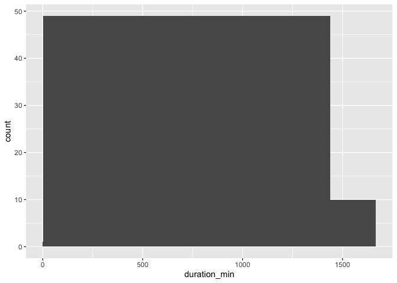<!-- -->

2.  Replace the values of `duration_min` that are greater than `1440`
    minutes (24 hours) with `1440`. Add this to `bike_share_rides` as a
    **new** column called `duration_min_const`.
3.  Assert that all values of `duration_min_const` are between `0` and
    `1440`.

``` r
# 2. duration_min_const: replace vals of duration_min > 1440 with 1440
bike_share_rides_sample <- bike_share_rides_sample %>%
  mutate(duration_min_const = replace(duration_min, duration_min > 1440, 1440))

# 3. Make sure all values of duration_min_const are between 0 and 1440
assert_all_are_in_closed_range(bike_share_rides_sample$duration_min_const, lower = 0, upper = 1440)
```

Radical replacing! The method of replacing erroneous data with the range
limit works well, but you could just as easily replace these values with
`NA`s or something else instead.

### Date constraints

Something has gone wrong and it looks like you have data with dates from
the future, which is way outside of the date range you expected to be
working with. To fix this, you’ll need to remove any rides from the
dataset that have a `date` in the future. Before you can do this, the
`date` column needs to be converted from a `character` to a `Date`.
Having these as `Date` objects will make it much easier to figure out
which rides are from the future, since R makes it easy to check if one
`Date` object is before (`<`) or after (`>`) another.

**Packages**

-   <code><a href="http://lubridate.tidyverse.org">lubridate</a></code>

**Steps**

1.  Convert the `date` column of `bike_share_rides` from `character` to
    the `Date` data type.
2.  Assert that all values in the `date` column happened sometime in the
    past and not in the future.

``` r
# Libraries
library(lubridate)

# 1. Convert date to Date type
bike_share_rides <- bike_share_rides %>%
  mutate(date = as_datetime(date))

# Modify data: Change year to 2043 of 10 random observations
bike_share_rides_mod <- bike_share_rides |> 
                            mutate(date = case_when(ride_id %in% c(99874,15624,89173,39239,23104,39307,13170,51086,87586,21989) ~ `year<-`(date, 2043),
                                                    T ~ date))

# 2. Make sure all dates are in the past
assert_all_are_in_past(bike_share_rides_mod$date)
```

    ## Error in eval(expr, envir, enclos): is_in_past : bike_share_rides_mod$date are not all in the past.
    ## There were 10 failures:
    ##    Position      Value     Cause
    ## 1      1677 2043-04-14 in future
    ## 2      4224 2043-04-14 in future
    ## 3      4929 2043-04-04 in future
    ## 4      6345 2043-04-16 in future
    ## 5      6864 2043-04-16 in future
    ## 6     11582 2043-04-23 in future
    ## 7     17219 2043-04-22 in future
    ## 8     18096 2043-04-22 in future
    ## 9     18394 2043-04-21 in future
    ## 10    22459 2043-04-07 in future

3.  Filter `bike_share_rides` to get only the rides from the past or
    today, and save this as `bike_share_rides_past`.
4.  Assert that the `dates` in `bike_share_rides_past` occurred only in
    the past.

``` r
# 3. Filter for rides that occurred before or on today's date
bike_share_rides_past <- bike_share_rides_mod %>%
  filter(date <= today())

# 4. Make sure all dates from bike_share_rides_past are in the past
assert_all_are_in_past(bike_share_rides_past$date)
```

Fabulous filtering! Handling data from the future like this is much
easier than trying to verify the data’s correctness by time traveling.

### Uniqueness constraints (Duplicates)

Theory. Coming soon …

#### Full duplicates

Whats a full duplicate?

|     | First name | Last name | Address                  | Credit Score |
|-----|------------|-----------|--------------------------|--------------|
| 1   | Miriam     | Day       | 6042 Sollicitudin Avenue | 313          |
| 2   | Miriam     | Day       | 6042 Sollicitudin Avenue | 313          |

You’ve been notified that an update has been made to the bike sharing
data pipeline to make it more efficient, but that duplicates are more
likely to be generated as a result. To make sure that you can continue
using the same scripts to run your weekly analyses about ride
statistics, you’ll need to ensure that any duplicates in the dataset are
removed first.

When multiple rows of a data frame share the same values for all
columns, they’re *full duplicates* of each other. Removing duplicates
like this is important, since having the same value repeated multiple
times can alter summary statistics like the mean and median. Each ride,
including its `ride_id` should be unique.

**Packages**

-   <code><a href="http://sfirke.github.io/janitor/articles/janitor.html">janitor</a></code>

**Steps**

1.  Find full duplicates

``` r
# Modify data
bike_share_rides_mod <- bike_share_rides |> 
  
                            # Add duplicates
                            add_row(bike_share_rides |> slice(17278)) |> 
                            add_row(bike_share_rides |> slice(27208))

# 1. Finding duplicates
bike_share_rides_mod |> 
    filter(bike_share_rides_mod |> duplicated())
```

    ## # A tibble: 2 × 13
    ##   ride_id date                duration  station_A_id station_A_name station_B_id
    ##     <int> <dttm>              <chr>            <dbl> <chr>                 <dbl>
    ## 1   75525 2017-04-02 00:00:00 16.38 mi…            5 Powell St BAR…          101
    ## 2   45767 2017-04-08 00:00:00 3.52 min…           16 Steuart St at…            8
    ## # … with 7 more variables: station_B_name <chr>, bike_id <dbl>,
    ## #   user_gender <chr>, user_birth_year <dbl>, user_birth_year_fct <fct>,
    ## #   duration_trimmed <chr>, duration_mins <dbl>

**Alternative**

``` r
# Libraries
library(janitor)

# 1. Finding duplicates
bike_share_rides_mod |> 
    get_dupes()
```

    ## # A tibble: 4 × 14
    ##   ride_id date                duration  station_A_id station_A_name station_B_id
    ##     <int> <dttm>              <chr>            <dbl> <chr>                 <dbl>
    ## 1   45767 2017-04-08 00:00:00 3.52 min…           16 Steuart St at…            8
    ## 2   45767 2017-04-08 00:00:00 3.52 min…           16 Steuart St at…            8
    ## 3   75525 2017-04-02 00:00:00 16.38 mi…            5 Powell St BAR…          101
    ## 4   75525 2017-04-02 00:00:00 16.38 mi…            5 Powell St BAR…          101
    ## # … with 8 more variables: station_B_name <chr>, bike_id <dbl>,
    ## #   user_gender <chr>, user_birth_year <dbl>, user_birth_year_fct <fct>,
    ## #   duration_trimmed <chr>, duration_mins <dbl>, dupe_count <int>

2.  Get the total number of full duplicates in `bike_share_rides`.

``` r
# 2. Count the number of full duplicates
sum(duplicated(bike_share_rides_mod))
```

    ## [1] 2

3.  Remove all full duplicates from `bike_share_rides` and save the new
    data frame as `bike_share_rides_unique.`
4.  Get the total number of full duplicates in the new
    `bike_share_rides_unique` data frame.

``` r
# 3. Remove duplicates
bike_share_rides_unique <- distinct(bike_share_rides_mod)

# 4. Count the full duplicates in bike_share_rides_unique
sum(duplicated(bike_share_rides_unique))
```

    ## [1] 0

Dazzling duplicate removal! Removing full duplicates will ensure that
summary statistics aren’t altered by repeated data points.

#### Partial duplicates

Whats a partial duplicate?

|     | First name | Last name | Address                    | Credit Score |
|-----|------------|-----------|----------------------------|--------------|
| 1   | Tamekah    | Forbes    | P.O. Box 147, 511 Velit St | 356          |
| 2   | Tamekah    | Forbes    | P.O. Box 147, 511 Velit St | 342          |

##### Removing partial duplicates

Now that you’ve identified and removed the full duplicates, it’s time to
check for partial duplicates. Partial duplicates are a bit tricker to
deal with than full duplicates. In this section, you’ll first identify
any partial duplicates and then practice the most common technique to
deal with them, which involves dropping all partial duplicates, keeping
only the first.

**Steps**

1.  Count the number of occurrences of each `ride_id`.
2.  Filter for `ride_id`s that occur multiple times.

``` r
# Modify data
bike_share_rides_mod <- bike_share_rides |> 
  
                            # Add duplicates
                            add_row(bike_share_rides |> 
                                        slice(33237) |> 
                                        mutate(duration_mins = 5.8)) |> 
                            add_row(bike_share_rides |> 
                                        slice(17657) |> 
                                        mutate(duration_mins = 13.6))

# Find duplicated ride_ids
bike_share_rides_mod %>% 
  # 1. Count the number of occurrences of each ride_id
  count(ride_id) %>% 
  # 2. Filter for rows with a count > 1
  filter(n > 1)
```

    ## # A tibble: 2 × 2
    ##   ride_id     n
    ##     <int> <int>
    ## 1   41441     2
    ## 2   87056     2

**Alternative**

``` r
# 1. Find duplicated ride_ids
bike_share_rides_mod |> 
    janitor::get_dupes(ride_id)
```

    ## # A tibble: 4 × 14
    ##   ride_id dupe_count date                duration  station_A_id station_A_name  
    ##     <int>      <int> <dttm>              <chr>            <dbl> <chr>           
    ## 1   41441          2 2017-04-25 00:00:00 5.92 min…           21 Montgomery St B…
    ## 2   41441          2 2017-04-25 00:00:00 5.92 min…           21 Montgomery St B…
    ## 3   87056          2 2017-04-12 00:00:00 14 minut…           21 Montgomery St B…
    ## 4   87056          2 2017-04-12 00:00:00 14 minut…           21 Montgomery St B…
    ## # … with 8 more variables: station_B_id <dbl>, station_B_name <chr>,
    ## #   bike_id <dbl>, user_gender <chr>, user_birth_year <dbl>,
    ## #   user_birth_year_fct <fct>, duration_trimmed <chr>, duration_mins <dbl>

3.  Remove full and partial duplicates from `bike_share_rides` based on
    `ride_id` only, keeping all columns.
4.  Store this as `bike_share_rides_unique`.
5.  Find the duplicated `ride_id`s in `bike_share_rides_unique`.

``` r
# 3. / 4. Remove full and partial duplicates
bike_share_rides_unique <- bike_share_rides_mod %>%
  # Only based on ride_id instead of all cols
  distinct(ride_id, .keep_all = T)

# 5. Find duplicated ride_ids in bike_share_rides_unique
bike_share_rides_unique %>%
  # Count the number of occurrences of each ride_id
  count(ride_id) %>%
  # Filter for rows with a count > 1
  filter(n > 1)
```

    ## # A tibble: 0 × 2
    ## # … with 2 variables: ride_id <int>, n <int>

Perfect partial duplicate removing! It’s important to consider the data
you’re working with before removing partial duplicates, since sometimes
it’s expected that there will be partial duplicates in a dataset, such
as if the same customer makes multiple purchases.

##### Aggregating partial duplicates

Another way of handling partial duplicates is to compute a summary
statistic of the values that differ between partial duplicates, such as
mean, median, maximum, or minimum. This can come in handy when you’re
not sure how your data was collected and want an average, or if based on
domain knowledge, you’d rather have too high of an estimate than too low
of an estimate (or vice versa).

**Steps**

1.  Group `bike_share_rides` by `ride_id` and `date`.
2.  Add a column called `duration_min_avg` that contains the mean ride
    duration for the row’s `ride_id` and `date`.
3.  Remove duplicates based on `ride_id` and `date`, keeping all columns
    of the data frame.
4.  Remove the `duration_min` column.

``` r
bike_share_rides_mod %>%
  # 1. Group by ride_id and date
  group_by(ride_id, date) %>%
  # 2. Add duration_min_avg column
  mutate(duration_min_avg = mean(duration_mins) ) %>%
  # 3. Remove duplicates based on ride_id and date, keep all cols
  distinct(ride_id, date, .keep_all = TRUE) %>%
  # 4. Remove duration_min column
  select(-duration_mins)
```

    ## # A tibble: 35,229 × 13
    ## # Groups:   ride_id, date [35,229]
    ##    ride_id date                duration station_A_id station_A_name station_B_id
    ##      <int> <dttm>              <chr>           <dbl> <chr>                 <dbl>
    ##  1   52797 2017-04-15 00:00:00 1316.15…           67 San Francisco…           89
    ##  2   54540 2017-04-19 00:00:00 8.13 mi…           21 Montgomery St…           64
    ##  3   87695 2017-04-14 00:00:00 24.85 m…           16 Steuart St at…          355
    ##  4   45619 2017-04-03 00:00:00 6.35 mi…           58 Market St at …          368
    ##  5   70832 2017-04-10 00:00:00 9.8 min…           16 Steuart St at…           81
    ##  6   96135 2017-04-18 00:00:00 17.47 m…            6 The Embarcade…           66
    ##  7   29928 2017-04-22 00:00:00 16.52 m…            5 Powell St BAR…          350
    ##  8   83331 2017-04-11 00:00:00 14.72 m…           16 Steuart St at…           91
    ##  9   72424 2017-04-05 00:00:00 4.12 mi…            5 Powell St BAR…           62
    ## 10   25910 2017-04-20 00:00:00 25.77 m…           81 Berry St at 4…           81
    ## # … with 35,219 more rows, and 7 more variables: station_B_name <chr>,
    ## #   bike_id <dbl>, user_gender <chr>, user_birth_year <dbl>,
    ## #   user_birth_year_fct <fct>, duration_trimmed <chr>, duration_min_avg <dbl>

Awesome aggregation! Aggregation of partial duplicates allows you to
keep some information about all data points instead of keeping
information about just one data point.

# 2. Categorical and Text Data

Categorical and text data can often be some of the messiest parts of a
dataset due to their unstructured nature. In this chapter, you’ll learn
how to fix whitespace and capitalization inconsistencies in category
labels, collapse multiple categories into one, and reformat strings for
consistency.

## Membership constraints

So far, you’ve learned about a number of different problems you can run
into when you have dirty data, including

-   data type constraints,
-   range constraints,
-   uniqueness constraints,
-   and membership constraints.

Categorical variables have a fixed and known set of possible values. In
a `factor`, each category is stored as a number and has a corresponding
label. `factor`s cannot have values that fall outside of the predefined
ones.

| Data                      | Labels                 | Numeric representaion |
|---------------------------|------------------------|-----------------------|
| Marriage status           | `unmarried`, `married` | `1`, `2`              |
| Household income category | `0-20K`, `20-40K`, …   | `1`, `2`, …           |
| T-Shirt size              | `S`, `M`, `L`, `XL`    | `1`, `2`, `3`, `4`    |

It’s important to be able to correctly identify the type of problem
you’re dealing with so that you can treat it correctly.

**Example:** Classification based on whether it’s a membership
constraint issue or a different type of issue:

| Membership constraint                                                          | Other constraint                                |
|--------------------------------------------------------------------------------|-------------------------------------------------|
| A `has_loan` column with the value `25`.                                       | A `revenue` column represented as a string.     |
| A `month` column with the value `14`.                                          | A `birthdate` column with values in the future. |
| A `GPA` column containing a `Z-` grade (Grades are traditionally A through F). | An `age` column with values above `130`.        |
| A `day_of_week` column with the value `12`                                     |                                                 |

### Filtering Joins: a quick review

Keeps or removes observations from the first table without adding
columns

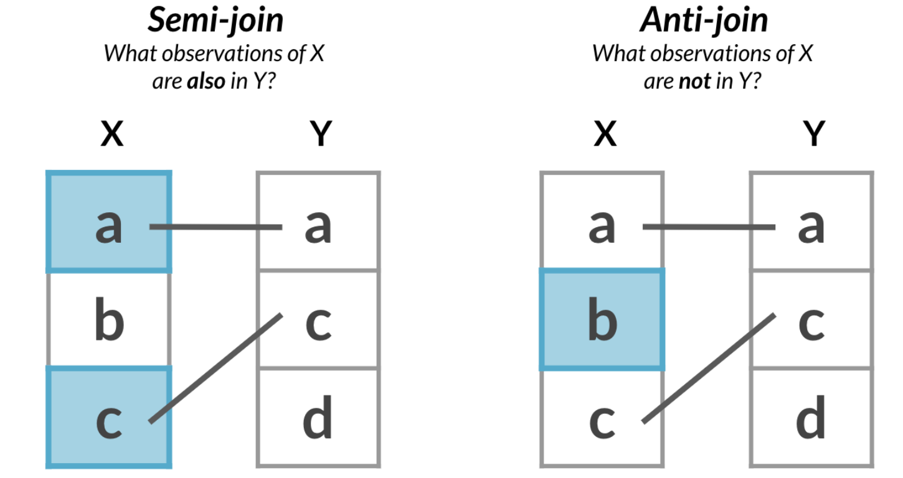

The following example is a good illustration of how that works:

``` r
study_data  <- readRDS("data/study_data.rds")
study_data
```

    ## # A tibble: 7 × 3
    ##   name     birthday   blood_type
    ##   <chr>    <chr>      <chr>     
    ## 1 Beth     2019-10-20 B-        
    ## 2 Ignatius 2020-07-08 A-        
    ## 3 Paul     2019-08-12 O+        
    ## 4 Helen    2019-03-17 O-        
    ## 5 Jennifer 2019-12-17 Z+        
    ## 6 Kennedy  2020-04-27 A+        
    ## 7 Keith    2019-04-19 AB+

``` r
blood_types <- readRDS("data/blood_types.rds") 
blood_types
```

    ## # A tibble: 8 × 1
    ##   blood_type
    ##   <chr>     
    ## 1 O-        
    ## 2 O+        
    ## 3 A-        
    ## 4 A+        
    ## 5 B-        
    ## 6 B+        
    ## 7 AB-       
    ## 8 AB+

**Anti_join: Finding non members**

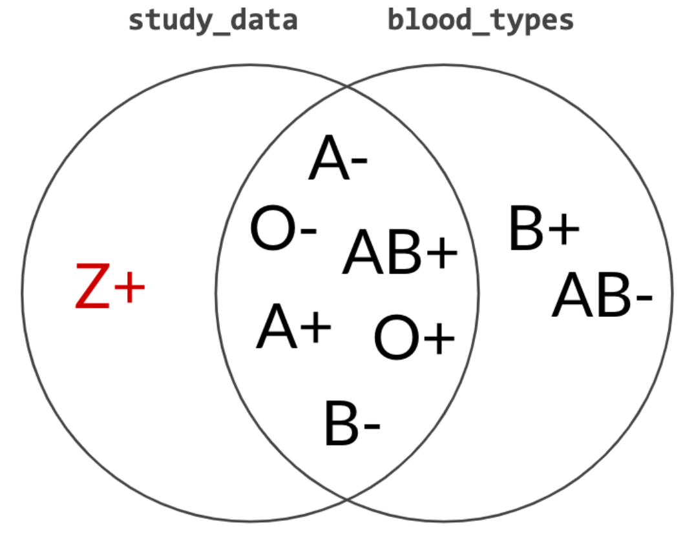

``` r
study_data |> 
  anti_join(blood_types, by = "blood_type")
```

    ## # A tibble: 1 × 3
    ##   name     birthday   blood_type
    ##   <chr>    <chr>      <chr>     
    ## 1 Jennifer 2019-12-17 Z+

**Semi-Join: Removing non members**

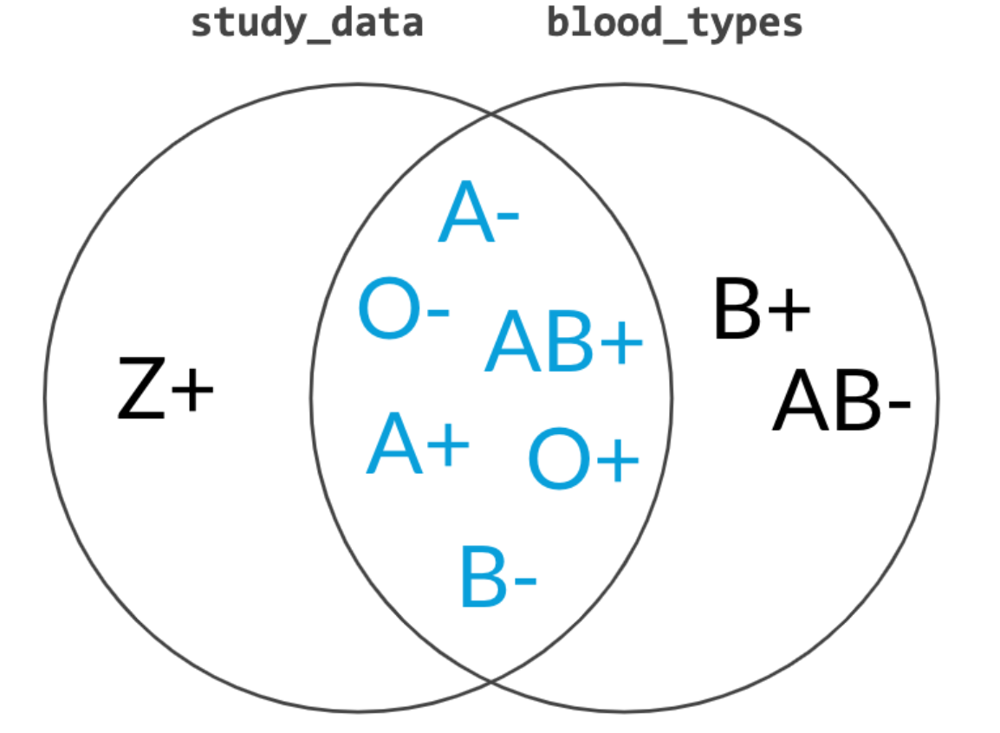

``` r
study_data |> 
  semi_join(blood_types, by = "blood_type")
```

    ## # A tibble: 6 × 3
    ##   name     birthday   blood_type
    ##   <chr>    <chr>      <chr>     
    ## 1 Beth     2019-10-20 B-        
    ## 2 Ignatius 2020-07-08 A-        
    ## 3 Paul     2019-08-12 O+        
    ## 4 Helen    2019-03-17 O-        
    ## 5 Kennedy  2020-04-27 A+        
    ## 6 Keith    2019-04-19 AB+

**Data**

-   `sfo_survey` / `sfo_survey_mod`

Now that we can identify membership constraint problems, it’s time to
fix these problems in a new dataset. Throughout this section, you’ll be
working with a dataset called `sfo_survey`, containing survey responses
from passengers taking flights from San Francisco International Airport
(SFO). Participants were asked questions about the airport’s
cleanliness, wait times, safety, and their overall satisfaction.

There were a few issues during data collection that resulted in some
inconsistencies in the dataset (`sfo_survey_mod`). In the following
steps, you’ll be working with the `dest_size` column, which categorizes
the size of the destination airport that the passengers were flying to.
A data frame called `dest_sizes` will be created that contains all the
possible destination sizes. Your mission is to find rows with invalid
`dest_size`s and remove them from the data frame.

**Steps**

1.  Count the number of occurrences of each `dest_size` in
    `sfo_survey_mod`.

``` r
sfo_survey_mod <- readRDS("data/sfo_survey_mod.rds")

# 1. Count the number of occurrences of dest_size
sfo_survey_mod %>%
  count(dest_size)
```

    ## # A tibble: 8 × 2
    ##   dest_size       n
    ##   <chr>       <int>
    ## 1 "  Small  "     1
    ## 2 " Hub"          1
    ## 3 "Hub"        1756
    ## 4 "huge"          1
    ## 5 "Large"       143
    ## 6 "Large  "       1
    ## 7 "Medium"      681
    ## 8 "Small"       225

> ## *Question*
>
> Take a closer look at your output. Which `dest_size` values appear to
> violate membership constraints?<br> <br> ⬜ `"huge"`, `"Small"`,
> `"Large  "`, and `"Hub"`.<br> ✅ `"huge"`, `"  Small  "`, `"Large  "`,
> and `" Hub"`.<br> ⬜ `"Small"`, `"Medium"`, `"Large"`, and
> `"Hub"`.<br>

2.  Use the correct type of filtering join on the `sfo_survey` data
    frame and the `dest_sizes` data frame to get the rows of
    `sfo_survey` with invalid `dest_size` values.
3.  Get the `id`, `airline`, `destination`, and `dest_size` columns.

``` r
dest_sizes <- tibble(
  dest_size          = c("Small", "Medium", "Large", "Hub"),
  passengers_per_day = c("0-20K", "20K-70K", "70K-100K", "100K+")
)

# Find bad dest_size rows
sfo_survey_mod %>% 
  # 2. Join with dest_sizes data frame to get bad dest_size rows
  anti_join(dest_sizes) %>%
  # 3. Select id, airline, destination, and dest_size cols
  select(id, airline, destination, dest_size)
```

    ## Joining, by = "dest_size"

    ## # A tibble: 4 × 4
    ##      id airline     destination       dest_size  
    ##   <int> <chr>       <chr>             <chr>      
    ## 1   278 UNITED      BALTIMORE         "huge"     
    ## 2   982 LUFTHANSA   MUNICH            " Hub"     
    ## 3  2063 AMERICAN    PHILADELPHIA      "Large  "  
    ## 4   777 UNITED INTL SAN JOSE DEL CABO "  Small  "

4.  Use the correct filtering join on `sfo_survey` and `dest_sizes` to
    get the rows of `sfo_survey` that have a valid `dest_size`.
5.  Count the number of times that each `dest_size` occurs to make sure
    there are no invalid values left behind.

``` r
# Remove bad dest_size rows
sfo_survey_mod %>% 
  # 4. Join with dest_sizes
  semi_join(dest_sizes) %>%
  # 5. Count the number of each dest_size
  count(dest_size)
```

    ## Joining, by = "dest_size"

    ## # A tibble: 4 × 2
    ##   dest_size     n
    ##   <chr>     <int>
    ## 1 Hub        1756
    ## 2 Large       143
    ## 3 Medium      681
    ## 4 Small       225

Great joining! Anti-joins can help you identify the rows that are
causing issues, and semi-joins can remove the issue-causing rows. In the
next lesson, you’ll learn about other ways to deal with bad values so
that you don’t have to lose rows of data.

## Categorical data problems

Theory. Coming soon …

## Identifying inconsistent categorical data

Different kinds of inconsistencies that can occur within categories,
making it look like a variable has more categories than it should:

-   Case inconsistency
-   whitespace inconsistency
-   too many categories
-   …

**Data**

In this section, you’ll continue working with the `sfo_survey_mod`
dataset. You’ll examine the `dest_size` column again as well as the
`cleanliness` column and determine what kind of issues, if any, these
two categorical variables face.

**Steps**

1.  Count the number of occurrences of each category of the `dest_size`
    variable of `sfo_survey`.

``` r
# Count dest_size
sfo_survey_mod %>%
  count(dest_size)
```

    ## # A tibble: 8 × 2
    ##   dest_size       n
    ##   <chr>       <int>
    ## 1 "  Small  "     1
    ## 2 " Hub"          1
    ## 3 "Hub"        1756
    ## 4 "huge"          1
    ## 5 "Large"       143
    ## 6 "Large  "       1
    ## 7 "Medium"      681
    ## 8 "Small"       225

> ## *Question*
>
> Select the statement that most accurately describes the categories in
> the dest_size variable of sfo_survey.<br> <br> ⬜ The categories in
> `dest_size` have no inconsistencies.<br> ⬜ The categories in
> `dest_size` have inconsistent capitalization.<br> ✅ The categories in
> `dest_size` have inconsistent white space.<br> ⬜ The categories in
> `dest_size` have inconsistent capitalization and white space.<br>

2.  Count the number of occurrences of each category of the
    `cleanliness` variable of `sfo_survey`.

``` r
# Count cleanliness
sfo_survey_mod %>%
  count(cleanliness)
```

    ## # A tibble: 9 × 2
    ##   cleanliness        n
    ##   <chr>          <int>
    ## 1 average            1
    ## 2 Average          431
    ## 3 AVERAGE            1
    ## 4 Clean            970
    ## 5 Dirty              2
    ## 6 somewhat clean     1
    ## 7 Somewhat clean  1253
    ## 8 Somewhat dirty    30
    ## 9 <NA>             120

> ## *Question*
>
> Select the statement that most accurately describes the categories in
> the cleanliness variable of sfo_survey.<br> <br> ⬜ The categories in
> `cleanliness` have no inconsistencies.<br> ✅ The categories in
> `cleanliness` have inconsistent capitalization.<br> ⬜ The categories
> in `cleanliness` have inconsistent white space.<br> ⬜ The categories
> in `cleanliness` have inconsistent capitalization and white space.<br>

Incredible identification! In the next exercise, you’ll fix these
inconsistencies to get more accurate counts.

## Correcting inconsistent categorical data

### Trimming & Case Sensitivity

Now that we’ve identified that `dest_size` has whitespace
inconsistencies and `cleanliness` has capitalization inconsistencies,
you’ll use the new tools at your disposal to fix the inconsistent values
in `sfo_survey` instead of removing the data points entirely, which
could add bias to your dataset if more than 5% of the data points need
to be dropped.

**Steps**

1.  Add a column to `sfo_survey` called `dest_size_trimmed` that
    contains the values in the `dest_size` column with all leading and
    trailing whitespace removed.
2.  Add another column called `cleanliness_lower` that contains the
    values in the `cleanliness` column converted to all lowercase.
3.  Count the number of occurrences of each category in
    `dest_size_trimmed`.

``` r
# Add new columns to sfo_survey
sfo_survey_mod <- sfo_survey_mod %>%
  # 1. dest_size_trimmed: dest_size without whitespace
  mutate(dest_size_trimmed = str_trim(dest_size),
         # 2. cleanliness_lower: cleanliness converted to lowercase
         cleanliness_lower = str_to_lower(cleanliness))

# 3. Count values of dest_size_trimmed
sfo_survey_mod %>%
  count(dest_size_trimmed)
```

    ## # A tibble: 5 × 2
    ##   dest_size_trimmed     n
    ##   <chr>             <int>
    ## 1 Hub                1757
    ## 2 huge                  1
    ## 3 Large               144
    ## 4 Medium              681
    ## 5 Small               226

4.  Count the number of occurrences of each category in
    `cleanliness_lower`.

``` r
# 4. Count values of cleanliness_lower
sfo_survey_mod %>%
  count(cleanliness_lower)
```

    ## # A tibble: 6 × 2
    ##   cleanliness_lower     n
    ##   <chr>             <int>
    ## 1 average             433
    ## 2 clean               970
    ## 3 dirty                 2
    ## 4 somewhat clean     1254
    ## 5 somewhat dirty       30
    ## 6 <NA>                120

Lovely lowercase conversion and terrific trimming! You were able to
convert seven-category data into four-category data, which will help
your analysis go more smoothly.

### Collapsing categories

One of the tablets that participants filled out the `sfo_survey` on was
not properly configured, allowing the response for `dest_region` to be
free text instead of a dropdown menu. This resulted in some
inconsistencies in the `dest_region` variable that you’ll need to
correct in this exercise to ensure that the numbers you report to your
boss are as accurate as possible.

**Steps**

1.  Count the categories of `dest_region`.

``` r
# 1. Count categories of dest_region
sfo_survey_mod %>%
  count(dest_region)
```

    ## # A tibble: 12 × 2
    ##    dest_region               n
    ##    <chr>                 <int>
    ##  1 Asia                    260
    ##  2 Australia/New Zealand    66
    ##  3 Canada/Mexico           220
    ##  4 Central/South America    29
    ##  5 East US                 498
    ##  6 EU                        2
    ##  7 eur                       2
    ##  8 Europ                     1
    ##  9 Europe                  396
    ## 10 Middle East              79
    ## 11 Midwest US              281
    ## 12 West US                 975

> ## *Question*
>
> From your output from step 1, which categories need to be
> collapsed?<br> <br> ⬜ `"EU"` and `"Europ"` need to be collapsed to
> `"Europe"`.<br> ✅ `"EU"`, `"eur"`, and `"Europ"` need to be collapsed
> to `"Europe"`.<br> ⬜ `"East US"`, `"Midwest US"`, and `"West US"`
> need to be collapsed to `"US"`.<br> ⬜ `"Asia"` and
> `"Central/South America"` should be collapsed to
> `"Asia and Central/South America"`.<br>

2.  Create a vector called `europe_categories` containing the three
    values of `dest_region` that need to be collapsed.
3.  Add a new column to `sfo_survey` called `dest_region_collapsed` that
    contains the values from the `dest_region` column, except the
    categories stored in `europe_categories` should be collapsed to
    `Europe`.
4.  Count the categories of `dest_region_collapsed`.

``` r
# 2. Categories to map to Europe
europe_categories <- c("EU", "Europ", "eur")

# 3. Add a new col dest_region_collapsed
sfo_survey_mod %>%
  # Map all categories in europe_categories to Europe
  mutate(dest_region_collapsed = fct_collapse(dest_region, 
                                     Europe = europe_categories)) %>%
  # 4. Count categories of dest_region_collapsed
  count(dest_region_collapsed)
```

    ## # A tibble: 9 × 2
    ##   dest_region_collapsed     n
    ##   <fct>                 <int>
    ## 1 Asia                    260
    ## 2 Australia/New Zealand    66
    ## 3 Canada/Mexico           220
    ## 4 Central/South America    29
    ## 5 East US                 498
    ## 6 Europe                  401
    ## 7 Middle East              79
    ## 8 Midwest US              281
    ## 9 West US                 975

Clean collapsing! You’ve reduced the number of categories from 12 to 9,
and you can now be confident that 401 of the survey participants were
heading to Europe.

## Cleaning text data

Theory. Coming soon …

## Detecting inconsistent text data

You’ve recently received some news that the customer support team wants
to ask the SFO survey participants some follow-up questions. However,
the auto-dialer that the call center uses isn’t able to parse all of the
phone numbers since they’re all in different formats. After some
investigation, you found that some phone numbers are written with
hyphens (`-`) and some are written with parentheses (`(`,`)`). In this
exercise, you’ll figure out which phone numbers have these issues so
that you know which ones need fixing.

**Steps**

1.  Filter for rows with phone numbers that contain `"-"`s.

``` r
# 1. Filter for rows with "-" in the phone column
sfo_survey_mod %>%
  filter(phone %>% str_detect("-"))
```

    ## # A tibble: 1,421 × 15
    ##       id day   airline destination dest_region dest_size boarding_area dept_time
    ##    <int> <chr> <chr>   <chr>       <chr>       <chr>     <chr>         <chr>    
    ##  1  1844 Mond… TURKIS… ISTANBUL    Middle East Hub       Gates 91-102  2018-12-…
    ##  2  1840 Mond… TURKIS… ISTANBUL    Middle East Hub       Gates 91-102  2018-12-…
    ##  3  3010 Wedn… AMERIC… MIAMI       East US     Hub       Gates 50-59   2018-12-…
    ##  4  2097 Mond… UNITED… MEXICO CITY Canada/Mex… Hub       Gates 91-102  2018-12-…
    ##  5  1835 Mond… TURKIS… ISTANBUL    Middle East Hub       Gates 91-102  2018-12-…
    ##  6  1849 Mond… TURKIS… ISTANBUL    Middle East Hub       Gates 91-102  2018-12-…
    ##  7  2289 Wedn… QANTAS  SYDNEY      Australia/… Hub       Gates 1-12    2018-12-…
    ##  8   105 Tues… UNITED  WASHINGTON… East US     Medium    Gates 70-90   2018-12-…
    ##  9  1973 Frid… CATHAY… HONG KONG   Asia        Hub       Gates 1-12    2018-12-…
    ## 10  2385 Wedn… UNITED… SYDNEY      Australia/… Hub       Gates 91-102  2018-12-…
    ## # … with 1,411 more rows, and 7 more variables: wait_min <dbl>,
    ## #   cleanliness <chr>, safety <chr>, satisfaction <chr>, phone <chr>,
    ## #   dest_size_trimmed <chr>, cleanliness_lower <chr>

2.  Filter for rows with phone numbers that contain `"("`, or `")"`.
    Remember to use `fixed()` when searching for parentheses.

``` r
# 2. Filter for rows with "(" or ")" in the phone column
sfo_survey_mod %>%
  filter(str_detect(phone, fixed("(")) | str_detect(phone, fixed(")")))
```

    ## # A tibble: 739 × 15
    ##       id day   airline destination dest_region dest_size boarding_area dept_time
    ##    <int> <chr> <chr>   <chr>       <chr>       <chr>     <chr>         <chr>    
    ##  1  3010 Wedn… AMERIC… MIAMI       East US     Hub       Gates 50-59   2018-12-…
    ##  2  2097 Mond… UNITED… MEXICO CITY Canada/Mex… Hub       Gates 91-102  2018-12-…
    ##  3  1835 Mond… TURKIS… ISTANBUL    Middle East Hub       Gates 91-102  2018-12-…
    ##  4   105 Tues… UNITED  WASHINGTON… East US     Medium    Gates 70-90   2018-12-…
    ##  5  1973 Frid… CATHAY… HONG KONG   Asia        Hub       Gates 1-12    2018-12-…
    ##  6  2385 Wedn… UNITED… SYDNEY      Australia/… Hub       Gates 91-102  2018-12-…
    ##  7   517 Sund… UNITED  FT. LAUDER… East US     Large     Gates 60-69   2018-12-…
    ##  8  2885 Frid… EVA AIR TAIPEI      Asia        Hub       Gates 91-102  2018-12-…
    ##  9  2128 Wedn… FRONTI… DENVER      West US     Hub       Gates 20-39   2018-12-…
    ## 10  2132 Wedn… FRONTI… DENVER      West US     Hub       Gates 20-39   2018-12-…
    ## # … with 729 more rows, and 7 more variables: wait_min <dbl>,
    ## #   cleanliness <chr>, safety <chr>, satisfaction <chr>, phone <chr>,
    ## #   dest_size_trimmed <chr>, cleanliness_lower <chr>

Delightful detection! Now that you’ve identified the inconsistencies in
the `phone` column, it’s time to remove unnecessary characters to make
the follow-up survey go as smoothly as possible.

## Correcting inconsistent text data

### Replacing and removing

In the last section, you saw that the `phone` column of `sfo_data` is
plagued with unnecessary parentheses and hyphens. The customer support
team has requested that all phone numbers be in the format
`"123 456 7890"`.

**Steps**

1.  Remove opening and closing parentheses from the `phone` column.
    Store this as a variable called `phone_no_parens`. Remember to use
    `fixed()`!
2.  Add a new column to `sfo_survey` called `phone_no_parens` that
    contains the contents of `phone_no_parens`.
3.  Create a new column of `sfo_survey` called `phone_clean` containing
    the values of `phone_no_parens` with all hyphens replaced with
    spaces.

``` r
# 1. Remove parentheses from phone column
phone_no_parens <- sfo_survey_mod$phone %>%
  # Remove "("s
  str_remove_all(fixed("(")) %>%
  # Remove ")"s
  str_remove_all(fixed(")"))

# 2. Add phone_no_parens as column
sfo_survey_mod %>%
  mutate(phone_no_parens = phone_no_parens,
  # 3. Replace all hyphens in phone_no_parens with spaces
         phone_clean = str_replace_all(phone_no_parens, "-", " "))
```

    ## # A tibble: 2,809 × 17
    ##       id day   airline destination dest_region dest_size boarding_area dept_time
    ##    <int> <chr> <chr>   <chr>       <chr>       <chr>     <chr>         <chr>    
    ##  1  1842 Mond… TURKIS… ISTANBUL    Middle East Hub       Gates 91-102  2018-12-…
    ##  2  1844 Mond… TURKIS… ISTANBUL    Middle East Hub       Gates 91-102  2018-12-…
    ##  3  1840 Mond… TURKIS… ISTANBUL    Middle East Hub       Gates 91-102  2018-12-…
    ##  4  1837 Mond… TURKIS… ISTANBUL    Middle East Hub       Gates 91-102  2018-12-…
    ##  5  1833 Mond… TURKIS… ISTANBUL    Middle East Hub       Gates 91-102  2018-12-…
    ##  6  3010 Wedn… AMERIC… MIAMI       East US     Hub       Gates 50-59   2018-12-…
    ##  7  1838 Mond… TURKIS… ISTANBUL    Middle East Hub       Gates 91-102  2018-12-…
    ##  8  1845 Mond… TURKIS… ISTANBUL    Middle East Hub       Gates 91-102  2018-12-…
    ##  9  2097 Mond… UNITED… MEXICO CITY Canada/Mex… Hub       Gates 91-102  2018-12-…
    ## 10  1846 Mond… TURKIS… ISTANBUL    Middle East Hub       Gates 91-102  2018-12-…
    ## # … with 2,799 more rows, and 9 more variables: wait_min <dbl>,
    ## #   cleanliness <chr>, safety <chr>, satisfaction <chr>, phone <chr>,
    ## #   dest_size_trimmed <chr>, cleanliness_lower <chr>, phone_no_parens <chr>,
    ## #   phone_clean <chr>

Radical replacing and removing! Now that your phone numbers are all in a
single format, the machines in the call center will be able to auto-dial
the numbers, making it easier to ask participants follow-up questions.

### Invalid format

The customer support team is grateful for your work so far, but during
their first day of calling participants, they ran into some phone
numbers that were invalid. In this section, you’ll remove any rows with
invalid phone numbers so that these faulty numbers don’t keep slowing
the team down.

**Steps**

1.  Examine the invalid `phone` numbers by filtering for numbers whose
    length is not equal to 12.

``` r
# 1. Check out the invalid numbers
sfo_survey_mod %>%
  filter(str_length(phone_no_parens) != 12)
```

    ## # A tibble: 5 × 15
    ##      id day    airline destination dest_region dest_size boarding_area dept_time
    ##   <int> <chr>  <chr>   <chr>       <chr>       <chr>     <chr>         <chr>    
    ## 1  2262 Satur… UNITED  BAKERSFIELD West US     Small     Gates 70-90   2018-12-…
    ## 2  3081 Sunday COPA    PANAMA CITY Central/So… Medium    Gates 1-12    2018-12-…
    ## 3   340 Wedne… SOUTHW… PHOENIX     West US     Hub       Gates 20-39   2018-12-…
    ## 4  1128 Thurs… DELTA   MINNEAPOLI… Midwest US  Hub       Gates 40-48   2018-12-…
    ## 5   373 Friday ALASKA  SAN JOSE D… Canada/Mex… Small     Gates 50-59   2018-12-…
    ## # … with 7 more variables: wait_min <dbl>, cleanliness <chr>, safety <chr>,
    ## #   satisfaction <chr>, phone <chr>, dest_size_trimmed <chr>,
    ## #   cleanliness_lower <chr>

2.  Remove the rows with invalid numbers by filtering for numbers with a
    length of exactly 12.

``` r
# Remove rows with invalid numbers
sfo_survey_mod %>%
  filter(str_length(phone_no_parens) == 12)
```

    ## # A tibble: 2,804 × 15
    ##       id day   airline destination dest_region dest_size boarding_area dept_time
    ##    <int> <chr> <chr>   <chr>       <chr>       <chr>     <chr>         <chr>    
    ##  1  1842 Mond… TURKIS… ISTANBUL    Middle East Hub       Gates 91-102  2018-12-…
    ##  2  1844 Mond… TURKIS… ISTANBUL    Middle East Hub       Gates 91-102  2018-12-…
    ##  3  1840 Mond… TURKIS… ISTANBUL    Middle East Hub       Gates 91-102  2018-12-…
    ##  4  1837 Mond… TURKIS… ISTANBUL    Middle East Hub       Gates 91-102  2018-12-…
    ##  5  1833 Mond… TURKIS… ISTANBUL    Middle East Hub       Gates 91-102  2018-12-…
    ##  6  3010 Wedn… AMERIC… MIAMI       East US     Hub       Gates 50-59   2018-12-…
    ##  7  1838 Mond… TURKIS… ISTANBUL    Middle East Hub       Gates 91-102  2018-12-…
    ##  8  1845 Mond… TURKIS… ISTANBUL    Middle East Hub       Gates 91-102  2018-12-…
    ##  9  2097 Mond… UNITED… MEXICO CITY Canada/Mex… Hub       Gates 91-102  2018-12-…
    ## 10  1846 Mond… TURKIS… ISTANBUL    Middle East Hub       Gates 91-102  2018-12-…
    ## # … with 2,794 more rows, and 7 more variables: wait_min <dbl>,
    ## #   cleanliness <chr>, safety <chr>, satisfaction <chr>, phone <chr>,
    ## #   dest_size_trimmed <chr>, cleanliness_lower <chr>

Mission accomplished! Thanks to your savvy string skills, the follow-up
survey will be done in no time!

## Uniformity

In this section, you’ll dive into more advanced data cleaning problems,
such as ensuring that weights are all written in kilograms instead of
pounds. You’ll also gain invaluable skills that will help you verify
that values have been added correctly and that missing values don’t
negatively impact your analyses.

Different units or formats:

-   **Temperature**: `°C` vs. `°F`  
-   **Weight**: `kg` vs. `g` vs. `lb`
-   **Money**: USD `$` vs. GBP `£` vs. JPY `¥`
-   **Date**: `DD-MM-YYYY` vs. `MM-DD-YYYY` vs. `YYYY-MM-DD`

### Date uniformity

**Data**

-   `accounts`

You work at an asset management company and you’ll be working with the
`accounts` dataset, which contains information about each customer, the
amount in their account, and the date their account was opened. Your
boss has asked you to calculate some summary statistics about the
average value of each account and whether the age of the account is
associated with a higher or lower account value. Before you can do this,
you need to make sure that the `accounts` dataset you’ve been given
doesn’t contain any uniformity problems. In this section, you’ll
investigate the `date_opened` column and clean it up so that all the
dates are in the same format.

**Packages**

-   `lubridate`

**Steps**

1.  Take a look at the head of `accounts` to get a sense of the data
    you’re working with.

``` r
accounts <- readRDS("data/accounts.rds")

# 1. Check out the accounts data frame
head(accounts)
```

    ## # A tibble: 6 × 3
    ##   id       date_opened         total
    ##   <fct>    <chr>               <dbl>
    ## 1 A880C79F 2003-10-19         169305
    ## 2 BE8222DF October 05, 2018   107460
    ## 3 19F9E113 2008-07-29       15297152
    ## 4 A2FE52A3 2005-06-09       14897272
    ## 5 F6DC2C08 2012-03-31         124568
    ## 6 D2E55799 2007-06-20       13635752

> ## *Question*
>
> Try running `as.Date(accounts$date_opened)` in the console and examine
> the output. Notice that you end up with a lot of `NAs`. Why is
> this?<br> <br> ⬜ `as.Date()` needs to be explicitly told the formats
> of every single date, including which dates are in which format.<br>
> ✅ By default, `as.Date()` can’t convert “Month DD, YYYY” formats.<br>
> ⬜ `as.Date()` can’t convert `character`s to `Date`s.<br>

**Steps**

1.  Convert the dates in the `date_opened` column to the same format
    using the `formats` vector and store this as a new column called
    `date_opened_clean`.

``` r
# 1.1 Define the date formats
formats <- c("%Y-%m-%d", "%B %d, %Y")

# 1.2 Convert dates to the same format
accounts %>%
  mutate(date_opened_clean = parse_date_time(date_opened,  orders = formats))
```

    ## # A tibble: 98 × 4
    ##    id       date_opened          total date_opened_clean  
    ##    <fct>    <chr>                <dbl> <dttm>             
    ##  1 A880C79F 2003-10-19          169305 2003-10-19 00:00:00
    ##  2 BE8222DF October 05, 2018    107460 2018-10-05 00:00:00
    ##  3 19F9E113 2008-07-29        15297152 2008-07-29 00:00:00
    ##  4 A2FE52A3 2005-06-09        14897272 2005-06-09 00:00:00
    ##  5 F6DC2C08 2012-03-31          124568 2012-03-31 00:00:00
    ##  6 D2E55799 2007-06-20        13635752 2007-06-20 00:00:00
    ##  7 53AE87EF December 01, 2017 15375984 2017-12-01 00:00:00
    ##  8 3E97F253 2019-06-03        14515800 2019-06-03 00:00:00
    ##  9 4AE79EA1 2011-05-07        23338536 2011-05-07 00:00:00
    ## 10 2322DFB4 2018-04-07          189524 2018-04-07 00:00:00
    ## # … with 88 more rows

Cunning calendar cleaning! Now that the `date_opened` dates are in the
same format, you’ll be able to use them for some plotting in the next
exercise.

### Currency uniformity

Now that your dates are in order, you’ll need to correct any unit
differences. When you first plot the data, you’ll notice that there’s a
group of very high values, and a group of relatively lower values. The
bank has two different offices - one in New York, and one in Tokyo, so
you suspect that the accounts managed by the Tokyo office are in
Japanese yen instead of U.S. dollars. Luckily, you have a data frame
called `account_offices` that indicates which office manages each
customer’s account, so you can use this information to figure out which
`total`s need to be converted from yen to dollars.

The formula to convert yen to dollars is `USD = JPY / 104`.

**Steps**

1.  Create a scatter plot with `date_opened` on the x-axis and `total`
    on the y-axis.

``` r
# 1. Scatter plot of opening date and total amount
accounts %>%
  ggplot(aes(x = date_opened, y = total)) +
  geom_point()
```

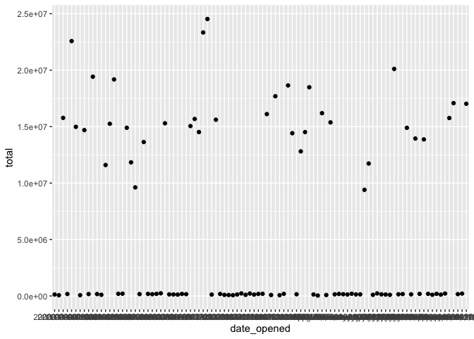<!-- -->

2.  Left join `accounts` and `account_offices` by their `id` columns.

``` r
account_offices <- readRDS("data/account_offices.rds")

# 2. Left join accounts and account_offices by id
accounts %>%
  left_join(account_offices)
```

    ## Joining, by = "id"

    ## # A tibble: 98 × 4
    ##    id       date_opened          total office  
    ##    <fct>    <chr>                <dbl> <chr>   
    ##  1 A880C79F 2003-10-19          169305 New York
    ##  2 BE8222DF October 05, 2018    107460 New York
    ##  3 19F9E113 2008-07-29        15297152 Tokyo   
    ##  4 A2FE52A3 2005-06-09        14897272 Tokyo   
    ##  5 F6DC2C08 2012-03-31          124568 New York
    ##  6 D2E55799 2007-06-20        13635752 Tokyo   
    ##  7 53AE87EF December 01, 2017 15375984 Tokyo   
    ##  8 3E97F253 2019-06-03        14515800 Tokyo   
    ##  9 4AE79EA1 2011-05-07        23338536 Tokyo   
    ## 10 2322DFB4 2018-04-07          189524 New York
    ## # … with 88 more rows

3.  Convert the `total`s from the Tokyo office from yen to dollars, and
    keep the `total` from the New York office in dollars. Store this as
    a new column called `total_usd`.

``` r
# Left join accounts to account_offices by id
accounts %>%
  left_join(account_offices, by = "id") %>%
  # 3. Convert totals from the Tokyo office to USD
  mutate(total_usd = ifelse(total > 5000000, total / 104, total))
```

    ## # A tibble: 98 × 5
    ##    id       date_opened          total office   total_usd
    ##    <fct>    <chr>                <dbl> <chr>        <dbl>
    ##  1 A880C79F 2003-10-19          169305 New York    169305
    ##  2 BE8222DF October 05, 2018    107460 New York    107460
    ##  3 19F9E113 2008-07-29        15297152 Tokyo       147088
    ##  4 A2FE52A3 2005-06-09        14897272 Tokyo       143243
    ##  5 F6DC2C08 2012-03-31          124568 New York    124568
    ##  6 D2E55799 2007-06-20        13635752 Tokyo       131113
    ##  7 53AE87EF December 01, 2017 15375984 Tokyo       147846
    ##  8 3E97F253 2019-06-03        14515800 Tokyo       139575
    ##  9 4AE79EA1 2011-05-07        23338536 Tokyo       224409
    ## 10 2322DFB4 2018-04-07          189524 New York    189524
    ## # … with 88 more rows

4.  Create a scatter plot of your new uniform data using `date_opened`
    on the x-axis and `total_usd` on the y-axis.

``` r
# Left join accounts to account_offices by id
accounts %>%
  left_join(account_offices, by = "id") %>%
  # Convert totals from the Tokyo office to USD
  mutate(total_usd = ifelse(office == "Tokyo", total / 104, total)) %>%
  # 4. Scatter plot of opening date vs total_usd
  ggplot(aes(x = date_opened, y = total_usd)) +
    geom_point()
```

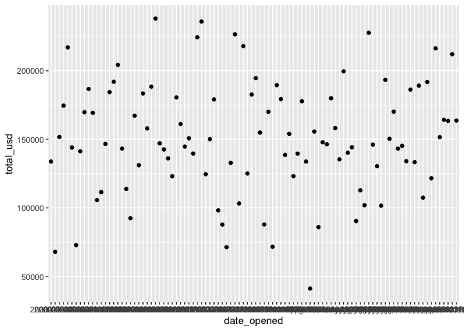<!-- -->

Crafty currency conversion! The points in your last scatter plot all
fall within a much smaller range now and you’ll be able to accurately
assess the differences between accounts from different countries.

## Cross field validation

Theory. Coming soon …

-   Cross field validation = sanity check
-   Does this value makes senese based on another values?


<sup><https://www.buzzfeednews.com/article/katienotopoulos/graphs-that-lied-to-us></sup>

### Validating totals

You’ll continue to work with the `accounts` data frame, but this time,
you have a bit more information about each account. There are three
different funds that account holders can store their money in. In this
section, you’ll validate whether the `total` amount in each account is
equal to the sum of the amount in `fund_A`, `fund_B`, and `fund_C`. If
there are any accounts that don’t match up, you can look into them
further to see what went wrong in the bookkeeping that led to
inconsistencies.

**Steps**

1.  Create a new column called `theoretical_total` that contains the sum
    of the amounts in each fund.
2.  Find the accounts where the `total` doesn’t match the
    `theoretical_total`.

``` r
accounts_mod <- readRDS("data/accounts_mod.rds")

# Find invalid totals
accounts_mod %>%
  # 1. theoretical_total: sum of the three funds
  mutate(theoretical_total = fund_A + fund_B + fund_C) %>%
  # 2. Find accounts where total doesn't match theoretical_total
  filter(theoretical_total != total)
```

    ## # A tibble: 3 × 8
    ##   id       date_opened  total fund_A fund_B fund_C acct_age theoretical_total
    ##   <fct>    <date>       <dbl>  <int>  <int>  <int>    <dbl>             <int>
    ## 1 D5EB0F00 2001-04-16  130920  69487  48681  56408       20            174576
    ## 2 92C237C6 2005-12-13   85362  72556  21739  19537       16            113832
    ## 3 0E5B69F5 2018-05-07  134488  88475  44383  46475        3            179333

Great job! By using cross field validation, you’ve been able to detect
values that don’t make sense. How you choose to handle these values will
depend on the dataset.

### Validating age

Now that you found some inconsistencies in the `total` amounts, you’re
suspicious that there may also be inconsistencies in the
`acct_age`column, and you want to see if these inconsistencies are
related. Using the skills you learned from the video exercise, you’ll
need to validate the age of each account and see if rows with
inconsistent `acct_age`s are the same ones that had inconsistent
`total`s

**Steps**

1.  Create a new column called `theoretical_age` that contains the age
    of each account based on the `date_opened`.
2.  Find the accounts where the `acct_age` doesn’t match the
    `theoretical_age`.

``` r
# Find invalid acct_age
accounts_mod %>%
  # 1. theoretical_age: age of acct based on date_opened
  mutate(theoretical_age = floor(as.numeric(date_opened %--% today(), "years"))) %>%
  # 2. Filter for rows where acct_age is different from theoretical_age
  filter(acct_age != theoretical_age)
```

    ## # A tibble: 6 × 8
    ##   id       date_opened  total fund_A fund_B fund_C acct_age theoretical_age
    ##   <fct>    <date>       <dbl>  <int>  <int>  <int>    <dbl>           <dbl>
    ## 1 11C3C3C0 2017-12-24  180003  84295  31591  64117        3               4
    ## 2 64EF994F 2009-02-26  161141  89269  25939  45933       12              13
    ## 3 EA7FF83A 2004-11-02  111526  86856  19406   5264       16              17
    ## 4 14A2DDB7 2019-03-06  123163  49666  25407  48090        2               3
    ## 5 C5C6B79D 2008-03-01  188424  61972  69266  57186       13              14
    ## 6 3627E08A 2008-04-01  238104  60475  89011  88618       12              13

Vigorous validating! There are three accounts that all have ages off by
one year, but none of them are the same as the accounts that had `total`
inconsistencies, so it looks like these two bookkeeping errors may not
be related.

## Completeness

### Types of missingness

The three flavors of missing data:

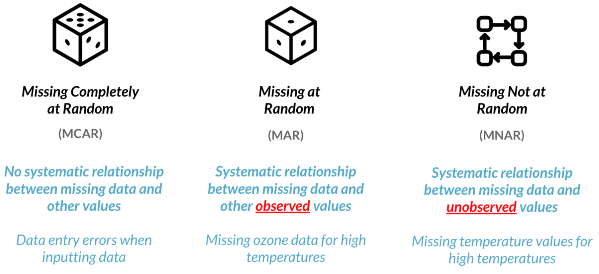

**Example:** Types of missingness.

| Missing completely at random                   | Missing at random                                                                                                                             | Missing not at random                                                                                                                                |
|------------------------------------------------|-----------------------------------------------------------------------------------------------------------------------------------------------|------------------------------------------------------------------------------------------------------------------------------------------------------|
| Questionnaires were randomly lost in the mail. | Younger people were less likely to get their blood pressure checked at the doctor, so their medical records were missing blood pressure data. | Blood samples tested during the night shift were more likely to be contaminated, creating missing test results, but time of testing wasn’t recorded. |
|                                                | Test scores are missing for students from a certain school district, but not the others.                                                      | A scale has a limit of 30 lbs, so shipments above 30 lbs don’t have a recorded weight.                                                               |

### Visualizing missing data

Dealing with missing data is one of the most common tasks in data
science. There are a variety of types of missingness, as well as a
variety of types of solutions to missing data.

**Data**

-   `accounts_new`

You just received a new version of the `accounts` data frame containing
data on the amount held and amount invested for new and existing
customers. However, there are rows with missing `inv_amount` values.

You know for a fact that most customers below 25 do not have investment
accounts yet, and suspect it could be driving the missingness.

**Packages**

-   <code><a href="https://docs.ropensci.org/visdat/">visdat</a></code>

**Steps**

1.  Visualize the missing values in `accounts` by column using a
    function from the `visdat` package.

``` r
accounts_new <- readRDS("data/accounts_new.rds")

#library
library(visdat)

# 1. Visualize the missing values by column
accounts_new %>%
    vis_miss()
```

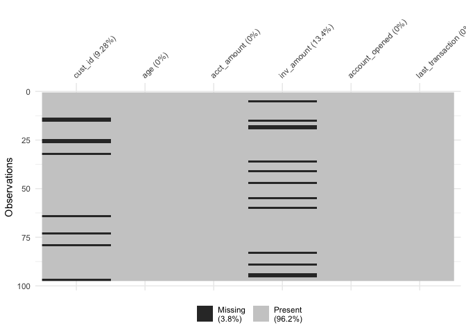<!-- -->

2.  Add a logical column to `accounts` called `missing_inv` that
    indicates whether each row is missing the `inv_amount` or not.
3.  Group by `missing_inv`.
4.  Calculate the mean age for each group of `missing_inv`.

``` r
accounts_new %>%
  # 2. missing_inv: Is inv_amount missing?
  mutate(missing_inv = is.na(inv_amount)) %>%
  # 3. Group by missing_inv
  group_by(missing_inv) %>%
  # 4. Calculate mean age for each missing_inv group
  summarise(avg_age = mean(age))
```

    ## # A tibble: 2 × 2
    ##   missing_inv avg_age
    ##   <lgl>         <dbl>
    ## 1 FALSE          43.6
    ## 2 TRUE           21.8

> ## *Question*
>
> Take a look at the mean age for each group of `missing_inv`. What’s
> going on here?<br> <br> ⬜ The data is missing completely at random
> and there are no drivers behind the missingness.<br> ✅ Since the
> average age for `TRUE` `missing_inv` is 22 and the average age for
> `FALSE` `missing_inv` is 44, it is likely that the `inv_amount`
> variable is missing mostly in young customers.<br> ⬜ Since the
> average age for `FALSE` `missing_inv` is 22 and the average age for
> `TRUE` `missing_inv` is 44, it is likely that the `inv_amount`
> variable is missing mostly in older customers.<br>

5.  Sort `accounts` by `age`.
6.  Visualize missing data by column.

``` r
# 5. / 6. Sort by age and visualize missing vals
accounts_new %>%
  arrange(age) %>%
  vis_miss()
```

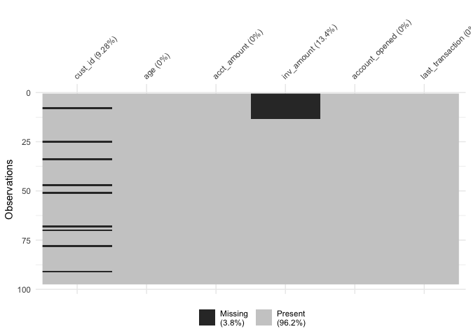<!-- -->

Fabulous visualizations! Investigating summary statistics based on
missingness is a great way to determine if data is missing completely at
random or missing at random.

### Treating missing data

Simple Approaches

1.  Drop missing data
2.  Impute (fill in) with statistical measures (mean, median, mode, …)
    or domain knowledge

More complex approaches

1.  Impute using an algorithmic approach
2.  Impute with machine learning models

**Data**

-   `accounts_new2`

In this section, you’re working with another version of the `accounts`
data that contains missing values for both the `cust_id` and
`acct_amount` columns.

You want to figure out how many unique customers the bank has, as well
as the average amount held by customers. You know that rows with missing
`cust_id` don’t really help you, and that on average, the `acct_amount`
is usually 5 times the amount of `inv_amount`.

In this task, you will drop rows of `accounts` with missing `cust_id`s,
and impute missing values of `inv_amount` with some domain knowledge.
`dplyr` and `assertive` are loaded and `accounts` is available.

**Steps**

1.  Filter `accounts` to remove rows with missing `cust_id`s and save as
    `accounts_clean`.

``` r
accounts_new2 <- readRDS("data/accounts_new2.rds")

# 1. Create accounts_clean
accounts_clean <- accounts_new2 %>%
  # Filter to remove rows with missing cust_id
  filter(!is.na(cust_id))

accounts_clean
```

    ## # A tibble: 88 × 5
    ##    cust_id  acct_amount inv_amount account_opened last_transaction
    ##    <fct>          <dbl>      <dbl> <fct>          <fct>           
    ##  1 8C35540A      44245.     35500. 03-05-18       30-09-19        
    ##  2 D5536652         NA      81922. 21-01-18       14-01-19        
    ##  3 A631984D         NA      46412. 26-01-18       06-10-19        
    ##  4 93F2F951         NA      76563. 21-08-17       10-07-19        
    ##  5 DE0A0882         NA      18669. 05-06-17       15-01-19        
    ##  6 25E68E1B     109738.     93553. 26-12-17       12-11-18        
    ##  7 3FA9296D         NA      70358. 21-06-18       24-08-18        
    ##  8 984403B9         NA      14430. 07-10-17       18-05-18        
    ##  9 870A9281      63523.     51297. 02-09-18       22-02-19        
    ## 10 166B05B0      38175.     15053. 28-02-19       31-10-18        
    ## # … with 78 more rows

2.  Create a new column called `acct_amount_filled`, which contains the
    values of `acct_amount`, except all `NA` values should be replaced
    with 5 times the amount in `inv_amount`.

``` r
# 2. Create accounts_clean
accounts_clean <- accounts_new2 %>%
  # Filter to remove rows with missing cust_id
  filter(!is.na(cust_id)) %>%
  # Add new col acct_amount_filled with replaced NAs
  mutate(acct_amount_filled = ifelse(is.na(acct_amount), 5 * inv_amount, acct_amount))

accounts_clean
```

    ## # A tibble: 88 × 6
    ##    cust_id  acct_amount inv_amount account_opened last_transaction
    ##    <fct>          <dbl>      <dbl> <fct>          <fct>           
    ##  1 8C35540A      44245.     35500. 03-05-18       30-09-19        
    ##  2 D5536652         NA      81922. 21-01-18       14-01-19        
    ##  3 A631984D         NA      46412. 26-01-18       06-10-19        
    ##  4 93F2F951         NA      76563. 21-08-17       10-07-19        
    ##  5 DE0A0882         NA      18669. 05-06-17       15-01-19        
    ##  6 25E68E1B     109738.     93553. 26-12-17       12-11-18        
    ##  7 3FA9296D         NA      70358. 21-06-18       24-08-18        
    ##  8 984403B9         NA      14430. 07-10-17       18-05-18        
    ##  9 870A9281      63523.     51297. 02-09-18       22-02-19        
    ## 10 166B05B0      38175.     15053. 28-02-19       31-10-18        
    ## # … with 78 more rows, and 1 more variable: acct_amount_filled <dbl>

3.  Assert that there are no missing values in the `cust_id` column of
    `accounts_clean`.

``` r
# 3. Assert that cust_id has no missin
assert_all_are_not_na(accounts_clean$cust_id)
```

4.  Assert that there are no missing values in the `acct_amount_filled`
    column of `accounts_clean`.

``` r
# 4. Assert that acct_amount_filled has no missing vals
assert_all_are_not_na(accounts_clean$acct_amount_filled)
```

Great job! Since your assertions passed, there’s no missing data left,
and you can definitely *bank* on nailing your analysis!

# 3. Record Linkage

Record linkage is a powerful technique used to merge multiple datasets
together, used when values have typos or different spellings. In this
section, you’ll learn how to link records by calculating the similarity
between strings—you’ll then use your new skills to join two restaurant
review datasets into one clean master dataset.

**Link or join?**

Similar to joins, record linkage is the act of linking data from
different sources regarding the same entity. But unlike joins, record
linkage does not require exact matches between different pairs of data,
and instead can find close matches using string similarity. This is why
record linkage is effective when there are no common unique keys between
the data sources you can rely upon when linking data sources such as a
unique identifier.

**Example:** Which problems require record linkage and which problems
can be approached using a standard join.

| Record Linkage                                                                                                                                | Regular joins                                                                                                                     |
|-----------------------------------------------------------------------------------------------------------------------------------------------|-----------------------------------------------------------------------------------------------------------------------------------|
| Two customer data frames containing names and address, one with a unique identifier per customer, one without.                                | Consolidating two data frames containing details on DataCamp courses, with each DataCamp course having its own unique identifier. |
| Using an `address` column to join two data frames, with the address in each data frame formatted slightly differently.                        | Two basketball DataFrames with a common unique identifier per game.                                                               |
| Merging two basketball data frames, with columns `team_A`, `team_B`, and `time` and differently formatted team names between each data frame. |                                                                                                                                   |

## stringdist(): Calculating distance

The Damerau-Levenshtein distance can be used to identify how similar two
strings are. As a reminder, Damerau-Levenshtein distance is the
<ins>minimum number of steps</ins> needed to get from ***String A*** to
***String B***, using these operations:

-   **Insertion** of a new character.
-   **Deletion** of an existing character.
-   **Substitution** of an existing character.
-   **Transposition** of two existing consecutive characters.

**Example:** Distance = 1 (method = “dl”)


> ## *Question*
>
> What is the Damerau-Levenshtein distance between the words `"puffin"`
> and `"muffins"` and which operation(s) gets you there?<br> <br> ⬜ 1
> by substituting `"m"` for `"p"`.<br> ⬜ 2 by inserting `"m"` and
> inserting `"s"`.<br> ✅ 2 by substituting `"m"` for `"p"` and
> inserting `"s"`.<br> ⬜ 3 by deleting `"p"`, adding `"m"`, and adding
> `"s"`.<br>

Crafty calculations! Substituting and inserting is the best way to get
from “puffin” to “muffins”.

**Packages**

-   `stringdist`

There are multiple ways to calculate how similar or different two
strings are. Now we’ll practice using the `stringdist` package to
compute string distances using various methods. It’s important to be
familiar with different methods, as some methods work better on certain
datasets, while others work better on other datasets.

**Steps**

1.  Calculate the Damerau-Levenshtein distance between `"las angelos"`
    and `"los angeles"`.

``` r
library(stringdist)

# 1. Calculate Damerau-Levenshtein distance
stringdist("las angelos", "los angeles", method = "dl")
```

    ## [1] 2

2.  Calculate the Longest Common Substring (LCS) distance between
    `"las angelos"` and `"los angeles"`.

``` r
# 2. Calculate LCS distance
stringdist("las angelos", "los angeles", method = "lcs")
```

    ## [1] 4

3.  Calculate the Jaccard distance between `"las angelos"` and
    `"los angeles"`.

``` r
# 3. Calculate Jaccard distance
stringdist("las angelos", "los angeles", method = "jaccard")
```

    ## [1] 0

> ## *Question*
>
> Why is the LCS distance higher than the Damerau-Levenshtein distance
> between “las angelos” and “los angeles”?<br> <br> ⬜
> Damerau-Levenshtein distance is smaller because it’s always a better
> method.<br> ✅ LCS distance only uses insertion and deletion, so it
> takes more operations to change a string to another.<br> ⬜ LCS
> distance only uses insertion, deletion, and substitution, so it takes
> more operations to change a string to another<br>

Superb `stringdist()` skills! In the next exercise, you’ll use
Damerau-Levenshtein distance to map typo-ridden cities to their true
spellings.

## fuzzyjoin(): Fixing typos with string distance

**Data**

-   `zagat`
-   `fodors`

In this section, one of the datasets you’ll be working with, `zagat`, is
a set of restaurants in New York, Los Angeles, Atlanta, San Francisco,
and Las Vegas. The data is from Zagat, a company that collects
restaurant reviews, and includes the restaurant names, addresses, phone
numbers, as well as other restaurant information.

The `city` column contains the name of the city that the restaurant is
located in. However, there are a number of typos throughout the column.
Your task is to map each `city` to one of the five correctly-spelled
cities contained in the `cities` data frame.

**Packages**

-   `fuzzyjoin`

**Steps**

1.  Count the number of each variation of `city` name in `zagat`.

``` r
zagat_mod <- readRDS("data/zagat_mod.rds")

# 1. Count the number of each city variation
zagat_mod %>%
  count(city)
```

    ## # A tibble: 63 × 2
    ##    city             n
    ##    <chr>        <int>
    ##  1 aatlanta         3
    ##  2 an francisco     1
    ##  3 aotlanta         2
    ##  4 atalanta         1
    ##  5 atanta           1
    ##  6 atlannta         2
    ##  7 atlanta         48
    ##  8 atlata           2
    ##  9 ew york          2
    ## 10 la vegas         2
    ## # … with 53 more rows

2.  Left join `zagat` and `cities` based on string distance using the
    `city` and `city_actual` columns.
3.  Select the `name`, `city`, and `city_actual` columns.

``` r
# Library
library(fuzzyjoin)

cities <- tibble(city_actual = c("new york", "los angeles", "atlanta", "san francisco", "las vegas"))

# Join zagat and cities and look at results
zagat_mod %>%
  # 2. Left join based on stringdist using city and city_actual cols
  stringdist_left_join(cities, by = c("city" = "city_actual"), method = "dl") %>%
  # 3. Select the name, city, and city_actual cols
  select(name, city, city_actual)
```

    ## # A tibble: 310 × 3
    ##    name                      city         city_actual
    ##    <chr>                     <chr>        <chr>      
    ##  1 apple pan the             llos angeles los angeles
    ##  2 asahi ramen               los angeles  los angeles
    ##  3 baja fresh                los angeles  los angeles
    ##  4 belvedere the             los angeles  los angeles
    ##  5 benita's frites           lo angeles   los angeles
    ##  6 bernard's                 los angeles  los angeles
    ##  7 bistro 45                 lo angeles   los angeles
    ##  8 brighton coffee shop      los angeles  los angeles
    ##  9 bristol farms market cafe los anegeles los angeles
    ## 10 cafe'50s                  los angeles  los angeles
    ## # … with 300 more rows

Fabulous fixing! Now that you’ve created consistent spelling for each
city, it will be much easier to compute summary statistics by city.

## reclin: Linking records with Pair Blocking

### Pair Blocking

------------------------------------------------------------------------

**Record Linkage**

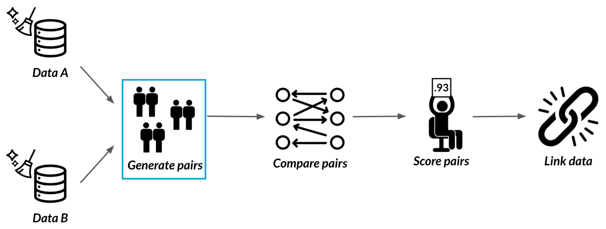

**Too many pairs**

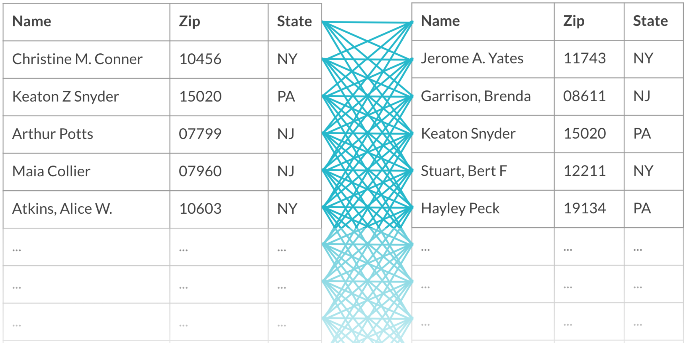

**Blocking**

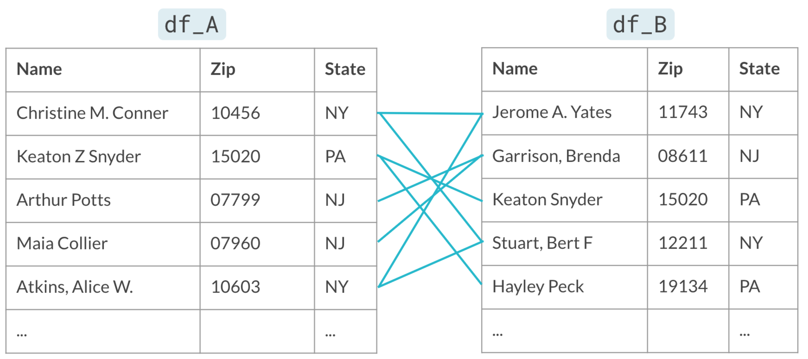

------------------------------------------------------------------------

Zagat and Fodor’s are both companies that gather restaurant reviews. The
`zagat` and `fodors` datasets both contain information about various
restaurants, including addresses, phone numbers, and cuisine types. Some
restaurants appear in both datasets, but don’t necessarily have the same
exact name or phone number written down. In this section, you’ll work
towards figuring out which restaurants appear in both datasets.

The first step towards this goal is to generate pairs of records so that
you can compare them. You’ll first generate all possible pairs, and then
use your newly-cleaned `city` column as a blocking variable.

**Packages**

-   <code><a href="https://github.com/djvanderlaan/reclin">reclin</a></code>

**Steps**

1.  Generate all possible pairs of records between the `zagat` and
    `fodors` datasets (no blocking used).

``` r
zagat  <- readRDS("data/zagat.rds")
fodors <- readRDS("data/fodors.rds")

# Load reclin
library(reclin)

# 1. Generate all possible pairs
pair_blocking(zagat, fodors)
```

    ## Simple blocking
    ##   No blocking used.
    ##   First data set:  310 records
    ##   Second data set: 533 records
    ##   Total number of pairs: 165 230 pairs
    ## 
    ## ldat with 165 230 rows and 2 columns
    ##          x   y
    ## 1        1   1
    ## 2        2   1
    ## 3        3   1
    ## 4        4   1
    ## 5        5   1
    ## 6        6   1
    ## 7        7   1
    ## 8        8   1
    ## 9        9   1
    ## 10      10   1
    ## :        :   :
    ## 165221 301 533
    ## 165222 302 533
    ## 165223 303 533
    ## 165224 304 533
    ## 165225 305 533
    ## 165226 306 533
    ## 165227 307 533
    ## 165228 308 533
    ## 165229 309 533
    ## 165230 310 533

2.  Use pair blocking to generate only pairs that have matching values
    in the `city` column.

``` r
# 2. Generate pairs with same city
pair_blocking(zagat, fodors, blocking_var = "city")
```

    ## Simple blocking
    ##   Blocking variable(s): city
    ##   First data set:  310 records
    ##   Second data set: 533 records
    ##   Total number of pairs: 40 532 pairs
    ## 
    ## ldat with 40 532 rows and 2 columns
    ##         x   y
    ## 1       1   1
    ## 2       1   2
    ## 3       1   3
    ## 4       1   4
    ## 5       1   5
    ## 6       1   6
    ## 7       1   7
    ## 8       1   8
    ## 9       1   9
    ## 10      1  10
    ## :       :   :
    ## 40523 310 414
    ## 40524 310 415
    ## 40525 310 416
    ## 40526 310 417
    ## 40527 310 418
    ## 40528 310 419
    ## 40529 310 420
    ## 40530 310 421
    ## 40531 310 422
    ## 40532 310 423

Perfect pairings! By using `city` as a blocking variable, you were able
to reduce the number of pairs you’ll need to compare from 165,230 pairs
to 40,532.

### Comparing pairs

Now that you’ve generated the pairs of restaurants, it’s time to compare
them. You can easily customize how you perform your comparisons using
the `by` and `default_comparator` arguments. There’s no right answer as
to what each should be set to, so in this exercise, you’ll try a couple
options out.

**Steps**

1.  Compare pairs by `name` using `lcs()` distance.

``` r
# Generate pairs
pair_blocking(zagat, fodors, blocking_var = "city") %>%
  # 1. Compare pairs by name using lcs()
  compare_pairs(by = "name",
      default_comparator = lcs())
```

    ## Compare
    ##   By: name
    ## 
    ## Simple blocking
    ##   Blocking variable(s): city
    ##   First data set:  310 records
    ##   Second data set: 533 records
    ##   Total number of pairs: 40 532 pairs
    ## 
    ## ldat with 40 532 rows and 3 columns
    ##         x   y      name
    ## 1       1   1 0.3157895
    ## 2       1   2 0.3225806
    ## 3       1   3 0.2307692
    ## 4       1   4 0.2608696
    ## 5       1   5 0.4545455
    ## 6       1   6 0.2142857
    ## 7       1   7 0.1052632
    ## 8       1   8 0.2222222
    ## 9       1   9 0.3000000
    ## 10      1  10 0.4516129
    ## :       :   :         :
    ## 40523 310 414 0.3606557
    ## 40524 310 415 0.2631579
    ## 40525 310 416 0.2105263
    ## 40526 310 417 0.3750000
    ## 40527 310 418 0.2978723
    ## 40528 310 419 0.2727273
    ## 40529 310 420 0.3437500
    ## 40530 310 421 0.3414634
    ## 40531 310 422 0.4081633
    ## 40532 310 423 0.1714286

2.  Compare pairs by `name`, `phone`, and `addr` using `jaro_winkler()`.

``` r
# Generate pairs
pair_blocking(zagat, fodors, blocking_var = "city") %>%
  # 2. Compare pairs by name, phone, addr
  compare_pairs(by = c("name", "phone", "addr"),
      default_comparator = jaro_winkler())
```

    ## Compare
    ##   By: name, phone, addr
    ## 
    ## Simple blocking
    ##   Blocking variable(s): city
    ##   First data set:  310 records
    ##   Second data set: 533 records
    ##   Total number of pairs: 40 532 pairs
    ## 
    ## ldat with 40 532 rows and 5 columns
    ##         x   y      name     phone      addr
    ## 1       1   1 0.4871062 0.6746032 0.5703661
    ## 2       1   2 0.5234025 0.5555556 0.6140351
    ## 3       1   3 0.4564103 0.7222222 0.5486355
    ## 4       1   4 0.5102564 0.6746032 0.6842105
    ## 5       1   5 0.5982906 0.5793651 0.5515351
    ## 6       1   6 0.3581197 0.6746032 0.4825911
    ## 7       1   7 0.0000000 0.6269841 0.5457762
    ## 8       1   8 0.4256410 0.6269841 0.4979621
    ## 9       1   9 0.5013736 0.7777778 0.6342105
    ## 10      1  10 0.6011396 0.6746032 0.4654971
    ## :       :   :         :         :         :
    ## 40523 310 414 0.4972291 0.6666667 0.5158263
    ## 40524 310 415 0.5778143 0.6746032 0.5065359
    ## 40525 310 416 0.4426564 0.6666667 0.4294118
    ## 40526 310 417 0.5315404 0.7152778 0.7070387
    ## 40527 310 418 0.5271102 0.6111111 0.7135914
    ## 40528 310 419 0.5204981 0.6944444 0.5683007
    ## 40529 310 420 0.5635103 0.5833333 0.4928843
    ## 40530 310 421 0.4891899 0.6111111 0.6108883
    ## 40531 310 422 0.6204433 0.6746032 0.7774510
    ## 40532 310 423 0.4233716 0.6746032 0.7908497

Crafty comparisons! Choosing a comparator and the columns to compare is
highly dataset-dependent, so it’s best to try out different combinations
to see which works best on the dataset you’re working with. Next, you’ll
build on your string comparison skills and learn about record linkage!

### Score then select or select then score?

Record linkage requires a number of steps that can be difficult to keep
straight. In this section, you’ll solidify your knowledge of the record
linkage process so that it’s a breeze when you code it yourself!

Steps of the record linkage process:

1.  Clean the datasets.
2.  Generate pairs of records.
3.  Compare separate columns of each pair.
4.  Score pairs using summing or probability.
5.  Select pairs that are matches based on their score.
6.  Link the datasets together.

### Putting it together

Above, you’ve cleaned up the `city` column of `zagat` using string
similarity, as well as generated and compared pairs of restaurants from
`zagat` and `fodors`. The end is near - all that’s left to do is score
and select pairs and link the data together, and you’ll be able to begin
your analysis in no time!

**Steps**

1.  Score the pairs of records probabilistically.
2.  Select the pairs that are considered matches.
3.  Link the two data frames together.

Note: comparing pairs by just one column only works with `reclin` 0.1.1.
Current version is 0.1.2.

``` r
# Create pairs
pair_blocking(zagat, fodors, blocking_var = "city") %>%
  # Compare pairs
  compare_pairs(by = "name", default_comparator = jaro_winkler()) %>%
  # 1. Score pairs
  score_problink() %>%
  # 2. Select pairs
  select_n_to_m() %>%
  # 3. Link data 
  link() %>%
  # Convert to tibble
  as_tibble() %>%
  select(id.x, name.x, city.x, id.y, name.y, city.y)
```

    ## Warning: `group_by_()` was deprecated in dplyr 0.7.0.
    ## Please use `group_by()` instead.
    ## See vignette('programming') for more help
    ## This warning is displayed once every 8 hours.
    ## Call `lifecycle::last_lifecycle_warnings()` to see where this warning was generated.

    ## # A tibble: 535 × 6
    ##     id.x name.x                    city.x       id.y name.y            city.y   
    ##    <int> <chr>                     <fct>       <int> <chr>             <fct>    
    ##  1     0 apple pan the             los angeles   124 california pizza… los ange…
    ##  2     1 asahi ramen               los angeles   128 chan dara         los ange…
    ##  3     2 baja fresh                los angeles   121 ca  ` brea        los ange…
    ##  4     3 belvedere the             los angeles   131 dive !            los ange…
    ##  5     4 benita's frites           los angeles   149 louise's trattor… los ange…
    ##  6     5 bernard's                 los angeles   172 trader vic's      los ange…
    ##  7     6 bistro 45                 los angeles   118 bistro garden     los ange…
    ##  8     8 brighton coffee shop      los angeles   139 gladstone's       los ange…
    ##  9     9 bristol farms market cafe los angeles   129 clearwater cafe   los ange…
    ## 10    11 cafe'50s                  los angeles   157 paty's            los ange…
    ## # … with 525 more rows

Lovely linking! Now that your two datasets are merged, you can use the
data to figure out if there are certain characteristics that make a
restaurant more likely to be reviewed by Zagat or Fodor’s.
