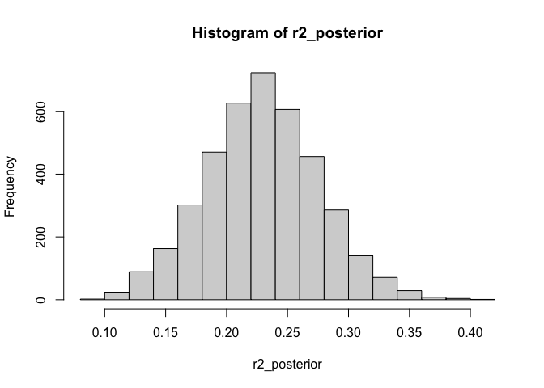
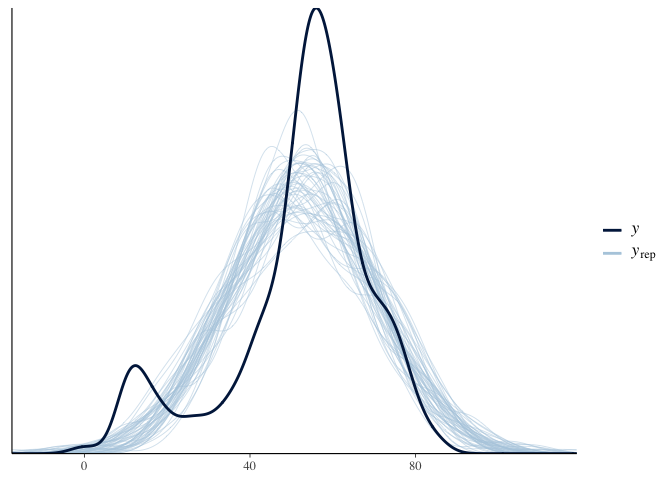
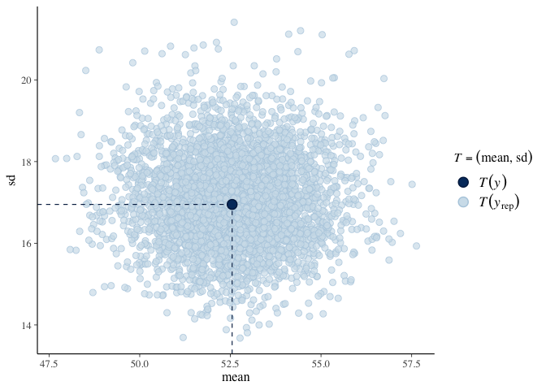
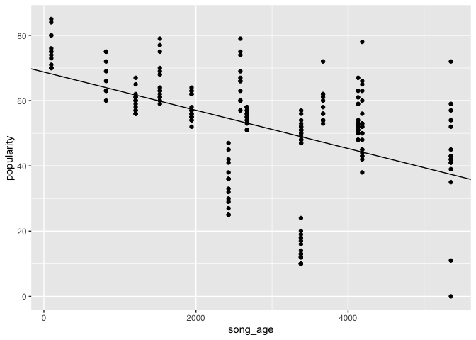
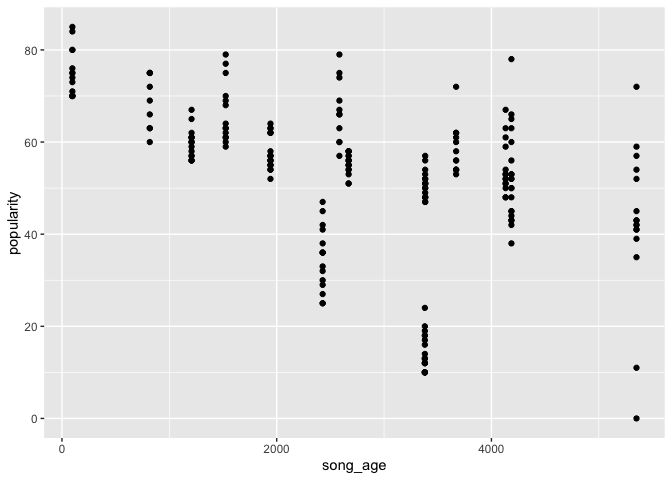
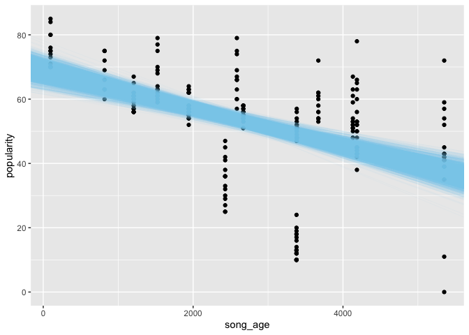
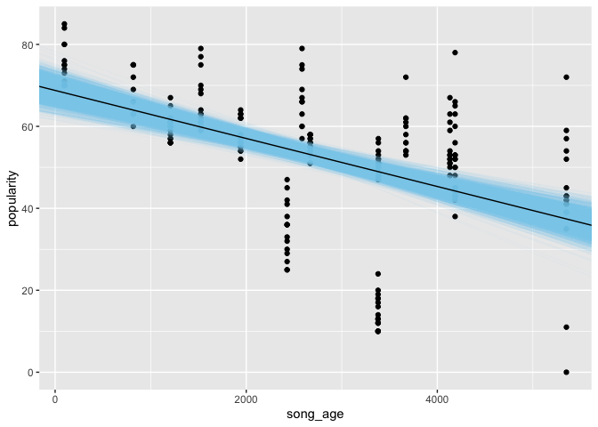
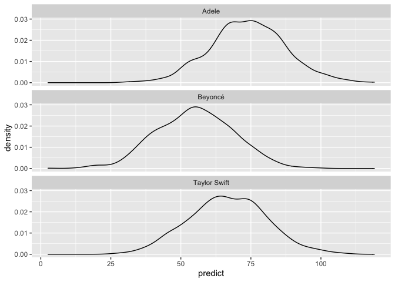

Bayesian Regression Modeling with rstanarm
================
Joschka Schwarz

-   <a href="#1-introduction-to-bayesian-linear-models"
    id="toc-1-introduction-to-bayesian-linear-models">1. Introduction to
    Bayesian Linear Models</a>
    -   <a href="#non-bayesian-linear-regression"
        id="toc-non-bayesian-linear-regression">Non-Bayesian Linear
        Regression</a>
    -   <a href="#exploring-the-data" id="toc-exploring-the-data">Exploring the
        data</a>
    -   <a href="#fitting-a-frequentist-linear-regression"
        id="toc-fitting-a-frequentist-linear-regression">Fitting a frequentist
        linear regression</a>
    -   <a href="#bayesian-linear-regression"
        id="toc-bayesian-linear-regression">Bayesian Linear Regression</a>
    -   <a href="#fitting-a-bayesian-linear-regression"
        id="toc-fitting-a-bayesian-linear-regression">Fitting a Bayesian linear
        regression</a>
    -   <a href="#convergence-criteria"
        id="toc-convergence-criteria">Convergence criteria</a>
    -   <a href="#assessing-model-convergence"
        id="toc-assessing-model-convergence">Assessing model convergence</a>
    -   <a href="#comparing-frequentist-and-bayesian-methods"
        id="toc-comparing-frequentist-and-bayesian-methods">Comparing
        frequentist and Bayesian methods</a>
    -   <a href="#difference-between-frequentists-and-bayesians"
        id="toc-difference-between-frequentists-and-bayesians">Difference
        between frequentists and Bayesians</a>
    -   <a href="#creating-credible-intervals"
        id="toc-creating-credible-intervals">Creating credible intervals</a>
-   <a href="#2-modifying-a-bayesian-model"
    id="toc-2-modifying-a-bayesian-model">2. Modifying a Bayesian Model</a>
    -   <a href="#whats-in-a-bayesian-model"
        id="toc-whats-in-a-bayesian-model">What’s in a Bayesian Model?</a>
    -   <a href="#altering-chains" id="toc-altering-chains">Altering chains</a>
    -   <a href="#do-i-have-enough-iterations"
        id="toc-do-i-have-enough-iterations">Do I have enough iterations?</a>
    -   <a href="#prior-distributions" id="toc-prior-distributions">Prior
        distributions</a>
    -   <a href="#determine-prior-distributions"
        id="toc-determine-prior-distributions">Determine Prior Distributions</a>
    -   <a href="#calculate-adjusted-scales"
        id="toc-calculate-adjusted-scales">Calculate Adjusted Scales</a>
    -   <a href="#unadjusted-priors" id="toc-unadjusted-priors">Unadjusted
        Priors</a>
    -   <a href="#user-specified-priors" id="toc-user-specified-priors">User
        Specified Priors</a>
    -   <a href="#changing-priors" id="toc-changing-priors">Changing Priors</a>
    -   <a href="#specifying-informative-priors"
        id="toc-specifying-informative-priors">Specifying informative priors</a>
    -   <a href="#consequences-of-informative-priors"
        id="toc-consequences-of-informative-priors">Consequences of informative
        priors</a>
    -   <a href="#altering-the-estimation-process"
        id="toc-altering-the-estimation-process">Altering the estimation
        process</a>
    -   <a href="#altering-the-estimation"
        id="toc-altering-the-estimation">Altering the Estimation</a>
-   <a href="#3-assessing-model-fit" id="toc-3-assessing-model-fit">3.
    Assessing Model Fit</a>
    -   <a href="#using-the-r-squared-statistic"
        id="toc-using-the-r-squared-statistic">Using the R Squared statistic</a>
    -   <a href="#calculating-frequentist-r-squared"
        id="toc-calculating-frequentist-r-squared">Calculating Frequentist
        R-squared</a>
    -   <a href="#r-squared-for-a-bayesian-model"
        id="toc-r-squared-for-a-bayesian-model">R-squared for a Bayesian
        Model</a>
    -   <a href="#posterior-predictive-model-checks"
        id="toc-posterior-predictive-model-checks">Posterior predictive model
        checks</a>
    -   <a href="#predicted-score-distributions"
        id="toc-predicted-score-distributions">Predicted score distributions</a>
    -   <a href="#distributions-for-a-single-observation"
        id="toc-distributions-for-a-single-observation">Distributions for a
        single observation</a>
    -   <a href="#model-fit-with-posterior-predictive-model-checks"
        id="toc-model-fit-with-posterior-predictive-model-checks">Model fit with
        posterior predictive model checks</a>
    -   <a href="#r-squared-posterior" id="toc-r-squared-posterior">R-squared
        Posterior</a>
    -   <a href="#posterior-predictive-testing"
        id="toc-posterior-predictive-testing">Posterior Predictive Testing</a>
    -   <a href="#bayesian-model-comparisons"
        id="toc-bayesian-model-comparisons">Bayesian model comparisons</a>
    -   <a href="#calculating-the-loo-estimate"
        id="toc-calculating-the-loo-estimate">Calculating the LOO estimate</a>
    -   <a href="#comparing-models" id="toc-comparing-models">Comparing
        models</a>
-   <a href="#4-presenting-and-using-a-bayesian-regression"
    id="toc-4-presenting-and-using-a-bayesian-regression">4. Presenting and
    Using a Bayesian Regression</a>
    -   <a href="#visualizing-a-bayesian-model"
        id="toc-visualizing-a-bayesian-model">Visualizing a Bayesian model</a>
    -   <a href="#plotting-a-bayesian-model"
        id="toc-plotting-a-bayesian-model">Plotting a Bayesian model</a>
    -   <a href="#plotting-model-uncertainty"
        id="toc-plotting-model-uncertainty">Plotting Model Uncertainty</a>
    -   <a href="#making-predictions" id="toc-making-predictions">Making
        predictions</a>
    -   <a href="#popularity-for-observed-songs"
        id="toc-popularity-for-observed-songs">Popularity for Observed Songs</a>
    -   <a href="#popularity-for-new-songs"
        id="toc-popularity-for-new-songs">Popularity for New Songs</a>
    -   <a href="#visualizing-predictions"
        id="toc-visualizing-predictions">Visualizing predictions</a>
    -   <a href="#format-prediction-posteriors"
        id="toc-format-prediction-posteriors">Format prediction posteriors</a>
    -   <a href="#visualize-new-predictions"
        id="toc-visualize-new-predictions">Visualize New Predictions</a>
    -   <a href="#conclusion" id="toc-conclusion">Conclusion</a>

**Short Description**

Learn how to leverage Bayesian estimation methods to make better
inferences about linear regression models.

**Long Description**

Bayesian estimation offers a flexible alternative to modeling techniques
where the inferences depend on p-values. In this course, you’ll learn
how to estimate linear regression models using Bayesian methods and the
rstanarm package. You’ll be introduced to prior distributions, posterior
predictive model checking, and model comparisons within the Bayesian
framework. You’ll also learn how to use your estimated model to make
predictions for new data.

# 1. Introduction to Bayesian Linear Models

A review of frequentist regression using lm(), an introduction to
Bayesian regression using stan_glm(), and a comparison of the respective
outputs.

## Non-Bayesian Linear Regression

Theory. Coming soon …

**1. Welcome!**

Hello! My name is Jake Thompson. I’m a psychometrician at the University
of Kansas, and I’ll be your instructor in this course. For this course
I’m assuming that you are already familiar with linear regression and
know the basics of Bayesian analysis.

**2. Overview**

Throughout this course we’ll learn how to estimate a Bayesian model,
customize a model, evaluate a model and its predictive power, and
finally how to present and use a Bayesian regression model.

**3. A review of frequentist regression**

Before we get into the Bayesian methods, we’ll first review linear
regression using non-Bayesian, or frequentist, methods. This will
provide helpful comparisons between the inferences we can make when
using frequentist and Bayesian methods. For examples, I’ll be using the
kidiq data from the rstanarm package, a package for Bayesian applied
regression modeling which you’ll be introduced to in the next video and
use throughout this course. This dataset includes scores of kids on an
IQ test, along with the mother’s IQ, age, and whether or not she
finished high school.

**4. A review of frequentist regression**

We can estimate a frequentist linear regression by using the lm
function. For example, we can predict a child’s score from the mother’s
IQ. We can then look at a summary of the model. This output should look
familiar. We have information about the model’s residuals, coefficient
estimates, and information about how our model is performing.

**5. Examing model coefficients**

If we only want information about the coefficients, we can use the tidy
function from the broom package. This shows the estimate, standard
error, test statistic and p-value for each coefficient in the model.
Using a p-value cutoff of 0.05, we see that the mom’s IQ is a
significant predictor of the child’s score on the IQ test.However,
recall what the p-value really tells us. This only tells us the
probability of observing data that give rise to a test statistic this
large if the true value of the parameter were zero. This is the key
problem with frequentist regression.

**6. Comparing Frequentist and Bayesian probabilities**

To illustrate, let’s calculate the probability of a woman having cancer,
given a positive mammogram. We know that if a woman has cancer, they
will have a positive mammogram 90% of the time. This is like the
p-value, the probability of our data, given a null hypothesis. We also
know that in the United States, 0.4% of women have breast cancer. This
what we will later call our prior, or our belief about the parameter
before looking at the data. From this we can calculate that the
probability of a random woman getting a positive mammogram is 10%. So,
given a positive mammogram, what are the chances that the woman has
cancer? Only 3.6%! This is very different from the 90%, and illustrates
the importance of making inferences about the parameter we are
interested in (the probability of cancer), rather than the data (the
probability of a positive mammogram).In this course, we’ll apply these
Bayesian methods to regression to make better inferences about model
parameters.

**7. Spotify data**

For the exercises throughout this course, we’ll be using data on Adele,
Beyoncé, and Taylor Swift songs from the Spotify API. This data includes
the name and artist of each song, the age of the song in days, the
valence, or how positive or negative the song sounds, the tempo, or
speed, of the song, the popularity according to Spotify, and the length
of the song. Throughout this course, we’ll predict the popularity from
the other variables.

**8. Let’s practice!**

Let’s start with a frequentist regression.

## Exploring the data

Let’s get familiar with the Spotify data, `songs`, which is already
loaded for you. Before we start developing models, it’s a good idea to
take a peek at our data to make sure we know everything that is
included.

**Steps**

1.  Print the first 6 rows of the dataset.
2.  Print the structure of the dataset.

``` r
# Load data
library(readr)
songs <- read_csv("data/datacamp-spotify-data.csv")
```

    ## Rows: 215 Columns: 8
    ## ── Column specification ────────────────────────────────────────────────────────
    ## Delimiter: ","
    ## chr (3): track_name, artist_name, album_name
    ## dbl (5): song_age, valence, tempo, popularity, duration_ms
    ## 
    ## ℹ Use `spec()` to retrieve the full column specification for this data.
    ## ℹ Specify the column types or set `show_col_types = FALSE` to quiet this message.

``` r
# Print the first 6 rows
head(songs)
```

    ## # A tibble: 6 × 8
    ##   track_name       artist_name album_name      song_age valence tempo popularity
    ##   <chr>            <chr>       <chr>              <dbl>   <dbl> <dbl>      <dbl>
    ## 1 Crazy In Love    Beyoncé     Dangerously In…     5351    70.1  99.3         72
    ## 2 Naughty Girl     Beyoncé     Dangerously In…     5351    64.3 100.          59
    ## 3 Baby Boy         Beyoncé     Dangerously In…     5351    77.4  91.0         57
    ## 4 Hip Hop Star     Beyoncé     Dangerously In…     5351    96.8 167.          39
    ## 5 Be With You      Beyoncé     Dangerously In…     5351    75.6  74.9         42
    ## 6 Me, Myself and I Beyoncé     Dangerously In…     5351    55.5  83.6         54
    ## # … with 1 more variable: duration_ms <dbl>

``` r
# Print the structure
str(songs)
```

    ## spec_tbl_df [215 × 8] (S3: spec_tbl_df/tbl_df/tbl/data.frame)
    ##  $ track_name : chr [1:215] "Crazy In Love" "Naughty Girl" "Baby Boy" "Hip Hop Star" ...
    ##  $ artist_name: chr [1:215] "Beyoncé" "Beyoncé" "Beyoncé" "Beyoncé" ...
    ##  $ album_name : chr [1:215] "Dangerously In Love" "Dangerously In Love" "Dangerously In Love" "Dangerously In Love" ...
    ##  $ song_age   : num [1:215] 5351 5351 5351 5351 5351 ...
    ##  $ valence    : num [1:215] 70.1 64.3 77.4 96.8 75.6 55.5 56.2 39.8 9.92 68.1 ...
    ##  $ tempo      : num [1:215] 99.3 100 91 166.6 74.9 ...
    ##  $ popularity : num [1:215] 72 59 57 39 42 54 43 41 41 42 ...
    ##  $ duration_ms: num [1:215] 235933 208600 244867 222533 260160 ...
    ##  - attr(*, "spec")=
    ##   .. cols(
    ##   ..   track_name = col_character(),
    ##   ..   artist_name = col_character(),
    ##   ..   album_name = col_character(),
    ##   ..   song_age = col_double(),
    ##   ..   valence = col_double(),
    ##   ..   tempo = col_double(),
    ##   ..   popularity = col_double(),
    ##   ..   duration_ms = col_double()
    ##   .. )
    ##  - attr(*, "problems")=<externalptr>

Great! The data contains information on the name and artist of each
song, along with quantitative information related to the tempo, valence,
popularity, age, and length. Now let’s use the data to estimate a
regression model.

## Fitting a frequentist linear regression

Practice creating a linear model using data on songs from Spotify. This
will give us base line to compare our Bayesian model to. The `songs`
dataset is already loaded for you.

**Steps**

1.  Create a linear model, `lm_model`, that predicts song popularity
    from song age.
2.  Print a summary of the linear model.

``` r
# Create the model here
lm_model <- lm(popularity ~ song_age, data = songs)

# Produce the summary
summary(lm_model)
```

    ## 
    ## Call:
    ## lm(formula = popularity ~ song_age, data = songs)
    ## 
    ## Residuals:
    ##     Min      1Q  Median      3Q     Max 
    ## -38.908  -2.064   2.936   7.718  34.627 
    ## 
    ## Coefficients:
    ##               Estimate Std. Error t value Pr(>|t|)    
    ## (Intercept) 68.6899499  2.2619577  30.367  < 2e-16 ***
    ## song_age    -0.0058526  0.0007327  -7.988 8.52e-14 ***
    ## ---
    ## Signif. codes:  0 '***' 0.001 '**' 0.01 '*' 0.05 '.' 0.1 ' ' 1
    ## 
    ## Residual standard error: 14.9 on 213 degrees of freedom
    ## Multiple R-squared:  0.2305, Adjusted R-squared:  0.2269 
    ## F-statistic: 63.81 on 1 and 213 DF,  p-value: 8.516e-14

3.  Use the **broom** package to view only the coefficients.

``` r
library(broom)
# Print a tidy summary of the coefficients
tidy(lm_model)
```

    ## # A tibble: 2 × 5
    ##   term        estimate std.error statistic  p.value
    ##   <chr>          <dbl>     <dbl>     <dbl>    <dbl>
    ## 1 (Intercept) 68.7      2.26         30.4  2.45e-79
    ## 2 song_age    -0.00585  0.000733     -7.99 8.52e-14

Nice work! You’ve created a frequentist linear model and learned how to
examine the output. In this model, the coefficient for `song_age` is
-0.00585, which means we’d expected the popularity of a song to decrease
by -0.00585 for each additional day.

## Bayesian Linear Regression

Theory. Coming soon …

**1. Bayesian Linear Regression**

Now that we’ve reviewed the characteristics of a frequentist regression,
let’s examine how to estimate that same regression using Bayesian
methods.

**2. Why use Bayesian methods?**

As we learned in the last lesson, if we want to make inferences about
the actual values of parameters, p-values and frequentist regression
fails us. Bayesian estimation is one solution to this problem. With
Bayesian methods the likelihood that used for frequentist regression,
and what’s known as a prior, form a posterior distribution. The details
of this process are beyond the scope of this course. The key point is
that Bayesian methods sample from this posterior distribution, and we
can then create summaries of the distributions to make parameter
inferences. Using the summaries allows us to make inferences about what
values parameters might take.

**3. The rstanarm package**

To estimate Bayesian regression models in this course, we’ll be using
the rstanarm package. rstanarm is an interface to Stan, which is a
programming language for Bayesian inference. The rstanarm package offers
a high level interface with pre-written Stan scripts for common models,
like linear regression.

**4. Using rstanarm**

We can load rstanarm using the normal library command that we use to
load all packages. We can then estimate a linear regression using the
stan_glm function. Here, we estimate the same model that we estimated
using the lm function. Normally, when using the stan_glm function, we
would see a great deal of output that looks like this. This output
mainly provides progress updates. However, the models we’ll estimate in
this course all estimate very quickly. Therefore, this output has been
suppressed in the rest of the course.

**5. Examining an rstanarm model**

Just like a regression estimated with lm, we can look at a summary of a
regression estimated with stan_glm. Using the summary function, we are
presented with some information about the estimated model, the parameter
estimates, and some model diagnostics.

**6. rstanarm summary: Estimates**

Notice the the parameter estimates no longer have test statistics and
p-values as in the frequentist regression. This is because Bayesian
estimation samples from the posterior distribution. This means that
instead of a point estimate and a test statistic, we get a distribution
of plausible values for the parameters, and the estimates section
summarizes those distributions. Specifically we get the mean, standard
deviation, and commonly used percentiles.We also see that there are
parameters in the estimates section other than the (Intercept) and
mom_iq coefficient that we entered into the model. Sigma represents the
standard deviation of errors, mean_ppd is the mean of the posterior
predictive distribution our our outcome variable, kid_iq. We’ll learn
more about predictive distributions in Chapter 3. Finally, log-posterior
is analogous to the likelihood of a frequentist regression. This
represents the log of the combined posterior distributions. This will be
used for model comparisons, which we’ll also explore in Chapter 3.

**7. rstanarm summary: Diagnostics**

In the diagnostics section, the most important statistic to pay
attention to is the R-hat. Unlike in frequentist regression where there
is always a solution using ordinary least squares, in Bayesian models we
have to check to make sure the model converged. If a model is converged,
then the parameter estimates are stable. Otherwise, our results will be
unreliable. In Bayesian estimation, posterior distributions are sampled
in groups, known as chains. By comparing the variance within chains to
the variance across chains, we can measure the stability of our
estimates. This is the R-hat statistic. In general, we want all R-hat
values to be less than 1.1 in order to conclude the model has converged,
as in this example.

**8. Let’s practice!**

Now you try estimating a Bayesian regression model.

## Fitting a Bayesian linear regression

Practice fitting a Bayesian model. This is the same model we already
estimated with frequentist methods, so we’ll be able to compare the
parameter outputs later. The `songs` data is already loaded.

**Steps**

1.  Create a Bayesian linear model, `stan_model`, that predicts song
    popularity from song age
2.  Print a summary of the Bayesian linear model

``` r
# Load package
library(rstanarm)
```

    ## Loading required package: Rcpp

    ## This is rstanarm version 2.21.3

    ## - See https://mc-stan.org/rstanarm/articles/priors for changes to default priors!

    ## - Default priors may change, so it's safest to specify priors, even if equivalent to the defaults.

    ## - For execution on a local, multicore CPU with excess RAM we recommend calling

    ##   options(mc.cores = parallel::detectCores())

``` r
# Create the model here
stan_model <- stan_glm(popularity ~ song_age, data = songs)
```

    ## 
    ## SAMPLING FOR MODEL 'continuous' NOW (CHAIN 1).
    ## Chain 1: 
    ## Chain 1: Gradient evaluation took 3.9e-05 seconds
    ## Chain 1: 1000 transitions using 10 leapfrog steps per transition would take 0.39 seconds.
    ## Chain 1: Adjust your expectations accordingly!
    ## Chain 1: 
    ## Chain 1: 
    ## Chain 1: Iteration:    1 / 2000 [  0%]  (Warmup)
    ## Chain 1: Iteration:  200 / 2000 [ 10%]  (Warmup)
    ## Chain 1: Iteration:  400 / 2000 [ 20%]  (Warmup)
    ## Chain 1: Iteration:  600 / 2000 [ 30%]  (Warmup)
    ## Chain 1: Iteration:  800 / 2000 [ 40%]  (Warmup)
    ## Chain 1: Iteration: 1000 / 2000 [ 50%]  (Warmup)
    ## Chain 1: Iteration: 1001 / 2000 [ 50%]  (Sampling)
    ## Chain 1: Iteration: 1200 / 2000 [ 60%]  (Sampling)
    ## Chain 1: Iteration: 1400 / 2000 [ 70%]  (Sampling)
    ## Chain 1: Iteration: 1600 / 2000 [ 80%]  (Sampling)
    ## Chain 1: Iteration: 1800 / 2000 [ 90%]  (Sampling)
    ## Chain 1: Iteration: 2000 / 2000 [100%]  (Sampling)
    ## Chain 1: 
    ## Chain 1:  Elapsed Time: 0.043104 seconds (Warm-up)
    ## Chain 1:                0.047286 seconds (Sampling)
    ## Chain 1:                0.09039 seconds (Total)
    ## Chain 1: 
    ## 
    ## SAMPLING FOR MODEL 'continuous' NOW (CHAIN 2).
    ## Chain 2: 
    ## Chain 2: Gradient evaluation took 8e-06 seconds
    ## Chain 2: 1000 transitions using 10 leapfrog steps per transition would take 0.08 seconds.
    ## Chain 2: Adjust your expectations accordingly!
    ## Chain 2: 
    ## Chain 2: 
    ## Chain 2: Iteration:    1 / 2000 [  0%]  (Warmup)
    ## Chain 2: Iteration:  200 / 2000 [ 10%]  (Warmup)
    ## Chain 2: Iteration:  400 / 2000 [ 20%]  (Warmup)
    ## Chain 2: Iteration:  600 / 2000 [ 30%]  (Warmup)
    ## Chain 2: Iteration:  800 / 2000 [ 40%]  (Warmup)
    ## Chain 2: Iteration: 1000 / 2000 [ 50%]  (Warmup)
    ## Chain 2: Iteration: 1001 / 2000 [ 50%]  (Sampling)
    ## Chain 2: Iteration: 1200 / 2000 [ 60%]  (Sampling)
    ## Chain 2: Iteration: 1400 / 2000 [ 70%]  (Sampling)
    ## Chain 2: Iteration: 1600 / 2000 [ 80%]  (Sampling)
    ## Chain 2: Iteration: 1800 / 2000 [ 90%]  (Sampling)
    ## Chain 2: Iteration: 2000 / 2000 [100%]  (Sampling)
    ## Chain 2: 
    ## Chain 2:  Elapsed Time: 0.041641 seconds (Warm-up)
    ## Chain 2:                0.042666 seconds (Sampling)
    ## Chain 2:                0.084307 seconds (Total)
    ## Chain 2: 
    ## 
    ## SAMPLING FOR MODEL 'continuous' NOW (CHAIN 3).
    ## Chain 3: 
    ## Chain 3: Gradient evaluation took 9e-06 seconds
    ## Chain 3: 1000 transitions using 10 leapfrog steps per transition would take 0.09 seconds.
    ## Chain 3: Adjust your expectations accordingly!
    ## Chain 3: 
    ## Chain 3: 
    ## Chain 3: Iteration:    1 / 2000 [  0%]  (Warmup)
    ## Chain 3: Iteration:  200 / 2000 [ 10%]  (Warmup)
    ## Chain 3: Iteration:  400 / 2000 [ 20%]  (Warmup)
    ## Chain 3: Iteration:  600 / 2000 [ 30%]  (Warmup)
    ## Chain 3: Iteration:  800 / 2000 [ 40%]  (Warmup)
    ## Chain 3: Iteration: 1000 / 2000 [ 50%]  (Warmup)
    ## Chain 3: Iteration: 1001 / 2000 [ 50%]  (Sampling)
    ## Chain 3: Iteration: 1200 / 2000 [ 60%]  (Sampling)
    ## Chain 3: Iteration: 1400 / 2000 [ 70%]  (Sampling)
    ## Chain 3: Iteration: 1600 / 2000 [ 80%]  (Sampling)
    ## Chain 3: Iteration: 1800 / 2000 [ 90%]  (Sampling)
    ## Chain 3: Iteration: 2000 / 2000 [100%]  (Sampling)
    ## Chain 3: 
    ## Chain 3:  Elapsed Time: 0.034679 seconds (Warm-up)
    ## Chain 3:                0.042954 seconds (Sampling)
    ## Chain 3:                0.077633 seconds (Total)
    ## Chain 3: 
    ## 
    ## SAMPLING FOR MODEL 'continuous' NOW (CHAIN 4).
    ## Chain 4: 
    ## Chain 4: Gradient evaluation took 1e-05 seconds
    ## Chain 4: 1000 transitions using 10 leapfrog steps per transition would take 0.1 seconds.
    ## Chain 4: Adjust your expectations accordingly!
    ## Chain 4: 
    ## Chain 4: 
    ## Chain 4: Iteration:    1 / 2000 [  0%]  (Warmup)
    ## Chain 4: Iteration:  200 / 2000 [ 10%]  (Warmup)
    ## Chain 4: Iteration:  400 / 2000 [ 20%]  (Warmup)
    ## Chain 4: Iteration:  600 / 2000 [ 30%]  (Warmup)
    ## Chain 4: Iteration:  800 / 2000 [ 40%]  (Warmup)
    ## Chain 4: Iteration: 1000 / 2000 [ 50%]  (Warmup)
    ## Chain 4: Iteration: 1001 / 2000 [ 50%]  (Sampling)
    ## Chain 4: Iteration: 1200 / 2000 [ 60%]  (Sampling)
    ## Chain 4: Iteration: 1400 / 2000 [ 70%]  (Sampling)
    ## Chain 4: Iteration: 1600 / 2000 [ 80%]  (Sampling)
    ## Chain 4: Iteration: 1800 / 2000 [ 90%]  (Sampling)
    ## Chain 4: Iteration: 2000 / 2000 [100%]  (Sampling)
    ## Chain 4: 
    ## Chain 4:  Elapsed Time: 0.035181 seconds (Warm-up)
    ## Chain 4:                0.041791 seconds (Sampling)
    ## Chain 4:                0.076972 seconds (Total)
    ## Chain 4:

``` r
# Produce the summary
summary(stan_model)
```

    ## 
    ## Model Info:
    ##  function:     stan_glm
    ##  family:       gaussian [identity]
    ##  formula:      popularity ~ song_age
    ##  algorithm:    sampling
    ##  sample:       4000 (posterior sample size)
    ##  priors:       see help('prior_summary')
    ##  observations: 215
    ##  predictors:   2
    ## 
    ## Estimates:
    ##               mean   sd   10%   50%   90%
    ## (Intercept) 68.7    2.2 65.8  68.7  71.5 
    ## song_age     0.0    0.0  0.0   0.0   0.0 
    ## sigma       15.0    0.8 14.0  14.9  16.0 
    ## 
    ## Fit Diagnostics:
    ##            mean   sd   10%   50%   90%
    ## mean_PPD 52.5    1.5 50.6  52.5  54.5 
    ## 
    ## The mean_ppd is the sample average posterior predictive distribution of the outcome variable (for details see help('summary.stanreg')).
    ## 
    ## MCMC diagnostics
    ##               mcse Rhat n_eff
    ## (Intercept)   0.0  1.0  3842 
    ## song_age      0.0  1.0  3713 
    ## sigma         0.0  1.0  3418 
    ## mean_PPD      0.0  1.0  3887 
    ## log-posterior 0.0  1.0  1873 
    ## 
    ## For each parameter, mcse is Monte Carlo standard error, n_eff is a crude measure of effective sample size, and Rhat is the potential scale reduction factor on split chains (at convergence Rhat=1).

``` r
#   The supplied model object seems to be outputted from the rstanarm package. Tidiers for mixed model output now live in the broom.mixed package.
# Load package
library(broom.mixed)

# Print a tidy summary of the coefficients
tidy(stan_model)
```

    ## # A tibble: 2 × 3
    ##   term        estimate std.error
    ##   <chr>          <dbl>     <dbl>
    ## 1 (Intercept) 68.7      2.28    
    ## 2 song_age    -0.00586  0.000727

Yes! You now know how to estimate a Bayesian regression model! Notice
that the parameter estimates are very similar to those of the
frequentist model. Bayesian estimation won’t usually have a large impact
on your estimates, but will greatly influence the types of estimates you
are able to make.

## Convergence criteria

> ## *Question*
>
> What is the accepted threshold for Rhat to conclude the model has
> converged?<br> <br> ⬜ 1.0<br> ✅ 1.1<br> ⬜ 1.5<br> ⬜ 2<br>

That’s right! If all Rhat values are below 1.1, your model converged!

## Assessing model convergence

Has the Bayesian regression model `stan_model` converged?

> ## *Question*
>
> ???<br> <br> ✅ Yes!<br> ⬜ No way!<br> ⬜ We don’t have enough
> information.<br>

Correct! All of the Rhat values are less than 1.1.

## Comparing frequentist and Bayesian methods

Theory. Coming soon …

## Difference between frequentists and Bayesians

> ## *Question*
>
> What is the core difference between frequentists and Bayesians?<br>
> <br> ✅ Frequentists believe data is random, Bayesians assume
> parameters are random<br> ⬜ Frequentists believe data is fixed,
> Bayesians assume parameters are fixed<br> ⬜ There is no difference,
> just a matter of preference<br> ⬜ Bayesian estimation requires
> special data<br>

Yes! Frequentists assume data is random and parameters are fixed,
whereas Bayesian assume the opposite.

## Creating credible intervals

Practice creating credible intervals. Credible intervals allow us to
make inferences about the probability of a parameter taking a given
value. This is how we determine if a parameter is meaningful when
estimated with Bayesian methods. The Bayesian model, `stan_model`, is
already created for you.

**Steps**

1.  Create 90% credible intervals for the parameters in `stan_model`

``` r
# Create the 90% credible intervals
posterior_interval(stan_model)
```

    ##                       5%          95%
    ## (Intercept) 64.926873209 72.376124669
    ## song_age    -0.007035128 -0.004630491
    ## sigma       13.808990487 16.304135340

2.  Create 95% credible intervals for the parameters in `stan_model`

``` r
# Create the 95% credible intervals
posterior_interval(stan_model, prob = 0.95)
```

    ##                     2.5%        97.5%
    ## (Intercept) 64.212005653 73.067470082
    ## song_age    -0.007299037 -0.004402081
    ## sigma       13.584644026 16.580695679

3.  Create 80% credible intervals for the parameters in `stan_model`

``` r
# Create the 80% credible intervals
posterior_interval(stan_model, prob = 0.80)
```

    ##                     10%          90%
    ## (Intercept) 65.79366896 71.505012820
    ## song_age    -0.00678163 -0.004908686
    ## sigma       14.04923694 15.955492347

Great job! You’re well on your way to becoming a Bayesian! Here, we’ve
learned how to create a credible interval for our parameters, and how to
change how big of an interval we want. These intervals allow us to make
inferences about the actual values of the parameters, unlike in
frequentist regression.

# 2. Modifying a Bayesian Model

Learn how to modify your Bayesian model including changing the number
and length of chains, changing prior distributions, and adding
predictors.

## What’s in a Bayesian Model?

Theory. Coming soon …

**1. What’s in a Bayesian Model?**

In the previous chapter we learned how to estimate a Bayesian linear
regression. In this chapter we’re going learn how these models can be
modified. Unlike in a frequentist regression, there are several ways we
can modify the estimation process. This is important because these
factors will ultimately impact your results. We’ll start by looking at
the sampling of the posterior that creates the distribution summaries
that we see in the output.

**2. Posterior distributions**

As we briefly talked about last chapter, the posterior distribution is
sampled in groups, called chains. Each sample from within the chain is
called an iteration. The chains begin at a random locations. As it
samples, the chain moves toward the area where the combination of
likelihood and prior indicates a high probability of the true parameter
value residing. The more iterations in a chain, the larger the samples
of the posterior distribution will be. This means that the summaries are
directly impacted by the length of the chain, as larger samples allow
for more robust estimates of those summary statistics.

**3. Sampling the posterior distribution**

Here is an example of this process. This is known as a trace plot. It
shows the value of the parameter at each iteration for each chain. We
can see that each chain starts in a different location, but they all
converge on the same area. This is the convergence we talked about
measuring with the R-hat parameter. Convergence is important because it
ensures stable estimates. We can see that this model has not converged
at the beginning, as the chains are in different places and not
horizontal, meaning that the estimates are not stable.

**4. Sampling the Posterior Distribution**

Because the model has not converged at the beginning, we discard these
iterations, leaving only the converged iterations to make up our final
posterior distribution. Here, we can see that by only using the final
1,000 iterations, all of the chains are fully mixed. The iterations that
are discarded are know as warm-up, or burn-in. By default, the rstanarm
package estimates 4 chains. Each chain is 2,000 iterations long, and the
first 1,000 are discarded for warm-up. For the exercises in this course,
to cut down on estimation time, we’ve changed the default to 2 chains,
each with 1,000 iterations, and the first 500 discarded for warm-up. In
your own work, we recommend using the rstanarm defaults.

**5. Changing the number and length of chains**

We change this behavior in rstanarm by using the chains, iter, and
warm-up arguments. Here we’ve specified that we want three chains, each
with 1,000 iterations, and the first 500 should be discarded for
warm-up. This means that our posterior distributions will be made of
1,500 total samples (500 from each chain).

**6. Changing the number and length of chains**

Indeed, when we look at the summary of the model, under Model Info, we
see that the sample is 1500.

**7. Too short chains**

However, we have to be careful about making the number or length of the
chains to short. Using our same example from earlier, if we had instead
requested only 500 iterations, and discarded the first 250, our
posterior distribution wouldn’t be converged, because the chains haven’t
mixed.

**8. How many iterations?**

Because of this, the number of iterations is a balancing act. Fewer
iterations means the model estimates faster, but too few iterations may
keep the model from converging. The number of iterations needed is
different for each model, so it’s important to pay attention to our
R-hat values. If you estimate a model and it hasn’t converged,
increasing the number of iterations and the length of the warm-up is a
good place to start.

**9. Let’s practice!**

Now let’s try some examples.

## Altering chains

Let’s practice changing the number and length of chains so that we can
get a posterior distribution of different sizes. By changing the size of
the posterior, we can change the number of samples used for the
posterior summaries, and impact the estimation time. The `songs` data is
already loaded.

**Steps**

1.  For all models, predict `popularity` from the `song_age`.
2.  Estimate a model with 3 chains, each 1000 iterations long, with the
    first 500 discarded

``` r
# 3 chains, 1000 iterations, 500 warmup
model_3chains <- stan_glm(popularity ~ song_age, data = songs,
    chains = 3, iter = 1000, warmup = 500)
```

    ## 
    ## SAMPLING FOR MODEL 'continuous' NOW (CHAIN 1).
    ## Chain 1: 
    ## Chain 1: Gradient evaluation took 1.5e-05 seconds
    ## Chain 1: 1000 transitions using 10 leapfrog steps per transition would take 0.15 seconds.
    ## Chain 1: Adjust your expectations accordingly!
    ## Chain 1: 
    ## Chain 1: 
    ## Chain 1: Iteration:   1 / 1000 [  0%]  (Warmup)
    ## Chain 1: Iteration: 100 / 1000 [ 10%]  (Warmup)
    ## Chain 1: Iteration: 200 / 1000 [ 20%]  (Warmup)
    ## Chain 1: Iteration: 300 / 1000 [ 30%]  (Warmup)
    ## Chain 1: Iteration: 400 / 1000 [ 40%]  (Warmup)
    ## Chain 1: Iteration: 500 / 1000 [ 50%]  (Warmup)
    ## Chain 1: Iteration: 501 / 1000 [ 50%]  (Sampling)
    ## Chain 1: Iteration: 600 / 1000 [ 60%]  (Sampling)
    ## Chain 1: Iteration: 700 / 1000 [ 70%]  (Sampling)
    ## Chain 1: Iteration: 800 / 1000 [ 80%]  (Sampling)
    ## Chain 1: Iteration: 900 / 1000 [ 90%]  (Sampling)
    ## Chain 1: Iteration: 1000 / 1000 [100%]  (Sampling)
    ## Chain 1: 
    ## Chain 1:  Elapsed Time: 0.027346 seconds (Warm-up)
    ## Chain 1:                0.023635 seconds (Sampling)
    ## Chain 1:                0.050981 seconds (Total)
    ## Chain 1: 
    ## 
    ## SAMPLING FOR MODEL 'continuous' NOW (CHAIN 2).
    ## Chain 2: 
    ## Chain 2: Gradient evaluation took 8e-06 seconds
    ## Chain 2: 1000 transitions using 10 leapfrog steps per transition would take 0.08 seconds.
    ## Chain 2: Adjust your expectations accordingly!
    ## Chain 2: 
    ## Chain 2: 
    ## Chain 2: Iteration:   1 / 1000 [  0%]  (Warmup)
    ## Chain 2: Iteration: 100 / 1000 [ 10%]  (Warmup)
    ## Chain 2: Iteration: 200 / 1000 [ 20%]  (Warmup)
    ## Chain 2: Iteration: 300 / 1000 [ 30%]  (Warmup)
    ## Chain 2: Iteration: 400 / 1000 [ 40%]  (Warmup)
    ## Chain 2: Iteration: 500 / 1000 [ 50%]  (Warmup)
    ## Chain 2: Iteration: 501 / 1000 [ 50%]  (Sampling)
    ## Chain 2: Iteration: 600 / 1000 [ 60%]  (Sampling)
    ## Chain 2: Iteration: 700 / 1000 [ 70%]  (Sampling)
    ## Chain 2: Iteration: 800 / 1000 [ 80%]  (Sampling)
    ## Chain 2: Iteration: 900 / 1000 [ 90%]  (Sampling)
    ## Chain 2: Iteration: 1000 / 1000 [100%]  (Sampling)
    ## Chain 2: 
    ## Chain 2:  Elapsed Time: 0.022208 seconds (Warm-up)
    ## Chain 2:                0.02364 seconds (Sampling)
    ## Chain 2:                0.045848 seconds (Total)
    ## Chain 2: 
    ## 
    ## SAMPLING FOR MODEL 'continuous' NOW (CHAIN 3).
    ## Chain 3: 
    ## Chain 3: Gradient evaluation took 1.2e-05 seconds
    ## Chain 3: 1000 transitions using 10 leapfrog steps per transition would take 0.12 seconds.
    ## Chain 3: Adjust your expectations accordingly!
    ## Chain 3: 
    ## Chain 3: 
    ## Chain 3: Iteration:   1 / 1000 [  0%]  (Warmup)
    ## Chain 3: Iteration: 100 / 1000 [ 10%]  (Warmup)
    ## Chain 3: Iteration: 200 / 1000 [ 20%]  (Warmup)
    ## Chain 3: Iteration: 300 / 1000 [ 30%]  (Warmup)
    ## Chain 3: Iteration: 400 / 1000 [ 40%]  (Warmup)
    ## Chain 3: Iteration: 500 / 1000 [ 50%]  (Warmup)
    ## Chain 3: Iteration: 501 / 1000 [ 50%]  (Sampling)
    ## Chain 3: Iteration: 600 / 1000 [ 60%]  (Sampling)
    ## Chain 3: Iteration: 700 / 1000 [ 70%]  (Sampling)
    ## Chain 3: Iteration: 800 / 1000 [ 80%]  (Sampling)
    ## Chain 3: Iteration: 900 / 1000 [ 90%]  (Sampling)
    ## Chain 3: Iteration: 1000 / 1000 [100%]  (Sampling)
    ## Chain 3: 
    ## Chain 3:  Elapsed Time: 0.025097 seconds (Warm-up)
    ## Chain 3:                0.021507 seconds (Sampling)
    ## Chain 3:                0.046604 seconds (Total)
    ## Chain 3:

``` r
# Print a summary of model_3chains
summary(model_3chains)
```

    ## 
    ## Model Info:
    ##  function:     stan_glm
    ##  family:       gaussian [identity]
    ##  formula:      popularity ~ song_age
    ##  algorithm:    sampling
    ##  sample:       1500 (posterior sample size)
    ##  priors:       see help('prior_summary')
    ##  observations: 215
    ##  predictors:   2
    ## 
    ## Estimates:
    ##               mean   sd   10%   50%   90%
    ## (Intercept) 68.7    2.4 65.7  68.6  71.7 
    ## song_age     0.0    0.0  0.0   0.0   0.0 
    ## sigma       15.0    0.7 14.1  15.0  16.0 
    ## 
    ## Fit Diagnostics:
    ##            mean   sd   10%   50%   90%
    ## mean_PPD 52.5    1.5 50.7  52.6  54.4 
    ## 
    ## The mean_ppd is the sample average posterior predictive distribution of the outcome variable (for details see help('summary.stanreg')).
    ## 
    ## MCMC diagnostics
    ##               mcse Rhat n_eff
    ## (Intercept)   0.1  1.0  1269 
    ## song_age      0.0  1.0  1221 
    ## sigma         0.0  1.0  1449 
    ## mean_PPD      0.0  1.0  1468 
    ## log-posterior 0.1  1.0   572 
    ## 
    ## For each parameter, mcse is Monte Carlo standard error, n_eff is a crude measure of effective sample size, and Rhat is the potential scale reduction factor on split chains (at convergence Rhat=1).

3.  Estimate a model with 2 chains, each 100 iterations long, discarding
    the first 50

``` r
# 2 chains, 100 iterations, 50 warmup
model_2chains <- stan_glm(popularity ~ song_age, data = songs,
    chains = 2, iter = 100, warmup = 50)
```

    ## 
    ## SAMPLING FOR MODEL 'continuous' NOW (CHAIN 1).
    ## Chain 1: 
    ## Chain 1: Gradient evaluation took 1.5e-05 seconds
    ## Chain 1: 1000 transitions using 10 leapfrog steps per transition would take 0.15 seconds.
    ## Chain 1: Adjust your expectations accordingly!
    ## Chain 1: 
    ## Chain 1: 
    ## Chain 1: WARNING: There aren't enough warmup iterations to fit the
    ## Chain 1:          three stages of adaptation as currently configured.
    ## Chain 1:          Reducing each adaptation stage to 15%/75%/10% of
    ## Chain 1:          the given number of warmup iterations:
    ## Chain 1:            init_buffer = 7
    ## Chain 1:            adapt_window = 38
    ## Chain 1:            term_buffer = 5
    ## Chain 1: 
    ## Chain 1: Iteration:  1 / 100 [  1%]  (Warmup)
    ## Chain 1: Iteration: 10 / 100 [ 10%]  (Warmup)
    ## Chain 1: Iteration: 20 / 100 [ 20%]  (Warmup)
    ## Chain 1: Iteration: 30 / 100 [ 30%]  (Warmup)
    ## Chain 1: Iteration: 40 / 100 [ 40%]  (Warmup)
    ## Chain 1: Iteration: 50 / 100 [ 50%]  (Warmup)
    ## Chain 1: Iteration: 51 / 100 [ 51%]  (Sampling)
    ## Chain 1: Iteration: 60 / 100 [ 60%]  (Sampling)
    ## Chain 1: Iteration: 70 / 100 [ 70%]  (Sampling)
    ## Chain 1: Iteration: 80 / 100 [ 80%]  (Sampling)
    ## Chain 1: Iteration: 90 / 100 [ 90%]  (Sampling)
    ## Chain 1: Iteration: 100 / 100 [100%]  (Sampling)
    ## Chain 1: 
    ## Chain 1:  Elapsed Time: 0.002306 seconds (Warm-up)
    ## Chain 1:                0.003947 seconds (Sampling)
    ## Chain 1:                0.006253 seconds (Total)
    ## Chain 1: 
    ## 
    ## SAMPLING FOR MODEL 'continuous' NOW (CHAIN 2).
    ## Chain 2: 
    ## Chain 2: Gradient evaluation took 1e-05 seconds
    ## Chain 2: 1000 transitions using 10 leapfrog steps per transition would take 0.1 seconds.
    ## Chain 2: Adjust your expectations accordingly!
    ## Chain 2: 
    ## Chain 2: 
    ## Chain 2: WARNING: There aren't enough warmup iterations to fit the
    ## Chain 2:          three stages of adaptation as currently configured.
    ## Chain 2:          Reducing each adaptation stage to 15%/75%/10% of
    ## Chain 2:          the given number of warmup iterations:
    ## Chain 2:            init_buffer = 7
    ## Chain 2:            adapt_window = 38
    ## Chain 2:            term_buffer = 5
    ## Chain 2: 
    ## Chain 2: Iteration:  1 / 100 [  1%]  (Warmup)
    ## Chain 2: Iteration: 10 / 100 [ 10%]  (Warmup)
    ## Chain 2: Iteration: 20 / 100 [ 20%]  (Warmup)
    ## Chain 2: Iteration: 30 / 100 [ 30%]  (Warmup)
    ## Chain 2: Iteration: 40 / 100 [ 40%]  (Warmup)
    ## Chain 2: Iteration: 50 / 100 [ 50%]  (Warmup)
    ## Chain 2: Iteration: 51 / 100 [ 51%]  (Sampling)
    ## Chain 2: Iteration: 60 / 100 [ 60%]  (Sampling)
    ## Chain 2: Iteration: 70 / 100 [ 70%]  (Sampling)
    ## Chain 2: Iteration: 80 / 100 [ 80%]  (Sampling)
    ## Chain 2: Iteration: 90 / 100 [ 90%]  (Sampling)
    ## Chain 2: Iteration: 100 / 100 [100%]  (Sampling)
    ## Chain 2: 
    ## Chain 2:  Elapsed Time: 0.003996 seconds (Warm-up)
    ## Chain 2:                0.00754 seconds (Sampling)
    ## Chain 2:                0.011536 seconds (Total)
    ## Chain 2:

    ## Warning: There were 1 chains where the estimated Bayesian Fraction of Missing Information was low. See
    ## https://mc-stan.org/misc/warnings.html#bfmi-low

    ## Warning: Examine the pairs() plot to diagnose sampling problems

    ## Warning: The largest R-hat is 2.37, indicating chains have not mixed.
    ## Running the chains for more iterations may help. See
    ## https://mc-stan.org/misc/warnings.html#r-hat

    ## Warning: Bulk Effective Samples Size (ESS) is too low, indicating posterior means and medians may be unreliable.
    ## Running the chains for more iterations may help. See
    ## https://mc-stan.org/misc/warnings.html#bulk-ess

    ## Warning: Tail Effective Samples Size (ESS) is too low, indicating posterior variances and tail quantiles may be unreliable.
    ## Running the chains for more iterations may help. See
    ## https://mc-stan.org/misc/warnings.html#tail-ess

    ## Warning: Markov chains did not converge! Do not analyze results!

``` r
# Print a summary of model_2chains
summary(model_2chains)
```

    ## 
    ## Model Info:
    ##  function:     stan_glm
    ##  family:       gaussian [identity]
    ##  formula:      popularity ~ song_age
    ##  algorithm:    sampling
    ##  sample:       100 (posterior sample size)
    ##  priors:       see help('prior_summary')
    ##  observations: 215
    ##  predictors:   2
    ## 
    ## Estimates:
    ##               mean   sd   10%   50%   90%
    ## (Intercept) 53.2   17.1 29.4  65.0  70.4 
    ## song_age     0.0    0.0  0.0   0.0   0.0 
    ## sigma       24.8   11.4 14.3  16.1  40.5 
    ## 
    ## Fit Diagnostics:
    ##            mean   sd   10%   50%   90%
    ## mean_PPD 37.4   17.3 13.7  50.0  54.3 
    ## 
    ## The mean_ppd is the sample average posterior predictive distribution of the outcome variable (for details see help('summary.stanreg')).
    ## 
    ## MCMC diagnostics
    ##               mcse Rhat n_eff
    ## (Intercept)   15.0  2.8   1  
    ## song_age       0.0  1.0 116  
    ## sigma         10.0  3.3   1  
    ## mean_PPD      15.2  2.9   1  
    ## log-posterior 88.2  3.3   1  
    ## 
    ## For each parameter, mcse is Monte Carlo standard error, n_eff is a crude measure of effective sample size, and Rhat is the potential scale reduction factor on split chains (at convergence Rhat=1).

Correct! Now you can alter the size of the sample of your poterior
distribution! Be careful when making your chains shorter though. Notice
the warning messages that we received for `model_2chains`. These are an
indication that we didn’t draw enough samples from the posterior
distribution to get good estimates of the parameters.

## Do I have enough iterations?

The `model_2chains` object from the last exercise is load in the
environment.

> ## *Question*
>
> Has the model converged?<br> <br> ⬜ Yeah!<br> ✅ Not a chance!<br> ⬜
> We can’t tell.<br>

Correct! The Rhat values are above 1.1. (depends on the seed)

## Prior distributions

Theory. Coming soon …

**1. Prior distributions**

Now that we’ve talked about how to control the size of our posterior
distribution samples, we can talk about one of the components of the
posterior distribution that we’ve only mentioned in passing so far:
prior distributions.

**2. What’s a prior distribution?**

Prior distributions reflect our prior beliefs about the values of
parameters. This information gets combined with the likelihood of the
data to create the posterior distribution.

**3. Visualizing prior distributions**

Here is an example of how prior distributions can affect the resulting
posterior distribution. The likelihood of the of the data, indicated by
the dashed purple line, stays the same across all three panels. Notice
how, as the teal line showing the priors gets more narrow or
informative, the posterior distribution begins to shift closer to the
prior, and away from the likelihood. In general, priors get more
informative when their distributions are narrow, or we have less data.
We can think about the prior like an additional data point. If we have a
sample of five, a sixth data point can be really influential. If we have
a sample of 5000, one extra data point won’t have much of an
effect.Because priors have the potential to be influential, it is almost
always a good idea to use non-informative or weakly informative priors,
unless you have a good reason for believe that your parameters come from
the informative distribution specified by the prior.

**4. Prior distributions in rstanarm**

We can view the prior distributions for each of our parameters in an
rstanarm model by using the `prior_summary` function. By default the
intercept gets a normally distributed prior with a mean of 0 an standard
deviation of 10, and other coefficients get a normally distributed prior
with a mean of 0 and standard deviation of 2.5. Auxiliary is the error
standard deviation. This uses an exponentially distributed prior with a
rate of 1. However, notice that there are also adjusted scales listed.
This is because rstanarm recognizes that these defaults may not be
appropriate for every dataset. Therefore they adjust the variance based
on your data. For example, here, the standard deviation for the prior of
the intercept was 204.11.

**5. Calculating adjusted scales**

The adjusted scale for the intercept is calculated as 10 times the
standard deviation of your dependent variable. We use 10, because this
is the default scale used by rstanarm for intercept. For predictors, the
scale is calculated as 2.5 divided by the standard deviation of your
predictor times the standard deviation of the dependent variable. Just
like with the intercept, we use 2.5 because this is the default scale
used for predictors. Look again at the priors for the intercept and
predictor in the children’s IQ model. By taking 10 times the standard
deviation of kid_score, our dependent variable, we get the adjusted
scale of 204.11. Similarly, by taking 2.5 divided by the standard
deviation of the mom’s IQ times the standard deviation of the the
children’s IQ, we get that adjusted scale of 3.40.

**6. Unadjusted Priors**

rstanarm uses automatically adjusted the priors in order to ensure the
the specified priors are not too informative. However, we can turn off
this adjustment if we want to. To do this, we can specify autoscale as
false for the intercept prior (which is prior_int), coefficients (which
is just prior), the error (which is prior_aux) or any combination. After
specifying autoscale equals false, we can see that there are no longer
adjusted scales in the prior_summary output.

**7. Let’s practice!**

Now it’s your turn to explore priors in rstanarm.

## Determine Prior Distributions

Now let’s explore the prior distributions for a Bayesian model, so that
we can understand how `rstanarm` handles priors. Priors can have a large
impact on our model, so it’s important to know which prior distributions
were used in an estimated model. The `songs` dataset is already loaded.

**Steps**

1.  Estimate a model predicting `popularity` from `song_age`
2.  Print a summary of the prior distributions to the screen

``` r
# Estimate the model
stan_model <- stan_glm(popularity ~ song_age, data = songs)
```

    ## 
    ## SAMPLING FOR MODEL 'continuous' NOW (CHAIN 1).
    ## Chain 1: 
    ## Chain 1: Gradient evaluation took 1.8e-05 seconds
    ## Chain 1: 1000 transitions using 10 leapfrog steps per transition would take 0.18 seconds.
    ## Chain 1: Adjust your expectations accordingly!
    ## Chain 1: 
    ## Chain 1: 
    ## Chain 1: Iteration:    1 / 2000 [  0%]  (Warmup)
    ## Chain 1: Iteration:  200 / 2000 [ 10%]  (Warmup)
    ## Chain 1: Iteration:  400 / 2000 [ 20%]  (Warmup)
    ## Chain 1: Iteration:  600 / 2000 [ 30%]  (Warmup)
    ## Chain 1: Iteration:  800 / 2000 [ 40%]  (Warmup)
    ## Chain 1: Iteration: 1000 / 2000 [ 50%]  (Warmup)
    ## Chain 1: Iteration: 1001 / 2000 [ 50%]  (Sampling)
    ## Chain 1: Iteration: 1200 / 2000 [ 60%]  (Sampling)
    ## Chain 1: Iteration: 1400 / 2000 [ 70%]  (Sampling)
    ## Chain 1: Iteration: 1600 / 2000 [ 80%]  (Sampling)
    ## Chain 1: Iteration: 1800 / 2000 [ 90%]  (Sampling)
    ## Chain 1: Iteration: 2000 / 2000 [100%]  (Sampling)
    ## Chain 1: 
    ## Chain 1:  Elapsed Time: 0.054361 seconds (Warm-up)
    ## Chain 1:                0.064214 seconds (Sampling)
    ## Chain 1:                0.118575 seconds (Total)
    ## Chain 1: 
    ## 
    ## SAMPLING FOR MODEL 'continuous' NOW (CHAIN 2).
    ## Chain 2: 
    ## Chain 2: Gradient evaluation took 1.4e-05 seconds
    ## Chain 2: 1000 transitions using 10 leapfrog steps per transition would take 0.14 seconds.
    ## Chain 2: Adjust your expectations accordingly!
    ## Chain 2: 
    ## Chain 2: 
    ## Chain 2: Iteration:    1 / 2000 [  0%]  (Warmup)
    ## Chain 2: Iteration:  200 / 2000 [ 10%]  (Warmup)
    ## Chain 2: Iteration:  400 / 2000 [ 20%]  (Warmup)
    ## Chain 2: Iteration:  600 / 2000 [ 30%]  (Warmup)
    ## Chain 2: Iteration:  800 / 2000 [ 40%]  (Warmup)
    ## Chain 2: Iteration: 1000 / 2000 [ 50%]  (Warmup)
    ## Chain 2: Iteration: 1001 / 2000 [ 50%]  (Sampling)
    ## Chain 2: Iteration: 1200 / 2000 [ 60%]  (Sampling)
    ## Chain 2: Iteration: 1400 / 2000 [ 70%]  (Sampling)
    ## Chain 2: Iteration: 1600 / 2000 [ 80%]  (Sampling)
    ## Chain 2: Iteration: 1800 / 2000 [ 90%]  (Sampling)
    ## Chain 2: Iteration: 2000 / 2000 [100%]  (Sampling)
    ## Chain 2: 
    ## Chain 2:  Elapsed Time: 0.048478 seconds (Warm-up)
    ## Chain 2:                0.04679 seconds (Sampling)
    ## Chain 2:                0.095268 seconds (Total)
    ## Chain 2: 
    ## 
    ## SAMPLING FOR MODEL 'continuous' NOW (CHAIN 3).
    ## Chain 3: 
    ## Chain 3: Gradient evaluation took 1e-05 seconds
    ## Chain 3: 1000 transitions using 10 leapfrog steps per transition would take 0.1 seconds.
    ## Chain 3: Adjust your expectations accordingly!
    ## Chain 3: 
    ## Chain 3: 
    ## Chain 3: Iteration:    1 / 2000 [  0%]  (Warmup)
    ## Chain 3: Iteration:  200 / 2000 [ 10%]  (Warmup)
    ## Chain 3: Iteration:  400 / 2000 [ 20%]  (Warmup)
    ## Chain 3: Iteration:  600 / 2000 [ 30%]  (Warmup)
    ## Chain 3: Iteration:  800 / 2000 [ 40%]  (Warmup)
    ## Chain 3: Iteration: 1000 / 2000 [ 50%]  (Warmup)
    ## Chain 3: Iteration: 1001 / 2000 [ 50%]  (Sampling)
    ## Chain 3: Iteration: 1200 / 2000 [ 60%]  (Sampling)
    ## Chain 3: Iteration: 1400 / 2000 [ 70%]  (Sampling)
    ## Chain 3: Iteration: 1600 / 2000 [ 80%]  (Sampling)
    ## Chain 3: Iteration: 1800 / 2000 [ 90%]  (Sampling)
    ## Chain 3: Iteration: 2000 / 2000 [100%]  (Sampling)
    ## Chain 3: 
    ## Chain 3:  Elapsed Time: 0.034645 seconds (Warm-up)
    ## Chain 3:                0.046339 seconds (Sampling)
    ## Chain 3:                0.080984 seconds (Total)
    ## Chain 3: 
    ## 
    ## SAMPLING FOR MODEL 'continuous' NOW (CHAIN 4).
    ## Chain 4: 
    ## Chain 4: Gradient evaluation took 2.3e-05 seconds
    ## Chain 4: 1000 transitions using 10 leapfrog steps per transition would take 0.23 seconds.
    ## Chain 4: Adjust your expectations accordingly!
    ## Chain 4: 
    ## Chain 4: 
    ## Chain 4: Iteration:    1 / 2000 [  0%]  (Warmup)
    ## Chain 4: Iteration:  200 / 2000 [ 10%]  (Warmup)
    ## Chain 4: Iteration:  400 / 2000 [ 20%]  (Warmup)
    ## Chain 4: Iteration:  600 / 2000 [ 30%]  (Warmup)
    ## Chain 4: Iteration:  800 / 2000 [ 40%]  (Warmup)
    ## Chain 4: Iteration: 1000 / 2000 [ 50%]  (Warmup)
    ## Chain 4: Iteration: 1001 / 2000 [ 50%]  (Sampling)
    ## Chain 4: Iteration: 1200 / 2000 [ 60%]  (Sampling)
    ## Chain 4: Iteration: 1400 / 2000 [ 70%]  (Sampling)
    ## Chain 4: Iteration: 1600 / 2000 [ 80%]  (Sampling)
    ## Chain 4: Iteration: 1800 / 2000 [ 90%]  (Sampling)
    ## Chain 4: Iteration: 2000 / 2000 [100%]  (Sampling)
    ## Chain 4: 
    ## Chain 4:  Elapsed Time: 0.045944 seconds (Warm-up)
    ## Chain 4:                0.045145 seconds (Sampling)
    ## Chain 4:                0.091089 seconds (Total)
    ## Chain 4:

``` r
# Print a summary of the prior distributions
prior_summary(stan_model)
```

    ## Priors for model 'stan_model' 
    ## ------
    ## Intercept (after predictors centered)
    ##   Specified prior:
    ##     ~ normal(location = 53, scale = 2.5)
    ##   Adjusted prior:
    ##     ~ normal(location = 53, scale = 42)
    ## 
    ## Coefficients
    ##   Specified prior:
    ##     ~ normal(location = 0, scale = 2.5)
    ##   Adjusted prior:
    ##     ~ normal(location = 0, scale = 0.03)
    ## 
    ## Auxiliary (sigma)
    ##   Specified prior:
    ##     ~ exponential(rate = 1)
    ##   Adjusted prior:
    ##     ~ exponential(rate = 0.059)
    ## ------
    ## See help('prior_summary.stanreg') for more details

Great! Now you know how to identify the prior distributions of your
model! The intercept uses a normal prior with a mean of 0 and scale of
10. The coefficient for the predictor uses a normal prior with a mean of
0 and a scale of 2.5. Finally, the error variance uses an exponential
priors with a rate of 1. However, notice that all priors also have an
adjusted scale. In the next exercise we’ll examine how these are
calculated.

## Calculate Adjusted Scales

It’s important to understand how `rstanarm` calculates adjusted scales
for prior distributions, as priors can have a large impact on our
estimates if not used in an appropriate manner. Calculate what the
adjusted scales should be using the already loaded `songs` data.

**Steps**

1.  Calculate the adjusted scale of the intercept.

``` r
# Calculate the adjusted scale for the intercept
10 * sd(songs$popularity)
```

    ## [1] 169.5062

2.  Calculate the adjusted scale of the `song_age`.

``` r
# Calculate the adjusted scale for `song_age`
(2.5 / sd(songs$song_age)) * sd(songs$popularity)
```

    ## [1] 0.03047504

3.  What would be the adjusted scale of `valence` if it were in the
    model?

``` r
# Calculate the adjusted scale for `valence`
(2.5 / sd(songs$valence)) * sd(songs$popularity)
```

    ## [1] 1.98643

Awesome! Great work calculating those adjusted scales! These scales are
exactly the same as the adjusted scales that we saw in the previous
exercise.

## Unadjusted Priors

Now let’s specify a model that doesn’t use adjusted scales for prior
distributions, so that we alter `rstanarm` default behavior. This will
allow us to have more direct control over the information going into the
estimation. The `songs` data is already loaded.

**Steps**

1.  Predict `popularity` from `song_age`
2.  Tell `rstanarm` not to autoscale the parameters
3.  Print a prior summary to confirm there was no adjustment

``` r
# Estimate the model with unadjusted scales
no_scale <- stan_glm(popularity ~ song_age, data = songs,
    prior_intercept = normal(autoscale = FALSE),
    prior = normal(autoscale = FALSE),
    prior_aux = exponential(autoscale = FALSE)
)
```

    ## 
    ## SAMPLING FOR MODEL 'continuous' NOW (CHAIN 1).
    ## Chain 1: 
    ## Chain 1: Gradient evaluation took 1.6e-05 seconds
    ## Chain 1: 1000 transitions using 10 leapfrog steps per transition would take 0.16 seconds.
    ## Chain 1: Adjust your expectations accordingly!
    ## Chain 1: 
    ## Chain 1: 
    ## Chain 1: Iteration:    1 / 2000 [  0%]  (Warmup)
    ## Chain 1: Iteration:  200 / 2000 [ 10%]  (Warmup)
    ## Chain 1: Iteration:  400 / 2000 [ 20%]  (Warmup)
    ## Chain 1: Iteration:  600 / 2000 [ 30%]  (Warmup)
    ## Chain 1: Iteration:  800 / 2000 [ 40%]  (Warmup)
    ## Chain 1: Iteration: 1000 / 2000 [ 50%]  (Warmup)
    ## Chain 1: Iteration: 1001 / 2000 [ 50%]  (Sampling)
    ## Chain 1: Iteration: 1200 / 2000 [ 60%]  (Sampling)
    ## Chain 1: Iteration: 1400 / 2000 [ 70%]  (Sampling)
    ## Chain 1: Iteration: 1600 / 2000 [ 80%]  (Sampling)
    ## Chain 1: Iteration: 1800 / 2000 [ 90%]  (Sampling)
    ## Chain 1: Iteration: 2000 / 2000 [100%]  (Sampling)
    ## Chain 1: 
    ## Chain 1:  Elapsed Time: 0.132973 seconds (Warm-up)
    ## Chain 1:                0.124089 seconds (Sampling)
    ## Chain 1:                0.257062 seconds (Total)
    ## Chain 1: 
    ## 
    ## SAMPLING FOR MODEL 'continuous' NOW (CHAIN 2).
    ## Chain 2: 
    ## Chain 2: Gradient evaluation took 1.7e-05 seconds
    ## Chain 2: 1000 transitions using 10 leapfrog steps per transition would take 0.17 seconds.
    ## Chain 2: Adjust your expectations accordingly!
    ## Chain 2: 
    ## Chain 2: 
    ## Chain 2: Iteration:    1 / 2000 [  0%]  (Warmup)
    ## Chain 2: Iteration:  200 / 2000 [ 10%]  (Warmup)
    ## Chain 2: Iteration:  400 / 2000 [ 20%]  (Warmup)
    ## Chain 2: Iteration:  600 / 2000 [ 30%]  (Warmup)
    ## Chain 2: Iteration:  800 / 2000 [ 40%]  (Warmup)
    ## Chain 2: Iteration: 1000 / 2000 [ 50%]  (Warmup)
    ## Chain 2: Iteration: 1001 / 2000 [ 50%]  (Sampling)
    ## Chain 2: Iteration: 1200 / 2000 [ 60%]  (Sampling)
    ## Chain 2: Iteration: 1400 / 2000 [ 70%]  (Sampling)
    ## Chain 2: Iteration: 1600 / 2000 [ 80%]  (Sampling)
    ## Chain 2: Iteration: 1800 / 2000 [ 90%]  (Sampling)
    ## Chain 2: Iteration: 2000 / 2000 [100%]  (Sampling)
    ## Chain 2: 
    ## Chain 2:  Elapsed Time: 0.212773 seconds (Warm-up)
    ## Chain 2:                0.136481 seconds (Sampling)
    ## Chain 2:                0.349254 seconds (Total)
    ## Chain 2: 
    ## 
    ## SAMPLING FOR MODEL 'continuous' NOW (CHAIN 3).
    ## Chain 3: 
    ## Chain 3: Gradient evaluation took 1.5e-05 seconds
    ## Chain 3: 1000 transitions using 10 leapfrog steps per transition would take 0.15 seconds.
    ## Chain 3: Adjust your expectations accordingly!
    ## Chain 3: 
    ## Chain 3: 
    ## Chain 3: Iteration:    1 / 2000 [  0%]  (Warmup)
    ## Chain 3: Iteration:  200 / 2000 [ 10%]  (Warmup)
    ## Chain 3: Iteration:  400 / 2000 [ 20%]  (Warmup)
    ## Chain 3: Iteration:  600 / 2000 [ 30%]  (Warmup)
    ## Chain 3: Iteration:  800 / 2000 [ 40%]  (Warmup)
    ## Chain 3: Iteration: 1000 / 2000 [ 50%]  (Warmup)
    ## Chain 3: Iteration: 1001 / 2000 [ 50%]  (Sampling)
    ## Chain 3: Iteration: 1200 / 2000 [ 60%]  (Sampling)
    ## Chain 3: Iteration: 1400 / 2000 [ 70%]  (Sampling)
    ## Chain 3: Iteration: 1600 / 2000 [ 80%]  (Sampling)
    ## Chain 3: Iteration: 1800 / 2000 [ 90%]  (Sampling)
    ## Chain 3: Iteration: 2000 / 2000 [100%]  (Sampling)
    ## Chain 3: 
    ## Chain 3:  Elapsed Time: 0.16646 seconds (Warm-up)
    ## Chain 3:                0.131124 seconds (Sampling)
    ## Chain 3:                0.297584 seconds (Total)
    ## Chain 3: 
    ## 
    ## SAMPLING FOR MODEL 'continuous' NOW (CHAIN 4).
    ## Chain 4: 
    ## Chain 4: Gradient evaluation took 1e-05 seconds
    ## Chain 4: 1000 transitions using 10 leapfrog steps per transition would take 0.1 seconds.
    ## Chain 4: Adjust your expectations accordingly!
    ## Chain 4: 
    ## Chain 4: 
    ## Chain 4: Iteration:    1 / 2000 [  0%]  (Warmup)
    ## Chain 4: Iteration:  200 / 2000 [ 10%]  (Warmup)
    ## Chain 4: Iteration:  400 / 2000 [ 20%]  (Warmup)
    ## Chain 4: Iteration:  600 / 2000 [ 30%]  (Warmup)
    ## Chain 4: Iteration:  800 / 2000 [ 40%]  (Warmup)
    ## Chain 4: Iteration: 1000 / 2000 [ 50%]  (Warmup)
    ## Chain 4: Iteration: 1001 / 2000 [ 50%]  (Sampling)
    ## Chain 4: Iteration: 1200 / 2000 [ 60%]  (Sampling)
    ## Chain 4: Iteration: 1400 / 2000 [ 70%]  (Sampling)
    ## Chain 4: Iteration: 1600 / 2000 [ 80%]  (Sampling)
    ## Chain 4: Iteration: 1800 / 2000 [ 90%]  (Sampling)
    ## Chain 4: Iteration: 2000 / 2000 [100%]  (Sampling)
    ## Chain 4: 
    ## Chain 4:  Elapsed Time: 0.241804 seconds (Warm-up)
    ## Chain 4:                0.123121 seconds (Sampling)
    ## Chain 4:                0.364925 seconds (Total)
    ## Chain 4:

``` r
# Print the prior summary
prior_summary(no_scale)
```

    ## Priors for model 'no_scale' 
    ## ------
    ## Intercept (after predictors centered)
    ##  ~ normal(location = 0, scale = 2.5)
    ## 
    ## Coefficients
    ##  ~ normal(location = 0, scale = 2.5)
    ## 
    ## Auxiliary (sigma)
    ##  ~ exponential(rate = 1)
    ## ------
    ## See help('prior_summary.stanreg') for more details

Perfect! You’re well on your way to fully controlling the prior
distributions. Notice that now that `autoscale = FALSE` has been
specified, the prior summary no longer includes adjusted scales. Now
that we’ve learned how to modify the default priors, we can move onto
specifying priors that are entirely our own.

## User Specified Priors

Theory. Coming soon …

**1. User Specified Priors**

In the last lesson we talked about the prior distributions that rstanarm
uses by default, and we can exert some control by deciding whether or
not to adjust the scales of those distributions. But what if we want to
use a completely different distribution? We can define a new prior
distribution using the same arguments that we learned about in the last
lesson.

**2. Why change the default prior?**

There are a couple of reasons we may want to specify our own prior
distributions. First, there may be a lot of research suggesting the
parameter should be around a certain value. In this scenario, we should
take advantage of our knowledge and include this information through the
prior distribution. Alternatively, we may have a parameter that we know
is constrained in some way. For example, maybe a parameter has to be
positive, like a variance. Here we could specify a prior distribution
that is also always positive to ensure that the parameter is correctly
constrained.

**3. Specify a prior**

We can be explicit about the prior distributions to be used by
specifying location and scale values in the prior functions. For
example, here we’ve specified the intercept prior should have a mean of
zero and a standard deviation of 10.

**4. Specify a prior**

However, just like when these values are unspecified, rstanarm will
adjust the prior scales using the same rules we learned about. So if you
want to make sure you are using the exact distribution you specified,
make sure that autoscale is set to FALSE.

**5. Specify a prior**

Using the prior arguments, we can specify different priors for different
parameters. For example, here we’ve specified that the intercept should
have a normally distributed prior with a mean of three and a standard
deviation of two, and the predictors should have a Cauchy prior with a
mean of zero and a standard deviation of 1.There are many different
prior distributions that can be used. We’ve already seen the normal and
exponential distributions, but there are t distributions and the Cauchy
distribution as we’ve used here. We can see a full list of available
distributions by looking at the priors help page. The process of how to
choose a good prior distribution is beyond the scope of this course.
However, a good practice is to choose a prior distribution that is
consistent the expected distribution of your parameters. For example, we
know from the central limit theorem that predictor coefficients are
normally distributed. Therefore, it makes sense to use a normal prior
for these parameters.

**6. Flat priors**

One situation we haven’t discussed is how to specify completely
uninformative, or flat priors. What if we’re in a situation where we
want the prior to provide no information? We can accomplish this by
setting the priors to NULL. When we look at the prior summary, we can
now see that a flat prior has been used. In practice this is not usually
a good idea, because we are rarely in a situation where we have no prior
information. In a linear regression for example, we know that the
coefficients should be normally distributed. Even if we have no idea
what the parameter values should be, it’s generally better practice to
specify a weakly informative prior using an adjusted scale than to use a
completely flat prior.

**7. Let’s practice!**

Now let’s change the priors in our Spotify model.

## Changing Priors

Now let’s change the prior distributions for our Spotify model. Changing
the priors allows us to specify our own beliefs about the expected
values of the parameters. The `songs` dataset is already loaded.

**Steps**

1.  Predict `popularity` from `song_age`
2.  Create a model, `flat_prior` that uses flat priors for all
    parameters
3.  Print a summary of the prior distributions to the screen

``` r
# Estimate a model with flat priors
flat_prior <- stan_glm(popularity ~ song_age, data = songs,
    prior_intercept = NULL, prior = NULL, prior_aux = NULL)
```

    ## 
    ## SAMPLING FOR MODEL 'continuous' NOW (CHAIN 1).
    ## Chain 1: 
    ## Chain 1: Gradient evaluation took 1.3e-05 seconds
    ## Chain 1: 1000 transitions using 10 leapfrog steps per transition would take 0.13 seconds.
    ## Chain 1: Adjust your expectations accordingly!
    ## Chain 1: 
    ## Chain 1: 
    ## Chain 1: Iteration:    1 / 2000 [  0%]  (Warmup)
    ## Chain 1: Iteration:  200 / 2000 [ 10%]  (Warmup)
    ## Chain 1: Iteration:  400 / 2000 [ 20%]  (Warmup)
    ## Chain 1: Iteration:  600 / 2000 [ 30%]  (Warmup)
    ## Chain 1: Iteration:  800 / 2000 [ 40%]  (Warmup)
    ## Chain 1: Iteration: 1000 / 2000 [ 50%]  (Warmup)
    ## Chain 1: Iteration: 1001 / 2000 [ 50%]  (Sampling)
    ## Chain 1: Iteration: 1200 / 2000 [ 60%]  (Sampling)
    ## Chain 1: Iteration: 1400 / 2000 [ 70%]  (Sampling)
    ## Chain 1: Iteration: 1600 / 2000 [ 80%]  (Sampling)
    ## Chain 1: Iteration: 1800 / 2000 [ 90%]  (Sampling)
    ## Chain 1: Iteration: 2000 / 2000 [100%]  (Sampling)
    ## Chain 1: 
    ## Chain 1:  Elapsed Time: 0.129639 seconds (Warm-up)
    ## Chain 1:                0.055699 seconds (Sampling)
    ## Chain 1:                0.185338 seconds (Total)
    ## Chain 1: 
    ## 
    ## SAMPLING FOR MODEL 'continuous' NOW (CHAIN 2).
    ## Chain 2: 
    ## Chain 2: Gradient evaluation took 1.2e-05 seconds
    ## Chain 2: 1000 transitions using 10 leapfrog steps per transition would take 0.12 seconds.
    ## Chain 2: Adjust your expectations accordingly!
    ## Chain 2: 
    ## Chain 2: 
    ## Chain 2: Iteration:    1 / 2000 [  0%]  (Warmup)
    ## Chain 2: Iteration:  200 / 2000 [ 10%]  (Warmup)
    ## Chain 2: Iteration:  400 / 2000 [ 20%]  (Warmup)
    ## Chain 2: Iteration:  600 / 2000 [ 30%]  (Warmup)
    ## Chain 2: Iteration:  800 / 2000 [ 40%]  (Warmup)
    ## Chain 2: Iteration: 1000 / 2000 [ 50%]  (Warmup)
    ## Chain 2: Iteration: 1001 / 2000 [ 50%]  (Sampling)
    ## Chain 2: Iteration: 1200 / 2000 [ 60%]  (Sampling)
    ## Chain 2: Iteration: 1400 / 2000 [ 70%]  (Sampling)
    ## Chain 2: Iteration: 1600 / 2000 [ 80%]  (Sampling)
    ## Chain 2: Iteration: 1800 / 2000 [ 90%]  (Sampling)
    ## Chain 2: Iteration: 2000 / 2000 [100%]  (Sampling)
    ## Chain 2: 
    ## Chain 2:  Elapsed Time: 0.071064 seconds (Warm-up)
    ## Chain 2:                0.062751 seconds (Sampling)
    ## Chain 2:                0.133815 seconds (Total)
    ## Chain 2: 
    ## 
    ## SAMPLING FOR MODEL 'continuous' NOW (CHAIN 3).
    ## Chain 3: 
    ## Chain 3: Gradient evaluation took 2.3e-05 seconds
    ## Chain 3: 1000 transitions using 10 leapfrog steps per transition would take 0.23 seconds.
    ## Chain 3: Adjust your expectations accordingly!
    ## Chain 3: 
    ## Chain 3: 
    ## Chain 3: Iteration:    1 / 2000 [  0%]  (Warmup)
    ## Chain 3: Iteration:  200 / 2000 [ 10%]  (Warmup)
    ## Chain 3: Iteration:  400 / 2000 [ 20%]  (Warmup)
    ## Chain 3: Iteration:  600 / 2000 [ 30%]  (Warmup)
    ## Chain 3: Iteration:  800 / 2000 [ 40%]  (Warmup)
    ## Chain 3: Iteration: 1000 / 2000 [ 50%]  (Warmup)
    ## Chain 3: Iteration: 1001 / 2000 [ 50%]  (Sampling)
    ## Chain 3: Iteration: 1200 / 2000 [ 60%]  (Sampling)
    ## Chain 3: Iteration: 1400 / 2000 [ 70%]  (Sampling)
    ## Chain 3: Iteration: 1600 / 2000 [ 80%]  (Sampling)
    ## Chain 3: Iteration: 1800 / 2000 [ 90%]  (Sampling)
    ## Chain 3: Iteration: 2000 / 2000 [100%]  (Sampling)
    ## Chain 3: 
    ## Chain 3:  Elapsed Time: 0.079172 seconds (Warm-up)
    ## Chain 3:                0.061446 seconds (Sampling)
    ## Chain 3:                0.140618 seconds (Total)
    ## Chain 3: 
    ## 
    ## SAMPLING FOR MODEL 'continuous' NOW (CHAIN 4).
    ## Chain 4: 
    ## Chain 4: Gradient evaluation took 7e-06 seconds
    ## Chain 4: 1000 transitions using 10 leapfrog steps per transition would take 0.07 seconds.
    ## Chain 4: Adjust your expectations accordingly!
    ## Chain 4: 
    ## Chain 4: 
    ## Chain 4: Iteration:    1 / 2000 [  0%]  (Warmup)
    ## Chain 4: Iteration:  200 / 2000 [ 10%]  (Warmup)
    ## Chain 4: Iteration:  400 / 2000 [ 20%]  (Warmup)
    ## Chain 4: Iteration:  600 / 2000 [ 30%]  (Warmup)
    ## Chain 4: Iteration:  800 / 2000 [ 40%]  (Warmup)
    ## Chain 4: Iteration: 1000 / 2000 [ 50%]  (Warmup)
    ## Chain 4: Iteration: 1001 / 2000 [ 50%]  (Sampling)
    ## Chain 4: Iteration: 1200 / 2000 [ 60%]  (Sampling)
    ## Chain 4: Iteration: 1400 / 2000 [ 70%]  (Sampling)
    ## Chain 4: Iteration: 1600 / 2000 [ 80%]  (Sampling)
    ## Chain 4: Iteration: 1800 / 2000 [ 90%]  (Sampling)
    ## Chain 4: Iteration: 2000 / 2000 [100%]  (Sampling)
    ## Chain 4: 
    ## Chain 4:  Elapsed Time: 0.075891 seconds (Warm-up)
    ## Chain 4:                0.069802 seconds (Sampling)
    ## Chain 4:                0.145693 seconds (Total)
    ## Chain 4:

``` r
# Print a prior summary
prior_summary(flat_prior)
```

    ## Priors for model 'flat_prior' 
    ## ------
    ## Intercept (after predictors centered)
    ##  ~ flat
    ## 
    ## Coefficients
    ##  ~ flat
    ## 
    ## Auxiliary (sigma)
    ##  ~ flat
    ## ------
    ## See help('prior_summary.stanreg') for more details

Awesome job! You’ve learned how to specify your own flat prior
distributions! Flat priors provide no additional information to the
model. This is often not the best choice, but specifying priors that
provide too much information can also be problematic. We’ll explore this
in the next exercise.

## Specifying informative priors

Now let’s specify a custom prior so that we can have more control over
our model. The `songs` dataset is already loaded.

**Steps**

1.  Predict `popularity` from `song_age`
2.  Specify a normal prior distribution for the predictor with a mean of
    20 and standard deviation of 0.1
3.  Print the prior summary to the screen

``` r
# Estimate the model with an informative prior
inform_prior <- stan_glm(popularity ~ song_age, data = songs,
    prior = normal(location = 20, scale = 0.1, autoscale = FALSE))
```

    ## 
    ## SAMPLING FOR MODEL 'continuous' NOW (CHAIN 1).
    ## Chain 1: 
    ## Chain 1: Gradient evaluation took 2.5e-05 seconds
    ## Chain 1: 1000 transitions using 10 leapfrog steps per transition would take 0.25 seconds.
    ## Chain 1: Adjust your expectations accordingly!
    ## Chain 1: 
    ## Chain 1: 
    ## Chain 1: Iteration:    1 / 2000 [  0%]  (Warmup)
    ## Chain 1: Iteration:  200 / 2000 [ 10%]  (Warmup)
    ## Chain 1: Iteration:  400 / 2000 [ 20%]  (Warmup)
    ## Chain 1: Iteration:  600 / 2000 [ 30%]  (Warmup)
    ## Chain 1: Iteration:  800 / 2000 [ 40%]  (Warmup)
    ## Chain 1: Iteration: 1000 / 2000 [ 50%]  (Warmup)
    ## Chain 1: Iteration: 1001 / 2000 [ 50%]  (Sampling)
    ## Chain 1: Iteration: 1200 / 2000 [ 60%]  (Sampling)
    ## Chain 1: Iteration: 1400 / 2000 [ 70%]  (Sampling)
    ## Chain 1: Iteration: 1600 / 2000 [ 80%]  (Sampling)
    ## Chain 1: Iteration: 1800 / 2000 [ 90%]  (Sampling)
    ## Chain 1: Iteration: 2000 / 2000 [100%]  (Sampling)
    ## Chain 1: 
    ## Chain 1:  Elapsed Time: 0.52545 seconds (Warm-up)
    ## Chain 1:                0.045807 seconds (Sampling)
    ## Chain 1:                0.571257 seconds (Total)
    ## Chain 1: 
    ## 
    ## SAMPLING FOR MODEL 'continuous' NOW (CHAIN 2).
    ## Chain 2: 
    ## Chain 2: Gradient evaluation took 9e-06 seconds
    ## Chain 2: 1000 transitions using 10 leapfrog steps per transition would take 0.09 seconds.
    ## Chain 2: Adjust your expectations accordingly!
    ## Chain 2: 
    ## Chain 2: 
    ## Chain 2: Iteration:    1 / 2000 [  0%]  (Warmup)
    ## Chain 2: Iteration:  200 / 2000 [ 10%]  (Warmup)
    ## Chain 2: Iteration:  400 / 2000 [ 20%]  (Warmup)
    ## Chain 2: Iteration:  600 / 2000 [ 30%]  (Warmup)
    ## Chain 2: Iteration:  800 / 2000 [ 40%]  (Warmup)
    ## Chain 2: Iteration: 1000 / 2000 [ 50%]  (Warmup)
    ## Chain 2: Iteration: 1001 / 2000 [ 50%]  (Sampling)
    ## Chain 2: Iteration: 1200 / 2000 [ 60%]  (Sampling)
    ## Chain 2: Iteration: 1400 / 2000 [ 70%]  (Sampling)
    ## Chain 2: Iteration: 1600 / 2000 [ 80%]  (Sampling)
    ## Chain 2: Iteration: 1800 / 2000 [ 90%]  (Sampling)
    ## Chain 2: Iteration: 2000 / 2000 [100%]  (Sampling)
    ## Chain 2: 
    ## Chain 2:  Elapsed Time: 0.443624 seconds (Warm-up)
    ## Chain 2:                0.042954 seconds (Sampling)
    ## Chain 2:                0.486578 seconds (Total)
    ## Chain 2: 
    ## 
    ## SAMPLING FOR MODEL 'continuous' NOW (CHAIN 3).
    ## Chain 3: 
    ## Chain 3: Gradient evaluation took 8e-06 seconds
    ## Chain 3: 1000 transitions using 10 leapfrog steps per transition would take 0.08 seconds.
    ## Chain 3: Adjust your expectations accordingly!
    ## Chain 3: 
    ## Chain 3: 
    ## Chain 3: Iteration:    1 / 2000 [  0%]  (Warmup)
    ## Chain 3: Iteration:  200 / 2000 [ 10%]  (Warmup)
    ## Chain 3: Iteration:  400 / 2000 [ 20%]  (Warmup)
    ## Chain 3: Iteration:  600 / 2000 [ 30%]  (Warmup)
    ## Chain 3: Iteration:  800 / 2000 [ 40%]  (Warmup)
    ## Chain 3: Iteration: 1000 / 2000 [ 50%]  (Warmup)
    ## Chain 3: Iteration: 1001 / 2000 [ 50%]  (Sampling)
    ## Chain 3: Iteration: 1200 / 2000 [ 60%]  (Sampling)
    ## Chain 3: Iteration: 1400 / 2000 [ 70%]  (Sampling)
    ## Chain 3: Iteration: 1600 / 2000 [ 80%]  (Sampling)
    ## Chain 3: Iteration: 1800 / 2000 [ 90%]  (Sampling)
    ## Chain 3: Iteration: 2000 / 2000 [100%]  (Sampling)
    ## Chain 3: 
    ## Chain 3:  Elapsed Time: 0.489971 seconds (Warm-up)
    ## Chain 3:                0.04333 seconds (Sampling)
    ## Chain 3:                0.533301 seconds (Total)
    ## Chain 3: 
    ## 
    ## SAMPLING FOR MODEL 'continuous' NOW (CHAIN 4).
    ## Chain 4: 
    ## Chain 4: Gradient evaluation took 1e-05 seconds
    ## Chain 4: 1000 transitions using 10 leapfrog steps per transition would take 0.1 seconds.
    ## Chain 4: Adjust your expectations accordingly!
    ## Chain 4: 
    ## Chain 4: 
    ## Chain 4: Iteration:    1 / 2000 [  0%]  (Warmup)
    ## Chain 4: Iteration:  200 / 2000 [ 10%]  (Warmup)
    ## Chain 4: Iteration:  400 / 2000 [ 20%]  (Warmup)
    ## Chain 4: Iteration:  600 / 2000 [ 30%]  (Warmup)
    ## Chain 4: Iteration:  800 / 2000 [ 40%]  (Warmup)
    ## Chain 4: Iteration: 1000 / 2000 [ 50%]  (Warmup)
    ## Chain 4: Iteration: 1001 / 2000 [ 50%]  (Sampling)
    ## Chain 4: Iteration: 1200 / 2000 [ 60%]  (Sampling)
    ## Chain 4: Iteration: 1400 / 2000 [ 70%]  (Sampling)
    ## Chain 4: Iteration: 1600 / 2000 [ 80%]  (Sampling)
    ## Chain 4: Iteration: 1800 / 2000 [ 90%]  (Sampling)
    ## Chain 4: Iteration: 2000 / 2000 [100%]  (Sampling)
    ## Chain 4: 
    ## Chain 4:  Elapsed Time: 0.239837 seconds (Warm-up)
    ## Chain 4:                0.042823 seconds (Sampling)
    ## Chain 4:                0.28266 seconds (Total)
    ## Chain 4:

``` r
# Print the prior summary
prior_summary(inform_prior)
```

    ## Priors for model 'inform_prior' 
    ## ------
    ## Intercept (after predictors centered)
    ##   Specified prior:
    ##     ~ normal(location = 53, scale = 2.5)
    ##   Adjusted prior:
    ##     ~ normal(location = 53, scale = 42)
    ## 
    ## Coefficients
    ##  ~ normal(location = 20, scale = 0.1)
    ## 
    ## Auxiliary (sigma)
    ##   Specified prior:
    ##     ~ exponential(rate = 1)
    ##   Adjusted prior:
    ##     ~ exponential(rate = 0.059)
    ## ------
    ## See help('prior_summary.stanreg') for more details

Great! Now you know how to specify a custom prior distribution! Notice
in the prior summary that we’ve said the coefficient for `song_age` has
a location of 20 with a very small variance. Therefore, we would expect
the parameter estimate to also be very close to 20.

## Consequences of informative priors

The `inform_prior` model you estimated is loaded in the environment. As
a reminder, that model was specified with a normal prior on the
predictor variable with a mean of 20 and standard deviation of 0.1.

> ## *Question*
>
> How did the specified prior affect the parameter estimates?<br> <br>
> ✅ The estimate was unaffected by the prior<br> ⬜ The estimate was
> slightly affected by the prior<br> ⬜ The estimate was almost the same
> as the prior<br>

Correct! The estimate is almost the same as the mean of the specified
prior.

## Altering the estimation process

Theory. Coming soon …

**1. Altering the estimation process**

So far we’ve talked about how to edit characteristics of the model such
as the number and length of chains, and prior distributions. In addition
to these characteristics, there are some internal options that affect
how the sampling of the posterior distribution occurs. In most cases,
the default options are sufficient. However, the need to alter these
options comes up often enough that it’s worth discussing them. The
technical details of these options are beyond the scope of this course,
but we will talk about how they can be changed to resolve error message
we sometimes get.

**2. Divergent transitions**

The first error message we’ll talk about concerns divergent transitions.
This happens when the size betweens the steps of the estimator are too
big. The Stan documentation describes this like walking down a steep
hill. Taking too big of a step may make you fall. But you can take
smaller steps and make it down safely, even if it takes longer. We can
control the step size in Stan by sending a list to the `control`
argument that specifies an adapt_delta. The adapt_delta argument can
range from 0 to 1, and is set to 0-point-9-5 by default in rstanarm. By
increasing the adapt_delta, we can decrease the step size, and in many
cases resolve the divergent transitions error.

**3. Exceeding the Maximum Treedepth**

The second error message you may sometimes encounter is one saying that
the maximum tree depth has been reached. In the sampling algorithm used
by Stan and therefore rstanarm, the sampler looks for a place to
“U-Turn” in a series of possible branches. Again, the specifics of this
process are beyond the scope of this course. What’s important to know
here is that if the sampler reachers the max tree depth before finding a
good place to “U-Turn”, then the sample terminated the iteration before
finding a good stopping place. Therefore the posterior distribution is
not being sampled as efficiently as it should be.As with adapt_delta, we
can control the maximum tree depth in Stan by sending a list to the
control argument that specifies a max_treedepth. The max_treedepth is
set to 10 by default in rstanarm. By increasing the max_treedepth, we
allow the to look further for a good place to “U-Turn” .

**4. Tuning the estimation**

Divergent transitions and hitting the maximum tree depth are important
issues to pay attention to during the estimation of a model. These
errors may represent threats to the validity of your inferences about
parameter values. Although these errors are uncommon for the models
we’re estimating in this course, these are important concepts to
understand and know how to address in practice. Luckily, rstanarm allows
for these errors to be easily addressed, so that we can be sure that our
parameter estimates are coming from a stable estimation.

**5. Let’s practice!**

Now let’s practice tuning the estimation process.

## Altering the Estimation

Now let’s alter the estimation options so that we can be prepared to
resolve errors that may arise. It’s important for these errors to be
resolved if they come up so that we can be sure we are making valid
inferences. The `songs` data is already loaded.

**Steps**

1.  Estimate two models predicting `popularity` from `song_age`
2.  In the first model, set `adapt_delta` to 0.99

``` r
# Estimate the model with a new `adapt_delta`
adapt_model <- stan_glm(popularity ~ song_age, data = songs,
                        control = list(adapt_delta = 0.99))
```

    ## 
    ## SAMPLING FOR MODEL 'continuous' NOW (CHAIN 1).
    ## Chain 1: 
    ## Chain 1: Gradient evaluation took 1.6e-05 seconds
    ## Chain 1: 1000 transitions using 10 leapfrog steps per transition would take 0.16 seconds.
    ## Chain 1: Adjust your expectations accordingly!
    ## Chain 1: 
    ## Chain 1: 
    ## Chain 1: Iteration:    1 / 2000 [  0%]  (Warmup)
    ## Chain 1: Iteration:  200 / 2000 [ 10%]  (Warmup)
    ## Chain 1: Iteration:  400 / 2000 [ 20%]  (Warmup)
    ## Chain 1: Iteration:  600 / 2000 [ 30%]  (Warmup)
    ## Chain 1: Iteration:  800 / 2000 [ 40%]  (Warmup)
    ## Chain 1: Iteration: 1000 / 2000 [ 50%]  (Warmup)
    ## Chain 1: Iteration: 1001 / 2000 [ 50%]  (Sampling)
    ## Chain 1: Iteration: 1200 / 2000 [ 60%]  (Sampling)
    ## Chain 1: Iteration: 1400 / 2000 [ 70%]  (Sampling)
    ## Chain 1: Iteration: 1600 / 2000 [ 80%]  (Sampling)
    ## Chain 1: Iteration: 1800 / 2000 [ 90%]  (Sampling)
    ## Chain 1: Iteration: 2000 / 2000 [100%]  (Sampling)
    ## Chain 1: 
    ## Chain 1:  Elapsed Time: 0.042121 seconds (Warm-up)
    ## Chain 1:                0.053031 seconds (Sampling)
    ## Chain 1:                0.095152 seconds (Total)
    ## Chain 1: 
    ## 
    ## SAMPLING FOR MODEL 'continuous' NOW (CHAIN 2).
    ## Chain 2: 
    ## Chain 2: Gradient evaluation took 2.1e-05 seconds
    ## Chain 2: 1000 transitions using 10 leapfrog steps per transition would take 0.21 seconds.
    ## Chain 2: Adjust your expectations accordingly!
    ## Chain 2: 
    ## Chain 2: 
    ## Chain 2: Iteration:    1 / 2000 [  0%]  (Warmup)
    ## Chain 2: Iteration:  200 / 2000 [ 10%]  (Warmup)
    ## Chain 2: Iteration:  400 / 2000 [ 20%]  (Warmup)
    ## Chain 2: Iteration:  600 / 2000 [ 30%]  (Warmup)
    ## Chain 2: Iteration:  800 / 2000 [ 40%]  (Warmup)
    ## Chain 2: Iteration: 1000 / 2000 [ 50%]  (Warmup)
    ## Chain 2: Iteration: 1001 / 2000 [ 50%]  (Sampling)
    ## Chain 2: Iteration: 1200 / 2000 [ 60%]  (Sampling)
    ## Chain 2: Iteration: 1400 / 2000 [ 70%]  (Sampling)
    ## Chain 2: Iteration: 1600 / 2000 [ 80%]  (Sampling)
    ## Chain 2: Iteration: 1800 / 2000 [ 90%]  (Sampling)
    ## Chain 2: Iteration: 2000 / 2000 [100%]  (Sampling)
    ## Chain 2: 
    ## Chain 2:  Elapsed Time: 0.048673 seconds (Warm-up)
    ## Chain 2:                0.054392 seconds (Sampling)
    ## Chain 2:                0.103065 seconds (Total)
    ## Chain 2: 
    ## 
    ## SAMPLING FOR MODEL 'continuous' NOW (CHAIN 3).
    ## Chain 3: 
    ## Chain 3: Gradient evaluation took 9e-06 seconds
    ## Chain 3: 1000 transitions using 10 leapfrog steps per transition would take 0.09 seconds.
    ## Chain 3: Adjust your expectations accordingly!
    ## Chain 3: 
    ## Chain 3: 
    ## Chain 3: Iteration:    1 / 2000 [  0%]  (Warmup)
    ## Chain 3: Iteration:  200 / 2000 [ 10%]  (Warmup)
    ## Chain 3: Iteration:  400 / 2000 [ 20%]  (Warmup)
    ## Chain 3: Iteration:  600 / 2000 [ 30%]  (Warmup)
    ## Chain 3: Iteration:  800 / 2000 [ 40%]  (Warmup)
    ## Chain 3: Iteration: 1000 / 2000 [ 50%]  (Warmup)
    ## Chain 3: Iteration: 1001 / 2000 [ 50%]  (Sampling)
    ## Chain 3: Iteration: 1200 / 2000 [ 60%]  (Sampling)
    ## Chain 3: Iteration: 1400 / 2000 [ 70%]  (Sampling)
    ## Chain 3: Iteration: 1600 / 2000 [ 80%]  (Sampling)
    ## Chain 3: Iteration: 1800 / 2000 [ 90%]  (Sampling)
    ## Chain 3: Iteration: 2000 / 2000 [100%]  (Sampling)
    ## Chain 3: 
    ## Chain 3:  Elapsed Time: 0.04161 seconds (Warm-up)
    ## Chain 3:                0.042872 seconds (Sampling)
    ## Chain 3:                0.084482 seconds (Total)
    ## Chain 3: 
    ## 
    ## SAMPLING FOR MODEL 'continuous' NOW (CHAIN 4).
    ## Chain 4: 
    ## Chain 4: Gradient evaluation took 9e-06 seconds
    ## Chain 4: 1000 transitions using 10 leapfrog steps per transition would take 0.09 seconds.
    ## Chain 4: Adjust your expectations accordingly!
    ## Chain 4: 
    ## Chain 4: 
    ## Chain 4: Iteration:    1 / 2000 [  0%]  (Warmup)
    ## Chain 4: Iteration:  200 / 2000 [ 10%]  (Warmup)
    ## Chain 4: Iteration:  400 / 2000 [ 20%]  (Warmup)
    ## Chain 4: Iteration:  600 / 2000 [ 30%]  (Warmup)
    ## Chain 4: Iteration:  800 / 2000 [ 40%]  (Warmup)
    ## Chain 4: Iteration: 1000 / 2000 [ 50%]  (Warmup)
    ## Chain 4: Iteration: 1001 / 2000 [ 50%]  (Sampling)
    ## Chain 4: Iteration: 1200 / 2000 [ 60%]  (Sampling)
    ## Chain 4: Iteration: 1400 / 2000 [ 70%]  (Sampling)
    ## Chain 4: Iteration: 1600 / 2000 [ 80%]  (Sampling)
    ## Chain 4: Iteration: 1800 / 2000 [ 90%]  (Sampling)
    ## Chain 4: Iteration: 2000 / 2000 [100%]  (Sampling)
    ## Chain 4: 
    ## Chain 4:  Elapsed Time: 0.036828 seconds (Warm-up)
    ## Chain 4:                0.0429 seconds (Sampling)
    ## Chain 4:                0.079728 seconds (Total)
    ## Chain 4:

``` r
# View summary
summary(adapt_model)
```

    ## 
    ## Model Info:
    ##  function:     stan_glm
    ##  family:       gaussian [identity]
    ##  formula:      popularity ~ song_age
    ##  algorithm:    sampling
    ##  sample:       4000 (posterior sample size)
    ##  priors:       see help('prior_summary')
    ##  observations: 215
    ##  predictors:   2
    ## 
    ## Estimates:
    ##               mean   sd   10%   50%   90%
    ## (Intercept) 68.7    2.2 65.8  68.6  71.5 
    ## song_age     0.0    0.0  0.0   0.0   0.0 
    ## sigma       15.0    0.7 14.0  14.9  15.9 
    ## 
    ## Fit Diagnostics:
    ##            mean   sd   10%   50%   90%
    ## mean_PPD 52.6    1.4 50.8  52.6  54.3 
    ## 
    ## The mean_ppd is the sample average posterior predictive distribution of the outcome variable (for details see help('summary.stanreg')).
    ## 
    ## MCMC diagnostics
    ##               mcse Rhat n_eff
    ## (Intercept)   0.0  1.0  3920 
    ## song_age      0.0  1.0  3558 
    ## sigma         0.0  1.0  3638 
    ## mean_PPD      0.0  1.0  3932 
    ## log-posterior 0.0  1.0  1892 
    ## 
    ## For each parameter, mcse is Monte Carlo standard error, n_eff is a crude measure of effective sample size, and Rhat is the potential scale reduction factor on split chains (at convergence Rhat=1).

3.  In the second model, set the `max_treedepth` to 15

``` r
# Estimate the model with a new `max_treedepth`
tree_model <- stan_glm(popularity ~ song_age, data = songs,
                       control = list(max_treedepth = 15))
```

    ## 
    ## SAMPLING FOR MODEL 'continuous' NOW (CHAIN 1).
    ## Chain 1: 
    ## Chain 1: Gradient evaluation took 1.6e-05 seconds
    ## Chain 1: 1000 transitions using 10 leapfrog steps per transition would take 0.16 seconds.
    ## Chain 1: Adjust your expectations accordingly!
    ## Chain 1: 
    ## Chain 1: 
    ## Chain 1: Iteration:    1 / 2000 [  0%]  (Warmup)
    ## Chain 1: Iteration:  200 / 2000 [ 10%]  (Warmup)
    ## Chain 1: Iteration:  400 / 2000 [ 20%]  (Warmup)
    ## Chain 1: Iteration:  600 / 2000 [ 30%]  (Warmup)
    ## Chain 1: Iteration:  800 / 2000 [ 40%]  (Warmup)
    ## Chain 1: Iteration: 1000 / 2000 [ 50%]  (Warmup)
    ## Chain 1: Iteration: 1001 / 2000 [ 50%]  (Sampling)
    ## Chain 1: Iteration: 1200 / 2000 [ 60%]  (Sampling)
    ## Chain 1: Iteration: 1400 / 2000 [ 70%]  (Sampling)
    ## Chain 1: Iteration: 1600 / 2000 [ 80%]  (Sampling)
    ## Chain 1: Iteration: 1800 / 2000 [ 90%]  (Sampling)
    ## Chain 1: Iteration: 2000 / 2000 [100%]  (Sampling)
    ## Chain 1: 
    ## Chain 1:  Elapsed Time: 0.042105 seconds (Warm-up)
    ## Chain 1:                0.055013 seconds (Sampling)
    ## Chain 1:                0.097118 seconds (Total)
    ## Chain 1: 
    ## 
    ## SAMPLING FOR MODEL 'continuous' NOW (CHAIN 2).
    ## Chain 2: 
    ## Chain 2: Gradient evaluation took 1.2e-05 seconds
    ## Chain 2: 1000 transitions using 10 leapfrog steps per transition would take 0.12 seconds.
    ## Chain 2: Adjust your expectations accordingly!
    ## Chain 2: 
    ## Chain 2: 
    ## Chain 2: Iteration:    1 / 2000 [  0%]  (Warmup)
    ## Chain 2: Iteration:  200 / 2000 [ 10%]  (Warmup)
    ## Chain 2: Iteration:  400 / 2000 [ 20%]  (Warmup)
    ## Chain 2: Iteration:  600 / 2000 [ 30%]  (Warmup)
    ## Chain 2: Iteration:  800 / 2000 [ 40%]  (Warmup)
    ## Chain 2: Iteration: 1000 / 2000 [ 50%]  (Warmup)
    ## Chain 2: Iteration: 1001 / 2000 [ 50%]  (Sampling)
    ## Chain 2: Iteration: 1200 / 2000 [ 60%]  (Sampling)
    ## Chain 2: Iteration: 1400 / 2000 [ 70%]  (Sampling)
    ## Chain 2: Iteration: 1600 / 2000 [ 80%]  (Sampling)
    ## Chain 2: Iteration: 1800 / 2000 [ 90%]  (Sampling)
    ## Chain 2: Iteration: 2000 / 2000 [100%]  (Sampling)
    ## Chain 2: 
    ## Chain 2:  Elapsed Time: 0.038062 seconds (Warm-up)
    ## Chain 2:                0.045937 seconds (Sampling)
    ## Chain 2:                0.083999 seconds (Total)
    ## Chain 2: 
    ## 
    ## SAMPLING FOR MODEL 'continuous' NOW (CHAIN 3).
    ## Chain 3: 
    ## Chain 3: Gradient evaluation took 9e-06 seconds
    ## Chain 3: 1000 transitions using 10 leapfrog steps per transition would take 0.09 seconds.
    ## Chain 3: Adjust your expectations accordingly!
    ## Chain 3: 
    ## Chain 3: 
    ## Chain 3: Iteration:    1 / 2000 [  0%]  (Warmup)
    ## Chain 3: Iteration:  200 / 2000 [ 10%]  (Warmup)
    ## Chain 3: Iteration:  400 / 2000 [ 20%]  (Warmup)
    ## Chain 3: Iteration:  600 / 2000 [ 30%]  (Warmup)
    ## Chain 3: Iteration:  800 / 2000 [ 40%]  (Warmup)
    ## Chain 3: Iteration: 1000 / 2000 [ 50%]  (Warmup)
    ## Chain 3: Iteration: 1001 / 2000 [ 50%]  (Sampling)
    ## Chain 3: Iteration: 1200 / 2000 [ 60%]  (Sampling)
    ## Chain 3: Iteration: 1400 / 2000 [ 70%]  (Sampling)
    ## Chain 3: Iteration: 1600 / 2000 [ 80%]  (Sampling)
    ## Chain 3: Iteration: 1800 / 2000 [ 90%]  (Sampling)
    ## Chain 3: Iteration: 2000 / 2000 [100%]  (Sampling)
    ## Chain 3: 
    ## Chain 3:  Elapsed Time: 0.038687 seconds (Warm-up)
    ## Chain 3:                0.044263 seconds (Sampling)
    ## Chain 3:                0.08295 seconds (Total)
    ## Chain 3: 
    ## 
    ## SAMPLING FOR MODEL 'continuous' NOW (CHAIN 4).
    ## Chain 4: 
    ## Chain 4: Gradient evaluation took 1e-05 seconds
    ## Chain 4: 1000 transitions using 10 leapfrog steps per transition would take 0.1 seconds.
    ## Chain 4: Adjust your expectations accordingly!
    ## Chain 4: 
    ## Chain 4: 
    ## Chain 4: Iteration:    1 / 2000 [  0%]  (Warmup)
    ## Chain 4: Iteration:  200 / 2000 [ 10%]  (Warmup)
    ## Chain 4: Iteration:  400 / 2000 [ 20%]  (Warmup)
    ## Chain 4: Iteration:  600 / 2000 [ 30%]  (Warmup)
    ## Chain 4: Iteration:  800 / 2000 [ 40%]  (Warmup)
    ## Chain 4: Iteration: 1000 / 2000 [ 50%]  (Warmup)
    ## Chain 4: Iteration: 1001 / 2000 [ 50%]  (Sampling)
    ## Chain 4: Iteration: 1200 / 2000 [ 60%]  (Sampling)
    ## Chain 4: Iteration: 1400 / 2000 [ 70%]  (Sampling)
    ## Chain 4: Iteration: 1600 / 2000 [ 80%]  (Sampling)
    ## Chain 4: Iteration: 1800 / 2000 [ 90%]  (Sampling)
    ## Chain 4: Iteration: 2000 / 2000 [100%]  (Sampling)
    ## Chain 4: 
    ## Chain 4:  Elapsed Time: 0.031732 seconds (Warm-up)
    ## Chain 4:                0.042537 seconds (Sampling)
    ## Chain 4:                0.074269 seconds (Total)
    ## Chain 4:

``` r
# View summary
summary(tree_model)
```

    ## 
    ## Model Info:
    ##  function:     stan_glm
    ##  family:       gaussian [identity]
    ##  formula:      popularity ~ song_age
    ##  algorithm:    sampling
    ##  sample:       4000 (posterior sample size)
    ##  priors:       see help('prior_summary')
    ##  observations: 215
    ##  predictors:   2
    ## 
    ## Estimates:
    ##               mean   sd   10%   50%   90%
    ## (Intercept) 68.7    2.3 65.7  68.7  71.6 
    ## song_age     0.0    0.0  0.0   0.0   0.0 
    ## sigma       15.0    0.7 14.1  14.9  15.9 
    ## 
    ## Fit Diagnostics:
    ##            mean   sd   10%   50%   90%
    ## mean_PPD 52.5    1.4 50.7  52.5  54.4 
    ## 
    ## The mean_ppd is the sample average posterior predictive distribution of the outcome variable (for details see help('summary.stanreg')).
    ## 
    ## MCMC diagnostics
    ##               mcse Rhat n_eff
    ## (Intercept)   0.0  1.0  4073 
    ## song_age      0.0  1.0  4046 
    ## sigma         0.0  1.0  3295 
    ## mean_PPD      0.0  1.0  3960 
    ## log-posterior 0.0  1.0  1590 
    ## 
    ## For each parameter, mcse is Monte Carlo standard error, n_eff is a crude measure of effective sample size, and Rhat is the potential scale reduction factor on split chains (at convergence Rhat=1).

Wonderful! Now you’re prepared to handle rstanarms most common
estimation errors. Notice in these summaries that nothing looks
different. These options don’t alter the model itself, but instead
modify the underlying estimation algorithm.

# 3. Assessing Model Fit

In this chapter, we’ll learn how to determine if our estimated model
fits our data and how to compare competing models.

## Using the R Squared statistic

Theory. Coming soon …

**1. Using the R Squared statistic**

So far in the course, we’ve talked about how to estimate and modify a
model. In the final two chapters, we’ll be looking at how the models we
estimate can be evaluated and used to make predictions. In this chapter,
we’ll focus on the first part: evaluating models. This is a critically
important part of modeling building because if our model doesn’t fit,
then we won’t be able to make very good predictions. We’ll start by
using one of the most common measures of model fit in linear regression:
the r-squared statistic.

**2. What is R squared?**

The R squared statistic is a measure of how well the independent
variables in the model are able to predict the dependent variable.
Specifically, the R squared statistic measures the proportion of
variance in the dependent variable that can be explained by the
independent variables. As with all proportions, the R squared ranges
from 0 to 1, with 0 representing no variance explained, and 1
representing all the variance explained, or a deterministic model.
Because of this, the R squared is also known as the coefficient of
determination.The R squared is calculated as 1 minus the sum of squared
residuals (called the residual sum of squares) divided by the sum of
squared deviations of the data from the mean (called the total sum of
squares).

**3. What is R squared?**

In other words, we take the observed value for an observation and
subtract the predicted value, square it, and then sum that over all
observations. That is the numerator.

**4. What is R squared?**

In the denominator, we take the observed value for an observation,
subtract the mean of the observed value, square that, and sum over all
observations. This variance of residuals to total variance ratio is what
drives the R squared.

**5. Calculating R squared statistic**

In a frequentist regression, we can get the R squared by estimating a
model with the lm() function, and saving a summary of the object. That
object contains an `r.squared`, that we can pull out to view.However, we
can also calculate this by hand. We can define the residual sum of
squares as the variance of the residuals of lm_model and the total sum
of squares as the sum of the variance of the residuals of lm_model and
the variance of the predicted values of lm_model. Taking 1 minus the
residual sum of square divided by the total sum of squares, gives us the
same value that was saved in the lm_summary.

**6. The R squared statistic of a Bayesian Model**

In rstanarm, the R squared is not saved in the summary object as in the
lm() summary function. However, we can still calculate the R squared by
hand using the exact same formulas as we did for the frequentist
regression. We define the residual sum of squares and the total sum of
squares, and then use those to calculate the R squared value. Comparing
this value to the value we got in the frequentist regression, we see
that they are almost identical.

**7. Let’s practice!**

Now it’s your turn to calculate the R squared for our model using
Spotify data.

## Calculating Frequentist R-squared

Let’s practice calculating the R-squared. By starting with the
frequentist R-squared, we can check our formulas for calculating the
R-squared by hand, by checking against the value in the frequentist
summary. The `lm_model` and `lm_summary` objects are already in your
environment.

**Steps**

1.  Print the R-squared value from the `lm_summary` object

``` r
lm_summary <- summary(lm_model)

# Print the R-squared from the linear model
lm_summary$r.squared
```

    ## [1] 0.2305064

2.  Calculate the variance of the residuals of the `lm_model`
3.  Calculate the variance of the predicted values of the `lm_model`
4.  Calculate the R-squared value

``` r
# Calulate sums of squares
ss_res <- var(residuals(lm_model))
ss_fit <- var(fitted(lm_model))

# Calculate the R-squared
1 - (ss_res / (ss_res + ss_fit))
```

    ## [1] 0.2305064

Awesome! Notice we get the same value of 0.23 with both methods. This
means that the `song_age` explains 23% of the variance in `popularity`.
Now that we’ve learned how to manually calculate the R-squared, we can
apply these formulas to the Bayesian model.

## R-squared for a Bayesian Model

Now let’s calculate the R-squared for a Bayesian model so we can assess
the predictions of models estimated with `stan_glm`. The `stan_model`
object is already loaded.

**Steps**

1.  Calculate the variance of the residuals of `stan_model`
2.  Calculate the variance of the fitted values of `stan_model`
3.  Calculate the R-squared

``` r
# Save the variance of residulas
ss_res <- var(residuals(stan_model))

# Save the variance of fitted values
ss_fit <- var(fitted(stan_model))

# Calculate the R-squared
1 - (ss_res / (ss_res + ss_fit))
```

    ## [1] 0.2310951

Good job! For the Bayesian model, we get an R-squared of 0.23, which is
very close to the R-squared for the frequentist model, as would be
expected given how similar the parameter estimates are. Now let’s look
at some new methods for assessing model fit that are only available for
Bayesian models.

## Posterior predictive model checks

Theory. Coming soon …

**1. Posterior predictive model checks**

The R-squared statistic tells us how much variance in the dependent
variable can be explained by the predictors. But this isn’t the only way
to assess model fit. In fact there are several methods that are specific
to Bayesian estimation. The most important among these is a class of
analyses called posterior predictive model checks, which can only be
calculated when a Bayesian estimation process is used.

**2. Using posterior distributions**

As the name might suggest, posterior predictive model checks make use of
the posterior distributions. Recall our model predicting a child’s IQ
score from their mom’s IQ score. By default, this model is estimated
with 4 chains, and 2,000 iterations in each chain, with the first 1,000
iterations of each discarded for warmup. This means that we have a total
of 4,000 iterations that make up our posterior distribution (1,000 from
each chain). Here we can see the values of the intercept and coefficient
for the `mom_iq` variable for the first 10 iterations. As we can see,
the values change with each iteration, which is expected as we are
randomly sampling from the posterior distribution.

**3. Posterior predictions**

We can use these posterior draws to calculate predicted score for our
data. For example, we can calculate predicted scores using the parameter
values at iteration 1, another set of predicted scores using the
parameter values at iteration 2, and so on. Ultimately, because we have
4,000 iteration, we can calculate 4,000 predicted scores for each
observation. We can get all the predicted values for all observations
using the posterior_linpred function. This returns a matrix that has a
row for each iteration, and a column for each observation. In this
example, we can see the predicted IQ scores for the first 10 iterations
for children 1 through 5. Because these scores are generated using the
model parameters, these predicted scores form a distribution of what our
observed scores should look like - if the specified model was correct.
Thus, deviations from these predictive distributions are an indication
of poor fit.

**4. Comparing score distributions**

One way we can look for deviations is to compare the distribution of
predicted scores in an iteration to the distribution of observed scores.
For example we can get the predicted scores for the first and second
iterations by pulling the first and second rows of the matrix return by
posterior_linpred. We can then look at a summary of those scores,
compared the summary of the observed scores. Here we can see that the
mean of the iterations is similar to the mean of the observed data, but
min and max values are less extreme than in the observed data.

**5. Comparing single scores**

Similarly, we can compare individual scores to their expected
distribution. For example, child 24 had an observed score of 87, which
falls in line with the distribution of predicted scores for that child,
as shown in column 24 of the matrix returned by posterior_linpred. In
contrast, child 185 had an observed score of 111, which is quite
different from the distribution of predicted scores for this student.
This means that the model does not do a very good job of predicting the
IQ score for this student.

**6. Let’s practice**

Now it’s your turn to use posterior predictive model checks!

## Predicted score distributions

Now let’s practicing using posterior predictive scores to look at how
our Spotify model fits to the real data.

**Steps**

1.  Calculate the posterior predicted scores for `stan_model`
2.  Print a summary of the observed popularity scores in the `songs`
    data
3.  Compare this to a summary of the 1st and 10th replications

``` r
# Calculate posterior predictive scores
predictions <- posterior_linpred(stan_model)

# Print a summary of the observed data
summary(songs$popularity)
```

    ##    Min. 1st Qu.  Median    Mean 3rd Qu.    Max. 
    ##    0.00   47.50   56.00   52.55   62.00   85.00

``` r
# Print a summary of the 1st replication
summary(predictions[1,])
```

    ##    Min. 1st Qu.  Median    Mean 3rd Qu.    Max. 
    ##   37.40   47.33   53.25   52.73   58.78   68.45

``` r
# Print a summary of the 10th replication
summary(predictions[10,])
```

    ##    Min. 1st Qu.  Median    Mean 3rd Qu.    Max. 
    ##   40.08   48.90   54.15   53.69   59.07   67.66

Great work! Now you know the basics of comparing score distributions.
Notice that the observed data goes from 0 to 85, but in the simualted
datasets, the predicted scores only range from about 37 to 66. However
the means of all three summaries are very similar. This suggests that
the model is better at predicting songs with an average level of
popularity than the edge cases.

## Distributions for a single observation

The `songs` dataset and the posterior predictions `predictions` are
already loaded. Look at the observed popularity and posterior predictive
sample for the popularity of song number 12.

> ## *Question*
>
> Does the observed popularity fit within the expected distribution?<br>
> <br> ⬜ You bet<br> ✅ No way<br> ⬜ We need more information<br>

Correct! The observed data falls outside the range of predicted scores.

## Model fit with posterior predictive model checks

Theory. Coming soon …

**1. Model fit with posterior predictive model checks**

In the last lesson, we talked about how we can get predicted scores from
our posterior, and compare those predictions to our observed data.
However, it would be incredibly tedious to compare the observed data to
every replication one at a time, or look at the results for each
observation independently. In this lesson we’ll learn how we can
summarize results across all replications to make global evaluations of
how well the model fits the data.

**2. R squared posterior distribution**

The first measure of fit using posterior predictive model checks is one
we’ve looked at before: the R-squared. With our estimated `stan_model`,
we can get a posterior distribution of the R-squared using the
`bayes_R2` function. We can then look at a summary to get an idea of the
distribution, or create a 95% credible interval using the quantile
function.

**3. R squared histogram**

We can also make a histogram of the R-squared values. From this, we can
see that the true R-squared of our model is mostly likely somewhere
between .1 and .3.

**4. Density overlay**

We can also compare the distributions from all replications to the
observed data at one time using the `pp_check` function, and specifying
a density overlay. This will generate a plot like this. Here, each light
blue line represents the distribution of predicted scores from a single
replications, and the dark blue line represents the observed data. If
the model fits, the dark blue line should align closely with the light
blue lines.

**5. Posterior predictive tests**

We can also test certain characteristics of the dependent variable. By
specifying “stat” in the `pp_check` function, we can get a distribution
of the mean of the dependent variable from all replications. These are
the light blue bars: the means from each replication plotted as a
histogram. The mean from the observed data is then plotted on top as a
dark blue bar. In our example, the observed mean of kids’ IQ scores
falls within the expected range of means from the posterior predictions.
Therefore, we have evidence that our model fits.

**6. Posterior predictive tests**

However, the mean is just one aspect of the observed data. By changing
“stat” to “stat_2d”, we can look at multiple aspects of our dependent
variable: the mean and standard deviation. In this plot, each light blue
dot represents the mean and standard deviation of the predicted IQ
scores in one replication. The dark blue dot shows our observed data.
Because the dark blue dot is inside the mass of light blue dots, we have
more evidence that our model fits our data.

**7. Let’s practice!**

Now you try using posterior predictive model checks to assess the model
fit of our Spotify model.

## R-squared Posterior

First, let’s get a posterior distribution of the R-squared statistic so
we can make inferences about how predictive our model is likely to be.
The `stan_model` using the Spotify data is already loaded.

**Steps**

1.  Calculate the posterior distribution of the R-squared statistic
2.  Create a histogram of the R-squared distribution

``` r
# Calculate the posterior distribution of the R-squared
r2_posterior <- bayes_R2(stan_model)

# Make a histogram of the distribution
hist(r2_posterior)
```

<!-- -->

Awesome! Now you can see a range for how predictive your model may be.
Notice that the distribution is centered around 0.23, which is the point
estimate we calculated earlier. But now, we can see that the true value
of the R-squared could plausibly range from about 0.10 to 0.35

## Posterior Predictive Testing

Now let’s practice comparing our replicated predictions to our observed
data more than one at a time. By comparing our data to all replications,
we can assess how well the model fits the data.

**Steps**

1.  Plot the density of predicted scores from replication compared to
    the observed density

``` r
# Create density comparison
pp_check(stan_model, "dens_overlay")
```

<!-- -->

2.  Create a scatter plot of the mean and standard deviations of the
    replicated predicted scores compared to the observed data

``` r
# Create scatter plot of means and standard deviations
pp_check(stan_model, "stat_2d")
```

<!-- -->

Great work! Now you can evaluate if your model fits the data! In the
first plot, we can see there is a second mode of popularity scores
around 10 that is not captured by the model, even though the peaks of
the observed data and model are in similar places. In the second plot,
the mean and standard deviation of the observed data is right in the
middle of the expected distribution of points, indicating that these two
characteristics are recovered well.

## Bayesian model comparisons

Theory. Coming soon …

**1. Bayesian model comparisons**

So far we’ve looked at how to determine if a single model fits our
observed data. But what do we do if we have multiple models, and we want
to figure out which one fits the best? This is known as model
comparison. In this lesson, we’ll talk about how we can compare two, or
more, regression models that were estimated using rstanarm.

**2. The loo package**

When we estimate a model with rstanarm, we can use the loo package for
model comparisons. LOO stands for “leave-one-out” which is one variety
of a class of model comparison tools more widely known as cross
validation. The loo package doesn’t use true cross validation. Instead,
the algorithm approximates the leave-one-out cross validation. The
details of how exactly this is done are beyond the scope of this course,
but if you want to learn more, the loo package documentation provides
many resources for exploration. In this lesson, we’ll instead focus on
how the loo package can be used to compare models, and interpret the
output.

**3. Using loo on a single model**

To view the LOO estimates for a model, we simply send an estimated model
as the argument to the loo() function. This gives us several pieces of
information. First, we see that the estimates were computed from a
log-likelihood matrix that has 4000 rows (the total number of iterations
in our posterior) and 434 columns (the total number of observations in
the kidiq dataset). We get the LOO estimate, called elpd_loo, the
effective number of parameters in the model, p_loo, and the LOO estimate
converted to a deviance scale, looic. The deviance scale is simply minus
two times the LOO estimate, but is more common in some fields. Finally,
we’re provided with some diagnostics from the approximation algorithm.
However, these numbers aren’t very useful in isolation. For example,
what does an epld_loo values of minus 1878-point-5 mean? This value
really only has meaning relative to the values of competing models.

**4. Model comparisons with loo**

Let’s say that we have two possible models. In the first model, we
predict a kid’s IQ scores from only their mother’s IQ. In the second
model, we predict the kid’s IQ score from not only their mom’s IQ, but
also whether or not their mom graduated high school, and the interaction
between mom’s IQ and mom’s high school completion. We want to know which
model does a better job of predicting the kid’s IQ score. To do this, we
can save the loo estimates from the 1 predictor and 2 predictor models,
and then use the `compare` function.

**5. Model comparisons with loo**

The compare function provides use with the difference in loo estimates,
along with a standard error of the difference. A positive difference
score like in this example, means that the second model is favored (the
model with both predictors), whereas a negative score would indicate a
preference for the first model. The standard error helps us decide if
the difference in meaningful. As a rule of thumb, if absolute value of
the difference is less than the standard error, the models don’t perform
differently, and we should choose the simpler model (the one with fewer
parameters) because it is more parsimonious. If the absolute value of
the difference is greater than the standard error, then we will prefer
the model indicated by the test. In this example, because the difference
of 6.1 is positive and greater than the standard error of 3.9, we would
choose the second model with both predictors.

**6. Let’s practice!**

Now it’s your turn to compare models.

## Calculating the LOO estimate

Now let’s practice using the `loo` package on our Spotify model so that
we can determine which model provides the best fit to our data. The
`songs` dataset is already loaded.

**Steps**

1.  Estimate a model predicting `popularity` from `song_age`
2.  Print the LOO approximation for this model with 1 predictor

``` r
# Estimate the model with 1 predictor
model_1pred <- stan_glm(popularity ~ song_age, data = songs)
```

    ## 
    ## SAMPLING FOR MODEL 'continuous' NOW (CHAIN 1).
    ## Chain 1: 
    ## Chain 1: Gradient evaluation took 1.6e-05 seconds
    ## Chain 1: 1000 transitions using 10 leapfrog steps per transition would take 0.16 seconds.
    ## Chain 1: Adjust your expectations accordingly!
    ## Chain 1: 
    ## Chain 1: 
    ## Chain 1: Iteration:    1 / 2000 [  0%]  (Warmup)
    ## Chain 1: Iteration:  200 / 2000 [ 10%]  (Warmup)
    ## Chain 1: Iteration:  400 / 2000 [ 20%]  (Warmup)
    ## Chain 1: Iteration:  600 / 2000 [ 30%]  (Warmup)
    ## Chain 1: Iteration:  800 / 2000 [ 40%]  (Warmup)
    ## Chain 1: Iteration: 1000 / 2000 [ 50%]  (Warmup)
    ## Chain 1: Iteration: 1001 / 2000 [ 50%]  (Sampling)
    ## Chain 1: Iteration: 1200 / 2000 [ 60%]  (Sampling)
    ## Chain 1: Iteration: 1400 / 2000 [ 70%]  (Sampling)
    ## Chain 1: Iteration: 1600 / 2000 [ 80%]  (Sampling)
    ## Chain 1: Iteration: 1800 / 2000 [ 90%]  (Sampling)
    ## Chain 1: Iteration: 2000 / 2000 [100%]  (Sampling)
    ## Chain 1: 
    ## Chain 1:  Elapsed Time: 0.040614 seconds (Warm-up)
    ## Chain 1:                0.052192 seconds (Sampling)
    ## Chain 1:                0.092806 seconds (Total)
    ## Chain 1: 
    ## 
    ## SAMPLING FOR MODEL 'continuous' NOW (CHAIN 2).
    ## Chain 2: 
    ## Chain 2: Gradient evaluation took 1.3e-05 seconds
    ## Chain 2: 1000 transitions using 10 leapfrog steps per transition would take 0.13 seconds.
    ## Chain 2: Adjust your expectations accordingly!
    ## Chain 2: 
    ## Chain 2: 
    ## Chain 2: Iteration:    1 / 2000 [  0%]  (Warmup)
    ## Chain 2: Iteration:  200 / 2000 [ 10%]  (Warmup)
    ## Chain 2: Iteration:  400 / 2000 [ 20%]  (Warmup)
    ## Chain 2: Iteration:  600 / 2000 [ 30%]  (Warmup)
    ## Chain 2: Iteration:  800 / 2000 [ 40%]  (Warmup)
    ## Chain 2: Iteration: 1000 / 2000 [ 50%]  (Warmup)
    ## Chain 2: Iteration: 1001 / 2000 [ 50%]  (Sampling)
    ## Chain 2: Iteration: 1200 / 2000 [ 60%]  (Sampling)
    ## Chain 2: Iteration: 1400 / 2000 [ 70%]  (Sampling)
    ## Chain 2: Iteration: 1600 / 2000 [ 80%]  (Sampling)
    ## Chain 2: Iteration: 1800 / 2000 [ 90%]  (Sampling)
    ## Chain 2: Iteration: 2000 / 2000 [100%]  (Sampling)
    ## Chain 2: 
    ## Chain 2:  Elapsed Time: 0.041723 seconds (Warm-up)
    ## Chain 2:                0.055353 seconds (Sampling)
    ## Chain 2:                0.097076 seconds (Total)
    ## Chain 2: 
    ## 
    ## SAMPLING FOR MODEL 'continuous' NOW (CHAIN 3).
    ## Chain 3: 
    ## Chain 3: Gradient evaluation took 1.1e-05 seconds
    ## Chain 3: 1000 transitions using 10 leapfrog steps per transition would take 0.11 seconds.
    ## Chain 3: Adjust your expectations accordingly!
    ## Chain 3: 
    ## Chain 3: 
    ## Chain 3: Iteration:    1 / 2000 [  0%]  (Warmup)
    ## Chain 3: Iteration:  200 / 2000 [ 10%]  (Warmup)
    ## Chain 3: Iteration:  400 / 2000 [ 20%]  (Warmup)
    ## Chain 3: Iteration:  600 / 2000 [ 30%]  (Warmup)
    ## Chain 3: Iteration:  800 / 2000 [ 40%]  (Warmup)
    ## Chain 3: Iteration: 1000 / 2000 [ 50%]  (Warmup)
    ## Chain 3: Iteration: 1001 / 2000 [ 50%]  (Sampling)
    ## Chain 3: Iteration: 1200 / 2000 [ 60%]  (Sampling)
    ## Chain 3: Iteration: 1400 / 2000 [ 70%]  (Sampling)
    ## Chain 3: Iteration: 1600 / 2000 [ 80%]  (Sampling)
    ## Chain 3: Iteration: 1800 / 2000 [ 90%]  (Sampling)
    ## Chain 3: Iteration: 2000 / 2000 [100%]  (Sampling)
    ## Chain 3: 
    ## Chain 3:  Elapsed Time: 0.034538 seconds (Warm-up)
    ## Chain 3:                0.053144 seconds (Sampling)
    ## Chain 3:                0.087682 seconds (Total)
    ## Chain 3: 
    ## 
    ## SAMPLING FOR MODEL 'continuous' NOW (CHAIN 4).
    ## Chain 4: 
    ## Chain 4: Gradient evaluation took 1.1e-05 seconds
    ## Chain 4: 1000 transitions using 10 leapfrog steps per transition would take 0.11 seconds.
    ## Chain 4: Adjust your expectations accordingly!
    ## Chain 4: 
    ## Chain 4: 
    ## Chain 4: Iteration:    1 / 2000 [  0%]  (Warmup)
    ## Chain 4: Iteration:  200 / 2000 [ 10%]  (Warmup)
    ## Chain 4: Iteration:  400 / 2000 [ 20%]  (Warmup)
    ## Chain 4: Iteration:  600 / 2000 [ 30%]  (Warmup)
    ## Chain 4: Iteration:  800 / 2000 [ 40%]  (Warmup)
    ## Chain 4: Iteration: 1000 / 2000 [ 50%]  (Warmup)
    ## Chain 4: Iteration: 1001 / 2000 [ 50%]  (Sampling)
    ## Chain 4: Iteration: 1200 / 2000 [ 60%]  (Sampling)
    ## Chain 4: Iteration: 1400 / 2000 [ 70%]  (Sampling)
    ## Chain 4: Iteration: 1600 / 2000 [ 80%]  (Sampling)
    ## Chain 4: Iteration: 1800 / 2000 [ 90%]  (Sampling)
    ## Chain 4: Iteration: 2000 / 2000 [100%]  (Sampling)
    ## Chain 4: 
    ## Chain 4:  Elapsed Time: 0.044731 seconds (Warm-up)
    ## Chain 4:                0.051616 seconds (Sampling)
    ## Chain 4:                0.096347 seconds (Total)
    ## Chain 4:

``` r
# Print the LOO estimate for the 1 predictor model
loo::loo(model_1pred)
```

    ## 
    ## Computed from 4000 by 215 log-likelihood matrix
    ## 
    ##          Estimate   SE
    ## elpd_loo   -888.1 12.9
    ## p_loo         3.3  0.4
    ## looic      1776.2 25.8
    ## ------
    ## Monte Carlo SE of elpd_loo is 0.0.
    ## 
    ## All Pareto k estimates are good (k < 0.5).
    ## See help('pareto-k-diagnostic') for details.

3.  Estimate a model predicting `popularity` from `song_age`,
    `artist_name`, and their interaction
4.  Print the LOO approximation for this model with 2 independent
    variables

``` r
# Estimate the model with both predictors
model_2pred <- stan_glm(popularity ~ song_age * artist_name, data = songs)
```

    ## 
    ## SAMPLING FOR MODEL 'continuous' NOW (CHAIN 1).
    ## Chain 1: 
    ## Chain 1: Gradient evaluation took 2e-05 seconds
    ## Chain 1: 1000 transitions using 10 leapfrog steps per transition would take 0.2 seconds.
    ## Chain 1: Adjust your expectations accordingly!
    ## Chain 1: 
    ## Chain 1: 
    ## Chain 1: Iteration:    1 / 2000 [  0%]  (Warmup)
    ## Chain 1: Iteration:  200 / 2000 [ 10%]  (Warmup)
    ## Chain 1: Iteration:  400 / 2000 [ 20%]  (Warmup)
    ## Chain 1: Iteration:  600 / 2000 [ 30%]  (Warmup)
    ## Chain 1: Iteration:  800 / 2000 [ 40%]  (Warmup)
    ## Chain 1: Iteration: 1000 / 2000 [ 50%]  (Warmup)
    ## Chain 1: Iteration: 1001 / 2000 [ 50%]  (Sampling)
    ## Chain 1: Iteration: 1200 / 2000 [ 60%]  (Sampling)
    ## Chain 1: Iteration: 1400 / 2000 [ 70%]  (Sampling)
    ## Chain 1: Iteration: 1600 / 2000 [ 80%]  (Sampling)
    ## Chain 1: Iteration: 1800 / 2000 [ 90%]  (Sampling)
    ## Chain 1: Iteration: 2000 / 2000 [100%]  (Sampling)
    ## Chain 1: 
    ## Chain 1:  Elapsed Time: 0.18761 seconds (Warm-up)
    ## Chain 1:                0.184663 seconds (Sampling)
    ## Chain 1:                0.372273 seconds (Total)
    ## Chain 1: 
    ## 
    ## SAMPLING FOR MODEL 'continuous' NOW (CHAIN 2).
    ## Chain 2: 
    ## Chain 2: Gradient evaluation took 1e-05 seconds
    ## Chain 2: 1000 transitions using 10 leapfrog steps per transition would take 0.1 seconds.
    ## Chain 2: Adjust your expectations accordingly!
    ## Chain 2: 
    ## Chain 2: 
    ## Chain 2: Iteration:    1 / 2000 [  0%]  (Warmup)
    ## Chain 2: Iteration:  200 / 2000 [ 10%]  (Warmup)
    ## Chain 2: Iteration:  400 / 2000 [ 20%]  (Warmup)
    ## Chain 2: Iteration:  600 / 2000 [ 30%]  (Warmup)
    ## Chain 2: Iteration:  800 / 2000 [ 40%]  (Warmup)
    ## Chain 2: Iteration: 1000 / 2000 [ 50%]  (Warmup)
    ## Chain 2: Iteration: 1001 / 2000 [ 50%]  (Sampling)
    ## Chain 2: Iteration: 1200 / 2000 [ 60%]  (Sampling)
    ## Chain 2: Iteration: 1400 / 2000 [ 70%]  (Sampling)
    ## Chain 2: Iteration: 1600 / 2000 [ 80%]  (Sampling)
    ## Chain 2: Iteration: 1800 / 2000 [ 90%]  (Sampling)
    ## Chain 2: Iteration: 2000 / 2000 [100%]  (Sampling)
    ## Chain 2: 
    ## Chain 2:  Elapsed Time: 0.157146 seconds (Warm-up)
    ## Chain 2:                0.180931 seconds (Sampling)
    ## Chain 2:                0.338077 seconds (Total)
    ## Chain 2: 
    ## 
    ## SAMPLING FOR MODEL 'continuous' NOW (CHAIN 3).
    ## Chain 3: 
    ## Chain 3: Gradient evaluation took 1.9e-05 seconds
    ## Chain 3: 1000 transitions using 10 leapfrog steps per transition would take 0.19 seconds.
    ## Chain 3: Adjust your expectations accordingly!
    ## Chain 3: 
    ## Chain 3: 
    ## Chain 3: Iteration:    1 / 2000 [  0%]  (Warmup)
    ## Chain 3: Iteration:  200 / 2000 [ 10%]  (Warmup)
    ## Chain 3: Iteration:  400 / 2000 [ 20%]  (Warmup)
    ## Chain 3: Iteration:  600 / 2000 [ 30%]  (Warmup)
    ## Chain 3: Iteration:  800 / 2000 [ 40%]  (Warmup)
    ## Chain 3: Iteration: 1000 / 2000 [ 50%]  (Warmup)
    ## Chain 3: Iteration: 1001 / 2000 [ 50%]  (Sampling)
    ## Chain 3: Iteration: 1200 / 2000 [ 60%]  (Sampling)
    ## Chain 3: Iteration: 1400 / 2000 [ 70%]  (Sampling)
    ## Chain 3: Iteration: 1600 / 2000 [ 80%]  (Sampling)
    ## Chain 3: Iteration: 1800 / 2000 [ 90%]  (Sampling)
    ## Chain 3: Iteration: 2000 / 2000 [100%]  (Sampling)
    ## Chain 3: 
    ## Chain 3:  Elapsed Time: 0.233953 seconds (Warm-up)
    ## Chain 3:                0.14479 seconds (Sampling)
    ## Chain 3:                0.378743 seconds (Total)
    ## Chain 3: 
    ## 
    ## SAMPLING FOR MODEL 'continuous' NOW (CHAIN 4).
    ## Chain 4: 
    ## Chain 4: Gradient evaluation took 9e-06 seconds
    ## Chain 4: 1000 transitions using 10 leapfrog steps per transition would take 0.09 seconds.
    ## Chain 4: Adjust your expectations accordingly!
    ## Chain 4: 
    ## Chain 4: 
    ## Chain 4: Iteration:    1 / 2000 [  0%]  (Warmup)
    ## Chain 4: Iteration:  200 / 2000 [ 10%]  (Warmup)
    ## Chain 4: Iteration:  400 / 2000 [ 20%]  (Warmup)
    ## Chain 4: Iteration:  600 / 2000 [ 30%]  (Warmup)
    ## Chain 4: Iteration:  800 / 2000 [ 40%]  (Warmup)
    ## Chain 4: Iteration: 1000 / 2000 [ 50%]  (Warmup)
    ## Chain 4: Iteration: 1001 / 2000 [ 50%]  (Sampling)
    ## Chain 4: Iteration: 1200 / 2000 [ 60%]  (Sampling)
    ## Chain 4: Iteration: 1400 / 2000 [ 70%]  (Sampling)
    ## Chain 4: Iteration: 1600 / 2000 [ 80%]  (Sampling)
    ## Chain 4: Iteration: 1800 / 2000 [ 90%]  (Sampling)
    ## Chain 4: Iteration: 2000 / 2000 [100%]  (Sampling)
    ## Chain 4: 
    ## Chain 4:  Elapsed Time: 0.153883 seconds (Warm-up)
    ## Chain 4:                0.148848 seconds (Sampling)
    ## Chain 4:                0.302731 seconds (Total)
    ## Chain 4:

``` r
# Print the LOO estimates for the 2 predictor model
loo::loo(model_2pred)
```

    ## 
    ## Computed from 4000 by 215 log-likelihood matrix
    ## 
    ##          Estimate   SE
    ## elpd_loo   -864.8 12.6
    ## p_loo         6.5  0.8
    ## looic      1729.6 25.2
    ## ------
    ## Monte Carlo SE of elpd_loo is 0.1.
    ## 
    ## All Pareto k estimates are good (k < 0.5).
    ## See help('pareto-k-diagnostic') for details.

Awesome! In the summary, we see that the model with two predictors has
LOO approximation of -865.0, and the model with one predictor has a LOO
approximation of -888.1. Because the two predictor model is higher (less
negative), we would expect that model to have better predictions.
However, in order to know if this increase is meaningful, we need to
direclty compare the model and compare the difference to the standard
error.

## Comparing models

The models from the last exercise, `model_1pred` and `model_2pred` are
available in the environment.

> ## *Question*
>
> According to the LOO approximation, which model should be
> preferred?<br> <br> ⬜ They fit equally well, prefer `model_1pred`
> because it has fewer parameters<br> ⬜ `model_1pred`<br> ✅
> `model_2pred`<br> ⬜ LOO can’t give us this information<br>

Correct! The model with both predictors has a significantly better LOO
approximation.

# 4. Presenting and Using a Bayesian Regression

In this chapter, we’ll learn how to use the estimated model to create
visualizations of your model and make predictions for new data.

## Visualizing a Bayesian model

Theory. Coming soon …

**1. Visualizing a Bayesian model**

So far we’ve learned how to estimate, customize, and evaluate a Bayesian
model. The final step of the analysis pipeline is to present the results
of your model. In this chapter, we’ll learn how to make predictions
using new data and how to create visualizations of the model using
ggplot2. With these tools, you’ll be ready to complete a fully Bayesian
analysis from model creation to presentation.

**2. Saving model coefficients**

We’ll start by making a plot of our model predicting a kid’s IQ score
from their mom’s IQ score. To do this, we need to save the values of the
estimated parameters. Recall that we can view the parameter estimates by
using the tidy() function from the broom package. To save the parameter
values, we can first save the tidy summary, and then pull values from
the estimate column of the data frame.

**3. Creating a plot**

We can then create a plot using ggplot2 syntax that you are already
likely already familiar with. We define our dataset, kidiq, and then
specify that we want mom_iq on the x-axis, and the kid’s score on the
y-axis. We can then add a geom_point layer to create the scatter plot.
Finally, we use geom_abline to add a straight line to the plot. In
geom_abline, we specify the intercept and slope of the line to be the
model parameters that we just saved. And just like that, we have a plot
showing our data and the estimated regression line!

**4. Plotting uncertainty**

We can do more than a simple plot though! Because we used a Bayesian
estimation, we can use the posterior distributions to also plot the
uncertainty of our regression line. Just like when we learned about
posterior predictive checks, we can save the posterior draws for our
intercept and mom_iq predictor using the spread_draws function from the
tidybayes package. This gives us the value of the intercept and slope at
each draw from the posterior. Using these draws, we can plot a
regression line for each iteration.

**5. Plotting uncertainty**

We start in the same way we did on the previous plot. We define our
data, put mom_iq on the x-axis and kid_score on the y-axis, and then add
a geom_point layer to create the scatter plot.

**6. Plotting uncertainty**

We can then plot the lines for each iteration using geom_abline, just
like in the last plot. The difference now is that we define a new
dataset, `draws`, which we just created and contains the values of the
parameters at each iteration. We then specify that the intercept should
be the “(Intercept)” column, and the slope should be the mom_iq column.
Finally, because there are 4,000 lines being drawn, we can make them
small and add transparency so we can tell where there is more density
from our posterior predictions. This results in plot with a line for
each iteration, showing the range of plausible regression lines.

**7. Plotting uncertainty**

The final step is to add our mean regression line. This can be done with
the same geom_abline code that we used in our first graphic. We define
the intercept and slope to be the saved model_intercept and model_slope
objects respectively. Now we have a complete graphic showing our data,
the estimated regression line, and the uncertainty around our estimated
line.

**8. Let’s practice**

Now it’s your turn! Let make some visualizations of our Spotify model,
predicting the popularity of a song from it’s age.

## Plotting a Bayesian model

In previous exercises we have estimated a Bayesian model predicting a
song’s popularity (`popularity`) from its age (`song_age`). Now let’s
visualize the model. Using the `songs` dataset and `stan_model` object
that are already loaded, create a visualization showing the data the
estimated regression line using ggplot2.

**Steps**

1.  Save a tidy summary of the model parameters to `tidy_coef`
2.  Pull out the estimated intercept and slope from `tidy_coef`
3.  Create a plot showing the data and estimate regression line with
    `song_age` on the x-axis and `popularity` on the y-axis

``` r
# Load package
library(ggplot2)

# Save the model parameters
tidy_coef <- tidy(stan_model)

# Extract intercept and slope
model_intercept <- tidy_coef$estimate[1]
model_slope     <- tidy_coef$estimate[2]

# Create the plot
ggplot(songs, aes(x = song_age, y = popularity)) +
  geom_point() +
  geom_abline(intercept = model_intercept, slope = model_slope)
```

<!-- -->

Great work! In this plot, we can see that older songs are less popular
than new songs, as we might expect. This is also reflected by the
negative slope coefficient for `song_age` that we have seen in previous
exercises. Unfortunately, this plot doesn’t show us any measure of
uncertainty or confidence in our line. We’ll add this in the next
exercise.

## Plotting Model Uncertainty

Because we used a Bayesian estimation, we can use the posterior
distributions to create a predicted regression line from each draw in
our posterior samples. These lines will show the uncertainty around our
overall line. The `songs` and `stan_model` objects are already loaded,
along with the `model_intercept` and `model_slope` that you used in the
last exercise.

**Steps**

1.  Save the values of the `(Intercept)` and `song_age` from each draw
    from the posterior distributions of `stan_model`
2.  Print the values to the screen

``` r
# Load package
library(tidybayes)

# Save the values from each draw of the posterior distribution
draws <- spread_draws(stan_model, `(Intercept)`, `song_age`)

# Print the `draws` data frame to the console
draws
```

    ## # A tibble: 4,000 × 5
    ##    .chain .iteration .draw `(Intercept)` song_age
    ##     <int>      <int> <int>         <dbl>    <dbl>
    ##  1      1          1     1          69.0 -0.00591
    ##  2      1          2     2          69.4 -0.00600
    ##  3      1          3     3          67.0 -0.00527
    ##  4      1          4     4          67.3 -0.00536
    ##  5      1          5     5          70.3 -0.00651
    ##  6      1          6     6          71.0 -0.00658
    ##  7      1          7     7          65.8 -0.00510
    ##  8      1          8     8          71.7 -0.00671
    ##  9      1          9     9          71.6 -0.00645
    ## 10      1         10    10          68.2 -0.00525
    ## # … with 3,990 more rows

3.  Start the plot by creating a scatter plot with `song_age` on the
    x-axis and `popularity` on the y-axis
4.  Add points to the plot

``` r
# Save the values from each draw of the posterior distribution
draws <- spread_draws(stan_model, `(Intercept)`, `song_age`)

# Create the plot
ggplot(songs, aes(x = song_age, y = popularity)) +
  geom_point()
```

<!-- -->

5.  Plot the uncertainty by creating a regression line for each draw
    from the posterior distributions
6.  Plot these lines in `"skyblue"` to make them stand out.

``` r
# Save the values from each draw of the posterior distribution
draws <- spread_draws(stan_model, `(Intercept)`, `song_age`)

# Create the plot
ggplot(songs, aes(x = song_age, y = popularity)) +
    geom_point() +
    geom_abline(data = draws, aes(intercept = `(Intercept)`, slope = song_age),
                size = 0.1, alpha = 0.2, color = "skyblue")
```

<!-- -->

7.  Add the final regression line by a plotting a line with final
    estimated intercept and slope

``` r
# Save the values from each draw of the posterior distribution
draws <- spread_draws(stan_model, `(Intercept)`, `song_age`)

# Create the plot
ggplot(songs, aes(x = song_age, y = popularity)) +
    geom_point() +
    geom_abline(data = draws, aes(intercept = `(Intercept)`, slope = song_age),
                size = 0.1, alpha = 0.2, color = "skyblue") +
    geom_abline(intercept = model_intercept, slope = model_slope)
```

<!-- -->

Awesome work! In our final plot we can see the data, the estimated
regression line, and the uncertainty around the line. This is a ton of
information conveyed in easily understandable plot that took only a few
lines of code to create!

## Making predictions

Theory. Coming soon …

**1. Making predictions**

In the last lesson we talked about how to visualize your model. For the
rest of this chapter, we’ll be looking at how we can use our estimated
model to make predictions for observations in our dataset, and for new
data.

**2. Making predictions for observed data**

We’ll start by getting predictions for the observations in our kidiq
dataset. We first estimate a model predicting the child’s IQ from the
mom’s IQ and whether or not their mom completed high school. We can then
get a predicted score at each iteration of the model for each kid by
using the posterior_predict function. This returns a matrix that has a
row for every iteration and a column for each observation. This means
that we can get a posterior distribution of the predicted score for each
student, just like when we were doing posterior predictive model checks
in chapter three. In chapter three, we got these predictions using the
posterior_linpred function. The benefit of using the `posterior_predict`
function now is that we can get predictions for new data that weren’t
used to estimated the model.

**3. Making predictions for new data**

To make predictions for new data, we first have to create the data we
want to predict. For this example, we will predict the IQ for two
children whose mothers both had an IQ of 110, one who completed high
school, and one who didn’t. For these predictions, we create a new data
frame with the same variable names as our observed data. Our data frame
then has two columns, one for each predictor in our model, and two rows,
one for each prediction that we want to make.

**4. Making predictions for new data**

After creating the new data for predictions, we can supply this data
frame to the newdata argument of the posterior_predict function. This
creates predictions for the new data at all 4,000 draws from the
posterior distributions. Here we can see the predicted scores for these
observations at the first 10 iterations. We can also look at a summary
for each column. Looking at the summaries, we see that the predicted
scores for the observations with a mother who completed high school are
consistently higher.

**5. Let’s practice**

Now it’s your turn to make some predictions about the popularity of
songs in the Spotify data!

## Popularity for Observed Songs

Let’s practice making predictions about song popularity from the Spotify
`songs` data. This will get us used to the syntax we will use for making
predictions for new data that was not observed.

**Steps**

1.  Estimate a model predicting `popularity` from `song_age` and
    `artist_name`
2.  Print a summary of the estimated model

``` r
# Estimate the regression model
stan_model <- stan_glm(popularity ~ song_age + artist_name, data = songs)
```

    ## 
    ## SAMPLING FOR MODEL 'continuous' NOW (CHAIN 1).
    ## Chain 1: 
    ## Chain 1: Gradient evaluation took 1.8e-05 seconds
    ## Chain 1: 1000 transitions using 10 leapfrog steps per transition would take 0.18 seconds.
    ## Chain 1: Adjust your expectations accordingly!
    ## Chain 1: 
    ## Chain 1: 
    ## Chain 1: Iteration:    1 / 2000 [  0%]  (Warmup)
    ## Chain 1: Iteration:  200 / 2000 [ 10%]  (Warmup)
    ## Chain 1: Iteration:  400 / 2000 [ 20%]  (Warmup)
    ## Chain 1: Iteration:  600 / 2000 [ 30%]  (Warmup)
    ## Chain 1: Iteration:  800 / 2000 [ 40%]  (Warmup)
    ## Chain 1: Iteration: 1000 / 2000 [ 50%]  (Warmup)
    ## Chain 1: Iteration: 1001 / 2000 [ 50%]  (Sampling)
    ## Chain 1: Iteration: 1200 / 2000 [ 60%]  (Sampling)
    ## Chain 1: Iteration: 1400 / 2000 [ 70%]  (Sampling)
    ## Chain 1: Iteration: 1600 / 2000 [ 80%]  (Sampling)
    ## Chain 1: Iteration: 1800 / 2000 [ 90%]  (Sampling)
    ## Chain 1: Iteration: 2000 / 2000 [100%]  (Sampling)
    ## Chain 1: 
    ## Chain 1:  Elapsed Time: 0.069362 seconds (Warm-up)
    ## Chain 1:                0.08558 seconds (Sampling)
    ## Chain 1:                0.154942 seconds (Total)
    ## Chain 1: 
    ## 
    ## SAMPLING FOR MODEL 'continuous' NOW (CHAIN 2).
    ## Chain 2: 
    ## Chain 2: Gradient evaluation took 2.9e-05 seconds
    ## Chain 2: 1000 transitions using 10 leapfrog steps per transition would take 0.29 seconds.
    ## Chain 2: Adjust your expectations accordingly!
    ## Chain 2: 
    ## Chain 2: 
    ## Chain 2: Iteration:    1 / 2000 [  0%]  (Warmup)
    ## Chain 2: Iteration:  200 / 2000 [ 10%]  (Warmup)
    ## Chain 2: Iteration:  400 / 2000 [ 20%]  (Warmup)
    ## Chain 2: Iteration:  600 / 2000 [ 30%]  (Warmup)
    ## Chain 2: Iteration:  800 / 2000 [ 40%]  (Warmup)
    ## Chain 2: Iteration: 1000 / 2000 [ 50%]  (Warmup)
    ## Chain 2: Iteration: 1001 / 2000 [ 50%]  (Sampling)
    ## Chain 2: Iteration: 1200 / 2000 [ 60%]  (Sampling)
    ## Chain 2: Iteration: 1400 / 2000 [ 70%]  (Sampling)
    ## Chain 2: Iteration: 1600 / 2000 [ 80%]  (Sampling)
    ## Chain 2: Iteration: 1800 / 2000 [ 90%]  (Sampling)
    ## Chain 2: Iteration: 2000 / 2000 [100%]  (Sampling)
    ## Chain 2: 
    ## Chain 2:  Elapsed Time: 0.073776 seconds (Warm-up)
    ## Chain 2:                0.082998 seconds (Sampling)
    ## Chain 2:                0.156774 seconds (Total)
    ## Chain 2: 
    ## 
    ## SAMPLING FOR MODEL 'continuous' NOW (CHAIN 3).
    ## Chain 3: 
    ## Chain 3: Gradient evaluation took 2e-05 seconds
    ## Chain 3: 1000 transitions using 10 leapfrog steps per transition would take 0.2 seconds.
    ## Chain 3: Adjust your expectations accordingly!
    ## Chain 3: 
    ## Chain 3: 
    ## Chain 3: Iteration:    1 / 2000 [  0%]  (Warmup)
    ## Chain 3: Iteration:  200 / 2000 [ 10%]  (Warmup)
    ## Chain 3: Iteration:  400 / 2000 [ 20%]  (Warmup)
    ## Chain 3: Iteration:  600 / 2000 [ 30%]  (Warmup)
    ## Chain 3: Iteration:  800 / 2000 [ 40%]  (Warmup)
    ## Chain 3: Iteration: 1000 / 2000 [ 50%]  (Warmup)
    ## Chain 3: Iteration: 1001 / 2000 [ 50%]  (Sampling)
    ## Chain 3: Iteration: 1200 / 2000 [ 60%]  (Sampling)
    ## Chain 3: Iteration: 1400 / 2000 [ 70%]  (Sampling)
    ## Chain 3: Iteration: 1600 / 2000 [ 80%]  (Sampling)
    ## Chain 3: Iteration: 1800 / 2000 [ 90%]  (Sampling)
    ## Chain 3: Iteration: 2000 / 2000 [100%]  (Sampling)
    ## Chain 3: 
    ## Chain 3:  Elapsed Time: 0.064253 seconds (Warm-up)
    ## Chain 3:                0.070181 seconds (Sampling)
    ## Chain 3:                0.134434 seconds (Total)
    ## Chain 3: 
    ## 
    ## SAMPLING FOR MODEL 'continuous' NOW (CHAIN 4).
    ## Chain 4: 
    ## Chain 4: Gradient evaluation took 1e-05 seconds
    ## Chain 4: 1000 transitions using 10 leapfrog steps per transition would take 0.1 seconds.
    ## Chain 4: Adjust your expectations accordingly!
    ## Chain 4: 
    ## Chain 4: 
    ## Chain 4: Iteration:    1 / 2000 [  0%]  (Warmup)
    ## Chain 4: Iteration:  200 / 2000 [ 10%]  (Warmup)
    ## Chain 4: Iteration:  400 / 2000 [ 20%]  (Warmup)
    ## Chain 4: Iteration:  600 / 2000 [ 30%]  (Warmup)
    ## Chain 4: Iteration:  800 / 2000 [ 40%]  (Warmup)
    ## Chain 4: Iteration: 1000 / 2000 [ 50%]  (Warmup)
    ## Chain 4: Iteration: 1001 / 2000 [ 50%]  (Sampling)
    ## Chain 4: Iteration: 1200 / 2000 [ 60%]  (Sampling)
    ## Chain 4: Iteration: 1400 / 2000 [ 70%]  (Sampling)
    ## Chain 4: Iteration: 1600 / 2000 [ 80%]  (Sampling)
    ## Chain 4: Iteration: 1800 / 2000 [ 90%]  (Sampling)
    ## Chain 4: Iteration: 2000 / 2000 [100%]  (Sampling)
    ## Chain 4: 
    ## Chain 4:  Elapsed Time: 0.058494 seconds (Warm-up)
    ## Chain 4:                0.065281 seconds (Sampling)
    ## Chain 4:                0.123775 seconds (Total)
    ## Chain 4:

``` r
# Print the model summary
summary(stan_model)
```

    ## 
    ## Model Info:
    ##  function:     stan_glm
    ##  family:       gaussian [identity]
    ##  formula:      popularity ~ song_age + artist_name
    ##  algorithm:    sampling
    ##  sample:       4000 (posterior sample size)
    ##  priors:       see help('prior_summary')
    ##  observations: 215
    ##  predictors:   4
    ## 
    ## Estimates:
    ##                           mean   sd    10%   50%   90%
    ## (Intercept)              73.9    2.9  70.1  74.0  77.7
    ## song_age                  0.0    0.0   0.0   0.0   0.0
    ## artist_nameBeyoncé      -19.4    2.9 -23.1 -19.4 -15.8
    ## artist_nameTaylor Swift  -6.7    2.7 -10.2  -6.7  -3.3
    ## sigma                    13.3    0.6  12.5  13.3  14.2
    ## 
    ## Fit Diagnostics:
    ##            mean   sd   10%   50%   90%
    ## mean_PPD 52.6    1.3 50.9  52.6  54.2 
    ## 
    ## The mean_ppd is the sample average posterior predictive distribution of the outcome variable (for details see help('summary.stanreg')).
    ## 
    ## MCMC diagnostics
    ##                         mcse Rhat n_eff
    ## (Intercept)             0.1  1.0  2767 
    ## song_age                0.0  1.0  3230 
    ## artist_nameBeyoncé      0.1  1.0  2771 
    ## artist_nameTaylor Swift 0.1  1.0  2522 
    ## sigma                   0.0  1.0  3536 
    ## mean_PPD                0.0  1.0  3459 
    ## log-posterior           0.0  1.0  1719 
    ## 
    ## For each parameter, mcse is Monte Carlo standard error, n_eff is a crude measure of effective sample size, and Rhat is the potential scale reduction factor on split chains (at convergence Rhat=1).

3.  Create posterior distributions of the predicted scores for each song
4.  Print the first 10 predicted scores for the first 5 songs

``` r
# Get posteriors of predicted scores for each observation
posteriors <- posterior_predict(stan_model)

# Print 10 predicted scores for 5 songs
posteriors[1:10, 1:5]
```

    ##               1        2         3        4        5
    ##  [1,] 20.905327 20.78894 43.552039 46.99801 31.18793
    ##  [2,] 71.823822 20.10636 25.775537 54.95751 67.02342
    ##  [3,]  4.043672 51.29123 22.858991 18.13994 31.30396
    ##  [4,] 11.275765 41.67264 29.889793 21.98123 60.72981
    ##  [5,] 41.354058 34.63236  9.441906 22.09057 43.54757
    ##  [6,] 14.312970 39.99811 56.333710 20.29783 42.92022
    ##  [7,] 41.024231 29.62602 57.503869 57.19124 39.16487
    ##  [8,] 39.316718 58.04262 20.218381 73.17053 44.24353
    ##  [9,] 29.857172 39.56446 40.746936 28.78909 42.05360
    ## [10,] 17.669514 25.40817 19.128382 20.25675 39.13926

Great work! We now have a posterior distribution for the predicted
popularity of every song in our dataset. But what if we want to predict
the popularity for songs that aren’t in our dataset? We’ll do this in
the next exercise.

## Popularity for New Songs

Beyoncé’s most recent album, *Lemonade*, is not in our `songs` dataset.
Let’s predict how popular a song on that album would be. The *Lemonade*
album was released 663 days before this dataset was created. The
`stan_model` object you created in the last exercise is loaded in your
environment.

**Steps**

1.  Create a data frame of new data to be predicted including the
    `song_age` and `artist_name` variables
2.  Create a posterior distribution for predicted popularity of a song
    on *Lemonade*
3.  Print the predicted popularity for the first 10 draws from the
    posterior distribution

``` r
# Create data frame of new data
predict_data    <- data.frame(song_age = 663, artist_name = "Beyoncé")

# Create posterior predictions for Lemonade album
new_predictions <- posterior_predict(stan_model, newdata = predict_data)

# Print first 10 predictions for the new data
new_predictions[1:10,]
```

    ##  [1] 45.31643 63.85416 33.89979 64.30685 40.28878 49.74265 56.06175 52.64957
    ##  [9] 51.81654 42.22648

4.  Print a summary of the posterior predictions for the 1 new
    observation

``` r
# Print a summary of the posterior distribution of predicted popularity
summary(new_predictions[, 1])
```

    ##    Min. 1st Qu.  Median    Mean 3rd Qu.    Max. 
    ##    5.12   42.70   52.06   52.04   61.38   96.48

Awesome! We now have a posterior distribution for the predicted
popularity of a song from the the *Lemonade* album. From the posterior
summary we can see there is large range of plausible values, ranging
from 10.85 to 98.45!

## Visualizing predictions

Theory. Coming soon …

**1. Visualizing predictions**

In the last lesson we learned how to create posterior distributions for
predictions of both observed and unobserved data. Earlier in this
chapter we reviewed how to create visualizations for our observed data.
In the final lesson of this course, we’ll learn how to create
visualizations for the predictions of new data. Thus, we’ll be able to
effectively communicate the output of our model in the context of
out-of-sample data.

**2. Plotting new predictions**

Let’s start with the same model we were working with in the last lesson.
We’re predicting a child’s IQ score from their mother’s IQ and whether
or not their mother completed high school. We previously created a new
data frame to predict the IQ scores of 2 kids whose mothers both had an
IQ of 110, but one completed high school and the other did not. Using
the `posterior_predict` function, we were able to get the posterior
distributions for the prediction of each kid’s IQ score. Now we want to
visualize these distributions.

**3. Formatting the data**

The first step is to format the data so that we can plot it with
ggplot2. To do this, we will first convert our posterior predictions to
a data frame using the `as.data.frame` function. We then set the column
names to be “No HS” and “Completed HS” so that we can identify which
prediction is in each column. Finally, we use the `gather` function from
the tidyr package to get the data into the structure needed for ggplot2.
This leaves us with 2 columns: one indicating whether HS was completed,
and one with the draws from the posterior distribution.

**4. Creating the plot**

To create the plot, we call the `ggplot` function, specify that we are
using the plot_posterior data frame and that we want the `predict`
column to be on the x-axis. We then use `facet_wrap` to put each level
of high school completion in its own plot. Using `ncol = 1`, we make the
plots be stacked vertically. Finally, we use \`geom_density to create a
density plot. With this visualization, we can see how the mother’s
completion of high school affects the predicted IQ score for the kids.
The distribution for the kid with a mother who completed high school is
shifted a little further to the right, indicating higher scores.
However, for the most part, these distributions are very similar. This
is also consistent with what we saw in the previous lesson when looking
at the numerical summaries of the distributions. In those summaries, the
average was slightly higher when the mother had completed high school.
Thus these visualizations give us another tool to help communicate the
predictions made by our model.

**5. Let’s practice**

Now let’s make some visualizations for some new predictions about song
popularity using the Spotify data!

## Format prediction posteriors

Now let’s plot some new predictions. In this exercise, we’ll predict how
popular a song would be that was newly released and has a `song_age` of
0. We’re still predicting `popularity` from `song_age` and
`artist_name`. The `new_predictions` object has already been created and
contains the distributions for the predicted scores for a new song from
Adele, Taylor Swift, and Beyoncé.

**Steps**

1.  Print the predicted scores from the first 10 iterations of
    `new_predictions`.

``` r
# View new data predictions
new_predictions[1:10, ]
```

    ##  [1] 45.31643 63.85416 33.89979 64.30685 40.28878 49.74265 56.06175 52.64957
    ##  [9] 51.81654 42.22648

2.  Convert `new_predictions` to a data frame and name the columns of
    the data frame “Adele”, “Taylor Swift”, and “Beyoncé”.
3.  Structure the data in long format, with only two columns:
    `artist_name` and `predict`.
4.  Print the first six rows of the newly structured `plot_posterior`
    data frame.

``` r
# Load data
new_predictions <- readRDS("data/new_predictions.rds")

# Convert to data frame and rename variables
new_predictions <- as.data.frame(new_predictions)
colnames(new_predictions) <- c("Adele", "Taylor Swift", "Beyoncé")

# Create tidy data structure
# plot_posterior <- tidyr::gather(new_predictions, key = "artist_name", value = "predict")
plot_posterior <- tidyr::pivot_longer(new_predictions, cols =  everything(), names_to = "artist_name", values_to = "predict")

# Print formated data
head(plot_posterior)
```

    ## # A tibble: 6 × 2
    ##   artist_name  predict
    ##   <chr>          <dbl>
    ## 1 Adele           68.3
    ## 2 Taylor Swift    71.2
    ## 3 Beyoncé         45.0
    ## 4 Adele           79.6
    ## 5 Taylor Swift    66.3
    ## 6 Beyoncé         36.4

Great work! We now have a data frame with two columns: `artist_name` and
`predict`. We can use this dataset to create of plot of the predicted
popularity of songs for each artist that are brand new! We’ll make this
plot in the next exercise.

## Visualize New Predictions

Now that you’ve formatted the data, it’s time to create the plot of
predicted popularity distributions. The `plot_posterior` data frame that
you just created is already available in the environment. We will use
that data frame to create a visualization to communicate the results of
our analysis.

**Steps**

1.  Create a ggplot graphic with `predict` on the x-axis
2.  Wrap the graphic so that each `artist_name` gets its own plot
3.  Keep all facets of the plot in one column
4.  Draw a density curve for the predicted popularity

``` r
# Create plot of 
ggplot(plot_posterior, aes(x = predict)) +
    facet_wrap(~ artist_name, ncol = 1) +
    geom_density()
```

<!-- -->

Great work! You’ve create a great looking plot to visualize the
predicted popularity of a new song from each of these artists. We can
see that the distribution for Adele has the highest predicted
popularity, followed by Taylor Swift, and then Beyoncé.

## Conclusion

Theory. Coming soon …

**1. Conclusion**

Bayesian estimation of regressions models with rstanarm offers one
solution to problem presented by inferences made with frequentist
regression. I hope you have enjoyed this course and learning about how
to implement a Bayesian model on your own.

**2. What we’ve learned**

In this course you’ve learned how to complete a Bayesian regression
analysis from beginning to end. We started by learning how to estimate a
Bayesian regression model, including the differences from a frequentist
regression, and how Bayesian methods allow us to make inferences about
the actual parameter values. We then explored how we can modify a
Bayesian model by altering the size of our posterior distribution,
changing priors, and altering the estimation algorithm.

**3. What we’ve learned**

We then learned about how to evaluate the fit of our model using the
R-squared statistic, posterior predictive model checks, and model
comparison. Finally, we looked how we can use our estimated model to
make predictions and visualizations to communicate our results.

**4. What we’ve missed**

We’ve covered a lot in this course, but there is much more to learn.
There are many topics that are important for Bayesian inference that we
touched on, but were beyond the scope of this course. For example, the
mathematics of posterior distribution calculations and LOO
approximations, how to choose the best prior distribution, and the
causes of estimation errors in the sampling algorithm. Andrew Gelman’s
*Bayesian Data Analysis* gives a good overview of most of these topics.
Information on the LOO approximation can be found in the documentation
for the LOO package, along with accompanying resources and research
articles. Finally, the Stan documentation and reference manual gives
more details about the sampling algorithm, and how errors can arise.

**5. What comes next?**

This was just the beginning of Bayesian modeling. If you want to learn
more, I encourage you to check out the other Bayesian data analysis
courses here on DataCamp. In addition, the rstanarm website has many
resources for estimating all different types of regression model
including Poisson and logistic regression, and multi-level models.
Finally, if you are interested in the more technical aspects of Bayesian
estimation, I would highly recommend the Bayesian Data Analysis book by
Andrew Gelman and his colleagues that we mentioned previously.

**6. Thank you!**

Thank you for following along with this course. I hope you continue to
learn about Bayesian modeling and use it in your own work!
