Cluster Analysis in R
================
Joschka Schwarz

-   [1. Calculating distance between
    observations](#1-calculating-distance-between-observations)
    -   [What is cluster analysis?](#what-is-cluster-analysis)
    -   [When to cluster?](#when-to-cluster)
    -   [Distance between two
        observations](#distance-between-two-observations)
    -   [Calculate & plot the distance between two
        players](#calculate--plot-the-distance-between-two-players)
    -   [Using the dist() function](#using-the-dist-function)
    -   [Who are the closest players?](#who-are-the-closest-players)
    -   [The importance of scale](#the-importance-of-scale)
    -   [Effects of scale](#effects-of-scale)
    -   [When to scale data?](#when-to-scale-data)
    -   [Measuring distance for categorical
        data](#measuring-distance-for-categorical-data)
    -   [Calculating distance between categorical
        variables](#calculating-distance-between-categorical-variables)
    -   [The closest observation to a
        pair](#the-closest-observation-to-a-pair)
-   [2. Hierarchical clustering](#2-hierarchical-clustering)
    -   [Comparing more than two
        observations](#comparing-more-than-two-observations)
    -   [Calculating linkage](#calculating-linkage)
    -   [Revisited: The closest observation to a
        pair](#revisited-the-closest-observation-to-a-pair)
    -   [Capturing K clusters](#capturing-k-clusters)
    -   [Assign cluster membership](#assign-cluster-membership)
    -   [Exploring the clusters](#exploring-the-clusters)
    -   [Validating the clusters](#validating-the-clusters)
    -   [Visualizing the dendrogram](#visualizing-the-dendrogram)
    -   [Comparing average, single & complete
        linkage](#comparing-average-single--complete-linkage)
    -   [Height of the tree](#height-of-the-tree)
    -   [Cutting the tree](#cutting-the-tree)
    -   [Clusters based on height](#clusters-based-on-height)
    -   [Exploring the branches cut from the
        tree](#exploring-the-branches-cut-from-the-tree)
    -   [What do we know about our
        clusters?](#what-do-we-know-about-our-clusters)
    -   [Making sense of the clusters](#making-sense-of-the-clusters)
    -   [Segment wholesale customers](#segment-wholesale-customers)
    -   [Explore wholesale customer
        clusters](#explore-wholesale-customer-clusters)
    -   [Interpreting the wholesale customer
        clusters](#interpreting-the-wholesale-customer-clusters)
-   [3. K-means clustering](#3-k-means-clustering)
    -   [Introduction to K-means](#introduction-to-k-means)
    -   [K-means on a soccer field](#k-means-on-a-soccer-field)
    -   [K-means on a soccer field (part
        2)](#k-means-on-a-soccer-field-part-2)
    -   [Evaluating different values of K by
        eye](#evaluating-different-values-of-k-by-eye)
    -   [Many K’s many models](#many-ks-many-models)
    -   [Elbow (Scree) plot](#elbow-scree-plot)
    -   [Interpreting the elbow plot](#interpreting-the-elbow-plot)
    -   [Silhouette analysis: observation level
        performance](#silhouette-analysis-observation-level-performance)
    -   [Silhouette analysis](#silhouette-analysis)
    -   [Making sense of the K-means
        clusters](#making-sense-of-the-k-means-clusters)
    -   [Revisiting wholesale data: “Best”
        k](#revisiting-wholesale-data-best-k)
    -   [Revisiting wholesale data:
        Exploration](#revisiting-wholesale-data-exploration)
-   [4. Case Study: National Occupational mean
    wage](#4-case-study-national-occupational-mean-wage)
    -   [Occupational wage data](#occupational-wage-data)
    -   [Initial exploration of the
        data](#initial-exploration-of-the-data)
    -   [Hierarchical clustering: Occupation
        trees](#hierarchical-clustering-occupation-trees)
    -   [Hierarchical clustering: Preparing for
        exploration](#hierarchical-clustering-preparing-for-exploration)
    -   [Hierarchical clustering: Plotting occupational
        clusters](#hierarchical-clustering-plotting-occupational-clusters)
    -   [Reviewing the HC results](#reviewing-the-hc-results)
    -   [K-means: Elbow analysis](#k-means-elbow-analysis)
    -   [K-means: Average Silhouette
        Widths](#k-means-average-silhouette-widths)
    -   [The “best” number of clusters](#the-best-number-of-clusters)

**Short Description**

Develop a strong intuition for how hierarchical and k-means clustering
work and learn how to apply them to extract insights from your data.

**Long Description**

Cluster analysis is a powerful toolkit in the data science workbench. It
is used to find groups of observations (clusters) that share similar
characteristics. These similarities can inform all kinds of business
decisions; for example, in marketing, it is used to identify distinct
groups of customers for which advertisements can be tailored. In this
course, you will learn about two commonly used clustering methods -
hierarchical clustering and k-means clustering. You won’t just learn how
to use these methods, you’ll build a <strong> strong intuition</strong>
for how they work and how to interpret their results. You’ll develop
this intuition by exploring three different datasets: soccer player
positions, wholesale customer spending data, and longitudinal
occupational wage data.

# 1. Calculating distance between observations

Cluster analysis seeks to find groups of observations that are similar
to one another, but the identified groups are different from each other.
This similarity/difference is captured by the metric called distance. In
this chapter, you will learn how to calculate the distance between
observations for both continuous and categorical features. You will also
develop an intuition for how the scales of your features can affect
distance.

## What is cluster analysis?

Theory. Coming soon …

## When to cluster?

> ## *Question*
>
> **In which of these scenarios would clustering methods likely be
> appropriate?**  
> <br> 1) Using consumer behavior data to identify distinct segments
> within a market. <br> 2) Predicting whether a given user will click on
> an ad.<br> 3) Identifying distinct groups of stocks that follow
> similar trading patterns.<br> 4) Modeling & predicting GDP growth.<br>
> <br> ⬜ 1<br> ⬜ 2<br> ⬜ 4<br> ✅ 1 & 3<br> ⬜ 2 & 4<br>

That is correct, market segmentation and pattern grouping are both good
examples where clustering is appropriate.

Coincidentally, you will get the chance to work on both of these types
of problems in this course.

## Distance between two observations

Theory. Coming soon …

## Calculate & plot the distance between two players

You’ve obtained the coordinates relative to the center of the field for
two players in a soccer match and would like to calculate the distance
between them.

In this exercise you will plot the positions of the 2 players and
manually calculate the distance between them by using the Euclidean
distance formula.

**Steps**

1.  Plot their positions from the `two_players` data frame using
    `ggplot`.
2.  Extract the positions of the players into two data frames `player1`
    and `player2`.
3.  Calculate the distance between player1 and player2 by using the
    Euclidean distance formula

$$\\\\sqrt{(x_1-x_2)^2+(y_1-y_2)^2}$$
.

``` r
# Load package
library(tibble)
library(ggplot2)

# Create two_players
two_players <- tibble(x = c(5,15),
                      y = c(4,10))

# Plot the positions of the players
ggplot(two_players, aes(x = x, y = y)) + 
  geom_point(size = 3) +
  # Assuming a 40x60 field
  lims(x = c(-30,30), y = c(-20, 20)) +
  theme_bw()
```

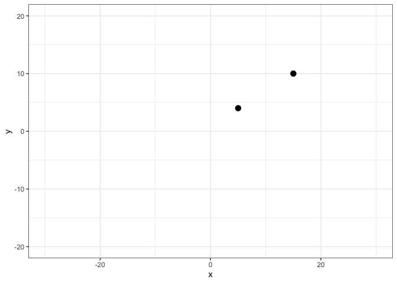<!-- -->

``` r
# Split the players data frame into two observations 
player1 <- two_players[1, ]
player2 <- two_players[2, ]

# Calculate and print their distance using the Euclidean Distance formula
player_distance <- sqrt( (player1$x - player2$x)^2 + (player1$y - player2$y)^2 )
player_distance
```

    ## [1] 11.6619

Excellent work! Using the formula is a great way to learn how distance
is measured between two observations.

## Using the dist() function

Using the Euclidean formula manually may be practical for 2 observations
but can get more complicated rather quickly when measuring the distance
between many observations.

The `dist()` function simplifies this process by calculating distances
between our observations (rows) using their features (columns). In this
case the observations are the player positions and the dimensions are
their x and y coordinates.

*Note: The default distance calculation for the `dist()` function is
Euclidean distance*

**Steps**

1.  Calculate the distance between two players using the `dist()`
    function for the data frame `two_players`
2.  Calculate the distance between three players for the data frame
    `three_players`

``` r
# Calculate the Distance Between two_players
dist_two_players <- dist(two_players)
dist_two_players
```

    ##         1
    ## 2 11.6619

``` r
# Calculate the Distance Between three_players
three_players <- two_players |> 
                  add_row(x = 0, y = 20)

dist_three_players <- dist(three_players)
dist_three_players
```

    ##          1        2
    ## 2 11.66190         
    ## 3 16.76305 18.02776

The dist() function makes life easier when working with many dimensions
and observations.

## Who are the closest players?

You are given the data frame containing the positions of 4 players on a
soccer field.

This data is preloaded as `four_players` in your environment and is
displayed below.

| Player |   x |   y |
|-------:|----:|----:|
|      1 |   5 |   4 |
|      2 |  15 |  10 |
|      3 |   0 |  20 |
|      4 |  -5 |   5 |

> ## *Question*
>
> **Which two players are closest to one another?**<br> <br> ⬜ 1 &
> 2<br> ⬜ 1 & 3<br> ✅ 1 & 4<br> ⬜ 2 & 3<br> ⬜ 2 & 4<br> ⬜ 3 & 4<br>
> ⬜ Not enough information to decide<br>

That is correct! Players 1 and 4 are the closest to one another.

## The importance of scale

Theory. Coming soon …

## Effects of scale

You have learned that when a variable is on a larger scale than other
variables in your data it may disproportionately influence the resulting
distance calculated between your observations. Lets see this in action
by observing a sample of data from the `trees` data set.

You will leverage the `scale()` function which by default centers &
scales our column features.

Our variables are the following:

-   **Girth** - tree diameter in inches
-   **Height** - tree height in inches

**Steps**

1.  Calculate the distance matrix for the data frame `three_trees` and
    store it as `dist_trees`
2.  Create a new variable `scaled_three_trees` where the `three_trees`
    data is centered & scaled
3.  Calculate and print the distance matrix for `scaled_three_trees` and
    store this as `dist_scaled_trees`
4.  Output both `dist_trees` and `dist_scaled_trees` matrices and
    observe the change of which observations have the smallest distance
    between the two matrices *(hint: they have changed)*

``` r
three_trees <- tibble(Girth  = c(8.3, 8.6, 10.5),
                      Height = c(840, 780, 864))
                  
# Calculate distance for three_trees 
dist_trees <- dist(three_trees)

# Scale three trees & calculate the distance  
scaled_three_trees <- scale(three_trees)
dist_scaled_trees  <- dist(scaled_three_trees)

# Output the results of both Matrices
print('Without Scaling')
```

    ## [1] "Without Scaling"

``` r
dist_trees
```

    ##          1        2
    ## 2 60.00075         
    ## 3 24.10062 84.02149

``` r
print('With Scaling')
```

    ## [1] "With Scaling"

``` r
dist_scaled_trees
```

    ##          1        2
    ## 2 1.409365         
    ## 3 1.925659 2.511082

Notice that before scaling observations 1 & 3 were the closest but after
scaling observations 1 & 2 turn out to have the smallest distance.

## When to scale data?

> ## *Question*
>
> Below are examples of datasets and their corresponding features.<br>
> <br> In which of these examples would scaling **not** be
> necessary?<br> <br> ⬜ Taxi Trips - `tip earned ($)`,
> `distance traveled (km)`.<br> ⬜ Health Measurements of Individuals -
> `height (meters)`, `weight (grams)`, `body fat percentage (%)`.<br> ⬜
> Student Attributes - `average test score (1-100)`,
> `distance from school (km)`, `annual household income ($)`.<br> ⬜
> Salespeople Commissions - `total yearly commision ($)`,
> `number of trips taken`.<br> ✅ None of the above, they all should be
> scaled when measuring distance.<br>

Correct! In all of these cases it would be a good idea to scale your
features.

## Measuring distance for categorical data

Theory. Coming soon …

## Calculating distance between categorical variables

In this exercise you will explore how to calculate binary (Jaccard)
distances. In order to calculate distances we will first have to dummify
our categories using the `dummy.data.frame()` from the library `dummies`

You will use a small collection of survey observations stored in the
data frame `job_survey` with the following columns:

-   **job_satisfaction** Possible options: “Hi”, “Mid”, “Low”
-   **is_happy** Possible options: “Yes”, “No”

**Steps**

1.  Create a dummified data frame `dummy_survey`
2.  Generate a Jaccard distance matrix for the dummified survey data
    `dist_survey` using the `dist()` function using the parameter
    `method = 'binary'`
3.  Print the original data and the distance matrixthe observations with
    a distance of 0 in the original data (1, 2, and 4)
4.  Note the observations with a distance of 0 in the original data (1,
    2, and 4)

``` r
# Data
job_survey <- data.frame( # Does not work with tibble
  
  job_satisfaction = c(rep("Hi", 4), "Mid"),
  is_happy         = c(rep("No", 3), "Yes", "No")
  
)

# Load package
library(dummies)
```

    ## dummies-1.5.6 provided by Decision Patterns

``` r
# Dummify the Survey Data
dummy_survey <- dummy.data.frame(job_survey)
```

    ## Warning in model.matrix.default(~x - 1, model.frame(~x - 1), contrasts = FALSE):
    ## non-list contrasts argument ignored

    ## Warning in model.matrix.default(~x - 1, model.frame(~x - 1), contrasts = FALSE):
    ## non-list contrasts argument ignored

``` r
# Calculate the Distance
dist_survey <- dist(dummy_survey, method = 'binary')

# Print the Original Data
job_survey
```

    ##   job_satisfaction is_happy
    ## 1               Hi       No
    ## 2               Hi       No
    ## 3               Hi       No
    ## 4               Hi      Yes
    ## 5              Mid       No

``` r
# Print the Distance Matrix
dist_survey
```

    ##           1         2         3         4
    ## 2 0.0000000                              
    ## 3 0.0000000 0.0000000                    
    ## 4 0.6666667 0.6666667 0.6666667          
    ## 5 0.6666667 0.6666667 0.6666667 1.0000000

Great work! <br> Notice that this distance metric successfully captured
that observations 1 and 2 are identical (distance of 0)

## The closest observation to a pair

Below you see a pre-calculated distance matrix between four players on a
soccer field. You can clearly see that players **1** & **4** are the
closest to one another with a Euclidean distance value of
<font color="red">10</font>.

|     |    1 |    2 |    3 |
|----:|-----:|-----:|-----:|
|   2 | 11.7 |      |      |
|   3 | 16.8 | 18.0 |      |
|   4 | 10.0 | 20.6 | 15.8 |

> ## *Question*
>
> **If 1 and 4 are the closest players among the four, which player is
> closest to players *1* and *4*?**<br> <br> ⬜ Clearly its player
> 2!<br> ⬜ No! Player 3 makes more sense.<br> ✅ Are you kidding me?
> There isn’t enough information to decide.<br>

Great job! We clearly don’t have enough information to make this
decision without knowing how we compare one observation to a pair of
observations.

The decision required is known as the **linkage method** and which you
will learn about in the next chapter!

# 2. Hierarchical clustering

This chapter will help you answer the last question from chapter 1 - how
do you find groups of similar observations (clusters) in your data using
the distances that you have calculated? You will learn about the
fundamental principles of hierarchical clustering - the linkage criteria
and the dendrogram plot - and how both are used to build clusters. You
will also explore data from a wholesale distributor in order to perform
market segmentation of clients using their spending habits.

## Comparing more than two observations

Theory. Coming soon …

## Calculating linkage

Let us revisit the example with three players on a field. The distance
matrix between these three players is shown below and is available as
the variable `dist_players`.

From this we can tell that the first group that forms is between players
**1** & **2**, since they are the closest to one another with a
Euclidean distance value of <font color="red">11</font>.

Now you want to apply the three linkage methods you have learned to
determine what the distance of this group is to player **3**.

|     |   1 |   2 |
|----:|----:|----:|
|   2 |  11 |     |
|   3 |  16 |  18 |

**Steps**

1.  Calculate the distance from player 3 to the group of players 1 & 2
    using the following three linkage methods.

    -   **Complete:** the resulting distance is based on the maximum.
    -   **Single:** the resulting distance is based on the minimum.
    -   **Average:** the resulting distance is based on the average.

``` r
dist_players <- dist_three_players

# Extract the pair distances
distance_1_2 <- dist_players[1]
distance_1_3 <- dist_players[2]
distance_2_3 <- dist_players[3]

# Calculate the complete distance between group 1-2 and 3
complete <- max(c(distance_1_3, distance_2_3))
complete
```

    ## [1] 18.02776

``` r
# Calculate the single distance between group 1-2 and 3
single <- min(c(distance_1_3, distance_2_3))
single
```

    ## [1] 16.76305

``` r
# Calculate the average distance between group 1-2 and 3
average <- mean(c(distance_1_3, distance_2_3))
average
```

    ## [1] 17.39541

Great work! <br> Now you have all the knowledge you need to tackle
exercise 12 from chapter 1.

## Revisited: The closest observation to a pair

**You are now ready to answer this question!**

Below you see a pre-calculated distance matrix between four players on a
soccer field. You can clearly see that players **1** & **4** are the
closest to one another with a Euclidean distance value of
<font color="red">10</font>. This distance matrix is available for your
exploration as the variable `dist_players`

|     |    1 |    2 |    3 |
|----:|-----:|-----:|-----:|
|   2 | 11.7 |      |      |
|   3 | 16.8 | 18.0 |      |
|   4 | 10.0 | 20.6 | 15.8 |

> ## *Question*
>
> **If 1 and 4 are the closest players among the four, which player is
> closest to players *1* and *4*?**<br> <br> ✅ Complete Linkage: Player
> 3, <br> Single & Average Linkage: Player 2<br> ⬜ Complete Linkage:
> Player 2, <br> Single & Average Linkage: Player 3<br> ⬜ Player 2
> using Complete, Single & Average Linkage methods<br> ⬜ Player 3 using
> Complete, Single & Average Linkage methods<br>

This is correct, you can see that the choice of the linkage method can
drastically change the result of this question.

## Capturing K clusters

Theory. Coming soon …

## Assign cluster membership

In this exercise you will leverage the `hclust()` function to calculate
the iterative linkage steps and you will use the `cutree()` function to
extract the cluster assignments for the desired number (`k`) of
clusters.

You are given the positions of 12 players at the start of a 6v6 soccer
match. This is stored in the `lineup` data frame.

You know that this match has two teams (k = 2), let’s use the clustering
methods you learned to assign which team each player belongs in based on
their position.

**Notes:**

-   The linkage method can be passed via the **method** parameter:
    `hclust(distance_matrix, method = "complete")`
-   Remember that in soccer opposing teams start on their half of the
    field.
-   Because these positions are measured using the same scale we do not
    need to re-scale our data.

**Steps**

1.  Calculate the Euclidean distance matrix `dist_players` among all
    twelve players
2.  Perform the **complete** linkage calculation for hierarchical
    clustering using `hclust` and store this as `hc_players`
3.  Build the cluster assignment vector `clusters_k2` using `cutree()`
    with a `k = 2`
4.  Append the cluster assignments as a column `cluster` to the `lineup`
    data frame and save the results to a new data frame called
    `lineup_k2_complete`

``` r
# Load package
library(dplyr)
```

    ## 
    ## Attaching package: 'dplyr'

    ## The following objects are masked from 'package:stats':
    ## 
    ##     filter, lag

    ## The following objects are masked from 'package:base':
    ## 
    ##     intersect, setdiff, setequal, union

``` r
# Load data
lineup <- readRDS("data/lineup.rds")

# Calculate the Distance
dist_players <- dist(lineup)

# Perform the hierarchical clustering using the complete linkage
hc_players <- hclust(dist_players, method = "complete")

# Calculate the assignment vector with a k of 2
clusters_k2 <- cutree(hc_players, k = 2)

# Create a new data frame storing these results
lineup_k2_complete <- mutate(lineup, cluster = clusters_k2)
```

Fantastic job! In the next exercise we will explore this result.

## Exploring the clusters

Because clustering analysis is always in part **qualitative**, it is
incredibly important to have the necessary tools to explore the results
of the clustering.

In this exercise you will explore that data frame you created in the
previous exercise `lineup_k2_complete`.

**Reminder:** The `lineup_k2_complete` data frame contains the x & y
positions of 12 players at the start of a 6v6 soccer game to which you
have added clustering assignments based on the following parameters:

-   Distance: *Euclidean*
-   Number of Clusters (k): *2*
-   Linkage Method: *Complete*

**Steps**

1.  Using `count()` from dplyr, count the number of players assigned to
    each cluster.
2.  Using `ggplot()`, plot the positions of the players and color them
    by cluster assignment.

``` r
# Count the cluster assignments
count(lineup_k2_complete, cluster)
```

    ## # A tibble: 2 × 2
    ##   cluster     n
    ##     <int> <int>
    ## 1       1     6
    ## 2       2     6

``` r
# Plot the positions of the players and color them using their cluster
ggplot(lineup_k2_complete, aes(x = x, y = y, color = factor(cluster))) +
  geom_point(size = 3) +
  theme_bw()
```

<!-- -->

You’re doing great! <br> Think carefully about whether these results
make sense to you and why.

## Validating the clusters

In the plot below you see the clustering results of the same lineup data
you’ve previously worked with but with some minor modifications in the
clustering steps.

-   The **left plot** was generated using a `k=2` and
    `method = 'average'`
-   The **right plot** was generated using a `k=3` and
    `method = 'complete'`


> ## *Question*
>
> **If our goal is to correctly assign each player to their correct team
> then based on what you see in the above plot and what you know about
> the data set which of the statements below are correct?**<br> <br> ⬜
> The **left plot** successfully clusters the players in their correct
> team.<br> ⬜ The **right plot** successfully clusters the players in
> their correct team.<br> ⬜ The **left plot** fails to correctly
> cluster the players; <br> because this is a 6v6 game the expection is
> that both clusters should have 6 members each.<br> ⬜ The **right
> plot** fails to correctly cluster the players; <br> because this is a
> two team match clustering into three unequal groups does not address
> the question correctly.<br> ✅ Answers 3 & 4 are both correct.<br>

Exactly! Both the results in the left and the right plots can be deemed
incorrect based on what we expect from our data.

## Visualizing the dendrogram

Theory. Coming soon …

## Comparing average, single & complete linkage

You are now ready to analyze the clustering results of the `lineup`
dataset using the dendrogram plot. This will give you a new perspective
on the effect the decision of the linkage method has on your resulting
cluster analysis.

**Steps**

1.  Perform the linkage calculation for hierarchical clustering using
    the linkages: complete, single and average
2.  Plot the three dendrograms side by side and review the changes

``` r
# Prepare the Distance Matrix
dist_players <- dist(lineup)

# Generate hclust for complete, single & average linkage methods
hc_complete <- hclust(dist_players, method = "complete")
hc_single   <- hclust(dist_players, method = "single")
hc_average  <- hclust(dist_players, method = "average")

# Plot & Label the 3 Dendrograms Side-by-Side
# Hint: To see these Side-by-Side run the 4 lines together as one command
par(mfrow = c(1,3))
plot(hc_complete, main = 'Complete Linkage')
plot(hc_single,   main = 'Single Linkage')
plot(hc_average,  main = 'Average Linkage')
```

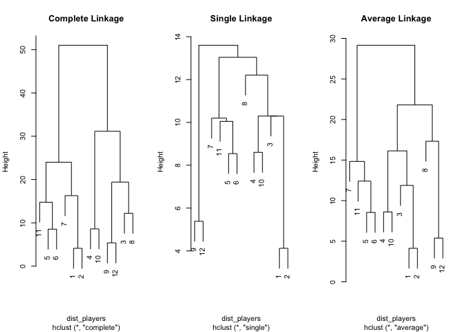<!-- -->

Excellent! Did you notice how the trees all look different? <br> In the
coming exercises you will see how visualizing this structure can be
helpful for building clusters.

## Height of the tree

An advantage of working with a clustering method like hierarchical
clustering is that you can describe the relationships between your
observations based on both the **distance metric** and the **linkage
metric** selected (the combination of which defines the height of the
tree).

**Based on the code below what can you concretely say about the height
of a branch in the resulting dendrogram?**

``` r
dist_players <- dist(lineup, method = 'euclidean')
hc_players <- hclust(dist_players, method = 'single')
plot(hc_players)  
```

> ## *Question*
>
> **All of the observations linked by this branch must have:**<br> <br>
> ⬜ a **maximum Euclidean** distance amongst each other less than or
> equal to the height of the branch.<br> ⬜ a **minimum Jaccard**
> distance amongst each other less than or equal to the height of the
> branch.<br> ✅ a **minimum Euclidean** distance amongst each other
> less than or equal to the height of the branch.<br>

Exactly! Based on this code we can concretely say that for a given
branch on a tree all members that are a part of that branch must have a
minimum Euclidean distance amongst one another equal to or less than the
height of that branch.

In the next section you will see how this description can be put into
action to generate clusters that can be described using the same logic.

## Cutting the tree

Theory. Coming soon …

## Clusters based on height

In previous exercises you have grouped your observations into clusters
using a pre-defined number of clusters (**k**). In this exercise you
will leverage the visual representation of the dendrogram in order to
group your observations into clusters using a maximum height (**h**),
below which clusters form.

You will work the `color_branches()` function from the `dendextend`
library in order to visually inspect the clusters that form at any
height along the dendrogram.

The **hc_players** has been carried over from your previous work with
the soccer line-up data.

**Steps**

1.  Create a dendrogram object `dend_players` from your `hclust` result
    using the function `as.dendrogram()`
2.  Plot the dendrogram
3.  Using the `color_branches()` function create & plot a new dendrogram
    with clusters colored by a cut height of 20
4.  Repeat the above step with a height of 40

``` r
library(dendextend)
```

    ## 
    ## ---------------------
    ## Welcome to dendextend version 1.15.2
    ## Type citation('dendextend') for how to cite the package.
    ## 
    ## Type browseVignettes(package = 'dendextend') for the package vignette.
    ## The github page is: https://github.com/talgalili/dendextend/
    ## 
    ## Suggestions and bug-reports can be submitted at: https://github.com/talgalili/dendextend/issues
    ## You may ask questions at stackoverflow, use the r and dendextend tags: 
    ##   https://stackoverflow.com/questions/tagged/dendextend
    ## 
    ##  To suppress this message use:  suppressPackageStartupMessages(library(dendextend))
    ## ---------------------

    ## 
    ## Attaching package: 'dendextend'

    ## The following object is masked from 'package:stats':
    ## 
    ##     cutree

``` r
dist_players <- dist(lineup, method = 'euclidean')
hc_players   <- hclust(dist_players, method = "complete")

# Create a dendrogram object from the hclust variable
dend_players <- as.dendrogram(hc_players)

# Plot the dendrogram
plot(dend_players)
```

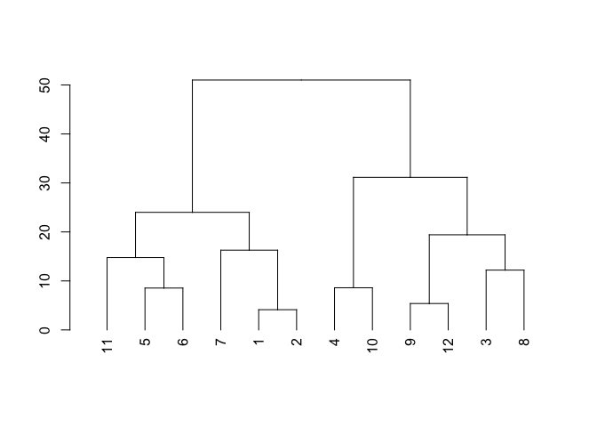<!-- -->

``` r
# Color branches by cluster formed from the cut at a height of 20 & plot
dend_20 <- color_branches(dend_players, h = 20)

# Plot the dendrogram with clusters colored below height 20
plot(dend_20)
```

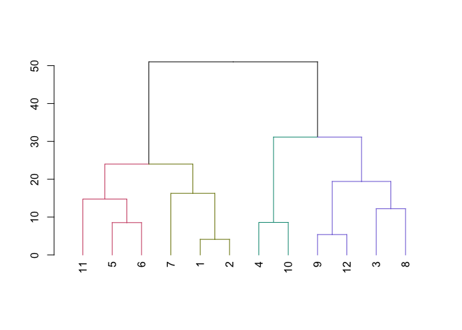<!-- -->

``` r
# Color branches by cluster formed from the cut at a height of 40 & plot
dend_40 <- color_branches(dend_players, h = 40)

# Plot the dendrogram with clusters colored below height 40
plot(dend_40)
```

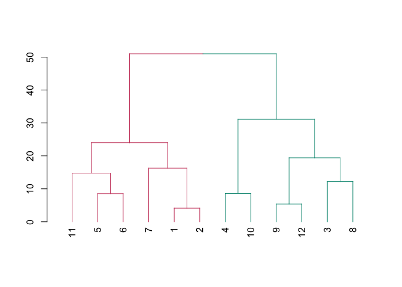<!-- -->

Excellent! Can you see that the height that you use to cut the tree
greatly influences the number of clusters and their size? Consider
taking a moment to play with other values of height before continuing.

## Exploring the branches cut from the tree

The `cutree()` function you used in exercises 5 & 6 can also be used to
cut a tree at a given height by using the `h` parameter. Take a moment
to explore the clusters you have generated from the previous exercises
based on the heights 20 & 40.

**Steps**

1.  Build the cluster assignment vector `clusters_h20` using `cutree()`
    with a `h = 20`
2.  Append the cluster assignments as a column `cluster` to the `lineup`
    data frame and save the results to a new data frame called
    `lineup_h20_complete`
3.  Repeat the above two steps for a height of **40**, generating the
    variables `clusters_h40` and `lineup_h40_complete`
4.  Use ggplot2 to create a scatter plot, colored by the cluster
    assignment for both heights

``` r
dist_players <- dist(lineup, method = 'euclidean')
hc_players   <- hclust(dist_players, method = "complete")

# Calculate the assignment vector with a h of 20
clusters_h20 <- cutree(hc_players, h = 20)

# Create a new data frame storing these results
lineup_h20_complete <- mutate(lineup, cluster = clusters_h20)

# Calculate the assignment vector with a h of 40
clusters_h40 <- cutree(hc_players, h = 40)

# Create a new data frame storing these results
lineup_h40_complete <- mutate(lineup, cluster = clusters_h40)

# Plot the positions of the players and color them using their cluster for height = 20
ggplot(lineup_h20_complete, aes(x = x, y = y, color = factor(cluster))) +
  geom_point(size = 3) +
  theme_bw()
```

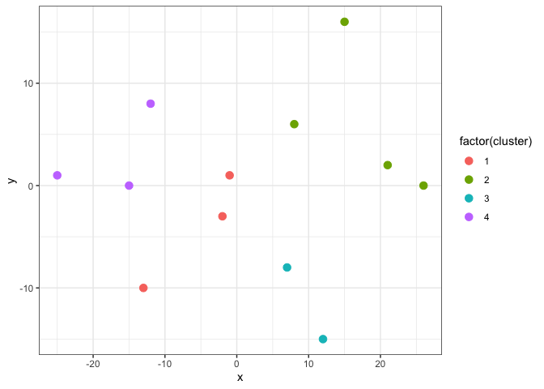<!-- -->

``` r
# Plot the positions of the players and color them using their cluster for height = 40
ggplot(lineup_h40_complete, aes(x = x, y = y, color = factor(cluster))) +
  geom_point(size = 3) +
  theme_bw()
```

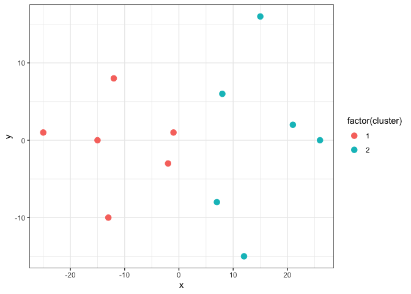<!-- -->

Great job! You can now explore your clusters using both **k** and **h**
parameters.

## What do we know about our clusters?

**Based on the code below, what can you concretely say about the
relationships of the members within each cluster?**

``` r
dist_players <- dist(lineup, method = 'euclidean')
hc_players   <- hclust(dist_players, method = 'complete')
clusters     <- cutree(hc_players, h = 40)  
```

> ## *Question*
>
> **Every member belonging to a cluster must have:**<br> <br> ✅ a
> **maximum Euclidean** distance to all other members of its cluster
> that is less than 40.<br> ⬜ a **maximum Euclidean** distance to all
> other members of its cluster that is greater than or equal to 40.<br>
> ⬜ a **average Euclidean** distance to all other members of its
> cluster that is less than 40.<br>

Correct! The height of any branch is determined by the linkage and
distance decisions (in this case complete linkage and Euclidean
distance). While the members of the clusters that form below a desired
height have a maximum linkage+distance amongst themselves that is less
than the desired height.

## Making sense of the clusters

Theory. Coming soon …

## Segment wholesale customers

You’re now ready to use hierarchical clustering to perform market
segmentation (i.e. use consumer characteristics to group them into
subgroups).

In this exercise you are provided with the amount spent by 45 different
clients of a wholesale distributor for the food categories of **Milk**,
**Grocery** & **Frozen**. This is stored in the data frame
`customers_spend`. Assign these clients into meaningful clusters.

**Note:** For this exercise you can assume that because the data is all
of the same type (amount spent) and you will not need to scale it.

**Steps**

1.  Calculate the Euclidean distance between the customers and store
    this in `dist_customers`
2.  Run hierarchical clustering using **complete** linkage and store in
    `hc_customers`
3.  Plot the dendrogram
4.  Create a cluster assignment vector using a height of 15,000 and
    store it as `clust_customers`
5.  Generate a new data frame `segment_customers` by appending the
    cluster assignment as the column `cluster` to the original
    `customers_spend` data frame

``` r
# Load data
customers_spend <- readRDS("data/ws_customers.rds")

# Calculate Euclidean distance between customers
dist_customers <- dist(customers_spend)

# Generate a complete linkage analysis 
hc_customers <- hclust(dist_customers, method = "complete")

# Plot the dendrogram
plot(hc_customers)
```

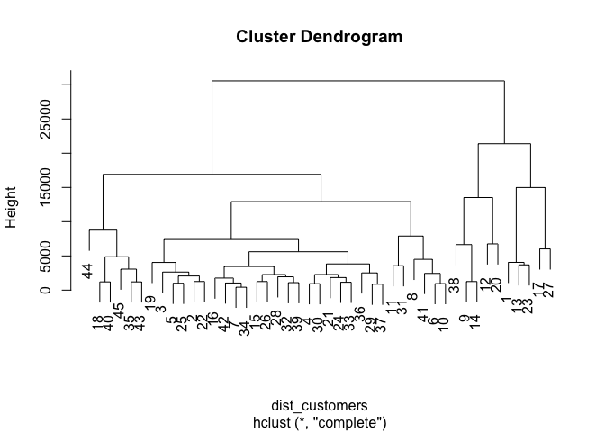<!-- -->

``` r
# Create a cluster assignment vector at h = 15000
clust_customers <- cutree(hc_customers, h = 15000)

# Generate the segmented customers data frame
segment_customers <- mutate(customers_spend, cluster = clust_customers)
```

Excellent! Let’s move on to the next exercise and explore these
clusters.

## Explore wholesale customer clusters

Continuing your work on the wholesale dataset you are now ready to
analyze the characteristics of these clusters.

Since you are working with more than 2 dimensions it would be
challenging to visualize a scatter plot of the clusters, instead you
will rely on summary statistics to explore these clusters. In this
exercise you will analyze the mean amount spent in each cluster for all
three categories.

**Steps**

1.  Calculate the size of each cluster using `count()`.
2.  Color & plot the dendrogram using the height of 15,000.
3.  Calculate the average spending for each category within each cluster
    using the `summarise_all()` function.

``` r
dist_customers <- dist(customers_spend)
hc_customers <- hclust(dist_customers)
clust_customers <- cutree(hc_customers, h = 15000)
segment_customers <- mutate(customers_spend, cluster = clust_customers)

# Count the number of customers that fall into each cluster
count(segment_customers, cluster)
```

    ##   cluster  n
    ## 1       1  5
    ## 2       2 29
    ## 3       3  5
    ## 4       4  6

``` r
# Color the dendrogram based on the height cutoff
dend_customers <- as.dendrogram(hc_customers)
dend_colored <- color_branches(dend_customers, h = 15000)

# Plot the colored dendrogram
plot(dend_colored)
```

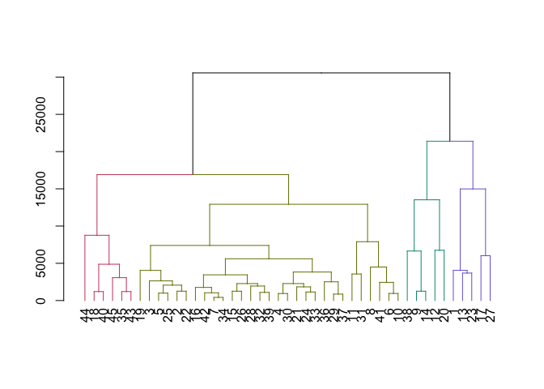<!-- -->

``` r
# Calculate the mean for each category
segment_customers %>% 
  group_by(cluster) %>% 
  summarise_all(list(mean))
```

    ## # A tibble: 4 × 4
    ##   cluster   Milk Grocery Frozen
    ##     <int>  <dbl>   <dbl>  <dbl>
    ## 1       1 16950   12891.   991.
    ## 2       2  2513.   5229.  1796.
    ## 3       3 10452.  22551.  1355.
    ## 4       4  1250.   3917. 10889.

Great work! You’ve gathered a bunch of information about these clusters,
now let’s see what can be interpreted from them.

## Interpreting the wholesale customer clusters

| cluster |  Milk | Grocery | Frozen | cluster size |
|--------:|------:|--------:|-------:|-------------:|
|       1 | 16950 |   12891 |    991 |            5 |
|       2 |  2512 |    5228 |   1795 |           29 |
|       3 | 10452 |   22550 |   1354 |            5 |
|       4 |  1249 |    3916 |  10888 |            6 |

> ## *Question*
>
> What observations can we make about our segments based on their
> average spending in each category?<br> <br> ⬜ Customers in cluster 1
> spent more money on Milk than any other cluster.<br> ⬜ Customers in
> cluster 3 spent more money on Grocery than any other cluster.<br> ⬜
> Customers in cluster 4 spent more money on Frozen goods than any other
> cluster.<br> ⬜ The majority of customers fell into cluster 2 and did
> not show any excessive spending in any category.<br> ✅ All of the
> above.<br>

All 4 statements are reasonable, but whether they are meaningful depends
heavily on the business context of the clustering.

# 3. K-means clustering

In this chapter, you will build an understanding of the principles
behind the k-means algorithm, learn how to select the right k when it
isn’t previously known, and revisit the wholesale data from a different
perspective.

## Introduction to K-means

Theory. Coming soon …

## K-means on a soccer field

In the previous chapter you used the `lineup` dataset to learn about
**hierarchical** clustering, in this chapter you will use the same data
to learn about **k-means** clustering. As a reminder, the `lineup` data
frame contains the positions of 12 players at the start of a 6v6 soccer
match.

Just like before, you know that this match has two teams on the field so
you can perform a k-means analysis using *k = 2* in order to determine
which player belongs to which team.

Note that in the `kmeans()` function `k` is specified using the
`centers` parameter.

**Steps**

1.  Build a k-means model called `model_km2` for the `lineup` data using
    the `kmeans()` function with `centers = 2`
2.  Extract the vector of cluster assignments from the model
    `model_km2$cluster` and store this in the variable `clust_km2`
3.  Append the cluster assignments as a column `cluster` to the `lineup`
    data frame and save the results to a new data frame called
    `lineup_km2`
4.  Use ggplot to plot the positions of each player on the field and
    color them by their cluster

``` r
# Build a kmeans model
model_km2 <- kmeans(lineup, centers = 2)

# Extract the cluster assignment vector from the kmeans model
clust_km2 <- model_km2$cluster

# Create a new data frame appending the cluster assignment
lineup_km2 <- mutate(lineup, cluster = clust_km2)

# Plot the positions of the players and color them using their cluster
ggplot(lineup_km2, aes(x = x, y = y, color = factor(cluster))) +
  geom_point(size = 3) +
  theme_bw()
```

<!-- -->

Well done! Knowing the desired number of clusters ahead of time can be
very helpful when performing a k-means analysis. In the next section we
will see what happens when we use an incorrect value of k.

## K-means on a soccer field (part 2)

In the previous exercise you successfully used the **k-means** algorithm
to cluster the two teams from the `lineup` data frame. This time, let’s
explore what happens when you use a `k` of **3**.

You will see that the algorithm will still run, but does it actually
make sense in this context…

**Steps**

1.  Build a k-means model called `model_km3` for the `lineup` data using
    the `kmeans()` function with `centers = 3`
2.  Extract the vector of cluster assignments from the model
    `model_km3$cluster` and store this in the variable `clust_km3`
3.  Append the cluster assignments as a column `cluster` to the `lineup`
    data frame and save the results to a new data frame called
    `lineup_km3`
4.  Use ggplot to plot the positions of each player on the field and
    color them by their cluster

``` r
# Build a kmeans model
model_km3 <- kmeans(lineup, centers = 3)

# Extract the cluster assignment vector from the kmeans model
clust_km3 <- model_km3$cluster

# Create a new data frame appending the cluster assignment
lineup_km3 <- mutate(lineup, cluster = clust_km3)

# Plot the positions of the players and color them using their cluster
ggplot(lineup_km3, aes(x = x, y = y, color = factor(cluster))) +
  geom_point(size = 3) +
  theme_bw()
```

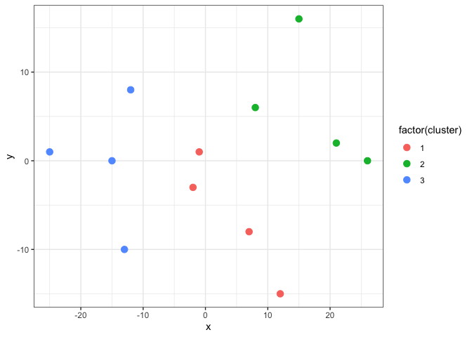<!-- -->

Does this result make sense? Remember we only have 2 teams on the field.
It’s **very** important to remember that k-means will run with any k
that is more than 2 and less than your total observations, but it
doesn’t always mean the results will be meaningful.

## Evaluating different values of K by eye

Theory. Coming soon …

## Many K’s many models

While the `lineup` dataset clearly has a known value of **k**, often
times the optimal number of clusters isn’t known and must be estimated.

In this exercise you will leverage `map_dbl()` from the `purrr` library
to run k-means using values of k ranging from 1 to 10 and extract the
**total within-cluster sum of squares** metric from each one. This will
be the first step towards visualizing the elbow plot.

**Steps**

1.  Use `map_dbl()` to run `kmeans()` using the `lineup` data for k
    values ranging from 1 to 10 and extract the **total within-cluster
    sum of squares** value from each model: `model$tot.withinss`the
    resulting vector as `tot_withinss`  
2.  Build a new data frame `elbow_df` containing the values of k and the
    vector of **total within-cluster sum of squares**

``` r
library(purrr)

# Use map_dbl to run many models with varying value of k (centers)
tot_withinss <- map_dbl(1:10,  function(k){
  model <- kmeans(x = lineup, centers = k)
  model$tot.withinss
})

# Generate a data frame containing both k and tot_withinss
elbow_df <- data.frame(
  k = 1:10,
  tot_withinss = tot_withinss
)
```

Great work! In the next exercise you will plot the elbow plot from this
data.

## Elbow (Scree) plot

In the previous exercises you have calculated the **total within-cluster
sum of squares** for values of **k** ranging from 1 to 10. You can
visualize this relationship using a line plot to create what is known as
an elbow plot (or scree plot).

When looking at an elbow plot you want to see a sharp decline from one k
to another followed by a more gradual decrease in slope. The last value
of k before the slope of the plot levels off suggests a “good” value of
k.

**Steps**

1.  Continuing your work from the previous exercise, use the values in
    `elbow_df` to plot a line plot showing the relationship between
    **k** and **total within-cluster sum of squares**

``` r
# Use map_dbl to run many models with varying value of k (centers)
tot_withinss <- map_dbl(1:10,  function(k){
  model <- kmeans(x = lineup, centers = k)
  model$tot.withinss
})

# Generate a data frame containing both k and tot_withinss
elbow_df <- data.frame(
  k = 1:10,
  tot_withinss = tot_withinss
)

# Plot the elbow plot
ggplot(elbow_df, aes(x = k, y = tot_withinss)) +
  geom_line() +
  scale_x_continuous(breaks = 1:10) +
  theme_bw()
```

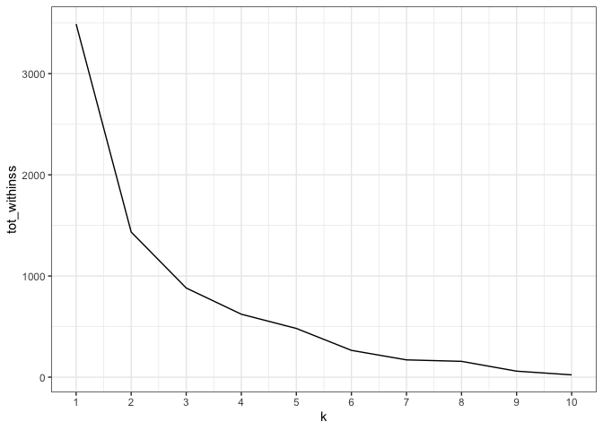<!-- -->

Fantastic! You have learned how to create and visualize elbow plots as a
tool for finding a “good” value of **k**. In the next section you will
add another tool to your arsenal for finding **k**.

## Interpreting the elbow plot

Based on the elbow plot you generated in the previous exercise for the
`lineup` data:


> ## *Question*
>
> **Which of these interpretations are valid?**<br> <br> ✅ Based on
> this plot, the **k** to choose is **2**; the elbow occurs there.<br>
> ⬜ The **k** to choose is **5**; this is where the trend levels
> off.<br> ⬜ Any value of **k** is valid; this plot does not clearly
> identify an elbow.<br> ⬜ None of the above.<br>

That is correct, you can see that there is a sharp change in the slope
of this line that makes an “elbow” shape. Furthermore, this is supported
by the prior knowledge that there are **two** teams in this data and a
**k** of **2** is desired.

## Silhouette analysis: observation level performance

Theory. Coming soon …

## Silhouette analysis

Silhouette analysis allows you to calculate how similar each
observations is with the cluster it is assigned relative to other
clusters. This metric (silhouette width) ranges from **-1** to **1** for
each observation in your data and can be interpreted as follows:

-   Values close to **1** suggest that the observation is well matched
    to the assigned cluster
-   Values close to **0** suggest that the observation is borderline
    matched between two clusters
-   Values close to **-1** suggest that the observations may be assigned
    to the wrong cluster In this exercise you will leverage the `pam()`
    and the `silhouette()` functions from the `cluster` library to
    perform silhouette analysis to compare the results of models with a
    k of 2 and a k of 3. You’ll continue working with the `lineup`
    dataset.

> Pay close attention to the silhouette plot, does each observation
> clearly belong to its assigned cluster for k = 3?

**Steps**

1.  Generate a k-means model `pam_k2` using `pam()` with `k = 2` on the
    `lineup` data.
2.  Plot the silhouette analysis using `plot(silhouette(model))`.
3.  Repeat the first two steps for `k = 3`, saving the model as
    `pam_k3`.
4.  Make sure to review the differences between the plots before
    proceeding (especially observation **3**) for `pam_k3`.

``` r
library(cluster)

# Generate a k-means model using the pam() function with a k = 2
pam_k2 <- pam(lineup, k = 2)

# Plot the silhouette visual for the pam_k2 model
plot(silhouette(pam_k2))
```

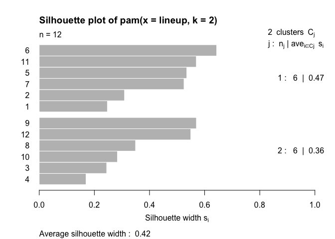<!-- -->

``` r
# Generate a k-means model using the pam() function with a k = 3
pam_k3 <- pam(lineup, k = 3)

# Plot the silhouette visual for the pam_k3 model
plot(silhouette(pam_k3))
```

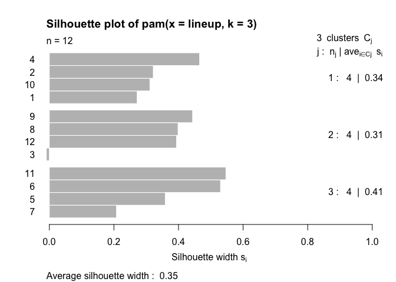<!-- -->

Great work! Did you notice that for k = 2, no observation has a
silhouette width close to 0? What about the fact that for k = 3,
observation 3 is close to 0 and is negative? This suggests that k = 3 is
not the right number of clusters.

## Making sense of the K-means clusters

Theory. Coming soon …

## Revisiting wholesale data: “Best” k

At the end of **Chapter 2** you explored wholesale distributor data
`customers_spend` using hierarchical clustering. This time you will
analyze this data using the k-means clustering tools covered in this
chapter.

The first step will be to determine the **“best”** value of k using
**average silhouette width**.

A refresher about the data: it contains records of the amount spent by
45 different clients of a wholesale distributor for the food categories
of **Milk**, **Grocery** & **Frozen**. This is stored in the data frame
`customers_spend`. For this exercise you can assume that because the
data is all of the same type (amount spent) and you will not need to
scale it.

**Steps**

1.  Use `map_dbl()` to run `pam()` using the `customers_spend` data for
    k values ranging from 2 to 10 and extract the **average silhouette
    width** value from each model: `model$silinfo$avg.width`the
    resulting vector as `sil_width`  
2.  Build a new data frame `sil_df` containing the values of k and the
    vector of **average silhouette widths**  
3.  Use the values in `sil_df` to plot a line plot showing the
    relationship between **k** and **average silhouette width**

``` r
# Use map_dbl to run many models with varying value of k
sil_width <- map_dbl(2:10,  function(k){
  model <- pam(x = customers_spend, k = k)
  model$silinfo$avg.width
})

# Generate a data frame containing both k and sil_width
sil_df <- data.frame(
  k = 2:10,
  sil_width = sil_width
)

# Plot the relationship between k and sil_width
ggplot(sil_df, aes(x = k, y = sil_width)) +
  geom_line() +
  scale_x_continuous(breaks = 2:10) +
  theme_bw()
```

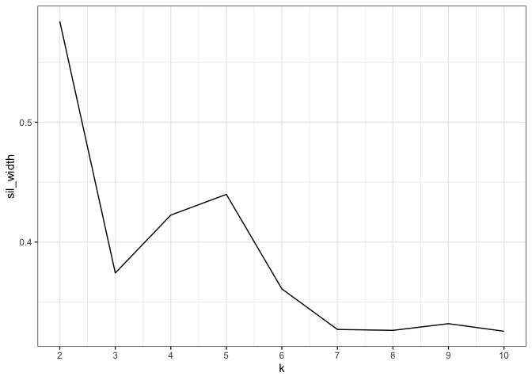<!-- -->

You’re doing great! From the plot I hope you noticed that k = 2 has the
highest average sillhouette width and is the **\\“best\\”** value of
**k** we will move forward with.

## Revisiting wholesale data: Exploration

From the previous analysis you have found that `k = 2` has the highest
**average silhouette width**. In this exercise you will continue to
analyze the wholesale customer data by building and exploring a kmeans
model with **2** clusters.

**Steps**

1.  Build a k-means model called `model_customers` for the
    `customers_spend` data using the `kmeans()` function with
    `centers = 2`.
2.  Extract the vector of cluster assignments from the model
    `model_customers$cluster` and store this in the variable
    `clust_customers`.
3.  Append the cluster assignments as a column `cluster` to the
    `customers_spend` data frame and save the results to a new data
    frame called `segment_customers`.
4.  Calculate the size of each cluster using `count()`.

``` r
set.seed(42)

# Build a k-means model for the customers_spend with a k of 2
model_customers <- kmeans(customers_spend, centers = 2)

# Extract the vector of cluster assignments from the model
clust_customers <- model_customers$cluster

# Build the segment_customers data frame
segment_customers <- mutate(customers_spend, cluster = clust_customers)

# Calculate the size of each cluster
count(segment_customers, cluster)
```

    ##   cluster  n
    ## 1       1 35
    ## 2       2 10

``` r
# Calculate the mean for each category
segment_customers %>% 
  group_by(cluster) %>% 
  summarise_all(list(mean))
```

    ## # A tibble: 2 × 4
    ##   cluster   Milk Grocery Frozen
    ##     <int>  <dbl>   <dbl>  <dbl>
    ## 1       1  2296.    5004  3354.
    ## 2       2 13701.   17721  1173

Well done! It seems that in this case **cluster 1** consists of
individuals who proportionally spend more on **Frozen** food while
**cluster 2** customers spent more on **Milk** and **Grocery**. Did you
notice that when you explored this data using hierarchical clustering,
the method resulted in **4** clusters while using k-means got you **2**.
Both of these results are valid, but which one is appropriate for this
would require more subject matter expertise. Before you proceed with the
next chapter, remember that: Generating clusters is a science, but
interpreting them is an art.

# 4. Case Study: National Occupational mean wage

In this chapter, you will apply the skills you have learned to explore
how the average salary amongst professions have changed over time.

## Occupational wage data

Theory. Coming soon …

## Initial exploration of the data

You are presented with data from the Occupational Employment Statistics
(OES) program which produces employment and wage estimates annually.
This data contains the yearly average income from **2001** to **2016**
for **22** occupation groups. You would like to use this data to
identify clusters of occupations that maintained similar income trends.

The data is stored in your environment as the data.matrix `oes`.

``` r
oes <- readRDS("data/oes.rds")
oes
```

    ##                             2001  2002  2003  2004  2005  2006  2007   2008
    ## Management                 70800 78870 83400 87090 88450 91930 96150 100310
    ## Business Operations        50580 53350 56000 57120 57930 60000 62410  64720
    ## Computer Science           60350 61630 64150 66370 67100 69240 72190  74500
    ## Architecture/Engineering   56330 58020 60390 63060 63910 66190 68880  71430
    ## Life/Physical/Social Sci.  49710 52380 54930 57550 58030 59660 62020  64280
    ## Community Services         34190 34630 35800 37050 37530 39000 40540  41790
    ## Legal                      69030 77330 78590 81180 81070 85360 88450  92270
    ## Education/Training/Library 39130 40160 41390 42810 43450 45320 46610  48460
    ## Arts/Design/Entertainment  39770 41660 43350 43820 44310 46110 48410  50670
    ## Healthcare Practitioners   49930 53990 56240 58310 59170 62030 65020  67890
    ## Healthcare Support         21900 22410 22960 23510 23850 24610 25600  26340
    ## Protective Service         32530 33330 34430 35240 35750 37040 38750  40200
    ## Food Preparation           16720 17180 17400 17620 17840 18430 19440  20220
    ## Grounds Cleaning & Maint.  20380 20850 21290 21670 21930 22580 23560  24370
    ## Personal Care              21010 21370 21570 22080 22180 22920 23980  24120
    ## Sales                      28920 30610 31560 32280 32800 34350 35240  36080
    ## Office Administrative      27230 27910 28540 29390 29710 30370 31200  32220
    ## Farming/Fishing/Forestry   19630 20220 20290 20670 21010 21810 22640  23560
    ## Construction               35450 36340 37000 37890 38260 39290 40620  42350
    ## Installation/Repair/Maint. 34960 35780 36560 37620 38050 39060 39930  41230
    ## Production                 27600 28190 28930 29480 29890 30480 31310  32320
    ## Transportation/Moving      26560 27220 27630 28250 28820 29460 30680  31450
    ##                              2010   2011   2012   2013   2014   2015   2016
    ## Management                 105440 107410 108570 110550 112490 115020 118020
    ## Business Operations         67690  68740  69550  71020  72410  73800  75070
    ## Computer Science            77230  78730  80180  82010  83970  86170  87880
    ## Architecture/Engineering    75550  77120  79000  80100  81520  82980  84300
    ## Life/Physical/Social Sci.   66390  67470  68360  69400  70070  71220  72930
    ## Community Services          43180  43830  44240  44710  45310  46160  47200
    ## Legal                       96940  98380  98570  99620 101110 103460 105980
    ## Education/Training/Library  50440  50870  51210  51500  52210  53000  54520
    ## Arts/Design/Entertainment   52290  53850  54490  55580  55790  56980  58390
    ## Healthcare Practitioners    71280  72730  73540  74740  76010  77800  79160
    ## Healthcare Support          26920  27370  27780  28300  28820  29520  30470
    ## Protective Service          42490  42730  43050  43510  43980  44610  45810
    ## Food Preparation            21240  21430  21380  21580  21980  22850  23850
    ## Grounds Cleaning & Maint.   25300  25560  25670  26010  26370  27080  28010
    ## Personal Care               24590  24620  24550  24710  24980  25650  26510
    ## Sales                       36790  37520  37990  38200  38660  39320  40560
    ## Office Administrative       33470  34120  34410  34900  35530  36330  37260
    ## Farming/Fishing/Forestry    24330  24300  24230  24330  25160  26360  27810
    ## Construction                43870  44630  44960  45630  46600  47580  48900
    ## Installation/Repair/Maint.  42810  43390  43870  44420  45220  45990  46690
    ## Production                  33770  34220  34500  34930  35490  36220  37190
    ## Transportation/Moving       32660  33200  33590  33860  34460  35160  36070

Before you begin to cluster this data you should determine whether any
pre-processing steps (such as scaling and imputation) are necessary.

> ## *Question*
>
> **Leverage the functions `head()` and `summary()` to explore the `oes`
> data in order to determine which of the pre-processing steps below are
> necessary:**<br> <br> ⬜ *NA* values exist in the data, hence the
> values must be imputed or the observations with *NAs* excluded.<br> ⬜
> The variables within this data are not comparable to one another and
> should be scaled.<br> ⬜ Categorical variables exist within this data
> and should be appropriately dummified.<br> ⬜ All three pre-processing
> steps above are necessary for this data.<br> ✅ None of these
> pre-processing steps are necessary for this data.<br>

Correct, there are no missing values, no categorical and the features
are on the same scale. <br> Now you’re ready to cluster this data!

## Hierarchical clustering: Occupation trees

In the previous exercise you have learned that the `oes` data is ready
for hierarchical clustering without any preprocessing steps necessary.
In this exercise you will take the necessary steps to build a dendrogram
of occupations based on their yearly average salaries and propose
clusters using a height of `100,000`.

**Steps**

1.  Calculate the Euclidean distance between the occupations and store
    this in `dist_oes`
2.  Run hierarchical clustering using **average** linkage and store in
    `hc_oes`
3.  Create a denrogram object `dend_oes` from your `hclust` result using
    the function `as.dendrogram()`
4.  Plot the dendrogram
5.  Using the `color_branches()` function create & plot a new dendrogram
    with clusters colored by a cut height of 100,000

``` r
# Calculate Euclidean distance between the occupations
dist_oes <- dist(oes, method = 'euclidean')

# Generate an average linkage analysis 
hc_oes <- hclust(dist_oes, method = 'average')

# Create a dendrogram object from the hclust variable
dend_oes <- as.dendrogram(hc_oes)

# Plot the dendrogram
plot(dend_oes)
```

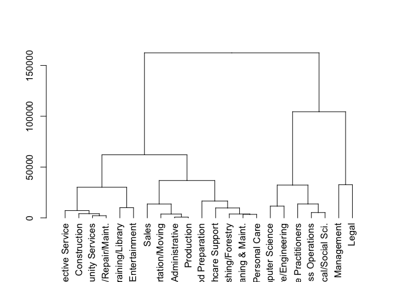<!-- -->

``` r
# Color branches by cluster formed from the cut at a height of 100000
dend_colored <- color_branches(dend_oes, h = 100000)

# Plot the colored dendrogram
plot(dend_colored)
```

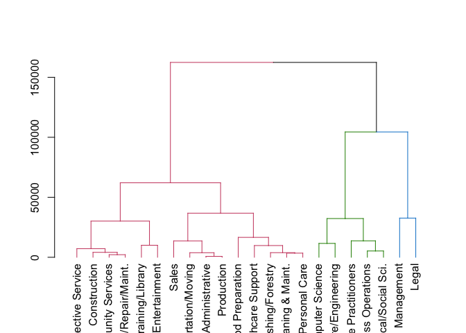<!-- -->

Well done! Based on the dendrogram it may be reasonable to start with
the three clusters formed at a height of 100,000. The members of these
clusters appear to be tightly grouped but different from one another.
Let’s continue this exploration.

## Hierarchical clustering: Preparing for exploration

You have now created a potential clustering for the `oes` data, before
you can explore these clusters with ggplot2 you will need to process the
`oes` data matrix into a tidy data frame with each occupation assigned
its cluster.

**Steps**

1.  Create the `df_oes` data frame from the `oes` data.matrix, making
    sure to store the rowname as a column (use `rownames_to_column()`
    from the `tibble` library)
2.  Build the cluster assignment vector `cut_oes` using `cutree()` with
    a `h = 100,000`
3.  Append the cluster assignments as a column `cluster` to the `df_oes`
    data frame and save the results to a new data frame called
    `clust_oes`
4.  Use the `gather()` function from the `tidyr()` library to reshape
    the data into a format amenable for ggplot2 analysis and save the
    tidied data frame as `gather_oes`

``` r
# Load package
library(tidyr)

dist_oes <- dist(oes,        method = 'euclidean')
hc_oes   <- hclust(dist_oes, method = 'average')

# Use rownames_to_column to move the rownames into a column of the data frame
df_oes <- rownames_to_column(as.data.frame(oes), var = 'occupation')

# Create a cluster assignment vector at h = 100,000
cut_oes <- cutree(hc_oes, h = 100000)

# Generate the segmented the oes data frame
clust_oes <- mutate(df_oes, cluster = cut_oes)

# Create a tidy data frame by gathering the year and values into two columns
gathered_oes <- gather(data = clust_oes, 
                       key = year, 
                       value = mean_salary, 
                       -occupation, -cluster)
```

Great work! You now have the data frames necessary to explore the
results of this clustering

## Hierarchical clustering: Plotting occupational clusters

You have successfully created all the parts necessary to explore the
results of this hierarchical clustering work. In this exercise you will
leverage the named assignment vector `cut_oes` and the tidy data frame
`gathered_oes` to analyze the resulting clusters.

**Steps**

1.  View the assignments of each occupation to their clustering by
    sorting the `cut_oes` vector using `sort()`
2.  Use ggplot2 to plot each occupation’s average income by year and
    color the lines by the occupation’s assigned cluster.

``` r
# View the clustering assignments by sorting the cluster assignment vector
sort(cut_oes)
```

    ##                 Management                      Legal 
    ##                          1                          1 
    ##        Business Operations           Computer Science 
    ##                          2                          2 
    ##   Architecture/Engineering  Life/Physical/Social Sci. 
    ##                          2                          2 
    ##   Healthcare Practitioners         Community Services 
    ##                          2                          3 
    ## Education/Training/Library  Arts/Design/Entertainment 
    ##                          3                          3 
    ##         Healthcare Support         Protective Service 
    ##                          3                          3 
    ##           Food Preparation  Grounds Cleaning & Maint. 
    ##                          3                          3 
    ##              Personal Care                      Sales 
    ##                          3                          3 
    ##      Office Administrative   Farming/Fishing/Forestry 
    ##                          3                          3 
    ##               Construction Installation/Repair/Maint. 
    ##                          3                          3 
    ##                 Production      Transportation/Moving 
    ##                          3                          3

``` r
# Plot the relationship between mean_salary and year and color the lines by the assigned cluster
ggplot(gathered_oes, aes(x = year, y = mean_salary, color = factor(cluster))) + 
    geom_line(aes(group = occupation)) +
    theme_bw()
```

<!-- -->

Cool huh! From this work it looks like both Management & Legal
professions (cluster 1) experienced the most rapid growth in these 15
years.’s see what we can get by exploring this data using k-means.

## Reviewing the HC results

Theory. Coming soon …

## K-means: Elbow analysis

In the previous exercises you used the dendrogram to propose a
clustering that generated 3 trees. In this exercise you will leverage
the k-means elbow plot to propose the “best” number of clusters.

**Steps**

1.  Use `map_dbl()` to run `kmeans()` using the `oes` data for k values
    ranging from 1 to 10 and extract the **total within-cluster sum of
    squares** value from each model: `model$tot.withinss`the resulting
    vector as `tot_withinss`  
2.  Build a new data frame `elbow_df` containing the values of k and the
    vector of **total within-cluster sum of squares**  
3.  Use the values in `elbow_df` to plot a line plot showing the
    relationship between **k** and **total within-cluster sum of
    squares**

``` r
# Use map_dbl to run many models with varying value of k (centers)
tot_withinss <- map_dbl(1:10,  function(k){
  model <- kmeans(x = oes, centers = k)
  model$tot.withinss
})

# Generate a data frame containing both k and tot_withinss
elbow_df <- data.frame(
  k = 1:10,
  tot_withinss = tot_withinss
)

# Plot the elbow plot
ggplot(elbow_df, aes(x = k, y = tot_withinss)) +
  geom_line() +
  scale_x_continuous(breaks = 1:10) +
  theme_bw()
```

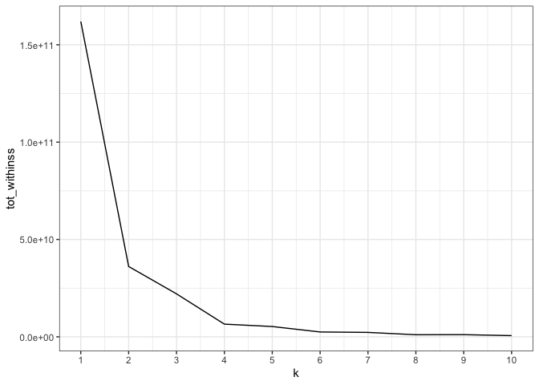<!-- -->

Fascinating! So the elbow analysis proposes a different value of **k**,
in the next section let’s see what we can learn from Silhouette Width
Analysis.

## K-means: Average Silhouette Widths

So hierarchical clustering resulting in **3** clusters and the elbow
method suggests **2**. In this exercise use **average silhouette
widths** to explore what the “best” value of **k** should be.

**Steps**

1.  Use `map_dbl()` to run `pam()` using the `oes` data for k values
    ranging from 2 to 10 and extract the **average silhouette width**
    value from each model: `model$silinfo$avg.width`the resulting vector
    as `sil_width`  
2.  Build a new data frame `sil_df` containing the values of k and the
    vector of **average silhouette widths**  
3.  Use the values in `sil_df` to plot a line plot showing the
    relationship between **k** and **average silhouette width**

``` r
# Use map_dbl to run many models with varying value of k
sil_width <- map_dbl(2:10,  function(k){
  model <- pam(oes, k = k)
  model$silinfo$avg.width
})

# Generate a data frame containing both k and sil_width
sil_df <- data.frame(
  k = 2:10,
  sil_width = sil_width
)

# Plot the relationship between k and sil_width
ggplot(sil_df, aes(x = k, y = sil_width)) +
  geom_line() +
  scale_x_continuous(breaks = 2:10) +
  theme_bw()
```

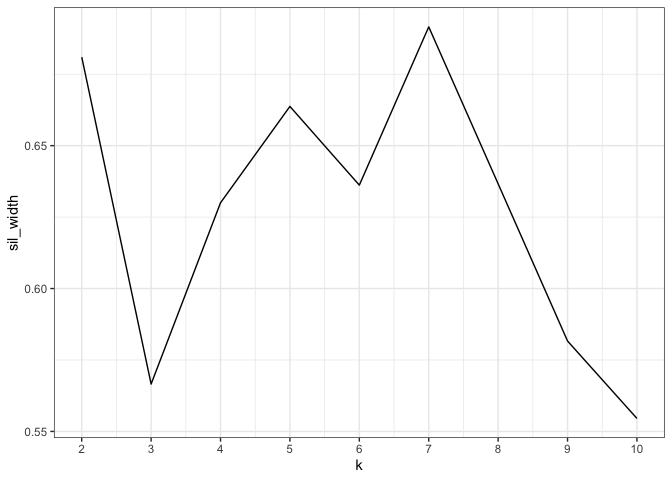<!-- -->

Great work! It seems that this analysis results in another value of
**k**, this time 7 is the top contender (although 2 comes very close).

## The “best” number of clusters

You ran three different methods for finding the optimal number of
clusters and their assignments and you arrived with three different
answers.

Below you will find a comparison between the 3 clustering results (via
coloring of the occupations based on the clusters to which they belong).


> ## *Question*
>
> **What can you say about the “best” way to cluster this data?**<br>
> <br> ⬜ The clusters generated by the hierarchical clustering all have
> members with a Euclidean distance amongst one another less than
> 100,000 and hence is the **best** clustering method.<br> ⬜ The
> clusters generated using k-means with a **k = 2** was identified using
> elbow analysis and hence is the **best** way to cluster this data.<br>
> ⬜ The clusters generated using k-means with a **k = 7** has the
> largest Average Silhouette Widths among the cluster and hence is the
> **best** way to cluster this data.<br> ✅ All of the above are correct
> but the **best** way to cluster is highly dependent on how you would
> use this data after.<br>

All 3 statements are correct but there is no quantitative way to
determine which of these clustering approaches is the right one without
further exploration.
