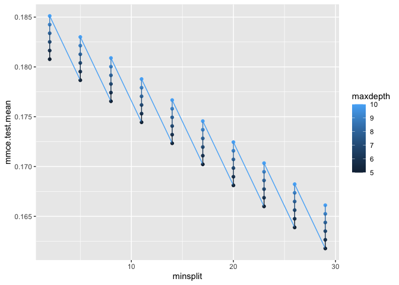

Hyperparameter Tuning in R
================
Joschka Schwarz

-   [1. Introduction to
    hyperparameters](#1-introduction-to-hyperparameters)
    -   [Parameters vs hyperparameters](#parameters-vs-hyperparameters)
    -   [Model parameters
        vs. hyperparameters](#model-parameters-vs-hyperparameters)
    -   [Hyperparameters in linear
        models](#hyperparameters-in-linear-models)
    -   [What are the coefficients?](#what-are-the-coefficients)
    -   [Recap of machine learning
        basics](#recap-of-machine-learning-basics)
    -   [Machine learning with caret](#machine-learning-with-caret)
    -   [Resampling schemes](#resampling-schemes)
    -   [Hyperparameter tuning in
        caret](#hyperparameter-tuning-in-caret)
    -   [Hyperparameters in Stochastic Gradient
        Boosting](#hyperparameters-in-stochastic-gradient-boosting)
    -   [Changing the number of hyperparameters to
        tune](#changing-the-number-of-hyperparameters-to-tune)
    -   [Tune hyperparameters manually](#tune-hyperparameters-manually)
-   [2. Hyperparameter tuning with
    caret](#2-hyperparameter-tuning-with-caret)
    -   [Hyperparameter tuning in
        caret](#hyperparameter-tuning-in-caret-1)
    -   [Finding hyperparameters](#finding-hyperparameters)
    -   [Cartesian grid search in
        caret](#cartesian-grid-search-in-caret)
    -   [Plot hyperparameter model
        output](#plot-hyperparameter-model-output)
    -   [Grid vs. Random Search](#grid-vs-random-search)
    -   [Grid search with range of
        hyperparameters](#grid-search-with-range-of-hyperparameters)
    -   [Find train() option for random
        search](#find-train-option-for-random-search)
    -   [Random search with caret](#random-search-with-caret)
    -   [Adaptive resampling](#adaptive-resampling)
    -   [Advantages of Adaptive
        Resampling](#advantages-of-adaptive-resampling)
    -   [Adaptive Resampling with
        caret](#adaptive-resampling-with-caret)
-   [3. Hyperparameter tuning with
    mlr](#3-hyperparameter-tuning-with-mlr)
    -   [Machine learning with mlr](#machine-learning-with-mlr)
    -   [Machine Learning with mlr](#machine-learning-with-mlr-1)
    -   [Modeling with mlr](#modeling-with-mlr)
    -   [Grid and random search with
        mlr](#grid-and-random-search-with-mlr)
    -   [Random search with mlr](#random-search-with-mlr)
    -   [Perform hyperparameter tuning with
        mlr](#perform-hyperparameter-tuning-with-mlr)
    -   [Evaluating hyperparameters with
        mlr](#evaluating-hyperparameters-with-mlr)
    -   [Why to evaluate tuning?](#why-to-evaluate-tuning)
    -   [Evaluating hyperparameter tuning
        results](#evaluating-hyperparameter-tuning-results)
    -   [Advanced tuning with mlr](#advanced-tuning-with-mlr)
    -   [Define advanced tuning
        controls](#define-advanced-tuning-controls)
    -   [Define aggregated measures](#define-aggregated-measures)
    -   [Setting hyperparameters](#setting-hyperparameters)
-   [4. Hyperparameter tuning with
    h2o](#4-hyperparameter-tuning-with-h2o)
    -   [Machine learning with h2o](#machine-learning-with-h2o)
    -   [Prepare data for modelling with
        h2o](#prepare-data-for-modelling-with-h2o)
    -   [Modeling with h2o](#modeling-with-h2o)
    -   [Grid and random search with
        h2o](#grid-and-random-search-with-h2o)
    -   [Grid search with h2o](#grid-search-with-h2o)
    -   [Random search with h2o](#random-search-with-h2o)
    -   [Stopping criteria](#stopping-criteria)
    -   [Automatic machine learning with
        H2O](#automatic-machine-learning-with-h2o)
    -   [AutoML in h2o](#automl-in-h2o)
    -   [Scoring the leaderboard](#scoring-the-leaderboard)
    -   [Extract h2o models and evaluate
        performance](#extract-h2o-models-and-evaluate-performance)
    -   [Wrap-up](#wrap-up)

**Short Description**

Use the caret, mlr and h2o packages to find optimal hyperparameters
using grid search, random search, adaptive resampling and automatic
machine learning.

**Long Description**

For many machine learning problems, simply running a model
out-of-the-box and getting a prediction is not enough; you want the best
model with the most accurate prediction. One way to perfect your model
is with hyperparameter tuning, which means optimizing the settings for
that specific model. In this course, you will work with the caret, mlr
and h2o packages to find the optimal combination of hyperparameters in
an efficient manner using grid search, random search, adaptive
resampling and automatic machine learning (AutoML). Furthermore, you
will work with different datasets and tune different supervised learning
models, such as random forests, gradient boosting machines, support
vector machines, and even neural nets. Get ready to tune!

# 1. Introduction to hyperparameters

Why do we use the strange word “hyperparameter”? What makes it hyper?
Here, you will understand what model parameters are, and why they are
different from hyperparameters in machine learning. You will then see
why we would want to tune them and how the default setting of caret
automatically includes hyperparameter tuning.

## Parameters vs hyperparameters

Theory. Coming soon …

**1. Parameters vs hyperparameters**

Welcome to this course on hyperparameter tuning in R.In this course you
will learn:- what hyperparameters are and what makes them different from
regular parameters- why hyperparameter tuning is an important step
towards optimizing your machine learning models- and how you can apply
hyperparameter tuning with the packages caret, mlr and h2o.

**2. About me**

My name is Shirin and I started out as a traditional biologist. I spent
a lot of time in the lab. But eventually, it became clear that what I
really enjoyed above all else was working with data. That’s why I spent
two years as a bioinformatics Postdoc at the University of Münster in
Germany before I started working as a Data Scientist for codecentric. I
also write a Data Science blog where I play around with different
datasets, analyses, and visualization techniques.

**3. “Hyper”parameters vs model parameters**

So, why do we use the strange word “hyper-parameter”? And how are
hyperparameters different from model parameters?In this chapter, we will
work with a dataset about breast cancer patient samples. 10 features
describe the diagnosis of benign or malignant tissue masses. Here, we
use them to build a classification model.Let’s have a look at a simple
linear model.

**4. Let’s start simple: Model parameters in a linear model**

A linear model models the relationship between variables by fitting a
linear function. Here, we will pick two features at random:
perimeter_worst & fractal_dimension_mean and look at their linear
relationship. We could, of course, make our linear model much more
complex by adding additional features and more complex interactions, but
for this purpose, we will keep it simple.The summary function will give
us an overview of the fitted linear model and its results, like
residuals, coefficients, and statistics.

**5. Let’s start simple: Model parameters in a linear model**

The results of our fitted linear model give the model parameters.Thus,
model **parameters** are the **result** of model fitting.In machine
learning, we use the word training instead of model fitting, so we can
say that the model parameters are being fit (or found) during
training.Let’s look again at our linear model: here we want to find the
coefficients, which we can think of as the slope and intercept of our
model.

**6. Coefficients in a linear model**

Slope and intercept are best understood when visualized; they describe
the best line through our data points.slope describes the steepness of
this line, whileintercept describes the point where our line crosses the
y-axis.

**7. Model parameters vs hyperparameters in a linear model**

Okay, you now know what model parameters are. But what about
hyperparameters?Hyperparameters are defined before training, they
specify HOW the training is supposed to happen, this means they define
options in function calls:We can find out which options to define by
looking at the arguments or formals of a function or by going to its
help page.In our linear model, `method` is a hyperparameter.

**8. Parameters vs hyperparameters in machine learning**

So, to recap:Model parameters were found during training, like
coefficients. In machine learning these could be the weights of a neural
network.Hyperparameters were defined before training; these could be the
learning rate in a neural net or the number of trees in a random forest.

**9. Why tune hyperparameters?**

But why would we want to tune hyperparameters?Imagine we are creating a
fantasy football team: we want to find the best combination of players
to maximize our chances of winning.In machine learning, we have
hyperparameters - which we could think of like fantasy football players;
each hyperparameter can take a range of values - just as players can be
assigned different positions on the field. Just like with our fantasy
football team, we want to find the best combination of hyperparameters,
so that our model performs as well as possible.

**10. Let’s practice!**

Time to put this into practice.

## Model parameters vs. hyperparameters

<!--
LO: The student knows how to build a linear model and how to extract coefficients
-->

In order to perform hyperparameter tuning, it is important to really
understand what hyperparameters are (and what they are not). So let’s
look at **model parameters versus hyperparameters** in detail.

Note: The Breast Cancer Wisconsin (Diagnostic) dataset has been loaded
as `breast_cancer_data` for you.

**Steps**

1.  Use this dataset to fit a **linear model** with `concavity_mean` as
    response and `symmetry_mean` as predictor variable.
2.  Look at the `summary()` of this linear model.
3.  Extract the **coefficients**.

``` r
# Load data
library(readr)
breast_cancer_data <- read_csv("data/breast_cancer_data.csv")
```

    ## Rows: 100 Columns: 11
    ## ── Column specification ────────────────────────────────────────────────────────
    ## Delimiter: ","
    ## chr  (1): diagnosis
    ## dbl (10): concavity_mean, symmetry_mean, fractal_dimension_mean, perimeter_s...
    ## 
    ## ℹ Use `spec()` to retrieve the full column specification for this data.
    ## ℹ Specify the column types or set `show_col_types = FALSE` to quiet this message.

``` r
# Fit a linear model on the breast_cancer_data.
linear_model <- lm(concavity_mean ~ symmetry_mean,
                    data = breast_cancer_data)

# Look at the summary of the linear_model.
summary(linear_model)
```

    ## 
    ## Call:
    ## lm(formula = concavity_mean ~ symmetry_mean, data = breast_cancer_data)
    ## 
    ## Residuals:
    ##       Min        1Q    Median        3Q       Max 
    ## -0.201877 -0.039201 -0.008432  0.030655  0.226150 
    ## 
    ## Coefficients:
    ##               Estimate Std. Error t value Pr(>|t|)    
    ## (Intercept)   -0.15311    0.04086  -3.747 0.000303 ***
    ## symmetry_mean  1.33366    0.21257   6.274 9.57e-09 ***
    ## ---
    ## Signif. codes:  0 '***' 0.001 '**' 0.01 '*' 0.05 '.' 0.1 ' ' 1
    ## 
    ## Residual standard error: 0.06412 on 98 degrees of freedom
    ## Multiple R-squared:  0.2866, Adjusted R-squared:  0.2793 
    ## F-statistic: 39.36 on 1 and 98 DF,  p-value: 9.575e-09

``` r
# Extract the coefficients.
linear_model$coefficients
```

    ##   (Intercept) symmetry_mean 
    ##    -0.1531055     1.3336568

Good job! You know how to build a linear model and how to extract
coefficients.

## Hyperparameters in linear models

<!--
LO: The student knows the difference between model parameters and hyperparameters
-->

Note that hyperparameters can be found in the **help section** for a
function, while model parameters are part of the output of a function.

> ## *Question*
>
> Which of the following is a **hyperparameter** in the linear model
> from your last exercise?<br> <br> ✅ Weights<br> ⬜ Coefficients<br>
> ⬜ Residuals<br> ⬜ Intercept<br>

Correct! In the ‘Arguments’ section of the help function for `lm` we
learn that weights are an optional vector to be used in the fitting
process.

## What are the coefficients?

<!--
LO: The student knows the difference between model parameters and hyperparameters
-->

To get a good feel for the difference between fitted model parameters
and hyperparameters, we are going to take a closer look at those fitted
parameters: in our simple linear model, the **coefficients**. The
dataset `breast_cancer_data` has already been loaded for you and the
linear model call was run as in the previous lesson, so you can directly
access the object `linear_model`.

In our linear model, we can extract the coefficients in the following
way: `linear_model$coefficients`. And we can **visualize the
relationship** we modeled with a plot.

**Remember**, that a linear model has the basic formula:
`y = x * slope + intercept`

**Steps**

1.  Explore the coefficients of the `linear_model` in the console.
2.  Plot the regression line with `ggplot2`.
3.  Assign the correct coefficients to `slope` and `intercept`.

``` r
library(ggplot2)

# Plot linear relationship.
ggplot(data = breast_cancer_data, 
        aes(x = symmetry_mean, y = concavity_mean)) +
  geom_point(color = "grey") +
  geom_abline(slope = linear_model$coefficients[2], 
              intercept = linear_model$coefficients[1])
```

<!-- -->

Perfect! You understand that coefficients represent the slope and
intercept of the fitted model formula.

## Recap of machine learning basics

Theory. Coming soon …

**1. Recap of machine learning basics**

Good job, you now have a solid understanding of the differences between
model parameters and hyperparameters. But before we jump into actively
tuning the hyperparameters, we will briefly recap the basics of machine
learning in R.We will use the caret package first, because it
automatically performs a basic hyperparameter tuning for you with every
training run.

**2. Machine learning with caret - splitting data**

But before we look into this automatic hyperparameter tuning in caret,
we need to prepare our data for training.First, we will divide our data
into training and test sets.Caret makes this step easy with the
`createDataPartition` function. It lets us give a class label vector as
input for stratified partitioning of the data; this is important because
we want to have a roughly equal ratio of classes in our training and
test set. With the argument `p` we tell the function what proportion of
the data should go into the training set, here 70%. The index that will
be created can then be used for subsetting the original dataset.How much
of the data you want to keep for training can be part of the
optimization process. There are really no strict rules on how to split
the data but you want to make sure that you have enough training
powerand that you have a representative test set. With a small dataset
such as this, 70% is a common number, but you will also often see 80 or
90% training data.

**3. Train a machine learning model with caret**

Here, I will not go into additional steps of the machine learning
workflow, like feature engineering, preprocessing, normalization,
balancing classes, etc. Just keep in mind that in a real-world scenario,
you would at least want to think about incorporating these steps into
your workflow.Our validation scheme is defined in the `trainControl()`
function: we will do 5 times 3 repeated cross-validation, which means
repeating 3-fold cross-validation 5 times. This scheme is then given as
an argument in the `train()` function.In `caret` we can train machine
learning models with a large number of different algorithms; we define
this with the argument `method` in the `train()` function. Here, we will
train a Random Forest model, which is abbreviated `rf`.`train()` also
wants to know which data and which features to use. Our dataset is the
training set that we created before. The features are given with a
formula: the class or response variable (here **diagnosis**) is written
before and features after the tilde. For features, we write a dot here,
which indicates that we want to use all remaining columns as features in
our model.In addition, I want to know how long my model took to train.
For this, I am using the tictoc package, which will return the runtime
between tic and toc.As we can see, our model took about 1.4 seconds to
train.

**4. Automatic hyperparameter tuning in caret**

Here is the random forest model we just trained. In the output we can
already see hyperparameter tuning in action as caret performs it
automatically with different options for the hyperparameter mtry –\> you
will learn more about that in the next lesson!What’s important to note
here is that caret compares different hyperparameters on the training
and validation data only.Do NOT be tempted to measure your model
performance on the test data during hyperparameter tuning as that would
give you an overly optimistic and biased performance evaluation!

**5. Let’s start modeling!**

Now, it’s your turn to start modeling!

## Machine learning with caret

<!--
LO: The student knows how to split data into training and test sets for modeling
-->
<!--
LO: The student knows how to use cross-validation in caret
-->
<!--
LO: The student knows how to train a machine learning model with caret
-->

Before we can train machine learning models and tune hyperparameters, we
need to **prepare the data**.

**Steps**

1.  Use the `caret` package to create an index with 70% of the
    `breast_cancer_data` to create a **training set** and **stratify the
    partitions** by the response variable `diagnosis`.

``` r
# Load package
library(caret)
```

    ## Loading required package: lattice

``` r
# Create partition index
index <- createDataPartition(breast_cancer_data$diagnosis, p = 0.7, list = FALSE)
```

2.  Use the index you created in the previous step to **partition** the
    `breast_cancer_data` in training and test sets.

``` r
# Subset `breast_cancer_data` with index
bc_train_data <- breast_cancer_data[index, ]
bc_test_data  <- breast_cancer_data[-index, ]
```

3.  Define a **repeated cross-validation** scheme for `caret` with 5
    folds and 3 repeats.

``` r
# Define 3x5 folds repeated cross-validation
fitControl <- trainControl(method = "repeatedcv", number = 5, repeats = 3)
```

4.  Use the `caret` package to **train a Stochastic Gradient Boosting
    model** and add the **repeated cross-validation** scheme that you
    defined in the last step to the `train` function.

``` r
# Required package: gbm

# Run the train() function
gbm_model <- train(diagnosis ~ ., 
                   data      = bc_train_data, 
                   method    = "gbm", 
                   trControl = fitControl,
                   verbose   = FALSE)

# Look at the model
gbm_model
```

    ## Stochastic Gradient Boosting 
    ## 
    ## 80 samples
    ## 10 predictors
    ##  2 classes: 'B', 'M' 
    ## 
    ## No pre-processing
    ## Resampling: Cross-Validated (5 fold, repeated 3 times) 
    ## Summary of sample sizes: 64, 64, 64, 64, 64, 64, ... 
    ## Resampling results across tuning parameters:
    ## 
    ##   interaction.depth  n.trees  Accuracy   Kappa    
    ##   1                   50      0.9083333  0.8166667
    ##   1                  100      0.9083333  0.8166667
    ##   1                  150      0.9083333  0.8166667
    ##   2                   50      0.9041667  0.8083333
    ##   2                  100      0.9041667  0.8083333
    ##   2                  150      0.9000000  0.8000000
    ##   3                   50      0.8916667  0.7833333
    ##   3                  100      0.8958333  0.7916667
    ##   3                  150      0.8916667  0.7833333
    ## 
    ## Tuning parameter 'shrinkage' was held constant at a value of 0.1
    ## 
    ## Tuning parameter 'n.minobsinnode' was held constant at a value of 10
    ## Accuracy was used to select the optimal model using the largest value.
    ## The final values used for the model were n.trees = 50, interaction.depth =
    ##  1, shrinkage = 0.1 and n.minobsinnode = 10.

Very good! You know the basics of building models with caret.

## Resampling schemes

In the previous exercise, you defined a 3x5 folds repeated
cross-validation resampling scheme with the following code:

``` r
fitControl <- trainControl(method = "repeatedcv", number = 5, repeats = 3)
```

> ## *Question*
>
> Which of the following is **NOT** a valid resampling method in
> `caret`?<br> <br> ⬜ `boot`<br> ✅ `adaboost`<br> ⬜ `cv`<br> ⬜
> `LGOCV`<br>

Correct! `adaboost` is an implementation of the AdaBoost optimization
algorithm from Freund and Shapire (1997) and not a resampling scheme.

## Hyperparameter tuning in caret

Theory. Coming soon …

**1. Hyperparameter tuning with caret**

Caret makes hyperparameter tuning very easy. By default, it performs
automatic tuning for you with every training run. But you can also
manually define how you want to tune your models.

**2. Automatic hyperparameter tuning in caret**

Here you see the random forest model with the `rf` method from before.
In the output we see that we only have one hyperparameter to tune:`mtry`
defines the number of variables that are randomly sampled as candidates
at each split. caret automatically tried three different `mtry` values
and includes the performance of each with the output. The best model is
chosen with the metric `accuracy`, which in this case was for mtry = 6.

**3. Hyperparameters are specific to model algorithms**

Different algorithms have different hyperparameters. You might be
wondering how you would know which hyperparameters you can tune with
these different `method` in caret.If you know the model abbreviation,
you can use the modellookup function.But the easiest way is to use the
online documentation for caret. Click this link on the slides to go to
the page.There, you will find an overview of the different algorithms
you can set as `method` in the train function. This table includes the
name of the model, the string you need to put into the train function,
whether it can be used for classification or regression and what the
original R package of the implementation is.But most importantly, you
will find which hyperparameters can be tuned. Here, I will not discuss
the mathematics behind hyperparameters, instead, I will focus on HOW to
perform the hyperparameter tuning.

**4. Hyperparameters in Support Vector Machines (SVM)**

Let’s change things up a bit and build a Support Vector Machine with
Polynomial Kernel similar to the Random Forest model from before: this
time I am using the `svmPoly` model. And I am again calculating the
training time.

**5. Hyperparameters in Support Vector Machines (SVM)**

When we examine the model object again, we see that this time `caret`
performed a more complex hyperparameter tuning. If we have more than one
hyperparameter to tune, `train` automatically creates a grid of tuning
parameters.By default, caret tries all possible combinations of three
hyperparameters, in our model:- degree being 1, 2, or 3- scale being
0.001, 0.01 or 0.1- and c being 0.25, 0.5 or 1Because the output shows
the performance for every possible combination of hyperparameters, the
output is too long to fit on this slide and I am only showing the best
model with degree of 1, scale of 0.1 and c equal to 1.

**6. Defining hyperparameters for automatic tuning**

We can also set the option `tuneLength` to specify the number of
different values to try for each hyperparameter, for example 5. Now,
caret tries all possible combinations of five hyperparameters:- degree
being 1, 2, 3, 4 or 5- scale being 1e-03, 1e-02, 1e-01, 1e+00 and 1e+01-
and c being 0.25, 0.5, 1, 2 or 4The best model now has degree, scale and
c of 1.

**7. Manual hyperparameter tuning in caret**

Of course, you could also manually try out different hyperparameters.
This, we can do with the option `tuneGrid()`, to which we can feed a
grid of hyperparameters. This grid is defined with the `expand.grid()`
function.If we use that function, we need to define all hyperparameters.
Let’s see what happens if we set the degree to 4 and keep scale and c at
1 and retrain the model.

**8. Manual hyperparameter tuning in caret**

This time, we only trained with one combination of hyperparameters, so
our output gives the performance for these hyperparameters only!

**9. It’s your turn!**

Now it’s your turn to apply simple hyperparameter tuning in caret.

## Hyperparameters in Stochastic Gradient Boosting

<!--
LO: The student knows how to find out which hyperparameters can be tuned in a given caret method
-->

In the previous lesson, you built a Stochastic Gradient Boosting model
in caret. A similar model as the one from before has been preloaded as
`gbm_model`.

> ## *Question*
>
> In order to optimize this model, you want to **tune its
> hyperparameters**. Which of the following is NOT a hyperparameter of
> the `gbm` method?<br> <br> ⬜ n.trees<br> ⬜ n.minobsinnode<br> ✅
> na.action<br> ⬜ interaction.depth<br>

Correct! `na.action` is not a hyperparameter; it is a function to
specify the action to be taken if NAs are found.

## Changing the number of hyperparameters to tune

<!--
LO: The student knows how to change the number of hyperparameters that are tuned automatically by `caret`
-->

When we examine the model object closely, we can see that `caret`
already did some **automatic hyperparameter** tuning for us: `train`
automatically creates a **grid of tuning parameters**. By default, if
`p` is the number of tuning parameters, the grid size is 3^p. But we can
also **specify the number** of different values to try for each
hyperparameter.

**Steps**

1.  Test **four** different values for each hyperparameter with
    automatic tuning in `caret`.

``` r
# Load package
library(tictoc)

# Set seed.
set.seed(42)
# Start timer.
tic()
# Train model.
gbm_model <- train(diagnosis ~ ., 
                   data       = bc_train_data, 
                   method     = "gbm", 
                   trControl  = trainControl(method = "repeatedcv", number = 5, repeats = 3),
                   verbose    = FALSE,
                   tuneLength = 4)
# Stop timer.
toc()
```

    ## 1.212 sec elapsed

Great! You can now perform a simple hyperparameter-tuning with caret.

## Tune hyperparameters manually

<!--
LO: The student knows how to manually define hyperparameters in caret
-->

If you already know which hyperparameter values you want to set, you can
also **manually define** hyperparameters as a **grid**. Go to
`modelLookup("gbm")` or search for `gbm` in the
<a href="https://topepo.github.io/caret/available-models.html">list of
available models in caret</a> and check under **Tuning Parameters**.

**Steps**

1.  Define the following **hyperparameter grid** for a Gradient Boosting
    Model: the number of trees as 200; the tree complexity as 1; the
    learning rate as 0.1 and the minimum number of training set samples
    in a node to commence splitting as 10.
2.  Apply the grid to the `train()` function of `caret`.

``` r
# Define hyperparameter grid.
hyperparams <- expand.grid(n.trees           = 200, 
                           interaction.depth = 1, 
                           shrinkage         = 0.1, 
                           n.minobsinnode    = 10)

set.seed(42)
# Apply hyperparameter grid to train().
gbm_model <- train(diagnosis ~ ., 
                   data      = bc_train_data, 
                   method    = "gbm", 
                   trControl = trainControl(method = "repeatedcv", number = 5, repeats = 3),
                   verbose   = FALSE,
                   tuneGrid  = hyperparams)
```

Great job! You have made it through the first chapter. Now, you will
learn how to use more advanced methods to optimize hyperparameters.

# 2. Hyperparameter tuning with caret

In this chapter, you will learn how to tune hyperparameters with a
Cartesian grid. Then, you will implement faster and more efficient
approaches. You will use Random Search and adaptive resampling to tune
the parameter grid, in a way that concentrates on values in the
neighborhood of the optimal settings.

## Hyperparameter tuning in caret

Theory. Coming soon …

**1. Hyperparameter tuning in caret**

Welcome back to Chapter 2. Let’s dive deeper into how to perform
hyperparameter tuning with caret.

**2. Voter dataset from US 2016 election**

The dataset we’ll be working with is from a survey about the 2016 US
presidential election. We will use the attribute “turnout16_2016” to
predict whether or not a person voted in that election.

**3. Let’s train another model with caret**

Let’s train another machine learning model with caret using gradient
boosting with repeated cross-validation. Keep in mind that in reality,
you would want to address the problem of having unbalanced classes but
let’s focus on hyperparameter tuning for now. Our model takes about 33
seconds to run.

**4. Let’s train another model with caret**

When we explore our model, we see that caret tuned interaction depth and
the number of trees based on default values. For a quick base-line
model, this is fine but what if we wanted to manually define
hyperparameters?

**5. Cartesian grid search with caret**

In the previous chapter, you used the `expand.grid()` function to
manually define single values for every hyperparameter. The same
function can be used to define a grid of hyper-parameters because it
creates a grid of all possible combinations of hyperparameters given!For
the number of trees and tree complexity, we’ll compare different values.
Shrinkage and the minimum number of observations per node is kept
constant.We can now train our model just as before. But this time, we
will use the tuneGrid parameter and feed our grid to it.If we perform
Cartesian grid search, every combination of hyperparameters in our grid
will be evaluated.You see that this model took much longer to train. You
will see in the following examples that hyperparameter tuning takes some
time and computational power - so be prepared to exercise some patience!

**6. Cartesian grid search with caret**

The output will look similar to before with automatic hyperparameter
tuning. We again get a table with accuracy and kappa values for all
tested combinations of hyperparameters and a final result written below
this table.Our model performance did not improve compared to before but
we only tested a small range of hyperparameter values. In your
real-world projects, you would test a much larger range of values but
here, we will focus on learning the concepts behind hyperparameter
tuning techniques.

**7. Plot hyperparameter models**

We can also plot our hyperparameters with the plot function and define
the metric and plot type we want to visualize. Per default, we will see
accuracy and line plots. Every line represents a different
hyperparameter for the maximum tree depth. The colors of the lines
correspond to this as well. On the x-axis, we see the number of boosting
iterations, which comes from the hyperparameter n.trees that we defined
to be either 100, 200 or 250. And the y-axis shows the accuracy of the
model given these hyperparameter combinations. Alternatively, we can
plot the Kappa metrics and show them as a heatmap. Kappa is another
metric used to evaluate the performance of classification models. It
compares an Observed Accuracy with an Expected Accuracy. Kappa values
need to be considered in the context of the problem but generally, we
want to achieve high Kappa values. The Kappa values are shown on the
color scale, while the x-axis shows the number of trees and the y-axis
the max tree depth.Here, our Kappa values don’t look very good - the
reason is that our data was strongly unbalanced, so the accuracy for
always assigning the majority class will already be very high. So, we
can conclude that while having pretty good accuracy, our model did not
in fact perform much better than random.

**8. Test it out for yourself!**

Alright, enough theory - go test it out yourself!

## Finding hyperparameters

Finding out **which** hyperparameters you can tune with a given
algorithm or function is the most important prerequisite for actually
tuning your models!

> ## *Question*
>
> Which **hyperparameters** can you tune with a simple **Generalized
> Linear Model** that uses the `glm` method?<br> <br> ⬜ tau<br> ⬜
> alpha, lambda<br> ✅ None<br> ⬜ cost, Loss<br>

Correct! A simple glm has no hyperparameters that can be tuned.

## Cartesian grid search in caret

<!--
LO: The student knows how to define a Cartesian grid of hyperparameters in caret
-->

In chapter 1, you learned how to use the `expand.grid()` function to
manually define hyperparameters. The same function can also be used to
**define a grid of hyperparameters**.

The `voters_train_data` dataset has already been preprocessed to make it
a bit smaller so training will run faster; it has now 80 observations
and balanced classes and has been loaded for you. And the `trainControl`
object has been defined with repeated cross-validation:

``` r
# Load data
voters_train_data <- read_csv("data/voters_train_data.csv")
```

    ## Rows: 80 Columns: 40
    ## ── Column specification ────────────────────────────────────────────────────────
    ## Delimiter: ","
    ## chr  (1): turnout16_2016
    ## dbl (39): RIGGED_SYSTEM_1_2016, RIGGED_SYSTEM_2_2016, RIGGED_SYSTEM_3_2016, ...
    ## 
    ## ℹ Use `spec()` to retrieve the full column specification for this data.
    ## ℹ Specify the column types or set `show_col_types = FALSE` to quiet this message.

``` r
fitControl <- trainControl(method = "repeatedcv",
                           number = 3,
                           repeats = 5)
```

**Steps**

1.  Define a **Cartesian grid** of Support Vector Machine
    hyperparameters with the following combinations: `degree` should be
    1, 2, or 3, `scale` should be 0.1, 0.01 or 0.001 and `C` should be
    held constant at 0.5.

``` r
# Define Cartesian grid
man_grid <- expand.grid(degree = c(1, 2, 3), 
                        scale  = c(0.1, 0.01, 0.001), 
                        C      = 0.5)
```

2.  Use the Cartesian grid you defined in the previous step to train a
    **Support Vector Machines with Polynomial Kernel** in `caret`.

``` r
# Required package: kernlab

# Start timer, set seed & train model
tic()
set.seed(42)
svm_model_voters_grid <- train(turnout16_2016 ~ ., 
                   data      = voters_train_data, 
                   method    = "svmPoly", 
                   trControl = fitControl,
                   verbose   = FALSE,
                   tuneGrid  = man_grid)
toc()
```

    ## 2.468 sec elapsed

> ## *Question*
>
> Explore the `svm_model_voters_grid` model object: **Which
> hyperparameter combination was best?**<br> <br> ⬜ degree 3 & scale
> 0.010<br> ✅ degree 1 & scale 0.100\]<br> ⬜ degree 1 & scale
> 0.001<br> ⬜ degree 2 & scale 0.100<br>

Correct. This was the best hyperparameter combination in our model.

## Plot hyperparameter model output

<!--
LO: The student knows how to plot the hyperparameter tuning results
-->

In the previous exercise, you defined a **Cartesian grid of
hyperparameters** and used it to train a Support Vector Machine model.
The same code as before has been run in the background, so you can
directly work with the `svm_model_voters_grid` model object. The `caret`
package has also been loaded.

**Steps**

1.  **Plot** the model object with **default arguments**: Accuracy and
    line-plot.

``` r
# Plot default
plot(svm_model_voters_grid)
```

<!-- -->

2.  Add another plot where you **plot Kappa values** and use a
    **level-plot**.

``` r
# Plot Kappa level-plot
plot(svm_model_voters_grid, metric = "Kappa", plotType = "level")
```

<!-- -->

Very good! Plotting is generally a good way to explore your model output
and hyperparameter tuning results.

## Grid vs. Random Search

Theory. Coming soon …

**1. Grid vs. Random Search**

Defining a hyperparameter grid is easy, right? So let’s learn even more
about it.

**2. Grid search continued**

What we did in the previous lesson was **fixing** the learning rate and
the minimum number of training set samples in a node to commence
splitting. For the number of trees and for tree complexity, we compared
different options.Then we trained a model with repeated
cross-validationand gradient boosting.

**3. Grid search with hyperparameter ranges**

But what if we don’t want to define a set of distinct values for each
hyperparameter but instead want to define a range of values?This is easy
as well, just use the seq() function and define at which value you want
to start, at which value to stop and by what increments you want to go
between start and stop.Here you see that you can now end up with
non-integer values in your grid and that the grid will quickly grow much
bigger.

**4. Grid search with many hyperparameter options**

Let’s see what happens if we use this grid in a gradient boosting model
the same way we used the Cartesian grid before - as input to the
tunegrid argument in train. 240 seconds to train! I’m sure you can see
how quickly you would end up with a training that takes forever to run
if you keep increasing the hyperparameters you want to tune!

**5. Cartesian grid vs random search**

So far, we have always compared all possible combinations of
hyperparameters in our predefined grid. This method was called Cartesian
grid search.Here, you see a different way to plot the hyperparameter
tuning results: instead of using the base R plot function, you can also
feed the model object to the ggplot function and see a similar line plot
of hyperparameter combinations and their corresponding accuracies.Even
though we want to compare as many hyperparameters as possible in order
to find the most optimal combination for our model, using Cartesian grid
search will become slow and computationally expensive very quickly.So
let’s look at a faster alternative - random search.With random search we
no longer test all possible combinations of different hyperparameters;
instead we will randomly pick a specified number of hyperparameter
combinations by chance and only evaluate those regarding model
performance.

**6. Random search in caret**

To use random search, another option is available in caret’s
trainControl function called search. Possible inputs to this argument
are “grid” and “random”. The built-in models contained in caret contain
code to generate random tuning parameter combinations. The total number
of unique combinations is specified by the tuneLength option in train.
We already got to know tuneLength in the first chapter, where we used to
to define the number of tuning parameters to compare in caret’s
automatic tuning function. There, all possible combinations of these
hyperparameters were compared. Here we use it to define how many
randomly picked hyperparameter combinations to evaluate. 5 is of course
too few and in reality, you would want to test at least 100. But again,
for demonstration purposes we go with the time-saving version,
here,which still takes almost 1 minute to train.

**7. Random search in caret**

This is how the model output looks like now: 5 randomly picked
hyperparameter combinations and their corresponding accuracy and kappa
values are shown.And - as always - the final values are given in the
text at the bottom of the printed output.One important thing to note is
this: in caret, random search can NOT be combined with grid search! This
means that the tunelength argument cannot be used to sample from a
customized grid.

**8. Let’s get coding!**

Alright, now it’s your turn to try out what you’ve learned!

## Grid search with range of hyperparameters

<!--
LO: The student knows how to define a Cartesian grid with a range of hyperparameters in caret
-->

In chapter 1, you learned how to use the `expand.grid()` function to
manually define a set of hyperparameters. The same function can also be
used to define a **grid with ranges** of hyperparameters.

**Steps**

1.  Define a **grid** with the neural network hyperparameter **size
    ranging from 1 to 5** with a **step-size of 1**.

``` r
# Define the grid with hyperparameter ranges
big_grid <- expand.grid(size = seq(from = 1, to = 5, by = 1),
                        decay = c(0, 1))
big_grid
```

    ##    size decay
    ## 1     1     0
    ## 2     2     0
    ## 3     3     0
    ## 4     4     0
    ## 5     5     0
    ## 6     1     1
    ## 7     2     1
    ## 8     3     1
    ## 9     4     1
    ## 10    5     1

2.  Specifically define the `trainControl` function to perform **grid
    search**.

``` r
# Train control with grid search
fitControl <- trainControl(method  = "repeatedcv",
                           number  = 3,
                           repeats = 5,
                           search  = "grid")
```

3.  Train a **regular Neural Network** in caret.

``` r
# Required package: nnet

# Train neural net
tic()
set.seed(42)
nn_model_voters_big_grid <- train(turnout16_2016 ~ ., 
                   data      = voters_train_data, 
                   method    = "nnet", 
                   trControl = fitControl,
                   # verbose   = FALSE,
                   trace = FALSE)
toc()
```

    ## 2.613 sec elapsed

4.  And finally: feed the `big_grid` to this Neural Network for tuning.

``` r
# Define the grid with hyperparameter ranges
big_grid <- expand.grid(size = seq(from = 1, to = 5, by = 1), decay = c(0, 1))

# Train control with grid search
fitControl <- trainControl(method = "repeatedcv", number = 3, repeats = 5, search = "grid")

# Train neural net
tic()
set.seed(42)
nn_model_voters_big_grid <- train(turnout16_2016 ~ ., 
                   data      = voters_train_data, 
                   method    = "nnet", 
                   trControl = fitControl,
                   # verbose   = FALSE,
                   trace     = FALSE,
                   tuneGrid  = big_grid)
toc()
```

    ## 2.564 sec elapsed

Great! You understood the complete workflow of defining a hyperparameter
grid and using it in the caret `train()` function.

## Find train() option for random search

In the video for this chapter, I showed you how to perform a grid search
or random search with `caret`.

> ## *Question*
>
> Which **argument** do you need to set in combination with
> `trainControl(search = "random")` in order to perform **random
> search**?<br> <br> ⬜ method<br> ✅ tuneLength<br> ⬜ preProcess<br>
> ⬜ tuneGrid<br>

Correct! Tune length defines the number of (randomly sampled) tuning
parameter combinations to compare.

## Random search with caret

<!--
LO: The student knows how to perform random hyperparameter search in caret
-->

Now you are going to perform a **random search** instead of grid search!

As before, the small `voters_train_data` dataset has been loaded for
you, as have the `caret` and `tictoc` packages.

**Steps**

1.  Define a training control object with **random search**.

``` r
# Train control with random search
fitControl <- trainControl(method  = "repeatedcv",
                           number  = 3,
                           repeats = 5,
                           search  = "random")
```

2.  Compare **six random hyperparameter combinations** in the neural
    network below.

``` r
# Test 6 random hyperparameter combinations
tic()
nn_model_voters_big_grid <- train(turnout16_2016 ~ ., 
                   data       = voters_train_data, 
                   method     = "nnet", 
                   trControl  = fitControl,
                   # verbose    = FALSE,
                   trace      = FALSE,
                   tuneLength = 6)
toc()
```

    ## 3.924 sec elapsed

You just performed random search with hyperparameter values that were
picked by `caret`.

> ## *Question*
>
> How could you **define your own grid** of hyperparameter values from
> which to sample randomly?<br> <br> ⬜ By setting both arguments
> `tuneGrid` and `tuneLength` in `caret::train`.<br> ⬜ By changing the
> `method` argument in `trainControl`.<br> ✅ In `caret`, it is not
> possible to perform a random search on a defined grid.<br> ⬜ By
> setting the `randomGrid` argument in `caret::train`.<br>

Correct! In `caret`, it is not possible to perform a random search on a
defined grid. You will learn how to do this with other packages in the
next two chapters.

## Adaptive resampling

Theory. Coming soon …

**1. Adaptive resampling** Good job completing the exercises! You have
now seen how hyperparameter grids work when tuning your models. However,
both grid and random search are not very efficient - nor fast! Adaptive
Resampling is a technique that can be used instead.

**2. What is Adaptive Resampling?** With grid search and random search
the performance of different hyperparameter combinations is evaluated.
Which combination wins, e.g. which has the highest accuracy, is
determined at the very end. That way, many of the tested combinations
will perform badly. And testing hyperparameter combinations will
continue, even if the best combination has already been found. With
adaptive resampling, hyperparameter combinations are resampled with
values that are close to combinations that performed well and
combinations that are sub-optimal will not be tested at all. This way,
each round of tested hyperparameters will zero in on the optimal
combination of hyperparameters. This makes adaptive resampling faster
and more efficient. A detailed explanation of adaptive resampling and
how it is implemented in caret can be found in this paper by Max Kuhn.
You can again click on this link to get to the paper.

**3. Adaptive resampling in caret** Adaptive resampling is implemented
in caret, so it is very easy for us to use. We simply need to modify our
trainControl function with the following settings: As method we define
adaptive_cv to use adaptive resampling with cross-validation. By
default, a “grid” search would be performed but here, we define search
as random. Then we define the adaptive resampling process with - min,
which determines the minimum number of resamples used for each
hyperparameter. Per default, caret uses a min value of 5. The larger we
set min, the slower the resampling process will be but we increase our
likelihood of finding the optimal hyperparameter combination. - alpha
defines the confidence level that we want to use to remove
hyperparameters. Usually, changing alpha does not influence the result
that much. - with method, we set the resampling method. It can be either
a simple linear model, as we use here with gls. Or we could use a
Bradley-Terry model, which would be advised if we have a large number of
hyperparameters to test or if we expect our model accuracy to be close
to one and not vary much between hyperparameter combinations. It is
therefore useful for fine-tuning models that are already pretty good. -
and finally, complete let’s us specify whether we want to generate a
full resampling set if an optimal solution is found before resampling is
completed. Setting complete as FALSE would save time and we would still
get the optimal combination of hyperparameters - but we won’t know the
final estimated performance measure for our model. This is how the final
traincontrol function will look like for adaptive resampling.

**4. Adaptive resampling in caret** We can now use our as such defined
trainControl with carets train function - just as we did before. What we
additionally need to define in train is again the setting tuneLength,
which will define the maximum number of hyperparameter combinations we
want to compare. Here I’ll be using 7, which is, of course, again a
rather low number. In your real-world experiments, you will most likely
want to compare at least 100 combinations. But you see that even an
efficient method like adaptive resampling still takes time to perform
its magic.

**5. Adaptive resampling** Here you see the lower part of the output of
our model trained with adaptive resampling. It has again the same
structure as our caret models from before. And we also get the final
values used, which give an accuracy of 96% but a low Kappa value.

**6. Let’s get coding!** Now it’s your turn!

## Advantages of Adaptive Resampling

You have heard a lot about advanced tuning with **Adaptive Resampling**
in `caret` in the video you just saw.

> ## *Question*
>
> Which of the following statements about the Adaptive Resampling
> technique is **NOT true**?<br> <br> ✅ Adaptive Resampling will find
> better hyperparameter combinations than grid or random search.<br> ⬜
> Adaptive Resampling is faster than cartesian grid search.<br> ⬜ With
> Adaptive Resampling hyperparameter combinations are resampled near
> values that perform well.<br> ⬜ Adaptive Resampling is more efficient
> than grid and random search.<br>

Correct! Adaptive Resampling does not necessarily find better
hyperparameter combinations, it is just more efficient at searching.

## Adaptive Resampling with caret

<!--
LO: The student knows how to perform Adaptive Resampling in caret
-->

Now you are going to train a model on the voter’s dataset using
**Adaptive Resampling**!

As before, the small `voters_train_data` dataset has been loaded for
you, as have the `caret` and `tictoc` packages.

**Steps**

1.  Define a `trainControl()` function for **performing Adaptive
    Resampling** with 3x3 repeated cross-validation.

``` r
# Define trainControl function
fitControl <- trainControl(method  = "adaptive_cv",
                           number  = 3, 
                           repeats = 3)
```

2.  Change the **resampling scheme** from the default grid method to
    random search for Adaptive Resampling.

``` r
# Define trainControl function
fitControl <- trainControl(method  = "adaptive_cv",
                           number  = 3, 
                           repeats = 3,
                           search  = "random")
```

3.  Define the **Adaptive Resampling options** *minimum number of
    resamples* as 3 and use the *Bradley Terry* method.

``` r
# Define trainControl function
fitControl <- trainControl(method   = "adaptive_cv",
                           number   = 3, 
                           repeats  = 3,
                           adaptive = list(min = 3, alpha = 0.05, method = "BT", complete = FALSE),
                           search   = "random")
```

4.  Change the **maximum number of tuning parameter combinations** that
    will be generated by random search from its default of 3 to 6 and
    train the **Neural Network**.

``` r
# Required package: BradleyTerry2

# Start timer & train model
tic()
svm_model_voters_ar <- train(turnout16_2016 ~ ., 
                   data       = voters_train_data, 
                   method     = "nnet", 
                   trControl  = fitControl,
                   # verbose  = FALSE,
                   trace      = FALSE,
                   tuneLength = 6)
```

    ## Loading required namespace: BradleyTerry2

    ## Warning in eval(family$initialize): non-integer counts in a binomial glm!

    ## Warning in eval(family$initialize): non-integer counts in a binomial glm!

    ## Warning in eval(family$initialize): non-integer counts in a binomial glm!

    ## Warning in eval(family$initialize): non-integer counts in a binomial glm!

    ## Warning in eval(family$initialize): non-integer counts in a binomial glm!

``` r
toc()
```

    ## 6.34 sec elapsed

Good job! You have mastered the final hyperparameter tuning method in
caret: Adaptive Resampling!

# 3. Hyperparameter tuning with mlr

Here, you will use another package for machine learning that has very
convenient hyperparameter tuning functions. You will define a Cartesian
grid or perform Random Search, as well as advanced techniques. You will
also learn different ways to plot and evaluate models with different
hyperparameters.

## Machine learning with mlr

Theory. Coming soon …

**1. Machine learning with mlr**

In order to fully understand the concepts of hyperparameter tuning, we
will look at implementations in different contexts and packages. Here, I
will introduce the package mlr.

**2. The mlr package**

mlr is another very popular framework for machine learning in R. It
provides methods for a number of algorithms and machine learning tasks,
including supervised classification and regression.mlr also allows you
to easily perform hyperparameter tuning.However, mlr has a slightly
different way of defining machine learning tasks. Therefore, we will use
this lesson to go over the basics of machine learning with mlr before we
dive into hyperparameter tuning.The workflow for training models with
mlr follows three steps:First, you need to define the task, then you
define the learner and only then can you fit the model. We will go over
each step in detail.You can follow this link to find out more about mlr
and how it works.

**3. New dataset: User Knowledge Data**

The dataset we’ll be working with in this chapter is a real-world
dataset on students’ knowledge status about the subject of Electrical DC
Machines.It consists of 150 observations and 6 variables. The five
features are - STG (The degree of study time for goal object materials)-
SCG (The degree of repetition for goal object materials) - STR (The
degree of study time for related objects with goal object) - LPR (The
exam performance for related objects with goal object)- and PEG (The
exam performance for goal objects)The response variable UNS (The
knowledge level of the student) can be one of three classes: Low, Middle
or high.

**4. Tasks in mlr for supervised learning**

Tasks define the data and - in case of supervised learning - the
response variable or target. mlr has a number of different tasks you can
choose from:regressionclassificationmulti-label classificationand
cost-sensitive classificationHere, we’ll focus on tasks for supervised
learning.To create a classification task, we are using the
makeClassifTask function. If you want to know which task functions you
can define, either check the mlr manual or - if you are using RStudio -
start typing make in your console and autocomplete will suggest
different functions.

**5. Learners in mlr**

Next, we’ll need to define our learner. You can find out which learners
you can choose from by calling the listlearners function. This will
return a table of available learners and the name you will need to use
as class if you want to create a learner object for it.By convention,
all classification learners start with “classif.”, all regression
learners with “regr.” and all multilabel classification learners start
with “multilabel.”.Here, we want to create a learner for a deep neural
network from the h2o package.We create a new object with the makelearner
function and “classif.h2o.deeplearning”. In this function, we could also
define whether we wanted labels or predictions as output, set
hyperparameters, and more. Check the help function for makelearner to
find out more.Sometimes, you might have classification models where your
target column contains more or fewer factor levels than the target
column in your test or validation data. This can lead to problems but if
you set fix.factors.prediction to TRUE a factor level for missing data
is added.And you can also define whether to return predicted labels or
probabilities.

**6. Model fitting in mlr**

Finally, we can take our task and our learner and use them with the
train function of mlr to fit our model.We are again using the tictoc
package to calculate how long the runtimes are for our models: Here, the
training took about 4 seconds.

**7. Let’s practice!**

Alright, now it’s your turn to try out mlr!

## Machine Learning with mlr

Note: The `mlr` package is already loaded.

> ## *Question*
>
> Which of the following is **NOT** a step in the `mlr` modelling
> workflow? <br> <br> ⬜ Defining a learner.<br> ⬜ Defining a task.<br>
> ⬜ Fitting a model.<br> ✅ Converting the response variable to a
> factor.<br>

Correct! Converting the response variable to a factor is not a necessary
step of the `mlr` workflow.

## Modeling with mlr

<!--
LO: The student knows how to train a machine learning model with mlr
-->

As you have seen in the video just now, `mlr` is yet another popular
machine learning package in R that comes with many functions to do
hyperparameter tuning. Here, you are going to go over the **basic
workflow** for training models with `mlr`.

The `knowledge_train_data` dataset has already been loaded for you, as
have the packages `mlr`, `tidyverse` and `tictoc`. **Remember** that
starting to type in the console will suggest autocompleting options for
functions and packages.

**Steps**

1.  Create a **regular classification task** with the
    `knowledge_train_data` and target `UNS`.

``` r
# Load package
library(mlr)
```

    ## Loading required package: ParamHelpers

    ## Warning message: 'mlr' is in 'maintenance-only' mode since July 2019.
    ## Future development will only happen in 'mlr3'
    ## (<https://mlr3.mlr-org.com>). Due to the focus on 'mlr3' there might be
    ## uncaught bugs meanwhile in {mlr} - please consider switching.

    ## 
    ## Attaching package: 'mlr'

    ## The following object is masked from 'package:caret':
    ## 
    ##     train

``` r
# Load data
knowledge_train_data <- read_csv("data/knowledge_train_data.csv")
```

    ## Rows: 120 Columns: 6

    ## ── Column specification ────────────────────────────────────────────────────────
    ## Delimiter: ","
    ## chr (1): UNS
    ## dbl (5): STG, SCG, STR, LPR, PEG
    ## 
    ## ℹ Use `spec()` to retrieve the full column specification for this data.
    ## ℹ Specify the column types or set `show_col_types = FALSE` to quiet this message.

``` r
# Create classification task
task <- makeClassifTask(data   = knowledge_train_data, 
                        target = "UNS")
```

    ## Warning in makeTask(type = type, data = data, weights = weights, blocking =
    ## blocking, : Provided data is not a pure data.frame but from class spec_tbl_df,
    ## hence it will be converted.

2.  Ask for a **list of all learners** you can use with mlr. Note that
    you are converting the output to a data frame and selecting only the
    columns `class`, `short.name` and `package` so that the output fits
    the page.

``` r
# load package
library(dplyr)
```

    ## 
    ## Attaching package: 'dplyr'

    ## The following objects are masked from 'package:stats':
    ## 
    ##     filter, lag

    ## The following objects are masked from 'package:base':
    ## 
    ##     intersect, setdiff, setequal, union

``` r
# Call the list of learners
listLearners() %>%
 as.data.frame() %>%
 select(class, short.name, package) %>%
 filter(grepl("classif.", class))
```

    ## Warning in listLearners.character(): The following learners could not be constructed, probably because their packages are not installed:
    ## classif.ada,classif.adaboostm1,classif.bartMachine,classif.boosting,classif.bst,classif.C50,classif.cforest,classif.clusterSVM,classif.ctree,classif.dbnDNN,classif.dcSVM,classif.earth,classif.evtree,classif.extraTrees,classif.fdausc.glm,classif.fdausc.kernel,classif.fdausc.knn,classif.fdausc.np,classif.FDboost,classif.fgam,classif.fnn,classif.gamboost,classif.gaterSVM,classif.geoDA,classif.glmboost,classif.IBk,classif.J48,classif.JRip,classif.kknn,classif.LiblineaRL1L2SVC,classif.LiblineaRL1LogReg,classif.LiblineaRL2L1SVC,classif.LiblineaRL2LogReg,classif.LiblineaRL2SVC,classif.LiblineaRMultiClassSVC,classif.linDA,classif.mda,classif.mlp,classif.neuralnet,classif.nnTrain,classif.nodeHarvest,classif.OneR,classif.pamr,classif.PART,classif.penalized,classif.plr,classif.plsdaCaret,classif.quaDA,classif.randomForestSRC,classif.rda,classif.rFerns,classif.rknn,classif.rotationForest,classif.RRF,classif.rrlda,classif.saeDNN,classif.sda,classif.sparseLDA,cluster.cmeans,cluster.Cobweb,cluster.dbscan,cluster.EM,cluster.FarthestFirst,cluster.kmeans,cluster.MiniBatchKmeans,cluster.SimpleKMeans,cluster.XMeans,multilabel.cforest,multilabel.randomForestSRC,multilabel.rFerns,regr.bartMachine,regr.bcart,regr.bgp,regr.bgpllm,regr.blm,regr.brnn,regr.bst,regr.btgp,regr.btgpllm,regr.btlm,regr.cforest,regr.crs,regr.ctree,regr.cubist,regr.earth,regr.evtree,regr.extraTrees,regr.FDboost,regr.fgam,regr.fnn,regr.frbs,regr.gamboost,regr.glmboost,regr.IBk,regr.kknn,regr.km,regr.laGP,regr.LiblineaRL2L1SVR,regr.LiblineaRL2L2SVR,regr.mars,regr.mob,regr.nodeHarvest,regr.pcr,regr.penalized,regr.plsr,regr.randomForestSRC,regr.rknn,regr.RRF,regr.rsm,surv.cforest,surv.gamboost,surv.glmboost,surv.randomForestSRC
    ## Check ?learners to see which packages you need or install mlr with all suggestions.

    ##                             class          short.name                   package
    ## 1                     classif.ada                 ada                 ada,rpart
    ## 2              classif.adaboostm1          adaboostm1                     RWeka
    ## 3             classif.bartMachine         bartmachine               bartMachine
    ## 4                classif.binomial            binomial                     stats
    ## 5                classif.boosting              adabag              adabag,rpart
    ## 6                     classif.bst                 bst                 bst,rpart
    ## 7                     classif.C50                 C50                       C50
    ## 8                 classif.cforest             cforest                     party
    ## 9              classif.clusterSVM          clusterSVM        SwarmSVM,LiblineaR
    ## 10                  classif.ctree               ctree                     party
    ## 11               classif.cvglmnet            cvglmnet                    glmnet
    ## 12                 classif.dbnDNN             dbn.dnn                   deepnet
    ## 13                  classif.dcSVM               dcSVM            SwarmSVM,e1071
    ## 14                  classif.earth                 fda               earth,stats
    ## 15                 classif.evtree              evtree                    evtree
    ## 16             classif.extraTrees          extraTrees                extraTrees
    ## 17             classif.fdausc.glm          fdausc.glm                   fda.usc
    ## 18          classif.fdausc.kernel       fdausc.kernel                   fda.usc
    ## 19             classif.fdausc.knn          fdausc.knn                   fda.usc
    ## 20              classif.fdausc.np           fdausc.np                   fda.usc
    ## 21                classif.FDboost             FDboost            FDboost,mboost
    ## 22            classif.featureless         featureless                       mlr
    ## 23                   classif.fgam                FGAM                    refund
    ## 24                    classif.fnn                 fnn                       FNN
    ## 25               classif.gamboost            gamboost                    mboost
    ## 26               classif.gaterSVM            gaterSVM                  SwarmSVM
    ## 27                classif.gausspr             gausspr                   kernlab
    ## 28                    classif.gbm                 gbm                       gbm
    ## 29                  classif.geoDA               geoda               DiscriMiner
    ## 30               classif.glmboost            glmboost                    mboost
    ## 31                 classif.glmnet              glmnet                    glmnet
    ## 32       classif.h2o.deeplearning              h2o.dl                       h2o
    ## 33                classif.h2o.gbm             h2o.gbm                       h2o
    ## 34                classif.h2o.glm             h2o.glm                       h2o
    ## 35       classif.h2o.randomForest              h2o.rf                       h2o
    ## 36                    classif.IBk                 ibk                     RWeka
    ## 37                    classif.J48                 j48                     RWeka
    ## 38                   classif.JRip                jrip                     RWeka
    ## 39                   classif.kknn                kknn                      kknn
    ## 40                    classif.knn                 knn                     class
    ## 41                   classif.ksvm                ksvm                   kernlab
    ## 42                    classif.lda                 lda                      MASS
    ## 43       classif.LiblineaRL1L2SVC       liblinl1l2svc                 LiblineaR
    ## 44      classif.LiblineaRL1LogReg      liblinl1logreg                 LiblineaR
    ## 45       classif.LiblineaRL2L1SVC       liblinl2l1svc                 LiblineaR
    ## 46      classif.LiblineaRL2LogReg      liblinl2logreg                 LiblineaR
    ## 47         classif.LiblineaRL2SVC         liblinl2svc                 LiblineaR
    ## 48 classif.LiblineaRMultiClassSVC liblinmulticlasssvc                 LiblineaR
    ## 49                  classif.linDA               linda               DiscriMiner
    ## 50                 classif.logreg              logreg                     stats
    ## 51                  classif.lssvm               lssvm                   kernlab
    ## 52                   classif.lvq1                lvq1                     class
    ## 53                    classif.mda                 mda                       mda
    ## 54                    classif.mlp                 mlp                     RSNNS
    ## 55               classif.multinom            multinom                      nnet
    ## 56             classif.naiveBayes              nbayes                     e1071
    ## 57              classif.neuralnet           neuralnet                 neuralnet
    ## 58                   classif.nnet                nnet                      nnet
    ## 59                classif.nnTrain            nn.train                   deepnet
    ## 60            classif.nodeHarvest         nodeHarvest               nodeHarvest
    ## 61                   classif.OneR                oner                     RWeka
    ## 62                   classif.pamr                pamr                      pamr
    ## 63                   classif.PART                part                     RWeka
    ## 64              classif.penalized           penalized                 penalized
    ## 65                    classif.plr                 plr                   stepPlr
    ## 66             classif.plsdaCaret          plsdacaret                 caret,pls
    ## 67                 classif.probit              probit                     stats
    ## 68                    classif.qda                 qda                      MASS
    ## 69                  classif.quaDA               quada               DiscriMiner
    ## 70           classif.randomForest                  rf              randomForest
    ## 71        classif.randomForestSRC               rfsrc           randomForestSRC
    ## 72                 classif.ranger              ranger                    ranger
    ## 73                    classif.rda                 rda                      klaR
    ## 74                 classif.rFerns              rFerns                    rFerns
    ## 75                   classif.rknn                rknn                      rknn
    ## 76         classif.rotationForest      rotationForest            rotationForest
    ## 77                  classif.rpart               rpart                     rpart
    ## 78                    classif.RRF                 RRF                       RRF
    ## 79                  classif.rrlda               rrlda                     rrlda
    ## 80                 classif.saeDNN             sae.dnn                   deepnet
    ## 81                    classif.sda                 sda                       sda
    ## 82              classif.sparseLDA           sparseLDA sparseLDA,MASS,elasticnet
    ## 83                    classif.svm                 svm                     e1071
    ## 84                classif.xgboost             xgboost                   xgboost

3.  Find the correct classifier for **Random Forest** in the previous
    output and **build a learner** with this `randomForest` classifier.

``` r
# Create learner
lrn <- makeLearner("classif.randomForest")
```

4.  In your learner, change the following settings from the default:
    have **class probabilities** as output and add a **factor for
    missing data**.

``` r
# Create learner
lrn <- makeLearner("classif.randomForest", 
                   predict.type = "prob", 
                   fix.factors.prediction = TRUE)
```

Good job! You successfully trained a Random Forest with mlr. Now, let’s
look into hyperparameter tuning.

## Grid and random search with mlr

Theory. Coming soon …

**1. Grid and random search with mlr**

Now that you have the basics of machine learning with the mlr package
fresh on your mind, let’s look into hyperparameter tuning with grid and
random search in mlr.

**2. Hyperparameter tuning with mlr**

For hyperparameter tuning in mlr you have to define three <things:-> the
search space, this means the hyperparameter values you want to compare
and tune- the tuning method, which could be grid or random search- the
resampling schemeLet’s look at each step in turn.

**3. Defining the search space**

First, we will define the hyperparameter search space for our learner.To
do this, we use the makeParamSet function. Within this main function, we
have several support functions for defining different types of parameter
spaces:- makeNumericParam let’s us define numeric ranges between
specified values- makeIntegerParam does the same just with integers-
makeDiscreteParam is for defining discrete lists of values to search-
makeLogicalParam let’s us define TRUE/FALSE values- and
makeDiscreteVectorParam for vectors of discrete parametersNow, let’s
look at what hyperparameters we have in a deep learning model.If we
enter the learner class into the getParamSet function, it will return a
table with hyperparameters for this function and tell us what type they
are, what default values will be set, their lower and upper boundaries,
if they are tunable, plus some additional information.

**4. Defining the search space**

So, let’s take the makeParamSet function and create entries for the
hyperparameters hidden, activation and l1 and l2.

**5. Defining the tuning method**

Next, we define the tuning method. The two basic versions you can choose
from are grid search, where every combination of hyperparameters will be
compared, and random search, where a subset of our specified values will
be tested randomly.The two respective functions are makeTuneControlGrid
and makeTuneControlRandom. When we look at the objects we created with
these two functions, it will print a summary to the console that tells
us what settings were chosen (in our case, the default values).The maxit
argument of the makeTuneControlRandom function determines the number of
iterations for random search - per default 100.One thing is important to
note: Grid search can only deal with discrete parameter sets, defined
with the makeDiscreteParam function, while random search can deal with
all types of parameter sets.

**6. Define resampling strategy**

The final step is to define the resampling strategy. With the
makeResampleDesc function you can create a description object for a
resampling strategy, like cross-validation, repeated cross-validation,
leave-one-out, bootstraping or holdout. Alternatively, you can store a
set of integer vectors for training and test sets with the
makeResampleInstance function.Here, we will use 3 x 5-fold repeated
cross-validation to measure the performance of a specific parameter
combination. If we want to predict training AND validation data (in mlr
called test) during resampling to detect overfitting, we choose predict
= both.We now have these three objects in R:- cross_val- param_set- and
ctrl_gridSo, now we take our task and learner object and combine all in
the tuneParams function, which will perform the hyperparameter tuning
and model fitting.

**7. Tuning hyperparameters**

We could additionally define performance evaluation metrics but if we
don’t, mlr will use the Mean misclassification error rate (mmce) by
default for classification tasks. See getDefaultMeasure to find the
default measure for a task. Here, you see the output that is printed to
the console during training. We will get feedback for every
hyperparameter that was tested, as well as the time it took to run.The
last row returns the best hyperparameter result. In this case 2 hidden
layers, Tanh activation and l1=0.11 and l2=0.1.The entire training
process took about 30 seconds.

**8. Let’s practice!**

Now, it’s your turn again!

## Random search with mlr

<!--
LO: The student knows how to prepare hyperparameter tuning with random search in mlr
-->

Now, you are going to perform **hyperparameter tuning with random
search**. You will prepare the different functions and objects you need
to tune your model in the next exercise.

The `knowledge_train_data` dataset has already been loaded for you, as
have the packages `mlr`, `tidyverse` and `tictoc`. Remember to look into
the function that lists all learners if you are unsure about the name of
a learner.

**Steps**

1.  Get the **parameter set** for neural networks of the `nnet` package.

``` r
# Get the parameter set for neural networks of the nnet package
getParamSet("classif.nnet")
```

    ##            Type len    Def      Constr Req Tunable Trafo
    ## size    integer   -      3    0 to Inf   -    TRUE     -
    ## maxit   integer   -    100    1 to Inf   -    TRUE     -
    ## skip    logical   -  FALSE           -   -    TRUE     -
    ## rang    numeric   -    0.7 -Inf to Inf   -    TRUE     -
    ## decay   numeric   -      0 -Inf to Inf   -    TRUE     -
    ## Hess    logical   -  FALSE           -   -    TRUE     -
    ## trace   logical   -   TRUE           -   -   FALSE     -
    ## MaxNWts integer   -   1000    1 to Inf   -   FALSE     -
    ## abstol  numeric   - 0.0001 -Inf to Inf   -    TRUE     -
    ## reltol  numeric   -  1e-08 -Inf to Inf   -    TRUE     -

2.  Define a **set of discrete parameters:** start with defining `size`
    to be either 2, 3 or 5.

``` r
# Define set of parameters
param_set <- makeParamSet(
  makeDiscreteParam("size", values = c(2,3,5))
)
```

3.  Define a set of **numeric parameters**: add ranges for `decay` from
    0.0001 to 0.1.

``` r
# Define set of parameters
param_set <- makeParamSet(
  makeDiscreteParam("size", values = c(2,3,5)),
  makeNumericParam("decay", lower = 0.0001, upper = 0.1)
)

# Print parameter set
print(param_set)
```

    ##           Type len Def        Constr Req Tunable Trafo
    ## size  discrete   -   -         2,3,5   -    TRUE     -
    ## decay  numeric   -   - 0.0001 to 0.1   -    TRUE     -

4.  Define a **random search tuning method** with default values.

``` r
# Define a random search tuning method.
ctrl_random <- makeTuneControlRandom()
```

Very good! You know how to prepare hyperparameter tuning with random
search in mlr.

## Perform hyperparameter tuning with mlr

<!--
LO: The student knows how to do hyperparameter tuning with random search in mlr
-->

Now, you can combine the prepared functions and objects from the
previous exercise to actually perform **hyperparameter tuning with
random search**. The `knowledge_train_data` dataset has already been
loaded for you, as have the packages `mlr`, `tidyverse` and `tictoc`.
And the following code has also been run already:

``` r
# Define task
task <- makeClassifTask(data = knowledge_train_data, 
                        target = "UNS")
```

    ## Warning in makeTask(type = type, data = data, weights = weights, blocking =
    ## blocking, : Provided data is not a pure data.frame but from class spec_tbl_df,
    ## hence it will be converted.

``` r
# Define learner
lrn <- makeLearner("classif.nnet", predict.type = "prob", fix.factors.prediction = TRUE)

# Define set of parameters
param_set <- makeParamSet(
  makeDiscreteParam("size", values = c(2,3,5)),
  makeNumericParam("decay", lower = 0.0001, upper = 0.1)
)
```

**Steps**

1.  Change the **maximum number of iterations** for random search to 6.
    Note, that 6 is a very low number; we use it so that calculation
    won’t take forever to complete here; usually, you would set the
    number much higher (the default is 100).

``` r
# Define a random search tuning method.
ctrl_random <- makeTuneControlRandom(maxit = 6)
```

2.  Define a **3 x 3 repeated cross-validation** scheme. Note, that
    these are very low numbers that we only use to keep calculation time
    down, in reality you would want to use larger values.

``` r
# Define a 3 x 3 repeated cross-validation scheme
cross_val <- makeResampleDesc("RepCV", folds = 3 * 3)
```

3.  Fill in the missing information with the **appropriate objects** you
    defined in this and the previous exercise in order to run the
    hyperparameter tuning. Don’t be concerned if running the code will
    take a bit, hyperparameter tuning takes time!

``` r
# Tune hyperparameters
tic()
lrn_tune <- tuneParams(lrn,
                       task,
                       resampling = cross_val,
                       control = ctrl_random,
                       par.set = param_set,
                       show.info = F) |> 
                       
                       # Supress output
                       capture.output()
toc()
```

    ## 6.079 sec elapsed

> ## *Question*
>
> What’s the **default performance metric** used by `tuneParams()` in
> the previous exercises?<br> <br> ✅ `mmce` (mean misclassification
> rate)<br> ⬜ `acc` (accuracy)<br> ⬜ `rmse` (root mean squared
> error)<br> ⬜ `kappa` (Kappa)<br>

Great! You know how to perform hyperparameter tuning with random search
in mlr.

## Evaluating hyperparameters with mlr

Theory. Coming soon …

**1. Evaluating hyperparameters with mlr**

In this lesson, I will show different ways to plot and evaluate models
with different hyperparameters.

**2. Evaluation of our results can tell us:**

Generally, we want to evaluate hyperparameter tuning to assess:- How
different hyperparameters affect model performance.- Which
hyperparameters have particularly strong or weak impact.- Whether our
hyperparameter search converged, i.e. whether we can be reasonably
confident that we found the most optimal combination (or close to it).

**3. Recap**

Let’s look at our former example: hyperparameter tuning with deep
learning from the h2o package.Let’s set up the tuning just as before,
before we discuss how to evaluate the results: create a grid of
hyperparameters, define tune control, resampling strategy, task and the
learner.A small variation is our resampling scheme: this time, I am
using a holdout set, which is much faster to train than repeated cross
validation. The default split is 2 / 3.

**4. Evaluating the tuning results**

Here, you see the tuning result, i.e. the best combination of
hyperparameters from our random set: 1 hidden layer with 10 nodes,
Rectifier activation and l1 and l2 regularization of 0.541 and
0.229.Mean misclassification error was 0.16, which is okay.With the
generateHyperParsEffectData function, we generate the results
object.Because we are tuning more than 2 hyperparameters, we need to set
partial dependence to TRUE.The output of this function gives a summary
of the settings: which hyperparameters were tuned, which measure was
used to evaluate them, what optimizer was used and whether we used
nested cross validation.And we get a table with different
hyperparameters that were tested. In our case, we see five randomly
picked hyperparameter combinations, what values were chosen for each, as
well as the mmce and the execution time. The entire table can be called
with generateHyperParsEffectData$data.

**5. Plotting hyperparameter tuning results**

The hyperparameter effect data can also be plotted with the
plotHyperParsEffect function. A plot can often make it easier to grasp
the overall information and evaluate how well different hyperparameters
performed in our model.The function takes a few inputs:- the generated
hyperparameter effect data- a regression method to calculate partial
dependence. Here, I am choosing random Forest but any regression method
from the mlr repertoire can be used.- The x axis can show any of our
hyperparameters. Here I chose l1. The y axis can show the remaining
metrics, like mmce or iteration. Optionally, you can choose a z
variable, in this case the number of hidden layers which is shown with
different colors.- By default, plotHyperParsEffect will create a scatter
plot, we can change that to a line plot, heatmap or contour plot, with
the plot.type argument.

**6. Now it’s your turn!**

Alright, now it’s your turn to evaluate hyperparameters!

## Why to evaluate tuning?

> ## *Question*
>
> What can you learn from **evaluating hyperparameter tuning**
> results?<br> <br> ⬜ How different model parameters were learned.<br>
> ✅ Which hyperparameters have a strong effect on model
> performance.<br> ⬜ Whether your hyperparameters are the best possible
> combination for your task.<br> ⬜ Whether the learning rate
> converged.<br>

Correct! Evaluating hyperparameter tuning results will tell you which
hyperparameters have a strong effect on model performance.

## Evaluating hyperparameter tuning results

<!--
LO: The student knows how to do evaluate hyperparameter tuning results in mlr
-->

Here, you will **evaluate the results of a hyperparameter tuning run**
for a decision tree trained with the `rpart` package. And the following
code has also been run:

``` r
task <- makeClassifTask(data = knowledge_train_data, 
                        target = "UNS")
```

    ## Warning in makeTask(type = type, data = data, weights = weights, blocking =
    ## blocking, : Provided data is not a pure data.frame but from class spec_tbl_df,
    ## hence it will be converted.

``` r
lrn <- makeLearner(cl = "classif.rpart", fix.factors.prediction = TRUE)

param_set <- makeParamSet(
  makeIntegerParam("minsplit",  lower = 1, upper = 30),
  makeIntegerParam("minbucket", lower = 1, upper = 30),
  makeIntegerParam("maxdepth",  lower = 3, upper = 10)
)

ctrl_random <- makeTuneControlRandom(maxit = 10)
```

**Steps**

1.  Create a **holdout validation resampling scheme** with the default
    proportion of 2/3 to use in the tuning process below.

``` r
# Create holdout sampling
holdout <- makeResampleDesc("Holdout")

# Perform tuning
lrn_tune <- tuneParams(learner = lrn, task = task, resampling = holdout, control = ctrl_random, par.set = param_set)
```

    ## [Tune] Started tuning learner classif.rpart for parameter set:

    ##              Type len Def  Constr Req Tunable Trafo
    ## minsplit  integer   -   - 1 to 30   -    TRUE     -
    ## minbucket integer   -   - 1 to 30   -    TRUE     -
    ## maxdepth  integer   -   - 3 to 10   -    TRUE     -

    ## With control class: TuneControlRandom

    ## Imputation value: 1

    ## [Tune-x] 1: minsplit=20; minbucket=14; maxdepth=4

    ## [Tune-y] 1: mmce.test.mean=0.1750000; time: 0.0 min

    ## [Tune-x] 2: minsplit=21; minbucket=17; maxdepth=6

    ## [Tune-y] 2: mmce.test.mean=0.1750000; time: 0.0 min

    ## [Tune-x] 3: minsplit=28; minbucket=24; maxdepth=5

    ## [Tune-y] 3: mmce.test.mean=0.1750000; time: 0.0 min

    ## [Tune-x] 4: minsplit=14; minbucket=13; maxdepth=7

    ## [Tune-y] 4: mmce.test.mean=0.1750000; time: 0.0 min

    ## [Tune-x] 5: minsplit=9; minbucket=6; maxdepth=8

    ## [Tune-y] 5: mmce.test.mean=0.1750000; time: 0.0 min

    ## [Tune-x] 6: minsplit=1; minbucket=14; maxdepth=10

    ## [Tune-y] 6: mmce.test.mean=0.1750000; time: 0.0 min

    ## [Tune-x] 7: minsplit=1; minbucket=24; maxdepth=6

    ## [Tune-y] 7: mmce.test.mean=0.1750000; time: 0.0 min

    ## [Tune-x] 8: minsplit=10; minbucket=20; maxdepth=7

    ## [Tune-y] 8: mmce.test.mean=0.1750000; time: 0.0 min

    ## [Tune-x] 9: minsplit=7; minbucket=21; maxdepth=9

    ## [Tune-y] 9: mmce.test.mean=0.1750000; time: 0.0 min

    ## [Tune-x] 10: minsplit=18; minbucket=12; maxdepth=3

    ## [Tune-y] 10: mmce.test.mean=0.1750000; time: 0.0 min

    ## [Tune] Result: minsplit=28; minbucket=24; maxdepth=5 : mmce.test.mean=0.1750000

2.  Generate **hyperparameter effect data** for the `lrn_tune` object
    and use **partial dependence**.

``` r
# Generate hyperparameter effect data
hyperpar_effects <- generateHyperParsEffectData(lrn_tune, partial.dep = TRUE)
```

3.  **Plot** the hyperparameter effects with “regr.glm” to learn the
    partial dependence and plot `minsplit` on the x-axis against the
    `mmce` of the test data on the y-axis.

``` r
# Required package: mmpf

# Plot hyperparameter effects
p <- plotHyperParsEffect(hyperpar_effects, 
                    partial.dep.learn = "regr.glm",
                    x = "minsplit", y = "mmce.test.mean", z = "maxdepth",
                    plot.type = "line")
```

``` r
p
```

<!-- -->

Good job! You know how to do evaluate hyperparameter tuning results in
mlr.

## Advanced tuning with mlr

Theory. Coming soon …

**1. Advanced tuning with mlr**

Now, I will show you some advanced functions for hyperparameter tuning
in mlr.

**2. Advanced tuning controls**

In the previous lesson, you got to know grid search and random search.
But we can also use more advanced methods, like- CMA Evolution Strategy,
which is based on the concept of creating variation from the
hyperparameter values in each iteration and choosing those with highest
fitness for the next round. You can think of it as “Survival of the
fittest” for hyperparameters.- We can also predefine a complete data
frame of hyperparameters- Or use Generalized simulated annealing. Our
hyperparameter search space for the model can be thought of as a complex
non-linear function where the best hyperparameters will be found in its
global minimum, which GenSA aims to find.- Another tuning control is
iterated F-racing for automated configuration of algorithms to find the
most optimal hyperparameter values in an optimization task.- And we
could also use model-based or Bayesian optimization. As the name
suggests, MBO uses Bayesian statistics to approximate the objective
function. MBO works in conjunction with the functions `makeMBOControl`
and `setMBOControlTermination`Check the help for each function to find
out which hyperparameters can be defined with each function. Some allow
only discrete values, while others can’t deal with dependencies. An
example for dependent hyperparameters is degree in Support Vector
Machines, which only works with a polynomial kernel.

**3. Choosing evaluation metrics**

Until now, we didn’t define performance metrics and used the defaults.
For classification, this was the Mean misclassification error (mmce).But
we can also define one or more metric with the measure argument to
tuneParams, which can take one value or a list of values. Let’s look at
an <example:If> we pass a list, the first element is used to optimize
against during hyperparameter tuning, while the remaining elements of
the list will only be evaluated and returned.For additional details,
have a look at the Advanced Tuning section of the mlr package
documentation. Here you see part of the output of our tuning run. You
get information about the iteration number, hyperparameters and the
metrics measured on the test (or more accurately the validation) data.

**4. Choosing evaluation metrics**

We can also define more complex metrics with the setAggregation
function, which additionally returns the standard deviation of a metric,
aggregated after resampling. In our example, accuracy, aggregated by the
mean performance values on the training set is used for optimization,
while the mmce is evaluated.When we look at the output, we see that we
get information about the performance not only for the test set but also
for the training set.If the available performance metrics are not
suitable for your particular problem, you can use the makeMeasure
function to construct custom measures.

**5. Nested cross-validation & nested resampling**

Another advanced approach is nested cross validation. Here, we use the
makeTuneWrapper function instead of tuneParams to customize our base
learner and add a hyperparameter search strategy.We can use this wrapper
either directly with the train function, where tuning and resampling are
performed and a final model is fit with the best hyperparameter
combination. These can be extracted with getTuneResult.Or we can add an
additional layer of cross-validation with the resample function, where
we pass a second tuning control to the resampling argument.

**6. Choose hyperparameters from a tuning set**

And finally, we can extract the hyperparameters of our learner object
and use the setHyperPars function to specifically define a set of
hyperparameters. These can then be used just as before with the fit
function, which will return a trained model that can be used for
prediction on new data.

**7. It’s your turn!**

Great, now it’s your turn again!

## Define advanced tuning controls

> ## *Question*
>
> How do you define a **model-based / Bayesian** hyperparameter
> optimization strategy?<br> <br> ⬜ `makeTuneControlCMAES`<br> ⬜
> `makeTuneControlGenSA`<br> ⬜ `makeTuneControlIrace`<br> ✅
> `makeTuneControlMBO`<br>

Correct! `makeTuneControlMBO` is for model-based / Bayesian
optimization.

## Define aggregated measures

<!--
LO: The student knows how to define aggregated measures for hyperparameter optimization
-->

Now, you are going to define **performance measures**. And the following
code has also been run:

``` r
task <- makeClassifTask(data = knowledge_train_data, 
                        target = "UNS")
```

    ## Warning in makeTask(type = type, data = data, weights = weights, blocking =
    ## blocking, : Provided data is not a pure data.frame but from class spec_tbl_df,
    ## hence it will be converted.

``` r
lrn <- makeLearner(cl = "classif.nnet", fix.factors.prediction = TRUE)

param_set <- makeParamSet(
  makeIntegerParam("size", lower = 1, upper = 5),
  makeIntegerParam("maxit", lower = 1, upper = 300),
  makeNumericParam("decay", lower = 0.0001, upper = 1)
)

ctrl_random <- makeTuneControlRandom(maxit = 10)
```

**Steps**

1.  Use the `setAggregation` function, which **aggregates the standard
    deviation** of performance metrics.
2.  Apply `setAggregation` to the **mean misclassification error** and
    **accuracy after resampling**.
3.  **Optimize** your model by mean misclassification error. Remember
    that the **first argument** is used for optimization.

``` r
# Create holdout sampling
holdout <- makeResampleDesc("Holdout", predict = "both")

# Perform tuning
lrn_tune <- tuneParams(learner = lrn, 
                       task = task, 
                       resampling = holdout, 
                       control = ctrl_random, 
                       par.set = param_set,
                       measures = list(mmce, setAggregation(mmce, train.mean), acc, setAggregation(acc, train.mean)))
```

    ## [Tune] Started tuning learner classif.nnet for parameter set:

    ##          Type len Def      Constr Req Tunable Trafo
    ## size  integer   -   -      1 to 5   -    TRUE     -
    ## maxit integer   -   -    1 to 300   -    TRUE     -
    ## decay numeric   -   - 0.0001 to 1   -    TRUE     -

    ## With control class: TuneControlRandom

    ## Imputation value: 1Imputation value: InfImputation value: -0Imputation value: Inf

    ## [Tune-x] 1: size=2; maxit=268; decay=0.0153

    ## # weights:  21
    ## initial  value 95.809334 
    ## iter  10 value 23.381810
    ## iter  20 value 17.002164
    ## iter  30 value 16.899524
    ## iter  40 value 16.763731
    ## iter  50 value 16.753952
    ## iter  60 value 16.751632
    ## final  value 16.751627 
    ## converged

    ## [Tune-y] 1: mmce.test.mean=0.0500000,mmce.train.mean=0.0250000,acc.test.mean=0.9500000,acc.train.mean=0.9750000; time: 0.0 min

    ## [Tune-x] 2: size=3; maxit=68; decay=0.016

    ## # weights:  30
    ## initial  value 100.052171 
    ## iter  10 value 63.382585
    ## iter  20 value 20.012912
    ## iter  30 value 18.531224
    ## iter  40 value 17.314476
    ## iter  50 value 16.753603
    ## iter  60 value 16.468677
    ## final  value 16.458001 
    ## stopped after 68 iterations

    ## [Tune-y] 2: mmce.test.mean=0.0500000,mmce.train.mean=0.0250000,acc.test.mean=0.9500000,acc.train.mean=0.9750000; time: 0.0 min

    ## [Tune-x] 3: size=2; maxit=62; decay=0.344

    ## # weights:  21
    ## initial  value 101.518188 
    ## iter  10 value 73.220731
    ## iter  20 value 70.894835
    ## iter  30 value 70.540931
    ## final  value 70.534881 
    ## converged

    ## [Tune-y] 3: mmce.test.mean=0.1250000,mmce.train.mean=0.1250000,acc.test.mean=0.8750000,acc.train.mean=0.8750000; time: 0.0 min

    ## [Tune-x] 4: size=2; maxit=107; decay=0.707

    ## # weights:  21
    ## initial  value 100.045351 
    ## iter  10 value 81.794392
    ## iter  20 value 81.188842
    ## final  value 81.188822 
    ## converged

    ## [Tune-y] 4: mmce.test.mean=0.3500000,mmce.train.mean=0.2750000,acc.test.mean=0.6500000,acc.train.mean=0.7250000; time: 0.0 min

    ## [Tune-x] 5: size=2; maxit=135; decay=0.797

    ## # weights:  21
    ## initial  value 93.048361 
    ## iter  10 value 84.284515
    ## iter  20 value 83.548569
    ## iter  30 value 82.942898
    ## final  value 82.942881 
    ## converged

    ## [Tune-y] 5: mmce.test.mean=0.3750000,mmce.train.mean=0.3000000,acc.test.mean=0.6250000,acc.train.mean=0.7000000; time: 0.0 min

    ## [Tune-x] 6: size=4; maxit=195; decay=0.814

    ## # weights:  39
    ## initial  value 102.221215 
    ## iter  10 value 83.639170
    ## iter  20 value 83.036171
    ## iter  30 value 82.730149
    ## final  value 82.727015 
    ## converged

    ## [Tune-y] 6: mmce.test.mean=0.3750000,mmce.train.mean=0.3000000,acc.test.mean=0.6250000,acc.train.mean=0.7000000; time: 0.0 min

    ## [Tune-x] 7: size=4; maxit=57; decay=0.598

    ## # weights:  39
    ## initial  value 91.649791 
    ## iter  10 value 79.874389
    ## iter  20 value 77.789621
    ## iter  30 value 77.741624
    ## final  value 77.739432 
    ## converged

    ## [Tune-y] 7: mmce.test.mean=0.3000000,mmce.train.mean=0.2250000,acc.test.mean=0.7000000,acc.train.mean=0.7750000; time: 0.0 min

    ## [Tune-x] 8: size=4; maxit=280; decay=0.365

    ## # weights:  39
    ## initial  value 94.842001 
    ## iter  10 value 69.348244
    ## iter  20 value 67.963794
    ## iter  30 value 67.957689
    ## final  value 67.957676 
    ## converged

    ## [Tune-y] 8: mmce.test.mean=0.1000000,mmce.train.mean=0.1250000,acc.test.mean=0.9000000,acc.train.mean=0.8750000; time: 0.0 min

    ## [Tune-x] 9: size=1; maxit=103; decay=0.981

    ## # weights:  12
    ## initial  value 93.393355 
    ## iter  10 value 86.207981
    ## final  value 85.964668 
    ## converged

    ## [Tune-y] 9: mmce.test.mean=0.6250000,mmce.train.mean=0.4875000,acc.test.mean=0.3750000,acc.train.mean=0.5125000; time: 0.0 min

    ## [Tune-x] 10: size=3; maxit=265; decay=0.207

    ## # weights:  30
    ## initial  value 91.613402 
    ## iter  10 value 63.948382
    ## iter  20 value 56.674883
    ## iter  30 value 56.566106
    ## iter  40 value 56.557658
    ## final  value 56.557642 
    ## converged

    ## [Tune-y] 10: mmce.test.mean=0.0500000,mmce.train.mean=0.0625000,acc.test.mean=0.9500000,acc.train.mean=0.9375000; time: 0.0 min

    ## [Tune] Result: size=3; maxit=68; decay=0.016 : mmce.test.mean=0.0500000,mmce.train.mean=0.0250000,acc.test.mean=0.9500000,acc.train.mean=0.9750000

Very good! You know how to define aggregated measures for hyperparameter
optimization.

## Setting hyperparameters

<!--
LO: The student knows how to set hyperparameters in mlr
-->

And finally, you are going to set specific hyperparameters, which you
might have found by examining your tuning results from before, The
`knowledge_train_data` dataset has already been loaded for you, as have
the packages `mlr` and `tidyverse`. And the following code has also been
run:

``` r
task <- makeClassifTask(data = knowledge_train_data, 
                        target = "UNS")
```

    ## Warning in makeTask(type = type, data = data, weights = weights, blocking =
    ## blocking, : Provided data is not a pure data.frame but from class spec_tbl_df,
    ## hence it will be converted.

``` r
lrn <- makeLearner(cl = "classif.nnet", fix.factors.prediction = TRUE)
```

**Steps**

1.  Set the following hyperparameters for a neural net: One **hidden
    layer**, **maximum number of iterations** of 150 and 0 **decay**.

``` r
# Set hyperparameters
lrn_best <- setHyperPars(lrn, par.vals = list(size = 1, 
                                              maxit = 150, 
                                              decay = 0))

# Train model
model_best <- train(lrn_best, task)
```

    ## # weights:  12
    ## initial  value 145.220190 
    ## iter  10 value 125.740524
    ## iter  20 value 19.624315
    ## iter  30 value 14.710366
    ## iter  40 value 13.494867
    ## iter  50 value 13.253815
    ## iter  60 value 13.213783
    ## iter  70 value 13.213200
    ## iter  80 value 13.189813
    ## iter  90 value 13.149830
    ## iter 100 value 13.149180
    ## iter 110 value 13.140502
    ## iter 120 value 13.134442
    ## iter 130 value 13.133544
    ## iter 140 value 13.128075
    ## iter 150 value 13.127263
    ## final  value 13.127263 
    ## stopped after 150 iterations

Great! You know how to set specific hyperparameters in mlr.

# 4. Hyperparameter tuning with h2o

In this final chapter, you will use h2o, another package for machine
learning with very convenient hyperparameter tuning functions. You will
use it to train different models and define a Cartesian grid. Then, You
will implement a Random Search use stopping criteria. Finally, you will
learn AutoML, an h2o interface which allows for very fast and convenient
model and hyperparameter tuning with just one function.

## Machine learning with h2o

Theory. Coming soon …

**1. Machine learning with H2O**

In the previous chapters, you learned what hyperparameters are and how
you can tune them with `caret` and `mlr`. There are many other popular
machine learning packages and the one I want to present in this chapter
is h2o.

**2. What is H2O?**

H2O is an open source machine learning platform you can use with R and
the h2o package.What makes h2o special compared to caret and mlr is that
h2o is designed for scalability. This means that the implementations of
h2o’s machine learning algorithms can be trained on distributed
clusters. That’s why you need to initiate an h2o cluster with the
h2o.init() function - if you are not working on remote clusters, like
Spark or Hadoop, you will initiate a local cluster on your
machine.Another very useful feature of h2o is AutoML for automatic model
comparison and hyperparameter tuning.

**3. New dataset: seeds data**

In this chapter, we will be working on a dataset with measurements of
geometrical properties of wheat seed kernels. These measurements are
area, perimeter, compactness, kernel length and width, asymmetry and
kernel grove.We also know the seed type, that describes three different
varieties of wheat. In this dataset we have 50 instances for each of the
three seed varieties, denoted with 1, 2 and 3.

**4. Preparing the data for modeling with H2O**

Before we can start, we need to pass our data to the H2O instance. If
you load data in from a file, you can directly load them as h2o frames,
but often, we want to preprocess data with other R packages. In this
case, we use the as.h2o function to convert an R object to an h2o
frame.Next, it is good practice to define the names of the features
(`x`) and the target variable (`y`). These names correspond to the
column names of our dataset.In this dataset, the target seed type has
been encoded numerically as 1, 2 and 3. Because we want to use the seed
type for classification, we need to convert the target into factors.

**5. Training, validation and test sets**

h2o also contains a function for splitting data into training,
validation and test sets.The h2o.splitframe function takes: - the h2o
frame to split and- the ratios for how many instances should go into the
created subsets (here, we want to have 70% of the data in the training
set, 15% in the validation set and the remaining 15% in the test set.We
can use the summary function on our response variable to compare the
ratios in the different subsets. summary for h2o frames takes the
additional exact_quantiles argument, which - if set to TRUE - computes
exact quantiles. Per default, it use approximations.

**6. Model training with H2O**

h2o contains a number of different algorithms that can be trained in a
distributed fashion:- Gradient Boosted models- Generalized linear
models- Random Forest models- and Neural NetworksThese functions can
take many arguments and hyperparameters. You can find them all by
looking at the help for each function.

**7. Model training with H2O**

In this gradient boosting example, I am telling h2o which column in my
data is the target ‘y’ and which features ‘x’ I want to include in the
model. And I give the training and validation data.Here is the beginning
of the model output with a summary of the final hyperparameters.

**8. Evaluate model performance with H2O**

h2o also includes functions for evaluating model performance. The
h2o.performance function calculates a set of metrics on a new h2o frame,
here we use the test data.We can use additional functions to extract
components from this model metrics object, like the confusion matrix and
logloss.If we want to use our model to generate predictions, we use the
h2o(dot)predict function.

**9. Let’s practice!**

Let’s practice!

## Prepare data for modelling with h2o

<!--
LO: The student knows how to prepare data for machine learning with h2o
-->

In order to train models with `h2o`, you need to **prepare the data**
according to h2o’s specific needs. Here, you will go over a common data
preparation workflow in `h2o`.

The `h2o` library has already been loaded for you, as has the
`seeds_train_data` object.

This chapter uses functions that can take some time to run, so don’t be
surprised if it takes a little longer than usual to submit your answer.
On rare occurrences, you may get a server error. If this is the case,
just reload the page.

**Steps**

1.  Convert the `seeds_train_data` object to an **H2O frame**. Note,
    that you only need to give arguments that don’t have a default value
    in the function.

``` r
# Load data
seeds_train_data <- read_csv("data/seeds_train_data.csv")
```

    ## Rows: 105 Columns: 8
    ## ── Column specification ────────────────────────────────────────────────────────
    ## Delimiter: ","
    ## dbl (8): area, perimeter, compactness, kernel_length, kernel_width, asymmetr...
    ## 
    ## ℹ Use `spec()` to retrieve the full column specification for this data.
    ## ℹ Specify the column types or set `show_col_types = FALSE` to quiet this message.

``` r
# Load package
library(h2o)
```

    ## 
    ## ----------------------------------------------------------------------
    ## 
    ## Your next step is to start H2O:
    ##     > h2o.init()
    ## 
    ## For H2O package documentation, ask for help:
    ##     > ??h2o
    ## 
    ## After starting H2O, you can use the Web UI at http://localhost:54321
    ## For more information visit https://docs.h2o.ai
    ## 
    ## ----------------------------------------------------------------------
    ## 
    ## 
    ## Attaching package: 'h2o'
    ## 
    ## The following objects are masked from 'package:stats':
    ## 
    ##     cor, sd, var
    ## 
    ## The following objects are masked from 'package:base':
    ## 
    ##     &&, %*%, %in%, ||, apply, as.factor, as.numeric, colnames,
    ##     colnames<-, ifelse, is.character, is.factor, is.numeric, log,
    ##     log10, log1p, log2, round, signif, trunc

``` r
# Initialise h2o cluster
h2o.init()
```

    ##  Connection successful!
    ## 
    ## R is connected to the H2O cluster: 
    ##     H2O cluster uptime:         11 minutes 17 seconds 
    ##     H2O cluster timezone:       Europe/Berlin 
    ##     H2O data parsing timezone:  UTC 
    ##     H2O cluster version:        3.36.1.1 
    ##     H2O cluster version age:    8 days  
    ##     H2O cluster name:           H2O_started_from_R_jschwarz_gqd693 
    ##     H2O cluster total nodes:    1 
    ##     H2O cluster total memory:   15.45 GB 
    ##     H2O cluster total cores:    16 
    ##     H2O cluster allowed cores:  16 
    ##     H2O cluster healthy:        TRUE 
    ##     H2O Connection ip:          localhost 
    ##     H2O Connection port:        54321 
    ##     H2O Connection proxy:       NA 
    ##     H2O Internal Security:      FALSE 
    ##     R Version:                  R version 4.1.3 (2022-03-10)

``` r
# Convert data to h2o frame
seeds_train_data_hf <- as.h2o(seeds_train_data)
```

    ##   |                                                                              |                                                                      |   0%  |                                                                              |======================================================================| 100%

2.  Define **vectors of target** (`y`) and **feature names** (`x`).

``` r
# Identify target and features
y <- "seed_type"
x <- setdiff(colnames(seeds_train_data_hf), y)

seeds_train_data_hf[, y] <- as.factor(seeds_train_data_hf[, y])
```

3.  Split the `seeds_train_data_hf` into a **training** and
    **validation** set and use the default proportion of 75% instances
    in one set, 25% in the other.

``` r
# Split data into train & validation sets
sframe <- h2o.splitFrame(seeds_train_data_hf, seed = 42)
train <- sframe[[1]]
valid <- sframe[[2]]
```

4.  Calculate the **ratio of the target variable** in the training set
    using **exact quantiles**.

``` r
# Calculate ratios of the target variable
summary(train$seed_type, exact_quantiles = TRUE)
```

    ##  seed_type
    ##  2:30     
    ##  1:26     
    ##  3:26

Good job! You successfully prepared data for machine learning with h2o.

## Modeling with h2o

<!--
LO: The student knows how to train machine learning models with h2o
-->

In the last exercise, you successfully prepared data for modeling with
h2o. Now, you can use this data to **train a model**.

**Steps**

1.  Train a **Random Forest** model with `h2o`.

``` r
# Train random forest model
rf_model <- h2o.randomForest(x = x,
                             y = y,
                             training_frame = train,
                             validation_frame = valid)
```

    ##   |                                                                              |                                                                      |   0%  |                                                                              |======================================================================| 100%

2.  Calculate **model performance** of the Random Forest model on the
    **validation** data.

``` r
# Calculate model performance
perf <- h2o.performance(rf_model, valid = TRUE)
perf
```

    ## H2OMultinomialMetrics: drf
    ## ** Reported on validation data. **
    ## 
    ## Validation Set Metrics: 
    ## =====================
    ## 
    ## Extract validation frame with `h2o.getFrame("RTMP_sid_98b6_9")`
    ## MSE: (Extract with `h2o.mse`) 0.04925796
    ## RMSE: (Extract with `h2o.rmse`) 0.2219413
    ## Logloss: (Extract with `h2o.logloss`) 0.1614312
    ## Mean Per-Class Error: 0.03703704
    ## AUC: (Extract with `h2o.auc`) NaN
    ## AUCPR: (Extract with `h2o.aucpr`) NaN
    ## R^2: (Extract with `h2o.r2`) 0.9370593
    ## Confusion Matrix: Extract with `h2o.confusionMatrix(<model>,valid = TRUE)`)
    ## =========================================================================
    ## Confusion Matrix: Row labels: Actual class; Column labels: Predicted class
    ##         1 2 3  Error     Rate
    ## 1       9 0 0 0.0000 =  0 / 9
    ## 2       0 5 0 0.0000 =  0 / 5
    ## 3       1 0 8 0.1111 =  1 / 9
    ## Totals 10 5 8 0.0435 = 1 / 23
    ## 
    ## Hit Ratio Table: Extract with `h2o.hit_ratio_table(<model>,valid = TRUE)`
    ## =======================================================================
    ## Top-3 Hit Ratios: 
    ##   k hit_ratio
    ## 1 1  0.956522
    ## 2 2  1.000000
    ## 3 3  1.000000

3.  Extract the **confusion matrix** from the model performance object.

``` r
# Extract confusion matrix
h2o.confusionMatrix(perf)
```

    ## Confusion Matrix: Row labels: Actual class; Column labels: Predicted class
    ##         1 2 3  Error     Rate
    ## 1       9 0 0 0.0000 =  0 / 9
    ## 2       0 5 0 0.0000 =  0 / 5
    ## 3       1 0 8 0.1111 =  1 / 9
    ## Totals 10 5 8 0.0435 = 1 / 23

4.  Extract the `logloss` of the model performance object.

``` r
# Extract logloss
h2o.logloss(perf)
```

    ## [1] 0.1614312

Great! You know how to train a random forest model with h2o.

## Grid and random search with h2o

Theory. Coming soon …

**1. Grid and random search with H2O**

As caret and mlr, h2o supports Cartesian grid search and random search.

**2. Hyperparameters in H2O models**

We can find an overview of all hyperparameters in the help for each
model function. A few of the hyperparameters for gradient boosting
models are- the number of trees- maximum tree depth- fewest allowed
observations in a leaf and- learning rate, optionally with scaling

**3. Preparing our data for modeling with H2O**

Before we define hyperparameter grids, let’s briefly go over how we
prepared our <data:-> we converted the data to an h2o frame- defined
features and target and- split into training, validation & test data

**4. Defining a hyperparameter grid**

For cartesian grid search, we define a list of values for the
hyperparameters, we want to tune.This list, can be fed into the
h2o(dot)grid function as input to the hyper_params argument.Additional
arguments to give h2o(doc)grid can be- the algorithm, here gbm- a model
id,- features and target- training and validation data- a seed for
random number generationh2o will now train a model for every possible
combination of hyperparameters from our grid.After training is complete,
we can look at the tuning results with the h2o(dot)getGrid function.

**5. Examining a grid object**

To examine the tuning results, h2o(dot)getGrid uses the grid id which we
defined in the h2o.grid function before. We also give a metric and the
order by which to sort the different models.The summary of this grid
object tells us which hyperparameters were tuned, how many models were
trained (and how many failed).

**6. Extracting the best model from a grid**

All 27 models in our grid are given a unique model id, which we can use
to extract any of the models with the h2o(dot)getModel function.Usually,
we will want to extract the best model. Because we sorted by decreasing
accuracy, the first model in the sorted table returned by get.grid will
have the highest accuracy.Model summary will give us an overview of the
hyperparameters used.

**7. Extracting the best model from a grid**

The extracted best model can now be treated as a regular h2o model. We
can for example use the h2o(dot)performance function to evaluate the
performance on test data.

**8. Random search with H2O**

Random search in h2o also takes a list of hyperparameter values, just as
the grid search example before. In contrast, we now don’t want to train
models for every possible combination of our defined grid, but only for
a randomly sampled subset of our hyperparameters.Thus, we need an
additional list that defines the search criterium “random discrete”. We
have several options for controlling how the random search is performed-
set maximum number of models to train with max_models- define stopping
metric, rounds and tolerance- or set the maximum run time, as here with
60 secondsThis search criteria object can then be passed onto the
search_criteria argument of h2o(dot)grid.

**9. Stopping criteria**

Instead of defining the maximum run time or the maximum number of model
to train during random search, we can define early stopping
criteria.Early stopping is calculated on the validation data and works
with three arguments:- stopping_metric- stopping_rounds and -
stopping_tolerance.If the performance metric doesn’t improve for a
number of consecutive rounds by at least the stopping tolerance, model
training will stop. In this example here, training will stop if 6 times
in a row, the mean per class error does not improve by at least
0.0001.For stopping metric, we can choose between several options, like-
mean residual deviance (the default for regression tasks)- logloss (the
default for classification tasks)- mean squared error MSE, etc.The
remaining training code and model output looks just like before.

**10. Time to practice!**

Time to practice!

## Grid search with h2o

<!--
LO: The student knows how to use grid search for model tuning with h2o
-->

Now that you successfully trained a Random Forest model with `h2o`, you
can apply the same concepts to training all other algorithms, like
**Deep Learning**. In this exercise, you are going to apply **a grid
search** to tune a model. The `h2o` library has already been loaded and
initialized for you.

**Steps**

1.  Start defining a **grid of hyperparameters for deep learning** with
    `h2o`: for **learning rate** use the values 0.001, 0.005 and 0.01.
    For an overview of all hyperparameters to use, go to the **help**
    for `h2o.deeplearning`.

``` r
# Define hyperparameters
dl_params <- list(rate = c(0.001, 0.005, 0.01))
```

2.  Add values for the **number of training iterations** of 5, 10 and 15
    to the tuning grid.

``` r
# Define hyperparameters
dl_params <- list(epochs = c(5, 10, 15),
                  rate = c(0.001, 0.005, 0.01))
```

3.  And finally, add two options for the **number nodes in two hidden
    layers**: 50 & 50 and 100 & 100. Note that the argument takes **two
    values** here, so you need to create a **list within the list** for
    the two hidden layers of one option.

``` r
# Define hyperparameters
dl_params <- list(hidden = list(c(50, 50), c(100, 100)),
                  epochs = c(5, 10, 15),
                  rate = c(0.001, 0.005, 0.01))
```

> ## *Question*
>
> Which **argument** of the `h2o.grid()` function takes the
> hyperparameter grid as input?<br> <br> ✅ `hyper_params`<br> ⬜
> `algorithm`<br> ⬜ `is_supervised`<br> ⬜ `do_hyper_params_check`<br>

Correct! You know how to use grid search for tuning a deep learning
model with h2o.

## Random search with h2o

<!--
LO: The student knows how to use random search for model tuning with h2o
-->

Next, you will use **random search**.

**Steps**

1.  Define a **search criteria** object that defines **random search**
    with a **maximum runtime of 10 seconds**.
2.  Add this search criteria object at the appropriate place in the
    `h2o.grid` function to **train the random models**.

``` r
# Define search criteria
search_criteria <- list(strategy = "RandomDiscrete", 
                        max_runtime_secs = 10, # this is way too short & only used to keep runtime short!
                        seed = 42)

# Train with random search
dl_grid <- h2o.grid("deeplearning", 
                    grid_id = "dl_grid",
                    x = x, 
                    y = y,
                    training_frame = train,
                    validation_frame = valid,
                    seed = 42,
                    hyper_params = dl_params,
                    search_criteria = search_criteria)
```

    ##   |                                                                              |                                                                      |   0%  |                                                                              |=======                                                               |  10%  |                                                                              |======================================================================| 100%

Nice! You know how to use random search for tuning a deep learning model
with h2o.

## Stopping criteria

<!--
LO: The student knows how to use stopping criteria in random search for model tuning with h2o
-->

In random search, you can also define **stopping criteria** instead of a
maximum runtime. The `h2o` library and `seeds_train_data` has already
been loaded and initialized for you.

**Steps**

1.  Modify the hyperparameter search by **adding misclassification
    rate** as the **stopping metric**.

``` r
# Define early stopping
stopping_params <- list(strategy = "RandomDiscrete", 
                        stopping_metric = "misclassification",
                        seed = 42)
```

2.  Add **3 stopping rounds** to the search criteria object.

``` r
# Define early stopping
stopping_params <- list(strategy = "RandomDiscrete", 
                        stopping_metric = "misclassification",
                        stopping_rounds = 3, 
                        seed = 42)
```

3.  And finally, add a **stopping tolerance** of 0.1 to the search
    criteria..

``` r
# Define early stopping
stopping_params <- list(strategy = "RandomDiscrete", 
                        stopping_metric = "misclassification",
                        stopping_rounds = 2, 
                        stopping_tolerance = 0.1,
                        seed = 42)
```

> ## *Question*
>
> Which **argument** of the `h2o.grid()` function takes the stopping
> criteria as input?<br> <br> ⬜ `algorithm`<br> ⬜ `grid_id`<br> ⬜
> `strategy`<br> ✅ `search_criteria`<br>

Correct! You know how to use stopping criteria in random search.

## Automatic machine learning with H2O

Theory. Coming soon …

**1. Automatic machine learning with H2O**

The final and most convenient function for advanced model tuning is
h2o’s automatic machine learning functionality.

**2. Automatic Machine Learning (AutoML)**

Automatic Machine Learning goes one step beyond regular hyperparameter
tuning: instead of tuning only one model type or algorithm, AutoML
performs tuning for a number of different algorithms, as well as
hyperparameters.AutoML makes finding the best (or almost best) model
extremely fast and easybecause it is all combined in a single function,
that only needs a dataset, the target in case of classification and a
time or model number limit that tells it how long to train models for.

**3. AutoML in H2O**

AutoML trains a number of different algorithms during a default
classification run in this specific order:- 1 generalized linear model-
1 distributed random forest- 1 extremely randomized tree- 3 XGBoost- 5
gradient boosting machines- a Neural Net, a random grid of XGBoost, a
random grid of GBMs, a random grid of Neural Nets and- 2 Stacked
EnsemblesOne of the 2 ensembles is calculated from all models, the other
only from the best models of each family of algorithms.In case you want
to exclude algorithms, you can define a list of these algorithms in your
automl run. In some cases, it is recommended to exclude tree-based
algorithms.

**4. Hyperparameter tuning in H2O’s AutoML**

For all algorithms where multiple models are run, automl automatically
tests a range of hyperparameters for different arguments.These are some
of the hyperparameters for gradient boosting modelsand for neural
nets.XGBoost hyperparameters are similar to GBM.You can find out more
about each hyperparameter by going to the help for the original h2o
model functions. For gradient boosting that would be h2o.gbm.Random
Forest and Extremely Randomized Trees are not grid searched because only
one model is trained for each.

**5. Using AutoML with H2O**

Here you see the h2o.automl function in action.automl uses the same
arguments as regular h2o algorithms: x, y, training_frame,
validation_frame, etc.As before with random search, AutoML needs
stopping criteria. These can either be the maximum run time (as here 60
seconds), which will define the time spent on grid searches or the
maximum number of models. We could also give both and automl will stop
when it reaches either of the criteria.Note, that training the stacked
ensembles doesn’t count to the maximum run time, nor the maximum number
of models to train, they will always be calculated at the end.With
sort_metric, we define how the models should be sorted in the final
output, called the leaderboard. The best model according to this metric,
here logloss, will be on position 1 in the leaderboard. You can choose-
area under the curve (default for binary classification)- mean per class
error (default for multinomial classification)- mean residual deviance
(default for regression)and more.As always, the help functions will give
you additional details.

**6. Viewing the AutoML leaderboard**

This is how the leaderboard from the previous automl run looks like. You
can extract it by calling <automl_model@leaderboard.The> leaderboard
contains all models that were trained, as well as the model id and
performance metrics, like - mean_per_class_error- logloss- root mean
squared error- or mean squared errorThe second column of the leaderboard
shows the metric that was used for ranking, in our case mean per class
error, as specified in the automl function.If you don’t specify a
leaderboard dataset, metrics will be calculated on 5-fold
cross-validation results.Follow this link to read the complete
documentation.

**7. Extracting models from AutoML leaderboard**

You can extract individual models from automl (usually, the best model)
via their model_id, which you find the in the leaderboard.Models you
extracted can again be treated just as you would any other h2o model,
e.g. for predictions.

**8. Get ready for your last round of exercises!**

Get ready for your last round of exercises!

## AutoML in h2o

<!--
LO: The student knows how to perform automatic machine learning with h2o
-->

A very convenient functionality of `h2o` is automatic machine learning
(**AutoML**).

**Steps**

1.  Define an **automatic machine learning training** with **maximum
    runtime** of 10 seconds. Note: 10 seconds is of course not enough
    for “real-life” but training for hours would take too long for the
    purpose of this exercise otherwise.

``` r
# Run automatic machine learning
automl_model <- h2o.automl(x = x, 
                           y = y,
                           training_frame = train,
                           max_runtime_secs = 10,
                           seed = 42)
```

    ##   |                                                                              |                                                                      |   0%  |                                                                              |=======                                                               |  10%
    ## 23:51:59.752: _min_rows param, The dataset size is too small to split for min_rows=100.0: must have at least 200.0 (weighted) rows, but have only 82.0.  |                                                                              |=====================                                                 |  31%  |                                                                              |====================================                                  |  51%  |                                                                              |==================================================                    |  71%  |                                                                              |================================================================      |  91%  |                                                                              |======================================================================| 100%

2.  Use **mean per class error** as the sorting metric in the
    leaderboard.

``` r
# Run automatic machine learning
automl_model <- h2o.automl(x = x, 
                           y = y,
                           training_frame = train,
                           max_runtime_secs = 10,
                           sort_metric = "mean_per_class_error",
                           seed = 42)
```

    ##   |                                                                              |                                                                      |   0%  |                                                                              |=======                                                               |  10%
    ## 23:52:14.963: _min_rows param, The dataset size is too small to split for min_rows=100.0: must have at least 200.0 (weighted) rows, but have only 82.0.  |                                                                              |=====================                                                 |  30%  |                                                                              |====================================                                  |  51%  |                                                                              |===================================================                   |  73%  |                                                                              |==================================================================    |  94%  |                                                                              |======================================================================| 100%

3.  Have the leaderboard be calculated on **3-fold cross-validated
    data**.

``` r
# Run automatic machine learning
automl_model <- h2o.automl(x = x, 
                           y = y,
                           training_frame = train,
                           max_runtime_secs = 10,
                           sort_metric = "mean_per_class_error",
                           nfolds = 3,
                           seed = 42)
```

    ##   |                                                                              |                                                                      |   0%  |                                                                              |=======                                                               |  10%
    ## 23:52:30.525: _min_rows param, The dataset size is too small to split for min_rows=100.0: must have at least 200.0 (weighted) rows, but have only 82.0.  |                                                                              |=====================                                                 |  30%  |                                                                              |===================================                                   |  51%  |                                                                              |==================================================                    |  71%  |                                                                              |================================================================      |  91%  |                                                                              |======================================================================| 100%

4.  Have the **leaderboard be calculated based on the validation data**
    instead of on cross-validation results.

``` r
# Run automatic machine learning
automl_model <- h2o.automl(x = x, 
                           y = y,
                           training_frame = train,
                           max_runtime_secs = 10,
                           sort_metric = "mean_per_class_error",
                           leaderboard_frame = valid,
                           seed = 42)
```

    ##   |                                                                              |                                                                      |   0%  |                                                                              |=======                                                               |  10%
    ## 23:52:46.863: _min_rows param, The dataset size is too small to split for min_rows=100.0: must have at least 200.0 (weighted) rows, but have only 82.0.  |                                                                              |=====================                                                 |  30%  |                                                                              |===================================                                   |  51%  |                                                                              |==================================================                    |  71%  |                                                                              |================================================================      |  91%  |                                                                              |======================================================================| 100%

Very good! You know how to use AutoML to perform automatic machine
learning with h2o.

## Scoring the leaderboard

H2O’s AutoML function returns the model results in the so called
**leaderboard**.

> *Question* **Without cross-validation**, which datasets do you have to
> define if you want to: <br> \* use the **training data** as is \* use
> half of the validation data for **validation** \* and use the other
> half of the validation data for **scoring the leaderboard** <br> ⬜
> `training_frame`<br> ⬜ `training_frame` + `leaderboard_frame`<br> ✅
> `training_frame` + `validation_frame`<br> ⬜ `training_frame` +
> `validation_frame` + `leaderboard_frame`<br>

Correct! With `training_frame` + `validation_frame`, training data is
used as is, validation set is split 50/50 into validation and
leaderboard data.

## Extract h2o models and evaluate performance

<!--
LO: Student knows how to extract the best model from AutoML
-->

In this final exercise, you will extract the **best model** from the
**AutoML leaderboard**. The `h2o` library and `test` (???) data has been
loaded and the following code has been run:

``` r
automl_model <- h2o.automl(x = x, 
                           y = y,
                           training_frame = train,
                           nfolds = 3,
                           max_runtime_secs = 60,
                           sort_metric = "mean_per_class_error",
                           seed = 42)
```

    ##   |                                                                              |                                                                      |   0%  |                                                                              |======                                                                |   9%
    ## 23:53:02.675: _min_rows param, The dataset size is too small to split for min_rows=100.0: must have at least 200.0 (weighted) rows, but have only 82.0.  |                                                                              |=================                                                     |  24%  |                                                                              |==================                                                    |  26%  |                                                                              |===================                                                   |  27%  |                                                                              |===================                                                   |  28%  |                                                                              |====================                                                  |  29%  |                                                                              |=====================                                                 |  30%  |                                                                              |======================                                                |  31%  |                                                                              |=======================                                               |  32%  |                                                                              |========================                                              |  34%  |                                                                              |=========================                                             |  36%  |                                                                              |===========================                                           |  39%  |                                                                              |==============================                                        |  42%  |                                                                              |================================                                      |  46%  |                                                                              |==================================                                    |  49%  |                                                                              |=====================================                                 |  53%  |                                                                              |=======================================                               |  56%  |                                                                              |==========================================                            |  60%  |                                                                              |============================================                          |  63%  |                                                                              |===============================================                       |  66%  |                                                                              |=================================================                     |  70%  |                                                                              |===================================================                   |  73%  |                                                                              |======================================================                |  77%  |                                                                              |========================================================              |  80%  |                                                                              |===========================================================           |  84%  |                                                                              |=============================================================         |  87%  |                                                                              |===============================================================       |  91%  |                                                                              |==================================================================    |  94%  |                                                                              |====================================================================  |  97%  |                                                                              |======================================================================| 100%

**Steps**

1.  Extract the **leaderboard** from the AutoML output. Note, that you
    can extract subsets of objects not only with `$` but also with `@`.

``` r
# Extract the leaderboard
lb <- automl_model@leaderboard
head(lb)
```

    ##                                                   model_id mean_per_class_error
    ## 1    DeepLearning_grid_2_AutoML_15_20220421_235302_model_3           0.02393162
    ## 2 StackedEnsemble_BestOfFamily_4_AutoML_15_20220421_235302           0.02564103
    ## 3                          GLM_1_AutoML_15_20220421_235302           0.02564103
    ## 4    DeepLearning_grid_1_AutoML_15_20220421_235302_model_3           0.02564103
    ## 5    StackedEnsemble_AllModels_4_AutoML_15_20220421_235302           0.02564103
    ## 6       XGBoost_grid_1_AutoML_15_20220421_235302_model_108           0.02564103
    ##      logloss      rmse        mse
    ## 1 0.09216340 0.1518244 0.02305066
    ## 2 0.25014143 0.2470719 0.06104453
    ## 3 0.07978739 0.1319259 0.01740445
    ## 4 0.11416531 0.1692116 0.02863257
    ## 5 0.23260707 0.2394145 0.05731929
    ## 6 0.21163875 0.2193494 0.04811416

2.  Assign the **best model** from the leaderboard the name `aml_leader`
    and examine it with the `summary()` function. Remember, that you can
    also use the @ sign to access parts of the `automl_model` object.

``` r
# Assign best model new object name
aml_leader <- automl_model@leader

# Look at best model
summary(aml_leader)
```

    ## Model Details:
    ## ==============
    ## 
    ## H2OMultinomialModel: deeplearning
    ## Model Key:  DeepLearning_grid_2_AutoML_15_20220421_235302_model_3 
    ## Status of Neuron Layers: predicting seed_type, 3-class classification, multinomial distribution, CrossEntropy loss, 11.203 weights/biases, 137,8 KB, 595 training samples, mini-batch size 1
    ##   layer units             type dropout       l1       l2 mean_rate rate_rms
    ## 1     1     7            Input 10.00 %       NA       NA        NA       NA
    ## 2     2   100 RectifierDropout  0.00 % 0.000000 0.000000  0.001076 0.001542
    ## 3     3   100 RectifierDropout  0.00 % 0.000000 0.000000  0.000968 0.000886
    ## 4     4     3          Softmax      NA 0.000000 0.000000  0.000629 0.003084
    ##   momentum mean_weight weight_rms mean_bias bias_rms
    ## 1       NA          NA         NA        NA       NA
    ## 2 0.000000    0.003668   0.132061  0.500572 0.005342
    ## 3 0.000000    0.000661   0.100517  0.999778 0.005258
    ## 4 0.000000    0.001715   0.554394 -0.000709 0.001828
    ## 
    ## H2OMultinomialMetrics: deeplearning
    ## ** Reported on training data. **
    ## ** Metrics reported on full training frame **
    ## 
    ## Training Set Metrics: 
    ## =====================
    ## 
    ## Extract training frame with `h2o.getFrame("AutoML_15_20220421_235302_training_RTMP_sid_98b6_6")`
    ## MSE: (Extract with `h2o.mse`) 0.01782756
    ## RMSE: (Extract with `h2o.rmse`) 0.1335199
    ## Logloss: (Extract with `h2o.logloss`) 0.08873185
    ## Mean Per-Class Error: 0
    ## AUC: (Extract with `h2o.auc`) NaN
    ## AUCPR: (Extract with `h2o.aucpr`) NaN
    ## Confusion Matrix: Extract with `h2o.confusionMatrix(<model>,train = TRUE)`)
    ## =========================================================================
    ## Confusion Matrix: Row labels: Actual class; Column labels: Predicted class
    ##         1  2  3  Error     Rate
    ## 1      26  0  0 0.0000 = 0 / 26
    ## 2       0 30  0 0.0000 = 0 / 30
    ## 3       0  0 26 0.0000 = 0 / 26
    ## Totals 26 30 26 0.0000 = 0 / 82
    ## 
    ## Hit Ratio Table: Extract with `h2o.hit_ratio_table(<model>,train = TRUE)`
    ## =======================================================================
    ## Top-3 Hit Ratios: 
    ##   k hit_ratio
    ## 1 1  1.000000
    ## 2 2  1.000000
    ## 3 3  1.000000
    ## 
    ## 
    ## 
    ## 
    ## 
    ## H2OMultinomialMetrics: deeplearning
    ## ** Reported on cross-validation data. **
    ## ** 3-fold cross-validation on training data (Metrics computed for combined holdout predictions) **
    ## 
    ## Cross-Validation Set Metrics: 
    ## =====================
    ## 
    ## Extract cross-validation frame with `h2o.getFrame("AutoML_15_20220421_235302_training_RTMP_sid_98b6_6")`
    ## MSE: (Extract with `h2o.mse`) 0.02305066
    ## RMSE: (Extract with `h2o.rmse`) 0.1518244
    ## Logloss: (Extract with `h2o.logloss`) 0.0921634
    ## Mean Per-Class Error: 0.02393162
    ## AUC: (Extract with `h2o.auc`) NaN
    ## AUCPR: (Extract with `h2o.aucpr`) NaN
    ## Hit Ratio Table: Extract with `h2o.hit_ratio_table(<model>,xval = TRUE)`
    ## =======================================================================
    ## Top-3 Hit Ratios: 
    ##   k hit_ratio
    ## 1 1  0.975610
    ## 2 2  1.000000
    ## 3 3  1.000000
    ## 
    ## 
    ## 
    ## 
    ## Cross-Validation Metrics Summary: 
    ##                             mean       sd cv_1_valid cv_2_valid cv_3_valid
    ## accuracy                0.807319 0.182042   0.607143   0.851852   0.962963
    ## auc                           NA 0.000000         NA         NA         NA
    ## err                     0.192681 0.182042   0.392857   0.148148   0.037037
    ## err_count               5.333334 5.131601  11.000000   4.000000   1.000000
    ## logloss                 0.398965 0.203953   0.614484   0.373428   0.208983
    ## max_per_class_error     0.491667 0.461203   1.000000   0.375000   0.100000
    ## mean_per_class_accuracy 0.812654 0.170381   0.629630   0.841667   0.966667
    ## mean_per_class_error    0.187346 0.170381   0.370370   0.158333   0.033333
    ## mse                     0.134052 0.086154   0.226361   0.120018   0.055777
    ## pr_auc                        NA 0.000000         NA         NA         NA
    ## r2                      0.789357 0.132759   0.647883   0.808968   0.911220
    ## rmse                    0.352793 0.119928   0.475774   0.346435   0.236171
    ## 
    ## Scoring History: 
    ##             timestamp   duration training_speed  epochs iterations    samples
    ## 1 2022-04-21 23:54:00  0.000 sec             NA 0.00000          0   0.000000
    ## 2 2022-04-21 23:54:00  1.260 sec  26500 obs/sec 0.64634          1  53.000000
    ## 3 2022-04-21 23:54:00  1.281 sec  27045 obs/sec 7.25610         11 595.000000
    ##   training_rmse training_logloss training_r2 training_classification_error
    ## 1            NA               NA          NA                            NA
    ## 2       0.64164          1.52832     0.35077                       0.48780
    ## 3       0.13352          0.08873     0.97189                       0.00000
    ##   training_auc training_pr_auc
    ## 1           NA              NA
    ## 2           NA              NA
    ## 3           NA              NA
    ## 
    ## Variable Importances: (Extract with `h2o.varimp`) 
    ## =================================================
    ## 
    ## Variable Importances: 
    ##        variable relative_importance scaled_importance percentage
    ## 1 kernel_groove            1.000000          1.000000   0.152515
    ## 2          area            0.959146          0.959146   0.146284
    ## 3     perimeter            0.945936          0.945936   0.144270
    ## 4     asymmetry            0.943005          0.943005   0.143823
    ## 5   compactness            0.934208          0.934208   0.142481
    ## 6  kernel_width            0.923681          0.923681   0.140875
    ## 7 kernel_length            0.850749          0.850749   0.129752

–\> NO VALIDATION DATA SET

> ## *Question*
>
> Look at the **summary** of the best model: How high is the **residual
> deviance** of the validation data?<br> <br> ⬜ 14.70705<br> ⬜
> 4.039518<br> ⬜ 22.54199<br> ✅ \[8.085209\]<br>

> ## *Question*
>
> The `aml_leader` object can now be treated as you would any H2O model
> object. How would you calculate the **model performance** of this best
> model on `test` data?<br> <br> ⬜
> `h2o.aggregated_frame(aml_leader, test)`<br> ⬜
> `h2o.varimp(aml_leader, test)`<br> ✅
> `h2o.performance(aml_leader, test)`<br> ⬜
> `h2o.cross_validation_models(aml_leader, test)`<br>

Correct! You know how to extract the best model from an AutoML
leaderboard and how to evaluate it on test data.

## Wrap-up

Theory. Coming soon …
