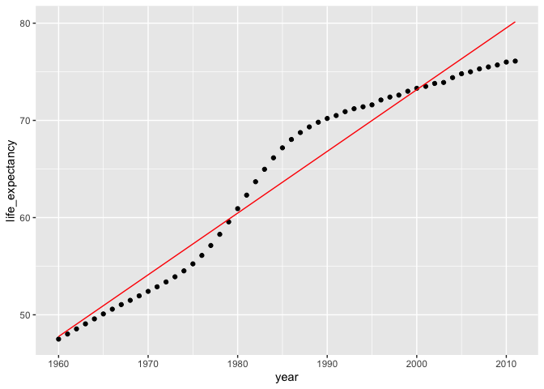
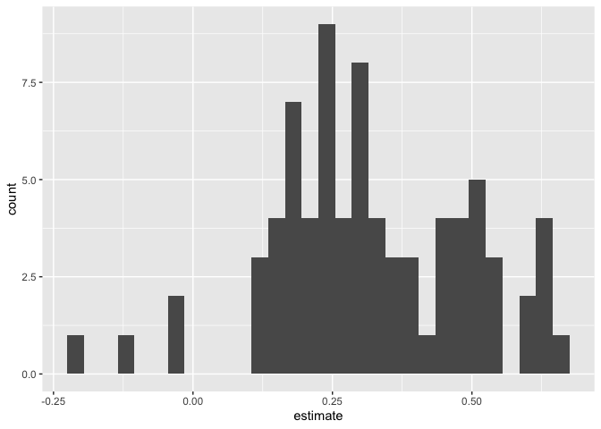
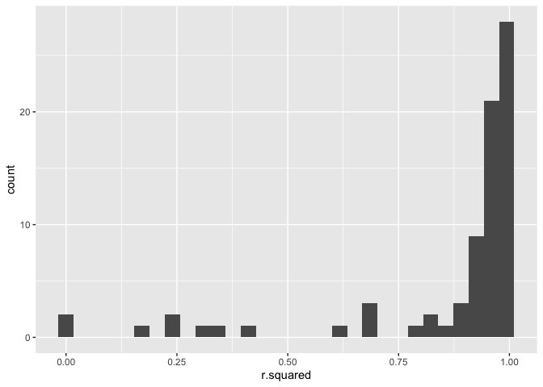
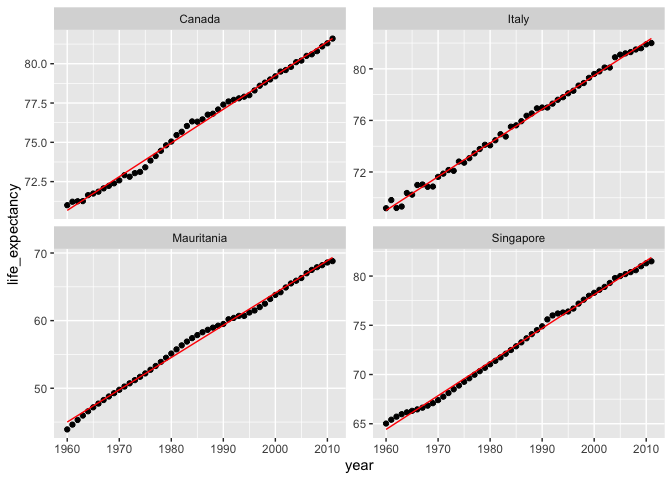
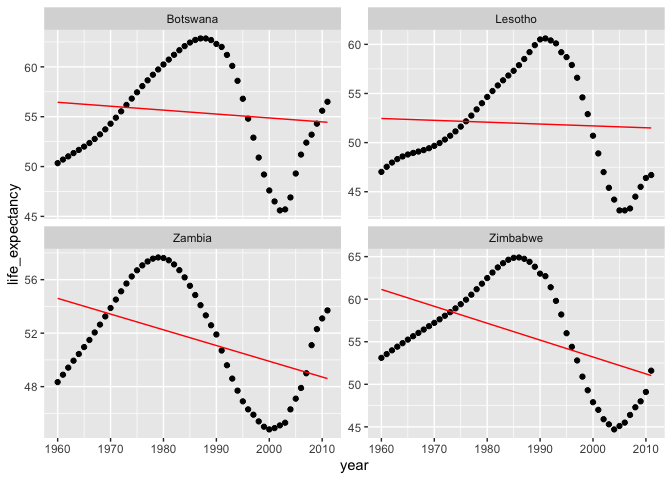

Machine Learning in the Tidyverse
================
Joschka Schwarz

-   [1. Foundations of “tidy” Machine
    learning](#1-foundations-of-tidy-machine-learning)
    -   [Foundations of “tidy” machine
        learning](#foundations-of-tidy-machine-learning)
    -   [Nesting your data](#nesting-your-data)
    -   [Unnesting your data](#unnesting-your-data)
    -   [Explore a nested cell](#explore-a-nested-cell)
    -   [The map family of functions](#the-map-family-of-functions)
    -   [Mapping your data](#mapping-your-data)
    -   [Expecting mapped output](#expecting-mapped-output)
    -   [Mapping many models](#mapping-many-models)
    -   [Tidy your models with broom](#tidy-your-models-with-broom)
    -   [The three ways to tidy your
        model](#the-three-ways-to-tidy-your-model)
    -   [Extracting model statistics
        tidily](#extracting-model-statistics-tidily)
    -   [Augmenting your data](#augmenting-your-data)
-   [2. Multiple Models with broom](#2-multiple-models-with-broom)
    -   [Exploring coefficients across
        models](#exploring-coefficients-across-models)
    -   [Tidy up the coefficients of your
        models](#tidy-up-the-coefficients-of-your-models)
    -   [What can we learn about these 77
        countries?](#what-can-we-learn-about-these-77-countries)
    -   [Evaluating the fit of many
        models](#evaluating-the-fit-of-many-models)
    -   [Glance at the fit of your
        models](#glance-at-the-fit-of-your-models)
    -   [Best and worst fitting models](#best-and-worst-fitting-models)
    -   [Visually inspect the fit of many
        models](#visually-inspect-the-fit-of-many-models)
    -   [Augment the fitted values of each
        model](#augment-the-fitted-values-of-each-model)
    -   [Explore your best and worst fitting
        models](#explore-your-best-and-worst-fitting-models)
    -   [Improve the fit of your
        models](#improve-the-fit-of-your-models)
    -   [Build better models](#build-better-models)
    -   [Predicting the future](#predicting-the-future)
-   [3. Build, Tune & Evaluate Regression
    Models](#3-build-tune--evaluate-regression-models)
    -   [Training, test and validation
        splits](#training-test-and-validation-splits)
    -   [The test-train split](#the-test-train-split)
    -   [Cross-validation data frames](#cross-validation-data-frames)
    -   [Measuring cross-validation
        performance](#measuring-cross-validation-performance)
    -   [Build cross-validated models](#build-cross-validated-models)
    -   [Preparing for evaluation](#preparing-for-evaluation)
    -   [Evaluate model performance](#evaluate-model-performance)
    -   [Building and tuning a random forest
        model](#building-and-tuning-a-random-forest-model)
    -   [Build a random forest model](#build-a-random-forest-model)
    -   [Evaluate a random forest
        model](#evaluate-a-random-forest-model)
    -   [Fine tune your model](#fine-tune-your-model)
    -   [The best performing parameter](#the-best-performing-parameter)
    -   [Measuring the test
        performance](#measuring-the-test-performance)
    -   [Build & evaluate the best
        model](#build--evaluate-the-best-model)
-   [4. Build, Tune & Evaluate Classification
    Models](#4-build-tune--evaluate-classification-models)
    -   [Logistic regression models](#logistic-regression-models)
    -   [Prepare train-test-validate
        parts](#prepare-train-test-validate-parts)
    -   [Build cross-validated models](#build-cross-validated-models-1)
    -   [Evaluating classification
        models](#evaluating-classification-models)
    -   [Predictions of a single model](#predictions-of-a-single-model)
    -   [Performance of a single model](#performance-of-a-single-model)
    -   [Prepare for cross-validated
        performance](#prepare-for-cross-validated-performance)
    -   [Calculate cross-validated
        performance](#calculate-cross-validated-performance)
    -   [Random forest for
        classification](#random-forest-for-classification)
    -   [Tune random forest models](#tune-random-forest-models)
    -   [Random forest performance](#random-forest-performance)
    -   [Build final classification
        model](#build-final-classification-model)
    -   [Measure final model
        performance](#measure-final-model-performance)
    -   [Wrap-up](#wrap-up)

**Short Description**

Leverage the tools in the tidyverse to generate, explore and evaluate
machine learning models.

**Long Description**

This course will teach you to leverage the tools in the “tidyverse” to
generate, explore, and evaluate machine learning models. Using a
combination of tidyr and purrr packages, you will build a foundation for
how to work with complex model objects in a “tidy” way. You will also
learn how to leverage the broom package to explore your resulting
models. You will then be introduced to the tools in the
test-train-validate workflow, which will empower you evaluate the
performance of both classification and regression models as well as
provide the necessary information to optimize model performance via
hyperparameter tuning.

# 1. Foundations of “tidy” Machine learning

This chapter will introduce you to the backbone of machine learning in
the tidyverse, the List Column Workflow (LCW). The LCW will empower you
to work with many models in one dataframe. <br> This chapter will also
introduce you to the fundamentals of the broom package for exploring
your models.

## Foundations of “tidy” machine learning

Theory. Coming soon …

## Nesting your data

In this course, you will work with a collection of economic and social
indicators for 77 countries over a period of 52 years. This data is
stored in the `gapminder` data frame.

In this exercise, you will transform your `gapminder` data into a
**nested** data frame by using the first tool needed to build the
foundation of **tidy** machine learning skills: `nest()`.

*Note: This is a more granular version than the dataset available from
the `gapminder` package. This version is available in the `dslabs`
package.*

**Steps**

1.  Take a look at the first six rows of `gapminder`.  
2.  Now leverage `group_by()` and `nest()` to nest your data frames by
    `country`, save this as `gap_nested`.
3.  Explore the first six rows of the newly created data frame
    `gap_nested`, note the new complex column **data** containing
    tibbles.

``` r
# Load data
gapminder <- readRDS("data/gapminder.rds")

# Explore gapminder
head(gapminder)
```

    ##   country year infant_mortality life_expectancy fertility population gdpPercap
    ## 1 Algeria 1960            148.2           47.50      7.65   11124892      1242
    ## 2 Algeria 1961            148.1           48.02      7.65   11404859      1047
    ## 3 Algeria 1962            148.2           48.55      7.65   11690152       820
    ## 4 Algeria 1963            148.4           49.07      7.65   11985130      1075
    ## 5 Algeria 1964            148.7           49.58      7.65   12295973      1109
    ## 6 Algeria 1965            149.1           50.09      7.66   12626953      1147

``` r
# Prepare the nested data frame gap_nested
library(tidyverse)
```

    ## ── Attaching packages ─────────────────────────────────────── tidyverse 1.3.1 ──

    ## ✓ ggplot2 3.3.5     ✓ purrr   0.3.4
    ## ✓ tibble  3.1.6     ✓ dplyr   1.0.7
    ## ✓ tidyr   1.1.4     ✓ stringr 1.4.0
    ## ✓ readr   2.1.0     ✓ forcats 0.5.1

    ## ── Conflicts ────────────────────────────────────────── tidyverse_conflicts() ──
    ## x dplyr::filter() masks stats::filter()
    ## x dplyr::lag()    masks stats::lag()

``` r
gap_nested <- gapminder %>% 
                nest(!country)
```

    ## Warning: All elements of `...` must be named.
    ## Did you want `data = c(year, infant_mortality, life_expectancy, fertility, population, 
    ##     gdpPercap)`?

``` r
  # group_by(country) %>% 
  # nest()

# Explore gap_nested
head(gap_nested)
```

    ## # A tibble: 6 × 2
    ##   country    data             
    ##   <fct>      <list>           
    ## 1 Algeria    <tibble [52 × 6]>
    ## 2 Argentina  <tibble [52 × 6]>
    ## 3 Australia  <tibble [52 × 6]>
    ## 4 Austria    <tibble [52 × 6]>
    ## 5 Bangladesh <tibble [52 × 6]>
    ## 6 Belgium    <tibble [52 × 6]>

You’re off to a great start! Notice that each row in `gap_nested`
contains a tibble.

## Unnesting your data

As you’ve seen in the previous exercise, a nested data frame is simply a
way to shape your data. Essentially taking the `group_by()` windows and
packaging them in corresponding rows.

In the same way you can use the `nest()` function to break your data
into nested chunks, you can use the `unnest()` function to expand the
data frames that are nested in these chunks.

**Steps**

1.  Use `unnest()` on the `gap_nested` data frame to take a nested
    column and expand it into a new data frame and save it as
    `gap_unnested`.
2.  Make sure that `gapminder` and `gap_unnested` are identical by using
    the `identical()` function.

``` r
# Create the unnested data frame called gap_unnnested
gap_unnested <- gap_nested %>% 
                  unnest(cols = c(data))
  
# Confirm that your data was not modified  
identical(gapminder, gap_unnested)
```

    ## [1] TRUE

Great work!! Notice that this transformation only reshaped your data, it
did not modify it.

## Explore a nested cell

In the first exercise, you successfully created a nested data frame
`gap_nested`. The `data` column contains tibbles for each country. In
this exercise, you will explore one of these nested chunks.

**Steps**

1.  Extract the nested data for Algeria and store this as `algeria_df`.
2.  Calculate the following summary stats for Algeria’s population:
    `min()`, `max()` and `mean()`.

``` r
# Extract the data of Algeria
algeria_df <- gap_nested$data[[1]]

# Calculate the minimum of the population vector
min(algeria_df$population)
```

    ## [1] 11124892

``` r
# Calculate the maximum of the population vector
max(algeria_df$population)
```

    ## [1] 36717132

``` r
# Calculate the mean of the population vector
mean(algeria_df$population)
```

    ## [1] 23129438

Well done! You can see that working with a single chunk in a nested data
frame is identical to working with regular data frames. In the next
section you will learn how to scale this approach to work on a vector of
nested data frames using the `map` family of functions.

## The map family of functions

Theory. Coming soon …

## Mapping your data

In combination with `mutate(),` you can use `map()` to append the
results of your calculation to a data frame. Since the `map()` function
always returns a vector of lists you must use `unnest()` to extract this
information into a numeric vector.

Here you will explore this functionality by calculating the mean
population of each country in the `gapminder` dataset.

**Steps**

1.  Use `map()` to apply the `mean()` function to calculate the
    population mean for each country and append this new list column
    called `mean_pop` using `mutate()`.
2.  Explore the first 6 rows of `pop_nested`.
3.  Use `unnest()` to convert the `mean_pop` list into a numeric column
    and save this as the `pop_mean` data frame.
4.  Explore `pop_mean` using `head()`.

``` r
# Calculate the mean population for each country
pop_nested <- gap_nested %>%
  mutate(mean_pop = map(data, ~mean(.x$population)))

# Take a look at pop_nested
head(pop_nested)
```

    ## # A tibble: 6 × 3
    ##   country    data              mean_pop 
    ##   <fct>      <list>            <list>   
    ## 1 Algeria    <tibble [52 × 6]> <dbl [1]>
    ## 2 Argentina  <tibble [52 × 6]> <dbl [1]>
    ## 3 Australia  <tibble [52 × 6]> <dbl [1]>
    ## 4 Austria    <tibble [52 × 6]> <dbl [1]>
    ## 5 Bangladesh <tibble [52 × 6]> <dbl [1]>
    ## 6 Belgium    <tibble [52 × 6]> <dbl [1]>

``` r
# Extract the mean_pop value by using unnest
pop_mean <- pop_nested %>% 
  unnest(mean_pop)

# Take a look at pop_mean
head(pop_mean)
```

    ## # A tibble: 6 × 3
    ##   country    data               mean_pop
    ##   <fct>      <list>                <dbl>
    ## 1 Algeria    <tibble [52 × 6]> 23129438.
    ## 2 Argentina  <tibble [52 × 6]> 30783053.
    ## 3 Australia  <tibble [52 × 6]> 16074837.
    ## 4 Austria    <tibble [52 × 6]>  7746272.
    ## 5 Bangladesh <tibble [52 × 6]> 97649407.
    ## 6 Belgium    <tibble [52 × 6]>  9983596.

Excellent job! Here you can see how to leverage the `map()` function to
apply a desired function and store it. In the next exercise you will see
how this can be done more concisely using `map_dbl()`.

## Expecting mapped output

When you know that the output of your mapped function is an expected
type (here it is a numeric vector) you can leverage the `map_*()` family
of functions to explicitly try to return that object type instead of a
list.

Here you will again calculate the mean population of each country, but
instead, you will use `map_dbl()` to explicitly append the numeric
vector returned by `mean()` to your data frame.

**Steps**

1.  Generate the `pop_mean` data frame using the `map_dbl()` function to
    calculate the population mean for each nested data frame.
2.  Explore the `pop_mean` data frame using `head()`.

``` r
# Calculate mean population and store result as a double
pop_mean <- gap_nested %>%
  mutate(mean_pop = map_dbl(data, ~mean(.x$population)))

# Take a look at pop_mean
head(pop_mean)
```

    ## # A tibble: 6 × 3
    ##   country    data               mean_pop
    ##   <fct>      <list>                <dbl>
    ## 1 Algeria    <tibble [52 × 6]> 23129438.
    ## 2 Argentina  <tibble [52 × 6]> 30783053.
    ## 3 Australia  <tibble [52 × 6]> 16074837.
    ## 4 Austria    <tibble [52 × 6]>  7746272.
    ## 5 Bangladesh <tibble [52 × 6]> 97649407.
    ## 6 Belgium    <tibble [52 × 6]>  9983596.

You’re doing great! With the `nest()` and `map_*()` functions in hand
you now have the foundation for building multiple models.

## Mapping many models

The `gap_nested` data frame available in your workspace contains the
gapminder dataset nested by country.

You will use this data to build a linear model for each country to
predict **life expectancy** using the **year** feature.

**Note:** The term *feature* is synonymous with the terms *variable* or
*predictor*. It refers to an attribute of your data that can be used to
build a machine learning model.

**Steps**

1.  Build a linear model for each country predicting `life_expectancy`
    using the `year` feature. Use the `lm()` function for this and save
    this new data frame containing models as `gap_models`.
2.  Extract the first model from this data frame and save this as
    `algeria_model`.
3.  View the information about the model using `summary()`.

``` r
# Build a linear model for each country
gap_models <- gap_nested %>%
    mutate(model = map(data, ~lm(formula = life_expectancy~year, data = .x)))
    
# Extract the model for Algeria    
algeria_model <- gap_models$model[[1]]

# View the summary for the Algeria model
summary(algeria_model)
```

    ## 
    ## Call:
    ## lm(formula = life_expectancy ~ year, data = .x)
    ## 
    ## Residuals:
    ##    Min     1Q Median     3Q    Max 
    ## -4.044 -1.577 -0.543  1.700  3.843 
    ## 
    ## Coefficients:
    ##               Estimate Std. Error t value Pr(>|t|)    
    ## (Intercept) -1.197e+03  3.994e+01  -29.96   <2e-16 ***
    ## year         6.349e-01  2.011e-02   31.56   <2e-16 ***
    ## ---
    ## Signif. codes:  0 '***' 0.001 '**' 0.01 '*' 0.05 '.' 0.1 ' ' 1
    ## 
    ## Residual standard error: 2.177 on 50 degrees of freedom
    ## Multiple R-squared:  0.9522, Adjusted R-squared:  0.9513 
    ## F-statistic: 996.2 on 1 and 50 DF,  p-value: < 2.2e-16

Fantastic work! You’ve just built **77** models for **77** countries
with just a few lines of code. <br> In the next series of exercises, you
will learn how you can extract information from `summary()` in a tidy
fashion.

## Tidy your models with broom

Theory. Coming soon …

## The three ways to tidy your model

> ## *Question*
>
> Below are the descriptions of the three functions in the **broom**
> package. Which ones are correct?<br> <br> A) **tidy()** returns the
> statistical findings of the model (such as coefficients)<br> B)
> **glance()** returns a concise one-row summary of the model<br> C)
> **augment()** adds prediction columns to the data being modeled<br>
> <br> ⬜ Only A<br> ⬜ A and C<br> ⬜ None are correct<br> ✅ All are
> correct<br>

Great job! These are the three main functions that `broom` provides for
tidying the output of models.

## Extracting model statistics tidily

In this exercise, you will use the `tidy()` and `glance()` functions to
extract information from `algeria_model` in a tidy manner.

For a linear model, `tidy()` extracts the model coefficients while
`glance()` returns the model statistics such as the \\(R^2\\).

**Steps**

1.  Extract the coefficient information as a tidy data frame of the
    `algeria_model` using `tidy()`.
2.  Extract the model statistics of `algeria_model` using `glance()`.

``` r
library(broom)

# Extract the coefficients of the algeria_model as a data frame
tidy(algeria_model)
```

    ## # A tibble: 2 × 5
    ##   term         estimate std.error statistic  p.value
    ##   <chr>           <dbl>     <dbl>     <dbl>    <dbl>
    ## 1 (Intercept) -1197.      39.9        -30.0 1.32e-33
    ## 2 year            0.635    0.0201      31.6 1.11e-34

``` r
# Extract the statistics of the algeria_model as a data frame
glance(algeria_model)
```

    ## # A tibble: 1 × 12
    ##   r.squared adj.r.squared sigma statistic  p.value    df logLik   AIC   BIC
    ##       <dbl>         <dbl> <dbl>     <dbl>    <dbl> <dbl>  <dbl> <dbl> <dbl>
    ## 1     0.952         0.951  2.18      996. 1.11e-34     1  -113.  232.  238.
    ## # … with 3 more variables: deviance <dbl>, df.residual <int>, nobs <int>

Great job! As you can see `tidy()` and `glance()` both return data
frames, this feature can be very useful for managing the results of many
models in one data frame.

## Augmenting your data

From the results of `glance()`, you learned that using the available
features the linear model fits well with an adjusted \\(R^2\\) of
*0.99*. The `augment()` function can help you explore this fit by
appending the predictions to the original data.

Here you will leverage this to compare the predicted values of
`life_expectancy` with the original ones based on the `year` feature.

**Steps**

1.  Build the augmented data frame `algeria_fitted` using `augment()`.
2.  Visualize the fit of the model with respect to `year` by plotting
    both `life_expectancy` as points and `.fitted` as a line.

``` r
# Build the augmented data frame
algeria_fitted <- augment(algeria_model)

# Compare the predicted values with the actual values of life expectancy
algeria_fitted %>% 
  ggplot(aes(x = year)) +
  geom_point(aes(y = life_expectancy)) + 
  geom_line(aes(y = .fitted), color = "red")
```

<!-- -->

Congratulations!

You’ve successfully completed Chapter 1. In the next chapter you will
see how you can leverage the tools you learned to build, evaluate and
explore the models you created for each country.

# 2. Multiple Models with broom

This chapter leverages the List Column Workflow to build and explore the
attributes of 77 models. You will use the tools from the broom package
to gain a multidimensional understanding of all of these models.

## Exploring coefficients across models

Theory. Coming soon …

## Tidy up the coefficients of your models

In this exercise you will leverage the list column workflow along with
the `tidy()` function from `broom` to extract and explore the
coefficients for the 77 models you built.

Remember the `gap_models` data frame contains a model predicting **life
expectancy** by **year** for 77 countries.

**Steps**

1.  Use `tidy()` to append a column (`coef`) containing coefficient
    statistics for each model to the `gap_models` data frame and save it
    as `model_coef_nested`.
2.  Simplify this data frame using `unnest()` to extract these
    coefficients in your data frame.
3.  Explore the coefficient estimates for the year feature across your
    77 models by plotting a histogram of their values.

``` r
# Extract the coefficient statistics of each model into nested data frames
model_coef_nested <- gap_models %>% 
    mutate(coef = map(model, ~tidy(.x)))
    
# Simplify the coef data frames for each model    
model_coef <- model_coef_nested %>%
    unnest(coef)

# Plot a histogram of the coefficient estimates for year         
model_coef %>% 
  filter(term == "year") %>% 
  ggplot(aes(x = estimate)) +
  geom_histogram()
```

    ## `stat_bin()` using `bins = 30`. Pick better value with `binwidth`.

<!-- -->

Great job! Now that you have the slope for each model let’s explore
their distribution.

## What can we learn about these 77 countries?

Explore the `model_coef` data frame you just created to answer the
following question:

> ## *Question*
>
> Which of the following conclusions can we make from the coefficients
> of our models?<br> <br> ⬜ About **10%** of the 77 countries had a
> decrease of life expectancy between 1960 and 2011.<br> ⬜ The **United
> States** experienced the fastest growth in life expectancy.<br> ✅ The
> majority of the 77 countries experienced a growth in average life
> expectancy between 1960 and 2011.<br> ⬜ All of these conclusions are
> correct.<br> ⬜ None of these conclusions are correct.<br>

You got it! Based on thse models we can conclude that 73 of the 77
countries experienced a growth in life expectancy during this time
period.

## Evaluating the fit of many models

Theory. Coming soon …

## Glance at the fit of your models

In this exercise you will use `glance()` to calculate how well the
linear models fit the data for each country.

**Steps**

1.  Append a column (`fit`) containing the fit statistics for each model
    to the `gap_models` data frame and save it as `model_perf_nested`.
2.  Simplify this data frame using `unnest()` to extract these fit
    statistics of each model and save it as `model_perf`.
3.  Finally, use `head()` to take a peek at `model_perf`.

``` r
# Extract the fit statistics of each model into data frames
model_perf_nested <- gap_models %>% 
    mutate(fit = map(model, ~glance(.x)))

# Simplify the fit data frames for each model    
model_perf <- model_perf_nested %>% 
    unnest(fit)

# Look at the first six rows of model_perf
head(model_perf)
```

    ## # A tibble: 6 × 15
    ##   country    data   model r.squared adj.r.squared sigma statistic  p.value    df
    ##   <fct>      <list> <lis>     <dbl>         <dbl> <dbl>     <dbl>    <dbl> <dbl>
    ## 1 Algeria    <tibb… <lm>      0.952         0.951 2.18       996. 1.11e-34     1
    ## 2 Argentina  <tibb… <lm>      0.984         0.984 0.431     3137. 8.78e-47     1
    ## 3 Australia  <tibb… <lm>      0.983         0.983 0.511     2905. 5.83e-46     1
    ## 4 Austria    <tibb… <lm>      0.987         0.986 0.438     3702. 1.48e-48     1
    ## 5 Bangladesh <tibb… <lm>      0.949         0.947 1.83       921. 7.10e-34     1
    ## 6 Belgium    <tibb… <lm>      0.990         0.990 0.331     5094. 5.54e-52     1
    ## # … with 6 more variables: logLik <dbl>, AIC <dbl>, BIC <dbl>, deviance <dbl>,
    ## #   df.residual <int>, nobs <int>

Great job! You have successfully calculated the fit statistics for all
77 of your models. Next, we’ll explore these results.

## Best and worst fitting models

In this exercise you will answer the following questions:

-   Overall, how well do your models fit your data?
-   Which are the best fitting models?
-   Which models do not fit the data well?

**Steps**

1.  Plot a histogram of the \\(R^2\\) values of the 77 models
2.  Extract the 4 best fitting models (based on \\(R^2\\)) and store
    this data frame as `best_fit`
3.  Extract the 4 worst fitting models (based on \\(R^2\\)) and store
    this data frame as `worst_fit`

``` r
# Plot a histogram of rsquared for the 77 models    
model_perf %>% 
  ggplot(aes(x = r.squared)) + 
  geom_histogram()
```

    ## `stat_bin()` using `bins = 30`. Pick better value with `binwidth`.

<!-- -->

``` r
# Extract the 4 best fitting models
best_fit <- model_perf %>% 
              slice_max(r.squared, n = 4)

# Extract the 4 models with the worst fit
worst_fit <- model_perf %>% 
              slice_min(r.squared, n = 4)
```

Excellent work! You have now prepared two data frames, one containing
the four best fitting models and another the four worst fitting models.
In the next section we will use the `augment()` function to explore
these fits visually.

## Visually inspect the fit of many models

Theory. Coming soon …

## Augment the fitted values of each model

In this exercise you will prepare your four best and worst fitting
models for further exploration by augmenting your model data with
`augment()`.

**Steps**

1.  Build the `best_augmented` data frame by building augmented data
    frames and simplifying them with `unnest()` using the `best_fit`
    data frame.
2.  Build the `worst_augmented` data frame by building augmented data
    frames and simplifying them with `unnest()` using the `worst_fit`
    data frame.

``` r
best_augmented <- best_fit %>% 
  # Build the augmented data frame for each country model
  mutate(augmented = map(model, ~augment(.x))) %>% 
  # Expand the augmented data frames
  unnest(augmented)

worst_augmented <- worst_fit %>% 
  # Build the augmented data frame for each country model
  mutate(augmented = map(model, ~augment(.x))) %>% 
  # Expand the augmented data frames
  unnest(augmented)
```

You’re doing great! You now have the pieces necessary to visually
explore the fits of these 8 models.

## Explore your best and worst fitting models

Let’s explore your four best and worst fitting models by comparing the
fitted lines with the actual values.

**Steps**

1.  Visualize the fit of your four best fitting models with respect to
    `year` by plotting both `life_expectancy` as points and `.fitted` as
    a line.

``` r
# Compare the predicted values with the actual values of life expectancy 
# for the top 4 best fitting models
best_augmented %>% 
  ggplot(aes(x = year)) +
  geom_point(aes(y = life_expectancy)) + 
  geom_line(aes(y = .fitted), color = "red") +
  facet_wrap(~country, scales = "free_y")
```

<!-- -->

2.  Visualize the fit of your four worst fitting models with respect to
    `year` by plotting both `life_expectancy` as points and `.fitted` as
    a line.

``` r
# Compare the predicted values with the actual values of life expectancy 
# for the top 4 worst fitting models
worst_augmented %>% 
  ggplot(aes(x = year)) +
  geom_point(aes(y = life_expectancy)) + 
  geom_line(aes(y = .fitted), color = "red") +
  facet_wrap(~country, scales = "free_y")
```

<!-- -->

Cool plots! You can see that a linear model does a great job for the
best 4 fitting models but the worst 4 fitting models do not seem to have
a linear relationship. You will work to improve this fit in the next
series of exercises by incorporating additional features.

## Improve the fit of your models

Theory. Coming soon …

## Build better models

Earlier you built a collection of simple models to fit **life
expectancy** using the **year** feature. Your previous analysis showed
that some of these models didn’t fit very well.

In this exercise you will build multiple regression models for each
country using all available features. You may be interested in comparing
the performance of the four worst fitting models so their adjusted
\\(R^2\\) are provided below:

| Country  | Adjusted R^2 |
|:---------|-------------:|
| Botswana |   -0.0060772 |
| Lesotho  |   -0.0169851 |
| Zambia   |    0.1668999 |
| Zimbabwe |    0.2083979 |

**Steps**

1.  Build a linear model for each country predicting `life_expectancy`
    using every feature in the dataset.
2.  Append a column (`fit`) containing fit statistics for each model and
    simplify this data frame.
3.  Print the adjusted \\(R^2\\) in `fullmodel_perf` of the four
    countries from `worst_fit` data frame.

``` r
# Build a linear model for each country using all features
gap_fullmodel <- gap_nested %>% 
  mutate(model = map(data, ~lm(life_expectancy~., data = .x)))

fullmodel_perf <- gap_fullmodel %>% 
  # Extract the fit statistics of each model into data frames
  mutate(fit = map(model, ~glance(.x))) %>% 
  # Simplify the fit data frames for each model
  unnest(fit)
  
# View the performance for the four countries with the worst fitting 
# four simple models you looked at before
fullmodel_perf %>% 
  filter(country %in% worst_fit$country) %>% 
  select(country, adj.r.squared)
```

    ## # A tibble: 4 × 2
    ##   country  adj.r.squared
    ##   <fct>            <dbl>
    ## 1 Botswana         0.844
    ## 2 Lesotho          0.908
    ## 3 Zambia           0.706
    ## 4 Zimbabwe         0.978

That was a tough one and you did great! You can see that the performance
of each of the four worst performing models based on their adjusted
*R*<sup>2</sup> drastically improved once other features were added to
the model.

## Predicting the future

| Country | Adjusted R^2 |
|:--------|-------------:|
| Brazil  |    0.9994261 |
| Greece  |    0.9994407 |
| Mexico  |    0.9995427 |
| Morocco |    0.9997960 |

> ## *Question*
>
> Which of these four models do you expect to perform the best for
> future years?<br> <br> ⬜ Brazil<br> ⬜ Greece<br> ⬜ Mexico<br> ⬜
> Morocco<br> ✅ Can not be determined using this information<br>

Bingo! While the adjusted \\(R^2\\) does tell us how well the model fit
our data, it does not give any indication on how it would perform on new
data. In the upcoming chapter you will learn how to estimate model
performance using data withheld from building the model.

# 3. Build, Tune & Evaluate Regression Models

In this chapter you will learn how to use the List Column Workflow to
build, tune and evaluate regression models. You will have the chance to
work with two types of models: linear models and random forest models.

## Training, test and validation splits

Theory. Coming soon …

## The test-train split

In a disciplined machine learning workflow it is crucial to withhold a
portion of your data (**testing data**) from any decision-making
process. This allows you to independently assess the performance of your
model when it is finalized. The remaining data, the **training data**,
is used to build and select the best model.

In this exercise, you will use the `rsample` package to split your data
to perform the initial train-test split of your `gapminder` data.

**Note:** *Since this is a random split of the data it is good practice
to set a seed before splitting it.*

**Steps**

1.  Split your data into 75% training and 25% testing using the
    `initial_split()` function and assign it to `gap_split`.  
2.  Extract the training data frame from `gap_split` using the
    `training()` function.
3.  Extract the testing data frame from `gap_split` using the
    `testing()` function.
4.  Ensure that the dimensions of your new data frames are what you
    expected by using the `dim()` function on `training_data` and
    `testing_data`.

``` r
set.seed(42)

# Load package
library(rsample)

# Prepare the initial split object
gap_split <- initial_split(gapminder, prop = 0.75)

# Extract the training data frame
training_data <- training(gap_split)

# Extract the testing data frame
testing_data <- testing(gap_split)

# Calculate teh dimensions of both training_data and testing_data
dim(training_data)
```

    ## [1] 3003    7

``` r
dim(testing_data)
```

    ## [1] 1001    7

Great work! You have withheld a portion of your data for a final,
unbiased, evaluation of your model. Throughout the rest of this chapter
you will take the steps necessary to identify the best performing model
using only the **training data**. At the end of the chapter you will
select the best performing model and measure its performance using the
**testing data** that you created here.

## Cross-validation data frames

Now that you have withheld a portion of your data as **testing data**,
you can use the remaining portion to find the best performing model.

In this exercise, you will split the training data into a series of
**5** train-validate sets using the `vfold_cv()` function from the
`rsample` package.

**Steps**

1.  Build a data frame for 5-fold cross validation from the
    `training_data` using `vfold_cv()` and assign it to `cv_split`.  

2.  Prepare `cv_data` by appending two new columns to `cv_split`:
    `train`: containing the train data frames by mapping `training()`
    across the `splits` column. `validate`: containing the validate data
    frames by using mapping `testing()` across the `splits` column.

    -   `train`: containing the train data frames by mapping
        `training()` across the `splits` column.
    -   `validate`: containing the validate data frames by using mapping
        `testing()` across the `splits` column.

``` r
set.seed(42)

# Prepare the data frame containing the cross validation partitions
cv_split <- vfold_cv(training_data, v = 5)

cv_data <- cv_split %>% 
  mutate(
    # Extract the train data frame for each split
    train = map(splits, ~training(.x)), 
    # Extract the validate data frame for each split
    validate = map(splits, ~testing(.x)),
    # Extract the recorded life expectancy for the records in the validate data frames
    validate_actual = map(validate, ~.x$life_expectancy),
  )

# Use head() to preview cv_data
head(cv_data)
```

    ## #  5-fold cross-validation 
    ## # A tibble: 5 × 5
    ##   splits             id    train                validate         validate_actual
    ##   <list>             <chr> <list>               <list>           <list>         
    ## 1 <split [2402/601]> Fold1 <tibble [2,402 × 7]> <tibble [601 × … <dbl [601]>    
    ## 2 <split [2402/601]> Fold2 <tibble [2,402 × 7]> <tibble [601 × … <dbl [601]>    
    ## 3 <split [2402/601]> Fold3 <tibble [2,402 × 7]> <tibble [601 × … <dbl [601]>    
    ## 4 <split [2403/600]> Fold4 <tibble [2,403 × 7]> <tibble [600 × … <dbl [600]>    
    ## 5 <split [2403/600]> Fold5 <tibble [2,403 × 7]> <tibble [600 × … <dbl [600]>

Excellent job! Now you’re back to the same list column workflow you’ve
used in the previous chapters. You will use this data frame throughout
this chapter to measure and compare the performance of the models you
create.

## Measuring cross-validation performance

Theory. Coming soon …

## Build cross-validated models

In this exercise, you will build a linear model predicting
`life_expectancy` using all available features. You will do this for the
train data of each cross-validation fold.

**Steps**

1.  Build models predicting `life_expectancy` using all available
    features with the `train` data for each fold of the cross
    validation.

``` r
# Build a model using the train data for each fold of the cross validation
cv_models_lm <- cv_data %>% 
  mutate(model = map(train, ~lm(formula = life_expectancy~., data = .x)))
```

You’re doing great! Now that you have the models built, let’s prepare
the parts we need to evaluate their performance.

## Preparing for evaluation

In order to measure the **validate** performance of your models you need
compare the predicted values of `life_expectancy` for the observations
from validate set to the actual values recorded. Here you will prepare
both of these vectors for each partition.

**Steps**

<!-- 1. Extract the actual `life_expectancy` from the validate data frames and store these in the column `validate_actual`.  -->

2.  Predict the `life_expectancy` for each validate partition using the
    `map2()` and `predict()` functions in the column
    `validate_predicted`.

``` r
cv_prep_lm <- cv_models_lm %>% 
  mutate(
    # Extract the recorded life expectancy for the records in the validate data frames
    # validate_actual = map(validate, ~.x$life_expectancy),
    # Predict life expectancy for each validate set using its corresponding model
    validate_predicted = map2(.x = model, .y = validate, ~predict(.x, .y))
  )
```

Great work! In the next exercise you will compare `validate_actual` to
`validate_predicted` to measure the performance of all 5 models.

## Evaluate model performance

Now that you have both the **actual** and **predicted** values of each
fold you can compare them to measure performance.

For this regression model, you will measure the **Mean Absolute Error
(MAE)** between these two vectors. This value tells you the average
difference between the **actual** and **predicted** values.

**Steps**

1.  Calculate the MAE by comparing the actual with the predicted values
    for the validate data and assign it to the `validate_mae` column.  
2.  Print the `validate_mae` column (note how they vary).
3.  Calculate the mean of this column.

``` r
library(Metrics)
# Calculate the mean absolute error for each validate fold       
cv_eval_lm <- cv_prep_lm %>% 
  mutate(validate_mae = map2_dbl(validate_actual, validate_predicted, ~mae(actual = .x, predicted = .y)))

# Print the validate_mae column
cv_eval_lm$validate_mae
```

    ## [1] 1.564897 1.481837 1.395386 1.589818 1.460490

``` r
# Calculate the mean of validate_mae column
mean(cv_eval_lm$validate_mae)
```

    ## [1] 1.498485

Excellent! You now know that based on 5 train-validate splits, the
predictions of the models are on average off by 1.5 years. Can we
improve this performance by using a more complex model? Let’s find out!

## Building and tuning a random forest model

Theory. Coming soon …

## Build a random forest model

Here you will use the same cross-validation data to build (using
`train`) and evaluate (using `validate`) random forests for each
partition. Since you are using the same cross-validation partitions as
your regression models, you are able to directly compare the performance
of the two models.

**Note:** *We will limit our random forests to contain 100 trees to
ensure they finish fitting in a reasonable time. The default number of
trees for `ranger()` is 500.*

**Steps**

1.  Use `ranger()` to build a random forest predicting `life_expectancy`
    using all features in `train` for each cross validation partition.
    <!-- 2. Extract the actual `life_expectancy` from the validate data frames and store these in the column `validate_actual`.  -->
2.  Add a new column `validate_predicted` predicting the
    `life_expectancy` for the observations in `validate` using the
    random forest models you just created.

``` r
library(ranger)

# Build a random forest model for each fold
cv_models_rf <- cv_data %>% 
  mutate(model = map(train, ~ranger(formula = life_expectancy~., data = .x,
                                    num.trees = 100, seed = 42)))
                                    
# Generate predictions using the random forest model
cv_prep_rf <- cv_models_rf %>% 
  mutate(
    # Extract the recorded life expectancy for the records in the validate data frames
    # validate_actual    = map(validate, ~.x$life_expectancy),
    # Predict life expectancy for each validate set using its corresponding model
    validate_predicted = map2(.x = model, .y = validate, ~predict(.x, .y)$predictions)
  )
```

Great job! In the next exercise, you will evaluate the predictions from
this model.

## Evaluate a random forest model

Similar to the linear regression model, you will use the **MAE** metric
to evaluate the performance of the random forest model.

**Steps**

1.  Calculate the MAE by comparing the actual with the predicted values
    for the validate data and assign it to the `validate_mae` column.  
2.  Print the `validate_mae` column (note how they vary).
3.  Calculate the mean of this column.

``` r
library(ranger)

# Calculate validate MAE for each fold
cv_eval_rf <- cv_prep_rf %>% 
  mutate(validate_mae = map2_dbl(validate_actual, validate_predicted, ~mae(actual = .x, predicted = .y)))

# Print the validate_mae column
cv_eval_rf$validate_mae
```

    ## [1] 0.8366463 0.8049924 0.8190787 0.9069308 0.7877450

``` r
# Calculate the mean of validate_mae column
mean(cv_eval_rf$validate_mae)
```

    ## [1] 0.8310787

Impressive! You’ve dropped the average error of your predictions from
1.5 to 0.83. That’s quite an improvement! In the next exercise you’ll
see if you can squeeze a bit more performance out by tuning a parameter
of the random forest model.

## Fine tune your model

Wow! That was a significant improvement over a regression model. Now
let’s see if you can further improve this performance by fine tuning
your random forest models. To do this you will vary the `mtry` parameter
when building your random forest models on your `train` data.

The default value of `mtry` for ranger is the rounded down square root
of the total number of features (6). This results in a value of **2**.

**Steps**

1.  Use `crossing()` to expand the cross validation data for values of
    `mtry` ranging from **2** through **5**.
2.  Build random forest models for each fold/mtry combination.

``` r
# Prepare for tuning your cross validation folds by varying mtry
cv_tune <- cv_data %>% 
  crossing(mtry = 2:5) 

# Build a model for each fold & mtry combination
cv_model_tunerf <- cv_tune %>% 
  mutate(model = map2(.x = train, .y = mtry, ~ranger(formula = life_expectancy~., 
                                              data = .x, mtry = .y, 
                                              num.trees = 100, seed = 42)))
```

Great work! You’ve built a model for each fold/mtry combination. Next,
you’ll measure the performance of each to find the best performing value
of `mtry`.

## The best performing parameter

You’ve now built models where you’ve varied the random forest-specific
hyperparameter `mtry` in the hopes of improving your model further. Now
you will measure the performance of each `mtry` value across the 5 cross
validation partitions to see if you can improve the model.

Remember that the validate MAE you calculated two exercises ago of
`0.795` was for the default `mtry` value of **2**.

**Steps**

1.  Generate predictions for each mtry/fold combination.
2.  Calculate the **MAE** for each mtry/fold combination.
3.  Calculate the mean **MAE** for each value of `mtry`.

``` r
# Generate validate predictions for each model
cv_prep_tunerf <- cv_model_tunerf %>% 
  mutate(validate_predicted = map2(.x = model, .y = validate, ~predict(.x, .y)$predictions))

# Calculate validate MAE for each fold and mtry combination
cv_eval_tunerf <- cv_prep_tunerf %>% 
  mutate(validate_mae = map2_dbl(.x = validate_actual, .y = validate_predicted, ~mae(actual = .x, predicted = .y)))

# Calculate the mean validate_mae for each mtry used  
cv_eval_tunerf %>% 
  group_by(mtry) %>% 
  summarise(mean_mae = mean(validate_mae))
```

    ## # A tibble: 4 × 2
    ##    mtry mean_mae
    ##   <int>    <dbl>
    ## 1     2    0.831
    ## 2     3    0.822
    ## 3     4    0.816
    ## 4     5    0.820

Excellent job! Looks like parameter tuning was able to eke out another
slight boost in performance, dropping the mae from 0.831 (mtry = 2) to
0.816 (mtry = 4). Assuming that you’ve finished your model selection you
can conclude that your final (best performing) model will be the random
forest model built using `ranger` with an `mtry = 4` and
`num.trees = 100`. In the next exercise you will build this model using
all training data and evaluate its expected future performance using the
testing data.

## Measuring the test performance

Theory. Coming soon …

## Build & evaluate the best model

Using cross-validation you were able to identify the best model for
predicting `life_expectancy` using all the features in `gapminder`. Now
that you’ve selected your model, you can use the independent set of data
(`testing_data`) that you’ve held out to estimate the performance of
this model on new data.

You will build this model using all `training_data` and evaluate using
`testing_data`.

**Steps**

1.  Use `ranger()` to build the best performing model (mtry = 4) using
    all of the training data. Assign this to `best_model`.
2.  Extract the `life_expectancy` column from `testing_data` and assign
    it to `test_actual`.
3.  Predict `life_expectancy` using the `best_model` on the `testing`
    data and assign it to `test_predicted`.
4.  Calculate the MAE using `test_actual` and `test_predicted` vectors.

``` r
# Build the model using all training data and the best performing parameter
best_model <- ranger(formula = life_expectancy~., data = training_data,
                     mtry = 4, num.trees = 100, seed = 42)

# Prepare the test_actual vector
test_actual <- testing_data$life_expectancy

# Predict life_expectancy for the testing_data
test_predicted <- predict(best_model, testing_data)$predictions

# Calculate the test MAE
mae(test_actual, test_predicted)
```

    ## [1] 0.6634941

Fantastic work! You have successfully leveraged the list column workflow
to identify and build a model to predict life expectancy. You can claim
that based on the test holdout you can expect that your predictions on
new data will only be off by a magnitude of 0.663 years.”)() %\>%
{check_function(., “ranger”) %\>% {check_arg(., “formula”) %\>%
check_equal()check_arg(., “data”) %\>% check_equal()check_arg(., “mtry”)
%\>% check_equal()check_arg(., “num.trees”) %\>%
check_equal()check_arg(., “seed”) %\>% check_equal()}check_object(.,
“best_model”)check_object(., “test_actual”) %\>%
check_equal()check_object(., “test_predicted”) %\>%
check_equal(incorrect_msg = “Did you correctly predict `life_expectancy`
using the `best_model` on `testing` data and assign it to
`test_predicted`?”, append = FALSE)}() %\>%
check_correct({check_output_expr(., “mae(test_actual, test_predicted)”,
missing_msg = “Did you correctly calculate the test MAE?”)},
{check_function(., “mae”) %\>% {check_arg(., “actual”) %\>%
check_equal()check_arg(., “predicted

# 4. Build, Tune & Evaluate Classification Models

In this chapter you will shift gears to build, tune and evaluate
classification models.

## Logistic regression models

Theory. Coming soon …

## Prepare train-test-validate parts

In this exercise, you will leverage the tools that you have learned thus
far to build a classification model to predict employee attrition.

You will work with the `attrition` dataset, which contains 30 features
about employees which you will use to predict if they have left the
company.

You will first prepare the training & testing data sets, then you will
further split the training data using cross-validation so that you can
search for the best performing model for this task.

**Steps**

1.  Split your data into 75% training and 25% testing using the
    `initial_split()` function.
2.  Extract the training and testing data frames from `data_split` using
    `training()` and `testing()`, respectively.

``` r
set.seed(42)

# Load data
attrition <- readRDS("data/attrition.rds")

# Prepare the initial split object
data_split    <- initial_split(attrition, prop = 0.75)

# Extract the training data frame
training_data <- training(data_split)

# Extract the testing data frame
testing_data  <- testing(data_split)
```

3.  Build a data frame for 5-fold cross validation from the
    `training_data` using `vfold_cv()`.
4.  Prepare the `cv_data` data frame by extracting the train and
    validate data frames for each fold.

``` r
set.seed(42)
cv_split <- vfold_cv(training_data, v = 5)

cv_data <- cv_split %>% 
  mutate(
    # Extract the train data frame for each split
    train = map(splits, ~training(.x)),
    # Extract the validate data frame for each split
    validate = map(splits, ~testing(.x))
  )
```

Great work!! Now you have the parts necessary to build & tune your
classification models.

## Build cross-validated models

In this exercise, you will build logistic regression models for each
fold in your cross-validation.

You will build this using the `glm()` function and by setting the family
argument to `"binomial"`.

**Steps**

1.  Build models predicting `Attrition` using all available features
    with the `train` data for each fold of the cross validation.

``` r
# Build a model using the train data for each fold of the cross validation
cv_models_lr <- cv_data %>% 
  mutate(model = map(train, ~glm(formula = Attrition~., 
                                 data = .x, family = "binomial")))
```

Excellent work! Now let’s learn how to evaluate these models.

## Evaluating classification models

Theory. Coming soon …

## Predictions of a single model

To calculate the performance of a classification model you need to
compare the actual values of `Attrition` to those predicted by the
model. When calculating metrics for binary classification tasks (such as
precision and recall), the actual and predicted vectors must be
converted to **binary** values.

In this exercise, you will learn how to prepare these vectors using the
model and validate data frames from the first cross-validation fold as
an example.

**Steps**

1.  Extract the `model` and the `validate` data frame from the first
    fold of the cross-validation.
2.  Extract the `Attrition` column from the `validate` data frame and
    convert the values to binary (TRUE/FALSE).
3.  Use `model` to predict the probabilities of attrition for the
    `validate` data frame.
4.  Convert the predicted probabilities to a binary vector, assume all
    probabilities greater than `0.5` are TRUE.

``` r
# Extract the first model and validate 
model <- cv_models_lr$model[[1]]
validate <- cv_models_lr$validate[[1]]

# Prepare binary vector of actual Attrition values in validate
validate_actual <- validate$Attrition == "Yes"

# Predict the probabilities for the observations in validate
validate_prob <- predict(model, validate, type = "response")

# Prepare binary vector of predicted Attrition values for validate
validate_predicted <- validate_prob > 0.5
```

Fantastic! Now you have the actual and predicted vectors. In the next
exercise you’ll use these vectors to calculate some metrics to check the
performance of the model.

## Performance of a single model

Now that you have the binary vectors for the actual and predicted values
of the model, you can calculate many commonly used binary classification
metrics. In this exercise you will focus on:

-   **accuracy:** rate of correctly predicted values relative to all
    predictions.
-   **precision:** portion of predictions that the model correctly
    predicted as TRUE.
-   **recall:** portion of actual TRUE values that the model correctly
    recovered.

**Steps**

1.  Use `table()` to compare the `validate_actual` and
    `validate_predicted` values for the example model and validate data
    frame.
2.  Calculate the accuracy.  
3.  Calculate the precision.  
4.  Calculate the recall.

``` r
library(Metrics)

# Compare the actual & predicted performance visually using a table
table(validate_actual, validate_predicted)
```

    ##                validate_predicted
    ## validate_actual FALSE TRUE
    ##           FALSE   187    5
    ##           TRUE     14   15

``` r
# Calculate the accuracy
accuracy(validate_actual, validate_predicted)
```

    ## [1] 0.9140271

``` r
# Calculate the precision
precision(validate_actual, validate_predicted)
```

    ## [1] 0.75

``` r
# Calculate the recall
recall(validate_actual, validate_predicted)
```

    ## [1] 0.5172414

Great work! The type of metric you use should be informed by the
application of your model. In the next exercise you will expand on this
example to calculate the recall metric for each of your cross validation
folds.

## Prepare for cross-validated performance

Now that you know how to calculate the performance metrics for a single
model, you are now ready to expand this for all the folds in the
cross-validation data frame.

**Steps**

1.  Add the `validate_actual` binary column for each cross-validation
    fold by converting all `"Yes"` values to `TRUE`.
2.  Use `model` to predict the probabilities of attrition for each
    cross-validation fold of `validate`. Convert the predicted
    probabilities to a binary vector, treating all probabilities greater
    than **0.5** as TRUE. Name this column `validate_predicted`.

``` r
cv_prep_lr <- cv_models_lr %>% 
  mutate(
    # Prepare binary vector of actual Attrition values in validate
    validate_actual = map(validate, ~.x$Attrition == "Yes"),
    # Prepare binary vector of predicted Attrition values for validate
    validate_predicted = map2(.x = model, .y = validate, ~predict(.x, .y, type = "response") > 0.5)
  )
```

Great work! Next, you’ll calculate the recall of these cross validated
models.

## Calculate cross-validated performance

It is crucial to optimize models using a carefully selected metric aimed
at achieving the goal of the model.

Imagine that in this case you want to use this model to identify
employees that are predicted to leave the company. Ideally, you want a
model that can capture as many of the ready-to-leave employees as
possible so that you can intervene. The corresponding metric that
captures this is the **recall** metric. As such, you will exclusively
use **recall** to optimize and select your models.

**Steps**

1.  Calculate the recall by comparing the actual with the predicted
    responses for each fold and assign it to the `validate_recall`
    column.
2.  Print the `validate_recall` column.  
3.  Print the mean of this column.

``` r
# Calculate the validate recall for each cross validation fold
cv_perf_recall <- cv_prep_lr %>% 
  mutate(validate_recall = map2_dbl(validate_actual, validate_predicted, 
                                    ~recall(actual = .x, predicted = .y)))

# Print the validate_recall column
cv_perf_recall$validate_recall
```

    ## [1] 0.5172414 0.4705882 0.4242424 0.4722222 0.4222222

``` r
# Calculate the average of the validate_recall column
mean(cv_perf_recall$validate_recall)
```

    ## [1] 0.4613033

Excellent! As you can see the validate recall of the model is 0.46, can
you beat this using a more complex model. In the next series of
exercises you will find out.

## Random forest for classification

Theory. Coming soon …

## Tune random forest models

Now that you have a working logistic regression model you will prepare a
random forest model to compare it with.

**Steps**

1.  Use `crossing()` to expand the cross-validation data for values of
    `mtry` using the values of 2, 4, 8, and 16.
2.  Build random forest models for each fold/mtry combination.

``` r
# Prepare for tuning your cross validation folds by varying mtry
cv_tune <- cv_data %>%
  crossing(mtry = c(2, 4, 8, 16)) 

# Build a cross validation model for each fold & mtry combination
cv_models_rf <- cv_tune %>% 
  mutate(model = map2(train, mtry, ~ranger(formula = Attrition~., 
                                           data = .x, mtry = .y,
                                           num.trees = 100, seed = 42)))
```

Fantastic work! Next you will evaluate the validation performance of
these random forest models.

## Random forest performance

It is now time to see whether the random forests models you built in the
previous exercise are able to outperform the logistic regression model.

Remember that the validate **recall** for the logistic regression model
was 0.43.

**Steps**

1.  Prepare the `validate_actual` and `validate_predicted` columns for
    each mtry/fold combination.
2.  Calculate the **recall** for each mtry/fold combination.
3.  Calculate the mean **recall** for each value of `mtry`.

``` r
cv_prep_rf <- cv_models_rf %>% 
  mutate(
    # Prepare binary vector of actual Attrition values in validate
    validate_actual = map(validate, ~.x$Attrition == "Yes"),
    # Prepare binary vector of predicted Attrition values for validate
    validate_predicted = map2(.x = model, .y = validate, ~predict(.x, .y, type = "response")$predictions == "Yes")
  )

# Calculate the validate recall for each cross validation fold
cv_perf_recall <- cv_prep_rf %>% 
  mutate(recall = map2_dbl(.x = validate_actual, .y = validate_predicted, ~recall(actual = .x, predicted = .y)))

# Calculate the mean recall for each mtry used  
cv_perf_recall %>% 
  group_by(mtry) %>% 
  summarise(mean_recall = mean(recall))
```

    ## # A tibble: 4 × 2
    ##    mtry mean_recall
    ##   <dbl>       <dbl>
    ## 1     2       0.105
    ## 2     4       0.121
    ## 3     8       0.158
    ## 4    16       0.180

Great work! This time you can see that none of the random forest models
were able to outperform the logistic regression model with respect to
recall.

## Build final classification model

Comparing the **recall** performance between the logistic regression
model (0.4) and the best performing random forest model (0.2), you’ve
learned that the model with the best performance is the logistic
regression model. In this exercise, you will build the logistic
regression model using all of the **train** data and you will prepare
the necessary vectors for evaluating this model’s **test** performance.

**Steps**

1.  Build a logistic regression model predicting `Attrition` using all
    available features in the `training_data`.
2.  Prepare the binary vector of actual test values, `test_actual`.  
3.  Prepare the binary vector of predicted values where a probability
    greater than 0.5 indicates `TRUE` and store this as
    `test_predicted`.

``` r
# Build the logistic regression model using all training data
best_model <- glm(formula = Attrition~., 
                  data = training_data, family = "binomial")

# Prepare binary vector of actual Attrition values for testing_data
test_actual <- testing_data$Attrition == "Yes"

# Prepare binary vector of predicted Attrition values for testing_data
test_predicted <- predict(best_model, testing_data, type = "response") > 0.5
```

Almost at the finish line. You’ve now selected & built your best
performing model and have prepared the necessary parts to evaluate its
performance.

## Measure final model performance

Now its time to calculate the **test performance** of your final model
(logistic regression). Here you will use the held out **testing** data
to characterize the performance you would expect from this model when it
is applied to new data.

**Steps**

1.  Use `table()` to compare the `test_actual` and `test_predicted`
    vectors.  
2.  Calculate the test accuracy.
3.  Calculate the test precision.
4.  Calculate the test recall.
5.  After this exercise, you are done with the course! If you enjoyed
    the material, feel free to send Dmitriy a thank you via Twitter.
    He’ll appreciate it. Tweet to Dmitriy

``` r
# Compare the actual & predicted performance visually using a table
table(test_actual, test_predicted)
```

    ##            test_predicted
    ## test_actual FALSE TRUE
    ##       FALSE   301    7
    ##       TRUE     33   27

``` r
# Calculate the test accuracy
accuracy(test_actual, test_predicted)
```

    ## [1] 0.8913043

``` r
# Calculate the test precision
precision(test_actual, test_predicted)
```

    ## [1] 0.7941176

``` r
# Calculate the test recall
recall(test_actual, test_predicted)
```

    ## [1] 0.45

Well done! You now have a model that you can expect to identify 45% of
employees that are at risk to leave the organization.

## Wrap-up

Theory. Coming soon …
