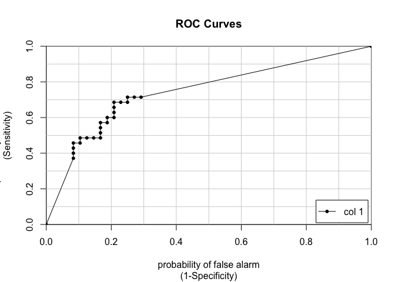
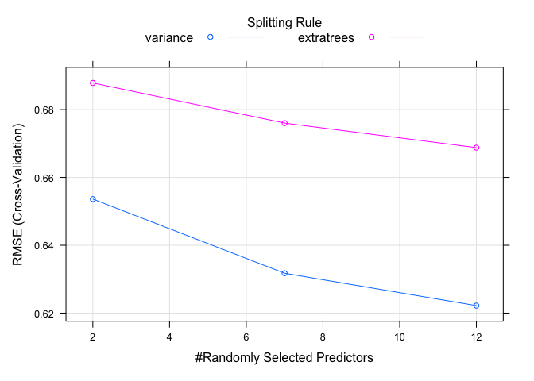
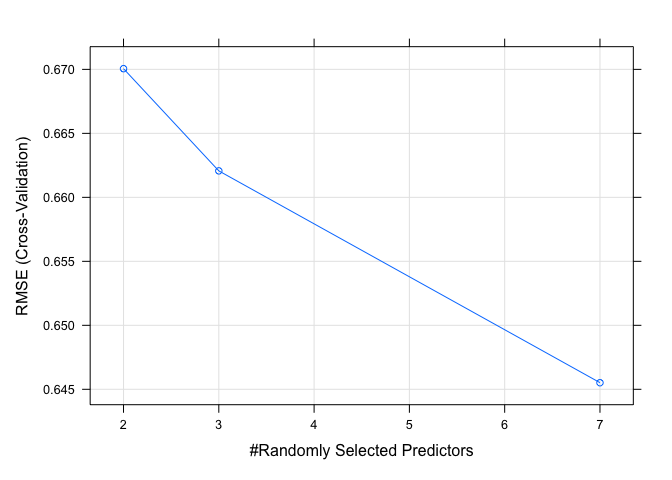
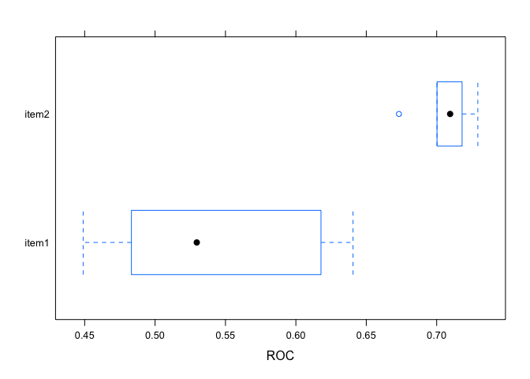
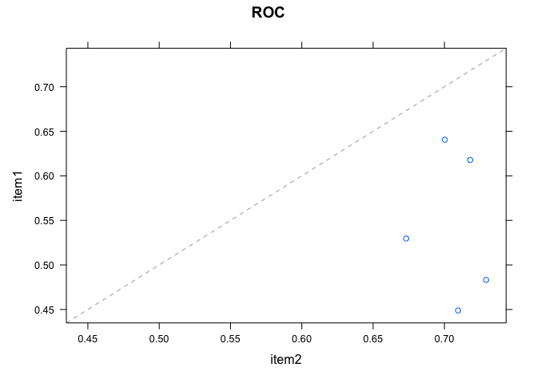

Machine Learning with caret in R
================
Joschka Schwarz

-   [1. Regression models: fitting them and evaluating their
    performance](#1-regression-models-fitting-them-and-evaluating-their-performance)
    -   [Welcome to the Toolbox](#welcome-to-the-toolbox)
    -   [In-sample RMSE for linear
        regression](#in-sample-rmse-for-linear-regression)
    -   [In-sample RMSE for linear regression on
        diamonds](#in-sample-rmse-for-linear-regression-on-diamonds)
    -   [Out-of-sample error measures](#out-of-sample-error-measures)
    -   [Out-of-sample RMSE for linear
        regression](#out-of-sample-rmse-for-linear-regression)
    -   [Randomly order the data frame](#randomly-order-the-data-frame)
    -   [Try an 80/20 split](#try-an-8020-split)
    -   [Predict on test set](#predict-on-test-set)
    -   [Calculate test set RMSE by
        hand](#calculate-test-set-rmse-by-hand)
    -   [Comparing out-of-sample RMSE to in-sample
        RMSE](#comparing-out-of-sample-rmse-to-in-sample-rmse)
    -   [Cross-validation](#cross-validation)
    -   [Advantage of cross-validation](#advantage-of-cross-validation)
    -   [10-fold cross-validation](#10-fold-cross-validation)
    -   [5-fold cross-validation](#5-fold-cross-validation)
    -   [5 x 5-fold cross-validation](#5-x-5-fold-cross-validation)
    -   [Making predictions on new
        data](#making-predictions-on-new-data)
-   [2. Classification models: fitting them and evaluating their
    performance](#2-classification-models-fitting-them-and-evaluating-their-performance)
    -   [Logistic regression on sonar](#logistic-regression-on-sonar)
    -   [Why a train/test split?](#why-a-traintest-split)
    -   [Try a 60/40 split](#try-a-6040-split)
    -   [Fit a logistic regression
        model](#fit-a-logistic-regression-model)
    -   [Confusion matrix](#confusion-matrix)
    -   [Confusion matrix takeaways](#confusion-matrix-takeaways)
    -   [Calculate a confusion matrix](#calculate-a-confusion-matrix)
    -   [Calculating accuracy](#calculating-accuracy)
    -   [Calculating true positive
        rate](#calculating-true-positive-rate)
    -   [Calculating true negative
        rate](#calculating-true-negative-rate)
    -   [Class probabilities and
        predictions](#class-probabilities-and-predictions)
    -   [Probabilities and classes](#probabilities-and-classes)
    -   [Try another threshold](#try-another-threshold)
    -   [From probabilites to confusion
        matrix](#from-probabilites-to-confusion-matrix)
    -   [Introducing the ROC curve](#introducing-the-roc-curve)
    -   [What’s the value of a ROC
        curve?](#whats-the-value-of-a-roc-curve)
    -   [Plot an ROC curve](#plot-an-roc-curve)
    -   [Area under the curve (AUC)](#area-under-the-curve-auc)
    -   [Model, ROC, and AUC](#model-roc-and-auc)
    -   [Customizing trainControl](#customizing-traincontrol)
    -   [Using custom trainControl](#using-custom-traincontrol)
-   [3. Tuning model parameters to improve
    performance](#3-tuning-model-parameters-to-improve-performance)
    -   [Random forests and wine](#random-forests-and-wine)
    -   [Random forests vs. linear
        models](#random-forests-vs-linear-models)
    -   [Fit a random forest](#fit-a-random-forest)
    -   [Explore a wider model space](#explore-a-wider-model-space)
    -   [Advantage of a longer tune
        length](#advantage-of-a-longer-tune-length)
    -   [Try a longer tune length](#try-a-longer-tune-length)
    -   [Custom tuning grids](#custom-tuning-grids)
    -   [Advantages of a custom tuning
        grid](#advantages-of-a-custom-tuning-grid)
    -   [Fit a random forest with custom
        tuning](#fit-a-random-forest-with-custom-tuning)
    -   [Introducing glmnet](#introducing-glmnet)
    -   [Advantage of glmnet](#advantage-of-glmnet)
    -   [Make a custom trainControl](#make-a-custom-traincontrol)
    -   [Fit glmnet with custom
        trainControl](#fit-glmnet-with-custom-traincontrol)
    -   [glmnet with custom tuning
        grid](#glmnet-with-custom-tuning-grid)
    -   [Why a custom tuning grid?](#why-a-custom-tuning-grid)
    -   [glmnet with custom trainControl and
        tuning](#glmnet-with-custom-traincontrol-and-tuning)
    -   [Interpreting glmnet plots](#interpreting-glmnet-plots)
-   [4. Preprocessing your data](#4-preprocessing-your-data)
    -   [Median imputation](#median-imputation)
    -   [Median imputation vs. omitting
        rows](#median-imputation-vs-omitting-rows)
    -   [Apply median imputation](#apply-median-imputation)
    -   [KNN imputation](#knn-imputation)
    -   [Comparing KNN imputation to median
        imputation](#comparing-knn-imputation-to-median-imputation)
    -   [Use KNN imputation](#use-knn-imputation)
    -   [Compare KNN and median
        imputation](#compare-knn-and-median-imputation)
    -   [Multiple preprocessing
        methods](#multiple-preprocessing-methods)
    -   [Order of operations](#order-of-operations)
    -   [Combining preprocessing
        methods](#combining-preprocessing-methods)
    -   [Handling low-information
        predictors](#handling-low-information-predictors)
    -   [Why remove near zero variance
        predictors?](#why-remove-near-zero-variance-predictors)
    -   [Remove near zero variance
        predictors](#remove-near-zero-variance-predictors)
    -   [preProcess() and nearZeroVar()](#preprocess-and-nearzerovar)
    -   [Fit model on reduced blood-brain
        data](#fit-model-on-reduced-blood-brain-data)
    -   [Principle components analysis
        (PCA)](#principle-components-analysis-pca)
    -   [Using PCA as an alternative to
        nearZeroVar()](#using-pca-as-an-alternative-to-nearzerovar)
-   [5. Selecting models: a case study in churn
    prediction](#5-selecting-models-a-case-study-in-churn-prediction)
    -   [Reusing a trainControl](#reusing-a-traincontrol)
    -   [Why reuse a trainControl?](#why-reuse-a-traincontrol)
    -   [Make custom train/test indices](#make-custom-traintest-indices)
    -   [Reintroducing glmnet](#reintroducing-glmnet)
    -   [glmnet as a baseline model](#glmnet-as-a-baseline-model)
    -   [Fit the baseline model](#fit-the-baseline-model)
    -   [Reintroducing random forest](#reintroducing-random-forest)
    -   [Random forest drawback](#random-forest-drawback)
    -   [Random forest with custom
        trainControl](#random-forest-with-custom-traincontrol)
    -   [Comparing models](#comparing-models)
    -   [Matching train/test indices](#matching-traintest-indices)
    -   [Create a resamples object](#create-a-resamples-object)
    -   [More on resamples](#more-on-resamples)
    -   [Create a box-and-whisker plot](#create-a-box-and-whisker-plot)
    -   [Create a scatterplot](#create-a-scatterplot)
    -   [Ensembling models](#ensembling-models)
    -   [Summary](#summary)

**Short Description**

This course teaches the big ideas in machine learning: how to build and
evaluate predictive models, how to tune them for performance, and how to
preprocess data

**Long Description**

Machine learning is the study and application of algorithms that learn
from and make predictions on data. From search results to self-driving
cars, it has manifested itself in all areas of our lives and is one of
the most exciting and fast growing fields of research in the world of
data science. This course teaches the big ideas in machine learning: how
to build and evaluate predictive models, how to tune them for optimal
performance, how to preprocess data for better results, and much more.
The popular <code>caret</code> R package, which provides a consistent
interface to all of R’s most powerful machine learning facilities, is
used throughout the course.

# 1. Regression models: fitting them and evaluating their performance

In the first chapter of this course, you’ll fit regression models with
<code>train()</code> and evaluate their out-of-sample performance using
cross-validation and root-mean-square error (RMSE).

## Welcome to the Toolbox

Theory. Coming soon …

## In-sample RMSE for linear regression

> ## *Question*
>
> RMSE is commonly calculated in-sample on your training set. What’s a
> potential drawback to calculating training set error?<br> <br> ⬜
> There’s no potential drawback to calculating training set error, but
> you should calculate \\(R^2\\) instead of RMSE.<br> ✅ You have no
> idea how well your model generalizes to new data
> (i.e. overfitting).<br> ⬜ You should manually inspect your model to
> validate its coefficients and calculate RMSE.<br>

Correct! Training set error doesn’t tell you anything about the future.

## In-sample RMSE for linear regression on diamonds

As you saw in the video, included in the course is the `diamonds`
dataset, which is a classic dataset from the `ggplot2` package. The
dataset contains physical attributes of diamonds as well as the price
they sold for. One interesting modeling challenge is predicting diamond
price based on their attributes using something like a linear
regression.

Recall that to fit a linear regression, you use the `lm()` function in
the following format:

``` r
mod <- lm(y ~ x, my_data)
```

To make predictions using `mod` on the original data, you call the
`predict()` function:

``` r
pred <- predict(mod, my_data)
```

**Steps**

1.  Fit a linear model on the `diamonds` dataset predicting `price`
    using all other variables as predictors (i.e. `price ~ .`). Save the
    result to `model`.
2.  Make predictions using `model` on the full original dataset and save
    the result to `p`.
3.  Compute errors using the formula \\(errors = predicted - actual\\).
    Save the result to `error`.
4.  Compute RMSE using the formula you learned in the video and print it
    to the console.

``` r
# Load data
data(diamonds, package = "ggplot2")

# Fit lm model: model
model <- lm(price ~ ., diamonds)

# Predict on full data: p
p <- predict(model, diamonds)

# Compute errors: error
error <- p - diamonds[["price"]]

# Calculate RMSE
sqrt(mean(error ^ 2))
```

    ## [1] 1129.843

Great work! Now you know how to manually calculate RMSE for your model’s
predictions!

## Out-of-sample error measures

Theory. Coming soon …

## Out-of-sample RMSE for linear regression

> ## *Question*
>
> What is the advantage of using a train/test split rather than just
> validating your model in-sample on the training set?<br> <br> ⬜ It
> takes less time to calculate error on the test set, since it is
> smaller than the training set.<br> ⬜ There is no advantage to using a
> test set. You can just use adjusted \\(R^2\\) on your training
> set.<br> ✅ It gives you an estimate of how well your model performs
> on new data.<br>

Correct! Tests sets are essential for making sure your models will make
good predictions.

## Randomly order the data frame

One way you can take a train/test split of a dataset is to order the
dataset randomly, then divide it into the two sets. This ensures that
the training set and test set are both random samples and that any
biases in the ordering of the dataset (e.g. if it had originally been
ordered by price or size) are not retained in the samples we take for
training and testing your models. You can think of this like shuffling a
brand new deck of playing cards before dealing hands.

First, you set a random seed so that your work is reproducible and you
get the same random split each time you run your script:

``` r
set.seed(42)
```

Next, you use the `sample()` function to shuffle the row indices of the
`diamonds` dataset. You can later use these indices to reorder the
dataset.

``` r
rows <- sample(nrow(diamonds))
```

Finally, you can use this random vector to reorder the diamonds dataset:

``` r
diamonds <- diamonds[rows, ]
```

**Steps**

1.  Set the random seed to 42.
2.  Make a vector of row indices called `rows`.
3.  Randomly reorder the `diamonds` data frame, assigning to
    `shuffled_diamonds`.

``` r
# Set seed
set.seed(42)

# Shuffle row indices: rows
rows <- sample(nrow(diamonds))

# Randomly order data
shuffled_diamonds <- diamonds[rows, ]
```

Great job! Randomly ordering your dataset is important for many machine
learning methods.

## Try an 80/20 split

Now that your dataset is randomly ordered, you can split the first 80%
of it into a training set, and the last 20% into a test set. You can do
this by choosing a split point approximately 80% of the way through your
data:

``` r
split <- round(nrow(mydata) * 0.80)
```

You can then use this point to break off the first 80% of the dataset as
a training set:

``` r
mydata[1:split, ]
```

And then you can use that same point to determine the test set:

``` r
mydata[(split + 1):nrow(mydata), ]
```

**Steps**

1.  Choose a row index to split on so that the split point is
    approximately 80% of the way through the `diamonds` dataset. Call
    this index `split`.
2.  Create a training set called `train` using that index.
3.  Create a test set called `test` using that index.

``` r
# Determine row to split on: split
split <- round(nrow(diamonds) * 0.80)

# Create train
train <- diamonds[1:split, ]

# Create test
test <- diamonds[(split + 1):nrow(diamonds), ]
```

Well done! Because you already randomly ordered your dataset, it’s easy
to split off a random test set.

## Predict on test set

Now that you have a randomly split training set and test set, you can
use the `lm()` function as you did in the first exercise to fit a model
to your training set, rather than the entire dataset. Recall that you
can use the formula interface to the linear regression function to fit a
model with a specified target variable using all other variables in the
dataset as predictors:

``` r
mod <- lm(y ~ ., training_data)
```

You can use the `predict()` function to make predictions from that model
on new data. The new dataset must have all of the columns from the
training data, but they can be in a different order with different
values. Here, rather than re-predicting on the training set, you can
predict on the test set, which you did not use for training the model.
This will allow you to determine the out-of-sample error for the model
in the next exercise:

``` r
p <- predict(model, new_data)
```

**Steps**

1.  Fit an `lm()` model called `model` to predict `price` using all
    other variables as covariates. Be sure to use the training set,
    `train`.
2.  Predict on the test set, `test`, using `predict()`. Store these
    values in a vector called `p`.

``` r
# Fit lm model on train: model
model <- lm(price ~ ., train)

# Predict on test: p
p <- predict(model, test)
```

Excellent work! R makes it very easy to predict with a model on new
data.

## Calculate test set RMSE by hand

Now that you have predictions on the test set, you can use these
predictions to calculate an error metric (in this case RMSE) on the test
set and see how the model performs out-of-sample, rather than in-sample
as you did in the first exercise. You first do this by calculating the
errors between the predicted diamond prices and the actual diamond
prices by subtracting the predictions from the actual values.

Once you have an error vector, calculating RMSE is as simple as squaring
it, taking the mean, then taking the square root:

``` r
sqrt(mean(error^2))
```

**Steps**

1.  Calculate the error between the predictions on the test set and the
    actual diamond prices in the test set. Call this `error`.
2.  Calculate RMSE using this error vector, just printing the result to
    the console.

``` r
# Compute errors: error
error <- p - test[["price"]]

# Calculate RMSE
sqrt(mean(error^2))
```

    ## [1] 796.8922

Good Job! Calculating RMSE on a test set is exactly the same as
calculating it on a training set.

## Comparing out-of-sample RMSE to in-sample RMSE

> ## *Question*
>
> Why is the test set RMSE *higher* than the training set RMSE?<br> <br>
> ✅ Because you overfit the training set and the test set contains data
> the model hasn’t seen before.<br> ⬜ Because you should not use a test
> set at all and instead just look at error on the training set.<br> ⬜
> Because the test set has a smaller sample size the training set and
> thus the mean error is lower.<br>

Right! Computing the error on the training set is risky because the
model may overfit the data used to train it.

## Cross-validation

Theory. Coming soon …

## Advantage of cross-validation

> ## *Question*
>
> What is the advantage of cross-validation over a single train/test
> split?<br> <br> ⬜ There is no advantage to cross-validation, just as
> there is no advantage to a single train/test split. You should be
> validating your models in-sample with a metric like adjusted
> \\(R^2\\).<br> ⬜ You can pick the best test set to minimize the
> reported RMSE of your model.<br> ✅ It gives you multiple estimates of
> out-of-sample error, rather than a single estimate.<br>

Correct! If all of your estimates give similar outputs, you can be more
certain of the model’s accuracy. If your estimates give different
outputs, that tells you the model does not perform consistently and
suggests a problem with it.

## 10-fold cross-validation

As you saw in the video, a better approach to validating models is to
use multiple systematic test sets, rather than a single random
train/test split. Fortunately, the `caret` package makes this very easy
to do:

``` r
model <- train(y ~ ., my_data)
```

`caret` supports many types of cross-validation, and you can specify
which type of cross-validation and the number of cross-validation folds
with the `trainControl()` function, which you pass to the `trControl`
argument in `train()`:

``` r
model <- train(
  y ~ ., 
  my_data,
  method = "lm",
  trControl = trainControl(
    method = "cv", 
    number = 10,
    verboseIter = TRUE
  )
)
```

It’s important to note that you pass the method for modeling to the main
`train()` function and the method for cross-validation to the
`trainControl()` function.

**Steps**

1.  Fit a linear regression to model `price` using all other variables
    in the `diamonds` dataset as predictors. Use the `train()` function
    and 10-fold cross-validation. (Note that we’ve taken a subset of the
    full `diamonds` dataset to speed up this operation, but it’s still
    named `diamonds`.)
2.  Print the model to the console and examine the results.

``` r
# Load package
library(caret)
```

    ## Loading required package: ggplot2

    ## Loading required package: lattice

``` r
# Fit lm model using 10-fold CV: model
model <- train(
  price ~ ., 
  diamonds,
  method = "lm",
  trControl = trainControl(
    method = "cv", 
    number = 10,
    verboseIter = TRUE
  )
)
```

    ## + Fold01: intercept=TRUE 
    ## - Fold01: intercept=TRUE 
    ## + Fold02: intercept=TRUE 
    ## - Fold02: intercept=TRUE 
    ## + Fold03: intercept=TRUE 
    ## - Fold03: intercept=TRUE 
    ## + Fold04: intercept=TRUE 
    ## - Fold04: intercept=TRUE 
    ## + Fold05: intercept=TRUE 
    ## - Fold05: intercept=TRUE 
    ## + Fold06: intercept=TRUE 
    ## - Fold06: intercept=TRUE 
    ## + Fold07: intercept=TRUE 
    ## - Fold07: intercept=TRUE 
    ## + Fold08: intercept=TRUE 
    ## - Fold08: intercept=TRUE 
    ## + Fold09: intercept=TRUE 
    ## - Fold09: intercept=TRUE 
    ## + Fold10: intercept=TRUE 
    ## - Fold10: intercept=TRUE 
    ## Aggregating results
    ## Fitting final model on full training set

``` r
# Print model to console
model
```

    ## Linear Regression 
    ## 
    ## 53940 samples
    ##     9 predictor
    ## 
    ## No pre-processing
    ## Resampling: Cross-Validated (10 fold) 
    ## Summary of sample sizes: 48547, 48546, 48546, 48547, 48545, 48547, ... 
    ## Resampling results:
    ## 
    ##   RMSE      Rsquared   MAE     
    ##   1131.015  0.9196398  740.6117
    ## 
    ## Tuning parameter 'intercept' was held constant at a value of TRUE

Good job! Caret does all the work of splitting test sets and calculating
RMSE for you!

## 5-fold cross-validation

In this course, you will use a wide variety of datasets to explore the
full flexibility of the `caret` package. Here, you will use the famous
Boston housing dataset, where the goal is to predict median home values
in various Boston suburbs.

You can use exactly the same code as in the previous exercise, but
change the dataset used by the model:

``` r
model <- train(
  medv ~ ., 
  BostonHousing, 
  method = "lm",
  trControl = trainControl(
    method = "cv", 
    number = 10,
    verboseIter = TRUE
  )
)
```

Next, you can reduce the number of cross-validation folds from 10 to 5
using the `number` argument to the `trainControl()` argument:

``` r
trControl = trainControl(
  method = "cv", 
  number = 5,
  verboseIter = TRUE
)
```

**Steps**

1.  Fit an `lm()` model to the `Boston` housing dataset, such that
    `medv` is the response variable and all other variables are
    explanatory variables.
2.  Use 5-fold cross-validation rather than 10-fold cross-validation.
3.  Print the model to the console and inspect the results.

``` r
# Load package (for the dataset)
library(mlbench)
data(BostonHousing)

# Fit lm model using 5-fold CV: model
model <- train(
  medv ~ ., 
  BostonHousing,
  method = "lm",
  trControl = trainControl(
    method = "cv", 
    number = 5,
    verboseIter = TRUE
  )
)
```

    ## + Fold1: intercept=TRUE 
    ## - Fold1: intercept=TRUE 
    ## + Fold2: intercept=TRUE 
    ## - Fold2: intercept=TRUE 
    ## + Fold3: intercept=TRUE 
    ## - Fold3: intercept=TRUE 
    ## + Fold4: intercept=TRUE 
    ## - Fold4: intercept=TRUE 
    ## + Fold5: intercept=TRUE 
    ## - Fold5: intercept=TRUE 
    ## Aggregating results
    ## Fitting final model on full training set

``` r
# Print model to console
model
```

    ## Linear Regression 
    ## 
    ## 506 samples
    ##  13 predictor
    ## 
    ## No pre-processing
    ## Resampling: Cross-Validated (5 fold) 
    ## Summary of sample sizes: 405, 405, 406, 403, 405 
    ## Resampling results:
    ## 
    ##   RMSE      Rsquared   MAE     
    ##   4.860247  0.7209221  3.398114
    ## 
    ## Tuning parameter 'intercept' was held constant at a value of TRUE

Great work! Caret makes it easy to try different validation schemes with
the same model and compare RMSE.

## 5 x 5-fold cross-validation

You can do more than just one iteration of cross-validation. Repeated
cross-validation gives you a better estimate of the test-set error. You
can also repeat the entire cross-validation procedure. This takes
longer, but gives you many more out-of-sample datasets to look at and
much more precise assessments of how well the model performs.

One of the awesome things about the `train()` function in `caret` is how
easy it is to run very different models or methods of cross-validation
just by tweaking a few simple arguments to the function call. For
example, you could repeat your entire cross-validation procedure 5 times
for greater confidence in your estimates of the model’s out-of-sample
accuracy, e.g.:

``` r
trControl = trainControl(
  method = "repeatedcv", 
  number = 5,
  repeats = 5, 
  verboseIter = TRUE
)
```

**Steps**

1.  Re-fit the linear regression model to the `BostonHousing` housing
    dataset.
2.  Use 5 repeats of 5-fold cross-validation.
3.  Print the model to the console.

``` r
# Fit lm model using 5 x 5-fold CV: model
model <- train(
  medv ~ ., 
  BostonHousing,
  method = "lm",
  trControl = trainControl(
    method = "repeatedcv", 
    number = 5,
    repeats = 5, 
    verboseIter = TRUE
  )
)
```

    ## + Fold1.Rep1: intercept=TRUE 
    ## - Fold1.Rep1: intercept=TRUE 
    ## + Fold2.Rep1: intercept=TRUE 
    ## - Fold2.Rep1: intercept=TRUE 
    ## + Fold3.Rep1: intercept=TRUE 
    ## - Fold3.Rep1: intercept=TRUE 
    ## + Fold4.Rep1: intercept=TRUE 
    ## - Fold4.Rep1: intercept=TRUE 
    ## + Fold5.Rep1: intercept=TRUE 
    ## - Fold5.Rep1: intercept=TRUE 
    ## + Fold1.Rep2: intercept=TRUE 
    ## - Fold1.Rep2: intercept=TRUE 
    ## + Fold2.Rep2: intercept=TRUE 
    ## - Fold2.Rep2: intercept=TRUE 
    ## + Fold3.Rep2: intercept=TRUE 
    ## - Fold3.Rep2: intercept=TRUE 
    ## + Fold4.Rep2: intercept=TRUE 
    ## - Fold4.Rep2: intercept=TRUE 
    ## + Fold5.Rep2: intercept=TRUE 
    ## - Fold5.Rep2: intercept=TRUE 
    ## + Fold1.Rep3: intercept=TRUE 
    ## - Fold1.Rep3: intercept=TRUE 
    ## + Fold2.Rep3: intercept=TRUE 
    ## - Fold2.Rep3: intercept=TRUE 
    ## + Fold3.Rep3: intercept=TRUE 
    ## - Fold3.Rep3: intercept=TRUE 
    ## + Fold4.Rep3: intercept=TRUE 
    ## - Fold4.Rep3: intercept=TRUE 
    ## + Fold5.Rep3: intercept=TRUE 
    ## - Fold5.Rep3: intercept=TRUE 
    ## + Fold1.Rep4: intercept=TRUE 
    ## - Fold1.Rep4: intercept=TRUE 
    ## + Fold2.Rep4: intercept=TRUE 
    ## - Fold2.Rep4: intercept=TRUE 
    ## + Fold3.Rep4: intercept=TRUE 
    ## - Fold3.Rep4: intercept=TRUE 
    ## + Fold4.Rep4: intercept=TRUE 
    ## - Fold4.Rep4: intercept=TRUE 
    ## + Fold5.Rep4: intercept=TRUE 
    ## - Fold5.Rep4: intercept=TRUE 
    ## + Fold1.Rep5: intercept=TRUE 
    ## - Fold1.Rep5: intercept=TRUE 
    ## + Fold2.Rep5: intercept=TRUE 
    ## - Fold2.Rep5: intercept=TRUE 
    ## + Fold3.Rep5: intercept=TRUE 
    ## - Fold3.Rep5: intercept=TRUE 
    ## + Fold4.Rep5: intercept=TRUE 
    ## - Fold4.Rep5: intercept=TRUE 
    ## + Fold5.Rep5: intercept=TRUE 
    ## - Fold5.Rep5: intercept=TRUE 
    ## Aggregating results
    ## Fitting final model on full training set

``` r
# Print model to console
model
```

    ## Linear Regression 
    ## 
    ## 506 samples
    ##  13 predictor
    ## 
    ## No pre-processing
    ## Resampling: Cross-Validated (5 fold, repeated 5 times) 
    ## Summary of sample sizes: 405, 406, 405, 403, 405, 405, ... 
    ## Resampling results:
    ## 
    ##   RMSE      Rsquared   MAE     
    ##   4.845724  0.7277269  3.402735
    ## 
    ## Tuning parameter 'intercept' was held constant at a value of TRUE

Fantastic work! You can use caret to do some very complicated
cross-validation schemes.

## Making predictions on new data

Finally, the model you fit with the `train()` function has the exact
same `predict()` interface as the linear regression models you fit
earlier in this chapter.

After fitting a model with `train()`, you can simply call `predict()`
with new data, e.g:

``` r
predict(my_model, new_data)
```

**Steps**

1.  Use the `predict()` function to make predictions with `model` on the
    full `Boston` housing dataset. Print the result to the console.

``` r
# Predict on full Boston dataset
predict(model, BostonHousing)
```

    ##          1          2          3          4          5          6          7 
    ## 30.0038434 25.0255624 30.5675967 28.6070365 27.9435242 25.2562845 23.0018083 
    ##          8          9         10         11         12         13         14 
    ## 19.5359884 11.5236369 18.9202621 18.9994965 21.5867957 20.9065215 19.5529028 
    ##         15         16         17         18         19         20         21 
    ## 19.2834821 19.2974832 20.5275098 16.9114013 16.1780111 18.4061360 12.5238575 
    ##         22         23         24         25         26         27         28 
    ## 17.6710367 15.8328813 13.8062853 15.6783383 13.3866856 15.4639765 14.7084743 
    ##         29         30         31         32         33         34         35 
    ## 19.5473729 20.8764282 11.4551176 18.0592329  8.8110574 14.2827581 13.7067589 
    ##         36         37         38         39         40         41         42 
    ## 23.8146353 22.3419371 23.1089114 22.9150261 31.3576257 34.2151023 28.0205641 
    ##         43         44         45         46         47         48         49 
    ## 25.2038663 24.6097927 22.9414918 22.0966982 20.4232003 18.0365509  9.1065538 
    ##         50         51         52         53         54         55         56 
    ## 17.2060775 21.2815254 23.9722228 27.6558508 24.0490181 15.3618477 31.1526495 
    ##         57         58         59         60         61         62         63 
    ## 24.8568698 33.1091981 21.7753799 21.0849356 17.8725804 18.5111021 23.9874286 
    ##         64         65         66         67         68         69         70 
    ## 22.5540887 23.3730864 30.3614836 25.5305651 21.1133856 17.4215379 20.7848363 
    ##         71         72         73         74         75         76         77 
    ## 25.2014886 21.7426577 24.5574496 24.0429571 25.5049972 23.9669302 22.9454540 
    ##         78         79         80         81         82         83         84 
    ## 23.3569982 21.2619827 22.4281737 28.4057697 26.9948609 26.0357630 25.0587348 
    ##         85         86         87         88         89         90         91 
    ## 24.7845667 27.7904920 22.1685342 25.8927642 30.6746183 30.8311062 27.1190194 
    ##         92         93         94         95         96         97         98 
    ## 27.4126673 28.9412276 29.0810555 27.0397736 28.6245995 24.7274498 35.7815952 
    ##         99        100        101        102        103        104        105 
    ## 35.1145459 32.2510280 24.5802202 25.5941347 19.7901368 20.3116713 21.4348259 
    ##        106        107        108        109        110        111        112 
    ## 18.5399401 17.1875599 20.7504903 22.6482911 19.7720367 20.6496586 26.5258674 
    ##        113        114        115        116        117        118        119 
    ## 20.7732364 20.7154831 25.1720888 20.4302559 23.3772463 23.6904326 20.3357836 
    ##        120        121        122        123        124        125        126 
    ## 20.7918087 21.9163207 22.4710778 20.5573856 16.3666198 20.5609982 22.4817845 
    ##        127        128        129        130        131        132        133 
    ## 14.6170663 15.1787668 18.9386859 14.0557329 20.0352740 19.4101340 20.0619157 
    ##        134        135        136        137        138        139        140 
    ## 15.7580767 13.2564524 17.2627773 15.8784188 19.3616395 13.8148390 16.4488147 
    ##        141        142        143        144        145        146        147 
    ## 13.5714193  3.9888551 14.5949548 12.1488148  8.7282236 12.0358534 15.8208206 
    ##        148        149        150        151        152        153        154 
    ##  8.5149902  9.7184414 14.8045137 20.8385815 18.3010117 20.1228256 17.2860189 
    ##        155        156        157        158        159        160        161 
    ## 22.3660023 20.1037592 13.6212589 33.2598270 29.0301727 25.5675277 32.7082767 
    ##        162        163        164        165        166        167        168 
    ## 36.7746701 40.5576584 41.8472817 24.7886738 25.3788924 37.2034745 23.0874875 
    ##        169        170        171        172        173        174        175 
    ## 26.4027396 26.6538211 22.5551466 24.2908281 22.9765722 29.0719431 26.5219434 
    ##        176        177        178        179        180        181        182 
    ## 30.7220906 25.6166931 29.1374098 31.4357197 32.9223157 34.7244046 27.7655211 
    ##        183        184        185        186        187        188        189 
    ## 33.8878732 30.9923804 22.7182001 24.7664781 35.8849723 33.4247672 32.4119915 
    ##        190        191        192        193        194        195        196 
    ## 34.5150995 30.7610949 30.2893414 32.9191871 32.1126077 31.5587100 40.8455572 
    ##        197        198        199        200        201        202        203 
    ## 36.1277008 32.6692081 34.7046912 30.0934516 30.6439391 29.2871950 37.0714839 
    ##        204        205        206        207        208        209        210 
    ## 42.0319312 43.1894984 22.6903480 23.6828471 17.8544721 23.4942899 17.0058772 
    ##        211        212        213        214        215        216        217 
    ## 22.3925110 17.0604275 22.7389292 25.2194255 11.1191674 24.5104915 26.6033477 
    ##        218        219        220        221        222        223        224 
    ## 28.3551871 24.9152546 29.6865277 33.1841975 23.7745666 32.1405196 29.7458199 
    ##        225        226        227        228        229        230        231 
    ## 38.3710245 39.8146187 37.5860575 32.3995325 35.4566524 31.2341151 24.4844923 
    ##        232        233        234        235        236        237        238 
    ## 33.2883729 38.0481048 37.1632863 31.7138352 25.2670557 30.1001074 32.7198716 
    ##        239        240        241        242        243        244        245 
    ## 28.4271706 28.4294068 27.2937594 23.7426248 24.1200789 27.4020841 16.3285756 
    ##        246        247        248        249        250        251        252 
    ## 13.3989126 20.0163878 19.8618443 21.2883131 24.0798915 24.2063355 25.0421582 
    ##        253        254        255        256        257        258        259 
    ## 24.9196401 29.9456337 23.9722832 21.6958089 37.5110924 43.3023904 36.4836142 
    ##        260        261        262        263        264        265        266 
    ## 34.9898859 34.8121151 37.1663133 40.9892850 34.4463409 35.8339755 28.2457430 
    ##        267        268        269        270        271        272        273 
    ## 31.2267359 40.8395575 39.3179239 25.7081791 22.3029553 27.2034097 28.5116947 
    ##        274        275        276        277        278        279        280 
    ## 35.4767660 36.1063916 33.7966827 35.6108586 34.8399338 30.3519266 35.3098070 
    ##        281        282        283        284        285        286        287 
    ## 38.7975697 34.3312319 40.3396307 44.6730834 31.5968909 27.3565923 20.1017415 
    ##        288        289        290        291        292        293        294 
    ## 27.0420667 27.2136458 26.9139584 33.4356331 34.4034963 31.8333982 25.8178324 
    ##        295        296        297        298        299        300        301 
    ## 24.4298235 28.4576434 27.3626700 19.5392876 29.1130984 31.9105461 30.7715945 
    ##        302        303        304        305        306        307        308 
    ## 28.9427587 28.8819102 32.7988723 33.2090546 30.7683179 35.5622686 32.7090512 
    ##        309        310        311        312        313        314        315 
    ## 28.6424424 23.5896583 18.5426690 26.8788984 23.2813398 25.5458025 25.4812006 
    ##        316        317        318        319        320        321        322 
    ## 20.5390990 17.6157257 18.3758169 24.2907028 21.3252904 24.8868224 24.8693728 
    ##        323        324        325        326        327        328        329 
    ## 22.8695245 19.4512379 25.1178340 24.6678691 23.6807618 19.3408962 21.1741811 
    ##        330        331        332        333        334        335        336 
    ## 24.2524907 21.5926089 19.9844661 23.3388800 22.1406069 21.5550993 20.6187291 
    ##        337        338        339        340        341        342        343 
    ## 20.1609718 19.2849039 22.1667232 21.2496577 21.4293931 30.3278880 22.0473498 
    ##        344        345        346        347        348        349        350 
    ## 27.7064791 28.5479412 16.5450112 14.7835964 25.2738008 27.5420512 22.1483756 
    ##        351        352        353        354        355        356        357 
    ## 20.4594409 20.5460542 16.8806383 25.4025351 14.3248663 16.5948846 19.6370469 
    ##        358        359        360        361        362        363        364 
    ## 22.7180661 22.2021889 19.2054806 22.6661611 18.9319262 18.2284680 20.2315081 
    ##        365        366        367        368        369        370        371 
    ## 37.4944739 14.2819073 15.5428625 10.8316232 23.8007290 32.6440736 34.6068404 
    ##        372        373        374        375        376        377        378 
    ## 24.9433133 25.9998091  6.1263250  0.7777981 25.3071306 17.7406106 20.2327441 
    ##        379        380        381        382        383        384        385 
    ## 15.8333130 16.8351259 14.3699483 18.4768283 13.4276828 13.0617751  3.2791812 
    ##        386        387        388        389        390        391        392 
    ##  8.0602217  6.1284220  5.6186481  6.4519857 14.2076474 17.2122518 17.2988727 
    ##        393        394        395        396        397        398        399 
    ##  9.8911664 20.2212419 17.9418118 20.3044578 19.2955908 16.3363278  6.5516232 
    ##        400        401        402        403        404        405        406 
    ## 10.8901678 11.8814587 17.8117451 18.2612659 12.9794878  7.3781636  8.2111586 
    ##        407        408        409        410        411        412        413 
    ##  8.0662619 19.9829479 13.7075637 19.8526845 15.2230830 16.9607198  1.7185181 
    ##        414        415        416        417        418        419        420 
    ## 11.8057839 -4.2813107  9.5837674 13.3666081  6.8956236  6.1477985 14.6066179 
    ##        421        422        423        424        425        426        427 
    ## 19.6000267 18.1242748 18.5217713 13.1752861 14.6261762  9.9237498 16.3459065 
    ##        428        429        430        431        432        433        434 
    ## 14.0751943 14.2575624 13.0423479 18.1595569 18.6955435 21.5272830 17.0314186 
    ##        435        436        437        438        439        440        441 
    ## 15.9609044 13.3614161 14.5207938  8.8197601  4.8675110 13.0659131 12.7060970 
    ##        442        443        444        445        446        447        448 
    ## 17.2955806 18.7404850 18.0590103 11.5147468 11.9740036 17.6834462 18.1269524 
    ##        449        450        451        452        453        454        455 
    ## 17.5183465 17.2274251 16.5227163 19.4129110 18.5821524 22.4894479 15.2800013 
    ##        456        457        458        459        460        461        462 
    ## 15.8208934 12.6872558 12.8763379 17.1866853 18.5124761 19.0486053 20.1720893 
    ##        463        464        465        466        467        468        469 
    ## 19.7740732 22.4294077 20.3191185 17.8861625 14.3747852 16.9477685 16.9840576 
    ##        470        471        472        473        474        475        476 
    ## 18.5883840 20.1671944 22.9771803 22.4558073 25.5782463 16.3914763 16.1114628 
    ##        477        478        479        480        481        482        483 
    ## 20.5348160 11.5427274 19.2049630 21.8627639 23.4687887 27.0988732 28.5699430 
    ##        484        485        486        487        488        489        490 
    ## 21.0839878 19.4551620 22.2222591 19.6559196 21.3253610 11.8558372  8.2238669 
    ##        491        492        493        494        495        496        497 
    ##  3.6639967 13.7590854 15.9311855 20.6266205 20.6124941 16.8854196 14.0132079 
    ##        498        499        500        501        502        503        504 
    ## 19.1085414 21.2980517 18.4549884 20.4687085 23.5333405 22.3757189 27.6274261 
    ##        505        506 
    ## 26.1279668 22.3442123

Awesome job! Predicting with a caret model is as easy as predicting with
a regular model!

# 2. Classification models: fitting them and evaluating their performance

In this chapter, you’ll fit classification models with
<code>train()</code> and evaluate their out-of-sample performance using
cross-validation and area under the curve (AUC).

## Logistic regression on sonar

Theory. Coming soon …

## Why a train/test split?

> ## *Question*
>
> What is the point of making a train/test split for binary
> classification problems?<br> <br> ⬜ To make the problem harder for
> the model by reducing the dataset size.<br> ✅ To evaluate your models
> out-of-sample, on new data.<br> ⬜ To reduce the dataset size, so your
> models fit faster.<br> ⬜ There is no real reason; it is no different
> than evaluating your models in-sample.<br>

Correct! Out-of-sample evaluation is the gold standard of model
validation.

## Try a 60/40 split

As you saw in the video, you’ll be working with the `Sonar` dataset in
this chapter, using a 60% training set and a 40% test set. We’ll
practice making a train/test split one more time, just to be sure you
have the hang of it. Recall that you can use the `sample()` function to
get a random permutation of the row indices in a dataset, to use when
making train/test splits, e.g.:

``` r
n_obs <- nrow(my_data)
permuted_rows <- sample(n_obs)
```

And then use those row indices to randomly reorder the dataset, e.g.:

``` r
my_data <- my_data[permuted_rows, ]
```

Once your dataset is randomly ordered, you can split off the first 60%
as a training set and the last 40% as a test set.

**Steps**

1.  Get the number of observations (rows) in `Sonar`, assigning to
    `n_obs`.
2.  Shuffle the row indices of `Sonar` and store the result in
    `permuted_rows`.
3.  Use `permuted_rows` to randomly reorder the rows of `Sonar`, saving
    as `Sonar_shuffled`.
4.  Identify the proper row to split on for a 60/40 split. Store this
    row number as `split`.
5.  Save the first 60% of `Sonar_shuffled` as a training set.
6.  Save the last 40% of `Sonar_shuffled` as the test set.

``` r
# Load data (from mlbench package)
# sonar_train <- readRDS("data/sonar_train.rds")
# sonar_test  <- readRDS("data/sonar_test.rds")
data(Sonar)

# Get the number of observations
n_obs <- nrow(Sonar)

# Shuffle row indices: permuted_rows
permuted_rows <- sample(n_obs)

# Randomly order data: Sonar
Sonar_shuffled <- Sonar[permuted_rows, ]

# Identify row to split on: split
split <- round(n_obs * 0.6)

# Create train
train <- Sonar_shuffled[1:split, ]

# Create test
test <- Sonar_shuffled[(split + 1):n_obs, ]
```

Excellent work! Randomly shuffling your data makes it easy to manually
create a train/test split.

## Fit a logistic regression model

Once you have your random training and test sets you can fit a logistic
regression model to your training set using the `glm()` function.
`glm()` is a more advanced version of `lm()` that allows for more varied
types of regression models, aside from plain vanilla ordinary least
squares regression.

Be sure to pass the argument `family = "binomial"` to `glm()` to specify
that you want to do logistic (rather than linear) regression. For
example:

``` r
glm(Target ~ ., family = "binomial", dataset)
```

Don’t worry about warnings like `glm.fit: algorithm did not converge` or
`glm.fit: fitted probabilities numerically 0 or 1 occurred`. These are
common on smaller datasets and usually don’t cause any issues. They
typically mean your dataset is *perfectly separable*, which can cause
problems for the math behind the model, but R’s `glm()` function is
almost always robust enough to handle this case with no problems.

Once you have a `glm()` model fit to your dataset, you can predict the
outcome (e.g. rock or mine) on the `test` set using the `predict()`
function with the argument `type = "response"`:

``` r
predict(my_model, test, type = "response")
```

**Steps**

1.  Fit a logistic regression called `model` to predict `Class` using
    all other variables as predictors. Use the training set for `Sonar`.
2.  Predict on the `test` set using that model. Call the result `p` like
    you’ve done before.

``` r
# Load package
library(dplyr)
```

    ## 
    ## Attaching package: 'dplyr'

    ## The following objects are masked from 'package:stats':
    ## 
    ##     filter, lag

    ## The following objects are masked from 'package:base':
    ## 
    ##     intersect, setdiff, setequal, union

``` r
# Load data
train <- readRDS("data/sonar_train.rds") |> 
  
                  # Create numeric target
                  mutate(Class_num = as.numeric(Class == "M"))
                  
                  # mutate(Class = case_when(Class == "M" ~ 1, 
                  #                          Class == "R" ~ 0))

test  <- readRDS("data/sonar_test.rds") |> 
  
                  # Create numeric target
                  mutate(Class_num = as.numeric(Class == "M"))

# Fit glm model: model
model <- glm(Class_num ~ ., train |> select(-Class), family = "binomial")
```

    ## Warning: glm.fit: algorithm did not converge

    ## Warning: glm.fit: fitted probabilities numerically 0 or 1 occurred

``` r
# Predict on test: p
p <- predict(model, test |> select(-Class), type = "response")
```

Great work! Manually fitting a glm model in R is very similar to fitting
an lm model.

## Confusion matrix

Theory. Coming soon …

## Confusion matrix takeaways

> ## *Question*
>
> What information does a confusion matrix provide?<br> <br> ⬜ True
> positive rates<br> ⬜ True negative rates<br> ⬜ False positive
> rates<br> ⬜ False negative rates<br> ✅ All of the above<br>

Yes! It contains all of them.

## Calculate a confusion matrix

As you saw in the video, a confusion matrix is a very useful tool for
calibrating the output of a model and examining all possible outcomes of
your predictions (true positive, true negative, false positive, false
negative).

Before you make your confusion matrix, you need to “cut” your predicted
probabilities at a given threshold to turn probabilities into a factor
of class predictions. Combine `ifelse()` with `factor()` as follows:

``` r
pos_or_neg <- ifelse(probability_prediction > threshold, positive_class, negative_class)
p_class    <- factor(pos_or_neg, levels = levels(test_values))
```

`confusionMatrix()` in `caret` improves on `table()` from base R by
adding lots of useful ancillary statistics in addition to the base rates
in the table. You can calculate the confusion matrix (and the associated
statistics) using the predicted outcomes as well as the actual outcomes,
e.g.:

``` r
confusionMatrix(p_class, test_values)
```

**Steps**

1.  Use `ifelse()` to create a character vector, `m_or_r` that is the
    positive class, `"M"`, when `p` is greater than 0.5, and the
    negative class, `"R"`, otherwise.
2.  Convert `m_or_r` to be a factor, `p_class`, with levels the same as
    those of `test[["Class"]]`.
3.  Make a confusion matrix with `confusionMatrix()`, passing `p_class`
    and the `"Class"` column from the `test` dataset.

``` r
# If p exceeds threshold of 0.5, M else R: m_or_r
m_or_r <- ifelse(p > 0.5, "M", "R")

# Convert to factor: p_class
p_class <- factor(m_or_r, levels = levels(test[["Class"]]))

# Create confusion matrix
confusionMatrix(p_class, test[["Class"]])
```

    ## Confusion Matrix and Statistics
    ## 
    ##           Reference
    ## Prediction  M  R
    ##          M 40 17
    ##          R  8 18
    ##                                           
    ##                Accuracy : 0.6988          
    ##                  95% CI : (0.5882, 0.7947)
    ##     No Information Rate : 0.5783          
    ##     P-Value [Acc > NIR] : 0.01616         
    ##                                           
    ##                   Kappa : 0.3602          
    ##                                           
    ##  Mcnemar's Test P-Value : 0.10960         
    ##                                           
    ##             Sensitivity : 0.8333          
    ##             Specificity : 0.5143          
    ##          Pos Pred Value : 0.7018          
    ##          Neg Pred Value : 0.6923          
    ##              Prevalence : 0.5783          
    ##          Detection Rate : 0.4819          
    ##    Detection Prevalence : 0.6867          
    ##       Balanced Accuracy : 0.6738          
    ##                                           
    ##        'Positive' Class : M               
    ## 

Great work! The confusionMatrix function is a very easy way to get a
detailed summary of your model’s accuracy.

## Calculating accuracy

Use `confusionMatrix(p_class, test[["Class"]])` to calculate a confusion
matrix on the test set.

> ## *Question*
>
> What is the test set accuracy of this model (rounded to the nearest
> percent)?<br> <br> ⬜ 58%<br> ⬜ 83%<br> ✅ 70%<br> ⬜ 51%<br>

Nice one! This is the model’s accuracy.

## Calculating true positive rate

Use `confusionMatrix(p_class, test[["Class"]])` to calculate a confusion
matrix on the test set.

> ## *Question*
>
> What is the test set true positive rate (or sensitivity) of this model
> (rounded to the nearest percent)?<br> <br> ⬜ 58%<br> ✅ 83%<br> ⬜
> 70%<br> ⬜ 51%<br>

Nice one!

## Calculating true negative rate

Use `confusionMatrix(p_class, test[["Class"]])` to calculate a confusion
matrix on the test set.

> ## *Question*
>
> What is the test set true negative rate (or specificity) of this model
> (rounded to the nearest percent)?<br> <br> ⬜ 58%<br> ⬜ 83%<br> ⬜
> 70%<br> ✅ 51%<br>

Good job!

## Class probabilities and predictions

Theory. Coming soon …

## Probabilities and classes

> ## *Question*
>
> What’s the relationship between the predicted probabilities and the
> predicted classes?<br> <br> ⬜ You determine the predicted
> probabilities by looking at the average accuracy of the predicted
> classes.<br> ⬜ There is no relationship; they’re completely different
> things.<br> ✅ Predicted classes are based off of predicted
> probabilities plus a classification threshold.<br>

Correct! Probabilities are used to determine classes.

## Try another threshold

In the previous exercises, you used a threshold of 0.50 to cut your
predicted probabilities to make class predictions (rock vs mine).
However, this classification threshold does not always align with the
goals for a given modeling problem.

For example, pretend you want to identify the objects you are really
certain are mines. In this case, you might want to use a probability
threshold of 0.90 to get *fewer predicted mines, but with greater
confidence in each prediction*.

The code pattern for cutting probabilities into predicted classes, then
calculating a confusion matrix, was shown in Exercise 7 of this chapter.

**Steps**

1.  Use `ifelse()` to create a character vector, `m_or_r` that is the
    positive class, `"M"`, when `p` is greater than **0.9**, and the
    negative class, `"R"`, otherwise.
2.  Convert `m_or_r` to be a factor, `p_class`, with levels the same as
    those of `test[["Class"]]`.
3.  Make a confusion matrix with `confusionMatrix()`, passing `p_class`
    and the `"Class"` column from the `test` dataset.

``` r
# If p exceeds threshold of 0.9, M else R: m_or_r
m_or_r <- ifelse(p > 0.9, "M", "R")

# Convert to factor: p_class
p_class <- factor(m_or_r, levels = levels(test[["Class"]]))

# Create confusion matrix
confusionMatrix(p_class, test[["Class"]])
```

    ## Confusion Matrix and Statistics
    ## 
    ##           Reference
    ## Prediction  M  R
    ##          M 40 15
    ##          R  8 20
    ##                                           
    ##                Accuracy : 0.7229          
    ##                  95% CI : (0.6138, 0.8155)
    ##     No Information Rate : 0.5783          
    ##     P-Value [Acc > NIR] : 0.004583        
    ##                                           
    ##                   Kappa : 0.416           
    ##                                           
    ##  Mcnemar's Test P-Value : 0.210903        
    ##                                           
    ##             Sensitivity : 0.8333          
    ##             Specificity : 0.5714          
    ##          Pos Pred Value : 0.7273          
    ##          Neg Pred Value : 0.7143          
    ##              Prevalence : 0.5783          
    ##          Detection Rate : 0.4819          
    ##    Detection Prevalence : 0.6627          
    ##       Balanced Accuracy : 0.7024          
    ##                                           
    ##        'Positive' Class : M               
    ## 

Amazing! Note that there are (slightly) fewer predicted mines with this
higher threshold: 55 (40 + 15) as compared to 57 for the 0.50 threshold.

## From probabilites to confusion matrix

Conversely, say you want to be really certain that your model correctly
identifies all the mines as mines. In this case, you might use a
prediction threshold of 0.10, instead of 0.90.

The code pattern for cutting probabilities into predicted classes, then
calculating a confusion matrix, was shown in Exercise 7 of this chapter.

**Steps**

1.  Use `ifelse()` to create a character vector, `m_or_r` that is the
    positive class, `"M"`, when `p` is greater than **0.1**, and the
    negative class, `"R"`, otherwise.
2.  Convert `m_or_r` to be a factor, `p_class`, with levels the same as
    those of `test[["Class"]]`.
3.  Make a confusion matrix with `confusionMatrix()`, passing `p_class`
    and the `"Class"` column from the `test` dataset.

``` r
# If p exceeds threshold of 0.1, M else R: m_or_r
m_or_r <- ifelse(p > 0.1, "M", "R")

# Convert to factor: p_class
p_class <- factor(m_or_r, levels = levels(test[["Class"]]))

# Create confusion matrix
confusionMatrix(p_class, test[["Class"]])
```

    ## Confusion Matrix and Statistics
    ## 
    ##           Reference
    ## Prediction  M  R
    ##          M 40 18
    ##          R  8 17
    ##                                           
    ##                Accuracy : 0.6867          
    ##                  95% CI : (0.5756, 0.7841)
    ##     No Information Rate : 0.5783          
    ##     P-Value [Acc > NIR] : 0.02806         
    ##                                           
    ##                   Kappa : 0.3319          
    ##                                           
    ##  Mcnemar's Test P-Value : 0.07756         
    ##                                           
    ##             Sensitivity : 0.8333          
    ##             Specificity : 0.4857          
    ##          Pos Pred Value : 0.6897          
    ##          Neg Pred Value : 0.6800          
    ##              Prevalence : 0.5783          
    ##          Detection Rate : 0.4819          
    ##    Detection Prevalence : 0.6988          
    ##       Balanced Accuracy : 0.6595          
    ##                                           
    ##        'Positive' Class : M               
    ## 

Awesome! Note that there are (slightly) more predicted mines with this
lower threshold: 58 (40 + 18) as compared to 47 for the 0.50 threshold.

## Introducing the ROC curve

Theory. Coming soon …

## What’s the value of a ROC curve?

> ## *Question*
>
> What is the primary value of an ROC curve?<br> <br> ⬜ It has a cool
> acronym.<br> ⬜ It can be used to determine the true positive and
> false positive rates for a particular classification threshold.<br> ✅
> It evaluates all possible thresholds for splitting predicted
> probabilities into predicted classes.<br>

Yes! ROC curves let you evaluate how good a model is, without worry
about calibrating its probabilities.

## Plot an ROC curve

As you saw in the video, an ROC curve is a really useful shortcut for
summarizing the performance of a classifier over all possible
thresholds. This saves you a lot of tedious work computing class
predictions for many different thresholds and examining the confusion
matrix for each.

My favorite package for computing ROC curves is `caTools`, which
contains a function called `colAUC()`. This function is very
user-friendly and can actually calculate ROC curves for multiple
predictors at once. In this case, you only need to calculate the ROC
curve for one predictor, e.g.:

``` r
colAUC(predicted_probabilities, actual, plotROC = TRUE)
```

The function will return a score called AUC (more on that later) and the
`plotROC = TRUE` argument will return the plot of the ROC curve for
visual inspection.

**Steps**

1.  Predict probabilities (i.e. `type = "response"`) on the test set,
    then store the result as `p`.
2.  Make an ROC curve using the predicted test set probabilities.

``` r
# Load package
library(caTools)

# Predict on test: p
p <- predict(model, test, type = "response")

# Make ROC curve
colAUC(p, test[["Class"]], plotROC = TRUE)
```

<!-- -->

    ##              [,1]
    ## M vs. R 0.7452381

Great work! The colAUC function makes plotting a roc curve as easy as
calculating a confusion matrix.

## Area under the curve (AUC)

Theory. Coming soon …

## Model, ROC, and AUC

> ## *Question*
>
> What is the AUC of a perfect model?<br> <br> ⬜ 0.00<br> ⬜ 0.50<br>
> ✅ 1.00<br>

Correct! A perfect model has an AUC of 1.

## Customizing trainControl

As you saw in the video, area under the ROC curve is a very useful,
single-number summary of a model’s ability to discriminate the positive
from the negative class (e.g. mines from rocks). An AUC of 0.5 is no
better than random guessing, an AUC of 1.0 is a perfectly predictive
model, and an AUC of 0.0 is perfectly anti-predictive (which rarely
happens).

This is often a much more useful metric than simply ranking models by
their accuracy at a set threshold, as different models might require
different calibration steps (looking at a confusion matrix at each step)
to find the optimal classification threshold for that model.

You can use the `trainControl()` function in `caret` to use AUC (instead
of acccuracy), to tune the parameters of your models. The
`twoClassSummary()` convenience function allows you to do this easily.

When using `twoClassSummary()`, be sure to always include the argument
`classProbs = TRUE` or your model will throw an error! (You cannot
calculate AUC with just class predictions. You need to have class
probabilities as well.)

**Steps**

1.  Customize the `trainControl` object to use `twoClassSummary` rather
    than `defaultSummary`.
2.  Use 10-fold cross-validation.
3.  Be sure to tell `trainControl()` to return class probabilities.

``` r
# Create trainControl object: myControl
myControl <- trainControl(
  method = "cv",
  number = 10,
  summaryFunction = twoClassSummary,
  classProbs = TRUE, # IMPORTANT!
  verboseIter = TRUE
)
```

Great work! Don’t forget the classProbs argument to train control,
especially if you’re going to calculate AUC or logloss.

## Using custom trainControl

Now that you have a custom `trainControl` object, it’s easy to fit
`caret` models that use AUC rather than accuracy to tune and evaluate
the model. You can just pass your custom `trainControl` object to the
`train()` function via the `trControl` argument, e.g.:

``` r
train(<standard arguments here>, trControl = myControl)
```

This syntax gives you a convenient way to store a lot of custom modeling
parameters and then use them across multiple different calls to
`train()`. You will make extensive use of this trick in Chapter 5.

**Steps**

1.  Use `train()` to predict `Class` from all other variables in the
    `Sonar` data (that is, `Class ~ .`). It should be a `glm` model
    (that is, set `method` to `"glm"`) using your custom `trainControl`
    object, `myControl`. Save the result to `model`.
2.  Print the model to the console and examine its output.

``` r
# Train glm with custom trainControl: model
model <- train(
  Class ~ ., 
  Sonar, 
  method = "glm",
  trControl = myControl
)
```

    ## Warning in train.default(x, y, weights = w, ...): The metric "Accuracy" was not
    ## in the result set. ROC will be used instead.

    ## + Fold01: parameter=none

    ## Warning: glm.fit: algorithm did not converge

    ## Warning: glm.fit: fitted probabilities numerically 0 or 1 occurred

    ## - Fold01: parameter=none 
    ## + Fold02: parameter=none

    ## Warning: glm.fit: algorithm did not converge

    ## Warning: glm.fit: fitted probabilities numerically 0 or 1 occurred

    ## - Fold02: parameter=none 
    ## + Fold03: parameter=none

    ## Warning: glm.fit: algorithm did not converge

    ## Warning: glm.fit: fitted probabilities numerically 0 or 1 occurred

    ## - Fold03: parameter=none 
    ## + Fold04: parameter=none

    ## Warning: glm.fit: algorithm did not converge

    ## Warning: glm.fit: fitted probabilities numerically 0 or 1 occurred

    ## - Fold04: parameter=none 
    ## + Fold05: parameter=none

    ## Warning: glm.fit: algorithm did not converge

    ## Warning: glm.fit: fitted probabilities numerically 0 or 1 occurred

    ## - Fold05: parameter=none 
    ## + Fold06: parameter=none

    ## Warning: glm.fit: algorithm did not converge

    ## Warning: glm.fit: fitted probabilities numerically 0 or 1 occurred

    ## - Fold06: parameter=none 
    ## + Fold07: parameter=none

    ## Warning: glm.fit: algorithm did not converge

    ## Warning: glm.fit: fitted probabilities numerically 0 or 1 occurred

    ## - Fold07: parameter=none 
    ## + Fold08: parameter=none

    ## Warning: glm.fit: algorithm did not converge

    ## Warning: glm.fit: fitted probabilities numerically 0 or 1 occurred

    ## - Fold08: parameter=none 
    ## + Fold09: parameter=none

    ## Warning: glm.fit: algorithm did not converge

    ## Warning: glm.fit: fitted probabilities numerically 0 or 1 occurred

    ## - Fold09: parameter=none 
    ## + Fold10: parameter=none

    ## Warning: glm.fit: algorithm did not converge

    ## Warning: glm.fit: fitted probabilities numerically 0 or 1 occurred

    ## - Fold10: parameter=none 
    ## Aggregating results
    ## Fitting final model on full training set

    ## Warning: glm.fit: algorithm did not converge

    ## Warning: glm.fit: fitted probabilities numerically 0 or 1 occurred

``` r
# Print model to console
model
```

    ## Generalized Linear Model 
    ## 
    ## 208 samples
    ##  60 predictor
    ##   2 classes: 'M', 'R' 
    ## 
    ## No pre-processing
    ## Resampling: Cross-Validated (10 fold) 
    ## Summary of sample sizes: 187, 187, 188, 187, 188, 188, ... 
    ## Resampling results:
    ## 
    ##   ROC        Sens   Spec
    ##   0.7255051  0.775  0.66

Great work! Note that fitting a glm with caret often produces warnings
about convergence or probabilities. These warnings can almost always be
safely ignored, as you can use the glm’s predictions to validate whether
the model is accurate enough for your task.

# 3. Tuning model parameters to improve performance

In this chapter, you will use the <code>train()</code> function to tweak
model parameters through cross-validation and grid search.

## Random forests and wine

Theory. Coming soon …

## Random forests vs. linear models

> ## *Question*
>
> What’s the primary advantage of random forests over linear models?<br>
> <br> ⬜ They make you sound cooler during job interviews.<br> ⬜ You
> can’t understand what’s going on inside of a random forest model, so
> you don’t have to explain it to anyone.<br> ✅ A random forest is a
> more flexible model than a linear model, but just as easy to fit.<br>

Correct! Random forests are very powerful non-linear models, but are
also very easy to fit.

## Fit a random forest

As you saw in the video, random forest models are much more flexible
than linear models, and can model complicated nonlinear effects as well
as automatically capture interactions between variables. They tend to
give very good results on real world data, so let’s try one out on the
wine quality dataset, where the goal is to predict the human-evaluated
quality of a batch of wine, given some of the machine-measured chemical
and physical properties of that batch.

Fitting a random forest model is exactly the same as fitting a
generalized linear regression model, as you did in the previous chapter.
You simply change the `method` argument in the `train` function to be
`"ranger"`. The `ranger` package is a rewrite of R’s classic
`randomForest` package and fits models much faster, but gives almost
exactly the same results. We suggest that all beginners use the `ranger`
package for random forest modeling.

**Steps**

1.  Train a random forest called `model` on the wine quality dataset,
    `wine`, such that `quality` is the response variable and all other
    variables are explanatory variables.
2.  Use `method = "ranger"`.
3.  Use a `tuneLength` of 1.
4.  Use 5 CV folds.
5.  Print `model` to the console.

``` r
# Load data
wine <- readRDS("data/wine_100.rds")

# Fit random forest: model
model <- train(
  quality ~ .,
  tuneLength = 1,
  data = wine, 
  method = "ranger",
  trControl = trainControl(
    method = "cv", 
    number = 5, 
    verboseIter = TRUE
  )
)
```

    ## + Fold1: mtry=4, min.node.size=5, splitrule=variance 
    ## - Fold1: mtry=4, min.node.size=5, splitrule=variance 
    ## + Fold1: mtry=4, min.node.size=5, splitrule=extratrees 
    ## - Fold1: mtry=4, min.node.size=5, splitrule=extratrees 
    ## + Fold2: mtry=4, min.node.size=5, splitrule=variance 
    ## - Fold2: mtry=4, min.node.size=5, splitrule=variance 
    ## + Fold2: mtry=4, min.node.size=5, splitrule=extratrees 
    ## - Fold2: mtry=4, min.node.size=5, splitrule=extratrees 
    ## + Fold3: mtry=4, min.node.size=5, splitrule=variance 
    ## - Fold3: mtry=4, min.node.size=5, splitrule=variance 
    ## + Fold3: mtry=4, min.node.size=5, splitrule=extratrees 
    ## - Fold3: mtry=4, min.node.size=5, splitrule=extratrees 
    ## + Fold4: mtry=4, min.node.size=5, splitrule=variance 
    ## - Fold4: mtry=4, min.node.size=5, splitrule=variance 
    ## + Fold4: mtry=4, min.node.size=5, splitrule=extratrees 
    ## - Fold4: mtry=4, min.node.size=5, splitrule=extratrees 
    ## + Fold5: mtry=4, min.node.size=5, splitrule=variance 
    ## - Fold5: mtry=4, min.node.size=5, splitrule=variance 
    ## + Fold5: mtry=4, min.node.size=5, splitrule=extratrees 
    ## - Fold5: mtry=4, min.node.size=5, splitrule=extratrees 
    ## Aggregating results
    ## Selecting tuning parameters
    ## Fitting mtry = 4, splitrule = variance, min.node.size = 5 on full training set

``` r
# Print model to console
model
```

    ## Random Forest 
    ## 
    ## 100 samples
    ##  12 predictor
    ## 
    ## No pre-processing
    ## Resampling: Cross-Validated (5 fold) 
    ## Summary of sample sizes: 81, 80, 79, 80, 80 
    ## Resampling results across tuning parameters:
    ## 
    ##   splitrule   RMSE       Rsquared   MAE      
    ##   variance    0.6497642  0.3223869  0.4938188
    ##   extratrees  0.6765728  0.2639837  0.5080495
    ## 
    ## Tuning parameter 'mtry' was held constant at a value of 4
    ## Tuning
    ##  parameter 'min.node.size' was held constant at a value of 5
    ## RMSE was used to select the optimal model using the smallest value.
    ## The final values used for the model were mtry = 4, splitrule = variance
    ##  and min.node.size = 5.

Awesome job! Fitting a random forest is just as easy as fitting a glm.
Caret makes it very easy to try out many different models.

## Explore a wider model space

Theory. Coming soon …

## Advantage of a longer tune length

> ## *Question*
>
> What’s the advantage of a longer `tuneLength`?<br> <br> ✅ You explore
> more potential models and can potentially find a better model.<br> ⬜
> Your models take less time to fit.<br> ⬜ There’s no advantage; you’ll
> always end up with the same final model.<br>

You’re correct! Longer tune lengths explore more models.

## Try a longer tune length

Recall from the video that random forest models have a primary tuning
parameter of `mtry`, which controls how many variables are exposed to
the splitting search routine at each split. For example, suppose that a
tree has a total of 10 splits and `mtry = 2`. This means that there are
10 samples of 2 predictors each time a split is evaluated.

Use a larger tuning grid this time, but stick to the defaults provided
by the `train()` function. Try a `tuneLength` of 3, rather than 1, to
explore some more potential models, and plot the resulting model using
the `plot` function.

**Steps**

1.  Train a random forest model, `model`, using the `wine` dataset on
    the `quality` variable with all other variables as explanatory
    variables. (This will take a few seconds to run, so be patient!)
2.  Use `method = "ranger"`.
3.  Change the `tuneLength` to 3.
4.  Use 5 CV folds.
5.  Print `model` to the console.
6.  Plot the model after fitting it.

``` r
# Fit random forest: model
model <- train(
  quality ~ .,
  tuneLength = 3,
  data = wine, 
  method = "ranger",
  trControl = trainControl(
    method = "cv", 
    number = 5, 
    verboseIter = TRUE
  )
)
```

    ## + Fold1: mtry= 2, min.node.size=5, splitrule=variance 
    ## - Fold1: mtry= 2, min.node.size=5, splitrule=variance 
    ## + Fold1: mtry= 7, min.node.size=5, splitrule=variance 
    ## - Fold1: mtry= 7, min.node.size=5, splitrule=variance 
    ## + Fold1: mtry=12, min.node.size=5, splitrule=variance 
    ## - Fold1: mtry=12, min.node.size=5, splitrule=variance 
    ## + Fold1: mtry= 2, min.node.size=5, splitrule=extratrees 
    ## - Fold1: mtry= 2, min.node.size=5, splitrule=extratrees 
    ## + Fold1: mtry= 7, min.node.size=5, splitrule=extratrees 
    ## - Fold1: mtry= 7, min.node.size=5, splitrule=extratrees 
    ## + Fold1: mtry=12, min.node.size=5, splitrule=extratrees 
    ## - Fold1: mtry=12, min.node.size=5, splitrule=extratrees 
    ## + Fold2: mtry= 2, min.node.size=5, splitrule=variance 
    ## - Fold2: mtry= 2, min.node.size=5, splitrule=variance 
    ## + Fold2: mtry= 7, min.node.size=5, splitrule=variance 
    ## - Fold2: mtry= 7, min.node.size=5, splitrule=variance 
    ## + Fold2: mtry=12, min.node.size=5, splitrule=variance 
    ## - Fold2: mtry=12, min.node.size=5, splitrule=variance 
    ## + Fold2: mtry= 2, min.node.size=5, splitrule=extratrees 
    ## - Fold2: mtry= 2, min.node.size=5, splitrule=extratrees 
    ## + Fold2: mtry= 7, min.node.size=5, splitrule=extratrees 
    ## - Fold2: mtry= 7, min.node.size=5, splitrule=extratrees 
    ## + Fold2: mtry=12, min.node.size=5, splitrule=extratrees 
    ## - Fold2: mtry=12, min.node.size=5, splitrule=extratrees 
    ## + Fold3: mtry= 2, min.node.size=5, splitrule=variance 
    ## - Fold3: mtry= 2, min.node.size=5, splitrule=variance 
    ## + Fold3: mtry= 7, min.node.size=5, splitrule=variance 
    ## - Fold3: mtry= 7, min.node.size=5, splitrule=variance 
    ## + Fold3: mtry=12, min.node.size=5, splitrule=variance 
    ## - Fold3: mtry=12, min.node.size=5, splitrule=variance 
    ## + Fold3: mtry= 2, min.node.size=5, splitrule=extratrees 
    ## - Fold3: mtry= 2, min.node.size=5, splitrule=extratrees 
    ## + Fold3: mtry= 7, min.node.size=5, splitrule=extratrees 
    ## - Fold3: mtry= 7, min.node.size=5, splitrule=extratrees 
    ## + Fold3: mtry=12, min.node.size=5, splitrule=extratrees 
    ## - Fold3: mtry=12, min.node.size=5, splitrule=extratrees 
    ## + Fold4: mtry= 2, min.node.size=5, splitrule=variance 
    ## - Fold4: mtry= 2, min.node.size=5, splitrule=variance 
    ## + Fold4: mtry= 7, min.node.size=5, splitrule=variance 
    ## - Fold4: mtry= 7, min.node.size=5, splitrule=variance 
    ## + Fold4: mtry=12, min.node.size=5, splitrule=variance 
    ## - Fold4: mtry=12, min.node.size=5, splitrule=variance 
    ## + Fold4: mtry= 2, min.node.size=5, splitrule=extratrees 
    ## - Fold4: mtry= 2, min.node.size=5, splitrule=extratrees 
    ## + Fold4: mtry= 7, min.node.size=5, splitrule=extratrees 
    ## - Fold4: mtry= 7, min.node.size=5, splitrule=extratrees 
    ## + Fold4: mtry=12, min.node.size=5, splitrule=extratrees 
    ## - Fold4: mtry=12, min.node.size=5, splitrule=extratrees 
    ## + Fold5: mtry= 2, min.node.size=5, splitrule=variance 
    ## - Fold5: mtry= 2, min.node.size=5, splitrule=variance 
    ## + Fold5: mtry= 7, min.node.size=5, splitrule=variance 
    ## - Fold5: mtry= 7, min.node.size=5, splitrule=variance 
    ## + Fold5: mtry=12, min.node.size=5, splitrule=variance 
    ## - Fold5: mtry=12, min.node.size=5, splitrule=variance 
    ## + Fold5: mtry= 2, min.node.size=5, splitrule=extratrees 
    ## - Fold5: mtry= 2, min.node.size=5, splitrule=extratrees 
    ## + Fold5: mtry= 7, min.node.size=5, splitrule=extratrees 
    ## - Fold5: mtry= 7, min.node.size=5, splitrule=extratrees 
    ## + Fold5: mtry=12, min.node.size=5, splitrule=extratrees 
    ## - Fold5: mtry=12, min.node.size=5, splitrule=extratrees 
    ## Aggregating results
    ## Selecting tuning parameters
    ## Fitting mtry = 12, splitrule = variance, min.node.size = 5 on full training set

``` r
# Print model to console
model
```

    ## Random Forest 
    ## 
    ## 100 samples
    ##  12 predictor
    ## 
    ## No pre-processing
    ## Resampling: Cross-Validated (5 fold) 
    ## Summary of sample sizes: 79, 80, 81, 80, 80 
    ## Resampling results across tuning parameters:
    ## 
    ##   mtry  splitrule   RMSE       Rsquared   MAE      
    ##    2    variance    0.6536186  0.3201670  0.4978802
    ##    2    extratrees  0.6878556  0.2368974  0.5138376
    ##    7    variance    0.6317538  0.3629250  0.4823873
    ##    7    extratrees  0.6760123  0.2537327  0.5108959
    ##   12    variance    0.6221994  0.3856691  0.4836818
    ##   12    extratrees  0.6687698  0.2765809  0.5081342
    ## 
    ## Tuning parameter 'min.node.size' was held constant at a value of 5
    ## RMSE was used to select the optimal model using the smallest value.
    ## The final values used for the model were mtry = 12, splitrule = variance
    ##  and min.node.size = 5.

``` r
# Plot model
plot(model)
```

<!-- -->

Excellent! You can adjust the tuneLength variable to make a trade-off
between runtime and how deep you want to grid-search the model.

## Custom tuning grids

Theory. Coming soon …

## Advantages of a custom tuning grid

> ## *Question*
>
> Why use a custom `tuneGrid`?<br> <br> ⬜ There’s no advantage; you’ll
> always end up with the same final model.<br> ✅ It gives you more
> fine-grained control over the tuning parameters that are explored.<br>
> ⬜ It always makes your models run faster.<br>

You’re right! A custom tune grid gives you full control over caret’s
grid search.

## Fit a random forest with custom tuning

Now that you’ve explored the default tuning grids provided by the
`train()` function, let’s customize your models a bit more.

You can provide any number of values for `mtry`, from 2 up to the number
of columns in the dataset. In practice, there are diminishing returns
for much larger values of `mtry`, so you will use a custom tuning grid
that explores 2 simple models (`mtry = 2` and `mtry = 3`) as well as one
more complicated model (`mtry = 7`).

**Steps**

1.  Define a custom tuning grid.the number of variables to possibly
    split at each node, `.mtry`, to a vector of `2`, `3`, and `7`.the
    rule to split on, `.splitrule`, to `"variance"`.the minimum node
    size, `.min.node.size`, to `5`.
2.  Set the number of variables to possibly split at each node, `.mtry`,
    to a vector of `2`, `3`, and `7`.
3.  Set the rule to split on, `.splitrule`, to `"variance"`.
4.  Set the minimum node size, `.min.node.size`, to `5`.

``` r
# Define the tuning grid: tuneGrid
tuneGrid <- data.frame(
  .mtry = c(2, 3, 7),
  .splitrule = "variance",
  .min.node.size = 5
)
```

5.  Train another random forest model, `model`, using the `wine` dataset
    on the `quality` variable with all other variables as explanatory
    variables.`method = "ranger"`.the custom `tuneGrid`. CV folds.
6.  Use `method = "ranger"`.
7.  Use the custom `tuneGrid`.
8.  Use 5 CV folds.
9.  Print `model` to the console.
10. Plot the model after fitting it using `plot()`.

``` r
# From previous step
tuneGrid <- data.frame(
  .mtry = c(2, 3, 7),
  .splitrule = "variance",
  .min.node.size = 5
)

# Fit random forest: model
model <- train(
  quality ~ .,
  tuneGrid = tuneGrid,
  data = wine, 
  method = "ranger",
  trControl = trainControl(
    method = "cv", 
    number = 5, 
    verboseIter = TRUE
  )
)
```

    ## + Fold1: mtry=2, splitrule=variance, min.node.size=5 
    ## - Fold1: mtry=2, splitrule=variance, min.node.size=5 
    ## + Fold1: mtry=3, splitrule=variance, min.node.size=5 
    ## - Fold1: mtry=3, splitrule=variance, min.node.size=5 
    ## + Fold1: mtry=7, splitrule=variance, min.node.size=5 
    ## - Fold1: mtry=7, splitrule=variance, min.node.size=5 
    ## + Fold2: mtry=2, splitrule=variance, min.node.size=5 
    ## - Fold2: mtry=2, splitrule=variance, min.node.size=5 
    ## + Fold2: mtry=3, splitrule=variance, min.node.size=5 
    ## - Fold2: mtry=3, splitrule=variance, min.node.size=5 
    ## + Fold2: mtry=7, splitrule=variance, min.node.size=5 
    ## - Fold2: mtry=7, splitrule=variance, min.node.size=5 
    ## + Fold3: mtry=2, splitrule=variance, min.node.size=5 
    ## - Fold3: mtry=2, splitrule=variance, min.node.size=5 
    ## + Fold3: mtry=3, splitrule=variance, min.node.size=5 
    ## - Fold3: mtry=3, splitrule=variance, min.node.size=5 
    ## + Fold3: mtry=7, splitrule=variance, min.node.size=5 
    ## - Fold3: mtry=7, splitrule=variance, min.node.size=5 
    ## + Fold4: mtry=2, splitrule=variance, min.node.size=5 
    ## - Fold4: mtry=2, splitrule=variance, min.node.size=5 
    ## + Fold4: mtry=3, splitrule=variance, min.node.size=5 
    ## - Fold4: mtry=3, splitrule=variance, min.node.size=5 
    ## + Fold4: mtry=7, splitrule=variance, min.node.size=5 
    ## - Fold4: mtry=7, splitrule=variance, min.node.size=5 
    ## + Fold5: mtry=2, splitrule=variance, min.node.size=5 
    ## - Fold5: mtry=2, splitrule=variance, min.node.size=5 
    ## + Fold5: mtry=3, splitrule=variance, min.node.size=5 
    ## - Fold5: mtry=3, splitrule=variance, min.node.size=5 
    ## + Fold5: mtry=7, splitrule=variance, min.node.size=5 
    ## - Fold5: mtry=7, splitrule=variance, min.node.size=5 
    ## Aggregating results
    ## Selecting tuning parameters
    ## Fitting mtry = 7, splitrule = variance, min.node.size = 5 on full training set

``` r
# Print model to console
model
```

    ## Random Forest 
    ## 
    ## 100 samples
    ##  12 predictor
    ## 
    ## No pre-processing
    ## Resampling: Cross-Validated (5 fold) 
    ## Summary of sample sizes: 80, 79, 80, 81, 80 
    ## Resampling results across tuning parameters:
    ## 
    ##   mtry  RMSE       Rsquared   MAE      
    ##   2     0.6700553  0.3198135  0.5180831
    ##   3     0.6620685  0.3173636  0.5109953
    ##   7     0.6455139  0.3467665  0.4937458
    ## 
    ## Tuning parameter 'splitrule' was held constant at a value of variance
    ## 
    ## Tuning parameter 'min.node.size' was held constant at a value of 5
    ## RMSE was used to select the optimal model using the smallest value.
    ## The final values used for the model were mtry = 7, splitrule = variance
    ##  and min.node.size = 5.

``` r
# Plot model
plot(model)
```

<!-- -->

Great work! Model tuning plots can be very useful for understanding
caret models.

## Introducing glmnet

Theory. Coming soon …

## Advantage of glmnet

> ## *Question*
>
> What’s the advantage of `glmnet` over regular `glm` models?<br> <br>
> ⬜ `glmnet` models automatically find interaction variables.<br> ⬜
> `glmnet` models don’t provide p-values or confidence intervals on
> predictions.<br> ✅ `glmnet` models place constraints on your
> coefficients, which helps prevent overfitting.<br>

Yes! glmnet models give you an easy way to optimize for simpler models.

## Make a custom trainControl

The wine quality dataset was a regression problem, but now you are
looking at a classification problem. This is a simulated dataset based
on the “don’t overfit” competition on Kaggle a number of years ago.

Classification problems are a little more complicated than regression
problems because you have to provide a custom `summaryFunction` to the
`train()` function to use the `AUC` metric to rank your models. Start by
making a custom `trainControl`, as you did in the previous chapter. Be
sure to set `classProbs = TRUE`, otherwise the `twoClassSummary` for
`summaryFunction` will break.

**Steps**

1.  Make a custom `trainControl` called `myControl` for classification
    using the `trainControl` function.

    -   Use 10 CV folds.
    -   Use `twoClassSummary` for the `summaryFunction`.
    -   Be sure to set `classProbs = TRUE`.

``` r
# Create custom trainControl: myControl
myControl <- trainControl(
  method = "cv", 
  number = 10,
  summaryFunction = twoClassSummary,
  classProbs = TRUE, # IMPORTANT!
  verboseIter = TRUE
)
```

Great work! Creating a custome trainControl gives you much finer control
over how caret searches for models.

## Fit glmnet with custom trainControl

Now that you have a custom `trainControl` object, fit a `glmnet` model
to the “don’t overfit” dataset. Recall from the video that `glmnet` is
an extension of the generalized linear regression model (or `glm`) that
places constraints on the magnitude of the coefficients to prevent
overfitting. This is more commonly known as “penalized” regression
modeling and is a very useful technique on datasets with many predictors
and few values.

`glmnet` is capable of fitting two different kinds of penalized models,
controlled by the `alpha` parameter:

-   Ridge regression (or `alpha = 0`)
-   Lasso regression (or `alpha = 1`) You’ll now fit a `glmnet` model to
    the “don’t overfit” dataset using the defaults provided by the
    `caret` package.

**Steps**

1.  Train a `glmnet` model called `model` on the `overfit` data. Use the
    custom `trainControl` from the previous exercise (`myControl`). The
    variable `y` is the response variable and all other variables are
    explanatory variables.
2.  Print the model to the console.
3.  Use the `max()` function to find the maximum of the ROC statistic
    contained somewhere in `model[["results"]]`.

``` r
# Load package
library(readr)

# Load data
overfit <- read_csv("data/overfit.csv")
```

    ## Rows: 250 Columns: 201

    ## ── Column specification ────────────────────────────────────────────────────────
    ## Delimiter: ","
    ## chr   (1): y
    ## dbl (200): X1, X2, X3, X4, X5, X6, X7, X8, X9, X10, X11, X12, X13, X14, X15,...

    ## 
    ## ℹ Use `spec()` to retrieve the full column specification for this data.
    ## ℹ Specify the column types or set `show_col_types = FALSE` to quiet this message.

``` r
# Fit glmnet model: model
model <- train(
  y ~ ., 
  overfit,
  method = "glmnet",
  trControl = myControl
)
```

    ## Warning in train.default(x, y, weights = w, ...): The metric "Accuracy" was not
    ## in the result set. ROC will be used instead.

    ## + Fold01: alpha=0.10, lambda=0.01013 
    ## - Fold01: alpha=0.10, lambda=0.01013 
    ## + Fold01: alpha=0.55, lambda=0.01013 
    ## - Fold01: alpha=0.55, lambda=0.01013 
    ## + Fold01: alpha=1.00, lambda=0.01013 
    ## - Fold01: alpha=1.00, lambda=0.01013 
    ## + Fold02: alpha=0.10, lambda=0.01013 
    ## - Fold02: alpha=0.10, lambda=0.01013 
    ## + Fold02: alpha=0.55, lambda=0.01013 
    ## - Fold02: alpha=0.55, lambda=0.01013 
    ## + Fold02: alpha=1.00, lambda=0.01013 
    ## - Fold02: alpha=1.00, lambda=0.01013 
    ## + Fold03: alpha=0.10, lambda=0.01013 
    ## - Fold03: alpha=0.10, lambda=0.01013 
    ## + Fold03: alpha=0.55, lambda=0.01013 
    ## - Fold03: alpha=0.55, lambda=0.01013 
    ## + Fold03: alpha=1.00, lambda=0.01013 
    ## - Fold03: alpha=1.00, lambda=0.01013 
    ## + Fold04: alpha=0.10, lambda=0.01013 
    ## - Fold04: alpha=0.10, lambda=0.01013 
    ## + Fold04: alpha=0.55, lambda=0.01013 
    ## - Fold04: alpha=0.55, lambda=0.01013 
    ## + Fold04: alpha=1.00, lambda=0.01013 
    ## - Fold04: alpha=1.00, lambda=0.01013 
    ## + Fold05: alpha=0.10, lambda=0.01013 
    ## - Fold05: alpha=0.10, lambda=0.01013 
    ## + Fold05: alpha=0.55, lambda=0.01013 
    ## - Fold05: alpha=0.55, lambda=0.01013 
    ## + Fold05: alpha=1.00, lambda=0.01013 
    ## - Fold05: alpha=1.00, lambda=0.01013 
    ## + Fold06: alpha=0.10, lambda=0.01013 
    ## - Fold06: alpha=0.10, lambda=0.01013 
    ## + Fold06: alpha=0.55, lambda=0.01013 
    ## - Fold06: alpha=0.55, lambda=0.01013 
    ## + Fold06: alpha=1.00, lambda=0.01013 
    ## - Fold06: alpha=1.00, lambda=0.01013 
    ## + Fold07: alpha=0.10, lambda=0.01013 
    ## - Fold07: alpha=0.10, lambda=0.01013 
    ## + Fold07: alpha=0.55, lambda=0.01013 
    ## - Fold07: alpha=0.55, lambda=0.01013 
    ## + Fold07: alpha=1.00, lambda=0.01013 
    ## - Fold07: alpha=1.00, lambda=0.01013 
    ## + Fold08: alpha=0.10, lambda=0.01013 
    ## - Fold08: alpha=0.10, lambda=0.01013 
    ## + Fold08: alpha=0.55, lambda=0.01013 
    ## - Fold08: alpha=0.55, lambda=0.01013 
    ## + Fold08: alpha=1.00, lambda=0.01013 
    ## - Fold08: alpha=1.00, lambda=0.01013 
    ## + Fold09: alpha=0.10, lambda=0.01013 
    ## - Fold09: alpha=0.10, lambda=0.01013 
    ## + Fold09: alpha=0.55, lambda=0.01013 
    ## - Fold09: alpha=0.55, lambda=0.01013 
    ## + Fold09: alpha=1.00, lambda=0.01013 
    ## - Fold09: alpha=1.00, lambda=0.01013 
    ## + Fold10: alpha=0.10, lambda=0.01013 
    ## - Fold10: alpha=0.10, lambda=0.01013 
    ## + Fold10: alpha=0.55, lambda=0.01013 
    ## - Fold10: alpha=0.55, lambda=0.01013 
    ## + Fold10: alpha=1.00, lambda=0.01013 
    ## - Fold10: alpha=1.00, lambda=0.01013 
    ## Aggregating results
    ## Selecting tuning parameters
    ## Fitting alpha = 0.1, lambda = 0.0101 on full training set

``` r
# Print model to console
model
```

    ## glmnet 
    ## 
    ## 250 samples
    ## 200 predictors
    ##   2 classes: 'class1', 'class2' 
    ## 
    ## No pre-processing
    ## Resampling: Cross-Validated (10 fold) 
    ## Summary of sample sizes: 225, 225, 225, 224, 225, 225, ... 
    ## Resampling results across tuning parameters:
    ## 
    ##   alpha  lambda        ROC        Sens  Spec     
    ##   0.10   0.0001012745  0.4564312  0.1   0.9617754
    ##   0.10   0.0010127448  0.4524457  0.0   0.9786232
    ##   0.10   0.0101274483  0.4677536  0.0   0.9916667
    ##   0.55   0.0001012745  0.4137681  0.1   0.9615942
    ##   0.55   0.0010127448  0.4310688  0.1   0.9574275
    ##   0.55   0.0101274483  0.4398551  0.0   0.9789855
    ##   1.00   0.0001012745  0.4009058  0.1   0.9273551
    ##   1.00   0.0010127448  0.3989130  0.1   0.9360507
    ##   1.00   0.0101274483  0.4476449  0.1   0.9748188
    ## 
    ## ROC was used to select the optimal model using the largest value.
    ## The final values used for the model were alpha = 0.1 and lambda = 0.01012745.

``` r
# Print maximum ROC statistic
max(model[["results"]][["ROC"]])
```

    ## [1] 0.4677536

Awesome job! This glmnet will use AUC rather than accuracy to select the
final model parameters.

## glmnet with custom tuning grid

Theory. Coming soon …

## Why a custom tuning grid?

> ## *Question*
>
> Why use a custom tuning grid for a `glmnet` model?<br> <br> ⬜ There’s
> no reason to use a custom grid; the default is always the best.<br> ✅
> The default tuning grid is very small and there are many more
> potential `glmnet` models you want to explore.<br> ⬜ `glmnet` models
> are really slow, so you should never try more than a few tuning
> parameters.<br>

Good job! With a custom grid you can deeply explore machine learning
models in caret.

## glmnet with custom trainControl and tuning

As you saw in the video, the `glmnet` model actually fits many models at
once (one of the great things about the package). You can exploit this
by passing a large number of `lambda` values, which control the amount
of penalization in the model. `train()` is smart enough to only fit one
model per `alpha` value and pass all of the `lambda` values at once for
simultaneous fitting.

My favorite tuning grid for `glmnet` models is:

``` r
expand.grid(
  alpha = 0:1,
  lambda = seq(0.0001, 1, length = 100)
)
```

This grid explores a large number of `lambda` values (100, in fact),
from a very small one to a very large one. (You could increase the
maximum `lambda` to 10, but in this exercise 1 is a good upper bound.)

If you want to explore fewer models, you can use a shorter lambda
sequence. For example, `lambda = seq(0.0001, 1, length = 10)` would fit
10 models per value of alpha.

You also look at the two forms of penalized models with this `tuneGrid`:
ridge regression and lasso regression. `alpha = 0` is pure ridge
regression, and `alpha = 1` is pure lasso regression. You can fit a
mixture of the two models (i.e. an elastic net) using an `alpha` between
0 and 1. For example, `alpha = 0.05` would be 95% ridge regression and
5% lasso regression.

In this problem you’ll just explore the 2 extremes – pure ridge and pure
lasso regression – for the purpose of illustrating their differences.

**Steps**

1.  Train a `glmnet` model on the `overfit` data such that `y` is the
    response variable and all other variables are explanatory variables.
    Make sure to use your custom `trainControl` from the previous
    exercise (`myControl`). Also, use a custom `tuneGrid` to explore
    `alpha = 0:1` and 20 values of `lambda` between 0.0001 and 1 per
    value of alpha.
2.  Print `model` to the console.
3.  Print the `max()` of the ROC statistic in `model[["results"]]`. You
    can access it using `model[["results"]][["ROC"]]`.

``` r
# Train glmnet with custom trainControl and tuning: model
model <- train(
  y ~ ., 
  overfit,
  tuneGrid = expand.grid(
    alpha = 0:1,
    lambda = seq(0.0001, 1, length = 20)
  ),
  method = "glmnet",
  trControl = myControl
)
```

    ## Warning in train.default(x, y, weights = w, ...): The metric "Accuracy" was not
    ## in the result set. ROC will be used instead.

    ## + Fold01: alpha=0, lambda=1 
    ## - Fold01: alpha=0, lambda=1 
    ## + Fold01: alpha=1, lambda=1 
    ## - Fold01: alpha=1, lambda=1 
    ## + Fold02: alpha=0, lambda=1 
    ## - Fold02: alpha=0, lambda=1 
    ## + Fold02: alpha=1, lambda=1 
    ## - Fold02: alpha=1, lambda=1 
    ## + Fold03: alpha=0, lambda=1 
    ## - Fold03: alpha=0, lambda=1 
    ## + Fold03: alpha=1, lambda=1 
    ## - Fold03: alpha=1, lambda=1 
    ## + Fold04: alpha=0, lambda=1 
    ## - Fold04: alpha=0, lambda=1 
    ## + Fold04: alpha=1, lambda=1 
    ## - Fold04: alpha=1, lambda=1 
    ## + Fold05: alpha=0, lambda=1 
    ## - Fold05: alpha=0, lambda=1 
    ## + Fold05: alpha=1, lambda=1 
    ## - Fold05: alpha=1, lambda=1 
    ## + Fold06: alpha=0, lambda=1 
    ## - Fold06: alpha=0, lambda=1 
    ## + Fold06: alpha=1, lambda=1 
    ## - Fold06: alpha=1, lambda=1 
    ## + Fold07: alpha=0, lambda=1 
    ## - Fold07: alpha=0, lambda=1 
    ## + Fold07: alpha=1, lambda=1 
    ## - Fold07: alpha=1, lambda=1 
    ## + Fold08: alpha=0, lambda=1 
    ## - Fold08: alpha=0, lambda=1 
    ## + Fold08: alpha=1, lambda=1 
    ## - Fold08: alpha=1, lambda=1 
    ## + Fold09: alpha=0, lambda=1 
    ## - Fold09: alpha=0, lambda=1 
    ## + Fold09: alpha=1, lambda=1 
    ## - Fold09: alpha=1, lambda=1 
    ## + Fold10: alpha=0, lambda=1 
    ## - Fold10: alpha=0, lambda=1 
    ## + Fold10: alpha=1, lambda=1 
    ## - Fold10: alpha=1, lambda=1 
    ## Aggregating results
    ## Selecting tuning parameters
    ## Fitting alpha = 1, lambda = 0.0527 on full training set

``` r
# Print model to console
model
```

    ## glmnet 
    ## 
    ## 250 samples
    ## 200 predictors
    ##   2 classes: 'class1', 'class2' 
    ## 
    ## No pre-processing
    ## Resampling: Cross-Validated (10 fold) 
    ## Summary of sample sizes: 225, 224, 226, 224, 225, 225, ... 
    ## Resampling results across tuning parameters:
    ## 
    ##   alpha  lambda      ROC        Sens  Spec     
    ##   0      0.00010000  0.4558877  0.0   0.9742754
    ##   0      0.05272632  0.4473732  0.0   0.9958333
    ##   0      0.10535263  0.4538949  0.0   1.0000000
    ##   0      0.15797895  0.4667572  0.0   1.0000000
    ##   0      0.21060526  0.4753623  0.0   1.0000000
    ##   0      0.26323158  0.4797101  0.0   1.0000000
    ##   0      0.31585789  0.4797101  0.0   1.0000000
    ##   0      0.36848421  0.4797101  0.0   1.0000000
    ##   0      0.42111053  0.4860507  0.0   1.0000000
    ##   0      0.47373684  0.4795290  0.0   1.0000000
    ##   0      0.52636316  0.4837862  0.0   1.0000000
    ##   0      0.57898947  0.4837862  0.0   1.0000000
    ##   0      0.63161579  0.4859601  0.0   1.0000000
    ##   0      0.68424211  0.4859601  0.0   1.0000000
    ##   0      0.73686842  0.4881341  0.0   1.0000000
    ##   0      0.78949474  0.4837862  0.0   1.0000000
    ##   0      0.84212105  0.4816123  0.0   1.0000000
    ##   0      0.89474737  0.4857790  0.0   1.0000000
    ##   0      0.94737368  0.4836051  0.0   1.0000000
    ##   0      1.00000000  0.4836051  0.0   1.0000000
    ##   1      0.00010000  0.4336051  0.1   0.9443841
    ##   1      0.05272632  0.5086957  0.0   1.0000000
    ##   1      0.10535263  0.5000000  0.0   1.0000000
    ##   1      0.15797895  0.5000000  0.0   1.0000000
    ##   1      0.21060526  0.5000000  0.0   1.0000000
    ##   1      0.26323158  0.5000000  0.0   1.0000000
    ##   1      0.31585789  0.5000000  0.0   1.0000000
    ##   1      0.36848421  0.5000000  0.0   1.0000000
    ##   1      0.42111053  0.5000000  0.0   1.0000000
    ##   1      0.47373684  0.5000000  0.0   1.0000000
    ##   1      0.52636316  0.5000000  0.0   1.0000000
    ##   1      0.57898947  0.5000000  0.0   1.0000000
    ##   1      0.63161579  0.5000000  0.0   1.0000000
    ##   1      0.68424211  0.5000000  0.0   1.0000000
    ##   1      0.73686842  0.5000000  0.0   1.0000000
    ##   1      0.78949474  0.5000000  0.0   1.0000000
    ##   1      0.84212105  0.5000000  0.0   1.0000000
    ##   1      0.89474737  0.5000000  0.0   1.0000000
    ##   1      0.94737368  0.5000000  0.0   1.0000000
    ##   1      1.00000000  0.5000000  0.0   1.0000000
    ## 
    ## ROC was used to select the optimal model using the largest value.
    ## The final values used for the model were alpha = 1 and lambda = 0.05272632.

``` r
# Print maximum ROC statistic
max(model[["results"]][["ROC"]])
```

    ## [1] 0.5086957

Excellent work! I use this custom tuning grid for all my glmnet models –
it’s a great place to start!

## Interpreting glmnet plots

Here’s the tuning plot for the custom tuned `glmnet` model you created
in the last exercise. For the `overfit` dataset, which value of `alpha`
is better?

insert image

> ## *Question*
>
> ???<br> <br> ⬜ `alpha = 0` (ridge)<br> ✅ `alpha = 1` (lasso)<br>

Correct! For this dataset, `alpha = 1` (or lasso) is better.

# 4. Preprocessing your data

In this chapter, you will practice using <code>train()</code> to
preprocess data before fitting models, improving your ability to making
accurate predictions.

## Median imputation

Theory. Coming soon …

## Median imputation vs. omitting rows

> ## *Question*
>
> What’s the value of median imputation?<br> <br> ⬜ It removes some
> variance from your data, making it easier to model.<br> ✅ It lets you
> model data with missing values.<br> ⬜ It’s useless; you should just
> throw out rows of data with any missings.<br>

Correct! Missing data can be a big headache unless you handle it.

## Apply median imputation

In this chapter, you’ll be using a version of the Wisconsin Breast
Cancer dataset. This dataset presents a classic binary classification
problem: 50% of the samples are benign, 50% are malignant, and the
challenge is to identify which are which.

This dataset is interesting because many of the predictors contain
missing values and most rows of the dataset have at least one missing
value. This presents a modeling challenge, because most machine learning
algorithms cannot handle missing values out of the box. For example,
your first instinct might be to fit a logistic regression model to this
data, but prior to doing this you need a strategy for handling the
`NA`s.

Fortunately, the `train()` function in `caret` contains an argument
called `preProcess`, which allows you to specify that median imputation
should be used to fill in the missing values. In previous chapters, you
created models with the `train()` function using formulas such as
`y ~ .`. An alternative way is to specify the `x` and `y` arguments to
`train()`, where `x` is an object with samples in rows and features in
columns and `y` is a numeric or factor vector containing the outcomes.
Said differently, `x` is a matrix or data frame that contains the whole
dataset you’d use for the `data` argument to the `lm()` call, for
example, but excludes the response variable column; `y` is a vector that
contains just the response variable column.

For this exercise, the argument `x` to `train()` is loaded in your
workspace as `breast_cancer_x` and `y` as `breast_cancer_y`.

**Steps**

1.  Use the `train()` function to fit a `glm` model called
    `median_model` to the breast cancer dataset. Use
    `preProcess = "medianImpute"` to handle the missing values.
2.  Print `median_model` to the console.

``` r
# Load data
breast_cancer_x <- readRDS("data/breast_cancer_x.rds")
breast_cancer_y <- readRDS("data/breast_cancer_y.rds")

# Apply median imputation: median_model
median_model <- train(
  x = breast_cancer_x, 
  y = breast_cancer_y,
  method = "glm",
  trControl = myControl,
  preProcess = "medianImpute"
)
```

    ## Warning in train.default(x = breast_cancer_x, y = breast_cancer_y, method =
    ## "glm", : The metric "Accuracy" was not in the result set. ROC will be used
    ## instead.

    ## + Fold01: parameter=none 
    ## - Fold01: parameter=none 
    ## + Fold02: parameter=none 
    ## - Fold02: parameter=none 
    ## + Fold03: parameter=none 
    ## - Fold03: parameter=none 
    ## + Fold04: parameter=none 
    ## - Fold04: parameter=none 
    ## + Fold05: parameter=none 
    ## - Fold05: parameter=none 
    ## + Fold06: parameter=none 
    ## - Fold06: parameter=none 
    ## + Fold07: parameter=none 
    ## - Fold07: parameter=none 
    ## + Fold08: parameter=none 
    ## - Fold08: parameter=none 
    ## + Fold09: parameter=none 
    ## - Fold09: parameter=none 
    ## + Fold10: parameter=none 
    ## - Fold10: parameter=none 
    ## Aggregating results
    ## Fitting final model on full training set

``` r
# Print median_model to console
median_model
```

    ## Generalized Linear Model 
    ## 
    ## 699 samples
    ##   9 predictor
    ##   2 classes: 'benign', 'malignant' 
    ## 
    ## Pre-processing: median imputation (9) 
    ## Resampling: Cross-Validated (10 fold) 
    ## Summary of sample sizes: 629, 629, 629, 628, 629, 630, ... 
    ## Resampling results:
    ## 
    ##   ROC        Sens       Spec     
    ##   0.9913969  0.9694203  0.9461667

Fantastic job! Caret makes it very easy to include model preprocessing
in your model validation.

## KNN imputation

Theory. Coming soon …

## Comparing KNN imputation to median imputation

> ## *Question*
>
> Will KNN imputation always be better than median imputation?<br> <br>
> ✅ No, you should try both options and keep the one that gives more
> accurate models.<br> ⬜ Yes, KNN is a more complicated model than
> medians, so it’s always better.<br> ⬜ No, medians are more
> statistically valid than KNN and should always be used.<br>

Correct! Always try everything and decide the best option empirically.

## Use KNN imputation

In the previous exercise, you used median imputation to fill in missing
values in the breast cancer dataset, but that is not the only possible
method for dealing with missing data.

An alternative to median imputation is k-nearest neighbors, or KNN,
imputation. This is a more advanced form of imputation where missing
values are replaced with values from other rows that are similar to the
current row. While this is a lot more complicated to implement in
practice than simple median imputation, it is very easy to explore in
`caret` using the `preProcess` argument to `train()`. You can simply use
`preProcess = "knnImpute"` to change the method of imputation used prior
to model fitting.

package RANN is required

**Steps**

1.  Use the `train()` function to fit a `glm` model called `knn_model`
    to the breast cancer dataset.
2.  Use KNN imputation to handle missing values.

``` r
# Apply KNN imputation: knn_model
knn_model <- train(
  x = breast_cancer_x, 
  y = breast_cancer_y,
  method = "glm",
  trControl = myControl,
  preProcess = "knnImpute"
)
```

    ## Warning in train.default(x = breast_cancer_x, y = breast_cancer_y, method =
    ## "glm", : The metric "Accuracy" was not in the result set. ROC will be used
    ## instead.

    ## + Fold01: parameter=none 
    ## - Fold01: parameter=none 
    ## + Fold02: parameter=none 
    ## - Fold02: parameter=none 
    ## + Fold03: parameter=none 
    ## - Fold03: parameter=none 
    ## + Fold04: parameter=none 
    ## - Fold04: parameter=none 
    ## + Fold05: parameter=none 
    ## - Fold05: parameter=none 
    ## + Fold06: parameter=none 
    ## - Fold06: parameter=none 
    ## + Fold07: parameter=none 
    ## - Fold07: parameter=none 
    ## + Fold08: parameter=none 
    ## - Fold08: parameter=none 
    ## + Fold09: parameter=none 
    ## - Fold09: parameter=none 
    ## + Fold10: parameter=none 
    ## - Fold10: parameter=none 
    ## Aggregating results
    ## Fitting final model on full training set

``` r
# Print knn_model to console
knn_model
```

    ## Generalized Linear Model 
    ## 
    ## 699 samples
    ##   9 predictor
    ##   2 classes: 'benign', 'malignant' 
    ## 
    ## Pre-processing: nearest neighbor imputation (9), centered (9), scaled (9) 
    ## Resampling: Cross-Validated (10 fold) 
    ## Summary of sample sizes: 630, 629, 629, 629, 630, 628, ... 
    ## Resampling results:
    ## 
    ##   ROC        Sens       Spec     
    ##   0.9909863  0.9715459  0.9376667

Good work! As you can see, you can easily try out different imputation
methods.

## Compare KNN and median imputation

All of the preprocessing steps in the `train()` function happen in the
training set of each cross-validation fold, so the error metrics
reported include the effects of the preprocessing.

This includes the imputation method used (e.g. `knnImpute` or
`medianImpute`). This is useful because it allows you to compare
different methods of imputation and choose the one that performs the
best out-of-sample.

`median_model` and `knn_model` are available in your workspace, as is
`resamples`, which contains the resampled results of both models. Look
at the results of the models by calling

``` r
dotplot(resamples, metric = "ROC")
```

and choose the one that performs the best out-of-sample.

> ## *Question*
>
> Which method of imputation yields the highest out-of-sample ROC score
> for your `glm` model?<br> <br> ⬜ KNN imputation is much better than
> median imputation.<br> ✅ KNN imputation is slightly better than
> median imputation.<br> ⬜ Median imputation is much better than KNN
> imputation.<br> ⬜ Median imputation is slightly better than KNN
> imputation.<br>

Nice!

## Multiple preprocessing methods

Theory. Coming soon …

## Order of operations

> ## *Question*
>
> Which comes first in `caret`’s `preProcess()` function: median
> imputation or centering and scaling of variables?<br> <br> ✅ Median
> imputation comes before centering and scaling.<br> ⬜ Centering and
> scaling come before median imputation.<br>

Correct! Centering and scaling require data with no missing values.

## Combining preprocessing methods

The `preProcess` argument to `train()` doesn’t just limit you to
imputing missing values. It also includes a wide variety of other
`preProcess` techniques to make your life as a data scientist much
easier. You can read a full list of them by typing `?preProcess` and
reading the help page for this function.

One set of preprocessing functions that is particularly useful for
fitting regression models is standardization: centering and scaling. You
first *center* by subtracting the mean of each column from each value in
that column, then you *scale* by dividing by the standard deviation.

Standardization transforms your data such that for each column, the mean
is 0 and the standard deviation is 1. This makes it easier for
regression models to find a good solution.

**Steps**

1.  Fit a logistic regression model using median imputation called
    `model` to the breast cancer data, then print it to the console.

``` r
# Fit glm with median imputation
model <- train(
  x = breast_cancer_x, 
  y = breast_cancer_y,
  method = "glm",
  trControl = myControl,
  preProcess = "medianImpute"
)
```

    ## Warning in train.default(x = breast_cancer_x, y = breast_cancer_y, method =
    ## "glm", : The metric "Accuracy" was not in the result set. ROC will be used
    ## instead.

    ## + Fold01: parameter=none 
    ## - Fold01: parameter=none 
    ## + Fold02: parameter=none 
    ## - Fold02: parameter=none 
    ## + Fold03: parameter=none 
    ## - Fold03: parameter=none 
    ## + Fold04: parameter=none 
    ## - Fold04: parameter=none 
    ## + Fold05: parameter=none 
    ## - Fold05: parameter=none 
    ## + Fold06: parameter=none 
    ## - Fold06: parameter=none 
    ## + Fold07: parameter=none 
    ## - Fold07: parameter=none 
    ## + Fold08: parameter=none 
    ## - Fold08: parameter=none 
    ## + Fold09: parameter=none 
    ## - Fold09: parameter=none 
    ## + Fold10: parameter=none 
    ## - Fold10: parameter=none 
    ## Aggregating results
    ## Fitting final model on full training set

``` r
# Print model
model
```

    ## Generalized Linear Model 
    ## 
    ## 699 samples
    ##   9 predictor
    ##   2 classes: 'benign', 'malignant' 
    ## 
    ## Pre-processing: median imputation (9) 
    ## Resampling: Cross-Validated (10 fold) 
    ## Summary of sample sizes: 629, 629, 629, 628, 629, 630, ... 
    ## Resampling results:
    ## 
    ##   ROC       Sens       Spec     
    ##   0.992494  0.9695169  0.9458333

2.  Update the model to include two more pre-processing steps: centering
    and scaling.

``` r
# Update model with standardization
model <- train(
  x = breast_cancer_x, 
  y = breast_cancer_y,
  method = "glm",
  trControl = myControl,
  preProcess = c("medianImpute", "center", "scale")
)
```

    ## Warning in train.default(x = breast_cancer_x, y = breast_cancer_y, method =
    ## "glm", : The metric "Accuracy" was not in the result set. ROC will be used
    ## instead.

    ## + Fold01: parameter=none 
    ## - Fold01: parameter=none 
    ## + Fold02: parameter=none 
    ## - Fold02: parameter=none 
    ## + Fold03: parameter=none 
    ## - Fold03: parameter=none 
    ## + Fold04: parameter=none 
    ## - Fold04: parameter=none 
    ## + Fold05: parameter=none 
    ## - Fold05: parameter=none 
    ## + Fold06: parameter=none 
    ## - Fold06: parameter=none 
    ## + Fold07: parameter=none 
    ## - Fold07: parameter=none 
    ## + Fold08: parameter=none 
    ## - Fold08: parameter=none 
    ## + Fold09: parameter=none 
    ## - Fold09: parameter=none 
    ## + Fold10: parameter=none 
    ## - Fold10: parameter=none 
    ## Aggregating results
    ## Fitting final model on full training set

``` r
# Print updated model
model
```

    ## Generalized Linear Model 
    ## 
    ## 699 samples
    ##   9 predictor
    ##   2 classes: 'benign', 'malignant' 
    ## 
    ## Pre-processing: median imputation (9), centered (9), scaled (9) 
    ## Resampling: Cross-Validated (10 fold) 
    ## Summary of sample sizes: 629, 628, 629, 629, 629, 630, ... 
    ## Resampling results:
    ## 
    ##   ROC        Sens       Spec     
    ##   0.9910105  0.9716425  0.9291667

Great work! You can combine many different preprocessing methods with
caret.

## Handling low-information predictors

Theory. Coming soon …

## Why remove near zero variance predictors?

> ## *Question*
>
> What’s the best reason to remove near zero variance predictors from
> your data before building a model?<br> <br> ⬜ Because they are
> guaranteed to have no effect on your model.<br> ⬜ Because their
> p-values in a linear regression will always be low.<br> ✅ To reduce
> model-fitting time without reducing model accuracy.<br>

Correct! Low variance variables are unlikely to have a large impact on
our models.

## Remove near zero variance predictors

As you saw in the video, for the next set of exercises, you’ll be using
the blood-brain dataset. This is a biochemical dataset in which the task
is to predict the following value for a set of biochemical compounds:

``` r
log((concentration of compound in brain) /
      (concentration of compound in blood))
```

This gives a quantitative metric of the compound’s ability to cross the
blood-brain barrier, and is useful for understanding the biological
properties of that barrier.

One interesting aspect of this dataset is that it contains many
variables and many of these variables have extremely low variances. This
means that there is very little information in these variables because
they mostly consist of a single value (e.g. zero).

Fortunately, `caret` contains a utility function called `nearZeroVar()`
for removing such variables to save time during modeling.

`nearZeroVar()` takes in data `x`, then looks at the ratio of the most
common value to the second most common value, `freqCut`, and the
percentage of distinct values out of the number of total samples,
`uniqueCut`. By default, `caret` uses `freqCut = 19` and
`uniqueCut = 10`, which is fairly conservative. I like to be a little
more aggressive and use `freqCut = 2` and `uniqueCut = 20` when calling
`nearZeroVar()`.

**Steps**

1.  `bloodbrain_x` and `bloodbrain_y` are loaded in your workspace.

    -   Identify the near zero variance predictors by running
        `nearZeroVar()` on the blood-brain dataset. Store the result as
        an object called `remove_cols`. Use `freqCut = 2` and
        `uniqueCut = 20` in the call to `nearZeroVar()`.
    -   Use `names()` to create a vector containing all column names of
        `bloodbrain_x`. Call this `all_cols`.
    -   Make a new data frame called `bloodbrain_x_small` with the
        near-zero variance variables removed. Use `setdiff()` to isolate
        the column names that you wish to keep (i.e. that you don’t want
        to remove.)

``` r
# Load data
bloodbrain_x <- readRDS("data/bloodbrain_x.rds")
bloodbrain_y <- readRDS("data/bloodbrain_y.rds")

# Identify near zero variance predictors: remove_cols
remove_cols <- nearZeroVar(bloodbrain_x, names = TRUE, 
                           freqCut = 2, uniqueCut = 20)

# Get all column names from bloodbrain_x: all_cols
all_cols <- names(bloodbrain_x)

# Remove from data: bloodbrain_x_small
bloodbrain_x_small <- bloodbrain_x[ , setdiff(all_cols, remove_cols)]
```

Great work! Near zero variance variables can cause issues during
cross-validation.

## preProcess() and nearZeroVar()

> ## *Question*
>
> Can you use the `preProcess` argument in `caret` to remove near-zero
> variance predictors? Or do you have to do this by hand, prior to
> modeling, using the `nearZeroVar()` function?<br> <br> ✅ Yes! Set the
> `preProcess` argument equal to `"nzv"`.<br> ⬜ No, unfortunately. You
> have to do this by hand.<br>

Yes!

## Fit model on reduced blood-brain data

Now that you’ve reduced your dataset, you can fit a `glm` model to it
using the `train()` function. This model will run faster than using the
full dataset and will yield very similar predictive accuracy.

Furthermore, zero variance variables can cause problems with
cross-validation (e.g. if one fold ends up with only a single unique
value for that variable), so removing them prior to modeling means you
are less likely to get errors during the fitting process.

**Steps**

1.  Fit a `glm` model using the `train()` function and the reduced
    blood-brain dataset you created in the previous exercise.
2.  Print the result to the console.

``` r
# Fit model on reduced data: model
model <- train(
  x = bloodbrain_x_small, 
  y = bloodbrain_y, 
  method = "glm"
)
```

    ## Warning in predict.lm(object, newdata, se.fit, scale = 1, type = if (type == :
    ## prediction from a rank-deficient fit may be misleading

    ## Warning in predict.lm(object, newdata, se.fit, scale = 1, type = if (type == :
    ## prediction from a rank-deficient fit may be misleading

    ## Warning in predict.lm(object, newdata, se.fit, scale = 1, type = if (type == :
    ## prediction from a rank-deficient fit may be misleading

    ## Warning in predict.lm(object, newdata, se.fit, scale = 1, type = if (type == :
    ## prediction from a rank-deficient fit may be misleading

    ## Warning in predict.lm(object, newdata, se.fit, scale = 1, type = if (type == :
    ## prediction from a rank-deficient fit may be misleading

    ## Warning in predict.lm(object, newdata, se.fit, scale = 1, type = if (type == :
    ## prediction from a rank-deficient fit may be misleading

    ## Warning in predict.lm(object, newdata, se.fit, scale = 1, type = if (type == :
    ## prediction from a rank-deficient fit may be misleading

    ## Warning in predict.lm(object, newdata, se.fit, scale = 1, type = if (type == :
    ## prediction from a rank-deficient fit may be misleading

    ## Warning in predict.lm(object, newdata, se.fit, scale = 1, type = if (type == :
    ## prediction from a rank-deficient fit may be misleading

    ## Warning in predict.lm(object, newdata, se.fit, scale = 1, type = if (type == :
    ## prediction from a rank-deficient fit may be misleading

    ## Warning in predict.lm(object, newdata, se.fit, scale = 1, type = if (type == :
    ## prediction from a rank-deficient fit may be misleading

    ## Warning in predict.lm(object, newdata, se.fit, scale = 1, type = if (type == :
    ## prediction from a rank-deficient fit may be misleading

    ## Warning in predict.lm(object, newdata, se.fit, scale = 1, type = if (type == :
    ## prediction from a rank-deficient fit may be misleading

    ## Warning in predict.lm(object, newdata, se.fit, scale = 1, type = if (type == :
    ## prediction from a rank-deficient fit may be misleading

    ## Warning in predict.lm(object, newdata, se.fit, scale = 1, type = if (type == :
    ## prediction from a rank-deficient fit may be misleading

    ## Warning in predict.lm(object, newdata, se.fit, scale = 1, type = if (type == :
    ## prediction from a rank-deficient fit may be misleading

    ## Warning in predict.lm(object, newdata, se.fit, scale = 1, type = if (type == :
    ## prediction from a rank-deficient fit may be misleading

    ## Warning in predict.lm(object, newdata, se.fit, scale = 1, type = if (type == :
    ## prediction from a rank-deficient fit may be misleading

    ## Warning in predict.lm(object, newdata, se.fit, scale = 1, type = if (type == :
    ## prediction from a rank-deficient fit may be misleading

    ## Warning in predict.lm(object, newdata, se.fit, scale = 1, type = if (type == :
    ## prediction from a rank-deficient fit may be misleading

    ## Warning in predict.lm(object, newdata, se.fit, scale = 1, type = if (type == :
    ## prediction from a rank-deficient fit may be misleading

    ## Warning in predict.lm(object, newdata, se.fit, scale = 1, type = if (type == :
    ## prediction from a rank-deficient fit may be misleading

    ## Warning in predict.lm(object, newdata, se.fit, scale = 1, type = if (type == :
    ## prediction from a rank-deficient fit may be misleading

    ## Warning in predict.lm(object, newdata, se.fit, scale = 1, type = if (type == :
    ## prediction from a rank-deficient fit may be misleading

    ## Warning in predict.lm(object, newdata, se.fit, scale = 1, type = if (type == :
    ## prediction from a rank-deficient fit may be misleading

``` r
# Print model to console
model
```

    ## Generalized Linear Model 
    ## 
    ## 208 samples
    ## 112 predictors
    ## 
    ## No pre-processing
    ## Resampling: Bootstrapped (25 reps) 
    ## Summary of sample sizes: 208, 208, 208, 208, 208, 208, ... 
    ## Resampling results:
    ## 
    ##   RMSE      Rsquared   MAE     
    ##   1082.142  0.1091276  257.9763

Excellent job! As discussed previously, glm generates a lot of warnings
about convergence, but they’re never a big deal and you can use the
out-of-sample accuracy to make sure your model makes good predictions.

## Principle components analysis (PCA)

Theory. Coming soon …

## Using PCA as an alternative to nearZeroVar()

An alternative to removing low-variance predictors is to run PCA on your
dataset. This is sometimes preferable because it does not throw out all
of your data: many different low variance predictors may end up combined
into one high variance PCA variable, which might have a positive impact
on your model’s accuracy.

This is an especially good trick for linear models: the `pca` option in
the `preProcess` argument will center and scale your data, combine low
variance variables, and ensure that all of your predictors are
orthogonal. This creates an ideal dataset for linear regression
modeling, and can often improve the accuracy of your models.

**Steps**

1.  Fit a `glm` model to the full blood-brain dataset using the `"pca"`
    option to `preProcess`.
2.  Print the model to the console and inspect the result.

``` r
# Fit glm model using PCA: model
model <- train(
  x = bloodbrain_x, 
  y = bloodbrain_y,
  method = "glm", 
  preProcess = "pca"
)

# Print model to console
model
```

    ## Generalized Linear Model 
    ## 
    ## 208 samples
    ## 132 predictors
    ## 
    ## Pre-processing: principal component signal extraction (132), centered
    ##  (132), scaled (132) 
    ## Resampling: Bootstrapped (25 reps) 
    ## Summary of sample sizes: 208, 208, 208, 208, 208, 208, ... 
    ## Resampling results:
    ## 
    ##   RMSE       Rsquared   MAE      
    ##   0.6095159  0.4174699  0.4614212

Great work! Note that the PCA model’s accuracy is slightly higher than
the `nearZeroVar()` model from the previous exercise. PCA is generally a
better method for handling low-information predictors than throwing them
out entirely.

# 5. Selecting models: a case study in churn prediction

In the final chapter of this course, you’ll learn how to use
`resamples()` to compare multiple models and select (or ensemble) the
best one(s).

## Reusing a trainControl

Theory. Coming soon …

## Why reuse a trainControl?

> ## *Question*
>
> Why reuse a `trainControl`?<br> <br> ⬜ So you can use the same
> `summaryFunction` and tuning parameters for multiple models.<br> ⬜ So
> you don’t have to repeat code when fitting multiple models.<br> ⬜ So
> you can compare models on the exact same training and test data.<br>
> ✅ All of the above.<br>

Nice one!

## Make custom train/test indices

As you saw in the video, for this chapter you will focus on a real-world
dataset that brings together all of the concepts discussed in the
previous chapters.

The churn dataset contains data on a variety of telecom customers and
the modeling challenge is to predict which customers will cancel their
service (or churn).

In this chapter, you will be exploring two different types of predictive
models: `glmnet` and `rf`, so the first order of business is to create a
reusable `trainControl` object you can use to reliably compare them.

**Steps**

1.  `churn_x` and `churn_y` are loaded in your workspace.

    -   Use `createFolds()` to create 5 CV folds on `churn_y`, your
        target variable for this exercise.
    -   Pass them to `trainControl()` to create a reusable
        `trainControl` for comparing models.

``` r
# Load data
churn_x <- readRDS("data/churn_x.rds")
churn_y <- readRDS("data/churn_y.rds")

# Create custom indices: myFolds
myFolds <- createFolds(churn_y, k = 5)

# Create reusable trainControl object: myControl
myControl <- trainControl(
  summaryFunction = twoClassSummary,
  classProbs = TRUE, # IMPORTANT!
  verboseIter = TRUE,
  savePredictions = TRUE,
  index = myFolds
)
```

Great work! By saving the indexes in the train control, we can fit many
models using the same CV folds.

## Reintroducing glmnet

Theory. Coming soon …

## glmnet as a baseline model

> ## *Question*
>
> What makes `glmnet` a good baseline model?<br> <br> ✅ It’s simple,
> fast, and easy to interpret.<br> ⬜ It always gives poor predictions,
> so your other models will look good by comparison.<br> ⬜ Linear
> models with penalties on their coefficients always give better
> results.<br>

Correct! You can interpret the coefficients the same way as the
coefficients from an `lm` or `glm` model.

## Fit the baseline model

Now that you have a reusable `trainControl` object called `myControl`,
you can start fitting different predictive models to your churn dataset
and evaluate their predictive accuracy.

You’ll start with one of my favorite models, `glmnet`, which penalizes
linear and logistic regression models on the size and number of
coefficients to help prevent overfitting.

**Steps**

1.  Fit a `glmnet` model to the churn dataset called `model_glmnet`.
    Make sure to use `myControl`, which you created in the first
    exercise and is available in your workspace, as the `trainControl`
    object.

``` r
# Fit glmnet model: model_glmnet
model_glmnet <- train(
  x = churn_x, 
  y = churn_y,
  metric = "ROC",
  method = "glmnet",
  trControl = myControl
)
```

    ## + Fold1: alpha=0.10, lambda=0.01821

    ## Warning in lognet(xd, is.sparse, ix, jx, y, weights, offset, alpha, nobs, : one
    ## multinomial or binomial class has fewer than 8 observations; dangerous ground

    ## - Fold1: alpha=0.10, lambda=0.01821 
    ## + Fold1: alpha=0.55, lambda=0.01821

    ## Warning in lognet(xd, is.sparse, ix, jx, y, weights, offset, alpha, nobs, : one
    ## multinomial or binomial class has fewer than 8 observations; dangerous ground

    ## - Fold1: alpha=0.55, lambda=0.01821 
    ## + Fold1: alpha=1.00, lambda=0.01821

    ## Warning in lognet(xd, is.sparse, ix, jx, y, weights, offset, alpha, nobs, : one
    ## multinomial or binomial class has fewer than 8 observations; dangerous ground

    ## - Fold1: alpha=1.00, lambda=0.01821 
    ## + Fold2: alpha=0.10, lambda=0.01821

    ## Warning in lognet(xd, is.sparse, ix, jx, y, weights, offset, alpha, nobs, : one
    ## multinomial or binomial class has fewer than 8 observations; dangerous ground

    ## - Fold2: alpha=0.10, lambda=0.01821 
    ## + Fold2: alpha=0.55, lambda=0.01821

    ## Warning in lognet(xd, is.sparse, ix, jx, y, weights, offset, alpha, nobs, : one
    ## multinomial or binomial class has fewer than 8 observations; dangerous ground

    ## - Fold2: alpha=0.55, lambda=0.01821 
    ## + Fold2: alpha=1.00, lambda=0.01821

    ## Warning in lognet(xd, is.sparse, ix, jx, y, weights, offset, alpha, nobs, : one
    ## multinomial or binomial class has fewer than 8 observations; dangerous ground

    ## - Fold2: alpha=1.00, lambda=0.01821 
    ## + Fold3: alpha=0.10, lambda=0.01821

    ## Warning in lognet(xd, is.sparse, ix, jx, y, weights, offset, alpha, nobs, : one
    ## multinomial or binomial class has fewer than 8 observations; dangerous ground

    ## - Fold3: alpha=0.10, lambda=0.01821 
    ## + Fold3: alpha=0.55, lambda=0.01821

    ## Warning in lognet(xd, is.sparse, ix, jx, y, weights, offset, alpha, nobs, : one
    ## multinomial or binomial class has fewer than 8 observations; dangerous ground

    ## - Fold3: alpha=0.55, lambda=0.01821 
    ## + Fold3: alpha=1.00, lambda=0.01821

    ## Warning in lognet(xd, is.sparse, ix, jx, y, weights, offset, alpha, nobs, : one
    ## multinomial or binomial class has fewer than 8 observations; dangerous ground

    ## - Fold3: alpha=1.00, lambda=0.01821 
    ## + Fold4: alpha=0.10, lambda=0.01821

    ## Warning in lognet(xd, is.sparse, ix, jx, y, weights, offset, alpha, nobs, : one
    ## multinomial or binomial class has fewer than 8 observations; dangerous ground

    ## - Fold4: alpha=0.10, lambda=0.01821 
    ## + Fold4: alpha=0.55, lambda=0.01821

    ## Warning in lognet(xd, is.sparse, ix, jx, y, weights, offset, alpha, nobs, : one
    ## multinomial or binomial class has fewer than 8 observations; dangerous ground

    ## - Fold4: alpha=0.55, lambda=0.01821 
    ## + Fold4: alpha=1.00, lambda=0.01821

    ## Warning in lognet(xd, is.sparse, ix, jx, y, weights, offset, alpha, nobs, : one
    ## multinomial or binomial class has fewer than 8 observations; dangerous ground

    ## - Fold4: alpha=1.00, lambda=0.01821 
    ## + Fold5: alpha=0.10, lambda=0.01821

    ## Warning in lognet(xd, is.sparse, ix, jx, y, weights, offset, alpha, nobs, : one
    ## multinomial or binomial class has fewer than 8 observations; dangerous ground

    ## - Fold5: alpha=0.10, lambda=0.01821 
    ## + Fold5: alpha=0.55, lambda=0.01821

    ## Warning in lognet(xd, is.sparse, ix, jx, y, weights, offset, alpha, nobs, : one
    ## multinomial or binomial class has fewer than 8 observations; dangerous ground

    ## - Fold5: alpha=0.55, lambda=0.01821 
    ## + Fold5: alpha=1.00, lambda=0.01821

    ## Warning in lognet(xd, is.sparse, ix, jx, y, weights, offset, alpha, nobs, : one
    ## multinomial or binomial class has fewer than 8 observations; dangerous ground

    ## - Fold5: alpha=1.00, lambda=0.01821 
    ## Aggregating results
    ## Selecting tuning parameters
    ## Fitting alpha = 0.55, lambda = 0.0182 on full training set

Great work! This model uses our custome CV folds and will be easily
compared to other models.

## Reintroducing random forest

Theory. Coming soon …

## Random forest drawback

> ## *Question*
>
> What’s the drawback of using a random forest model for churn
> prediction?<br> <br> ⬜ Tree-based models are usually less accurate
> than linear models.<br> ✅ You no longer have model coefficients to
> help interpret the model.<br> ⬜ Nobody else uses random forests to
> predict churn.<br>

Yup! Random forests are a little bit harder to interpret than linear
models, though it is still possible to understand them.

## Random forest with custom trainControl

Another one of my favorite models is the random forest, which combines
an ensemble of non-linear decision trees into a highly flexible (and
usually quite accurate) model.

Rather than using the classic `randomForest` package, you’ll be using
the `ranger` package, which is a re-implementation of `randomForest`
that produces almost the exact same results, but is faster, more stable,
and uses less memory. I highly recommend it as a starting point for
random forest modeling in R.

**Steps**

1.  Fit a random forest model to the churn dataset. Be sure to use
    `myControl` as the `trainControl` like you’ve done before and
    implement the `"ranger"` method.

``` r
# Fit random forest: model_rf
model_rf <- train(
  x = churn_x, 
  y = churn_y,
  metric = "ROC",
  method = "ranger",
  trControl = myControl
)
```

    ## + Fold1: mtry= 2, min.node.size=1, splitrule=gini 
    ## - Fold1: mtry= 2, min.node.size=1, splitrule=gini 
    ## + Fold1: mtry=36, min.node.size=1, splitrule=gini 
    ## - Fold1: mtry=36, min.node.size=1, splitrule=gini 
    ## + Fold1: mtry=70, min.node.size=1, splitrule=gini 
    ## - Fold1: mtry=70, min.node.size=1, splitrule=gini 
    ## + Fold1: mtry= 2, min.node.size=1, splitrule=extratrees 
    ## - Fold1: mtry= 2, min.node.size=1, splitrule=extratrees 
    ## + Fold1: mtry=36, min.node.size=1, splitrule=extratrees 
    ## - Fold1: mtry=36, min.node.size=1, splitrule=extratrees 
    ## + Fold1: mtry=70, min.node.size=1, splitrule=extratrees 
    ## - Fold1: mtry=70, min.node.size=1, splitrule=extratrees 
    ## + Fold2: mtry= 2, min.node.size=1, splitrule=gini 
    ## - Fold2: mtry= 2, min.node.size=1, splitrule=gini 
    ## + Fold2: mtry=36, min.node.size=1, splitrule=gini 
    ## - Fold2: mtry=36, min.node.size=1, splitrule=gini 
    ## + Fold2: mtry=70, min.node.size=1, splitrule=gini 
    ## - Fold2: mtry=70, min.node.size=1, splitrule=gini 
    ## + Fold2: mtry= 2, min.node.size=1, splitrule=extratrees 
    ## - Fold2: mtry= 2, min.node.size=1, splitrule=extratrees 
    ## + Fold2: mtry=36, min.node.size=1, splitrule=extratrees 
    ## - Fold2: mtry=36, min.node.size=1, splitrule=extratrees 
    ## + Fold2: mtry=70, min.node.size=1, splitrule=extratrees 
    ## - Fold2: mtry=70, min.node.size=1, splitrule=extratrees 
    ## + Fold3: mtry= 2, min.node.size=1, splitrule=gini 
    ## - Fold3: mtry= 2, min.node.size=1, splitrule=gini 
    ## + Fold3: mtry=36, min.node.size=1, splitrule=gini 
    ## - Fold3: mtry=36, min.node.size=1, splitrule=gini 
    ## + Fold3: mtry=70, min.node.size=1, splitrule=gini 
    ## - Fold3: mtry=70, min.node.size=1, splitrule=gini 
    ## + Fold3: mtry= 2, min.node.size=1, splitrule=extratrees 
    ## - Fold3: mtry= 2, min.node.size=1, splitrule=extratrees 
    ## + Fold3: mtry=36, min.node.size=1, splitrule=extratrees 
    ## - Fold3: mtry=36, min.node.size=1, splitrule=extratrees 
    ## + Fold3: mtry=70, min.node.size=1, splitrule=extratrees 
    ## - Fold3: mtry=70, min.node.size=1, splitrule=extratrees 
    ## + Fold4: mtry= 2, min.node.size=1, splitrule=gini 
    ## - Fold4: mtry= 2, min.node.size=1, splitrule=gini 
    ## + Fold4: mtry=36, min.node.size=1, splitrule=gini 
    ## - Fold4: mtry=36, min.node.size=1, splitrule=gini 
    ## + Fold4: mtry=70, min.node.size=1, splitrule=gini 
    ## - Fold4: mtry=70, min.node.size=1, splitrule=gini 
    ## + Fold4: mtry= 2, min.node.size=1, splitrule=extratrees 
    ## - Fold4: mtry= 2, min.node.size=1, splitrule=extratrees 
    ## + Fold4: mtry=36, min.node.size=1, splitrule=extratrees 
    ## - Fold4: mtry=36, min.node.size=1, splitrule=extratrees 
    ## + Fold4: mtry=70, min.node.size=1, splitrule=extratrees 
    ## - Fold4: mtry=70, min.node.size=1, splitrule=extratrees 
    ## + Fold5: mtry= 2, min.node.size=1, splitrule=gini 
    ## - Fold5: mtry= 2, min.node.size=1, splitrule=gini 
    ## + Fold5: mtry=36, min.node.size=1, splitrule=gini 
    ## - Fold5: mtry=36, min.node.size=1, splitrule=gini 
    ## + Fold5: mtry=70, min.node.size=1, splitrule=gini 
    ## - Fold5: mtry=70, min.node.size=1, splitrule=gini 
    ## + Fold5: mtry= 2, min.node.size=1, splitrule=extratrees 
    ## - Fold5: mtry= 2, min.node.size=1, splitrule=extratrees 
    ## + Fold5: mtry=36, min.node.size=1, splitrule=extratrees 
    ## - Fold5: mtry=36, min.node.size=1, splitrule=extratrees 
    ## + Fold5: mtry=70, min.node.size=1, splitrule=extratrees 
    ## - Fold5: mtry=70, min.node.size=1, splitrule=extratrees 
    ## Aggregating results
    ## Selecting tuning parameters
    ## Fitting mtry = 36, splitrule = extratrees, min.node.size = 1 on full training set

Great work! This random forest uses the custom CV folds, so we can
easily compare it to the baseline model.

## Comparing models

Theory. Coming soon …

## Matching train/test indices

> ## *Question*
>
> What’s the primary reason that train/test indices need to match when
> comparing two models?<br> <br> ⬜ You can save a lot of time when
> fitting your models because you don’t have to remake the datasets.<br>
> ⬜ There’s no real reason; it just makes your plots look better.<br>
> ✅ Because otherwise you wouldn’t be doing a fair comparison of your
> models and your results could be due to chance.<br>

Correct! Train/test indexes allow you to evaluate your models *out of
sample* so you know that they work!

## Create a resamples object

Now that you have fit two models to the churn dataset, it’s time to
compare their out-of-sample predictions and choose which one is the best
model for your dataset.

You can compare models in `caret` using the `resamples()` function,
provided they have the same training data and use the same
`trainControl` object with preset cross-validation folds. `resamples()`
takes as input a list of models and can be used to compare dozens of
models at once (though in this case you are only comparing two models).

**Steps**

1.  `model_glmnet` and `model_rf` are loaded in your workspace.

    -   Create a `list()` containing the `glmnet` model as `item1` and
        the `ranger` model as `item2`.
    -   Pass this list to the `resamples()` function and save the
        resulting object as `resamples`.
    -   Summarize the results by calling `summary()` on `resamples`.

``` r
# Create model_list
model_list <- list(item1 = model_glmnet, item2 = model_rf)

# Pass model_list to resamples(): resamples
resamples <- resamples(model_list)

# Summarize the results
summary(resamples)
```

    ## 
    ## Call:
    ## summary.resamples(object = resamples)
    ## 
    ## Models: item1, item2 
    ## Number of resamples: 5 
    ## 
    ## ROC 
    ##            Min.   1st Qu.    Median      Mean   3rd Qu.      Max. NA's
    ## item1 0.4489390 0.4832007 0.5296198 0.5440319 0.6178286 0.6405714    0
    ## item2 0.6731874 0.7002286 0.7095491 0.7060488 0.7180571 0.7292219    0
    ## 
    ## Sens 
    ##            Min.   1st Qu.    Median      Mean   3rd Qu.      Max. NA's
    ## item1 0.9195402 0.9482759 0.9542857 0.9552644 0.9657143 0.9885057    0
    ## item2 0.9712644 0.9885714 0.9942529 0.9896749 0.9942857 1.0000000    0
    ## 
    ## Spec 
    ##             Min.    1st Qu.     Median       Mean 3rd Qu. Max. NA's
    ## item1 0.03846154 0.03846154 0.07692308 0.09476923    0.08 0.24    0
    ## item2 0.00000000 0.00000000 0.00000000 0.01600000    0.00 0.08    0

Amazing! The resamples function gives us a bunch of options for
comparing models, that we’ll explore further in the next exercises.

## More on resamples

Theory. Coming soon …

## Create a box-and-whisker plot

`caret` provides a variety of methods to use for comparing models. All
of these methods are based on the `resamples()` function. My favorite is
the box-and-whisker plot, which allows you to compare the distribution
of predictive accuracy (in this case AUC) for the two models.

In general, you want the model with the higher median AUC, as well as a
smaller range between min and max AUC.

You can make this plot using the `bwplot()` function, which makes a box
and whisker plot of the model’s out of sample scores. Box and whisker
plots show the median of each distribution as a line and the
interquartile range of each distribution as a box around the median
line. You can pass the `metric = "ROC"` argument to the `bwplot()`
function to show a plot of the model’s out-of-sample ROC scores and
choose the model with the highest median ROC.

If you do not specify a metric to plot, `bwplot()` will automatically
plot 3 of them.

**Steps**

1.  Pass the `resamples` object to the `bwplot()` function to make a
    box-and-whisker plot. Look at the resulting plot and note which
    model has the higher median ROC statistic. Be sure to specify which
    metric you want to plot.

``` r
# Create bwplot
bwplot(resamples, metric = "ROC")
```

<!-- -->

Great work! I’m a big fan of box and whisker plots for comparing models.

## Create a scatterplot

Another useful plot for comparing models is the scatterplot, also known
as the xy-plot. This plot shows you how similar the two models’
performances are on different folds.

It’s particularly useful for identifying if one model is consistently
better than the other across all folds, or if there are situations when
the inferior model produces better predictions on a particular subset of
the data.

**Steps**

1.  Pass the `resamples` object to the `xyplot()` function. Look at the
    resulting plot and note how similar the two models’ predictions are
    (or are not) on the different folds. Be sure to specify which metric
    you want to plot.

``` r
# Create xyplot
xyplot(resamples, metric = "ROC")
```

<!-- -->

Nice one! These scatterplots let you see if one model is always better
than the other.

## Ensembling models

That concludes the course! As a teaser for a future course on making
ensembles of `caret` models, I’ll show you how to fit a stacked ensemble
of models using the `caretEnsemble` package.

`caretEnsemble` provides the `caretList()` function for creating
multiple `caret` models at once on the same dataset, using the same
resampling folds. You can also create your own lists of `caret` models.

In this exercise, I’ve made a `caretList` for you, containing the
`glmnet` and `ranger` models you fit on the churn dataset. Use the
`caretStack()` function to make a stack of `caret` models, with the two
sub-models (`glmnet` and `ranger`) feeding into another (hopefully more
accurate!) `caret` model.

**Steps**

1.  Call the `caretStack()` function with two arguments, `model_list`
    and `method = "glm"`, to ensemble the two models using a logistic
    regression. Store the result as `stack`.
2.  Summarize the resulting model with the `summary()` function.

``` r
# Load package
library(caretEnsemble)
```

    ## 
    ## Attaching package: 'caretEnsemble'

    ## The following object is masked from 'package:ggplot2':
    ## 
    ##     autoplot

``` r
model_list <- caretList(
  x          = churn_x, 
  y          = churn_y,
  methodList = c(item1 = "glmnet", item2 = "ranger"),
  trControl  = myControl
)
```

    ## Warning in train.default(x = structure(list(stateAK = c(0L, 0L, 0L, 0L, : The
    ## metric "Accuracy" was not in the result set. ROC will be used instead.

    ## + Fold1: alpha=0.10, lambda=0.01821

    ## Warning in lognet(xd, is.sparse, ix, jx, y, weights, offset, alpha, nobs, : one
    ## multinomial or binomial class has fewer than 8 observations; dangerous ground

    ## - Fold1: alpha=0.10, lambda=0.01821 
    ## + Fold1: alpha=0.55, lambda=0.01821

    ## Warning in lognet(xd, is.sparse, ix, jx, y, weights, offset, alpha, nobs, : one
    ## multinomial or binomial class has fewer than 8 observations; dangerous ground

    ## - Fold1: alpha=0.55, lambda=0.01821 
    ## + Fold1: alpha=1.00, lambda=0.01821

    ## Warning in lognet(xd, is.sparse, ix, jx, y, weights, offset, alpha, nobs, : one
    ## multinomial or binomial class has fewer than 8 observations; dangerous ground

    ## - Fold1: alpha=1.00, lambda=0.01821 
    ## + Fold2: alpha=0.10, lambda=0.01821

    ## Warning in lognet(xd, is.sparse, ix, jx, y, weights, offset, alpha, nobs, : one
    ## multinomial or binomial class has fewer than 8 observations; dangerous ground

    ## - Fold2: alpha=0.10, lambda=0.01821 
    ## + Fold2: alpha=0.55, lambda=0.01821

    ## Warning in lognet(xd, is.sparse, ix, jx, y, weights, offset, alpha, nobs, : one
    ## multinomial or binomial class has fewer than 8 observations; dangerous ground

    ## - Fold2: alpha=0.55, lambda=0.01821 
    ## + Fold2: alpha=1.00, lambda=0.01821

    ## Warning in lognet(xd, is.sparse, ix, jx, y, weights, offset, alpha, nobs, : one
    ## multinomial or binomial class has fewer than 8 observations; dangerous ground

    ## - Fold2: alpha=1.00, lambda=0.01821 
    ## + Fold3: alpha=0.10, lambda=0.01821

    ## Warning in lognet(xd, is.sparse, ix, jx, y, weights, offset, alpha, nobs, : one
    ## multinomial or binomial class has fewer than 8 observations; dangerous ground

    ## - Fold3: alpha=0.10, lambda=0.01821 
    ## + Fold3: alpha=0.55, lambda=0.01821

    ## Warning in lognet(xd, is.sparse, ix, jx, y, weights, offset, alpha, nobs, : one
    ## multinomial or binomial class has fewer than 8 observations; dangerous ground

    ## - Fold3: alpha=0.55, lambda=0.01821 
    ## + Fold3: alpha=1.00, lambda=0.01821

    ## Warning in lognet(xd, is.sparse, ix, jx, y, weights, offset, alpha, nobs, : one
    ## multinomial or binomial class has fewer than 8 observations; dangerous ground

    ## - Fold3: alpha=1.00, lambda=0.01821 
    ## + Fold4: alpha=0.10, lambda=0.01821

    ## Warning in lognet(xd, is.sparse, ix, jx, y, weights, offset, alpha, nobs, : one
    ## multinomial or binomial class has fewer than 8 observations; dangerous ground

    ## - Fold4: alpha=0.10, lambda=0.01821 
    ## + Fold4: alpha=0.55, lambda=0.01821

    ## Warning in lognet(xd, is.sparse, ix, jx, y, weights, offset, alpha, nobs, : one
    ## multinomial or binomial class has fewer than 8 observations; dangerous ground

    ## - Fold4: alpha=0.55, lambda=0.01821 
    ## + Fold4: alpha=1.00, lambda=0.01821

    ## Warning in lognet(xd, is.sparse, ix, jx, y, weights, offset, alpha, nobs, : one
    ## multinomial or binomial class has fewer than 8 observations; dangerous ground

    ## - Fold4: alpha=1.00, lambda=0.01821 
    ## + Fold5: alpha=0.10, lambda=0.01821

    ## Warning in lognet(xd, is.sparse, ix, jx, y, weights, offset, alpha, nobs, : one
    ## multinomial or binomial class has fewer than 8 observations; dangerous ground

    ## - Fold5: alpha=0.10, lambda=0.01821 
    ## + Fold5: alpha=0.55, lambda=0.01821

    ## Warning in lognet(xd, is.sparse, ix, jx, y, weights, offset, alpha, nobs, : one
    ## multinomial or binomial class has fewer than 8 observations; dangerous ground

    ## - Fold5: alpha=0.55, lambda=0.01821 
    ## + Fold5: alpha=1.00, lambda=0.01821

    ## Warning in lognet(xd, is.sparse, ix, jx, y, weights, offset, alpha, nobs, : one
    ## multinomial or binomial class has fewer than 8 observations; dangerous ground

    ## - Fold5: alpha=1.00, lambda=0.01821 
    ## Aggregating results
    ## Selecting tuning parameters
    ## Fitting alpha = 0.55, lambda = 0.0182 on full training set

    ## Warning in train.default(x = structure(list(stateAK = c(0L, 0L, 0L, 0L, : The
    ## metric "Accuracy" was not in the result set. ROC will be used instead.

    ## + Fold1: mtry= 2, min.node.size=1, splitrule=gini 
    ## - Fold1: mtry= 2, min.node.size=1, splitrule=gini 
    ## + Fold1: mtry=36, min.node.size=1, splitrule=gini 
    ## - Fold1: mtry=36, min.node.size=1, splitrule=gini 
    ## + Fold1: mtry=70, min.node.size=1, splitrule=gini 
    ## - Fold1: mtry=70, min.node.size=1, splitrule=gini 
    ## + Fold1: mtry= 2, min.node.size=1, splitrule=extratrees 
    ## - Fold1: mtry= 2, min.node.size=1, splitrule=extratrees 
    ## + Fold1: mtry=36, min.node.size=1, splitrule=extratrees 
    ## - Fold1: mtry=36, min.node.size=1, splitrule=extratrees 
    ## + Fold1: mtry=70, min.node.size=1, splitrule=extratrees 
    ## - Fold1: mtry=70, min.node.size=1, splitrule=extratrees 
    ## + Fold2: mtry= 2, min.node.size=1, splitrule=gini 
    ## - Fold2: mtry= 2, min.node.size=1, splitrule=gini 
    ## + Fold2: mtry=36, min.node.size=1, splitrule=gini 
    ## - Fold2: mtry=36, min.node.size=1, splitrule=gini 
    ## + Fold2: mtry=70, min.node.size=1, splitrule=gini 
    ## - Fold2: mtry=70, min.node.size=1, splitrule=gini 
    ## + Fold2: mtry= 2, min.node.size=1, splitrule=extratrees 
    ## - Fold2: mtry= 2, min.node.size=1, splitrule=extratrees 
    ## + Fold2: mtry=36, min.node.size=1, splitrule=extratrees 
    ## - Fold2: mtry=36, min.node.size=1, splitrule=extratrees 
    ## + Fold2: mtry=70, min.node.size=1, splitrule=extratrees 
    ## - Fold2: mtry=70, min.node.size=1, splitrule=extratrees 
    ## + Fold3: mtry= 2, min.node.size=1, splitrule=gini 
    ## - Fold3: mtry= 2, min.node.size=1, splitrule=gini 
    ## + Fold3: mtry=36, min.node.size=1, splitrule=gini 
    ## - Fold3: mtry=36, min.node.size=1, splitrule=gini 
    ## + Fold3: mtry=70, min.node.size=1, splitrule=gini 
    ## - Fold3: mtry=70, min.node.size=1, splitrule=gini 
    ## + Fold3: mtry= 2, min.node.size=1, splitrule=extratrees 
    ## - Fold3: mtry= 2, min.node.size=1, splitrule=extratrees 
    ## + Fold3: mtry=36, min.node.size=1, splitrule=extratrees 
    ## - Fold3: mtry=36, min.node.size=1, splitrule=extratrees 
    ## + Fold3: mtry=70, min.node.size=1, splitrule=extratrees 
    ## - Fold3: mtry=70, min.node.size=1, splitrule=extratrees 
    ## + Fold4: mtry= 2, min.node.size=1, splitrule=gini 
    ## - Fold4: mtry= 2, min.node.size=1, splitrule=gini 
    ## + Fold4: mtry=36, min.node.size=1, splitrule=gini 
    ## - Fold4: mtry=36, min.node.size=1, splitrule=gini 
    ## + Fold4: mtry=70, min.node.size=1, splitrule=gini 
    ## - Fold4: mtry=70, min.node.size=1, splitrule=gini 
    ## + Fold4: mtry= 2, min.node.size=1, splitrule=extratrees 
    ## - Fold4: mtry= 2, min.node.size=1, splitrule=extratrees 
    ## + Fold4: mtry=36, min.node.size=1, splitrule=extratrees 
    ## - Fold4: mtry=36, min.node.size=1, splitrule=extratrees 
    ## + Fold4: mtry=70, min.node.size=1, splitrule=extratrees 
    ## - Fold4: mtry=70, min.node.size=1, splitrule=extratrees 
    ## + Fold5: mtry= 2, min.node.size=1, splitrule=gini 
    ## - Fold5: mtry= 2, min.node.size=1, splitrule=gini 
    ## + Fold5: mtry=36, min.node.size=1, splitrule=gini 
    ## - Fold5: mtry=36, min.node.size=1, splitrule=gini 
    ## + Fold5: mtry=70, min.node.size=1, splitrule=gini 
    ## - Fold5: mtry=70, min.node.size=1, splitrule=gini 
    ## + Fold5: mtry= 2, min.node.size=1, splitrule=extratrees 
    ## - Fold5: mtry= 2, min.node.size=1, splitrule=extratrees 
    ## + Fold5: mtry=36, min.node.size=1, splitrule=extratrees 
    ## - Fold5: mtry=36, min.node.size=1, splitrule=extratrees 
    ## + Fold5: mtry=70, min.node.size=1, splitrule=extratrees 
    ## - Fold5: mtry=70, min.node.size=1, splitrule=extratrees 
    ## Aggregating results
    ## Selecting tuning parameters
    ## Fitting mtry = 36, splitrule = extratrees, min.node.size = 1 on full training set

``` r
# Create ensemble model: stack
stack <- caretStack(model_list, method = "glm")

# Look at summary
summary(stack)
```

    ## 
    ## Call:
    ## NULL
    ## 
    ## Deviance Residuals: 
    ##     Min       1Q   Median       3Q      Max  
    ## -1.4617  -0.5007  -0.4348  -0.4061   2.3990  
    ## 
    ## Coefficients:
    ##             Estimate Std. Error z value Pr(>|z|)    
    ## (Intercept)   2.0685     0.6288   3.290 0.001004 ** 
    ## item1         3.1604     0.8358   3.781 0.000156 ***
    ## item2        -7.7036     1.2261  -6.283 3.32e-10 ***
    ## ---
    ## Signif. codes:  0 '***' 0.001 '**' 0.01 '*' 0.05 '.' 0.1 ' ' 1
    ## 
    ## (Dispersion parameter for binomial family taken to be 1)
    ## 
    ##     Null deviance: 765.13  on 999  degrees of freedom
    ## Residual deviance: 721.96  on 997  degrees of freedom
    ## AIC: 727.96
    ## 
    ## Number of Fisher Scoring iterations: 5

Great work! The `caretEnsemble` package gives you an easy way to combine
many caret models. Now for a brief farewell message from Max…

## Summary

Theory. Coming soon …
