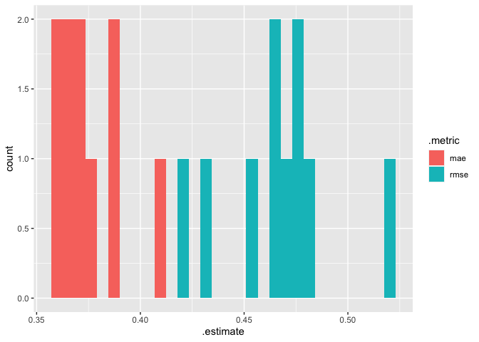
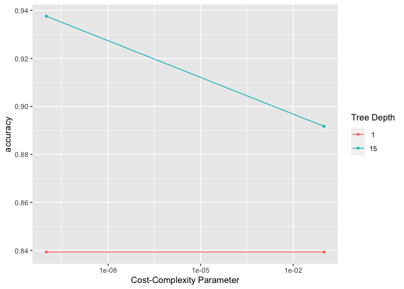
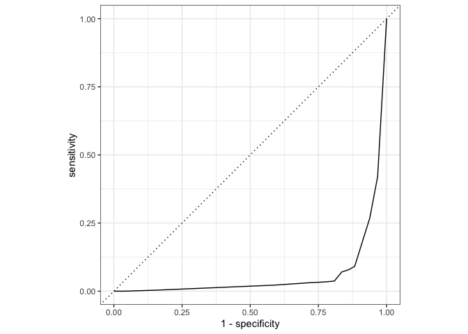
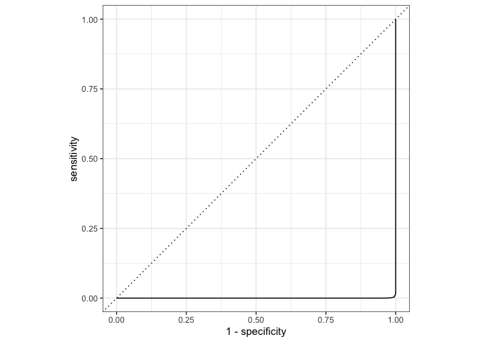
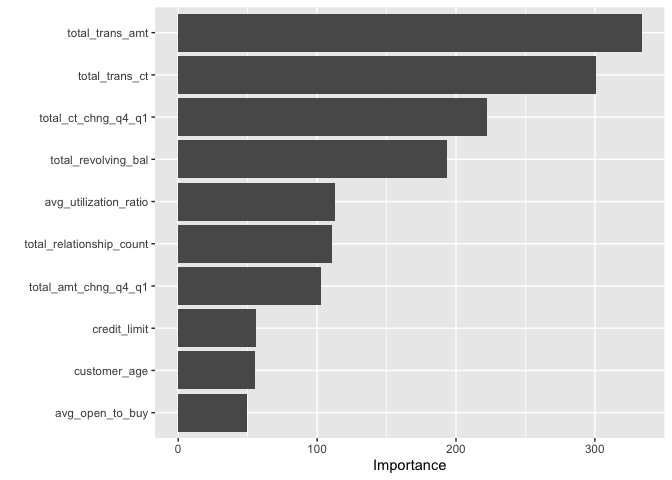
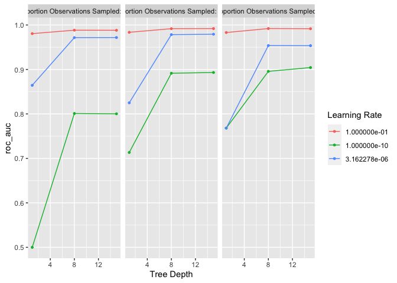
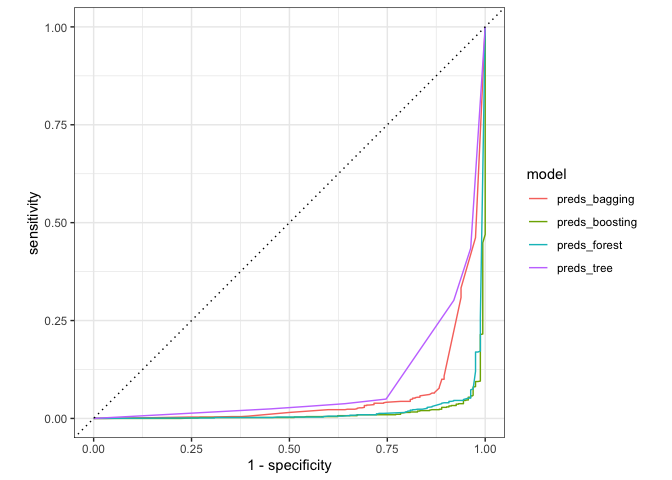

Machine Learning with Tree-Based Models in R
================
Joschka Schwarz

-   [1. Classification Trees](#1-classification-trees)
    -   [Welcome to the course!](#welcome-to-the-course)
    -   [Why tree-based methods?](#why-tree-based-methods)
    -   [Specify that tree](#specify-that-tree)
    -   [Train that model](#train-that-model)
    -   [How to grow your tree](#how-to-grow-your-tree)
    -   [Train/test split](#traintest-split)
    -   [Avoiding class imbalances](#avoiding-class-imbalances)
    -   [From zero to hero](#from-zero-to-hero)
    -   [Predict and evaluate](#predict-and-evaluate)
    -   [Make predictions](#make-predictions)
    -   [Crack the matrix](#crack-the-matrix)
    -   [Are you predicting correctly?](#are-you-predicting-correctly)
-   [2. Regression Trees and
    Cross-Validation](#2-regression-trees-and-cross-validation)
    -   [Continuous outcomes](#continuous-outcomes)
    -   [Train a regression tree](#train-a-regression-tree)
    -   [Predict new values](#predict-new-values)
    -   [Inspect model output](#inspect-model-output)
    -   [Performance metrics for regression
        trees](#performance-metrics-for-regression-trees)
    -   [In-sample performance](#in-sample-performance)
    -   [Out-of-sample performance](#out-of-sample-performance)
    -   [Bigger mistakes, bigger
        penalty](#bigger-mistakes-bigger-penalty)
    -   [Cross-validation](#cross-validation)
    -   [Create the folds](#create-the-folds)
    -   [Fit the folds](#fit-the-folds)
    -   [Evaluate the folds](#evaluate-the-folds)
    -   [Bias-variance tradeoff](#bias-variance-tradeoff)
    -   [Call things by their names](#call-things-by-their-names)
    -   [Adjust model complexity](#adjust-model-complexity)
    -   [In-sample and out-of-sample
        performance](#in-sample-and-out-of-sample-performance)
-   [3. Hyperparameters and Ensemble
    Models](#3-hyperparameters-and-ensemble-models)
    -   [Tuning hyperparameters](#tuning-hyperparameters)
    -   [Generate a tuning grid](#generate-a-tuning-grid)
    -   [Tune along the grid](#tune-along-the-grid)
    -   [Pick the winner](#pick-the-winner)
    -   [More model measures](#more-model-measures)
    -   [Calculate specificity](#calculate-specificity)
    -   [Draw the ROC curve](#draw-the-roc-curve)
    -   [Area under the ROC curve](#area-under-the-roc-curve)
    -   [Bagged trees](#bagged-trees)
    -   [Create bagged trees](#create-bagged-trees)
    -   [In-sample ROC and AUC](#in-sample-roc-and-auc)
    -   [Check for overfitting](#check-for-overfitting)
    -   [Random forest](#random-forest)
    -   [Bagged trees vs. random forest](#bagged-trees-vs-random-forest)
    -   [Variable importance](#variable-importance)
-   [4. Boosted Trees](#4-boosted-trees)
    -   [Introduction to boosting](#introduction-to-boosting)
    -   [Bagging vs. boosting](#bagging-vs-boosting)
    -   [Specify a boosted ensemble](#specify-a-boosted-ensemble)
    -   [Gradient boosting](#gradient-boosting)
    -   [Train a boosted ensemble](#train-a-boosted-ensemble)
    -   [Evaluate the ensemble](#evaluate-the-ensemble)
    -   [Compare to a single
        classifier](#compare-to-a-single-classifier)
    -   [Optimize the boosted ensemble](#optimize-the-boosted-ensemble)
    -   [Tuning preparation](#tuning-preparation)
    -   [The actual tuning](#the-actual-tuning)
    -   [Finalize the model](#finalize-the-model)
    -   [Model comparison](#model-comparison)
    -   [Compare AUC](#compare-auc)
    -   [Plot ROC curves](#plot-roc-curves)
    -   [Wrap-up](#wrap-up)

**Short Description**

Learn how to use tree-based models and ensembles to make classification
and regression predictions with tidymodels.

**Long Description**

Tree-based machine learning models can reveal complex non-linear
relationships in data and often dominate machine learning competitions.
In this course, you’ll use the tidymodels package to explore and build
different tree-based models—from simple decision trees to complex random
forests. You’ll also learn to use boosted trees, a powerful machine
learning technique that uses ensemble learning to build high-performing
predictive models. Along the way, you’ll work with health and credit
risk data to predict the incidence of diabetes and customer churn.

# 1. Classification Trees

Ready to build a real machine learning pipeline? Complete step-by-step
exercises to learn how to create decision trees, split your data, and
predict which patients are most likely to suffer from diabetes. Last but
not least, you’ll build performance measures to assess your models and
judge your predictions.

## Welcome to the course!

Theory. Coming soon …

**1. Welcome to the course!**

Hi and welcome to the course! My name is Sandro and I am a Data
Scientist. I will introduce you to some exciting classification and
regression methods using decision trees and ensemble models.What exactly
are we going to cover?

**2. Course overview**

In Chapter 1, you’ll be introduced to a set of supervised learning
models known as classification trees.In Chapter 2, you’ll build decision
trees for regression problems and understand the concepts of
cross-validation and bias-variance trade-off.Chapter 3 introduces you to
hyperparameter tuning, bagging, and random forests. Finally, Chapter 4
deals with boosting as a powerful ensemble method.Along the way, you’ll
get to know many useful tools and methods for machine learning.

**3. Decision trees are flowcharts**

Consider this flowchart, which shows a way of classifying living
animals. A set of questions like “Can this thing live in water?” or
“Does it have feathers?” allow you to narrow down the options until you
arrive at a decision.This type of flow chart describes how a computer or
an algorithm could go about solving a classification problem. This
schema is also found in human decision-making, like holiday planning or
deciding where to meet up with your friends.

**4. Advantages of tree-based models**

One of the biggest advantages of decision trees is that they are easy to
explain. Anyone able to read a flow-chart is already able to understand
a decision tree.In contrast to linear models, trees are able to capture
non-linear relationships. Furthermore, trees do not need normalization
or standardization of numeric features. Trees can also handle
categorical features without the need to create dummy binary indicator
variables.Missing values are not a problem, and trees are robust to
outliers.Last but not least, it’s relatively fast to train a decision
tree, so tree methods can handle big datasets.

**5. Disadvantages of tree-based models**

Unfortunately, large and deep trees are hard to interpret. One of the
major problems with trees is that they have high variance. If not tuned
properly, it’s easy to create overly complex trees that do not
generalize well to new data, known as overfitting.

**6. The tidymodels package**

There are many great machine learning R packages out there. Throughout
the course, we will use the tidymodels package, which orchestrates many
of these for you. Among these is parsnip for modeling, rsample for
sampling, and yardstick for measuring performance.

**7. The tidymodels package**

To make use of the package, simply type “library parenthesis,
tidymodels, then end parenthesis” in your console.It takes care of
loading all the other useful packages.

**8. Create a decision tree**

To create a tree model, you first need to create the specification for
your later model.This serves as a functional design or skeleton.First,
pick a model class, and since we are in a tree-based course, we use
decision_tree().

**9. Create a decision tree**

The set_engine() function adds an engine to power or implement the
model. We use rpart, which is an R package for “recursive partitioning”.

**10. Create a decision tree**

Then, set the mode, like classification or regression.This sets the
class of problems the model will solve.

**11. From a model specification to a real model**

A model specification, which you can save, for example, as tree_spec, is
only a skeleton. You need to bring it to life using data. We call this
process model training or model fitting.Simply call the fit() function
on your specification supplying the arguments ‘formula’ and ‘data’. You
can read the formula as “outcome is modeled as a function of age and
bmi”.We used a diabetes dataset in this example. The output informs you
about the training time and the number of samples used for training.

**12. Let’s build a model!**

Time for you to practice!

## Why tree-based methods?

Tree-based models are one class of methods used in machine learning.
They are superior in many ways, but also have their drawbacks.

Which of these statements are true and which are false? For each
statement, decide whether it is correct or incorrect and drop it into
the corresponding bucket.

| Correct statements                                                                | Incorrect statements                                                     |
|-----------------------------------------------------------------------------------|--------------------------------------------------------------------------|
| Trees are robust to outliers in the data.                                         | Trees take longer than other models when trained on large datasets.      |
| Trees can model non-linearity in data, but sometimes learn the noise in the data. | Trees require data preparation, like normalization of numeric variables. |

## Specify that tree

<!-- Guidelines for contexts: https://instructor-support.datacamp.com/en/articles/2375525-course-sequential-exercises. -->

In order to build models and use them to solve real-world problems, you
first need to lay the foundations of your model by creating a *model
specification*. This is the very first step in every machine learning
pipeline that you will ever build.

You are going to load the relevant packages and design the specification
for your classification tree in just a few steps.

A magical moment, enjoy!

**Steps**

1.  Load the `tidymodels` package.
2.  Pick a model class for decision trees, save it as `tree_spec`, and
    print it.

``` r
# Load the package
library(readr)
library(tidymodels)
```

    ## Registered S3 method overwritten by 'tune':
    ##   method                   from   
    ##   required_pkgs.model_spec parsnip

    ## ── Attaching packages ────────────────────────────────────── tidymodels 0.1.4 ──

    ## ✓ broom        0.7.10     ✓ recipes      0.1.17
    ## ✓ dials        0.0.10     ✓ rsample      0.1.1 
    ## ✓ dplyr        1.0.7      ✓ tibble       3.1.6 
    ## ✓ ggplot2      3.3.5      ✓ tidyr        1.2.0 
    ## ✓ infer        1.0.0      ✓ tune         0.1.6 
    ## ✓ modeldata    0.1.1      ✓ workflows    0.2.4 
    ## ✓ parsnip      0.2.1      ✓ workflowsets 0.1.0 
    ## ✓ purrr        0.3.4      ✓ yardstick    0.0.9

    ## ── Conflicts ───────────────────────────────────────── tidymodels_conflicts() ──
    ## x purrr::discard()  masks scales::discard()
    ## x dplyr::filter()   masks stats::filter()
    ## x dplyr::lag()      masks stats::lag()
    ## x yardstick::spec() masks readr::spec()
    ## x recipes::step()   masks stats::step()
    ## x tune::tune()      masks parsnip::tune()
    ## • Learn how to get started at https://www.tidymodels.org/start/

``` r
# Pick a model class
tree_spec <- decision_tree() 

# Print the result
tree_spec
```

    ## Decision Tree Model Specification (unknown)
    ## 
    ## Computational engine: rpart

3.  Set the engine to `"rpart"` and print the result.

``` r
# Pick a model class
tree_spec <- decision_tree() %>% 
  # Set the engine
  set_engine("rpart")

# Print the result
tree_spec
```

    ## Decision Tree Model Specification (unknown)
    ## 
    ## Computational engine: rpart

4.  Set the mode to `"classification"` and print the result.

``` r
# Pick a model class
tree_spec <- decision_tree() %>% 
  # Set the engine
  set_engine("rpart") %>% 
  # Set the mode
  set_mode("classification")

# Print the result
tree_spec
```

    ## Decision Tree Model Specification (classification)
    ## 
    ## Computational engine: rpart

Specific specification! You created a decision tree model class, used an
`rpart` engine, and set the mode to “classification”. Remember, you will
need to perform similar steps every time you design a new model. Come
back anytime if you need a reminder!

## Train that model

<!-- Guidelines for contexts: https://instructor-support.datacamp.com/en/articles/2375526-course-coding-exercises. -->

A model specification is a good start, just like the canvas for a
painter. But just as a painter needs color, the specification needs
data. Only the final model is able to make predictions:

*Model specification + data = model*

In this exercise, you will train a decision tree that models the risk of
diabetes using health variables as predictors. The response variable,
`outcome`, indicates whether the patient has diabetes or not, which
means this is a binary classification problem (there are just two
classes). The dataset also contains health variables of patients like
`blood_pressure`, `age`, and `bmi`.

**For the rest of the course, the** `tidymodels` **package will always
be pre-loaded.** In this exercise, the `diabetes` dataset is also
available in your workspace.

**Steps**

1.  Create `tree_spec`, a specification for a decision tree with an
    `rpart` engine.
2.  Train a model `tree_model_bmi`, where the `outcome` depends only on
    the `bmi` predictor by fitting the `diabetes` dataset to the
    specification.
3.  Print the model to the console.

``` r
# Load library
library(readr)

# Load data
# col_types does not work properly if tidymodels was loaded before
# diabetes <- read_csv("data/diabetes_tibble.csv", col_types = cols(outcome = col_factor()))
diabetes <- read_csv("data/diabetes_tibble.csv") |> 
              mutate(outcome = outcome |> as.factor())
```

    ## Rows: 768 Columns: 9
    ## ── Column specification ────────────────────────────────────────────────────────
    ## Delimiter: ","
    ## chr (1): outcome
    ## dbl (8): pregnancies, glucose, blood_pressure, skin_thickness, insulin, bmi,...
    ## 
    ## ℹ Use `spec()` to retrieve the full column specification for this data.
    ## ℹ Specify the column types or set `show_col_types = FALSE` to quiet this message.

``` r
# Create the specification
tree_spec <- decision_tree() %>% 
  set_engine("rpart") %>% 
  set_mode("classification")

# Train the model
tree_model_bmi <- tree_spec %>% 
  fit(formula = outcome ~ bmi, 
      data = diabetes)

# Print the model
tree_model_bmi
```

    ## parsnip model object
    ## 
    ## n= 768 
    ## 
    ## node), split, n, loss, yval, (yprob)
    ##       * denotes terminal node
    ## 
    ## 1) root 768 268 no (0.6510417 0.3489583)  
    ##   2) bmi< 29.85 291  47 no (0.8384880 0.1615120) *
    ##   3) bmi>=29.85 477 221 no (0.5366876 0.4633124)  
    ##     6) bmi< 40.85 392 168 no (0.5714286 0.4285714) *
    ##     7) bmi>=40.85 85  32 yes (0.3764706 0.6235294) *

Excellent work! You have defined your model with `decision_tree()` and
trained it to predict `outcome` using `bmi` like a professional coach!
Printing the model displays useful information, such as the training
time, the model formula used during training, and the node details.
Remember, *to fit a model to data* is just a different phrase for
*training it*. Don’t worry about the precise output too much, you’ll
cover that later!

## How to grow your tree

Theory. Coming soon …

**1. How to grow your tree**

Welcome back!

**2. Diabetes dataset**

You now know how to create the skeleton or specification of a decision
tree and how to train it on real data to create a model.In this section,
we’ll use the diabetes dataset from the last exercise.It has an outcome
column that indicates if a patient has diabetes or not and some numeric
predictors like blood pressure, BMI, and age.

**3. Using the whole dataset**

So far, you used a dataset to fit a decision tree model.Now, how can you
test the performance of your model on new data?You would need to collect
more data.

**4. Data split**

A common solution for this problem is to split the data into two
groups.One part of the data, the training set, is used to estimate
parameters, and compare or tune models.The test set is held in reserve
until the end of the project.It is used as an unbiased source for
measuring final model performance.It is critical that you don’t use the
test set before this point, otherwise the testing data will have become
part of the model development process.

**5. Splitting methods**

There are different ways to create these data partitions. You could take
data from the end, from the center, or a random sample. Just select a
part of the data set, say 80% of all samples, for the training set and
use the rest for the test set. We will introduce more exciting and more
robust splitting methods in chapter 2.

**6. The initial_split() function**

The initial_split() function from the rsample package comes in handy
because it does all the work for you.The function takes the original
data, diabetes, and a proportion argument, say 0-point-9, and randomly
assigns samples (rows of the tibble) to the training or test set. If no
proportion is given, it assigns 75% of the samples to the training and
25% to the test set.The result is a split object which contains analysis
and assessment sets, which are just different names for training and
test sets. Here we see that 76 samples are in the test or assessment
set, which is about 10% of 768 samples in total.

**7. Functions training() and testing()**

After the initial split, the training() and testing() functions return
the actual datasets.Calling the training() function on our split object
diabetes_split gives us our training set.Calling the testing() function
on our split object diabetes_split gives us our test set.You can compare
the number of rows using the nrow() function to validate that the
training set has indeed 90% as many rows as the total dataset.

**8. Avoid class imbalances**

Ideally, your training and test sets have the same distribution in the
outcome variable. Otherwise, if your data split is very unlucky, you can
end up with a training set with no diabetes patients at all, which would
result in a useless model.The following code exhibits this problem.
First, count the different outcomes of ‘yes’ and ‘no’ in the training
set using the table() function.Then, count the proportion of ‘yes’
outcomes among all outcomes in the training set - it’s about 15%.Do the
same for the test set and find that this contains approximately 63%
diabetes patients. This is a real problem if you have a rare disease
dataset and end up with no positive outcomes in your training set.

**9. Solution - enforce similar distributions**

A remedy for this is the strata argument, which is set to the target
variable “outcome” here.This ensures a random split with a similar
outcome distribution in both the training and test sets.

**10. Let’s split!**

Enough said, now it’s your turn to split the data!

## Train/test split

In order to test your models, you need to build and test the model on
two different parts of the data - otherwise, it’s like cheating on an
exam (as you already know the answers).

The data split is an integral part of the modeling process. You will
dive into this by splitting the diabetes data and confirming the split
proportions.

The `diabetes` data from the last exercise is pre-loaded in your
workspace.

**Steps**

1.  Split the `diabetes` tibble into `diabetes_split`, a split of 80%
    training and 20% test data.
2.  Print the resulting object.

``` r
# Create the split
diabetes_split <- initial_split(diabetes, prop = 0.8)

# Print the data split
diabetes_split
```

    ## <Analysis/Assess/Total>
    ## <614/154/768>

3.  Extract the training and test sets and save them as `diabetes_train`
    and `diabetes_test`.

``` r
# Extract the training and test set
diabetes_train <- training(diabetes_split)
diabetes_test  <- testing(diabetes_split)
```

4.  Verify the correct row proportion in both datasets compared to the
    `diabetes` tibble.

``` r
# Create the split
diabetes_split <- initial_split(diabetes, prop = 0.8)

# Extract the training and test set
diabetes_train <- training(diabetes_split)
diabetes_test  <- testing(diabetes_split)

# Verify the proportions of both sets
round(nrow(diabetes_train) / nrow(diabetes), 2) == 0.80
```

    ## [1] TRUE

``` r
round(nrow(diabetes_test) / nrow(diabetes), 2) == 0.20
```

    ## [1] TRUE

You split the data like a samurai! Using `training()` and `testing()`
after the split ensures that you save your working datasets. Sharpen
your sword for some more splitting magic…

## Avoiding class imbalances

<!-- Guidelines for contexts: https://instructor-support.datacamp.com/en/articles/2375528-course-iterative-exercises -->

Some data contains very imbalanced outcomes - like a rare disease
dataset. When splitting randomly, you might end up with a very
unfortunate split. Imagine all the rare observations are in the test and
none in the training set. That would ruin your whole training process!

Fortunately, the `initial_split()` function provides a remedy. You are
going to observe and solve these so-called *class imbalances* in this
exercise.

There’s already a split object `diabetes_split` available with a 75%
training and 25% test split.

**Steps**

1.  Count the proportion of `"yes"` outcomes in the training and test
    sets of `diabetes_split`.

``` r
# Proportion of 'yes' outcomes in the training data
counts_train <- table(training(diabetes_split)$outcome)
prop_yes_train <- counts_train["yes"] / sum(counts_train)

# Proportion of 'yes' outcomes in the test data
counts_test <- table(testing(diabetes_split)$outcome)
prop_yes_test <- counts_test["yes"] / sum(counts_test)

paste("Proportion of positive outcomes in training set:", round(prop_yes_train, 2))
```

    ## [1] "Proportion of positive outcomes in training set: 0.36"

``` r
paste("Proportion of positive outcomes in test set:", round(prop_yes_test, 2))
```

    ## [1] "Proportion of positive outcomes in test set: 0.31"

2.  Redesign `diabetes_split` using the same training/testing
    proportion, but the `outcome` variable being equally distributed in
    both sets.
3.  Count the proportion of `yes` outcomes in both datasets.

``` r
# Create a split with a constant outcome distribution
diabetes_split <- initial_split(diabetes, strata = outcome)

# Proportion of 'yes' outcomes in the training data
counts_train <- table(training(diabetes_split)$outcome)
prop_yes_train <- counts_train["yes"] / sum(counts_train)

# Proportion of 'yes' outcomes in the test data
counts_test <- table(testing(diabetes_split)$outcome)
prop_yes_test <- counts_test["yes"] / sum(counts_test)

paste("Proportion of positive outcomes in training set:", round(prop_yes_train, 2))
```

    ## [1] "Proportion of positive outcomes in training set: 0.35"

``` r
paste("Proportion of positive outcomes in test set:", round(prop_yes_test, 2))
```

    ## [1] "Proportion of positive outcomes in test set: 0.35"

Impressive - from 40% vs. 20% positive outcomes to 35% in both sets.
This was a tough one, but now you know how simple it is to avoid class
imbalances! This is even more important in a large dataset with a very
imbalanced target variable.

## From zero to hero

<!-- Guidelines for contexts: https://instructor-support.datacamp.com/en/articles/2375526-course-coding-exercises. -->

You mastered the skills of creating a model specification and splitting
the data into training and test sets. You also know how to avoid class
imbalances in the split. It’s now time to combine what you learned in
the preceding lesson and build your model using only the training set!

You are going to build a proper *machine learning pipeline*. This is
comprised of creating a model specification, splitting your data into
training and test sets, and last but not least, fitting the training
data to a model. Enjoy!

**Steps**

1.  Create `diabetes_split`, a split where the training set contains
    three-quarters of all `diabetes` rows and where training and test
    sets have a similar distribution in the `outcome` variable.
2.  Build a decision tree specification for your model using the `rpart`
    engine and save it as `tree_spec`.
3.  Fit a model `model_trained` using the training data of
    `diabetes_split` with `outcome` as the target variable and `bmi` and
    `skin_thickness` as the predictors.

``` r
set.seed(9)

# Create the balanced data split
diabetes_split <- initial_split(diabetes, prop = 0.75, strata = outcome)

# Build the specification of the model
tree_spec <- decision_tree() %>% 
  set_engine("rpart") %>% 
  set_mode("classification")

# Train the model
model_trained <- tree_spec %>% 
  fit(formula = outcome ~ bmi + skin_thickness, 
      data = training(diabetes_split))

model_trained
```

    ## parsnip model object
    ## 
    ## n= 576 
    ## 
    ## node), split, n, loss, yval, (yprob)
    ##       * denotes terminal node
    ## 
    ##   1) root 576 201 no (0.6510417 0.3489583)  
    ##     2) bmi< 29.85 213  34 no (0.8403756 0.1596244) *
    ##     3) bmi>=29.85 363 167 no (0.5399449 0.4600551)  
    ##       6) bmi< 40.85 297 126 no (0.5757576 0.4242424)  
    ##        12) bmi>=40.05 10   1 no (0.9000000 0.1000000) *
    ##        13) bmi< 40.05 287 125 no (0.5644599 0.4355401)  
    ##          26) skin_thickness>=5.5 208  82 no (0.6057692 0.3942308)  
    ##            52) skin_thickness< 25.5 48  11 no (0.7708333 0.2291667) *
    ##            53) skin_thickness>=25.5 160  71 no (0.5562500 0.4437500)  
    ##             106) bmi>=38.8 19   4 no (0.7894737 0.2105263) *
    ##             107) bmi< 38.8 141  67 no (0.5248227 0.4751773)  
    ##               214) bmi< 30.85 15   3 no (0.8000000 0.2000000) *
    ##               215) bmi>=30.85 126  62 yes (0.4920635 0.5079365)  
    ##                 430) skin_thickness>=35.5 51  21 no (0.5882353 0.4117647) *
    ##                 431) skin_thickness< 35.5 75  32 yes (0.4266667 0.5733333)  
    ##                   862) skin_thickness< 29.5 37  17 no (0.5405405 0.4594595) *
    ##                   863) skin_thickness>=29.5 38  12 yes (0.3157895 0.6842105) *
    ##          27) skin_thickness< 5.5 79  36 yes (0.4556962 0.5443038)  
    ##            54) bmi< 37.65 66  32 no (0.5151515 0.4848485)  
    ##             108) bmi>=33.05 30  10 no (0.6666667 0.3333333) *
    ##             109) bmi< 33.05 36  14 yes (0.3888889 0.6111111) *
    ##            55) bmi>=37.65 13   2 yes (0.1538462 0.8461538) *
    ##       7) bmi>=40.85 66  25 yes (0.3787879 0.6212121)  
    ##        14) skin_thickness>=37.5 24  11 no (0.5416667 0.4583333)  
    ##          28) skin_thickness< 41.5 11   2 no (0.8181818 0.1818182) *
    ##          29) skin_thickness>=41.5 13   4 yes (0.3076923 0.6923077) *
    ##        15) skin_thickness< 37.5 42  12 yes (0.2857143 0.7142857) *

That pipeline was perfectly handcrafted! Did you see that, according to
the nodes, a BMI value of over 42.25 corresponds to a very high risk of
diabetes? Let’s head over to the engine room to check your model’s
performance…

## Predict and evaluate

Theory. Coming soon …

**1. Predict and evaluate**

Welcome back! Now that you know how to create a data split and
classification tree model, let’s learn how to make predictions and
evaluate how close they are to the truth.

**2. Predicting on new data**

Like most machine learning packages in R, parsnip has a predict()
function.The first argument is the trained model, the second argument is
the new or test dataset, and the third argument, type, controls whether
the function returns predicted labels or probabilities.

**3. Predicting on new data**

Call the predict() function with the model and the test data. The
default argument for type is “class”, which produces class labels. If
you write type = “prob”, the result will contain numeric columns, one
for each outcome variable. The numbers are the probability. Note you
always get a tibble with rows that correspond to the rows of the new
data. This makes working with tidymodels objects very handy.

**4. Confusion matrix**

The confusion matrix is a really useful tool for evaluating binary
classification models.It’s called a confusion matrix because it reveals
how confused the model is between the two classes, and highlights
instances in which it confuses one class for the other.

**5. Confusion matrix**

The columns of a confusion matrix correspond to the truth labels,

**6. Confusion matrix**

and the rows represent the predictions.

**7. Confusion matrix**

In a binary classification problem, the confusion matrix will be a 2 by
2 table.The main diagonal contains the counts of correctly classified
examples, that is “yes”-predictions that are in fact “yes”, and “no”
predictions that are in fact “no”.A good model will contain most of the
examples in the main diagonal (the green squares) and it will have a
small number of examples, ideally zero, in the off-diagonal (the red
squares).

**8. Confusion matrix**

Let’s briefly review the 4 possible outcomes with a binary
classification model: True positives or TP are cases where the model
correctly predicted yes. True negatives or TN are cases where the model
correctly predicted no.False positives or FP are cases where the model
predicted positive, but the true labels are negative.False negatives or
FN are cases where the model predicted negative, but it’s actually
positive.

**9. Create the confusion matrix**

So, how to create such a confusion matrix? Simply use the mutate()
function to add the true outcome of the diabetes test tibble to the
predictions. The resulting tibble pred_combined has two columns:
dot-pred_class and true_class.The yardstick package, which is a part of
the tidymodels framework, provides the conf_mat() function.You need to
specify three arguments: data, which is the data containing your
predictions and true values, estimate, which is your prediction column,
and truth, which are the true values.The matrix is printed as a result.

**10. Accuracy**

There are quite a few ways of evaluating classification performance.
Accuracy measures how often the classifier predicted the class
correctly. It is defined as the ratio between the number of correct
predictions and the total number of predictions it made. It is quite
intuitive and easy to calculate, and in Chapter 3, you’ll get to know
more helpful performance metrics!The yardstick package makes it very
easy to assess accuracy. Just call the accuracy() function the same way
you called the conf_mat() function: Simply supply the pred_combined
tibble containing predictions and true values, and specify the estimate
and truth arguments as before.The result is a tibble with information
like the name of the metric, accuracy, and the result. In this case, the
model is right about 70% of the time.

**11. Let’s evaluate!**

Now that you learned techniques for evaluating classification models,
it’s your turn!

## Make predictions

<!-- Guidelines for contexts: https://instructor-support.datacamp.com/en/articles/2375526-course-coding-exercises. -->

Making predictions with data is one of the fundamental goals of machine
learning. Now that you know how to split the data and fit a model, it’s
time to make predictions about unseen samples with your models.

You are going to make predictions about your test set using a model
obtained by fitting the training data to a tree specification.

Available in your workspace are the datasets that you generated
previously (`diabetes_train` and `diabetes_test`) and a decision tree
specification `tree_spec`, which was generated using the following code:

``` r
tree_spec <- decision_tree() %>%
  set_engine("rpart") %>%
  set_mode("classification") 
```

**Steps**

1.  Fit your specification to the training data using `outcome` as the
    target variable and all predictors to create `model`.
2.  Use your model to predict the outcome of diabetes for every
    observation in the test set and assign the result to `predictions`.
3.  Add the true test set outcome to `predictions` as a column named
    `true_class` and save the result as `predictions_combined`.
4.  Use the `head()` function to print the first rows of the result.

``` r
# Train your model
model <- tree_spec %>% 
  fit(formula = outcome ~ ., data = diabetes_train)

# Generate predictions
predictions <- predict(model,
                       new_data = diabetes_test)

# Add the true outcomes
predictions_combined <- predictions %>% 
  mutate(true_class = diabetes_test$outcome)
  
# Print the first lines of the result
head(predictions_combined)
```

    ## # A tibble: 6 × 2
    ##   .pred_class true_class
    ##   <fct>       <fct>     
    ## 1 yes         yes       
    ## 2 yes         yes       
    ## 3 no          yes       
    ## 4 no          no        
    ## 5 yes         yes       
    ## 6 yes         yes

Smooth! Now every predicted `.pred_class` has its `true_class`
counterpart. The natural next step would be to compare these two and see
how many are correct. You are about to find out in the next exercise.

## Crack the matrix

Visual representations are a great and intuitive way to assess results.
One way to visualize and assess the performance of your model is by
using a confusion matrix. In this exercise, you will create the
confusion matrix of your predicted values to see in which cases it
performs well and in which cases it doesn’t.

The result of the previous exercise, `predictions_combined`, is still
loaded.

**Steps**

1.  Calculate the confusion matrix of the `predictions_combined` tibble
    and save it as `diabetes_matrix`.
2.  Print the result to the console.

``` r
# The confusion matrix
diabetes_matrix <- conf_mat(data = predictions_combined,
                            estimate = .pred_class,
                            truth = true_class)

# Print the matrix
diabetes_matrix
```

    ##           Truth
    ## Prediction no yes
    ##        no  88  23
    ##        yes 18  25

> ## *Question*
>
> Out of all true `no` outcomes, what percent did your model correctly
> predict?<br> <br> ✅ 83%<br> ⬜ 75%<br> ⬜ 55%<br>

Your model found 83% of all negative outcomes, which is not bad! This
measure is called *specificity* or the *true negative rate (TNR)*. Let’s
see how we can quantify this further…

## Are you predicting correctly?

<!-- Guidelines for contexts: https://instructor-support.datacamp.com/en/articles/2375525-course-sequential-exercises. -->

Your model should be *as good as possible*, right? One way you can
assess this is by counting how often it predicted the **correct**
classes compared to the total number of predictions it made. As
discussed in the video, we call this performance measure **accuracy**.
You can either calculate this manually or by using a handy shortcut.
Both obtain the same result.

The confusion matrix `diabetes_matrix` and the tibble
`predictions_combined` are loaded.

**Steps**

1.  Print `diabetes_matrix` to the console and use its entries to
    directly calculate `correct_predictions`, the number of correct
    predictions.
2.  Save the **total number** of predictions to `all_predictions`.
3.  Calculate and the accuracy, save it to `acc_manual`, and print it.

``` r
# Calculate the number of correctly predicted classes
correct_predictions <- 84 + 24

# Calculate the number of all predicted classes
all_predictions <- 84 + 24 + 28 + 17

# Calculate and print the accuracy
acc_manual <- correct_predictions / all_predictions
acc_manual
```

    ## [1] 0.7058824

4.  Calculate the accuracy using a `yardstick` function and store the
    result in `acc_auto`.
5.  Print the accuracy estimate.

``` r
# The number of correctly predicted classes
correct_predictions <- 84 + 24

# The number of all predicted classes
all_predictions <- 84 + 24 + 28 + 17

# The accuracy calculated by hand
acc_manual <- correct_predictions / all_predictions
acc_manual
```

    ## [1] 0.7058824

``` r
# The accuracy calculated by a function
acc_auto <- accuracy(predictions_combined,
                     estimate = .pred_class,
                     truth = true_class)
acc_auto$.estimate
```

    ## [1] 0.7337662

> ## *Question*
>
> Accuracy is very intuitive but also has its limitations. Imagine we
> have a naive model that **always** predicts `no`, regardless of the
> input. What would the accuracy be for that model?

The `predictions_combined` tibble from the previous model is still
available. Use this and the interactive console to find the answer!<br>
\> <br> \> ⬜ The accuracy of all *no* predictions is 100%.<br> \> ⬜
The new model is right about 50% of the time.<br> \> ⬜ There are no
correct predictions for the new model - 0%.<br> \> ✅ The new model is
right in 66% of all cases.<br>

Correct! A naive model always predicting `no` only has a slightly worse
accuracy than our model. Luckily there are more useful performance
metrics which we’ll cover later in the course. Stay tuned for Chapter
3!<br><br> Enjoying the course so far? [Tell us what you
think](http://twitter.com/intent/tweet?text=I%20am%20taking%20Machine%20Learning%20with%20Tree-Based%20Models%20in%20R%20on%20@DataCamp!%20So%20far,%20I’ve%20learned%20about%20classification%20trees%20and%20will%20learn%20about%20random%20forests%20and%20boosted%20trees%3A&url=https%3A%2Fdatacamp.com/courses/machine-learning-with-tree-based-models-in-r)​
via Twitter!

# 2. Regression Trees and Cross-Validation

Ready for some candy? Use a chocolate rating dataset to build regression
trees and assess their performance using suitable error measures. You’ll
overcome statistical insecurities of single train/test splits by
applying sweet techniques like cross-validation and then dive even
deeper by mastering the bias-variance tradeoff.

## Continuous outcomes

Theory. Coming soon …

**1. Continuous outcomes**

In this section, we’ll talk about another type of decision tree, the
regression tree.In regression, the goal is to predict a numeric or
quantitative outcome.An example of a continuous numeric outcome is house
prices or the number of online store visitors - the underlying value is
continuous and can take any positive value.

**2. The dataset**

These examples and the exercises will use data from a survey of
chocolate tastings. There is information about the amount of cocoa (in
percent), the origin of the bean, the company location, and others.The
outcome or response variable is final_grade, which is a numeric double
value from 1 to 5.

**3. Construct the regression tree**

Construct the regression tree almost in the same way as a classification
tree:Define the model class decision_tree(), set the mode to regression
and the engine to “rpart”.Afterward, you can train the model by using
the fit function as usual. Provide the formula, and data to train on:
the dataset chocolate_train.

**4. Predictions using a regression tree**

Predicting with a regression tree is again the same as predicting with a
classification tree. Simply call the predict() function and provide the
model and new data. In this example, we supply our testing data as the
new_data argument.The predicted numbers are chocolate grade scores.

**5. Divide & conquer**

What actually happens during the training of a decision tree? Beginning
at the root node, the data is divided into groups according to the
feature that will result in the greatest increase in homogeneity in the
groups after a split.

**6. Hyperparameters**

For regression trees, the variance or deviation from the mean within a
group is aimed to be minimized.There are several “knobs” that we can
turn that affect how the tree is grown, and often, turning these knobs -
or model hyperparameters - will result in a better performing model.Some
of these design decisions are:The min_n parameter defines the minimum
number of data points in a node to be split further. The tree_depth is
the maximum depth of the tree.cost_complexity is a penalty parameter (a
smaller value makes more complex trees).So far, we’ve trained our trees
using the default values. These defaults are chosen to provide a decent
starting point on most datasets. Finding the optimal hyperparameters is
called “tuning”, and you will dive into this in Chapter 3.You choose
hyperparameters in the very first decision_tree() step. In this example,
the hyperparameter tree_depth is four, and the cost_complexity is
0-point-05.

**7. Understanding model output**

Suppose you create a decision tree with tree_depth 1 and fit it to the
chocolate_train data.When you print your model to the console, you’ll
see the following output.First, some information about the fit time and
number of samples, then, at the bottom, more details about the decision
tree.The first column is the numbered node, here: one to three. The
second column is the split criterion, here: root node or cocoa_percent
greater than or equal to 0-point-905.The third column is the number of
samples in that node, here: 1000 at the root node, 16 at node 2, and 984
at node three. The last column is the mean outcome of all samples in
that node. For leaf nodes, that is, those having an asterisk, the model
will predict that value.

**8. Let’s do regression!**

That was a lot to digest. But since many things are the same as in
classification trees, you’ll see the patterns. Off to the exercises.

## Train a regression tree

As you know already, decision trees are a useful tool for classification
problems. Moreover, you can also use them to model regression problems.
The structural difference is that there will be numeric values (instead
of classes) on the leaf nodes.

In this exercise, you will use the chocolate dataset to fit a regression
tree. This is very similar to what you already did in Chapter 1 with the
`diabetes` dataset.

Available in your workspace is the training data `chocolate_train`.

**Steps**

1.  Build `model_spec`, a regression tree specification.
2.  Using the `chocolate_train` data frame, use `model_spec` to train a
    regression tree that predicts `final_grade` using only the
    **numerical predictors** in the data.

``` r
# Load data
chocolate <- read_csv("data/chocolate_tibble.csv") |> 
                mutate(across(where(is.character), as.factor))
```

    ## Rows: 1795 Columns: 6
    ## ── Column specification ────────────────────────────────────────────────────────
    ## Delimiter: ","
    ## chr (3): company_location, bean_type, broad_bean_origin
    ## dbl (3): final_grade, review_date, cocoa_percent
    ## 
    ## ℹ Use `spec()` to retrieve the full column specification for this data.
    ## ℹ Specify the column types or set `show_col_types = FALSE` to quiet this message.

``` r
# Create the split
chocolate_split <- initial_split(chocolate, prop = 0.8)

# Extract the training and test set
chocolate_train <- training(chocolate_split)
chocolate_test  <- testing(chocolate_split)

# Build the specification
model_spec <- decision_tree() %>%
  set_mode("regression") %>%
  set_engine("rpart")

# Fit to the data
model_fit <- model_spec %>%
  fit(formula = final_grade ~ cocoa_percent + review_date,
      data = chocolate_train)

model_fit
```

    ## parsnip model object
    ## 
    ## n= 1436 
    ## 
    ## node), split, n, deviance, yval
    ##       * denotes terminal node
    ## 
    ##  1) root 1436 323.452400 3.188196  
    ##    2) cocoa_percent>=0.905 21   7.952381 2.297619 *
    ##    3) cocoa_percent< 0.905 1415 298.597200 3.201413  
    ##      6) cocoa_percent>=0.755 194  37.111150 3.032216 *
    ##      7) cocoa_percent< 0.755 1221 255.049900 3.228296  
    ##       14) cocoa_percent< 0.625 83  13.701810 2.975904 *
    ##       15) cocoa_percent>=0.625 1138 235.675100 3.246705  
    ##         30) cocoa_percent>=0.705 426  90.933830 3.169601 *
    ##         31) cocoa_percent< 0.705 712 140.693500 3.292837 *

Terrific training of a tree! You specified and fit a regression tree
using `cocoa_percent` and `review_date` as predictor variables. Remember
that a regression tree is technically the same as a classification tree
with the difference that it has numeric values at the terminal nodes and
is specified using `"regression"` mode.

## Predict new values

A **predictive** model is one that predicts the outcomes of new, unseen
data. Besides the numeric predictors, there are other useful columns in
the dataset. The goal of this exercise is to predict the final rating
grades of a chocolate tasting based on all other predictor variables
that are available.

Loaded in your workspace is the regression tree specification that you
created in the last exercise, `chocolate_spec`, as well as the training
and testing data (`chocolate_train` and `chocolate_test`).

**Steps**

1.  Use `model_spec` to train a regression tree `chocolate_model` that
    predicts `final_grade` using all predictors in the data.
2.  Predict `final_grade` values using the `chocolate_test` tibble.
3.  Add the results to the `chocolate_test` tibble.

``` r
# Train the model
chocolate_model <- model_spec %>%
  fit(formula = final_grade ~ .,
      data = chocolate_train)

# Predict new data
predictions <- predict(chocolate_model,
                       new_data = chocolate_test) %>%
  # Add the test set
  bind_cols(chocolate_test)

predictions
```

    ## # A tibble: 359 × 7
    ##    .pred final_grade review_date cocoa_percent company_location bean_type 
    ##    <dbl>       <dbl>       <dbl>         <dbl> <fct>            <fct>     
    ##  1  3.41        3.75        2014          0.7  France           Criollo   
    ##  2  3.20        3.75        2013          0.7  France           <NA>      
    ##  3  3.20        2.75        2013          0.7  France           <NA>      
    ##  4  3.41        4           2013          0.63 France           <NA>      
    ##  5  3.41        3.75        2012          0.63 France           <NA>      
    ##  6  2.99        3.75        2015          0.7  U.S.A.           <NA>      
    ##  7  3.20        3.25        2011          0.8  Fiji             Trinitario
    ##  8  3.41        2.75        2010          0.75 Switzerland      Forastero 
    ##  9  2.99        3.25        2013          0.6  U.S.A.           <NA>      
    ## 10  3.22        4           2011          0.7  U.S.A.           <NA>      
    ## # … with 349 more rows, and 1 more variable: broad_bean_origin <fct>

Wonderful work! You predicted numerical values, namely chocolate grades,
using a regression tree. Note the shape of the predictions: a tibble
with one column `.pred`, which contains the predicted grades. Using
`bind_cols()` glues them back neatly to the test data.

## Inspect model output

A hyperparameter is a value that influences the training process and can
have a great impact on model performance. Available in your workspace is
a regression tree model that was created using the following code:

``` r
model <- decision_tree(tree_depth = 1) %>%
  set_mode("regression") %>%
  set_engine("rpart") %>%
  fit(final_grade ~ ., data = chocolate_train)
model
```

    ## parsnip model object
    ## 
    ## n= 1436 
    ## 
    ## node), split, n, deviance, yval
    ##       * denotes terminal node
    ## 
    ## 1) root 1436 323.452400 3.188196  
    ##   2) cocoa_percent>=0.905 21   7.952381 2.297619 *
    ##   3) cocoa_percent< 0.905 1415 298.597200 3.201413 *

As you can see, the `tree_depth` hyperparameter is set to `1`, which
means there’s only one split in the tree.

> ## *Question*
>
> What are the possible values for `final_grade` that will be predicted
> by this regression tree?<br> <br> ⬜ Only 3.183787<br> ⬜ 11.37 or
> 332.72<br> ✅ 2.27 or 3.198<br> ⬜ Less than 0.905 and greater than
> 0.905<br>

Exactly! The last value is the prediction. Looks like beans with a lower
cocoa percentage were rated higher by the study participants.

## Performance metrics for regression trees

Theory. Coming soon …

**1. Performance metrics for regression trees**

Well done!Now that you’ve trained a regression tree, it’s time to
evaluate the performance of the model.

**2. How to measure performance?**

In classification, a single prediction can be either right or wrong, and
nothing else. So it makes sense to evaluate classification models using
a metric like accuracy or the confusion matrix. In regression, however,
your prediction can be almost right or even totally wrong. There is no
binary correctness that calculates accuracy. You need to evaluate the
regression trees using a different metric.Since the response is some
real-valued number, and our prediction is the same, it makes sense to
measure how far our predictions are away from the true values.

**3. Common metrics for regression**

There are several metrics for regression and two popular ones are the
Mean Absolute Error, or MAE, and the Root Mean Square Error, also known
as RMSE.MAE is the average absolute distance between the actual (or
observed) values and the predicted values. In this picture, the
predictions are depicted by the blue line, and the true values are the
black dots. The red bars are the prediction errors, and the mean
absolute error would be the average length of the red bars.The root mean
squared error is the square root of the average squared length of the
red bars.

**4. Formulas and intuition**

The formula for MAE is very straight-forward.You sum up all the absolute
differences between the actual and the predicted values and divide them
by the number of predictions made to get the average error.The RMSE is
similar, but instead of taking the absolute difference between errors,
you square the differences of the errors. Then you’ll average those
values

**5. Formulas and intuition**

and take the square root of the whole thing. Taking the square root
brings the metric back to the original scale of the response.Both MAE
and RMSE express average model prediction errors in units of the
variable of interest.The key difference between the two is that RMSE
punishes large errors more harshly than MAE. Since the errors are
squared before they are averaged, the RMSE gives a relatively high
weight to large errors. This means the RMSE should be more useful when
large errors are particularly undesirable.

**6. Coding: predictions**

Tidymodels provides the yardstick package, which is a toolbox for
evaluating your models. Simply load the parsnip package to make
predictions and the yardstick package for evaluations, or just the
tidymodels package to load both.First, we use the predict function with
our model and chocolate_test data to get predicted values.Then, we use
the bind_cols() function to add these predictions to the test data as
first column dot-pred.

**7. Coding: mae() and rmse()**

This is then passed to the mae() function which also expects the column
that contains the predictions or estimates, dot-pred, and the column
that contains the truth values, final_grade.The result is a tibble that
contains the mean absolute error in the column dot-estimate.The same
goes for the rmse() function.This works exactly the same as with the
accuracy() function for classification trees.

**8. Let’s evaluate!**

Time to put this into practice.

## In-sample performance

It’s very important to know whether your regression model is useful or
not. A useful model can be one that captures the structure of your
training set well. One way to assess this *in-sample* performance is to
**predict on training data** and calculate the mean absolute error of
all predicted data points.

In this exercise, you will evaluate your in-sample predictions using MAE
(mean absolute error). MAE tells you approximately how far away the
predictions are from the true values.

It is calculated using the following formula, where \\(n\\) is the
number of predictions made:

$$MAE = \\\\frac{1}{n} \\\\cdot \\\\sum\_{i=1}^n \\\\text{absolute value of the }i\\\\text{th error}$$

Available in your workspace is your `model`, the regression tree that
you built in the last exercises.

**Steps**

1.  Create `in_sample_predictions` by using `model` to predict on the
    `chocolate_train` tibble.
2.  Calculate a vector `abs_diffs` that contains the absolute
    differences between the in-sample-predictions and the true grades.
3.  Calculate the mean absolute error according to the formula above.

``` r
# Predict using the training set
in_sample_predictions <- predict(model,
                                 new_data = chocolate_train)

# Calculate the vector of absolute differences
abs_diffs <- abs(in_sample_predictions$.pred - chocolate_train$final_grade)

# Calculate the mean absolute error
1 / length(abs_diffs) * sum(abs_diffs)
```

    ## [1] 0.3750626

Excellent! You computed the mean absolute error on the training set. It
has the same unit as the outcome variable, in this case, chocolate
rating. This in-sample error does not seem to be very high. Let’s see
how the model performs on the test data.

## Out-of-sample performance

In-sample performance provides insights about how well a model captures
the data it is modeling. For predictive models, it’s also important to
check model performance on new, unseen data, the *out-of-sample*
performance.

In this exercise, you will check the **test set predictions** of your
model using MAE (mean absolute error).

Pre-loaded in your workspace again is the `model` that you built and
used in the last exercises.

**Steps**

1.  Use `model` to predict the out-of-sample `final_grade` and add your
    predictions to `chocolate_test` using `bind_cols()`.
2.  Calculate the mean absolute error using a `yardstick` function.

``` r
# Predict ratings on test set and add true grades
test_enriched <- predict(model, new_data = chocolate_test) %>%
    bind_cols(chocolate_test)

# Compute the mean absolute error using one single function
mae(test_enriched,
    estimate = .pred,
    truth = final_grade)
```

    ## # A tibble: 1 × 3
    ##   .metric .estimator .estimate
    ##   <chr>   <chr>          <dbl>
    ## 1 mae     standard       0.384

Positive performance! You computed the mean absolute error on the test
set using a very simple function call. In-sample and out-of-sample
errors are roughly equal, which is a good sign. Keep in mind that most
of the `yardstick` functions have the same structure.

## Bigger mistakes, bigger penalty

All errors are wrong, but not all are equally bad. Sometimes large
prediction errors are disproportionately more harmful than small errors.

Bigger mistakes, bigger penalty - that’s one of the features of the root
mean squared error or RMSE. It squares large errors, which punishes
these outliers more harshly than smaller errors.

RMSE can be calculated using the following formula, where the \\(i\\) th
`squared_diff` is the square of the \\(i\\) th error.

$$RMSE = \\\\sqrt{\\\\frac{1}{n} \\\\cdot \\\\sum\_{i=1} ^n i\\\\text{th squared_diff}}$$

In this exercise, you will compute the RMSE of your predictions.

Available in your workspace is the result of the last exercise,
`test_enriched`, the test data with a new column `.pred`, the model’s
out-of-sample predictions.

**Steps**

1.  Calculate the component-wise differences of the predictions and the
    final grades, square them, and save as `squared_diffs`.
2.  Use the formula above to calculate the RMSE and save it as
    `rmse_manual`.
3.  Use the `rmse()` function to calculate the error and save as
    `rmse_auto`.
4.  Print `rmse_manual` and `rmse_auto` to verify that they are the
    same.

``` r
# Calculate the squared differences
squared_diffs <- (test_enriched$final_grade - test_enriched$.pred)^2

# Compute the RMSE using the formula
rmse_manual <- sqrt(1 / length(squared_diffs) * sum(squared_diffs))

# Compute the RMSE using a function
rmse_auto <- rmse(test_enriched,
                  estimate = .pred,
                  truth = final_grade)

# Print both errors
rmse_manual
```

    ## [1] 0.4785619

``` r
rmse_auto
```

    ## # A tibble: 1 × 3
    ##   .metric .estimator .estimate
    ##   <chr>   <chr>          <dbl>
    ## 1 rmse    standard       0.479

Candid calculation of the RMSE in two ways! Use the RMSE to compare
models where large prediction errors shouldn’t occur. Which one do you
prefer - calculating the error by hand or using `rmse()`? The one you
use doesn’t matter, the result is the same.

## Cross-validation

Theory. Coming soon …

**1. Cross-validation**

Welcome back!So far, we always used a single train/test split.However,
this is a little fragile: a single outlier can vastly change our
out-of-sample error.One way to reduce this variance is to average
multiple estimates together.This is exactly what cross-validation does.

**2. k-fold cross-validation**

How exactly does it work?The first step is to partition the rows of the
training dataset into k subsets of equal sizes.So, if you have 500 data
points and you have 5 folds, then there will be 100 data points in each
of the folds.

**3. k-fold cross-validation**

In each iteration, you pick one of the k subsets as your test set

**4. k-fold cross-validation**

and the remaining k minus 1 subsets are used as the aggregated training
set.

**5. k-fold cross-validation**

**6. k-fold cross-validation**

You train your machine learning model on each training set and evaluate
the model’s performance on each test set.

**7. k-fold cross-validation**

Once you are finished you will have 5 estimates of the out-of-sample
error.

**8. k-fold cross-validation**

We average those 5 estimates together to get what’s called the
cross-validated estimate of the error.Since we end up training k models
instead of one, it’s obvious that cross-validation takes k times as long
to evaluate your models this way.

**9. Fit final model on the full dataset**

One important note: You use cross-validation to estimate the
out-of-sample error for your model.When finished, you throw all
resampled models away and start over, fitting your model on the full
training dataset, to fully exploit the information in that dataset.

**10. Coding - Split the data 10 times**

Using the tidymodels package, it’s incredibly easy to perform
cross-validation.The relevant function is called vfold_cv().It expects
the data to be split and v, the number of folds to create. Let’s create
ten folds of chocolate_train.The result is a tibble with ten rows, each
row containing one split together with an id of that fold.

**11. Coding - Fit the folds**

Next, we want to train a model for every fold and measure the
out-of-sample performance for that model.tidymodels gives us a shortcut
called fit_resamples().It takes the tree specification, tree_spec,the
model formula,the resamples, or folds, chocolate_folds,and metrics that
you want to assess.The metrics are bundled like a list using the
metric_set() function.You already know MAE and RMSE.The result is the
previous tibble with a new column dot-metrics containing the
out-of-sample errors for every fold. Every result in the dot-metrics
column has two rows because we asked for MAE and RMSE in the metric_set.

**12. Coding - Collect all errors**

There is a handy function that extracts all errors from the fitting
results.collect_metrics() takes your CV results and an argument
summarize, which specifies if you want to calculate summary
statistics.The result is a tibble containing every error of every
fold.Let’s draw a histogram using ggplot2 to visualize these errors. We
use the dot-estimate as the x aesthetic and dot-metric as the fill
variable.Without cross-validation, we would have only one of the red
bars, that is one mean absolute error,and only one of the blue bars,
that is one root mean squared error.See how useful cross-validation is
for estimating model performance?

**13. Coding - Summarize training sessions**

Of course, you can specify summarize equals TRUE, which is the default
in collect_metrics(). This results in a small tibble showing the name
and the mean of the metric, and n, the number of errors that were
calculated.n here equals 10, because we had 10 folds in our
cross-validation, and the mean absolute out-of-sample error in this
example is 0-point-383.

**14. Let’s cross-validate!**

Let’s practice cross-validating your model.

## Create the folds

Splitting data only once into training and test sets has statistical
insecurities - there is a small chance that your test set contains only
high-rated beans, while all the low-rated beans are in your training
set. It also means that you can only measure the performance of your
model once.

Cross-validation gives you a more robust estimate of your out-of-sample
performance without the statistical pitfalls - it assesses your model
more profoundly.

In this exercise, you will create folds of your training data
`chocolate_train`, which is pre-loaded.

**Steps**

1.  Set a seed of 20 for reproducibility.
2.  Create 10 folds of `chocolate_train` and save the result as
    `chocolate_folds`.

``` r
# Set seed for reproducibility
set.seed(20)

# Build 10 folds
chocolate_folds <- vfold_cv(chocolate_train, v = 10)

chocolate_folds
```

    ## #  10-fold cross-validation 
    ## # A tibble: 10 × 2
    ##    splits             id    
    ##    <list>             <chr> 
    ##  1 <split [1292/144]> Fold01
    ##  2 <split [1292/144]> Fold02
    ##  3 <split [1292/144]> Fold03
    ##  4 <split [1292/144]> Fold04
    ##  5 <split [1292/144]> Fold05
    ##  6 <split [1292/144]> Fold06
    ##  7 <split [1293/143]> Fold07
    ##  8 <split [1293/143]> Fold08
    ##  9 <split [1293/143]> Fold09
    ## 10 <split [1293/143]> Fold10

Your fancy folds are almost as perfect as origami! Note that with k-fold
CV, your result has `k` rows. Now let’s use these folds to fit some
models.

## Fit the folds

Now that you split your data into folds, it’s time to use them for model
training and calculating the out-of-sample error of every single model.
This way, you gain a balanced estimation of the performance of your
model specification because you evaluated it out-of-sample several
times.

Provided in your workspace is `chocolate_folds`, which you created in
the last exercise (10 folds of the chocolate training set).

**Steps**

1.  Show that you can still do it: create `tree_spec`, a regression tree
    specification using an `"rpart"` engine.
2.  Use `fit_resamples()` to fit your folds to `tree_spec`, modeling
    `final_grade` using all other predictors and evaluating with both
    MAE and RMSE.

``` r
# Create a specification
tree_spec <- decision_tree() %>%
                set_mode("regression") %>%
                set_engine("rpart")

# Fit all folds to the specification
fits_cv <- fit_resamples(tree_spec,
                         final_grade ~ .,
                         resamples = chocolate_folds,
                         metrics = metric_set(mae, rmse))

fits_cv
```

    ## # Resampling results
    ## # 10-fold cross-validation 
    ## # A tibble: 10 × 4
    ##    splits             id     .metrics         .notes          
    ##    <list>             <chr>  <list>           <list>          
    ##  1 <split [1292/144]> Fold01 <tibble [2 × 4]> <tibble [0 × 1]>
    ##  2 <split [1292/144]> Fold02 <tibble [2 × 4]> <tibble [0 × 1]>
    ##  3 <split [1292/144]> Fold03 <tibble [2 × 4]> <tibble [0 × 1]>
    ##  4 <split [1292/144]> Fold04 <tibble [2 × 4]> <tibble [0 × 1]>
    ##  5 <split [1292/144]> Fold05 <tibble [2 × 4]> <tibble [0 × 1]>
    ##  6 <split [1292/144]> Fold06 <tibble [2 × 4]> <tibble [0 × 1]>
    ##  7 <split [1293/143]> Fold07 <tibble [2 × 4]> <tibble [0 × 1]>
    ##  8 <split [1293/143]> Fold08 <tibble [2 × 4]> <tibble [0 × 1]>
    ##  9 <split [1293/143]> Fold09 <tibble [2 × 4]> <tibble [0 × 1]>
    ## 10 <split [1293/143]> Fold10 <tibble [2 × 4]> <tibble [0 × 1]>

Adequate model automation! Note the result has one row per fold and
every entry in the `.metrics` column has two nested rows, one for MAE
and one for RMSE. That is a result of the `metrics` argument choice.

## Evaluate the folds

Now that you fit 10 models using all 10 of your folds and calculated the
MAE and RMSE of each of these models, it’s time to visualize how large
the errors are. This way, you build an intuition of the out-of-sample
error distribution, which is helpful in assessing your model quality.

You will plot all these errors as a histogram and display the summary
statistics across all folds.

The result of the previous exercise, `fits_cv`, is pre-loaded.

**Steps**

1.  Collect the out-of-sample errors of all models of `fits_cv` using a
    single `yardstick` function and save them as `all_errors`.
2.  Create a `ggplot2` histogram using the `.estimate` as the `x`
    aesthetic and `fill` the bars by `.metric`.

``` r
library(ggplot2)

# Collect the errors
all_errors <- collect_metrics(fits_cv, summarize = FALSE)

# Plot an error histogram
ggplot(all_errors , aes(x = .estimate, fill = .metric)) +
        geom_histogram()
```

    ## `stat_bin()` using `bins = 30`. Pick better value with `binwidth`.

<!-- -->

3.  Use the same function as in the first instruction with
    `summarize = TRUE` to display summary statistics of `fits_cv`.

``` r
# Collect and print error statistics
collect_metrics(fits_cv, summarize = TRUE)
```

    ## # A tibble: 2 × 6
    ##   .metric .estimator  mean     n std_err .config             
    ##   <chr>   <chr>      <dbl> <int>   <dbl> <chr>               
    ## 1 mae     standard   0.375    10 0.00469 Preprocessor1_Model1
    ## 2 rmse    standard   0.467    10 0.00859 Preprocessor1_Model1

Dashing display! You drew all of the errors as a histogram and
summarized them in the console. See how RMSE and MAE differ across
folds? Without cross-validation, you only would see one of these MAEs
and one of these RMSEs.

## Bias-variance tradeoff

Theory. Coming soon …

**1. Bias-variance tradeoff**

Now that we laid the foundations of modeling, you are going to use your
new skills to understand a very important concept in machine learning.

**2. Hyperparameters**

When creating a model, the modeler - that’s you! - chooses parameters
that define the learning process, the hyperparameters. One example is
the tree depth, which controls how many splits are made until a decision
is reached. Details are to be found in the documentation, like you see
here. Stay tuned for chapter three, where we dive deeper into these
hyperparameters!

**3. Impact on model complexity**

Using hyperparameters, you control how simple or complex the structure
of your model is, as seen in these two examples. We fit a model which
constructs 2 levels from the root to the leaf nodes (that’s what
tree_depth means), and one with 15 levels to our training data. The
impact on the final model is huge.

**4. Complex model - overfitting - high variance**

Imagine you want to predict the final_grade in your chocolate dataset.
You build a very complex decision tree and find that it fits your
training data surprisingly well. In this example, the mean absolute
error, calculated by the mae() function, is only around
0-point-2.However, when you check your model on your test set, you
observe very large errors. In this case, we say that your model
over-fits the data.We call that effect ‘high variance’. Our very
sophisticated decision tree learned the structure of the training data
very well and cannot adapt to the different structure of the test set.

**5. Simple model - underfitting - high bias**

It’s easy to simplify your decision tree - for example by using only a
few features or columns of the training set.After fitting the new tree
and binding together the errors of training and test sets - ouch - all
of a sudden you have large errors in both cases.The simple tree is not
able to capture the complexity of the training or test set very well.You
under-fit the data. We call that effect ‘high bias’.

**6. The bias-variance tradeoff**

This chart shows the relationship between these two observations. For
very simple models we usually observe high bias and low variance. For
overly complex models, we observe very low bias, but high variance.This
tradeoff in complexity is called the bias-variance tradeoff. You need to
find the right balance of model complexity without overfitting or
underfitting the data: the sweet spot in the center.

**7. Detecting overfitting**

What does all this mean in practice?As you have learned in the previous
lesson, cross-validation is great for using many training and test sets
during model development without even touching the final test
set.Suppose you fitted models on all your CV folds. By using the
collect_metrics() function on your resampling results, you find a mean
out-of-sample error of your folds of 2-point-4. You also fit the final
model to the whole training set and measure the in-sample error (using
the mae() function) of 0-point-2.As the CV error is much higher than the
training error, we can deduce that your model suffers from overfitting.
You should decrease the complexity of the tree, for example, by
decreasing the number of features or the tree depth.

**8. Detecting underfitting**

Suppose now that you did that and re-fit your model to the whole
training set. Again, you calculate your mean absolute in-sample error
and see that this is very high. That’s a clear indicator that your model
now suffers from underfitting. You did too much simplification and
should increase the model’s complexity.

**9. Let’s trade off!**

If you think this is tricky, rest assured: you will understand this step
by step in the exercises.

## Call things by their names

Overfitting and underfitting both result in a model that performs poorly
on test data, but the implications of each are different. In this
exercise, you’ll classify model characteristics as symptoms of either
overfitting or underfitting to better understand the bias-variance
tradeoff.

Decide which characteristics represent overfitting and which
characterize underfitting.

| Overfitting                                      | Underfitting             |
|--------------------------------------------------|--------------------------|
| Low in-sample error and high out-of-sample error | Large training set error |
| High Variance                                    | High Bias                |
| Low training error and high CV error             | Large in-sample-error    |

## Adjust model complexity

To make good predictions, you need to adjust the complexity of your
model. Simple models can only represent simple data structures, while
complex models can represent fine-grained data structures.

In this exercise, you are going to create trees of different
complexities by altering the hyperparameters of a regression tree.

The training data `chocolate_train` is pre-loaded in your workspace.

**Steps**

1.  Grow a *decision stump*, a regression tree with only one split.

``` r
# Create a model having only one split
chocolate_model <- decision_tree(tree_depth = 1) %>% 
  set_mode("regression") %>%
  set_engine("rpart") %>% 
  fit(final_grade ~ ., data = chocolate_train)
chocolate_model
```

    ## parsnip model object
    ## 
    ## n= 1436 
    ## 
    ## node), split, n, deviance, yval
    ##       * denotes terminal node
    ## 
    ## 1) root 1436 323.452400 3.188196  
    ##   2) cocoa_percent>=0.905 21   7.952381 2.297619 *
    ##   3) cocoa_percent< 0.905 1415 298.597200 3.201413 *

2.  Grow a regression tree with a complexity cost of `0.1`.

``` r
# Create a model with high cost for complexity
chocolate_model <- decision_tree(cost_complexity = 0.1) %>% 
  set_mode("regression") %>%
  set_engine("rpart") %>% 
  fit(final_grade ~ ., data = chocolate_train)
chocolate_model
```

    ## parsnip model object
    ## 
    ## n= 1436 
    ## 
    ## node), split, n, deviance, yval
    ##       * denotes terminal node
    ## 
    ## 1) root 1436 323.4524 3.188196 *

3.  Create a model that has **no penalty** for complexity, **and** a
    minimum sample size of **2**.

``` r
# Create a model that can grow arbitrarily complex
chocolate_model <- decision_tree(cost_complexity = 0,
                                 min_n = 2) %>% 
        set_mode("regression") %>%
        set_engine("rpart") %>% 
        fit(final_grade ~ ., data = chocolate_train)
chocolate_model
```

    ## parsnip model object
    ## 
    ## n= 1436 
    ## 
    ## node), split, n, deviance, yval
    ##       * denotes terminal node
    ## 
    ##         1) root 1436 323.45240000 3.188196  
    ##           2) cocoa_percent>=0.905 21   7.95238100 2.297619  
    ##             4) review_date< 2012.5 11   3.05681800 1.977273  
    ##               8) company_location=Ecuador,Germany,Italy,U.K. 6   0.21875000 1.625000  
    ##                16) review_date>=2008.5 4   0.04687500 1.562500  
    ##                  32) company_location=Ecuador,Germany,Italy 3   0.00000000 1.500000 *
    ##                  33) company_location=U.K. 1   0.00000000 1.750000 *
    ##                17) review_date< 2008.5 2   0.12500000 1.750000  
    ##                  34) cocoa_percent< 0.955 1   0.00000000 1.500000 *
    ##                  35) cocoa_percent>=0.955 1   0.00000000 2.000000 *
    ##               9) company_location=France,U.S.A. 5   1.20000000 2.400000  
    ##                18) review_date< 2007.5 3   0.00000000 2.000000 *
    ##                19) review_date>=2007.5 2   0.00000000 3.000000 *
    ##             5) review_date>=2012.5 10   2.52500000 2.650000  
    ##              10) broad_bean_origin=Indonesia,St. Lucia 2   0.12500000 2.000000  
    ##                20) broad_bean_origin=St. Lucia 1   0.00000000 1.750000 *
    ##                21) broad_bean_origin=Indonesia 1   0.00000000 2.250000 *
    ##              11) broad_bean_origin=Dominican Republic,Ecuador,Madagascar,Samoa,Venezuela 8   1.34375000 2.812500  
    ##                22) company_location=Canada,New Zealand,U.K. 6   0.70833330 2.666667  
    ##                  44) review_date< 2014.5 3   0.29166670 2.416667  
    ##                    88) review_date>=2013.5 1   0.00000000 2.000000 *
    ##                    89) review_date< 2013.5 2   0.03125000 2.625000  
    ##                     178) broad_bean_origin=Ecuador 1   0.00000000 2.500000 *
    ##                     179) broad_bean_origin=Dominican Republic 1   0.00000000 2.750000 *
    ##                  45) review_date>=2014.5 3   0.04166667 2.916667  
    ##                    90) review_date>=2015.5 1   0.00000000 2.750000 *
    ##                    91) review_date< 2015.5 2   0.00000000 3.000000 *
    ##                23) company_location=Italy 2   0.12500000 3.250000  
    ##                  46) broad_bean_origin=Venezuela 1   0.00000000 3.000000 *
    ##                  47) broad_bean_origin=Ecuador 1   0.00000000 3.500000 *
    ##           3) cocoa_percent< 0.905 1415 298.59720000 3.201413  
    ##             6) company_location=Belgium,Colombia,Czech Republic,Ecuador,Eucador,Grenada,Hungary,Ireland,Israel,Japan,Lithuania,Madagascar,Mexico,Niacragua,Nicaragua,Peru,Portugal,Puerto Rico,South Africa,South Korea,Spain,St. Lucia,Sweden,U.K.,U.S.A.,Venezuela 907 188.10780000 3.133407  
    ##              12) broad_bean_origin=Carribean,Colombia, Ecuador,Cost Rica, Ven,Costa Rica,Ecuador, Mad., PNG,Fiji,Ghana,Ghana, Domin. Rep,Ghana, Panama, Ecuador,Grenada,Indonesia,Ivory Coast,Jamaica,Liberia,Nicaragua,Peru,Peru, Ecuador, Venezuela,Peru, Madagascar,Peru(SMartin,Pangoa,nacional),Philippines,Principe,Puerto Rico,Sao Tome,Sri Lanka,Uganda,Ven., Trinidad, Mad.,Venezuela, Dom. Rep.,Venezuela, Trinidad,West Africa 231  49.96104000 2.987013  
    ##                24) broad_bean_origin=Cost Rica, Ven,Fiji,Ivory Coast,Peru, Madagascar,Principe,Puerto Rico,Sao Tome,Sri Lanka,Venezuela, Dom. Rep.,Venezuela, Trinidad,West Africa 19   1.78947400 2.605263  
    ##                  48) cocoa_percent< 0.735 12   1.25000000 2.500000  
    ##                    96) cocoa_percent>=0.6 10   0.63125000 2.425000  
    ##                     192) broad_bean_origin=West Africa 2   0.00000000 2.000000 *
    ##                     193) broad_bean_origin=Fiji,Ivory Coast,Puerto Rico,Sri Lanka,Venezuela, Trinidad 8   0.17968750 2.531250  
    ##                       386) cocoa_percent< 0.675 3   0.04166667 2.416667  
    ##                         772) review_date>=2013.5 1   0.00000000 2.250000 *
    ##                         773) review_date< 2013.5 2   0.00000000 2.500000 *
    ##                       387) cocoa_percent>=0.675 5   0.07500000 2.600000  
    ##                         774) company_location=Israel,Puerto Rico 2   0.00000000 2.500000 *
    ##                         775) company_location=Sweden,U.S.A. 3   0.04166667 2.666667  
    ##                          1550) cocoa_percent>=0.715 1   0.00000000 2.500000 *
    ##                          1551) cocoa_percent< 0.715 2   0.00000000 2.750000 *
    ##                    97) cocoa_percent< 0.6 2   0.28125000 2.875000  
    ##                     194) review_date< 2011.5 1   0.00000000 2.500000 *
    ##                     195) review_date>=2011.5 1   0.00000000 3.250000 *
    ##                  49) cocoa_percent>=0.735 7   0.17857140 2.785714  
    ##                    98) broad_bean_origin=Cost Rica, Ven,Ivory Coast,Principe,Sao Tome,Venezuela, Dom. Rep. 5   0.05000000 2.700000  
    ##                     196) broad_bean_origin=Ivory Coast 1   0.00000000 2.500000 *
    ##                     197) broad_bean_origin=Cost Rica, Ven,Principe,Sao Tome,Venezuela, Dom. Rep. 4   0.00000000 2.750000 *
    ##                    99) broad_bean_origin=Fiji,West Africa 2   0.00000000 3.000000 *
    ##                25) broad_bean_origin=Carribean,Colombia, Ecuador,Costa Rica,Ecuador, Mad., PNG,Ghana,Ghana, Domin. Rep,Ghana, Panama, Ecuador,Grenada,Indonesia,Jamaica,Liberia,Nicaragua,Peru,Peru, Ecuador, Venezuela,Peru(SMartin,Pangoa,nacional),Philippines,Uganda,Ven., Trinidad, Mad. 212  45.15448000 3.021226  
    ##                  50) review_date< 2008.5 18   2.50000000 2.750000  
    ##                   100) cocoa_percent< 0.715 12   1.29166700 2.583333  
    ##                     200) review_date< 2006.5 2   0.00000000 2.000000 *
    ##                     201) review_date>=2006.5 10   0.47500000 2.700000  
    ##                       402) cocoa_percent>=0.67 6   0.05208333 2.541667  
    ##                         804) broad_bean_origin=Ghana,Grenada,Peru 5   0.00000000 2.500000 *
    ##                         805) broad_bean_origin=Jamaica 1   0.00000000 2.750000 *
    ##                       403) cocoa_percent< 0.67 4   0.04687500 2.937500  
    ##                         806) review_date>=2007.5 1   0.00000000 2.750000 *
    ##                         807) review_date< 2007.5 3   0.00000000 3.000000 *
    ##                   101) cocoa_percent>=0.715 6   0.20833330 3.083333  
    ##                     202) bean_type=Blend,Criollo,Forastero 5   0.00000000 3.000000 *
    ##                     203) bean_type=Trinitario 1   0.00000000 3.500000 *
    ##                  51) review_date>=2008.5 194  41.20747000 3.046392  
    ##                   102) company_location=Colombia,Ireland,Lithuania,Niacragua,Peru,South Africa 22   4.07954500 2.795455  
    ##                     204) review_date< 2014 16   3.10937500 2.718750  
    ##                       408) cocoa_percent< 0.715 8   1.84375000 2.562500  
    ##                         816) cocoa_percent>=0.675 2   0.50000000 2.000000  
    ##                          1632) review_date< 2011.5 1   0.00000000 1.500000 *
    ##                          1633) review_date>=2011.5 1   0.00000000 2.500000 *
    ##                         817) cocoa_percent< 0.675 6   0.50000000 2.750000  
    ##                          1634) cocoa_percent< 0.565 3   0.12500000 2.500000  
    ##                            3268) cocoa_percent>=0.505 2   0.03125000 2.375000  
    ##                              6536) review_date< 2011.5 1   0.00000000 2.250000 *
    ##                              6537) review_date>=2011.5 1   0.00000000 2.500000 *
    ##                            3269) cocoa_percent< 0.505 1   0.00000000 2.750000 *
    ##                          1635) cocoa_percent>=0.565 3   0.00000000 3.000000 *
    ##                       409) cocoa_percent>=0.715 8   0.87500000 2.875000  
    ##                         818) company_location=Ireland,Niacragua 4   0.04687500 2.687500  
    ##                          1636) review_date>=2012.5 3   0.04166667 2.666667  
    ##                            3272) cocoa_percent< 0.82 2   0.03125000 2.625000 *
    ##                            3273) cocoa_percent>=0.82 1   0.00000000 2.750000 *
    ##                          1637) review_date< 2012.5 1   0.00000000 2.750000 *
    ##                         819) company_location=Peru 4   0.54687500 3.062500  
    ##                          1638) cocoa_percent< 0.735 3   0.29166670 2.916667  
    ##                            3276) review_date< 2011.5 1   0.00000000 2.500000 *
    ##                            3277) review_date>=2011.5 2   0.03125000 3.125000  
    ##                              6554) review_date< 2012.5 1   0.00000000 3.000000 *
    ##                              6555) review_date>=2012.5 1   0.00000000 3.250000 *
    ##                          1639) cocoa_percent>=0.735 1   0.00000000 3.500000 *
    ##                     205) review_date>=2014 6   0.62500000 3.000000  
    ##                       410) review_date>=2015.5 5   0.32500000 2.900000  
    ##                         820) company_location=South Africa 1   0.00000000 2.500000 *
    ##                         821) company_location=Peru 4   0.12500000 3.000000 *
    ##                       411) review_date< 2015.5 1   0.00000000 3.500000 *
    ##                   103) company_location=Belgium,Ecuador,Grenada,Hungary,Israel,Japan,Nicaragua,South Korea,Spain,Sweden,U.K.,U.S.A. 172  35.56541000 3.078488  
    ##                     206) company_location=Belgium,Grenada,Israel,Japan,Nicaragua,South Korea,Spain,Sweden,U.K.,U.S.A. 169  34.21746000 3.068047  
    ##                       412) bean_type=Trinitario, Criollo 1   0.00000000 2.250000 *
    ##                       413) bean_type=Amazon mix,Blend,Criollo,Criollo, Trinitario,Forastero,Forastero (Nacional),Forastero, Trinitario,Matina,Trinitario,Trinitario (Amelonado) 168  33.54427000 3.072917  
    ##                         826) cocoa_percent< 0.605 6   0.17708330 2.791667  
    ##                          1652) bean_type=Forastero,Trinitario 5   0.12500000 2.750000 *
    ##                          1653) bean_type=Criollo 1   0.00000000 3.000000 *
    ##                         827) cocoa_percent>=0.605 162  32.87500000 3.083333  
    ##                          1654) bean_type=Blend,Criollo,Criollo, Trinitario,Forastero,Forastero, Trinitario,Trinitario (Amelonado) 92  20.51291000 3.057065  
    ##                            3308) cocoa_percent>=0.69 82  16.98780000 3.012195  
    ##                              6616) company_location=Nicaragua,Spain,Sweden,U.S.A. 68  15.01746000 2.974265  
    ##                               13232) review_date< 2014.5 40   8.96093800 2.906250  
    ##                                 26464) broad_bean_origin=Ecuador, Mad., PNG,Ghana,Indonesia,Nicaragua,Peru,Peru, Ecuador, Venezuela 38   8.21710500 2.881579  
    ##                                   52928) review_date>=2010.5 34   7.37683800 2.845588  
    ##                                    105856) broad_bean_origin=Ghana,Indonesia 3   0.04166667 2.583333  
    ##                                      211712) cocoa_percent< 0.72 2   0.00000000 2.500000 *
    ##                                      211713) cocoa_percent>=0.72 1   0.00000000 2.750000 *
    ##                                    105857) broad_bean_origin=Ecuador, Mad., PNG,Nicaragua,Peru,Peru, Ecuador, Venezuela 31   7.10887100 2.870968  
    ##                                      211714) cocoa_percent>=0.71 17   3.52941200 2.794118  
    ##                                        423428) review_date>=2012.5 10   0.90000000 2.650000  
    ##                                          846856) cocoa_percent< 0.73 3   0.04166667 2.333333 *
    ##                                          846857) cocoa_percent>=0.73 7   0.42857140 2.785714  
    ##                                           1693714) cocoa_percent< 0.785 6   0.17708330 2.708333  
    ##                                             3387428) cocoa_percent< 0.745 3   0.04166667 2.666667  
    ##                                               6774856) broad_bean_origin=Peru 2   0.03125000 2.625000 *
    ##                                               6774857) broad_bean_origin=Nicaragua 1   0.00000000 2.750000 *
    ##                                             3387429) cocoa_percent>=0.745 3   0.12500000 2.750000 *
    ##                                           1693715) cocoa_percent>=0.785 1   0.00000000 3.250000 *
    ##                                        423429) review_date< 2012.5 7   2.12500000 3.000000  
    ##                                          846858) cocoa_percent>=0.795 2   0.28125000 2.375000  
    ##                                           1693716) cocoa_percent< 0.815 1   0.00000000 2.000000 *
    ##                                           1693717) cocoa_percent>=0.815 1   0.00000000 2.750000 *
    ##                                          846859) cocoa_percent< 0.795 5   0.75000000 3.250000  
    ##                                           1693718) cocoa_percent< 0.765 4   0.04687500 3.062500  
    ##                                             3387436) cocoa_percent< 0.73 2   0.00000000 3.000000 *
    ##                                             3387437) cocoa_percent>=0.73 2   0.03125000 3.125000  
    ##                                               6774874) review_date< 2011.5 1   0.00000000 3.000000 *
    ##                                               6774875) review_date>=2011.5 1   0.00000000 3.250000 *
    ##                                           1693719) cocoa_percent>=0.765 1   0.00000000 4.000000 *
    ##                                      211715) cocoa_percent< 0.71 14   3.35714300 2.964286  
    ##                                        423430) review_date< 2013.5 12   2.18750000 2.875000  
    ##                                          846860) review_date< 2012.5 7   1.00000000 2.750000  
    ##                                           1693720) broad_bean_origin=Peru 3   0.29166670 2.416667  
    ##                                             3387440) review_date>=2011.5 2   0.12500000 2.250000 *
    ##                                             3387441) review_date< 2011.5 1   0.00000000 2.750000 *
    ##                                           1693721) broad_bean_origin=Ecuador, Mad., PNG,Nicaragua 4   0.12500000 3.000000 *
    ##                                          846861) review_date>=2012.5 5   0.92500000 3.050000 *
    ##                                        423431) review_date>=2013.5 2   0.50000000 3.500000  
    ##                                          846862) broad_bean_origin=Nicaragua 1   0.00000000 3.000000 *
    ##                                          846863) broad_bean_origin=Peru 1   0.00000000 4.000000 *
    ##                                   52929) review_date< 2010.5 4   0.42187500 3.187500  
    ##                                    105858) broad_bean_origin=Ghana 3   0.00000000 3.000000 *
    ##                                    105859) broad_bean_origin=Peru 1   0.00000000 3.750000 *
    ##                                 26465) broad_bean_origin=Uganda 2   0.28125000 3.375000  
    ##                                   52930) cocoa_percent< 0.715 1   0.00000000 3.000000 *
    ##                                   52931) cocoa_percent>=0.715 1   0.00000000 3.750000 *
    ##                               13233) review_date>=2014.5 28   5.60714300 3.071429  
    ##                                 26466) cocoa_percent>=0.71 10   1.65625000 2.875000  
    ##                                   52932) cocoa_percent< 0.76 3   0.66666670 2.666667  
    ##                                    105864) cocoa_percent>=0.735 1   0.00000000 2.000000 *
    ##                                    105865) cocoa_percent< 0.735 2   0.00000000 3.000000 *
    ##                                   52933) cocoa_percent>=0.76 7   0.80357140 2.964286  
    ##                                    105866) review_date>=2015.5 2   0.03125000 2.625000  
    ##                                      211732) cocoa_percent>=0.85 1   0.00000000 2.500000 *
    ##                                      211733) cocoa_percent< 0.85 1   0.00000000 2.750000 *
    ##                                    105867) review_date< 2015.5 5   0.45000000 3.100000  
    ##                                      211734) broad_bean_origin=Nicaragua 3   0.37500000 3.000000 *
    ##                                      211735) broad_bean_origin=Peru 2   0.00000000 3.250000 *
    ##                                 26467) cocoa_percent< 0.71 18   3.35069400 3.180556  
    ##                                   52934) broad_bean_origin=Ghana,Peru,Uganda 13   2.26923100 3.057692  
    ##                                    105868) review_date>=2015.5 4   0.56250000 2.875000  
    ##                                      211736) review_date< 2016.5 2   0.03125000 2.625000  
    ##                                        423472) broad_bean_origin=Peru 1   0.00000000 2.500000 *
    ##                                        423473) broad_bean_origin=Uganda 1   0.00000000 2.750000 *
    ##                                      211737) review_date>=2016.5 2   0.28125000 3.125000 *
    ##                                    105869) review_date< 2015.5 9   1.51388900 3.138889  
    ##                                      211738) bean_type=Forastero 8   1.09375000 3.062500  
    ##                                        423476) broad_bean_origin=Peru 6   0.50000000 3.000000 *
    ##                                        423477) broad_bean_origin=Ghana 2   0.50000000 3.250000 *
    ##                                      211739) bean_type=Criollo 1   0.00000000 3.750000 *
    ##                                   52935) broad_bean_origin=Nicaragua 5   0.37500000 3.500000  
    ##                                    105870) review_date< 2015.5 3   0.16666670 3.333333 *
    ##                                    105871) review_date>=2015.5 2   0.00000000 3.750000 *
    ##                              6617) company_location=Belgium,Israel,Japan,U.K. 14   1.39732100 3.196429  
    ##                               13234) review_date>=2015.5 1   0.00000000 2.750000 *
    ##                               13235) review_date< 2015.5 13   1.18269200 3.230769  
    ##                                 26470) cocoa_percent< 0.755 10   0.75625000 3.175000  
    ##                                   52940) company_location=U.K. 6   0.42708330 3.041667  
    ##                                    105880) review_date>=2014.5 1   0.00000000 2.750000 *
    ##                                    105881) review_date< 2014.5 5   0.32500000 3.100000  
    ##                                      211762) broad_bean_origin=Peru 3   0.04166667 2.916667  
    ##                                        423524) review_date>=2011.5 1   0.00000000 2.750000 *
    ##                                        423525) review_date< 2011.5 2   0.00000000 3.000000 *
    ##                                      211763) broad_bean_origin=Nicaragua 2   0.03125000 3.375000  
    ##                                        423526) review_date< 2012.5 1   0.00000000 3.250000 *
    ##                                        423527) review_date>=2012.5 1   0.00000000 3.500000 *
    ##                                   52941) company_location=Belgium,Israel,Japan 4   0.06250000 3.375000  
    ##                                    105882) company_location=Japan 2   0.00000000 3.250000 *
    ##                                    105883) company_location=Belgium,Israel 2   0.00000000 3.500000 *
    ##                                 26471) cocoa_percent>=0.755 3   0.29166670 3.416667  
    ##                                   52942) cocoa_percent>=0.815 1   0.00000000 3.000000 *
    ##                                   52943) cocoa_percent< 0.815 2   0.03125000 3.625000  
    ##                                    105886) review_date>=2014.5 1   0.00000000 3.500000 *
    ##                                    105887) review_date< 2014.5 1   0.00000000 3.750000 *
    ##                            3309) cocoa_percent< 0.69 10   2.00625000 3.425000  
    ##                              6618) broad_bean_origin=Nicaragua 1   0.00000000 2.500000 *
    ##                              6619) broad_bean_origin=Ghana,Peru 9   1.05555600 3.527778  
    ##                               13238) review_date>=2009.5 8   0.80468750 3.468750  
    ##                                 26476) broad_bean_origin=Ghana 2   0.28125000 3.125000  
    ##                                   52952) review_date>=2011 1   0.00000000 2.750000 *
    ##                                   52953) review_date< 2011 1   0.00000000 3.500000 *
    ##                                 26477) broad_bean_origin=Peru 6   0.20833330 3.583333  
    ##                                   52954) cocoa_percent< 0.665 4   0.00000000 3.500000 *
    ##                                   52955) cocoa_percent>=0.665 2   0.12500000 3.750000  
    ##                                    105910) review_date>=2014 1   0.00000000 3.500000 *
    ##                                    105911) review_date< 2014 1   0.00000000 4.000000 *
    ##                               13239) review_date< 2009.5 1   0.00000000 4.000000 *
    ##                          1655) bean_type=Amazon mix,Forastero (Nacional),Matina,Trinitario 70  12.21518000 3.117857  
    ##                            3310) cocoa_percent< 0.655 5   1.17500000 2.700000  
    ##                              6620) review_date< 2013.5 4   0.37500000 2.500000  
    ##                               13240) review_date< 2009.5 1   0.00000000 2.000000 *
    ##                               13241) review_date>=2009.5 3   0.04166667 2.666667  
    ##                                 26482) review_date>=2011 1   0.00000000 2.500000 *
    ##                                 26483) review_date< 2011 2   0.00000000 2.750000 *
    ##                              6621) review_date>=2013.5 1   0.00000000 3.500000 *
    ##                            3311) cocoa_percent>=0.655 65  10.10000000 3.150000  
    ##                              6622) broad_bean_origin=Costa Rica,Ghana, Domin. Rep,Grenada,Jamaica,Liberia,Nicaragua,Peru(SMartin,Pangoa,nacional),Philippines 48   6.71744800 3.098958  
    ##                               13244) cocoa_percent< 0.705 28   3.04241100 3.026786  
    ##                                 26488) broad_bean_origin=Ghana, Domin. Rep,Philippines 2   0.03125000 2.625000  
    ##                                   52976) review_date>=2010.5 1   0.00000000 2.500000 *
    ##                                   52977) review_date< 2010.5 1   0.00000000 2.750000 *
    ##                                 26489) broad_bean_origin=Costa Rica,Grenada,Jamaica,Liberia,Peru(SMartin,Pangoa,nacional) 26   2.66346200 3.057692  
    ##                                   52978) cocoa_percent>=0.68 24   2.41406200 3.031250  
    ##                                    105956) company_location=U.K. 4   0.79687500 2.812500  
    ##                                      211912) review_date< 2014.5 1   0.00000000 2.750000 *
    ##                                      211913) review_date>=2014.5 3   0.79166670 2.833333 *
    ##                                    105957) company_location=South Korea,U.S.A. 20   1.38750000 3.075000  
    ##                                      211914) company_location=U.S.A. 17   1.27941200 3.044118  
    ##                                        423828) review_date< 2010.5 3   0.29166670 2.916667  
    ##                                          847656) review_date>=2009.5 1   0.00000000 2.500000 *
    ##                                          847657) review_date< 2009.5 2   0.03125000 3.125000 *
    ##                                        423829) review_date>=2010.5 14   0.92857140 3.071429  
    ##                                          847658) broad_bean_origin=Costa Rica,Liberia,Peru(SMartin,Pangoa,nacional) 12   0.72916670 3.041667  
    ##                                           1695316) review_date< 2013.5 7   0.37500000 3.000000  
    ##                                             3390632) review_date>=2012.5 1   0.00000000 2.750000 *
    ##                                             3390633) review_date< 2012.5 6   0.30208330 3.041667  
    ##                                               6781266) review_date>=2011.5 2   0.00000000 3.000000 *
    ##                                               6781267) review_date< 2011.5 4   0.29687500 3.062500 *
    ##                                           1695317) review_date>=2013.5 5   0.32500000 3.100000  
    ##                                             3390634) broad_bean_origin=Liberia,Peru(SMartin,Pangoa,nacional) 3   0.12500000 3.000000  
    ##                                               6781268) review_date< 2015 1   0.00000000 2.750000 *
    ##                                               6781269) review_date>=2015 2   0.03125000 3.125000  
    ##                                                13562538) broad_bean_origin=Peru(SMartin,Pangoa,nacional) 1   0.00000000 3.000000 *
    ##                                                13562539) broad_bean_origin=Liberia 1   0.00000000 3.250000 *
    ##                                             3390635) broad_bean_origin=Costa Rica 2   0.12500000 3.250000  
    ##                                               6781270) review_date>=2014.5 1   0.00000000 3.000000 *
    ##                                               6781271) review_date< 2014.5 1   0.00000000 3.500000 *
    ##                                          847659) broad_bean_origin=Jamaica 2   0.12500000 3.250000  
    ##                                           1695318) review_date>=2012 1   0.00000000 3.000000 *
    ##                                           1695319) review_date< 2012 1   0.00000000 3.500000 *
    ##                                      211915) company_location=South Korea 3   0.00000000 3.250000 *
    ##                                   52979) cocoa_percent< 0.68 2   0.03125000 3.375000  
    ##                                    105958) review_date< 2011.5 1   0.00000000 3.250000 *
    ##                                    105959) review_date>=2011.5 1   0.00000000 3.500000 *
    ##                               13245) cocoa_percent>=0.705 20   3.32500000 3.200000  
    ##                                 26490) review_date>=2014 7   1.17857100 2.964286  
    ##                                   52980) cocoa_percent>=0.745 5   0.67500000 2.800000  
    ##                                    105960) review_date< 2015.5 3   0.04166667 2.583333  
    ##                                      211920) cocoa_percent< 0.79 2   0.00000000 2.500000 *
    ##                                      211921) cocoa_percent>=0.79 1   0.00000000 2.750000 *
    ##                                    105961) review_date>=2015.5 2   0.28125000 3.125000  
    ##                                      211922) cocoa_percent< 0.775 1   0.00000000 2.750000 *
    ##                                      211923) cocoa_percent>=0.775 1   0.00000000 3.500000 *
    ##                                   52981) cocoa_percent< 0.745 2   0.03125000 3.375000  
    ##                                    105962) review_date< 2015.5 1   0.00000000 3.250000 *
    ##                                    105963) review_date>=2015.5 1   0.00000000 3.500000 *
    ##                                 26491) review_date< 2014 13   1.54807700 3.326923  
    ##                                   52982) broad_bean_origin=Ghana, Domin. Rep,Grenada,Liberia,Nicaragua,Philippines 7   0.55357140 3.214286  
    ##                                    105964) cocoa_percent< 0.76 5   0.20000000 3.100000  
    ##                                      211928) broad_bean_origin=Ghana, Domin. Rep,Philippines 2   0.03125000 2.875000  
    ##                                        423856) review_date>=2010.5 1   0.00000000 2.750000 *
    ##                                        423857) review_date< 2010.5 1   0.00000000 3.000000 *
    ##                                      211929) broad_bean_origin=Grenada,Liberia,Nicaragua 3   0.00000000 3.250000 *
    ##                                    105965) cocoa_percent>=0.76 2   0.12500000 3.500000  
    ##                                      211930) review_date>=2009.5 1   0.00000000 3.250000 *
    ##                                      211931) review_date< 2009.5 1   0.00000000 3.750000 *
    ##                                   52983) broad_bean_origin=Costa Rica,Jamaica 6   0.80208330 3.458333  
    ##                                    105966) review_date< 2009.5 1   0.00000000 2.750000 *
    ##                                    105967) review_date>=2009.5 5   0.20000000 3.600000  
    ##                                      211934) broad_bean_origin=Costa Rica 3   0.12500000 3.500000  
    ##                                        423868) cocoa_percent< 0.735 1   0.00000000 3.250000 *
    ##                                        423869) cocoa_percent>=0.735 2   0.03125000 3.625000  
    ##                                          847738) review_date>=2010.5 1   0.00000000 3.500000 *
    ##                                          847739) review_date< 2010.5 1   0.00000000 3.750000 *
    ##                                      211935) broad_bean_origin=Jamaica 2   0.00000000 3.750000 *
    ##                              6623) broad_bean_origin=Indonesia,Peru 17   2.90441200 3.294118  
    ##                               13246) cocoa_percent>=0.71 6   0.42708330 3.041667  
    ##                                 26492) review_date< 2009.5 1   0.00000000 2.750000 *
    ##                                 26493) review_date>=2009.5 5   0.32500000 3.100000  
    ##                                   52986) broad_bean_origin=Peru 3   0.04166667 2.916667  
    ##                                    105972) review_date< 2012.5 1   0.00000000 2.750000 *
    ##                                    105973) review_date>=2012.5 2   0.00000000 3.000000 *
    ##                                   52987) broad_bean_origin=Indonesia 2   0.03125000 3.375000  
    ##                                    105974) cocoa_percent>=0.735 1   0.00000000 3.250000 *
    ##                                    105975) cocoa_percent< 0.735 1   0.00000000 3.500000 *
    ##                               13247) cocoa_percent< 0.71 11   1.88636400 3.431818  
    ##                                 26494) review_date>=2013.5 8   1.34375000 3.312500  
    ##                                   52988) company_location=U.K. 1   0.00000000 2.750000 *
    ##                                   52989) company_location=U.S.A. 7   0.98214290 3.392857  
    ##                                    105978) review_date< 2014.5 3   0.16666670 3.333333 *
    ##                                    105979) review_date>=2014.5 4   0.79687500 3.437500  
    ##                                      211958) review_date>=2015.5 2   0.78125000 3.375000 *
    ##                                      211959) review_date< 2015.5 2   0.00000000 3.500000 *
    ##                                 26495) review_date< 2013.5 3   0.12500000 3.750000  
    ##                                   52990) bean_type=Forastero (Nacional) 1   0.00000000 3.500000 *
    ##                                   52991) bean_type=Trinitario 1   0.00000000 4.000000 *
    ##                     207) company_location=Ecuador,Hungary 3   0.29166670 3.666667  
    ##                       414) review_date>=2012.5 1   0.00000000 3.250000 *
    ##                       415) review_date< 2012.5 2   0.03125000 3.875000  
    ##                         830) company_location=Hungary 1   0.00000000 3.750000 *
    ##                         831) company_location=Ecuador 1   0.00000000 4.000000 *
    ##              13) broad_bean_origin=Belize,Bolivia,Brazil,Cameroon,Central and S. America,Colombia,Congo,Cuba,Domincan Republic,Dominican Republic,Ecuador,Ecuador, Costa Rica,Guatemala,Haiti,Hawaii,Honduras,Madagascar,Malaysia,Mexico,Nigeria,Panama,Papua New Guinea,Peru, Belize,Peru, Mad., Dom. Rep.,Sao Tome & Principe,Solomon Islands,St. Lucia,Tanzania,Trinidad,Trinidad, Tobago,Venezuela,Venezuela, Java,Venezuela/ Ghana,Vietnam 676 131.50440000 3.183432  
    ##                26) cocoa_percent>=0.755 108  17.56192000 2.997685  
    ##                  52) bean_type=Forastero (Arriba),Forastero (Arriba) ASS 12   2.30729200 2.604167  
    ##                   104) broad_bean_origin=Bolivia,Ecuador 11   1.43181800 2.522727  
    ##                     208) review_date< 2007.5 1   0.00000000 2.000000 *
    ##                     209) review_date>=2007.5 10   1.13125000 2.575000  
    ##                       418) cocoa_percent< 0.835 6   0.58333330 2.416667  
    ##                         836) review_date>=2008.5 1   0.00000000 2.000000 *
    ##                         837) review_date< 2008.5 5   0.37500000 2.500000  
    ##                          1674) company_location=Ecuador 4   0.29687500 2.437500  
    ##                            3348) cocoa_percent< 0.795 3   0.29166670 2.416667 *
    ##                            3349) cocoa_percent>=0.795 1   0.00000000 2.500000 *
    ##                          1675) company_location=U.S.A. 1   0.00000000 2.750000 *
    ##                       419) cocoa_percent>=0.835 4   0.17187500 2.812500 *
    ##                   105) broad_bean_origin=Dominican Republic 1   0.00000000 3.500000 *
    ##                  53) bean_type=Blend,Criollo,Criollo (Ocumare),Criollo, Forastero,Criollo, Trinitario,EET,Forastero,Forastero (Nacional),Trinitario 96  13.16406000 3.046875  
    ##                   106) broad_bean_origin=Domincan Republic,Dominican Republic,Guatemala,Hawaii,Honduras,Madagascar,Mexico,Trinidad,Venezuela 53   6.67924500 2.896226  
    ##                     212) company_location=Hungary,Madagascar,Portugal,Puerto Rico,U.K. 13   0.54807690 2.673077  
    ##                       424) company_location=Hungary,Portugal 3   0.04166667 2.416667  
    ##                         848) review_date< 2014 2   0.03125000 2.375000  
    ##                          1696) cocoa_percent< 0.8 1   0.00000000 2.250000 *
    ##                          1697) cocoa_percent>=0.8 1   0.00000000 2.500000 *
    ##                         849) review_date>=2014 1   0.00000000 2.500000 *
    ##                       425) company_location=Madagascar,Puerto Rico,U.K. 10   0.25000000 2.750000  
    ##                         850) broad_bean_origin=Dominican Republic 1   0.00000000 2.500000 *
    ##                         851) broad_bean_origin=Domincan Republic,Honduras,Madagascar,Venezuela 9   0.18055560 2.777778  
    ##                          1702) company_location=Madagascar,Puerto Rico 4   0.04687500 2.687500  
    ##                            3404) review_date>=2010.5 2   0.03125000 2.625000  
    ##                              6808) review_date< 2014 1   0.00000000 2.500000 *
    ##                              6809) review_date>=2014 1   0.00000000 2.750000 *
    ##                            3405) review_date< 2010.5 2   0.00000000 2.750000 *
    ##                          1703) company_location=U.K. 5   0.07500000 2.850000  
    ##                            3406) broad_bean_origin=Domincan Republic,Honduras 2   0.00000000 2.750000 *
    ##                            3407) broad_bean_origin=Madagascar,Venezuela 3   0.04166667 2.916667  
    ##                              6814) cocoa_percent< 0.785 1   0.00000000 2.750000 *
    ##                              6815) cocoa_percent>=0.785 2   0.00000000 3.000000 *
    ##                     213) company_location=Japan,U.S.A.,Venezuela 40   5.27343800 2.968750  
    ##                       426) broad_bean_origin=Hawaii,Mexico,Trinidad 3   0.04166667 2.666667  
    ##                         852) cocoa_percent>=0.81 1   0.00000000 2.500000 *
    ##                         853) cocoa_percent< 0.81 2   0.00000000 2.750000 *
    ##                       427) broad_bean_origin=Dominican Republic,Guatemala,Honduras,Madagascar,Venezuela 37   4.93581100 2.993243  
    ##                         854) company_location=Japan,U.S.A. 36   4.67187500 2.979167  
    ##                          1708) review_date< 2013.5 14   1.71428600 2.892857  
    ##                            3416) cocoa_percent< 0.845 11   0.76136360 2.818182  
    ##                              6832) review_date>=2012.5 1   0.00000000 2.250000 *
    ##                              6833) review_date< 2012.5 10   0.40625000 2.875000  
    ##                               13666) broad_bean_origin=Dominican Republic,Madagascar 3   0.12500000 2.750000  
    ##                                 27332) cocoa_percent< 0.78 1   0.00000000 2.500000 *
    ##                                 27333) cocoa_percent>=0.78 2   0.03125000 2.875000  
    ##                                   54666) review_date< 2011.5 1   0.00000000 2.750000 *
    ##                                   54667) review_date>=2011.5 1   0.00000000 3.000000 *
    ##                               13667) broad_bean_origin=Venezuela 7   0.21428570 2.928571  
    ##                                 27334) cocoa_percent>=0.765 5   0.07500000 2.850000  
    ##                                   54668) cocoa_percent>=0.805 2   0.00000000 2.750000 *
    ##                                   54669) cocoa_percent< 0.805 3   0.04166667 2.916667  
    ##                                    109338) cocoa_percent< 0.775 1   0.00000000 2.750000 *
    ##                                    109339) cocoa_percent>=0.775 2   0.00000000 3.000000 *
    ##                                 27335) cocoa_percent< 0.765 2   0.03125000 3.125000 *
    ##                            3417) cocoa_percent>=0.845 3   0.66666670 3.166667  
    ##                              6834) cocoa_percent>=0.87 1   0.00000000 2.500000 *
    ##                              6835) cocoa_percent< 0.87 2   0.00000000 3.500000 *
    ##                          1709) review_date>=2013.5 22   2.78693200 3.034091  
    ##                            3418) review_date>=2014.5 16   1.35937500 2.968750  
    ##                              6836) cocoa_percent< 0.81 14   1.05357100 2.928571  
    ##                               13672) cocoa_percent>=0.795 5   0.42500000 2.800000  
    ##                                 27344) broad_bean_origin=Honduras,Madagascar 2   0.03125000 2.625000  
    ##                                   54688) review_date>=2015.5 1   0.00000000 2.500000 *
    ##                                   54689) review_date< 2015.5 1   0.00000000 2.750000 *
    ##                                 27345) broad_bean_origin=Dominican Republic,Venezuela 2   0.03125000 3.125000  
    ##                                   54690) review_date>=2015.5 1   0.00000000 3.000000 *
    ##                                   54691) review_date< 2015.5 1   0.00000000 3.250000 *
    ##                               13673) cocoa_percent< 0.795 9   0.50000000 3.000000  
    ##                                 27346) broad_bean_origin=Guatemala,Madagascar,Venezuela 8   0.21875000 2.937500  
    ##                                   54692) review_date< 2015.5 7   0.10714290 2.892857  
    ##                                    109384) bean_type=Trinitario 2   0.00000000 2.750000 *
    ##                                    109385) bean_type=Criollo 5   0.05000000 2.950000  
    ##                                      218770) company_location=U.S.A. 3   0.04166667 2.916667  
    ##                                        437540) cocoa_percent>=0.765 2   0.03125000 2.875000 *
    ##                                        437541) cocoa_percent< 0.765 1   0.00000000 3.000000 *
    ##                                      218771) company_location=Japan 2   0.00000000 3.000000 *
    ##                                   54693) review_date>=2015.5 1   0.00000000 3.250000 *
    ##                                 27347) broad_bean_origin=Honduras 1   0.00000000 3.500000 *
    ##                              6837) cocoa_percent>=0.81 2   0.12500000 3.250000  
    ##                               13674) review_date< 2015.5 1   0.00000000 3.000000 *
    ##                               13675) review_date>=2015.5 1   0.00000000 3.500000 *
    ##                            3419) review_date< 2014.5 6   1.17708300 3.208333  
    ##                              6838) broad_bean_origin=Dominican Republic,Honduras 5   0.82500000 3.100000  
    ##                               13676) cocoa_percent>=0.825 2   0.28125000 2.875000  
    ##                                 27352) cocoa_percent< 0.875 1   0.00000000 2.500000 *
    ##                                 27353) cocoa_percent>=0.875 1   0.00000000 3.250000 *
    ##                               13677) cocoa_percent< 0.825 3   0.37500000 3.250000  
    ##                                 27354) cocoa_percent< 0.785 1   0.00000000 3.000000 *
    ##                                 27355) cocoa_percent>=0.785 2   0.28125000 3.375000 *
    ##                              6839) broad_bean_origin=Venezuela 1   0.00000000 3.750000 *
    ##                         855) company_location=Venezuela 1   0.00000000 3.500000 *
    ##                   107) broad_bean_origin=Belize,Bolivia,Brazil,Central and S. America,Colombia,Cuba,Ecuador,Sao Tome & Principe,Venezuela/ Ghana,Vietnam 43   3.79941900 3.232558  
    ##                     214) broad_bean_origin=Belize,Bolivia,Brazil,Colombia,Ecuador,Sao Tome & Principe,Vietnam 40   3.15000000 3.200000  
    ##                       428) review_date< 2012.5 6   0.30208330 2.958333  
    ##                         856) company_location=Ecuador,U.S.A. 2   0.00000000 2.750000 *
    ##                         857) company_location=Nicaragua,Spain,U.K. 4   0.17187500 3.062500  
    ##                          1714) review_date< 2009.5 1   0.00000000 2.750000 *
    ##                          1715) review_date>=2009.5 3   0.04166667 3.166667  
    ##                            3430) company_location=U.K. 1   0.00000000 3.000000 *
    ##                            3431) company_location=Nicaragua,Spain 2   0.00000000 3.250000 *
    ##                       429) review_date>=2012.5 34   2.43566200 3.242647  
    ##                         858) cocoa_percent>=0.775 25   1.81500000 3.180000  
    ##                          1716) broad_bean_origin=Brazil,Colombia 3   0.16666670 2.916667  
    ##                            3432) cocoa_percent< 0.825 2   0.00000000 2.750000 *
    ##                            3433) cocoa_percent>=0.825 1   0.00000000 3.250000 *
    ##                          1717) broad_bean_origin=Belize,Bolivia,Ecuador,Vietnam 22   1.41193200 3.215909  
    ##                            3434) review_date>=2015.5 5   0.42500000 3.050000  
    ##                              6868) cocoa_percent>=0.875 1   0.00000000 2.750000 *
    ##                              6869) cocoa_percent< 0.875 4   0.31250000 3.125000  
    ##                               13738) cocoa_percent< 0.825 3   0.29166670 3.083333  
    ##                                 27476) cocoa_percent>=0.79 1   0.00000000 3.000000 *
    ##                                 27477) cocoa_percent< 0.79 2   0.28125000 3.125000 *
    ##                               13739) cocoa_percent>=0.825 1   0.00000000 3.250000 *
    ##                            3435) review_date< 2015.5 17   0.80882350 3.264706  
    ##                              6870) company_location=Belgium,U.K. 5   0.45000000 3.150000  
    ##                               13740) review_date>=2013.5 2   0.03125000 2.875000  
    ##                                 27480) review_date< 2014.5 1   0.00000000 2.750000 *
    ##                                 27481) review_date>=2014.5 1   0.00000000 3.000000 *
    ##                               13741) review_date< 2013.5 3   0.16666670 3.333333  
    ##                                 27482) cocoa_percent>=0.86 1   0.00000000 3.000000 *
    ##                                 27483) cocoa_percent< 0.86 2   0.00000000 3.500000 *
    ##                              6871) company_location=Ecuador,U.S.A. 12   0.26562500 3.312500  
    ##                               13742) broad_bean_origin=Belize,Bolivia 8   0.12500000 3.250000  
    ##                                 27484) review_date< 2014.5 5   0.05000000 3.200000  
    ##                                   54968) review_date>=2013.5 2   0.03125000 3.125000  
    ##                                    109936) cocoa_percent< 0.85 1   0.00000000 3.000000 *
    ##                                    109937) cocoa_percent>=0.85 1   0.00000000 3.250000 *
    ##                                   54969) review_date< 2013.5 3   0.00000000 3.250000 *
    ##                                 27485) review_date>=2014.5 3   0.04166667 3.333333  
    ##                                   54970) cocoa_percent>=0.83 1   0.00000000 3.250000 *
    ##                                   54971) cocoa_percent< 0.83 2   0.03125000 3.375000 *
    ##                               13743) broad_bean_origin=Ecuador 4   0.04687500 3.437500  
    ##                                 27486) review_date< 2014.5 2   0.03125000 3.375000  
    ##                                   54972) cocoa_percent>=0.805 1   0.00000000 3.250000 *
    ##                                   54973) cocoa_percent< 0.805 1   0.00000000 3.500000 *
    ##                                 27487) review_date>=2014.5 2   0.00000000 3.500000 *
    ##                         859) cocoa_percent< 0.775 9   0.25000000 3.416667  
    ##                          1718) broad_bean_origin=Belize 1   0.00000000 3.000000 *
    ##                          1719) broad_bean_origin=Bolivia,Brazil,Colombia,Ecuador 8   0.05468750 3.468750  
    ##                            3438) review_date< 2014.5 3   0.04166667 3.416667  
    ##                              6876) cocoa_percent>=0.765 1   0.00000000 3.250000 *
    ##                              6877) cocoa_percent< 0.765 2   0.00000000 3.500000 *
    ##                            3439) review_date>=2014.5 5   0.00000000 3.500000 *
    ##                     215) broad_bean_origin=Central and S. America,Cuba,Venezuela/ Ghana 3   0.04166667 3.666667  
    ##                       430) review_date< 2008.5 1   0.00000000 3.500000 *
    ##                       431) review_date>=2008.5 2   0.00000000 3.750000 *
    ##                27) cocoa_percent< 0.755 568 109.50780000 3.218750  
    ##                  54) cocoa_percent< 0.645 46   4.55027200 2.983696  
    ##                   108) bean_type=Forastero (Nacional) 1   0.00000000 2.000000 *
    ##                   109) bean_type=Blend,Criollo,Forastero (Arriba),Forastero (Arriba) ASS,Trinitario 45   3.56111100 3.005556  
    ##                     218) review_date>=2012.5 17   1.00735300 2.897059  
    ##                       436) broad_bean_origin=Bolivia,Ecuador,St. Lucia,Venezuela 7   0.30357140 2.714286  
    ##                         872) company_location=St. Lucia,U.S.A. 6   0.20833330 2.666667  
    ##                          1744) review_date>=2013.5 3   0.04166667 2.583333  
    ##                            3488) review_date< 2015 1   0.00000000 2.500000 *
    ##                            3489) review_date>=2015 2   0.03125000 2.625000  
    ##                              6978) broad_bean_origin=Bolivia 1   0.00000000 2.500000 *
    ##                              6979) broad_bean_origin=Ecuador 1   0.00000000 2.750000 *
    ##                          1745) review_date< 2013.5 3   0.12500000 2.750000  
    ##                            3490) broad_bean_origin=Venezuela 1   0.00000000 2.500000 *
    ##                            3491) broad_bean_origin=Bolivia,St. Lucia 2   0.03125000 2.875000  
    ##                              6982) company_location=St. Lucia 1   0.00000000 2.750000 *
    ##                              6983) company_location=U.S.A. 1   0.00000000 3.000000 *
    ##                         873) company_location=Venezuela 1   0.00000000 3.000000 *
    ##                       437) broad_bean_origin=Dominican Republic,Madagascar,Papua New Guinea,Vietnam 10   0.30625000 3.025000  
    ##                         874) cocoa_percent>=0.625 2   0.00000000 2.750000 *
    ##                         875) cocoa_percent< 0.625 8   0.11718750 3.093750  
    ##                          1750) broad_bean_origin=Dominican Republic 4   0.00000000 3.000000 *
    ##                          1751) broad_bean_origin=Madagascar,Papua New Guinea,Vietnam 4   0.04687500 3.187500  
    ##                            3502) company_location=U.S.A. 2   0.03125000 3.125000 *
    ##                            3503) company_location=Japan 2   0.00000000 3.250000 *
    ##                     219) review_date< 2012.5 28   2.23214300 3.071429  
    ##                       438) review_date< 2011.5 27   2.04166700 3.055556  
    ##                         876) broad_bean_origin=Ecuador,Hawaii,Papua New Guinea,Venezuela 26   1.83653800 3.038462  
    ##                          1752) company_location=Belgium,Venezuela 3   0.04166667 2.833333  
    ##                            3504) review_date>=2008.5 2   0.00000000 2.750000 *
    ##                            3505) review_date< 2008.5 1   0.00000000 3.000000 *
    ##                          1753) company_location=Ecuador,Spain,U.S.A. 23   1.65217400 3.065217  
    ##                            3506) bean_type=Criollo,Forastero (Arriba) 18   1.40625000 3.041667  
    ##                              7012) cocoa_percent< 0.625 15   1.18333300 3.016667  
    ##                               14024) cocoa_percent>=0.575 8   0.46875000 2.937500  
    ##                                 28048) company_location=Ecuador 1   0.00000000 2.500000 *
    ##                                 28049) company_location=Spain,U.S.A. 7   0.25000000 3.000000  
    ##                                   56098) company_location=U.S.A. 6   0.17708330 2.958333  
    ##                                    112196) cocoa_percent< 0.605 2   0.03125000 2.875000 *
    ##                                    112197) cocoa_percent>=0.605 4   0.12500000 3.000000  
    ##                                      224394) cocoa_percent>=0.615 2   0.03125000 2.875000  
    ##                                        448788) review_date>=2009 1   0.00000000 2.750000 *
    ##                                        448789) review_date< 2009 1   0.00000000 3.000000 *
    ##                                      224395) cocoa_percent< 0.615 2   0.03125000 3.125000  
    ##                                        448790) review_date< 2010 1   0.00000000 3.000000 *
    ##                                        448791) review_date>=2010 1   0.00000000 3.250000 *
    ##                                   56099) company_location=Spain 1   0.00000000 3.250000 *
    ##                               14025) cocoa_percent< 0.575 7   0.60714290 3.107143  
    ##                                 28050) review_date>=2008.5 4   0.37500000 3.000000  
    ##                                   56100) company_location=Ecuador 2   0.00000000 2.750000 *
    ##                                   56101) company_location=U.S.A. 2   0.12500000 3.250000  
    ##                                    112202) review_date< 2009.5 1   0.00000000 3.000000 *
    ##                                    112203) review_date>=2009.5 1   0.00000000 3.500000 *
    ##                                 28051) review_date< 2008.5 3   0.12500000 3.250000 *
    ##                              7013) cocoa_percent>=0.625 3   0.16666670 3.166667  
    ##                               14026) cocoa_percent>=0.635 2   0.00000000 3.000000 *
    ##                               14027) cocoa_percent< 0.635 1   0.00000000 3.500000 *
    ##                            3507) bean_type=Blend,Forastero (Arriba) ASS 5   0.20000000 3.150000  
    ##                              7014) broad_bean_origin=Hawaii 1   0.00000000 3.000000 *
    ##                              7015) broad_bean_origin=Ecuador 1   0.00000000 3.250000 *
    ##                         877) broad_bean_origin=Madagascar 1   0.00000000 3.500000 *
    ##                       439) review_date>=2011.5 1   0.00000000 3.500000 *
    ##                  55) cocoa_percent>=0.645 522 102.19200000 3.239464  
    ##                   110) broad_bean_origin=Belize,Bolivia,Brazil,Cameroon,Colombia,Congo,Domincan Republic,Dominican Republic,Ecuador,Ecuador, Costa Rica,Hawaii,Madagascar,Malaysia,Mexico,Nigeria,Panama,Papua New Guinea,St. Lucia,Tanzania,Trinidad,Venezuela,Vietnam 498  97.38617000 3.225402  
    ##                     220) company_location=Belgium,Eucador,Lithuania,Mexico,South Africa,South Korea,U.K. 58  26.46983000 3.051724  
    ##                       440) review_date< 2009.5 16  17.73438000 2.718750  
    ##                         880) broad_bean_origin=Brazil,Ecuador,Mexico,Tanzania 10   9.93125000 2.525000  
    ##                          1760) review_date>=2006.5 9   7.51388900 2.361111  
    ##                            3520) review_date< 2007.5 3   5.04166700 1.916667  
    ##                              7040) cocoa_percent< 0.71 1   0.00000000 1.000000 *
    ##                              7041) cocoa_percent>=0.71 2   3.78125000 2.375000  
    ##                               14082) cocoa_percent>=0.725 1   0.00000000 1.000000 *
    ##                               14083) cocoa_percent< 0.725 1   0.00000000 3.750000 *
    ##                            3521) review_date>=2007.5 6   1.58333300 2.583333  
    ##                              7042) company_location=Mexico,U.K. 4   1.06250000 2.375000  
    ##                               14084) cocoa_percent>=0.71 3   0.54166670 2.166667  
    ##                                 28168) review_date>=2008.5 2   0.03125000 1.875000  
    ##                                   56336) company_location=U.K. 1   0.00000000 1.750000 *
    ##                                   56337) company_location=Mexico 1   0.00000000 2.000000 *
    ##                                 28169) review_date< 2008.5 1   0.00000000 2.750000 *
    ##                               14085) cocoa_percent< 0.71 1   0.00000000 3.000000 *
    ##                              7043) company_location=Belgium 2   0.00000000 3.000000 *
    ##                          1761) review_date< 2006.5 1   0.00000000 4.000000 *
    ##                         881) broad_bean_origin=Madagascar,Trinidad,Venezuela 6   6.80208300 3.041667  
    ##                          1762) cocoa_percent< 0.715 4   4.04687500 2.562500  
    ##                            3524) review_date< 2007 3   2.16666700 2.166667  
    ##                              7048) cocoa_percent< 0.705 2   1.12500000 1.750000  
    ##                               14096) company_location=Belgium 1   0.00000000 1.000000 *
    ##                               14097) company_location=U.K. 1   0.00000000 2.500000 *
    ##                              7049) cocoa_percent>=0.705 1   0.00000000 3.000000 *
    ##                            3525) review_date>=2007 1   0.00000000 3.750000 *
    ##                          1763) cocoa_percent>=0.715 2   0.00000000 4.000000 *
    ##                       441) review_date>=2009.5 42   6.28571400 3.178571  
    ##                         882) company_location=Eucador,Lithuania,Mexico,South Africa,South Korea 7   0.23214290 2.857143  
    ##                          1764) company_location=South Africa,South Korea 3   0.12500000 2.750000  
    ##                            3528) review_date< 2014.5 1   0.00000000 2.500000 *
    ##                            3529) review_date>=2014.5 2   0.03125000 2.875000  
    ##                              7058) review_date< 2015.5 1   0.00000000 2.750000 *
    ##                              7059) review_date>=2015.5 1   0.00000000 3.000000 *
    ##                          1765) company_location=Eucador,Lithuania,Mexico 4   0.04687500 2.937500  
    ##                            3530) cocoa_percent>=0.745 2   0.03125000 2.875000  
    ##                              7060) review_date>=2012 1   0.00000000 2.750000 *
    ##                              7061) review_date< 2012 1   0.00000000 3.000000 *
    ##                            3531) cocoa_percent< 0.745 2   0.00000000 3.000000 *
    ##                         883) company_location=Belgium,U.K. 35   5.18571400 3.242857  
    ##                          1766) broad_bean_origin=Domincan Republic,Panama,Papua New Guinea 4   0.29687500 2.812500  
    ##                            3532) review_date< 2012.5 2   0.03125000 2.625000  
    ##                              7064) review_date< 2010.5 1   0.00000000 2.500000 *
    ##                              7065) review_date>=2010.5 1   0.00000000 2.750000 *
    ##                            3533) review_date>=2012.5 2   0.12500000 3.000000  
    ##                              7066) review_date>=2014.5 1   0.00000000 2.750000 *
    ##                              7067) review_date< 2014.5 1   0.00000000 3.250000 *
    ##                          1767) broad_bean_origin=Cameroon,Colombia,Dominican Republic,Ecuador,Madagascar,Malaysia,St. Lucia,Trinidad,Venezuela 31   4.05241900 3.298387  
    ##                            3534) broad_bean_origin=Cameroon,Dominican Republic,Ecuador,Madagascar,Malaysia,St. Lucia,Trinidad,Venezuela 30   3.54375000 3.275000  
    ##                              7068) company_location=U.K. 21   2.36309500 3.190476  
    ##                               14136) cocoa_percent>=0.725 3   0.04166667 2.916667  
    ##                                 28272) broad_bean_origin=Venezuela 1   0.00000000 2.750000 *
    ##                                 28273) broad_bean_origin=Ecuador,Malaysia 2   0.00000000 3.000000 *
    ##                               14137) cocoa_percent< 0.725 18   2.05902800 3.236111  
    ##                                 28274) review_date< 2010.5 4   0.37500000 3.000000  
    ##                                   56548) cocoa_percent< 0.715 3   0.04166667 2.833333  
    ##                                    113096) cocoa_percent< 0.705 2   0.00000000 2.750000 *
    ##                                    113097) cocoa_percent>=0.705 1   0.00000000 3.000000 *
    ##                                   56549) cocoa_percent>=0.715 1   0.00000000 3.500000 *
    ##                                 28275) review_date>=2010.5 14   1.39732100 3.303571  
    ##                                   56550) broad_bean_origin=Madagascar,Malaysia,St. Lucia,Trinidad 9   0.97222220 3.194444  
    ##                                    113100) review_date>=2014.5 3   0.12500000 3.000000  
    ##                                      226200) review_date< 2016 2   0.03125000 2.875000  
    ##                                        452400) broad_bean_origin=St. Lucia 1   0.00000000 2.750000 *
    ##                                        452401) broad_bean_origin=Trinidad 1   0.00000000 3.000000 *
    ##                                      226201) review_date>=2016 1   0.00000000 3.250000 *
    ##                                    113101) review_date< 2014.5 6   0.67708330 3.291667  
    ##                                      226202) cocoa_percent>=0.71 3   0.04166667 3.166667  
    ##                                        452404) review_date< 2013.5 2   0.03125000 3.125000  
    ##                                          904808) broad_bean_origin=Madagascar 1   0.00000000 3.000000 *
    ##                                          904809) broad_bean_origin=Trinidad 1   0.00000000 3.250000 *
    ##                                        452405) review_date>=2013.5 1   0.00000000 3.250000 *
    ##                                      226203) cocoa_percent< 0.71 3   0.54166670 3.416667  
    ##                                        452406) review_date< 2012 2   0.03125000 3.125000 *
    ##                                        452407) review_date>=2012 1   0.00000000 4.000000 *
    ##                                   56551) broad_bean_origin=Dominican Republic,Ecuador,Venezuela 5   0.12500000 3.500000  
    ##                                    113102) cocoa_percent< 0.715 4   0.04687500 3.437500  
    ##                                      226204) review_date>=2013 2   0.03125000 3.375000 *
    ##                                      226205) review_date< 2013 2   0.00000000 3.500000 *
    ##                                    113103) cocoa_percent>=0.715 1   0.00000000 3.750000 *
    ##                              7069) company_location=Belgium 9   0.68055560 3.472222  
    ##                               14138) broad_bean_origin=Cameroon,Trinidad,Venezuela 5   0.17500000 3.300000  
    ##                                 28276) cocoa_percent>=0.745 2   0.03125000 3.125000  
    ##                                   56552) bean_type=Criollo 1   0.00000000 3.000000 *
    ##                                   56553) bean_type=Trinitario 1   0.00000000 3.250000 *
    ##                                 28277) cocoa_percent< 0.745 3   0.04166667 3.416667  
    ##                                   56554) review_date>=2014 1   0.00000000 3.250000 *
    ##                                   56555) review_date< 2014 2   0.00000000 3.500000 *
    ##                               14139) broad_bean_origin=Ecuador,Madagascar 4   0.17187500 3.687500  
    ##                                 28278) cocoa_percent< 0.715 2   0.00000000 3.500000 *
    ##                                 28279) cocoa_percent>=0.715 2   0.03125000 3.875000  
    ##                                   56558) review_date< 2012 1   0.00000000 3.750000 *
    ##                                   56559) review_date>=2012 1   0.00000000 4.000000 *
    ##                            3535) broad_bean_origin=Colombia 1   0.00000000 4.000000 *
    ##                     221) company_location=Colombia,Ecuador,Hungary,Israel,Japan,Madagascar,Spain,St. Lucia,Sweden,U.S.A.,Venezuela 440  68.93622000 3.248295  
    ##                       442) cocoa_percent>=0.705 167  28.74102000 3.163174  
    ##                         884) bean_type=Blend,Criollo,Criollo, Trinitario,Forastero,Forastero (Arriba),Forastero (Arriba) ASS,Forastero (Nacional),Trinitario 163  27.31748000 3.150307  
    ##                          1768) broad_bean_origin=Bolivia,Brazil,Congo,Domincan Republic,Hawaii,Mexico,Venezuela 50   9.78125000 3.025000  
    ##                            3536) review_date< 2012.5 24   4.36458300 2.895833  
    ##                              7072) company_location=Hungary,U.S.A.,Venezuela 21   3.39285700 2.821429  
    ##                               14144) review_date>=2007.5 20   2.48750000 2.775000  
    ##                                 28288) broad_bean_origin=Bolivia,Brazil,Hawaii,Mexico 10   1.40000000 2.650000  
    ##                                   56576) cocoa_percent>=0.725 7   0.92857140 2.535714  
    ##                                    113152) cocoa_percent< 0.74 2   0.12500000 2.250000 *
    ##                                    113153) cocoa_percent>=0.74 5   0.57500000 2.650000  
    ##                                      226306) review_date>=2011.5 2   0.28125000 2.375000 *
    ##                                      226307) review_date< 2011.5 3   0.04166667 2.833333  
    ##                                        452614) review_date< 2010.5 2   0.00000000 2.750000 *
    ##                                        452615) review_date>=2010.5 1   0.00000000 3.000000 *
    ##                                   56577) cocoa_percent< 0.725 3   0.16666670 2.916667  
    ##                                    113154) review_date< 2011 1   0.00000000 2.750000 *
    ##                                    113155) review_date>=2011 2   0.12500000 3.000000 *
    ##                                 28289) broad_bean_origin=Venezuela 10   0.77500000 2.900000  
    ##                                   56578) company_location=Venezuela 1   0.00000000 2.500000 *
    ##                                   56579) company_location=Hungary,U.S.A. 9   0.59722220 2.944444  
    ##                                    113158) bean_type=Trinitario 3   0.04166667 2.916667  
    ##                                      226316) cocoa_percent< 0.74 1   0.00000000 2.750000 *
    ##                                      226317) cocoa_percent>=0.74 2   0.00000000 3.000000 *
    ##                                    113159) bean_type=Criollo 6   0.55208330 2.958333  
    ##                                      226318) cocoa_percent< 0.725 4   0.17187500 2.812500  
    ##                                        452636) review_date>=2010.5 2   0.03125000 2.625000  
    ##                                          905272) cocoa_percent< 0.715 1   0.00000000 2.500000 *
    ##                                          905273) cocoa_percent>=0.715 1   0.00000000 2.750000 *
    ##                                        452637) review_date< 2010.5 2   0.00000000 3.000000 *
    ##                                      226319) cocoa_percent>=0.725 2   0.12500000 3.250000  
    ##                                        452638) review_date< 2010.5 1   0.00000000 3.000000 *
    ##                                        452639) review_date>=2010.5 1   0.00000000 3.500000 *
    ##                               14145) review_date< 2007.5 1   0.00000000 3.750000 *
    ##                              7073) company_location=Spain 3   0.04166667 3.416667  
    ##                               14146) broad_bean_origin=Mexico 1   0.00000000 3.250000 *
    ##                               14147) broad_bean_origin=Venezuela 2   0.00000000 3.500000 *
    ##                            3537) review_date>=2012.5 26   4.64663500 3.144231  
    ##                              7074) broad_bean_origin=Brazil,Congo,Domincan Republic,Venezuela 16   2.23437500 3.031250  
    ##                               14148) review_date>=2015.5 4   0.17187500 2.812500  
    ##                                 28296) cocoa_percent>=0.745 1   0.00000000 2.500000 *
    ##                                 28297) cocoa_percent< 0.745 3   0.04166667 2.916667  
    ##                                   56594) cocoa_percent< 0.715 1   0.00000000 2.750000 *
    ##                                   56595) cocoa_percent>=0.715 2   0.00000000 3.000000 *
    ##                               14149) review_date< 2015.5 12   1.80729200 3.104167  
    ##                                 28298) review_date< 2014.5 5   0.32500000 2.850000  
    ##                                   56596) cocoa_percent>=0.745 1   0.00000000 2.500000 *
    ##                                   56597) cocoa_percent< 0.745 4   0.17187500 2.937500  
    ##                                    113194) company_location=U.S.A. 3   0.04166667 2.833333  
    ##                                      226388) review_date>=2013.5 2   0.00000000 2.750000 *
    ##                                      226389) review_date< 2013.5 1   0.00000000 3.000000 *
    ##                                    113195) company_location=Venezuela 1   0.00000000 3.250000 *
    ##                                 28299) review_date>=2014.5 7   0.92857140 3.285714  
    ##                                   56598) broad_bean_origin=Brazil,Congo 3   0.37500000 3.000000  
    ##                                    113196) cocoa_percent>=0.745 2   0.00000000 2.750000 *
    ##                                    113197) cocoa_percent< 0.745 1   0.00000000 3.500000 *
    ##                                   56599) broad_bean_origin=Venezuela 4   0.12500000 3.500000  
    ##                                    113198) company_location=Venezuela 1   0.00000000 3.250000 *
    ##                                    113199) company_location=U.S.A. 3   0.04166667 3.583333  
    ##                                      226398) cocoa_percent< 0.745 2   0.00000000 3.500000 *
    ##                                      226399) cocoa_percent>=0.745 1   0.00000000 3.750000 *
    ##                              7075) broad_bean_origin=Bolivia,Hawaii 10   1.88125000 3.325000  
    ##                               14150) cocoa_percent< 0.715 1   0.00000000 3.000000 *
    ##                               14151) cocoa_percent>=0.715 9   1.76388900 3.361111  
    ##                                 28302) broad_bean_origin=Bolivia 5   1.25000000 3.250000 *
    ##                                 28303) broad_bean_origin=Hawaii 4   0.37500000 3.500000  
    ##                                   56606) cocoa_percent< 0.735 3   0.29166670 3.416667  
    ##                                    113212) review_date< 2014.5 2   0.28125000 3.375000 *
    ##                                    113213) review_date>=2014.5 1   0.00000000 3.500000 *
    ##                                   56607) cocoa_percent>=0.735 1   0.00000000 3.750000 *
    ##                          1769) broad_bean_origin=Belize,Colombia,Dominican Republic,Ecuador,Madagascar,Panama,Papua New Guinea,Tanzania,Trinidad,Vietnam 113  16.40376000 3.205752  
    ##                            3538) company_location=Ecuador,Madagascar,Spain,U.S.A. 108  15.20081000 3.192130  
    ##                              7076) bean_type=Blend,Criollo, Trinitario,Forastero (Arriba),Forastero (Arriba) ASS,Trinitario 105  14.46429000 3.178571  
    ##                               14152) broad_bean_origin=Belize,Colombia,Dominican Republic,Ecuador,Papua New Guinea,Tanzania 75  10.77167000 3.143333  
    ##                                 28304) company_location=Spain 1   0.00000000 2.500000 *
    ##                                 28305) company_location=Ecuador,U.S.A. 74  10.35220000 3.152027  
    ##                                   56610) bean_type=Forastero (Arriba) ASS,Trinitario 62   8.93246000 3.149194  
    ##                                    113220) review_date< 2009.5 3   0.16666670 2.833333  
    ##                                      226440) broad_bean_origin=Tanzania 1   0.00000000 2.500000 *
    ##                                      226441) broad_bean_origin=Dominican Republic,Ecuador 2   0.00000000 3.000000 *
    ##                                    113221) review_date>=2009.5 59   8.45127100 3.165254  
    ##                                      226442) broad_bean_origin=Colombia 1   0.00000000 2.750000 *
    ##                                      226443) broad_bean_origin=Belize,Dominican Republic,Ecuador,Papua New Guinea,Tanzania 58   8.27586200 3.172414  
    ##                                        452886) cocoa_percent< 0.715 1   0.00000000 2.750000 *
    ##                                        452887) cocoa_percent>=0.715 57   8.09429800 3.179825  
    ##                                          905774) broad_bean_origin=Belize,Dominican Republic 37   5.44256800 3.141892  
    ##                                           1811548) cocoa_percent< 0.7275 17   1.38235300 3.102941  
    ##                                             3623096) review_date>=2014.5 1   0.00000000 2.750000 *
    ##                                             3623097) review_date< 2014.5 16   1.25000000 3.125000  
    ##                                               7246194) broad_bean_origin=Belize 4   0.12500000 3.000000  
    ##                                                14492388) review_date< 2012.5 1   0.00000000 2.750000 *
    ##                                                14492389) review_date>=2012.5 3   0.04166667 3.083333  
    ##                                                  28984778) review_date< 2013.5 1   0.00000000 3.000000 *
    ##                                                  28984779) review_date>=2013.5 2   0.03125000 3.125000 *
    ##                                               7246195) broad_bean_origin=Dominican Republic 12   1.04166700 3.166667  
    ##                                                14492390) review_date>=2011.5 8   0.87500000 3.125000  
    ##                                                  28984780) review_date< 2012.5 1   0.00000000 2.500000 *
    ##                                                  28984781) review_date>=2012.5 7   0.42857140 3.214286  
    ##                                                    57969562) review_date>=2013.5 4   0.06250000 3.125000  
    ##                                                     115939124) cocoa_percent>=0.7225 1   0.00000000 3.000000 *
    ##                                                     115939125) cocoa_percent< 0.7225 3   0.04166667 3.166667 *
    ##                                                    57969563) review_date< 2013.5 3   0.29166670 3.333333 *
    ##                                                14492391) review_date< 2011.5 4   0.12500000 3.250000  
    ##                                                  28984782) review_date< 2010.5 1   0.00000000 3.000000 *
    ##                                                  28984783) review_date>=2010.5 3   0.04166667 3.333333 *
    ##                                           1811549) cocoa_percent>=0.7275 20   4.01250000 3.175000  
    ##                                             3623098) cocoa_percent>=0.745 9   1.62500000 3.083333  
    ##                                               7246196) review_date< 2011 1   0.00000000 2.500000 *
    ##                                               7246197) review_date>=2011 8   1.24218800 3.156250  
    ##                                                14492394) broad_bean_origin=Dominican Republic 6   0.83333330 3.083333  
    ##                                                  28984788) review_date< 2014.5 3   0.29166670 2.916667  
    ##                                                    57969576) review_date>=2012.5 2   0.12500000 2.750000  
    ##                                                     115939152) review_date< 2013.5 1   0.00000000 2.500000 *
    ##                                                     115939153) review_date>=2013.5 1   0.00000000 3.000000 *
    ##                                                    57969577) review_date< 2012.5 1   0.00000000 3.250000 *
    ##                                                  28984789) review_date>=2014.5 3   0.37500000 3.250000  
    ##                                                    57969578) review_date>=2015.5 2   0.00000000 3.000000 *
    ##                                                    57969579) review_date< 2015.5 1   0.00000000 3.750000 *
    ##                                                14492395) broad_bean_origin=Belize 2   0.28125000 3.375000  
    ##                                                  28984790) review_date>=2013.5 1   0.00000000 3.000000 *
    ##                                                  28984791) review_date< 2013.5 1   0.00000000 3.750000 *
    ##                                             3623099) cocoa_percent< 0.745 11   2.25000000 3.250000  
    ##                                               7246198) review_date>=2010.5 10   1.97500000 3.200000  
    ##                                                14492396) review_date< 2013.5 9   1.87500000 3.166667  
    ##                                                  28984792) review_date>=2012.5 3   0.87500000 3.000000  
    ##                                                    57969584) cocoa_percent>=0.735 1   0.00000000 2.250000 *
    ##                                                    57969585) cocoa_percent< 0.735 2   0.03125000 3.375000  
    ##                                                     115939170) broad_bean_origin=Belize 1   0.00000000 3.250000 *
    ##                                                     115939171) broad_bean_origin=Dominican Republic 1   0.00000000 3.500000 *
    ##                                                  28984793) review_date< 2012.5 6   0.87500000 3.250000  
    ##                                                    57969586) cocoa_percent< 0.735 2   0.12500000 3.000000 *
    ##                                                    57969587) cocoa_percent>=0.735 4   0.56250000 3.375000 *
    ##                                                14492397) review_date>=2013.5 1   0.00000000 3.500000 *
    ##                                               7246199) review_date< 2010.5 1   0.00000000 3.750000 *
    ##                                          905775) broad_bean_origin=Ecuador,Papua New Guinea,Tanzania 20   2.50000000 3.250000  
    ##                                           1811550) cocoa_percent>=0.7225 15   2.02500000 3.200000  
    ##                                             3623100) cocoa_percent< 0.7275 1   0.00000000 2.500000 *
    ##                                             3623101) cocoa_percent>=0.7275 14   1.50000000 3.250000  
    ##                                               7246202) cocoa_percent< 0.745 6   0.84375000 3.125000  
    ##                                                14492404) cocoa_percent>=0.735 2   0.28125000 2.875000  
    ##                                                  28984808) broad_bean_origin=Ecuador 1   0.00000000 2.500000 *
    ##                                                  28984809) broad_bean_origin=Tanzania 1   0.00000000 3.250000 *
    ##                                                14492405) cocoa_percent< 0.735 4   0.37500000 3.250000  
    ##                                                  28984810) review_date>=2015.5 1   0.00000000 2.750000 *
    ##                                                  28984811) review_date< 2015.5 3   0.04166667 3.416667  
    ##                                                    57969622) review_date>=2014.5 2   0.03125000 3.375000 *
    ##                                                    57969623) review_date< 2014.5 1   0.00000000 3.500000 *
    ##                                               7246203) cocoa_percent>=0.745 8   0.49218750 3.343750  
    ##                                                14492406) review_date< 2014.5 3   0.04166667 3.083333  
    ##                                                  28984812) company_location=U.S.A. 2   0.00000000 3.000000 *
    ##                                                  28984813) company_location=Ecuador 1   0.00000000 3.250000 *
    ##                                                14492407) review_date>=2014.5 5   0.12500000 3.500000  
    ##                                                  28984814) review_date< 2015.5 3   0.04166667 3.416667  
    ##                                                    57969628) broad_bean_origin=Tanzania 1   0.00000000 3.250000 *
    ##                                                    57969629) broad_bean_origin=Ecuador 2   0.00000000 3.500000 *
    ##                                                  28984815) review_date>=2015.5 2   0.03125000 3.625000  
    ##                                                    57969630) broad_bean_origin=Tanzania 1   0.00000000 3.500000 *
    ##                                                    57969631) broad_bean_origin=Ecuador 1   0.00000000 3.750000 *
    ##                                           1811551) cocoa_percent< 0.7225 5   0.32500000 3.400000  
    ##                                             3623102) review_date>=2014.5 3   0.12500000 3.250000  
    ##                                               7246204) broad_bean_origin=Tanzania 2   0.03125000 3.125000  
    ##                                                14492408) review_date< 2015.5 1   0.00000000 3.000000 *
    ##                                                14492409) review_date>=2015.5 1   0.00000000 3.250000 *
    ##                                               7246205) broad_bean_origin=Papua New Guinea 1   0.00000000 3.500000 *
    ##                                             3623103) review_date< 2014.5 2   0.03125000 3.625000  
    ##                                               7246206) review_date>=2012.5 1   0.00000000 3.500000 *
    ##                                               7246207) review_date< 2012.5 1   0.00000000 3.750000 *
    ##                                   56611) bean_type=Blend,Criollo, Trinitario,Forastero (Arriba) 12   1.41666700 3.166667  
    ##                                    113222) cocoa_percent>=0.735 5   0.87500000 3.000000  
    ##                                      226444) review_date>=2007.5 3   0.12500000 2.750000 *
    ##                                      226445) review_date< 2007.5 2   0.28125000 3.375000 *
    ##                                    113223) cocoa_percent< 0.735 7   0.30357140 3.285714  
    ##                                      226446) broad_bean_origin=Belize,Ecuador 6   0.25000000 3.250000  
    ##                                        452892) bean_type=Criollo, Trinitario,Forastero (Arriba) 4   0.17187500 3.187500  
    ##                                          905784) review_date< 2007.5 1   0.00000000 3.000000 *
    ##                                          905785) review_date>=2007.5 3   0.12500000 3.250000  
    ##                                           1811570) cocoa_percent>=0.715 2   0.03125000 3.125000  
    ##                                             3623140) review_date< 2011 1   0.00000000 3.000000 *
    ##                                             3623141) review_date>=2011 1   0.00000000 3.250000 *
    ##                                           1811571) cocoa_percent< 0.715 1   0.00000000 3.500000 *
    ##                                        452893) bean_type=Blend 2   0.03125000 3.375000  
    ##                                          905786) review_date>=2010.5 1   0.00000000 3.250000 *
    ##                                          905787) review_date< 2010.5 1   0.00000000 3.500000 *
    ##                                      226447) broad_bean_origin=Colombia 1   0.00000000 3.500000 *
    ##                               14153) broad_bean_origin=Madagascar,Panama,Trinidad,Vietnam 30   3.36666700 3.266667  
    ##                                 28306) cocoa_percent< 0.7375 18   1.50000000 3.166667  
    ##                                   56612) cocoa_percent>=0.7325 1   0.00000000 2.500000 *
    ##                                   56613) cocoa_percent< 0.7325 17   1.02941200 3.205882  
    ##                                    113226) company_location=Madagascar,U.S.A. 15   0.83333330 3.166667  
    ##                                      226452) cocoa_percent< 0.7275 12   0.55729170 3.104167  
    ##                                        452904) review_date< 2010 2   0.03125000 2.875000  
    ##                                          905808) review_date>=2008.5 1   0.00000000 2.750000 *
    ##                                          905809) review_date< 2008.5 1   0.00000000 3.000000 *
    ##                                        452905) review_date>=2010 10   0.40000000 3.150000  
    ##                                          905810) review_date>=2014.5 4   0.00000000 3.000000 *
    ##                                          905811) review_date< 2014.5 6   0.25000000 3.250000  
    ##                                           1811622) cocoa_percent>=0.7225 1   0.00000000 3.000000 *
    ##                                           1811623) cocoa_percent< 0.7225 5   0.17500000 3.300000  
    ##                                             3623246) company_location=U.S.A. 4   0.12500000 3.250000  
    ##                                               7246492) review_date< 2012.5 1   0.00000000 3.000000 *
    ##                                               7246493) review_date>=2012.5 3   0.04166667 3.333333  
    ##                                                14492986) broad_bean_origin=Trinidad 1   0.00000000 3.250000 *
    ##                                                14492987) broad_bean_origin=Madagascar 2   0.03125000 3.375000 *
    ##                                             3623247) company_location=Madagascar 1   0.00000000 3.500000 *
    ##                                      226453) cocoa_percent>=0.7275 3   0.04166667 3.416667  
    ##                                        452906) review_date>=2010.5 2   0.03125000 3.375000  
    ##                                          905812) review_date< 2015 1   0.00000000 3.250000 *
    ##                                          905813) review_date>=2015 1   0.00000000 3.500000 *
    ##                                        452907) review_date< 2010.5 1   0.00000000 3.500000 *
    ##                                    113227) company_location=Spain 2   0.00000000 3.500000 *
    ##                                 28307) cocoa_percent>=0.7375 12   1.41666700 3.416667  
    ##                                   56614) review_date< 2007.5 1   0.00000000 2.750000 *
    ##                                   56615) review_date>=2007.5 11   0.93181820 3.477273  
    ##                                    113230) review_date>=2014.5 2   0.03125000 3.125000  
    ##                                      226460) review_date< 2015.5 1   0.00000000 3.000000 *
    ##                                      226461) review_date>=2015.5 1   0.00000000 3.250000 *
    ##                                    113231) review_date< 2014.5 9   0.59722220 3.555556  
    ##                                      226462) cocoa_percent>=0.745 8   0.37500000 3.500000  
    ##                                        452924) company_location=Spain 1   0.00000000 3.250000 *
    ##                                        452925) company_location=Madagascar,U.S.A. 7   0.30357140 3.535714  
    ##                                          905850) review_date>=2010.5 3   0.00000000 3.500000 *
    ##                                          905851) review_date< 2010.5 4   0.29687500 3.562500  
    ##                                           1811702) review_date< 2008.5 2   0.00000000 3.500000 *
    ##                                           1811703) review_date>=2008.5 2   0.28125000 3.625000 *
    ##                                      226463) cocoa_percent< 0.745 1   0.00000000 4.000000 *
    ##                              7077) bean_type=Criollo,Forastero,Forastero (Nacional) 3   0.04166667 3.666667  
    ##                               14154) bean_type=Forastero 1   0.00000000 3.500000 *
    ##                               14155) bean_type=Criollo,Forastero (Nacional) 2   0.00000000 3.750000 *
    ##                            3539) company_location=Colombia,Israel,Sweden 5   0.75000000 3.500000  
    ##                              7078) bean_type=Forastero (Nacional) 1   0.00000000 2.750000 *
    ##                              7079) bean_type=Trinitario 1   0.00000000 3.500000 *
    ##                         885) bean_type=Beniano,Nacional (Arriba) 4   0.29687500 3.687500  
    ##                          1770) review_date< 2014 2   0.12500000 3.500000 *
    ##                          1771) review_date>=2014 2   0.03125000 3.875000  
    ##                            3542) cocoa_percent>=0.73 1   0.00000000 3.750000 *
    ##                            3543) cocoa_percent< 0.73 1   0.00000000 4.000000 *
    ##                       443) cocoa_percent< 0.705 273  38.24496000 3.300366  
    ##                         886) bean_type=Beniano,Criollo (Porcelana),Forastero (Arriba),Forastero (Nacional),Trinitario, Criollo,Trinitario, Forastero 22   4.29829500 3.170455  
    ##                          1772) company_location=Japan,U.S.A. 10   0.90000000 2.900000  
    ##                            3544) broad_bean_origin=Venezuela 2   0.00000000 2.500000 *
    ##                            3545) broad_bean_origin=Belize,Bolivia,Brazil,Ecuador 8   0.50000000 3.000000  
    ##                              7090) review_date>=2006.5 7   0.21428570 2.928571  
    ##                               14180) bean_type=Forastero (Nacional) 2   0.12500000 2.750000  
    ##                                 28360) review_date< 2014 1   0.00000000 2.500000 *
    ##                                 28361) review_date>=2014 1   0.00000000 3.000000 *
    ##                               14181) bean_type=Beniano,Forastero (Arriba),Trinitario, Criollo,Trinitario, Forastero 5   0.00000000 3.000000 *
    ##                              7091) review_date< 2006.5 1   0.00000000 3.500000 *
    ##                          1773) company_location=Colombia,Ecuador 12   2.05729200 3.395833  
    ##                            3546) cocoa_percent< 0.66 1   0.00000000 2.750000 *
    ##                            3547) cocoa_percent>=0.66 11   1.60227300 3.454545  
    ##                              7094) review_date< 2015.5 10   1.27500000 3.400000  
    ##                               14188) review_date>=2006.5 9   0.87500000 3.333333  
    ##                                 28376) review_date< 2010 5   0.30000000 3.200000  
    ##                                   56752) review_date>=2008.5 2   0.00000000 3.000000 *
    ##                                   56753) review_date< 2008.5 3   0.16666670 3.333333  
    ##                                    113506) review_date>=2007.5 2   0.12500000 3.250000 *
    ##                                    113507) review_date< 2007.5 1   0.00000000 3.500000 *
    ##                                 28377) review_date>=2010 4   0.37500000 3.500000  
    ##                                   56754) review_date>=2014.5 1   0.00000000 3.250000 *
    ##                                   56755) review_date< 2014.5 3   0.29166670 3.583333  
    ##                                    113510) review_date< 2012.5 1   0.00000000 3.500000 *
    ##                                    113511) review_date>=2012.5 2   0.28125000 3.625000 *
    ##                               14189) review_date< 2006.5 1   0.00000000 4.000000 *
    ##                              7095) review_date>=2015.5 1   0.00000000 4.000000 *
    ##                         887) bean_type=Amazon,Amazon, ICS,Blend,CCN51,Criollo,Criollo, +,Criollo, Trinitario,EET,Forastero,Forastero (Parazinho),Trinitario 251  33.54283000 3.311753  
    ##                          1774) broad_bean_origin=Bolivia,Colombia,Dominican Republic,Ecuador, Costa Rica,Nigeria,St. Lucia,Trinidad 77  10.82305000 3.224026  
    ##                            3548) bean_type=Trinitario 63   9.10714300 3.214286  
    ##                              7096) company_location=Colombia,Israel,Japan 9   1.05555600 3.027778  
    ##                               14192) review_date< 2013 2   0.03125000 2.625000  
    ##                                 28384) review_date>=2010.5 1   0.00000000 2.500000 *
    ##                                 28385) review_date< 2010.5 1   0.00000000 2.750000 *
    ##                               14193) review_date>=2013 7   0.60714290 3.142857  
    ##                                 28386) cocoa_percent>=0.67 5   0.42500000 3.050000  
    ##                                   56772) cocoa_percent< 0.695 1   0.00000000 2.750000 *
    ##                                   56773) cocoa_percent>=0.695 4   0.31250000 3.125000  
    ##                                    113546) review_date>=2014.5 1   0.00000000 3.000000 *
    ##                                    113547) review_date< 2014.5 3   0.29166670 3.166667 *
    ##                                 28387) cocoa_percent< 0.67 2   0.03125000 3.375000 *
    ##                              7097) company_location=St. Lucia,U.S.A. 54   7.68634300 3.245370  
    ##                               14194) review_date< 2008.5 6   0.67708330 3.041667  
    ##                                 28388) cocoa_percent>=0.69 4   0.06250000 2.875000  
    ##                                   56776) review_date>=2007.5 3   0.04166667 2.833333  
    ##                                    113552) broad_bean_origin=Dominican Republic 2   0.00000000 2.750000 *
    ##                                    113553) broad_bean_origin=Trinidad 1   0.00000000 3.000000 *
    ##                                   56777) review_date< 2007.5 1   0.00000000 3.000000 *
    ##                                 28389) cocoa_percent< 0.69 2   0.28125000 3.375000  
    ##                                   56778) review_date< 2007 1   0.00000000 3.000000 *
    ##                                   56779) review_date>=2007 1   0.00000000 3.750000 *
    ##                               14195) review_date>=2008.5 48   6.72916700 3.270833  
    ##                                 28390) review_date>=2011.5 39   6.25000000 3.250000  
    ##                                   56780) review_date< 2015.5 34   5.11764700 3.235294  
    ##                                    113560) broad_bean_origin=Colombia,Dominican Republic,St. Lucia 28   4.16741100 3.223214  
    ##                                      227120) review_date< 2014.5 24   3.37239600 3.197917  
    ##                                        454240) cocoa_percent< 0.69 2   0.12500000 3.000000 *
    ##                                        454241) cocoa_percent>=0.69 22   3.16193200 3.215909  
    ##                                          908482) review_date>=2013.5 8   1.36718800 3.156250 *
    ##                                          908483) review_date< 2013.5 14   1.75000000 3.250000 *
    ##                                      227121) review_date>=2014.5 4   0.68750000 3.375000  
    ##                                        454242) cocoa_percent>=0.69 3   0.50000000 3.250000 *
    ##                                        454243) cocoa_percent< 0.69 1   0.00000000 3.750000 *
    ##                                    113561) broad_bean_origin=Trinidad 6   0.92708330 3.291667  
    ##                                      227122) review_date>=2014.5 4   0.56250000 3.125000 *
    ##                                      227123) review_date< 2014.5 2   0.03125000 3.625000  
    ##                                        454246) review_date< 2013.5 1   0.00000000 3.500000 *
    ##                                        454247) review_date>=2013.5 1   0.00000000 3.750000 *
    ##                                   56781) review_date>=2015.5 5   1.07500000 3.350000  
    ##                                    113562) review_date>=2016.5 2   0.78125000 3.125000 *
    ##                                    113563) review_date< 2016.5 3   0.12500000 3.500000  
    ##                                      227126) broad_bean_origin=Ecuador, Costa Rica 1   0.00000000 3.250000 *
    ##                                      227127) broad_bean_origin=Dominican Republic,Trinidad 2   0.03125000 3.625000  
    ##                                        454254) broad_bean_origin=Trinidad 1   0.00000000 3.500000 *
    ##                                        454255) broad_bean_origin=Dominican Republic 1   0.00000000 3.750000 *
    ##                                 28391) review_date< 2011.5 9   0.38888890 3.361111  
    ##                                   56782) broad_bean_origin=Trinidad 1   0.00000000 3.000000 *
    ##                                   56783) broad_bean_origin=Dominican Republic,Nigeria 8   0.24218750 3.406250  
    ##                                    113566) broad_bean_origin=Nigeria 1   0.00000000 3.250000 *
    ##                                    113567) broad_bean_origin=Dominican Republic 7   0.21428570 3.428571  
    ##                                      227134) review_date>=2010.5 4   0.06250000 3.375000 *
    ##                                      227135) review_date< 2010.5 3   0.12500000 3.500000 *
    ##                            3549) bean_type=Amazon, ICS,CCN51,Criollo,Criollo, Trinitario 14   1.68303600 3.267857  
    ##                              7098) cocoa_percent>=0.69 9   1.13888900 3.138889  
    ##                               14196) review_date>=2015.5 2   0.28125000 2.875000 *
    ##                               14197) review_date< 2015.5 7   0.67857140 3.214286  
    ##                                 28394) review_date< 2014.5 4   0.12500000 3.000000  
    ##                                   56788) review_date< 2012.5 1   0.00000000 2.750000 *
    ##                                   56789) review_date>=2012.5 3   0.04166667 3.083333  
    ##                                    113578) review_date>=2013.5 2   0.00000000 3.000000 *
    ##                                    113579) review_date< 2013.5 1   0.00000000 3.250000 *
    ##                                 28395) review_date>=2014.5 3   0.12500000 3.500000 *
    ##                              7099) cocoa_percent< 0.69 5   0.12500000 3.500000  
    ##                               14198) review_date< 2013 2   0.03125000 3.375000  
    ##                                 28396) cocoa_percent< 0.675 1   0.00000000 3.250000 *
    ##                                 28397) cocoa_percent>=0.675 1   0.00000000 3.500000 *
    ##                               14199) review_date>=2013 3   0.04166667 3.583333  
    ##                                 28398) cocoa_percent< 0.675 2   0.00000000 3.500000 *
    ##                                 28399) cocoa_percent>=0.675 1   0.00000000 3.750000 *
    ##                          1775) broad_bean_origin=Belize,Brazil,Congo,Domincan Republic,Ecuador,Hawaii,Madagascar,Mexico,Papua New Guinea,Tanzania,Venezuela,Vietnam 174  21.86494000 3.350575  
    ##                            3550) bean_type=Amazon,Blend,Criollo,Criollo, +,Forastero (Parazinho),Trinitario 170  21.35331000 3.342647  
    ##                              7100) company_location=Sweden 2   0.00000000 3.000000 *
    ##                              7101) company_location=Hungary,Japan,Madagascar,Spain,U.S.A.,Venezuela 168  21.11570000 3.346726  
    ##                               14202) review_date>=2011.5 127  14.18898000 3.326772  
    ##                                 28404) company_location=Hungary,Japan,Madagascar,U.S.A. 122  13.57018000 3.313525  
    ##                                   56808) broad_bean_origin=Mexico,Venezuela 25   4.19000000 3.180000  
    ##                                    113616) cocoa_percent>=0.69 24   3.85156200 3.156250  
    ##                                      227232) review_date< 2013.5 10   1.05625000 3.025000  
    ##                                        454464) review_date>=2012.5 6   0.67708330 2.958333  
    ##                                          908928) broad_bean_origin=Mexico 2   0.03125000 2.625000 *
    ##                                          908929) broad_bean_origin=Venezuela 4   0.31250000 3.125000 *
    ##                                        454465) review_date< 2012.5 4   0.31250000 3.125000  
    ##                                          908930) broad_bean_origin=Venezuela 2   0.03125000 2.875000 *
    ##                                          908931) broad_bean_origin=Mexico 2   0.03125000 3.375000 *
    ##                                      227233) review_date>=2013.5 14   2.50000000 3.250000  
    ##                                        454466) review_date>=2015.5 3   0.50000000 3.000000 *
    ##                                        454467) review_date< 2015.5 11   1.76136400 3.318182  
    ##                                          908934) bean_type=Criollo 2   0.12500000 3.250000  
    ##                                           1817868) review_date>=2014.5 1   0.00000000 3.000000 *
    ##                                           1817869) review_date< 2014.5 1   0.00000000 3.500000 *
    ##                                          908935) bean_type=Trinitario 9   1.62500000 3.333333  
    ##                                           1817870) review_date< 2014.5 4   1.29687500 3.312500 *
    ##                                           1817871) review_date>=2014.5 5   0.32500000 3.350000 *
    ##                                    113617) cocoa_percent< 0.69 1   0.00000000 3.750000 *
    ##                                   56809) broad_bean_origin=Belize,Brazil,Domincan Republic,Ecuador,Hawaii,Madagascar,Papua New Guinea,Tanzania,Vietnam 97   8.81958800 3.347938  
    ##                                    113618) review_date< 2013.5 34   3.39154400 3.286765  
    ##                                      227236) broad_bean_origin=Brazil,Ecuador,Hawaii 17   1.48529400 3.220588  
    ##                                        454472) cocoa_percent>=0.675 16   1.40234400 3.203125  
    ##                                          908944) bean_type=Criollo 1   0.00000000 3.250000 *
    ##                                          908945) bean_type=Blend,Forastero (Parazinho) 15   1.40000000 3.200000  
    ##                                           1817890) broad_bean_origin=Brazil,Ecuador 11   1.01136400 3.181818  
    ##                                             3635780) review_date< 2012.5 7   0.85714290 3.107143  
    ##                                               7271560) broad_bean_origin=Ecuador 5   0.57500000 3.100000 *
    ##                                               7271561) broad_bean_origin=Brazil 2   0.28125000 3.125000 *
    ##                                             3635781) review_date>=2012.5 4   0.04687500 3.312500 *
    ##                                           1817891) broad_bean_origin=Hawaii 4   0.37500000 3.250000  
    ##                                             3635782) review_date>=2012.5 2   0.28125000 3.125000 *
    ##                                             3635783) review_date< 2012.5 2   0.03125000 3.375000 *
    ##                                        454473) cocoa_percent< 0.675 1   0.00000000 3.500000 *
    ##                                      227237) broad_bean_origin=Madagascar,Papua New Guinea 17   1.75735300 3.352941  
    ##                                        454474) cocoa_percent< 0.675 1   0.00000000 2.750000 *
    ##                                        454475) cocoa_percent>=0.675 16   1.37109400 3.390625  
    ##                                          908950) cocoa_percent>=0.695 11   0.79545450 3.363636  
    ##                                           1817900) broad_bean_origin=Papua New Guinea 2   0.12500000 3.250000  
    ##                                             3635800) review_date< 2012.5 1   0.00000000 3.000000 *
    ##                                             3635801) review_date>=2012.5 1   0.00000000 3.500000 *
    ##                                           1817901) broad_bean_origin=Madagascar 9   0.63888890 3.388889  
    ##                                             3635802) bean_type=Trinitario 7   0.60714290 3.357143  
    ##                                               7271604) review_date>=2012.5 2   0.12500000 3.250000 *
    ##                                               7271605) review_date< 2012.5 5   0.45000000 3.400000  
    ##                                                14543210) company_location=Hungary 1   0.00000000 3.250000 *
    ##                                                14543211) company_location=U.S.A. 4   0.42187500 3.437500 *
    ##                                             3635803) bean_type=Criollo 2   0.00000000 3.500000 *
    ##                                          908951) cocoa_percent< 0.695 5   0.55000000 3.450000  
    ##                                           1817902) cocoa_percent< 0.685 1   0.00000000 3.250000 *
    ##                                           1817903) cocoa_percent>=0.685 4   0.50000000 3.500000 *
    ##                                    113619) review_date>=2013.5 63   5.23214300 3.380952  
    ##                                      227238) review_date>=2014.5 54   4.68981500 3.351852  
    ##                                        454476) broad_bean_origin=Madagascar,Tanzania 16   1.75000000 3.250000  
    ##                                          908952) review_date>=2016.5 1   0.00000000 2.750000 *
    ##                                          908953) review_date< 2016.5 15   1.48333300 3.283333  
    ##                                           1817906) review_date< 2015.5 10   0.68125000 3.225000  
    ##                                             3635812) company_location=Japan 1   0.00000000 3.000000 *
    ##                                             3635813) company_location=Hungary,U.S.A. 9   0.62500000 3.250000  
    ##                                               7271626) broad_bean_origin=Tanzania 3   0.16666670 3.166667 *
    ##                                               7271627) broad_bean_origin=Madagascar 6   0.42708330 3.291667  
    ##                                                14543254) company_location=Hungary 1   0.00000000 3.250000 *
    ##                                                14543255) company_location=U.S.A. 5   0.42500000 3.300000 *
    ##                                           1817907) review_date>=2015.5 5   0.70000000 3.400000  
    ##                                             3635814) cocoa_percent< 0.69 2   0.50000000 3.250000 *
    ##                                             3635815) cocoa_percent>=0.69 3   0.12500000 3.500000 *
    ##                                        454477) broad_bean_origin=Belize,Brazil,Domincan Republic,Ecuador,Vietnam 38   2.70394700 3.394737  
    ##                                          908954) cocoa_percent< 0.685 3   0.12500000 3.250000  
    ##                                           1817908) review_date< 2015.5 1   0.00000000 3.000000 *
    ##                                           1817909) review_date>=2015.5 2   0.03125000 3.375000  
    ##                                             3635818) broad_bean_origin=Ecuador 1   0.00000000 3.250000 *
    ##                                             3635819) broad_bean_origin=Domincan Republic 1   0.00000000 3.500000 *
    ##                                          908955) cocoa_percent>=0.685 35   2.51071400 3.407143  
    ##                                           1817910) broad_bean_origin=Belize,Domincan Republic,Ecuador,Vietnam 32   2.36718800 3.390625  
    ##                                             3635820) company_location=Hungary 2   0.00000000 3.250000 *
    ##                                             3635821) company_location=Japan,U.S.A. 30   2.32500000 3.400000  
    ##                                               7271642) broad_bean_origin=Domincan Republic 9   0.59722220 3.305556  
    ##                                                14543284) review_date< 2015.5 6   0.25000000 3.250000 *
    ##                                                14543285) review_date>=2015.5 3   0.29166670 3.416667 *
    ##                                               7271643) broad_bean_origin=Belize,Ecuador,Vietnam 21   1.61309500 3.440476  
    ##                                                14543286) review_date>=2015.5 11   0.40909090 3.409091  
    ##                                                  29086572) broad_bean_origin=Belize 4   0.04687500 3.312500  
    ##                                                    58173144) review_date>=2016.5 1   0.00000000 3.250000 *
    ##                                                    58173145) review_date< 2016.5 3   0.04166667 3.333333 *
    ##                                                  29086573) broad_bean_origin=Ecuador 7   0.30357140 3.464286  
    ##                                                    58173146) review_date< 2016.5 6   0.30208330 3.458333 *
    ##                                                    58173147) review_date>=2016.5 1   0.00000000 3.500000 *
    ##                                                14543287) review_date< 2015.5 10   1.18125000 3.475000  
    ##                                                  29086574) bean_type=Trinitario 9   1.18055600 3.472222  
    ##                                                    58173148) broad_bean_origin=Belize,Ecuador 8   1.17968800 3.468750  
    ##                                                     116346296) broad_bean_origin=Ecuador 3   0.79166670 3.416667 *
    ##                                                     116346297) broad_bean_origin=Belize 5   0.37500000 3.500000 *
    ##                                                    58173149) broad_bean_origin=Vietnam 1   0.00000000 3.500000 *
    ##                                                  29086575) bean_type=Blend 1   0.00000000 3.500000 *
    ##                                           1817911) broad_bean_origin=Brazil 3   0.04166667 3.583333  
    ##                                             3635822) review_date< 2015.5 2   0.00000000 3.500000 *
    ##                                             3635823) review_date>=2015.5 1   0.00000000 3.750000 *
    ##                                      227239) review_date< 2014.5 9   0.22222220 3.555556  
    ##                                        454478) cocoa_percent< 0.66 1   0.00000000 3.250000 *
    ##                                        454479) cocoa_percent>=0.66 8   0.11718750 3.593750  
    ##                                          908958) cocoa_percent>=0.685 7   0.08928571 3.571429  
    ##                                           1817916) broad_bean_origin=Ecuador 2   0.00000000 3.500000 *
    ##                                           1817917) broad_bean_origin=Belize,Hawaii 5   0.07500000 3.600000  
    ##                                             3635834) broad_bean_origin=Belize 3   0.04166667 3.583333 *
    ##                                             3635835) broad_bean_origin=Hawaii 2   0.03125000 3.625000 *
    ##                                          908959) cocoa_percent< 0.685 1   0.00000000 3.750000 *
    ##                                 28405) company_location=Spain,Venezuela 5   0.07500000 3.650000  
    ##                                   56810) bean_type=Criollo 1   0.00000000 3.500000 *
    ##                                   56811) bean_type=Trinitario 1   0.00000000 3.750000 *
    ##                               14203) review_date< 2011.5 41   6.71951200 3.408537  
    ##                                 28406) broad_bean_origin=Belize,Ecuador,Madagascar,Tanzania,Venezuela 35   5.54285700 3.364286  
    ##                                   56812) company_location=Spain,Venezuela 2   0.00000000 2.750000 *
    ##                                   56813) company_location=Hungary,Madagascar,U.S.A. 33   4.74242400 3.401515  
    ##                                    113626) review_date< 2010.5 23   3.30434800 3.326087  
    ##                                      227252) review_date>=2009.5 7   1.10714300 3.107143  
    ##                                        454504) cocoa_percent< 0.675 2   0.00000000 2.750000 *
    ##                                        454505) cocoa_percent>=0.675 5   0.75000000 3.250000  
    ##                                          909010) broad_bean_origin=Madagascar,Venezuela 3   0.00000000 3.000000 *
    ##                                          909011) broad_bean_origin=Ecuador 2   0.28125000 3.625000  
    ##                                           1818022) cocoa_percent< 0.69 1   0.00000000 3.250000 *
    ##                                           1818023) cocoa_percent>=0.69 1   0.00000000 4.000000 *
    ##                                      227253) review_date< 2009.5 16   1.71484400 3.421875  
    ##                                        454506) bean_type=Trinitario 12   1.56250000 3.375000  
    ##                                          909012) cocoa_percent< 0.665 4   0.75000000 3.250000  
    ##                                           1818024) cocoa_percent>=0.655 1   0.00000000 2.500000 *
    ##                                           1818025) cocoa_percent< 0.655 3   0.00000000 3.500000 *
    ##                                          909013) cocoa_percent>=0.665 8   0.71875000 3.437500  
    ##                                           1818026) review_date>=2007.5 6   0.33333330 3.333333  
    ##                                             3636052) cocoa_percent>=0.685 4   0.25000000 3.250000  
    ##                                               7272104) company_location=Madagascar 1   0.00000000 3.000000 *
    ##                                               7272105) company_location=U.S.A. 3   0.16666670 3.333333 *
    ##                                             3636053) cocoa_percent< 0.685 2   0.00000000 3.500000 *
    ##                                           1818027) review_date< 2007.5 2   0.12500000 3.750000 *
    ##                                        454507) bean_type=Blend,Criollo,Criollo, + 4   0.04687500 3.562500  
    ##                                          909014) review_date< 2006.5 2   0.00000000 3.500000 *
    ##                                          909015) review_date>=2006.5 2   0.03125000 3.625000  
    ##                                           1818030) review_date>=2008 1   0.00000000 3.500000 *
    ##                                           1818031) review_date< 2008 1   0.00000000 3.750000 *
    ##                                    113627) review_date>=2010.5 10   1.00625000 3.575000  
    ##                                      227254) company_location=Hungary 2   0.12500000 3.250000 *
    ##                                      227255) company_location=U.S.A. 8   0.61718750 3.656250  
    ##                                        454510) broad_bean_origin=Belize,Madagascar,Tanzania 5   0.25000000 3.500000  
    ##                                          909020) bean_type=Trinitario 4   0.17187500 3.437500  
    ##                                           1818040) broad_bean_origin=Tanzania 1   0.00000000 3.250000 *
    ##                                           1818041) broad_bean_origin=Belize,Madagascar 3   0.12500000 3.500000 *
    ##                                          909021) bean_type=Blend 1   0.00000000 3.750000 *
    ##                                        454511) broad_bean_origin=Venezuela 3   0.04166667 3.916667  
    ##                                          909022) cocoa_percent< 0.69 1   0.00000000 3.750000 *
    ##                                          909023) cocoa_percent>=0.69 2   0.00000000 4.000000 *
    ##                                 28407) broad_bean_origin=Brazil,Mexico,Papua New Guinea 6   0.70833330 3.666667  
    ##                                   56814) bean_type=Blend 1   0.00000000 3.000000 *
    ##                                   56815) bean_type=Criollo 5   0.17500000 3.800000  
    ##                                    113630) company_location=U.S.A. 3   0.04166667 3.666667  
    ##                                      227260) cocoa_percent>=0.69 1   0.00000000 3.500000 *
    ##                                      227261) cocoa_percent< 0.69 2   0.00000000 3.750000 *
    ##                                    113631) company_location=Spain 2   0.00000000 4.000000 *
    ##                            3551) bean_type=Criollo, Trinitario,EET,Forastero 4   0.04687500 3.687500  
    ##                              7102) broad_bean_origin=Tanzania 1   0.00000000 3.500000 *
    ##                              7103) broad_bean_origin=Brazil,Domincan Republic,Ecuador 3   0.00000000 3.750000 *
    ##                   111) broad_bean_origin=Cuba,Guatemala,Haiti,Honduras,Peru, Belize,Peru, Mad., Dom. Rep.,Solomon Islands,Trinidad, Tobago,Venezuela, Java 24   2.66406200 3.531250  
    ##                     222) company_location=Japan,U.S.A. 17   1.61764700 3.411765  
    ##                       444) cocoa_percent< 0.675 1   0.00000000 2.750000 *
    ##                       445) cocoa_percent>=0.675 16   1.15234400 3.453125  
    ##                         890) review_date>=2014.5 13   0.94230770 3.403846  
    ##                          1780) cocoa_percent>=0.74 2   0.12500000 3.000000  
    ##                            3560) broad_bean_origin=Guatemala 1   0.00000000 2.750000 *
    ##                            3561) broad_bean_origin=Honduras 1   0.00000000 3.250000 *
    ##                          1781) cocoa_percent< 0.74 11   0.43181820 3.477273  
    ##                            3562) review_date< 2015.5 5   0.32500000 3.400000  
    ##                              7124) cocoa_percent< 0.71 4   0.31250000 3.375000 *
    ##                              7125) cocoa_percent>=0.71 1   0.00000000 3.500000 *
    ##                            3563) review_date>=2015.5 6   0.05208333 3.541667  
    ##                              7126) broad_bean_origin=Haiti,Honduras,Solomon Islands 5   0.00000000 3.500000 *
    ##                              7127) broad_bean_origin=Guatemala 1   0.00000000 3.750000 *
    ##                         891) review_date< 2014.5 3   0.04166667 3.666667  
    ##                          1782) broad_bean_origin=Peru, Mad., Dom. Rep. 1   0.00000000 3.500000 *
    ##                          1783) broad_bean_origin=Honduras,Peru, Belize 2   0.00000000 3.750000 *
    ##                     223) company_location=Belgium,Hungary,Lithuania,U.K. 7   0.21428570 3.821429  
    ##                       446) broad_bean_origin=Cuba,Honduras,Trinidad, Tobago 4   0.04687500 3.687500  
    ##                         892) cocoa_percent>=0.73 1   0.00000000 3.500000 *
    ##                         893) cocoa_percent< 0.73 3   0.00000000 3.750000 *
    ##                       447) broad_bean_origin=Guatemala,Haiti,Venezuela, Java 3   0.00000000 4.000000 *
    ##             7) company_location=Amsterdam,Argentina,Australia,Austria,Bolivia,Brazil,Canada,Chile,Costa Rica,Denmark,Domincan Republic,Fiji,Finland,France,Germany,Guatemala,Honduras,Iceland,Italy,Netherlands,New Zealand,Philippines,Poland,Russia,Sao Tome,Scotland,Singapore,Suriname,Switzerland,Vietnam 508  98.80512000 3.322835  
    ##              14) broad_bean_origin=Australia,Belize,Bolivia,Burma,Carribean,Colombia,Costa Rica,Cuba,Ecuador,El Salvador,Fiji,Gabon,Ghana,Grenada,Guatemala,India,Ivory Coast,Mexico,Panama,Papua New Guinea,Sao Tome,South America, Africa,Sri Lanka,Suriname,Tanzania,Tobago,Togo,Trinidad,Trinidad-Tobago,Trinidad, Tobago,Uganda,Vanuatu,Venezuela, Carribean,Venezuela, Ghana,West Africa 204  35.17249000 3.199755  
    ##                28) company_location=Austria,Bolivia,Canada,Costa Rica,Fiji,France,Germany,Honduras,Italy,New Zealand,Russia,Scotland,Suriname 152  26.35485000 3.136513  
    ##                  56) broad_bean_origin=Belize,Burma,Carribean,Cuba,Ecuador,El Salvador,Ivory Coast,Mexico,Panama,Sri Lanka,Tanzania,Togo,Trinidad-Tobago,Trinidad, Tobago,Uganda,Venezuela, Carribean,Venezuela, Ghana,West Africa 72  13.48611000 3.013889  
    ##                   112) review_date< 2014.5 52   9.95192300 2.942308  
    ##                     224) cocoa_percent>=0.665 45   8.43611100 2.894444  
    ##                       448) bean_type=Criollo,Forastero,Forastero (Arriba),Nacional 23   4.17934800 2.826087  
    ##                         896) cocoa_percent>=0.705 12   0.93229170 2.604167  
    ##                          1792) broad_bean_origin=Cuba,Ecuador,Tanzania,West Africa 8   0.30468750 2.468750  
    ##                            3584) broad_bean_origin=Tanzania 1   0.00000000 2.000000 *
    ##                            3585) broad_bean_origin=Cuba,Ecuador,West Africa 7   0.05357143 2.535714  
    ##                              7170) cocoa_percent>=0.715 6   0.00000000 2.500000 *
    ##                              7171) cocoa_percent< 0.715 1   0.00000000 2.750000 *
    ##                          1793) broad_bean_origin=Ivory Coast,Mexico 4   0.18750000 2.875000  
    ##                            3586) review_date>=2011.5 1   0.00000000 2.500000 *
    ##                            3587) review_date< 2011.5 3   0.00000000 3.000000 *
    ##                         897) cocoa_percent< 0.705 11   2.01136400 3.068182  
    ##                          1794) broad_bean_origin=Belize,Burma,Cuba,Mexico,Panama,Trinidad-Tobago,Uganda 9   0.75000000 2.916667  
    ##                            3588) broad_bean_origin=Mexico,Panama,Trinidad-Tobago,Uganda 4   0.04687500 2.687500  
    ##                              7176) broad_bean_origin=Mexico 1   0.00000000 2.500000 *
    ##                              7177) broad_bean_origin=Panama,Trinidad-Tobago,Uganda 3   0.00000000 2.750000 *
    ##                            3589) broad_bean_origin=Belize,Burma,Cuba 5   0.32500000 3.100000  
    ##                              7178) broad_bean_origin=Belize,Burma 2   0.00000000 3.000000 *
    ##                              7179) broad_bean_origin=Cuba 3   0.29166670 3.166667  
    ##                               14358) review_date>=2011 2   0.28125000 3.125000 *
    ##                               14359) review_date< 2011 1   0.00000000 3.250000 *
    ##                          1795) broad_bean_origin=Ecuador,Tanzania 2   0.12500000 3.750000  
    ##                            3590) review_date>=2009.5 1   0.00000000 3.500000 *
    ##                            3591) review_date< 2009.5 1   0.00000000 4.000000 *
    ##                       449) bean_type=Blend,Forastero (Nacional),Trinitario,Trinitario, Forastero 22   4.03693200 2.965909  
    ##                         898) review_date< 2013.5 17   2.88235300 2.897059  
    ##                          1796) company_location=Canada,Italy 8   1.34375000 2.687500  
    ##                            3592) review_date>=2009 6   1.08333300 2.583333  
    ##                              7184) review_date< 2010.5 1   0.00000000 2.000000 *
    ##                              7185) review_date>=2010.5 5   0.67500000 2.700000  
    ##                               14370) broad_bean_origin=Belize,Carribean 4   0.56250000 2.625000  
    ##                                 28740) cocoa_percent< 0.805 2   0.28125000 2.375000  
    ##                                   57480) review_date< 2012 1   0.00000000 2.000000 *
    ##                                   57481) review_date>=2012 1   0.00000000 2.750000 *
    ##                                 28741) cocoa_percent>=0.805 2   0.03125000 2.875000 *
    ##                               14371) broad_bean_origin=Ecuador 1   0.00000000 3.000000 *
    ##                            3593) review_date< 2009 2   0.00000000 3.000000 *
    ##                          1797) company_location=Austria,France 9   0.87500000 3.083333  
    ##                            3594) broad_bean_origin=Ecuador,Sri Lanka,Venezuela, Carribean,Venezuela, Ghana 7   0.08928571 2.928571  
    ##                              7188) review_date>=2008 3   0.04166667 2.833333  
    ##                               14376) review_date< 2010.5 2   0.00000000 2.750000 *
    ##                               14377) review_date>=2010.5 1   0.00000000 3.000000 *
    ##                              7189) review_date< 2008 4   0.00000000 3.000000 *
    ##                            3595) broad_bean_origin=Carribean,Cuba 2   0.03125000 3.625000  
    ##                              7190) review_date>=2008.5 1   0.00000000 3.500000 *
    ##                              7191) review_date< 2008.5 1   0.00000000 3.750000 *
    ##                         899) review_date>=2013.5 5   0.80000000 3.200000  
    ##                          1798) cocoa_percent>=0.74 4   0.42187500 3.062500  
    ##                            3596) cocoa_percent< 0.775 2   0.00000000 2.750000 *
    ##                            3597) cocoa_percent>=0.775 2   0.03125000 3.375000  
    ##                              7194) cocoa_percent>=0.81 1   0.00000000 3.250000 *
    ##                              7195) cocoa_percent< 0.81 1   0.00000000 3.500000 *
    ##                          1799) cocoa_percent< 0.74 1   0.00000000 3.750000 *
    ##                     225) cocoa_percent< 0.665 7   0.75000000 3.250000  
    ##                       450) review_date< 2008 2   0.00000000 3.000000 *
    ##                       451) review_date>=2008 5   0.57500000 3.350000  
    ##                         902) cocoa_percent< 0.65 3   0.04166667 3.083333  
    ##                          1804) review_date< 2011 2   0.00000000 3.000000 *
    ##                          1805) review_date>=2011 1   0.00000000 3.250000 *
    ##                         903) cocoa_percent>=0.65 2   0.00000000 3.750000 *
    ##                   113) review_date>=2014.5 20   2.57500000 3.200000  
    ##                     226) bean_type=Nacional (Arriba),Trinitario 9   0.88888890 3.138889  
    ##                       452) company_location=Austria,Germany 3   0.04166667 2.833333  
    ##                         904) cocoa_percent< 0.74 1   0.00000000 2.750000 *
    ##                         905) cocoa_percent>=0.74 2   0.03125000 2.875000  
    ##                          1810) cocoa_percent>=0.805 1   0.00000000 2.750000 *
    ##                          1811) cocoa_percent< 0.805 1   0.00000000 3.000000 *
    ##                       453) company_location=Canada,France 6   0.42708330 3.291667  
    ##                         906) review_date< 2015.5 2   0.00000000 3.000000 *
    ##                         907) review_date>=2015.5 4   0.17187500 3.437500  
    ##                          1814) cocoa_percent>=0.74 3   0.04166667 3.333333  
    ##                            3628) company_location=Canada 2   0.00000000 3.250000 *
    ##                            3629) company_location=France 1   0.00000000 3.500000 *
    ##                          1815) cocoa_percent< 0.74 1   0.00000000 3.750000 *
    ##                     227) bean_type=Criollo, Trinitario,Trinitario, TCGA 11   1.62500000 3.250000  
    ##                       454) company_location=Canada,France,Honduras,Russia 8   0.86718750 3.093750  
    ##                         908) review_date>=2015.5 2   0.28125000 2.875000  
    ##                          1816) cocoa_percent>=0.71 1   0.00000000 2.500000 *
    ##                          1817) cocoa_percent< 0.71 1   0.00000000 3.250000 *
    ##                         909) review_date< 2015.5 6   0.45833330 3.166667  
    ##                          1818) cocoa_percent< 0.71 5   0.32500000 3.100000  
    ##                            3636) company_location=France,Honduras 4   0.29687500 3.062500  
    ##                              7272) company_location=Honduras 1   0.00000000 3.000000 *
    ##                              7273) company_location=France 3   0.29166670 3.083333 *
    ##                            3637) company_location=Russia 1   0.00000000 3.250000 *
    ##                          1819) cocoa_percent>=0.71 1   0.00000000 3.500000 *
    ##                       455) company_location=Austria,Germany,Italy 3   0.04166667 3.666667  
    ##                         910) company_location=Austria 1   0.00000000 3.500000 *
    ##                         911) company_location=Germany,Italy 2   0.00000000 3.750000 *
    ##                  57) broad_bean_origin=Bolivia,Colombia,Costa Rica,Fiji,Gabon,Ghana,Grenada,Guatemala,India,Papua New Guinea,Sao Tome,Suriname,Tobago,Trinidad,Vanuatu 80  10.81172000 3.246875  
    ##                   114) company_location=Austria,Italy,New Zealand 24   3.24739600 3.135417  
    ##                     228) bean_type=Criollo, Trinitario,Forastero 11   1.47727300 3.045455  
    ##                       456) cocoa_percent>=0.665 6   0.70833330 2.833333  
    ##                         912) broad_bean_origin=Ghana,Sao Tome 2   0.03125000 2.375000  
    ##                          1824) cocoa_percent>=0.75 1   0.00000000 2.250000 *
    ##                          1825) cocoa_percent< 0.75 1   0.00000000 2.500000 *
    ##                         913) broad_bean_origin=Bolivia,Colombia,Papua New Guinea 4   0.04687500 3.062500  
    ##                          1826) cocoa_percent< 0.825 3   0.00000000 3.000000 *
    ##                          1827) cocoa_percent>=0.825 1   0.00000000 3.250000 *
    ##                       457) cocoa_percent< 0.665 5   0.17500000 3.300000  
    ##                         914) review_date< 2011.5 3   0.04166667 3.166667  
    ##                          1828) review_date< 2010 1   0.00000000 3.000000 *
    ##                          1829) review_date>=2010 2   0.00000000 3.250000 *
    ##                         915) review_date>=2011.5 2   0.00000000 3.500000 *
    ##                     229) bean_type=Trinitario 13   1.60576900 3.211538  
    ##                       458) company_location=Austria 5   0.50000000 3.000000  
    ##                         916) cocoa_percent>=0.79 2   0.00000000 2.750000 *
    ##                         917) cocoa_percent< 0.79 3   0.29166670 3.166667  
    ##                          1834) broad_bean_origin=Bolivia 1   0.00000000 2.750000 *
    ##                          1835) broad_bean_origin=Colombia,Trinidad 2   0.03125000 3.375000  
    ##                            3670) cocoa_percent< 0.76 1   0.00000000 3.250000 *
    ##                            3671) cocoa_percent>=0.76 1   0.00000000 3.500000 *
    ##                       459) company_location=Italy,New Zealand 8   0.74218750 3.343750  
    ##                         918) cocoa_percent< 0.68 1   0.00000000 2.750000 *
    ##                         919) cocoa_percent>=0.68 7   0.33928570 3.428571  
    ##                          1838) cocoa_percent>=0.81 1   0.00000000 3.250000 *
    ##                          1839) cocoa_percent< 0.81 6   0.30208330 3.458333  
    ##                            3678) company_location=New Zealand 4   0.29687500 3.437500  
    ##                              7356) cocoa_percent< 0.72 3   0.29166670 3.416667 *
    ##                              7357) cocoa_percent>=0.72 1   0.00000000 3.500000 *
    ##                            3679) company_location=Italy 2   0.00000000 3.500000 *
    ##                   115) company_location=Bolivia,Canada,Costa Rica,Fiji,France,Germany,Suriname 56   7.13839300 3.294643  
    ##                     230) broad_bean_origin=Bolivia,Costa Rica,Fiji,Gabon,Grenada,Guatemala,Papua New Guinea,Suriname,Tobago,Trinidad 40   4.67343700 3.231250  
    ##                       460) cocoa_percent< 0.665 7   1.46428600 3.071429  
    ##                         920) broad_bean_origin=Fiji,Trinidad 3   0.04166667 2.666667  
    ##                          1840) review_date< 2008.5 1   0.00000000 2.500000 *
    ##                          1841) review_date>=2008.5 2   0.00000000 2.750000 *
    ##                         921) broad_bean_origin=Papua New Guinea,Tobago 4   0.56250000 3.375000  
    ##                          1842) review_date>=2007.5 3   0.04166667 3.166667  
    ##                            3684) cocoa_percent>=0.635 1   0.00000000 3.000000 *
    ##                            3685) cocoa_percent< 0.635 2   0.00000000 3.250000 *
    ##                          1843) review_date< 2007.5 1   0.00000000 4.000000 *
    ##                       461) cocoa_percent>=0.665 33   2.99242400 3.265152  
    ##                         922) bean_type=Criollo, Trinitario,Forastero 8   0.34375000 3.187500  
    ##                          1844) review_date< 2014.5 4   0.00000000 3.000000 *
    ##                          1845) review_date>=2014.5 4   0.06250000 3.375000  
    ##                            3690) cocoa_percent>=0.77 1   0.00000000 3.250000 *
    ##                            3691) cocoa_percent< 0.77 3   0.04166667 3.416667  
    ##                              7382) broad_bean_origin=Costa Rica 2   0.03125000 3.375000 *
    ##                              7383) broad_bean_origin=Guatemala 1   0.00000000 3.500000 *
    ##                         923) bean_type=Criollo,Nacional,Trinitario 25   2.58500000 3.290000  
    ##                          1846) review_date< 2009 1   0.00000000 2.750000 *
    ##                          1847) review_date>=2009 24   2.28125000 3.312500  
    ##                            3694) broad_bean_origin=Gabon,Grenada,Guatemala,Papua New Guinea,Suriname 11   0.88636360 3.181818  
    ##                              7388) review_date>=2013.5 4   0.25000000 3.000000  
    ##                               14776) review_date< 2014.5 1   0.00000000 2.750000 *
    ##                               14777) review_date>=2014.5 3   0.16666670 3.083333  
    ##                                 29554) cocoa_percent< 0.715 2   0.12500000 3.000000  
    ##                                   59108) company_location=Canada 1   0.00000000 2.750000 *
    ##                                   59109) company_location=Suriname 1   0.00000000 3.250000 *
    ##                                 29555) cocoa_percent>=0.715 1   0.00000000 3.250000 *
    ##                              7389) review_date< 2013.5 7   0.42857140 3.285714  
    ##                               14778) broad_bean_origin=Gabon,Grenada 4   0.29687500 3.187500  
    ##                                 29556) company_location=Canada 1   0.00000000 2.750000 *
    ##                                 29557) company_location=France,Germany 3   0.04166667 3.333333  
    ##                                   59114) cocoa_percent>=0.7 2   0.00000000 3.250000 *
    ##                                   59115) cocoa_percent< 0.7 1   0.00000000 3.500000 *
    ##                               14779) broad_bean_origin=Guatemala,Papua New Guinea 3   0.04166667 3.416667  
    ##                                 29558) review_date>=2012.5 1   0.00000000 3.250000 *
    ##                                 29559) review_date< 2012.5 2   0.00000000 3.500000 *
    ##                            3695) broad_bean_origin=Bolivia,Fiji,Trinidad 13   1.04807700 3.423077  
    ##                              7390) review_date< 2010.5 1   0.00000000 3.000000 *
    ##                              7391) review_date>=2010.5 12   0.85416670 3.458333  
    ##                               14782) review_date>=2013.5 5   0.55000000 3.300000  
    ##                                 29564) broad_bean_origin=Bolivia 3   0.29166670 3.166667  
    ##                                   59128) review_date< 2014.5 1   0.00000000 2.750000 *
    ##                                   59129) review_date>=2014.5 2   0.03125000 3.375000  
    ##                                    118258) review_date< 2015.5 1   0.00000000 3.250000 *
    ##                                    118259) review_date>=2015.5 1   0.00000000 3.500000 *
    ##                                 29565) broad_bean_origin=Trinidad 2   0.12500000 3.500000  
    ##                                   59130) review_date>=2014.5 1   0.00000000 3.250000 *
    ##                                   59131) review_date< 2014.5 1   0.00000000 3.750000 *
    ##                               14783) review_date< 2013.5 7   0.08928571 3.571429  
    ##                                 29566) company_location=Fiji,France,Germany 4   0.00000000 3.500000 *
    ##                                 29567) company_location=Bolivia,Canada 3   0.04166667 3.666667  
    ##                                   59134) bean_type=Nacional 1   0.00000000 3.500000 *
    ##                                   59135) bean_type=Trinitario 1   0.00000000 3.750000 *
    ##                     231) broad_bean_origin=Colombia,Ghana,Sao Tome,Vanuatu 16   1.90234400 3.453125  
    ##                       462) review_date< 2006.5 4   0.17187500 3.187500  
    ##                         924) broad_bean_origin=Sao Tome,Vanuatu 2   0.00000000 3.000000 *
    ##                         925) broad_bean_origin=Colombia,Ghana 2   0.03125000 3.375000  
    ##                          1850) bean_type=Forastero 1   0.00000000 3.250000 *
    ##                          1851) bean_type=Trinitario 1   0.00000000 3.500000 *
    ##                       463) review_date>=2006.5 12   1.35416700 3.541667  
    ##                         926) company_location=Canada,France 9   1.05555600 3.472222  
    ##                          1852) cocoa_percent< 0.725 7   0.73214290 3.392857  
    ##                            3704) bean_type=Forastero 6   0.58333330 3.333333  
    ##                              7408) cocoa_percent>=0.675 4   0.29687500 3.187500  
    ##                               14816) broad_bean_origin=Sao Tome 1   0.00000000 2.750000 *
    ##                               14817) broad_bean_origin=Colombia,Ghana 3   0.04166667 3.333333  
    ##                                 29634) cocoa_percent< 0.69 1   0.00000000 3.250000 *
    ##                                 29635) cocoa_percent>=0.69 2   0.03125000 3.375000  
    ##                                   59270) review_date>=2012.5 1   0.00000000 3.250000 *
    ##                                   59271) review_date< 2012.5 1   0.00000000 3.500000 *
    ##                              7409) cocoa_percent< 0.675 2   0.03125000 3.625000  
    ##                               14818) review_date< 2011.5 1   0.00000000 3.500000 *
    ##                               14819) review_date>=2011.5 1   0.00000000 3.750000 *
    ##                            3705) bean_type=Forastero (Amelonado) 1   0.00000000 3.750000 *
    ##                          1853) cocoa_percent>=0.725 2   0.12500000 3.750000  
    ##                            3706) review_date>=2011 1   0.00000000 3.500000 *
    ##                            3707) review_date< 2011 1   0.00000000 4.000000 *
    ##                         927) company_location=Germany 3   0.12500000 3.750000  
    ##                          1854) review_date< 2013.5 2   0.03125000 3.625000  
    ##                            3708) review_date>=2010.5 1   0.00000000 3.500000 *
    ##                            3709) review_date< 2010.5 1   0.00000000 3.750000 *
    ##                          1855) review_date>=2013.5 1   0.00000000 4.000000 *
    ##                29) company_location=Argentina,Australia,Guatemala,Iceland,Netherlands,Poland,Singapore,Switzerland 52   6.43269200 3.384615  
    ##                  58) broad_bean_origin=Australia,Bolivia,Fiji,Guatemala,India,Papua New Guinea,South America, Africa,Trinidad,Vanuatu 33   4.36742400 3.265152  
    ##                   116) review_date>=2007 32   3.81054700 3.242188  
    ##                     232) cocoa_percent>=0.675 24   3.05989600 3.177083  
    ##                       464) review_date>=2013.5 11   1.18181800 3.022727  
    ##                         928) broad_bean_origin=Australia,Bolivia,Vanuatu 5   0.20000000 2.850000  
    ##                          1856) cocoa_percent< 0.76 3   0.00000000 2.750000 *
    ##                          1857) cocoa_percent>=0.76 2   0.12500000 3.000000  
    ##                            3714) review_date< 2014.5 1   0.00000000 2.750000 *
    ##                            3715) review_date>=2014.5 1   0.00000000 3.250000 *
    ##                         929) broad_bean_origin=Guatemala,Papua New Guinea,Trinidad 6   0.70833330 3.166667  
    ##                          1858) cocoa_percent< 0.69 2   0.00000000 2.750000 *
    ##                          1859) cocoa_percent>=0.69 4   0.18750000 3.375000  
    ##                            3718) broad_bean_origin=Guatemala,Papua New Guinea 3   0.00000000 3.250000 *
    ##                            3719) broad_bean_origin=Trinidad 1   0.00000000 3.750000 *
    ##                       465) review_date< 2013.5 13   1.39423100 3.307692  
    ##                         930) review_date< 2011.5 8   0.36718750 3.156250  
    ##                          1860) broad_bean_origin=Guatemala,South America, Africa 3   0.04166667 2.916667  
    ##                            3720) review_date>=2009.5 2   0.03125000 2.875000  
    ##                              7440) review_date< 2010.5 1   0.00000000 2.750000 *
    ##                              7441) review_date>=2010.5 1   0.00000000 3.000000 *
    ##                            3721) review_date< 2009.5 1   0.00000000 3.000000 *
    ##                          1861) broad_bean_origin=Australia,Bolivia,India 5   0.05000000 3.300000  
    ##                            3722) cocoa_percent>=0.69 3   0.00000000 3.250000 *
    ##                            3723) cocoa_percent< 0.69 2   0.03125000 3.375000  
    ##                              7446) review_date< 2010 1   0.00000000 3.250000 *
    ##                              7447) review_date>=2010 1   0.00000000 3.500000 *
    ##                         931) review_date>=2011.5 5   0.55000000 3.550000  
    ##                          1862) company_location=Switzerland 1   0.00000000 3.000000 *
    ##                          1863) company_location=Australia,Guatemala 4   0.17187500 3.687500  
    ##                            3726) bean_type=Forastero,Trinitario 3   0.04166667 3.583333  
    ##                              7452) company_location=Australia 2   0.00000000 3.500000 *
    ##                              7453) company_location=Guatemala 1   0.00000000 3.750000 *
    ##                            3727) bean_type=Criollo 1   0.00000000 4.000000 *
    ##                     233) cocoa_percent< 0.675 8   0.34375000 3.437500  
    ##                       466) broad_bean_origin=Fiji,Guatemala,Vanuatu 3   0.00000000 3.250000 *
    ##                       467) broad_bean_origin=Australia,Bolivia,Papua New Guinea 5   0.17500000 3.550000  
    ##                         934) cocoa_percent< 0.655 2   0.03125000 3.375000  
    ##                          1868) review_date>=2015.5 1   0.00000000 3.250000 *
    ##                          1869) review_date< 2015.5 1   0.00000000 3.500000 *
    ##                         935) cocoa_percent>=0.655 3   0.04166667 3.666667  
    ##                          1870) broad_bean_origin=Papua New Guinea 1   0.00000000 3.500000 *
    ##                          1871) broad_bean_origin=Australia,Bolivia 2   0.00000000 3.750000 *
    ##                   117) review_date< 2007 1   0.00000000 4.000000 *
    ##                  59) broad_bean_origin=Belize,Colombia,Ecuador,Ghana,Grenada,Tanzania 19   0.77631580 3.592105  
    ##                   118) review_date< 2014.5 9   0.09722222 3.444444  
    ##                     236) broad_bean_origin=Tanzania 1   0.00000000 3.250000 *
    ##                     237) broad_bean_origin=Colombia,Ecuador,Ghana,Grenada 8   0.05468750 3.468750  
    ##                       474) company_location=Poland 3   0.04166667 3.416667  
    ##                         948) broad_bean_origin=Ecuador 1   0.00000000 3.250000 *
    ##                         949) broad_bean_origin=Colombia,Ghana 2   0.00000000 3.500000 *
    ##                       475) company_location=Argentina,Australia,Switzerland 5   0.00000000 3.500000 *
    ##                   119) review_date>=2014.5 10   0.30625000 3.725000  
    ##                     238) company_location=Netherlands,Singapore 4   0.04687500 3.562500  
    ##                       476) cocoa_percent>=0.685 3   0.00000000 3.500000 *
    ##                       477) cocoa_percent< 0.685 1   0.00000000 3.750000 *
    ##                     239) company_location=Australia,Iceland 6   0.08333333 3.833333  
    ##                       478) broad_bean_origin=Belize,Tanzania 3   0.00000000 3.750000 *
    ##                       479) broad_bean_origin=Ecuador 3   0.04166667 3.916667  
    ##                         958) review_date>=2015.5 2   0.03125000 3.875000 *
    ##                         959) review_date< 2015.5 1   0.00000000 4.000000 *
    ##              15) broad_bean_origin=Brazil,Congo,Dom. Rep., Madagascar,Domincan Republic,Dominican Republic,DR, Ecuador, Peru,Gre., PNG, Haw., Haiti, Mad,Guat., D.R., Peru, Mad., PNG,Haiti,Hawaii,Honduras,Indonesia,Jamaica,Mad., Java, PNG,Madagascar,Nicaragua,Peru,Peru, Dom. Rep,Philippines,PNG, Vanuatu, Mad,Samoa,Sao Tome & Principe,Solomon Islands,South America,Trinidad, Ecuador,Ven, Bolivia, D.R.,Ven.,Ecu.,Peru,Nic.,Venezuela,Vietnam 304  58.46854000 3.405428  
    ##                30) company_location=Austria,Denmark,Domincan Republic,Finland,France,Germany,Honduras,New Zealand,Scotland,Singapore,Switzerland,Vietnam 163  33.47853000 3.315951  
    ##                  60) cocoa_percent>=0.81 8   2.87500000 2.750000  
    ##                   120) company_location=France 2   0.12500000 1.750000  
    ##                     240) review_date>=2006.5 1   0.00000000 1.500000 *
    ##                     241) review_date< 2006.5 1   0.00000000 2.000000 *
    ##                   121) company_location=Austria,Denmark,Domincan Republic,Switzerland,Vietnam 6   0.08333333 3.083333  
    ##                     242) company_location=Austria,Domincan Republic,Switzerland 4   0.00000000 3.000000 *
    ##                     243) company_location=Denmark,Vietnam 2   0.00000000 3.250000 *
    ##                  61) cocoa_percent< 0.81 155  27.90887000 3.345161  
    ##                   122) cocoa_percent< 0.625 12   3.68229200 2.979167  
    ##                     244) review_date< 2007.5 2   0.00000000 2.000000 *
    ##                     245) review_date>=2007.5 10   1.38125000 3.175000  
    ##                       490) review_date>=2015.5 1   0.00000000 2.500000 *
    ##                       491) review_date< 2015.5 9   0.87500000 3.250000  
    ##                         982) company_location=Denmark,Domincan Republic,France,Germany 8   0.59375000 3.187500  
    ##                          1964) review_date>=2011.5 4   0.17187500 3.062500  
    ##                            3928) company_location=Denmark,France 2   0.03125000 2.875000  
    ##                              7856) review_date< 2013.5 1   0.00000000 2.750000 *
    ##                              7857) review_date>=2013.5 1   0.00000000 3.000000 *
    ##                            3929) company_location=Domincan Republic 2   0.00000000 3.250000 *
    ##                          1965) review_date< 2011.5 4   0.29687500 3.312500  
    ##                            3930) review_date>=2010 1   0.00000000 3.250000 *
    ##                            3931) review_date< 2010 3   0.29166670 3.333333  
    ##                              7862) company_location=Germany 1   0.00000000 3.250000 *
    ##                              7863) company_location=France 2   0.28125000 3.375000 *
    ##                         983) company_location=Austria 1   0.00000000 3.750000 *
    ##                   123) cocoa_percent>=0.625 143  22.48427000 3.375874  
    ##                     246) broad_bean_origin=Congo,Honduras,Madagascar,Peru,Solomon Islands,Vietnam 68  10.19485000 3.301471  
    ##                       492) company_location=Denmark,Germany,Singapore,Switzerland 12   0.55729170 3.020833  
    ##                         984) review_date>=2015.5 3   0.04166667 2.833333  
    ##                          1968) cocoa_percent< 0.705 2   0.00000000 2.750000 *
    ##                          1969) cocoa_percent>=0.705 1   0.00000000 3.000000 *
    ##                         985) review_date< 2015.5 9   0.37500000 3.083333  
    ##                          1970) review_date< 2011.5 6   0.05208333 2.958333  
    ##                            3940) review_date>=2009.5 2   0.03125000 2.875000  
    ##                              7880) review_date< 2010.5 1   0.00000000 2.750000 *
    ##                              7881) review_date>=2010.5 1   0.00000000 3.000000 *
    ##                            3941) review_date< 2009.5 4   0.00000000 3.000000 *
    ##                          1971) review_date>=2011.5 3   0.04166667 3.333333  
    ##                            3942) cocoa_percent< 0.675 1   0.00000000 3.250000 *
    ##                            3943) cocoa_percent>=0.675 2   0.03125000 3.375000  
    ##                              7886) company_location=Denmark 1   0.00000000 3.250000 *
    ##                              7887) company_location=Germany 1   0.00000000 3.500000 *
    ##                       493) company_location=Austria,Finland,France,Honduras,New Zealand,Scotland,Vietnam 56   8.48995500 3.361607  
    ##                         986) review_date>=2008 51   6.98039200 3.313725  
    ##                          1972) cocoa_percent>=0.715 26   3.87740400 3.201923  
    ##                            3944) review_date< 2010 1   0.00000000 2.750000 *
    ##                            3945) review_date>=2010 25   3.66500000 3.220000  
    ##                              7890) bean_type=Trinitario 15   1.45833300 3.166667  
    ##                               15780) company_location=France 7   0.75000000 3.000000  
    ##                                 31560) review_date< 2014.5 4   0.04687500 2.937500  
    ##                                   63120) broad_bean_origin=Vietnam 2   0.03125000 2.875000  
    ##                                    126240) cocoa_percent< 0.775 1   0.00000000 2.750000 *
    ##                                    126241) cocoa_percent>=0.775 1   0.00000000 3.000000 *
    ##                                   63121) broad_bean_origin=Madagascar 2   0.00000000 3.000000 *
    ##                                 31561) review_date>=2014.5 3   0.66666670 3.083333  
    ##                                   63122) broad_bean_origin=Madagascar 1   0.00000000 2.750000 *
    ##                                   63123) broad_bean_origin=Vietnam 2   0.50000000 3.250000 *
    ##                               15781) company_location=Honduras,New Zealand,Vietnam 8   0.34375000 3.312500  
    ##                                 31562) review_date< 2011.5 1   0.00000000 3.000000 *
    ##                                 31563) review_date>=2011.5 7   0.23214290 3.357143  
    ##                                   63126) cocoa_percent>=0.79 2   0.03125000 3.125000  
    ##                                    126252) review_date< 2013 1   0.00000000 3.000000 *
    ##                                    126253) review_date>=2013 1   0.00000000 3.250000 *
    ##                                   63127) cocoa_percent< 0.79 5   0.05000000 3.450000  
    ##                                    126254) company_location=New Zealand 1   0.00000000 3.250000 *
    ##                                    126255) company_location=Vietnam 4   0.00000000 3.500000 *
    ##                              7891) bean_type=Criollo,Forastero (Nacional) 10   2.10000000 3.300000  
    ##                               15782) review_date>=2011.5 7   1.35714300 3.142857  
    ##                                 31564) review_date< 2014 4   0.31250000 2.875000  
    ##                                   63128) review_date>=2012.5 1   0.00000000 2.500000 *
    ##                                   63129) review_date< 2012.5 3   0.12500000 3.000000  
    ##                                    126258) broad_bean_origin=Peru 2   0.03125000 2.875000 *
    ##                                    126259) broad_bean_origin=Madagascar 1   0.00000000 3.250000 *
    ##                                 31565) review_date>=2014 3   0.37500000 3.500000  
    ##                                   63130) company_location=France 2   0.00000000 3.250000 *
    ##                                   63131) company_location=Scotland 1   0.00000000 4.000000 *
    ##                               15783) review_date< 2011.5 3   0.16666670 3.666667  
    ##                                 31566) broad_bean_origin=Peru 2   0.00000000 3.500000 *
    ##                                 31567) broad_bean_origin=Madagascar 1   0.00000000 4.000000 *
    ##                          1973) cocoa_percent< 0.715 25   2.44000000 3.430000  
    ##                            3946) cocoa_percent>=0.64 24   2.10156200 3.406250  
    ##                              7892) cocoa_percent< 0.69 4   0.31250000 3.125000  
    ##                               15784) review_date< 2014 3   0.12500000 3.000000  
    ##                                 31568) company_location=Scotland 1   0.00000000 2.750000 *
    ##                                 31569) company_location=Austria 2   0.03125000 3.125000  
    ##                                   63138) review_date< 2011.5 1   0.00000000 3.000000 *
    ##                                   63139) review_date>=2011.5 1   0.00000000 3.250000 *
    ##                               15785) review_date>=2014 1   0.00000000 3.500000 *
    ##                              7893) cocoa_percent>=0.69 20   1.40937500 3.462500  
    ##                               15786) broad_bean_origin=Madagascar,Solomon Islands 5   0.25000000 3.250000  
    ##                                 31572) bean_type=Trinitario 1   0.00000000 3.000000 *
    ##                                 31573) bean_type=Criollo,Criollo, Trinitario 4   0.17187500 3.312500  
    ##                                   63146) company_location=France,New Zealand 2   0.03125000 3.125000  
    ##                                    126292) review_date< 2014.5 1   0.00000000 3.000000 *
    ##                                    126293) review_date>=2014.5 1   0.00000000 3.250000 *
    ##                                   63147) company_location=Austria,Finland 2   0.00000000 3.500000 *
    ##                               15787) broad_bean_origin=Congo,Honduras,Peru,Vietnam 15   0.85833330 3.533333  
    ##                                 31574) bean_type=Criollo (Amarru) 2   0.12500000 3.250000 *
    ##                                 31575) bean_type=Forastero,Forastero (Nacional),Trinitario 13   0.54807690 3.576923  
    ##                                   63150) company_location=France,Honduras,New Zealand 8   0.37500000 3.500000  
    ##                                    126300) broad_bean_origin=Vietnam 2   0.03125000 3.375000  
    ##                                      252600) review_date>=2013 1   0.00000000 3.250000 *
    ##                                      252601) review_date< 2013 1   0.00000000 3.500000 *
    ##                                    126301) broad_bean_origin=Honduras,Peru 6   0.30208330 3.541667  
    ##                                      252602) review_date< 2013.5 2   0.03125000 3.375000 *
    ##                                      252603) review_date>=2013.5 4   0.18750000 3.625000  
    ##                                        505206) review_date>=2014.5 2   0.00000000 3.500000 *
    ##                                        505207) review_date< 2014.5 2   0.12500000 3.750000  
    ##                                         1010414) company_location=Honduras 1   0.00000000 3.500000 *
    ##                                         1010415) company_location=France 1   0.00000000 4.000000 *
    ##                                   63151) company_location=Austria,Scotland,Vietnam 5   0.05000000 3.700000  
    ##                                    126302) review_date< 2012.5 2   0.03125000 3.625000  
    ##                                      252604) review_date>=2011.5 1   0.00000000 3.500000 *
    ##                                      252605) review_date< 2011.5 1   0.00000000 3.750000 *
    ##                                    126303) review_date>=2012.5 3   0.00000000 3.750000 *
    ##                            3947) cocoa_percent< 0.64 1   0.00000000 4.000000 *
    ##                         987) review_date< 2008 5   0.20000000 3.850000  
    ##                          1974) cocoa_percent< 0.645 2   0.12500000 3.750000  
    ##                            3948) review_date< 2006.5 1   0.00000000 3.500000 *
    ##                            3949) review_date>=2006.5 1   0.00000000 4.000000 *
    ##                          1975) cocoa_percent>=0.645 3   0.04166667 3.916667  
    ##                            3950) bean_type=Criollo 1   0.00000000 3.750000 *
    ##                            3951) bean_type=Trinitario 2   0.00000000 4.000000 *
    ##                     247) broad_bean_origin=Brazil,Domincan Republic,Dominican Republic,Haiti,Indonesia,Jamaica,Nicaragua,Samoa,Sao Tome & Principe,Venezuela 75  11.57167000 3.443333  
    ##                       494) bean_type=Blend,Criollo (Ocumare 61),Criollo (Porcelana),Trinitario, Criollo 10   0.72500000 3.300000  
    ##                         988) review_date< 2008.5 4   0.04687500 3.062500  
    ##                          1976) review_date< 2006.5 2   0.00000000 3.000000 *
    ##                          1977) review_date>=2006.5 2   0.03125000 3.125000  
    ##                            3954) review_date>=2007.5 1   0.00000000 3.000000 *
    ##                            3955) review_date< 2007.5 1   0.00000000 3.250000 *
    ##                         989) review_date>=2008.5 6   0.30208330 3.458333  
    ##                          1978) cocoa_percent>=0.68 3   0.00000000 3.250000 *
    ##                          1979) cocoa_percent< 0.68 3   0.04166667 3.666667  
    ##                            3958) review_date>=2012 1   0.00000000 3.500000 *
    ##                            3959) review_date< 2012 2   0.00000000 3.750000 *
    ##                       495) bean_type=Criollo,Criollo, Trinitario,Forastero,Trinitario 65  10.60962000 3.465385  
    ##                         990) review_date>=2008.5 53   8.97169800 3.419811  
    ##                          1980) review_date< 2010.5 10   2.27500000 3.150000  
    ##                            3960) company_location=France 4   1.17187500 2.812500  
    ##                              7920) review_date< 2009.5 2   0.28125000 2.375000  
    ##                               15840) cocoa_percent>=0.725 1   0.00000000 2.000000 *
    ##                               15841) cocoa_percent< 0.725 1   0.00000000 2.750000 *
    ##                              7921) review_date>=2009.5 2   0.12500000 3.250000  
    ##                               15842) cocoa_percent< 0.725 1   0.00000000 3.000000 *
    ##                               15843) cocoa_percent>=0.725 1   0.00000000 3.500000 *
    ##                            3961) company_location=Germany,Switzerland 6   0.34375000 3.375000  
    ##                              7922) bean_type=Trinitario 4   0.12500000 3.250000  
    ##                               15844) cocoa_percent< 0.71 2   0.03125000 3.125000  
    ##                                 31688) company_location=Germany 1   0.00000000 3.000000 *
    ##                                 31689) company_location=Switzerland 1   0.00000000 3.250000 *
    ##                               15845) cocoa_percent>=0.71 2   0.03125000 3.375000  
    ##                                 31690) company_location=Germany 1   0.00000000 3.250000 *
    ##                                 31691) company_location=Switzerland 1   0.00000000 3.500000 *
    ##                              7923) bean_type=Criollo, Trinitario 2   0.03125000 3.625000 *
    ##                          1981) review_date>=2010.5 43   5.79941900 3.482558  
    ##                            3962) review_date>=2011.5 29   4.30172400 3.405172  
    ##                              7924) cocoa_percent< 0.685 3   0.29166670 3.083333  
    ##                               15848) company_location=Germany,Switzerland 2   0.03125000 2.875000  
    ##                                 31696) review_date< 2014 1   0.00000000 2.750000 *
    ##                                 31697) review_date>=2014 1   0.00000000 3.000000 *
    ##                               15849) company_location=France 1   0.00000000 3.500000 *
    ##                              7925) cocoa_percent>=0.685 26   3.66346200 3.442308  
    ##                               15850) company_location=Denmark,Domincan Republic,France,New Zealand 20   3.18750000 3.375000  
    ##                                 31700) cocoa_percent>=0.71 7   1.46428600 3.178571  
    ##                                   63400) broad_bean_origin=Venezuela 3   0.12500000 2.750000  
    ##                                    126800) review_date< 2013.5 1   0.00000000 2.500000 *
    ##                                    126801) review_date>=2013.5 2   0.03125000 2.875000  
    ##                                      253602) review_date>=2015 1   0.00000000 2.750000 *
    ##                                      253603) review_date< 2015 1   0.00000000 3.000000 *
    ##                                   63401) broad_bean_origin=Brazil,Dominican Republic 4   0.37500000 3.500000  
    ##                                    126802) review_date>=2014.5 1   0.00000000 3.250000 *
    ##                                    126803) review_date< 2014.5 3   0.29166670 3.583333  
    ##                                      253606) broad_bean_origin=Dominican Republic 1   0.00000000 3.250000 *
    ##                                      253607) broad_bean_origin=Brazil 2   0.12500000 3.750000  
    ##                                        507214) review_date< 2013.5 1   0.00000000 3.500000 *
    ##                                        507215) review_date>=2013.5 1   0.00000000 4.000000 *
    ##                                 31701) cocoa_percent< 0.71 13   1.30769200 3.480769  
    ##                                   63402) bean_type=Criollo,Criollo, Trinitario 11   1.01136400 3.431818  
    ##                                    126804) cocoa_percent>=0.695 10   0.65625000 3.375000  
    ##                                      253608) broad_bean_origin=Brazil,Venezuela 3   0.29166670 3.166667  
    ##                                        507216) review_date>=2013.5 2   0.28125000 3.125000 *
    ##                                        507217) review_date< 2013.5 1   0.00000000 3.250000 *
    ##                                      253609) broad_bean_origin=Dominican Republic,Nicaragua,Samoa 7   0.17857140 3.464286  
    ##                                        507218) review_date< 2012.5 3   0.16666670 3.416667 *
    ##                                        507219) review_date>=2012.5 4   0.00000000 3.500000 *
    ##                                    126805) cocoa_percent< 0.695 1   0.00000000 4.000000 *
    ##                                   63403) bean_type=Trinitario 2   0.12500000 3.750000  
    ##                                    126806) review_date>=2014.5 1   0.00000000 3.500000 *
    ##                                    126807) review_date< 2014.5 1   0.00000000 4.000000 *
    ##                               15851) company_location=Austria,Germany,Scotland,Switzerland 6   0.08333333 3.666667  
    ##                                 31702) broad_bean_origin=Domincan Republic 2   0.00000000 3.500000 *
    ##                                 31703) broad_bean_origin=Dominican Republic,Sao Tome & Principe,Venezuela 4   0.00000000 3.750000 *
    ##                            3963) review_date< 2011.5 14   0.96428570 3.642857  
    ##                              7926) broad_bean_origin=Nicaragua 4   0.04687500 3.437500  
    ##                               15852) company_location=Denmark 3   0.04166667 3.416667 *
    ##                               15853) company_location=France 1   0.00000000 3.500000 *
    ##                              7927) broad_bean_origin=Brazil,Haiti,Indonesia,Venezuela 10   0.68125000 3.725000  
    ##                               15854) broad_bean_origin=Brazil,Indonesia,Venezuela 9   0.59722220 3.694444  
    ##                                 31708) cocoa_percent>=0.68 8   0.49218750 3.656250  
    ##                                   63416) bean_type=Criollo 7   0.48214290 3.642857  
    ##                                    126832) cocoa_percent>=0.735 2   0.03125000 3.625000 *
    ##                                    126833) cocoa_percent< 0.735 5   0.45000000 3.650000 *
    ##                                   63417) bean_type=Trinitario 1   0.00000000 3.750000 *
    ##                                 31709) cocoa_percent< 0.68 1   0.00000000 4.000000 *
    ##                               15855) broad_bean_origin=Haiti 1   0.00000000 4.000000 *
    ##                         991) review_date< 2008.5 12   1.04166700 3.666667  
    ##                          1982) broad_bean_origin=Brazil,Indonesia,Sao Tome & Principe 4   0.18750000 3.375000  
    ##                            3964) broad_bean_origin=Brazil 2   0.12500000 3.250000  
    ##                              7928) review_date< 2007 1   0.00000000 3.000000 *
    ##                              7929) review_date>=2007 1   0.00000000 3.500000 *
    ##                            3965) broad_bean_origin=Indonesia,Sao Tome & Principe 2   0.00000000 3.500000 *
    ##                          1983) broad_bean_origin=Jamaica,Venezuela 8   0.34375000 3.812500  
    ##                            3966) review_date>=2006.5 3   0.04166667 3.666667  
    ##                              7932) cocoa_percent>=0.655 2   0.03125000 3.625000  
    ##                               15864) review_date< 2007.5 1   0.00000000 3.500000 *
    ##                               15865) review_date>=2007.5 1   0.00000000 3.750000 *
    ##                              7933) cocoa_percent< 0.655 1   0.00000000 3.750000 *
    ##                            3967) review_date< 2006.5 5   0.20000000 3.900000  
    ##                              7934) bean_type=Trinitario 4   0.18750000 3.875000  
    ##                               15868) broad_bean_origin=Venezuela 3   0.16666670 3.833333 *
    ##                               15869) broad_bean_origin=Jamaica 1   0.00000000 4.000000 *
    ##                              7935) bean_type=Criollo 1   0.00000000 4.000000 *
    ##                31) company_location=Amsterdam,Argentina,Australia,Brazil,Canada,Chile,Guatemala,Italy,Netherlands,Philippines,Poland,Sao Tome 141  22.17642000 3.508865  
    ##                  62) bean_type=Criollo,Criollo (Ocumare 61),Criollo, Trinitario,Forastero,Forastero (Catongo),Forastero (Nacional),Trinitario,Trinitario (Scavina),Trinitario, Criollo 107  14.94159000 3.476636  
    ##                   124) broad_bean_origin=Brazil,Domincan Republic,Dominican Republic,Haiti,Hawaii,Indonesia,Jamaica,Madagascar,Nicaragua,Peru,Philippines,Sao Tome & Principe,South America,Venezuela,Vietnam 101  13.83911000 3.452970  
    ##                     248) cocoa_percent>=0.79 5   0.80000000 3.050000  
    ##                       496) broad_bean_origin=Sao Tome & Principe,Venezuela 4   0.18750000 2.875000  
    ##                         992) bean_type=Criollo 1   0.00000000 2.500000 *
    ##                         993) bean_type=Forastero 1   0.00000000 3.000000 *
    ##                       497) broad_bean_origin=Peru 1   0.00000000 3.750000 *
    ##                     249) cocoa_percent< 0.79 96  12.18490000 3.473958  
    ##                       498) company_location=Amsterdam,Argentina,Australia,Brazil,Canada,Italy,Netherlands,Philippines 89  11.39747000 3.449438  
    ##                         996) broad_bean_origin=Dominican Republic,Haiti 20   1.98437500 3.312500  
    ##                          1992) cocoa_percent>=0.71 10   0.97500000 3.200000  
    ##                            3984) cocoa_percent< 0.76 9   0.63888890 3.138889  
    ##                              7968) review_date< 2014.5 6   0.42708330 3.041667  
    ##                               15936) review_date>=2011.5 5   0.17500000 2.950000  
    ##                                 31872) cocoa_percent< 0.745 4   0.06250000 2.875000  
    ##                                   63744) cocoa_percent>=0.73 1   0.00000000 2.750000 *
    ##                                   63745) cocoa_percent< 0.73 3   0.04166667 2.916667  
    ##                                    127490) review_date< 2013.5 2   0.03125000 2.875000 *
    ##                                    127491) review_date>=2013.5 1   0.00000000 3.000000 *
    ##                                 31873) cocoa_percent>=0.745 1   0.00000000 3.250000 *
    ##                               15937) review_date< 2011.5 1   0.00000000 3.500000 *
    ##                              7969) review_date>=2014.5 3   0.04166667 3.333333  
    ##                               15938) review_date< 2015.5 2   0.00000000 3.250000 *
    ##                               15939) review_date>=2015.5 1   0.00000000 3.500000 *
    ##                            3985) cocoa_percent>=0.76 1   0.00000000 3.750000 *
    ##                          1993) cocoa_percent< 0.71 10   0.75625000 3.425000  
    ##                            3986) review_date< 2010.5 2   0.00000000 3.000000 *
    ##                            3987) review_date>=2010.5 8   0.30468750 3.531250  
    ##                              7974) broad_bean_origin=Haiti 1   0.00000000 3.250000 *
    ##                              7975) broad_bean_origin=Dominican Republic 7   0.21428570 3.571429  
    ##                               15950) review_date>=2015.5 2   0.03125000 3.375000  
    ##                                 31900) company_location=Canada 1   0.00000000 3.250000 *
    ##                                 31901) company_location=Australia 1   0.00000000 3.500000 *
    ##                               15951) review_date< 2015.5 5   0.07500000 3.650000  
    ##                                 31902) company_location=Australia 1   0.00000000 3.500000 *
    ##                                 31903) company_location=Canada 4   0.04687500 3.687500  
    ##                                   63806) review_date>=2012.5 3   0.04166667 3.666667 *
    ##                                   63807) review_date< 2012.5 1   0.00000000 3.750000 *
    ##                         997) broad_bean_origin=Brazil,Domincan Republic,Hawaii,Indonesia,Jamaica,Madagascar,Nicaragua,Peru,Philippines,South America,Venezuela,Vietnam 69   8.92934800 3.489130  
    ##                          1994) cocoa_percent< 0.675 11   1.13636400 3.318182  
    ##                            3988) review_date>=2011.5 9   0.62500000 3.250000  
    ##                              7976) broad_bean_origin=Brazil,Hawaii,Peru,Venezuela 4   0.04687500 3.187500  
    ##                               15952) review_date>=2014.5 1   0.00000000 3.000000 *
    ##                               15953) review_date< 2014.5 3   0.00000000 3.250000 *
    ##                              7977) broad_bean_origin=Madagascar,Philippines 5   0.55000000 3.300000  
    ##                               15954) cocoa_percent< 0.665 4   0.29687500 3.187500  
    ##                                 31908) company_location=Canada 2   0.12500000 3.000000  
    ##                                   63816) review_date< 2014.5 1   0.00000000 2.750000 *
    ##                                   63817) review_date>=2014.5 1   0.00000000 3.250000 *
    ##                                 31909) company_location=Australia,Philippines 2   0.03125000 3.375000  
    ##                                   63818) review_date>=2014 1   0.00000000 3.250000 *
    ##                                   63819) review_date< 2014 1   0.00000000 3.500000 *
    ##                               15955) cocoa_percent>=0.665 1   0.00000000 3.750000 *
    ##                            3989) review_date< 2011.5 2   0.28125000 3.625000  
    ##                              7978) review_date< 2009 1   0.00000000 3.250000 *
    ##                              7979) review_date>=2009 1   0.00000000 4.000000 *
    ##                          1995) cocoa_percent>=0.675 58   7.41056000 3.521552  
    ##                            3990) bean_type=Criollo (Ocumare 61),Trinitario, Criollo 2   0.00000000 3.250000 *
    ##                            3991) bean_type=Criollo,Criollo, Trinitario,Forastero,Forastero (Catongo),Forastero (Nacional),Trinitario,Trinitario (Scavina) 56   7.25781200 3.531250  
    ##                              7982) cocoa_percent< 0.74 54   6.98148100 3.518519  
    ##                               15964) cocoa_percent>=0.71 4   0.79687500 3.312500  
    ##                                 31928) company_location=Australia,Italy 2   0.03125000 2.875000  
    ##                                   63856) review_date< 2013 1   0.00000000 2.750000 *
    ##                                   63857) review_date>=2013 1   0.00000000 3.000000 *
    ##                                 31929) company_location=Canada 2   0.00000000 3.750000 *
    ##                               15965) cocoa_percent< 0.71 50   6.00125000 3.535000  
    ##                                 31930) company_location=Amsterdam,Argentina,Brazil,Canada,Italy,Netherlands 44   5.61931800 3.511364  
    ##                                   63860) review_date>=2007.5 37   2.99324300 3.486486  
    ##                                    127720) broad_bean_origin=Brazil,Indonesia,Madagascar,Nicaragua,Peru,South America,Venezuela,Vietnam 35   2.64285700 3.464286  
    ##                                      255440) bean_type=Criollo,Criollo, Trinitario,Forastero,Forastero (Catongo),Trinitario,Trinitario (Scavina) 33   2.46969700 3.446970  
    ##                                        510880) review_date< 2010.5 8   0.74218750 3.343750  
    ##                                         1021760) company_location=Italy 2   0.00000000 3.000000 *
    ##                                         1021761) company_location=Argentina,Canada 6   0.42708330 3.458333  
    ##                                           2043522) review_date>=2008.5 3   0.29166670 3.333333  
    ##                                             4087044) company_location=Argentina 1   0.00000000 3.250000 *
    ##                                             4087045) company_location=Canada 2   0.28125000 3.375000 *
    ##                                           2043523) review_date< 2008.5 3   0.04166667 3.583333  
    ##                                             4087046) bean_type=Forastero,Trinitario 2   0.00000000 3.500000 *
    ##                                             4087047) bean_type=Criollo 1   0.00000000 3.750000 *
    ##                                        510881) review_date>=2010.5 25   1.61500000 3.480000  
    ##                                         1021762) broad_bean_origin=Indonesia,Peru 4   0.54687500 3.312500  
    ##                                           2043524) review_date>=2012.5 3   0.29166670 3.166667  
    ##                                             4087048) cocoa_percent>=0.69 2   0.12500000 3.000000  
    ##                                               8174096) broad_bean_origin=Peru 1   0.00000000 2.750000 *
    ##                                               8174097) broad_bean_origin=Indonesia 1   0.00000000 3.250000 *
    ##                                             4087049) cocoa_percent< 0.69 1   0.00000000 3.500000 *
    ##                                           2043525) review_date< 2012.5 1   0.00000000 3.750000 *
    ##                                         1021763) broad_bean_origin=Brazil,Madagascar,Nicaragua,South America,Venezuela,Vietnam 21   0.93452380 3.511905  
    ##                                           2043526) review_date>=2013.5 13   0.39423080 3.442308  
    ##                                             4087052) review_date< 2014.5 4   0.17187500 3.312500  
    ##                                               8174104) broad_bean_origin=Nicaragua 1   0.00000000 3.250000 *
    ##                                               8174105) broad_bean_origin=Madagascar 1   0.00000000 3.500000 *
    ##                                             4087053) review_date>=2014.5 9   0.12500000 3.500000  
    ##                                               8174106) broad_bean_origin=Venezuela 2   0.03125000 3.375000 *
    ##                                               8174107) broad_bean_origin=Brazil,Madagascar,Nicaragua,South America,Vietnam 7   0.05357143 3.535714  
    ##                                                16348214) broad_bean_origin=Brazil,Madagascar,South America,Vietnam 5   0.00000000 3.500000 *
    ##                                                16348215) broad_bean_origin=Nicaragua 2   0.03125000 3.625000  
    ##                                                  32696430) review_date>=2016.5 1   0.00000000 3.500000 *
    ##                                                  32696431) review_date< 2016.5 1   0.00000000 3.750000 *
    ##                                           2043527) review_date< 2013.5 8   0.37500000 3.625000  
    ##                                             4087054) bean_type=Forastero,Forastero (Catongo) 3   0.12500000 3.500000 *
    ##                                             4087055) bean_type=Criollo 5   0.17500000 3.700000  
    ##                                               8174110) review_date< 2011.5 2   0.00000000 3.500000 *
    ##                                               8174111) review_date>=2011.5 3   0.04166667 3.833333  
    ##                                                16348222) review_date< 2012.5 1   0.00000000 3.750000 *
    ##                                                16348223) review_date>=2012.5 2   0.03125000 3.875000 *
    ##                                      255441) bean_type=Forastero (Nacional) 2   0.00000000 3.750000 *
    ##                                    127721) broad_bean_origin=Hawaii,Jamaica 2   0.03125000 3.875000  
    ##                                      255442) review_date< 2012.5 1   0.00000000 3.750000 *
    ##                                      255443) review_date>=2012.5 1   0.00000000 4.000000 *
    ##                                   63861) review_date< 2007.5 7   2.48214300 3.642857  
    ##                                    127722) broad_bean_origin=Indonesia,Jamaica,Madagascar,Peru 5   0.32500000 3.400000  
    ##                                      255444) broad_bean_origin=Jamaica,Peru 2   0.03125000 3.125000  
    ##                                        510888) review_date>=2006.5 1   0.00000000 3.000000 *
    ##                                        510889) review_date< 2006.5 1   0.00000000 3.250000 *
    ##                                      255445) broad_bean_origin=Indonesia,Madagascar 3   0.04166667 3.583333  
    ##                                        510890) broad_bean_origin=Madagascar 2   0.00000000 3.500000 *
    ##                                        510891) broad_bean_origin=Indonesia 1   0.00000000 3.750000 *
    ##                                    127723) broad_bean_origin=Venezuela 2   1.12500000 4.250000  
    ##                                      255446) review_date< 2006.5 1   0.00000000 3.500000 *
    ##                                      255447) review_date>=2006.5 1   0.00000000 5.000000 *
    ##                                 31931) company_location=Australia 6   0.17708330 3.708333  
    ##                                   63862) review_date>=2014 5   0.07500000 3.650000  
    ##                                    127724) broad_bean_origin=Domincan Republic,Madagascar 3   0.04166667 3.583333  
    ##                                      255448) review_date< 2015.5 1   0.00000000 3.500000 *
    ##                                      255449) review_date>=2015.5 2   0.03125000 3.625000  
    ##                                        510898) broad_bean_origin=Domincan Republic 1   0.00000000 3.500000 *
    ##                                        510899) broad_bean_origin=Madagascar 1   0.00000000 3.750000 *
    ##                                    127725) broad_bean_origin=Venezuela 2   0.00000000 3.750000 *
    ##                                   63863) review_date< 2014 1   0.00000000 4.000000 *
    ##                              7983) cocoa_percent>=0.74 2   0.03125000 3.875000  
    ##                               15966) review_date< 2014.5 1   0.00000000 3.750000 *
    ##                               15967) review_date>=2014.5 1   0.00000000 4.000000 *
    ##                       499) company_location=Chile,Guatemala,Poland,Sao Tome 7   0.05357143 3.785714  
    ##                         998) review_date>=2009 6   0.00000000 3.750000 *
    ##                         999) review_date< 2009 1   0.00000000 4.000000 *
    ##                   125) broad_bean_origin=Guat., D.R., Peru, Mad., PNG,Peru, Dom. Rep,PNG, Vanuatu, Mad,Solomon Islands,Ven, Bolivia, D.R.,Ven.,Ecu.,Peru,Nic. 6   0.09375000 3.875000  
    ##                     250) broad_bean_origin=PNG, Vanuatu, Mad,Solomon Islands,Ven.,Ecu.,Peru,Nic. 3   0.00000000 3.750000 *
    ##                     251) broad_bean_origin=Guat., D.R., Peru, Mad., PNG,Peru, Dom. Rep,Ven, Bolivia, D.R. 3   0.00000000 4.000000 *
    ##                  63) bean_type=Blend,Blend-Forastero,Criollo,Criollo (Ocumare 67),Criollo (Ocumare 77),Criollo (Porcelana),Forastero (Parazinho),Trinitario (85% Criollo),Trinitario, Nacional 34   6.77389700 3.610294  
    ##                   126) review_date>=2006.5 33   4.78409100 3.568182  
    ##                     252) broad_bean_origin=Brazil,Mad., Java, PNG,Trinidad, Ecuador 18   2.52777800 3.361111  
    ##                       504) company_location=Australia 1   0.00000000 2.500000 *
    ##                       505) company_location=Brazil,Canada 17   1.74264700 3.411765  
    ##                        1010) review_date< 2009.5 2   0.00000000 3.000000 *
    ##                        1011) review_date>=2009.5 15   1.35833300 3.466667  
    ##                          2022) review_date>=2011 12   0.81250000 3.375000  
    ##                            4044) cocoa_percent< 0.625 2   0.03125000 2.875000  
    ##                              8088) review_date>=2012.5 1   0.00000000 2.750000 *
    ##                              8089) review_date< 2012.5 1   0.00000000 3.000000 *
    ##                            4045) cocoa_percent>=0.625 10   0.18125000 3.475000  
    ##                              8090) review_date< 2013.5 4   0.06250000 3.375000  
    ##                               16180) review_date>=2012.5 3   0.04166667 3.333333  
    ##                                 32360) cocoa_percent< 0.825 2   0.00000000 3.250000 *
    ##                                 32361) cocoa_percent>=0.825 1   0.00000000 3.500000 *
    ##                               16181) review_date< 2012.5 1   0.00000000 3.500000 *
    ##                              8091) review_date>=2013.5 6   0.05208333 3.541667  
    ##                               16182) review_date< 2015.5 4   0.00000000 3.500000 *
    ##                               16183) review_date>=2015.5 2   0.03125000 3.625000  
    ##                                 32366) cocoa_percent< 0.725 1   0.00000000 3.500000 *
    ##                                 32367) cocoa_percent>=0.725 1   0.00000000 3.750000 *
    ##                          2023) review_date< 2011 3   0.04166667 3.833333  
    ##                            4046) cocoa_percent< 0.55 1   0.00000000 3.750000 *
    ##                            4047) cocoa_percent>=0.55 2   0.03125000 3.875000  
    ##                              8094) cocoa_percent>=0.675 1   0.00000000 3.750000 *
    ##                              8095) cocoa_percent< 0.675 1   0.00000000 4.000000 *
    ##                     253) broad_bean_origin=Dom. Rep., Madagascar,Dominican Republic,DR, Ecuador, Peru,Gre., PNG, Haw., Haiti, Mad,Madagascar,Venezuela 15   0.55833330 3.816667  
    ##                       506) bean_type=Blend,Blend-Forastero,Criollo,Criollo (Ocumare 77),Trinitario, Nacional 10   0.37500000 3.750000  
    ##                        1012) company_location=Italy 7   0.21428570 3.678571  
    ##                          2024) cocoa_percent>=0.765 1   0.00000000 3.500000 *
    ##                          2025) cocoa_percent< 0.765 6   0.17708330 3.708333  
    ##                            4050) cocoa_percent< 0.725 5   0.07500000 3.650000  
    ##                              8100) bean_type=Blend 3   0.04166667 3.583333  
    ##                               16200) review_date< 2007.5 1   0.00000000 3.500000 *
    ##                               16201) review_date>=2007.5 2   0.03125000 3.625000  
    ##                                 32402) review_date>=2011 1   0.00000000 3.500000 *
    ##                                 32403) review_date< 2011 1   0.00000000 3.750000 *
    ##                              8101) bean_type=Blend-Forastero,Criollo,Criollo (Ocumare 77) 2   0.00000000 3.750000 *
    ##                            4051) cocoa_percent>=0.725 1   0.00000000 4.000000 *
    ##                        1013) company_location=Canada 3   0.04166667 3.916667  
    ##                          2026) review_date< 2011 1   0.00000000 3.750000 *
    ##                          2027) review_date>=2011 2   0.00000000 4.000000 *
    ##                       507) bean_type=Criollo (Ocumare 67),Criollo (Porcelana),Trinitario (85% Criollo) 5   0.05000000 3.950000  
    ##                        1014) bean_type=Trinitario (85% Criollo) 2   0.03125000 3.875000  
    ##                          2028) broad_bean_origin=Venezuela 1   0.00000000 3.750000 *
    ##                          2029) broad_bean_origin=Madagascar 1   0.00000000 4.000000 *
    ##                        1015) bean_type=Criollo (Ocumare 67),Criollo (Porcelana) 3   0.00000000 4.000000 *
    ##                   127) review_date< 2006.5 1   0.00000000 5.000000 *

Amazing alteration! You built models using all available
hyperparameters. The simple tree stump should have very high bias, while
the last model is so complex that it should have high variance. Let’s
see how it performs when used for predictions.

## In-sample and out-of-sample performance

Does a more sophisticated model always perform better? As we discussed
in the video, that’s only half the truth.

Overfitted models understand the structure of their training set
perfectly but cannot generalize to new data. That’s a bummer! At the end
of the day, the main purpose of a predictive model is to perform well on
new data, right? Go investigate!

Pre-loaded is the last model of the previous exercise, `complex_model`,
and your training and test data (`chocolate_train` and
`chocolate_test`).

**Steps**

1.  Use `complex_model` to predict the training set grades, add these
    predictions to the original training data, and calculate their mean
    absolute error.

``` r
# Assign chocolate_model to complex
complex_model <- chocolate_model

# Predict on and combine with training data and calculate the error
predict(complex_model, new_data = chocolate_train) %>%
  bind_cols(chocolate_train) %>% 
  mae(estimate = .pred,
         truth = final_grade)
```

    ## # A tibble: 1 × 3
    ##   .metric .estimator .estimate
    ##   <chr>   <chr>          <dbl>
    ## 1 mae     standard      0.0610

2.  Adapt your code to predict test set grades, add these predictions to
    the original test data, and calculate the mean absolute error.

``` r
# Predict on and combine with test data and calculate the error
predict(complex_model, new_data = chocolate_test) %>%
  bind_cols(chocolate_test) %>% 
  mae(estimate = .pred,
         truth = final_grade)
```

    ## # A tibble: 1 × 3
    ##   .metric .estimator .estimate
    ##   <chr>   <chr>          <dbl>
    ## 1 mae     standard       0.491

You are a great fit for this task, but unfortunately, your model is
overfitted. The out-of-sample-error is 10 times higher than the
in-sample error, which is close to 0 - that model is way too complex! In
the next chapter, you will overcome this by tuning your model’s
hyperparameters!

# 3. Hyperparameters and Ensemble Models

Time to get serious with tuning your hyperparameters and interpreting
receiver operating characteristic (ROC) curves. In this chapter, you’ll
leverage the wisdom of the crowd with ensemble models like bagging or
random forests and build ensembles that forecast which credit card
customers are most likely to churn.

## Tuning hyperparameters

Theory. Coming soon …

**1. Tuning hyperparameters**

Welcome back!

**2. Hyperparameters**

As we discussed earlier in the course, there are several knobs that you
can turn to influence the shape and complexity of your trees. Some knobs
result in larger or more complex trees, while others force trees to stay
small and shallow.These knobs are called “hyperparameters”. They control
a model’s complexity and need to be specified before model training.For
decision trees, we have the following three parameters: min_n, which is
the minimum number of samples required to split a node, tree_depth,
which stands for the maximum depth of a tree, and cost_complexity, which
is a penalty number that punishes the size of the tree.

**3. Why tuning?**

When specifying none of these hyperparameters, parsnip chooses the
following default values for you: minimum samples per node of 20,
maximum depth of 30, and cost_complexity of 0-point-01.These are chosen
so that they work well in many cases. However, they may not be the best
choice for all datasets.The goal of tuning is now to find the set of
hyperparameters that gives your model the best possible performance.

**4. Tuning with tidymodels using the tune package**

Tidymodels has a toolbox containing functions that make tuning
hyperparameters real easy: The tune package. The first step is to create
a set of hyperparameter values, called a grid, that is the pool in which
we search for the best candidate.

**5. Tuning with tidymodels**

The second step is to create a dummy model specification in which we
label hyperparameters for tuning.

**6. Tuning with tidymodels**

The third step is to build and evaluate one model for every
hyperparameter combination at every grid point.

**7. Tuning with tidymodels**

The fourth step is to select the best performing hyperparameters from
all results and plug these into the dummy specification. This way, we
get a final specification with the optimal performing hyperparameters.

**8. Step 1: Create placeholders: tune()**

Let’s get to coding.To label hyperparameters for tuning, set them equal
to tune() in the model specification.It will let other functions know
that they need to be optimized.In the printed model specification, the
labeled hyperparameters appear under “Main Arguments”.

**9. Step 2: Create a tuning grid: grid_regular()**

Tidymodels provides different ways for creating grids. One is the
grid_regular() function, which creates an evenly-spaced grid. We use the
parameters() function on our specification which extracts the parameters
to be tuned and the levels argument to set the number of levels for each
parameter to three. We get a tibble with two columns, one for each
parameter, and, three times three, nine rows or parameter combinations.

**10. Step 3: Tune the grid: tune_grid()**

The tune_grid() function performs the hyperparameter tuning.It fits a
model for every grid point and evaluates the model using
cross-validation and a provided metric.It takes the following arguments:
a dummy model specification with labeled parameters for tuning, a model
formula, a cross-validation object, resamples, a tuning grid, grid, and
a metrics function.

**11. Step 3: Tune the grid: tune_grid()**

The result can be visualized using the autoplot() function.This plot
shows a declining accuracy with higher cost-complexity parameter, that
means simpler trees perform worse.

**12. Step 4: Use the best parameters: finalize_model()**

The select_best() function is used to select the best performing
hyperparameters. We pass our tune_results object as an argument.This
function returns a tibble with the hyperparameter values that produced
the largest average performance metric value. From our tuning grid, the
best performing model was number 4 and had a min_n of 2 and a tree_depth
of 8.One last step is needed to finalize the tuning: Once you found the
best hyperparameters, you need to plug them into the specification. This
is what the finalize_model() function is for.Pass the dummy
specification to the finalize_model() function and provide the results
of the select_best() function as an argument. In this case, we pass
spec_untuned to finalize_model() and provide the final_params
tibble.This returns an updated specification with the model
hyperparameter values set to the optimal values found during the tuning
process.

**13. Let’s tune!**

Now it’s your turn to tune your models.

## Generate a tuning grid

The standard hyperparameters of most models provide a good fit for most
datasets. Yet, they need optimization for the best performance.
Otherwise, it’s like driving a car with an activated hand brake. Release
the brake and tune your models!

In this exercise, you’ll create two objects that serve as a starting
point: a tuning grid (a set of hyperparameter combinations) and a model
specification that you later train with every value of the grid.

**Steps**

1.  Create an `rpart` powered classification tree specification,
    flagging the `tree_depth` and `cost_complexity` parameters for
    tuning.

``` r
# Create a specification with tuning placeholders
tune_spec <- decision_tree(tree_depth = tune(),
                           cost_complexity = tune()) %>% 
  # Specify mode
  set_mode("classification") %>%
  # Specify engine
  set_engine("rpart") 

tune_spec
```

    ## Decision Tree Model Specification (classification)
    ## 
    ## Main Arguments:
    ##   cost_complexity = tune()
    ##   tree_depth = tune()
    ## 
    ## Computational engine: rpart

2.  Create a regular grid of `tune_spec`’s hyperparameters that contains
    two levels for each one.

``` r
# Create a regular grid
tree_grid <- grid_regular(parameters(tune_spec),
                          levels = 2)

tree_grid
```

    ## # A tibble: 4 × 2
    ##   cost_complexity tree_depth
    ##             <dbl>      <int>
    ## 1    0.0000000001          1
    ## 2    0.1                   1
    ## 3    0.0000000001         15
    ## 4    0.1                  15

Shiny specification and glossy grid! Note that the grid has four grid
points (rows) because there are two levels for each of the two
hyperparameters, resulting in 2 \* 2 possible combinations. Time to find
out which of these combinations is the best for your model. Let’s tune!

## Tune along the grid

After creating the tuning grid and a dummy specification, you need to
fit a model on every grid point and evaluate the resulting model. This
is very easy in the `tidymodels` framework using the `tune_grid()`
function, as introduced in the slides.

In the remaining exercises, you will use the **credit card customers
dataset**, which has the following columns:

-   `still_customer`: flag (*yes* or *no*) that indicates if a customer
    is still an active customer
-   `total_trans_amt`: total sum of transactions in USD
-   `customer_age`: age of the customer
-   `income_category`: labels like *$60K - $80K* or *Less than $40K* to
    indicate the category of yearly income
-   … and 16 more columns.

Feel free to inspect the `customers` tibble in the console! The results
of the previous exercise, `tree_grid` and `tune_spec`, are still loaded.

**Steps**

1.  Create three cross-validation folds of your dataset and save them as
    `folds`.
2.  Create `tune_results` by tuning the specification along the grid
    using all predictors to predict `still_customer`, your CV folds as
    resamples, and `metric_set(accuracy)`.
3.  Use `autoplot()` to plot the tuning results.

``` r
# Load data
customers <- read_csv("data/bank_churners.csv") |> 
              mutate(across(where(is.character), as.factor))
```

    ## Rows: 10127 Columns: 20
    ## ── Column specification ────────────────────────────────────────────────────────
    ## Delimiter: ","
    ## chr  (6): still_customer, gender, education_level, marital_status, income_ca...
    ## dbl (14): customer_age, dependent_count, months_on_book, total_relationship_...
    ## 
    ## ℹ Use `spec()` to retrieve the full column specification for this data.
    ## ℹ Specify the column types or set `show_col_types = FALSE` to quiet this message.

``` r
set.seed(275)

# Create CV folds of the customers tibble
folds <- vfold_cv(customers, 3)

# Tune along the grid
tune_results <- tune_grid(tune_spec, 
                          still_customer ~ .,
                          resamples = folds,
                          grid = tree_grid,
                          metrics = metric_set(accuracy))

# Plot the tuning results
autoplot(tune_results)
```

<!-- -->

Tidy model tuning along the tune grid! The plot shows that trees with a
`tree_depth` of only `1` (red line) perform worst and performance
declines with higher `cost_complexity` (simpler trees). Let’s pick the
winner in the next exercise.

## Pick the winner

Once tuning has been performed, it’s time to pick the optimal
hyperparameters from the results and build the final model. Two helpers
from `tidymodels` come in handy:

The function `select_best()` extracts the optimal hyperparameters from a
tuning results tibble, and `finalize_model()` plugs these results into
the specification, replacing the placeholders.

It’s your turn to try this using the results of the last exercise! The
objects `tune_spec`, `tune_results`, and `customers` are still loaded.

**Steps**

1.  Extract the best-performing parameters of `tune_results` and save
    them as `final_params`.

``` r
# Select the parameters that perform best
final_params <- select_best(tune_results)

final_params
```

    ## # A tibble: 1 × 3
    ##   cost_complexity tree_depth .config             
    ##             <dbl>      <int> <chr>               
    ## 1    0.0000000001         15 Preprocessor1_Model3

2.  Update your untuned tree specification with `final_params` and save
    this as `best_spec`.

``` r
# Finalize the specification
best_spec <- finalize_model(tune_spec, final_params)

best_spec
```

    ## Decision Tree Model Specification (classification)
    ## 
    ## Main Arguments:
    ##   cost_complexity = 1e-10
    ##   tree_depth = 15
    ## 
    ## Computational engine: rpart

3.  Create your final model by fitting the tuned specification
    `best_spec` to the `customers` tibble.

``` r
# Build the final model
final_model <- fit(best_spec,
                   still_customer ~ .,
                   data = customers)

final_model
```

    ## parsnip model object
    ## 
    ## n= 10127 
    ## 
    ## node), split, n, loss, yval, (yprob)
    ##       * denotes terminal node
    ## 
    ##    1) root 10127 1627 no (0.839340377 0.160659623)  
    ##      2) total_trans_ct>=54.5 6669  325 no (0.951267057 0.048732943)  
    ##        4) total_trans_amt< 5365 5141   91 no (0.982299164 0.017700836)  
    ##          8) total_trans_ct>=57.5 4868   46 no (0.990550534 0.009449466)  
    ##           16) total_trans_ct>=63.5 4203   10 no (0.997620747 0.002379253) *
    ##           17) total_trans_ct< 63.5 665   36 no (0.945864662 0.054135338)  
    ##             34) total_revolving_bal>=406 508   12 no (0.976377953 0.023622047) *
    ##             35) total_revolving_bal< 406 157   24 no (0.847133758 0.152866242)  
    ##               70) total_ct_chng_q4_q1>=0.506 143   17 no (0.881118881 0.118881119)  
    ##                140) total_trans_amt>=2934.5 96    4 no (0.958333333 0.041666667) *
    ##                141) total_trans_amt< 2934.5 47   13 no (0.723404255 0.276595745)  
    ##                  282) credit_limit>=3151 30    3 no (0.900000000 0.100000000) *
    ##                  283) credit_limit< 3151 17    7 yes (0.411764706 0.588235294) *
    ##               71) total_ct_chng_q4_q1< 0.506 14    7 no (0.500000000 0.500000000) *
    ##          9) total_trans_ct< 57.5 273   45 no (0.835164835 0.164835165)  
    ##           18) total_relationship_count>=2.5 255   29 no (0.886274510 0.113725490)  
    ##             36) total_trans_amt< 4621 247   23 no (0.906882591 0.093117409)  
    ##               72) credit_limit>=2227.5 209   11 no (0.947368421 0.052631579) *
    ##               73) credit_limit< 2227.5 38   12 no (0.684210526 0.315789474)  
    ##                146) avg_open_to_buy< 1697.5 26    2 no (0.923076923 0.076923077) *
    ##                147) avg_open_to_buy>=1697.5 12    2 yes (0.166666667 0.833333333) *
    ##             37) total_trans_amt>=4621 8    2 yes (0.250000000 0.750000000) *
    ##           19) total_relationship_count< 2.5 18    2 yes (0.111111111 0.888888889) *
    ##        5) total_trans_amt>=5365 1528  234 no (0.846858639 0.153141361)  
    ##         10) total_trans_ct>=78.5 1272   41 no (0.967767296 0.032232704)  
    ##           20) total_ct_chng_q4_q1< 0.928 1224   24 no (0.980392157 0.019607843)  
    ##             40) total_trans_ct>=81.5 1176   13 no (0.988945578 0.011054422) *
    ##             41) total_trans_ct< 81.5 48   11 no (0.770833333 0.229166667)  
    ##               82) total_trans_amt< 8458 41    4 no (0.902439024 0.097560976) *
    ##               83) total_trans_amt>=8458 7    0 yes (0.000000000 1.000000000) *
    ##           21) total_ct_chng_q4_q1>=0.928 48   17 no (0.645833333 0.354166667)  
    ##             42) total_trans_amt>=11339 28    0 no (1.000000000 0.000000000) *
    ##             43) total_trans_amt< 11339 20    3 yes (0.150000000 0.850000000) *
    ##         11) total_trans_ct< 78.5 256   63 yes (0.246093750 0.753906250)  
    ##           22) total_revolving_bal>=825 113   55 yes (0.486725664 0.513274336)  
    ##             44) total_trans_ct>=68.5 73   23 no (0.684931507 0.315068493)  
    ##               88) total_trans_amt< 8536 59   10 no (0.830508475 0.169491525)  
    ##                176) contacts_count_12_mon< 2.5 32    0 no (1.000000000 0.000000000) *
    ##                177) contacts_count_12_mon>=2.5 27   10 no (0.629629630 0.370370370)  
    ##                  354) total_trans_amt< 7933 20    4 no (0.800000000 0.200000000) *
    ##                  355) total_trans_amt>=7933 7    1 yes (0.142857143 0.857142857) *
    ##               89) total_trans_amt>=8536 14    1 yes (0.071428571 0.928571429) *
    ##             45) total_trans_ct< 68.5 40    5 yes (0.125000000 0.875000000) *
    ##           23) total_revolving_bal< 825 143    8 yes (0.055944056 0.944055944)  
    ##             46) total_amt_chng_q4_q1< 0.737 30    8 yes (0.266666667 0.733333333)  
    ##               92) total_trans_ct>=69.5 15    7 no (0.533333333 0.466666667) *
    ##               93) total_trans_ct< 69.5 15    0 yes (0.000000000 1.000000000) *
    ##             47) total_amt_chng_q4_q1>=0.737 113    0 yes (0.000000000 1.000000000) *
    ##      3) total_trans_ct< 54.5 3458 1302 no (0.623481781 0.376518219)  
    ##        6) total_revolving_bal>=613.5 2329  468 no (0.799055389 0.200944611)  
    ##         12) total_relationship_count>=2.5 2115  302 no (0.857210402 0.142789598)  
    ##           24) total_trans_amt< 2103 1598  104 no (0.934918648 0.065081352)  
    ##             48) total_trans_amt>=924.5 1575   84 no (0.946666667 0.053333333)  
    ##               96) total_amt_chng_q4_q1>=0.4115 1482   58 no (0.960863698 0.039136302)  
    ##                192) total_ct_chng_q4_q1>=0.2455 1455   50 no (0.965635739 0.034364261)  
    ##                  384) total_revolving_bal< 2515.5 1333   33 no (0.975243811 0.024756189) *
    ##                  385) total_revolving_bal>=2515.5 122   17 no (0.860655738 0.139344262)  
    ##                    770) total_trans_amt>=1149.5 113   11 no (0.902654867 0.097345133) *
    ##                    771) total_trans_amt< 1149.5 9    3 yes (0.333333333 0.666666667) *
    ##                193) total_ct_chng_q4_q1< 0.2455 27    8 no (0.703703704 0.296296296)  
    ##                  386) months_on_book>=35 20    3 no (0.850000000 0.150000000) *
    ##                  387) months_on_book< 35 7    2 yes (0.285714286 0.714285714) *
    ##               97) total_amt_chng_q4_q1< 0.4115 93   26 no (0.720430108 0.279569892)  
    ##                194) total_trans_amt< 1668 69    8 no (0.884057971 0.115942029) *
    ##                195) total_trans_amt>=1668 24    6 yes (0.250000000 0.750000000) *
    ##             49) total_trans_amt< 924.5 23    3 yes (0.130434783 0.869565217) *
    ##           25) total_trans_amt>=2103 517  198 no (0.617021277 0.382978723)  
    ##             50) total_ct_chng_q4_q1>=0.6315 273   47 no (0.827838828 0.172161172)  
    ##              100) total_amt_chng_q4_q1>=0.909 140    5 no (0.964285714 0.035714286) *
    ##              101) total_amt_chng_q4_q1< 0.909 133   42 no (0.684210526 0.315789474)  
    ##                202) total_ct_chng_q4_q1>=0.887 42    1 no (0.976190476 0.023809524) *
    ##                203) total_ct_chng_q4_q1< 0.887 91   41 no (0.549450549 0.450549451)  
    ##                  406) credit_limit>=9135 23    2 no (0.913043478 0.086956522) *
    ##                  407) credit_limit< 9135 68   29 yes (0.426470588 0.573529412)  
    ##                    814) months_inactive_12_mon< 2.5 27    9 no (0.666666667 0.333333333)  
    ##                     1628) total_amt_chng_q4_q1< 0.7175 12    1 no (0.916666667 0.083333333) *
    ##                     1629) total_amt_chng_q4_q1>=0.7175 15    7 yes (0.466666667 0.533333333) *
    ##                    815) months_inactive_12_mon>=2.5 41   11 yes (0.268292683 0.731707317)  
    ##                     1630) total_trans_ct>=52.5 9    2 no (0.777777778 0.222222222) *
    ##                     1631) total_trans_ct< 52.5 32    4 yes (0.125000000 0.875000000) *
    ##             51) total_ct_chng_q4_q1< 0.6315 244   93 yes (0.381147541 0.618852459)  
    ##              102) customer_age< 37.5 66   12 no (0.818181818 0.181818182)  
    ##                204) total_revolving_bal< 2479 59    6 no (0.898305085 0.101694915) *
    ##                205) total_revolving_bal>=2479 7    1 yes (0.142857143 0.857142857) *
    ##              103) customer_age>=37.5 178   39 yes (0.219101124 0.780898876)  
    ##                206) total_trans_ct>=52.5 13    2 no (0.846153846 0.153846154) *
    ##                207) total_trans_ct< 52.5 165   28 yes (0.169696970 0.830303030)  
    ##                  414) card_category=Silver 9    2 no (0.777777778 0.222222222) *
    ##                  415) card_category=Blue,Gold 156   21 yes (0.134615385 0.865384615)  
    ##                    830) months_inactive_12_mon< 1.5 9    4 no (0.555555556 0.444444444) *
    ##                    831) months_inactive_12_mon>=1.5 147   16 yes (0.108843537 0.891156463)  
    ##                     1662) total_ct_chng_q4_q1>=0.566 32    9 yes (0.281250000 0.718750000)  
    ##                       3324) total_trans_amt< 2364 13    5 no (0.615384615 0.384615385) *
    ##                       3325) total_trans_amt>=2364 19    1 yes (0.052631579 0.947368421) *
    ##                     1663) total_ct_chng_q4_q1< 0.566 115    7 yes (0.060869565 0.939130435) *
    ##         13) total_relationship_count< 2.5 214   48 yes (0.224299065 0.775700935)  
    ##           26) total_ct_chng_q4_q1>=0.961 23    4 no (0.826086957 0.173913043)  
    ##             52) total_trans_amt< 1860.5 16    0 no (1.000000000 0.000000000) *
    ##             53) total_trans_amt>=1860.5 7    3 yes (0.428571429 0.571428571) *
    ##           27) total_ct_chng_q4_q1< 0.961 191   29 yes (0.151832461 0.848167539)  
    ##             54) total_ct_chng_q4_q1>=0.5335 94   25 yes (0.265957447 0.734042553)  
    ##              108) contacts_count_12_mon< 2.5 36   17 yes (0.472222222 0.527777778)  
    ##                216) total_relationship_count>=1.5 25    9 no (0.640000000 0.360000000)  
    ##                  432) total_trans_amt< 1854 14    2 no (0.857142857 0.142857143) *
    ##                  433) total_trans_amt>=1854 11    4 yes (0.363636364 0.636363636) *
    ##                217) total_relationship_count< 1.5 11    1 yes (0.090909091 0.909090909) *
    ##              109) contacts_count_12_mon>=2.5 58    8 yes (0.137931034 0.862068966) *
    ##             55) total_ct_chng_q4_q1< 0.5335 97    4 yes (0.041237113 0.958762887) *
    ##        7) total_revolving_bal< 613.5 1129  295 yes (0.261293180 0.738706820)  
    ##         14) total_ct_chng_q4_q1>=0.646 301  143 no (0.524916944 0.475083056)  
    ##           28) total_relationship_count>=2.5 239   85 no (0.644351464 0.355648536)  
    ##             56) total_trans_amt< 1967 127   19 no (0.850393701 0.149606299)  
    ##              112) total_trans_amt>=1012.5 115    8 no (0.930434783 0.069565217) *
    ##              113) total_trans_amt< 1012.5 12    1 yes (0.083333333 0.916666667) *
    ##             57) total_trans_amt>=1967 112   46 yes (0.410714286 0.589285714)  
    ##              114) total_amt_chng_q4_q1>=1.048 13    0 no (1.000000000 0.000000000) *
    ##              115) total_amt_chng_q4_q1< 1.048 99   33 yes (0.333333333 0.666666667)  
    ##                230) total_trans_amt>=2940.5 21    5 no (0.761904762 0.238095238) *
    ##                231) total_trans_amt< 2940.5 78   17 yes (0.217948718 0.782051282)  
    ##                  462) total_trans_ct>=51.5 20    9 yes (0.450000000 0.550000000)  
    ##                    924) dependent_count< 2.5 11    4 no (0.636363636 0.363636364) *
    ##                    925) dependent_count>=2.5 9    2 yes (0.222222222 0.777777778) *
    ##                  463) total_trans_ct< 51.5 58    8 yes (0.137931034 0.862068966) *
    ##           29) total_relationship_count< 2.5 62    4 yes (0.064516129 0.935483871) *
    ##         15) total_ct_chng_q4_q1< 0.646 828  137 yes (0.165458937 0.834541063)  
    ##           30) months_inactive_12_mon< 1.5 90   43 no (0.522222222 0.477777778)  
    ##             60) total_trans_amt< 2088.5 62   21 no (0.661290323 0.338709677)  
    ##              120) total_trans_amt>=1062.5 50   10 no (0.800000000 0.200000000) *
    ##              121) total_trans_amt< 1062.5 12    1 yes (0.083333333 0.916666667) *
    ##             61) total_trans_amt>=2088.5 28    6 yes (0.214285714 0.785714286)  
    ##              122) total_trans_ct>=48.5 7    2 no (0.714285714 0.285714286) *
    ##              123) total_trans_ct< 48.5 21    1 yes (0.047619048 0.952380952) *
    ##           31) months_inactive_12_mon>=1.5 738   90 yes (0.121951220 0.878048780)  
    ##             62) total_trans_amt< 1805 225   60 yes (0.266666667 0.733333333)  
    ##              124) total_relationship_count>=3.5 86   41 no (0.523255814 0.476744186)  
    ##                248) total_trans_amt>=1071.5 72   27 no (0.625000000 0.375000000)  
    ##                  496) total_amt_chng_q4_q1>=0.433 56   14 no (0.750000000 0.250000000) *
    ##                  497) total_amt_chng_q4_q1< 0.433 16    3 yes (0.187500000 0.812500000) *
    ##                249) total_trans_amt< 1071.5 14    0 yes (0.000000000 1.000000000) *
    ##              125) total_relationship_count< 3.5 139   15 yes (0.107913669 0.892086331)  
    ##                250) credit_limit>=4249.5 86   15 yes (0.174418605 0.825581395)  
    ##                  500) total_trans_amt>=1103 59   15 yes (0.254237288 0.745762712)  
    ##                   1000) total_trans_amt< 1604.5 33   13 yes (0.393939394 0.606060606)  
    ##                     2000) total_amt_chng_q4_q1>=0.4205 26   13 no (0.500000000 0.500000000)  
    ##                       4000) customer_age>=42.5 19    7 no (0.631578947 0.368421053) *
    ##                       4001) customer_age< 42.5 7    1 yes (0.142857143 0.857142857) *
    ##                     2001) total_amt_chng_q4_q1< 0.4205 7    0 yes (0.000000000 1.000000000) *
    ##                   1001) total_trans_amt>=1604.5 26    2 yes (0.076923077 0.923076923) *
    ##                  501) total_trans_amt< 1103 27    0 yes (0.000000000 1.000000000) *
    ##                251) credit_limit< 4249.5 53    0 yes (0.000000000 1.000000000) *
    ##             63) total_trans_amt>=1805 513   30 yes (0.058479532 0.941520468)  
    ##              126) customer_age< 31.5 15    3 no (0.800000000 0.200000000) *
    ##              127) customer_age>=31.5 498   18 yes (0.036144578 0.963855422)  
    ##                254) total_trans_ct>=47.5 89   11 yes (0.123595506 0.876404494)  
    ##                  508) total_trans_amt< 2148.5 20    8 yes (0.400000000 0.600000000)  
    ##                   1016) total_amt_chng_q4_q1>=0.6325 8    1 no (0.875000000 0.125000000) *
    ##                   1017) total_amt_chng_q4_q1< 0.6325 12    1 yes (0.083333333 0.916666667) *
    ##                  509) total_trans_amt>=2148.5 69    3 yes (0.043478261 0.956521739) *
    ##                255) total_trans_ct< 47.5 409    7 yes (0.017114914 0.982885086) *

Fearless finalization! You just selected the optimal hyperparameters,
plugged them into the specification, and trained the final model. It
seems that you now officially gained tuning experience - spot on!

## More model measures

Theory. Coming soon …

**1. More model measures** Welcome back. So far, you evaluated your
binary classification models using accuracy.

**2. Limits of accuracy** But do you recall that one exercise where the
model that always predicted “no” achieved a very high accuracy? That is
easily possible with an imbalanced data set.

**3. Sensitivity or true positive rate** Fortunately, there are more
binary classification metrics. One is sensitivity. Sensitivity or true
positive rate is the proportion of all positive outcomes that were found
by your model. For example, of the credit card customers that did churn,
how many did our model predict correctly?

**4. Specificity or true negative rate** Specificity or true negative
rate measures the proportion of all negative outcomes that were
correctly classified. For example, of the credit card customers that did
not churn, what proportion did our model predict correctly?

**5. Different thresholds** So far, you have only used the predict
function to calculate predicted classes. It predicted “yes” if the
probability was more than 0-point-5, and “no” otherwise. What if you
calculated predicted probabilities instead? You could try different
thresholds for your class predictions and would get different confusion
matrices and performance measures. Is there one threshold among these
that performs best?

**6. ROC (Receiver-operating-characteristic) curve** The ROC curve, an
acronym for receiver-operating-characteristic, visualizes the
performance of a classification model across all possible probability
thresholds. For each unique threshold, a point that represents the true
positive rate or sensitivity and the false positive rate or one minus
the specificity is added to the plot.

**7. ROC curve and AUC** An ideal ROC curve would fall into the top-left
corner of the graph, with a true positive rate or sensitivity of 1 and a
false positive rate or 1 minus specificity of 0. The overall performance
of a classifier, summarized over all possible thresholds, is given by
the area under this curve (AUC).

**8. Area under the ROC curve** An AUC of zero point five corresponds to
a ROC curve along the diagonal and indicates that a model performs no
better than random chance. An AUC of one corresponds to a model that
perfectly classifies every example, while an AUC of zero means that your
model is classifying every observation wrongly. So, ROC curves and the
AUC are useful for comparing different classifiers, since they take into
account all possible thresholds.

**9. yardstick sensitivity: sens()** Let’s see how all that is coded in
tidymodels. Imagine you have the class predictions tibble containing the
predicted and true classes. The sens() function calculates sensitivity
and takes the same arguments as the conf_mat() and accuracy() functions.
For data, we supply our predictions tibble. For estimate column we
specify dot-pred_class and for the truth column, we specify true_class.
As you would expect, the function returns a tibble that gives the
sensitivity in the column dot-estimate. In this case, 87-point-2 percent
of all positive outcomes were found by the model.

**10. yardstick ROC: roc_curve()** To plot a ROC curve, you first need
predicted probabilities instead of predicted classes. Use the predict
function with the model, test data and type equals to “prob”. Then, add
these predictions to the test data tibble using bind_cols(). The next
step is to create a tibble with sensitivity and specificity for many
different thresholds. This is done by the roc_curve() function. Pass the
predictions tibble as first argument, the dot-pred_yes column as
estimate and the still_customer column as truth argument. This will
return a tibble with specificity and sensitivity for all unique
thresholds. Using the autoplot() function, you get a graphical
representation of this curve.

**11. yardstick AUC: roc_auc()** Calculating the area under the curve is
no different. Same arguments as usual: data, estimate, and truth. The
result is the familiar tibble containing our result in the dot-estimate
column. Our area under the curve is 0-point-872, or 87-point-2 percent
here.

**12. Let’s measure!** Now it’s your turn to draw
receiver-operating-characteristic curves and calculate sensitivity and
area under the curve.

## Calculate specificity

Using different measures for model performance allows you to more
accurately assess it. There are several metrics for different use cases.
**Specificity** measures the proportion of **true negative** outcomes
correctly identified:

$$\\\\text{specificity} = \\\\frac{TN}{TN + FP}$$

This formula implies that with specificity approaching 100%, the number
of false positives (FP) *approaches 0*.

In this exercise, you are going to investigate the out-of-sample
specificity of your model with cross-validation.

Pre-loaded is the training data of the credit card customers dataset,
`customers_train`, and a decision tree specification, `tree_spec`, which
was generated using the following code:

``` r
tree_spec <- decision_tree() %>% 
                set_engine("rpart") %>%
                set_mode("classification")
```

**Steps**

1.  Create three CV folds of `customers_train` and save them as `folds`.
2.  Calculate cross-validated `specificity` using the `fit_resamples()`
    function that takes your specification `tree_spec`, a model formula,
    the CV folds, and an appropriate metric set. Use all predictors to
    predict `still_customer`, saving the results to `specificities`.
3.  Aggregate the results using a single function.

``` r
##  !!! Create customer train
# Create the split
customers_split <- initial_split(customers, prop = 0.7)

# Extract the training and test set
customers_train <- training(customers_split)
customers_test  <- testing(customers_split)

## !!! Create tree_spec
tree_spec <- decision_tree() %>% 
                set_engine("rpart") %>%
                set_mode("classification")

# Create CV folds of the training data
folds <- vfold_cv(customers_train, v = 3)

# Calculate CV specificity
specificities <- fit_resamples(tree_spec, 
                               still_customer ~ .,
                               resamples = folds,
                               metrics = metric_set(specificity))

# Collect the metrics
collect_metrics(specificities)
```

    ## # A tibble: 1 × 6
    ##   .metric     .estimator  mean     n std_err .config             
    ##   <chr>       <chr>      <dbl> <int>   <dbl> <chr>               
    ## 1 specificity binary     0.769     3 0.00399 Preprocessor1_Model1

Well done - you calculated the cross-validated specificity of your
model. Such a high specificity indicates that there are very few false
positives, so any person the model classifies as positive is likely to
be a true positive.

## Draw the ROC curve

Visualizing model performance with a ROC curve allows you to gather the
performance across all possible thresholds into a single plot. It shows
the sensitivity and specificity for every threshold. The more “up and
left” a ROC curve is, the better the model.

You are going to predict class probabilities of credit card customers
having churned and plot the results as a ROC curve.

Pre-loaded is a `model`, which is a decision tree that was trained on
the credit card customers training set, and the test data,
`customers_test`.

**Steps**

1.  Use `model` to predict class probabilities on the test set.
2.  Add the results to the test set using `bind_cols()` and save the
    result as `predictions`.
3.  Calculate the ROC curve of the result.
4.  Plot the ROC curve using `autoplot()`.

``` r
## Assign model
model <- tree_spec |> fit(still_customer ~ ., customers_train)

# Predict probabilities on test set
predictions <- predict(model, 
                       customers_test,
                       type = "prob") %>% 
  # Add test set
  bind_cols(customers_test)

# Calculate the ROC curve for all thresholds
roc <- roc_curve(predictions, 
                 estimate = .pred_yes, 
                 truth = still_customer)

# Plot the ROC curve
autoplot(roc)
```

<!-- -->

Well predicted, wizard! You predicted on the test set and plotted the
ROC curve. It looks really good, being very steep and located very much
in the top left corner. Wonder what the area under this curve is? Find
out in the following exercise!

## Area under the ROC curve

The area under the ROC curve boils down many other performance estimates
to one single number and allows you to assess a model’s performance very
quickly. For this reason, it is a very common performance measure for
classification models.

Using AUC, you can rate the performance of a model using a grading
system, where A is the best grade:

| AUC       | Grade |
|:----------|:------|
| 0.9 - 1   | A     |
| 0.8 - 0.9 | B     |
| 0.7 - 0.8 | C     |
| 0.6 - 0.7 | D     |
| 0.5 - 0.6 | E     |

You are going to calculate your model’s AUC using the `predictions`
tibble from the last exercise, which is still loaded.

**Steps**

1.  Calculate the area under the ROC curve using the `roc_auc()`
    function and the `predictions` tibble.

``` r
# Calculate area under the curve
auc_result <- roc_auc(predictions,
                      estimate = .pred_yes, 
                      truth = still_customer)

print(paste("The area under the ROC curve is", round(auc_result$.estimate, 3)))
```

    ## [1] "The area under the ROC curve is 0.061"

Too easy for you! An AUC of over 92% corresponds to grade A in the
grading system and suggests a very helpful model!

## Bagged trees

Theory. Coming soon …

**1. Bagged trees**

Decision trees are easy to understand and interpret, but often a small
change in the data can result in a very different series of splits and a
very different model. This is one of the main drawbacks of decision
trees: the high variance that you have observed in the exercises.

**2. Many heads are better than one**

One solution to this is the wisdom of the crowd: The collective
knowledge of many people typically exceeds the knowledge of any single
individual. This brings up the idea of so-called “ensemble models”,
which means that you use several models and their predictions together
instead of one single model.

**3. Bootstrap & aggregation**

What does the term “bagged trees” mean? Bagging is an ensemble method
and is shorthand for Bootstrap Aggregation. Bootstrapping simply means
sampling rows at random from the training dataset, with replacement.
When you draw samples with replacement, that means that you’ll draw a
single training example more than once. This results in a modified
version of the training set where some rows are represented multiple
times and some rows are absent. This let’s you generate new data that’s
similar to the data you started with. By doing this, you can fit many
different, but similar, models.Aggregation is done using the average
prediction of all models as the final regression prediction, or the
majority vote in classification.

**4. Step 1: Bootstrap and train**

Bagging works in the following way:First, you draw a sample with
replacement from the original training setThen, you train a decision
tree model using that sampled training set.Repeat these steps as many
times as you like - that could be 10 times, 100 times, or 1000.
Typically, the more trees, the better the model, but the more training
time you need. This example shows an ensemble of three bagged trees.

**5. Step 2: Aggregate**

Now, let’s say you have three bootstrapped trees that make up your
ensemble. To generate a prediction using a bagged tree model, you
generate predictions from each of the trees and then simply aggregate
the predictions together to get a final prediction. The bagged, or
“ensemble” prediction is the average prediction or majority vote across
the bootstrapped trees.Bagging can dramatically reduce the variance of
unstable models such as trees, leading to improved performance.

**6. Coding: Specify the bagged trees**

Fitting a bagged decision tree model in R is very similar to fitting a
decision tree. The package baguette offers a bag_tree() function that
behaves similarly to the decision_tree() function.We specify the mode as
“classification” and set the engine to “rpart”. Additionally, we can
specify how many bagged trees we want to create, using the times
parameter. Let’s specify an ensemble of 100 bagged trees.

**7. Train all trees**

Fitting works exactly like you already know.Tidymodels is taking care of
taking the bootstrap samples and training all of the trees behind the
scenes.Simply use the fit() function as usual, using a formula and the
training data.Here we use the formula still_customer, as modeled
according to all other variables in the data, which is what the dot
stands for. The data is set to our credit customers training
dataset.When you print the final model, you get a summary of the model
ensemble: The fit time is 24 seconds, we have 100 members in our
ensemble, that is 100 trees, and finally, a tibble showing the
importance of the predictors for the final outcome.In our example, the
count of total transactions is the most important predictor.

**8. Let’s bootstrap!**

Now that you know how to create a bagged model ensemble, it’s your turn
to practice.

## Create bagged trees

Ensemble models like bagged trees are more powerful than single decision
trees. Each tree in the ensemble gives a vote, and the average or
majority vote is your prediction. This ensures you use swarm
intelligence instead of relying on a single tree. For bagged trees, the
bootstrap method ensures that in every ensemble tree, only a
*bootstrapped sample* (sampled with replacement) of the original dataset
is used to train the tree and create the prediction.

Put this into practice by building a bagged classification tree
yourself!

The credit card customers training data is pre-loaded as
`customers_train`.

**Steps**

1.  Use `bag_tree()` to create a bagged tree classification model with
    an `"rpart"` engine that builds 20 bagged trees.

``` r
# Create the specification
library(baguette)

spec_bagged <- bag_tree() %>%
  set_mode("classification") %>%
  set_engine("rpart", times = 20)

spec_bagged
```

    ## Bagged Decision Tree Model Specification (classification)
    ## 
    ## Main Arguments:
    ##   cost_complexity = 0
    ##   min_n = 2
    ## 
    ## Engine-Specific Arguments:
    ##   times = 20
    ## 
    ## Computational engine: rpart

2.  Train a model on the training data using `still_customer` as the
    outcome and `total_trans_amt`, `customer_age`, and
    `education_level`as predictor variables.
3.  Print the model to see the importance of variables.

``` r
# Fit to the training data
model_bagged <- fit(spec_bagged,
                    formula = still_customer ~ total_trans_amt + customer_age + education_level, 
                    data = customers_train)

# Print the model
model_bagged
```

    ## parsnip model object
    ## 
    ## Bagged CART (classification with 20 members)
    ## 
    ## Variable importance scores include:
    ## 
    ## # A tibble: 3 × 4
    ##   term            value std.error  used
    ##   <chr>           <dbl>     <dbl> <int>
    ## 1 total_trans_amt 1357.     12.4     20
    ## 2 customer_age     583.      4.79    20
    ## 3 education_level  198.      3.50    20

> ## *Question*
>
> What is the least important variable for the model?<br> <br> ⬜ Total
> amount of transactions<br> ⬜ Customer age<br> ✅ Education level<br>

Exactly! The education level seems to be the least important predictor
for customer churn, while total transaction amount is quite relevant.

## In-sample ROC and AUC

How well do bagged trees capture the structure of your training set? Are
they better than decision trees? Do they overfit? Using ROC and AUC is a
great way of assessing this.

In this exercise, you are going to generate these in-sample predictions
and calculate their ROC and AUC. Listen up, there will be surprises!

Pre-loaded is the result of the previous exercise, `model_bagged`, and
training data, `customers_train`.

**Steps**

1.  Use `model_bagged` to generate **probability** predictions with your
    training set and add them to the training set tibble, saving the
    result as `predictions`.

``` r
# Predict on training set and add to training set
predictions <- predict(model_bagged,
                       new_data = customers_train, 
                       type = "prob") %>% 
    bind_cols(customers_train)
```

2.  Generate the ROC curve of the `predictions` tibble and plot the
    result.

``` r
# Create and plot the ROC curve
roc_curve(predictions, 
          estimate = .pred_yes, 
          truth = still_customer) %>% autoplot()
```

<!-- -->

3.  Calculate the AUC of the `predictions` tibble.

``` r
# Calculate the AUC
roc_auc(predictions,
        estimate = .pred_yes, 
        truth = still_customer)
```

    ## # A tibble: 1 × 3
    ##   .metric .estimator .estimate
    ##   <chr>   <chr>          <dbl>
    ## 1 roc_auc binary     0.0000976

Convincing curve! You created in-sample predictions and got a terrific
ROC curve and an AUC value of 99.9%. But wait, that looks too good to be
true! Time to check the out-of-sample performance!

## Check for overfitting

A very high in-sample AUC like \\(99.9\\%\\) can be an indicator of
overfitting. It is also possible that your dataset is just very well
structured, or your model might just be terrific!

To check which of these is true, you need to produce out-of-sample
estimates of your AUC, and because you don’t want to touch your test set
yet, you can produce these using cross-validation on your training set.

Your training data, `customers_train`, and the bagged tree
specification, `spec_bagged`, are still available in your workspace.

**Steps**

1.  Using `fit_resamples()`, estimate your `roc_auc` metric using
    **three** CV folds of your training set and the model formula
    `still_customer ~ total_trans_amt + customer_age + education_level`.
2.  Collect the metrics of the result to display the AUC.

``` r
set.seed(55)

# Estimate AUC using cross-validation
cv_results <- fit_resamples(spec_bagged,
                            still_customer ~ total_trans_amt + customer_age + education_level, 
                            resamples = vfold_cv(customers_train, v = 3),
                            metrics = metric_set(roc_auc))
 
# Collect metrics
collect_metrics(cv_results)
```

    ## # A tibble: 1 × 6
    ##   .metric .estimator  mean     n std_err .config             
    ##   <chr>   <chr>      <dbl> <int>   <dbl> <chr>               
    ## 1 roc_auc binary     0.854     3 0.00939 Preprocessor1_Model1

You revealed the hidden secret! The cross-validated out-of-sample AUC is
just over 80%, in contrast to the in-sample AUC of 99.9%. That means
your model is overfitting! You should reduce the complexity by
increasing `cost_complexity` in the specification, or by tuning your
model.

## Random forest

Theory. Coming soon …

**1. Random forest**

Welcome back! Now you know that bagged trees are a big improvement over
single decision trees. You might have heard of random forests, which are
an improvement upon bagged trees.

**2. Random forest**

Random forests are particularly suited for high-dimensional data. As a
result of their ease-of-use and out-of-the-box performance, random
forest is a very popular machine learning algorithm and is implemented
in a variety of packages, like the ranger or randomForest package.
Tidymodels has you covered: the rand_forest() function in the parsnip
package provides an interface to these implementations.

**3. Idea**

The basic idea behind random forest is identical to bagging - both are
ensembles of trees trained on bootstrapped samples of the training
data.However, in the random forest algorithm, there is a slight tweak to
the way the decision trees are built that leads to better performance.
The key difference is that when training the trees that make up the
ensemble, we add a bit of extra randomness to the model - hence the
name, random forest. At each split in the tree, rather than considering
all features, or input variables, for the split, we sample a subset of
these features or predictors and consider only these few variables as a
candidate for the split.

**4. Intuition**

Let’s sharpen our intuition using this picture. In this case, there are
four trees, and in every split, different predictor variables or
features are used to make the next split.Each tree then gives a vote for
a class, and the majority vote is the final class prediction.How can
using fewer predictors lead to better performance?Well, adding this
extra bit of randomness leads to a collection of trees that are further
de-correlated (or more different) from one another. So, random forest
improves upon bagging by reducing the correlation between the sampled
trees.

**5. Coding: Specify a random forest model**

To run the random forest algorithm you will use the rand_forest()
function from the parsnip package. Let’s take a look at this call.The
hyperparameters here are: mtry, the number of predictors seen at each
node (the default is the square root of total predictors), trees, the
size of your forest, and min_n, which you know from decision trees -
it’s the smallest node size allowed.As usual, you set the mode using
set_mode() and the engine using set_engine(). You can use the ranger
engine or the randomForest engine here.

**6. Coding: Specify a random forest model**

A complete sample specification looks like this:Use the rand_forest()
function with trees, the size of the forest, to be 100 trees. Use mode
classification and the ranger engine.You can always add more trees to
improve the performance of the ensemble - more trees almost always means
better performance in a random forest.

**7. Training a forest**

The syntax for training a random forest model follows standard
conventions for parsnip models. We take our specification and specify
still_customer as the outcome variable and all other columns as the
input variables using the familiar formula interface. We choose the data
to be customers_train, the training data of credit card customers.

**8. Variable importance**

When specifying the engine, you can also specify the algorithm that
controls the node split. Possible values for the ranger engine are
impurity or permutation.We’ll use impurity here and train a model to the
customers_train training data using all predictors.We pass the result to
the vip() function from the vip package, which calculates the variable
importance for our predictors.This way, you get an intuition for which
predictors are more important in your dataset. Here we see that the
total amount of transactions is the most helpful predictor.

**9. Let’s plant a random forest!**

Now it’s your turn to grow your first random forest!

## Bagged trees vs. random forest

> ## *Question*
>
> What is the main difference between the two ensemble methods *bagged
> trees* and *random forest*?<br> <br> ⬜ In a random forest, the
> decision trees are trained on a random subset of the rows, but in
> bagging, all the rows are used.<br> ✅ In a random forest, only a
> subset of features is selected at random at each split in a decision
> tree. In bagging, all features are used.<br> ⬜ Bagging is a
> deterministic algorithm that uses no randomness, whereas random forest
> is non-deterministic, which means there is randomness involved.<br>

Correct! Random forest uses a random subset of features at each split to
decorrelate the trees in the forest and reduce overfitting.

## Variable importance

You already know that bagged trees are an ensemble model that overcomes
the variance problem of decision trees. Now you learned that the random
forest algorithm further improves this by using only a random subset of
the features in each tree. This further decorrelates the ensemble,
improving its predictive performance.

In this exercise, you will build a random forest yourself and plot the
importance of the predictors using the `vip` package. The training data,
`customers_train`, is pre-loaded in your workspace.

**Steps**

1.  Create `spec`, the specification of a random forest classification
    model using the `"ranger"` engine and `"impurity"` variable
    importance.
2.  Create `model` by fitting the tibble `customers_train` to `spec`
    using `still_customer` as the outcome and all other columns as the
    predictor variables.
3.  Plot the variable importance using the `vip()` function from the
    `vip` package (which is not pre-loaded).

``` r
# Specify a random forest
spec <- rand_forest() %>%
    set_mode("classification") %>%
    set_engine("ranger", importance = "impurity")

# Train the forest
model <- spec %>%
    fit(still_customer ~ ., 
        data = customers_train)

# Plot the variable importance
vip::vip(model)
```

<!-- -->

Good job, ranger! You specified a random forest, trained it on real
data, and visualized the variable importance. Seems that the total
transaction amount is the most helpful predictor for predicting who is a
churned customer.

# 4. Boosted Trees

Ready for the high society of tree-based models? Apply gradient boosting
to create powerful ensembles that perform better than anything that you
have seen or built. Learn about their fine-tuning and how to compare
different models to pick a winner for production.

## Introduction to boosting

Theory. Coming soon …

**1. Introduction to boosting**

Welcome to the final chapter of this course!

**2. Model comparison**

In the first two chapters, you learned how to use the training data to
create a single classifier.

**3. Model comparison**

In Chapters two and three, you applied the ensemble methods bagging and
random forests to use different training data in parallel to create
independent models that use the wisdom of the crowd.The idea is that the
combined prediction of individual models is superior to any of the
individual predictions on their own. Because the estimators are
independent, these can be trained in parallel to speed up the model
building.

**4. Model comparison**

Let’s discuss an improvement of this idea:

**5. Model comparison**

What if each subsequent model would try to fix the errors of the
previous model?

**6. Model comparison**

Then each model would take advantage of the previous estimator’s
knowledge.This way, models cannot be trained in parallel, but the result
should be better because each model is an improvement of its
predecessor.

**7. Model comparison**

This technique is called “boosting”.Intuitively, this is similar to the
way in which we learn. When you are coding and try to solve the
exercises of this course, you receive feedback on the correctness of
your solution. You learn from the feedback, and if you made a mistake,
which of course very rarely happens, you modify your code for the next
attempt. This way, you are iteratively learning and improving. That is
also the reason why boosted trees generally perform better than bagged
trees.

**8. Adaboost**

The first famous boosting algorithm was Adaboost. AdaBoost stands for
Adaptive Boosting.In AdaBoost, each predictor pays more attention to the
instances wrongly predicted by its predecessor by constantly changing
the weights of training instances.The Adaboost Algorithm is as
follows:Start by training a decision tree where each observation is
assigned an equal weight.

**9. Adaboost**

After evaluating the first tree, increase the weight of the observations
that are difficult to classify and lower the weights of these
observations that are easy to classify.

**10. Adaboost**

Repeat this process for a specified number of iterations. Subsequent
trees help in classifying observations that are not well classified by
preceding trees.

**11. Adaboost**

The prediction for the final ensemble model is a weighted sum of the
predictions made by previous tree models.Adaboost was improved by adding
a technique called gradient descent to the process. In the next lesson,
we will dive deeper into this technique called “gradient boosting”.

**12. Coding: Specify a boosted ensemble**

Now let’s see how to create such a boosted model using tidymodels.
boost_tree() is a way to generate a specification of a model before
fitting and allows the model to be created using different packages in
R.Since tidymodels is set up well, fitting and making predictions
follows the same processes as for the other models you’ve used so far.We
set the mode to classification and the engine to “xgboost”, a popular R
package that implements the gradient boosting algorithm.This way, you’re
finished specifying your boosting ensemble.There are a number of
hyperparameters that you can specify and tune, in fact far more than for
bagged trees, but let’s go with the defaults for now.Of course, there is
more work to do, but it’s obvious that the interface to boosting in
tidymodels is very easy, and there is not much boilerplate to get
started.

**13. Let’s boost!**

Now it’s your turn to test your understanding of boosting.

## Bagging vs. boosting

The terms *bagging* and *boosting* may sound similar, but these are two
machine learning algorithms that follow different approaches.

> ## *Question*
>
> What is one of the main differences between bagged trees and boosted
> trees?<br> <br> ⬜ Boosted trees have fewer hyperparameters than
> bagged trees, making them easier to tune.<br> ⬜ The performance of
> boosted trees is generally not as great as the performance of bagged
> trees.<br> ✅ In contrast to bagged trees, boosted trees iteratively
> improve the model fit by considering past fits.<br>

Correct! Boosting is an iterative algorithm that considers past fits to
improve performance.

## Specify a boosted ensemble

Boosting is more advanced than bagging because models are trained
sequentially, with each model improving on the previous one, instead of
all models learning in parallel. There are several R packages that
implement this powerful algorithm, and `tidymodels` has you covered. It
provides a simple interface to generate boosted trees.

Your task in the following three steps is to create the initial
specification for an ensemble of boosted trees that you will use in the
following exercises.

**Steps**

1.  Use the appropriate `parsnip` function to specify a boosted tree
    model.

``` r
# Specify the model class
boost_spec <- boost_tree()

boost_spec
```

    ## Boosted Tree Model Specification (unknown)
    ## 
    ## Computational engine: xgboost

2.  Set the mode to `"classification"`.

``` r
# Specify the model class
boost_spec <- boost_tree() %>%
    # Set the mode
    set_mode("classification")

boost_spec
```

    ## Boosted Tree Model Specification (classification)
    ## 
    ## Computational engine: xgboost

3.  Use the `"xgboost"` package to power your model.

``` r
# Specify the model class
boost_spec <- boost_tree() %>%
    # Set the mode
    set_mode("classification") %>%
    # Set the engine
    set_engine("xgboost")

boost_spec
```

    ## Boosted Tree Model Specification (classification)
    ## 
    ## Computational engine: xgboost

Savvy specification - defining boosted models is just as easy as
creating decision trees, isn’t it?

## Gradient boosting

Theory. Coming soon …

**1. Gradient boosting**

Welcome back! Let’s recap and strengthen what we know about boosting so
far.

**2. Recap: boosting**

In boosting, weak learners like decision trees with only one split are
used, which perform only slightly better than a random chance. Boosting
focuses on sequentially adding up these weak learners and filtering out
the observations that a learner gets correct at every step. Basically,
the stress is on developing new weak learners to handle the remaining
difficult observations at each step.One of the very first boosting
algorithms developed was Adaboost. Gradient boosting improved upon some
of the features of Adaboost to create a stronger and more efficient
algorithm.

**3. Comparison**

Adaboost uses decision stumps as weak learners. Decision stumps are
nothing but decision trees with only one single split. It also attaches
weights to observations, adding more weight to ‘difficult-to-classify’
observations and less weight to those that are easy to classify.Gradient
boosting uses short, less-complex decision trees instead of decision
stumps.Instead of weighing the observations, it uses an error function
called a loss function to measure how far off it is.Since the loss
function optimization is done using gradient descent, the method is
called “gradient boosting”.

**4. Pros & cons of boosting**

One of the reasons that boosting is so popular is that if tuned
properly, the performance is often better than any other algorithm in
your toolbox.An optimized boosted model can outperform even the state of
the art in deep learning on many datasets. Boosting is a good option for
unbalanced datasets. In applications like forgery or fraud detection,
the classes will be almost certainly imbalanced, where the number of
authentic transactions will be huge when compared with unauthentic
transactions.One problem that we may encounter in gradient boosting
decision trees but not random forests is overfitting due to the addition
of too many trees. In random forests, the addition of too many trees
won’t cause overfitting. The accuracy of the model doesn’t improve after
a certain point, but no problem of overfitting is faced.Depending on how
you adjust the learning rate hyperparameter, the learning in boosted
ensembles can be slow, especially since it’s an iterative and not a
parallel algorithm.Additionally, there are a few more tuning
hyperparameters than in the other models that you already know.

**5. Hyperparameters for gradient boosting**

Talking about hyperparameters, let’s discuss the hyperparameters boosted
trees have. There are some that you already know from previous models,
and some that we need to introduce.min_n is the minimum number of data
points in a node that is required for the node to be split further.
Single decision trees have the same parameter.tree_depth is the maximum
depth of the tree, the number of splits. Again, you already know this
from simple decision trees.sample_size is the amount of data exposed to
the fitting routine. This is similar to bagged trees or random
forests.trees is the number of trees contained in the ensemble. This is
similar to random forests or bagged trees.

**6. Hyperparameters for gradient boosting**

mtry is the number of predictors that will be randomly sampled at each
split when creating the tree models. You already know this from random
forests.learn_rate is the rate at which the boosting algorithm adapts
from iteration to iteration.loss_reduction is the reduction in the loss
function required to split further.And finally, stop_iter, the number of
iterations without improvement before the algorithm stops.

**7. Let’s practice!**

Fine. It’s your turn now to train a boosted model using the credit card
customers dataset.

## Train a boosted ensemble

Boosted ensemble models are among the most powerful machine learning
methods that exist today. After you learned about the theoretical
foundations, it’s time to put these into practice. You will create a
boosted model ensemble using the credit card customers training data.

Pre-loaded in your workspace are the training data `customers_train` and
the boosted tree specification that you created previously,
`boost_spec`.

**Steps**

1.  Train a boosted classification model on the `customers_train` tibble
    using `still_customer` as the response variable and all other
    columns as the predictor variables.

``` r
# Train the model on the training set
boost_model <- fit(boost_spec,
                   formula = still_customer ~ ., 
                   data = customers_train)
```

    ## [12:56:52] WARNING: amalgamation/../src/learner.cc:1115: Starting in XGBoost 1.3.0, the default evaluation metric used with the objective 'binary:logistic' was changed from 'error' to 'logloss'. Explicitly set eval_metric if you'd like to restore the old behavior.

``` r
boost_model
```

    ## parsnip model object
    ## 
    ## ##### xgb.Booster
    ## raw: 82.9 Kb 
    ## call:
    ##   xgboost::xgb.train(params = list(eta = 0.3, max_depth = 6, gamma = 0, 
    ##     colsample_bytree = 1, colsample_bynode = 1, min_child_weight = 1, 
    ##     subsample = 1, objective = "binary:logistic"), data = x$data, 
    ##     nrounds = 15, watchlist = x$watchlist, verbose = 0, nthread = 1)
    ## params (as set within xgb.train):
    ##   eta = "0.3", max_depth = "6", gamma = "0", colsample_bytree = "1", colsample_bynode = "1", min_child_weight = "1", subsample = "1", objective = "binary:logistic", nthread = "1", validate_parameters = "TRUE"
    ## xgb.attributes:
    ##   niter
    ## callbacks:
    ##   cb.evaluation.log()
    ## # of features: 37 
    ## niter: 15
    ## nfeatures : 37 
    ## evaluation_log:
    ##     iter training_logloss
    ##        1         0.478045
    ##        2         0.355742
    ## ---                      
    ##       14         0.064283
    ##       15         0.058262

> ## *Question*
>
> Which of these is **not** a hyperparameter that you can specify in
> `boost_tree()`?<br> <br> ⬜ `loss_reduction`<br> ⬜ `stop_iter`<br> ✅
> `ensemble_size`<br>

Correct, this one does not exist. Instead, the ensemble size is set
using the parameter `trees`.

## Evaluate the ensemble

So far, so good. But how good exactly? Prove your model evaluation
skills by cross-validating your out-of-sample AUC!

The specification `boost_spec` and the `customers_train` tibble are
still loaded.

**Steps**

1.  Create five CV folds of your training set and save them as `folds`.
2.  Fit and evaluate a model that predicts `still_customer` for every
    fold, using your specification, all predictor variables, and the AUC
    metric.
3.  Collect the metrics of `cv_results` and check the mean AUC.

``` r
set.seed(99)

# Create CV folds
folds <- vfold_cv(customers_train, v = 5)

# Fit and evaluate models for all folds
cv_results <- fit_resamples(boost_spec,
                            still_customer ~ ., 
                            resamples = folds,
                            metrics = metric_set(roc_auc))

# Collect cross-validated metrics
collect_metrics(cv_results)
```

    ## # A tibble: 1 × 6
    ##   .metric .estimator  mean     n std_err .config             
    ##   <chr>   <chr>      <dbl> <int>   <dbl> <chr>               
    ## 1 roc_auc binary     0.988     5 0.00197 Preprocessor1_Model1

Very well done! A cross-validated out-of-sample AUC of over 95% is very
promising, given the model is not tuned yet.

## Compare to a single classifier

You learned that boosted trees are among the best machine learning
algorithms available. To underpin that, you will now compare the AUC of
a boosted model to a simple decision tree classifier.

In this exercise, you will use the whole machine-learning pipeline from
specification to evaluation.

The training data `customers_train` is still pre-loaded.

**Steps**

1.  Specify, fit, and predict probabilities of a boosted model on the
    training data using the given formula and add the results to the
    data.
2.  Calculate the in-sample AUC of your predictions.

``` r
set.seed(100)

# Specify, fit, predict, and combine with training data
predictions <- boost_tree() %>%
  set_mode("classification") %>%
  set_engine("xgboost") %>% 
  fit(still_customer ~ ., data = customers_train) %>%
  predict(new_data = customers_train, type = "prob") %>% 
  bind_cols(customers_train)
```

    ## [12:56:54] WARNING: amalgamation/../src/learner.cc:1115: Starting in XGBoost 1.3.0, the default evaluation metric used with the objective 'binary:logistic' was changed from 'error' to 'logloss'. Explicitly set eval_metric if you'd like to restore the old behavior.

``` r
# Calculate AUC
roc_auc(predictions, 
        truth = still_customer, 
        estimate = .pred_yes)
```

    ## # A tibble: 1 × 3
    ##   .metric .estimator .estimate
    ##   <chr>   <chr>          <dbl>
    ## 1 roc_auc binary       0.00150

3.  Change your code so that the same is done using a simple decision
    tree classifier.

``` r
set.seed(100)

# Specify, fit, predict and combine with training data
predictions <- decision_tree() %>%
  set_mode("classification") %>%
  set_engine("rpart") %>% 
  fit(still_customer ~ ., data = customers_train) %>%
  predict(new_data = customers_train, type = "prob") %>% 
  bind_cols(customers_train)

# Calculate AUC
roc_auc(predictions, 
        truth = still_customer,
        estimate = .pred_yes)
```

    ## # A tibble: 1 × 3
    ##   .metric .estimator .estimate
    ##   <chr>   <chr>          <dbl>
    ## 1 roc_auc binary        0.0721

Good job! Boosting beats the decision tree with 99.8% versus 92.9%
in-sample AUC.

## Optimize the boosted ensemble

Theory. Coming soon …

**1. Optimize the boosted ensemble**

Welcome back! Now that you created and trained a boosted classifier
using the built-in hyperparameters, it’s time to alter these
hyperparameters to maximize the performance.Let’s tune the boosted
ensemble!

**2. Starting point: untuned performance**

As a starting point, the out-of-the-box performance observed in the
exercises was 95%. That’s already fantastic given just the standard
hyperparameters were used.

**3. Tuning workflow**

This overview shows the steps you learned for tuning a
specification.First, use tune() to flag hyperparameters for tuning in
your specification.

**4. Tuning workflow**

Then, create a grid of hyperparameters with grid_regular() or others.

**5. Tuning workflow**

Then, use vfold_cv() to create cross-validation folds.

**6. Tuning workflow**

You pass all that into the tune_grid() function, and go for coffee or a
jog.

**7. Tuning workflow**

After you come back, call select_best() to select the best results.

**8. Tuning workflow**

and finalize your model specification with the winners.

**9. Tuning workflow**

As a last step, you fit your final model using the optimal
hyperparameters to the training data to get your optimized full model.

**10. Step 1: Create the tuning spec**

Let’s get to coding! As a first step, create the model
specification.Let’s choose and fix 500 trees and optimize for learning
rate, tree_depth, and sample_size.The console output reflects these
decisions.

**11. Step 2: Create the tuning grid**

Then, we need a grid containing all hyperparameter combinations that we
want to try.You already know grid_regular(), which creates an
evenly-spaced grid of all the hyperparameters. It takes the tuning
parameters, which we extract by applying the function parameters() to
our dummy specification, and the levels, which is the number of levels
each tuning parameter should get. Let’s specify two levels for each of
our three tuning parameters.The result is a tibble with 8 rows, that is
eight possible combinations of the three hyperparameters having two
levels each.Another possibility is grid_random(), which creates a
random, and not evenly spaced grid. The size parameter specifies the
number of random combinations in the result. Size equals 8 gives us 8
random combinations of values.

**12. Step 3: The tuning**

Now for the actual tuning. The tune_grid() function takes the dummy
specification, the model formula, the resamples, which are some
cross-validation folds, a tuning grid, and a list of metrics.In our
case, the dummy specification is boost_spec, the model formula is
“still_customer is modeled as a function of all other parameters”,
resamples is six folds of the training data customers_train, the tuning
grid is tunegrid_boost, which we created in the previous slide, and
metrics is a metric_set containing only the roc_auc metric.

**13. Visualize the result**

It’s always helpful and interesting to visualize the tuning results. The
autoplot() function creates an overview of the tuning results. In our
case, we see one plot per sample_size, tree_depth on the x axis, the AUC
on the y axis, and different colors for different learning rates.The
green line containing the smallest learning rate achieves only an area
under curve of 50%, and there seems to be not much difference between a
tree_depth of 8 or 12, both have an AUC value of 95 to close to 100%.

**14. Step 4: Finalize the model**

The optimal hyperparameter combination can be extracted using
select_best(). This gives you a one-row tibble containing one column for
every hyperparameter.We see that Model17 with a tree_depth of 8, a
learn_rate of 0-point-1 and a sample_size of 55% yields the best
results.Then, plug these into the specification containing the
placeholders using finalize_model(). This finalizes your specification
after tuning.

**15. Last step: Train the final model**

Finally, you train the final model on the whole training set
customers_train. Printing the model reveals information like that it
took 2-point-3 seconds to train and is 344 kilobytes in size.

**16. Your turn!**

Now it’s your turn to apply that to your boosted ensemble!

## Tuning preparation

Tuning preparation is the foundation for tuning success. There are two
main steps in preparing your tuning: marking hyperparameters using
`tune()` in the model specification and creating a grid of
hyperparameters that is used in tuning.

You are going to execute these two fundamental steps of the tuning
process in this exercise.

**Steps**

1.  Create a boosting specification with an `"xgboost"` engine for a
    classification model using 500 trees and mark the following
    parameters as tuning parameters: `learn_rate`, `tree_depth`, and
    `sample_size`. Save the result as `boost_spec`.
2.  Build a regular tuning grid for the tuning parameters of
    `boost_spec` with three levels for each parameter.

``` r
# Create the specification with placeholders
boost_spec <- boost_tree(
                trees = 500,
                learn_rate = tune(),
                tree_depth = tune(),
                sample_size = tune()) %>%
  set_mode("classification") %>%
  set_engine("xgboost")

# Create the tuning grid
tunegrid_boost <- grid_regular(parameters(boost_spec), 
                               levels = 3)

tunegrid_boost
```

    ## # A tibble: 27 × 3
    ##    tree_depth   learn_rate sample_size
    ##         <int>        <dbl>       <dbl>
    ##  1          1 0.0000000001        0.1 
    ##  2          8 0.0000000001        0.1 
    ##  3         15 0.0000000001        0.1 
    ##  4          1 0.00000316          0.1 
    ##  5          8 0.00000316          0.1 
    ##  6         15 0.00000316          0.1 
    ##  7          1 0.1                 0.1 
    ##  8          8 0.1                 0.1 
    ##  9         15 0.1                 0.1 
    ## 10          1 0.0000000001        0.55
    ## # … with 17 more rows

Profound preparation! Let’s see which of these 27 hyperparameter
combinations gives the best tuning result.

## The actual tuning

The best hyperparameters make the best model for your data. Once you
decided on a tuning grid, you need to train and evaluate models on every
grid point to see which grid point gives the best model performance.

This can take some time, given that using k-fold cross-validation, an
ensemble size of `n` trees, and a tuning grid of `t` combinations makes
`k * n * t` models to be trained in total.

It’s your turn to perform the actual tuning! Pre-loaded are
`customers_train` and the results of the last exercise, `boost_spec` and
`tunegrid_boost`:

``` r
# A tibble: 27 x 3
   tree_depth   learn_rate sample_size
        <int>        <dbl>       <dbl>
 1          1 0.0000000001        0.1 
 2          8 0.0000000001        0.1 
 3         15 0.0000000001        0.1 
 4          1 0.00000316          0.1 
 ...
```

**Steps**

1.  Create six folds of the training data using `vfold_cv()` and save
    them as `folds`.
2.  Use `tune_grid()` to tune `boost_spec` using your folds, your tuning
    grid, and the `roc_auc` metric. Save the results as `tune_results`.
3.  Plot the results to visualize the result of the tuning process.

``` r
# Create CV folds of training data
folds <- vfold_cv(customers_train, v = 6)

# Tune along the grid
tune_results <- tune_grid(boost_spec,
                          still_customer ~ .,
                          resamples = folds,
                          grid = tunegrid_boost,
                          metrics = metric_set(roc_auc))

# Plot the results
autoplot(tune_results)
```

<!-- -->

Totally terrific tuning result! Note the large AUC difference between
the green and red `learn_rate` lines. A `tree_depth` of 8 or 12 doesn’t
seem to make much difference regardless of the `learn_rate`.

## Finalize the model

Once you have executed the tuning process and found the best-performing
hyperparameters, there are only two last steps to finalize your model:
plug the winners into the dummy model specification and re-train your
model on the whole training set using this final specification.

This way, your final model will be trained on the whole training set
using the optimal hyperparameters.

Pre-loaded in your workspace are `tune_results` from the last exercise,
the untuned specification, `boost_spec`, and the training data,
`customers_train`.

**Steps**

1.  Select the best-performing hyperparameters of `tune_results` and
    save them as `best_params`.

``` r
# Select the final hyperparameters
best_params <- select_best(tune_results)

best_params
```

    ## # A tibble: 1 × 4
    ##   tree_depth learn_rate sample_size .config              
    ##        <int>      <dbl>       <dbl> <chr>                
    ## 1          8        0.1           1 Preprocessor1_Model26

2.  Create `final_spec` by plugging the best parameters into the untuned
    specification.

``` r
# Finalize the specification
final_spec <- finalize_model(boost_spec, best_params)

final_spec
```

    ## Boosted Tree Model Specification (classification)
    ## 
    ## Main Arguments:
    ##   trees = 500
    ##   tree_depth = 8
    ##   learn_rate = 0.1
    ##   sample_size = 1
    ## 
    ## Computational engine: xgboost

3.  Create `final_model`, the final model trained on the whole training
    set, using all predictor variables.

``` r
# Train the final model on the full training data
final_model <- final_spec %>% fit(formula = still_customer ~ ., 
                                  data = customers_train)
```

    ## [13:09:29] WARNING: amalgamation/../src/learner.cc:1115: Starting in XGBoost 1.3.0, the default evaluation metric used with the objective 'binary:logistic' was changed from 'error' to 'logloss'. Explicitly set eval_metric if you'd like to restore the old behavior.

``` r
final_model
```

    ## parsnip model object
    ## 
    ## ##### xgb.Booster
    ## raw: 1.6 Mb 
    ## call:
    ##   xgboost::xgb.train(params = list(eta = 0.1, max_depth = 8L, gamma = 0, 
    ##     colsample_bytree = 1, colsample_bynode = 1, min_child_weight = 1, 
    ##     subsample = 1, objective = "binary:logistic"), data = x$data, 
    ##     nrounds = 500, watchlist = x$watchlist, verbose = 0, nthread = 1)
    ## params (as set within xgb.train):
    ##   eta = "0.1", max_depth = "8", gamma = "0", colsample_bytree = "1", colsample_bynode = "1", min_child_weight = "1", subsample = "1", objective = "binary:logistic", nthread = "1", validate_parameters = "TRUE"
    ## xgb.attributes:
    ##   niter
    ## callbacks:
    ##   cb.evaluation.log()
    ## # of features: 37 
    ## niter: 500
    ## nfeatures : 37 
    ## evaluation_log:
    ##     iter training_logloss
    ##        1         0.610071
    ##        2         0.541078
    ## ---                      
    ##      499         0.002003
    ##      500         0.002001

That’s the final fit! You plugged the best-performing hyperparameters
into your dummy specification and obtained a tuned model from the whole
training set! Note that in the training log in the console, you can
clearly see how the error (`training_logloss`) declines across
iterations.

## Model comparison

Theory. Coming soon …

**1. Model comparison**

Congratulations! You came a long way and made great progress so far. The
most important task after model research is comparing these models to
choose one that is most useful for you.

**2. Motivation**

The remaining exercises will reveal exactly how to perform a model
comparison across all models of this course: Decision Trees, Bagged
Trees, Random Forest, and Gradient Boosting. We’ll use the test set
predictions from each of the models to compute the out-of-sample AUC.
The model with the highest AUC is considered to be the best performing
model. Finally, we’ll visualize the ROC curves of all models and plot
them all on the same graph. Let’s jump right into it!

**3. Combine predictions**

To simplify programming overhead, we are going to leverage the tidy
tibble format of the predictions.Use the bind_cols() function to combine
the predictions of the decision_tree, preds_tree,

**4. Combine predictions**

with the bagged tree predictions, preds_bagging,

**5. Combine predictions**

the random forest predictions, preds_forest,

**6. Combine predictions**

the boosted ensemble predictions, preds_boosting,

**7. Combine predictions**

and the column still_customer, which is extracted by selecting it from
the test data.

**8. Calculate decision tree AUC**

This way, calculating the AUC is real easy: Just call the roc_auc
function with the combined predictions tibble giving the truth column
still_customer and the estimate column containing the predicted
probabilities. For the decision tree, this would be the preds_tree
column, and we see an AUC of 91-point-1 percent.

**9. Calculate bagged tree AUC**

for the bagged ensemble this would be the preds_bagging column, where we
see an AUC of 93-point-6 percent.

**10. Calculate random forest AUC**

for the random forest the preds_forest column, where we see an AUC of
97-point-4 percent.

**11. Calculate boosted AUC**

and for the boosted ensemble the preds_boosting column, which states an
AUC of 98-point-4 percent.

**12. Combine all AUCs**

If you combine these calls using the bind_rows() function, the AUCs are
combined into one single tibble.

**13. Combine all AUCs**

To state which AUC belongs to which model, it’s advisable to name all
the arguments in the bind_rows() call and provide the dot-id argument to
create a result column that contains the model names.The result is a
beautiful tibble giving all the AUCs in a tabular form. We see that the
boosted tree beats all other models.Well, this can be done more tidy.

**14. Reformat the results**

Let’s tidy that up while creating the ROC curves. Right now, the model
predictions are stored in one column per model. It would be cleaner if
all predictions were in one single numeric column.The pivot_longer()
function from the tidyr package can do that. First, provide the tibble
to be reshaped, preds_combined.Then, in the cols argument, specify the
columns to be transformed into rows, which is all columns that start
with “preds\_”. The argument names_to specifies the name of the new
column that stores our identifiers and values_to is the name of the
column where all the numeric values go.The result is a tibble with new
columns model and predictions containing the same information as before,
but in a different shape. We have 4044 rows now, exactly four times the
number of rows as before, because we transformed four columns into one
row each.

**15. Calculate cutoff values**

The rest is real easy. Group the predictions by model, so that one curve
per model is calculated.Then, for every possible cutoff, calculate
sensitivity and specificity using the roc_curve() function that takes
the truth column “still_customer” and the estimate column “predictions”.

**16. Plot ROC curves**

As a last step, we call the autoplot() function on the result to see all
the ROC curves on one single plot.See the order in which your models
improved? Violet, the decision tree, performs worst, and green, the
boosted tree, performs best.

**17. Let’s compare!**

Now it’s your turn to compare your models!

## Compare AUC

Comparing different models is the core of model selection. In the final
two exercises, you’ll perform a model comparison across all types of
models in this course: decision trees, bagged trees, random forests, and
gradient boosting.

The models were all tuned to perfection and trained on the same training
set, `customers_train`, and predictions were made for the
`customers_test` dataset. The results are numeric probabilities and are
available as `preds_combined` in your session:

``` r
tibble [1,011 × 5]
 $ preds_tree    : 0.144 0.441 ...
 $ preds_bagging : 0.115 0.326 ...
 $ preds_forest  : 0 0 0 0.286 ...
 $ preds_boosting: 0.136 0.149 ...
 $ still_customer: "no","no", ...
```

**Steps**

1.  Calculate the AUC for each prediction column in `preds_combined`,
    always using `still_customer` as the truth column.

``` r
# load data
preds_combined <- readRDS("data/preds_combined.rds")

# Calculate the AUC for each model
auc_tree   <- roc_auc(preds_combined, truth = still_customer, estimate = preds_tree)
auc_bagged <- roc_auc(preds_combined, truth = still_customer, estimate = preds_bagging)
auc_forest <- roc_auc(preds_combined, truth = still_customer, estimate = preds_forest)
auc_boost  <- roc_auc(preds_combined, truth = still_customer, estimate = preds_boosting)

# Print the results
auc_tree
```

    ## # A tibble: 1 × 3
    ##   .metric .estimator .estimate
    ##   <chr>   <chr>          <dbl>
    ## 1 roc_auc binary        0.0888

``` r
auc_bagged
```

    ## # A tibble: 1 × 3
    ##   .metric .estimator .estimate
    ##   <chr>   <chr>          <dbl>
    ## 1 roc_auc binary        0.0583

``` r
auc_forest
```

    ## # A tibble: 1 × 3
    ##   .metric .estimator .estimate
    ##   <chr>   <chr>          <dbl>
    ## 1 roc_auc binary        0.0198

``` r
auc_boost
```

    ## # A tibble: 1 × 3
    ##   .metric .estimator .estimate
    ##   <chr>   <chr>          <dbl>
    ## 1 roc_auc binary        0.0134

2.  Combine the results into one single tibble.

``` r
# Combine AUCs into one tibble
combined <- bind_rows(auc_tree,
                      auc_bagged,
                      auc_forest,
                      auc_boost)

combined
```

    ## # A tibble: 4 × 3
    ##   .metric .estimator .estimate
    ##   <chr>   <chr>          <dbl>
    ## 1 roc_auc binary        0.0888
    ## 2 roc_auc binary        0.0583
    ## 3 roc_auc binary        0.0198
    ## 4 roc_auc binary        0.0134

3.  Change the code so that the arguments to `bind_rows()` are named
    `decision_tree`, `bagged_tree`, `random_forest`, and `boosted_tree`.

``` r
# Combine AUCs into one tibble
combined <- bind_rows(decision_tree = auc_tree,
                      bagged_tree   = auc_bagged,
                      random_forest = auc_forest,
                      boosted_tree  = auc_boost,
                      .id = "model")

combined
```

    ## # A tibble: 4 × 4
    ##   model         .metric .estimator .estimate
    ##   <chr>         <chr>   <chr>          <dbl>
    ## 1 decision_tree roc_auc binary        0.0888
    ## 2 bagged_tree   roc_auc binary        0.0583
    ## 3 random_forest roc_auc binary        0.0198
    ## 4 boosted_tree  roc_auc binary        0.0134

Cool combination! You calculated and combined the AUC of all models.
Note how there is a clear distinction between each of them, with the
boosted ensemble having the highest AUC. However, four repeated calls to
`roc_auc()` is cumbersome. In the next exercise, you’ll learn how to cut
this down to just a few lines…

## Plot ROC curves

You saw again that the boosted tree yields the highest AUC. Numbers are
fine, but pictures are better! Why not visualize these results?

You are going to illustrate model performance by plotting all ROC curves
on one common plot. As the AUC is literally the area under these ROC
curves, the boosted model should have the largest area under its ROC
curve and be the one in the upper left corner of the plot.

The predictions tibble, `preds_combined`, is still loaded.

**Steps**

1.  Reshape the `preds_combined` tibble so that all columns that start
    with `"preds_"` are rows instead of columns. Convert the names to a
    `"model"` column and the values to a column called `"predictions"`.
2.  Group the results by `model`.
3.  Calculate the ROC values for all cutoffs.
4.  Produce a graphical plot of the curves.

``` r
# Reshape the predictions into long format
predictions_long <- tidyr::pivot_longer(preds_combined,
                                        cols = starts_with("preds_"),
                                        names_to = "model",
                                        values_to = "predictions")

predictions_long %>%
  # Group by model
  group_by(model) %>% 
  # Calculate values for every cutoff
  roc_curve(truth = still_customer,
            estimate = predictions) %>%
  # Create a plot from the calculated data
  autoplot()
```

<!-- -->

Fantastic plot! The ROC curves resemble the AUC differences, and you can
clearly see the performance differences, with XGBoost and random forest
being the winners. One last tip: The previous AUC exercise can easily be
solved with this technique - just replace `roc_curve()` with `roc_auc()`
and remove `autoplot()`! Save that code snippet - it might be useful in
your own modeling career!<br><br>Congratulations, you almost finished
the course and are now able to use tree-based models in R! Did you like
the course? [Let us
know!](http://twitter.com/intent/tweet?text=I%20just%20finished%20Machine%20Learning%20with%20Tree-Based%20Models%20in%20R%20on%20@DataCamp:&url=https%3A%2Fdatacamp.com/courses/machine-learning-with-tree-based-models-in-r)

## Wrap-up

Theory. Coming soon …

**1. Wrap-up**

Congratulations on all that you have accomplished. By taking this
course, you mastered many foundations of machine learning in general and
tree-based models in particular.

**2. 1. Data splitting - confusion matrix - accuracy**

In Chapter 1, you learned about basic techniques of machine learning
like data splitting and how to use tidymodels to build and evaluate
basic classification trees using the confusion matrix and the accuracy
metric.

**3. 2. Regression - cross-validation - bias-variance tradeoff**

In Chapter 2, you extended this knowledge to build and evaluate
regression trees, apply cross-validation for more robust evaluation, and
how to detect and solve bias or variance issues.

**4. 3. Tuning - AUC - bagging - random forest**

In Chapter 3, you learned how to use the tidymodels framework to tune
hyperparameters of tree models, and extended your knowledge of
classification evaluation to sensitivity, specificity, ROC curves and
area under the curve. You also learned how to build bagged tree models
and random forests.

**5. 4. Boosting & model comparison**

In Chapter 4, you learned about boosting, how to build an optimal
gradient boosting ensemble model, and how to compare different models to
see which one performs best.

**6. Thank you!**

I hope that you’ve enjoyed this course and found it helpful. Thanks
again for taking the course and congratulations on all that you have
accomplished. I wish you the best of luck on your journey of learning.
