Supervised Learning in R: Regression
================
Joschka Schwarz

-   [1. What is Regression?](#1-what-is-regression)
    -   [Welcome and Introduction](#welcome-and-introduction)
    -   [Identify the regression tasks](#identify-the-regression-tasks)
    -   [Linear regression - the fundamental
        method](#linear-regression---the-fundamental-method)
    -   [Code a simple one-variable
        regression](#code-a-simple-one-variable-regression)
    -   [Examining a model](#examining-a-model)
    -   [Predicting once you fit a
        model](#predicting-once-you-fit-a-model)
    -   [Predicting from the unemployment
        model](#predicting-from-the-unemployment-model)
    -   [Multivariate linear regression (Part
        1)](#multivariate-linear-regression-part-1)
    -   [Multivariate linear regression (Part
        2)](#multivariate-linear-regression-part-2)
    -   [Wrapping up linear regression](#wrapping-up-linear-regression)
-   [2. Training and Evaluating Regression
    Models](#2-training-and-evaluating-regression-models)
    -   [Evaluating a model
        graphically](#evaluating-a-model-graphically)
    -   [Graphically evaluate the unemployment
        model](#graphically-evaluate-the-unemployment-model)
    -   [The gain curve to evaluate the unemployment
        model](#the-gain-curve-to-evaluate-the-unemployment-model)
    -   [Root Mean Squared Error (RMSE)](#root-mean-squared-error-rmse)
    -   [Calculate RMSE](#calculate-rmse)
    -   [R-Squared](#r-squared)
    -   [Calculate R-squared](#calculate-r-squared)
    -   [Correlation and R-squared](#correlation-and-r-squared)
    -   [Properly Training a Model](#properly-training-a-model)
    -   [Generating a random test/train
        split](#generating-a-random-testtrain-split)
    -   [Train a model using test/train
        split](#train-a-model-using-testtrain-split)
    -   [Evaluate a model using test/train
        split](#evaluate-a-model-using-testtrain-split)
    -   [Create a cross validation
        plan](#create-a-cross-validation-plan)
    -   [Evaluate a modeling procedure using n-fold
        cross-validation](#evaluate-a-modeling-procedure-using-n-fold-cross-validation)
-   [3. Issues to Consider](#3-issues-to-consider)
    -   [Categorical inputs](#categorical-inputs)
    -   [Examining the structure of categorical
        inputs](#examining-the-structure-of-categorical-inputs)
    -   [Modeling with categorical
        inputs](#modeling-with-categorical-inputs)
    -   [Interactions](#interactions)
    -   [Modeling an interaction](#modeling-an-interaction)
    -   [Modeling an interaction (2)](#modeling-an-interaction-2)
    -   [Transforming the response before
        modeling](#transforming-the-response-before-modeling)
    -   [Relative error](#relative-error)
    -   [Modeling log-transformed monetary
        output](#modeling-log-transformed-monetary-output)
    -   [Comparing RMSE and root-mean-squared Relative
        Error](#comparing-rmse-and-root-mean-squared-relative-error)
    -   [Transforming inputs before
        modeling](#transforming-inputs-before-modeling)
    -   [Input transforms: the “hockey
        stick”](#input-transforms-the-hockey-stick)
    -   [Input transforms: the “hockey stick”
        (2)](#input-transforms-the-hockey-stick-2)
-   [4. Dealing with Non-Linear
    Responses](#4-dealing-with-non-linear-responses)
    -   [Logistic regression to predict
        probabilities](#logistic-regression-to-predict-probabilities)
    -   [Fit a model of sparrow survival
        probability](#fit-a-model-of-sparrow-survival-probability)
    -   [Predict sparrow survival](#predict-sparrow-survival)
    -   [Poisson and quasipoisson regression to predict
        counts](#poisson-and-quasipoisson-regression-to-predict-counts)
    -   [Poisson or quasipoisson](#poisson-or-quasipoisson)
    -   [Fit a model to predict bike rental
        counts](#fit-a-model-to-predict-bike-rental-counts)
    -   [Predict bike rentals on new
        data](#predict-bike-rentals-on-new-data)
    -   [Visualize the bike rental
        predictions](#visualize-the-bike-rental-predictions)
    -   [GAM to learn non-linear
        transforms](#gam-to-learn-non-linear-transforms)
    -   [Writing formulas for GAM
        models](#writing-formulas-for-gam-models)
    -   [Writing formulas for GAM models
        (2)](#writing-formulas-for-gam-models-2)
    -   [Model soybean growth with GAM](#model-soybean-growth-with-gam)
    -   [Predict with the soybean model on test
        data](#predict-with-the-soybean-model-on-test-data)
-   [5. Tree-Based Methods](#5-tree-based-methods)
    -   [The intuition behind tree-based
        methods](#the-intuition-behind-tree-based-methods)
    -   [Predicting with a decision
        tree](#predicting-with-a-decision-tree)
    -   [Random forests](#random-forests)
    -   [Build a random forest model for bike
        rentals](#build-a-random-forest-model-for-bike-rentals)
    -   [Predict bike rentals with the random forest
        model](#predict-bike-rentals-with-the-random-forest-model)
    -   [Visualize random forest bike model
        predictions](#visualize-random-forest-bike-model-predictions)
    -   [One-Hot-Encoding Categorical
        Variables](#one-hot-encoding-categorical-variables)
    -   [vtreat on a small example](#vtreat-on-a-small-example)
    -   [Novel levels](#novel-levels)
    -   [vtreat the bike rental data](#vtreat-the-bike-rental-data)
    -   [Gradient boosting machines](#gradient-boosting-machines)
    -   [Find the right number of trees for a gradient boosting
        machine](#find-the-right-number-of-trees-for-a-gradient-boosting-machine)
    -   [Fit an xgboost bike rental model and
        predict](#fit-an-xgboost-bike-rental-model-and-predict)
    -   [Evaluate the xgboost bike rental
        model](#evaluate-the-xgboost-bike-rental-model)
    -   [Visualize the xgboost bike rental
        model](#visualize-the-xgboost-bike-rental-model)

**Short Description**

In this course you will learn how to predict future events using linear
regression, generalized additive models, random forests, and xgboost.

**Long Description**

From a machine learning perspective, regression is the task of
predicting numerical outcomes from various inputs. In this course,
you’ll learn about different regression models, how to train these
models in R, how to evaluate the models you train and use them to make
predictions.

# 1. What is Regression?

In this chapter we introduce the concept of regression from a machine
learning point of view. We will present the fundamental regression
method: linear regression. We will show how to fit a linear regression
model and to make predictions from the model.

## Welcome and Introduction

Theory. Coming soon …

## Identify the regression tasks

From a machine learning perspective, the term *regression* generally
encompasses the prediction of continuous values. Statistically, these
predictions are the *expected value*, or the average value one would
observe for the given input values.

Which of the following tasks are regression problems?

> ## *Question*
>
> ???<br> <br> ⬜ Predict (yes/no) whether a student will pass the final
> exam, given scores on midterms and homework.<br> ✅ Predict the
> student’s score (0 - 100) on the final exam, given scores on midterms
> and homework.<br> ⬜ Predict the student’s final grade (A, B, C, D, F)
> in the class given scores on midterms and homework (before they’ve
> taken the final exam).<br>

Yes! On average, a student with these scores should get the predicted
final exam score.

## Linear regression - the fundamental method

Theory. Coming soon …

## Code a simple one-variable regression

For the first coding exercise, you’ll create a formula to define a
one-variable modeling task, and then fit a linear model to the data. You
are given the rates of male and female unemployment in the United States
over several years
(<a href="https://college.cengage.com/mathematics/brase/understandable_statistics/7e/students/datasets/slr/frames/slr04.html">Source</a>).

The task is to predict the rate of female unemployment from the observed
rate of male unemployment. The outcome is `female_unemployment`, and the
input is `male_unemployment`.

The sign of the variable coefficient tells you whether the outcome
increases (+) or decreases (-) as the variable increases.

Recall the calling interface for
<a href="https://www.rdocumentation.org/packages/stats/topics/lm">`lm()`</a>
is:

`lm(formula, data = ___)`

**Steps**

1.  Define a formula that expresses `female_unemployment` as a function
    of `male_unemployment`. Assign the formula to the variable `fmla`
    and print it.
2.  Then use `lm()` and `fmla` to fit a linear model to predict female
    unemployment from male unemployment using the data set
    `unemployment`.
3.  Print the model. Is the coefficent for male unemployment consistent
    with what you would expect? Does female unemployment increase as
    male unemployment does?

``` r
# Load data
unemployment <- readRDS("data/unemployment.rds")

# unemployment is loaded in the workspace
summary(unemployment)
#>  male_unemployment female_unemployment
#>  Min.   :2.900     Min.   :4.000      
#>  1st Qu.:4.900     1st Qu.:4.400      
#>  Median :6.000     Median :5.200      
#>  Mean   :5.954     Mean   :5.569      
#>  3rd Qu.:6.700     3rd Qu.:6.100      
#>  Max.   :9.800     Max.   :7.900

# Define a formula to express female_unemployment as a function of male_unemployment
fmla <- female_unemployment ~ male_unemployment

# Print it
fmla
#> female_unemployment ~ male_unemployment

# Use the formula to fit a model: unemployment_model
unemployment_model <-  lm(fmla, data = unemployment)

# Print it 
unemployment_model
#> 
#> Call:
#> lm(formula = fmla, data = unemployment)
#> 
#> Coefficients:
#>       (Intercept)  male_unemployment  
#>            1.4341             0.6945
```

<sup>Created on 2022-03-09 by the [reprex
package](https://reprex.tidyverse.org) (v2.0.1)</sup>

Good work. The coefficient for male unemployment is positive, so female
unemployment increases as male unemployment does. Linear regression is
the most basic of regression approaches. You can think of this course as
ways to address its limitations.

## Examining a model

Let’s look at the model `unemployment_model` that you have just created.
There are a variety of different ways to examine a model; each way
provides different information. We will use
<a href="https://www.rdocumentation.org/packages/base/topics/summary">`summary()`</a>,
<a href="https://www.rdocumentation.org/packages/broom/topics/glance">`broom::glance()`</a>,
and
<a href="https://www.rdocumentation.org/packages/sigr/topics/wrapFTest">`sigr::wrapFTest()`</a>.

**Steps**

1.  Print `unemployment_model` again. What information does it report?
2.  Call `summary()` on `unemployment_model`. In addition to the
    coefficient values, you get standard errors on the coefficient
    estimates, and some goodness-of-fit metrics like R-squared.
3.  Call `glance()` on the model to see the performance metrics in an
    orderly data frame. Can you match the information from `summary()`
    to the columns of `glance()`?
4.  Now call `wrapFTest()` on the model to see the R-squared again.

``` r
# Load packages
library(broom)
library(sigr)

# Print unemployment_model
unemployment_model
#> 
#> Call:
#> lm(formula = fmla, data = unemployment)
#> 
#> Coefficients:
#>       (Intercept)  male_unemployment  
#>            1.4341             0.6945

# Call summary() on unemployment_model to get more details
summary(unemployment_model)
#> 
#> Call:
#> lm(formula = fmla, data = unemployment)
#> 
#> Residuals:
#>      Min       1Q   Median       3Q      Max 
#> -0.77621 -0.34050 -0.09004  0.27911  1.31254 
#> 
#> Coefficients:
#>                   Estimate Std. Error t value Pr(>|t|)    
#> (Intercept)        1.43411    0.60340   2.377   0.0367 *  
#> male_unemployment  0.69453    0.09767   7.111 1.97e-05 ***
#> ---
#> Signif. codes:  0 '***' 0.001 '**' 0.01 '*' 0.05 '.' 0.1 ' ' 1
#> 
#> Residual standard error: 0.5803 on 11 degrees of freedom
#> Multiple R-squared:  0.8213, Adjusted R-squared:  0.8051 
#> F-statistic: 50.56 on 1 and 11 DF,  p-value: 1.966e-05

# Call glance() on unemployment_model to see the details in a tidier form
glance(unemployment_model)
#> # A tibble: 1 × 12
#>   r.squared adj.r.squared sigma statistic   p.value    df logLik   AIC   BIC
#>       <dbl>         <dbl> <dbl>     <dbl>     <dbl> <dbl>  <dbl> <dbl> <dbl>
#> 1     0.821         0.805 0.580      50.6 0.0000197     1  -10.3  26.6  28.3
#> # … with 3 more variables: deviance <dbl>, df.residual <int>, nobs <int>

# Call wrapFTest() on unemployment_model to see the most relevant details
wrapFTest(unemployment_model)
#> [1] "F Test summary: (R2=0.8213, F(1,11)=50.56, p=1.966e-05)."
```

<sup>Created on 2022-03-09 by the [reprex
package](https://reprex.tidyverse.org) (v2.0.1)</sup>

Great! There are several different ways to get diagnostics for your
model. Use the one that suits your needs or preferences the best.

## Predicting once you fit a model

Theory. Coming soon …

## Predicting from the unemployment model

In this exercise, you will use your unemployment model
`unemployment_model` to make predictions from the `unemployment` data,
and compare predicted female unemployment rates to the actual observed
female unemployment rates on the training data, `unemployment`. You will
also use your model to predict on the new data in `newrates`, which
consists of only one observation, where male unemployment is 5%.

The
<a href="https://www.rdocumentation.org/packages/stats/topics/predict.lm">`predict()`</a>
interface for `lm` models takes the form

``` r
predict(model, newdata)
```

You will use the `ggplot2` package to make the plots, so you will add
the prediction column to the `unemployment` data frame. You will plot
outcome versus prediction, and compare them to the line that represents
perfect predictions (that is when the outcome is equal to the predicted
value).

The `ggplot2` command to plot a scatterplot of `dframe$outcome` versus
`dframe$pred` (`pred` on the *x* axis, `outcome` on the *y* axis), along
with a blue line where *`outcome == pred`* is as follows:

``` r
ggplot(dframe, aes(x = pred, y = outcome)) + 
       geom_point() +  
       geom_abline(color = "blue")
```

**Steps**

1.  Use `predict()` to predict female unemployment rates from the
    `unemployment` data. Assign it to a new column: `prediction`.
2.  Use the `library()` command to load the `ggplot2` package.
3.  Use `ggplot()` to compare the predictions to actual unemployment
    rates. Put the predictions on the *x* axis. How close are the
    results to the line of perfect prediction?
4.  Use the data frame `newrates` to predict expected female
    unemployment rate when male unemployment is 5%. Assign the answer to
    the variable `pred` and print it.

``` r
# Predict female unemployment in the unemployment data set
unemployment$predictions <-  predict(unemployment_model)

# load packages
library(ggplot2)
library(tibble)

# Make a plot to compare predictions to actual (prediction on x axis)
ggplot(unemployment, aes(x = predictions, y = female_unemployment)) + 
  geom_point() +
  geom_abline(color = "blue")
```

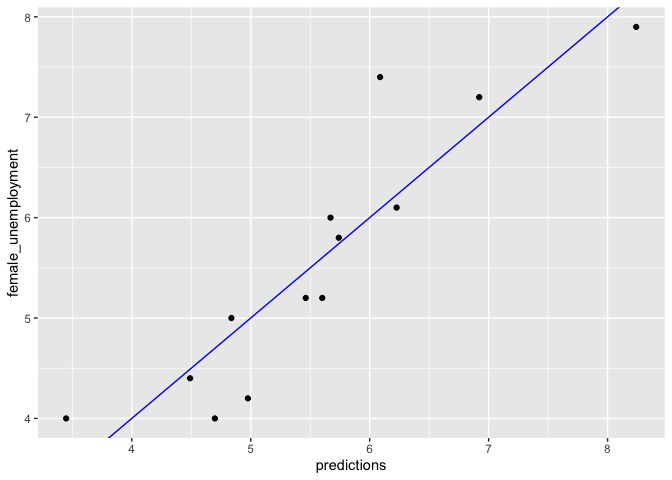<!-- -->

``` r
# Predict female unemployment rate when male unemployment is 5%
newrates <- tibble(male_unemployment = 5)

pred <- predict(unemployment_model, newdata = newrates)
# Print it
pred
```

    ##        1 
    ## 4.906757

Good job! While all the modeling algorithms in R implement the
`predict()` method, the call may be a little different for each one.

## Multivariate linear regression (Part 1)

In this exercise, you will work with the blood pressure dataset
(<a href="https://college.cengage.com/mathematics/brase/understandable_statistics/7e/students/datasets/mlr/frames/frame.html">Source</a>),
and model `blood_pressure` as a function of `weight` and `age`.

``` r
# Load data
bloodpressure <- readRDS("data/bloodpressure.rds")

# bloodpressure is in the workspace
summary(bloodpressure)
```

    ##  blood_pressure       age            weight   
    ##  Min.   :128.0   Min.   :46.00   Min.   :167  
    ##  1st Qu.:140.0   1st Qu.:56.50   1st Qu.:186  
    ##  Median :153.0   Median :64.00   Median :194  
    ##  Mean   :150.1   Mean   :62.45   Mean   :195  
    ##  3rd Qu.:160.5   3rd Qu.:69.50   3rd Qu.:209  
    ##  Max.   :168.0   Max.   :74.00   Max.   :220

**Steps**

1.  Define a formula that expresses `blood_pressure` explicitly as a
    function of `age` and `weight`. Assign the formula to the variable
    `fmla`.
2.  Use `fmla` to fit a linear model to predict `blood_pressure` from
    `age` and `weight` in the data set `bloodpressure`. Call the model
    `bloodpressure_model`.
3.  Print the model and call `summary()` on it. Does blood pressure
    increase or decrease with age? With weight?

``` r
# Create the formula and print it
fmla <- blood_pressure ~ age + weight

# Fit the model: bloodpressure_model
bloodpressure_model <- lm(fmla, data = bloodpressure)

# Print bloodpressure_model and call summary()
bloodpressure_model
```

    ## 
    ## Call:
    ## lm(formula = fmla, data = bloodpressure)
    ## 
    ## Coefficients:
    ## (Intercept)          age       weight  
    ##     30.9941       0.8614       0.3349

``` r
summary(bloodpressure_model)
```

    ## 
    ## Call:
    ## lm(formula = fmla, data = bloodpressure)
    ## 
    ## Residuals:
    ##     Min      1Q  Median      3Q     Max 
    ## -3.4640 -1.1949 -0.4078  1.8511  2.6981 
    ## 
    ## Coefficients:
    ##             Estimate Std. Error t value Pr(>|t|)   
    ## (Intercept)  30.9941    11.9438   2.595  0.03186 * 
    ## age           0.8614     0.2482   3.470  0.00844 **
    ## weight        0.3349     0.1307   2.563  0.03351 * 
    ## ---
    ## Signif. codes:  0 '***' 0.001 '**' 0.01 '*' 0.05 '.' 0.1 ' ' 1
    ## 
    ## Residual standard error: 2.318 on 8 degrees of freedom
    ## Multiple R-squared:  0.9768, Adjusted R-squared:  0.9711 
    ## F-statistic: 168.8 on 2 and 8 DF,  p-value: 2.874e-07

Good! One of the advantages of linear regression is that you can
interpret the effects of each variable on the input – to a certain
extent. In this case the coefficients for both age and weight are
positive, which indicates that bloodpressure tends to increase as both
age and weight increase.

## Multivariate linear regression (Part 2)

Now you will make predictions using the blood pressure model
`bloodpressure_model` that you fit in the previous exercise.

You will also compare the predictions to outcomes graphically. `ggplot2`
is already loaded in your workspace. Recall the plot command takes the
form:

``` r
ggplot(dframe, aes(x = pred, y = outcome)) + 
     geom_point() + 
     geom_abline(color = "blue")
```

**Steps**

1.  Use `predict()` to predict blood pressure in the `bloodpressure`
    dataset. Assign the predictions to the column `prediction`.
2.  Graphically compare the predictions to actual blood pressures. Put
    predictions on the x axis. How close are the results to the line of
    perfect prediction?

``` r
# predict blood pressure using bloodpressure_model :prediction
bloodpressure$prediction <- predict(bloodpressure_model)

# plot the results
ggplot(bloodpressure, aes(x = prediction, y = blood_pressure)) + 
    geom_point() +
    geom_abline(color = "blue")
```

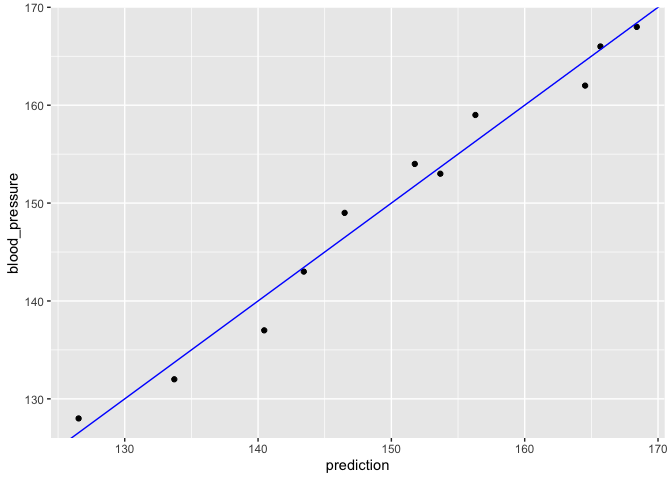<!-- -->

Good! The results stay fairly close to the line of perfect prediction,
indicating that the model fits the training data well. From a prediction
perspective, multivariate linear regression behaves much as simple
(one-variable) linear regression does.

## Wrapping up linear regression

Theory. Coming soon …

# 2. Training and Evaluating Regression Models

Now that we have learned how to fit basic linear regression models, we
will learn how to evaluate how well our models perform. We will review
evaluating a model graphically, and look at two basic metrics for
regression models. We will also learn how to train a model that will
perform well in the wild, not just on training data. Although we will
demonstrate these techniques using linear regression, all these concepts
apply to models fit with any regression algorithm.

## Evaluating a model graphically

Theory. Coming soon …

## Graphically evaluate the unemployment model

In this exercise you will graphically evaluate the unemployment model,
`unemployment_model`, that you fit to the `unemployment` data in the
previous chapter. Recall that the model predicts `female_unemployment`
from `male_unemployment`.

You will plot the model’s predictions against the actual
`female_unemployment`; recall the command is of the form

``` r
ggplot(dframe, aes(x = pred, y = outcome)) + 
       geom_point() +  
       geom_abline()
```

Then you will calculate the residuals:

``` r
residuals <- actual outcome - predicted outcome
```

and plot predictions against residuals. The residual graph will take a
slightly different form: you compare the residuals to the horizontal
line x=0 (using `geom_hline()`) rather than to the line x=y. The command
will be provided.

The data frame `unemployment` and model `unemployment_model` are
available in the workspace.

**Steps**

1.  Use `predict()` to get the model predictions and add them to
    `unemployment` as the column `predictions`.
2.  Plot predictions (on the x-axis) versus actual female unemployment
    rates. Are the predictions near the \\(x=y\\) line?

``` r
unemployment$predictions <- predict(unemployment_model)

# Fill in the blanks to plot predictions (on x-axis) versus the female_unemployment rates
ggplot(unemployment, aes(x = predictions, y = female_unemployment)) + 
  geom_point() + 
  geom_abline()
```

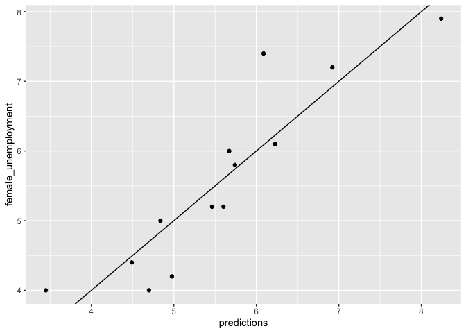<!-- -->

3.  Calculate the residuals between the predictions and actual
    unemployment rates. Add these residuals to `unemployment` as the
    column `residuals`.
4.  Fill in the blanks to plot predictions (on the x-axis) versus
    residuals (on the y-axis). *This gives you a different view of the
    model’s predictions as compared to ground truth.*

``` r
# Calculate residuals
unemployment$residuals <- unemployment$female_unemployment - unemployment$predictions

# Fill in the blanks to plot predictions (on x-axis) versus the residuals
ggplot(unemployment, aes(x = predictions, y = residuals)) + 
  geom_pointrange(aes(ymin = 0, ymax = residuals)) + 
  geom_hline(yintercept = 0, linetype = 3) + 
  ggtitle("residuals vs. linear model prediction")
```

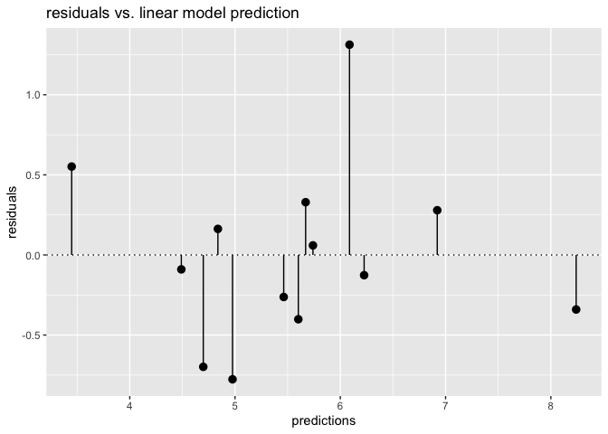<!-- -->

Congratulations! You have now evaluated model predictions by comparing
them to ground truth, and by examining prediction error.

## The gain curve to evaluate the unemployment model

In the previous exercise you made predictions about
`female_unemployment` and visualized the predictions and the residuals.
Now, you will also plot the gain curve of the `unemployment_model`’s
predictions against actual `female_unemployment` using the
<a href="https://www.rdocumentation.org/packages/WVPlots/topics/GainCurvePlot">`WVPlots::GainCurvePlot()`</a>
function.

For situations where order is more important than exact values, the gain
curve helps you check if the model’s predictions sort in the same order
as the true outcome.

Calls to the function `GainCurvePlot()` look like:

``` r
GainCurvePlot(frame, xvar, truthvar, title)
```

where

-   `frame` is a data frame
-   `xvar` and `truthvar` are strings naming the prediction and actual
    outcome columns of `frame`
-   `title` is the title of the plot

When the predictions sort in exactly the same order, the relative Gini
coefficient is 1. When the model sorts poorly, the relative Gini
coefficient is close to zero, or even negative.

**Steps**

1.  Load the package `WVPlots` using `library()`.
2.  Plot the gain curve. Give the plot the title “Unemployment model”.
    Do the model’s predictions sort correctly?

``` r
# Load the package WVPlots
library(WVPlots)
```

    ## Loading required package: wrapr

    ## 
    ## Attaching package: 'wrapr'

    ## The following object is masked from 'package:tibble':
    ## 
    ##     view

``` r
# Plot the Gain Curve
GainCurvePlot(unemployment, "predictions", "female_unemployment", "Unemployment model")
```

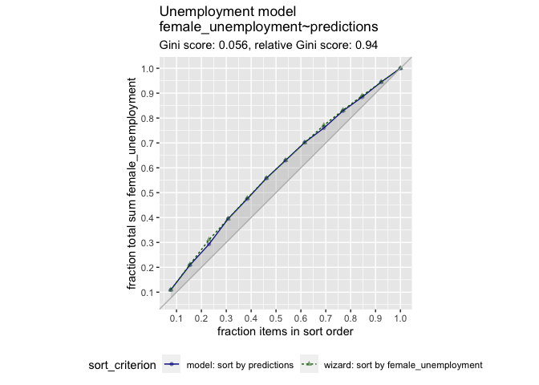<!-- -->

Congratulations! A relative gini coefficient close to one shows that the
model correctly sorts high unemployment situations from lower ones.

## Root Mean Squared Error (RMSE)

Theory. Coming soon …

## Calculate RMSE

In this exercise you will calculate the RMSE of your unemployment model.
In the previous coding exercises, you added two columns to the
`unemployment` dataset:

-   the model’s predictions (`predictions` column)
-   the residuals between the predictions and the outcome (`residuals`
    column) You can calculate the RMSE from a vector of residuals,
    \\(res\\), as:


You want RMSE to be small. How small is “small”? One heuristic is to
compare the RMSE to the standard deviation ofthe outcome. With a good
model, the RMSE should be smaller.

**Steps**

1.  Review the `unemployment` data from the previous exercise.

2.  For convenience, assign the `residuals` column from `unemployment`
    to the variable `res`.

3.  Calculate RMSE: square `res`, take its mean, and then square root
    it. Assign this to the variable`rmse` and print it.: you can do this
    in one step by wrapping the assignment in parentheses: \`(rmse

    -   Tip: you can do this in one step by wrapping the assignment in
        parentheses: \`(rmse

4.  Calculate the standard deviation of `female_unemployment` and assign
    it to the variable `sd_unemployment`. Print it.How does the rmse of
    the model compare to the standard deviation of the data?\*

``` r
# For convenience put the residuals in the variable res
res <- unemployment$residuals

# Calculate RMSE, assign it to the variable rmse and print it
(rmse <- sqrt(mean(res^2)))
```

    ## [1] 0.5337612

``` r
# Calculate the standard deviation of female_unemployment and print it
(sd_unemployment <- sd(unemployment$female_unemployment))
```

    ## [1] 1.314271

Good job! An RMSE much smaller than the outcome’s standard deviation
suggests a model that predicts well.

## R-Squared

Theory. Coming soon …

## Calculate R-squared

Now that you’ve calculated the RMSE of your model’s predictions, you
will examine how well the model fits the data: that is, how much
variance does it explain. You can do this using \\(R^2\\).

Suppose y is the true outcome, p is the prediction from the model, and
res = y - p are the residuals of the predictions.

Then the total sum of squares tss (“total variance”) of the data is:


where overline{y} is the mean value of y.

The residual sum of squared errors of the model, rss is:


R^2 (R-squared), the “variance explained” by the model, is then:


After you calculate R^2, you will compare what you computed with the R^2
reported by
<a href="https://www.rdocumentation.org/packages/broom/topics/glance">`glance()`</a>.
`glance()` returns a one-row data frame; for a linear regression model,
one of the columns returned is the R^2 of the model on the training
data.

The data frame `unemployment` is in your workspace, with the columns
`predictions` and `residuals` that you calculated in a previous
exercise.

**Steps**

1.  Calculate the mean `female_unemployment` and assign it to the
    variable `fe_mean`.
2.  Calculate the total sum of squares and assign it to the variable
    `tss`.
3.  Calculate the residual sum of squares and assign it to the variable
    `rss`.
4.  Calculate \\(R^2\\). Is it a good fit (\\(R^2\\) near 1)?
5.  Use `glance()` to get \\(R^2\\) from the model. *Is it the same as
    what you calculated?*

``` r
# Calculate mean female_unemployment: fe_mean. Print it
(fe_mean <- mean(unemployment$female_unemployment))
```

    ## [1] 5.569231

``` r
# Calculate total sum of squares: tss. Print it
(tss <- sum( (unemployment$female_unemployment - fe_mean)^2 ))
```

    ## [1] 20.72769

``` r
# Calculate residual sum of squares: rss. Print it
(rss <- sum(unemployment$residuals^2))
```

    ## [1] 3.703714

``` r
# Calculate R-squared: rsq. Print it. Is it a good fit?
(rsq <- 1 - (rss/tss))
```

    ## [1] 0.8213157

``` r
# Get R-squared from glance. Print it
(rsq_glance <- glance(unemployment_model)$r.squared)
```

    ## [1] 0.8213157

Excellent! An R-squared close to one suggests a model that predicts
well.

## Correlation and R-squared

The linear correlation of two variables, \\(x\\) and \\(y\\), measures
the strength of the linear relationship between them. When \\(x\\) and
\\(y\\) are respectively:

-   the outcomes of a regression model that minimizes squared-error
    (like linear regression) and
-   the true outcomes *of the training data*, then the square of the
    correlation is the same as \\(R^2\\). You will verify that in this
    exercise.

**Steps**

1.  Use `cor()` to get the correlation between the predictions and
    female unemployment. Assign it to the variable `rho` and print it.
    Make sure you use Pearson correlation (the default).
2.  Square `rho` and assign it to `rho2`. Print it.
3.  Compare `rho2` to \\(R^2\\) from the model (using `glance()`). Is it
    the same?

``` r
# Get the correlation between the prediction and true outcome: rho and print it
(rho <- cor(unemployment$predictions, unemployment$female_unemployment))
```

    ## [1] 0.9062647

``` r
# Square rho: rho2 and print it
(rho2 <- rho ^ 2)
```

    ## [1] 0.8213157

``` r
# Get R-squared from glance and print it
(rsq_glance <- glance(unemployment_model)$r.squared)
```

    ## [1] 0.8213157

Success! Remember this equivalence is only true for the training data,
and only for models that minimize squared error.

## Properly Training a Model

Theory. Coming soon …

## Generating a random test/train split

For the next several exercises you will use the `mpg` data from the
package `ggplot2`. The data describes the characteristics of several
makes and models of cars from different years. The goal is to predict
city fuel efficiency from highway fuel efficiency.

In this exercise, you will split `mpg` into a training set `mpg_train`
(75% of the data) and a test set `mpg_test` (25% of the data). One way
to do this is to generate a column of uniform random numbers between 0
and 1, using the function
<a href="https://www.rdocumentation.org/packages/stats/topics/Uniform">`runif()`</a>.

If you have a data set `dframe` of size N, and you want a random subset
of approximately size 100 \* X% of N (where X is between 0 and 1), then:

1.  Generate a vector of uniform random numbers: `gp = runif(N)`.
2.  `dframe[gp < X,]` will be about the right size.
3.  `dframe[gp >= X,]` will be the complement.

**Steps**

1.  Use the function `nrow` to get the number of rows in the data frame
    `mpg`. Assign this count to the variable `N` and print it.
2.  Calculate about how many rows 75% of N should be. Assign it to the
    variable `target` and print it.
3.  Use `runif()` to generate a vector of `N` uniform random numbers,
    called `gp`.
4.  Use `gp` to split `mpg` into `mpg_train` and `mpg_test` (with
    `mpg_train` containing approximately 75% of the data).
5.  Use `nrow()` to check the size of `mpg_train` and `mpg_test`. Are
    they about the right size?

``` r
# Use nrow to get the number of rows in mpg (N) and print it
(N <- nrow(mpg))
```

    ## [1] 234

``` r
# Calculate how many rows 75% of N should be and print it
# Hint: use round() to get an integer
(target <- round(N * 0.75))
```

    ## [1] 176

``` r
# Create the vector of N uniform random variables: gp
gp <- runif(N)

# Use gp to create the training set: mpg_train (75% of data) and mpg_test (25% of data)
mpg_train <- mpg[gp < 0.75, ]
mpg_test  <- mpg[gp >= 0.75, ]

# Use nrow() to examine mpg_train and mpg_test
nrow(mpg_train)
```

    ## [1] 168

``` r
nrow(mpg_test)
```

    ## [1] 66

Great job! A random split won’t always produce sets of exactly X% and
(100-X)% of the data, but it should be close.

## Train a model using test/train split

Now that you have split the `mpg` dataset into `mpg_train` and
`mpg_test`, you will use `mpg_train` to train a model to predict city
fuel efficiency (`cty`) from highway fuel efficiency (`hwy`).

**Steps**

1.  Create a formula `fmla` that expresses the relationship `cty` as a
    function of `hwy`. Print it.
2.  Train a model `mpg_model` on `mpg_train` to predict `cty` from `hwy`
    using `fmla` and `lm()`.
3.  Use `summary()` to examine the model.

``` r
# create a formula to express cty as a function of hwy: fmla and print it.
(fmla <- as.formula("cty ~ hwy"))
```

    ## cty ~ hwy

``` r
# Now use lm() to build a model mpg_model from mpg_train that predicts cty from hwy 
mpg_model <- lm(fmla, data = mpg_train)

# Use summary() to examine the model
summary(mpg_model)
```

    ## 
    ## Call:
    ## lm(formula = fmla, data = mpg_train)
    ## 
    ## Residuals:
    ##     Min      1Q  Median      3Q     Max 
    ## -2.9434 -0.7338 -0.0076  0.7502  4.5080 
    ## 
    ## Coefficients:
    ##             Estimate Std. Error t value Pr(>|t|)    
    ## (Intercept)  0.60400    0.40348   1.497    0.136    
    ## hwy          0.69358    0.01671  41.498   <2e-16 ***
    ## ---
    ## Signif. codes:  0 '***' 0.001 '**' 0.01 '*' 0.05 '.' 0.1 ' ' 1
    ## 
    ## Residual standard error: 1.271 on 166 degrees of freedom
    ## Multiple R-squared:  0.9121, Adjusted R-squared:  0.9115 
    ## F-statistic:  1722 on 1 and 166 DF,  p-value: < 2.2e-16

Great! Now it’s time to apply the model.

## Evaluate a model using test/train split

Now you will test the model `mpg_model` on the test data, `mpg_test`.
Functions `rmse()` and `r_squared()` to calculate RMSE and R-squared
have been provided for convenience:

``` r
rmse(predcol, ycol)
r_squared(predcol, ycol)
```

where:

-   predcol: The predicted values
-   ycol: The actual outcome You will also plot the predictions vs. the
    outcome.

Generally, model performance is better on the training data than the
test data (though sometimes the test set “gets lucky”). A slight
difference in performance is okay; if the performance on training is
significantly better, there is a problem.

**Steps**

1.  Predict city fuel efficiency from `hwy` on the `mpg_train` data.
    Assign the predictions to the column `pred`.
2.  Predict city fuel efficiency from `hwy` on the `mpg_test` data.
    Assign the predictions to the column `pred`.
3.  Use `rmse()` to evaluate rmse for both the test and training sets.
    Compare. Are the performances similar?
4.  Do the same with `r_squared()`. Are the performances similar?
5.  Use `ggplot2` to plot the predictions against `cty` on the `test`
    data.

``` r
# rmse & r_squared function
rmse <- function(predcol, ycol) {
  res = predcol-ycol
  sqrt(mean(res^2))
}

r_squared <- function(predcol, ycol) {
  tss = sum( (ycol - mean(ycol))^2 )
  rss = sum( (predcol - ycol)^2 )
  1 - rss/tss
}

# predict cty from hwy for the training set
mpg_train$pred <- predict(mpg_model)

# predict cty from hwy for the test set
mpg_test$pred <- predict(mpg_model, newdata = mpg_test)

# Evaluate the rmse on both training and test data and print them
(rmse_train <- rmse(mpg_train$pred, mpg_train$cty))
```

    ## [1] 1.263402

``` r
(rmse_test  <- rmse(mpg_test$pred, mpg_test$cty))
```

    ## [1] 1.209977

``` r
# Evaluate the r-squared on both training and test data.and print them
(rsq_train <- r_squared(mpg_train$pred, mpg_train$cty))
```

    ## [1] 0.9120783

``` r
(rsq_test <- r_squared(mpg_test$pred, mpg_test$cty))
```

    ## [1] 0.9174311

``` r
# Plot the predictions (on the x-axis) against the outcome (cty) on the test data
ggplot(mpg_test, aes(x = pred, y = cty)) + 
  geom_point() + 
  geom_abline()
```

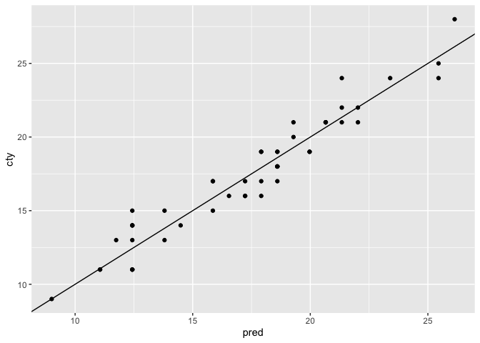<!-- -->

Excellent! Good performance on the test data is more confirmation that
the model works as expected.

## Create a cross validation plan

There are several ways to implement an n-fold cross validation plan. In
this exercise you will create such a plan using
`vtreat::kWayCrossValidation()`, and examine it.

`kWayCrossValidation()` creates a cross validation plan with the
following call:

``` r
splitPlan <- kWayCrossValidation(nRows, nSplits, dframe, y)
```

where `nRows` is the number of rows of data to be split, and `nSplits`
is the desired number of cross-validation folds.

Strictly speaking, `dframe` and `y` aren’t used by
`kWayCrossValidation`; they are there for compatibility with other
`vtreat` data partitioning functions. You can set them both to `NULL`.

The resulting `splitPlan` is a list of `nSplits` elements; each element
contains two vectors:

-   `train`: the indices of `dframe` that will form the training set
-   `app`: the indices of `dframe` that will form the test (or
    application) set

In this exercise you will create a 3-fold cross-validation plan for the
data set `mpg`.

**Steps**

1.  Load the package `vtreat`.

2.  Get the number of rows in `mpg` and assign it to the variable
    `nRows`.

3.  Call `kWayCrossValidation` to create a 3-fold cross validation plan
    and assign it to the variable `splitPlan`.can set the last two
    arguments of the function to `NULL`.

    -   You can set the last two arguments of the function to `NULL`.

4.  Call `str()` to examine the structure of `splitPlan`.

``` r
# Load the package vtreat
library(vtreat)

# mpg is in the workspace
summary(mpg)
```

    ##  manufacturer          model               displ            year     
    ##  Length:234         Length:234         Min.   :1.600   Min.   :1999  
    ##  Class :character   Class :character   1st Qu.:2.400   1st Qu.:1999  
    ##  Mode  :character   Mode  :character   Median :3.300   Median :2004  
    ##                                        Mean   :3.472   Mean   :2004  
    ##                                        3rd Qu.:4.600   3rd Qu.:2008  
    ##                                        Max.   :7.000   Max.   :2008  
    ##       cyl           trans               drv                 cty       
    ##  Min.   :4.000   Length:234         Length:234         Min.   : 9.00  
    ##  1st Qu.:4.000   Class :character   Class :character   1st Qu.:14.00  
    ##  Median :6.000   Mode  :character   Mode  :character   Median :17.00  
    ##  Mean   :5.889                                         Mean   :16.86  
    ##  3rd Qu.:8.000                                         3rd Qu.:19.00  
    ##  Max.   :8.000                                         Max.   :35.00  
    ##       hwy             fl               class          
    ##  Min.   :12.00   Length:234         Length:234        
    ##  1st Qu.:18.00   Class :character   Class :character  
    ##  Median :24.00   Mode  :character   Mode  :character  
    ##  Mean   :23.44                                        
    ##  3rd Qu.:27.00                                        
    ##  Max.   :44.00

``` r
# Get the number of rows in mpg
nRows <- nrow(mpg)

# Implement the 3-fold cross-fold plan with vtreat
splitPlan <- kWayCrossValidation(nRows, 3, NULL, NULL)

# Examine the split plan
str(splitPlan)
```

    ## List of 3
    ##  $ :List of 2
    ##   ..$ train: int [1:156] 3 6 7 8 9 10 11 12 14 16 ...
    ##   ..$ app  : int [1:78] 55 2 41 196 136 208 154 118 47 181 ...
    ##  $ :List of 2
    ##   ..$ train: int [1:156] 1 2 4 5 6 9 10 13 14 15 ...
    ##   ..$ app  : int [1:78] 34 79 165 120 51 75 35 87 30 82 ...
    ##  $ :List of 2
    ##   ..$ train: int [1:156] 1 2 3 4 5 7 8 11 12 13 ...
    ##   ..$ app  : int [1:78] 90 135 167 152 211 65 124 16 108 149 ...
    ##  - attr(*, "splitmethod")= chr "kwaycross"

Congratulations! You have created a 3-way cross validation plan. In the
next exercise you will use this plan to evaluate a potential model.

## Evaluate a modeling procedure using n-fold cross-validation

In this exercise you will use `splitPlan`, the 3-fold cross validation
plan from the previous exercise, to make predictions from a model that
predicts `mpg$cty` from `mpg$hwy`.

If `dframe` is the training data, then one way to add a column of
cross-validation predictions to the frame is as follows:

``` r
# Initialize a column of the appropriate length
dframe$pred.cv <- 0 

# k is the number of folds
# splitPlan is the cross validation plan

for(i in 1:k) {
  # Get the ith split
  split <- splitPlan[[i]]

  # Build a model on the training data 
  # from this split 
  # (lm, in this case)
  model <- lm(fmla, data = dframe[split$train,])

  # make predictions on the 
  # application data from this split
  dframe$pred.cv[split$app] <- predict(model, newdata = dframe[split$app,])
}
```

Cross-validation predicts how well a model built from all the data will
perform on new data. As with the test/train split, for a good modeling
procedure, cross-validation performance and training performance should
be close.

**Steps**

1.  Run the 3-fold cross validation plan from `splitPlan` and put the
    predictions in the column `mpg$pred.cv`.`lm()` and the formula
    `cty ~ hwy`.
2.  Use `lm()` and the formula `cty ~ hwy`.
3.  Create a linear regression model on all the `mpg` data (formula
    `cty ~ hwy`) and assign the predictions to `mpg$pred`.
4.  Use `rmse()` to get the root mean squared error of the predictions
    from the full model (`mpg$pred`). *Recall that `rmse()` takes two
    arguments, the predicted values, and the actual outcome.*
5.  Get the root mean squared error of the cross-validation predictions.
    Are the two values about the same?

``` r
# Run the 3-fold cross validation plan from splitPlan
k <- 3 # Number of folds
mpg$pred.cv <- 0 
for(i in 1:k) {
  split <- splitPlan[[i]]
  model <- lm(cty ~ hwy, data = mpg[split$train, ])
  mpg$pred.cv[split$app] <- predict(model, newdata = mpg[split$app, ])
}

# Predict from a full model
mpg$pred <- predict(lm(cty ~ hwy, data = mpg))

# Get the rmse of the full model's predictions
rmse(mpg$pred, mpg$cty)
```

    ## [1] 1.247045

``` r
# Get the rmse of the cross-validation predictions
rmse(mpg$pred.cv, mpg$cty)
```

    ## [1] 1.25165

Congratulations! You have successfully estimated a model’s out-of-sample
error via cross-validation. Remember, cross-validation validates the
*modeling process*, not an actual model.

# 3. Issues to Consider

Before moving on to more sophisticated regression techniques, we will
look at some other modeling issues: modeling with categorical inputs,
interactions between variables, and when you might consider transforming
inputs and outputs before modeling. While more sophisticated regression
techniques manage some of these issues automatically, it’s important to
be aware of them, in order to understand which methods best handle
various issues – and which issues you must still manage yourself.

## Categorical inputs

Theory. Coming soon …

## Examining the structure of categorical inputs

For this exercise you will call
<a href="https://www.rdocumentation.org/packages/stats/topics/model.matrix">`model.matrix()`</a>
to examine how R represents data with both categorical and numerical
inputs for modeling. The dataset `flowers` (derived from the `Sleuth3`
package) is loaded into your workspace. It has the following columns:

-   `Flowers`: the average number of flowers on a *meadowfoam* plant
-   `Intensity`: the intensity of a light treatment applied to the plant
-   `Time`: A categorical variable - when (`Late` or `Early`) in the
    lifecycle the light treatment occurred

The ultimate goal is to predict `Flowers` as a function of `Time` and
`Intensity`.

**Steps**

1.  Call the `str()` function on `flowers` to see the types of each
    column.

2.  Use the `unique()` function on the column `flowers$Time` to see the
    possible values that `Time` takes. How many unique values are there?

3.  Create a formula to express `Flowers` as a function of `Intensity`
    and `Time`. Assign it to the variable `fmla` and print it.

4.  Use `fmla` and `model.matrix()` to create the model matrix for the
    data frame `flowers`. Assign it to the variable `mmat`.

5.  Use `head()` to examine the first 20 lines of `flowers`.

6.  Now examine the first 20 lines of `mmat`.the numeric column
    `Intensity` different?happened to the categorical column `Time` from
    `flowers`?is `Time == 'Early'` represented? And `Time == 'Late'`?

    -   Is the numeric column `Intensity` different?
    -   What happened to the categorical column `Time` from `flowers`?
    -   How is `Time == 'Early'` represented? And `Time == 'Late'`?

``` r
# Load packages
library(dplyr)
```

    ## 
    ## Attaching package: 'dplyr'

    ## The following object is masked from 'package:wrapr':
    ## 
    ##     coalesce

    ## The following objects are masked from 'package:stats':
    ## 
    ##     filter, lag

    ## The following objects are masked from 'package:base':
    ## 
    ##     intersect, setdiff, setequal, union

``` r
# Load flowers
flowers <- Sleuth3::case0901 |> 
              as_tibble() |> 
              mutate(Time = case_when(Time == 1 ~ "Late",
                                      Time == 2 ~ "Early"))

# Call str on flowers to see the types of each column
str(flowers)
```

    ## tibble [24 × 3] (S3: tbl_df/tbl/data.frame)
    ##  $ Flowers  : num [1:24] 62.3 77.4 55.3 54.2 49.6 61.9 39.4 45.7 31.3 44.9 ...
    ##  $ Time     : chr [1:24] "Late" "Late" "Late" "Late" ...
    ##  $ Intensity: int [1:24] 150 150 300 300 450 450 600 600 750 750 ...

``` r
# Use unique() to see how many possible values Time takes
unique(flowers$Time)
```

    ## [1] "Late"  "Early"

``` r
# Build a formula to express Flowers as a function of Intensity and Time: fmla. Print it
(fmla <- as.formula("Flowers ~ Intensity + Time"))
```

    ## Flowers ~ Intensity + Time

``` r
# Use fmla and model.matrix to see how the data is represented for modeling
mmat <- model.matrix(fmla, flowers)

# Examine the first 20 lines of flowers
head(flowers, n = 20)
```

    ## # A tibble: 20 × 3
    ##    Flowers Time  Intensity
    ##      <dbl> <chr>     <int>
    ##  1    62.3 Late        150
    ##  2    77.4 Late        150
    ##  3    55.3 Late        300
    ##  4    54.2 Late        300
    ##  5    49.6 Late        450
    ##  6    61.9 Late        450
    ##  7    39.4 Late        600
    ##  8    45.7 Late        600
    ##  9    31.3 Late        750
    ## 10    44.9 Late        750
    ## 11    36.8 Late        900
    ## 12    41.9 Late        900
    ## 13    77.8 Early       150
    ## 14    75.6 Early       150
    ## 15    69.1 Early       300
    ## 16    78   Early       300
    ## 17    57   Early       450
    ## 18    71.1 Early       450
    ## 19    62.9 Early       600
    ## 20    52.2 Early       600

``` r
# Examine the first 20 lines of mmat
head(mmat, n = 20)
```

    ##    (Intercept) Intensity TimeLate
    ## 1            1       150        1
    ## 2            1       150        1
    ## 3            1       300        1
    ## 4            1       300        1
    ## 5            1       450        1
    ## 6            1       450        1
    ## 7            1       600        1
    ## 8            1       600        1
    ## 9            1       750        1
    ## 10           1       750        1
    ## 11           1       900        1
    ## 12           1       900        1
    ## 13           1       150        0
    ## 14           1       150        0
    ## 15           1       300        0
    ## 16           1       300        0
    ## 17           1       450        0
    ## 18           1       450        0
    ## 19           1       600        0
    ## 20           1       600        0

Now you have seen how most R modeling functions represent categorical
variables internally.

## Modeling with categorical inputs

For this exercise you will fit a linear model to the `flowers` data, to
predict `Flowers` as a function of `Time` and `Intensity`.

The model formula `fmla` that you created in the previous exercise is
still in your workspace, as is the model matrix `mmat`.

**Steps**

1.  Use `fmla` and `lm` to train a linear model that predicts `Flowers`
    from `Intensity` and `Time`. Assign the model to the variable
    `flower_model`.
2.  Use `summary()` to remind yourself of the structure of `mmat`.
3.  Use `summary()` to examine the `flower_model`. Do the variables
    match what you saw in `mmat`?
4.  Use `flower_model` to predict the number of flowers. Add the
    predictions to `flowers` as the column `predictions`.
5.  Fill in the blanks to plot predictions vs. actual flowers
    (predictions on the x-axis).

``` r
# Fit a model to predict Flowers from Intensity and Time : flower_model
flower_model <-  lm(fmla, data = flowers)

# Use summary on mmat to remind yourself of its structure
summary(mmat)
```

    ##   (Intercept)   Intensity      TimeLate  
    ##  Min.   :1    Min.   :150   Min.   :0.0  
    ##  1st Qu.:1    1st Qu.:300   1st Qu.:0.0  
    ##  Median :1    Median :525   Median :0.5  
    ##  Mean   :1    Mean   :525   Mean   :0.5  
    ##  3rd Qu.:1    3rd Qu.:750   3rd Qu.:1.0  
    ##  Max.   :1    Max.   :900   Max.   :1.0

``` r
# Use summary to examine the flower_model
summary(flower_model)
```

    ## 
    ## Call:
    ## lm(formula = fmla, data = flowers)
    ## 
    ## Residuals:
    ##    Min     1Q Median     3Q    Max 
    ## -9.652 -4.139 -1.558  5.632 12.165 
    ## 
    ## Coefficients:
    ##               Estimate Std. Error t value Pr(>|t|)    
    ## (Intercept)  83.464167   3.273772  25.495  < 2e-16 ***
    ## Intensity    -0.040471   0.005132  -7.886 1.04e-07 ***
    ## TimeLate    -12.158333   2.629557  -4.624 0.000146 ***
    ## ---
    ## Signif. codes:  0 '***' 0.001 '**' 0.01 '*' 0.05 '.' 0.1 ' ' 1
    ## 
    ## Residual standard error: 6.441 on 21 degrees of freedom
    ## Multiple R-squared:  0.7992, Adjusted R-squared:   0.78 
    ## F-statistic: 41.78 on 2 and 21 DF,  p-value: 4.786e-08

``` r
# predict the number of flowers on each plant
flowers$predictions <- predict(flower_model)

# Plot predictions vs actual flowers (predictions on x-axis)
ggplot(flowers, aes(x = predictions, y = Flowers)) + 
  geom_point() +
  geom_abline(color = "blue")
```

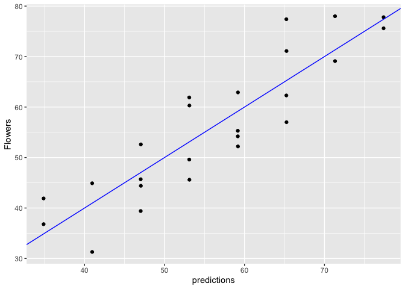<!-- -->

Congratulations! You’ve successfully fit a model with a categorical
variable, and seen how categorical variables are represented in that
model.

## Interactions

Theory. Coming soon …

## Modeling an interaction

In this exercise you will use interactions to model the effect of gender
and gastric activity on alcohol metabolism.

The data frame `alcohol` has columns:

-   `Metabol`: the alcohol metabolism rate
-   `Gastric`: the rate of gastric alcohol dehydrogenase activity
-   `Sex`: the sex of the drinker (`Male` or `Female`)

In the video, we fit three models to the `alcohol` data:

-   one with only additive (main effect) terms :
    `Metabol ~ Gastric + Sex`
-   two models, each with interactions between gastric activity and sex

We saw that one of the models with interaction terms had a better
R-squared than the additive model, suggesting that using interaction
terms gives a better fit. In this exercise we will compare the R-squared
of one of the interaction models to the main-effects-only model.

Recall that the operator `:` designates the interaction between two
variables. The operator `*` designates the interaction between the two
variables, plus the main effects.

``` r
x*y = x + y + x:y
```

**Steps**

1.  Write a formula that expresses `Metabol` as a function of `Gastric`
    and `Sex` with no interactions.the formula to the variable
    `fmla_add` and print it.

    -   Assign the formula to the variable `fmla_add` and print it.

2.  -   Write a formula that expresses `Metabol` as a function of the
        interaction between `Gastric` and `Sex`. `Gastric` as a main
        effect, but not `Sex`. the formula to the variable
        `fmla_interaction` and print it.

    -   Add `Gastric` as a main effect, but not `Sex`.

    -   Assign the formula to the variable `fmla_interaction` and print
        it.

3.  Fit a linear model with only main effects: `model_add` to the data.

4.  Fit a linear model with the interaction: `model_interaction` to the
    data.

5.  Call `summary()` on both models. Which has a better R-squared?

``` r
# Load data
alcohol <- readRDS("data/alcohol.rds")
summary(alcohol)
```

    ##     Subject         Metabol          Gastric          Sex           
    ##  Min.   : 1.00   Min.   : 0.100   Min.   :0.800   Length:32         
    ##  1st Qu.: 8.75   1st Qu.: 0.600   1st Qu.:1.200   Class :character  
    ##  Median :16.50   Median : 1.700   Median :1.600   Mode  :character  
    ##  Mean   :16.50   Mean   : 2.422   Mean   :1.863                     
    ##  3rd Qu.:24.25   3rd Qu.: 2.925   3rd Qu.:2.200                     
    ##  Max.   :32.00   Max.   :12.300   Max.   :5.200                     
    ##    Alcohol         
    ##  Length:32         
    ##  Class :character  
    ##  Mode  :character  
    ##                    
    ##                    
    ## 

``` r
# Create the formula with main effects only
(fmla_add <- Metabol ~ Gastric + Sex)
```

    ## Metabol ~ Gastric + Sex

``` r
# Create the formula with interactions
(fmla_interaction <- Metabol ~  Gastric + Gastric:Sex)
```

    ## Metabol ~ Gastric + Gastric:Sex

``` r
# Fit the main effects only model
model_add <- lm(fmla_add, data = alcohol)

# Fit the interaction model
model_interaction <- lm(fmla_interaction, data = alcohol)

# Call summary on both models and compare
summary(model_add)
```

    ## 
    ## Call:
    ## lm(formula = fmla_add, data = alcohol)
    ## 
    ## Residuals:
    ##     Min      1Q  Median      3Q     Max 
    ## -2.2779 -0.6328 -0.0966  0.5783  4.5703 
    ## 
    ## Coefficients:
    ##             Estimate Std. Error t value Pr(>|t|)    
    ## (Intercept)  -1.9466     0.5198  -3.745 0.000796 ***
    ## Gastric       1.9656     0.2674   7.352 4.24e-08 ***
    ## SexMale       1.6174     0.5114   3.163 0.003649 ** 
    ## ---
    ## Signif. codes:  0 '***' 0.001 '**' 0.01 '*' 0.05 '.' 0.1 ' ' 1
    ## 
    ## Residual standard error: 1.331 on 29 degrees of freedom
    ## Multiple R-squared:  0.7654, Adjusted R-squared:  0.7492 
    ## F-statistic: 47.31 on 2 and 29 DF,  p-value: 7.41e-10

``` r
summary(model_interaction)
```

    ## 
    ## Call:
    ## lm(formula = fmla_interaction, data = alcohol)
    ## 
    ## Residuals:
    ##     Min      1Q  Median      3Q     Max 
    ## -2.4656 -0.5091  0.0143  0.5660  4.0668 
    ## 
    ## Coefficients:
    ##                 Estimate Std. Error t value Pr(>|t|)    
    ## (Intercept)      -0.7504     0.5310  -1.413 0.168236    
    ## Gastric           1.1489     0.3450   3.331 0.002372 ** 
    ## Gastric:SexMale   1.0422     0.2412   4.321 0.000166 ***
    ## ---
    ## Signif. codes:  0 '***' 0.001 '**' 0.01 '*' 0.05 '.' 0.1 ' ' 1
    ## 
    ## Residual standard error: 1.204 on 29 degrees of freedom
    ## Multiple R-squared:  0.8081, Adjusted R-squared:  0.7948 
    ## F-statistic: 61.05 on 2 and 29 DF,  p-value: 4.033e-11

An interaction appears to give a better fit to the data. In the next
exercise we will check the models’ out-of-sample performance.

## Modeling an interaction (2)

In this exercise, you will compare the performance of the interaction
model you fit in the previous exercise to the performance of a
main-effects only model. Because this data set is small, we will use
cross-validation to simulate making predictions on out-of-sample data.

You will begin to use the `dplyr` package to do calculations.

-   <a href="https://www.rdocumentation.org/packages/dplyr/topics/mutate">`mutate()`</a>
    adds new columns to a tbl (a type of data frame)
-   <a href="https://www.rdocumentation.org/packages/dplyr/topics/group_by">`group_by()`</a>
    specifies how rows are grouped in a tbl
-   <a href="https://www.rdocumentation.org/packages/dplyr/topics/summarise">`summarize()`</a>
    computes summary statistics of a column You will also use `tidyr`’s
    <a href="https://www.rdocumentation.org/packages/tidyr/topics/gather">`gather()`</a>
    which takes multiple columns and collapses them into key-value
    pairs.

**Steps**

1.  Use `kWayCrossValidation()` to create a splitting plan for a 3-fold
    cross validation.first argument is the number of rows to be split.
    second argument is the number of folds for the cross-validation.can
    set the 3rd and 4th arguments of the function to `NULL`.

    -   The first argument is the number of rows to be split.
    -   The second argument is the number of folds for the
        cross-validation.
    -   You can set the 3rd and 4th arguments of the function to `NULL`.

2.  Examine and run the sample code to get the 3-fold cross-validation
    predictions of a model with no interactions and assign them to the
    column `pred_add`.

3.  Get the 3-fold cross-validation predictions of the model with
    interactions. Assign the predictions to the column
    `pred_interaction`.sample code shows you the procedure.the same
    `splitPlan` that you already created.

    -   The sample code shows you the procedure.
    -   Use the same `splitPlan` that you already created.

4.  Fill in the blanks tothe predictions into a single column `pred`.a
    column of residuals (actual outcome - predicted outcome).the RMSE of
    the cross-validation predictions for each model type.

    -   gather the predictions into a single column `pred`.
    -   add a column of residuals (actual outcome - predicted outcome).
    -   get the RMSE of the cross-validation predictions for each model
        type.

5.  Compare the RMSEs. Based on these results, which model should you
    use?

``` r
# load package
library(tidyr)
```

    ## 
    ## Attaching package: 'tidyr'

    ## The following objects are masked from 'package:wrapr':
    ## 
    ##     pack, unpack

``` r
# alcohol is in the workspace
summary(alcohol)
```

    ##     Subject         Metabol          Gastric          Sex           
    ##  Min.   : 1.00   Min.   : 0.100   Min.   :0.800   Length:32         
    ##  1st Qu.: 8.75   1st Qu.: 0.600   1st Qu.:1.200   Class :character  
    ##  Median :16.50   Median : 1.700   Median :1.600   Mode  :character  
    ##  Mean   :16.50   Mean   : 2.422   Mean   :1.863                     
    ##  3rd Qu.:24.25   3rd Qu.: 2.925   3rd Qu.:2.200                     
    ##  Max.   :32.00   Max.   :12.300   Max.   :5.200                     
    ##    Alcohol         
    ##  Length:32         
    ##  Class :character  
    ##  Mode  :character  
    ##                    
    ##                    
    ## 

``` r
# Both the formulae are in the workspace
fmla_add
```

    ## Metabol ~ Gastric + Sex

``` r
fmla_interaction
```

    ## Metabol ~ Gastric + Gastric:Sex

``` r
# Create the splitting plan for 3-fold cross validation
set.seed(34245)  # set the seed for reproducibility
splitPlan <- kWayCrossValidation(nrow(alcohol), 3, NULL, NULL)

# Sample code: Get cross-val predictions for main-effects only model
alcohol$pred_add <- 0  # initialize the prediction vector
for(i in 1:3) {
  split <- splitPlan[[i]]
  model_add <- lm(fmla_add, data = alcohol[split$train, ])
  alcohol$pred_add[split$app] <- predict(model_add, newdata = alcohol[split$app, ])
}

# Get the cross-val predictions for the model with interactions
alcohol$pred_interaction <- 0 # initialize the prediction vector
for(i in 1:3) {
  split <- splitPlan[[i]]
  model_interaction <- lm(fmla_interaction, data = alcohol[split$train, ])
  alcohol$pred_interaction[split$app] <- predict(model_interaction, newdata = alcohol[split$app, ])
}

# Get RMSE
alcohol %>% 
  gather(key = modeltype, value = pred, pred_add, pred_interaction) %>%
  mutate(residuals = Metabol - pred) %>%
  group_by(modeltype) %>%
  summarize(rmse = sqrt(mean(residuals^2)))
```

    ## # A tibble: 2 × 2
    ##   modeltype         rmse
    ##   <chr>            <dbl>
    ## 1 pred_add          1.38
    ## 2 pred_interaction  1.30

Cross-validation confirms that a model with interaction will likely give
better predictions.

## Transforming the response before modeling

Theory. Coming soon …

## Relative error

In this exercise, you will compare relative error to absolute error. For
the purposes of modeling, we will define relative error as

$$
rel = \\\\frac{(y - pred)}{y}
$$

that is, the error is relative to the true outcome. You will measure the
overall relative error of a model using root mean squared relative
error:

$$
rmse\_{rel} = \\\\sqrt(\\\\overline{rel^2})
$$

where \\(\\overline{rel^2}\\) is the mean of \\(rel^2\\).

The example (toy) dataset `fdata` is loaded in your workspace. It
includes the columns:

-   `y`: the true output to be predicted by some model; imagine it is
    the amount of money a customer will spend on a visit to your store.
-   `pred`: the predictions of a model that predicts `y`.
-   `label`: categorical: whether `y` comes from a population that makes
    `small` purchases, or `large` ones. You want to know which model
    does “better”: the one predicting the `small` purchases, or the one
    predicting `large` ones.

**Steps**

1.  Fill in the blanks to examine the data. Notice that large purchases
    tend to be about 100 times larger than small ones.

2.  Fill in the blanks to create error columns: residual as
    `y - pred`.relative error as `residual / y`.

    -   Define residual as `y - pred`.
    -   Define relative error as `residual / y`.

3.  Fill in the blanks to calculate and compare RMSE and relative
    RMSE.do the absolute errors compare? The relative errors?

    -   How do the absolute errors compare? The relative errors?

4.  Examine the plot of predictions versus outcome.your opinion, which
    model does “better”?

    -   In your opinion, which model does “better”?

``` r
# Load data
fdata <- readRDS("data/fdata.rds")
summary(fdata)
```

    ##        y                 pred                      label   
    ##  Min.   :  -5.894   Min.   :   1.072   small purchases:50  
    ##  1st Qu.:   5.407   1st Qu.:   6.373   large purchases:50  
    ##  Median :  57.374   Median :  55.693                       
    ##  Mean   : 306.204   Mean   : 305.905                       
    ##  3rd Qu.: 550.903   3rd Qu.: 547.886                       
    ##  Max.   :1101.619   Max.   :1098.896

``` r
# Examine the data: generate the summaries for the groups large and small:
fdata %>% 
    group_by(label) %>%        # group by small/large purchases
    summarize(min  = min(y),   # min of y
              mean = mean(y),  # mean of y
              max  = max(y))   # max of y
```

    ## # A tibble: 2 × 4
    ##   label             min   mean    max
    ##   <fct>           <dbl>  <dbl>  <dbl>
    ## 1 small purchases -5.89   6.48   18.6
    ## 2 large purchases 96.1  606.   1102.

``` r
# Fill in the blanks to add error columns
fdata2 <- fdata %>% 
         group_by(label) %>%               # group by label
           mutate(residual = y - pred,     # Residual
                  relerr   = residual/y)   # Relative error

# Compare the rmse and rmse.rel of the large and small groups:
fdata2 %>% 
  group_by(label) %>% 
  summarize(rmse     = sqrt(mean(residual^2)),  # RMSE
            rmse.rel = sqrt(mean(relerr^2)))    # Root mean squared relative error
```

    ## # A tibble: 2 × 3
    ##   label            rmse rmse.rel
    ##   <fct>           <dbl>    <dbl>
    ## 1 small purchases  4.01   1.25  
    ## 2 large purchases  5.54   0.0147

``` r
# Plot the predictions for both groups of purchases
ggplot(fdata2, aes(x = pred, y = y, color = label)) + 
  geom_point() + 
  geom_abline() + 
  facet_wrap(~ label, ncol = 1, scales = "free") + 
  ggtitle("Outcome vs prediction")
```

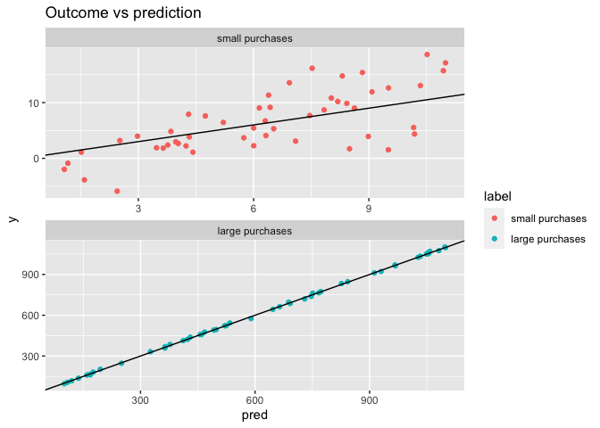<!-- -->

Notice from this example how a model with larger RMSE might still be
better, if relative errors are more important than absolute errors.

## Modeling log-transformed monetary output

In this exercise, you will practice modeling on log-transformed monetary
output, and then transforming the “log-money” predictions back into
monetary units. The data loaded into your workspace records subjects’
incomes in 2005 (`Income2005`), as well as the results of several
aptitude tests taken by the subjects in 1981:

-   `Arith`
-   `Word`
-   `Parag`
-   `Math`
-   `AFQT` (Percentile on the Armed Forces Qualifying Test)

The data have already been split into training and test sets
(`income_train` and `income_test` respectively) and are in the
workspace. You will build a model of log(income) from the inputs, and
then convert log(income) back into income.

**Steps**

1.  Call `summary()` on `income_train$Income2005` to see the summary
    statistics of income in the training set.

2.  Write a formula to express `log(Income2005)` as a function of the
    five tests as the variable `fmla.log`. Print it.

3.  Fit a linear model of `log(Income2005)` to the `income_train` data:
    `model.log`.

4.  Use `model.log` to predict income on the `income_test` dataset. Put
    it in the column `logpred`.`summary()` of `logpred` to see that the
    magnitudes are much different from those of `Income2005`.

    -   Check `summary()` of `logpred` to see that the magnitudes are
        much different from those of `Income2005`.

5.  Reverse the log transformation to put the predictions into “monetary
    units”: `exp(income_test$logpred)`.`summary()` of `pred.income` and
    see that the magnitudes are now similar to `Income2005` magnitudes.

    -   Check `summary()` of `pred.income` and see that the magnitudes
        are now similar to `Income2005` magnitudes.

6.  Fill in the blanks to plot a scatter plot of predicted income vs
    income on the test set.

``` r
# Load data
income_train <- readRDS("data/income_train.rds") 
income_test  <- readRDS("data/income_test.rds")

# Examine Income2005 in the training set
summary(income_train$Income2005)
```

    ##    Min. 1st Qu.  Median    Mean 3rd Qu.    Max. 
    ##      63   23000   39000   49894   61500  703637

``` r
# Write the formula for log income as a function of the tests and print it
(fmla.log <- log(Income2005) ~ Arith + Word + Parag + Math + AFQT)
```

    ## log(Income2005) ~ Arith + Word + Parag + Math + AFQT

``` r
# Fit the linear model
model.log <- lm(fmla.log, data = income_train)

# Make predictions on income_test
income_test$logpred <- predict(model.log, newdata = income_test)
summary(income_test$logpred)
```

    ##    Min. 1st Qu.  Median    Mean 3rd Qu.    Max. 
    ##   9.766  10.133  10.423  10.419  10.705  11.006

``` r
# Convert the predictions to monetary units
income_test$pred.income <- exp(income_test$logpred)
summary(income_test$pred.income)
```

    ##    Min. 1st Qu.  Median    Mean 3rd Qu.    Max. 
    ##   17432   25167   33615   35363   44566   60217

``` r
#  Plot predicted income (x axis) vs income
ggplot(income_test, aes(x = pred.income, y = Income2005)) + 
  geom_point() + 
  geom_abline(color = "blue")
```

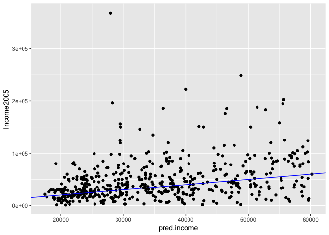<!-- -->

Good job! Remember that when you transform the output before modeling,
you have to ‘reverse transform’ the resulting predictions after applying
the model.

## Comparing RMSE and root-mean-squared Relative Error

In this exercise, you will show that log-transforming a monetary output
before modeling improves mean relative error (but increases RMSE)
compared to modeling the monetary output directly. You will compare the
results of `model.log` from the previous exercise to a model
(`model.abs`) that directly fits income.

The `income_train` and `income_test` datasets are loaded in your
workspace, along with your model, `model.log`.

Also in the workspace:

-   `model.abs`: a model that directly fits income to the inputs using
    the formula

`Income2005 ~ Arith + Word + Parag + Math + AFQT` **Steps**

1.  Fill in the blanks to add predictions from the models to
    `income_test`.’t forget to take the exponent of the predictions from
    `model.log` to undo the log transform!
2.  Don’t forget to take the exponent of the predictions from
    `model.log` to undo the log transform!
3.  Fill in the blanks to `gather()` the predictions and calculate the
    residuals and relative error.
4.  Fill in the blanks to calculate the RMSE and relative RMSE for
    predictions.model has larger absolute error? Larger relative error?
5.  Which model has larger absolute error? Larger relative error?

``` r
# fmla.abs is in the workspace
fmla.abs <- as.formula("Income2005 ~ Arith + Word + Parag + Math + AFQT")

# model.abs is in the workspace
model.abs <- lm(formula = fmla.abs, data = income_train)
summary(model.abs)
```

    ## 
    ## Call:
    ## lm(formula = fmla.abs, data = income_train)
    ## 
    ## Residuals:
    ##    Min     1Q Median     3Q    Max 
    ## -78728 -24137  -6979  11964 648573 
    ## 
    ## Coefficients:
    ##             Estimate Std. Error t value Pr(>|t|)    
    ## (Intercept)  17516.7     6420.1   2.728  0.00642 ** 
    ## Arith         1552.3      303.4   5.116 3.41e-07 ***
    ## Word          -132.3      265.0  -0.499  0.61754    
    ## Parag        -1155.1      618.3  -1.868  0.06189 .  
    ## Math           725.5      372.0   1.950  0.05127 .  
    ## AFQT           177.8      144.1   1.234  0.21734    
    ## ---
    ## Signif. codes:  0 '***' 0.001 '**' 0.01 '*' 0.05 '.' 0.1 ' ' 1
    ## 
    ## Residual standard error: 45500 on 2063 degrees of freedom
    ## Multiple R-squared:  0.1165, Adjusted R-squared:  0.1144 
    ## F-statistic:  54.4 on 5 and 2063 DF,  p-value: < 2.2e-16

``` r
# Add predictions to the test set
income_test <- income_test %>%
  mutate(pred.absmodel = predict(model.abs, income_test),      # predictions from model.abs
         pred.logmodel = exp(predict(model.log, income_test))) # predictions from model.log

# Gather the predictions and calculate residuals and relative error
income_long <- income_test %>% 
  gather(key = modeltype, value = pred, pred.absmodel, pred.logmodel) %>%
  mutate(residual = pred - Income2005,     # residuals
         relerr   = residual / Income2005) # relative error

# Calculate RMSE and relative RMSE and compare
income_long %>% 
  group_by(modeltype) %>%                       # group by modeltype
  summarize(rmse     = sqrt(mean(residual^2)),  # RMSE
            rmse.rel = sqrt(mean(relerr^2)))    # Root mean squared relative error
```

    ## # A tibble: 2 × 3
    ##   modeltype       rmse rmse.rel
    ##   <chr>          <dbl>    <dbl>
    ## 1 pred.absmodel 37448.     3.18
    ## 2 pred.logmodel 39235.     2.22

You’ve seen how modeling log(income) can reduce the relative error of
the fit, at the cost of increased RMSE. Which tradeoff to make depends
on the goals of your project.

## Transforming inputs before modeling

Theory. Coming soon …

## Input transforms: the “hockey stick”

In this exercise, we will build a model to predict price from a measure
of the house’s size (surface area). The data set `houseprice` has the
columns:

-   `price` : house price in units of $1000
-   `size`: surface area

A scatterplot of the data shows that the data is quite non-linear: a
sort of “hockey-stick” where price is fairly flat for smaller houses,
but rises steeply as the house gets larger. Quadratics and tritics are
often good functional forms to express hockey-stick like relationships.
Note that there may not be a “physical” reason that `price` is related
to the square of the `size`; a quadratic is simply a closed form
approximation of the observed relationship.


You will fit a model to predict price as a function of the squared size,
and look at its fit on the training data.

Because `^` is also a symbol to express interactions, use the function
<a href="https://www.rdocumentation.org/packages/base/topics/AsIs">`I()`</a>
to treat the expression `x^2` “as is”: that is, as the square of x
rather than the interaction of `x` with itself.

``` r
exampleFormula = y ~ I(x^2)
```

**Steps**

1.  Write a formula, `fmla_sqr`, to express price as a function of
    squared size. Print it.

2.  Fit a model `model_sqr` to the data using `fmla_sqr`

3.  For comparison, fit a linear model `model_lin` to the data using the
    formula `price ~ size`.

4.  Fill in the blanks to

    -   make predictions from the training data from the two models
    -   gather the predictions into a single column `pred`
    -   graphically compare the predictions of the two models to the
        data. Which fits better?

``` r
# houseprice is in the workspace
houseprice <- readRDS("data/houseprice.rds")
summary(houseprice)
```

    ##       size           price      
    ##  Min.   : 44.0   Min.   : 42.0  
    ##  1st Qu.: 73.5   1st Qu.:164.5  
    ##  Median : 91.0   Median :203.5  
    ##  Mean   : 94.3   Mean   :249.2  
    ##  3rd Qu.:118.5   3rd Qu.:287.8  
    ##  Max.   :150.0   Max.   :573.0

``` r
# Create the formula for price as a function of squared size
(fmla_sqr <- price ~ I(size^2))
```

    ## price ~ I(size^2)

``` r
# Fit a model of price as a function of squared size (use fmla_sqr)
model_sqr <- lm(fmla_sqr, houseprice)

# Fit a model of price as a linear function of size
model_lin <- lm(price ~ size, houseprice)

# Make predictions and compare
houseprice %>% 
    mutate(pred_lin = predict(model_lin),       # predictions from linear model
           pred_sqr = predict(model_sqr)) %>%   # predictions from quadratic model 
    gather(key = modeltype, value = pred, pred_lin, pred_sqr) %>% # gather the predictions
    ggplot(aes(x = size)) + 
       geom_point(aes(y = price)) +                  # actual prices
       geom_line(aes(y = pred, color = modeltype)) + # the predictions
       scale_color_brewer(palette = "Dark2")
```

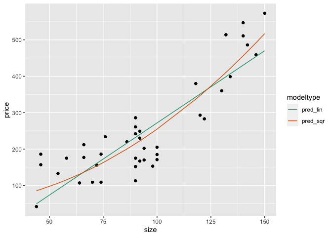<!-- -->

Great work! In the next chapter you will see how transformations like
this can sometimes be learned automatically.

## Input transforms: the “hockey stick” (2)

In the last exercise you saw that a quadratic model seems to fit the
`houseprice` data better than a linear model. In this exercise you will
confirm whether the quadratic model would perform better on
out-of-sample data. Since this data set is small, you will use
cross-validation. The quadratic formula `fmla_sqr` that you created in
the last exercise is in your workspace.

For comparison, the sample code will calculate cross-validation
predictions from a linear model `price ~ size`.

**Steps**

1.  Use `kWayCrossValidation()` to create a splitting plan for a 3-fold
    cross validation.can set the 3rd and 4th arguments of the function
    to `NULL`.

    -   You can set the 3rd and 4th arguments of the function to `NULL`.

2.  Examine and run the sample code to get the 3-fold cross-validation
    predictions of the model `price ~ size` and add them to the column
    `pred_lin`.

3.  Get the cross-validation predictions for price as a function of
    squared size. Assign them to the column `pred_sqr`.sample code gives
    you the procedure.can use the splitting plan you already created.

    -   The sample code gives you the procedure.
    -   You can use the splitting plan you already created.

4.  Fill in the blanks to gather the predictions and calculate the
    residuals.

5.  Fill in the blanks to compare the RMSE for the two models. Which one
    fits better?

``` r
# houseprice is in the workspace
summary(houseprice)
```

    ##       size           price      
    ##  Min.   : 44.0   Min.   : 42.0  
    ##  1st Qu.: 73.5   1st Qu.:164.5  
    ##  Median : 91.0   Median :203.5  
    ##  Mean   : 94.3   Mean   :249.2  
    ##  3rd Qu.:118.5   3rd Qu.:287.8  
    ##  Max.   :150.0   Max.   :573.0

``` r
# fmla_sqr is in the workspace
fmla_sqr <- as.formula("price ~ I(size^2)")

# Create a splitting plan for 3-fold cross validation
set.seed(34245)  # set the seed for reproducibility
splitPlan <- kWayCrossValidation(nrow(houseprice), 3, NULL, NULL)

# Sample code: get cross-val predictions for price ~ size
houseprice$pred_lin <- 0  # initialize the prediction vector
for(i in 1:3) {
  split <- splitPlan[[i]]
  model_lin <- lm(price ~ size, data = houseprice[split$train, ])
  houseprice$pred_lin[split$app] <- predict(model_lin, newdata = houseprice[split$app, ])
}

# Get cross-val predictions for price as a function of size^2 (use fmla_sqr)
houseprice$pred_sqr <- 0 # initialize the prediction vector
for(i in 1:3) {
  split <- splitPlan[[i]]
  model_sqr <- lm(fmla_sqr, data = houseprice[split$train, ])
  houseprice$pred_sqr[split$app] <- predict(model_sqr, newdata = houseprice[split$app, ])
}

# Gather the predictions and calculate the residuals
houseprice_long <- houseprice %>%
  gather(key = modeltype, value = pred, pred_lin, pred_sqr) %>%
  mutate(residuals = pred - price)

# Compare the cross-validated RMSE for the two models
houseprice_long %>% 
  group_by(modeltype) %>%
  summarize(rmse = sqrt(mean(residuals^2)))
```

    ## # A tibble: 2 × 2
    ##   modeltype  rmse
    ##   <chr>     <dbl>
    ## 1 pred_lin   73.1
    ## 2 pred_sqr   60.3

Great work! You’ve confirmed that the quadratic input tranformation
improved the model. In the next chapter you will see how transformations
like this can sometimes be learned automatically.

# 4. Dealing with Non-Linear Responses

Now that we have mastered linear models, we will begin to look at
techniques for modeling situations that don’t meet the assumptions of
linearity. This includes predicting probabilities and frequencies
(values bounded between 0 and 1); predicting counts (nonnegative integer
values, and associated rates); and responses that have a non-linear but
additive relationship to the inputs. These algorithms are variations on
the standard linear model.

## Logistic regression to predict probabilities

Theory. Coming soon …

## Fit a model of sparrow survival probability

In this exercise, you will estimate the probability that a sparrow
survives a severe winter storm, based on physical characteristics of the
sparrow. The dataset `sparrow` is loaded into your workspace. The
outcome to be predicted is `status` (“Survived”, “Perished”). The
variables we will consider are:

-   `total_length`: length of the bird from tip of beak to tip of tail
    (mm)
-   `weight`: in grams
-   `humerus` : length of humerus (“upper arm bone” that connects the
    wing to the body) (inches)

Remember that when using
<a href="https://www.rdocumentation.org/packages/stats/topics/glm">`glm()`</a>
to create a logistic regression model, you must explicitly specify that
`family = binomial`:

``` r
glm(formula, data = data, family = binomial)
```

You will call `summary()`, `broom::glance()` to see different functions
for examining a logistic regression model. One of the diagnostics that
you will look at is the analog to \\(R^2\\), called pseudo-\\(R^2\\).

$$
pseudoR^2 = 1 - \\\\frac{deviance}{null.deviance}
$$

You can think of deviance as analogous to variance: it is a measure of
the variation in categorical data. The pseudo-\\(R^2\\) is analogous to
\\(R^2\\) for standard regression: \\(R^2\\) is a measure of the
“variance explained” of a regression model. The pseudo-\\(R^2\\) is a
measure of the “deviance explained”.

**Steps**

1.  As suggested in the video, you will predict on the outcomes `TRUE`
    and `FALSE`. Create a new column `survived` in the `sparrow` data
    frame that is TRUE when `status == "Survived"`.
2.  Create the formula `fmla` that expresses `survived` as a function of
    the variables of interest. Print it.
3.  Fit a logistic regression model to predict the probability of
    sparrow survival. Assign the model to the variable `sparrow_model`.
4.  Call `summary()` to see the coefficients of the model, the deviance
    and the null deviance.
5.  Call `glance()` on the model to see the deviances and other
    diagnostics in a data frame. Assign the output from `glance()` to
    the variable `perf`.
6.  Calculate the pseudo-\\(R^2\\).

``` r
# Load data
sparrow <- readRDS("data/sparrow.rds")
summary(sparrow)
```

    ##       status       age             total_length      wingspan    
    ##  Perished:36   Length:87          Min.   :153.0   Min.   :236.0  
    ##  Survived:51   Class :character   1st Qu.:158.0   1st Qu.:245.0  
    ##                Mode  :character   Median :160.0   Median :247.0  
    ##                                   Mean   :160.4   Mean   :247.5  
    ##                                   3rd Qu.:162.5   3rd Qu.:251.0  
    ##                                   Max.   :167.0   Max.   :256.0  
    ##      weight       beak_head        humerus           femur       
    ##  Min.   :23.2   Min.   :29.80   Min.   :0.6600   Min.   :0.6500  
    ##  1st Qu.:24.7   1st Qu.:31.40   1st Qu.:0.7250   1st Qu.:0.7000  
    ##  Median :25.8   Median :31.70   Median :0.7400   Median :0.7100  
    ##  Mean   :25.8   Mean   :31.64   Mean   :0.7353   Mean   :0.7134  
    ##  3rd Qu.:26.7   3rd Qu.:32.10   3rd Qu.:0.7500   3rd Qu.:0.7300  
    ##  Max.   :31.0   Max.   :33.00   Max.   :0.7800   Max.   :0.7600  
    ##     legbone          skull           sternum      
    ##  Min.   :1.010   Min.   :0.5600   Min.   :0.7700  
    ##  1st Qu.:1.110   1st Qu.:0.5900   1st Qu.:0.8300  
    ##  Median :1.130   Median :0.6000   Median :0.8500  
    ##  Mean   :1.131   Mean   :0.6032   Mean   :0.8511  
    ##  3rd Qu.:1.160   3rd Qu.:0.6100   3rd Qu.:0.8800  
    ##  Max.   :1.230   Max.   :0.6400   Max.   :0.9300

``` r
# Create the survived column
sparrow$survived <- sparrow$status == "Survived"

# Create the formula
(fmla <- survived ~ total_length + weight + humerus)
```

    ## survived ~ total_length + weight + humerus

``` r
# Fit the logistic regression model
sparrow_model <- glm(fmla, data = sparrow, family = binomial)

# Call summary
summary(sparrow_model)
```

    ## 
    ## Call:
    ## glm(formula = fmla, family = binomial, data = sparrow)
    ## 
    ## Deviance Residuals: 
    ##     Min       1Q   Median       3Q      Max  
    ## -2.1117  -0.6026   0.2871   0.6577   1.7082  
    ## 
    ## Coefficients:
    ##              Estimate Std. Error z value Pr(>|z|)    
    ## (Intercept)   46.8813    16.9631   2.764 0.005715 ** 
    ## total_length  -0.5435     0.1409  -3.858 0.000115 ***
    ## weight        -0.5689     0.2771  -2.053 0.040060 *  
    ## humerus       75.4610    19.1586   3.939 8.19e-05 ***
    ## ---
    ## Signif. codes:  0 '***' 0.001 '**' 0.01 '*' 0.05 '.' 0.1 ' ' 1
    ## 
    ## (Dispersion parameter for binomial family taken to be 1)
    ## 
    ##     Null deviance: 118.008  on 86  degrees of freedom
    ## Residual deviance:  75.094  on 83  degrees of freedom
    ## AIC: 83.094
    ## 
    ## Number of Fisher Scoring iterations: 5

``` r
# Call glance
(perf <- glance(sparrow_model))
```

    ## # A tibble: 1 × 8
    ##   null.deviance df.null logLik   AIC   BIC deviance df.residual  nobs
    ##           <dbl>   <int>  <dbl> <dbl> <dbl>    <dbl>       <int> <int>
    ## 1          118.      86  -37.5  83.1  93.0     75.1          83    87

``` r
# Calculate pseudo-R-squared
(pseudoR2 <- 1 - perf$deviance/perf$null.deviance)
```

    ## [1] 0.3636526

You’ve fit a logistic regression model to predict probabilities! When
looking at the pseudo-*R*<sup>2</sup> of a logistic regression model,
you should hope to see a value close to 1.

## Predict sparrow survival

In this exercise you will predict the probability of survival using the
sparrow survival model from the previous exercise.

Recall that when calling
<a href="https://www.rdocumentation.org/packages/stats/topics/predict.glm">`predict()`</a>
to get the predicted probabilities from a `glm()` model, you must
specify that you want the response:

``` r
predict(model, type = "response")
```

Otherwise, `predict()` on a logistic regression model returns the
predicted log-odds of the event, not the probability.

You will also use the
<a href="https://www.rdocumentation.org/packages/WVPlots/topics/GainCurvePlot">`GainCurvePlot()`</a>
function to plot the gain curve from the model predictions. If the
model’s gain curve is close to the ideal (“wizard”) gain curve, then the
model sorted the sparrows well: that is, the model predicted that
sparrows that actually survived would have a higher probability of
survival. The inputs to the `GainCurvePlot()` function are:

-   `frame`: data frame with prediction column and ground truth column
-   `xvar`: the name of the column of predictions (as a string)
-   `truthVar`: the name of the column with actual outcome (as a string)
-   `title`: a title for the plot (as a string)

`GainCurvePlot(frame, xvar, truthVar, title)`

**Steps**

1.  Create a new column in `sparrow` called `pred` that contains the
    predictions on the training data.
2.  Call `GainCurvePlot()` to create the gain curve of predictions. Does
    the model do a good job of sorting the sparrows by whether or not
    they actually survived?

``` r
# sparrow is in the workspace
summary(sparrow)
```

    ##       status       age             total_length      wingspan    
    ##  Perished:36   Length:87          Min.   :153.0   Min.   :236.0  
    ##  Survived:51   Class :character   1st Qu.:158.0   1st Qu.:245.0  
    ##                Mode  :character   Median :160.0   Median :247.0  
    ##                                   Mean   :160.4   Mean   :247.5  
    ##                                   3rd Qu.:162.5   3rd Qu.:251.0  
    ##                                   Max.   :167.0   Max.   :256.0  
    ##      weight       beak_head        humerus           femur       
    ##  Min.   :23.2   Min.   :29.80   Min.   :0.6600   Min.   :0.6500  
    ##  1st Qu.:24.7   1st Qu.:31.40   1st Qu.:0.7250   1st Qu.:0.7000  
    ##  Median :25.8   Median :31.70   Median :0.7400   Median :0.7100  
    ##  Mean   :25.8   Mean   :31.64   Mean   :0.7353   Mean   :0.7134  
    ##  3rd Qu.:26.7   3rd Qu.:32.10   3rd Qu.:0.7500   3rd Qu.:0.7300  
    ##  Max.   :31.0   Max.   :33.00   Max.   :0.7800   Max.   :0.7600  
    ##     legbone          skull           sternum        survived      
    ##  Min.   :1.010   Min.   :0.5600   Min.   :0.7700   Mode :logical  
    ##  1st Qu.:1.110   1st Qu.:0.5900   1st Qu.:0.8300   FALSE:36       
    ##  Median :1.130   Median :0.6000   Median :0.8500   TRUE :51       
    ##  Mean   :1.131   Mean   :0.6032   Mean   :0.8511                  
    ##  3rd Qu.:1.160   3rd Qu.:0.6100   3rd Qu.:0.8800                  
    ##  Max.   :1.230   Max.   :0.6400   Max.   :0.9300

``` r
# sparrow_model is in the workspace
summary(sparrow_model)
```

    ## 
    ## Call:
    ## glm(formula = fmla, family = binomial, data = sparrow)
    ## 
    ## Deviance Residuals: 
    ##     Min       1Q   Median       3Q      Max  
    ## -2.1117  -0.6026   0.2871   0.6577   1.7082  
    ## 
    ## Coefficients:
    ##              Estimate Std. Error z value Pr(>|z|)    
    ## (Intercept)   46.8813    16.9631   2.764 0.005715 ** 
    ## total_length  -0.5435     0.1409  -3.858 0.000115 ***
    ## weight        -0.5689     0.2771  -2.053 0.040060 *  
    ## humerus       75.4610    19.1586   3.939 8.19e-05 ***
    ## ---
    ## Signif. codes:  0 '***' 0.001 '**' 0.01 '*' 0.05 '.' 0.1 ' ' 1
    ## 
    ## (Dispersion parameter for binomial family taken to be 1)
    ## 
    ##     Null deviance: 118.008  on 86  degrees of freedom
    ## Residual deviance:  75.094  on 83  degrees of freedom
    ## AIC: 83.094
    ## 
    ## Number of Fisher Scoring iterations: 5

``` r
# Make predictions
sparrow$pred <- predict(sparrow_model, type = "response")

# Look at gain curve
GainCurvePlot(sparrow, "pred", "survived", "sparrow survival model")
```

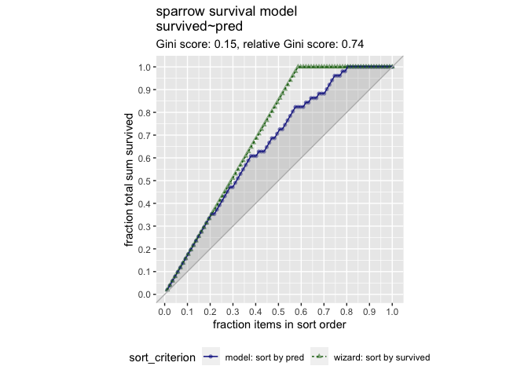<!-- -->

Very good. You see from the gain curve that the model follows the wizard
curve for about the first 30% of the data, identifying about 45% of the
surviving sparrows with only a few false positives.

## Poisson and quasipoisson regression to predict counts

Theory. Coming soon …

## Poisson or quasipoisson

One of the assumptions of Poisson regression to predict counts is that
the event you are counting is *Poisson distributed*: the average count
per unit time is the same as the variance of the count. In practice,
“the same” means that the mean and the variance should be of a similar
order of magnitude.

When the variance is much larger than the mean, the Poisson assumption
doesn’t apply, and one solution is to use quasipoisson regression, which
does not assume that \\(variance = mean\\).

For each of the following situations, decide if Poisson regression would
be suitable, or if you should use quasipoisson regression.

> ## *Question*
>
> For which situations can you use Poisson regression?<br> 1. Number of
> days students are absent: mean 5.9, variance 49 2. Number of awards a
> student wins: mean 0.6, variance 1.1 3. Number of hits per website
> page: mean 108.2, variance 108.5 4. Number of bikes rented per day:
> mean 273, variance 45863.84 <br> ⬜ All of them<br> ⬜ 1 and 4<br> ✅
> 2 and 3<br> ⬜ 1 and 3<br> ⬜ 2 and 4<br>

Yes! When the mean and variance of event arrivals are reasonably close,
Poisson regression is suitable.

## Fit a model to predict bike rental counts

In this exercise you will build a model to predict the number of bikes
rented in an hour as a function of the weather, the type of day
(holiday, working day, or weekend), and the time of day. You will train
the model on data from the month of July.

The data frame has the columns:

-   `cnt`: the number of bikes rented in that hour (the outcome)
-   `hr`: the hour of the day (0-23, as a factor)
-   `holiday`: TRUE/FALSE
-   `workingday`: TRUE if neither a holiday nor a weekend, else FALSE
-   `weathersit`: categorical, “Clear to partly cloudy”/“Light
    Precipitation”/“Misty”
-   `temp`: normalized temperature in Celsius
-   `atemp`: normalized “feeling” temperature in Celsius
-   `hum`: normalized humidity
-   `windspeed`: normalized windspeed
-   `instant`: the time index – number of hours since beginning of data
    set (not a variable)
-   `mnth` and `yr`: month and year indices (not variables)

Remember that you must specify `family = poisson` or
`family = quasipoisson` when using
<a href="https://www.rdocumentation.org/packages/stats/topics/glm">`glm()`</a>
to fit a count model.

Since there are a lot of input variables, for convenience we will
specify the outcome and the inputs in variables, and use
<a href="https://www.rdocumentation.org/packages/base/topics/paste">`paste()`</a>
to assemble a string representing the model formula.

**Steps**

1.  The data frame `bikesJuly` is in the workspace. The names of the
    outcome variable and the input variables are also in the workspace
    as the variables `outcome` and `vars` respectively.

    -   Fill in the blanks to create the formula `fmla` expressing `cnt`
        as a function of the inputs. Print it.
    -   Calculate the mean (`mean()`) and variance (`var()`) of
        `bikesJuly$cnt`. you use poisson or quasipoisson regression?
    -   Should you use poisson or quasipoisson regression?
    -   Use `glm()` to fit a model to the `bikesJuly` data:
        `bike_model`.
    -   Use `glance()` to look at the model’s fit statistics. Assign the
        output of `glance()` to the variable `perf`.
    -   Calculate the pseudo-R-squared of the model.

``` r
# bikesJuly is in the workspace
bikesJuly <- readRDS("data/bikesJuly.rds")
str(bikesJuly)
```

    ## 'data.frame':    744 obs. of  12 variables:
    ##  $ hr        : Factor w/ 24 levels "0","1","2","3",..: 1 2 3 4 5 6 7 8 9 10 ...
    ##  $ holiday   : logi  FALSE FALSE FALSE FALSE FALSE FALSE ...
    ##  $ workingday: logi  FALSE FALSE FALSE FALSE FALSE FALSE ...
    ##  $ weathersit: chr  "Clear to partly cloudy" "Clear to partly cloudy" "Clear to partly cloudy" "Clear to partly cloudy" ...
    ##  $ temp      : num  0.76 0.74 0.72 0.72 0.7 0.68 0.7 0.74 0.78 0.82 ...
    ##  $ atemp     : num  0.727 0.697 0.697 0.712 0.667 ...
    ##  $ hum       : num  0.66 0.7 0.74 0.84 0.79 0.79 0.79 0.7 0.62 0.56 ...
    ##  $ windspeed : num  0 0.1343 0.0896 0.1343 0.194 ...
    ##  $ cnt       : int  149 93 90 33 4 10 27 50 142 219 ...
    ##  $ instant   : int  13004 13005 13006 13007 13008 13009 13010 13011 13012 13013 ...
    ##  $ mnth      : int  7 7 7 7 7 7 7 7 7 7 ...
    ##  $ yr        : int  1 1 1 1 1 1 1 1 1 1 ...

``` r
# The outcome column
outcome <- "cnt"

# The inputs to use
vars <- c("hr", "holiday", "workingday", "weathersit", "temp", "atemp", "hum", "windspeed")

# Create the formula string for bikes rented as a function of the inputs
(fmla <- paste(outcome, "~", paste(vars, collapse = " + ")))
```

    ## [1] "cnt ~ hr + holiday + workingday + weathersit + temp + atemp + hum + windspeed"

``` r
# Calculate the mean and variance of the outcome
(mean_bikes <- mean(bikesJuly$cnt))
```

    ## [1] 273.6653

``` r
(var_bikes <- var(bikesJuly$cnt))
```

    ## [1] 45863.84

``` r
# Fit the model
bike_model <- glm(fmla, data = bikesJuly, family = quasipoisson)

# Call glance
(perf <- glance(bike_model))
```

    ## # A tibble: 1 × 8
    ##   null.deviance df.null logLik   AIC   BIC deviance df.residual  nobs
    ##           <dbl>   <int>  <dbl> <dbl> <dbl>    <dbl>       <int> <int>
    ## 1       133365.     743     NA    NA    NA   28775.         712   744

``` r
# Calculate pseudo-R-squared
(pseudoR2 <- 1 - perf$deviance/perf$null.deviance)
```

    ## [1] 0.7842393

You’ve fit a (quasi)poisson model to predict counts! As with a logistic
model, you hope for a pseudo-*R*<sup>2</sup> near 1.

## Predict bike rentals on new data

In this exercise you will use the model you built in the previous
exercise to make predictions for the month of August. The data set
`bikesAugust` has the same columns as `bikesJuly`.

Recall that you must specify `type = "response"` with
<a href="https://www.rdocumentation.org/packages/stats/topics/predict.glm">`predict()`</a>
when predicting counts from a `glm` poisson or quasipoisson model.

**Steps**

1.  Use `predict` to predict the number of bikes per hour on the
    `bikesAugust` data. Assign the predictions to the column
    `bikesAugust$pred`.

2.  Fill in the blanks to get the RMSE of the predictions on the August
    data.

3.  Fill in the blanks to generate the plot of predictions to actual
    counts.any of the predictions appear negative?

    -   Do any of the predictions appear negative?

``` r
# bikesAugust is in the workspace
bikesAugust <- readRDS("data/bikesAugust.rds")
str(bikesAugust)
```

    ## 'data.frame':    744 obs. of  12 variables:
    ##  $ hr        : Factor w/ 24 levels "0","1","2","3",..: 1 2 3 4 5 6 7 8 9 10 ...
    ##  $ holiday   : logi  FALSE FALSE FALSE FALSE FALSE FALSE ...
    ##  $ workingday: logi  TRUE TRUE TRUE TRUE TRUE TRUE ...
    ##  $ weathersit: chr  "Clear to partly cloudy" "Clear to partly cloudy" "Clear to partly cloudy" "Clear to partly cloudy" ...
    ##  $ temp      : num  0.68 0.66 0.64 0.64 0.64 0.64 0.64 0.64 0.66 0.68 ...
    ##  $ atemp     : num  0.636 0.606 0.576 0.576 0.591 ...
    ##  $ hum       : num  0.79 0.83 0.83 0.83 0.78 0.78 0.78 0.83 0.78 0.74 ...
    ##  $ windspeed : num  0.1642 0.0896 0.1045 0.1045 0.1343 ...
    ##  $ cnt       : int  47 33 13 7 4 49 185 487 681 350 ...
    ##  $ instant   : int  13748 13749 13750 13751 13752 13753 13754 13755 13756 13757 ...
    ##  $ mnth      : int  8 8 8 8 8 8 8 8 8 8 ...
    ##  $ yr        : int  1 1 1 1 1 1 1 1 1 1 ...

``` r
# bike_model is in the workspace
summary(bike_model)
```

    ## 
    ## Call:
    ## glm(formula = fmla, family = quasipoisson, data = bikesJuly)
    ## 
    ## Deviance Residuals: 
    ##      Min        1Q    Median        3Q       Max  
    ## -21.6117   -4.3121   -0.7223    3.5507   16.5079  
    ## 
    ## Coefficients:
    ##                                Estimate Std. Error t value Pr(>|t|)    
    ## (Intercept)                    5.934986   0.439027  13.519  < 2e-16 ***
    ## hr1                           -0.580055   0.193354  -3.000 0.002794 ** 
    ## hr2                           -0.892314   0.215452  -4.142 3.86e-05 ***
    ## hr3                           -1.662342   0.290658  -5.719 1.58e-08 ***
    ## hr4                           -2.350204   0.393560  -5.972 3.71e-09 ***
    ## hr5                           -1.084289   0.230130  -4.712 2.96e-06 ***
    ## hr6                            0.211945   0.156476   1.354 0.176012    
    ## hr7                            1.211135   0.132332   9.152  < 2e-16 ***
    ## hr8                            1.648361   0.127177  12.961  < 2e-16 ***
    ## hr9                            1.155669   0.133927   8.629  < 2e-16 ***
    ## hr10                           0.993913   0.137096   7.250 1.09e-12 ***
    ## hr11                           1.116547   0.136300   8.192 1.19e-15 ***
    ## hr12                           1.282685   0.134769   9.518  < 2e-16 ***
    ## hr13                           1.273010   0.135872   9.369  < 2e-16 ***
    ## hr14                           1.237721   0.136386   9.075  < 2e-16 ***
    ## hr15                           1.260647   0.136144   9.260  < 2e-16 ***
    ## hr16                           1.515893   0.132727  11.421  < 2e-16 ***
    ## hr17                           1.948404   0.128080  15.212  < 2e-16 ***
    ## hr18                           1.893915   0.127812  14.818  < 2e-16 ***
    ## hr19                           1.669277   0.128471  12.993  < 2e-16 ***
    ## hr20                           1.420732   0.131004  10.845  < 2e-16 ***
    ## hr21                           1.146763   0.134042   8.555  < 2e-16 ***
    ## hr22                           0.856182   0.138982   6.160 1.21e-09 ***
    ## hr23                           0.479197   0.148051   3.237 0.001265 ** 
    ## holidayTRUE                    0.201598   0.079039   2.551 0.010961 *  
    ## workingdayTRUE                 0.116798   0.033510   3.485 0.000521 ***
    ## weathersitLight Precipitation -0.214801   0.072699  -2.955 0.003233 ** 
    ## weathersitMisty               -0.010757   0.038600  -0.279 0.780572    
    ## temp                          -3.246001   1.148270  -2.827 0.004833 ** 
    ## atemp                          2.042314   0.953772   2.141 0.032589 *  
    ## hum                           -0.748557   0.236015  -3.172 0.001581 ** 
    ## windspeed                      0.003277   0.148814   0.022 0.982439    
    ## ---
    ## Signif. codes:  0 '***' 0.001 '**' 0.01 '*' 0.05 '.' 0.1 ' ' 1
    ## 
    ## (Dispersion parameter for quasipoisson family taken to be 38.98949)
    ## 
    ##     Null deviance: 133365  on 743  degrees of freedom
    ## Residual deviance:  28775  on 712  degrees of freedom
    ## AIC: NA
    ## 
    ## Number of Fisher Scoring iterations: 5

``` r
# Make predictions on August data
bikesAugust$pred <- predict(bike_model, newdata = bikesAugust, type = "response")

# Calculate the RMSE
bikesAugust %>% 
  mutate(residual = pred - cnt) %>%
  summarize(rmse  = sqrt(mean(residual^2)))
```

    ##       rmse
    ## 1 112.5815

``` r
# Plot predictions vs cnt (pred on x-axis)
ggplot(bikesAugust, aes(x = pred, y = cnt)) +
  geom_point() + 
  geom_abline(color = "darkblue")
```

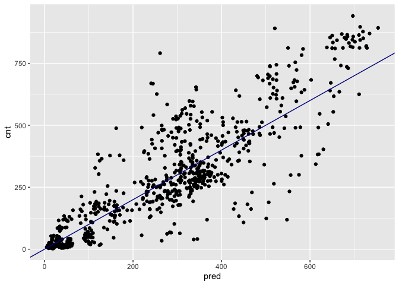<!-- -->

Great! (Quasi)poisson models predict non-negative rates, making them
useful for count or frequency data.

## Visualize the bike rental predictions

In the previous exercise, you visualized the bike model’s predictions
using the standard “outcome vs. prediction” scatter plot. Since the bike
rental data is time series data, you might be interested in how the
model performs as a function of time. In this exercise, you will compare
the predictions and actual rentals on an hourly basis, for the first 14
days of August.

To create the plot you will use the function
<a href="https://www.rdocumentation.org/packages/tidyr/topics/gather">`tidyr::gather()`</a>
to consolidate the predicted and actual values from `bikesAugust` in a
single column. `gather()` takes as arguments:

-   The “wide” data frame to be gathered (implicit in a pipe)
-   The name of the key column to be created - contains the names of the
    gathered columns.
-   The name of the value column to be created - contains the values of
    the gathered columns.
-   The names of the columns to be gathered into a single column.

You’ll use the gathered data frame to compare the actual and predicted
rental counts as a function of time. The time index, `instant` counts
the number of observations since the beginning of data collection. The
sample code converts the instants to daily units, starting from 0.

**Steps**

1.  Fill in the blanks to plot the predictions and actual counts by hour
    for the first 14 days of August.`instant` to be in day units, rather
    than hour`gather()` the `cnt` and `pred` columns into a column
    called `value`, with a key called `valuetype`.`filter()` for the
    first two weeks of August`value` as a function of `instant` (day).

    -   convert `instant` to be in day units, rather than hour
    -   `gather()` the `cnt` and `pred` columns into a column called
        `value`, with a key called `valuetype`.
    -   `filter()` for the first two weeks of August
    -   Plot `value` as a function of `instant` (day).

2.  Does the model see the general time patterns in bike rentals?

``` r
# Plot predictions and cnt by date/time
bikesAugust %>% 
  # set start to 0, convert unit to days
  mutate(instant = (instant - min(instant))/24) %>%  
  # gather cnt and pred into a value column
  gather(key = valuetype, value = value, cnt, pred) %>%
  filter(instant < 14) %>% # restrict to first 14 days
  # plot value by instant
  ggplot(aes(x = instant, y = value, color = valuetype, linetype = valuetype)) + 
  geom_point() + 
  geom_line() + 
  scale_x_continuous("Day", breaks = 0:14, labels = 0:14) + 
  scale_color_brewer(palette = "Dark2") + 
  ggtitle("Predicted August bike rentals, Quasipoisson model")
```

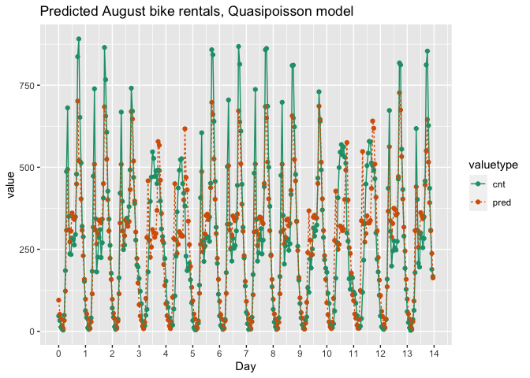<!-- -->

Good work! This model mostly identifies the slow and busy hours of the
day, although it often underestimates peak demand.

## GAM to learn non-linear transforms

Theory. Coming soon …

## Writing formulas for GAM models

When using
<a href="https://www.rdocumentation.org/packages/mgcv/topics/gam">`gam()`</a>
to model outcome as an additive function of the inputs, you can use the
<a href="https://www.rdocumentation.org/packages/mgcv/topics/s">`s()`</a>
function inside formulas to designate that you want to use a spline to
model the non-linear relationship of a continuous variable to the
outcome.

Suppose that you want to predict how much weight (`Wtloss`) a dieter
will lose over a 2-year diet plan as a function of:

-   `Diet` type (categorical)
-   `Sex` (categorical)
-   `Age` at beginning of diet (continuous)
-   `BMI` (body mass index) at beginning of diet (continuous)

You do not want to assume that any of the relationships are linear.

> ## *Question*
>
> Which is the most appropriate formula?<br> <br> ⬜
> `Wtloss ~ Diet + Sex + Age + BMI`<br> ⬜
> `Wtloss ~ s(Diet) + s(Sex) + s(Age) + s(BMI)`<br> ✅
> `Wtloss ~ Diet + Sex + s(Age) + s(BMI)`<br>

Yes! This formula says that Age and BMI will both be modeled
non-linearly.

## Writing formulas for GAM models (2)

Suppose that in the diet problem from the previous exercise, you now
also want to take into account

-   the dieter’s resting metabolic rate (`BMR` – continuous) and
-   the dieter’s average number hours of aerobic exercise per day (`E` –
    continuous) at the beginning of the study.

You have reason to believe that the relationship between BMR and weight
loss is linear (and you want to model it that way), but not necessarily
the relationship between aerobic exercise and weight loss.

> ## *Question*
>
> Which is the most appropriate formula?<br> <br> ⬜
> `Wtloss ~ Diet + Sex + s(Age) + s(BMI) + s(BMR) + s(E)`<br> ✅
> `Wtloss ~ Diet + Sex + s(Age) + s(BMI) + BMR + s(E)`<br> ⬜
> `Wtloss ~ Diet + Sex + s(Age) + s(BMI) + s(BMR) + E`<br>

Yes! This formula says to model Age, BMI and E as non-linear, but model
BMR as linear.

## Model soybean growth with GAM

In this exercise you will model the average leaf weight on a soybean
plant as a function of time (after planting). As you will see, the
soybean plant doesn’t grow at a steady rate, but rather has a “growth
spurt” that eventually tapers off. Hence, leaf weight is not well
described by a linear model.

Recall that you can designate which variable you want to model
non-linearly in a formula with the
<a href="https://www.rdocumentation.org/packages/mgcv/topics/s">`s()`</a>
function:

``` r
y ~ s(x)
```

Also remember that
<a href="https://www.rdocumentation.org/packages/mgcv/topics/gam">`gam()`</a>
from the package `mgcv` has the calling interface

``` r
gam(formula, family, data)
```

For standard regression, use `family = gaussian` (the default).

The soybean training data, `soybean_train` is loaded into your
workspace. It has two columns: the outcome `weight` and the variable
`Time`. For comparison, the linear model `model.lin`, which was fit
using the formula `weight ~ Time` has already been loaded into the
workspace as well.

**Steps**

1.  Fill in the blanks to plot `weight` versus `Time` (`Time` on
    x-axis). *Does the relationship look linear?*

``` r
# load data
soybean_train <- readRDS("data/soybean_train.rds")
summary(soybean_train)
```

    ##       Plot     Variety   Year          Time           weight       
    ##  1988F6 : 10   F:161   1988:124   Min.   :14.00   Min.   : 0.0290  
    ##  1988F7 :  9   P:169   1989:102   1st Qu.:27.00   1st Qu.: 0.6663  
    ##  1988P1 :  9           1990:104   Median :42.00   Median : 3.5233  
    ##  1988P8 :  9                      Mean   :43.56   Mean   : 6.1645  
    ##  1988P2 :  9                      3rd Qu.:56.00   3rd Qu.:10.3808  
    ##  1988F3 :  8                      Max.   :84.00   Max.   :27.3700  
    ##  (Other):276

``` r
# Plot weight vs Time (Time on x axis)
ggplot(soybean_train, aes(x = Time, y = weight)) + 
  geom_point() 
```

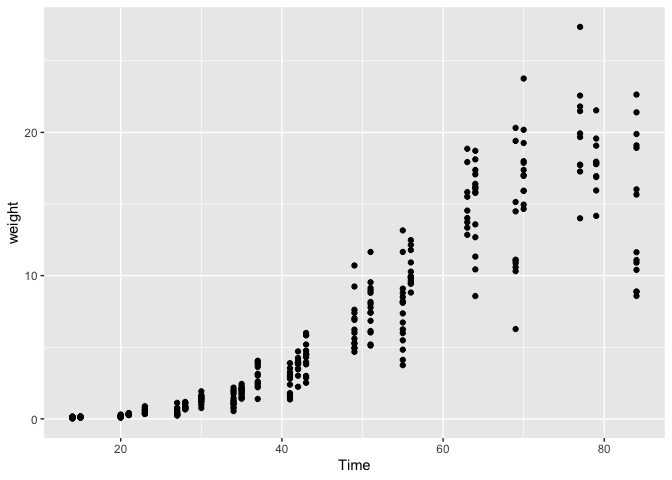<!-- -->

2.  Load the package `mgcv`.
3.  Create the formula `fmla.gam` to express `weight` as a non-linear
    function of `Time`. Print it.
4.  Fit a generalized additive model on `soybean_train` using
    `fmla.gam`.

``` r
# Load the package mgcv
library(mgcv)
```

    ## Loading required package: nlme

    ## 
    ## Attaching package: 'nlme'

    ## The following object is masked from 'package:dplyr':
    ## 
    ##     collapse

    ## This is mgcv 1.8-38. For overview type 'help("mgcv-package")'.

    ## 
    ## Attaching package: 'mgcv'

    ## The following object is masked from 'package:wrapr':
    ## 
    ##     %.%

``` r
# Create the formula 
(fmla.gam <- weight ~ s(Time) )
```

    ## weight ~ s(Time)

``` r
# Fit the GAM Model
model.gam <- gam(fmla.gam, data = soybean_train, family = gaussian)
```

5.  Call `summary()` on the linear model `model.lin` (already in your
    workspace). *What is the \\(R^2\\)?*
6.  Call `summary()` on `'model.gam`. *The “deviance explained” reports
    the model’s unadjusted \\(R^2\\). What is the \\(R^2\\)? Which model
    appears to be a better fit to the training data?*
7.  Call `plot()` on `model.gam` to see the derived relationship between
    `Time` and `weight`.

``` r
# Call summary() on model.lin and look for R-squared
model.lin <- lm(formula = weight ~ Time, data = soybean_train)
summary(model.lin)
```

    ## 
    ## Call:
    ## lm(formula = weight ~ Time, data = soybean_train)
    ## 
    ## Residuals:
    ##     Min      1Q  Median      3Q     Max 
    ## -9.3933 -1.7100 -0.3909  1.9056 11.4381 
    ## 
    ## Coefficients:
    ##              Estimate Std. Error t value Pr(>|t|)    
    ## (Intercept) -6.559283   0.358527  -18.30   <2e-16 ***
    ## Time         0.292094   0.007444   39.24   <2e-16 ***
    ## ---
    ## Signif. codes:  0 '***' 0.001 '**' 0.01 '*' 0.05 '.' 0.1 ' ' 1
    ## 
    ## Residual standard error: 2.778 on 328 degrees of freedom
    ## Multiple R-squared:  0.8244, Adjusted R-squared:  0.8238 
    ## F-statistic:  1540 on 1 and 328 DF,  p-value: < 2.2e-16

``` r
# Call summary() on model.gam and look for R-squared
summary(model.gam)
```

    ## 
    ## Family: gaussian 
    ## Link function: identity 
    ## 
    ## Formula:
    ## weight ~ s(Time)
    ## 
    ## Parametric coefficients:
    ##             Estimate Std. Error t value Pr(>|t|)    
    ## (Intercept)   6.1645     0.1143   53.93   <2e-16 ***
    ## ---
    ## Signif. codes:  0 '***' 0.001 '**' 0.01 '*' 0.05 '.' 0.1 ' ' 1
    ## 
    ## Approximate significance of smooth terms:
    ##           edf Ref.df     F p-value    
    ## s(Time) 8.495   8.93 338.2  <2e-16 ***
    ## ---
    ## Signif. codes:  0 '***' 0.001 '**' 0.01 '*' 0.05 '.' 0.1 ' ' 1
    ## 
    ## R-sq.(adj) =  0.902   Deviance explained = 90.4%
    ## GCV = 4.4395  Scale est. = 4.3117    n = 330

``` r
# Call plot() on model.gam
plot(model.gam)
```

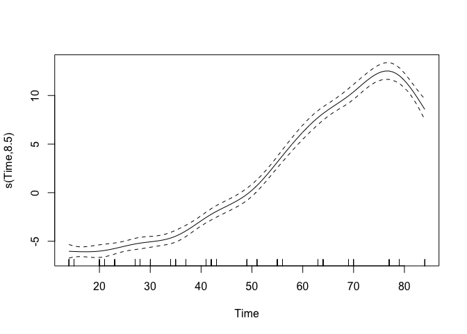<!-- -->

Congratulations! You have fit a generalized additive model. For this
data, the GAM appears to fit the data better than a linear model, as
measured by the R-squared.

## Predict with the soybean model on test data

In this exercise you will apply the soybean models from the previous
exercise (`model.lin` and `model.gam`, already in your workspace) to new
data: `soybean_test`.

**Steps**

1.  Create a column `soybean_test$pred.lin` with predictions from the
    linear model `model.lin`.

2.  Create a column `soybean_test$pred.gam` with predictions from the
    gam model `model.gam`.GAM models, the `predict()` method returns a
    matrix, so use `as.numeric()` to convert the matrix to a vector.

    -   For GAM models, the `predict()` method returns a matrix, so use
        `as.numeric()` to convert the matrix to a vector.

3.  Fill in the blanks to `gather()` the prediction columns into a
    single value column `pred` with key column `modeltype`. Call the
    long dataframe `soybean_long`.

4.  Calculate and compare the RMSE of both models. model does better?

    -   Which model does better?

5.  Run the code to compare the predictions of each model against the
    actual average leaf weights.

    -   A scatter plot of `weight` as a function of `Time`.
    -   Point-and-line plots of the predictions (`pred`) as a function
        of `Time`.
    -   Notice that the linear model sometimes predicts negative
        weights! Does the gam model?

``` r
# Load soybean_test
soybean_test <- readRDS("data/soybean_test.rds")
summary(soybean_test)
```

    ##       Plot    Variety   Year         Time           weight       
    ##  1988F8 : 4   F:43    1988:32   Min.   :14.00   Min.   : 0.0380  
    ##  1988P7 : 4   P:39    1989:26   1st Qu.:23.00   1st Qu.: 0.4248  
    ##  1989F8 : 4           1990:24   Median :41.00   Median : 3.0025  
    ##  1990F8 : 4                     Mean   :44.09   Mean   : 7.1576  
    ##  1988F4 : 3                     3rd Qu.:69.00   3rd Qu.:15.0113  
    ##  1988F2 : 3                     Max.   :84.00   Max.   :30.2717  
    ##  (Other):60

``` r
# Get predictions from linear model
soybean_test$pred.lin <- predict(model.lin, newdata = soybean_test)

# Get predictions from gam model
soybean_test$pred.gam <- as.numeric(predict(model.gam, newdata = soybean_test))

# Gather the predictions into a "long" dataset
soybean_long <- soybean_test %>%
  gather(key = modeltype, value = pred, pred.lin, pred.gam)

# Calculate the rmse
soybean_long %>%
  mutate(residual = weight - pred) %>%     # residuals
  group_by(modeltype) %>%                  # group by modeltype
  summarize(rmse = sqrt(mean(residual^2))) # calculate the RMSE
```

    ## # A tibble: 2 × 2
    ##   modeltype  rmse
    ##   <chr>     <dbl>
    ## 1 pred.gam   2.29
    ## 2 pred.lin   3.19

``` r
# Compare the predictions against actual weights on the test data
soybean_long %>%
  ggplot(aes(x = Time)) +                          # the column for the x axis
  geom_point(aes(y = weight)) +                    # the y-column for the scatterplot
  geom_point(aes(y = pred, color = modeltype)) +   # the y-column for the point-and-line plot
  geom_line(aes(y = pred, color = modeltype, linetype = modeltype)) + # the y-column for the point-and-line plot
  scale_color_brewer(palette = "Dark2")
```

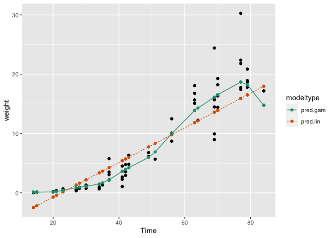<!-- -->

Great job! The GAM learns the non-linear growth function of the soybean
plants, including the fact that weight is never negative.

# 5. Tree-Based Methods

In this chapter we will look at modeling algorithms that do not assume
linearity or additivity, and that can learn limited types of
interactions among input variables. These algorithms are *tree-based*
methods that work by combining ensembles of *decision trees* that are
learned from the training data.

## The intuition behind tree-based methods

Theory. Coming soon …

## Predicting with a decision tree


Here you see the decision tree learned from the brain data set shown in
the previous video. The tree predicts the expected intelligence (humans
have an intelligence of 1) of several mammals, as a function of
*gestation time* (in days) and average *litter size* for that species.

The leaf nodes show the expected brain size for the datums in that node,
as well as how many (percentage-wise) of the datums fall into the node.

You want to predict the intelligence of a gorilla, which has a gestation
time of 265 days and an average litter size of 1.

> ## *Question*
>
> What relative brain size does this tree model predict?<br> <br> ⬜
> 0.073<br> ⬜ 0.131<br> ✅ 0.148<br> ⬜ 0.161<br> ⬜ 0.274<br> ⬜
> 0.315<br>

Yes! But as you see this tree can predict only 6 values. For the rest of
this chapter we will use tree ensembles to predict at a finer
granularity.

## Random forests

Theory. Coming soon …

## Build a random forest model for bike rentals

In this exercise you will again build a model to predict the number of
bikes rented in an hour as a function of the weather, the type of day
(holiday, working day, or weekend), and the time of day. You will train
the model on data from the month of July.

You will use the `ranger` package to fit the random forest model. For
this exercise, the key arguments to the
<a href="https://www.rdocumentation.org/packages/ranger/topics/ranger">`ranger()`</a>
call are:

-   `formula`
-   `data`
-   `num.trees`: the number of trees in the forest.
-   `respect.unordered.factors` : Specifies how to treat unordered
    factor variables. We recommend setting this to “order” for
    regression.
-   `seed`: because this is a random algorithm, you will set the seed to
    get reproducible results

Since there are a lot of input variables, for convenience we will
specify the outcome and the inputs in the variables `outcome` and
`vars`, and use
<a href="https://www.rdocumentation.org/packages/base/topics/paste">`paste()`</a>
to assemble a string representing the model formula.

**Steps**

1.  Fill in the blanks to create the formula `fmla` expressing `cnt` as
    a function of the inputs. Print it.

2.  Load the package `ranger`.

3.  Use `ranger` to fit a model to the `bikesJuly` data:
    `bike_model_rf`.

    -   The first argument to `ranger()` is the formula, `fmla`.
    -   Use 500 trees and `respect.unordered.factors = "order"`.
    -   Set the seed to `seed` for reproducible results.
    -   Print the model. What is the R-squared?

``` r
# bikesJuly is in the workspace
str(bikesJuly)
```

    ## 'data.frame':    744 obs. of  12 variables:
    ##  $ hr        : Factor w/ 24 levels "0","1","2","3",..: 1 2 3 4 5 6 7 8 9 10 ...
    ##  $ holiday   : logi  FALSE FALSE FALSE FALSE FALSE FALSE ...
    ##  $ workingday: logi  FALSE FALSE FALSE FALSE FALSE FALSE ...
    ##  $ weathersit: chr  "Clear to partly cloudy" "Clear to partly cloudy" "Clear to partly cloudy" "Clear to partly cloudy" ...
    ##  $ temp      : num  0.76 0.74 0.72 0.72 0.7 0.68 0.7 0.74 0.78 0.82 ...
    ##  $ atemp     : num  0.727 0.697 0.697 0.712 0.667 ...
    ##  $ hum       : num  0.66 0.7 0.74 0.84 0.79 0.79 0.79 0.7 0.62 0.56 ...
    ##  $ windspeed : num  0 0.1343 0.0896 0.1343 0.194 ...
    ##  $ cnt       : int  149 93 90 33 4 10 27 50 142 219 ...
    ##  $ instant   : int  13004 13005 13006 13007 13008 13009 13010 13011 13012 13013 ...
    ##  $ mnth      : int  7 7 7 7 7 7 7 7 7 7 ...
    ##  $ yr        : int  1 1 1 1 1 1 1 1 1 1 ...

``` r
# Random seed to reproduce results
seed <- 423563

# the outcome column
(outcome <- "cnt")
```

    ## [1] "cnt"

``` r
# The input variables
(vars <- c("hr", "holiday", "workingday", "weathersit", "temp", "atemp", "hum", "windspeed"))
```

    ## [1] "hr"         "holiday"    "workingday" "weathersit" "temp"      
    ## [6] "atemp"      "hum"        "windspeed"

``` r
# Create the formula string for bikes rented as a function of the inputs
(fmla <- paste(outcome, "~", paste(vars, collapse = " + ")))
```

    ## [1] "cnt ~ hr + holiday + workingday + weathersit + temp + atemp + hum + windspeed"

``` r
# Load the package ranger
library(ranger)

# Fit and print the random forest model.
(bike_model_rf <- ranger(fmla, 
                         bikesJuly, 
                         num.trees = 500, 
                         respect.unordered.factors = "order", 
                         seed = seed))
```

    ## Ranger result
    ## 
    ## Call:
    ##  ranger(fmla, bikesJuly, num.trees = 500, respect.unordered.factors = "order",      seed = seed) 
    ## 
    ## Type:                             Regression 
    ## Number of trees:                  500 
    ## Sample size:                      744 
    ## Number of independent variables:  8 
    ## Mtry:                             2 
    ## Target node size:                 5 
    ## Variable importance mode:         none 
    ## Splitrule:                        variance 
    ## OOB prediction error (MSE):       8230.568 
    ## R squared (OOB):                  0.8205434

Very good! You have fit a model to the data with a respectable
R-squared. In the next exercise you will see how well it does on holdout
data.

## Predict bike rentals with the random forest model

In this exercise you will use the model that you fit in the previous
exercise to predict bike rentals for the month of August.

The
<a href="https://www.rdocumentation.org/packages/ranger/topics/predict.ranger">`predict()`</a>
function for a `ranger` model produces a list. One of the elements of
this list is `predictions`, a vector of predicted values. You can access
`predictions` with the `$` notation for accessing named elements of a
list:

`predict(model, data)$predictions`

**Steps**

1.  Call `predict()` on `bikesAugust` to predict the number of bikes
    rented in August (`cnt`). Add the predictions to `bikesAugust` as
    the column `pred`.

2.  Fill in the blanks to calculate the root mean squared error of the
    predictions.poisson model you built for this data gave an RMSE of
    about 112.6. How does this model compare?

    -   The poisson model you built for this data gave an RMSE of about
        112.6. How does this model compare?

3.  Fill in the blanks to plot actual bike rental counts (`cnt`) versus
    the predictions (`pred` on x-axis).

``` r
# Make predictions on the August data
bikesAugust$pred <- predict(bike_model_rf, bikesAugust)$predictions

# Calculate the RMSE of the predictions
bikesAugust %>% 
  mutate(residual = cnt - pred)  %>%        # calculate the residual
  summarize(rmse  = sqrt(mean(residual^2))) # calculate rmse
```

    ##       rmse
    ## 1 97.18347

``` r
# Plot actual outcome vs predictions (predictions on x-axis)
ggplot(bikesAugust, aes(x = pred, y = cnt)) + 
  geom_point() + 
  geom_abline()
```

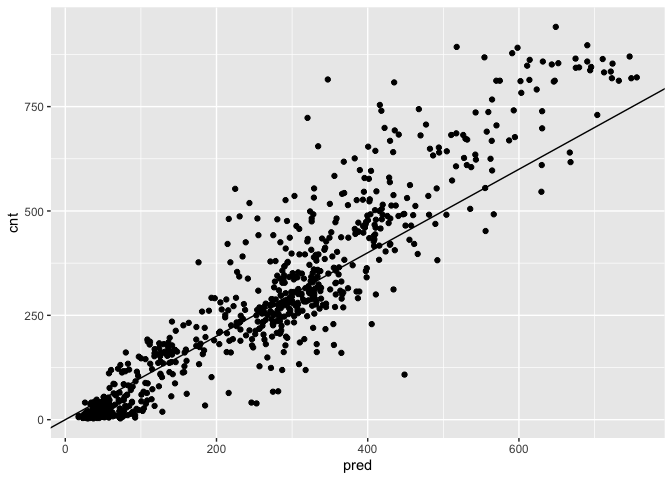<!-- -->

Good job! This random forest model outperforms the poisson count model
on the same data; it is discovering more complex non-linear or
non-additive relationships in the data.

## Visualize random forest bike model predictions

In the previous exercise, you saw that the random forest bike model did
better on the August data than the quasiposson model, in terms of RMSE.

In this exercise you will visualize the random forest model’s August
predictions as a function of time. The corresponding plot from the
quasipoisson model that you built in a previous exercise is in the
workspace for you to compare.

Recall that the quasipoisson model mostly identified the pattern of slow
and busy hours in the day, but it somewhat underestimated peak demands.
You would like to see how the random forest model compares.

The data frame `bikesAugust` (with predictions) is in the workspace. The
plot `quasipoisson_plot` of quasipoisson model predictions as a function
of time is shown.

**Steps**

1.  Fill in the blanks to plot the predictions and actual counts by hour
    for the first 14 days of August.`gather` the `cnt` and `pred`
    columns into a column called `value`, with a key called
    `valuetype`.`value` as a function of `instant` (day).

    -   `gather` the `cnt` and `pred` columns into a column called
        `value`, with a key called `valuetype`.
    -   Plot `value` as a function of `instant` (day).

*How does the random forest model compare?*

``` r
first_two_weeks <- bikesAugust %>% 
  # Set start to 0, convert unit to days
  mutate(instant = (instant - min(instant)) / 24) %>% 
  # Gather cnt and pred into a column named value with key valuetype
  gather(key = valuetype, value = value, cnt, pred) %>%
  # Filter for rows in the first two
  filter(instant < 14) 

# Plot predictions and cnt by date/time 
ggplot(first_two_weeks, aes(x = instant, y = value, color = valuetype, linetype = valuetype)) + 
  geom_point() + 
  geom_line() + 
  scale_x_continuous("Day", breaks = 0:14, labels = 0:14) + 
  scale_color_brewer(palette = "Dark2") + 
  ggtitle("Predicted August bike rentals, Random Forest plot")
```

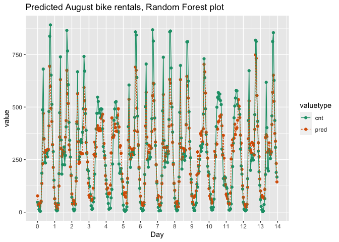<!-- -->

Nice job! The random forest model captured the day-to-day variations in
peak demand better than the quasipoisson model, but it still
underestmates peak demand, and also overestimates minimum demand. So
there is still room for improvement.

## One-Hot-Encoding Categorical Variables

Theory. Coming soon …

## vtreat on a small example

In this exercise you will use `vtreat` to one-hot-encode a categorical
variable on a small example. `vtreat` creates a *treatment plan* to
transform categorical variables into indicator variables (coded
`"lev"`), and to clean bad values out of numerical variables (coded
`"clean"`).

To design a treatment plan use the function
<a href="https://www.rdocumentation.org/packages/vtreat/topics/designTreatmentsZ">`designTreatmentsZ()`</a>

``` r
treatplan <- designTreatmentsZ(data, varlist)
```

-   `data`: the original training data frame
-   `varlist`: a vector of input variables to be treated (as strings).

`designTreatmentsZ()` returns a list with an element `scoreFrame`: a
data frame that includes the names and types of the new variables:

``` r
scoreFrame <- treatplan %>% 
            magrittr::use_series(scoreFrame) %>% 
            select(varName, origName, code)
```

-   `varName`: the name of the new treated variable
-   `origName`: the name of the original variable that the treated
    variable comes from
-   `code`: the type of the new variable.
    -   `"clean"`: a numerical variable with no NAs or NaNs
    -   `"lev"`: an indicator variable for a specific level of the
        original categorical variable.

(<a href="https://www.rdocumentation.org/packages/magrittr/topics/extract">`magrittr::use_series()`</a>
is an alias for `$` that you can use in pipes.)

For these exercises, we want `varName` where `code` is either `"clean"`
or `"lev"`:

``` r
newvarlist <- scoreFrame %>% 
             filter(code %in% c("clean", "lev") %>%
             magrittr::use_series(varName)
```

To transform the data set into all numerical and one-hot-encoded
variables, use
<a href="https://www.rdocumentation.org/packages/vtreat/topics/prepare">`prepare()`</a>:

``` r
data.treat <- prepare(treatplan, data, varRestrictions = newvarlist)
```

-   `treatplan`: the treatment plan
-   `data`: the data frame to be treated
-   `varRestrictions`: the variables desired in the treated data

**Steps**

1.  Print `dframe`. We will assume that `color` and `size` are input
    variables, and `popularity` is the outcome to be predicted.

2.  Create a vector called `vars` with the names of the input variables
    (as strings).

3.  Load the package `vtreat`.

4.  Use `designTreatmentsZ()` to create a treatment plan for the
    variables in `vars`. Assign it to the variable `treatplan`.

5.  Get and examine the `scoreFrame` from the treatment plan to see the
    mapping from old variables to new variables.only need the columns
    `varName`, `origName` and `code`.are the names of the new indicator
    variables? Of the continuous variable?

    -   You only need the columns `varName`, `origName` and `code`.
    -   What are the names of the new indicator variables? Of the
        continuous variable?

6.  Create a vector `newvars` that contains the variable `varName` where
    `code` is either `clean` or `lev`. Print it.

7.  Use `prepare()` to create a new data frame `dframe.treat` that is a
    one-hot-encoded version of `dframe` (without the outcome column). it
    and compare to `dframe`.

    -   Print it and compare to `dframe`.

``` r
# Load package
library(magrittr)
```

    ## 
    ## Attaching package: 'magrittr'

    ## The following object is masked from 'package:tidyr':
    ## 
    ##     extract

``` r
# Load dframe
dframe <- readRDS("data/dframe.rds")

# Create a vector of variable names
(vars <- c("color", "size"))
```

    ## [1] "color" "size"

``` r
# Load the package vtreat
library(vtreat)

# Create the treatment plan
treatplan <- designTreatmentsZ(dframe, vars)
```

    ## [1] "vtreat 1.6.3 inspecting inputs Wed Mar  9 15:22:56 2022"
    ## [1] "designing treatments Wed Mar  9 15:22:56 2022"
    ## [1] " have initial level statistics Wed Mar  9 15:22:56 2022"
    ## [1] " scoring treatments Wed Mar  9 15:22:56 2022"
    ## [1] "have treatment plan Wed Mar  9 15:22:56 2022"

``` r
# Examine the scoreFrame
(scoreFrame <- treatplan %>%
    use_series(scoreFrame) %>%
    select(varName, origName, code))
```

    ##         varName origName  code
    ## 1    color_catP    color  catP
    ## 2          size     size clean
    ## 3 color_lev_x_b    color   lev
    ## 4 color_lev_x_g    color   lev
    ## 5 color_lev_x_r    color   lev

``` r
# We only want the rows with codes "clean" or "lev"
(newvars <- scoreFrame %>%
    filter(code %in% c("clean", "lev")) %>%
    use_series(varName))
```

    ## [1] "size"          "color_lev_x_b" "color_lev_x_g" "color_lev_x_r"

``` r
# Create the treated training data
(dframe.treat <- prepare(treatplan, dframe, varRestriction = newvars))
```

    ##    size color_lev_x_b color_lev_x_g color_lev_x_r
    ## 1    13             1             0             0
    ## 2    11             0             0             1
    ## 3    15             0             0             1
    ## 4    14             0             0             1
    ## 5    13             0             0             1
    ## 6    11             1             0             0
    ## 7     9             0             0             1
    ## 8    12             0             1             0
    ## 9     7             1             0             0
    ## 10   12             1             0             0

Great work! You have successfully one-hot-encoded categorical data. The
new indicator variables have `'_lev_'` in their names, and the new
cleaned continuous variables have `'_clean'` in their names. The treated
data is all numerical, with no missing values, and is suitable for use
with xgboost and other R modeling functions.

## Novel levels

When a level of a categorical variable is rare, sometimes it will fail
to show up in training data. If that rare level then appears in future
data, downstream models may not know what to do with it. When such
*novel levels* appear, using `model.matrix` or `caret::dummyVars` to
one-hot-encode will not work correctly.

`vtreat` is a “safer” alternative to `model.matrix` for
one-hot-encoding, because it can manage novel levels safely. `vtreat`
also manages missing values in the data (both categorical and
continuous).

In this exercise you will see how `vtreat` handles categorical values
that did not appear in the training set. The treatment plan `treatplan`
and the set of variables `newvars` from the previous exercise are still
in your workspace. `dframe` and a new data frame `testframe` are also in
your workspace.

**Steps**

1.  Print `dframe` and `testframe`. there colors in `testframe` that
    didn’t appear in `dframe`?

    -   Are there colors in `testframe` that didn’t appear in `dframe`?

2.  Call `prepare()` to create a one-hot-encoded version of `testframe`
    (without the outcome). Call it `testframe.treat` and print it.the
    `varRestriction` argument to restrict to only the variables in
    `newvars`. are the yellow rows encoded?

    -   Use the `varRestriction` argument to restrict to only the
        variables in `newvars`.
    -   How are the yellow rows encoded?

``` r
# treatplan is in the workspace
summary(treatplan)
```

    ##               Length Class           Mode     
    ## treatments    3      -none-          list     
    ## scoreFrame    8      data.frame      list     
    ## outcomename   1      -none-          character
    ## vtreatVersion 1      package_version list     
    ## outcomeType   1      -none-          character
    ## outcomeTarget 1      -none-          character
    ## meanY         1      -none-          logical  
    ## splitmethod   1      -none-          character

``` r
# newvars is in the workspace
newvars
```

    ## [1] "size"          "color_lev_x_b" "color_lev_x_g" "color_lev_x_r"

``` r
# Print dframe and testframe
dframe
```

    ## # A tibble: 10 × 3
    ##    color  size popularity
    ##    <chr> <dbl>      <dbl>
    ##  1 b        13      1.08 
    ##  2 r        11      1.40 
    ##  3 r        15      0.922
    ##  4 r        14      1.20 
    ##  5 r        13      1.08 
    ##  6 b        11      0.804
    ##  7 r         9      1.10 
    ##  8 g        12      0.875
    ##  9 b         7      0.695
    ## 10 b        12      0.883

``` r
testframe <- readRDS("data/testframe.rds")
testframe
```

    ## # A tibble: 10 × 3
    ##    color  size popularity
    ##    <chr> <dbl>      <dbl>
    ##  1 g         7      0.973
    ##  2 g         8      0.912
    ##  3 y        10      1.42 
    ##  4 g        12      1.19 
    ##  5 g         6      0.987
    ##  6 y         8      1.37 
    ##  7 b        12      1.10 
    ##  8 g        12      0.916
    ##  9 r         8      1.31 
    ## 10 g        12      1.00

``` r
# Use prepare() to one-hot-encode testframe
(testframe.treat <- prepare(treatplan, testframe, varRestriction = newvars))
```

    ##    size color_lev_x_b color_lev_x_g color_lev_x_r
    ## 1     7             0             1             0
    ## 2     8             0             1             0
    ## 3    10             0             0             0
    ## 4    12             0             1             0
    ## 5     6             0             1             0
    ## 6     8             0             0             0
    ## 7    12             1             0             0
    ## 8    12             0             1             0
    ## 9     8             0             0             1
    ## 10   12             0             1             0

Good work! As you saw, vtreat encodes novel colors like yellow that were
not present in the data as all zeros: ‘none of the known colors’. This
allows downstream models to accept these novel values without crashing.

## vtreat the bike rental data

In this exercise you will create one-hot-encoded data frames of the
July/August bike data, for use with `xgboost` later on.

The data frames `bikesJuly` and `bikesAugust` are in the workspace.

For your convenience, we have defined the variable `vars` with the list
of variable columns for the model.

**Steps**

1.  Load the package `vtreat`.

2.  Use `designTreatmentsZ()` to create a treatment plan `treatplan` for
    the variables in `vars` from `bikesJuly` (the training data).the
    flag `verbose=FALSE` to prevent the function from printing too many
    messages.

    -   Set the flag `verbose=FALSE` to prevent the function from
        printing too many messages.

3.  Fill in the blanks to create a vector `newvars` that contains only
    the names of the `clean` and `lev` transformed variables. Print it.

4.  Use `prepare()` to create a one-hot-encoded training data frame
    `bikesJuly.treat`. the `varRestrictions` argument to restrict the
    variables you will use to `newvars`.

    -   Use the `varRestrictions` argument to restrict the variables you
        will use to `newvars`.

5.  Use `prepare()` to create a one-hot-encoded test frame
    `bikesAugust.treat` from `bikesAugust` in the same way.

6.  Call `str()` on both prepared test frames to see the structure.

``` r
# The outcome column
(outcome <- "cnt")
```

    ## [1] "cnt"

``` r
# The input columns
(vars <- c("hr", "holiday", "workingday", "weathersit", "temp", "atemp", "hum", "windspeed"))
```

    ## [1] "hr"         "holiday"    "workingday" "weathersit" "temp"      
    ## [6] "atemp"      "hum"        "windspeed"

``` r
# Load the package vtreat
library(vtreat)

# Create the treatment plan from bikesJuly (the training data)
treatplan <- designTreatmentsZ(bikesJuly, vars, verbose = FALSE)

# Get the "clean" and "lev" variables from the scoreFrame
(newvars <- treatplan %>%
  use_series(scoreFrame) %>%               
  filter(code %in% c("clean", "lev")) %>%  # get the variables you care about
  use_series(varName))                     # get the varName column
```

    ##  [1] "holiday"                                
    ##  [2] "workingday"                             
    ##  [3] "temp"                                   
    ##  [4] "atemp"                                  
    ##  [5] "hum"                                    
    ##  [6] "windspeed"                              
    ##  [7] "hr_lev_x_0"                             
    ##  [8] "hr_lev_x_1"                             
    ##  [9] "hr_lev_x_10"                            
    ## [10] "hr_lev_x_11"                            
    ## [11] "hr_lev_x_12"                            
    ## [12] "hr_lev_x_13"                            
    ## [13] "hr_lev_x_14"                            
    ## [14] "hr_lev_x_15"                            
    ## [15] "hr_lev_x_16"                            
    ## [16] "hr_lev_x_17"                            
    ## [17] "hr_lev_x_18"                            
    ## [18] "hr_lev_x_19"                            
    ## [19] "hr_lev_x_2"                             
    ## [20] "hr_lev_x_20"                            
    ## [21] "hr_lev_x_21"                            
    ## [22] "hr_lev_x_22"                            
    ## [23] "hr_lev_x_23"                            
    ## [24] "hr_lev_x_3"                             
    ## [25] "hr_lev_x_4"                             
    ## [26] "hr_lev_x_5"                             
    ## [27] "hr_lev_x_6"                             
    ## [28] "hr_lev_x_7"                             
    ## [29] "hr_lev_x_8"                             
    ## [30] "hr_lev_x_9"                             
    ## [31] "weathersit_lev_x_Clear_to_partly_cloudy"
    ## [32] "weathersit_lev_x_Light_Precipitation"   
    ## [33] "weathersit_lev_x_Misty"

``` r
# Prepare the training data
bikesJuly.treat <- prepare(treatplan, bikesJuly,  varRestriction = newvars)

# Prepare the test data
bikesAugust.treat <- prepare(treatplan, bikesAugust, varRestriction = newvars)

# Call str() on the treated data
str(bikesJuly.treat) 
```

    ## 'data.frame':    744 obs. of  33 variables:
    ##  $ holiday                                : num  0 0 0 0 0 0 0 0 0 0 ...
    ##  $ workingday                             : num  0 0 0 0 0 0 0 0 0 0 ...
    ##  $ temp                                   : num  0.76 0.74 0.72 0.72 0.7 0.68 0.7 0.74 0.78 0.82 ...
    ##  $ atemp                                  : num  0.727 0.697 0.697 0.712 0.667 ...
    ##  $ hum                                    : num  0.66 0.7 0.74 0.84 0.79 0.79 0.79 0.7 0.62 0.56 ...
    ##  $ windspeed                              : num  0 0.1343 0.0896 0.1343 0.194 ...
    ##  $ hr_lev_x_0                             : num  1 0 0 0 0 0 0 0 0 0 ...
    ##  $ hr_lev_x_1                             : num  0 1 0 0 0 0 0 0 0 0 ...
    ##  $ hr_lev_x_10                            : num  0 0 0 0 0 0 0 0 0 0 ...
    ##  $ hr_lev_x_11                            : num  0 0 0 0 0 0 0 0 0 0 ...
    ##  $ hr_lev_x_12                            : num  0 0 0 0 0 0 0 0 0 0 ...
    ##  $ hr_lev_x_13                            : num  0 0 0 0 0 0 0 0 0 0 ...
    ##  $ hr_lev_x_14                            : num  0 0 0 0 0 0 0 0 0 0 ...
    ##  $ hr_lev_x_15                            : num  0 0 0 0 0 0 0 0 0 0 ...
    ##  $ hr_lev_x_16                            : num  0 0 0 0 0 0 0 0 0 0 ...
    ##  $ hr_lev_x_17                            : num  0 0 0 0 0 0 0 0 0 0 ...
    ##  $ hr_lev_x_18                            : num  0 0 0 0 0 0 0 0 0 0 ...
    ##  $ hr_lev_x_19                            : num  0 0 0 0 0 0 0 0 0 0 ...
    ##  $ hr_lev_x_2                             : num  0 0 1 0 0 0 0 0 0 0 ...
    ##  $ hr_lev_x_20                            : num  0 0 0 0 0 0 0 0 0 0 ...
    ##  $ hr_lev_x_21                            : num  0 0 0 0 0 0 0 0 0 0 ...
    ##  $ hr_lev_x_22                            : num  0 0 0 0 0 0 0 0 0 0 ...
    ##  $ hr_lev_x_23                            : num  0 0 0 0 0 0 0 0 0 0 ...
    ##  $ hr_lev_x_3                             : num  0 0 0 1 0 0 0 0 0 0 ...
    ##  $ hr_lev_x_4                             : num  0 0 0 0 1 0 0 0 0 0 ...
    ##  $ hr_lev_x_5                             : num  0 0 0 0 0 1 0 0 0 0 ...
    ##  $ hr_lev_x_6                             : num  0 0 0 0 0 0 1 0 0 0 ...
    ##  $ hr_lev_x_7                             : num  0 0 0 0 0 0 0 1 0 0 ...
    ##  $ hr_lev_x_8                             : num  0 0 0 0 0 0 0 0 1 0 ...
    ##  $ hr_lev_x_9                             : num  0 0 0 0 0 0 0 0 0 1 ...
    ##  $ weathersit_lev_x_Clear_to_partly_cloudy: num  1 1 1 1 1 1 1 1 1 1 ...
    ##  $ weathersit_lev_x_Light_Precipitation   : num  0 0 0 0 0 0 0 0 0 0 ...
    ##  $ weathersit_lev_x_Misty                 : num  0 0 0 0 0 0 0 0 0 0 ...

``` r
str(bikesAugust.treat)
```

    ## 'data.frame':    744 obs. of  33 variables:
    ##  $ holiday                                : num  0 0 0 0 0 0 0 0 0 0 ...
    ##  $ workingday                             : num  1 1 1 1 1 1 1 1 1 1 ...
    ##  $ temp                                   : num  0.68 0.66 0.64 0.64 0.64 0.64 0.64 0.64 0.66 0.68 ...
    ##  $ atemp                                  : num  0.636 0.606 0.576 0.576 0.591 ...
    ##  $ hum                                    : num  0.79 0.83 0.83 0.83 0.78 0.78 0.78 0.83 0.78 0.74 ...
    ##  $ windspeed                              : num  0.1642 0.0896 0.1045 0.1045 0.1343 ...
    ##  $ hr_lev_x_0                             : num  1 0 0 0 0 0 0 0 0 0 ...
    ##  $ hr_lev_x_1                             : num  0 1 0 0 0 0 0 0 0 0 ...
    ##  $ hr_lev_x_10                            : num  0 0 0 0 0 0 0 0 0 0 ...
    ##  $ hr_lev_x_11                            : num  0 0 0 0 0 0 0 0 0 0 ...
    ##  $ hr_lev_x_12                            : num  0 0 0 0 0 0 0 0 0 0 ...
    ##  $ hr_lev_x_13                            : num  0 0 0 0 0 0 0 0 0 0 ...
    ##  $ hr_lev_x_14                            : num  0 0 0 0 0 0 0 0 0 0 ...
    ##  $ hr_lev_x_15                            : num  0 0 0 0 0 0 0 0 0 0 ...
    ##  $ hr_lev_x_16                            : num  0 0 0 0 0 0 0 0 0 0 ...
    ##  $ hr_lev_x_17                            : num  0 0 0 0 0 0 0 0 0 0 ...
    ##  $ hr_lev_x_18                            : num  0 0 0 0 0 0 0 0 0 0 ...
    ##  $ hr_lev_x_19                            : num  0 0 0 0 0 0 0 0 0 0 ...
    ##  $ hr_lev_x_2                             : num  0 0 1 0 0 0 0 0 0 0 ...
    ##  $ hr_lev_x_20                            : num  0 0 0 0 0 0 0 0 0 0 ...
    ##  $ hr_lev_x_21                            : num  0 0 0 0 0 0 0 0 0 0 ...
    ##  $ hr_lev_x_22                            : num  0 0 0 0 0 0 0 0 0 0 ...
    ##  $ hr_lev_x_23                            : num  0 0 0 0 0 0 0 0 0 0 ...
    ##  $ hr_lev_x_3                             : num  0 0 0 1 0 0 0 0 0 0 ...
    ##  $ hr_lev_x_4                             : num  0 0 0 0 1 0 0 0 0 0 ...
    ##  $ hr_lev_x_5                             : num  0 0 0 0 0 1 0 0 0 0 ...
    ##  $ hr_lev_x_6                             : num  0 0 0 0 0 0 1 0 0 0 ...
    ##  $ hr_lev_x_7                             : num  0 0 0 0 0 0 0 1 0 0 ...
    ##  $ hr_lev_x_8                             : num  0 0 0 0 0 0 0 0 1 0 ...
    ##  $ hr_lev_x_9                             : num  0 0 0 0 0 0 0 0 0 1 ...
    ##  $ weathersit_lev_x_Clear_to_partly_cloudy: num  1 1 1 1 0 0 1 0 0 0 ...
    ##  $ weathersit_lev_x_Light_Precipitation   : num  0 0 0 0 0 0 0 0 0 0 ...
    ##  $ weathersit_lev_x_Misty                 : num  0 0 0 0 1 1 0 1 1 1 ...

Perfect. The bike data is now in completely numeric form, ready to use
with xgboost. Note that the treated data does not include the outcome
column.

## Gradient boosting machines

Theory. Coming soon …

## Find the right number of trees for a gradient boosting machine

In this exercise you will get ready to build a gradient boosting model
to predict the number of bikes rented in an hour as a function of the
weather and the type and time of day. You will train the model on data
from the month of July.

The July data is loaded into your workspace. Remember that
`bikesJuly.treat` no longer has the outcome column, so you must get it
from the untreated data: `bikesJuly$cnt`.

You will use the `xgboost` package to fit the random forest model. The
function
<a href="https://www.rdocumentation.org/packages/xgboost/topics/xgb.cv">`xgb.cv()`</a>
uses cross-validation to estimate the out-of-sample learning error as
each new tree is added to the model. The appropriate number of trees to
use in the final model is the number that minimizes the holdout RMSE.

For this exercise, the key arguments to the `xgb.cv()` call are:

-   `data`: a numeric matrix.
-   `label`: vector of outcomes (also numeric).
-   `nrounds`: the maximum number of rounds (trees to build).
-   `nfold`: the number of folds for the cross-validation. 5 is a good
    number.
-   `objective`: “reg:linear” for continuous outcomes.
-   `eta`: the learning rate.
-   `max_depth`: depth of trees.
-   `early_stopping_rounds`: after this many rounds without improvement,
    stop.
-   `verbose`: 0 to stay silent.

**Steps**

1.  The data frames `bikesJuly` and `bikesJuly.treat` are in the
    workspace.

2.  Load the package `xgboost`.

3.  Fill in the blanks to run `xgb.cv()` on the treated training data;
    assign the output to the variable `cv`.`as.matrix()` to convert the
    vtreated data frame to a matrix. rounds, and 5-fold cross
    validation.`early_stopping_rounds` to 10.`eta` to 0.3, `max_depth`
    to 6.

    -   Use `as.matrix()` to convert the vtreated data frame to a
        matrix.
    -   Use 100 rounds, and 5-fold cross validation.
    -   Set `early_stopping_rounds` to 10.
    -   Set `eta` to 0.3, `max_depth` to 6.

4.  Get the data frame `evaluation_log` from `cv` and assign it to the
    variable `elog`. Each row of the `evaluation_log` corresponds to an
    additional tree, so the row number tells you the number of trees in
    the model.

5.  Fill in the blanks to get the number of trees with the minimum value
    of the columns `train_rmse_mean` and `test_rmse_mean`.`which.min()`
    returns the index of the minimum value in a vector.many trees do you
    need?

    -   `which.min()` returns the index of the minimum value in a
        vector.
    -   How many trees do you need?

``` r
# The July data is in the workspace
ls()
```

    ##  [1] "alcohol"             "bike_model"          "bike_model_rf"      
    ##  [4] "bikesAugust"         "bikesAugust.treat"   "bikesJuly"          
    ##  [7] "bikesJuly.treat"     "bloodpressure"       "bloodpressure_model"
    ## [10] "dframe"              "dframe.treat"        "fdata"              
    ## [13] "fdata2"              "fe_mean"             "first_two_weeks"    
    ## [16] "flower_model"        "flowers"             "fmla"               
    ## [19] "fmla_add"            "fmla_interaction"    "fmla_sqr"           
    ## [22] "fmla.abs"            "fmla.gam"            "fmla.log"           
    ## [25] "gp"                  "houseprice"          "houseprice_long"    
    ## [28] "i"                   "income_long"         "income_test"        
    ## [31] "income_train"        "k"                   "mean_bikes"         
    ## [34] "mmat"                "model"               "model_add"          
    ## [37] "model_interaction"   "model_lin"           "model_sqr"          
    ## [40] "model.abs"           "model.gam"           "model.lin"          
    ## [43] "model.log"           "mpg"                 "mpg_model"          
    ## [46] "mpg_test"            "mpg_train"           "N"                  
    ## [49] "newrates"            "newvars"             "nRows"              
    ## [52] "outcome"             "perf"                "pred"               
    ## [55] "pseudoR2"            "r_squared"           "res"                
    ## [58] "rho"                 "rho2"                "rmse"               
    ## [61] "rmse_test"           "rmse_train"          "rsq"                
    ## [64] "rsq_glance"          "rsq_test"            "rsq_train"          
    ## [67] "rss"                 "scoreFrame"          "sd_unemployment"    
    ## [70] "seed"                "soybean_long"        "soybean_test"       
    ## [73] "soybean_train"       "sparrow"             "sparrow_model"      
    ## [76] "split"               "splitPlan"           "target"             
    ## [79] "testframe"           "testframe.treat"     "treatplan"          
    ## [82] "tss"                 "unemployment"        "unemployment_model" 
    ## [85] "var_bikes"           "vars"

``` r
# Load the package xgboost
library(xgboost)
```

    ## 
    ## Attaching package: 'xgboost'

    ## The following object is masked from 'package:dplyr':
    ## 
    ##     slice

``` r
# Run xgb.cv
cv <- xgb.cv(data = as.matrix(bikesJuly.treat), 
            label = bikesJuly$cnt,
            nrounds = 100,
            nfold = 5,
            objective = "reg:linear",
            eta = 0.3,
            max_depth = 6,
            early_stopping_rounds = 10,
            verbose = 0   # silent
)
```

    ## [15:22:56] WARNING: amalgamation/../src/objective/regression_obj.cu:188: reg:linear is now deprecated in favor of reg:squarederror.
    ## [15:22:56] WARNING: amalgamation/../src/objective/regression_obj.cu:188: reg:linear is now deprecated in favor of reg:squarederror.
    ## [15:22:56] WARNING: amalgamation/../src/objective/regression_obj.cu:188: reg:linear is now deprecated in favor of reg:squarederror.
    ## [15:22:56] WARNING: amalgamation/../src/objective/regression_obj.cu:188: reg:linear is now deprecated in favor of reg:squarederror.
    ## [15:22:56] WARNING: amalgamation/../src/objective/regression_obj.cu:188: reg:linear is now deprecated in favor of reg:squarederror.

``` r
# Get the evaluation log
elog <- cv$evaluation_log

# Determine and print how many trees minimize training and test error
elog %>% 
  summarize(ntrees.train = which.min(train_rmse_mean),   # find the index of min(train_rmse_mean)
            ntrees.test  = which.min(test_rmse_mean))    # find the index of min(test_rmse_mean)
```

    ##   ntrees.train ntrees.test
    ## 1           93          83

Very good! In most cases, `ntrees.test` is less than `ntrees.train`. The
training error keeps decreasing even after the test error starts to
increase. It’s important to use cross-validation to find the right
number of trees (as determined by `ntrees.test`) and avoid an overfit
model.

## Fit an xgboost bike rental model and predict

In this exercise you will fit a gradient boosting model using
`xgboost()` to predict the number of bikes rented in an hour as a
function of the weather and the type and time of day. You will train the
model on data from the month of July and predict on data for the month
of August.

The datasets for July and August are loaded into your workspace.
Remember the `vtreat`-ed data no longer has the outcome column, so you
must get it from the original data (the `cnt` column).

For convenience, the number of trees to use, `ntrees` from the previous
exercise is in the workspace.

The arguments to
<a href="https://www.rdocumentation.org/packages/xgboost/topics/xgb.train">`xgboost()`</a>
are similar to those of `xgb.cv()`.

**Steps**

1.  Fill in the blanks to run `xgboost()` on the July data. Assign the
    model to the variable `model`. `as.matrix()` to convert the vtreated
    data frame to a matrix.objective should be “reg:linear”.`ntrees`
    rounds.`eta` to 0.3, `depth` to 6, and `verbose` to 0 (silent).

    -   Use `as.matrix()` to convert the vtreated data frame to a
        matrix.
    -   The objective should be “reg:linear”.
    -   Use `ntrees` rounds.
    -   Set `eta` to 0.3, `depth` to 6, and `verbose` to 0 (silent).

2.  Now call `predict()` on `bikesAugust.treat` to predict the number of
    bikes rented in August. `as.matrix()` to convert the `vtreat`-ed
    test data into a matrix.the predictions to`bikesAugust` as the
    column `pred`.

    -   Use `as.matrix()` to convert the `vtreat`-ed test data into a
        matrix.
    -   Add the predictions to`bikesAugust` as the column `pred`.

3.  Fill in the blanks to plot actual bike rental counts versus the
    predictions (predictions on the x-axis).you see a possible problem
    with the predictions?

    -   Do you see a possible problem with the predictions?

``` r
# The number of trees to use, as determined by xgb.cv
ntrees <- 76

# Run xgboost
bike_model_xgb <- xgboost(data = as.matrix(bikesJuly.treat), # training data as matrix
                   label = bikesJuly$cnt,  # column of outcomes
                   nrounds = ntrees,       # number of trees to build
                   objective = "reg:linear", # objective
                   eta = 0.3,
                   depth = 6,
                   verbose = 0  # silent
)
```

    ## [15:22:57] WARNING: amalgamation/../src/objective/regression_obj.cu:188: reg:linear is now deprecated in favor of reg:squarederror.
    ## [15:22:57] WARNING: amalgamation/../src/learner.cc:576: 
    ## Parameters: { "depth" } might not be used.
    ## 
    ##   This could be a false alarm, with some parameters getting used by language bindings but
    ##   then being mistakenly passed down to XGBoost core, or some parameter actually being used
    ##   but getting flagged wrongly here. Please open an issue if you find any such cases.

``` r
# Make predictions
bikesAugust$pred <- predict(bike_model_xgb, as.matrix(bikesAugust.treat))

# Plot predictions vs actual bike rental count
ggplot(bikesAugust, aes(x = pred, y = cnt)) + 
  geom_point() + 
  geom_abline()
```

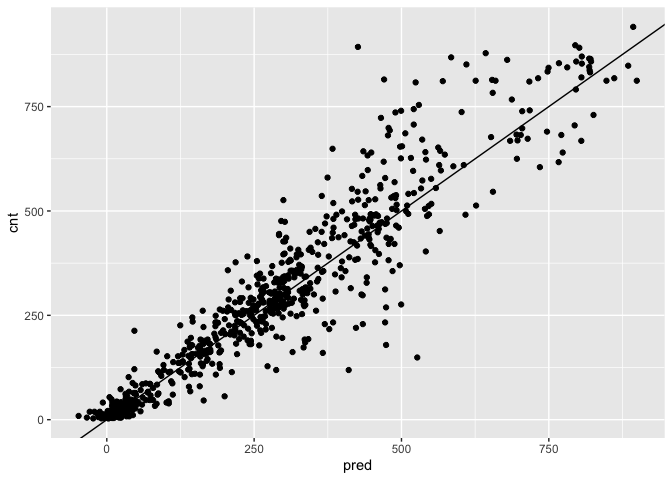<!-- -->

Good! Overall, the scatterplot looked pretty good, but did you notice
that the model made some negative predictions? In the next exercise,
you’ll compare this model’s RMSE to the previous bike models that you’ve
built.

## Evaluate the xgboost bike rental model

In this exercise you will evaluate the gradient boosting model
`bike_model_xgb` that you fit in the last exercise, using data from the
month of August. You’ll compare this model’s RMSE for August to the RMSE
of previous models that you’ve built.

The dataset `bikesAugust` is in the workspace. You have already made
predictions using the `xgboost` model; they are in the column `pred`.

**Steps**

1.  Fill in the blanks to calculate the RMSE of the predictions.

    -   How does it compare to the RMSE from the poisson model (approx.
        112.6) and the random forest model (approx. 96.7)?

``` r
# bikesAugust is in the workspace
str(bikesAugust)
```

    ## 'data.frame':    744 obs. of  13 variables:
    ##  $ hr        : Factor w/ 24 levels "0","1","2","3",..: 1 2 3 4 5 6 7 8 9 10 ...
    ##  $ holiday   : logi  FALSE FALSE FALSE FALSE FALSE FALSE ...
    ##  $ workingday: logi  TRUE TRUE TRUE TRUE TRUE TRUE ...
    ##  $ weathersit: chr  "Clear to partly cloudy" "Clear to partly cloudy" "Clear to partly cloudy" "Clear to partly cloudy" ...
    ##  $ temp      : num  0.68 0.66 0.64 0.64 0.64 0.64 0.64 0.64 0.66 0.68 ...
    ##  $ atemp     : num  0.636 0.606 0.576 0.576 0.591 ...
    ##  $ hum       : num  0.79 0.83 0.83 0.83 0.78 0.78 0.78 0.83 0.78 0.74 ...
    ##  $ windspeed : num  0.1642 0.0896 0.1045 0.1045 0.1343 ...
    ##  $ cnt       : int  47 33 13 7 4 49 185 487 681 350 ...
    ##  $ instant   : int  13748 13749 13750 13751 13752 13753 13754 13755 13756 13757 ...
    ##  $ mnth      : int  8 8 8 8 8 8 8 8 8 8 ...
    ##  $ yr        : int  1 1 1 1 1 1 1 1 1 1 ...
    ##  $ pred      : num  47.67 35.351 0.626 -6.65 3.922 ...

``` r
# Calculate RMSE
bikesAugust %>%
  mutate(residuals = cnt - pred) %>%
  summarize(rmse = sqrt(mean(residuals^2)))
```

    ##       rmse
    ## 1 76.57615

Even though this gradient boosting made some negative predictions,
overall it makes smaller errors than the previous two models. Perhaps
rounding negative predictions up to zero is a reasonable tradeoff.

## Visualize the xgboost bike rental model

You’ve now seen three different ways to model the bike rental data. For
this example, you’ve seen that the gradient boosting model had the
smallest RMSE. To finish up the course, let’s compare the gradient
boosting model’s predictions to the other two models as a function of
time.

On completing this exercise, you will have completed the course.
Congratulations! Now you have the tools to apply a variety of approaches
to your regression tasks.

**Steps**

<!-- 1. Print `quasipoisson_plot` to review the quasipoisson model's behavior. -->
<!-- 2. Print `randomforest_plot` to review the random forest model's behavior. -->

3.  Fill in the blanks to plot the gradient boosting predictions and
    actual counts by hour for the first 14 days of August.`gather()` the
    `cnt` and `pred` columns into a column called `value`, with a key
    called `valuetype`.`value` as a function of `instant` (day).

    -   `gather()` the `cnt` and `pred` columns into a column called
        `value`, with a key called `valuetype`.
    -   Plot `value` as a function of `instant` (day).

How does the gradient boosting model compare to the previous models?

``` r
# Print quasipoisson_plot
# quasipoisson_plot

# Print randomforest_plot
# randomforest_plot

# Plot predictions and actual bike rentals as a function of time (days)
bikesAugust %>% 
  mutate(instant = (instant - min(instant))/24) %>%  # set start to 0, convert unit to days
  gather(key = valuetype, value = value, cnt, pred) %>%
  filter(instant < 14) %>% # first two weeks
  ggplot(aes(x = instant, y = value, color = valuetype, linetype = valuetype)) + 
  geom_point() + 
  geom_line() + 
  scale_x_continuous("Day", breaks = 0:14, labels = 0:14) + 
  scale_color_brewer(palette = "Dark2") + 
  ggtitle("Predicted August bike rentals, Gradient Boosting model")
```

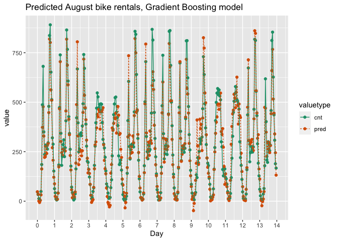<!-- -->

Great job! The gradient boosting pattern captures rental variations due
to time of day and other factors better than the previous models.
Congratulations on completing the course!
