Unsupervised Learning in R
================
Joschka Schwarz

-   [1. Unsupervised learning in R](#1-unsupervised-learning-in-r)
    -   [Welcome to the course!](#welcome-to-the-course)
    -   [Identify clustering problems](#identify-clustering-problems)
    -   [Introduction to k-means
        clustering](#introduction-to-k-means-clustering)
    -   [k-means clustering](#k-means-clustering)
    -   [Results of kmeans()](#results-of-kmeans)
    -   [Visualizing and interpreting results of
        kmeans()](#visualizing-and-interpreting-results-of-kmeans)
    -   [How k-means works and practical
        matters](#how-k-means-works-and-practical-matters)
    -   [Handling random algorithms](#handling-random-algorithms)
    -   [Selecting number of clusters](#selecting-number-of-clusters)
    -   [Introduction to the Pokemon
        data](#introduction-to-the-pokemon-data)
    -   [Practical matters: working with real
        data](#practical-matters-working-with-real-data)
    -   [Review of k-means clustering](#review-of-k-means-clustering)
-   [2. Hierarchical clustering](#2-hierarchical-clustering)
    -   [Introduction to hierarchical
        clustering](#introduction-to-hierarchical-clustering)
    -   [Hierarchical clustering with
        results](#hierarchical-clustering-with-results)
    -   [Selecting number of clusters](#selecting-number-of-clusters-1)
    -   [Interpreting dendrogram](#interpreting-dendrogram)
    -   [Cutting the tree](#cutting-the-tree)
    -   [Clustering linkage and practical
        matters](#clustering-linkage-and-practical-matters)
    -   [Linkage methods](#linkage-methods)
    -   [Comparing linkage methods](#comparing-linkage-methods)
    -   [Practical matters: scaling](#practical-matters-scaling)
    -   [Comparing kmeans() and hclust()](#comparing-kmeans-and-hclust)
    -   [Review of hierarchical
        clustering](#review-of-hierarchical-clustering)
-   [3. Dimensionality reduction with
    PCA](#3-dimensionality-reduction-with-pca)
    -   [Introduction to PCA](#introduction-to-pca)
    -   [PCA using prcomp()](#pca-using-prcomp)
    -   [Results of PCA](#results-of-pca)
    -   [Additional results of PCA](#additional-results-of-pca)
    -   [Visualizing and interpreting PCA
        results](#visualizing-and-interpreting-pca-results)
    -   [Interpreting biplots (1)](#interpreting-biplots-1)
    -   [Interpreting biplots (2)](#interpreting-biplots-2)
    -   [Variance explained](#variance-explained)
    -   [Visualize variance explained](#visualize-variance-explained)
    -   [Practical issues with PCA](#practical-issues-with-pca)
    -   [Practical issues: scaling](#practical-issues-scaling)
    -   [Additional uses of PCA and
        wrap-up](#additional-uses-of-pca-and-wrap-up)
-   [4. Putting it all together with a case
    study](#4-putting-it-all-together-with-a-case-study)
    -   [Introduction to the case
        study](#introduction-to-the-case-study)
    -   [Preparing the data](#preparing-the-data)
    -   [Exploratory data analysis](#exploratory-data-analysis)
    -   [Performing PCA](#performing-pca)
    -   [Interpreting PCA results](#interpreting-pca-results)
    -   [Variance explained](#variance-explained-1)
    -   [PCA review and next steps](#pca-review-and-next-steps)
    -   [Communicating PCA results](#communicating-pca-results)
    -   [Hierarchical clustering of case
        data](#hierarchical-clustering-of-case-data)
    -   [Results of hierarchical
        clustering](#results-of-hierarchical-clustering)
    -   [Selecting number of clusters](#selecting-number-of-clusters-2)
    -   [k-means clustering and comparing
        results](#k-means-clustering-and-comparing-results)
    -   [Clustering on PCA results](#clustering-on-pca-results)

**Short Description**

This course provides an intro to clustering and dimensionality reduction
in R from a machine learning perspective.

**Long Description**

Many times in machine learning, the goal is to find patterns in data
without trying to make predictions. This is called unsupervised
learning. One common use case of unsupervised learning is grouping
consumers based on demographics and purchasing history to deploy
targeted marketing campaigns. Another example is wanting to describe the
unmeasured factors that most influence crime differences between cities.
This course provides a basic introduction to clustering and
dimensionality reduction in R from a machine learning perspective, so
that you can get from data to insights as quickly as possible.

# 1. Unsupervised learning in R

The k-means algorithm is one common approach to clustering. Learn how
the algorithm works under the hood, implement k-means clustering in R,
visualize and interpret the results, and select the number of clusters
when it’s not known ahead of time. By the end of the chapter, you’ll
have applied k-means clustering to a fun “real-world” dataset!

## Welcome to the course!

Theory. Coming soon …

## Identify clustering problems

> ## *Question*
>
> Which of the following are clustering problems?
>
> 1.  Determining how many features it takes to describe most of the
>     variability in data
> 2.  Determining the natural groupings of houses for sale based on
>     size, number of bedrooms, etc.
> 3.  Visualizing 13 dimensional data (data with 13 features)
> 4.  Determining if there are common patterns in the demographics of
>     people at a commerce site
> 5.  Predicting if someone will click on a web advertisement <br> ⬜ 1,
>     3, and 5<br> ⬜ 2 and 3<br> ⬜ 1, 2, and 4<br> ✅ 2 and 4<br> ⬜
>     All 5 are clustering problems<br>

## Introduction to k-means clustering

Theory. Coming soon …

## k-means clustering

We have created some two-dimensional data and stored it in a variable
called `x` in your workspace. The scatter plot on the right is a visual
representation of the data.

In this exercise, your task is to create a k-means model of the `x` data
using 3 clusters, then to look at the structure of the resulting model
using the
<a href="https://www.rdocumentation.org/packages/base/topics/summary">`summary()`</a>
function.

**Steps**

1.  Fit a k-means model to `x` using 3 centers and run the k-means
    algorithm 20 times. Store the result in `km.out`.
2.  Inspect the result with the `summary()` function.

``` r
# load data
x <- readRDS("data/x.rds")
plot(x)
```

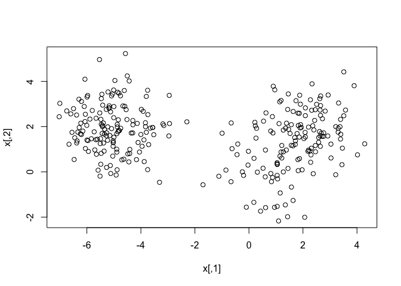<!-- -->

``` r
# Create the k-means model: km.out
km.out <- kmeans(x, centers = 3, nstart = 20)

# Inspect the result
summary(km.out)
```

    ##              Length Class  Mode   
    ## cluster      300    -none- numeric
    ## centers        6    -none- numeric
    ## totss          1    -none- numeric
    ## withinss       3    -none- numeric
    ## tot.withinss   1    -none- numeric
    ## betweenss      1    -none- numeric
    ## size           3    -none- numeric
    ## iter           1    -none- numeric
    ## ifault         1    -none- numeric

Great work!

## Results of kmeans()

The `kmeans()` function produces several outputs. In the video, we
discussed one output of modeling, the cluster membership.

In this exercise, you will access the `cluster` component directly. This
is useful anytime you need the cluster membership for each observation
of the data used to build the clustering model. A future exercise will
show an example of how this cluster membership might be used to help
communicate the results of k-means modeling.

k-means models also have a print method to give a human friendly output
of basic modeling results. This is available by using `print()` or
simply typing the name of the model.

**Steps**

1.  Print a list of the cluster membership to the console.
2.  Use a print method to print out the `km.out` model.

``` r
# Print the cluster membership component of the model
km.out$cluster
```

    ##   [1] 1 1 1 1 1 1 1 1 1 1 1 1 3 1 1 1 1 3 3 1 1 1 1 1 1 1 1 1 1 1 1 1 1 1 1 1 3
    ##  [38] 3 3 1 1 1 1 3 1 1 1 1 1 1 1 1 1 1 1 1 1 1 3 1 1 1 1 1 1 1 1 1 1 1 1 1 1 3
    ##  [75] 1 1 1 1 1 1 1 1 1 1 1 1 1 1 1 1 1 1 1 1 1 1 1 1 1 1 2 2 2 2 2 2 2 2 2 2 2
    ## [112] 2 2 2 2 2 2 2 2 2 2 2 2 2 2 2 2 2 2 2 2 2 2 2 2 2 2 2 2 2 2 2 2 2 2 2 2 2
    ## [149] 2 2 2 2 2 2 2 2 2 2 2 2 2 2 2 2 2 2 2 2 2 2 2 2 2 2 2 2 2 2 2 2 2 2 2 2 2
    ## [186] 2 2 2 2 2 2 2 2 2 2 2 2 2 2 2 2 2 2 2 2 2 2 2 2 2 2 2 2 2 2 2 2 2 2 2 2 2
    ## [223] 2 2 2 2 2 2 2 2 2 2 2 2 2 2 2 2 2 2 2 2 2 2 2 2 2 2 2 2 3 3 3 3 1 3 3 3 3
    ## [260] 3 3 3 3 3 3 3 3 3 3 3 3 3 3 3 3 1 1 3 3 1 3 3 3 3 3 3 1 3 3 3 3 3 3 1 3 3
    ## [297] 3 1 3 3

``` r
# Print the km.out object
km.out
```

    ## K-means clustering with 3 clusters of sizes 98, 150, 52
    ## 
    ## Cluster means:
    ##         [,1]        [,2]
    ## 1  2.2171113  2.05110690
    ## 2 -5.0556758  1.96991743
    ## 3  0.6642455 -0.09132968
    ## 
    ## Clustering vector:
    ##   [1] 1 1 1 1 1 1 1 1 1 1 1 1 3 1 1 1 1 3 3 1 1 1 1 1 1 1 1 1 1 1 1 1 1 1 1 1 3
    ##  [38] 3 3 1 1 1 1 3 1 1 1 1 1 1 1 1 1 1 1 1 1 1 3 1 1 1 1 1 1 1 1 1 1 1 1 1 1 3
    ##  [75] 1 1 1 1 1 1 1 1 1 1 1 1 1 1 1 1 1 1 1 1 1 1 1 1 1 1 2 2 2 2 2 2 2 2 2 2 2
    ## [112] 2 2 2 2 2 2 2 2 2 2 2 2 2 2 2 2 2 2 2 2 2 2 2 2 2 2 2 2 2 2 2 2 2 2 2 2 2
    ## [149] 2 2 2 2 2 2 2 2 2 2 2 2 2 2 2 2 2 2 2 2 2 2 2 2 2 2 2 2 2 2 2 2 2 2 2 2 2
    ## [186] 2 2 2 2 2 2 2 2 2 2 2 2 2 2 2 2 2 2 2 2 2 2 2 2 2 2 2 2 2 2 2 2 2 2 2 2 2
    ## [223] 2 2 2 2 2 2 2 2 2 2 2 2 2 2 2 2 2 2 2 2 2 2 2 2 2 2 2 2 3 3 3 3 1 3 3 3 3
    ## [260] 3 3 3 3 3 3 3 3 3 3 3 3 3 3 3 3 1 1 3 3 1 3 3 3 3 3 3 1 3 3 3 3 3 3 1 3 3
    ## [297] 3 1 3 3
    ## 
    ## Within cluster sum of squares by cluster:
    ## [1] 148.64781 295.16925  95.50625
    ##  (between_SS / total_SS =  87.2 %)
    ## 
    ## Available components:
    ## 
    ## [1] "cluster"      "centers"      "totss"        "withinss"     "tot.withinss"
    ## [6] "betweenss"    "size"         "iter"         "ifault"

Take a look at all the different components of a k-means model object as
you may need to access them in later exercises. Because printing the
whole model object to the console outputs many different things, you may
wish to instead print a specific component of the model object using the
`$` operator. Great work!

## Visualizing and interpreting results of kmeans()

One of the more intuitive ways to interpret the results of k-means
models is by plotting the data as a scatter plot and using color to
label the samples’ cluster membership. In this exercise, you will use
the standard `plot()` function to accomplish this.

To create a scatter plot, you can pass data with two features
(i.e. columns) to `plot()` with an extra argument
`col = km.out$cluster`, which sets the color of each point in the
scatter plot according to its cluster membership.

**Steps**

1.  Using the `plot()` function to create a scatter plot of data `x`:

    -   Color the dots on the scatterplot by setting the `col` argument
        to the `cluster` component in `km.out`.
    -   Title the plot `"k-means with 3 clusters"` using the `main`
        argument to `plot()`.
    -   Ensure there are no axis labels by specifying `""` for both the
        `xlab` and `ylab` arguments to `plot()`.

``` r
# Scatter plot of x
plot(x, col = km.out$cluster,
     main = "k-means with 3 clusters", 
     xlab = "", ylab = "")
```

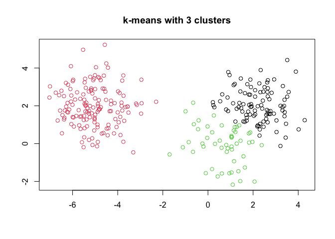<!-- -->

Excellent! Let’s see how the `kmeans()` function works under the hood in
the next video.

## How k-means works and practical matters

Theory. Coming soon …

## Handling random algorithms

In the video, you saw how `kmeans()` randomly initializes the centers of
clusters. This random initialization can result in assigning
observations to different cluster labels. Also, the random
initialization can result in finding different *local minima* for the
k-means algorithm. This exercise will demonstrate both results.

At the top of each plot, the measure of model quality—total within
cluster sum of squares error—will be plotted. Look for the model(s) with
the lowest error to find models with the better model results.

Because `kmeans()` initializes observations to random clusters, it is
important to set the random number generator seed for reproducibility.

**Steps**

Your task is to generate six `kmeans()` models on the data, plotting the
results of each, in order to see the impact of random initializations on
model results.

    * Set the random number seed to 1 with `set.seed()`.
    * For each iteration of the `for` loop, run `kmeans()` on `x`. Assume the number of clusters is 3 and number of starts (`nstart`) is 1.
    * Visualize the cluster memberships using the `col` argument to `plot()`. Observe how the measure of quality and cluster assignments vary among the six model runs.

``` r
# Set up 2 x 3 plotting grid
par(mfrow = c(2, 3))

# Set seed
set.seed(1)

for(i in 1:6) {
  # Run kmeans() on x with three clusters and one start
  km.out <- kmeans(x, centers = 3, nstart = 1)
  
  # Plot clusters
  plot(x, col = km.out$cluster, 
       main = km.out$tot.withinss, 
       xlab = "", ylab = "")
}
```

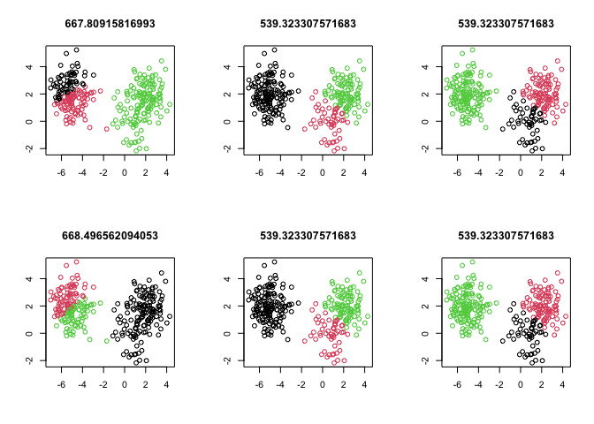<!-- -->

Interesting! Because of the random initialization of the k-means
algorithm, there’s quite some variation in cluster assignments among the
six models.

## Selecting number of clusters

The k-means algorithm assumes the number of clusters as part of the
input. If you know the number of clusters in advance (e.g. due to
certain business constraints) this makes setting the number of clusters
easy. However, as you saw in the video, if you do not know the number of
clusters and need to determine it, you will need to run the algorithm
multiple times, each time with a different number of clusters. From
this, you can observe how a measure of model quality changes with the
number of clusters.

In this exercise, you will run `kmeans()` multiple times to see how
model quality changes as the number of clusters changes. Plots
displaying this information help to determine the number of clusters and
are often referred to as *scree plots*.

The ideal plot will have an *elbow* where the quality measure improves
more slowly as the number of clusters increases. This indicates that the
quality of the model is no longer improving substantially as the model
complexity (i.e. number of clusters) increases. In other words, the
elbow indicates the number of clusters inherent in the data.

**Steps**

1.  Build 15 `kmeans()` models on `x`, each with a different number of
    clusters (ranging from 1 to 15). Set `nstart = 20` for all model
    runs and save the total within cluster sum of squares for each model
    to the `i`th element of `wss`.
2.  Run the code provided to create a scree plot of the `wss` for all 15
    models.
3.  Take a look at your scree plot. How many clusters are inherent in
    the data? Set `k` equal to the number of clusters at the location of
    the elbow.

``` r
# Initialize total within sum of squares error: wss
wss <- 0

# For 1 to 15 cluster centers
for (i in 1:15) {
  km.out <- kmeans(x, centers = i, nstart = 20)
  # Save total within sum of squares to wss variable
  wss[i] <- km.out$tot.withinss
}

# Plot total within sum of squares vs. number of clusters
plot(1:15, wss, type = "b", 
     xlab = "Number of Clusters", 
     ylab = "Within groups sum of squares")
```

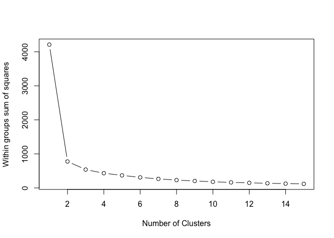<!-- -->

``` r
# Set k equal to the number of clusters corresponding to the elbow location
k <- 2  # 3 is probably OK, too
```

Looking at the scree plot, it looks like there are inherently 2 or 3
clusters in the data. Awesome job!

## Introduction to the Pokemon data

Theory. Coming soon …

## Practical matters: working with real data

Dealing with real data is often more challenging than dealing with
synthetic data. Synthetic data helps with learning new concepts and
techniques, but the next few exercises will deal with data that is
closer to the type of real data you might find in your professional or
academic pursuits.

The first challenge with the Pokemon data is that there is no
pre-determined number of clusters. You will determine the appropriate
number of clusters, keeping in mind that in real data the *elbow* in the
scree plot might be less of a sharp elbow than in synthetic data. Use
your judgement on making the determination of the number of clusters.

The second part of this exercise includes plotting the outcomes of the
clustering on two dimensions, or features, of the data. These features
were chosen somewhat arbitrarily for this exercise. Think about how you
would use plotting and clustering to communicate interesting groups of
Pokemon to other people.

An additional note: this exercise utilizes the `iter.max` argument to
`kmeans()`. As you’ve seen, `kmeans()` is an iterative algorithm,
repeating over and over until some stopping criterion is reached. The
default number of iterations for `kmeans()` is 10, which is not enough
for the algorithm to converge and reach its stopping criterion, so we’ll
set the number of iterations to 50 to overcome this issue. To see what
happens when `kmeans()` does not converge, try running the example with
a lower number of iterations (e.g. 3). This is another example of what
might happen when you encounter real data and use real cases.

**Steps**

The `pokemon` dataset, which contains observations of 800 Pokemon
characters on 6 dimensions (i.e. features), is available.

1.  Using `kmeans()` with `nstart = 20`, determine the total within sum
    of square errors for different numbers of clusters (between 1 and
    15).
2.  Pick an appropriate number of clusters based on these results from
    the first instruction and assign that number to `k`.
3.  Create a k-means model using `k` clusters and assign it to the
    `km.out` variable.
4.  Create a scatter plot of `Defense` vs. `Speed`, showing cluster
    membership for each observation.

``` r
# Load package
library(readr)
library(dplyr)
```

    ## 
    ## Attaching package: 'dplyr'

    ## The following objects are masked from 'package:stats':
    ## 
    ##     filter, lag

    ## The following objects are masked from 'package:base':
    ## 
    ##     intersect, setdiff, setequal, union

``` r
# load data
pokemon <- read_csv("data/Pokemon.csv") |> 
              select(HitPoints:Speed) |> 
              as.matrix()
```

    ## Rows: 800 Columns: 13

    ## ── Column specification ────────────────────────────────────────────────────────
    ## Delimiter: ","
    ## chr (3): Name, Type1, Type2
    ## dbl (9): Number, Total, HitPoints, Attack, Defense, SpecialAttack, SpecialDe...
    ## lgl (1): Legendary

    ## 
    ## ℹ Use `spec()` to retrieve the full column specification for this data.
    ## ℹ Specify the column types or set `show_col_types = FALSE` to quiet this message.

``` r
# Initialize total within sum of squares error: wss
wss <- 0

# Look over 1 to 15 possible clusters
for (i in 1:15) {
  # Fit the model: km.out
  km.out <- kmeans(pokemon, centers = i, nstart = 20, iter.max = 50)
  # Save the within cluster sum of squares
  wss[i] <- km.out$tot.withinss
}

# Produce a scree plot
plot(1:15, wss, type = "b", 
     xlab = "Number of Clusters", 
     ylab = "Within groups sum of squares")
```

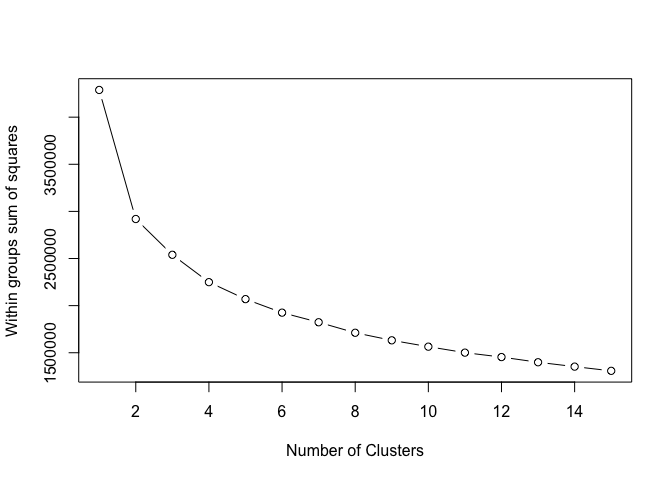<!-- -->

``` r
# Select number of clusters (2, 3, 4 probably OK)
k <- 3

# Build model with k clusters: km.out
km.out <- kmeans(pokemon, centers = k, nstart = 20, iter.max = 50)

# View the resulting model
km.out
```

    ## K-means clustering with 3 clusters of sizes 270, 355, 175
    ## 
    ## Cluster means:
    ##   HitPoints   Attack   Defense SpecialAttack SpecialDefense    Speed
    ## 1  81.90370 96.15926  77.65556     104.12222       86.87778 94.71111
    ## 2  54.68732 56.93239  53.64507      52.02254       53.04789 53.58873
    ## 3  79.30857 97.29714 108.93143      66.71429       87.04571 57.29143
    ## 
    ## Clustering vector:
    ##   [1] 2 2 1 1 2 2 1 1 1 2 2 3 1 2 2 2 2 2 2 1 2 2 1 1 2 2 2 1 2 1 2 1 2 3 2 2 3
    ##  [38] 2 2 1 2 1 2 1 2 2 2 1 2 2 1 2 3 2 1 2 2 2 1 2 1 2 1 2 1 2 2 3 2 1 1 1 2 3
    ##  [75] 3 2 2 1 2 1 2 3 3 2 1 2 3 3 2 1 2 2 1 2 3 2 3 2 3 2 1 1 1 3 2 3 2 3 2 1 2
    ## [112] 1 2 3 3 3 2 2 3 2 3 2 3 3 3 2 1 2 3 2 1 1 1 1 1 1 3 3 3 2 3 3 3 2 2 1 1 1
    ## [149] 2 2 3 2 3 1 1 3 1 1 1 2 2 1 1 1 1 1 2 2 3 2 2 1 2 2 3 2 2 2 1 2 2 2 2 1 2
    ## [186] 1 2 2 2 2 2 2 1 2 2 1 1 3 2 2 3 1 2 2 1 2 2 2 2 2 3 1 3 2 3 1 2 2 1 2 3 2
    ## [223] 3 3 3 2 3 2 3 3 3 3 3 2 2 3 2 3 2 3 2 2 1 2 1 3 2 1 1 1 2 3 1 1 2 2 3 2 2
    ## [260] 2 3 1 1 1 3 2 2 3 3 1 1 1 2 2 1 1 2 2 1 1 2 2 3 3 2 2 2 2 2 2 2 2 2 2 2 1
    ## [297] 2 2 1 2 2 2 3 2 2 1 1 2 2 2 3 2 2 1 2 1 2 2 2 1 2 3 2 3 2 2 2 3 2 3 2 3 3
    ## [334] 3 2 2 1 2 1 1 2 2 2 2 2 2 3 2 1 1 2 1 2 1 3 3 2 1 2 2 2 1 2 1 2 3 1 1 1 1
    ## [371] 3 2 3 2 3 2 3 2 3 2 3 2 1 2 3 2 1 1 2 3 3 2 1 1 2 2 1 1 2 2 1 2 3 3 3 2 2
    ## [408] 3 1 1 2 3 3 1 3 3 3 1 1 1 1 1 1 3 1 1 1 1 1 1 3 1 2 3 3 2 2 1 2 2 1 2 2 1
    ## [445] 2 2 2 2 2 2 1 2 1 2 3 2 3 2 3 3 3 1 2 3 2 2 1 2 1 2 3 1 2 1 2 1 1 1 1 2 1
    ## [482] 2 2 1 2 3 2 2 2 2 3 2 2 1 1 2 2 1 1 2 3 2 3 2 1 3 2 1 2 2 1 3 1 1 3 3 3 1
    ## [519] 1 1 1 3 1 3 1 1 1 1 3 3 1 1 1 1 1 1 1 3 1 1 1 1 1 1 1 1 3 1 1 1 1 1 1 1 2
    ## [556] 2 1 2 2 1 2 2 1 2 2 2 2 3 2 1 2 1 2 1 2 1 2 3 2 2 1 2 1 2 3 3 2 1 2 1 3 3
    ## [593] 2 3 3 2 2 1 3 3 2 2 1 2 2 1 2 1 2 1 1 2 2 1 2 3 1 1 2 3 2 3 1 2 3 2 3 2 1
    ## [630] 2 3 2 1 2 1 2 2 3 2 2 1 2 1 2 2 1 2 1 1 2 3 2 3 2 1 3 2 1 2 3 2 3 3 2 2 1
    ## [667] 2 1 2 2 1 2 3 3 2 3 1 2 1 3 2 1 3 2 3 2 3 3 2 3 2 3 1 3 2 2 1 2 1 1 1 1 1
    ## [704] 1 1 1 1 1 1 1 1 1 1 1 1 1 1 1 2 3 3 2 2 1 2 2 1 2 2 2 2 1 2 2 2 2 1 2 2 1
    ## [741] 2 1 2 3 1 2 1 1 2 3 1 3 2 3 2 1 2 3 2 3 2 3 2 1 2 1 2 3 2 1 1 1 1 3 2 1 1
    ## [778] 3 2 3 2 2 2 2 3 3 3 3 2 3 2 1 1 1 3 3 1 1 1 1
    ## 
    ## Within cluster sum of squares by cluster:
    ## [1] 1018348.0  812079.9  709020.5
    ##  (between_SS / total_SS =  40.8 %)
    ## 
    ## Available components:
    ## 
    ## [1] "cluster"      "centers"      "totss"        "withinss"     "tot.withinss"
    ## [6] "betweenss"    "size"         "iter"         "ifault"

``` r
# Plot of Defense vs. Speed by cluster membership
plot(pokemon[, c("Defense", "Speed")],
     col = km.out$cluster,
     main = paste("k-means clustering of Pokemon with", k, "clusters"),
     xlab = "Defense", ylab = "Speed")
```

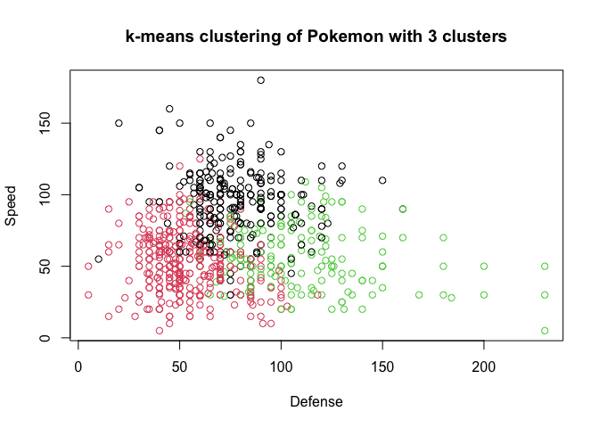<!-- -->

Nice job! You’re really getting the hang of k-means clustering quickly!

## Review of k-means clustering

Theory. Coming soon …

# 2. Hierarchical clustering

Hierarchical clustering is another popular method for clustering. The
goal of this chapter is to go over how it works, how to use it, and how
it compares to k-means clustering.

## Introduction to hierarchical clustering

Theory. Coming soon …

## Hierarchical clustering with results

In this exercise, you will create your first hierarchical clustering
model using the
<a href="https://www.rdocumentation.org/packages/stats/topics/hclust">`hclust()`</a>
function.

We have created some data that has two dimensions and placed it in a
variable called `x`. Your task is to create a hierarchical clustering
model of `x`. Remember from the video that the first step to
hierarchical clustering is determining the similarity between
observations, which you will do with the
<a href="https://www.rdocumentation.org/packages/stats/topics/dist">`dist()`</a>
function.

You will look at the structure of the resulting model using the
`summary()` function.

**Steps**

1.  Fit a hierarchical clustering model to `x` using the `hclust()`
    function. Store the result in `hclust.out`.
2.  Inspect the result with the `summary()` function.

``` r
# load data
x2 <- readRDS("data/x2.rds")

# Create hierarchical clustering model: hclust.out
hclust.out <- hclust(dist(x2))

# Inspect the result
summary(hclust.out)
```

    ##             Length Class  Mode     
    ## merge       98     -none- numeric  
    ## height      49     -none- numeric  
    ## order       50     -none- numeric  
    ## labels       0     -none- NULL     
    ## method       1     -none- character
    ## call         2     -none- call     
    ## dist.method  1     -none- character

Awesome! Now that you’ve made your first hierarchical clustering model,
let’s learn how to use it to solve problems.

## Selecting number of clusters

Theory. Coming soon …

## Interpreting dendrogram

The plot displayed to the right shows the `hclust.out` model you
constructed in the previous exercise. We’ve drawn horizontal lines at
heights of 3.5, 4.5, 6.9, and 9.0, respectively.

> ## *Question*
>
> Which cut point yields 3 clusters?<br> <br> ⬜ 3.5<br> ⬜ 4.5<br> ✅
> 6.9<br> ⬜ 9.0<br>

Correct! If you cut the tree at a height of 6.9, you’re left with 3
branches representing 3 distinct clusters.

## Cutting the tree

Remember from the video that
<a href="https://www.rdocumentation.org/packages/stats/topics/cutree">`cutree()`</a>
is the R function that cuts a hierarchical model. The `h` and `k`
arguments to `cutree()` allow you to cut the tree based on a certain
height `h` or a certain number of clusters `k`.

In this exercise, you will use `cutree()` to cut the hierarchical model
you created earlier based on each of these two criteria.

**Steps**

1.  Cut the `hclust.out` model at height 7.
2.  Cut the `hclust.out` model to create 3 clusters.

``` r
# Cut by height
cutree(hclust.out, h = 7)
```

    ##  [1] 1 1 1 1 1 1 1 1 2 1 1 1 1 1 1 1 1 1 1 1 1 1 1 1 1 3 3 3 3 3 3 3 3 3 3 2 2 2
    ## [39] 2 2 2 2 2 2 2 2 2 2 2 2

``` r
# Cut by number of clusters
cutree(hclust.out, k = 3)
```

    ##  [1] 1 1 1 1 1 1 1 1 2 1 1 1 1 1 1 1 1 1 1 1 1 1 1 1 1 3 3 3 3 3 3 3 3 3 3 2 2 2
    ## [39] 2 2 2 2 2 2 2 2 2 2 2 2

If you’re wondering what the output means, remember, there are 50
observations in the original dataset `x`. The output of each `cutree()`
call represents the cluster assignments for each observation in the
original dataset. Great work!

## Clustering linkage and practical matters

Theory. Coming soon …

## Linkage methods

In this exercise, you will produce hierarchical clustering models using
different linkages and plot the dendrogram for each, observing the
overall structure of the trees.

You’ll be asked to interpret the results in the next exercise.

**Steps**

1.  Produce three hierarchical clustering models on `x` using the
    `"complete"`, `"average"`, and `"single"` linkage methods,
    respectively.
2.  Plot a dendrogram for each model, using titles of `"Complete"`,
    `"Average"`, and `"Single"`, respectively.

``` r
# Cluster using complete linkage: hclust.complete
hclust.complete <- hclust(dist(x2), method = "complete")

# Cluster using average linkage: hclust.average
hclust.average <- hclust(dist(x2), method = "average")

# Cluster using single linkage: hclust.single
hclust.single <- hclust(dist(x2), method = "single")

# Plot dendrogram of hclust.complete
plot(hclust.complete, main = "Complete")
```

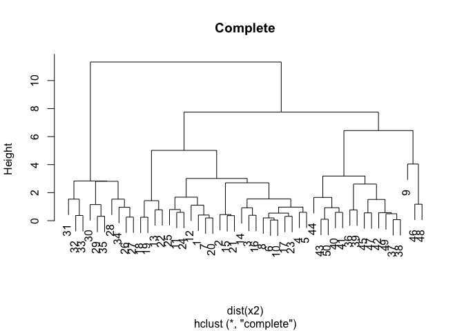<!-- -->

``` r
# Plot dendrogram of hclust.average
plot(hclust.average, main = "Average")
```

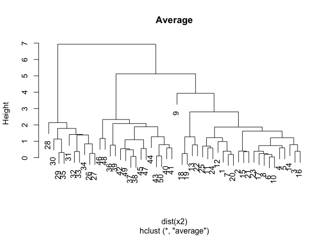<!-- -->

``` r
# Plot dendrogram of hclust.single
plot(hclust.single, main = "Single")
```

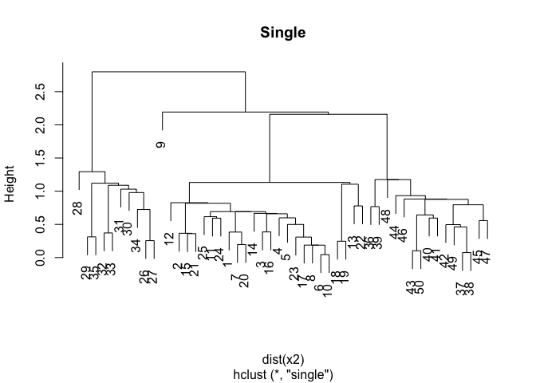<!-- -->

Before moving on, make sure to toggle through the plots to compare and
contrast the three dendrograms you created. You’ll learn about the
implications of these differences in the next exercise. Excellent work!

## Comparing linkage methods

The models you created in the last exercise—`hclust.complete`,
`hclust.average`, and `hclust.single`—are available in your workspace.

> ## *Question*
>
> Which linkage(s) produce balanced trees?<br> <br> ⬜ Complete only<br>
> ⬜ Average only<br> ⬜ Single only<br> ⬜ Average and single<br> ✅
> Complete and average<br> ⬜ All three<br>

Right! Whether you want balanced or unbalanced trees for your
hierarchical clustering model depends on the context of the problem
you’re trying to solve. Balanced trees are essential if you want an even
number of observations assigned to each cluster. On the other hand, if
you want to detect outliers, for example, an unbalanced tree is more
desirable because pruning an unbalanced tree can result in most
observations assigned to one cluster and only a few observations
assigned to other clusters.

## Practical matters: scaling

Recall from the video that clustering real data may require *scaling*
the features if they have different distributions. So far in this
chapter, you have been working with synthetic data that did not need
scaling.

In this exercise, you will go back to working with “real” data, the
`pokemon` dataset introduced in the first chapter. You will observe the
distribution (mean and standard deviation) of each feature, scale the
data accordingly, then produce a hierarchical clustering model using the
complete linkage method.

**Steps**

1.  Observe the mean of each variable in `pokemon` using the
    `colMeans()` function.
2.  Observe the standard deviation of each variable using the `apply()`
    and `sd()` functions. Since the variables are the columns of your
    matrix, make sure to specify 2 as the `MARGIN` argument to
    `apply()`.
3.  Scale the `pokemon` data using the `scale()` function and store the
    result in `pokemon.scaled`.
4.  Create a hierarchical clustering model of the `pokemon.scaled` data
    using the complete linkage method. Manually specify the `method`
    argument and store the result in `hclust.pokemon`.

``` r
# View column means
colMeans(pokemon)
```

    ##      HitPoints         Attack        Defense  SpecialAttack SpecialDefense 
    ##       69.25875       79.00125       73.84250       72.82000       71.90250 
    ##          Speed 
    ##       68.27750

``` r
# View column standard deviations
apply(pokemon, 2, sd)
```

    ##      HitPoints         Attack        Defense  SpecialAttack SpecialDefense 
    ##       25.53467       32.45737       31.18350       32.72229       27.82892 
    ##          Speed 
    ##       29.06047

``` r
# Scale the data
pokemon.scaled <- scale(pokemon)

# Create hierarchical clustering model: hclust.pokemon
hclust.pokemon <- hclust(dist(pokemon.scaled), method = "complete")
```

Let’s quickly recap what you just did. You first checked to see if the
column means and standard deviations vary. Because they do, you scaled
the data, converted the scaled data to a similarity matrix and passed it
into the `hclust()` function. Great work!

## Comparing kmeans() and hclust()

Comparing k-means and hierarchical clustering, you’ll see the two
methods produce different cluster memberships. This is because the two
algorithms make different assumptions about how the data is generated.
In a more advanced course, we could choose to use one model over another
based on the quality of the models’ assumptions, but for now, it’s
enough to observe that they are different.

This exercise will have you compare results from the two models on the
`pokemon` dataset to see how they differ.

**Steps**

The results from running k-means clustering on the `pokemon` data (for 3
clusters) are stored as `km.pokemon`.

1.  Using `cutree()` on `hclust.pokemon`, assign cluster membership to
    each observation. Assume three clusters and assign the result to a
    vector called `cut.pokemon`.
2.  Using `table()`, compare cluster membership between the two
    clustering methods. Recall that the different components of k-means
    model objects can be accessed with the `$` operator.

``` r
# Load data
# km.pokemon <- kmeans(scale(pokemon), centers = k)
km.pokemon <- readRDS("data/km.pokemon.rds")

# Apply cutree() to hclust.pokemon: cut.pokemon
cut.pokemon <- cutree(hclust.pokemon, k = 3)

# Compare methods
table(km.pokemon$cluster, cut.pokemon)
```

    ##    cut.pokemon
    ##       1   2   3
    ##   1 204   9   1
    ##   2 342   1   0
    ##   3 242   1   0

Looking at the table, it looks like the hierarchical clustering model
assigns most of the observations to cluster 1, while the k-means
algorithm distributes the observations relatively evenly among all
clusters. It’s important to note that there’s no consensus on which
method produces better clusters. The job of the analyst in unsupervised
clustering is to observe the cluster assignments and make a judgment
call as to which method provides more insights into the data. Excellent
job!

## Review of hierarchical clustering

Theory. Coming soon …

# 3. Dimensionality reduction with PCA

Principal component analysis, or PCA, is a common approach to
dimensionality reduction. Learn exactly what PCA does, visualize the
results of PCA with biplots and scree plots, and deal with practical
issues such as centering and scaling the data before performing PCA.

## Introduction to PCA

Theory. Coming soon …

## PCA using prcomp()

In this exercise, you will create your first PCA model and observe the
diagnostic results.

We have loaded the Pokemon data from earlier, which has four dimensions,
and placed it in a variable called `pokemon`. Your task is to create a
PCA model of the data, then to inspect the resulting model using the
`summary()` function.

**Steps**

1.  Create a PCA model of the data in `pokemon`, setting `scale` to
    `TRUE`. Store the result in `pr.out`.
2.  Inspect the result with the `summary()` function.

``` r
# Load data
pokemon <- readRDS("data/pokemon50.rds")

# Perform scaled PCA: pr.out
pr.out <- prcomp(pokemon, scale = TRUE)

# Inspect model output
summary(pr.out)
```

    ## Importance of components:
    ##                           PC1    PC2    PC3     PC4
    ## Standard deviation     1.4420 1.0013 0.7941 0.53595
    ## Proportion of Variance 0.5199 0.2507 0.1577 0.07181
    ## Cumulative Proportion  0.5199 0.7705 0.9282 1.00000

Nice job!

## Results of PCA

This exercise will check your understanding of the `summary()` of a PCA
model. Your model from the last exercise, `pr.out`, and the `pokemon`
dataset are still available in your workspace.

> ## *Question*
>
> What is the minimum number of principal components that are required
> to describe at least 75% of the cumulative variance in this
> dataset?<br> <br> ⬜ 1<br> ✅ 2<br> ⬜ 3<br> ⬜ 4<br>

Right! The first two principal components describe around 77% of the
variance.

## Additional results of PCA

PCA models in R produce additional diagnostic and output components:

-   `center`: the column means used to center to the data, or `FALSE` if
    the data weren’t centered
-   `scale`: the column standard deviations used to scale the data, or
    `FALSE` if the data weren’t scaled
-   `rotation`: the directions of the principal component vectors in
    terms of the original features/variables. This information allows
    you to define new data in terms of the original principal components
-   `x`: the value of each observation in the original dataset projected
    to the principal components

You can access these the same as other model components. For example,
use `pr.out$rotation` to access the `rotation` component.

> ## *Question*
>
> Which of the following statements is **not** correct regarding the
> `pr.out` model fit on the `pokemon` data?<br> <br> ⬜ The `x`
> component is a table with the same dimensions as the original
> data.<br> ⬜ The data were centered prior to performing PCA.<br> ⬜
> The data were scaled prior to performing PCA.<br> ✅ The directions of
> the principal component vectors are presented in a table with the same
> dimensions as the original data.<br>

Right! Calling `dim()` on `pr.out$rotation` and `pokemon`, you can see
they have different dimensions.

## Visualizing and interpreting PCA results

Theory. Coming soon …

## Interpreting biplots (1)

As stated in the video, the
<a href="https://www.rdocumentation.org/packages/stats/topics/biplot">`biplot()`</a>
function plots both the principal components loadings and the mapping of
the observations to their first two principal component values. The next
couple of exercises will check your interpretation of the `biplot()`
visualization.

``` r
biplot(pr.out)
```

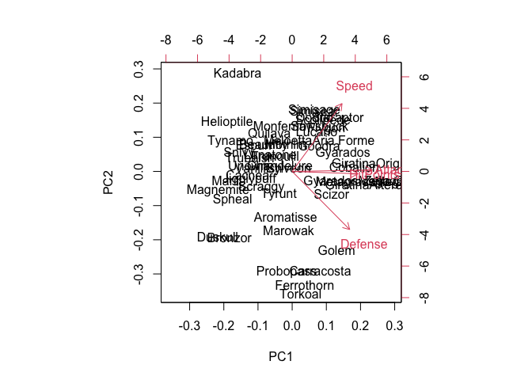<!-- -->

> ## *Question*
>
> Using the `biplot()` of the `pr.out` model, which two original
> variables have approximately the same loadings in the first two
> principal components?<br> <br> ✅ `Attack` and `HitPoints`<br> ⬜
> `Attack` and `Speed`<br> ⬜ `Speed` and `Defense`<br> ⬜ `HitPoints`
> and `Defense`<br>

Good job! Continue to the next exercise.

## Interpreting biplots (2)

In the last exercise, you saw that `Attack` and `HitPoints` have
approximately the same loadings in the first two principal components.

> ## *Question*
>
> Again using the `biplot()` of the `pr.out` model, which two Pokemon
> are the least similar in terms of the second principal component?<br>
> <br> ✅ Kadabra and Torkoal<br> ⬜ Magnemite and Origin<br> ⬜ Forme
> and Goodra<br> ⬜ Marowak and Golem<br>

Nice one!

## Variance explained

The second common plot type for understanding PCA models is a *scree
plot*. A scree plot shows the variance explained as the number of
principal components increases. Sometimes the cumulative variance
explained is plotted as well.

In this and the next exercise, you will prepare data from the `pr.out`
model you created at the beginning of the chapter for use in a scree
plot. Preparing the data for plotting is required because there is not a
built-in function in R to create this type of plot.

**Steps**

1.  Assign to the variable `pr.var` the square of the standard
    deviations of the principal components (i.e. the variance). The
    standard deviation of the principal components is available in the
    `sdev` component of the PCA model object.
2.  Assign to the variable `pve` the proportion of the variance
    explained, calculated by dividing `pr.var` by the total variance
    explained by all principal components.

``` r
# Variability of each principal component: pr.var
pr.var <- pr.out$sdev^2

# Variance explained by each principal component: pve
pve <- pr.var / sum(pr.var)
```

Great work!

## Visualize variance explained

Now you will create a scree plot showing the proportion of variance
explained by each principal component, as well as the cumulative
proportion of variance explained.

Recall from the video that these plots can help to determine the number
of principal components to retain. One way to determine the number of
principal components to retain is by looking for an elbow in the scree
plot showing that as the number of principal components increases, the
rate at which variance is explained decreases substantially. In the
absence of a clear elbow, you can use the scree plot as a guide for
setting a threshold.

**Steps**

The proportion of variance explained is still available in the `pve`
object.

1.  Use `plot()` to plot the proportion of variance explained by each
    principal component.
2.  Use `plot()` and `cumsum()` (cumulative sum) to plot the cumulative
    proportion of variance explained as a function of the number
    principal components.

``` r
# Plot variance explained for each principal component
plot(pve, xlab = "Principal Component",
     ylab = "Proportion of Variance Explained",
     ylim = c(0, 1), type = "b")
```

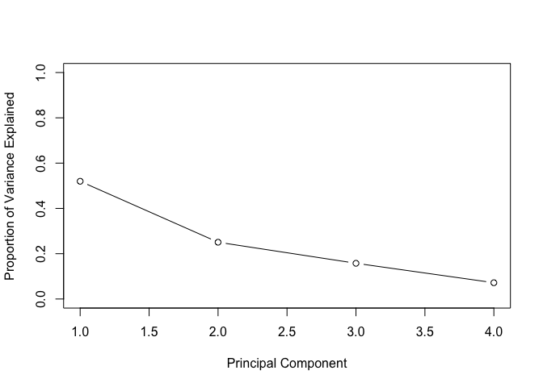<!-- -->

``` r
# Plot cumulative proportion of variance explained
plot(cumsum(pve), xlab = "Principal Component",
     ylab = "Cumulative Proportion of Variance Explained",
     ylim = c(0, 1), type = "b")
```

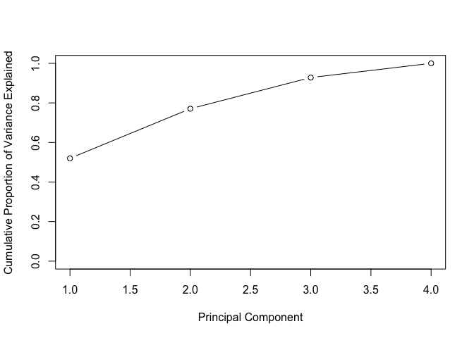<!-- -->

Awesome! Notice that when the number of principal components is equal to
the number of original features in the data, the cumulative proportion
of variance explained is 1.

## Practical issues with PCA

Theory. Coming soon …

## Practical issues: scaling

You saw in the video that scaling your data before doing PCA changes the
results of the PCA modeling. Here, you will perform PCA with and without
scaling, then visualize the results using biplots.

Sometimes scaling is appropriate when the variances of the variables are
substantially different. This is commonly the case when variables have
different units of measurement, for example, degrees Fahrenheit
(temperature) and miles (distance). Making the decision to use scaling
is an important step in performing a principal component analysis.

**Steps**

The same Pokemon dataset is available in your workspace as `pokemon`,
but one new variable has been added: `Total`.

1.  There is some code at the top of the editor to calculate the mean
    and standard deviation of each variable in the model. Run this code
    to see how the scale of the variables differs in the original data.
2.  Create a PCA model of `pokemon` with scaling, assigning the result
    to `pr.with.scaling`.
3.  Create a PCA model of `pokemon` without scaling, assigning the
    result to `pr.without.scaling`.
4.  Use `biplot()` to plot both models (one at a time) and compare their
    outputs.

``` r
# Load data
pokemon <- readRDS("data/pokemon50_total.rds")

# Mean of each variable
colMeans(pokemon)
```

    ##     Total HitPoints    Attack   Defense     Speed 
    ##    448.82     71.08     81.22     78.44     66.58

``` r
# Standard deviation of each variable
apply(pokemon, 2, sd)
```

    ##     Total HitPoints    Attack   Defense     Speed 
    ## 119.32321  25.62193  33.03078  32.05809  27.51036

``` r
# PCA model with scaling: pr.with.scaling
pr.with.scaling <- prcomp(pokemon, scale = TRUE)

# PCA model without scaling: pr.without.scaling
pr.without.scaling <- prcomp(pokemon, scale = FALSE)

# Create biplots of both for comparison
biplot(pr.with.scaling)
```

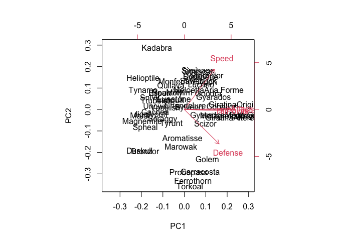<!-- -->

``` r
biplot(pr.without.scaling)
```

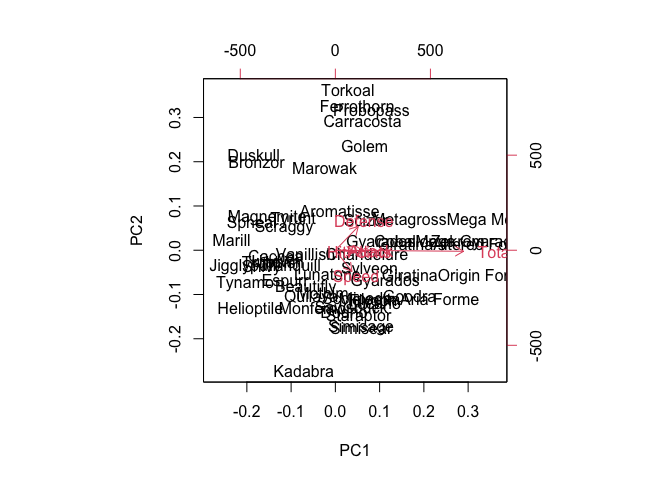<!-- -->

Good job! The new `Total` column contains much more variation, on
average, than the other four columns, so it has a disproportionate
effect on the PCA model when scaling is not performed. After scaling the
data, there’s a much more even distribution of the loading vectors.

## Additional uses of PCA and wrap-up

Theory. Coming soon …

# 4. Putting it all together with a case study

The goal of this chapter is to guide you through a complete analysis
using the unsupervised learning techniques covered in the first three
chapters. You’ll extend what you’ve learned by combining PCA as a
preprocessing step to clustering using data that consist of measurements
of cell nuclei of human breast masses.

## Introduction to the case study

Theory. Coming soon …

## Preparing the data

Unlike prior chapters, where we prepared the data for you for
unsupervised learning, the goal of this chapter is to step you through a
more realistic and complete workflow.

Recall from the video that the first step is to download and prepare the
data.

**Steps**

1.  Use `read.csv()` function to download the CSV (comma-separated
    values) file containing the data from the URL provided. Assign the
    result to `wisc.df`.
2.  Use `as.matrix()` to convert the features of the data (in columns 3
    through 32) to a matrix. Store this in a variable called
    `wisc.data`.
3.  Assign the row names of `wisc.data` the values currently contained
    in the `id` column of `wisc.df`. While not strictly required, this
    will help you keep track of the different observations throughout
    the modeling process.
4.  Finally, set a vector called `diagnosis` to be `1` if a diagnosis is
    malignant (`"M"`) and `0` otherwise. Note that R coerces `TRUE` to 1
    and `FALSE` to 0.

``` r
# Download the data: wisc.df
wisc_df <- read_csv("data/WisconsinCancer.csv")
```

    ## New names:
    ## * `` -> ...33

    ## Warning: One or more parsing issues, see `problems()` for details

    ## Rows: 569 Columns: 33

    ## ── Column specification ────────────────────────────────────────────────────────
    ## Delimiter: ","
    ## chr  (1): diagnosis
    ## dbl (31): id, radius_mean, texture_mean, perimeter_mean, area_mean, smoothne...
    ## lgl  (1): ...33

    ## 
    ## ℹ Use `spec()` to retrieve the full column specification for this data.
    ## ℹ Specify the column types or set `show_col_types = FALSE` to quiet this message.

``` r
# Convert the features of the data: wisc.data
wisc_data <- as.matrix(wisc_df[3:32])

# Set the row names of wisc.data
row.names(wisc_data) <- wisc_df$id

# Create diagnosis vector
diagnosis <- as.numeric(wisc_df$diagnosis == "M")
```

Great work! You’ve successfully prepared the data for exploratory data
analysis.

## Exploratory data analysis

The first step of any data analysis, unsupervised or supervised, is to
familiarize yourself with the data.

The variables you created before, `wisc.data` and `diagnosis`, are still
available in your workspace. Explore the data to answer the following
questions:

> ## *Question*
>
> 1.  How many observations are in this dataset?<br>
> 2.  How many variables/features in the data are suffixed with
>     \_mean?<br>
> 3.  How many of the observations have a malignant diagnosis?<br> <br>
>     ⬜ 569, 5, 112<br> ⬜ 30, 10, 212<br> ✅ 569, 10, 212<br> ⬜ 30,
>     5, 112<br>

## Performing PCA

The next step in your analysis is to perform PCA on `wisc.data`.

You saw in the last chapter that it’s important to check if the data
need to be scaled before performing PCA. Recall two common reasons for
scaling data:

1.  The input variables use different units of measurement.
2.  The input variables have *significantly* different variances.

**Steps**

1.  Check the mean and standard deviation of the features of the data to
    determine if the data should be scaled. Use the `colMeans()` and
    `apply()` functions like you’ve done before.
2.  Execute PCA on the `wisc.data`, scaling if appropriate, and assign
    the model to `wisc.pr`.
3.  Inspect a summary of the results with the `summary()` function.

``` r
# Check column means and standard deviations
colMeans(wisc_data)
```

    ##             radius_mean            texture_mean          perimeter_mean 
    ##            1.412729e+01            1.928965e+01            9.196903e+01 
    ##               area_mean         smoothness_mean        compactness_mean 
    ##            6.548891e+02            9.636028e-02            1.043410e-01 
    ##          concavity_mean     concave points_mean           symmetry_mean 
    ##            8.879932e-02            4.891915e-02            1.811619e-01 
    ##  fractal_dimension_mean               radius_se              texture_se 
    ##            6.279761e-02            4.051721e-01            1.216853e+00 
    ##            perimeter_se                 area_se           smoothness_se 
    ##            2.866059e+00            4.033708e+01            7.040979e-03 
    ##          compactness_se            concavity_se       concave points_se 
    ##            2.547814e-02            3.189372e-02            1.179614e-02 
    ##             symmetry_se    fractal_dimension_se            radius_worst 
    ##            2.054230e-02            3.794904e-03            1.626919e+01 
    ##           texture_worst         perimeter_worst              area_worst 
    ##            2.567722e+01            1.072612e+02            8.805831e+02 
    ##        smoothness_worst       compactness_worst         concavity_worst 
    ##            1.323686e-01            2.542650e-01            2.721885e-01 
    ##    concave points_worst          symmetry_worst fractal_dimension_worst 
    ##            1.146062e-01            2.900756e-01            8.394582e-02

``` r
apply(wisc_data, 2, sd)
```

    ##             radius_mean            texture_mean          perimeter_mean 
    ##            3.524049e+00            4.301036e+00            2.429898e+01 
    ##               area_mean         smoothness_mean        compactness_mean 
    ##            3.519141e+02            1.406413e-02            5.281276e-02 
    ##          concavity_mean     concave points_mean           symmetry_mean 
    ##            7.971981e-02            3.880284e-02            2.741428e-02 
    ##  fractal_dimension_mean               radius_se              texture_se 
    ##            7.060363e-03            2.773127e-01            5.516484e-01 
    ##            perimeter_se                 area_se           smoothness_se 
    ##            2.021855e+00            4.549101e+01            3.002518e-03 
    ##          compactness_se            concavity_se       concave points_se 
    ##            1.790818e-02            3.018606e-02            6.170285e-03 
    ##             symmetry_se    fractal_dimension_se            radius_worst 
    ##            8.266372e-03            2.646071e-03            4.833242e+00 
    ##           texture_worst         perimeter_worst              area_worst 
    ##            6.146258e+00            3.360254e+01            5.693570e+02 
    ##        smoothness_worst       compactness_worst         concavity_worst 
    ##            2.283243e-02            1.573365e-01            2.086243e-01 
    ##    concave points_worst          symmetry_worst fractal_dimension_worst 
    ##            6.573234e-02            6.186747e-02            1.806127e-02

``` r
# Execute PCA, scaling if appropriate: wisc.pr
wisc_pr <- prcomp(wisc_data, scale = TRUE)

# Look at summary of results
summary(wisc_pr)
```

    ## Importance of components:
    ##                           PC1    PC2     PC3     PC4     PC5     PC6     PC7
    ## Standard deviation     3.6444 2.3857 1.67867 1.40735 1.28403 1.09880 0.82172
    ## Proportion of Variance 0.4427 0.1897 0.09393 0.06602 0.05496 0.04025 0.02251
    ## Cumulative Proportion  0.4427 0.6324 0.72636 0.79239 0.84734 0.88759 0.91010
    ##                            PC8    PC9    PC10   PC11    PC12    PC13    PC14
    ## Standard deviation     0.69037 0.6457 0.59219 0.5421 0.51104 0.49128 0.39624
    ## Proportion of Variance 0.01589 0.0139 0.01169 0.0098 0.00871 0.00805 0.00523
    ## Cumulative Proportion  0.92598 0.9399 0.95157 0.9614 0.97007 0.97812 0.98335
    ##                           PC15    PC16    PC17    PC18    PC19    PC20   PC21
    ## Standard deviation     0.30681 0.28260 0.24372 0.22939 0.22244 0.17652 0.1731
    ## Proportion of Variance 0.00314 0.00266 0.00198 0.00175 0.00165 0.00104 0.0010
    ## Cumulative Proportion  0.98649 0.98915 0.99113 0.99288 0.99453 0.99557 0.9966
    ##                           PC22    PC23   PC24    PC25    PC26    PC27    PC28
    ## Standard deviation     0.16565 0.15602 0.1344 0.12442 0.09043 0.08307 0.03987
    ## Proportion of Variance 0.00091 0.00081 0.0006 0.00052 0.00027 0.00023 0.00005
    ## Cumulative Proportion  0.99749 0.99830 0.9989 0.99942 0.99969 0.99992 0.99997
    ##                           PC29    PC30
    ## Standard deviation     0.02736 0.01153
    ## Proportion of Variance 0.00002 0.00000
    ## Cumulative Proportion  1.00000 1.00000

## Interpreting PCA results

Now you’ll use some visualizations to better understand your PCA model.
You were introduced to one of these visualizations, the biplot, in an
earlier chapter.

You’ll run into some common challenges with using biplots on real-world
data containing a non-trivial number of observations and variables, then
you’ll look at some alternative visualizations. You are encouraged to
experiment with additional visualizations before moving on to the next
exercise.

**Steps**

1.  Create a biplot of the `wisc.pr` data. *What stands out to you about
    this plot? Is it easy or difficult to understand? Why?*
2.  Execute the code to scatter plot each observation by principal
    components 1 and 2, coloring the points by the diagnosis.
3.  Repeat the same for principal components 1 and 3. *What do you
    notice about these plots?*

``` r
# Create a biplot of wisc.pr
biplot(wisc_pr)
```

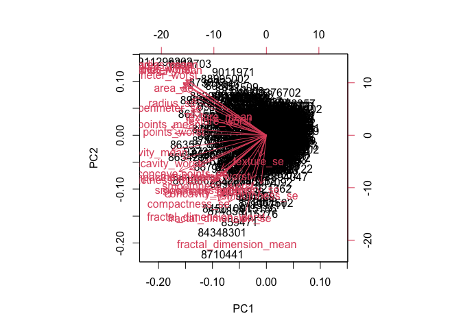<!-- -->

``` r
# Scatter plot observations by components 1 and 2
plot(wisc_pr$x[, c(1, 2)], col = (diagnosis + 1), 
     xlab = "PC1", ylab = "PC2")
```

<!-- -->

``` r
# Repeat for components 1 and 3
plot(wisc_pr$x[, c(1, 3)], col = (diagnosis + 1), 
     xlab = "PC1", ylab = "PC3")
```

<!-- -->

Excellent work! Because principal component 2 explains more variance in
the original data than principal component 3, you can see that the first
plot has a cleaner cut separating the two subgroups.

## Variance explained

In this exercise, you will produce scree plots showing the proportion of
variance explained as the number of principal components increases. The
data from PCA must be prepared for these plots, as there is not a
built-in function in R to create them directly from the PCA model.

As you look at these plots, ask yourself if there’s an elbow in the
amount of variance explained that might lead you to pick a natural
number of principal components. If an obvious elbow does not exist, as
is typical in real-world datasets, consider how else you might determine
the number of principal components to retain based on the scree plot.

**Steps**

1.  Calculate the variance of each principal component by squaring the
    `sdev` component of `wisc.pr`. Save the result as an object called
    `pr.var`.
2.  Calculate the variance explained by each principal component by
    dividing by the total variance explained of all principal
    components. Assign this to a variable called `pve`.
3.  Create a plot of variance explained for each principal component.
4.  Using the `cumsum()` function, create a plot of cumulative
    proportion of variance explained.

``` r
# Set up 1 x 2 plotting grid
par(mfrow = c(1, 2))

# Calculate variability of each component
pr_var <- wisc_pr$sdev^2

# Variance explained by each principal component: pve
pve <- pr_var / sum(pr_var)

# Plot variance explained for each principal component
plot(pve, xlab = "Principal Component", 
     ylab = "Proportion of Variance Explained", 
     ylim = c(0, 1), type = "b")

# Plot cumulative proportion of variance explained
plot(cumsum(pve), xlab = "Principal Component", 
     ylab = "Cumulative Proportion of Variance Explained", 
     ylim = c(0, 1), type = "b")
```

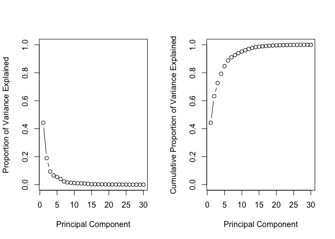<!-- -->

Great work! Before moving on, answer the following question: What is the
minimum number of principal components needed to explain 80% of the
variance in the data? Write it down as you may need this in the next
exercise :)

## PCA review and next steps

Theory. Coming soon …

## Communicating PCA results

This exercise will check your understanding of the PCA results, in
particular the loadings and variance explained. The loadings,
represented as vectors, explain the mapping from the original features
to the principal components. The principal components are naturally
ordered from the most variance explained to the least variance
explained.

The variables you created before—`wisc.data`, `diagnosis`, `wisc.pr`,
and `pve`—are still available.

> ## *Question*
>
> For the first principal component, what is the component of the
> loading vector for the feature `concave.points_mean`? What is the
> minimum number of principal components required to explain 80% of the
> variance of the data?<br> <br> ✅ -0.26085376, 5<br> ⬜ -0.25088597,
> 2<br> ⬜ 0.034767500, 4<br> ⬜ 0.26085376, 5<br>

## Hierarchical clustering of case data

The goal of this exercise is to do hierarchical clustering of the
observations. Recall from Chapter 2 that this type of clustering does
not assume in advance the number of natural groups that exist in the
data.

As part of the preparation for hierarchical clustering, distance between
all pairs of observations are computed. Furthermore, there are different
ways to *link* clusters together, with *single*, *complete*, and
*average* being the most common linkage methods.

**Steps**

1.  Scale the `wisc.data` data and assign the result to `data.scaled`.
2.  Calculate the (Euclidean) distances between all pairs of
    observations in the new scaled dataset and assign the result to
    `data.dist`.
3.  Create a hierarchical clustering model using complete linkage.
    Manually specify the `method` argument to `hclust()` and assign the
    results to `wisc.hclust`.

``` r
# Scale the wisc.data data: data.scaled
data_scaled <- scale(wisc_data)

# Calculate the (Euclidean) distances: data.dist
data_dist <- dist(data_scaled)

# Create a hierarchical clustering model: wisc.hclust
wisc_hclust <- hclust(data_dist, method = "complete")
```

## Results of hierarchical clustering

Let’s use the hierarchical clustering model you just created to
determine a height (or distance between clusters) where a certain number
of clusters exists. The variables you created before—`wisc.data`,
`diagnosis`, `wisc.pr`, `pve`, and `wisc.hclust`—are all available in
your workspace.

> ## *Question*
>
> Using the `plot()` function, what is the height at which the
> clustering model has 4 clusters?<br> <br> ✅ 20<br> ⬜ 4<br> ⬜ 10<br>
> ⬜ 24<br>

## Selecting number of clusters

In this exercise, you will compare the outputs from your hierarchical
clustering model to the actual diagnoses. Normally when performing
*unsupervised* learning like this, a target variable isn’t available. We
do have it with this dataset, however, so it can be used to check the
performance of the clustering model.

When performing *supervised* learning—that is, when you’re trying to
predict some target variable of interest and that target variable is
available in the original data—using clustering to create new features
may or may not improve the performance of the final model. This exercise
will help you determine if, in this case, hierarchical clustering
provides a promising new feature.

**Steps**

1.  Use `cutree()` to cut the tree so that it has 4 clusters. Assign the
    output to the variable `wisc_hclust_clusters`.
2.  Use the `table()` function to compare the cluster membership to the
    actual diagnoses.

``` r
# Cut tree so that it has 4 clusters: wisc.hclust.clusters
wisc_hclust_clusters <- cutree(wisc_hclust, k = 4)

# Compare cluster membership to actual diagnoses
table(wisc_hclust_clusters, diagnosis)
```

    ##                     diagnosis
    ## wisc_hclust_clusters   0   1
    ##                    1  12 165
    ##                    2   2   5
    ##                    3 343  40
    ##                    4   0   2

Four clusters were picked after some exploration. Before moving on, you
may want to explore how different numbers of clusters affect the ability
of the hierarchical clustering to separate the different diagnoses.
Great job!

## k-means clustering and comparing results

As you now know, there are two main types of clustering: hierarchical
and k-means.

In this exercise, you will create a k-means clustering model on the
Wisconsin breast cancer data and compare the results to the actual
diagnoses and the results of your hierarchical clustering model. Take
some time to see how each clustering model performs in terms of
separating the two diagnoses and how the clustering models compare to
each other.

**Steps**

1.  `wisc.data`, `diagnosis`, and `wisc.hclust.clusters` are still
    available.

    -   Create a k-means model on `wisc.data`, assigning the result to
        `wisc.km`. Be sure to create 2 clusters, corresponding to the
        actual number of diagnosis. Also, remember to scale the data and
        repeat the algorithm 20 times to find a well performing model.
    -   Use the `table()` function to compare the cluster membership of
        the k-means model to the actual diagnoses contained in the
        `diagnosis` vector. *How well does k-means separate the two
        diagnoses?*
    -   Use the `table()` function to compare the cluster membership of
        the k-means model to the hierarchical clustering model. Recall
        the cluster membership of the hierarchical clustering model is
        contained in `wisc.hclust.clusters`.

``` r
# Create a k-means model on wisc.data: wisc.km
wisc_km <- kmeans(scale(wisc_data), centers = 2, nstart = 20)

# Compare k-means to actual diagnoses
table(wisc_km$cluster, diagnosis)
```

    ##    diagnosis
    ##       0   1
    ##   1 343  37
    ##   2  14 175

``` r
# Compare k-means to hierarchical clustering
table(wisc_km$cluster, wisc_hclust_clusters)
```

    ##    wisc_hclust_clusters
    ##       1   2   3   4
    ##   1  17   0 363   0
    ##   2 160   7  20   2

Nice! Looking at the second table you generated, it looks like clusters
1, 2, and 4 from the hierarchical clustering model can be interpreted as
the cluster 1 equivalent from the k-means algorithm, and cluster 3 can
be interpreted as the cluster 2 equivalent.

## Clustering on PCA results

In this final exercise, you will put together several steps you used
earlier and, in doing so, you will experience some of the creativity
that is typical in unsupervised learning.

Recall from earlier exercises that the PCA model required significantly
fewer features to describe 80% and 95% of the variability of the data.
In addition to *normalizing* data and potentially avoiding overfitting,
PCA also uncorrelates the variables, sometimes improving the performance
of other modeling techniques.

Let’s see if PCA improves or degrades the performance of hierarchical
clustering.

**Steps**

1.  Using the minimum number of principal components required to
    describe at least 90% of the variability in the data, create a
    hierarchical clustering model with complete linkage. Assign the
    results to `wisc_pr_hclust`.
2.  Cut this hierarchical clustering model into 4 clusters and assign
    the results to `wisc_pr_hclust_clusters`.
3.  Using `table()`, compare the results from your new hierarchical
    clustering model with the actual diagnoses. How well does the newly
    created model with four clusters separate out the two diagnoses?
4.  How well do the k-means and hierarchical clustering models you
    created in previous exercises do in terms of separating the
    diagnoses? Again, use the `table()` function to compare the output
    of each model with the vector containing the actual diagnoses.

``` r
# Create a hierarchical clustering model: wisc.pr.hclust
wisc_pr_hclust <- hclust(dist(wisc_pr$x[, 1:7]), method = "complete")

# Cut model into 4 clusters: wisc_pr_hclust_clusters
wisc_pr_hclust_clusters <- cutree(wisc_pr_hclust, k = 4)

# Compare to actual diagnoses
table(wisc_pr_hclust_clusters, diagnosis)
```

    ##                        diagnosis
    ## wisc_pr_hclust_clusters   0   1
    ##                       1   5 113
    ##                       2 350  97
    ##                       3   2   0
    ##                       4   0   2

``` r
# Compare to k-means and hierarchical
table(wisc_hclust_clusters, diagnosis)
```

    ##                     diagnosis
    ## wisc_hclust_clusters   0   1
    ##                    1  12 165
    ##                    2   2   5
    ##                    3 343  40
    ##                    4   0   2

``` r
table(wisc_km$cluster, diagnosis)
```

    ##    diagnosis
    ##       0   1
    ##   1 343  37
    ##   2  14 175
