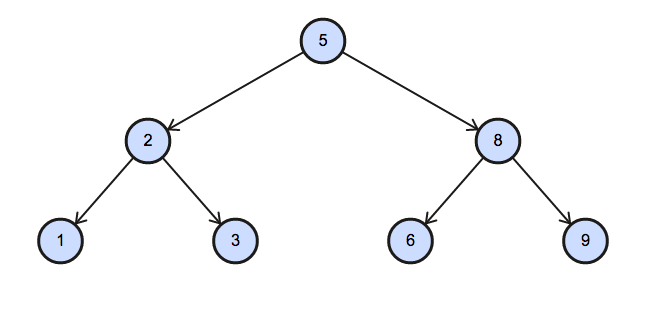

```{r setup, include=FALSE}
library(RMariaDB)
con <- dbConnect(
          drv      = RMariaDB::MariaDB(),
          dbname   = "hackerrank",
          username = "jwarz",
          password = Sys.getenv("DB_PASS"), 
          host     = "localhost", 
          port     = 3306)

knitr::opts_chunk$set(echo = TRUE, eval = T, connection = con)
```

# SETUP

## Create User

```{sql, eval=F}
CREATE USER 'jwarz'@localhost IDENTIFIED BY '***';
GRANT ALL PRIVILEGES ON *.* TO 'jwarz'@localhost IDENTIFIED BY '***';
# GRANT ALL PRIVILEGES ON 'DBname'.* TO 'jwarz'@localhost; 
```

## Create databases

```{sql, eval=F}
DROP DATABASE IF EXISTS hackerrank;
CREATE DATABASE hackerrank;
# USE hackerrank;
```

## Create tables

```{sql, eval=F}
#########
# city1 #
#########
create table city1
(
    ID int primary key,
    NAME varchar(17),
    COUNTRYCODE varchar(3),
    DISTRICT varchar(20),
    POPULATION int
);

insert into city1 values (6, "Rotterdam", "NLD", "Zuid-Holland", 593321);
insert into city1 values (3878, "Scottsdale", "USA", "Arizona", 202705);
insert into city1 values (3965, "Corona", "USA", "California", 124966);
insert into city1 values (3973, "Concord", "USA", "California", 121780);
insert into city1 values (3977, "Cedar Rapids", "USA", "Iowa", 120758);
insert into city1 values (3982, "Coral Springs", "USA", "Florida", 117549);
insert into city1 values (4054, "Fairfield", "USA", "California", 92256);
insert into city1 values (4058, "Boulder", "USA", "Colorado", 91238);
insert into city1 values (4061, "Fall River", "USA", "Massachusetts", 90555);

#########
# city2 #
#########
create table city2
(
    ID int primary key,
    NAME varchar(17),
    COUNTRYCODE varchar(3),
    DISTRICT varchar(20),
    POPULATION int
);
LOAD DATA LOCAL INFILE "data/city2.csv" INTO TABLE city2
FIELDS TERMINATED BY ','
LINES TERMINATED BY '\n'
IGNORE 1 LINES;

###########
# STATION #
###########
create table STATION
(
    ID int,
    CITY varchar(21),
    STATE varchar(2),
    LAT_N decimal(10,0),
    LONG_W decimal(10,0)
);
LOAD DATA LOCAL INFILE "data/STATION.csv" INTO TABLE STATION
FIELDS TERMINATED BY ','
LINES TERMINATED BY '\n'
IGNORE 1 LINES;

############
# STUDENTS #
############
create table STUDENTS
(
    ID int,
    Name varchar(30),
    Marks int
);
LOAD DATA LOCAL INFILE "data/STUDENTS.csv" INTO TABLE STUDENTS
FIELDS TERMINATED BY ','
LINES TERMINATED BY '\n'
IGNORE 1 LINES;

############
# EMPLOYEE #
############
create table Employee
(
    employee_id int(11),
    name varchar(20), 
    months int(11),
    salary int(11)
);
LOAD DATA LOCAL INFILE "data/employee.csv" INTO TABLE Employee
FIELDS TERMINATED BY ','
LINES TERMINATED BY '\n'
IGNORE 1 LINES;

#############
# TRIANGLES #
#############
create table TRIANGLES
(
    A int,
    B int,
    C int
);
LOAD DATA LOCAL INFILE "data/triangles.csv" INTO TABLE TRIANGLES
FIELDS TERMINATED BY ','
LINES TERMINATED BY '\n'
IGNORE 1 LINES;

###############
# OCCUPATIONS #
###############
create table OCCUPATIONS
(
    Name varchar(30),
    Occupation varchar(30)
);
LOAD DATA LOCAL INFILE "data/OCCUPATIONS.csv" INTO TABLE OCCUPATIONS
FIELDS TERMINATED BY ','
LINES TERMINATED BY '\n'
IGNORE 1 LINES;

#######
# BST #
#######
create table BST
(
    N int,
    P int
);
LOAD DATA LOCAL INFILE "/Users/jschwarz/03_repos/data-scientists-tools/10_hackerrank/01_sql/data/BST.csv" INTO TABLE BST
FIELDS TERMINATED BY ','
LINES TERMINATED BY '\n'
IGNORE 1 LINES;
```

# Basic Select

**easy**

## City Data

The CITY1 / CITY2 tables are described as follows:

```{sql}
select column_name, column_type 
from INFORMATION_SCHEMA.COLUMNS 
where TABLE_NAME='city1';
```

## Revising the Select Query I

Query all columns for all American cities in the CITY table with populations larger than 100000. The CountryCode for America is USA.

```{sql}
SELECT *
FROM CITY1
WHERE POPULATION > 100000
AND COUNTRYCODE = "USA";
```

## Revising the Select Query II

Query the NAME field for all American cities in the CITY table with populations larger than 120000. The CountryCode for America is USA.

```{sql}
SELECT NAME
FROM CITY1
WHERE POPULATION > 120000
AND COUNTRYCODE = "USA";
```

## Select All

Query all columns (attributes) for every row in the CITY table.

```{sql}
SELECT *
FROM city1;
```

## Select BY ID

*Table: CITY2*

Query all columns for a city in CITY with the ID 1661.

```{sql}
SELECT * 
FROM CITY2
WHERE ID = 1661; 
```

## Japanese Cities' Attributes

Query all attributes of every Japanese city in the CITY table. The COUNTRYCODE for Japan is JPN.

```{sql}
SELECT * 
FROM CITY2 
WHERE COUNTRYCODE = 'JPN';        
```

## Japanese Cities' Names

Query the names of all the Japanese cities in the CITY table. The COUNTRYCODE for Japan is JPN. 

```{sql}
SELECT NAME 
FROM CITY2 
WHERE COUNTRYCODE = 'JPN';              
```

## Weather Observation Station data

The STATION table is described as follows:

```{sql}
select column_name, column_type 
from INFORMATION_SCHEMA.COLUMNS 
where TABLE_NAME='STATION';
```

## Weather Observation Station 1

*SIMPLE SELECT*

Query a list of CITY and STATE from the STATION table. 

```{sql}
SELECT CITY, STATE 
FROM STATION;
```

## Weather Observation Station 2

Does not exist ...

## Weather Observation Station 3

*MODULO*

Query a list of CITY names from STATION with even ID numbers only. You may print the results in any order, but must exclude duplicates from your answer.

```{sql}
SELECT DISTINCT CITY
FROM STATION
WHERE MOD(ID,2)=0
ORDER BY CITY ASC;  
```

## Weather Observation Station 4

*MATH INSIDE SELECT*

Find the difference between the total number of CITY entries in the table and the number of distinct CITY entries in the table. 

```{sql}
select (count(CITY) - count(distinct CITY))
from STATION; 
```

## Weather Observation Station 5

*STRINGLENGTH*
*ORDER BY*
*LIMIT*

Query the two cities in STATION with the shortest and longest CITY names, as well as their respective lengths (i.e.: number of characters in the name). If there is more than one smallest or largest city, choose the one that comes first when ordered alphabetically.

**Note** 
You can write two separate queries to get the desired output. It need not be a single query.

```{sql}
(SELECT CITY, LENGTH(CITY) AS length FROM STATION ORDER BY length ASC, CITY ASC LIMIT 1 ) 
UNION 
(SELECT CITY, LENGTH(CITY) AS length FROM STATION ORDER BY length DESC, CITY ASC LIMIT 1 );
```

## Weather Observation Station 6

*SUBSTRING CONDITION (FIRST LETTER)*

Query the list of CITY names starting with vowels (i.e., a, e, i, o, or u) from STATION. Your result cannot contain duplicates.

**1. MySQL** 

* RLIKE

```{sql}
SELECT DISTINCT(city) 
FROM station 
WHERE city RLIKE '^[aeiou]';
```

* REGEXP

```{sql, eval=F}
SELECT DISTINCT CITY 
FROM STATION  
WHERE CITY REGEXP '^[aeiou]';
```

* SUBSTRING & IN

```{sql, eval=F}
SELECT DISTINCT(CITY)
FROM STATION 
WHERE LOWER(SUBSTR(CITY, 1,1)) in ('a','e','i','o','u');
```

* LEFT,RIGHT & IN

```{sql, eval=F}
SELECT DISTINCT CITY
FROM STATION
WHERE LOWER(LEFT(CITY,1)) IN ('a', 'e', 'i', 'o', 'u');
```

**2. MS SQL Server**

```{sql, eval = F}
# MS SQL SERVER
SELECT DISTINCT city 
from station 
where city LIKE '[a, e, i, o, u]%';
```

## Weather Observation Station 7

*SUBSTRING CONDITION (LAST LETTER)*

Query the list of CITY names ending with vowels (a, e, i, o, u) from STATION. Your result cannot contain duplicates.

1. MySQL

* RLIKE

```{sql}
SELECT DISTINCT(city) 
FROM station 
WHERE city RLIKE '[aeiou]$';
```

* REGEXP

```{sql, eval = F}
SELECT DISTINCT CITY 
FROM STATION  
WHERE CITY REGEXP '[aeiou]$';
```

* SUBSTRING & IN

```{sql, eval = F}
select distinct(CITY) from STATION 
where LOWER(SUBSTR(CITY, -1)) in ('a','e','i','o','u');
```

* LEFT,RIGHT & IN

```{sql, eval = F}
SELECT DISTINCT CITY
FROM STATION
WHERE LOWER(RIGHT(CITY,1)) IN ('a', 'e', 'i', 'o', 'u');
```

**2. MS SQL Server**

```{sql, eval = F}
# MS SQL SERVER
SELECT DISTINCT city 
from station 
where city LIKE '%[a, e, i, o, u]';
```

## Weather Observation Station 8

*SUBSTRING CONDITION (FIRST AND LAST LETTER)*

Query the list of CITY names from STATION which have vowels (i.e., a, e, i, o, and u) as both their first and last characters. Your result cannot contain duplicates.

**1. MySQL**

* RLIKE

```{sql}
SELECT DISTINCT(city) 
FROM station 
WHERE city RLIKE '^[aeiou]' AND city RLIKE '[aeiou]$';
```

* REGEXP

```{sql, eval = F}
SELECT DISTINCT CITY 
FROM STATION  
WHERE CITY REGEXP '^[aeiou]' AND CITY REGEXP '[aeiou]$';
```

* SUBSTRING & IN

```{sql, eval = F}
select distinct(CITY) from STATION 
where LOWER(SUBSTR(CITY, -1)) in ('a','e','i','o','u') 
      and LOWER(SUBSTR(CITY, 1,1)) in ('a','e','i','o','u');
```

* LEFT,RIGHT & IN

```{sql, eval = F}
SELECT DISTINCT CITY
FROM STATION
WHERE LOWER(LEFT(CITY,1)) IN ('a', 'e', 'i', 'o', 'u') AND
      LOWER(RIGHT(CITY,1)) IN ('a', 'e', 'i', 'o', 'u');
```

**2. MS SQL Server**

```{sql, eval = F}
# MS SQL SERVER
SELECT DISTINCT city 
from station 
where city LIKE '[a, e, i, o, u]%[a, e, i, o, u]';
```

## Weather Observation Station 9

*SUBSTRING CONDITION (NEGATE FIRST LETTER)*

Query the list of CITY names from STATION that do not start with vowels. Your result cannot contain duplicates.

**1. MySQL** 

* RLIKE

```{sql}
SELECT DISTINCT(city) 
FROM station 
WHERE city NOT RLIKE '^[aeiou]';
```

* REGEXP

```{sql, eval=F}
SELECT DISTINCT CITY 
FROM STATION  
WHERE CITY NOT REGEXP '^[aeiou]';
```

* SUBSTRING & IN

```{sql, eval=F}
SELECT DISTINCT(CITY)
FROM STATION 
WHERE LOWER(SUBSTR(CITY, 1,1)) not in ('a','e','i','o','u');
```

* LEFT,RIGHT & IN

```{sql, eval=F}
SELECT DISTINCT CITY
FROM STATION
WHERE LOWER(LEFT(CITY,1)) NOT IN ('a', 'e', 'i', 'o', 'u');
```

**2. MS SQL Server**

```{sql, eval = F}
# MS SQL SERVER
SELECT DISTINCT city 
from station 
where city NOT LIKE '[a, e, i, o, u]%';
```

## Weather Observation Station 10

*SUBSTRING CONDITION (NEGATE LAST LETTER)*

Query the list of CITY names from STATION that do not end with vowels. Your result cannot contain duplicates.

**1. MySQL** 

* RLIKE

```{sql}
SELECT DISTINCT(city) 
FROM station 
WHERE city NOT RLIKE '[aeiou]$';
```

...

## Weather Observation Station 11

*SUBSTRING CONDITION (NEGATE & OR)*

Query the list of CITY names from STATION that either do not start with vowels or do not end with vowels. Your result cannot contain duplicates.

```{sql}
SELECT DISTINCT(city) 
FROM station 
WHERE city NOT RLIKE '^[aeiou]' OR city NOT RLIKE '[aeiou]$';
```

...

## Weather Observation Station 12

*SUBSTRING CONDITION (NEGATE & AND)*

Query the list of CITY names from STATION that do not start with vowels and do not end with vowels. Your result cannot contain duplicates.

```{sql}
SELECT DISTINCT(city) 
FROM station 
WHERE city NOT RLIKE '^[aeiou]' AND city NOT RLIKE '[aeiou]$';
```

### Students fdata

```{sql}
select column_name, column_type 
from INFORMATION_SCHEMA.COLUMNS 
where TABLE_NAME='students';
```

### Higher than 75 Marks

Query the Name of any student in STUDENTS who scored higher than  Marks. Order your output by the last three characters of each name. If two or more students both have names ending in the same last three characters (i.e.: Bobby, Robby, etc.), secondary sort them by ascending ID.

```{sql}
select name
from students
where marks > 75
order by SUBSTR(name, -3), id;
```

## Employee Data

```{sql}
select column_name, column_type 
from INFORMATION_SCHEMA.COLUMNS 
where TABLE_NAME='Employee';
```

## Employee Names

Write a query that prints a list of employee names (i.e.: the name attribute) from the Employee table in alphabetical order.

```{sql}
select name
from employee
order by name;
```

## Employee Salaries

Write a query that prints a list of employee names (i.e.: the name attribute) for employees in Employee having a salary greater than $2000 per month who have been employees for less than 10 months. Sort your result by ascending employee_id.

```{sql}
select name
from employee
where salary > 2000 AND months < 10
order by employee_id ASC;
```

# Advanced Select

**easy**

## Triangles data

```{sql}
select column_name, column_type 
from INFORMATION_SCHEMA.COLUMNS 
where TABLE_NAME='TRIANGLES';
```

## Type of Triangle

Write a query identifying the type of each record in the TRIANGLES table using its three side lengths. Output one of the following statements for each record in the table:

* Equilateral: It's a triangle with  sides of equal length.
* Isosceles: It's a triangle with  sides of equal length.
* Scalene: It's a triangle with  sides of differing lengths.
* Not A Triangle: The given values of A, B, and C don't form a triangle.

```{sql}
SELECT CASE             
            WHEN A + B > C AND B + C > A AND A + C > B THEN
                CASE 
                    WHEN A = B AND B = C THEN 'Equilateral'
                    WHEN A = B OR B = C OR A = C THEN 'Isosceles'
                    ELSE 'Scalene'
                END
            ELSE 'Not A Triangle'
        END
FROM TRIANGLES;
```

Explanation
Values in the tuple (20,20,23) form an Isosceles triangle, because A = B. 
Values in the tuple (20,20,20) form an Equilateral triangle, because A = B = C.
Values in the tuple (20,21,22) form a Scalene triangle, because A != B != C. 
Values in the tuple (13,14,30) cannot form a triangle because the combined value of sides A and B is not larger than that of side C.

**medium**

## THE PADS

Generate the following two result sets:

1. Query an alphabetically ordered list of all names in OCCUPATIONS, immediately followed by the first letter of each profession as a parenthetical (i.e.: enclosed in parentheses). For example: AnActorName(A), ADoctorName(D), AProfessorName(P), and ASingerName(S).
2. Query the number of ocurrences of each occupation in OCCUPATIONS. Sort the occurrences in ascending order, and output them in the following format: 

```{sql}
select concat(Name,'(',Substring(Occupation,1,1),')') as Name
from occupations
order by Name;
```

```{sql}
select concat('There are a total of',' ',count(occupation),' ',lower(occupation),'s.') as total
from occupations
group by occupation
order by total;
```

## Occupations

Pivot the Occupation column in OCCUPATIONS so that each Name is sorted alphabetically and displayed underneath its corresponding Occupation. The output column headers should be Doctor, Professor, Singer, and Actor, respectively.

Note: Print NULL when there are no more names corresponding to an occupation. 

Step 1: Create a virtual table in your head of the data given to us.

```{sql}
SELECT
    case when Occupation='Doctor' then Name end as Doctor,
    case when Occupation='Professor' then Name end as Professor,
    case when Occupation='Singer' then Name end as Singer,
    case when Occupation='Actor' then Name end as Actor
FROM OCCUPATIONS
```

Step 2: Create an index column with respect to occupation as "RowNumber"

```{sql}
set @r1=0, @r2=0, @r3=0, @r4=0;
```

```{sql}
SELECT case 
	when Occupation='Doctor' then (@r1:=@r1+1)
        when Occupation='Professor' then (@r2:=@r2+1)
        when Occupation='Singer' then (@r3:=@r3+1)
        when Occupation='Actor' then (@r4:=@r4+1) end as RowNumber

FROM OCCUPATIONS
```

Step 3: Combine the result from step 1 and step 2:

```{sql}
set @r1=0, @r2=0, @r3=0, @r4=0;
```

```{sql}
SELECT case 
	when Occupation='Doctor' then (@r1:=@r1+1)
        when Occupation='Professor' then (@r2:=@r2+1)
        when Occupation='Singer' then (@r3:=@r3+1)
        when Occupation='Actor' then (@r4:=@r4+1) end as RowNumber,
        case when Occupation='Doctor' then Name end as Doctor,
        case when Occupation='Professor' then Name end as Professor,
        case when Occupation='Singer' then Name end as Singer,
        case when Occupation='Actor' then Name end as Actor

FROM OCCUPATIONS
```

Step 4: Now, Order_by name then Group_By RowNumber.
Using Min/Max, if there is a name, it will return it, if not, return NULL.

```{sql}
set @r1=0, @r2=0, @r3=0, @r4=0;
```

```{sql}
select min(Doctor), min(Professor), min(Singer), min(Actor)
from(
  select case when Occupation='Doctor' then (@r1:=@r1+1)
            when Occupation='Professor' then (@r2:=@r2+1)
            when Occupation='Singer' then (@r3:=@r3+1)
            when Occupation='Actor' then (@r4:=@r4+1) end as RowNumber,
    case when Occupation='Doctor' then Name end as Doctor,
    case when Occupation='Professor' then Name end as Professor,
    case when Occupation='Singer' then Name end as Singer,
    case when Occupation='Actor' then Name end as Actor
  from OCCUPATIONS
  order by Name
	) temp
group by RowNumber;
```

## BST table

You are given a table, BST, containing two columns: N and P, where N represents the value of a node in Binary Tree, and P is the parent of N.

Write a query to find the node type of Binary Tree ordered by the value of the node. Output one of the following for each node:

* Root: If node is root node.
* Leaf: If node is leaf node.
* Inner: If node is neither root nor leaf node.

```{sql}
SELECT CASE
	WHEN P IS NULL THEN CONCAT(N, ' Root')
	WHEN N IN (SELECT DISTINCT P FROM BST) THEN CONCAT(N, ' Inner')
	ELSE CONCAT(N, ' Leaf')
	END AS NODE_TYPE
FROM BST
ORDER BY N ASC;
```

Explanation

The Binary Tree below illustrates the sample:



# Aggregation

coming soon ...

# Basic Join

coming soon ...

# Advanced Join

coming soon ...

# Alternative Queries

coming soon ...


```{r, include=F}
DBI::dbDisconnect(con)
```