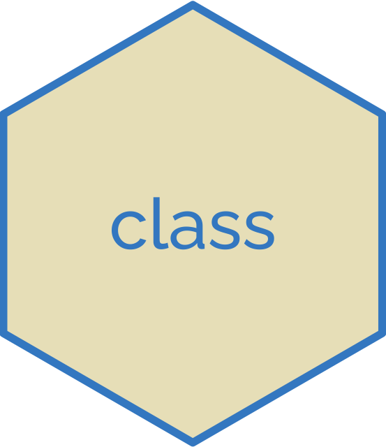

# Data Scientist's Tools

## UNDER CONSTRUCTION ...

## 01 Programming Basics

| Topic | Content | Packages |
|:---|:---------|:---|
| [Beginner](https://github.com/jwarz/data-scientists-tools/tree/main/01_basics/01_R/01_programming_beginner) | Data Types:  1. Vectors 2. Matrices | --- |
| [Intermediate](https://github.com/jwarz/data-scientists-tools/tree/main/01_basics/01_R/02_programming_intermediate) | 1. Conditionals and Control Flow<br/> 2. Loops | --- |

## 02 Importing data

## 03 Data manipulation

## 04 Data visualization

## 05 Statistics

## 06 Regression


## 07 Machine Learning

<table>
  <thead>
    <tr>
      <th>&nbsp;&nbsp;&nbsp;&nbsp;&nbsp;&nbsp;&nbsp;&nbsp;&nbsp;&nbsp;&nbsp;&nbsp;&nbsp;&nbsp;&nbsp;Topic&nbsp;&nbsp;&nbsp;&nbsp;&nbsp;&nbsp;&nbsp;&nbsp;&nbsp;&nbsp;&nbsp;&nbsp;&nbsp;&nbsp;&nbsp;</th>
      <th>&nbsp;&nbsp;&nbsp;&nbsp;&nbsp;&nbsp;&nbsp;&nbsp;&nbsp;&nbsp;&nbsp;&nbsp;&nbsp;&nbsp;&nbsp;Content&nbsp;&nbsp;&nbsp;&nbsp;&nbsp;&nbsp;&nbsp;&nbsp;&nbsp;&nbsp;&nbsp;&nbsp;&nbsp;&nbsp;&nbsp;</th>
      <th>&nbsp;&nbsp;&nbsp;&nbsp;&nbsp;&nbsp;&nbsp;&nbsp;&nbsp;&nbsp;&nbsp;&nbsp;&nbsp;&nbsp;&nbsp;Packages&nbsp;&nbsp;&nbsp;&nbsp;&nbsp;&nbsp;&nbsp;&nbsp;&nbsp;&nbsp;&nbsp;&nbsp;&nbsp;&nbsp;&nbsp;</th>
    </tr>
  </thead>
	<tbody>
		<! –– SUPERVISED LEARNING: CLASSIFICATION ––>
		<tr>
			<td><a target="_blank" rel="noopener noreferrer" href="https://github.com/jwarz/data-scientists-tools/tree/main/07_machine_learning/01_R/supervised_learning_classification">Supervised Learning: Classification</a>
			</td>
			<td>
			  <ol>
          		<li>k-Nearest Neighbors (kNN)</li>
          		<li>Naive Bayes</li>
          		<li>Logistic Regression</li>
          		<li>Classification Trees</li>
        		</ol>
			</td>
			<td>
				<details><summary>Click to show packages ...</summary>
					<div id="user-content-toc">
						<ul>
							<li>&emsp;<a target="_blank" rel="noopener noreferrer" href="https://CRAN.R-project.org/package=class">class</a></li>
							<li>&emsp;<a target="_blank" rel="noopener noreferrer" href="https://github.com/majkamichal/naivebayes">naivebayes</a></li>
							<li><a target="_blank" rel="noopener noreferrer" href="https://github.com/xrobin/pROC">pROC</a></li>
							<li>&emsp;<a target="_blank" rel="noopener noreferrer" href="https://github.com/bethatkinson/rpart">rpart</a></li>
							<li><a target="_blank" rel="noopener noreferrer" href="http://www.milbo.org/rpart-plot/index.html">rpart.plot</a></li>
							<li><a target="_blank" rel="noopener noreferrer" href="https://cran.r-project.org/web/packages/randomForest/index.html">randomForest</a></li>
						</ul>
					</div>
				</details>
			</td>
		</tr>
		<! –– SUPERVISED LEARNING: REGRESSION ––>
		<tr>
			<td>
				<a target="_blank" rel="noopener noreferrer" href="https://github.com/jwarz/data-scientists-tools/tree/main/07_machine_learning/01_R/supervised_learning_regression">Supervised Learning: Regression</a>
			</td>
			<td>
				<ol>
					<li>k-What is Regression?</li>
					<li>Training and Evaluating Regression Models</li>
					<li>Issues to Consider</li>
					<li>Dealing with Non-Linear Responses</li>
					<li>Tree-Based Methods</li>
        		</ol>
			</td>
			<td>
				<details><summary>Show packages ...</summary>
					<div id="user-content-toc">
						<ul>
							<li>&emsp;<a target="_blank" rel="noopener noreferrer" href="https://broom.tidymodels.org">broom</a></li>
							<li><a target="_blank" rel="noopener noreferrer" href="https://winvector.github.io/sigr/index.html">sigr</a></li>
							<li><a target="_blank" rel="noopener noreferrer" href="https://winvector.github.io/WVPlots/index.html">WVPlots</a></li>
							<li><a target="_blank" rel="noopener noreferrer" href="https://winvector.github.io/vtreat/">vtreat</a></li>
							<li><a target="_blank" rel="noopener noreferrer" href="https://CRAN.R-project.org/package=mgcv ">mgcv</a></li>
							<li><a target="_blank" rel="noopener noreferrer" href="https://github.com/imbs-hl/ranger">ranger</a></li>
							<li><a target="_blank" rel="noopener noreferrer" href="https://github.com/dmlc/xgboost">xgboost</a></li>
						</ul>
					</div>
				</details>
			</td>
		</tr>
		<! –– UNSUPERVISED LEARNING ––>
		<tr>
			<td><a target="_blank" rel="noopener noreferrer" href="https://github.com/jwarz/data-scientists-tools/tree/main/07_machine_learning/01_R/unsupervised_learning">Unsupervised Learning</a>
			</td>
			<td>
				<ol>
					<li>Unsupervised Learning in R</li>
					<li>Hierarchical clustering</li>
					<li>Dimensionality Reduction with PCA</li>
        		</ol>
			</td>
			<td>
				<details><summary>Show packages ...</summary>
					&emsp;<a target="_blank" rel="noopener noreferrer" href="https://broom.tidymodels.org">base R / stats</a>
				</details>
			</td>
		</tr>
		<! –– ML with caret ––>
		<tr>
			<td><a target="_blank" rel="noopener noreferrer" href="https://github.com/jwarz/data-scientists-tools/tree/main/07_machine_learning/01_R/machine_learning_with_caret">Machine Learning with caret</a>
			</td>
			<td>
				<ol>
					<li>Regression models: fitting them and evaluating their performance</li>
					<li>Classification models: fitting them and evaluating their performance</li>
					<li>Tuning model parameters to improve performance</li>
					<li>Preprocessing your data</li>
					<li>Selecting models</li>
        		</ol>
			</td>
			<td>
				<details><summary>Show packages ...</summary>
					&emsp;<a target="_blank" rel="noopener noreferrer" href="https://broom.tidymodels.org">base R / stats</a>
				</details>
			</td>
		</tr>
		<! –– Machine Learning in the tidyverse ––>
		<tr>
			<td><a target="_blank" rel="noopener noreferrer" href="https://github.com/jwarz/data-scientists-tools/tree/main/07_machine_learning/01_R/machine_learning_in_the_tidyverse">Machine Learning in the tidyverse</a>
			</td>
			<td>
				<ol>
					<li>Foundations of "tidy" Machine learning</li>
					<li>Multiple Models with broom</li>
					<li>Build, Tune & Evaluate Regression Models 1</li>
					<li>Build, Tune & Evaluate Regression Models 2</li>
        		</ol>
			</td>
			<td>
				<details><summary>Show packages ...</summary>
					&emsp;<a target="_blank" rel="noopener noreferrer" href="https://broom.tidymodels.org">base R / stats</a>
				</details>
			</td>
		</tr>
		<! –– Cluster Analysis ––>
		<tr>
			<td><a target="_blank" rel="noopener noreferrer" href="https://github.com/jwarz/data-scientists-tools/tree/main/07_machine_learning/01_R/cluster_analysis">Cluster Analysis</a></td>
			<td>
				<ol>
					<li>Calculating distance between observations</li>
					<li>Hierarchical clustering</li>
					<li>K-means clustering</li>
					<li>Case Study: National Occupational mean wage</li>
        		</ol>
			</td>
			<td>
				<details><summary>Show packages ...</summary>
					&emsp;<a target="_blank" rel="noopener noreferrer" href="https://broom.tidymodels.org">base R / stats</a>
				</details>
			</td>
		</tr>
		<! –– TEST ––>
		<tr>
			<td><a target="_blank" rel="noopener noreferrer" href="https://github.com/jwarz/data-scientists-tools/tree/main/07_machine_learning/01_R/cluster_analysis">Cluster Analysis</a>
			</td>
			<td>
				<ol>
					<li>Calculating distance between observations</li>
					<li>Hierarchical clustering</li>
					<li>K-means clustering</li>
					<li>Case Study: National Occupational mean wage</li>
        		</ol>
			</td>
			<td>
				<details><summary>Show packages ...</summary>
					<div id="user-content-toc">
						<ul>
							<li><a target="_blank" rel="noopener noreferrer" href="https://broom.tidymodels.org">&emsp;base R / stats</a></li>
							<li><a target="_blank" rel="noopener noreferrer" href="https://broom.tidymodels.org">&emsp;base R / stats</a></li>
							<li><a target="_blank" rel="noopener noreferrer" href="https://broom.tidymodels.org">&emsp;base R / stats</a></li>
							<li>&emsp;<a target="_blank" rel="noopener noreferrer" href="https://broom.tidymodels.org">base R / stats</a></li>
							<li>&emsp;<a target="_blank" rel="noopener noreferrer" href="https://broom.tidymodels.org">base R / stats</a></li>
						</ul>
					</div>
				</details>
			</td>
		</tr>
	</tbody>
</table>

<details><summary><b><a target="_blank" rel="noopener noreferrer" href="https://github.com/flask-restful/flask-restful">flask-restful</a></b> (🥈35 ·  ⭐ 6.3K) - Simple framework for creating REST APIs. <code><a target="_blank" rel="noopener noreferrer" href="http://bit.ly/3aKzpTv">BSD-3</a></code> <code></code></summary>

- [GitHub](https://github.com/flask-restful/flask-restful) (👨‍💻 160 · 🔀 970 · 📦 75K · 📋 570 - 20% open · ⏱️ 04.03.2022):

	```
	git clone https://github.com/flask-restful/flask-restful
	```
- [PyPi](https://pypi.org/project/flask-restful) (📥 1.8M / month · 📦 7.2K · ⏱️ 17.05.2021):
	```
	pip install flask-restful
	```
- [Conda](https://anaconda.org/conda-forge/flask-restful) (📥 110K · ⏱️ 30.05.2021):
	```
	conda install -c conda-forge flask-restful
	```
</details>