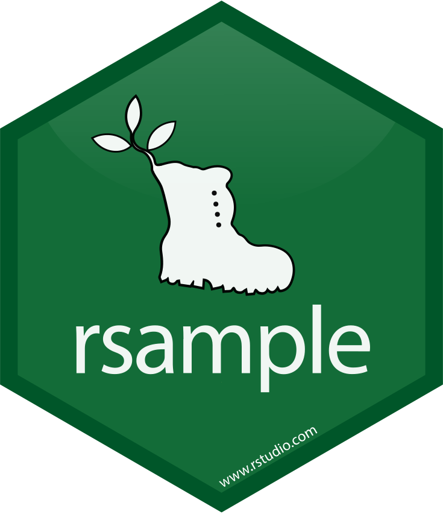

# 1. Books

## Applied Data Science

* [Applied Predictive Modeling - By Max Kuhn and Kjell Johnson](http://appliedpredictivemodeling.com)
* [Machine Learning Engineering - By Andriy Burkov](http://www.mlebook.com/wiki/doku.php)

## Theoretical Data Science

* [An Introduction to Statistical Learning - By Gareth James et al.](https://www.statlearning.com)
* [The Elements of Statistical Learning - By Trevor Hastie et al.](https://hastie.su.domains/ElemStatLearn/)
* [Bayesian Data Analysis - By Andrew Gelman et al.](http://www.stat.columbia.edu/~gelman/book/)
* [The Hundred-Page Machine Learning Book - By Andriy Burkov](http://www.mlebook.com/wiki)
* [The StatQuest Illustrated Guide to Machine Learning - By Josh Starmer](https://statquest.org/statquest-store/)

# 2. UNDER CONSTRUCTION ...

## 01 Programming Basics

| Topic | Content | Packages |
|:---|:---------|:---|
| [Beginner](https://github.com/jwarz/data-scientists-tools/tree/main/01_basics/01_R/01_programming_beginner) | Data Types:  1. Vectors 2. Matrices | --- |
| [Intermediate](https://github.com/jwarz/data-scientists-tools/tree/main/01_basics/01_R/02_programming_intermediate) | 1. Conditionals and Control Flow  2. Loops | --- |

## 02 Importing data

## 03 Data manipulation

## 04 Data visualization

## 05 Statistics

## 06 Regression

## 07 Machine Learning

<table>
  <thead>
    <tr>
      <th>&nbsp;&nbsp;&nbsp;&nbsp;&nbsp;&nbsp;&nbsp;&nbsp;&nbsp;&nbsp;&nbsp;&nbsp;&nbsp;&nbsp;&nbsp;Topic&nbsp;&nbsp;&nbsp;&nbsp;&nbsp;&nbsp;&nbsp;&nbsp;&nbsp;&nbsp;&nbsp;&nbsp;&nbsp;&nbsp;&nbsp;</th>
      <th>&nbsp;&nbsp;&nbsp;&nbsp;&nbsp;&nbsp;&nbsp;&nbsp;&nbsp;&nbsp;&nbsp;&nbsp;&nbsp;&nbsp;&nbsp;Content&nbsp;&nbsp;&nbsp;&nbsp;&nbsp;&nbsp;&nbsp;&nbsp;&nbsp;&nbsp;&nbsp;&nbsp;&nbsp;&nbsp;&nbsp;</th>
      <th>&nbsp;&nbsp;&nbsp;&nbsp;&nbsp;&nbsp;&nbsp;&nbsp;&nbsp;&nbsp;&nbsp;&nbsp;&nbsp;&nbsp;&nbsp;Packages&nbsp;&nbsp;&nbsp;&nbsp;&nbsp;&nbsp;&nbsp;&nbsp;&nbsp;&nbsp;&nbsp;&nbsp;&nbsp;&nbsp;&nbsp;</th>
    </tr>
  </thead>
	<tbody>
		<! –– SUPERVISED LEARNING: CLASSIFICATION ––>
		<tr>
			<td><a target="_blank" rel="noopener noreferrer" href="https://github.com/jwarz/data-scientists-tools/tree/main/07_machine_learning/01_R/supervised_learning_classification">Supervised Learning: Classification</a>
			</td>
			<td>
			  <ol>
          		<li>k-Nearest Neighbors (kNN)</li>
          		<li>Naive Bayes</li>
          		<li>Logistic Regression</li>
          		<li>Classification Trees</li>
        		</ol>
			</td>
			<td>
				

Show packages ...

					

						<ul>
							<li>&emsp;<a target="_blank" rel="noopener noreferrer" href="https://CRAN.R-project.org/package=class">class</a></li>
							<li>&emsp;<a target="_blank" rel="noopener noreferrer" href="https://github.com/majkamichal/naivebayes">naivebayes</a></li>
							<li>&emsp;<a target="_blank" rel="noopener noreferrer" href="https://github.com/xrobin/pROC">pROC</a></li>
							<li>&emsp;<a target="_blank" rel="noopener noreferrer" href="https://cran.r-project.org/web/packages/randomForest/index.html">randomForest</a></li>
							<li>&emsp;<a target="_blank" rel="noopener noreferrer" href="https://github.com/bethatkinson/rpart">rpart</a></li>
							<li>&emsp;<a target="_blank" rel="noopener noreferrer" href="http://www.milbo.org/rpart-plot/index.html">rpart.plot</a></li>
						</ul>
					

				

			</td>
		</tr>
		<! –– SUPERVISED LEARNING: REGRESSION ––>
		<tr>
			<td>
				<a target="_blank" rel="noopener noreferrer" href="https://github.com/jwarz/data-scientists-tools/tree/main/07_machine_learning/01_R/supervised_learning_regression">Supervised Learning: Regression</a>
			</td>
			<td>
				<ol>
					<li>What is Regression?</li>
					<li>Training and Evaluating Regression Models</li>
					<li>Issues to Consider</li>
					<li>Dealing with Non-Linear Responses</li>
					<li>Tree-Based Methods</li>
        		</ol>
			</td>
			<td>
				

Show packages ...

					

						<ul>
							<li>&emsp;<a target="_blank" rel="noopener noreferrer" href="https://broom.tidymodels.org">broom</a></li>
							<li>&emsp;<a target="_blank" rel="noopener noreferrer" href="https://CRAN.R-project.org/package=mgcv ">mgcv</a></li>
							<li>&emsp;<a target="_blank" rel="noopener noreferrer" href="https://github.com/imbs-hl/ranger">ranger</a></li>
							<li>&emsp;<a target="_blank" rel="noopener noreferrer" href="https://winvector.github.io/sigr/index.html">sigr</a></li>
							<li>&emsp;<a target="_blank" rel="noopener noreferrer" href="https://winvector.github.io/vtreat/">vtreat</a></li>
							<li>&emsp;<a target="_blank" rel="noopener noreferrer" href="https://winvector.github.io/WVPlots/index.html">WVPlots</a></li>
							<li>&emsp;<a target="_blank" rel="noopener noreferrer" href="https://github.com/dmlc/xgboost">xgboost</a></li>
						</ul>
					

				

			</td>
		</tr>
		<! –– UNSUPERVISED LEARNING ––>
		<tr>
			<td><a target="_blank" rel="noopener noreferrer" href="https://github.com/jwarz/data-scientists-tools/tree/main/07_machine_learning/01_R/unsupervised_learning">Unsupervised Learning</a>
			</td>
			<td>
				<ol>
					<li>Unsupervised Learning in R</li>
					<li>Hierarchical clustering</li>
					<li>Dimensionality Reduction with PCA</li>
        		</ol>
			</td>
			<td>
				

Show packages ...

					&emsp;<a target="_blank" rel="noopener noreferrer" href="https://broom.tidymodels.org">base R / stats</a>
				

			</td>
		</tr>
		<! –– ML with caret ––>
		<tr>
			<td><a target="_blank" rel="noopener noreferrer" href="https://github.com/jwarz/data-scientists-tools/tree/main/07_machine_learning/01_R/machine_learning_with_caret">Machine Learning with caret</a>
			</td>
			<td>
				<ol>
					<li>Regression models: fitting them and evaluating their performance</li>
					<li>Classification models: fitting them and evaluating their performance</li>
					<li>Tuning model parameters to improve performance</li>
					<li>Preprocessing your data</li>
					<li>Selecting models</li>
        		</ol>
			</td>
			<td>
				

Show packages ...

					

						<ul>
							<li>&emsp;<a target="_blank" rel="noopener noreferrer" href="http://topepo.github.io/caret/index.htmlpackage=class">caret</a></li>
							<li>&emsp;<a target="_blank" rel="noopener noreferrer" href="https://cran.r-project.org/web/packages/mlbench/index.html">mlbench</a></li>
							<li>&emsp;<a target="_blank" rel="noopener noreferrer" href="https://cran.r-project.org/web/packages/caTools/index.html">caTools</a></li>
							<li>&emsp;<a target="_blank" rel="noopener noreferrer" href="https://github.com/zachmayer/caretEnsemble">caretEnsemble</a></li>
						</ul>
					

				

			</td>
		</tr>
		<! –– Machine Learning in the tidyverse ––>
		<tr>
			<td><a target="_blank" rel="noopener noreferrer" href="https://github.com/jwarz/data-scientists-tools/tree/main/07_machine_learning/01_R/machine_learning_in_the_tidyverse">Machine Learning in the tidyverse</a>
			</td>
			<td>
				<ol>
					<li>Foundations of "tidy" Machine learning</li>
					<li>Multiple Models with broom</li>
					<li>Build, Tune & Evaluate Regression Models 1</li>
					<li>Build, Tune & Evaluate Regression Models 2</li>
        		</ol>
			</td>
			<td>
				

Show packages ...

					

						<ul>
							<li>&emsp;<a target="_blank" rel="noopener noreferrer" href="https://broom.tidymodels.org">broom</a></li>
							<li>&emsp;<a target="_blank" rel="noopener noreferrer" href="https://rsample.tidymodels.org">rsample</a></li>
							<li>&emsp;<a target="_blank" rel="noopener noreferrer" href="https://github.com/mfrasco/Metrics">Metrics</a></li>
							<li>&emsp;<a target="_blank" rel="noopener noreferrer" href="https://github.com/imbs-hl/ranger">ranger</a></li>
						</ul>
					

				

			</td>
		</tr>
		<! –– Cluster Analysis ––>
		<tr>
			<td><a target="_blank" rel="noopener noreferrer" href="https://github.com/jwarz/data-scientists-tools/tree/main/07_machine_learning/01_R/cluster_analysis">Cluster Analysis</a></td>
			<td>
				<ol>
					<li>Calculating distance between observations</li>
					<li>Hierarchical clustering</li>
					<li>K-means clustering</li>
					<li>Case Study: National Occupational mean wage</li>
        		</ol>
			</td>
			<td>
				

Show packages ...

					

						<ul>
							<li>&emsp;<a target="_blank" rel="noopener noreferrer" href="https://github.com/talgalili/dendextend">dendextend</a></li>
							<li>&emsp;<a target="_blank" rel="noopener noreferrer" href="https://cran.r-project.org/web/packages/cluster/index.html">cluster</a></li>
						</ul>
					

				

			</td>
		</tr>
		<! –– TEST ––>
		<tr>
			<td><a target="_blank" rel="noopener noreferrer" href="https://github.com/jwarz/data-scientists-tools/tree/main/07_machine_learning/01_R/cluster_analysis">Cluster Analysis</a>
			</td>
			<td>
				<ol>
					<li>Calculating distance between observations</li>
					<li>Hierarchical clustering</li>
					<li>K-means clustering</li>
					<li>Case Study: National Occupational mean wage</li>
        		</ol>
			</td>
			<td>
				

Show packages ...

					

						<ul>
							<li><a target="_blank" rel="noopener noreferrer" href="https://broom.tidymodels.org">&emsp;base R / stats</a></li>
							<li><a target="_blank" rel="noopener noreferrer" href="https://broom.tidymodels.org">&emsp;base R / stats</a></li>
							<li><a target="_blank" rel="noopener noreferrer" href="https://broom.tidymodels.org">&emsp;base R / stats</a></li>
							<li>&emsp;<a target="_blank" rel="noopener noreferrer" href="https://broom.tidymodels.org">base R / stats</a></li>
							<li>&emsp;<a target="_blank" rel="noopener noreferrer" href="https://broom.tidymodels.org">base R / stats</a></li>
						</ul>
					

				

			</td>
		</tr>
	</tbody>
</table>