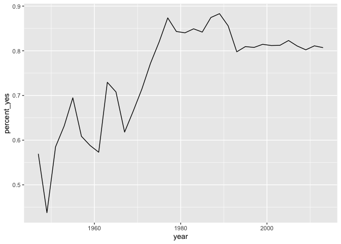
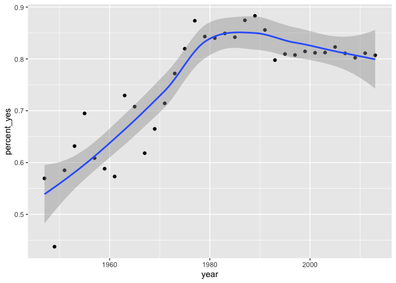
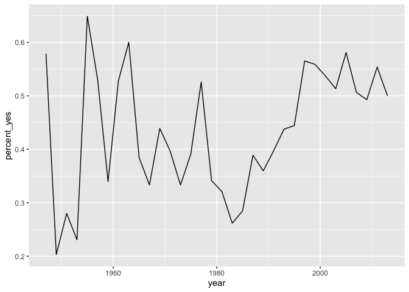
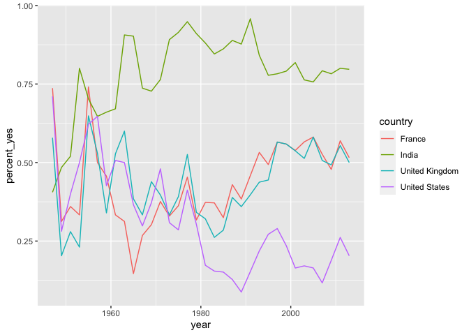
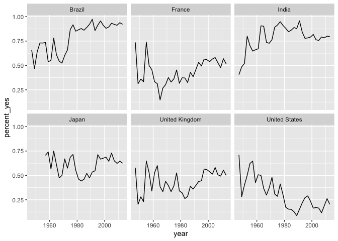
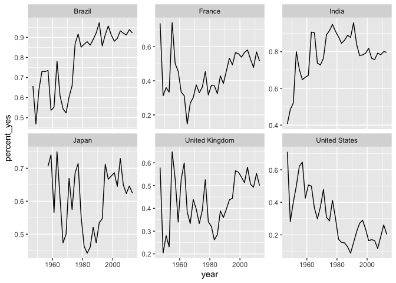
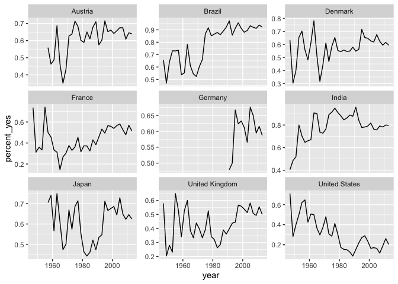
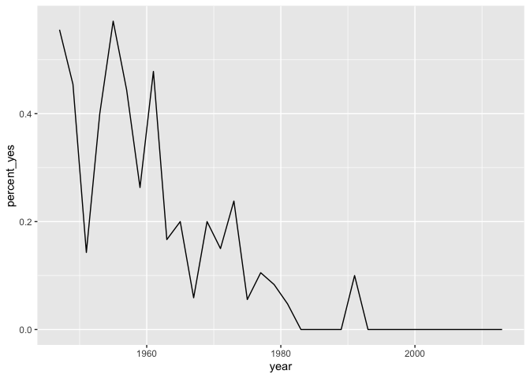
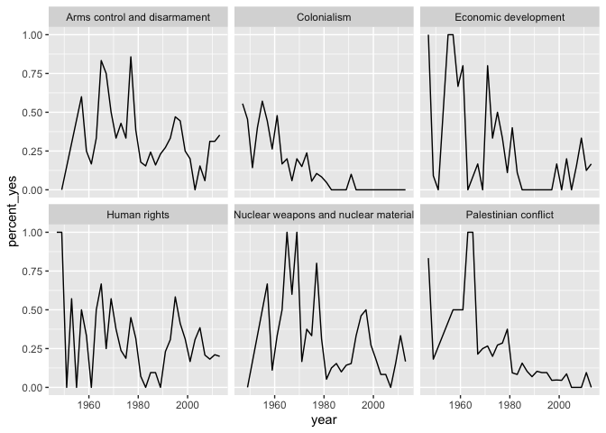
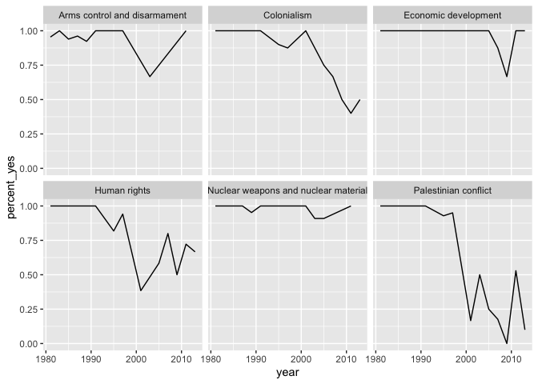

Case Study: Exploratory Data Analysis in R
================
Joschka Schwarz

-   [1. Data cleaning and summarizing with
    dplyr](#1-data-cleaning-and-summarizing-with-dplyr)
    -   [Filtering rows](#filtering-rows)
    -   [Adding a year column](#adding-a-year-column)
    -   [Adding a country column](#adding-a-country-column)
    -   [Summarizing the full dataset](#summarizing-the-full-dataset)
    -   [Summarizing by year](#summarizing-by-year)
    -   [Summarizing by country](#summarizing-by-country)
    -   [Sorting by percentage of “yes”
        votes](#sorting-by-percentage-of-yes-votes)
    -   [Filtering summarized output](#filtering-summarized-output)
-   [2. Data visualization with
    ggplot2](#2-data-visualization-with-ggplot2)
    -   [Choosing an aesthetic](#choosing-an-aesthetic)
    -   [Plotting a line over time](#plotting-a-line-over-time)
    -   [Other ggplot2 layers](#other-ggplot2-layers)
    -   [Summarizing by year and
        country](#summarizing-by-year-and-country)
    -   [Plotting just the UK over
        time](#plotting-just-the-uk-over-time)
    -   [Plotting multiple countries](#plotting-multiple-countries)
    -   [Faceting the time series](#faceting-the-time-series)
    -   [Faceting with free y-axis](#faceting-with-free-y-axis)
    -   [Choose your own countries](#choose-your-own-countries)
-   [3. Tidy modeling with broom](#3-tidy-modeling-with-broom)
    -   [Linear regression on the United
        States](#linear-regression-on-the-united-states)
    -   [Finding the slope of a linear
        regression](#finding-the-slope-of-a-linear-regression)
    -   [Finding the p-value of a linear
        regression](#finding-the-p-value-of-a-linear-regression)
    -   [Tidying a linear regression
        model](#tidying-a-linear-regression-model)
    -   [Combining models for multiple
        countries](#combining-models-for-multiple-countries)
    -   [Nesting a data frame](#nesting-a-data-frame)
    -   [List columns](#list-columns)
    -   [Unnesting](#unnesting)
    -   [Performing linear regression on each nested
        dataset](#performing-linear-regression-on-each-nested-dataset)
    -   [Tidy each linear regression
        model](#tidy-each-linear-regression-model)
    -   [Unnesting a data frame](#unnesting-a-data-frame)
    -   [Filtering model terms](#filtering-model-terms)
    -   [Filtering for significant
        countries](#filtering-for-significant-countries)
    -   [Sorting by slope](#sorting-by-slope)
-   [4. Joining and tidying](#4-joining-and-tidying)
    -   [Joining datasets with
        inner_join](#joining-datasets-with-inner_join)
    -   [Filtering the joined dataset](#filtering-the-joined-dataset)
    -   [Visualizing colonialism votes](#visualizing-colonialism-votes)
    -   [Tidy data observations](#tidy-data-observations)
    -   [Using gather to tidy a
        dataset](#using-gather-to-tidy-a-dataset)
    -   [Recoding the topics](#recoding-the-topics)
    -   [Summarize by country, year, and
        topic](#summarize-by-country-year-and-topic)
    -   [Visualizing trends in topics for one
        country](#visualizing-trends-in-topics-for-one-country)
    -   [Nesting by topic and country](#nesting-by-topic-and-country)
    -   [Interpreting tidy models](#interpreting-tidy-models)
    -   [Steepest trends by topic](#steepest-trends-by-topic)
    -   [Checking models visually](#checking-models-visually)

Once you’ve started learning tools for data manipulation and
visualization like dplyr and ggplot2, this course gives you a chance to
use them in action on a real dataset. You’ll explore the historical
voting of the United Nations General Assembly, including analyzing
differences in voting between countries, across time, and among
international issues. In the process you’ll gain more practice with the
dplyr and ggplot2 packages, learn about the broom package for tidying
model output, and experience the kind of start-to-finish exploratory
analysis common in data science.

# 1. Data cleaning and summarizing with dplyr

The best way to learn data wrangling skills is to apply them to a
specific case study. Here you’ll learn how to clean and filter the
United Nations voting dataset using the dplyr package, and how to
summarize it into smaller, interpretable units.

## Filtering rows

The `vote` column in the dataset has a number that represents that
country’s vote:

-   **1** = Yes
-   **2** = Abstain
-   **3** = No
-   **8** = Not present
-   **9** = Not a member

One step of data cleaning is removing observations (rows) that you’re
not interested in. In this case, you want to remove “Not present” and
“Not a member”.

**Steps**

1.  Take a look at the `votes` table.

``` r
# Load the dplyr package
library(dplyr)
```

    ## 
    ## Attaching package: 'dplyr'

    ## The following objects are masked from 'package:stats':
    ## 
    ##     filter, lag

    ## The following objects are masked from 'package:base':
    ## 
    ##     intersect, setdiff, setequal, union

``` r
# 1. Print the votes dataset
votes <- readRDS("data/votes.rds")
votes
```

    ## # A tibble: 508,929 × 4
    ##     rcid session  vote ccode
    ##    <dbl>   <dbl> <dbl> <int>
    ##  1    46       2     1     2
    ##  2    46       2     1    20
    ##  3    46       2     9    31
    ##  4    46       2     1    40
    ##  5    46       2     1    41
    ##  6    46       2     1    42
    ##  7    46       2     9    51
    ##  8    46       2     9    52
    ##  9    46       2     9    53
    ## 10    46       2     9    54
    ## # … with 508,919 more rows

2.  Filter out rows where the vote recorded is “not present” or “not a
    member”, leaving cases where it is “yes”, “abstain”, or “no”.

``` r
# 2. Filter for votes that are "yes", "abstain", or "no"
votes %>%
 filter(vote <= 3)
```

    ## # A tibble: 353,547 × 4
    ##     rcid session  vote ccode
    ##    <dbl>   <dbl> <dbl> <int>
    ##  1    46       2     1     2
    ##  2    46       2     1    20
    ##  3    46       2     1    40
    ##  4    46       2     1    41
    ##  5    46       2     1    42
    ##  6    46       2     1    70
    ##  7    46       2     1    90
    ##  8    46       2     1    91
    ##  9    46       2     1    92
    ## 10    46       2     1    93
    ## # … with 353,537 more rows

## Adding a year column

The next step of data cleaning is manipulating your variables (columns)
to make them more informative.

In this case, you have a `session` column that is hard to interpret
intuitively. But since the UN started voting in 1946, and holds one
session per year, you can get the year of a UN resolution by adding 1945
to the `session` number.

**Steps**

1.  Use `mutate()` to add a `year` column by adding 1945 to the
    `session` column.

``` r
# 1. Add another %>% step to add a year column
votes %>%
  filter(vote <= 3) %>%
  mutate(year = session + 1945)
```

    ## # A tibble: 353,547 × 5
    ##     rcid session  vote ccode  year
    ##    <dbl>   <dbl> <dbl> <int> <dbl>
    ##  1    46       2     1     2  1947
    ##  2    46       2     1    20  1947
    ##  3    46       2     1    40  1947
    ##  4    46       2     1    41  1947
    ##  5    46       2     1    42  1947
    ##  6    46       2     1    70  1947
    ##  7    46       2     1    90  1947
    ##  8    46       2     1    91  1947
    ##  9    46       2     1    92  1947
    ## 10    46       2     1    93  1947
    ## # … with 353,537 more rows

## Adding a country column

The country codes in the `ccode` column are what’s called
<a href="http://cow.dss.ucdavis.edu/data-sets/cow-country-codes" target="_blank" rel="noopener noreferrer">Correlates
of War codes</a>. This isn’t ideal for an analysis, since you’d like to
work with recognizable country names.

You can use the `countrycode` package to translate. For example:

``` r
library(countrycode)

# Translate the country code 2
countrycode(2, "cown", "country.name")
```

    ## [1] "United States"

``` r
#> [1] "United States"

# Translate multiple country codes
countrycode(c(2, 20, 40), "cown", "country.name")
```

    ## [1] "United States" "Canada"        "Cuba"

``` r
#> [1] "United States" "Canada"        "Cuba"
```

<sup>Created on 2022-02-27 by the [reprex
package](https://reprex.tidyverse.org) (v2.0.1)</sup>

**Steps**

1.  Load the `countrycode` package.
2.  Add a new `country` column in your `mutate()` statement containing
    country names, using the `countrycode()` function to translate from
    the `ccode` column. Save the result to `votes_processed`.

``` r
# 1. Load the countrycode package
library(countrycode)

# 2. Add a country column within the mutate: votes_processed
votes_processed <- votes %>%
  filter(vote <= 3) %>%
  mutate(year = session + 1945,
         votes_processed = countrycode(ccode, "cown", "country.name"))
```

    ## Warning in countrycode_convert(sourcevar = sourcevar, origin = origin, destination = dest, : Some values were not matched unambiguously: 260

## Summarizing the full dataset

In this analysis, you’re going to focus on “% of votes that are yes” as
a metric for the “agreeableness” of countries.

You’ll start by finding this summary for the entire dataset: the
fraction of all votes in their history that were “yes”. Note that within
your call to `summarize()`, you can use `n()` to find the total number
of votes and `mean(vote == 1)` to find the fraction of “yes” votes.

**Steps**

1.  Print the `votes_processed` dataset that you created in the previous
    exercise.

``` r
# 1. Print votes_processed
votes_processed
```

    ## # A tibble: 353,547 × 6
    ##     rcid session  vote ccode  year votes_processed   
    ##    <dbl>   <dbl> <dbl> <int> <dbl> <chr>             
    ##  1    46       2     1     2  1947 United States     
    ##  2    46       2     1    20  1947 Canada            
    ##  3    46       2     1    40  1947 Cuba              
    ##  4    46       2     1    41  1947 Haiti             
    ##  5    46       2     1    42  1947 Dominican Republic
    ##  6    46       2     1    70  1947 Mexico            
    ##  7    46       2     1    90  1947 Guatemala         
    ##  8    46       2     1    91  1947 Honduras          
    ##  9    46       2     1    92  1947 El Salvador       
    ## 10    46       2     1    93  1947 Nicaragua         
    ## # … with 353,537 more rows

2.  Summarize the dataset using the `summarize()` function to create two
    columns:

-   `total`: with the number of votes
-   `percent_yes`: the percentage of “yes” votes

``` r
# 2. Find total and fraction of "yes" votes
votes_processed %>%
    summarise(total = n(),
              percent_yes = mean(vote == 1))
```

    ## # A tibble: 1 × 2
    ##    total percent_yes
    ##    <int>       <dbl>
    ## 1 353547       0.800

## Summarizing by year

The `summarize()` function is especially useful because it can be used
within *groups*.

For example, you might like to know how much the average “agreeableness”
of countries changed from year to year. To examine this, you can use
`group_by()` to perform your summary not for the entire dataset, but
within each year.

**Steps**

1.  Add a `group_by()` to your code to `summarize()` within each year.

``` r
# 1. Change this code to summarize by year
votes_processed %>%
  group_by(year) %>%
  summarize(total = n(),
            percent_yes = mean(vote == 1))
```

    ## # A tibble: 34 × 3
    ##     year total percent_yes
    ##    <dbl> <int>       <dbl>
    ##  1  1947  2039       0.569
    ##  2  1949  3469       0.438
    ##  3  1951  1434       0.585
    ##  4  1953  1537       0.632
    ##  5  1955  2169       0.695
    ##  6  1957  2708       0.609
    ##  7  1959  4326       0.588
    ##  8  1961  7482       0.573
    ##  9  1963  3308       0.729
    ## 10  1965  4382       0.708
    ## # … with 24 more rows

## Summarizing by country

In the last exercise, you performed a summary of the votes within each
year. You could instead `summarize()` within each country, which would
let you compare voting patterns between countries.

**Steps**

1.  Change the code in the editor to `summarize()` within each country
    rather than within each year. Save the result as `by_country`.

``` r
# 1. Summarize by country: by_country
by_country <- votes_processed %>%
  group_by(country = votes_processed) %>%
  summarize(total = n(),
            percent_yes = mean(vote == 1))
```

## Sorting by percentage of “yes” votes

Now that you’ve summarized the dataset by country, you can start
examining it and answering interesting questions.

For example, you might be especially interested in the countries that
voted “yes” least often, or the ones that voted “yes” most often.

**Steps**

1.  Print the `by_country` dataset created in the last step.

``` r
# 1. Print the by_country dataset
by_country
```

    ## # A tibble: 200 × 3
    ##    country           total percent_yes
    ##    <chr>             <int>       <dbl>
    ##  1 Afghanistan        2373       0.859
    ##  2 Albania            1695       0.717
    ##  3 Algeria            2213       0.899
    ##  4 Andorra             719       0.638
    ##  5 Angola             1431       0.924
    ##  6 Antigua & Barbuda  1302       0.912
    ##  7 Argentina          2553       0.768
    ##  8 Armenia             758       0.747
    ##  9 Australia          2575       0.557
    ## 10 Austria            2389       0.622
    ## # … with 190 more rows

2.  Use `arrange()` to sort the countries in ascending order of
    `percent_yes`.

``` r
# 2. Sort in ascending order of percent_yes
by_country %>%
  arrange(percent_yes)
```

    ## # A tibble: 200 × 3
    ##    country                          total percent_yes
    ##    <chr>                            <int>       <dbl>
    ##  1 Zanzibar                             2       0    
    ##  2 United States                     2568       0.269
    ##  3 Palau                              369       0.339
    ##  4 Israel                            2380       0.341
    ##  5 <NA>                              1075       0.397
    ##  6 United Kingdom                    2558       0.417
    ##  7 France                            2527       0.427
    ##  8 Micronesia (Federated States of)   724       0.442
    ##  9 Marshall Islands                   757       0.491
    ## 10 Belgium                           2568       0.492
    ## # … with 190 more rows

3.  Arrange the countries by the same variable, but in descending order.

``` r
# 3. Now sort in descending order
by_country %>%
  arrange(-percent_yes)
```

    ## # A tibble: 200 × 3
    ##    country              total percent_yes
    ##    <chr>                <int>       <dbl>
    ##  1 São Tomé & Príncipe   1091       0.976
    ##  2 Seychelles             881       0.975
    ##  3 Djibouti              1598       0.961
    ##  4 Guinea-Bissau         1538       0.960
    ##  5 Timor-Leste            326       0.957
    ##  6 Mauritius             1831       0.950
    ##  7 Zimbabwe              1361       0.949
    ##  8 Comoros               1133       0.947
    ##  9 United Arab Emirates  1934       0.947
    ## 10 Mozambique            1701       0.947
    ## # … with 190 more rows

## Filtering summarized output

In the last exercise, you may have noticed that the country that voted
least frequently, Zanzibar, had only 2 votes in the entire dataset. You
certainly can’t make any substantial conclusions based on that data!

Typically in a progressive analysis, when you find that a few of your
observations have very little data while others have plenty, you set
some threshold to filter them out.

**Steps**

1.  Use `filter()` to remove from the sorted data countries that have
    fewer than 100 votes.

``` r
# 1. Filter out countries with fewer than 100 votes
by_country %>%
  arrange(percent_yes) %>%
  filter(total >= 100)
```

    ## # A tibble: 197 × 3
    ##    country                          total percent_yes
    ##    <chr>                            <int>       <dbl>
    ##  1 United States                     2568       0.269
    ##  2 Palau                              369       0.339
    ##  3 Israel                            2380       0.341
    ##  4 <NA>                              1075       0.397
    ##  5 United Kingdom                    2558       0.417
    ##  6 France                            2527       0.427
    ##  7 Micronesia (Federated States of)   724       0.442
    ##  8 Marshall Islands                   757       0.491
    ##  9 Belgium                           2568       0.492
    ## 10 Canada                            2576       0.508
    ## # … with 187 more rows

# 2. Data visualization with ggplot2

Once you’ve cleaned and summarized data, you’ll want to visualize them
to understand trends and extract insights. Here you’ll use the ggplot2
package to explore trends in United Nations voting within each country
over time.

## Choosing an aesthetic

You’re going to create a line graph to show the trend over time of how
many votes are “yes”.

> ## *Question*
>
> Which of the following aesthetics should you map the `year` variable
> to?<br> <br> ✅ Color<br> ⬜ Width<br> ⬜ X-axis<br> ⬜ Y-axis<br>

## Plotting a line over time

In the last section, you learned how to `summarize()` the votes dataset
by year, particularly the percentage of votes in each year that were
“yes”.

You’ll now use the `ggplot2` package to turn your results into a
visualization of the percentage of “yes” votes over time.

**Steps**

1.  The `by_year` dataset has the number of votes and percentage of
    “yes” votes each year.
2.  Load the `ggplot2` package.
3.  Use `ggplot()` with the `geom_line` layer to create a line plot with
    `year` on the x-axis and `percent_yes` on the y-axis.

``` r
# 1. Define by_year
by_year <- votes_processed %>%
  group_by(year) %>%
  summarize(total = n(),
            percent_yes = mean(vote == 1))

# 2. Load the ggplot2 package
library(ggplot2)

# 3. Create line plot
ggplot(by_year, aes(x = year, y = percent_yes)) +
  geom_line()
```

<!-- -->

## Other ggplot2 layers

A line plot is one way to display this data. You could also choose to
display it as a scatter plot, with each year represented as a single
point. This requires changing the *layer* (i.e. `geom_line()` to
`geom_point()`).

You can also add additional layers to your graph, such as a smoothing
curve with `geom_smooth()`.

**Steps**

1.  Change the plot to a scatter plot and add a smoothing curve.

``` r
# 1. Change to scatter plot and add smoothing curve
ggplot(by_year, aes(year, percent_yes)) +
  geom_point() +
  geom_smooth()
```

    ## `geom_smooth()` using method = 'loess' and formula 'y ~ x'

<!-- -->

## Summarizing by year and country

You’re more interested in trends of voting within specific countries
than you are in the overall trend. So instead of summarizing just by
year, summarize by both year *and* country, constructing a dataset that
shows what fraction of the time each country votes “yes” in each year.

**Steps**

1.  Change the code in the editor to group by both year and country
    rather than just by year. Save the result as `by_year_country`.

``` r
# Group by year and country: by_year_country
by_year_country <- votes_processed %>%
  group_by(year, country = votes_processed) %>%
  summarize(total = n(),
            percent_yes = mean(vote == 1))
```

    ## `summarise()` has grouped output by 'year'. You can override using the `.groups` argument.

## Plotting just the UK over time

Now that you have the percentage of time that each country voted “yes”
within each year, you can plot the trend for a particular country. In
this case, you’ll look at the trend for just the United Kingdom.

This will involve using `filter()` on your data before giving it to
`ggplot2`.

**Steps**

1.  Print the `by_year_country` dataset.

``` r
# 1. Print by_year_country
by_year_country
```

    ## # A tibble: 4,744 × 4
    ## # Groups:   year [34]
    ##     year country     total percent_yes
    ##    <dbl> <chr>       <int>       <dbl>
    ##  1  1947 Afghanistan    34       0.382
    ##  2  1947 Argentina      38       0.579
    ##  3  1947 Australia      38       0.553
    ##  4  1947 Belarus        38       0.5  
    ##  5  1947 Belgium        38       0.605
    ##  6  1947 Bolivia        37       0.595
    ##  7  1947 Brazil         38       0.658
    ##  8  1947 Canada         38       0.605
    ##  9  1947 Chile          38       0.658
    ## 10  1947 Colombia       35       0.543
    ## # … with 4,734 more rows

2.  Create a filtered version of the dataset called `UK_by_year`.
3.  Create a line plot of the percentage of “yes” votes over time for
    the United Kingdom.

``` r
# Create a filtered version: UK_by_year
UK_by_year <- by_year_country %>%
                  filter(country == "United Kingdom")

# Line plot of percent_yes over time for UK only
ggplot(UK_by_year, aes(x = year, y = percent_yes)) +
  geom_line()
```

<!-- -->

## Plotting multiple countries

Plotting just one country at a time is interesting, but you really want
to compare trends *between* countries. For example, suppose you want to
compare voting trends for the United States, the UK, France, and India.

You’ll have to filter to include all *four* of these countries and use
another aesthetic (not just x- and y-axes) to distinguish the countries
on the resulting visualization. Instead, you’ll use the color aesthetic
to represent different countries.

**Steps**

The `by_year_country` dataset you created in the last exercise is
available in your workspace.

1.  Create a filtered version of `by_year_country` called
    `filtered_4_countries` with just the countries listed in the editor
    (you may find the `%in%` operator useful here).
2.  Show the trend for each of these countries on the same graph, using
    color to distinguish each country.

``` r
# Vector of four countries to examine
countries <- c("United States", "United Kingdom",
               "France", "India")

# 1. Filter by_year_country: filtered_4_countries
filtered_4_countries <- by_year_country %>%
                          filter(country %in% countries)

# 2. Line plot of % yes in four countries
ggplot(filtered_4_countries, aes(year, percent_yes, color = country)) +
  geom_line()
```

<!-- -->

## Faceting the time series

Now you’ll take a look at six countries. While in the previous exercise
you used color to represent distinct countries, this gets a little too
crowded with six.

Instead, you will *facet*, giving each country its own sub-plot. To do
so, you add a `facet_wrap()` step after all of your layers.

**Steps**

1.  Create a filtered version that contains these six countries called
    `filtered_6_countries`.
2.  Use the filtered dataset (containing summarized data for six
    countries) to create a plot with one facet for each country.

``` r
# Vector of six countries to examine
countries <- c("United States", "United Kingdom",
               "France", "Japan", "Brazil", "India")

# Filtered by_year_country: filtered_6_countries
filtered_6_countries <- by_year_country %>%
                            filter(country %in% countries)

# Line plot of % yes over time faceted by country
ggplot(filtered_6_countries, aes(year, percent_yes)) +
  geom_line() +
  facet_wrap(~country)
```

<!-- -->

## Faceting with free y-axis

In the previous plot, all six graphs had the same axis limits. This made
the changes over time hard to examine for plots with relatively little
change.

Instead, you may want to let the plot choose a different y-axis for each
facet.

**Steps**

1.  Change the faceted plot so that the y-axis is freely chosen for each
    facet, rather than being the same for all six.

``` r
# Vector of six countries to examine
countries <- c("United States", "United Kingdom",
               "France", "Japan", "Brazil", "India")

# Filtered by_year_country: filtered_6_countries
filtered_6_countries <- by_year_country %>%
  filter(country %in% countries)

# Line plot of % yes over time faceted by country
ggplot(filtered_6_countries, aes(year, percent_yes)) +
  geom_line() +
  facet_wrap(~ country, scales = "free_y")
```

<!-- -->

## Choose your own countries

The purpose of an exploratory data analysis is to ask questions and
answer them with data. Now it’s your turn to ask the questions.

You’ll choose some countries whose history you are interested in and add
them to the graph. If you want to look up the full list of countries,
enter `by_country$country` in the console.

**Steps**

1.  Add *three* more countries to the `countries` vector and therefore
    to the faceted graph.

``` r
# Add three more countries to this list
countries <- c("United States", "United Kingdom",
               "France", "Japan", "Brazil", "India", "Germany", "Austria", "Denmark")

# Filtered by_year_country: filtered_countries
filtered_countries <- by_year_country %>%
  filter(country %in% countries)

# Line plot of % yes over time faceted by country
ggplot(filtered_countries, aes(year, percent_yes)) +
  geom_line() +
  facet_wrap(~ country, scales = "free_y")
```

<!-- -->

# 3. Tidy modeling with broom

While visualization helps you understand one country at a time,
statistical modeling lets you quantify trends across many countries and
interpret them together. Here you’ll learn to use the tidyr, purrr, and
broom packages to fit linear models to each country, and understand and
compare their outputs.

## Linear regression on the United States

A linear regression is a model that lets us examine how one variable
changes with respect to another by fitting a best fit line. It is done
with the `lm()` function in R.

Here, you’ll fit a linear regression to just the percentage of “yes”
votes from the United States.

**Steps**

1.  Print the `US_by_year` data to the console.

``` r
# Percentage of yes votes from the US by year: US_by_year
US_by_year <- by_year_country %>%
  filter(country == "United States")

# 1. Print the US_by_year data
US_by_year
```

    ## # A tibble: 34 × 4
    ## # Groups:   year [34]
    ##     year country       total percent_yes
    ##    <dbl> <chr>         <int>       <dbl>
    ##  1  1947 United States    38       0.711
    ##  2  1949 United States    64       0.281
    ##  3  1951 United States    25       0.4  
    ##  4  1953 United States    26       0.5  
    ##  5  1955 United States    37       0.622
    ##  6  1957 United States    34       0.647
    ##  7  1959 United States    54       0.426
    ##  8  1961 United States    75       0.507
    ##  9  1963 United States    32       0.5  
    ## 10  1965 United States    41       0.366
    ## # … with 24 more rows

2.  Using just the US data in `US_by_year`, use `lm()` to run a linear
    regression predicting `percent_yes` from `year`. Save this to a
    variable `US_fit`.
3.  Summarize `US_fit` using the `summary()` function.

``` r
# Perform a linear regression of percent_yes by year: US_fit
US_fit <- lm(percent_yes ~ year, data = US_by_year)

# Perform summary() on the US_fit object
summary(US_fit)
```

    ## 
    ## Call:
    ## lm(formula = percent_yes ~ year, data = US_by_year)
    ## 
    ## Residuals:
    ##       Min        1Q    Median        3Q       Max 
    ## -0.222491 -0.080635 -0.008661  0.081948  0.194307 
    ## 
    ## Coefficients:
    ##               Estimate Std. Error t value Pr(>|t|)    
    ## (Intercept) 12.6641455  1.8379743   6.890 8.48e-08 ***
    ## year        -0.0062393  0.0009282  -6.722 1.37e-07 ***
    ## ---
    ## Signif. codes:  0 '***' 0.001 '**' 0.01 '*' 0.05 '.' 0.1 ' ' 1
    ## 
    ## Residual standard error: 0.1062 on 32 degrees of freedom
    ## Multiple R-squared:  0.5854, Adjusted R-squared:  0.5724 
    ## F-statistic: 45.18 on 1 and 32 DF,  p-value: 1.367e-07

## Finding the slope of a linear regression

The `US_fit` object you created in the previous exercise is available in
your workspace. Calling `summary()` on this gives you lots of useful
information about the linear model.

> ## *Question*
>
> What is the estimated slope of this relationship? Said differently,
> what’s the estimated change each year of the probability of the US
> voting “yes”?<br> <br> ⬜ 12.664<br> ✅ -0.006<br> ⬜ 8.48e-08<br> ⬜
> 1.37e-07<br>

## Finding the p-value of a linear regression

Not all positive or negative slopes are necessarily real. A p-value is a
way of assessing whether a trend could be due to chance. Generally, data
scientists set a threshold by declaring that, for example, p-values
below .05 are significant.

> ## *Question*
>
> In this linear model, what is the p-value of the relationship between
> `year` and `percent_yes`?<br> <br> ⬜ 12.664<br> ⬜ -0.006<br> ⬜
> 8.48e-08<br> ✅ 1.37e-07<br>

## Tidying a linear regression model

In the last section, you fit a linear model. Now, you’ll use the
`tidy()` function in the `broom` package to turn that model into a tidy
data frame.

**Steps**

The `US_fit` linear model is available in your workspace.

1.  Load the `broom` package.
2.  Use the `tidy()` function from `broom` on the model object to turn
    it into a tidy data frame. Don’t store the result; just print the
    output to the console.

``` r
# Load the broom package
library(broom)

# Call the tidy() function on the US_fit object
tidy(US_fit)
```

    ## # A tibble: 2 × 5
    ##   term        estimate std.error statistic      p.value
    ##   <chr>          <dbl>     <dbl>     <dbl>        <dbl>
    ## 1 (Intercept) 12.7      1.84          6.89 0.0000000848
    ## 2 year        -0.00624  0.000928     -6.72 0.000000137

## Combining models for multiple countries

One important advantage of changing models to tidied data frames is that
they can be combined.

In an earlier section, you fit a linear model to the percentage of “yes”
votes for each year in the United States. Now you’ll fit the same model
for the United Kingdom and combine the results from both countries.

**Steps**

1.  Fit a model for the United Kingdom similar to the one you fit for
    the US and save it as `UK_fit`.
2.  Tidy `US_fit` into a data frame called `US_tidied` and the UK model
    into `UK_tidied`.
3.  Use `bind_rows()` from `dplyr` to combine the two tidied models,
    printing the result to the console.

``` r
# 1. Fit model for the United Kingdom
UK_by_year <- by_year_country %>%
  filter(country == "United Kingdom")
UK_fit <- lm(percent_yes ~ year, UK_by_year)

# 2. Create US_tidied and UK_tidied
US_tidied <- tidy(US_fit)
UK_tidied <- tidy(UK_fit)

# 3. Combine the two tidied models
bind_rows(US_tidied, UK_tidied)
```

    ## # A tibble: 4 × 5
    ##   term        estimate std.error statistic      p.value
    ##   <chr>          <dbl>     <dbl>     <dbl>        <dbl>
    ## 1 (Intercept) 12.7      1.84          6.89 0.0000000848
    ## 2 year        -0.00624  0.000928     -6.72 0.000000137 
    ## 3 (Intercept) -3.27     1.96         -1.67 0.105       
    ## 4 year         0.00187  0.000989      1.89 0.0677

## Nesting a data frame

Right now, the `by_year_country` data frame has one row per country-vote
pair. So that you can model each country individually, you’re going to
“nest” all columns besides `country`, which will result in a data frame
with one row per country. The data for each individual country will then
be stored in a **list column** called `data`.

**Steps**

1.  Load the `tidyr` package.
2.  Use the `nest()` function to nest all the columns in
    `by_year_country` except `country`.

``` r
# 1. Load the tidyr package
library(tidyr)
# 2.Nest all columns besides country
by_year_country %>%
    nest(-country)
```

    ## Warning: All elements of `...` must be named.
    ## Did you want `data = c(year, total, percent_yes)`?

    ## # A tibble: 200 × 2
    ##    country     data                 
    ##    <chr>       <list>               
    ##  1 Afghanistan <grouped_df [34 × 3]>
    ##  2 Argentina   <grouped_df [34 × 3]>
    ##  3 Australia   <grouped_df [34 × 3]>
    ##  4 Belarus     <grouped_df [34 × 3]>
    ##  5 Belgium     <grouped_df [34 × 3]>
    ##  6 Bolivia     <grouped_df [34 × 3]>
    ##  7 Brazil      <grouped_df [34 × 3]>
    ##  8 Canada      <grouped_df [34 × 3]>
    ##  9 Chile       <grouped_df [34 × 3]>
    ## 10 Colombia    <grouped_df [34 × 3]>
    ## # … with 190 more rows

## List columns

This “nested” data has an interesting structure. The second column,
`data`, is a **list**, a type of R object that hasn’t yet come up in
this course that allows complicated objects to be stored within each
row. This is because each item of the `data` column is itself a data
frame.

``` r
# A tibble: 200 × 2
                           country              data
                             <chr>            <list>
1                      Afghanistan <tibble [34 × 3]>
2                        Argentina <tibble [34 × 3]>
3                        Australia <tibble [34 × 3]>
4                          Belarus <tibble [34 × 3]>
5                          Belgium <tibble [34 × 3]>
6  Bolivia, Plurinational State of <tibble [34 × 3]>
7                           Brazil <tibble [34 × 3]>
8                           Canada <tibble [34 × 3]>
9                            Chile <tibble [34 × 3]>
10                        Colombia <tibble [34 × 3]>
```

You can use `nested$data` to access this list column and double brackets
to access a particular element. For example, `nested$data[[1]]` would
give you the data frame with Afghanistan’s voting history (the
`percent_yes` per year), since Afghanistan is the first row of the
table.

**Steps**

1.  Print the data frame from the `data` column that contains the data
    for Brazil.

``` r
# All countries are nested besides country
nested <- by_year_country %>%
  nest(-country)
```

    ## Warning: All elements of `...` must be named.
    ## Did you want `data = c(year, total, percent_yes)`?

``` r
# Print the nested data for Brazil
nested$data[[7]]
```

    ## # A tibble: 34 × 3
    ## # Groups:   year [34]
    ##     year total percent_yes
    ##    <dbl> <int>       <dbl>
    ##  1  1947    38       0.658
    ##  2  1949    64       0.469
    ##  3  1951    25       0.64 
    ##  4  1953    26       0.731
    ##  5  1955    37       0.730
    ##  6  1957    34       0.735
    ##  7  1959    54       0.537
    ##  8  1961    76       0.553
    ##  9  1963    32       0.781
    ## 10  1965    41       0.610
    ## # … with 24 more rows

## Unnesting

The opposite of the `nest()` operation is the `unnest()` operation. This
takes each of the data frames in the list column and brings those rows
back to the main data frame.

In this exercise, you are just undoing the `nest()` operation. In the
next section, you’ll learn how to fit a model in between these nesting
and unnesting steps that makes this process useful.

**Steps**

1.  Unnest the `data` list column, so that the table again has one row
    for each country-year pair, much like `by_year_country`.

``` r
# 1. Unnest the data column to return it to its original form
nested %>% unnest(data)
```

    ## # A tibble: 4,744 × 4
    ##    country      year total percent_yes
    ##    <chr>       <dbl> <int>       <dbl>
    ##  1 Afghanistan  1947    34       0.382
    ##  2 Afghanistan  1949    51       0.608
    ##  3 Afghanistan  1951    25       0.76 
    ##  4 Afghanistan  1953    26       0.769
    ##  5 Afghanistan  1955    37       0.730
    ##  6 Afghanistan  1957    34       0.529
    ##  7 Afghanistan  1959    54       0.611
    ##  8 Afghanistan  1961    76       0.605
    ##  9 Afghanistan  1963    32       0.781
    ## 10 Afghanistan  1965    40       0.85 
    ## # … with 4,734 more rows

## Performing linear regression on each nested dataset

Now that you’ve divided the data for each country into a separate
dataset in the `data` column, you need to fit a linear model to each of
these datasets.

The `map()` function from `purrr` works by applying a formula to each
item in a list, where `.` represents the individual item. For example,
you could add one to each of a list of numbers:

``` r
map(numbers, ~ 1 + .)
```

This means that to fit a model to each dataset, you can do:

``` r
map(data, ~ lm(percent_yes ~ year, data = .))
```

where `.` represents each individual item from the `data` column in
`by_year_country`. Recall that each item in the `data` column is a
dataset that pertains to a specific country.

**Steps**

1.  Load the `tidyr` and `purrr` packages.
2.  After nesting, use the `map()` function within a `mutate()` to
    perform a linear regression on each dataset (i.e. each item in the
    `data` column in `by_year_country`) modeling `percent_yes` as a
    function of `year`. Save the results to the `model` column.

``` r
# Load tidyr and purrr
library(tidyr)
library(purrr)

# Perform a linear regression on each item in the data column
by_year_country %>%
  nest(-country) %>%
  mutate(model = map(data, ~ lm(percent_yes ~ year, data = .)))
```

    ## Warning: All elements of `...` must be named.
    ## Did you want `data = c(year, total, percent_yes)`?

    ## # A tibble: 200 × 3
    ##    country     data                  model 
    ##    <chr>       <list>                <list>
    ##  1 Afghanistan <grouped_df [34 × 3]> <lm>  
    ##  2 Argentina   <grouped_df [34 × 3]> <lm>  
    ##  3 Australia   <grouped_df [34 × 3]> <lm>  
    ##  4 Belarus     <grouped_df [34 × 3]> <lm>  
    ##  5 Belgium     <grouped_df [34 × 3]> <lm>  
    ##  6 Bolivia     <grouped_df [34 × 3]> <lm>  
    ##  7 Brazil      <grouped_df [34 × 3]> <lm>  
    ##  8 Canada      <grouped_df [34 × 3]> <lm>  
    ##  9 Chile       <grouped_df [34 × 3]> <lm>  
    ## 10 Colombia    <grouped_df [34 × 3]> <lm>  
    ## # … with 190 more rows

## Tidy each linear regression model

You’ve now performed a linear regression on each nested dataset and have
a linear model stored in the list column `model`. But you can’t
recombine the models until you’ve *tidied* each into a table of
coefficients. To do that, you’ll need to use `map()` one more time and
the `tidy()` function from the `broom` package.

Recall that you can simply give a function to `map()`
(e.g. `map(models, tidy)`) in order to apply that function to each item
of a list.

**Steps**

1.  Load the `broom` package.
2.  Use the `map()` function to apply the `tidy()` function to each
    linear model in the `model` column, creating a new column called
    `tidied`.

``` r
# Load the broom package
library(broom)

# Add another mutate that applies tidy() to each model
by_year_country %>%
  nest(-country) %>%
  mutate(model = map(data, ~ lm(percent_yes ~ year, data = .))) %>%
  mutate(tidied = map(model, tidy))
```

    ## Warning: All elements of `...` must be named.
    ## Did you want `data = c(year, total, percent_yes)`?

    ## # A tibble: 200 × 4
    ##    country     data                  model  tidied          
    ##    <chr>       <list>                <list> <list>          
    ##  1 Afghanistan <grouped_df [34 × 3]> <lm>   <tibble [2 × 5]>
    ##  2 Argentina   <grouped_df [34 × 3]> <lm>   <tibble [2 × 5]>
    ##  3 Australia   <grouped_df [34 × 3]> <lm>   <tibble [2 × 5]>
    ##  4 Belarus     <grouped_df [34 × 3]> <lm>   <tibble [2 × 5]>
    ##  5 Belgium     <grouped_df [34 × 3]> <lm>   <tibble [2 × 5]>
    ##  6 Bolivia     <grouped_df [34 × 3]> <lm>   <tibble [2 × 5]>
    ##  7 Brazil      <grouped_df [34 × 3]> <lm>   <tibble [2 × 5]>
    ##  8 Canada      <grouped_df [34 × 3]> <lm>   <tibble [2 × 5]>
    ##  9 Chile       <grouped_df [34 × 3]> <lm>   <tibble [2 × 5]>
    ## 10 Colombia    <grouped_df [34 × 3]> <lm>   <tibble [2 × 5]>
    ## # … with 190 more rows

## Unnesting a data frame

You now have a tidied version of each model stored in the `tidied`
column. You want to combine all of those into a large data frame,
similar to how you combined the US and UK tidied models earlier. Recall
that the `unnest()` function from `tidyr` achieves this.

**Steps**

1.  Add an `unnest()` step to unnest the tidied models stored in the
    `tidied` column. Save the result as `country_coefficients`.
2.  Print the resulting `country_coefficients` object to the console.

``` r
# Add one more step that unnests the tidied column
country_coefficients <- by_year_country %>%
  nest(-country) %>%
  mutate(model = map(data, ~ lm(percent_yes ~ year, data = .)),
         tidied = map(model, tidy)) %>%
  unnest(tidied)
```

    ## Warning: All elements of `...` must be named.
    ## Did you want `data = c(year, total, percent_yes)`?

``` r
# Print the resulting country_coefficients variable
country_coefficients
```

    ## # A tibble: 400 × 8
    ##    country     data        model  term    estimate std.error statistic   p.value
    ##    <chr>       <list>      <list> <chr>      <dbl>     <dbl>     <dbl>     <dbl>
    ##  1 Afghanistan <grouped_d… <lm>   (Inter… -1.11e+1  1.47         -7.52   1.44e-8
    ##  2 Afghanistan <grouped_d… <lm>   year     6.01e-3  0.000743      8.09   3.06e-9
    ##  3 Argentina   <grouped_d… <lm>   (Inter… -9.46e+0  2.10         -4.50   8.32e-5
    ##  4 Argentina   <grouped_d… <lm>   year     5.15e-3  0.00106       4.85   3.05e-5
    ##  5 Australia   <grouped_d… <lm>   (Inter… -4.55e+0  2.15         -2.12   4.22e-2
    ##  6 Australia   <grouped_d… <lm>   year     2.57e-3  0.00108       2.37   2.42e-2
    ##  7 Belarus     <grouped_d… <lm>   (Inter… -7.00e+0  1.50         -4.66   5.33e-5
    ##  8 Belarus     <grouped_d… <lm>   year     3.91e-3  0.000759      5.15   1.28e-5
    ##  9 Belgium     <grouped_d… <lm>   (Inter… -5.85e+0  1.52         -3.86   5.22e-4
    ## 10 Belgium     <grouped_d… <lm>   year     3.20e-3  0.000765      4.19   2.07e-4
    ## # … with 390 more rows

## Filtering model terms

You currently have both the intercept and slope terms for each
by-country model. You’re probably more interested in how each is
changing over time, so you want to focus on the slope terms.

**Steps**

1.  Print the `country_coefficients` data frame to the console.
2.  Perform a `filter()` step that extracts only the slope (not
    intercept) terms.

``` r
# Print the country_coefficients dataset
country_coefficients
```

    ## # A tibble: 400 × 8
    ##    country     data        model  term    estimate std.error statistic   p.value
    ##    <chr>       <list>      <list> <chr>      <dbl>     <dbl>     <dbl>     <dbl>
    ##  1 Afghanistan <grouped_d… <lm>   (Inter… -1.11e+1  1.47         -7.52   1.44e-8
    ##  2 Afghanistan <grouped_d… <lm>   year     6.01e-3  0.000743      8.09   3.06e-9
    ##  3 Argentina   <grouped_d… <lm>   (Inter… -9.46e+0  2.10         -4.50   8.32e-5
    ##  4 Argentina   <grouped_d… <lm>   year     5.15e-3  0.00106       4.85   3.05e-5
    ##  5 Australia   <grouped_d… <lm>   (Inter… -4.55e+0  2.15         -2.12   4.22e-2
    ##  6 Australia   <grouped_d… <lm>   year     2.57e-3  0.00108       2.37   2.42e-2
    ##  7 Belarus     <grouped_d… <lm>   (Inter… -7.00e+0  1.50         -4.66   5.33e-5
    ##  8 Belarus     <grouped_d… <lm>   year     3.91e-3  0.000759      5.15   1.28e-5
    ##  9 Belgium     <grouped_d… <lm>   (Inter… -5.85e+0  1.52         -3.86   5.22e-4
    ## 10 Belgium     <grouped_d… <lm>   year     3.20e-3  0.000765      4.19   2.07e-4
    ## # … with 390 more rows

``` r
# Filter for only the slope terms
country_coefficients %>%
 filter(term == "year")
```

    ## # A tibble: 200 × 8
    ##    country     data          model  term  estimate std.error statistic   p.value
    ##    <chr>       <list>        <list> <chr>    <dbl>     <dbl>     <dbl>     <dbl>
    ##  1 Afghanistan <grouped_df … <lm>   year   0.00601  0.000743      8.09   3.06e-9
    ##  2 Argentina   <grouped_df … <lm>   year   0.00515  0.00106       4.85   3.05e-5
    ##  3 Australia   <grouped_df … <lm>   year   0.00257  0.00108       2.37   2.42e-2
    ##  4 Belarus     <grouped_df … <lm>   year   0.00391  0.000759      5.15   1.28e-5
    ##  5 Belgium     <grouped_df … <lm>   year   0.00320  0.000765      4.19   2.07e-4
    ##  6 Bolivia     <grouped_df … <lm>   year   0.00580  0.000966      6.01   1.06e-6
    ##  7 Brazil      <grouped_df … <lm>   year   0.00611  0.000817      7.48   1.64e-8
    ##  8 Canada      <grouped_df … <lm>   year   0.00152  0.000955      1.59   1.22e-1
    ##  9 Chile       <grouped_df … <lm>   year   0.00678  0.000822      8.24   2.05e-9
    ## 10 Colombia    <grouped_df … <lm>   year   0.00616  0.000965      6.38   3.58e-7
    ## # … with 190 more rows

## Filtering for significant countries

Not all slopes are significant, and you can use the p-value to guess
which are and which are not.

However, when you have lots of p-values, like one for each country, you
run into the problem of multiple hypothesis testing, where you have to
set a stricter threshold. The
<a href="https://www.rdocumentation.org/packages/stats/topics/p.adjust" target="_blank" rel="noopener noreferrer">`p.adjust()`</a>
function is a simple way to correct for this, where `p.adjust(p.value)`
on a vector of p-values returns a set that you can trust.

Here you’ll add two steps to process the `slope_terms` dataset: use a
`mutate` to create the new, adjusted p-value column, and `filter` to
filter for those below a .05 threshold.

**Steps**

1.  Use the `p.adjust()` function to adjust the `p.value` column, saving
    the result into a new `p.adjusted` column. Then, filter for cases
    where `p.adjusted` is less than .05.

``` r
# Filter for only the slope terms
slope_terms <- country_coefficients %>%
  filter(term == "year")

# Add p.adjusted column, then filter
slope_terms %>%
  mutate(p.adjusted = p.adjust(p.value)) %>%
  filter(p.adjusted < 0.05)
```

    ## # A tibble: 61 × 9
    ##    country     data  model term  estimate std.error statistic p.value p.adjusted
    ##    <chr>       <lis> <lis> <chr>    <dbl>     <dbl>     <dbl>   <dbl>      <dbl>
    ##  1 Afghanistan <gro… <lm>  year   0.00601  0.000743      8.09 3.06e-9    5.95e-7
    ##  2 Argentina   <gro… <lm>  year   0.00515  0.00106       4.85 3.05e-5    4.81e-3
    ##  3 Belarus     <gro… <lm>  year   0.00391  0.000759      5.15 1.28e-5    2.08e-3
    ##  4 Belgium     <gro… <lm>  year   0.00320  0.000765      4.19 2.07e-4    3.01e-2
    ##  5 Bolivia     <gro… <lm>  year   0.00580  0.000966      6.01 1.06e-6    1.88e-4
    ##  6 Brazil      <gro… <lm>  year   0.00611  0.000817      7.48 1.64e-8    3.12e-6
    ##  7 Chile       <gro… <lm>  year   0.00678  0.000822      8.24 2.05e-9    3.99e-7
    ##  8 Colombia    <gro… <lm>  year   0.00616  0.000965      6.38 3.58e-7    6.56e-5
    ##  9 Costa Rica  <gro… <lm>  year   0.00654  0.000812      8.05 3.39e-9    6.54e-7
    ## 10 Cuba        <gro… <lm>  year   0.00461  0.000721      6.40 3.43e-7    6.31e-5
    ## # … with 51 more rows

## Sorting by slope

Now that you’ve filtered for countries where the trend is probably not
due to chance, you may be interested in countries whose percentage of
“yes” votes is changing most quickly over time. Thus, you want to find
the countries with the highest and lowest slopes; that is, the
`estimate` column.

**Steps**

1.  Using `arrange()` and `desc()`, sort the filtered countries to find
    the countries whose percentage “yes” is most quickly increasing over
    time.

``` r
# Filter by adjusted p-values
filtered_countries <- country_coefficients %>%
  filter(term == "year") %>%
  mutate(p.adjusted = p.adjust(p.value)) %>%
  filter(p.adjusted < .05)

# Sort for the countries increasing most quickly
filtered_countries %>%
  arrange(estimate)
```

    ## # A tibble: 61 × 9
    ##    country   data    model term  estimate std.error statistic p.value p.adjusted
    ##    <chr>     <list>  <lis> <chr>    <dbl>     <dbl>     <dbl>   <dbl>      <dbl>
    ##  1 South Ko… <group… <lm>  year  -0.00921  0.00155      -5.96 1.39e-4  0.0209   
    ##  2 Israel    <group… <lm>  year  -0.00685  0.00117      -5.85 1.89e-6  0.000331 
    ##  3 United S… <group… <lm>  year  -0.00624  0.000928     -6.72 1.37e-7  0.0000254
    ##  4 Belgium   <group… <lm>  year   0.00320  0.000765      4.19 2.07e-4  0.0301   
    ##  5 Guinea    <group… <lm>  year   0.00362  0.000833      4.35 1.87e-4  0.0275   
    ##  6 Morocco   <group… <lm>  year   0.00380  0.000860      4.42 1.46e-4  0.0218   
    ##  7 Belarus   <group… <lm>  year   0.00391  0.000759      5.15 1.28e-5  0.00208  
    ##  8 Iran      <group… <lm>  year   0.00391  0.000856      4.57 6.91e-5  0.0107   
    ##  9 Congo - … <group… <lm>  year   0.00397  0.000922      4.30 2.27e-4  0.0326   
    ## 10 Sudan     <group… <lm>  year   0.00399  0.000961      4.15 2.98e-4  0.0420   
    ## # … with 51 more rows

2.  Using `arrange()`, sort to find the countries whose percentage “yes”
    is most quickly decreasing.

``` r
# 2. Sort for the countries decreasing most quickly
filtered_countries %>%
  arrange(-estimate)
```

    ## # A tibble: 61 × 9
    ##    country   data   model term  estimate std.error statistic  p.value p.adjusted
    ##    <chr>     <list> <lis> <chr>    <dbl>     <dbl>     <dbl>    <dbl>      <dbl>
    ##  1 South Af… <grou… <lm>  year   0.0119   0.00140       8.47 1.60e- 8    3.05e-6
    ##  2 Kazakhst… <grou… <lm>  year   0.0110   0.00195       5.62 3.24e- 4    4.51e-2
    ##  3 Yemen Ar… <grou… <lm>  year   0.0109   0.00159       6.84 1.20e- 6    2.11e-4
    ##  4 Kyrgyzst… <grou… <lm>  year   0.00973  0.000988      9.84 2.38e- 5    3.78e-3
    ##  5 Malawi    <grou… <lm>  year   0.00908  0.00181       5.02 4.48e- 5    7.03e-3
    ##  6 Dominica… <grou… <lm>  year   0.00806  0.000914      8.81 5.96e-10    1.17e-7
    ##  7 Portugal  <grou… <lm>  year   0.00802  0.00171       4.68 7.13e- 5    1.10e-2
    ##  8 Honduras  <grou… <lm>  year   0.00772  0.000921      8.38 1.43e- 9    2.81e-7
    ##  9 Peru      <grou… <lm>  year   0.00730  0.000976      7.48 1.65e- 8    3.12e-6
    ## 10 Nicaragua <grou… <lm>  year   0.00708  0.00107       6.60 1.92e- 7    3.55e-5
    ## # … with 51 more rows

# 4. Joining and tidying

In this chapter, you’ll learn to combine multiple related datasets, such
as incorporating information about each resolution’s topic into your
vote analysis. You’ll also learn how to turn untidy data into tidy data,
and see how tidy data can guide your exploration of topics and countries
over time.

## Joining datasets with inner_join

In the first chapter, you created the `votes_processed` dataset,
containing information about each country’s votes. You’ll now combine
that with the new `descriptions` dataset, which includes topic
information about each country, so that you can analyze votes within
particular topics.

To do this, you’ll make use of the `inner_join()` function from `dplyr`.

**Steps**

1.  Print the `votes_processed` dataset.

``` r
# 1. Print the votes_processed dataset
votes_processed
```

    ## # A tibble: 353,547 × 6
    ##     rcid session  vote ccode  year votes_processed   
    ##    <dbl>   <dbl> <dbl> <int> <dbl> <chr>             
    ##  1    46       2     1     2  1947 United States     
    ##  2    46       2     1    20  1947 Canada            
    ##  3    46       2     1    40  1947 Cuba              
    ##  4    46       2     1    41  1947 Haiti             
    ##  5    46       2     1    42  1947 Dominican Republic
    ##  6    46       2     1    70  1947 Mexico            
    ##  7    46       2     1    90  1947 Guatemala         
    ##  8    46       2     1    91  1947 Honduras          
    ##  9    46       2     1    92  1947 El Salvador       
    ## 10    46       2     1    93  1947 Nicaragua         
    ## # … with 353,537 more rows

2.  Print the new `descriptions` dataset.

``` r
# 2. Print the descriptions dataset
descriptions <- readRDS("data/descriptions.rds")
descriptions
```

    ## # A tibble: 2,589 × 10
    ##     rcid session date                unres      me    nu    di    hr    co    ec
    ##    <dbl>   <dbl> <dttm>              <chr>   <dbl> <dbl> <dbl> <dbl> <dbl> <dbl>
    ##  1    46       2 1947-09-04 00:00:00 R/2/299     0     0     0     0     0     0
    ##  2    47       2 1947-10-05 00:00:00 R/2/355     0     0     0     1     0     0
    ##  3    48       2 1947-10-06 00:00:00 R/2/461     0     0     0     0     0     0
    ##  4    49       2 1947-10-06 00:00:00 R/2/463     0     0     0     0     0     0
    ##  5    50       2 1947-10-06 00:00:00 R/2/465     0     0     0     0     0     0
    ##  6    51       2 1947-10-02 00:00:00 R/2/561     0     0     0     0     1     0
    ##  7    52       2 1947-11-06 00:00:00 R/2/650     0     0     0     0     1     0
    ##  8    53       2 1947-11-06 00:00:00 R/2/651     0     0     0     0     1     0
    ##  9    54       2 1947-11-06 00:00:00 R/2/651     0     0     0     0     1     0
    ## 10    55       2 1947-11-06 00:00:00 R/2/667     0     0     0     0     1     0
    ## # … with 2,579 more rows

3.  Join the two datasets using dplyr’s `inner_join()`, using the `rcid`
    and `session` columns to match them. Save as `votes_joined`.

``` r
# 3. Join them together based on the "rcid" and "session" columns
votes_joined <- votes_processed %>%
    inner_join(descriptions, by = c("rcid", "session")) |> 
    rename(country = "votes_processed")
```

## Filtering the joined dataset

There are six columns in the `descriptions` dataset (and therefore in
the new joined dataset) that describe the topic of a resolution:

-   **me**: Palestinian conflict
-   **nu**: Nuclear weapons and nuclear material
-   **di**: Arms control and disarmament
-   **hr**: Human rights
-   **co**: Colonialism
-   **ec**: Economic development

Each contains a `1` if the resolution is related to this topic and a `0`
otherwise.

**Steps**

Filter the `votes_joined` dataset for votes relating to colonialism.

``` r
# Filter for votes related to colonialism
votes_joined %>%
  filter(co == 1)
```

    ## # A tibble: 60,962 × 14
    ##     rcid session  vote ccode  year country date                unres    me    nu
    ##    <dbl>   <dbl> <dbl> <int> <dbl> <chr>   <dttm>              <chr> <dbl> <dbl>
    ##  1    51       2     3     2  1947 United… 1947-10-02 00:00:00 R/2/…     0     0
    ##  2    51       2     3    20  1947 Canada  1947-10-02 00:00:00 R/2/…     0     0
    ##  3    51       2     2    40  1947 Cuba    1947-10-02 00:00:00 R/2/…     0     0
    ##  4    51       2     1    41  1947 Haiti   1947-10-02 00:00:00 R/2/…     0     0
    ##  5    51       2     3    42  1947 Domini… 1947-10-02 00:00:00 R/2/…     0     0
    ##  6    51       2     2    70  1947 Mexico  1947-10-02 00:00:00 R/2/…     0     0
    ##  7    51       2     2    90  1947 Guatem… 1947-10-02 00:00:00 R/2/…     0     0
    ##  8    51       2     2    92  1947 El Sal… 1947-10-02 00:00:00 R/2/…     0     0
    ##  9    51       2     3    93  1947 Nicara… 1947-10-02 00:00:00 R/2/…     0     0
    ## 10    51       2     2    95  1947 Panama  1947-10-02 00:00:00 R/2/…     0     0
    ## # … with 60,952 more rows, and 4 more variables: di <dbl>, hr <dbl>, co <dbl>,
    ## #   ec <dbl>

## Visualizing colonialism votes

In an earlier exercise, you graphed the percentage of votes each year
where the US voted “yes”. Now you’ll create that same graph, but only
for votes related to colonialism.

**Steps**

1.  Filter the `votes_joined` dataset for only votes by the United
    States relating to colonialism, then `summarize()` the percentage of
    votes that are “yes” within each `year`. Name the resulting column
    `percent_yes` and save the entire data frame as `US_co_by_year`.
2.  Add a `geom_line()` layer to your `ggplot()` call to create a line
    graph of the percentage of “yes” votes on colonialism
    (`percent_yes`) cast by the US over time.

``` r
# 1. Filter, then summarize by year: US_co_by_year
US_co_by_year <- votes_joined %>%
                    filter(country == "United States",
                           co      == 1) %>%
                    group_by(year) %>%
                    summarise(percent_yes = mean(vote == 1))

# 2. Graph the % of "yes" votes over time
ggplot(US_co_by_year, aes(year, percent_yes)) +
  geom_line()
```

<!-- -->

## Tidy data observations

Insert plot (comes later)

> ## *Question*
>
> According to the tidy data framework, which of the following counts as
> an observation in this graph?<br> <br> ⬜ A country<br> ⬜ A vote<br>
> ⬜ A country-vote combination<br> ⬜ A country-topic combination<br>
> ✅ A country-vote-topic combination<br>

## Using gather to tidy a dataset

In order to represent the joined vote-topic data in a tidy form so we
can analyze and graph by topic, we need to transform the data so that
each row has one combination of country-vote-topic. This will change the
data from having six columns (`me`, `nu`, `di`, `hr`, `co`, `ec`) to
having two columns (`topic` and `has_topic`).

**Steps**

1.  Gather the six topic columns in `votes_joined` into one column
    called `topic` (containing one of `me`, `nu`, etc.) and a column
    called `has_topic` (containing 0 or 1). Print the result without
    saving it.
2.  You don’t actually care about the cases where `has_topic` is 0.
    Perform the `pivot_longer()` / `gather()` operation again, but this
    time also filter for only the rows where the topic in `topic`
    describes the vote. Save the result as `votes_gathered`.

``` r
# 1. Gather the six me/nu/di/hr/co/ec columns
# votes_joined %>% gather(topic, has_topic, me:ec)
votes_joined %>% 
  pivot_longer(names_to = "topic", values_to = "has_topic", cols = c(me:ec))
```

    ## # A tibble: 2,121,282 × 10
    ##     rcid session  vote ccode  year country       date                unres topic
    ##    <dbl>   <dbl> <dbl> <int> <dbl> <chr>         <dttm>              <chr> <chr>
    ##  1    46       2     1     2  1947 United States 1947-09-04 00:00:00 R/2/… me   
    ##  2    46       2     1     2  1947 United States 1947-09-04 00:00:00 R/2/… nu   
    ##  3    46       2     1     2  1947 United States 1947-09-04 00:00:00 R/2/… di   
    ##  4    46       2     1     2  1947 United States 1947-09-04 00:00:00 R/2/… hr   
    ##  5    46       2     1     2  1947 United States 1947-09-04 00:00:00 R/2/… co   
    ##  6    46       2     1     2  1947 United States 1947-09-04 00:00:00 R/2/… ec   
    ##  7    46       2     1    20  1947 Canada        1947-09-04 00:00:00 R/2/… me   
    ##  8    46       2     1    20  1947 Canada        1947-09-04 00:00:00 R/2/… nu   
    ##  9    46       2     1    20  1947 Canada        1947-09-04 00:00:00 R/2/… di   
    ## 10    46       2     1    20  1947 Canada        1947-09-04 00:00:00 R/2/… hr   
    ## # … with 2,121,272 more rows, and 1 more variable: has_topic <dbl>

``` r
# 2. Perform gather again, then filter
votes_gathered <- votes_joined %>% 
                    pivot_longer(names_to = "topic", values_to = "has_topic", cols = c(me:ec)) %>% 
                    filter(has_topic == 1)
```

## Recoding the topics

There’s one more step of data cleaning to make this more interpretable.
Right now, topics are represented by two-letter codes:

-   **me**: Palestinian conflict
-   **nu**: Nuclear weapons and nuclear material
-   **di**: Arms control and disarmament
-   **hr**: Human rights
-   **co**: Colonialism
-   **ec**: Economic development

So that you can interpret the data more easily, recode the data to
replace these codes with their full name. You can do that with `dplyr`’s
`recode()` function, which replaces values with ones you specify:

``` r
example <- c("apple", "banana", "apple", "orange")
recode(example,
       apple  = "plum",
       banana = "grape")
```

**Steps**

1.  Use the `recode()` function from `dplyr` in a `mutate()` to replace
    each two-letter code in the `votes_gathered` data frame with the
    corresponding full name. Save this as `votes_tidied`.

``` r
# Replace the two-letter codes in topic: votes_tidied
votes_tidied <- votes_gathered %>%
  mutate(topic = recode(topic,
                        me = "Palestinian conflict",
                        nu = "Nuclear weapons and nuclear material",
                        di = "Arms control and disarmament",
                        hr = "Human rights",
                        co = "Colonialism",
                        ec = "Economic development"))
```

## Summarize by country, year, and topic

In previous exercises, you summarized the votes dataset by country, by
year, and by country-year combination.

Now that you have `topic` as an additional variable, you can summarize
the votes for each combination of country, year, *and* topic (e.g. for
the United States in 2013 on the topic of nuclear weapons.)

**Steps**

1.  Print the `votes_tidied` dataset to the console.
2.  In a single `summarize()` call, compute both the total number of
    votes (`total`) and the percentage of “yes” votes (`percent_yes`)
    for each combination of country, year, and topic. Save this as
    `by_country_year_topic`. Make sure that you `ungroup()` after
    summarizing.
3.  Print the `by_country_year_topic` dataset to the console.

``` r
# 1. Print votes_tidied
votes_tidied
```

    ## # A tibble: 350,032 × 10
    ##     rcid session  vote ccode  year country     date                unres topic  
    ##    <dbl>   <dbl> <dbl> <int> <dbl> <chr>       <dttm>              <chr> <chr>  
    ##  1    47       2     1     2  1947 United Sta… 1947-10-05 00:00:00 R/2/… Human …
    ##  2    47       2     1    20  1947 Canada      1947-10-05 00:00:00 R/2/… Human …
    ##  3    47       2     1    40  1947 Cuba        1947-10-05 00:00:00 R/2/… Human …
    ##  4    47       2     3    41  1947 Haiti       1947-10-05 00:00:00 R/2/… Human …
    ##  5    47       2     1    42  1947 Dominican … 1947-10-05 00:00:00 R/2/… Human …
    ##  6    47       2     2    70  1947 Mexico      1947-10-05 00:00:00 R/2/… Human …
    ##  7    47       2     3    90  1947 Guatemala   1947-10-05 00:00:00 R/2/… Human …
    ##  8    47       2     3    91  1947 Honduras    1947-10-05 00:00:00 R/2/… Human …
    ##  9    47       2     1    92  1947 El Salvador 1947-10-05 00:00:00 R/2/… Human …
    ## 10    47       2     1    93  1947 Nicaragua   1947-10-05 00:00:00 R/2/… Human …
    ## # … with 350,022 more rows, and 1 more variable: has_topic <dbl>

``` r
# 2. Summarize the percentage "yes" per country-year-topic
by_country_year_topic <- votes_tidied %>%
 group_by(country, year, topic) %>%
 summarise(total = n(),
           percent_yes = mean(vote == 1)) %>%
 ungroup()
```

    ## `summarise()` has grouped output by 'country', 'year'. You can override using the `.groups` argument.

``` r
# 3- Print by_country_year_topic
by_country_year_topic
```

    ## # A tibble: 26,968 × 5
    ##    country      year topic                                total percent_yes
    ##    <chr>       <dbl> <chr>                                <int>       <dbl>
    ##  1 Afghanistan  1947 Colonialism                              8       0.5  
    ##  2 Afghanistan  1947 Economic development                     1       0    
    ##  3 Afghanistan  1947 Human rights                             1       0    
    ##  4 Afghanistan  1947 Palestinian conflict                     6       0    
    ##  5 Afghanistan  1949 Arms control and disarmament             3       0    
    ##  6 Afghanistan  1949 Colonialism                             22       0.864
    ##  7 Afghanistan  1949 Economic development                     1       1    
    ##  8 Afghanistan  1949 Human rights                             3       0    
    ##  9 Afghanistan  1949 Nuclear weapons and nuclear material     3       0    
    ## 10 Afghanistan  1949 Palestinian conflict                    11       0.818
    ## # … with 26,958 more rows

## Visualizing trends in topics for one country

You can now visualize the trends in percentage “yes” over time for all
six topics side-by-side. Here, you’ll visualize them just for the United
States.

**Steps**

1.  Filter the `by_country_year_topic` dataset for just the United
    States and save the result as `US_by_country_year_topic`.
2.  Use this dataset to graph the percentage “yes” over time for the
    United States, faceting by topic.

``` r
# 1. Filter by_country_year_topic for just the US
US_by_country_year_topic <- by_country_year_topic %>%
    filter(country == "United States")

# 2. Plot % yes over time for the US, faceting by topic
US_by_country_year_topic %>%
 ggplot(aes(x = year, y = percent_yes)) +
  geom_line() +
  facet_wrap(~topic)
```

<!-- -->

## Nesting by topic and country

In the last chapter, you constructed a linear model for each country by
nesting the data in each country, fitting a model to each dataset, then
tidying each model with `broom` and unnesting the coefficients. The code
looked something like this:

``` r
country_coefficients <- by_year_country %>%
  nest(-country) %>%
  mutate(model  = map(data, ~ lm(percent_yes ~ year, data = .)),
         tidied = map(model, tidy)) %>%
  unnest(tidied)
```

Now, you’ll again be modeling change in “percentage” yes over time, but
instead of fitting one model for each country, you’ll fit one for each
combination of country and topic.

**Steps**

1.  Load the `purrr`, `tidyr`, and `broom` packages.
2.  Print the `by_country_year_topic` dataset to the console.

``` r
# Load purrr, tidyr, and broom
library(purrr)
library(tidyr)
library(broom)

# Print by_country_year_topic
by_country_year_topic
```

    ## # A tibble: 26,968 × 5
    ##    country      year topic                                total percent_yes
    ##    <chr>       <dbl> <chr>                                <int>       <dbl>
    ##  1 Afghanistan  1947 Colonialism                              8       0.5  
    ##  2 Afghanistan  1947 Economic development                     1       0    
    ##  3 Afghanistan  1947 Human rights                             1       0    
    ##  4 Afghanistan  1947 Palestinian conflict                     6       0    
    ##  5 Afghanistan  1949 Arms control and disarmament             3       0    
    ##  6 Afghanistan  1949 Colonialism                             22       0.864
    ##  7 Afghanistan  1949 Economic development                     1       1    
    ##  8 Afghanistan  1949 Human rights                             3       0    
    ##  9 Afghanistan  1949 Nuclear weapons and nuclear material     3       0    
    ## 10 Afghanistan  1949 Palestinian conflict                    11       0.818
    ## # … with 26,958 more rows

3.  Fit a linear model within each country and topic in this dataset,
    saving the result as `country_topic_coefficients`. You can use the
    provided code as a starting point.
4.  Print the `country_topic_coefficients` dataset to the console.

``` r
# Fit model on the by_country_year_topic dataset
country_topic_coefficients <- by_country_year_topic %>%
    nest(-country, -topic) %>%
    mutate(model = map(data, ~ lm(percent_yes ~ year, data = .)),
          tidied = map(model, tidy)) %>%
          unnest(tidied)

# Print country_topic_coefficients
country_topic_coefficients
```

    ## # A tibble: 2,384 × 9
    ##    country     topic    data    model term  estimate std.error statistic p.value
    ##    <chr>       <chr>    <list>  <lis> <chr>    <dbl>     <dbl>     <dbl>   <dbl>
    ##  1 Afghanistan Colonia… <tibbl… <lm>  (Int… -9.20e+0  1.96         -4.70 4.76e-5
    ##  2 Afghanistan Colonia… <tibbl… <lm>  year   5.11e-3  0.000989      5.17 1.23e-5
    ##  3 Afghanistan Economi… <tibbl… <lm>  (Int… -1.15e+1  3.62         -3.17 3.49e-3
    ##  4 Afghanistan Economi… <tibbl… <lm>  year   6.24e-3  0.00183       3.42 1.85e-3
    ##  5 Afghanistan Human r… <tibbl… <lm>  (Int… -7.27e+0  4.37         -1.66 1.06e-1
    ##  6 Afghanistan Human r… <tibbl… <lm>  year   4.08e-3  0.00221       1.85 7.43e-2
    ##  7 Afghanistan Palesti… <tibbl… <lm>  (Int… -1.33e+1  3.57         -3.73 8.66e-4
    ##  8 Afghanistan Palesti… <tibbl… <lm>  year   7.17e-3  0.00180       3.98 4.42e-4
    ##  9 Afghanistan Arms co… <tibbl… <lm>  (Int… -1.38e+1  4.13         -3.33 2.53e-3
    ## 10 Afghanistan Arms co… <tibbl… <lm>  year   7.37e-3  0.00208       3.54 1.49e-3
    ## # … with 2,374 more rows

## Interpreting tidy models

Now you have both the slope and intercept terms for each model. Just as
you did in the last chapter with the tidied coefficients, you’ll need to
filter for only the slope terms.

You’ll also have to extract only cases that are statistically
significant, which means adjusting the p-value for the number of models,
and then filtering to include only significant changes.

**Steps**

1.  Filter the `country_topic_coefficients` data to include only the
    slope term.
2.  Add a `p.adjusted` column containing adjusted p-values (using the
    `p.adjust()` function).
3.  Filter for only adjusted p-values less than .05.
4.  Save the result as `country_topic_filtered`.

``` r
# Create country_topic_filtered
country_topic_filtered <- country_topic_coefficients %>%
                                filter(term == "year") %>%
                                mutate(p.adjusted = p.adjust(p.value)) %>%
                                filter(p.adjusted < 0.05)
```

## Steepest trends by topic

> ## *Question*
>
> Which combination of country and topic has the steepest downward
> trend?<br> <br> ⬜ Afghanistan on colonialism<br> ⬜ Malawi on the
> Palestinian conflict<br> ⬜ Vanuatu on colonialism<br> ✅ Vanuatu on
> the Palestinian conflict<br>

## Checking models visually

In the last exercise, you found that over its history, Vanuatu (an
island nation in the Pacific Ocean) sharply changed its pattern of
voting on the topic of Palestinian conflict.

Let’s examine this country’s voting patterns more closely. Recall that
the `by_country_year_topic` dataset contained one row for each
combination of country, year, and topic. You can use that to create a
plot of Vanuatu’s voting, faceted by topic.

**Steps**

1.  Filter the `by_country_year_topic` variable for only Vanuatu’s votes
    to create a `vanuatu_by_country_year_topic` object.
2.  Create a plot with `year` on the x-axis and `percent_yes` on the
    y-axis, and facet by topic.

``` r
# Create vanuatu_by_country_year_topic
vanuatu_by_country_year_topic <- by_country_year_topic %>%
          filter(country == "Vanuatu")

# Plot of percentage "yes" over time, faceted by topic
ggplot(vanuatu_by_country_year_topic, aes(x = year, y = percent_yes)) +
  geom_line() +
  facet_wrap(~topic)
```

<!-- -->
