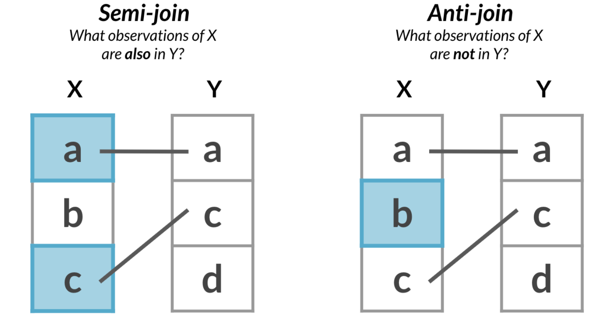
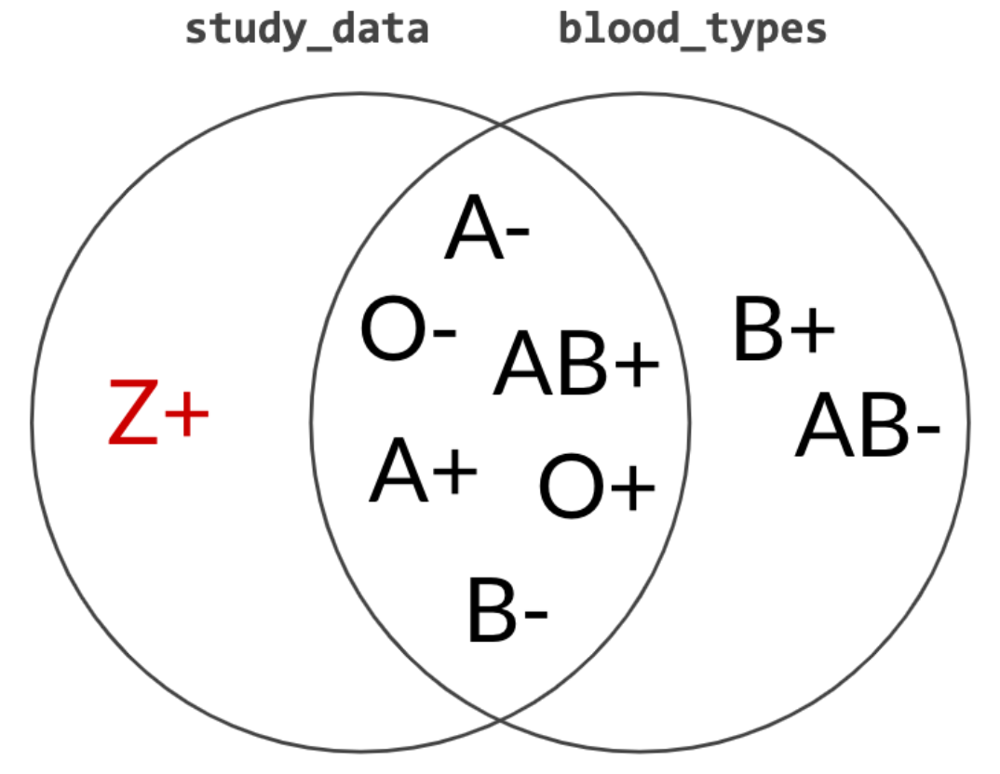
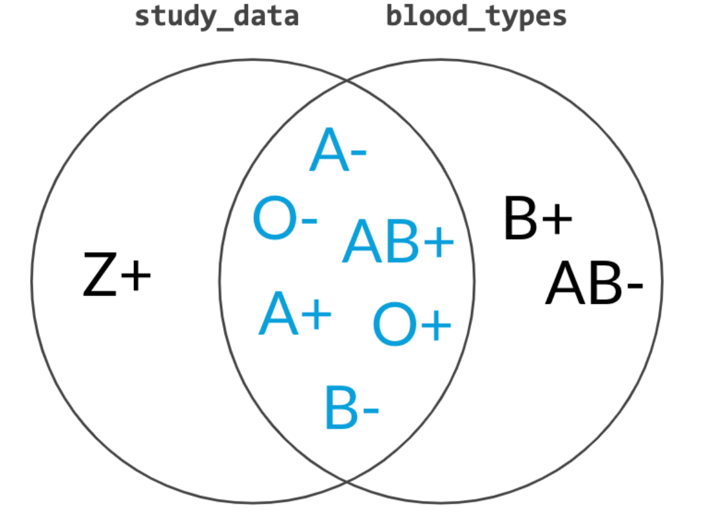
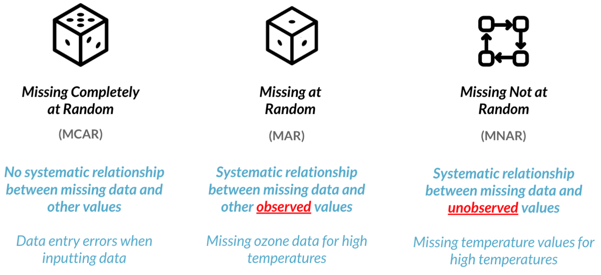
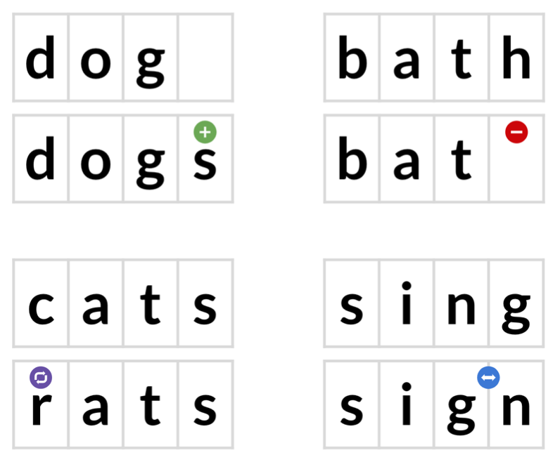
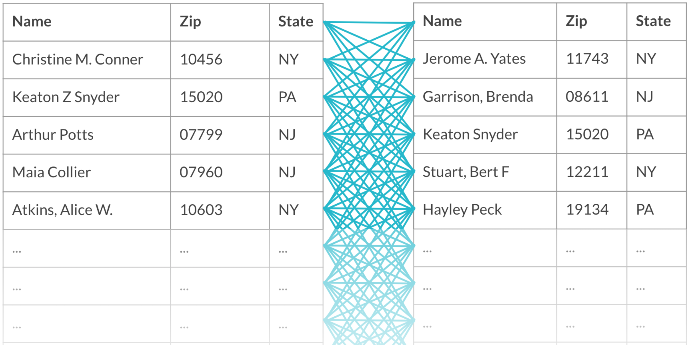
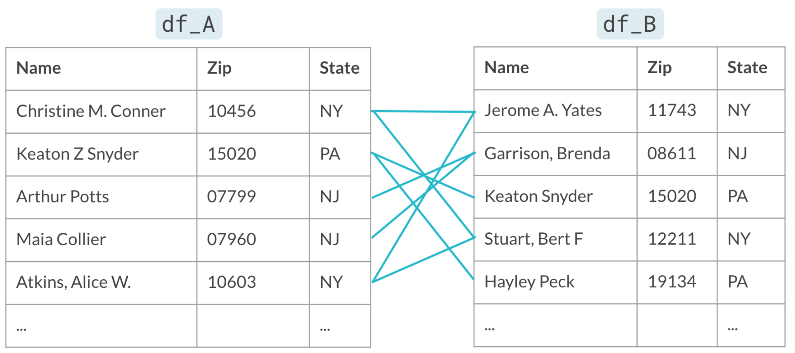

```{r setup, include=FALSE}
knitr::opts_chunk$set(echo = TRUE, eval = T)
```

It's commonly said that data scientists spend 80% of their time cleaning and manipulating data and only 20% of their time analyzing it. The time spent cleaning is vital since analyzing dirty data can lead you to draw inaccurate conclusions. 

In this section, you'll learn how to clean dirty data. Using R, you'll learn how to identify values that don't look right and fix dirty data by converting data types, filling in missing values, and using fuzzy string matching. As you learn, you’ll brush up on your skills by working with real-world datasets, including bike-share trips, customer asset portfolios, and restaurant reviews—developing the skills you need to go from raw data to awesome insights as quickly and accurately as possible!

# 1. Common Data Problems

In this part, you'll learn how to overcome some of the most common dirty data problems. You'll convert data types, apply range constraints to remove future data points, and remove duplicated data points to avoid double-counting.

## Common data types

Since different data types are treated and act differently, it's important to be able to identify the data type that's most suitable for the data you're working with. Here, you'll learn match different data with the data type that makes the data easiest to process and extract insights from.

| Data type | Example | R Data type |
|---|---|---|
| Text | First name, Last name, address, ... | `character` |
| Integer | Subscriber Count, # Products sold, ... | `integer` |
| Decimal | Temperature, exchange rate, ... | `numeric` |
| Binary | Is married, new customer, yes/no, ... | `logical` | 
| Category | Marriage status, color, ... | `factor` |
| Date | Order dates, date of birth, ... | `date` |

## Checking data types

| **Logical checking** - returns `TRUE` / `FALSE` | `assertive` checking - error when `FALSE` | 
| --- | --- |
| `is.character()` | `assert_is_character()` |
| `is.numeric()` | `assert_is_numeric()` |
| `is.logical()` | `assert_is_logical()` |
| `is.factor()` | `assert_is_factor()` |
| `is.date()` | `assert_is_date()` |
| ... | ... |

Alternatively, you can use Hadley Wickham's `assertthat` package:

```{r, eval=FALSE}
x <- 1:10

# Using base r
stopifnot(is.character(x))
#> Error: is.character(x) is not TRUE

# Using assertthat
library(assertthat)
assert_that(is.character(x))
#> Error: x is not a character vector
assert_that(length(x) == 5)
#> Error: length(x) not equal to 5
assert_that(is.numeric(x))
#> [1] TRUE
```

<sup>Created on 2022-02-26 by the [reprex package](https://reprex.tidyverse.org) (v2.0.1)</sup>

## Converting data types

**Data**

* `bike_share_rides`

Throughout this section, we'll be working with San Francisco bike share ride data called `bike_share_rides`. It contains information on start and end stations of each trip, the trip duration, and some user information.  

**Packages**

* <code><a href="http://dplyr.tidyverse.org">dplyr</a></code>
* <code><a href="https://github.com/cran/assertive">assertive</a></code>
  * <code><a href="https://github.com/hadley/assertthat">assertthat</a></code>
* <code><a href="http://forcats.tidyverse.org">forcats</a></code>

**Steps**

Before beginning to analyze any dataset, it's important to take a look at the different types of columns we'll be working with, which we can do using `glimpse()`. 

At first, we'll take a look at the data types contained in `bike_share_rides` and see how an incorrect data type can flaw your analysis. 

1. Examine the data types of the columns of `bike_share_rides`.

```{r, message=FALSE}
# Libraries
library(dplyr)
library(assertive)

# 1. Load & glimpse at bike_share_rides
bike_share_rides <- readRDS("data/bike_share_rides.rds")
glimpse(bike_share_rides)
```

2. Get a summary of the `user_birth_year` column of `bike_share_rides`.

```{r}
# 2. Summary of user_birth_year
summary(bike_share_rides$user_birth_year)
```

> *Question*
> ---
> The summary statistics of <code>user_birth_year</code> don't seem to offer much useful information about the different birth years in our dataset. Why do you think that is?<br>
> <br>
> ⬜ The <code>user_birth_year</code> column is not of the correct type and should be converted to a character.<br>
> ⬜ The <code>user_birth_year</code> column has an infinite set of possible values and should be converted to a factor.<br>
> ✅ The <code>user_birth_year</code> column represents groupings of data and should be converted to a factor.<br>

3. Add a new column to `bike_share_rides` called `user_birth_year_fct`, which contains `user_birth_year`, converted to a factor.
4. Assert that the `user_birth_year_fct` is a factor to confirm the conversion.

```{r}
# Libraries
library(forcats)

# 3. Convert user_birth_year to factor: user_birth_year_fct
bike_share_rides <- bike_share_rides %>%
  mutate(user_birth_year_fct = as_factor(user_birth_year))

# 4. Assert user_birth_year_fct is a factor
assert_is_factor(bike_share_rides$user_birth_year_fct)

# Summary of user_birth_year_fct
summary(bike_share_rides$user_birth_year_fct)
```


## Trimming strings

In the previous steps, you were able to identify the correct data type and convert `user_birth_year` to the correct type, allowing you to extract counts that gave you a bit more insight into the dataset.

Another common dirty data problem is having extra bits like percent signs or periods in numbers, causing them to be read in as `character`s. In order to be able to crunch these numbers, the extra bits need to be removed and the numbers need to be converted from `character` to `numeric`. In this section, you'll need to convert the `duration` column from `character` to `numeric`, but before this can happen, the word `"minutes"` needs to be removed from each value.

**Packages**

* <code><a href="https://stringr.tidyverse.org">stringr</a></code>

**Comments**

* `stringr` functions uses ***regular expression***
* A ***regular expression*** is a sequence of characters that allows for robust searching within a string
* Certain characters are treated differently in a regular expression:
  * `(`,`)`,`[`,`]`, `$`, `.`, `+`, `*`, and others
* Searching for these characters requires usind `fixed()`:
  * `str_detect(column, fixed("$"))`

**Steps:**

1. Use `str_remove()` to remove `"minutes"` from the `duration` column of `bike_share_rides`. Add this as a new column called `duration_trimmed`.
2. Convert the `duration_trimmed` column to a numeric type and add this as a new column called `duration_mins`.
3. Glimpse at `bike_share_rides`

```{r}
# Libraries
library(stringr)

# 1. & 2.
bike_share_rides <- bike_share_rides |> 
  # Remove 'minutes' from duration: duration_trimmed
  mutate(duration_trimmed = duration |> str_remove(" minutes"),
         # Convert duration_trimmed to numeric: duration_mins
         duration_mins = duration_trimmed |> as.numeric())

# 3. Glimpse at bike_share_rides
bike_share_rides %>% glimpse()
```

> *Alternatives*
> ---
> <ul>
> <li>Instead of removing characters, you can also just extract the digits (including grouping and decimal marks) with a regex <code>stringr::str_extract("[\\d\\.]*")</code></li>
> <li>Regex Cheatsheets:
>   <ul>
>     <li><a href="https://devhints.io/regexp">devhints.io</a></li>
>     <li><a href="https://github.com/rstudio/cheatsheets/blob/main/strings.pdf"><code>stringr</code> cheatsheet</a></li>
>   </ul>
> <li>The function <code>readr::parse_number()</code> does everything in one step.</li>
> </ul>

4. Assert that the `duration_mins` column is `numeric`.
5. Calculate the mean of `duration_mins`.

```{r}
# 4. Assert duration_mins is numeric
assert_is_numeric(bike_share_rides$duration_mins)

# 5. Calculate mean duration
mean(bike_share_rides$duration_mins)
```


## Constraints
### Range constraints

*What's an out of range value?*

* SAT score: 400-1600
* Package weight: at least 0 lb/kg
* Adult heart rate: 60-100 beats per minute

*Handling out of range values*

* Remove rows
* Treat as missing (`NA`)
* Replace with range limit
* Replace with other value based on domain knowledge and/or knowledge of dataset

Values that are out of range can throw off an analysis, so it's important to catch them early on. In this section, you'll be examining the `duration_min` column more closely. Bikes are not allowed to be kept out for <a href="https://help.baywheels.com/hc/en-us/articles/360033790932-How-long-can-I-keep-a-bike-out-" target="_blank" rel="noopener noreferrer">more than 24 hours</a>, or 1440 minutes at a time, but issues with some of the bikes caused inaccurate recording of the time they were returned.

In this sections, you'll replace erroneous data with the range limit (1440 minutes), however, you could just as easily replace these values with `NA`s.

**Packages**

* `ggplot2`

**Steps**

1. Create a three-bin histogram of the `duration_min` column of `bike_share_rides` using `ggplot2` to identify if there is out-of-range data.

```{r}
# Library
library(ggplot2)

# Load data
bike_share_rides_sample <- readRDS("data/bike_share_rides_sample.rds")

# 1.1 Create breaks
breaks <- c(min(bike_share_rides_sample$duration_min), 0, 1440, max(bike_share_rides_sample$duration_min))

# 1.2 Create a histogram of duration_min
ggplot(bike_share_rides_sample, aes(duration_min)) +
  geom_histogram(breaks = breaks)
```

2. Replace the values of `duration_min` that are greater than `1440` minutes (24 hours) with `1440`. Add this to `bike_share_rides` as a **new** column called `duration_min_const`. 
3. Assert that all values of `duration_min_const` are between `0` and `1440`.

```{r}
# 2. duration_min_const: replace vals of duration_min > 1440 with 1440
bike_share_rides_sample <- bike_share_rides_sample %>%
  mutate(duration_min_const = replace(duration_min, duration_min > 1440, 1440))

# 3. Make sure all values of duration_min_const are between 0 and 1440
assert_all_are_in_closed_range(bike_share_rides_sample$duration_min_const, lower = 0, upper = 1440)
```

### Date constraints

Something has gone wrong and it looks like you have data with dates from the future, which is way outside of the date range you expected to be working with. To fix this, you'll need to remove any rides from the dataset that have a `date` in the future. Before you can do this, the `date` column needs to be converted from a `character` to a `Date`. Having these as `Date` objects will make it much easier to figure out which rides are from the future, since R makes it easy to check if one `Date` object is before (`<`) or after (`>`) another.

**Packages**

* `lubridate`

**Steps**

1. Convert the `date` column of `bike_share_rides` from `character` to the `Date` data type.
2. Assert that all values in the `date` column happened sometime in the past and not in the future.

```{r, error=TRUE, message=FALSE}
# Libraries
library(lubridate)

# 1. Convert date to Date type
bike_share_rides <- bike_share_rides %>%
  mutate(date = as_datetime(date))

# Modify data: Change year to 2043 of 10 random observations
bike_share_rides_mod <- bike_share_rides |> 
                            mutate(date = case_when(ride_id %in% c(99874,15624,89173,39239,23104,39307,13170,51086,87586,21989) ~ `year<-`(date, 2043),
                                                    T ~ date))

# 2. Make sure all dates are in the past
assert_all_are_in_past(bike_share_rides_mod$date)
```

3. Filter `bike_share_rides` to get only the rides from the past or today, and save this as `bike_share_rides_past`.
4. Assert that the `dates` in `bike_share_rides_past` occurred only in the past.

```{r}
# 3. Filter for rides that occurred before or on today's date
bike_share_rides_past <- bike_share_rides_mod %>%
  filter(date <= today())

# 4. Make sure all dates from bike_share_rides_past are in the past
assert_all_are_in_past(bike_share_rides_past$date)
```


### Uniqueness constraints (Duplicates)
#### Full duplicates

Whats a full duplicate?

|  | First name | Last name | Address | Credit Score | 
| --- | --- | --- | --- | --- |
| 1 | Miriam | Day | 6042 Sollicitudin Avenue | 313 |
| 2 | Miriam | Day | 6042 Sollicitudin Avenue | 313 |

You've been notified that an update has been made to the bike sharing data pipeline to make it more efficient, but that duplicates are more likely to be generated as a result. To make sure that you can continue using the same scripts to run your weekly analyses about ride statistics, you'll need to ensure that any duplicates in the dataset are removed first.

When multiple rows of a data frame share the same values for all columns, they're *full duplicates* of each other. Removing duplicates like this is important, since having the same value repeated multiple times can alter summary statistics like the mean and median. Each ride, including its `ride_id` should be unique. 

**Steps**

1. Find full duplicates

```{r}
# Modify data
bike_share_rides_mod <- bike_share_rides |> 
  
                            # Add duplicates
                            add_row(bike_share_rides |> slice(17278)) |> 
                            add_row(bike_share_rides |> slice(27208))

# 1. Finding duplicates
bike_share_rides_mod |> 
    filter(bike_share_rides_mod |> duplicated())
```

**Alternative**

```{r}
# Libraries
library(janitor)

# 1. Finding duplicates
bike_share_rides_mod |> 
    get_dupes()
```

2. Get the total number of full duplicates in `bike_share_rides`.

```{r}
# 2. Count the number of full duplicates
sum(duplicated(bike_share_rides_mod))
```

3. Remove all full duplicates from `bike_share_rides` and save the new data frame as `bike_share_rides_unique.`
4. Get the total number of full duplicates in the new `bike_share_rides_unique` data frame.

```{r}
# 3. Remove duplicates
bike_share_rides_unique <- distinct(bike_share_rides_mod)

# 4. Count the full duplicates in bike_share_rides_unique
sum(duplicated(bike_share_rides_unique))
```


#### Partial duplicates

Whats a partial duplicate?

| | First name | Last name | Address | Credit Score | 
| --- | --- | --- | --- | --- |
| 1 | Tamekah | Forbes | P.O. Box 147, 511 Velit St | 356 |
| 2 | Tamekah | Forbes | P.O. Box 147, 511 Velit St | 342 |

##### Removing partial duplicates

Now that you've identified and removed the full duplicates, it's time to check for partial duplicates. Partial duplicates are a bit tricker to deal with than full duplicates. In this section, you'll first identify any partial duplicates and then practice the most common technique to deal with them, which involves dropping all partial duplicates, keeping only the first.

**Steps**

1. Count the number of occurrences of each `ride_id`.
2. Filter for `ride_id`s that occur multiple times.

```{r}
# Modify data
bike_share_rides_mod <- bike_share_rides |> 
  
                            # Add duplicates
                            add_row(bike_share_rides |> 
                                        slice(33237) |> 
                                        mutate(duration_mins = 5.8)) |> 
                            add_row(bike_share_rides |> 
                                        slice(17657) |> 
                                        mutate(duration_mins = 13.6))

# Find duplicated ride_ids
bike_share_rides_mod %>% 
  # 1. Count the number of occurrences of each ride_id
  count(ride_id) %>% 
  # 2. Filter for rows with a count > 1
  filter(n > 1)
```

**Alternative**

```{r}
# 1. Find duplicated ride_ids
bike_share_rides_mod |> 
    janitor::get_dupes(ride_id)
```

3. Remove full and partial duplicates from `bike_share_rides` based on `ride_id` only, keeping all columns.
4. Store this as `bike_share_rides_unique`.
5. Find the duplicated `ride_id`s in `bike_share_rides_unique`.

```{r}
# 3. / 4. Remove full and partial duplicates
bike_share_rides_unique <- bike_share_rides_mod %>%
  # Only based on ride_id instead of all cols
  distinct(ride_id, .keep_all = T)

# 5. Find duplicated ride_ids in bike_share_rides_unique
bike_share_rides_unique %>%
  # Count the number of occurrences of each ride_id
  count(ride_id) %>%
  # Filter for rows with a count > 1
  filter(n > 1)
```

##### Aggregating partial duplicates

Another way of handling partial duplicates is to compute a summary statistic of the values that differ between partial duplicates, such as mean, median, maximum, or minimum. This can come in handy when you're not sure how your data was collected and want an average, or if based on domain knowledge, you'd rather have too high of an estimate than too low of an estimate (or vice versa).

**Steps**

1. Group `bike_share_rides` by `ride_id` and `date`.
2. Add a column called `duration_min_avg` that contains the mean ride duration for the row's `ride_id` and `date`.
3. Remove duplicates based on `ride_id` and `date`, keeping all columns of the data frame.
4. Remove the `duration_min` column.

```{r}
bike_share_rides_mod %>%
  # 1. Group by ride_id and date
  group_by(ride_id, date) %>%
  # 2. Add duration_min_avg column
  mutate(duration_min_avg = mean(duration_mins) ) %>%
  # 3. Remove duplicates based on ride_id and date, keep all cols
  distinct(ride_id, date, .keep_all = TRUE) %>%
  # 4. Remove duration_min column
  select(-duration_mins)
```


# 2. Categorical and Text Data

Categorical and text data can often be some of the messiest parts of a dataset due to their unstructured nature. In this chapter, you’ll learn how to fix whitespace and capitalization inconsistencies in category labels, collapse multiple categories into one, and reformat strings for consistency.

## Membership constraints

So far, you've learned about a number of different problems you can run into when you have dirty data, including 

* data type constraints, 
* range constraints, 
* uniqueness constraints, 
* and membership constraints. 

Categorical variables have a fixed and known set of possible values. In a `factor`, each category is stored as a number and has a corresponding label. `factor`s cannot have values that fall outside of the predefined ones.

| Data | Labels | Numeric representaion |
| --- | --- | --- | 
| Marriage status | `unmarried`, `married` | `1`, `2` |
| Household income category | `0-20K`, `20-40K`, ... | `1`, `2`, ... | 
| T-Shirt size | `S`, `M`, `L`, `XL` | `1`, `2`, `3`, `4` |

It's important to be able to correctly identify the type of problem you're dealing with so that you can treat it correctly. 

**Example:** Classification based on whether it's a membership constraint issue or a different type of issue:

| Membership constraint | Other constraint |
| --- | --- |
| A `has_loan` column with the value `25`. | A `revenue` column represented as a string. |
| A `month` column with the value `14`. | A `birthdate` column with values in the future. |
| A `GPA` column containing a `Z-` grade (Grades are traditionally A through F). | An `age` column with values above `130`. |
| A `day_of_week` column with the value `12` | |

### Filtering Joins: a quick review

Keeps or removes observations from the first table without adding columns

{width=50%}

The following example is a good illustration of how that works:

```{r}
study_data  <- readRDS("data/study_data.rds")
study_data
```

```{r}
blood_types <- readRDS("data/blood_types.rds") 
blood_types
```

**Anti_join: Finding non members**

{width=50%}

```{r}
study_data |> 
  anti_join(blood_types, by = "blood_type")
```

**Semi-Join: Removing non members**

{width=50%}

```{r}
study_data |> 
  semi_join(blood_types, by = "blood_type")
```

**Data**

* `sfo_survey` / `sfo_survey_mod`

Now that we can identify membership constraint problems, it's time to fix these problems in a new dataset. Throughout this section, you'll be working with a dataset called `sfo_survey`, containing survey responses from passengers taking flights from San Francisco International Airport (SFO). Participants were asked questions about the airport's cleanliness, wait times, safety, and their overall satisfaction. 

There were a few issues during data collection that resulted in some inconsistencies in the dataset (`sfo_survey_mod`). In the following steps, you'll be working with the `dest_size` column, which categorizes the size of the destination airport that the passengers were flying to. A data frame called `dest_sizes` will be created that contains all the possible destination sizes. Your mission is to find rows with invalid `dest_size`s and remove them from the data frame.

**Steps**

1. Count the number of occurrences of each `dest_size` in `sfo_survey_mod`.

```{r}
sfo_survey_mod <- readRDS("data/sfo_survey_mod.rds")

# 1. Count the number of occurrences of dest_size
sfo_survey_mod %>%
  count(dest_size)
```

> *Question*
> ---
> Take a closer look at your output. Which dest_size values appear to violate membership constraints?<br>
> <br>
> ⬜ <code>"huge"</code>, <code>"Small"</code>, <code>"Large&nbsp;"</code>, and <code>"Hub"</code>.<br>
> ✅ <code>"huge"</code>, <code>"&nbsp;Small&nbsp;"</code>, <code>"Large&nbsp;"</code>, and <code>"&nbsp;Hub"</code>.<br>
> ⬜ <code>"Small"</code>, <code>"Medium"</code>, <code>"Large"</code>, and <code>"Hub"</code>.<br>

2. Use the correct type of filtering join on the `sfo_survey` data frame and the `dest_sizes` data frame to get the rows of `sfo_survey` with invalid `dest_size` values.
3. Get the `id`, `airline`, `destination`, and `dest_size` columns.

```{r}
dest_sizes <- tibble(
  dest_size          = c("Small", "Medium", "Large", "Hub"),
  passengers_per_day = c("0-20K", "20K-70K", "70K-100K", "100K+")
)

# Find bad dest_size rows
sfo_survey_mod %>% 
  # 2. Join with dest_sizes data frame to get bad dest_size rows
  anti_join(dest_sizes) %>%
  # 3. Select id, airline, destination, and dest_size cols
  select(id, airline, destination, dest_size)
```

4. Use the correct filtering join on `sfo_survey` and `dest_sizes` to get the rows of `sfo_survey` that have a valid `dest_size`.
5. Count the number of times that each `dest_size` occurs to make sure there are no invalid values left behind.

```{r}
# Remove bad dest_size rows
sfo_survey_mod %>% 
  # 4. Join with dest_sizes
  semi_join(dest_sizes) %>%
  # 5. Count the number of each dest_size
  count(dest_size)
```


## Identifying inconsistency

Different kinds of inconsistencies that can occur within categories, making it look like a variable has more categories than it should:

* Case inconsistency
* whitespace inconsistency
* too many categories
* ...

**Data**

In this section, you'll continue working with the `sfo_survey_mod` dataset. You'll examine the `dest_size` column again as well as the `cleanliness` column and determine what kind of issues, if any, these two categorical variables face. 


**Steps**

1. Count the number of occurrences of each category of the `dest_size` variable of `sfo_survey`.

```{r}
# Count dest_size
sfo_survey_mod %>%
  count(dest_size)
```

> *Question*
> ---
> Select the statement that most accurately describes the categories in the dest_size variable of sfo_survey.<br>
> <br>
> ⬜ The categories in `dest_size` have no inconsistencies.<br>
> ⬜ The categories in `dest_size` have inconsistent capitalization.<br>
> ✅ The categories in `dest_size` have inconsistent white space.<br>
> ⬜ The categories in `dest_size` have inconsistent capitalization and white space.<br>

2. Count the number of occurrences of each category of the `cleanliness` variable of `sfo_survey`.

```{r}
# Count cleanliness
sfo_survey_mod %>%
  count(cleanliness)
```

> *Question*
> ---
> Select the statement that most accurately describes the categories in the cleanliness variable of sfo_survey.<br>
> <br>
> ⬜ The categories in `cleanliness` have no inconsistencies.<br>
> ✅ The categories in `cleanliness` have inconsistent capitalization.<br>
> ⬜ The categories in `cleanliness` have inconsistent white space.<br>
> ⬜ The categories in `cleanliness` have inconsistent capitalization and white space.<br>

## Correcting inconsistency

Now that we've identified that `dest_size` has whitespace inconsistencies and `cleanliness` has capitalization inconsistencies, you'll use the new tools at your disposal to fix the inconsistent values in `sfo_survey` instead of removing the data points entirely, which could add bias to your dataset if more than 5% of the data points need to be dropped.

**Steps**

1. Add a column to `sfo_survey` called `dest_size_trimmed` that contains the values in the `dest_size` column with all leading and trailing whitespace removed.
2. Add another column called `cleanliness_lower` that contains the values in the `cleanliness` column converted to all lowercase.
3. Count the number of occurrences of each category in `dest_size_trimmed`.

```{r}
# Add new columns to sfo_survey
sfo_survey_mod <- sfo_survey_mod %>%
  # 1. dest_size_trimmed: dest_size without whitespace
  mutate(dest_size_trimmed = str_trim(dest_size),
         # 2. cleanliness_lower: cleanliness converted to lowercase
         cleanliness_lower = str_to_lower(cleanliness))

# 3. Count values of dest_size_trimmed
sfo_survey_mod %>%
  count(dest_size_trimmed)
```

4. Count the number of occurrences of each category in `cleanliness_lower`.

```{r}
# 4. Count values of cleanliness_lower
sfo_survey_mod %>%
  count(cleanliness_lower)
```

## Collapsing categories

One of the tablets that participants filled out the `sfo_survey` on was not properly configured, allowing the response for `dest_region` to be free text instead of a dropdown menu. This resulted in some inconsistencies in the `dest_region` variable that you'll need to correct in this exercise to ensure that the numbers you report to your boss are as accurate as possible.

**Steps**

1. Count the categories of `dest_region`.

```{r}
# 1. Count categories of dest_region
sfo_survey_mod %>%
  count(dest_region)
```

> *Question*
> ---
> From your output from step 1, which categories need to be collapsed?<br>
> <br>
> ⬜ `"EU"` and `"Europ"` need to be collapsed to `"Europe"`.<br>
> ✅ `"EU"`, `"eur"`, and `"Europ"` need to be collapsed to `"Europe"`.<br>
> ⬜ `"East US"`, `"Midwest US"`, and `"West US"` need to be collapsed to `"US"`.<br>
> ⬜ `"Asia"` and `"Central/South America"` should be collapsed to `"Asia and Central/South America"`.<br>

2. Create a vector called `europe_categories` containing the three values of `dest_region` that need to be collapsed.
3. Add a new column to `sfo_survey` called `dest_region_collapsed` that contains the values from the `dest_region` column, except the categories stored in `europe_categories` should be collapsed to `Europe`.
4. Count the categories of `dest_region_collapsed`.

```{r}
# 2. Categories to map to Europe
europe_categories <- c("EU", "Europ", "eur")

# 3. Add a new col dest_region_collapsed
sfo_survey_mod %>%
  # Map all categories in europe_categories to Europe
  mutate(dest_region_collapsed = fct_collapse(dest_region, 
                                     Europe = europe_categories)) %>%
  # 4. Count categories of dest_region_collapsed
  count(dest_region_collapsed)
```

## Detecting inconsistent text data

You've recently received some news that the customer support team wants to ask the SFO survey participants some follow-up questions. However, the auto-dialer that the call center uses isn't able to parse all of the phone numbers since they're all in different formats. After some investigation, you found that some phone numbers are written with hyphens (`-`) and some are written with parentheses (`(`,`)`). In this exercise, you'll figure out which phone numbers have these issues so that you know which ones need fixing.

**Steps**

1. Filter for rows with phone numbers that contain `"-"`s.

```{r}
# 1. Filter for rows with "-" in the phone column
sfo_survey_mod %>%
  filter(phone %>% str_detect("-"))
```

2. Filter for rows with phone numbers that contain `"("`, or `")"`. Remember to use `fixed()` when searching for parentheses.

```{r}
# 2. Filter for rows with "(" or ")" in the phone column
sfo_survey_mod %>%
  filter(str_detect(phone, fixed("(")) | str_detect(phone, fixed(")")))
```

## Replacing and removing

In the last section, you saw that the `phone` column of `sfo_data` is plagued with unnecessary parentheses and hyphens. The customer support team has requested that all phone numbers be in the format `"123 456 7890"`. 

**Steps**

1. Remove opening and closing parentheses from the `phone` column. Store this as a variable called `phone_no_parens`. Remember to use `fixed()`!
2. Add a new column to `sfo_survey` called `phone_no_parens` that contains the contents of `phone_no_parens`.
3. Create a new column of `sfo_survey` called `phone_clean` containing the values of `phone_no_parens` with all hyphens replaced with spaces.

```{r}
# 1. Remove parentheses from phone column
phone_no_parens <- sfo_survey_mod$phone %>%
  # Remove "("s
  str_remove_all(fixed("(")) %>%
  # Remove ")"s
  str_remove_all(fixed(")"))

# 2. Add phone_no_parens as column
sfo_survey_mod %>%
  mutate(phone_no_parens = phone_no_parens,
  # 3. Replace all hyphens in phone_no_parens with spaces
         phone_clean = str_replace_all(phone_no_parens, "-", " "))
```

## Invalid phone numbers

The customer support team is grateful for your work so far, but during their first day of calling participants, they ran into some phone numbers that were invalid. In this section, you'll remove any rows with invalid phone numbers so that these faulty numbers don't keep slowing the team down. 

**Steps**

1. Examine the invalid `phone` numbers by filtering for numbers whose length is not equal to 12.

```{r}
# 1. Check out the invalid numbers
sfo_survey_mod %>%
  filter(str_length(phone_no_parens) != 12)
```

2. Remove the rows with invalid numbers by filtering for numbers with a length of exactly 12.

```{r}
# Remove rows with invalid numbers
sfo_survey_mod %>%
  filter(str_length(phone_no_parens) == 12)
```

# 3. Advanced Data Problems

In this section, you’ll dive into more advanced data cleaning problems, such as ensuring that weights are all written in kilograms instead of pounds. You’ll also gain invaluable skills that will help you verify that values have been added correctly and that missing values don’t negatively impact your analyses.

## Uniformity

Different units or formats:

* **Temperature**: `°C` vs. `°F`      
* **Weight**: `kg` vs. `g` vs. `lb`
* **Money**: USD `$` vs. GBP `£` vs. JPY `¥`
* **Date**: `DD-MM-YYYY` vs. `MM-DD-YYYY` vs. `YYYY-MM-DD`

### Date uniformity

**Data**

* `accounts`

You work at an asset management company and you'll be working with the `accounts` dataset, which contains information about each customer, the amount in their account, and the date their account was opened. Your boss has asked you to calculate some summary statistics about the average value of each account and whether the age of the account is associated with a higher or lower account value. Before you can do this, you need to make sure that the `accounts` dataset you've been given doesn't contain any uniformity problems. In this section, you'll investigate the `date_opened` column and clean it up so that all the dates are in the same format.

**Packages**

* `lubridate`

**Steps**

1. Take a look at the head of `accounts` to get a sense of the data you're working with.

```{r}
accounts <- readRDS("data/accounts.rds")

# 1. Check out the accounts data frame
head(accounts)
```

> *Question*
> ---
> Try running `as.Date(accounts$date_opened)` in the console and examine the output. Notice that you end up with a lot of `NAs`. Why is this?<br>
> <br>
> ⬜ ``as.Date()` needs to be explicitly told the formats of every single date, including which dates are in which format.<br>
> ✅ `By default, `as.Date()` can't convert "Month DD, YYYY" formats.<br>
> ⬜ ``as.Date()` can't convert `character`s to `Date`s.<br>

**Steps**

1. Convert the dates in the `date_opened` column to the same format using the `formats` vector and store this as a new column called `date_opened_clean`.

```{r}
# 1.1 Define the date formats
formats <- c("%Y-%m-%d", "%B %d, %Y")

# 1.2 Convert dates to the same format
accounts %>%
  mutate(date_opened_clean = parse_date_time(date_opened,  formats))
```

### Currency uniformity

Now that your dates are in order, you'll need to correct any unit differences. When you first plot the data, you'll notice that there's a group of very high values, and a group of relatively lower values. The bank has two different offices - one in New York, and one in Tokyo, so you suspect that the accounts managed by the Tokyo office are in Japanese yen instead of U.S. dollars. Luckily, you have a data frame called `account_offices` that indicates which office manages each customer's account, so you can use this information to figure out which `total`s need to be converted from yen to dollars.

The formula to convert yen to dollars is `USD = JPY / 104`.

**Steps**

1. Create a scatter plot with `date_opened` on the x-axis and `total` on the y-axis.

```{r}
# 1. Scatter plot of opening date and total amount
accounts %>%
  ggplot(aes(x = date_opened, y = total)) +
  geom_point()
```

2. Left join `accounts` and `account_offices` by their `id` columns.

```{r}
account_offices <- readRDS("data/account_offices.rds")

# 2. Left join accounts and account_offices by id
accounts %>%
  left_join(account_offices)
```

3. Convert the `total`s from the Tokyo office from yen to dollars, and keep the `total` from the New York office in dollars. Store this as a new column called `total_usd`.

```{r}
# Left join accounts to account_offices by id
accounts %>%
  left_join(account_offices, by = "id") %>%
  # 3. Convert totals from the Tokyo office to USD
  mutate(total_usd = ifelse(total > 5000000, total / 104, total))
```

4. Create a scatter plot of your new uniform data using `date_opened` on the x-axis and `total_usd` on the y-axis.

```{r}
# Left join accounts to account_offices by id
accounts %>%
  left_join(account_offices, by = "id") %>%
  # Convert totals from the Tokyo office to USD
  mutate(total_usd = ifelse(office == "Tokyo", total / 104, total)) %>%
  # 4. Scatter plot of opening date vs total_usd
  ggplot(aes(x = date_opened, y = total_usd)) +
    geom_point()
```

## Cross field validation

### Validating totals

You'll continue to work with the `accounts` data frame, but this time, you have a bit more information about each account. There are three different funds that account holders can store their money in. In this section, you'll validate whether the `total` amount in each account is equal to the sum of the amount in `fund_A`, `fund_B`, and `fund_C`. If there are any accounts that don't match up, you can look into them further to see what went wrong in the bookkeeping that led to inconsistencies.

**Steps**

1. Create a new column called `theoretical_total` that contains the sum of the amounts in each fund.
2. Find the accounts where the `total` doesn't match the `theoretical_total`.

```{r}
accounts_mod <- readRDS("data/accounts_mod.rds")

# Find invalid totals
accounts_mod %>%
  # 1. theoretical_total: sum of the three funds
  mutate(theoretical_total = fund_A + fund_B + fund_C) %>%
  # 2. Find accounts where total doesn't match theoretical_total
  filter(theoretical_total != total)
```

### Validating age

Now that you found some inconsistencies in the `total` amounts, you're suspicious that there may also be inconsistencies in the `acct_age`column, and you want to see if these inconsistencies are related. Using the skills you learned from the video exercise, you'll need to validate the age of each account and see if rows with inconsistent `acct_age`s are the same ones that had inconsistent `total`s

**Steps**

1. Create a new column called `theoretical_age` that contains the age of each account based on the `date_opened`.
2. Find the accounts where the `acct_age` doesn't match the `theoretical_age`.

```{r}
# Find invalid acct_age
accounts_mod %>%
  # 1. theoretical_age: age of acct based on date_opened
  mutate(theoretical_age = floor(as.numeric(date_opened %--% today(), "years"))) %>%
  # 2. Filter for rows where acct_age is different from theoretical_age
  filter(acct_age != theoretical_age)
```

## Completeness

### Types of missingness

The three flavors of missing data: 



**Example:** Types of missingness.

| Missing completely at random | Missing at random | Missing not at random |
| --- | --- | --- |
| Questionnaires were randomly lost in the mail. | Younger people were less likely to get their blood pressure checked at the doctor, so their medical records were missing blood pressure data. | Blood samples tested during the night shift were more likely to be contaminated, creating missing test results, but time of testing wasn't recorded. |
| | Test scores are missing for students from a certain school district, but not the others. | A scale has a limit of 30 lbs, so shipments above 30 lbs don't have a recorded weight. |

### Visualizing missing data

Dealing with missing data is one of the most common tasks in data science. There are a variety of types of missingness, as well as a variety of types of solutions to missing data.

**Data**

* `accounts_new`

You just received a new version of the `accounts` data frame containing data on the amount held and amount invested for new and existing customers. However, there are rows with missing `inv_amount` values. 

You know for a fact that most customers below 25 do not have investment accounts yet, and suspect it could be driving the missingness. 

**Packages**

* `visdat`

**Steps**

1. Visualize the missing values in `accounts` by column using a function from the `visdat` package.

```{r}
accounts_new <- readRDS("data/accounts_new.rds")

#library
library(visdat)

# 1. Visualize the missing values by column
accounts_new %>%
    vis_miss()
```

2. Add a logical column to `accounts` called `missing_inv` that indicates whether each row is missing the `inv_amount` or not.
3. Group by `missing_inv`.
4. Calculate the mean age for each group of `missing_inv`.

```{r}
accounts_new %>%
  # 2. missing_inv: Is inv_amount missing?
  mutate(missing_inv = is.na(inv_amount)) %>%
  # 3. Group by missing_inv
  group_by(missing_inv) %>%
  # 4. Calculate mean age for each missing_inv group
  summarise(avg_age = mean(age))
```

> *Question*
> ---
> Take a look at the mean age for each group of `missing_inv`. What's going on here?<br>
> <br>
> ⬜ `The data is missing completely at random and there are no drivers behind the missingness.<br>
> ✅ `Since the average age for `TRUE` `missing_inv` is 22 and the average age for `FALSE` `missing_inv` is 44, it is likely that the `inv_amount` variable is missing mostly in young customers.<br>
> ⬜ `Since the average age for `FALSE` `missing_inv` is 22 and the average age for `TRUE` `missing_inv` is 44, it is likely that the `inv_amount` variable is missing mostly in older customers.<br>

5. Sort `accounts` by `age`.
6. Visualize missing data by column.

```{r}
# 5. / 6. Sort by age and visualize missing vals
accounts_new %>%
  arrange(age) %>%
  vis_miss()
```

### Treating missing data

Simple Approaches

1. Drop missing data
2. Impute (fill in) with statistical measures (mean, median, mode, ...) or domain knowledge

More complex approaches

1. Impute using an algorithmic approach
2. Impute with machine learning models

**Data**

* `accounts_new2`

In this section, you're working with another version of the `accounts` data that contains missing values for both the `cust_id` and `acct_amount` columns. 

You want to figure out how many unique customers the bank has, as well as the average amount held by customers. You know that rows with missing `cust_id` don't really help you, and that on average, the `acct_amount` is usually 5 times the amount of `inv_amount`. 

In this task, you will drop rows of `accounts` with missing `cust_id`s, and impute missing values of `inv_amount` with some domain knowledge. `dplyr` and `assertive` are loaded and `accounts` is available.

**Steps**

1. Filter `accounts` to remove rows with missing `cust_id`s and save as `accounts_clean`.

```{r}
accounts_new2 <- readRDS("data/accounts_new2.rds")

# 1. Create accounts_clean
accounts_clean <- accounts_new2 %>%
  # Filter to remove rows with missing cust_id
  filter(!is.na(cust_id))

accounts_clean
```

2. Create a new column called `acct_amount_filled`, which contains the values of `acct_amount`, except all `NA` values should be replaced with 5 times the amount in `inv_amount`.

```{r}
# 2. Create accounts_clean
accounts_clean <- accounts_new2 %>%
  # Filter to remove rows with missing cust_id
  filter(!is.na(cust_id)) %>%
  # Add new col acct_amount_filled with replaced NAs
  mutate(acct_amount_filled = ifelse(is.na(acct_amount), 5 * inv_amount, acct_amount))

accounts_clean
```

3. Assert that there are no missing values in the `cust_id` column of `accounts_clean`.

```{r}
# 3. Assert that cust_id has no missin
assert_all_are_not_na(accounts_clean$cust_id)
```

4. Assert that there are no missing values in the `acct_amount_filled` column of `accounts_clean`.

```{r}
# 4. Assert that acct_amount_filled has no missing vals
assert_all_are_not_na(accounts_clean$acct_amount_filled)
```

# 4. Record Linkage

Record linkage is a powerful technique used to merge multiple datasets together, used when values have typos or different spellings. In this section, you'll learn how to link records by calculating the similarity between strings—you’ll then use your new skills to join two restaurant review datasets into one clean master dataset.

## Calculating distance

The Damerau-Levenshtein distance can be used to identify how similar two strings are. As a reminder, Damerau-Levenshtein distance is the <ins>minimum number of steps</ins> needed to get from ***String A*** to ***String B***, using these operations: 

* **Insertion** of a new character.
* **Deletion** of an existing character.
* **Substitution** of an existing character.
* **Transposition** of two existing consecutive characters.

**Example:** Distance = 1 (method = "dl")



> *Question*
> ---
> What is the Damerau-Levenshtein distance between the words `"puffin"` and `"muffins"` and which operation(s) gets you there?<br>
> <br>
> ⬜ 1 by substituting `"m"` for `"p"`.<br>
> ⬜ 2 by inserting `"m"` and inserting `"s"`.<br>
> ✅ 2 by substituting `"m"` for `"p"` and inserting `"s"`.<br>
> ⬜ 3 by deleting `"p"`, adding `"m"`, and adding `"s"`.<br>

## Small distance, small difference

**Packages**

* `stringdist`

There are multiple ways to calculate how similar or different two strings are. Now we'll practice using the `stringdist` package to compute string distances using various methods. It's important to be familiar with different methods, as some methods work better on certain datasets, while others work better on other datasets.

**Steps**

1. Calculate the Damerau-Levenshtein distance between `"las angelos"` and `"los angeles"`.

```{r}
library(stringdist)

# 1. Calculate Damerau-Levenshtein distance
stringdist("las angelos", "los angeles", method = "dl")
```

2. Calculate the Longest Common Substring (LCS) distance between `"las angelos"` and `"los angeles"`.

```{r}
# 2. Calculate LCS distance
stringdist("las angelos", "los angeles", method = "lcs")
```

3. Calculate the Jaccard distance between `"las angelos"` and `"los angeles"`.

```{r}
# 3. Calculate Jaccard distance
stringdist("las angelos", "los angeles", method = "jaccard")
```

> *Question*
> ---
> Why is the LCS distance higher than the Damerau-Levenshtein distance between "las angelos" and "los angeles"?<br>
> <br>
> ⬜ Damerau-Levenshtein distance is smaller because it's always a better method.<br>
> ✅ LCS distance only uses insertion and deletion, so it takes more operations to change a string to another.<br>
> ⬜ LCS distance only uses insertion, deletion, and substitution, so it takes more operations to change a string to another<br>

## Fixing typos with string distance

**Data**

* `zagat`
* `fodors`

In this section, one of the datasets you'll be working with, `zagat`, is a set of restaurants in New York, Los Angeles, Atlanta, San Francisco, and Las Vegas. The data is from Zagat, a company that collects restaurant reviews, and includes the restaurant names, addresses, phone numbers, as well as other restaurant information.

The `city` column contains the name of the city that the restaurant is located in. However, there are a number of typos throughout the column. Your task is to map each `city` to one of the five correctly-spelled cities contained in the `cities` data frame.

**Packages**

* `fuzzyjoin`

**Steps**

1. Count the number of each variation of `city` name in `zagat`.

```{r}
zagat_mod <- readRDS("data/zagat_mod.rds")

# 1. Count the number of each city variation
zagat_mod %>%
  count(city)
```

2. Left join `zagat` and `cities` based on string distance using the `city` and `city_actual` columns.
3. Select the `name`, `city`, and `city_actual` columns.

```{r}
# Library
library(fuzzyjoin)

cities <- tibble(city_actual = c("new york", "los angeles", "atlanta", "san francisco", "las vegas"))

# Join zagat and cities and look at results
zagat_mod %>%
  # 2. Left join based on stringdist using city and city_actual cols
  stringdist_left_join(cities, by = c("city" = "city_actual"), method = "dl") %>%
  # 3. Select the name, city, and city_actual cols
  select(name, city, city_actual)
```

## Link or join?

Similar to joins, record linkage is the act of linking data from different sources regarding the same entity. But unlike joins, record linkage does not require exact matches between different pairs of data, and instead can find close matches using string similarity. This is why record linkage is effective when there are no common unique keys between the data sources you can rely upon when linking data sources such as a unique identifier.

**Example:** Which problems require record linkage and which problems can be approached using a standard join.

| Record Linkage | Regular joins |
| --- | --- |
| Two customer data frames containing names and address, one with a unique identifier per customer, one without. | Consolidating two data frames containing details on DataCamp courses, with each DataCamp course having its own unique identifier. |
| Using an `address`  column to join two data frames, with the address in each data frame formatted slightly differently. | Two basketball DataFrames with a common unique identifier per game. |
| Merging two basketball data frames, with columns `team_A`, `team_B`, and `time`  and differently formatted team names between each data frame. |  |

## Pair blocking

----

**Record Linkage**

{width=50%}

**Too many pairs**

{width=50%}

**Blocking**

{width=50%}

----

Zagat and Fodor's are both companies that gather restaurant reviews. The `zagat` and `fodors` datasets both contain information about various restaurants, including addresses, phone numbers, and cuisine types. Some restaurants appear in both datasets, but don't necessarily have the same exact name or phone number written down. In this section, you'll work towards figuring out which restaurants appear in both datasets.

The first step towards this goal is to generate pairs of records so that you can compare them. You'll first generate all possible pairs, and then use your newly-cleaned `city` column as a blocking variable.

**Packages**

* `reclin`

**Steps**

1. Generate all possible pairs of records between the `zagat` and `fodors` datasets (no blocking used).

```{r}
zagat  <- readRDS("data/zagat.rds")
fodors <- readRDS("data/fodors.rds")

# Load reclin
library(reclin)

# 1. Generate all possible pairs
pair_blocking(zagat, fodors)
```

2. Use pair blocking to generate only pairs that have matching values in the `city` column.

```{r}
# 2. Generate pairs with same city
pair_blocking(zagat, fodors, blocking_var = "city")
```

## Comparing pairs

Now that you've generated the pairs of restaurants, it's time to compare them. You can easily customize how you perform your comparisons using the `by` and `default_comparator` arguments. There's no right answer as to what each should be set to, so in this exercise, you'll try a couple options out.

**Steps**

1. Compare pairs by `name` using `lcs()` distance.

```{r}
# Generate pairs
pair_blocking(zagat, fodors, blocking_var = "city") %>%
  # 1. Compare pairs by name using lcs()
  compare_pairs(by = "name",
      default_comparator = lcs())
```

2. Compare pairs by `name`, `phone`, and `addr` using `jaro_winkler()`.

```{r}
# Generate pairs
pair_blocking(zagat, fodors, blocking_var = "city") %>%
  # 2. Compare pairs by name, phone, addr
  compare_pairs(by = c("name", "phone", "addr"),
      default_comparator = jaro_winkler())
```

## Score then select or select then score?

Record linkage requires a number of steps that can be difficult to keep straight. In this section, you'll solidify your knowledge of the record linkage process so that it's a breeze when you code it yourself!

Steps of the record linkage process:

1. Clean the datasets.
2. Generate pairs of records.
3. Compare separate columns of each pair.
4. Score pairs using summing or probability.
5. Select pairs that are matches based on their score.
6. Link the datasets together.


## Putting it together

Above, you've cleaned up the `city` column of `zagat` using string similarity, as well as generated and compared pairs of restaurants from `zagat` and `fodors`. The end is near - all that's left to do is score and select pairs and link the data together, and you'll be able to begin your analysis in no time! 

**Steps**

1. Score the pairs of records probabilistically.
2. Select the pairs that are considered matches.
3. Link the two data frames together.

Note: comparing pairs by just one column only works with `reclin` 0.1.1. Current version is 0.1.2.

```{r}
# Create pairs
pair_blocking(zagat, fodors, blocking_var = "city") %>%
  # Compare pairs
  compare_pairs(by = "name", default_comparator = jaro_winkler()) %>%
  # 1. Score pairs
  score_problink() %>%
  # 2. Select pairs
  select_n_to_m() %>%
  # 3. Link data 
  link()
```