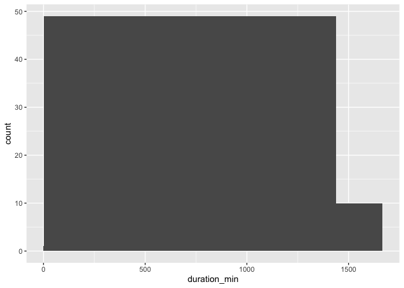
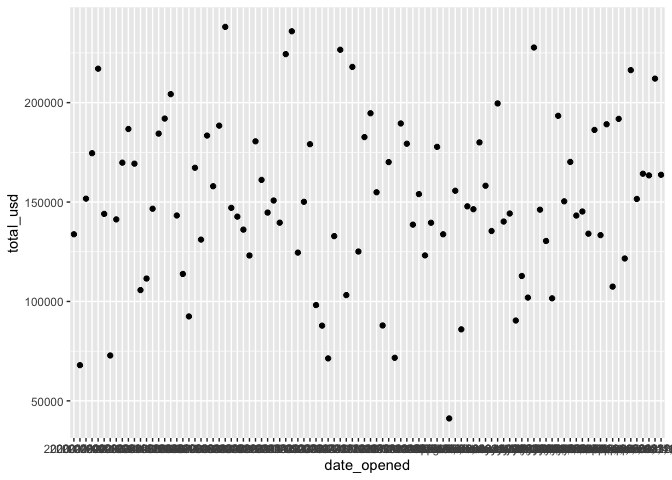
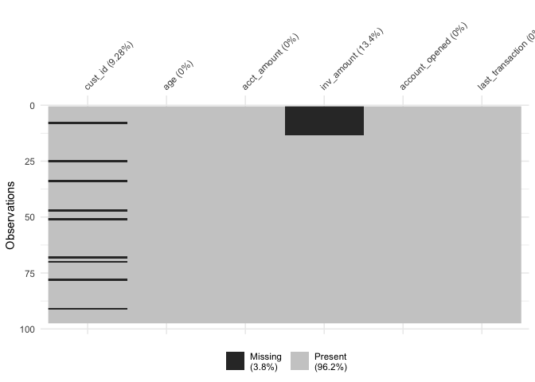

Cleaning data in R
================

<style>
.question {
   list-style: none;
   margin-left: 0;
   padding-left: 1em;
   text-indent: -1em;
}
</style>

# 1. Common Data Problems

In this part, you’ll learn how to overcome some of the most common dirty
data problems. You’ll convert data types, apply range constraints to
remove future data points, and remove duplicated data points to avoid
double-counting.

## Common data types

Since different data types are treated and act differently, it’s
important to be able to identify the data type that’s most suitable for
the data you’re working with. Here, you’ll learn match different data
with the data type that makes the data easiest to process and extract
insights from.

**Example**: Items and their corresponding data type.

| Numeric                            | Text                          | Date                    |
|------------------------------------|-------------------------------|-------------------------|
| Number of items bought in a basket | A customer’s shipping address | Date of birth           |
| Weight of a shipment               | First Name                    | Order date of a product |
| Monthly salary                     | City of residence             | Product launch date     |

## Converting data types

**Data**

-   `bike_share_rides`

Throughout this section, we’ll be working with San Francisco bike share
ride data called `bike_share_rides`. It contains information on start
and end stations of each trip, the trip duration, and some user
information.

**Libraries**

-   `dplyr`
-   `assertive`
-   `forcats`

**Steps**

Before beginning to analyze any dataset, it’s important to take a look
at the different types of columns we’ll be working with, which we can do
using `glimpse()`.

At first, we’ll take a look at the data types contained in
`bike_share_rides` and see how an incorrect data type can flaw your
analysis.

1.  Examine the data types of the columns of `bike_share_rides`.

``` r
# Libraries
library(dplyr)
library(assertive)

# 1. Load & glimpse at bike_share_rides
bike_share_rides <- readRDS("data/bike_share_rides.rds")
glimpse(bike_share_rides)
```

    ## Rows: 35,229
    ## Columns: 10
    ## $ ride_id         <int> 52797, 54540, 87695, 45619, 70832, 96135, 29928, 83331…
    ## $ date            <chr> "2017-04-15", "2017-04-19", "2017-04-14", "2017-04-03"…
    ## $ duration        <chr> "1316.15 minutes", "8.13 minutes", "24.85 minutes", "6…
    ## $ station_A_id    <dbl> 67, 21, 16, 58, 16, 6, 5, 16, 5, 81, 30, 16, 16, 67, 2…
    ## $ station_A_name  <chr> "San Francisco Caltrain Station 2  (Townsend St at 4th…
    ## $ station_B_id    <dbl> 89, 64, 355, 368, 81, 66, 350, 91, 62, 81, 109, 10, 80…
    ## $ station_B_name  <chr> "Division St at Potrero Ave", "5th St at Brannan St", …
    ## $ bike_id         <dbl> 1974, 860, 2263, 1417, 507, 75, 388, 239, 1449, 3289, …
    ## $ user_gender     <chr> "Male", "Male", "Male", "Male", "Male", "Male", "Male"…
    ## $ user_birth_year <dbl> 1972, 1986, 1993, 1981, 1981, 1988, 1993, 1996, 1993, …

2.  Get a summary of the `user_birth_year` column of `bike_share_rides`.

``` r
# 2. Summary of user_birth_year
summary(bike_share_rides$user_birth_year)
```

    ##    Min. 1st Qu.  Median    Mean 3rd Qu.    Max. 
    ##    1900    1979    1986    1984    1991    2001

<div
style="border:3px; border-style:solid; border-color:#2DC6D6; padding: 1em; margin: 1em;">

<u><strong>Question</strong></u><br> The summary statistics of
<code>user_birth_year</code> don’t seem to offer much useful information
about the different birth years in our dataset. Why do you think that
is?<br>
<ul class="question">
<li>
⬜ The <code>user_birth_year</code> column is not of the correct type
and should be converted to a character.
</li>
<li>
⬜ The <code>user_birth_year</code> column has an infinite set of
possible values and should be converted to a factor.
</li>
<li>
✅ The <code>user_birth_year</code> column represents groupings of data
and should be converted to a factor.
</li>
</ul>

</div>

3.  Add a new column to `bike_share_rides` called `user_birth_year_fct`,
    which contains `user_birth_year`, converted to a factor.
4.  Assert that the `user_birth_year_fct` is a factor to confirm the
    conversion.

``` r
# Libraries
library(forcats)

# 3. Convert user_birth_year to factor: user_birth_year_fct
bike_share_rides <- bike_share_rides %>%
  mutate(user_birth_year_fct = as_factor(user_birth_year))

# 4. Assert user_birth_year_fct is a factor
assert_is_factor(bike_share_rides$user_birth_year_fct)

# Summary of user_birth_year_fct
summary(bike_share_rides$user_birth_year_fct)
```

    ## 1900 1902 1923 1931 1938 1939 1941 1942 1943 1945 1946 1947 1948 1949 1950 1951 
    ##    1    7    2   23    2    1    3   10    4   16    5   24    9   30   37   25 
    ## 1952 1953 1954 1955 1956 1957 1958 1959 1960 1961 1962 1963 1964 1965 1966 1967 
    ##   70   49   65   66  112   62  156   99  196  161  256  237  245  349  225  363 
    ## 1968 1969 1970 1971 1972 1973 1974 1975 1976 1977 1978 1979 1980 1981 1982 1983 
    ##  365  331  370  548  529  527  563  601  481  541  775  876  825 1016 1056 1262 
    ## 1984 1985 1986 1987 1988 1989 1990 1991 1992 1993 1994 1995 1996 1997 1998 1999 
    ## 1157 1318 1606 1672 2135 1872 2062 1582 1703 1498 1476 1185  813  358  365  348 
    ## 2000 2001 
    ##  473   30

## Trimming strings

In the previous steps, you were able to identify the correct data type
and convert `user_birth_year` to the correct type, allowing you to
extract counts that gave you a bit more insight into the dataset.

Another common dirty data problem is having extra bits like percent
signs or periods in numbers, causing them to be read in as `character`s.
In order to be able to crunch these numbers, the extra bits need to be
removed and the numbers need to be converted from `character` to
`numeric`. In this section, you’ll need to convert the `duration` column
from `character` to `numeric`, but before this can happen, the word
`"minutes"` needs to be removed from each value.

**Libraries**

-   `dplyr`
-   `assertive`
-   `stringr`

**Steps:**

1.  Use `str_remove()` to remove `"minutes"` from the `duration` column
    of `bike_share_rides`. Add this as a new column called
    `duration_trimmed`.
2.  Convert the `duration_trimmed` column to a numeric type and add this
    as a new column called `duration_mins`.
3.  Glimpse at `bike_share_rides`

``` r
# Libraries
library(stringr)

# 1. & 2.
bike_share_rides <- bike_share_rides |> 
  # Remove 'minutes' from duration: duration_trimmed
  mutate(duration_trimmed = duration |> str_remove(" minutes"),
         # Convert duration_trimmed to numeric: duration_mins
         duration_mins = duration_trimmed |> as.numeric())

# 3. Glimpse at bike_share_rides
bike_share_rides %>% glimpse()
```

    ## Rows: 35,229
    ## Columns: 13
    ## $ ride_id             <int> 52797, 54540, 87695, 45619, 70832, 96135, 29928, 8…
    ## $ date                <chr> "2017-04-15", "2017-04-19", "2017-04-14", "2017-04…
    ## $ duration            <chr> "1316.15 minutes", "8.13 minutes", "24.85 minutes"…
    ## $ station_A_id        <dbl> 67, 21, 16, 58, 16, 6, 5, 16, 5, 81, 30, 16, 16, 6…
    ## $ station_A_name      <chr> "San Francisco Caltrain Station 2  (Townsend St at…
    ## $ station_B_id        <dbl> 89, 64, 355, 368, 81, 66, 350, 91, 62, 81, 109, 10…
    ## $ station_B_name      <chr> "Division St at Potrero Ave", "5th St at Brannan S…
    ## $ bike_id             <dbl> 1974, 860, 2263, 1417, 507, 75, 388, 239, 1449, 32…
    ## $ user_gender         <chr> "Male", "Male", "Male", "Male", "Male", "Male", "M…
    ## $ user_birth_year     <dbl> 1972, 1986, 1993, 1981, 1981, 1988, 1993, 1996, 19…
    ## $ user_birth_year_fct <fct> 1972, 1986, 1993, 1981, 1981, 1988, 1993, 1996, 19…
    ## $ duration_trimmed    <chr> "1316.15", "8.13", "24.85", "6.35", "9.8", "17.47"…
    ## $ duration_mins       <dbl> 1316.15, 8.13, 24.85, 6.35, 9.80, 17.47, 16.52, 14…

<div style="border:3px; border-style:solid; border-color:#2DC6D6; padding: 1em; margin: 1em;">
<u><strong>Alternatives</strong></u><br>
<ul>
<li>
Instead of removing characters, you can also just extract the digits
(including grouping and decimal marks) with a regex
<code>stringr::str_extract(“\[\\d\\.\]\*“)</code>
</li>
<li>
Regex Cheatsheets:
<ul>
<li>
<a href="https://devhints.io/regexp">devhints.io</a>
</li>
<li>
<a href="https://github.com/rstudio/cheatsheets/blob/main/strings.pdf"><code>stringr</code>
cheatsheet</a>
</li>
</ul>
<li>
The function <code>readr::parse_number()</code> does everything in one
step.
</li>
</ul>
</div>

4.  Assert that the `duration_mins` column is `numeric`.
5.  Calculate the mean of `duration_mins`.

``` r
# 4. Assert duration_mins is numeric
assert_is_numeric(bike_share_rides$duration_mins)

# 5. Calculate mean duration
mean(bike_share_rides$duration_mins)
```

    ## [1] 13.06214

## Constraints

### Ride duration constraints

Values that are out of range can throw off an analysis, so it’s
important to catch them early on. In this exercise, you’ll be examining
the `duration_min` column more closely. Bikes are not allowed to be kept
out for
<a href="https://help.baywheels.com/hc/en-us/articles/360033790932-How-long-can-I-keep-a-bike-out-" target="_blank" rel="noopener noreferrer">more
than 24 hours</a>, or 1440 minutes at a time, but issues with some of
the bikes caused inaccurate recording of the time they were returned.

In this sections, you’ll replace erroneous data with the range limit
(1440 minutes), however, you could just as easily replace these values
with `NA`s.

**Libraries**

-   `ggplot2`

**Steps**

1.  Create a three-bin histogram of the `duration_min` column of
    `bike_share_rides` using `ggplot2` to identify if there is
    out-of-range data.

``` r
# Library
library(ggplot2)

# Load data
bike_share_rides_sample <- readRDS("data/bike_share_rides_sample.rds")

# 1.1 Create breaks
breaks <- c(min(bike_share_rides_sample$duration_min), 0, 1440, max(bike_share_rides_sample$duration_min))

# 1.2 Create a histogram of duration_min
ggplot(bike_share_rides_sample, aes(duration_min)) +
  geom_histogram(breaks = breaks)
```

<!-- -->

2.  Replace the values of `duration_min` that are greater than `1440`
    minutes (24 hours) with `1440`. Add this to `bike_share_rides` as a
    **new** column called `duration_min_const`.
3.  Assert that all values of `duration_min_const` are between `0` and
    `1440`.

``` r
# 2. duration_min_const: replace vals of duration_min > 1440 with 1440
bike_share_rides_sample <- bike_share_rides_sample %>%
  mutate(duration_min_const = replace(duration_min, duration_min > 1440, 1440))

# 3. Make sure all values of duration_min_const are between 0 and 1440
assert_all_are_in_closed_range(bike_share_rides_sample$duration_min_const, lower = 0, upper = 1440)
```

### Back to the future: Date constraints

Something has gone wrong and it looks like you have data with dates from
the future, which is way outside of the date range you expected to be
working with. To fix this, you’ll need to remove any rides from the
dataset that have a `date` in the future. Before you can do this, the
`date` column needs to be converted from a `character` to a `Date`.
Having these as `Date` objects will make it much easier to figure out
which rides are from the future, since R makes it easy to check if one
`Date` object is before (`<`) or after (`>`) another.

**Libraries**

-   `lubridate`

**Steps**

1.  Convert the `date` column of `bike_share_rides` from `character` to
    the `Date` data type.
2.  Assert that all values in the `date` column happened sometime in the
    past and not in the future.

``` r
# Libraries
library(lubridate)

# 1. Convert date to Date type
bike_share_rides <- bike_share_rides %>%
  mutate(date = as_datetime(date))

# Modify data: Change year to 2043 of 10 random observations
bike_share_rides_mod <- bike_share_rides |> 
                            mutate(date = case_when(ride_id %in% c(99874,15624,89173,39239,23104,39307,13170,51086,87586,21989) ~ `year<-`(date, 2043),
                                                    T ~ date))

# 2. Make sure all dates are in the past
assert_all_are_in_past(bike_share_rides_mod$date)
```

    ## Error in eval(expr, envir, enclos): is_in_past : bike_share_rides_mod$date are not all in the past.
    ## There were 10 failures:
    ##    Position      Value     Cause
    ## 1      1677 2043-04-14 in future
    ## 2      4224 2043-04-14 in future
    ## 3      4929 2043-04-04 in future
    ## 4      6345 2043-04-16 in future
    ## 5      6864 2043-04-16 in future
    ## 6     11582 2043-04-23 in future
    ## 7     17219 2043-04-22 in future
    ## 8     18096 2043-04-22 in future
    ## 9     18394 2043-04-21 in future
    ## 10    22459 2043-04-07 in future

3.  Filter `bike_share_rides` to get only the rides from the past or
    today, and save this as `bike_share_rides_past`.
4.  Assert that the `dates` in `bike_share_rides_past` occurred only in
    the past.

``` r
# 3. Filter for rides that occurred before or on today's date
bike_share_rides_past <- bike_share_rides_mod %>%
  filter(date <= today())

# 4. Make sure all dates from bike_share_rides_past are in the past
assert_all_are_in_past(bike_share_rides_past$date)
```

## Duplicates

### Full duplicates

You’ve been notified that an update has been made to the bike sharing
data pipeline to make it more efficient, but that duplicates are more
likely to be generated as a result. To make sure that you can continue
using the same scripts to run your weekly analyses about ride
statistics, you’ll need to ensure that any duplicates in the dataset are
removed first.

When multiple rows of a data frame share the same values for all
columns, they’re *full duplicates* of each other. Removing duplicates
like this is important, since having the same value repeated multiple
times can alter summary statistics like the mean and median. Each ride,
including its `ride_id` should be unique.

**Steps**

1.  Get the total number of full duplicates in `bike_share_rides`.

``` r
# Modify data
bike_share_rides_mod <- bike_share_rides |> 
  
                            # Add duplicates
                            add_row(bike_share_rides |> slice(17278)) |> 
                            add_row(bike_share_rides |> slice(27208))

# 1. Count the number of full duplicates
sum(duplicated(bike_share_rides_mod))
```

    ## [1] 2

2.  Remove all full duplicates from `bike_share_rides` and save the new
    data frame as `bike_share_rides_unique.`
3.  Get the total number of full duplicates in the new
    `bike_share_rides_unique` data frame.

``` r
# 2. Remove duplicates
bike_share_rides_unique <- distinct(bike_share_rides_mod)

# 3. Count the full duplicates in bike_share_rides_unique
sum(duplicated(bike_share_rides_unique))
```

    ## [1] 0

### Partial duplicates

#### Removing partial duplicates

Now that you’ve identified and removed the full duplicates, it’s time to
check for partial duplicates. Partial duplicates are a bit tricker to
deal with than full duplicates. In this section, you’ll first identify
any partial duplicates and then practice the most common technique to
deal with them, which involves dropping all partial duplicates, keeping
only the first.

**Steps**

1.  Count the number of occurrences of each `ride_id`.
2.  Filter for `ride_id`s that occur multiple times.

``` r
# Modify data
bike_share_rides_mod <- bike_share_rides |> 
  
                            # Add duplicates
                            add_row(bike_share_rides |> 
                                        slice(33237) |> 
                                        mutate(duration_mins = 5.8)) |> 
                            add_row(bike_share_rides |> 
                                        slice(17657) |> 
                                        mutate(duration_mins = 13.6))

# Find duplicated ride_ids
bike_share_rides_mod %>% 
  # 1. Count the number of occurrences of each ride_id
  count(ride_id) %>% 
  # 2. Filter for rows with a count > 1
  filter(n > 1)
```

    ## # A tibble: 2 × 2
    ##   ride_id     n
    ##     <int> <int>
    ## 1   41441     2
    ## 2   87056     2

3.  Remove full and partial duplicates from `bike_share_rides` based on
    `ride_id` only, keeping all columns.
4.  Store this as `bike_share_rides_unique`.
5.  Find the duplicated `ride_id`s in `bike_share_rides_unique`.

``` r
# 3. / 4. Remove full and partial duplicates
bike_share_rides_unique <- bike_share_rides_mod %>%
  # Only based on ride_id instead of all cols
  distinct(ride_id, .keep_all = T)

# 5. Find duplicated ride_ids in bike_share_rides_unique
bike_share_rides_unique %>%
  # Count the number of occurrences of each ride_id
  count(ride_id) %>%
  # Filter for rows with a count > 1
  filter(n > 1)
```

    ## # A tibble: 0 × 2
    ## # … with 2 variables: ride_id <int>, n <int>

#### Aggregating partial duplicates

Another way of handling partial duplicates is to compute a summary
statistic of the values that differ between partial duplicates, such as
mean, median, maximum, or minimum. This can come in handy when you’re
not sure how your data was collected and want an average, or if based on
domain knowledge, you’d rather have too high of an estimate than too low
of an estimate (or vice versa).

**Steps**

1.  Group `bike_share_rides` by `ride_id` and `date`.
2.  Add a column called `duration_min_avg` that contains the mean ride
    duration for the row’s `ride_id` and `date`.
3.  Remove duplicates based on `ride_id` and `date`, keeping all columns
    of the data frame.
4.  Remove the `duration_min` column.

``` r
bike_share_rides_mod %>%
  # 1. Group by ride_id and date
  group_by(ride_id, date) %>%
  # 2. Add duration_min_avg column
  mutate(duration_min_avg = mean(duration_mins) ) %>%
  # 3. Remove duplicates based on ride_id and date, keep all cols
  distinct(ride_id, date, .keep_all = TRUE) %>%
  # 4. Remove duration_min column
  select(-duration_mins)
```

    ## # A tibble: 35,229 × 13
    ## # Groups:   ride_id, date [35,229]
    ##    ride_id date                duration station_A_id station_A_name station_B_id
    ##      <int> <dttm>              <chr>           <dbl> <chr>                 <dbl>
    ##  1   52797 2017-04-15 00:00:00 1316.15…           67 San Francisco…           89
    ##  2   54540 2017-04-19 00:00:00 8.13 mi…           21 Montgomery St…           64
    ##  3   87695 2017-04-14 00:00:00 24.85 m…           16 Steuart St at…          355
    ##  4   45619 2017-04-03 00:00:00 6.35 mi…           58 Market St at …          368
    ##  5   70832 2017-04-10 00:00:00 9.8 min…           16 Steuart St at…           81
    ##  6   96135 2017-04-18 00:00:00 17.47 m…            6 The Embarcade…           66
    ##  7   29928 2017-04-22 00:00:00 16.52 m…            5 Powell St BAR…          350
    ##  8   83331 2017-04-11 00:00:00 14.72 m…           16 Steuart St at…           91
    ##  9   72424 2017-04-05 00:00:00 4.12 mi…            5 Powell St BAR…           62
    ## 10   25910 2017-04-20 00:00:00 25.77 m…           81 Berry St at 4…           81
    ## # … with 35,219 more rows, and 7 more variables: station_B_name <chr>,
    ## #   bike_id <dbl>, user_gender <chr>, user_birth_year <dbl>,
    ## #   user_birth_year_fct <fct>, duration_trimmed <chr>, duration_min_avg <dbl>

# 2. Categorical and Text Data

Categorical and text data can often be some of the messiest parts of a
dataset due to their unstructured nature. In this chapter, you’ll learn
how to fix whitespace and capitalization inconsistencies in category
labels, collapse multiple categories into one, and reformat strings for
consistency.

## Membership constraints

So far, you’ve learned about a number of different problems you can run
into when you have dirty data, including

-   data type constraints,
-   range constraints,
-   uniqueness constraints,
-   and membership constraints.

It’s important to be able to correctly identify the type of problem
you’re dealing with so that you can treat it correctly. In this
exercise, you’ll practice identifying these problems by mapping dirty
data scenarios to their constraint type.

**Example:** Classification based on whether it’s a membership
constraint issue or a different type of issue:

| Membership constraint                                                          | Other constraint                                |
|--------------------------------------------------------------------------------|-------------------------------------------------|
| A `has_loan` column with the value `25`.                                       | A `revenue` column represented as a string.     |
| A `month` column with the value `14`.                                          | A `birthdate` column with values in the future. |
| A `GPA` column containing a `Z-` grade (Grades are traditionally A through F). | An `age` column with values above `130`.        |
| A `day_of_week` column with the value `12`                                     |                                                 |

**Data**

-   `sfo_survey` / `sfo_survey_mod`

Now that we can identify membership constraint problems, it’s time to
fix these problems in a new dataset. Throughout this section, you’ll be
working with a dataset called `sfo_survey`, containing survey responses
from passengers taking flights from San Francisco International Airport
(SFO). Participants were asked questions about the airport’s
cleanliness, wait times, safety, and their overall satisfaction.

There were a few issues during data collection that resulted in some
inconsistencies in the dataset (`sfo_survey_mod`). In the following
steps, you’ll be working with the `dest_size` column, which categorizes
the size of the destination airport that the passengers were flying to.
A data frame called `dest_sizes` will be created that contains all the
possible destination sizes. Your mission is to find rows with invalid
`dest_size`s and remove them from the data frame.

**Steps**

1.  Count the number of occurrences of each `dest_size` in
    `sfo_survey_mod`.

``` r
sfo_survey_mod <- readRDS("data/sfo_survey_mod.rds")

# 1. Count the number of occurrences of dest_size
sfo_survey_mod %>%
  count(dest_size)
```

    ## # A tibble: 8 × 2
    ##   dest_size       n
    ##   <chr>       <int>
    ## 1 "  Small  "     1
    ## 2 " Hub"          1
    ## 3 "Hub"        1756
    ## 4 "huge"          1
    ## 5 "Large"       143
    ## 6 "Large  "       1
    ## 7 "Medium"      681
    ## 8 "Small"       225

<div
style="border:3px; border-style:solid; border-color:#2DC6D6; padding: 1em; margin: 1em;">

<u><strong>Question</strong></u><br> Take a closer look at your output.
Which dest_size values appear to violate membership constraints?<br>
<ul class="question">
<li>
⬜ <code>“huge”</code>, <code>“Small”</code>, <code>“Large ”</code>, and
<code>“Hub”</code>.
</li>
<li>
✅ <code>“huge”</code>, <code>“ Small ”</code>, <code>“Large ”</code>,
and <code>“ Hub”</code>.
</li>
<li>
⬜ <code>“Small”</code>, <code>“Medium”</code>, <code>“Large”</code>,
and <code>“Hub”</code>.
</li>
</ul>

</div>

2.  Use the correct type of filtering join on the `sfo_survey` data
    frame and the `dest_sizes` data frame to get the rows of
    `sfo_survey` with invalid `dest_size` values.
3.  Get the `id`, `airline`, `destination`, and `dest_size` columns.

``` r
dest_sizes <- tibble(
  dest_size          = c("Small", "Medium", "Large", "Hub"),
  passengers_per_day = c("0-20K", "20K-70K", "70K-100K", "100K+")
)

# Find bad dest_size rows
sfo_survey_mod %>% 
  # 2. Join with dest_sizes data frame to get bad dest_size rows
  anti_join(dest_sizes) %>%
  # 3. Select id, airline, destination, and dest_size cols
  select(id, airline, destination, dest_size)
```

    ## Joining, by = "dest_size"

    ## # A tibble: 4 × 4
    ##      id airline     destination       dest_size  
    ##   <int> <chr>       <chr>             <chr>      
    ## 1   278 UNITED      BALTIMORE         "huge"     
    ## 2   982 LUFTHANSA   MUNICH            " Hub"     
    ## 3  2063 AMERICAN    PHILADELPHIA      "Large  "  
    ## 4   777 UNITED INTL SAN JOSE DEL CABO "  Small  "

4.  Use the correct filtering join on `sfo_survey` and `dest_sizes` to
    get the rows of `sfo_survey` that have a valid `dest_size`.
5.  Count the number of times that each `dest_size` occurs to make sure
    there are no invalid values left behind.

``` r
# Remove bad dest_size rows
sfo_survey_mod %>% 
  # 4. Join with dest_sizes
  semi_join(dest_sizes) %>%
  # 5. Count the number of each dest_size
  count(dest_size)
```

    ## Joining, by = "dest_size"

    ## # A tibble: 4 × 2
    ##   dest_size     n
    ##   <chr>     <int>
    ## 1 Hub        1756
    ## 2 Large       143
    ## 3 Medium      681
    ## 4 Small       225

## Identifying inconsistency

Different kinds of inconsistencies:

In the video exercise, you learned about different kinds of
inconsistencies that can occur within categories, making it look like a
variable has more categories than it should.

In this exercise, you’ll continue working with the `sfo_survey` dataset.
You’ll examine the `dest_size` column again as well as the `cleanliness`
column and determine what kind of issues, if any, these two categorical
variables face.

`dplyr` and is loaded and `sfo_survey` is available.

**Instructions:**

-   Count the number of occurrences of each category of the `dest_size`
    variable of `sfo_survey`.

**Question**

Select the statement that most accurately describes the categories in
the dest_size variable of sfo_survey.

**Possible Answers**

:white_large_square: The categories in `dest_size` have no
inconsistencies.<br> :white_large_square: The categories in `dest_size`
have inconsistent capitalization.<br> :white_check_mark: The categories
in `dest_size` have inconsistent white space.<br> :white_large_square:
The categories in `dest_size` have inconsistent capitalization and white
space.<br>

**Instructions:**

-   Count the number of occurrences of each category of the
    `cleanliness` variable of `sfo_survey`.

**Question**

Select the statement that most accurately describes the categories in
the cleanliness variable of sfo_survey.

Possible Answers

:white_large_square: The categories in `cleanliness` have no
inconsistencies.<br> :white_check_mark: The categories in `cleanliness`
have inconsistent capitalization.<br> :white_large_square: The
categories in `cleanliness` have inconsistent white space.<br>
:white_large_square: The categories in `cleanliness` have inconsistent
capitalization and white space.<br>

**Solution:**

``` r
# Count dest_size
sfo_survey_mod %>%
  count(dest_size)
```

    ## # A tibble: 8 × 2
    ##   dest_size       n
    ##   <chr>       <int>
    ## 1 "  Small  "     1
    ## 2 " Hub"          1
    ## 3 "Hub"        1756
    ## 4 "huge"          1
    ## 5 "Large"       143
    ## 6 "Large  "       1
    ## 7 "Medium"      681
    ## 8 "Small"       225

``` r
# Count cleanliness
sfo_survey_mod %>%
  count(cleanliness)
```

    ## # A tibble: 9 × 2
    ##   cleanliness        n
    ##   <chr>          <int>
    ## 1 average            1
    ## 2 Average          431
    ## 3 AVERAGE            1
    ## 4 Clean            970
    ## 5 Dirty              2
    ## 6 somewhat clean     1
    ## 7 Somewhat clean  1253
    ## 8 Somewhat dirty    30
    ## 9 <NA>             120

## Correcting inconsistency

Now that you’ve identified that `dest_size` has whitespace
inconsistencies and `cleanliness` has capitalization inconsistencies,
you’ll use the new tools at your disposal to fix the inconsistent values
in `sfo_survey` instead of removing the data points entirely, which
could add bias to your dataset if more than 5% of the data points need
to be dropped.

`dplyr` and `stringr` are loaded and `sfo_survey` is available.

**Instructions:**

-   Add a column to `sfo_survey` called `dest_size_trimmed` that
    contains the values in the `dest_size` column with all leading and
    trailing whitespace removed.
-   Add another column called `cleanliness_lower` that contains the
    values in the `cleanliness` column converted to all lowercase.
-   Count the number of occurrences of each category in
    `dest_size_trimmed`.
-   Count the number of occurrences of each category in
    `cleanliness_lower`.

**Solution:**

``` r
# Add new columns to sfo_survey
sfo_survey_mod <- sfo_survey_mod %>%
  # dest_size_trimmed: dest_size without whitespace
  mutate(dest_size_trimmed = str_trim(dest_size),
         # cleanliness_lower: cleanliness converted to lowercase
         cleanliness_lower = str_to_lower(cleanliness))

# Count values of dest_size_trimmed
sfo_survey_mod %>%
  count(dest_size_trimmed)
```

    ## # A tibble: 5 × 2
    ##   dest_size_trimmed     n
    ##   <chr>             <int>
    ## 1 Hub                1757
    ## 2 huge                  1
    ## 3 Large               144
    ## 4 Medium              681
    ## 5 Small               226

``` r
# Count values of cleanliness_lower
sfo_survey_mod %>%
  count(cleanliness_lower)
```

    ## # A tibble: 6 × 2
    ##   cleanliness_lower     n
    ##   <chr>             <int>
    ## 1 average             433
    ## 2 clean               970
    ## 3 dirty                 2
    ## 4 somewhat clean     1254
    ## 5 somewhat dirty       30
    ## 6 <NA>                120

## Collapsing categories

One of the tablets that participants filled out the `sfo_survey` on was
not properly configured, allowing the response for `dest_region` to be
free text instead of a dropdown menu. This resulted in some
inconsistencies in the `dest_region` variable that you’ll need to
correct in this exercise to ensure that the numbers you report to your
boss are as accurate as possible.

`dplyr` and `forcats` are loaded and `sfo_survey` is available.

**Instructions:**

-   Count the categories of `dest_region`.

**Solution:**

``` r
# Count categories of dest_region
sfo_survey_mod %>%
  count(dest_region)
```

    ## # A tibble: 12 × 2
    ##    dest_region               n
    ##    <chr>                 <int>
    ##  1 Asia                    260
    ##  2 Australia/New Zealand    66
    ##  3 Canada/Mexico           220
    ##  4 Central/South America    29
    ##  5 East US                 498
    ##  6 EU                        2
    ##  7 eur                       2
    ##  8 Europ                     1
    ##  9 Europe                  396
    ## 10 Middle East              79
    ## 11 Midwest US              281
    ## 12 West US                 975

**Question**

From your output from step 1, which categories need to be collapsed?

**Possible Answers**

:white_large_square: `"EU"` and `"Europ"` need to be collapsed to
`"Europe"`. :white_check_mark: `"EU"`, `"eur"`, and `"Europ"` need to be
collapsed to `"Europe"`. :white_large_square: `"East US"`,
`"Midwest US"`, and `"West US"` need to be collapsed to `"US"`.
:white_large_square: `"Asia"` and `"Central/South America"` should be
collapsed to `"Asia and Central/South America"`.

**Instructions:**

-   Create a vector called `europe_categories` containing the three
    values of `dest_region` that need to be collapsed.
-   Add a new column to `sfo_survey` called `dest_region_collapsed` that
    contains the values from the `dest_region` column, except the
    categories stored in `europe_categories` should be collapsed to
    `Europe`.
-   Count the categories of `dest_region_collapsed`.

**Solution:**

``` r
# Categories to map to Europe
europe_categories <- c("EU", "Europ", "eur")

# Add a new col dest_region_collapsed
sfo_survey_mod %>%
  # Map all categories in europe_categories to Europe
  mutate(dest_region_collapsed = fct_collapse(dest_region, 
                                     Europe = europe_categories)) %>%
  # Count categories of dest_region_collapsed
  count(dest_region_collapsed)
```

    ## # A tibble: 9 × 2
    ##   dest_region_collapsed     n
    ##   <fct>                 <int>
    ## 1 Asia                    260
    ## 2 Australia/New Zealand    66
    ## 3 Canada/Mexico           220
    ## 4 Central/South America    29
    ## 5 East US                 498
    ## 6 Europe                  401
    ## 7 Middle East              79
    ## 8 Midwest US              281
    ## 9 West US                 975

## Detecting inconsistent text data

You’ve recently received some news that the customer support team wants
to ask the SFO survey participants some follow-up questions. However,
the auto-dialer that the call center uses isn’t able to parse all of the
phone numbers since they’re all in different formats. After some
investigation, you found that some phone numbers are written with
hyphens (`-`) and some are written with parentheses (`(`,`)`). In this
exercise, you’ll figure out which phone numbers have these issues so
that you know which ones need fixing.

`dplyr` and `stringr` are loaded, and `sfo_survey` is available.

**Instructions:**

-   Filter for rows with phone numbers that contain `"-"`s.
-   Filter for rows with phone numbers that contain `"("`, or `")"`.
    Remember to use `fixed()` when searching for parentheses.

**Solution:**

``` r
# Filter for rows with "-" in the phone column
sfo_survey_mod %>%
  filter(phone %>% str_detect("-"))
```

    ## # A tibble: 1,421 × 15
    ##       id day   airline destination dest_region dest_size boarding_area dept_time
    ##    <int> <chr> <chr>   <chr>       <chr>       <chr>     <chr>         <chr>    
    ##  1  1844 Mond… TURKIS… ISTANBUL    Middle East Hub       Gates 91-102  2018-12-…
    ##  2  1840 Mond… TURKIS… ISTANBUL    Middle East Hub       Gates 91-102  2018-12-…
    ##  3  3010 Wedn… AMERIC… MIAMI       East US     Hub       Gates 50-59   2018-12-…
    ##  4  2097 Mond… UNITED… MEXICO CITY Canada/Mex… Hub       Gates 91-102  2018-12-…
    ##  5  1835 Mond… TURKIS… ISTANBUL    Middle East Hub       Gates 91-102  2018-12-…
    ##  6  1849 Mond… TURKIS… ISTANBUL    Middle East Hub       Gates 91-102  2018-12-…
    ##  7  2289 Wedn… QANTAS  SYDNEY      Australia/… Hub       Gates 1-12    2018-12-…
    ##  8   105 Tues… UNITED  WASHINGTON… East US     Medium    Gates 70-90   2018-12-…
    ##  9  1973 Frid… CATHAY… HONG KONG   Asia        Hub       Gates 1-12    2018-12-…
    ## 10  2385 Wedn… UNITED… SYDNEY      Australia/… Hub       Gates 91-102  2018-12-…
    ## # … with 1,411 more rows, and 7 more variables: wait_min <dbl>,
    ## #   cleanliness <chr>, safety <chr>, satisfaction <chr>, phone <chr>,
    ## #   dest_size_trimmed <chr>, cleanliness_lower <chr>

``` r
# Filter for rows with "(" or ")" in the phone column
sfo_survey_mod %>%
  filter(str_detect(phone, fixed("(")) | str_detect(phone, fixed(")")))
```

    ## # A tibble: 739 × 15
    ##       id day   airline destination dest_region dest_size boarding_area dept_time
    ##    <int> <chr> <chr>   <chr>       <chr>       <chr>     <chr>         <chr>    
    ##  1  3010 Wedn… AMERIC… MIAMI       East US     Hub       Gates 50-59   2018-12-…
    ##  2  2097 Mond… UNITED… MEXICO CITY Canada/Mex… Hub       Gates 91-102  2018-12-…
    ##  3  1835 Mond… TURKIS… ISTANBUL    Middle East Hub       Gates 91-102  2018-12-…
    ##  4   105 Tues… UNITED  WASHINGTON… East US     Medium    Gates 70-90   2018-12-…
    ##  5  1973 Frid… CATHAY… HONG KONG   Asia        Hub       Gates 1-12    2018-12-…
    ##  6  2385 Wedn… UNITED… SYDNEY      Australia/… Hub       Gates 91-102  2018-12-…
    ##  7   517 Sund… UNITED  FT. LAUDER… East US     Large     Gates 60-69   2018-12-…
    ##  8  2885 Frid… EVA AIR TAIPEI      Asia        Hub       Gates 91-102  2018-12-…
    ##  9  2128 Wedn… FRONTI… DENVER      West US     Hub       Gates 20-39   2018-12-…
    ## 10  2132 Wedn… FRONTI… DENVER      West US     Hub       Gates 20-39   2018-12-…
    ## # … with 729 more rows, and 7 more variables: wait_min <dbl>,
    ## #   cleanliness <chr>, safety <chr>, satisfaction <chr>, phone <chr>,
    ## #   dest_size_trimmed <chr>, cleanliness_lower <chr>

## Replacing and removing

In the last exercise, you saw that the `phone` column of `sfo_data` is
plagued with unnecessary parentheses and hyphens. The customer support
team has requested that all phone numbers be in the format
`"123 456 7890"`. In this exercise, you’ll use your new `stringr` skills
to fulfill this request.

`dplyr` and `stringr` are loaded and `sfo_survey` is available.

**Instructions:**

-   Remove opening and closing parentheses from the `phone` column.
    Store this as a variable called `phone_no_parens`. Remember to use
    `fixed()`!
-   Add a new column to `sfo_survey` called `phone_no_parens` that
    contains the contents of `phone_no_parens`.
-   Create a new column of `sfo_survey` called `phone_clean` containing
    the values of `phone_no_parens` with all hyphens replaced with
    spaces.

**Solution:**

``` r
# Remove parentheses from phone column
phone_no_parens <- sfo_survey_mod$phone %>%
  # Remove "("s
  str_remove_all(fixed("(")) %>%
  # Remove ")"s
  str_remove_all(fixed(")"))

# Add phone_no_parens as column
sfo_survey_mod %>%
  mutate(phone_no_parens = phone_no_parens,
  # Replace all hyphens in phone_no_parens with spaces
         phone_clean = str_replace_all(phone_no_parens, "-", " "))
```

    ## # A tibble: 2,809 × 17
    ##       id day   airline destination dest_region dest_size boarding_area dept_time
    ##    <int> <chr> <chr>   <chr>       <chr>       <chr>     <chr>         <chr>    
    ##  1  1842 Mond… TURKIS… ISTANBUL    Middle East Hub       Gates 91-102  2018-12-…
    ##  2  1844 Mond… TURKIS… ISTANBUL    Middle East Hub       Gates 91-102  2018-12-…
    ##  3  1840 Mond… TURKIS… ISTANBUL    Middle East Hub       Gates 91-102  2018-12-…
    ##  4  1837 Mond… TURKIS… ISTANBUL    Middle East Hub       Gates 91-102  2018-12-…
    ##  5  1833 Mond… TURKIS… ISTANBUL    Middle East Hub       Gates 91-102  2018-12-…
    ##  6  3010 Wedn… AMERIC… MIAMI       East US     Hub       Gates 50-59   2018-12-…
    ##  7  1838 Mond… TURKIS… ISTANBUL    Middle East Hub       Gates 91-102  2018-12-…
    ##  8  1845 Mond… TURKIS… ISTANBUL    Middle East Hub       Gates 91-102  2018-12-…
    ##  9  2097 Mond… UNITED… MEXICO CITY Canada/Mex… Hub       Gates 91-102  2018-12-…
    ## 10  1846 Mond… TURKIS… ISTANBUL    Middle East Hub       Gates 91-102  2018-12-…
    ## # … with 2,799 more rows, and 9 more variables: wait_min <dbl>,
    ## #   cleanliness <chr>, safety <chr>, satisfaction <chr>, phone <chr>,
    ## #   dest_size_trimmed <chr>, cleanliness_lower <chr>, phone_no_parens <chr>,
    ## #   phone_clean <chr>

## Invalid phone numbers

The customer support team is grateful for your work so far, but during
their first day of calling participants, they ran into some phone
numbers that were invalid. In this exercise, you’ll remove any rows with
invalid phone numbers so that these faulty numbers don’t keep slowing
the team down.

`dplyr` and `stringr` are loaded and `sfo_survey` is available.

**Instructions:**

-   Examine the invalid `phone` numbers by filtering for numbers whose
    length is not equal to 12.
-   Remove the rows with invalid numbers by filtering for numbers with a
    length of exactly 12.

**Solution:**

``` r
# Check out the invalid numbers
sfo_survey_mod %>%
  filter(str_length(phone_no_parens) != 12)
```

    ## # A tibble: 5 × 15
    ##      id day    airline destination dest_region dest_size boarding_area dept_time
    ##   <int> <chr>  <chr>   <chr>       <chr>       <chr>     <chr>         <chr>    
    ## 1  2262 Satur… UNITED  BAKERSFIELD West US     Small     Gates 70-90   2018-12-…
    ## 2  3081 Sunday COPA    PANAMA CITY Central/So… Medium    Gates 1-12    2018-12-…
    ## 3   340 Wedne… SOUTHW… PHOENIX     West US     Hub       Gates 20-39   2018-12-…
    ## 4  1128 Thurs… DELTA   MINNEAPOLI… Midwest US  Hub       Gates 40-48   2018-12-…
    ## 5   373 Friday ALASKA  SAN JOSE D… Canada/Mex… Small     Gates 50-59   2018-12-…
    ## # … with 7 more variables: wait_min <dbl>, cleanliness <chr>, safety <chr>,
    ## #   satisfaction <chr>, phone <chr>, dest_size_trimmed <chr>,
    ## #   cleanliness_lower <chr>

``` r
# Remove rows with invalid numbers
sfo_survey_mod %>%
  filter(str_length(phone_no_parens) == 12)
```

    ## # A tibble: 2,804 × 15
    ##       id day   airline destination dest_region dest_size boarding_area dept_time
    ##    <int> <chr> <chr>   <chr>       <chr>       <chr>     <chr>         <chr>    
    ##  1  1842 Mond… TURKIS… ISTANBUL    Middle East Hub       Gates 91-102  2018-12-…
    ##  2  1844 Mond… TURKIS… ISTANBUL    Middle East Hub       Gates 91-102  2018-12-…
    ##  3  1840 Mond… TURKIS… ISTANBUL    Middle East Hub       Gates 91-102  2018-12-…
    ##  4  1837 Mond… TURKIS… ISTANBUL    Middle East Hub       Gates 91-102  2018-12-…
    ##  5  1833 Mond… TURKIS… ISTANBUL    Middle East Hub       Gates 91-102  2018-12-…
    ##  6  3010 Wedn… AMERIC… MIAMI       East US     Hub       Gates 50-59   2018-12-…
    ##  7  1838 Mond… TURKIS… ISTANBUL    Middle East Hub       Gates 91-102  2018-12-…
    ##  8  1845 Mond… TURKIS… ISTANBUL    Middle East Hub       Gates 91-102  2018-12-…
    ##  9  2097 Mond… UNITED… MEXICO CITY Canada/Mex… Hub       Gates 91-102  2018-12-…
    ## 10  1846 Mond… TURKIS… ISTANBUL    Middle East Hub       Gates 91-102  2018-12-…
    ## # … with 2,794 more rows, and 7 more variables: wait_min <dbl>,
    ## #   cleanliness <chr>, safety <chr>, satisfaction <chr>, phone <chr>,
    ## #   dest_size_trimmed <chr>, cleanliness_lower <chr>

# 3. Advanced Data Problems

In this chapter, you’ll dive into more advanced data cleaning problems,
such as ensuring that weights are all written in kilograms instead of
pounds. You’ll also gain invaluable skills that will help you verify
that values have been added correctly and that missing values don’t
negatively impact your analyses.

## Date uniformity

In this chapter, you work at an asset management company and you’ll be
working with the `accounts` dataset, which contains information about
each customer, the amount in their account, and the date their account
was opened. Your boss has asked you to calculate some summary statistics
about the average value of each account and whether the age of the
account is associated with a higher or lower account value. Before you
can do this, you need to make sure that the `accounts` dataset you’ve
been given doesn’t contain any uniformity problems. In this exercise,
you’ll investigate the `date_opened` column and clean it up so that all
the dates are in the same format.

`dplyr` and `lubridate` are loaded and `accounts` is available.

**Instructions:**

-   Take a look at the head of `accounts` to get a sense of the data
    you’re working with.

**Solution:**

``` r
accounts <- readRDS("data/accounts.rds")

# Check out the accounts data frame
head(accounts)
```

    ##         id      date_opened    total
    ## 1 A880C79F       2003-10-19   169305
    ## 2 BE8222DF October 05, 2018   107460
    ## 3 19F9E113       2008-07-29 15297152
    ## 4 A2FE52A3       2005-06-09 14897272
    ## 5 F6DC2C08       2012-03-31   124568
    ## 6 D2E55799       2007-06-20 13635752

**Question**

Try running `as.Date(accounts$date_opened)` in the console and examine
the output. Notice that you end up with a lot of `NAs`. Why is this?

**Possible Answers**

:white_large_sqaure: `as.Date()` needs to be explicitly told the formats
of every single date, including which dates are in which format.<br>
:white_check_mark: By default, `as.Date()` can’t convert “Month DD,
YYYY” formats.<br> :white_large_sqaure:`as.Date()` can’t convert
`character`s to `Date`s.<br>

**Instructions:**

-   Convert the dates in the `date_opened` column to the same format
    using the `formats` vector and store this as a new column called
    `date_opened_clean`.

**Solution:**

``` r
# Define the date formats
formats <- c("%Y-%m-%d", "%B %d, %Y")

# Convert dates to the same format
accounts %>%
  mutate(date_opened_clean = parse_date_time(date_opened,  formats))
```

    ##          id        date_opened    total date_opened_clean
    ## 1  A880C79F         2003-10-19   169305        2003-10-19
    ## 2  BE8222DF   October 05, 2018   107460        2018-10-05
    ## 3  19F9E113         2008-07-29 15297152        2008-07-29
    ## 4  A2FE52A3         2005-06-09 14897272        2005-06-09
    ## 5  F6DC2C08         2012-03-31   124568        2012-03-31
    ## 6  D2E55799         2007-06-20 13635752        2007-06-20
    ## 7  53AE87EF  December 01, 2017 15375984        2017-12-01
    ## 8  3E97F253         2019-06-03 14515800        2019-06-03
    ## 9  4AE79EA1         2011-05-07 23338536        2011-05-07
    ## 10 2322DFB4         2018-04-07   189524        2018-04-07
    ## 11 645335B2         2018-11-16   154001        2018-11-16
    ## 12 D5EB0F00         2001-04-16   174576        2001-04-16
    ## 13 1EB593F7         2005-04-21   191989        2005-04-21
    ## 14 DDBA03D9         2006-06-13  9617192        2006-06-13
    ## 15 40E4A2F4         2009-01-07   180547        2009-01-07
    ## 16 39132EEA         2012-07-07 15611960        2012-07-07
    ## 17 387F8E4D   January 03, 2011  9402640        2011-01-03
    ## 18 11C3C3C0  December 24, 2017   180003        2017-12-24
    ## 19 C2FC91E1         2004-05-21   105722        2004-05-21
    ## 20 FB8F01C1         2001-09-06 22575072        2001-09-06
    ## 21 0128D2D0         2005-04-09 19179784        2005-04-09
    ## 22 BE6E4B3F         2009-10-20 15679976        2009-10-20
    ## 23 7C6E2ECC         2003-05-16   169814        2003-05-16
    ## 24 02E63545         2015-10-25   125117        2015-10-25
    ## 25 4399C98B       May 19, 2001   130421        2001-05-19
    ## 26 98F4CF0F       May 27, 2014 14893944        2014-05-27
    ## 27 247222A6       May 26, 2015   150372        2015-05-26
    ## 28 420985EE         2008-12-27   123125        2008-12-27
    ## 29 0E3903BA         2015-11-11   182668        2015-11-11
    ## 30 64EF994F         2009-02-26   161141        2009-02-26
    ## 31 CCF84EDB         2008-12-26   136128        2008-12-26
    ## 32 51C21705     April 22, 2016 16191136        2016-04-22
    ## 33 C868C6AD   January 31, 2000 11733072        2000-01-31
    ## 34 92C237C6         2005-12-13 11838528        2005-12-13
    ## 35 9ECEADB2       May 17, 2018   146153        2018-05-17
    ## 36 DF0AFE50         2004-12-03 15250040        2004-12-03
    ## 37 5CD605B3         2016-10-19    87921        2016-10-19
    ## 38 402839E2 September 14, 2019   163416        2019-09-14
    ## 39 78286CE7         2009-10-05 15049216        2009-10-05
    ## 40 168E071B         2013-07-11    87826        2013-07-11
    ## 41 466CCDAA         2002-03-24 14981304        2002-03-24
    ## 42 8DE1ECB9         2015-10-17   217975        2015-10-17
    ## 43 E19FE6B5      June 06, 2009   101936        2009-06-06
    ## 44 1240D39C September 07, 2011 15761824        2011-09-07
    ## 45 A7BFAA72         2019-11-12   133790        2019-11-12
    ## 46 C3D24436       May 24, 2002   101584        2002-05-24
    ## 47 FAD92F0F September 13, 2007 17081064        2007-09-13
    ## 48 236A1D51         2019-10-01 18486936        2019-10-01
    ## 49 A6DDDC4C         2000-08-17    67962        2000-08-17
    ## 50 DDFD0B3D         2001-04-11 15776384        2001-04-11
    ## 51 D13375E9  November 01, 2005 13944632        2005-11-01
    ## 52 AC50B796         2016-06-30 16111264        2016-06-30
    ## 53 290319FD       May 27, 2005   170178        2005-05-27
    ## 54 FC71925A  November 02, 2006   186281        2006-11-02
    ## 55 7B0F3685         2013-05-23   179102        2013-05-23
    ## 56 BE411172         2017-02-24 17689984        2017-02-24
    ## 57 58066E39 September 16, 2015 17025632        2015-09-16
    ## 58 EA7FF83A         2004-11-02 11598704        2004-11-02
    ## 59 14A2DDB7         2019-03-06 12808952        2019-03-06
    ## 60 305EEAA8         2018-09-01 14417728        2018-09-01
    ## 61 8F25E54C  November 24, 2008   189126        2008-11-24
    ## 62 19DD73C6         2002-12-31 14692600        2002-12-31
    ## 63 ACB8E6AF         2013-07-27    71359        2013-07-27
    ## 64 91BFCC40         2014-01-10   132859        2014-01-10
    ## 65 86ACAF81         2011-12-14 24533704        2011-12-14
    ## 66 77E85C14  November 20, 2009 13868192        2009-11-20
    ## 67 C5C6B79D         2008-03-01   188424        2008-03-01
    ## 68 0E5B69F5         2018-05-07 18650632        2018-05-07
    ## 69 5275B518         2017-11-23    71665        2017-11-23
    ## 70 17217048       May 25, 2001 20111208        2001-05-25
    ## 71 E7496A7F         2008-09-27   142669        2008-09-27
    ## 72 41BBB7B4  February 22, 2005   144229        2005-02-22
    ## 73 F6C7ABA1         2008-01-07   183440        2008-01-07
    ## 74 E699DF01  February 17, 2008   199603        2008-02-17
    ## 75 BACA7378         2005-05-11   204271        2005-05-11
    ## 76 84A4302F         2003-08-12 19420648        2003-08-12
    ## 77 F8A78C27     April 05, 2006    41164        2006-04-05
    ## 78 8BADDF6A  December 31, 2010   158203        2010-12-31
    ## 79 9FB57E68 September 01, 2017   216352        2017-09-01
    ## 80 5C98E8F5         2014-11-25   103200        2014-11-25
    ## 81 6BB53C2A  December 03, 2016   146394        2016-12-03
    ## 82 E23F2505   October 15, 2017   121614        2017-10-15
    ## 83 0C121914      June 21, 2017   227729        2017-06-21
    ## 84 3627E08A         2008-04-01   238104        2008-04-01
    ## 85 A94493B3    August 01, 2009    85975        2009-08-01
    ## 86 0682E9DE         2002-10-01    72832        2002-10-01
    ## 87 49931170         2011-03-25 14519856        2011-03-25
    ## 88 A154F63B         2000-07-11   133800        2000-07-11
    ## 89 3690CCED         2014-10-19   226595        2014-10-19
    ## 90 48F5E6D8  February 16, 2020   135435        2020-02-16
    ## 91 515FAD84         2013-06-20    98190        2013-06-20
    ## 92 59794264         2008-01-16   157964        2008-01-16
    ## 93 2038185B         2016-06-24   194662        2016-06-24
    ## 94 65EAC615  February 20, 2004   140191        2004-02-20
    ## 95 6C7509C9 September 16, 2000   212089        2000-09-16
    ## 96 BD969A9D         2007-04-29   167238        2007-04-29
    ## 97 B0CDCE3D       May 28, 2014   145240        2014-05-28
    ## 98 33A7F03E   October 14, 2007   191839        2007-10-14

## Currency uniformity

Now that your dates are in order, you’ll need to correct any unit
differences. When you first plot the data, you’ll notice that there’s a
group of very high values, and a group of relatively lower values. The
bank has two different offices - one in New York, and one in Tokyo, so
you suspect that the accounts managed by the Tokyo office are in
Japanese yen instead of U.S. dollars. Luckily, you have a data frame
called `account_offices` that indicates which office manages each
customer’s account, so you can use this information to figure out which
`total`s need to be converted from yen to dollars.

The formula to convert yen to dollars is `USD = JPY / 104`.

`dplyr` and `ggplot2` are loaded and the `accounts` and
`account_offices` data frames are available.

**Instructions:**

-   Create a scatter plot with `date_opened` on the x-axis and `total`
    on the y-axis.
-   Left join `accounts` and `account_offices` by their `id` columns.
-   Convert the `total`s from the Tokyo office from yen to dollars, and
    keep the `total` from the New York office in dollars. Store this as
    a new column called `total_usd`.
-   Create a scatter plot of your new uniform data using `date_opened`
    on the x-axis and `total_usd` on the y-axis.

**Solution:**

``` r
# Scatter plot of opening date and total amount
accounts %>%
  ggplot(aes(x = date_opened, y = total)) +
  geom_point()
```

<!-- -->

``` r
account_offices <- readRDS("data/account_offices.rds")

# Left join accounts and account_offices by id
accounts %>%
  left_join(account_offices)
```

    ## Joining, by = "id"

    ##          id        date_opened    total   office
    ## 1  A880C79F         2003-10-19   169305 New York
    ## 2  BE8222DF   October 05, 2018   107460 New York
    ## 3  19F9E113         2008-07-29 15297152    Tokyo
    ## 4  A2FE52A3         2005-06-09 14897272    Tokyo
    ## 5  F6DC2C08         2012-03-31   124568 New York
    ## 6  D2E55799         2007-06-20 13635752    Tokyo
    ## 7  53AE87EF  December 01, 2017 15375984    Tokyo
    ## 8  3E97F253         2019-06-03 14515800    Tokyo
    ## 9  4AE79EA1         2011-05-07 23338536    Tokyo
    ## 10 2322DFB4         2018-04-07   189524 New York
    ## 11 645335B2         2018-11-16   154001 New York
    ## 12 D5EB0F00         2001-04-16   174576 New York
    ## 13 1EB593F7         2005-04-21   191989 New York
    ## 14 DDBA03D9         2006-06-13  9617192    Tokyo
    ## 15 40E4A2F4         2009-01-07   180547 New York
    ## 16 39132EEA         2012-07-07 15611960    Tokyo
    ## 17 387F8E4D   January 03, 2011  9402640    Tokyo
    ## 18 11C3C3C0  December 24, 2017   180003 New York
    ## 19 C2FC91E1         2004-05-21   105722 New York
    ## 20 FB8F01C1         2001-09-06 22575072    Tokyo
    ## 21 0128D2D0         2005-04-09 19179784    Tokyo
    ## 22 BE6E4B3F         2009-10-20 15679976    Tokyo
    ## 23 7C6E2ECC         2003-05-16   169814 New York
    ## 24 02E63545         2015-10-25   125117 New York
    ## 25 4399C98B       May 19, 2001   130421 New York
    ## 26 98F4CF0F       May 27, 2014 14893944    Tokyo
    ## 27 247222A6       May 26, 2015   150372 New York
    ## 28 420985EE         2008-12-27   123125 New York
    ## 29 0E3903BA         2015-11-11   182668 New York
    ## 30 64EF994F         2009-02-26   161141 New York
    ## 31 CCF84EDB         2008-12-26   136128 New York
    ## 32 51C21705     April 22, 2016 16191136    Tokyo
    ## 33 C868C6AD   January 31, 2000 11733072    Tokyo
    ## 34 92C237C6         2005-12-13 11838528    Tokyo
    ## 35 9ECEADB2       May 17, 2018   146153 New York
    ## 36 DF0AFE50         2004-12-03 15250040    Tokyo
    ## 37 5CD605B3         2016-10-19    87921 New York
    ## 38 402839E2 September 14, 2019   163416 New York
    ## 39 78286CE7         2009-10-05 15049216    Tokyo
    ## 40 168E071B         2013-07-11    87826 New York
    ## 41 466CCDAA         2002-03-24 14981304    Tokyo
    ## 42 8DE1ECB9         2015-10-17   217975 New York
    ## 43 E19FE6B5      June 06, 2009   101936 New York
    ## 44 1240D39C September 07, 2011 15761824    Tokyo
    ## 45 A7BFAA72         2019-11-12   133790 New York
    ## 46 C3D24436       May 24, 2002   101584 New York
    ## 47 FAD92F0F September 13, 2007 17081064    Tokyo
    ## 48 236A1D51         2019-10-01 18486936    Tokyo
    ## 49 A6DDDC4C         2000-08-17    67962 New York
    ## 50 DDFD0B3D         2001-04-11 15776384    Tokyo
    ## 51 D13375E9  November 01, 2005 13944632    Tokyo
    ## 52 AC50B796         2016-06-30 16111264    Tokyo
    ## 53 290319FD       May 27, 2005   170178 New York
    ## 54 FC71925A  November 02, 2006   186281 New York
    ## 55 7B0F3685         2013-05-23   179102 New York
    ## 56 BE411172         2017-02-24 17689984    Tokyo
    ## 57 58066E39 September 16, 2015 17025632    Tokyo
    ## 58 EA7FF83A         2004-11-02 11598704    Tokyo
    ## 59 14A2DDB7         2019-03-06 12808952    Tokyo
    ## 60 305EEAA8         2018-09-01 14417728    Tokyo
    ## 61 8F25E54C  November 24, 2008   189126 New York
    ## 62 19DD73C6         2002-12-31 14692600    Tokyo
    ## 63 ACB8E6AF         2013-07-27    71359 New York
    ## 64 91BFCC40         2014-01-10   132859 New York
    ## 65 86ACAF81         2011-12-14 24533704    Tokyo
    ## 66 77E85C14  November 20, 2009 13868192    Tokyo
    ## 67 C5C6B79D         2008-03-01   188424 New York
    ## 68 0E5B69F5         2018-05-07 18650632    Tokyo
    ## 69 5275B518         2017-11-23    71665 New York
    ## 70 17217048       May 25, 2001 20111208    Tokyo
    ## 71 E7496A7F         2008-09-27   142669 New York
    ## 72 41BBB7B4  February 22, 2005   144229 New York
    ## 73 F6C7ABA1         2008-01-07   183440 New York
    ## 74 E699DF01  February 17, 2008   199603 New York
    ## 75 BACA7378         2005-05-11   204271 New York
    ## 76 84A4302F         2003-08-12 19420648    Tokyo
    ## 77 F8A78C27     April 05, 2006    41164 New York
    ## 78 8BADDF6A  December 31, 2010   158203 New York
    ## 79 9FB57E68 September 01, 2017   216352 New York
    ## 80 5C98E8F5         2014-11-25   103200 New York
    ## 81 6BB53C2A  December 03, 2016   146394 New York
    ## 82 E23F2505   October 15, 2017   121614 New York
    ## 83 0C121914      June 21, 2017   227729 New York
    ## 84 3627E08A         2008-04-01   238104 New York
    ## 85 A94493B3    August 01, 2009    85975 New York
    ## 86 0682E9DE         2002-10-01    72832 New York
    ## 87 49931170         2011-03-25 14519856    Tokyo
    ## 88 A154F63B         2000-07-11   133800 New York
    ## 89 3690CCED         2014-10-19   226595 New York
    ## 90 48F5E6D8  February 16, 2020   135435 New York
    ## 91 515FAD84         2013-06-20    98190 New York
    ## 92 59794264         2008-01-16   157964 New York
    ## 93 2038185B         2016-06-24   194662 New York
    ## 94 65EAC615  February 20, 2004   140191 New York
    ## 95 6C7509C9 September 16, 2000   212089 New York
    ## 96 BD969A9D         2007-04-29   167238 New York
    ## 97 B0CDCE3D       May 28, 2014   145240 New York
    ## 98 33A7F03E   October 14, 2007   191839 New York

``` r
# Left join accounts to account_offices by id
accounts %>%
  left_join(account_offices, by = "id") %>%
  # Convert totals from the Tokyo office to USD
  mutate(total_usd = ifelse(total > 5000000, total / 104, total))
```

    ##          id        date_opened    total   office total_usd
    ## 1  A880C79F         2003-10-19   169305 New York    169305
    ## 2  BE8222DF   October 05, 2018   107460 New York    107460
    ## 3  19F9E113         2008-07-29 15297152    Tokyo    147088
    ## 4  A2FE52A3         2005-06-09 14897272    Tokyo    143243
    ## 5  F6DC2C08         2012-03-31   124568 New York    124568
    ## 6  D2E55799         2007-06-20 13635752    Tokyo    131113
    ## 7  53AE87EF  December 01, 2017 15375984    Tokyo    147846
    ## 8  3E97F253         2019-06-03 14515800    Tokyo    139575
    ## 9  4AE79EA1         2011-05-07 23338536    Tokyo    224409
    ## 10 2322DFB4         2018-04-07   189524 New York    189524
    ## 11 645335B2         2018-11-16   154001 New York    154001
    ## 12 D5EB0F00         2001-04-16   174576 New York    174576
    ## 13 1EB593F7         2005-04-21   191989 New York    191989
    ## 14 DDBA03D9         2006-06-13  9617192    Tokyo     92473
    ## 15 40E4A2F4         2009-01-07   180547 New York    180547
    ## 16 39132EEA         2012-07-07 15611960    Tokyo    150115
    ## 17 387F8E4D   January 03, 2011  9402640    Tokyo     90410
    ## 18 11C3C3C0  December 24, 2017   180003 New York    180003
    ## 19 C2FC91E1         2004-05-21   105722 New York    105722
    ## 20 FB8F01C1         2001-09-06 22575072    Tokyo    217068
    ## 21 0128D2D0         2005-04-09 19179784    Tokyo    184421
    ## 22 BE6E4B3F         2009-10-20 15679976    Tokyo    150769
    ## 23 7C6E2ECC         2003-05-16   169814 New York    169814
    ## 24 02E63545         2015-10-25   125117 New York    125117
    ## 25 4399C98B       May 19, 2001   130421 New York    130421
    ## 26 98F4CF0F       May 27, 2014 14893944    Tokyo    143211
    ## 27 247222A6       May 26, 2015   150372 New York    150372
    ## 28 420985EE         2008-12-27   123125 New York    123125
    ## 29 0E3903BA         2015-11-11   182668 New York    182668
    ## 30 64EF994F         2009-02-26   161141 New York    161141
    ## 31 CCF84EDB         2008-12-26   136128 New York    136128
    ## 32 51C21705     April 22, 2016 16191136    Tokyo    155684
    ## 33 C868C6AD   January 31, 2000 11733072    Tokyo    112818
    ## 34 92C237C6         2005-12-13 11838528    Tokyo    113832
    ## 35 9ECEADB2       May 17, 2018   146153 New York    146153
    ## 36 DF0AFE50         2004-12-03 15250040    Tokyo    146635
    ## 37 5CD605B3         2016-10-19    87921 New York     87921
    ## 38 402839E2 September 14, 2019   163416 New York    163416
    ## 39 78286CE7         2009-10-05 15049216    Tokyo    144704
    ## 40 168E071B         2013-07-11    87826 New York     87826
    ## 41 466CCDAA         2002-03-24 14981304    Tokyo    144051
    ## 42 8DE1ECB9         2015-10-17   217975 New York    217975
    ## 43 E19FE6B5      June 06, 2009   101936 New York    101936
    ## 44 1240D39C September 07, 2011 15761824    Tokyo    151556
    ## 45 A7BFAA72         2019-11-12   133790 New York    133790
    ## 46 C3D24436       May 24, 2002   101584 New York    101584
    ## 47 FAD92F0F September 13, 2007 17081064    Tokyo    164241
    ## 48 236A1D51         2019-10-01 18486936    Tokyo    177759
    ## 49 A6DDDC4C         2000-08-17    67962 New York     67962
    ## 50 DDFD0B3D         2001-04-11 15776384    Tokyo    151696
    ## 51 D13375E9  November 01, 2005 13944632    Tokyo    134083
    ## 52 AC50B796         2016-06-30 16111264    Tokyo    154916
    ## 53 290319FD       May 27, 2005   170178 New York    170178
    ## 54 FC71925A  November 02, 2006   186281 New York    186281
    ## 55 7B0F3685         2013-05-23   179102 New York    179102
    ## 56 BE411172         2017-02-24 17689984    Tokyo    170096
    ## 57 58066E39 September 16, 2015 17025632    Tokyo    163708
    ## 58 EA7FF83A         2004-11-02 11598704    Tokyo    111526
    ## 59 14A2DDB7         2019-03-06 12808952    Tokyo    123163
    ## 60 305EEAA8         2018-09-01 14417728    Tokyo    138632
    ## 61 8F25E54C  November 24, 2008   189126 New York    189126
    ## 62 19DD73C6         2002-12-31 14692600    Tokyo    141275
    ## 63 ACB8E6AF         2013-07-27    71359 New York     71359
    ## 64 91BFCC40         2014-01-10   132859 New York    132859
    ## 65 86ACAF81         2011-12-14 24533704    Tokyo    235901
    ## 66 77E85C14  November 20, 2009 13868192    Tokyo    133348
    ## 67 C5C6B79D         2008-03-01   188424 New York    188424
    ## 68 0E5B69F5         2018-05-07 18650632    Tokyo    179333
    ## 69 5275B518         2017-11-23    71665 New York     71665
    ## 70 17217048       May 25, 2001 20111208    Tokyo    193377
    ## 71 E7496A7F         2008-09-27   142669 New York    142669
    ## 72 41BBB7B4  February 22, 2005   144229 New York    144229
    ## 73 F6C7ABA1         2008-01-07   183440 New York    183440
    ## 74 E699DF01  February 17, 2008   199603 New York    199603
    ## 75 BACA7378         2005-05-11   204271 New York    204271
    ## 76 84A4302F         2003-08-12 19420648    Tokyo    186737
    ## 77 F8A78C27     April 05, 2006    41164 New York     41164
    ## 78 8BADDF6A  December 31, 2010   158203 New York    158203
    ## 79 9FB57E68 September 01, 2017   216352 New York    216352
    ## 80 5C98E8F5         2014-11-25   103200 New York    103200
    ## 81 6BB53C2A  December 03, 2016   146394 New York    146394
    ## 82 E23F2505   October 15, 2017   121614 New York    121614
    ## 83 0C121914      June 21, 2017   227729 New York    227729
    ## 84 3627E08A         2008-04-01   238104 New York    238104
    ## 85 A94493B3    August 01, 2009    85975 New York     85975
    ## 86 0682E9DE         2002-10-01    72832 New York     72832
    ## 87 49931170         2011-03-25 14519856    Tokyo    139614
    ## 88 A154F63B         2000-07-11   133800 New York    133800
    ## 89 3690CCED         2014-10-19   226595 New York    226595
    ## 90 48F5E6D8  February 16, 2020   135435 New York    135435
    ## 91 515FAD84         2013-06-20    98190 New York     98190
    ## 92 59794264         2008-01-16   157964 New York    157964
    ## 93 2038185B         2016-06-24   194662 New York    194662
    ## 94 65EAC615  February 20, 2004   140191 New York    140191
    ## 95 6C7509C9 September 16, 2000   212089 New York    212089
    ## 96 BD969A9D         2007-04-29   167238 New York    167238
    ## 97 B0CDCE3D       May 28, 2014   145240 New York    145240
    ## 98 33A7F03E   October 14, 2007   191839 New York    191839

``` r
# Left join accounts to account_offices by id
accounts %>%
  left_join(account_offices, by = "id") %>%
  # Convert totals from the Tokyo office to USD
  mutate(total_usd = ifelse(office == "Tokyo", total / 104, total)) %>%
  # Scatter plot of opening date vs total_usd
  ggplot(aes(x = date_opened, y = total_usd)) +
    geom_point()
```

<!-- -->

## Validating totals

In this lesson, you’ll continue to work with the `accounts` data frame,
but this time, you have a bit more information about each account. There
are three different funds that account holders can store their money in.
In this exercise, you’ll validate whether the `total` amount in each
account is equal to the sum of the amount in `fund_A`, `fund_B`, and
`fund_C`. If there are any accounts that don’t match up, you can look
into them further to see what went wrong in the bookkeeping that led to
inconsistencies.

`dplyr` is loaded and `accounts` is available.

**Instructions:**

-   Create a new column called `theoretical_total` that contains the sum
    of the amounts in each fund.
-   Find the accounts where the `total` doesn’t match the
    `theoretical_total`.

**Solution:**

``` r
accounts_mod <- readRDS("data/accounts_mod.rds")

# Find invalid totals
accounts_mod %>%
  # theoretical_total: sum of the three funds
  mutate(theoretical_total = fund_A + fund_B + fund_C) %>%
  # Find accounts where total doesn't match theoretical_total
  filter(theoretical_total != total)
```

    ## # A tibble: 3 × 8
    ##   id       date_opened  total fund_A fund_B fund_C acct_age theoretical_total
    ##   <fct>    <date>       <dbl>  <int>  <int>  <int>    <dbl>             <int>
    ## 1 D5EB0F00 2001-04-16  130920  69487  48681  56408       20            174576
    ## 2 92C237C6 2005-12-13   85362  72556  21739  19537       16            113832
    ## 3 0E5B69F5 2018-05-07  134488  88475  44383  46475        3            179333

## Validating age

Now that you found some inconsistencies in the `total` amounts, you’re
suspicious that there may also be inconsistencies in the
`acct_age`column, and you want to see if these inconsistencies are
related. Using the skills you learned from the video exercise, you’ll
need to validate the age of each account and see if rows with
inconsistent `acct_age`s are the same ones that had inconsistent
`total`s

`dplyr` and `lubridate` are loaded, and `accounts` is available.

**Instructions:**

-   Create a new column called `theoretical_age` that contains the age
    of each account based on the `date_opened`.
-   Find the accounts where the `acct_age` doesn’t match the
    `theoretical_age`.

**Solution:**

``` r
# Find invalid acct_age
accounts_mod %>%
  # theoretical_age: age of acct based on date_opened
  mutate(theoretical_age = floor(as.numeric(date_opened %--% today(), "years"))) %>%
  # Filter for rows where acct_age is different from theoretical_age
  filter(acct_age != theoretical_age)
```

    ## # A tibble: 3 × 8
    ##   id       date_opened  total fund_A fund_B fund_C acct_age theoretical_age
    ##   <fct>    <date>       <dbl>  <int>  <int>  <int>    <dbl>           <dbl>
    ## 1 11C3C3C0 2017-12-24  180003  84295  31591  64117        3               4
    ## 2 EA7FF83A 2004-11-02  111526  86856  19406   5264       16              17
    ## 3 3627E08A 2008-04-01  238104  60475  89011  88618       12              13

## Types of missingness

You just learned about the three flavors of missing data: missing
completely at random (MCAR), missing at random (MAR), and missing not at
random (MNAR). In this exercise, you’ll solidify your new knowledge by
mapping examples to the types of missingness.

**Instructions:**

-   Drag the examples to the missingness type that best describes them.

**Solution:**

| Missing completely at random                   | Missing at random                                                                                                                             | Missing not at random                                                                                                                                |
|------------------------------------------------|-----------------------------------------------------------------------------------------------------------------------------------------------|------------------------------------------------------------------------------------------------------------------------------------------------------|
| Questionnaires were randomly lost in the mail. | Younger people were less likely to get their blood pressure checked at the doctor, so their medical records were missing blood pressure data. | Blood samples tested during the night shift were more likely to be contaminated, creating missing test results, but time of testing wasn’t recorded. |
|                                                | Test scores are missing for students from a certain school district, but not the others.                                                      | A scale has a limit of 30 lbs, so shipments above 30 lbs don’t have a recorded weight.                                                               |

## Visualizing missing data

Dealing with missing data is one of the most common tasks in data
science. There are a variety of types of missingness, as well as a
variety of types of solutions to missing data.

You just received a new version of the `accounts` data frame containing
data on the amount held and amount invested for new and existing
customers. However, there are rows with missing `inv_amount` values.

You know for a fact that most customers below 25 do not have investment
accounts yet, and suspect it could be driving the missingness. The
`dplyr` and `visdat` packages have been loaded and `accounts` is
available.

**Instructions:**

-   Visualize the missing values in `accounts` by column using a
    function from the `visdat` package.
-   Add a logical column to `accounts` called `missing_inv` that
    indicates whether each row is missing the `inv_amount` or not.
-   Group by `missing_inv`.
-   Calculate the mean age for each group of `missing_inv`.

**Question**

Take a look at the mean age for each group of `missing_inv`. What’s
going on here?

**Possible Answers**

:white_large_sqaure: The data is missing completely at random and there
are no drivers behind the missingness.<br> :white_check_mark: Since the
average age for `TRUE` `missing_inv` is 22 and the average age for
`FALSE` `missing_inv` is 44, it is likely that the `inv_amount` variable
is missing mostly in young customers.<br> :white_large_sqaure: Since the
average age for `FALSE` `missing_inv` is 22 and the average age for
`TRUE` `missing_inv` is 44, it is likely that the `inv_amount` variable
is missing mostly in older customers.<br>

**Instructions:**

-   Sort `accounts` by `age`.
-   Visualize missing data by column.

**Solution:**

``` r
accounts_new <- readRDS("data/accounts_new.rds")

#library
library(visdat)

# Visualize the missing values by column
accounts_new %>%
    vis_miss()
```

<!-- -->

``` r
accounts_new %>%
  # missing_inv: Is inv_amount missing?
  mutate(missing_inv = is.na(inv_amount)) %>%
  # Group by missing_inv
  group_by(missing_inv) %>%
  # Calculate mean age for each missing_inv group
  summarise(avg_age = mean(age))
```

    ## # A tibble: 2 × 2
    ##   missing_inv avg_age
    ##   <lgl>         <dbl>
    ## 1 FALSE          43.6
    ## 2 TRUE           21.8

``` r
# Sort by age and visualize missing vals
accounts_new %>%
  arrange(age) %>%
  vis_miss()
```

<!-- -->

## Treating missing data

In this exercise, you’re working with another version of the `accounts`
data that contains missing values for both the `cust_id` and
`acct_amount` columns.

You want to figure out how many unique customers the bank has, as well
as the average amount held by customers. You know that rows with missing
`cust_id` don’t really help you, and that on average, the `acct_amount`
is usually 5 times the amount of `inv_amount`.

In this exercise, you will drop rows of `accounts` with missing
`cust_id`s, and impute missing values of `inv_amount` with some domain
knowledge. `dplyr` and `assertive` are loaded and `accounts` is
available.

**Instructions:**

-   Filter `accounts` to remove rows with missing `cust_id`s and save as
    `accounts_clean`.
-   Create a new column called `acct_amount_filled`, which contains the
    values of `acct_amount`, except all `NA` values should be replaced
    with 5 times the amount in `inv_amount`.
-   Assert that there are no missing values in the `cust_id` column of
    `accounts_clean`.
-   Assert that there are no missing values in the `acct_amount_filled`
    column of `accounts_clean`.

**Solution:**

``` r
accounts_new2 <- readRDS("data/accounts_new2.rds")

# Create accounts_clean
accounts_clean <- accounts_new2 %>%
  # Filter to remove rows with missing cust_id
  filter(!is.na(cust_id))

accounts_clean
```

    ## # A tibble: 88 × 5
    ##    cust_id  acct_amount inv_amount account_opened last_transaction
    ##    <fct>          <dbl>      <dbl> <fct>          <fct>           
    ##  1 8C35540A      44245.     35500. 03-05-18       30-09-19        
    ##  2 D5536652         NA      81922. 21-01-18       14-01-19        
    ##  3 A631984D         NA      46412. 26-01-18       06-10-19        
    ##  4 93F2F951         NA      76563. 21-08-17       10-07-19        
    ##  5 DE0A0882         NA      18669. 05-06-17       15-01-19        
    ##  6 25E68E1B     109738.     93553. 26-12-17       12-11-18        
    ##  7 3FA9296D         NA      70358. 21-06-18       24-08-18        
    ##  8 984403B9         NA      14430. 07-10-17       18-05-18        
    ##  9 870A9281      63523.     51297. 02-09-18       22-02-19        
    ## 10 166B05B0      38175.     15053. 28-02-19       31-10-18        
    ## # … with 78 more rows

``` r
# Create accounts_clean
accounts_clean <- accounts_new2 %>%
  # Filter to remove rows with missing cust_id
  filter(!is.na(cust_id)) %>%
  # Add new col acct_amount_filled with replaced NAs
  mutate(acct_amount_filled = ifelse(is.na(acct_amount), 5 * inv_amount, acct_amount))

accounts_clean
```

    ## # A tibble: 88 × 6
    ##    cust_id  acct_amount inv_amount account_opened last_transaction
    ##    <fct>          <dbl>      <dbl> <fct>          <fct>           
    ##  1 8C35540A      44245.     35500. 03-05-18       30-09-19        
    ##  2 D5536652         NA      81922. 21-01-18       14-01-19        
    ##  3 A631984D         NA      46412. 26-01-18       06-10-19        
    ##  4 93F2F951         NA      76563. 21-08-17       10-07-19        
    ##  5 DE0A0882         NA      18669. 05-06-17       15-01-19        
    ##  6 25E68E1B     109738.     93553. 26-12-17       12-11-18        
    ##  7 3FA9296D         NA      70358. 21-06-18       24-08-18        
    ##  8 984403B9         NA      14430. 07-10-17       18-05-18        
    ##  9 870A9281      63523.     51297. 02-09-18       22-02-19        
    ## 10 166B05B0      38175.     15053. 28-02-19       31-10-18        
    ## # … with 78 more rows, and 1 more variable: acct_amount_filled <dbl>

``` r
# Assert that cust_id has no missin
assert_all_are_not_na(accounts_clean$cust_id)
```

``` r
# Assert that acct_amount_filled has no missing vals
assert_all_are_not_na(accounts_clean$acct_amount_filled)
```

# 4. Record Linkage

Record linkage is a powerful technique used to merge multiple datasets
together, used when values have typos or different spellings. In this
chapter, you’ll learn how to link records by calculating the similarity
between strings—you’ll then use your new skills to join two restaurant
review datasets into one clean master dataset.

## Calculating distance

In the video exercise, you saw how to use Damerau-Levenshtein distance
to identify how similar two strings are. As a reminder,
Damerau-Levenshtein distance is the <ins>minimum number of steps</ins>
needed to get from ***String A*** to ***String B***, using these
operations:

-   **Insertion** of a new character.
-   **Deletion** of an existing character.
-   **Substitution** of an existing character.
-   **Transposition** of two existing consecutive characters.

What is the Damerau-Levenshtein distance between the words `"puffin"`
and `"muffins"` and which operation(s) gets you there?

**Possible Answers:**

:white_large_square: 1 by substituting `"m"` for `"p"`.<br>
:white_large_square: 2 by inserting `"m"` and inserting `"s"`.<br>
:white_check_mark: 2 by substituting `"m"` for `"p"` and inserting
`"s"`.<br> :white_large_square: 3 by deleting `"p"`, adding `"m"`, and
adding `"s"`.<br>

## Small distance, small difference

In the video exercise, you learned that there are multiple ways to
calculate how similar or different two strings are. Now you’ll practice
using the `stringdist` package to compute string distances using various
methods. It’s important to be familiar with different methods, as some
methods work better on certain datasets, while others work better on
other datasets.

The `stringdist` package has been loaded for you.

**Instructions:**

-   Calculate the Damerau-Levenshtein distance between `"las angelos"`
    and `"los angeles"`.
-   Calculate the Longest Common Substring (LCS) distance between
    `"las angelos"` and `"los angeles"`.
-   Calculate the Jaccard distance between `"las angelos"` and
    `"los angeles"`.

**Question**

Why is the LCS distance higher than the Damerau-Levenshtein distance
between “las angelos” and “los angeles”?

**Possible Answers**

:white_large_square: Damerau-Levenshtein distance is smaller because
it’s always a better method.<br> :white_check_mark: LCS distance only
uses insertion and deletion, so it takes more operations to change a
string to another.<br> :white_large_square: LCS distance only uses
insertion, deletion, and substitution, so it takes more operations to
change a string to another<br>

**Solution:**

``` r
library(stringdist)

# Calculate Damerau-Levenshtein distance
stringdist("las angelos", "los angeles", method = "dl")
```

    ## [1] 2

``` r
# Calculate LCS distance
stringdist("las angelos", "los angeles", method = "lcs")
```

    ## [1] 4

``` r
# Calculate Jaccard distance
stringdist("las angelos", "los angeles", method = "jaccard")
```

    ## [1] 0

## Fixing typos with string distance

In this chapter, one of the datasets you’ll be working with, `zagat`, is
a set of restaurants in New York, Los Angeles, Atlanta, San Francisco,
and Las Vegas. The data is from Zagat, a company that collects
restaurant reviews, and includes the restaurant names, addresses, phone
numbers, as well as other restaurant information.

The `city` column contains the name of the city that the restaurant is
located in. However, there are a number of typos throughout the column.
Your task is to map each `city` to one of the five correctly-spelled
cities contained in the `cities` data frame.

`dplyr` and `fuzzyjoin` are loaded, and `zagat` and `cities` are
available.

**Instructions:**

-   Count the number of each variation of `city` name in `zagat`.
-   Left join `zagat` and `cities` based on string distance using the
    `city` and `city_actual` columns.
-   Select the `name`, `city`, and `city_actual` columns.

**Solution:**

``` r
zagat_mod <- readRDS("data/zagat_mod.rds")

# Count the number of each city variation
zagat_mod %>%
  count(city)
```

    ## # A tibble: 63 × 2
    ##    city             n
    ##    <chr>        <int>
    ##  1 aatlanta         3
    ##  2 an francisco     1
    ##  3 aotlanta         2
    ##  4 atalanta         1
    ##  5 atanta           1
    ##  6 atlannta         2
    ##  7 atlanta         48
    ##  8 atlata           2
    ##  9 ew york          2
    ## 10 la vegas         2
    ## # … with 53 more rows

``` r
# Library
library(fuzzyjoin)

cities <- tibble(city_actual = c("new york", "los angeles", "atlanta", "san francisco", "las vegas"))

# Join zagat and cities and look at results
zagat_mod %>%
  # Left join based on stringdist using city and city_actual cols
  stringdist_left_join(cities, by = c("city" = "city_actual"), method = "dl") %>%
  # Select the name, city, and city_actual cols
  select(name, city, city_actual)
```

    ## # A tibble: 310 × 3
    ##    name                      city         city_actual
    ##    <chr>                     <chr>        <chr>      
    ##  1 apple pan the             llos angeles los angeles
    ##  2 asahi ramen               los angeles  los angeles
    ##  3 baja fresh                los angeles  los angeles
    ##  4 belvedere the             los angeles  los angeles
    ##  5 benita's frites           lo angeles   los angeles
    ##  6 bernard's                 los angeles  los angeles
    ##  7 bistro 45                 lo angeles   los angeles
    ##  8 brighton coffee shop      los angeles  los angeles
    ##  9 bristol farms market cafe los anegeles los angeles
    ## 10 cafe'50s                  los angeles  los angeles
    ## # … with 300 more rows

## Link or join?

Similar to joins, record linkage is the act of linking data from
different sources regarding the same entity. But unlike joins, record
linkage does not require exact matches between different pairs of data,
and instead can find close matches using string similarity. This is why
record linkage is effective when there are no common unique keys between
the data sources you can rely upon when linking data sources such as a
unique identifier.

In this exercise, you will decide which method is the best course of
action to solve each problem.

**Instructions**

Determine which problems require record linkage and which problems can
be approached using a standard join.

| Record Linkage                                                                                                                                | Regular joins                                                                                                                     |
|-----------------------------------------------------------------------------------------------------------------------------------------------|-----------------------------------------------------------------------------------------------------------------------------------|
| Two customer data frames containing names and address, one with a unique identifier per customer, one without.                                | Consolidating two data frames containing details on DataCamp courses, with each DataCamp course having its own unique identifier. |
| Using an `address` column to join two data frames, with the address in each data frame formatted slightly differently.                        | Two basketball DataFrames with a common unique identifier per game.                                                               |
| Merging two basketball data frames, with columns `team_A`, `team_B`, and `time` and differently formatted team names between each data frame. |                                                                                                                                   |

## Pair blocking

Zagat and Fodor’s are both companies that gather restaurant reviews. The
`zagat` and `fodors` datasets both contain information about various
restaurants, including addresses, phone numbers, and cuisine types. Some
restaurants appear in both datasets, but don’t necessarily have the same
exact name or phone number written down. In this chapter, you’ll work
towards figuring out which restaurants appear in both datasets.

The first step towards this goal is to generate pairs of records so that
you can compare them. In this exercise, you’ll first generate all
possible pairs, and then use your newly-cleaned `city` column as a
blocking variable.

`zagat` and `fodors` are available.

**Instructions:**

-   Load the `reclin` package.
-   Generate all possible pairs of records between the `zagat` and
    `fodors` datasets.
-   Use pair blocking to generate only pairs that have matching values
    in the `city` column.

**Solution:**

``` r
zagat <- readRDS("data/zagat.rds")
fodors <- readRDS("data/fodors.rds")

# Load reclin
library(reclin)
```

    ## Loading required package: lvec

    ## 
    ## Attaching package: 'lvec'

    ## The following object is masked from 'package:base':
    ## 
    ##     order

    ## Loading required package: ldat

    ## Loading required package: Rcpp

    ## 
    ## Attaching package: 'ldat'

    ## The following objects are masked from 'package:base':
    ## 
    ##     append, match, table, which

    ## 
    ## Attaching package: 'reclin'

    ## The following object is masked from 'package:base':
    ## 
    ##     identical

``` r
# Generate all possible pairs
pair_blocking(zagat, fodors)
```

    ## Simple blocking
    ##   No blocking used.
    ##   First data set:  310 records
    ##   Second data set: 533 records
    ##   Total number of pairs: 165 230 pairs
    ## 
    ## ldat with 165 230 rows and 2 columns
    ##          x   y
    ## 1        1   1
    ## 2        2   1
    ## 3        3   1
    ## 4        4   1
    ## 5        5   1
    ## 6        6   1
    ## 7        7   1
    ## 8        8   1
    ## 9        9   1
    ## 10      10   1
    ## :        :   :
    ## 165221 301 533
    ## 165222 302 533
    ## 165223 303 533
    ## 165224 304 533
    ## 165225 305 533
    ## 165226 306 533
    ## 165227 307 533
    ## 165228 308 533
    ## 165229 309 533
    ## 165230 310 533

``` r
# Generate pairs with same city
pair_blocking(zagat, fodors, blocking_var = "city")
```

    ## Simple blocking
    ##   Blocking variable(s): city
    ##   First data set:  310 records
    ##   Second data set: 533 records
    ##   Total number of pairs: 40 532 pairs
    ## 
    ## ldat with 40 532 rows and 2 columns
    ##         x   y
    ## 1       1   1
    ## 2       1   2
    ## 3       1   3
    ## 4       1   4
    ## 5       1   5
    ## 6       1   6
    ## 7       1   7
    ## 8       1   8
    ## 9       1   9
    ## 10      1  10
    ## :       :   :
    ## 40523 310 414
    ## 40524 310 415
    ## 40525 310 416
    ## 40526 310 417
    ## 40527 310 418
    ## 40528 310 419
    ## 40529 310 420
    ## 40530 310 421
    ## 40531 310 422
    ## 40532 310 423

## Comparing pairs

Now that you’ve generated the pairs of restaurants, it’s time to compare
them. You can easily customize how you perform your comparisons using
the `by` and `default_comparator` arguments. There’s no right answer as
to what each should be set to, so in this exercise, you’ll try a couple
options out.

`dplyr` and `reclin` are loaded and `zagat` and `fodors` are available.

**Instructions:**

-   Compare pairs by `name` using `lcs()` distance.
-   Compare pairs by `name`, `phone`, and `addr` using `jaro_winkler()`.

**Solution:**

``` r
# Generate pairs
pair_blocking(zagat, fodors, blocking_var = "city") %>%
  # Compare pairs by name using lcs()
  compare_pairs(by = "name",
      default_comparator = lcs())
```

    ## Compare
    ##   By: name
    ## 
    ## Simple blocking
    ##   Blocking variable(s): city
    ##   First data set:  310 records
    ##   Second data set: 533 records
    ##   Total number of pairs: 40 532 pairs
    ## 
    ## ldat with 40 532 rows and 3 columns
    ##         x   y      name
    ## 1       1   1 0.3157895
    ## 2       1   2 0.3225806
    ## 3       1   3 0.2307692
    ## 4       1   4 0.2608696
    ## 5       1   5 0.4545455
    ## 6       1   6 0.2142857
    ## 7       1   7 0.1052632
    ## 8       1   8 0.2222222
    ## 9       1   9 0.3000000
    ## 10      1  10 0.4516129
    ## :       :   :         :
    ## 40523 310 414 0.3606557
    ## 40524 310 415 0.2631579
    ## 40525 310 416 0.2105263
    ## 40526 310 417 0.3750000
    ## 40527 310 418 0.2978723
    ## 40528 310 419 0.2727273
    ## 40529 310 420 0.3437500
    ## 40530 310 421 0.3414634
    ## 40531 310 422 0.4081633
    ## 40532 310 423 0.1714286

``` r
# Generate pairs
pair_blocking(zagat, fodors, blocking_var = "city") %>%
  # Compare pairs by name, phone, addr
  compare_pairs(by = c("name", "phone", "addr"),
      default_comparator = jaro_winkler())
```

    ## Compare
    ##   By: name, phone, addr
    ## 
    ## Simple blocking
    ##   Blocking variable(s): city
    ##   First data set:  310 records
    ##   Second data set: 533 records
    ##   Total number of pairs: 40 532 pairs
    ## 
    ## ldat with 40 532 rows and 5 columns
    ##         x   y      name     phone      addr
    ## 1       1   1 0.4871062 0.6746032 0.5703661
    ## 2       1   2 0.5234025 0.5555556 0.6140351
    ## 3       1   3 0.4564103 0.7222222 0.5486355
    ## 4       1   4 0.5102564 0.6746032 0.6842105
    ## 5       1   5 0.5982906 0.5793651 0.5515351
    ## 6       1   6 0.3581197 0.6746032 0.4825911
    ## 7       1   7 0.0000000 0.6269841 0.5457762
    ## 8       1   8 0.4256410 0.6269841 0.4979621
    ## 9       1   9 0.5013736 0.7777778 0.6342105
    ## 10      1  10 0.6011396 0.6746032 0.4654971
    ## :       :   :         :         :         :
    ## 40523 310 414 0.4972291 0.6666667 0.5158263
    ## 40524 310 415 0.5778143 0.6746032 0.5065359
    ## 40525 310 416 0.4426564 0.6666667 0.4294118
    ## 40526 310 417 0.5315404 0.7152778 0.7070387
    ## 40527 310 418 0.5271102 0.6111111 0.7135914
    ## 40528 310 419 0.5204981 0.6944444 0.5683007
    ## 40529 310 420 0.5635103 0.5833333 0.4928843
    ## 40530 310 421 0.4891899 0.6111111 0.6108883
    ## 40531 310 422 0.6204433 0.6746032 0.7774510
    ## 40532 310 423 0.4233716 0.6746032 0.7908497

## Score then select or select then score?

Record linkage requires a number of steps that can be difficult to keep
straight. In this exercise, you’ll solidify your knowledge of the record
linkage process so that it’s a breeze when you code it yourself!

Drag the steps of the record linkage process into the correct order.

1.  Clean the datasets.
2.  Generate pairs of records.
3.  Compare separate columns of each pair.
4.  Score pairs using summing or probability.
5.  Select pairs that are matches based on their score.
6.  Link the datasets together.

## Putting it together

During this chapter, you’ve cleaned up the `city` column of `zagat`
using string similarity, as well as generated and compared pairs of
restaurants from `zagat` and `fodors`. The end is near - all that’s left
to do is score and select pairs and link the data together, and you’ll
be able to begin your analysis in no time!

`reclin` and `dplyr` are loaded and `zagat` and `fodors` are available.

**Instructions:**

-   Score the pairs of records probabilistically.
-   Select the pairs that are considered matches.
-   Link the two data frames together.

**Solution:**

Note: comparing pairs by just one column only works with `reclin` 0.1.1.
Current version is 0.1.2.

``` r
# Create pairs
pair_blocking(zagat, fodors, blocking_var = "city") %>%
  # Compare pairs
  compare_pairs(by = "name", default_comparator = jaro_winkler()) %>%
  # Score pairs
  score_problink() %>%
  # Select pairs
  select_n_to_m() %>%
  # Link data 
  link()
```

    ## Warning: `group_by_()` was deprecated in dplyr 0.7.0.
    ## Please use `group_by()` instead.
    ## See vignette('programming') for more help
    ## This warning is displayed once every 8 hours.
    ## Call `lifecycle::last_lifecycle_warnings()` to see where this warning was generated.

    ##     id.x                                     name.x
    ## 1      0                              apple pan the
    ## 2      1                                asahi ramen
    ## 3      2                                 baja fresh
    ## 4      3                              belvedere the
    ## 5      4                            benita's frites
    ## 6      5                                  bernard's
    ## 7      6                                  bistro 45
    ## 8      8                       brighton coffee shop
    ## 9      9                  bristol farms market cafe
    ## 10    11                                   cafe'50s
    ## 11    12                                 cafe blanc
    ## 12    13                                  cassell's
    ## 13    15                                  diaghilev
    ## 14    16                              don antonio's
    ## 15    17                                     duke's
    ## 16    18                               falafel king
    ## 17    19                        feast from the east
    ## 18    20                              gumbo pot the
    ## 19    22                                  indo cafe
    ## 20    23                    jan's family restaurant
    ## 21    24                                    jiraffe
    ## 22    25              jody maroni's sausage kingdom
    ## 23    26                                      joe's
    ## 24    27                           john o  ` groats
    ## 25    30                      johnny rockets ( la )
    ## 26    31                              killer shrimp
    ## 27    32                                kokomo cafe
    ## 28    33                                koo koo roo
    ## 29    35                            la salsa ( la )
    ## 30    37                                   langer's
    ## 31    38                               local nochol
    ## 32    40               mani's bakery & espresso bar
    ## 33    43                  michael's ( los angeles )
    ## 34    44                                    mishima
    ## 35    45                      mo better meatty meat
    ## 36    46                               mulberry st.
    ## 37    47                            ocean park cafe
    ## 38    49                     original pantry bakery
    ## 39    50                              parkway grill
    ## 40    51                                    pho hoa
    ## 41    52                   pink's famous chili dogs
    ## 42    55                                      rae's
    ## 43    56                           rubin's red hots
    ## 44    57                              ruby's ( la )
    ## 45    59   ruth's chris steak house ( los angeles )
    ## 46    60                                      shiro
    ## 47    61                               sushi nozawa
    ## 48    62                            sweet lady jane
    ## 49    64                                    tommy's
    ## 50    66                                water grill
    ## 51    68                         afghan kebab house
    ## 52    69                                    arcadia
    ## 53    70                           benny's burritos
    ## 54    71                             cafe con leche
    ## 55    72                              corner bistro
    ## 56    73                       cucina della fontana
    ## 57    74                            cucina di pesce
    ## 58    75                                     darbar
    ## 59    76                          ej's luncheonette
    ## 60    77                                edison cafe
    ## 61    78                               elias corner
    ## 62    79                         good enough to eat
    ## 63    80                              gray's papaya
    ## 64    81                                  il mulino
    ## 65    82                              jackson diner
    ## 66    83                             joe's shanghai
    ## 67    84                            john's pizzeria
    ## 68    85                              kelley & ping
    ## 69    86                                       kiev
    ## 70    87                               kuruma zushi
    ## 71    88                                 la caridad
    ## 72    89                              la grenouille
    ## 73    90                           lemongrass grill
    ## 74    91                                 lombardi's
    ## 75    92                       marnie's noodle shop
    ## 76    93                              menchanko-tei
    ## 77    94                           mitali east-west
    ## 78    95                             monsoon ( ny )
    ## 79    96                                  moustache
    ## 80    97                                       nobu
    ## 81    98                        one if by land tibs
    ## 82    99                                 oyster bar
    ## 83   100                                       palm
    ## 84   101                                   palm too
    ## 85   102                              patsy's pizza
    ## 86   103                    peter luger steak house
    ## 87   104                              rose of india
    ## 88   105                          sam's noodle shop
    ## 89   106                                 sarabeth's
    ## 90   107                         sparks steak house
    ## 91   108                         stick to your ribs
    ## 92   109                                   sushisay
    ## 93   110                                   sylvia's
    ## 94   111                     szechuan hunan cottage
    ## 95   112                           szechuan kitchen
    ## 96   113                                   teresa's
    ## 97   114                            thai house cafe
    ## 98   115                        thailand restaurant
    ## 99   116                                    veselka
    ## 100  117                           westside cottage
    ## 101  118                       windows on the world
    ## 102  119                          wollensky's grill
    ## 103  120                                       yama
    ## 104  121                                     zarela
    ## 105  122                  andre's french restaurant
    ## 106  123                         buccaneer bay club
    ## 107  124                         buzio's in the rio
    ## 108  125          'em eril's new orleans fish house
    ## 109  126                  fiore rotisserie & grille
    ## 110  127                              hugo's cellar
    ## 111  128                             madame ching's
    ## 112  129                        mayflower cuisinier
    ## 113  130                    michael's ( las vegas )
    ## 114  131                                monte carlo
    ## 115  132                                   moongate
    ## 116  133          morton's of chicago ( las vegas )
    ## 117  134                              nicky blair's
    ## 118  135                         piero's restaurant
    ## 119  136                        spago ( las vegas )
    ## 120  137                             steakhouse the
    ## 121  138                                  stefano's
    ## 122  139                            sterling brunch
    ## 123  140                                   tre visi
    ## 124  142                      alon's at the terrace
    ## 125  143                         baker's cajun cafe
    ## 126  144                           barbecue kitchen
    ## 127  145                                 bistro the
    ## 128  146             bobby & june's kountry kitchen
    ## 129  147                      bradshaw's restaurant
    ## 130  148                            brookhaven cafe
    ## 131  149                             cafe sunflower
    ## 132  150                                      canoe
    ## 133  151                                    carey's
    ## 134  152                             carey's corner
    ## 135  153                                      chops
    ## 136  154                                   chopstix
    ## 137  155        deacon burton's soulfood restaurant
    ## 138  156                                       eats
    ## 139  157                         flying biscuit the
    ## 140  158                                 frijoleros
    ## 141  159                                greenwood's
    ## 142  160                          harold's barbecue
    ## 143  161                       havana sandwich shop
    ## 144  163                            indian delights
    ## 145  164                                  java jive
    ## 146  165                      johnny rockets ( at )
    ## 147  166                        kalo's coffee house
    ## 148  167                            la fonda latina
    ## 149  168                lettuce souprise you ( at )
    ## 150  169                                   majestic
    ## 151  170            morton's of chicago ( atlanta )
    ## 152  171                                    my thai
    ## 153  172                                       nava
    ## 154  173                       nuevo laredo cantina
    ## 155  174              original pancake house ( at )
    ## 156  175                       palm the ( atlanta )
    ## 157  176                         rainbow restaurant
    ## 158  177                                    riviera
    ## 159  178                         silver skillet the
    ## 160  179                                       soto
    ## 161  180                           thelma's kitchen
    ## 162  181                                  tortillas
    ## 163  182                van gogh's restaurant & bar
    ## 164  183                                 veggieland
    ## 165  184                     white house restaurant
    ## 166  186                               bill's place
    ## 167  187                                 cafe flore
    ## 168  188                                caffe greco
    ## 169  189                                campo santo
    ## 170  190                              cha cha cha's
    ## 171  191                                   doidge's
    ## 172  192                    dottie's true blue cafe
    ## 173  193                                 dusit thai
    ## 174  194                                      ebisu
    ## 175  195                'em erald garden restaurant
    ## 176  196                  eric's chinese restaurant
    ## 177  197                           hamburger mary's
    ## 178  198                         kelly's on trinity
    ## 179  199                                  la cumbre
    ## 180  200                            la mediterranee
    ## 181  201                                la taqueria
    ## 182  202          mario's bohemian cigar store cafe
    ## 183  203                                marnee thai
    ## 184  204                             mel's drive-in
    ## 185  205                               mo's burgers
    ## 186  206            phnom penh cambodian restaurant
    ## 187  207                    roosevelt tamale parlor
    ## 188  208                      sally's cafe & bakery
    ## 189  209                          san francisco bbq
    ## 190  210                               slanted door
    ## 191  211                          swan oyster depot
    ## 192  212                                thep phanom
    ## 193  213                                    ti couz
    ## 194  214                                  trio cafe
    ## 195  215                                     tu lan
    ## 196  216                            vicolo pizzeria
    ## 197  217              wa-ha-ka oaxaca mexican grill
    ## 198  218                  arnie morton's of chicago
    ## 199  219                                 art's deli
    ## 200  220                              bel-air hotel
    ## 201  222                                  campanile
    ## 202  223                            chinois on main
    ## 203  224                                     citrus
    ## 204  225                        fenix at the argyle
    ## 205  226                                    granita
    ## 206  227                                  grill the
    ## 207  229                             l  ` orangerie
    ## 208  230              le chardonnay ( los angeles )
    ## 209  231                             locanda veneta
    ## 210  232                                  matsuhisa
    ## 211  233                   palm the ( los angeles )
    ## 212  234                                     patina
    ## 213  235                      philippe the original
    ## 214  236                               pinot bistro
    ## 215  237                          rex il ristorante
    ## 216  238                      spago ( los angeles )
    ## 217  239                                  valentino
    ## 218  240                              yujean kang's
    ## 219  241                                   '21 club
    ## 220  242                                    aquavit
    ## 221  243                                    aureole
    ## 222  244                                  cafe lalo
    ## 223  245                          cafe des artistes
    ## 224  246                                  carmine's
    ## 225  247                              carnegie deli
    ## 226  248                                chanterelle
    ## 227  249                                     daniel
    ## 228  250                                      dawat
    ## 229  251                                    felidia
    ## 230  252                               four seasons
    ## 231  253                         gotham bar & grill
    ## 232  254                            gramercy tavern
    ## 233  255                               island spice
    ## 234  256                                      jo jo
    ## 235  257                               la caravelle
    ## 236  258                             la cote basque
    ## 237  259                               le bernardin
    ## 238  260                             les celebrites
    ## 239  261               lespinasse ( new york city )
    ## 240  262                                     lutece
    ## 241  263                       manhattan ocean club
    ## 242  264                                      march
    ## 243  265                                 mesa grill
    ## 244  266                                  mi cocina
    ## 245  267                                 montrachet
    ## 246  268                                     oceana
    ## 247  269         park avenue cafe ( new york city )
    ## 248  270                                 petrossian
    ## 249  271                                  picholine
    ## 250  272                                     pisces
    ## 251  273                               rainbow room
    ## 252  274                                 river cafe
    ## 253  275                               san domenico
    ## 254  276                         second avenue deli
    ## 255  277                                     seryna
    ## 256  278                            shun lee palace
    ## 257  279                           sign of the dove
    ## 258  280                          smith & wollensky
    ## 259  281                        tavern on the green
    ## 260  282                               uncle nick's
    ## 261  283                          union square cafe
    ## 262  284                          virgil's real bbq
    ## 263  285                                     chin's
    ## 264  286                  coyote cafe ( las vegas )
    ## 265  287                       le montrachet bistro
    ## 266  288                               palace court
    ## 267  289                        second street grill
    ## 268  290                            steak house the
    ## 269  291                            'till erman the
    ## 270  292                                    abruzzi
    ## 271  293                                bacchanalia
    ## 272  294                          bone's restaurant
    ## 273  295                          brasserie le coze
    ## 274  296                             buckhead diner
    ## 275  297                      ciboulette restaurant
    ## 276  298                                delectables
    ## 277  299                             georgia grille
    ## 278  300                  hedgerose heights inn the
    ## 279  301                             heera of india
    ## 280  302                       indigo coastal grill
    ## 281  303                                  la grotta
    ## 282  304                        mary mac's tea room
    ## 283  305                             nikolai's roof
    ## 284  306                          pano's & paul  's
    ## 285  307             ritz-carlton cafe ( buckhead )
    ## 286  308      ritz-carlton dining room ( buckhead )
    ## 287  309                    ritz-carlton restaurant
    ## 288  310                                   toulouse
    ## 289  311                             veni vidi vici
    ## 290  312                             alain rondelli
    ## 291  313                                       aqua
    ## 292  314                                  boulevard
    ## 293  315                                cafe claude
    ## 294  316                              campton place
    ## 295  317                                chez michel
    ## 296  318                               fleur de lys
    ## 297  319                                   fringale
    ## 298  320                             hawthorne lane
    ## 299  321                       khan toke thai house
    ## 300  322                                   la folie
    ## 301  323                   lulu restaurant-bis-cafe
    ## 302  324                                     masa's
    ## 303  325                                     mifune
    ## 304  326                             plumpjack cafe
    ## 305  327                                    postrio
    ## 306  328 ritz-carlton dining room ( san francisco )
    ## 307  329                               rose pistola
    ## 308  330              ritz-carlton cafe ( atlanta )
    ## 309   54                                       r-23
    ## 310  141                                 ' 103 west
    ## 311   NA                                       <NA>
    ## 312   NA                                       <NA>
    ## 313   NA                                       <NA>
    ## 314   NA                                       <NA>
    ## 315   NA                                       <NA>
    ## 316   NA                                       <NA>
    ## 317   NA                                       <NA>
    ## 318   NA                                       <NA>
    ## 319   NA                                       <NA>
    ## 320   NA                                       <NA>
    ## 321   NA                                       <NA>
    ## 322   NA                                       <NA>
    ## 323   NA                                       <NA>
    ## 324   NA                                       <NA>
    ## 325   NA                                       <NA>
    ## 326   NA                                       <NA>
    ## 327   NA                                       <NA>
    ## 328   NA                                       <NA>
    ## 329   NA                                       <NA>
    ## 330   NA                                       <NA>
    ## 331   NA                                       <NA>
    ## 332   NA                                       <NA>
    ## 333   NA                                       <NA>
    ## 334   NA                                       <NA>
    ## 335   NA                                       <NA>
    ## 336   NA                                       <NA>
    ## 337   NA                                       <NA>
    ## 338   NA                                       <NA>
    ## 339   NA                                       <NA>
    ## 340   NA                                       <NA>
    ## 341   NA                                       <NA>
    ## 342   NA                                       <NA>
    ## 343   NA                                       <NA>
    ## 344   NA                                       <NA>
    ## 345   NA                                       <NA>
    ## 346   NA                                       <NA>
    ## 347   NA                                       <NA>
    ## 348   NA                                       <NA>
    ## 349   NA                                       <NA>
    ## 350   NA                                       <NA>
    ## 351   NA                                       <NA>
    ## 352   NA                                       <NA>
    ## 353   NA                                       <NA>
    ## 354   NA                                       <NA>
    ## 355   NA                                       <NA>
    ## 356   NA                                       <NA>
    ## 357   NA                                       <NA>
    ## 358   NA                                       <NA>
    ## 359   NA                                       <NA>
    ## 360   NA                                       <NA>
    ## 361   NA                                       <NA>
    ## 362   NA                                       <NA>
    ## 363   NA                                       <NA>
    ## 364   NA                                       <NA>
    ## 365   NA                                       <NA>
    ## 366   NA                                       <NA>
    ## 367   NA                                       <NA>
    ## 368   NA                                       <NA>
    ## 369   NA                                       <NA>
    ## 370   NA                                       <NA>
    ## 371   NA                                       <NA>
    ## 372   NA                                       <NA>
    ## 373   NA                                       <NA>
    ## 374   NA                                       <NA>
    ## 375   NA                                       <NA>
    ## 376   NA                                       <NA>
    ## 377   NA                                       <NA>
    ## 378   NA                                       <NA>
    ## 379   NA                                       <NA>
    ## 380   NA                                       <NA>
    ## 381   NA                                       <NA>
    ## 382   NA                                       <NA>
    ## 383   NA                                       <NA>
    ## 384   NA                                       <NA>
    ## 385   NA                                       <NA>
    ## 386   NA                                       <NA>
    ## 387   NA                                       <NA>
    ## 388   NA                                       <NA>
    ## 389   NA                                       <NA>
    ## 390   NA                                       <NA>
    ## 391   NA                                       <NA>
    ## 392   NA                                       <NA>
    ## 393   NA                                       <NA>
    ## 394   NA                                       <NA>
    ## 395   NA                                       <NA>
    ## 396   NA                                       <NA>
    ## 397   NA                                       <NA>
    ## 398   NA                                       <NA>
    ## 399   NA                                       <NA>
    ## 400   NA                                       <NA>
    ## 401   NA                                       <NA>
    ## 402   NA                                       <NA>
    ## 403   NA                                       <NA>
    ## 404   NA                                       <NA>
    ## 405   NA                                       <NA>
    ## 406   NA                                       <NA>
    ## 407   NA                                       <NA>
    ## 408   NA                                       <NA>
    ## 409   NA                                       <NA>
    ## 410   NA                                       <NA>
    ## 411   NA                                       <NA>
    ## 412   NA                                       <NA>
    ## 413   NA                                       <NA>
    ## 414   NA                                       <NA>
    ## 415   NA                                       <NA>
    ## 416   NA                                       <NA>
    ## 417   NA                                       <NA>
    ## 418   NA                                       <NA>
    ## 419   NA                                       <NA>
    ## 420   NA                                       <NA>
    ## 421   NA                                       <NA>
    ## 422   NA                                       <NA>
    ## 423   NA                                       <NA>
    ## 424   NA                                       <NA>
    ## 425   NA                                       <NA>
    ## 426   NA                                       <NA>
    ## 427   NA                                       <NA>
    ## 428   NA                                       <NA>
    ## 429   NA                                       <NA>
    ## 430   NA                                       <NA>
    ## 431   NA                                       <NA>
    ## 432   NA                                       <NA>
    ## 433   NA                                       <NA>
    ## 434   NA                                       <NA>
    ## 435   NA                                       <NA>
    ## 436   NA                                       <NA>
    ## 437   NA                                       <NA>
    ## 438   NA                                       <NA>
    ## 439   NA                                       <NA>
    ## 440   NA                                       <NA>
    ## 441   NA                                       <NA>
    ## 442   NA                                       <NA>
    ## 443   NA                                       <NA>
    ## 444   NA                                       <NA>
    ## 445   NA                                       <NA>
    ## 446   NA                                       <NA>
    ## 447   NA                                       <NA>
    ## 448   NA                                       <NA>
    ## 449   NA                                       <NA>
    ## 450   NA                                       <NA>
    ## 451   NA                                       <NA>
    ## 452   NA                                       <NA>
    ## 453   NA                                       <NA>
    ## 454   NA                                       <NA>
    ## 455   NA                                       <NA>
    ## 456   NA                                       <NA>
    ## 457   NA                                       <NA>
    ## 458   NA                                       <NA>
    ## 459   NA                                       <NA>
    ## 460   NA                                       <NA>
    ## 461   NA                                       <NA>
    ## 462   NA                                       <NA>
    ## 463   NA                                       <NA>
    ## 464   NA                                       <NA>
    ## 465   NA                                       <NA>
    ## 466   NA                                       <NA>
    ## 467   NA                                       <NA>
    ## 468   NA                                       <NA>
    ## 469   NA                                       <NA>
    ## 470   NA                                       <NA>
    ## 471   NA                                       <NA>
    ## 472   NA                                       <NA>
    ## 473   NA                                       <NA>
    ## 474   NA                                       <NA>
    ## 475   NA                                       <NA>
    ## 476   NA                                       <NA>
    ## 477   NA                                       <NA>
    ## 478   NA                                       <NA>
    ## 479   NA                                       <NA>
    ## 480   NA                                       <NA>
    ## 481   NA                                       <NA>
    ## 482   NA                                       <NA>
    ## 483   NA                                       <NA>
    ## 484   NA                                       <NA>
    ## 485   NA                                       <NA>
    ## 486   NA                                       <NA>
    ## 487   NA                                       <NA>
    ## 488   NA                                       <NA>
    ## 489   NA                                       <NA>
    ## 490   NA                                       <NA>
    ## 491   NA                                       <NA>
    ## 492   NA                                       <NA>
    ## 493   NA                                       <NA>
    ## 494   NA                                       <NA>
    ## 495   NA                                       <NA>
    ## 496   NA                                       <NA>
    ## 497   NA                                       <NA>
    ## 498   NA                                       <NA>
    ## 499   NA                                       <NA>
    ## 500   NA                                       <NA>
    ## 501   NA                                       <NA>
    ## 502   NA                                       <NA>
    ## 503   NA                                       <NA>
    ## 504   NA                                       <NA>
    ## 505   NA                                       <NA>
    ## 506   NA                                       <NA>
    ## 507   NA                                       <NA>
    ## 508   NA                                       <NA>
    ## 509   NA                                       <NA>
    ## 510   NA                                       <NA>
    ## 511   NA                                       <NA>
    ## 512   NA                                       <NA>
    ## 513   NA                                       <NA>
    ## 514   NA                                       <NA>
    ## 515   NA                                       <NA>
    ## 516   NA                                       <NA>
    ## 517   NA                                       <NA>
    ## 518   NA                                       <NA>
    ## 519   NA                                       <NA>
    ## 520   NA                                       <NA>
    ## 521   NA                                       <NA>
    ## 522   NA                                       <NA>
    ## 523   NA                                       <NA>
    ## 524   NA                                       <NA>
    ## 525   NA                                       <NA>
    ## 526   NA                                       <NA>
    ## 527   NA                                       <NA>
    ## 528   NA                                       <NA>
    ## 529   NA                                       <NA>
    ## 530   NA                                       <NA>
    ## 531   NA                                       <NA>
    ## 532   NA                                       <NA>
    ## 533   NA                                       <NA>
    ## 534   NA                                       <NA>
    ## 535   NA                                       <NA>
    ##                             addr.x        city.x      phone.x
    ## 1              10801 w. pico blvd.   los angeles 310-475-3585
    ## 2              2027 sawtelle blvd.   los angeles 310-479-2231
    ## 3                  3345 kimber dr.   los angeles 805-498-4049
    ## 4   9882 little santa monica blvd.   los angeles 310-788-2306
    ## 5         1433 third st. promenade   los angeles 310-458-2889
    ## 6                 515 s. olive st.   los angeles 213-612-1580
    ## 7                45 s. mentor ave.   los angeles 818-795-2478
    ## 8                9600 brighton way   los angeles 310-276-7732
    ## 9           1570 rosecrans ave. s.   los angeles 310-643-5229
    ## 10               838 lincoln blvd.   los angeles 310-399-1955
    ## 11  9777 little santa monica blvd.   los angeles 310-888-0108
    ## 12               3266 w. sixth st.   los angeles 213-480-8668
    ## 13       1020 n. san vicente blvd.   los angeles 310-854-1111
    ## 14             1136 westwood blvd.   los angeles 310-209-1422
    ## 15               8909 sunset blvd.   los angeles 310-652-3100
    ## 16               1059 broxton ave.   los angeles 310-208-4444
    ## 17             1949 westwood blvd.   los angeles 310-475-0400
    ## 18               6333 w. third st.   los angeles 213-933-0358
    ## 19        10428 1/2 national blvd.   los angeles 310-815-1290
    ## 20              8424 beverly blvd.   los angeles 213-651-2866
    ## 21           502 santa monica blvd   los angeles 310-917-6671
    ## 22           2011 ocean front walk   los angeles 310-306-1995
    ## 23         1023 abbot kinney blvd.   los angeles 310-399-5811
    ## 24             10516 w. pico blvd.   los angeles 310-204-0692
    ## 25               7507 melrose ave.   los angeles 213-651-3361
    ## 26                4000 colfax ave.   los angeles 818-508-1570
    ## 27               6333 w. third st.   los angeles 213-933-0773
    ## 28           8393 w. beverly blvd.   los angeles 213-655-9045
    ## 29                       22800 pch   los angeles 310-456-6299
    ## 30             704 s. alvarado st.   los angeles 213-483-8050
    ## 31       30869 thousand oaks blvd.   los angeles 818-706-7706
    ## 32             519 s. fairfax ave.   los angeles 213-938-8800
    ## 33                  1147 third st.   los angeles 310-451-0843
    ## 34               8474 w. third st.   los angeles 213-782-0181
    ## 35               7261 melrose ave.   los angeles 213-935-5280
    ## 36             17040 ventura blvd.   los angeles 818-906-8881
    ## 37           3117 ocean park blvd.   los angeles 310-452-5728
    ## 38    875 s. figueroa st. downtown   los angeles 213-627-6879
    ## 39            510 s. arroyo pkwy .   los angeles 818-795-1001
    ## 40                    642 broadway   los angeles 213-626-5530
    ## 41             709 n. la brea ave.   los angeles 213-931-4223
    ## 42                 2901 pico blvd.   los angeles 310-828-7937
    ## 43             15322 ventura blvd.   los angeles 818-905-6515
    ## 44            45 s. fair oaks ave.   los angeles 818-796-7829
    ## 45              224 s. beverly dr.   los angeles 310-859-8744
    ## 46             1505 mission st. s.   los angeles 818-799-4774
    ## 47             11288 ventura blvd.   los angeles 818-508-7017
    ## 48               8360 melrose ave.   los angeles 213-653-7145
    ## 49              2575 beverly blvd.   los angeles 213-389-9060
    ## 50               544 s. grand ave.   los angeles 213-891-0900
    ## 51                  764 ninth ave.      new york 212-307-1612
    ## 52                  21 e. 62nd st.      new york 212-223-2900
    ## 53                       93 ave. a      new york 212-254-2054
    ## 54              424 amsterdam ave.      new york 212-595-7000
    ## 55               331 w. fourth st.      new york 212-242-9502
    ## 56                368 bleecker st.      new york 212-242-0636
    ## 57                87 e. fourth st.      new york 212-260-6800
    ## 58                  44 w. 56th st.      new york 212-432-7227
    ## 59                  432 sixth ave.      new york 212-473-5555
    ## 60                 228 w. 47th st.      new york 212-840-5000
    ## 61                  24-02 31st st.      new york 718-932-1510
    ## 62              483 amsterdam ave.      new york 212-496-0163
    ## 63                   2090 broadway      new york 212-799-0243
    ## 64                 86 w. third st.      new york 212-673-3783
    ## 65                  37-03 74th st.      new york 718-672-1232
    ## 66                      9 pell st.      new york 718-539-3838
    ## 67                  48 w. 65th st.      new york 212-721-7001
    ## 68                  127 greene st.      new york 212-228-1212
    ## 69                 117 second ave.      new york 212-674-4040
    ## 70                        2nd fl .      new york 212-317-2802
    ## 71                   2199 broadway      new york 212-874-2780
    ## 72                   3 e. 52nd st.      new york 212-752-1495
    ## 73                61a seventh ave.      new york 718-399-7100
    ## 74                   32 spring st.      new york 212-941-7994
    ## 75                  466 hudson st.      new york 212-741-3214
    ## 76                  39 w. 55th st.      new york 212-247-1585
    ## 77                296 bleecker st.      new york 212-989-1367
    ## 78              435 amsterdam ave.      new york 212-580-8686
    ## 79               405 atlantic ave.      new york 718-852-5555
    ## 80                  105 hudson st.      new york 212-219-0500
    ## 81                   17 barrow st.      new york 212-228-0822
    ## 82                   ` lower level      new york 212-490-6650
    ## 83                 837 second ave.      new york 212-687-2953
    ## 84                 840 second ave.      new york 212-697-5198
    ## 85               19 old fulton st.      new york 718-858-4300
    ## 86                    178 broadway      new york 718-387-7400
    ## 87                308 e. sixth st.      new york 212-533-5011
    ## 88                  411 third ave.      new york 212-213-2288
    ## 89               1295 madison ave.      new york 212-410-7335
    ## 90                 210 e. 46th st.      new york 212-687-4855
    ## 91                  5-16 51st ave.      new york 718-937-3030
    ## 92                  38 e. 51st st.      new york 212-755-1780
    ## 93                  328 lenox ave.      new york 212-996-0660
    ## 94                  1588 york ave.      new york 212-535-5223
    ## 95                 1460 first ave.      new york 212-249-4615
    ## 96                 80 montague st.      new york 718-520-2910
    ## 97                  151 hudson st.      new york 212-334-1085
    ## 98                  106 bayard st.      new york 212-349-3132
    ## 99                 144 second ave.      new york 212-228-9682
    ## 100                 689 ninth ave.      new york 212-245-0800
    ## 101                     107th fl .      new york 212-524-7000
    ## 102                205 e. 49th st.      new york 212-753-0444
    ## 103                122 e. 17th st.      new york 212-475-0969
    ## 104                953 second ave.      new york 212-644-6740
    ## 105                 401 s. 6th st.     las vegas 702-385-5016
    ## 106        3300 las vegas blvd. s.     las vegas 702-894-7350
    ## 107           3700 w. flamingo rd.     las vegas 702-252-7697
    ## 108        3799 las vegas blvd. s.     las vegas 702-891-7374
    ## 109           3700 w. flamingo rd.     las vegas 702-252-7702
    ## 110             202 e. fremont st.     las vegas 702-385-4011
    ## 111        3300 las vegas blvd. s.     las vegas 702-894-7111
    ## 112            4750 w. sahara ave.     las vegas 702-870-8432
    ## 113        3595 las vegas blvd. s.     las vegas 702-737-7111
    ## 114        3145 las vegas blvd. s.     las vegas 702-733-4524
    ## 115        3400 las vegas blvd. s.     las vegas 702-791-7352
    ## 116        3200 las vegas blvd. s.     las vegas 702-893-0703
    ## 117              3925 paradise rd.     las vegas 702-792-9900
    ## 118      355 convention center dr.     las vegas 702-369-2305
    ## 119        3500 las vegas blvd. s.     las vegas 702-369-6300
    ## 120             128 e. fremont st.     las vegas 702-382-1600
    ## 121                129 fremont st.     las vegas 702-385-7111
    ## 122        3645 las vegas blvd. s.     las vegas 702-739-4651
    ## 123        3799 las vegas blvd. s.     las vegas 702-891-7331
    ## 124              659 peachtree st.       atlanta 404-724-0444
    ## 125               1134 euclid ave.       atlanta 404-223-5039
    ## 126             1437 virginia ave.       atlanta 404-766-9906
    ## 127           56 e. andrews dr. nw       atlanta 404-231-5733
    ## 128                   375 14th st.       atlanta 404-876-3872
    ## 129            2911 s. pharr court       atlanta 404-261-7015
    ## 130             4274 peachtree rd.       atlanta 404-231-5907
    ## 131               5975 roswell rd.       atlanta 404-256-1675
    ## 132           4199 paces ferry rd.       atlanta 770-432-2663
    ## 133            1021 cobb pkwy . se       atlanta 770-422-8042
    ## 134          1215 powers ferry rd.       atlanta 770-933-0909
    ## 135          70 w. paces ferry rd.       atlanta 404-262-2675
    ## 136               4279 roswell rd.       atlanta 404-255-4868
    ## 137          1029 edgewood ave. se       atlanta 404-523-1929
    ## 138         600 ponce de leon ave.       atlanta 404-888-9149
    ## 139             1655 mclendon ave.       atlanta 404-687-8888
    ## 140          1031 peachtree st. ne       atlanta 404-892-8226
    ## 141                 1087 green st.       atlanta 770-992-5383
    ## 142            171 mcdonough blvd.       atlanta 404-627-9268
    ## 143              2905 buford hwy .       atlanta 404-636-4094
    ## 144           3675 satellite blvd.       atlanta 100-813-8212
    ## 145         790 ponce de leon ave.       atlanta 404-876-6161
    ## 146               2970 cobb pkwy .       atlanta 770-955-6068
    ## 147             1248 clairmont rd.       atlanta 404-325-3733
    ## 148               4427 roswell rd.       atlanta 404-303-8201
    ## 149                3525 mall blvd.       atlanta 770-418-9969
    ## 150        1031 ponce de leon ave.       atlanta 404-875-0276
    ## 151           303 peachtree st. ne       atlanta 404-577-4366
    ## 152             1248 clairmont rd.       atlanta 404-636-4280
    ## 153             3060 peachtree rd.       atlanta 404-240-1984
    ## 154     1495 chattahoochee ave. nw       atlanta 404-352-9009
    ## 155             4330 peachtree rd.       atlanta 404-237-4116
    ## 156          3391 peachtree rd. ne       atlanta 404-814-1955
    ## 157            2118 n. decatur rd.       atlanta 404-633-3538
    ## 158         519 e. paces ferry rd.       atlanta 404-262-7112
    ## 159                200 14th st. nw       atlanta 404-874-1388
    ## 160              3330 piedmont rd.       atlanta 404-233-2005
    ## 161            764 marietta st. nw       atlanta 404-688-5855
    ## 162      774 ponce de leon ave. ne       atlanta 404-892-0193
    ## 163           70 w. crossville rd.       atlanta 770-993-1156
    ## 164       220 sandy springs circle       atlanta 404-231-3111
    ## 165          3172 peachtree rd. ne       atlanta 404-237-7601
    ## 166               2315 clement st. san francisco 415-221-5262
    ## 167                2298 market st. san francisco 415-621-8579
    ## 168              423 columbus ave. san francisco 415-397-6261
    ## 169              240 columbus ave. san francisco 415-433-9623
    ## 170                1805 haight st. san francisco 415-386-5758
    ## 171                 2217 union st. san francisco 415-921-2149
    ## 172                  522 jones st. san francisco 415-885-2767
    ## 173               3221 mission st. san francisco 415-826-4639
    ## 174                1283 ninth ave. san francisco 415-566-1770
    ## 175            1550 california st. san francisco 415-673-1155
    ## 176                1500 church st. san francisco 415-282-0919
    ## 177                1582 folsom st. san francisco 415-626-1985
    ## 178                   333 bush st. san francisco 415-362-4454
    ## 179               515 valencia st. san francisco 415-863-8205
    ## 180                    288 noe st. san francisco 415-431-7210
    ## 181               2889 mission st. san francisco 415-285-7117
    ## 182                  2209 polk st. san francisco 415-776-8226
    ## 183                2225 irving st. san francisco 415-665-9500
    ## 184                 3355 geary st. san francisco 415-387-2244
    ## 185                 1322 grant st. san francisco 415-788-3779
    ## 186                 631 larkin st. san francisco 415-775-5979
    ## 187                  2817 24th st. san francisco 415-550-9213
    ## 188                300 de haro st. san francisco 415-626-6006
    ## 189                  1328 18th st. san francisco 415-431-8956
    ## 190               584 valencia st. san francisco 415-861-8032
    ## 191                  1517 polk st. san francisco 415-673-1101
    ## 192                 400 waller st. san francisco 415-431-2526
    ## 193                  3108 16th st. san francisco 415-252-7373
    ## 194              1870 fillmore st. san francisco 415-563-2248
    ## 195                    8 sixth st. san francisco 415-626-0927
    ## 196                    201 ivy st. san francisco 415-863-2382
    ## 197                  2141 polk st. san francisco 415-775-1055
    ## 198        435 s. la cienega blvd.   los angeles 310-246-1501
    ## 199            12224 ventura blvd.   los angeles 818-762-1221
    ## 200           701 stone canyon rd.   los angeles 310-472-1211
    ## 201            624 s. la brea ave.   los angeles 213-938-1447
    ## 202                  2709 main st.   los angeles 310-392-9025
    ## 203              6703 melrose ave.   los angeles 213-857-0034
    ## 204              8358 sunset blvd.   los angeles 213-848-6677
    ## 205            23725 w. malibu rd.   los angeles 310-456-0488
    ## 206                9560 dayton way   los angeles 310-276-0615
    ## 207        903 n. la cienega blvd.   los angeles 310-652-9770
    ## 208              8284 melrose ave.   los angeles 213-655-8880
    ## 209              8638 w. third st.   los angeles 310-274-1893
    ## 210        129 n. la cienega blvd.   los angeles 310-659-9639
    ## 211        9001 santa monica blvd.   los angeles 310-550-8811
    ## 212              5955 melrose ave.   los angeles 213-467-1108
    ## 213            1001 n. alameda st.   los angeles 213-628-3781
    ## 214            12969 ventura blvd.   los angeles 818-990-0500
    ## 215               617 s. olive st.   los angeles 213-627-2300
    ## 216              8795 sunset blvd.   los angeles 310-652-4025
    ## 217                3115 pico blvd.   los angeles 310-829-4313
    ## 218             67 n. raymond ave.   los angeles 818-585-0855
    ## 219                 21 w. 52nd st.      new york 212-582-7200
    ## 220                 13 w. 54th st.      new york 212-307-7311
    ## 221                 34 e. 61st st.      new york 212-319-1660
    ## 222                201 w. 83rd st.      new york 212-496-6031
    ## 223                  1 w. 67th st.      new york 212-877-3500
    ## 224                  2450 broadway      new york 212-362-2200
    ## 225               854 seventh ave.      new york 212-757-2245
    ## 226                 2 harrison st.      new york 212-966-6960
    ## 227                 20 e. 76th st.      new york 212-288-0033
    ## 228                210 e. 58th st.      new york 212-355-7555
    ## 229                243 e. 58th st.      new york 212-758-1479
    ## 230                 99 e. 52nd st.      new york 212-754-9494
    ## 231                 12 e. 12th st.      new york 212-620-4020
    ## 232                 42 e. 20th st.      new york 212-477-0777
    ## 233                402 w. 44th st.      new york 212-765-1737
    ## 234                160 e. 64th st.      new york 212-223-5656
    ## 235                 33 w. 55th st.      new york 212-586-4252
    ## 236                 60 w. 55th st.      new york 212-688-6525
    ## 237                155 w. 51st st.      new york 212-489-1515
    ## 238                155 w. 58th st.      new york 212-484-5113
    ## 239                  2 e. 55th st.      new york 212-339-6719
    ## 240                249 e. 50th st.      new york 212-752-2225
    ## 241                 57 w. 58th st.      new york 212-371-7777
    ## 242                405 e. 58th st.      new york 212-754-6272
    ## 243                 102 fifth ave.      new york 212-807-7400
    ## 244                    57 jane st.      new york 212-627-8273
    ## 245                239 w. broadway      new york 212-219-2777
    ## 246                 55 e. 54th st.      new york 212-759-5941
    ## 247                100 e. 63rd st.      new york 212-644-1900
    ## 248                182 w. 58th st.      new york 212-245-2214
    ## 249                 35 w. 64th st.      new york 212-724-8585
    ## 250                      95 ave. a      new york 212-260-6660
    ## 251           30 rockefeller plaza      new york 212-632-5000
    ## 252                    1 water st.      new york 718-522-5200
    ## 253            240 central park s.      new york 212-265-5959
    ## 254                156 second ave.      new york 212-677-0606
    ## 255                 11 e. 53rd st.      new york 212-980-9393
    ## 256                155 e. 55th st.      new york 212-371-8844
    ## 257                1110 third ave.      new york 212-861-8080
    ## 258                 797 third ave.      new york 212-753-1530
    ## 259            ` central park west      new york 212-873-3200
    ## 260                 747 ninth ave.      new york 212-245-7992
    ## 261                 21 e. 16th st.      new york 212-243-4020
    ## 262                152 w. 44th st.      new york 212-921-9494
    ## 263        3200 las vegas blvd. s.     las vegas 702-733-8899
    ## 264        3799 las vegas blvd. s.     las vegas 702-891-7349
    ## 265              3000 paradise rd.     las vegas 702-732-5651
    ## 266        3570 las vegas blvd. s.     las vegas 702-731-7110
    ## 267             200 e. fremont st.     las vegas 702-385-6277
    ## 268        2880 las vegas blvd. s.     las vegas 702-734-0410
    ## 269           2245 e. flamingo rd.     las vegas 702-731-4036
    ## 270          2355 peachtree rd. ne       atlanta 404-261-8186
    ## 271              3125 piedmont rd.       atlanta 404-365-0410
    ## 272           3130 piedmont rd. ne       atlanta 404-237-2663
    ## 273             3393 peachtree rd.       atlanta 404-266-1440
    ## 274              3073 piedmont rd.       atlanta 404-262-3336
    ## 275             1529 piedmont ave.       atlanta 404-874-7600
    ## 276        1 margaret mitchell sq.       atlanta 404-681-2909
    ## 277             2290 peachtree rd.       atlanta 404-352-3517
    ## 278      490 e. paces ferry rd. ne       atlanta 404-233-7673
    ## 279              595 piedmont ave.       atlanta 404-876-4408
    ## 280          1397 n. highland ave.       atlanta 404-876-0676
    ## 281          2637 peachtree rd. ne       atlanta 404-231-1368
    ## 282         224 ponce de leon ave.       atlanta 404-876-1800
    ## 283              255 courtland st.       atlanta 404-221-6362
    ## 284        1232 w. paces ferry rd.       atlanta 404-261-3662
    ## 285          3434 peachtree rd. ne       atlanta 404-237-2700
    ## 286          3434 peachtree rd. ne       atlanta 404-237-2700
    ## 287              181 peachtree st.       atlanta 404-659-0400
    ## 288            293-b peachtree rd.       atlanta 404-351-9533
    ## 289                    41 14th st.       atlanta 404-875-8424
    ## 290                126 clement st. san francisco 415-387-0408
    ## 291             252 california st. san francisco 415-956-9662
    ## 292                  1 mission st. san francisco 415-543-6084
    ## 293                  7 claude ln . san francisco 415-392-3505
    ## 294               340 stockton st. san francisco 415-955-5555
    ## 295            804 north point st. san francisco 415-775-7036
    ## 296                 777 sutter st. san francisco 415-673-7779
    ## 297                 570 fourth st. san francisco 415-543-0573
    ## 298               22 hawthorne st. san francisco 415-777-9779
    ## 299               5937 geary blvd. san francisco 415-668-6654
    ## 300                  2316 polk st. san francisco 415-776-5577
    ## 301                 816 folsom st. san francisco 415-495-5775
    ## 302                   648 bush st. san francisco 415-989-7154
    ## 303                  1737 post st. san francisco 415-922-0337
    ## 304              3127 fillmore st. san francisco 415-563-4755
    ## 305                   545 post st. san francisco 415-776-7825
    ## 306               600 stockton st. san francisco 415-296-7465
    ## 307              532 columbus ave. san francisco 415-399-0499
    ## 308              181 peachtree st.       atlanta 404-659-0400
    ## 309               923 e. third st.   los angeles 213-687-7178
    ## 310         103 w. paces ferry rd.       atlanta 404-233-5993
    ## 311                           <NA>          <NA>         <NA>
    ## 312                           <NA>          <NA>         <NA>
    ## 313                           <NA>          <NA>         <NA>
    ## 314                           <NA>          <NA>         <NA>
    ## 315                           <NA>          <NA>         <NA>
    ## 316                           <NA>          <NA>         <NA>
    ## 317                           <NA>          <NA>         <NA>
    ## 318                           <NA>          <NA>         <NA>
    ## 319                           <NA>          <NA>         <NA>
    ## 320                           <NA>          <NA>         <NA>
    ## 321                           <NA>          <NA>         <NA>
    ## 322                           <NA>          <NA>         <NA>
    ## 323                           <NA>          <NA>         <NA>
    ## 324                           <NA>          <NA>         <NA>
    ## 325                           <NA>          <NA>         <NA>
    ## 326                           <NA>          <NA>         <NA>
    ## 327                           <NA>          <NA>         <NA>
    ## 328                           <NA>          <NA>         <NA>
    ## 329                           <NA>          <NA>         <NA>
    ## 330                           <NA>          <NA>         <NA>
    ## 331                           <NA>          <NA>         <NA>
    ## 332                           <NA>          <NA>         <NA>
    ## 333                           <NA>          <NA>         <NA>
    ## 334                           <NA>          <NA>         <NA>
    ## 335                           <NA>          <NA>         <NA>
    ## 336                           <NA>          <NA>         <NA>
    ## 337                           <NA>          <NA>         <NA>
    ## 338                           <NA>          <NA>         <NA>
    ## 339                           <NA>          <NA>         <NA>
    ## 340                           <NA>          <NA>         <NA>
    ## 341                           <NA>          <NA>         <NA>
    ## 342                           <NA>          <NA>         <NA>
    ## 343                           <NA>          <NA>         <NA>
    ## 344                           <NA>          <NA>         <NA>
    ## 345                           <NA>          <NA>         <NA>
    ## 346                           <NA>          <NA>         <NA>
    ## 347                           <NA>          <NA>         <NA>
    ## 348                           <NA>          <NA>         <NA>
    ## 349                           <NA>          <NA>         <NA>
    ## 350                           <NA>          <NA>         <NA>
    ## 351                           <NA>          <NA>         <NA>
    ## 352                           <NA>          <NA>         <NA>
    ## 353                           <NA>          <NA>         <NA>
    ## 354                           <NA>          <NA>         <NA>
    ## 355                           <NA>          <NA>         <NA>
    ## 356                           <NA>          <NA>         <NA>
    ## 357                           <NA>          <NA>         <NA>
    ## 358                           <NA>          <NA>         <NA>
    ## 359                           <NA>          <NA>         <NA>
    ## 360                           <NA>          <NA>         <NA>
    ## 361                           <NA>          <NA>         <NA>
    ## 362                           <NA>          <NA>         <NA>
    ## 363                           <NA>          <NA>         <NA>
    ## 364                           <NA>          <NA>         <NA>
    ## 365                           <NA>          <NA>         <NA>
    ## 366                           <NA>          <NA>         <NA>
    ## 367                           <NA>          <NA>         <NA>
    ## 368                           <NA>          <NA>         <NA>
    ## 369                           <NA>          <NA>         <NA>
    ## 370                           <NA>          <NA>         <NA>
    ## 371                           <NA>          <NA>         <NA>
    ## 372                           <NA>          <NA>         <NA>
    ## 373                           <NA>          <NA>         <NA>
    ## 374                           <NA>          <NA>         <NA>
    ## 375                           <NA>          <NA>         <NA>
    ## 376                           <NA>          <NA>         <NA>
    ## 377                           <NA>          <NA>         <NA>
    ## 378                           <NA>          <NA>         <NA>
    ## 379                           <NA>          <NA>         <NA>
    ## 380                           <NA>          <NA>         <NA>
    ## 381                           <NA>          <NA>         <NA>
    ## 382                           <NA>          <NA>         <NA>
    ## 383                           <NA>          <NA>         <NA>
    ## 384                           <NA>          <NA>         <NA>
    ## 385                           <NA>          <NA>         <NA>
    ## 386                           <NA>          <NA>         <NA>
    ## 387                           <NA>          <NA>         <NA>
    ## 388                           <NA>          <NA>         <NA>
    ## 389                           <NA>          <NA>         <NA>
    ## 390                           <NA>          <NA>         <NA>
    ## 391                           <NA>          <NA>         <NA>
    ## 392                           <NA>          <NA>         <NA>
    ## 393                           <NA>          <NA>         <NA>
    ## 394                           <NA>          <NA>         <NA>
    ## 395                           <NA>          <NA>         <NA>
    ## 396                           <NA>          <NA>         <NA>
    ## 397                           <NA>          <NA>         <NA>
    ## 398                           <NA>          <NA>         <NA>
    ## 399                           <NA>          <NA>         <NA>
    ## 400                           <NA>          <NA>         <NA>
    ## 401                           <NA>          <NA>         <NA>
    ## 402                           <NA>          <NA>         <NA>
    ## 403                           <NA>          <NA>         <NA>
    ## 404                           <NA>          <NA>         <NA>
    ## 405                           <NA>          <NA>         <NA>
    ## 406                           <NA>          <NA>         <NA>
    ## 407                           <NA>          <NA>         <NA>
    ## 408                           <NA>          <NA>         <NA>
    ## 409                           <NA>          <NA>         <NA>
    ## 410                           <NA>          <NA>         <NA>
    ## 411                           <NA>          <NA>         <NA>
    ## 412                           <NA>          <NA>         <NA>
    ## 413                           <NA>          <NA>         <NA>
    ## 414                           <NA>          <NA>         <NA>
    ## 415                           <NA>          <NA>         <NA>
    ## 416                           <NA>          <NA>         <NA>
    ## 417                           <NA>          <NA>         <NA>
    ## 418                           <NA>          <NA>         <NA>
    ## 419                           <NA>          <NA>         <NA>
    ## 420                           <NA>          <NA>         <NA>
    ## 421                           <NA>          <NA>         <NA>
    ## 422                           <NA>          <NA>         <NA>
    ## 423                           <NA>          <NA>         <NA>
    ## 424                           <NA>          <NA>         <NA>
    ## 425                           <NA>          <NA>         <NA>
    ## 426                           <NA>          <NA>         <NA>
    ## 427                           <NA>          <NA>         <NA>
    ## 428                           <NA>          <NA>         <NA>
    ## 429                           <NA>          <NA>         <NA>
    ## 430                           <NA>          <NA>         <NA>
    ## 431                           <NA>          <NA>         <NA>
    ## 432                           <NA>          <NA>         <NA>
    ## 433                           <NA>          <NA>         <NA>
    ## 434                           <NA>          <NA>         <NA>
    ## 435                           <NA>          <NA>         <NA>
    ## 436                           <NA>          <NA>         <NA>
    ## 437                           <NA>          <NA>         <NA>
    ## 438                           <NA>          <NA>         <NA>
    ## 439                           <NA>          <NA>         <NA>
    ## 440                           <NA>          <NA>         <NA>
    ## 441                           <NA>          <NA>         <NA>
    ## 442                           <NA>          <NA>         <NA>
    ## 443                           <NA>          <NA>         <NA>
    ## 444                           <NA>          <NA>         <NA>
    ## 445                           <NA>          <NA>         <NA>
    ## 446                           <NA>          <NA>         <NA>
    ## 447                           <NA>          <NA>         <NA>
    ## 448                           <NA>          <NA>         <NA>
    ## 449                           <NA>          <NA>         <NA>
    ## 450                           <NA>          <NA>         <NA>
    ## 451                           <NA>          <NA>         <NA>
    ## 452                           <NA>          <NA>         <NA>
    ## 453                           <NA>          <NA>         <NA>
    ## 454                           <NA>          <NA>         <NA>
    ## 455                           <NA>          <NA>         <NA>
    ## 456                           <NA>          <NA>         <NA>
    ## 457                           <NA>          <NA>         <NA>
    ## 458                           <NA>          <NA>         <NA>
    ## 459                           <NA>          <NA>         <NA>
    ## 460                           <NA>          <NA>         <NA>
    ## 461                           <NA>          <NA>         <NA>
    ## 462                           <NA>          <NA>         <NA>
    ## 463                           <NA>          <NA>         <NA>
    ## 464                           <NA>          <NA>         <NA>
    ## 465                           <NA>          <NA>         <NA>
    ## 466                           <NA>          <NA>         <NA>
    ## 467                           <NA>          <NA>         <NA>
    ## 468                           <NA>          <NA>         <NA>
    ## 469                           <NA>          <NA>         <NA>
    ## 470                           <NA>          <NA>         <NA>
    ## 471                           <NA>          <NA>         <NA>
    ## 472                           <NA>          <NA>         <NA>
    ## 473                           <NA>          <NA>         <NA>
    ## 474                           <NA>          <NA>         <NA>
    ## 475                           <NA>          <NA>         <NA>
    ## 476                           <NA>          <NA>         <NA>
    ## 477                           <NA>          <NA>         <NA>
    ## 478                           <NA>          <NA>         <NA>
    ## 479                           <NA>          <NA>         <NA>
    ## 480                           <NA>          <NA>         <NA>
    ## 481                           <NA>          <NA>         <NA>
    ## 482                           <NA>          <NA>         <NA>
    ## 483                           <NA>          <NA>         <NA>
    ## 484                           <NA>          <NA>         <NA>
    ## 485                           <NA>          <NA>         <NA>
    ## 486                           <NA>          <NA>         <NA>
    ## 487                           <NA>          <NA>         <NA>
    ## 488                           <NA>          <NA>         <NA>
    ## 489                           <NA>          <NA>         <NA>
    ## 490                           <NA>          <NA>         <NA>
    ## 491                           <NA>          <NA>         <NA>
    ## 492                           <NA>          <NA>         <NA>
    ## 493                           <NA>          <NA>         <NA>
    ## 494                           <NA>          <NA>         <NA>
    ## 495                           <NA>          <NA>         <NA>
    ## 496                           <NA>          <NA>         <NA>
    ## 497                           <NA>          <NA>         <NA>
    ## 498                           <NA>          <NA>         <NA>
    ## 499                           <NA>          <NA>         <NA>
    ## 500                           <NA>          <NA>         <NA>
    ## 501                           <NA>          <NA>         <NA>
    ## 502                           <NA>          <NA>         <NA>
    ## 503                           <NA>          <NA>         <NA>
    ## 504                           <NA>          <NA>         <NA>
    ## 505                           <NA>          <NA>         <NA>
    ## 506                           <NA>          <NA>         <NA>
    ## 507                           <NA>          <NA>         <NA>
    ## 508                           <NA>          <NA>         <NA>
    ## 509                           <NA>          <NA>         <NA>
    ## 510                           <NA>          <NA>         <NA>
    ## 511                           <NA>          <NA>         <NA>
    ## 512                           <NA>          <NA>         <NA>
    ## 513                           <NA>          <NA>         <NA>
    ## 514                           <NA>          <NA>         <NA>
    ## 515                           <NA>          <NA>         <NA>
    ## 516                           <NA>          <NA>         <NA>
    ## 517                           <NA>          <NA>         <NA>
    ## 518                           <NA>          <NA>         <NA>
    ## 519                           <NA>          <NA>         <NA>
    ## 520                           <NA>          <NA>         <NA>
    ## 521                           <NA>          <NA>         <NA>
    ## 522                           <NA>          <NA>         <NA>
    ## 523                           <NA>          <NA>         <NA>
    ## 524                           <NA>          <NA>         <NA>
    ## 525                           <NA>          <NA>         <NA>
    ## 526                           <NA>          <NA>         <NA>
    ## 527                           <NA>          <NA>         <NA>
    ## 528                           <NA>          <NA>         <NA>
    ## 529                           <NA>          <NA>         <NA>
    ## 530                           <NA>          <NA>         <NA>
    ## 531                           <NA>          <NA>         <NA>
    ## 532                           <NA>          <NA>         <NA>
    ## 533                           <NA>          <NA>         <NA>
    ## 534                           <NA>          <NA>         <NA>
    ## 535                           <NA>          <NA>         <NA>
    ##                       type.x class.x id.y
    ## 1                   american     534  124
    ## 2               noodle shops     535  128
    ## 3                    mexican     536  121
    ## 4           pacific new wave     537  131
    ## 5                  fast food     538  149
    ## 6                continental     539  172
    ## 7                californian     540  118
    ## 8               coffee shops     542  139
    ## 9                californian     543  129
    ## 10                  american     545  157
    ## 11          pacific new wave     546    3
    ## 12                hamburgers     547  138
    ## 13                   russian     549  132
    ## 14                   italian     550  134
    ## 15              coffee shops     551  155
    ## 16            middle eastern     552  123
    ## 17                   chinese     553  148
    ## 18              cajun/creole     554  120
    ## 19                indonesian     556  173
    ## 20              coffee shops     557  150
    ## 21               californian     558  117
    ## 22                  hot dogs     559  151
    ## 23          american ( new )     560  146
    ## 24              coffee shops     561  152
    ## 25                  american     564  168
    ## 26                   seafood     565  167
    ## 27                  american     566  140
    ## 28                   chicken     567  144
    ## 29                   mexican     569  122
    ## 30                     delis     571  125
    ## 31               health food     572  147
    ## 32                  desserts     574  116
    ## 33               californian     577  153
    ## 34              noodle shops     578  162
    ## 35                hamburgers     579    2
    ## 36                     pizza     580  145
    ## 37                  american     581  154
    ## 38                    diners     583  115
    ## 39               californian     584  143
    ## 40                vietnamese     585  159
    ## 41                  hot dogs     586  166
    ## 42                    diners     589  133
    ## 43                  hot dogs     590  161
    ## 44                    diners     591  141
    ## 45               steakhouses     593  164
    ## 46          pacific new wave     594  165
    ## 47                  japanese     595  163
    ## 48                  desserts     596  174
    ## 49                hamburgers     598  170
    ## 50                   seafood     600  119
    ## 51                    afghan     602  252
    ## 52          american ( new )     603  320
    ## 53                   mexican     604  190
    ## 54                     cuban     605  206
    ## 55                hamburgers     606  214
    ## 56                   italian     607  203
    ## 57                   seafood     608  226
    ## 58                    indian     609  253
    ## 59                    diners     610  293
    ## 60                    diners     611  312
    ## 61                     greek     612  268
    ## 62                  american     613  316
    ## 63                  hot dogs     614  181
    ## 64                   italian     615  113
    ## 65                    indian     616  277
    ## 66                   chinese     617  276
    ## 67                     pizza     618  342
    ## 68                 pan-asian     619  336
    ## 69                 ukrainian     620  229
    ## 70                  japanese     621  298
    ## 71                     cuban     622  187
    ## 72        french ( classic )     623  345
    ## 73                      thai     624  182
    ## 74                     pizza     625  291
    ## 75                     asian     626  177
    ## 76                  japanese     627  251
    ## 77                    indian     628  222
    ## 78                      thai     629  317
    ## 79            middle eastern     630  305
    ## 80                  japanese     631  319
    ## 81               continental     632  296
    ## 82                   seafood     633  318
    ## 83               steakhouses     634  322
    ## 84               steakhouses     635  321
    ## 85                     pizza     636  324
    ## 86               steakhouses     637  237
    ## 87                    indian     638  274
    ## 88                   chinese     639  343
    ## 89                  american     640  344
    ## 90               steakhouses     641  341
    ## 91                       bbq     642  215
    ## 92                  japanese     643  353
    ## 93             southern/soul     644  192
    ## 94                   chinese     645  273
    ## 95                   chinese     646  349
    ## 96                    polish     647  358
    ## 97                      thai     648  263
    ## 98                      thai     649  283
    ## 99                 ukrainian     650  370
    ## 100                  chinese     651  375
    ## 101                 eclectic     652  368
    ## 102              steakhouses     653  364
    ## 103                 japanese     654  254
    ## 104                  mexican     655  255
    ## 105       french ( classic )     656  443
    ## 106              continental     657  433
    ## 107                  seafood     658  431
    ## 108                  seafood     659  428
    ## 109                  italian     660  441
    ## 110              continental     661  448
    ## 111                    asian     662  442
    ## 112                  chinese     663  445
    ## 113              continental     664  426
    ## 114           french ( new )     665  449
    ## 115                  chinese     666  425
    ## 116              steakhouses     667  432
    ## 117                  italian     668  434
    ## 118                  italian     669  438
    ## 119              californian     670  447
    ## 120              steakhouses     671  429
    ## 121                  italian     672  439
    ## 122                 eclectic     673  430
    ## 123                  italian     674  427
    ## 124               sandwiches     676  393
    ## 125             cajun/creole     677  380
    ## 126                      bbq     678  387
    ## 127            french bistro     679  386
    ## 128            southern/soul     680  413
    ## 129            southern/soul     681  411
    ## 130               vegetarian     682  400
    ## 131              health food     683  421
    ## 132         american ( new )     684  407
    ## 133               hamburgers     685  388
    ## 134               hamburgers     686  379
    ## 135              steakhouses     687  397
    ## 136                  chinese     688  389
    ## 137            southern/soul     689  420
    ## 138                  italian     690  395
    ## 139                 eclectic     691  409
    ## 140                  tex-mex     692  385
    ## 141            southern/soul     693  396
    ## 142                      bbq     694  404
    ## 143                    cuban     695  394
    ## 144                   indian     697  398
    ## 145             coffee shops     698  383
    ## 146                 american     699  382
    ## 147             coffeehouses     700  384
    ## 148                  spanish     701  402
    ## 149               cafeterias     702  405
    ## 150                   diners     703  406
    ## 151              steakhouses     704  391
    ## 152                     thai     705  415
    ## 153             southwestern     706  410
    ## 154                  mexican     707  416
    ## 155                 american     708  381
    ## 156              steakhouses     709  401
    ## 157               vegetarian     710  392
    ## 158            mediterranean     712  414
    ## 159             coffee shops     713  390
    ## 160                 japanese     714  418
    ## 161               cafeterias     715  417
    ## 162                  tex-mex     716  422
    ## 163         american ( new )     717  419
    ## 164               vegetarian     718  403
    ## 165                   diners     719  399
    ## 166               hamburgers     721  455
    ## 167              californian     722  462
    ## 168              continental     723  461
    ## 169                  mexican     724  464
    ## 170                caribbean     725  520
    ## 171                 american     726  472
    ## 172                   diners     727  482
    ## 173                     thai     728  457
    ## 174                 japanese     729  459
    ## 175               vietnamese     730  489
    ## 176                  chinese     731  478
    ## 177               hamburgers     732  493
    ## 178              californian     733  528
    ## 179                  mexican     734  454
    ## 180            mediterranean     735  525
    ## 181                  mexican     736  465
    ## 182                  italian     737  494
    ## 183                     thai     738  500
    ## 184               hamburgers     739  468
    ## 185               hamburgers     740  498
    ## 186                cambodian     741  473
    ## 187                  mexican     742  491
    ## 188                 american     743  515
    ## 189                     thai     744  514
    ## 190               vietnamese     745  510
    ## 191                  seafood     746  490
    ## 192                     thai     747  521
    ## 193                   french     748  471
    ## 194                 american     749  517
    ## 195               vietnamese     750  527
    ## 196                    pizza     751  524
    ## 197                  mexican     752  463
    ## 198              steakhouses       0    0
    ## 199                    delis       1    1
    ## 200              californian       2  137
    ## 201              californian       4    4
    ## 202         pacific new wave       5    5
    ## 203              californian       6    6
    ## 204           french ( new )       7    7
    ## 205              californian       8    8
    ## 206 american ( traditional )       9    9
    ## 207       french ( classic )      11   11
    ## 208            french bistro      12   12
    ## 209                  italian      13   13
    ## 210                  seafood      14   14
    ## 211              steakhouses      15   15
    ## 212              californian      16   16
    ## 213               cafeterias      17   17
    ## 214            french bistro      18   18
    ## 215     nuova cucina italian      19   19
    ## 216              californian      20   20
    ## 217                  italian      21   21
    ## 218                  chinese      22   22
    ## 219         american ( new )      23   23
    ## 220             scandinavian      24   24
    ## 221         american ( new )      25   25
    ## 222             coffeehouses      26   26
    ## 223       french ( classic )      27   27
    ## 224                  italian      28   28
    ## 225                    delis      29   29
    ## 226           french ( new )      30   30
    ## 227           french ( new )      31   31
    ## 228                   indian      32   32
    ## 229                  italian      33   33
    ## 230         american ( new )      34   34
    ## 231         american ( new )      35   35
    ## 232         american ( new )      36   36
    ## 233                caribbean      37   37
    ## 234            french bistro      38   38
    ## 235       french ( classic )      39   39
    ## 236       french ( classic )      40   40
    ## 237                  seafood      41   41
    ## 238       french ( classic )      42   42
    ## 239                    asian      43   43
    ## 240       french ( classic )      44   44
    ## 241                  seafood      45   45
    ## 242         american ( new )      46   46
    ## 243             southwestern      47   47
    ## 244                  mexican      48   48
    ## 245            french bistro      49   49
    ## 246                  seafood      50   50
    ## 247         american ( new )      51   51
    ## 248                  russian      52   52
    ## 249            mediterranean      53   53
    ## 250                  seafood      54   54
    ## 251         american ( new )      55   55
    ## 252         american ( new )      56   56
    ## 253                  italian      57   57
    ## 254                    delis      58   58
    ## 255                 japanese      59   59
    ## 256                  chinese      60   60
    ## 257         american ( new )      61   61
    ## 258              steakhouses      62   62
    ## 259         american ( new )      63   63
    ## 260                    greek      64   64
    ## 261         american ( new )      65   65
    ## 262                      bbq      66   66
    ## 263                  chinese      67   67
    ## 264             southwestern      68   68
    ## 265            french bistro      69   69
    ## 266           french ( new )      70   70
    ## 267              pacific rim      71   71
    ## 268              steakhouses      72   72
    ## 269              steakhouses      73   73
    ## 270                  italian      74   74
    ## 271              californian      75   75
    ## 272              steakhouses      76   76
    ## 273            french bistro      77   77
    ## 274         american ( new )      78   78
    ## 275           french ( new )      79   79
    ## 276               cafeterias      80   80
    ## 277             southwestern      81   81
    ## 278              continental      82   82
    ## 279                   indian      83   83
    ## 280                 eclectic      84   84
    ## 281                  italian      85   85
    ## 282            southern/soul      86   86
    ## 283              continental      87   87
    ## 284         american ( new )      88   88
    ## 285         american ( new )      89   89
    ## 286         american ( new )      90   90
    ## 287       french ( classic )      91   91
    ## 288           french ( new )      92   92
    ## 289                  italian      93   93
    ## 290           french ( new )      94   94
    ## 291         american ( new )      95   95
    ## 292         american ( new )      96   96
    ## 293            french bistro      97   97
    ## 294         american ( new )      98   98
    ## 295              californian      99   99
    ## 296           french ( new )     100  100
    ## 297            french bistro     101  101
    ## 298              californian     102  102
    ## 299                     thai     103  103
    ## 300           french ( new )     104  104
    ## 301            mediterranean     105  105
    ## 302           french ( new )     106  106
    ## 303                 japanese     107  107
    ## 304         american ( new )     108  108
    ## 305              californian     109  109
    ## 306           french ( new )     110  110
    ## 307                  italian     111  111
    ## 308         american ( new )     711  412
    ## 309                 japanese     588   NA
    ## 310              continental     675   NA
    ## 311                     <NA>      NA   10
    ## 312                     <NA>      NA  112
    ## 313                     <NA>      NA  114
    ## 314                     <NA>      NA  126
    ## 315                     <NA>      NA  127
    ## 316                     <NA>      NA  130
    ## 317                     <NA>      NA  135
    ## 318                     <NA>      NA  136
    ## 319                     <NA>      NA  142
    ## 320                     <NA>      NA  156
    ## 321                     <NA>      NA  158
    ## 322                     <NA>      NA  160
    ## 323                     <NA>      NA  169
    ## 324                     <NA>      NA  171
    ## 325                     <NA>      NA  175
    ## 326                     <NA>      NA  176
    ## 327                     <NA>      NA  178
    ## 328                     <NA>      NA  179
    ## 329                     <NA>      NA  180
    ## 330                     <NA>      NA  183
    ## 331                     <NA>      NA  184
    ## 332                     <NA>      NA  185
    ## 333                     <NA>      NA  186
    ## 334                     <NA>      NA  188
    ## 335                     <NA>      NA  189
    ## 336                     <NA>      NA  191
    ## 337                     <NA>      NA  193
    ## 338                     <NA>      NA  194
    ## 339                     <NA>      NA  195
    ## 340                     <NA>      NA  196
    ## 341                     <NA>      NA  197
    ## 342                     <NA>      NA  198
    ## 343                     <NA>      NA  199
    ## 344                     <NA>      NA  200
    ## 345                     <NA>      NA  201
    ## 346                     <NA>      NA  202
    ## 347                     <NA>      NA  204
    ## 348                     <NA>      NA  205
    ## 349                     <NA>      NA  207
    ## 350                     <NA>      NA  208
    ## 351                     <NA>      NA  209
    ## 352                     <NA>      NA  210
    ## 353                     <NA>      NA  211
    ## 354                     <NA>      NA  212
    ## 355                     <NA>      NA  213
    ## 356                     <NA>      NA  216
    ## 357                     <NA>      NA  217
    ## 358                     <NA>      NA  218
    ## 359                     <NA>      NA  219
    ## 360                     <NA>      NA  220
    ## 361                     <NA>      NA  221
    ## 362                     <NA>      NA  223
    ## 363                     <NA>      NA  224
    ## 364                     <NA>      NA  225
    ## 365                     <NA>      NA  227
    ## 366                     <NA>      NA  228
    ## 367                     <NA>      NA  230
    ## 368                     <NA>      NA  231
    ## 369                     <NA>      NA  232
    ## 370                     <NA>      NA  233
    ## 371                     <NA>      NA  234
    ## 372                     <NA>      NA  235
    ## 373                     <NA>      NA  236
    ## 374                     <NA>      NA  238
    ## 375                     <NA>      NA  239
    ## 376                     <NA>      NA  240
    ## 377                     <NA>      NA  241
    ## 378                     <NA>      NA  242
    ## 379                     <NA>      NA  243
    ## 380                     <NA>      NA  244
    ## 381                     <NA>      NA  245
    ## 382                     <NA>      NA  246
    ## 383                     <NA>      NA  247
    ## 384                     <NA>      NA  248
    ## 385                     <NA>      NA  249
    ## 386                     <NA>      NA  250
    ## 387                     <NA>      NA  256
    ## 388                     <NA>      NA  257
    ## 389                     <NA>      NA  258
    ## 390                     <NA>      NA  259
    ## 391                     <NA>      NA  260
    ## 392                     <NA>      NA  261
    ## 393                     <NA>      NA  262
    ## 394                     <NA>      NA  264
    ## 395                     <NA>      NA  265
    ## 396                     <NA>      NA  266
    ## 397                     <NA>      NA  267
    ## 398                     <NA>      NA  269
    ## 399                     <NA>      NA  270
    ## 400                     <NA>      NA  271
    ## 401                     <NA>      NA  272
    ## 402                     <NA>      NA  275
    ## 403                     <NA>      NA  278
    ## 404                     <NA>      NA  279
    ## 405                     <NA>      NA  280
    ## 406                     <NA>      NA  281
    ## 407                     <NA>      NA  282
    ## 408                     <NA>      NA  284
    ## 409                     <NA>      NA  285
    ## 410                     <NA>      NA  286
    ## 411                     <NA>      NA  287
    ## 412                     <NA>      NA  288
    ## 413                     <NA>      NA  289
    ## 414                     <NA>      NA  290
    ## 415                     <NA>      NA  292
    ## 416                     <NA>      NA  294
    ## 417                     <NA>      NA  295
    ## 418                     <NA>      NA  297
    ## 419                     <NA>      NA  299
    ## 420                     <NA>      NA  300
    ## 421                     <NA>      NA  301
    ## 422                     <NA>      NA  302
    ## 423                     <NA>      NA  303
    ## 424                     <NA>      NA  304
    ## 425                     <NA>      NA  306
    ## 426                     <NA>      NA  307
    ## 427                     <NA>      NA  308
    ## 428                     <NA>      NA  309
    ## 429                     <NA>      NA  310
    ## 430                     <NA>      NA  311
    ## 431                     <NA>      NA  313
    ## 432                     <NA>      NA  314
    ## 433                     <NA>      NA  315
    ## 434                     <NA>      NA  323
    ## 435                     <NA>      NA  325
    ## 436                     <NA>      NA  326
    ## 437                     <NA>      NA  327
    ## 438                     <NA>      NA  328
    ## 439                     <NA>      NA  329
    ## 440                     <NA>      NA  330
    ## 441                     <NA>      NA  331
    ## 442                     <NA>      NA  332
    ## 443                     <NA>      NA  333
    ## 444                     <NA>      NA  334
    ## 445                     <NA>      NA  335
    ## 446                     <NA>      NA  337
    ## 447                     <NA>      NA  338
    ## 448                     <NA>      NA  339
    ## 449                     <NA>      NA  340
    ## 450                     <NA>      NA  346
    ## 451                     <NA>      NA  347
    ## 452                     <NA>      NA  348
    ## 453                     <NA>      NA  350
    ## 454                     <NA>      NA  351
    ## 455                     <NA>      NA  352
    ## 456                     <NA>      NA  354
    ## 457                     <NA>      NA  355
    ## 458                     <NA>      NA  356
    ## 459                     <NA>      NA  357
    ## 460                     <NA>      NA  359
    ## 461                     <NA>      NA  360
    ## 462                     <NA>      NA  361
    ## 463                     <NA>      NA  362
    ## 464                     <NA>      NA  363
    ## 465                     <NA>      NA  365
    ## 466                     <NA>      NA  366
    ## 467                     <NA>      NA  367
    ## 468                     <NA>      NA  369
    ## 469                     <NA>      NA  371
    ## 470                     <NA>      NA  372
    ## 471                     <NA>      NA  373
    ## 472                     <NA>      NA  374
    ## 473                     <NA>      NA  376
    ## 474                     <NA>      NA  377
    ## 475                     <NA>      NA  378
    ## 476                     <NA>      NA  408
    ## 477                     <NA>      NA  423
    ## 478                     <NA>      NA  424
    ## 479                     <NA>      NA  435
    ## 480                     <NA>      NA  436
    ## 481                     <NA>      NA  437
    ## 482                     <NA>      NA  440
    ## 483                     <NA>      NA  444
    ## 484                     <NA>      NA  446
    ## 485                     <NA>      NA  450
    ## 486                     <NA>      NA  451
    ## 487                     <NA>      NA  452
    ## 488                     <NA>      NA  453
    ## 489                     <NA>      NA  456
    ## 490                     <NA>      NA  458
    ## 491                     <NA>      NA  460
    ## 492                     <NA>      NA  466
    ## 493                     <NA>      NA  467
    ## 494                     <NA>      NA  469
    ## 495                     <NA>      NA  470
    ## 496                     <NA>      NA  474
    ## 497                     <NA>      NA  475
    ## 498                     <NA>      NA  476
    ## 499                     <NA>      NA  477
    ## 500                     <NA>      NA  479
    ## 501                     <NA>      NA  480
    ## 502                     <NA>      NA  481
    ## 503                     <NA>      NA  483
    ## 504                     <NA>      NA  484
    ## 505                     <NA>      NA  485
    ## 506                     <NA>      NA  486
    ## 507                     <NA>      NA  487
    ## 508                     <NA>      NA  488
    ## 509                     <NA>      NA  492
    ## 510                     <NA>      NA  495
    ## 511                     <NA>      NA  496
    ## 512                     <NA>      NA  497
    ## 513                     <NA>      NA  499
    ## 514                     <NA>      NA  501
    ## 515                     <NA>      NA  502
    ## 516                     <NA>      NA  503
    ## 517                     <NA>      NA  504
    ## 518                     <NA>      NA  505
    ## 519                     <NA>      NA  506
    ## 520                     <NA>      NA  507
    ## 521                     <NA>      NA  508
    ## 522                     <NA>      NA  509
    ## 523                     <NA>      NA  511
    ## 524                     <NA>      NA  512
    ## 525                     <NA>      NA  513
    ## 526                     <NA>      NA  516
    ## 527                     <NA>      NA  518
    ## 528                     <NA>      NA  519
    ## 529                     <NA>      NA  522
    ## 530                     <NA>      NA  523
    ## 531                     <NA>      NA  526
    ## 532                     <NA>      NA  529
    ## 533                     <NA>      NA  530
    ## 534                     <NA>      NA  531
    ## 535                     <NA>      NA  532
    ##                                            name.y
    ## 1                        california pizza kitchen
    ## 2                                       chan dara
    ## 3                                      ca  ` brea
    ## 4                                          dive !
    ## 5                              louise's trattoria
    ## 6                                    trader vic's
    ## 7                                   bistro garden
    ## 8                                     gladstone's
    ## 9                                 clearwater cafe
    ## 10                                         paty's
    ## 11                                     cafe bizou
    ## 12                                    gilliland's
    ## 13                                          drago
    ## 14                                   dynasty room
    ## 15                                        orleans
    ## 16                                     cafe pinot
    ## 17                                        le dome
    ## 18                                  broadway deli
    ## 19                                           vida
    ## 20                     mon kee seafood restaurant
    ## 21                                     beaurivage
    ## 22                                       morton's
    ## 23                                           joss
    ## 24                              nate  ` n' al  's
    ## 25                                   tavola calda
    ## 26                                       swingers
    ## 27                                 hard rock cafe
    ## 28                                 jackson's farm
    ## 29                                  ca  ` del sol
    ## 30                                       canter's
    ## 31                                    le colonial
    ## 32                              barney greengrass
    ## 33                                         nicola
    ## 34                                           remi
    ## 35                                  hotel bel-air
    ## 36                                        jimmy's
    ## 37                                   ocean avenue
    ## 38                           adriano's ristorante
    ## 39                             jack sprat's grill
    ## 40                                          posto
    ## 41                                           sofi
    ## 42                                         drai's
    ## 43                             rj's the rib joint
    ## 44                   harry's bar & american grill
    ## 45      roscoe's house of chicken  ` n  ' waffles
    ## 46                                schatzi on main
    ## 47                            restaurant horikawa
    ## 48                                west beach cafe
    ## 49                                   tommy tang's
    ## 50                                   border grill
    ## 51                              french roast cafe
    ## 52                                       pacifica
    ## 53                                   ben benson's
    ## 54                                    cafe centro
    ## 55                         caffe bondi ristorante
    ## 56                                cafe la fortuna
    ## 57                                   cupcake cafe
    ## 58                                      frico bar
    ## 59                                      le select
    ## 60                                    motown cafe
    ## 61                                     il cortile
    ## 62                                          odeon
    ## 63                                    alley's end
    ## 64                                        il nido
    ## 65                                   judson grill
    ## 66                                      joe allen
    ## 67                                     san pietro
    ## 68                                 roettelle a. g
    ## 69                                           diva
    ## 70                                       mad fish
    ## 71                                    au mandarin
    ## 72                                      sea grill
    ## 73                               ambassador grill
    ## 74                                      le marais
    ## 75                                       adrienne
    ## 76                                   french roast
    ## 77                                           cite
    ## 78                                           orso
    ## 79                                          match
    ## 80                                          otabe
    ## 81                                           lola
    ## 82                               osteria al droge
    ## 83                                          pamir
    ## 84                                          palio
    ## 85                                         patria
    ## 86                                 evergreen cafe
    ## 87                                 jewel of india
    ## 88                                  sant ambroeus
    ## 89                             sarabeth's kitchen
    ## 90                  sammy's roumanian steak house
    ## 91                                capsouto freres
    ## 92                                       stingray
    ## 93                                        billy's
    ## 94                                   jean lafitte
    ## 95                                          shaan
    ## 96                                       teresa's
    ## 97                                 hard rock cafe
    ## 98                               lanza restaurant
    ## 99                                        verbena
    ## 100                                          west
    ## 101                                   two two two
    ## 102                                 tribeca grill
    ## 103                                 fujiyama mama
    ## 104                                    gabriela's
    ## 105                                mandarin court
    ## 106                                     cafe roma
    ## 107                                 bugsy's diner
    ## 108                          binion's coffee shop
    ## 109                                  golden steer
    ## 110                                 ralph's diner
    ## 111                              lillie langtry's
    ## 112                                  mary's diner
    ## 113                   battista's hole in the wall
    ## 114                                 the bacchanal
    ## 115                                 bamboo garden
    ## 116                                 cafe michelle
    ## 117                                   capozzoli's
    ## 118                               'em press court
    ## 119                                  pamplemousse
    ## 120                                        bistro
    ## 121                                         feast
    ## 122                                       broiler
    ## 123                                   bertolini's
    ## 124               dante's down the hatch buckhead
    ## 125                       aleck's barbecue heaven
    ## 126                              cafe renaissance
    ## 127                                      bistango
    ## 128              r.j.'s uptown kitchen & wine bar
    ## 129                              pleasant peasant
    ## 130                                  imperial fez
    ## 131                          taste of new orleans
    ## 132                          mckinnon's louisiane
    ## 133                                     camille's
    ## 134                                         abbey
    ## 135                            holt bros. bar-b-q
    ## 136                                        cassis
    ## 137                                  sundown cafe
    ## 138                          fat matt's rib shack
    ## 139                    nickiemoto's : a sushi bar
    ## 140                                   bertolini's
    ## 141                      french quarter food shop
    ## 142                           lowcountry barbecue
    ## 143                        dante's down the hatch
    ## 144                             horseradish grill
    ## 145                           atlanta fish market
    ## 146                                      anthonys
    ## 147                         beesley's of buckhead
    ## 148             la grotta at ravinia dunwoody rd.
    ## 149                                       luna si
    ## 150                      mambo restaurante cubano
    ## 151                                     coco loco
    ## 152                                     sa tsu ki
    ## 153                                     palisades
    ## 154                           sato sushi and thai
    ## 155                           annie's thai castle
    ## 156                                      kamogawa
    ## 157                          colonnade restaurant
    ## 158                                     rib ranch
    ## 159                                    city grill
    ## 160                               south of france
    ## 161                            south city kitchen
    ## 162                                        tomtom
    ## 163           stringer's fish camp and oyster bar
    ## 164                               little szechuan
    ## 165                                 hsu's gourmet
    ## 166                                    bardelli's
    ## 167                                  cafe marimba
    ## 168                                  cafe adriano
    ## 169                                 capp's corner
    ## 170                                   the heights
    ## 171                                     gaylord's
    ## 172                            hyde street bistro
    ## 173                                   bistro roti
    ## 174                                         bizou
    ## 175                kyo-ya . sheraton palace hotel
    ## 176                            hayes street grill
    ## 177                                macarthur park
    ## 178                                     yank sing
    ## 179                                    acquarello
    ## 180                            vivande ristorante
    ## 181                                         carta
    ## 182                                        manora
    ## 183                                    one market
    ## 184                                     des alpes
    ## 185                                       moose's
    ## 186                       grand cafe hotel monaco
    ## 187                                    le central
    ## 188                                    stars cafe
    ## 189                                         stars
    ## 190                                        sanppo
    ## 191                        l  ` osteria del forno
    ## 192                                        thepin
    ## 193                                  garden court
    ## 194                                  straits cafe
    ## 195                                       wu kong
    ## 196                             vivande porta via
    ## 197                   california culinary academy
    ## 198                     arnie morton's of chicago
    ## 199                            art's delicatessen
    ## 200                                      el cholo
    ## 201                                     campanile
    ## 202                               chinois on main
    ## 203                                        citrus
    ## 204                                         fenix
    ## 205                                       granita
    ## 206                            grill on the alley
    ## 207                                l  ` orangerie
    ## 208                                 le chardonnay
    ## 209                                locanda veneta
    ## 210                                     matsuhisa
    ## 211                                      the palm
    ## 212                                        patina
    ## 213                       philippe's the original
    ## 214                                  pinot bistro
    ## 215                             rex il ristorante
    ## 216                                         spago
    ## 217                                     valentino
    ## 218         yujean kang's gourmet chinese cuisine
    ## 219                                      '21 club
    ## 220                                       aquavit
    ## 221                                       aureole
    ## 222                                     cafe lalo
    ## 223                             cafe des artistes
    ## 224                                     carmine's
    ## 225                                 carnegie deli
    ## 226                                   chanterelle
    ## 227                                        daniel
    ## 228                                         dawat
    ## 229                                       felidia
    ## 230                       four seasons grill room
    ## 231                            gotham bar & grill
    ## 232                               gramercy tavern
    ## 233                                  island spice
    ## 234                                         jo jo
    ## 235                                  la caravelle
    ## 236                                la cote basque
    ## 237                                  le bernardin
    ## 238                                les celebrites
    ## 239                                    lespinasse
    ## 240                                        lutece
    ## 241                          manhattan ocean club
    ## 242                                         march
    ## 243                                    mesa grill
    ## 244                                     mi cocina
    ## 245                                    montrachet
    ## 246                                        oceana
    ## 247                              park avenue cafe
    ## 248                                    petrossian
    ## 249                                     picholine
    ## 250                                        pisces
    ## 251                                  rainbow room
    ## 252                                    river cafe
    ## 253                                  san domenico
    ## 254                            second avenue deli
    ## 255                                        seryna
    ## 256                                 shun lee west
    ## 257                              sign of the dove
    ## 258                             smith & wollensky
    ## 259                           tavern on the green
    ## 260                                  uncle nick's
    ## 261                             union square cafe
    ## 262                                      virgil's
    ## 263                                        chin's
    ## 264                                   coyote cafe
    ## 265                                 le montrachet
    ## 266                                  palace court
    ## 267                          second street grille
    ## 268                                   steak house
    ## 269                                     tillerman
    ## 270                                       abruzzi
    ## 271                                   bacchanalia
    ## 272                                        bone's
    ## 273                             brasserie le coze
    ## 274                                buckhead diner
    ## 275                                    ciboulette
    ## 276                                   delectables
    ## 277                                georgia grille
    ## 278                         hedgerose heights inn
    ## 279                                heera of india
    ## 280                          indigo coastal grill
    ## 281                                     la grotta
    ## 282                           mary mac's tea room
    ## 283                                nikolai's roof
    ## 284                           pano's and paul  's
    ## 285                    cafe ritz-carlton buckhead
    ## 286             dining room ritz-carlton buckhead
    ## 287               restaurant ritz-carlton atlanta
    ## 288                                      toulouse
    ## 289                                veni vidi vici
    ## 290                                alain rondelli
    ## 291                                          aqua
    ## 292                                     boulevard
    ## 293                                   cafe claude
    ## 294                                 campton place
    ## 295                                   chez michel
    ## 296                                  fleur de lys
    ## 297                                      fringale
    ## 298                                hawthorne lane
    ## 299                          khan toke thai house
    ## 300                                      la folie
    ## 301                                          lulu
    ## 302                                        masa's
    ## 303         mifune japan center kintetsu building
    ## 304                                plumpjack cafe
    ## 305                                       postrio
    ## 306       ritz-carlton restaurant and dining room
    ## 307                                  rose pistola
    ## 308                                        pricci
    ## 309                                          <NA>
    ## 310                                          <NA>
    ## 311                              restaurant katsu
    ## 312                                          bolo
    ## 313                                          remi
    ## 314                                          cava
    ## 315                                   cha cha cha
    ## 316                                   dining room
    ## 317                                       eclipse
    ## 318                                  ed debevic's
    ## 319                    il fornaio cucina italiana
    ## 320                            pacific dining car
    ## 321                               pinot hollywood
    ## 322                                         prego
    ## 323                                  the mandarin
    ## 324                                    tra di noi
    ## 325                                      '20 mott
    ## 326                              ' 9 jones street
    ## 327                                     agrotikon
    ## 328                                           aja
    ## 329                                         alamo
    ## 330                                american place
    ## 331                                  anche vivolo
    ## 332                                       arizona
    ## 333                                      arturo's
    ## 334                                     bar anise
    ## 335                                      barbetta
    ## 336                                       big cup
    ## 337                                    boca chica
    ## 338                                      boonthai
    ## 339                                      bouterin
    ## 340                              brothers bar-b-q
    ## 341                                         bruno
    ## 342 bryant park grill roof restaurant and bp cafe
    ## 343                                            c3
    ## 344                                            ct
    ## 345                                   cafe bianco
    ## 346                                 cafe botanica
    ## 347                               cafe luxembourg
    ## 348                                   cafe pierre
    ## 349                                      cafe fes
    ## 350                                   caffe dante
    ## 351                         caffe dell  ` artista
    ## 352                                    caffe lure
    ## 353                                  caffe reggio
    ## 354                                    caffe roma
    ## 355                                 caffe vivaldi
    ## 356                               captain's table
    ## 357                                 casa la femme
    ## 358          cendrillon asian grill & marimba bar
    ## 359                               chez jacqueline
    ## 360                                         chiam
    ## 361                                   china grill
    ## 362                                    coco pazzo
    ## 363                               columbus bakery
    ## 364                                  corrado cafe
    ## 365                                       da nico
    ## 366                                 dean & deluca
    ## 367                                   dix et sept
    ## 368                                         docks
    ## 369                               duane park cafe
    ## 370                                    el teddy's
    ## 371                                     'em ily's
    ## 372                                'em pire korea
    ## 373                                       ernie's
    ## 374                      f. ille ponte ristorante
    ## 375                                         felix
    ## 376                                       ferrier
    ## 377                       fifty seven fifty seven
    ## 378                              film center cafe
    ## 379                         fiorello's roman cafe
    ## 380                                     firehouse
    ## 381                                         first
    ## 382                                  fishin eddie
    ## 383                                 fleur de jour
    ## 384                                       flowers
    ## 385                                     follonico
    ## 386                               fraunces tavern
    ## 387                                   gallagher's
    ## 388                                      gianni's
    ## 389                                        girafe
    ## 390                                        global
    ## 391                                golden unicorn
    ## 392                                  grand ticino
    ## 393                                       halcyon
    ## 394                 hi-life restaurant and lounge
    ## 395                                          home
    ## 396                             hudson river club
    ## 397                                    ' i trulli
    ## 398                                    inca grill
    ## 399                                     indochine
    ## 400                                 internet cafe
    ## 401                                       ipanema
    ## 402                                  jimmy sung's
    ## 403                                 l  ` absinthe
    ## 404                                  l  ` auberge
    ## 405                          l  ` auberge du midi
    ## 406                                      l  ` udo
    ## 407                                    la reserve
    ## 408                           lattanzi ristorante
    ## 409                                         layla
    ## 410                                  le chantilly
    ## 411                                   le colonial
    ## 412                                      le gamin
    ## 413                                     le jardin
    ## 414                                      le madri
    ## 415                                   le perigord
    ## 416                                    les halles
    ## 417                                lincoln tavern
    ## 418                                  lucky strike
    ## 419                                   main street
    ## 420                                 mangia e bevi
    ## 421                                manhattan cafe
    ## 422                                 manila garden
    ## 423                                       marichu
    ## 424                            marquet patisserie
    ## 425                                     matthew's
    ## 426                                mavalli palace
    ## 427                     milan cafe and coffee bar
    ## 428                                    monkey bar
    ## 429                                       montien
    ## 430                                      morton's
    ## 431              new york kom tang soot bul house
    ## 432                           new york noodletown
    ## 433                                       newsbar
    ## 434                           parioli romanissimo
    ## 435                                 peacock alley
    ## 436                                  pen & pencil
    ## 437                                   penang soho
    ## 438                                    persepolis
    ## 439                              planet hollywood
    ## 440                                       pomaire
    ## 441                                  popover cafe
    ## 442                                    post house
    ## 443                                          rain
    ## 444                                     red tulip
    ## 445                                      republic
    ## 446                                 rosa mexicano
    ## 447                                  ruth's chris
    ## 448                                       s.p.q.r
    ## 449                                 sal anthony's
    ## 450                                   serendipity
    ## 451                 seventh regiment mess and bar
    ## 452                                        sfuzzi
    ## 453                          sofia fabulous pizza
    ## 454        spring street natural restaurant & bar
    ## 455                                    stage deli
    ## 456                       sweet  ` n  ` tart cafe
    ## 457                                     ' t salon
    ## 458                                tang pavillion
    ## 459                                        tapika
    ## 460                                       terrace
    ## 461                                the coffee pot
    ## 462                             the savannah club
    ## 463                        trattoria dell  ` arte
    ## 464                                     triangolo
    ## 465                                    trois jean
    ## 466                                      tse yang
    ## 467                               turkish kitchen
    ## 468                         veniero's pasticceria
    ## 469                                 victor's cafe
    ## 470                               vince & eddie's
    ## 471                                          vong
    ## 472                                    water club
    ## 473                                         xunta
    ## 474                                    zen palate
    ## 475                                           zoe
    ## 476                          mi spia dunwoody rd.
    ## 477                                     antonio's
    ## 478                           bally's big kitchen
    ## 479                                carnival world
    ## 480                      center stage plaza hotel
    ## 481                                 circus circus
    ## 482                           golden nugget hotel
    ## 483                   margarita's mexican cantina
    ## 484                                        mikado
    ## 485                                      venetian
    ## 486                                viva mercado's
    ## 487                                       yolie's
    ## 488                                          2223
    ## 489                                      betelnut
    ## 490                                           bix
    ## 491                                 buca giovanni
    ## 492                                        chevys
    ## 493                                  cypress club
    ## 494                                           faz
    ## 495                                fog city diner
    ## 496                                        greens
    ## 497                                harbor village
    ## 498                                       harris'
    ## 499                                harry denton's
    ## 500                                       helmand
    ## 501                       hong kong flower lounge
    ## 502                               hong kong villa
    ## 503                       il fornaio levi's plaza
    ## 504                     izzy's steak & chop house
    ## 505                                        jack's
    ## 506                                  kabuto sushi
    ## 507                                       katia's
    ## 508                                      kuleto's
    ## 509                                     le soleil
    ## 510                                      maykadeh
    ## 511                          mccormick & kuleto's
    ## 512                                    millennium
    ## 513                                   north india
    ## 514                                      oritalia
    ## 515                     pacific pan pacific hotel
    ## 516                               palio d  ` asti
    ## 517                                   pane e vino
    ## 518                                        pastis
    ## 519                                       perry's
    ## 520                                  r & g lounge
    ## 521                                       rubicon
    ## 522                                        rumpus
    ## 523                                scala's bistro
    ## 524                               south park cafe
    ## 525                         splendido embarcadero
    ## 526                               stoyanof's cafe
    ## 527                                   suppenkuche
    ## 528                                  tadich grill
    ## 529                                     ton kiang
    ## 530                                       vertigo
    ## 531                                  world wrapps
    ## 532                                  yaya cuisine
    ## 533                           yoyo tsumami bistro
    ## 534                                      zarzuela
    ## 535                             zuni cafe & grill
    ##                                                        addr.y        city.y
    ## 1                                          207 s. beverly dr.   los angeles
    ## 2                                      310 n. larchmont blvd.   los angeles
    ## 3                                         346 s. la brea ave.   los angeles
    ## 4                                    10250 santa monica blvd.   los angeles
    ## 5                                        4500 los feliz blvd.   los angeles
    ## 6                                         9876 wilshire blvd.   los angeles
    ## 7                                            176 n. canon dr.   los angeles
    ## 8            4 fish 17300 pacific coast hwy . at sunset blvd.   los angeles
    ## 9                                       168 w. colorado blvd.   los angeles
    ## 10                                        10001 riverside dr.   los angeles
    ## 11                                        14016 ventura blvd.   los angeles
    ## 12                                              2424 main st.   los angeles
    ## 13                                        2628 wilshire blvd.   los angeles
    ## 14                                           930 hilgard ave.   los angeles
    ## 15                                       11705 national blvd.   los angeles
    ## 16                                           700 w. fifth st.   los angeles
    ## 17                                          8720 sunset blvd.   los angeles
    ## 18                                          3rd st. promenade   los angeles
    ## 19                                  1930 north hillhurst ave.   los angeles
    ## 20                                          679 n. spring st.   los angeles
    ## 21                                  26025 pacific coast hwy .   los angeles
    ## 22                                          8764 melrose ave.   los angeles
    ## 23                                          9255 sunset blvd.   los angeles
    ## 24                                         414 n. beverly dr.   los angeles
    ## 25                                          7371 melrose ave.   los angeles
    ## 26                                         8020 beverly blvd.   los angeles
    ## 27                                         8600 beverly blvd.   los angeles
    ## 28                                       439 n. beverly drive   los angeles
    ## 29                                        4100 cahuenga blvd.   los angeles
    ## 30                                        419 n. fairfax ave.   los angeles
    ## 31                                         8783 beverly blvd.   los angeles
    ## 32                                        9570 wilshire blvd.   los angeles
    ## 33                                        601 s. figueroa st.   los angeles
    ## 34                                          3rd st. promenade   los angeles
    ## 35                                       701 stone canyon rd.   los angeles
    ## 36                                             201 moreno dr.   los angeles
    ## 37                                            1401 ocean ave.   los angeles
    ## 38                                   2930 beverly glen circle   los angeles
    ## 39                                        10668 w. pico blvd.   los angeles
    ## 40                                        14928 ventura blvd.   los angeles
    ## 41                                                    3rd st.   los angeles
    ## 42                                    730 n. la cienega blvd.   los angeles
    ## 43                                         252 n. beverly dr.   los angeles
    ## 44                                     2020 ave. of the stars   los angeles
    ## 45                                          1514 n. gower st.   los angeles
    ## 46                                              3110 main st.   los angeles
    ## 47                                       111 s. san pedro st.   los angeles
    ## 48                                         60 n. venice blvd.   los angeles
    ## 49                                          7313 melrose ave.   los angeles
    ## 50                                                    4th st.   los angeles
    ## 51                                  2340 broadway at 85th st.      new york
    ## 52           138 lafayette st. between canal and howard sts .      new york
    ## 53                                            123 w. 52nd st.      new york
    ## 54         200 park ave. between 45th st. and vanderbilt ave.      new york
    ## 55                                              7 w. 20th st.      new york
    ## 56                                             69 w. 71st st.      new york
    ## 57                                   522 9th ave. at 39th st.      new york
    ## 58                               402 w. 43rd st. off 9th ave.      new york
    ## 59              507 columbus ave. between 84th and 85th sts .      new york
    ## 60                              104 w. 57th st. near 6th ave.      new york
    ## 61            125 mulberry st. between canal and hester sts .      new york
    ## 62                              145 w. broadway at thomas st.      new york
    ## 63                                            311 w. 17th st.      new york
    ## 64                                            251 e. 53rd st.      new york
    ## 65                                            152 w. 52nd st.      new york
    ## 66                                            326 w. 46th st.      new york
    ## 67                                             18 e. 54th st.      new york
    ## 68                 126 e. 7th st. between 1st ave. and ave. a      new york
    ## 69                             341 w. broadway near grand st.      new york
    ## 70                  2182 broadway between 77th and 78th sts .      new york
    ## 71                   200-250 vesey st. world financial center      new york
    ## 72                                             19 w. 49th st.      new york
    ## 73                         1 united nations plaza at 44th st.      new york
    ## 74                                            150 w. 46th st.      new york
    ## 75                                   700 5th ave. at 55th st.      new york
    ## 76                                   458 6th ave. at 11th st.      new york
    ## 77                                            120 w. 51st st.      new york
    ## 78                                            322 w. 46th st.      new york
    ## 79            160 mercer st. between houston and prince sts .      new york
    ## 80                                             68 e. 56th st.      new york
    ## 81                  30 west 22nd st. between 5th and 6th ave.      new york
    ## 82                                            142 w. 44th st.      new york
    ## 83                                  1065 1st ave. at 58th st.      new york
    ## 84                                          151 w. 51st . st.      new york
    ## 85                                250 park ave. s at 20th st.      new york
    ## 86                                  1288 1st ave. at 69th st.      new york
    ## 87                                             15 w. 44th st.      new york
    ## 88              1000 madison ave. between 77th and 78th sts .      new york
    ## 89             423 amsterdam ave. between 80th and 81st sts .      new york
    ## 90                           157 chrystie st. at delancey st.      new york
    ## 91                          451 washington st. near watts st.      new york
    ## 92             428 amsterdam ave. between 80th and 81st sts .      new york
    ## 93                   948 1st ave. between 52nd and 53rd sts .      new york
    ## 94                                             68 w. 58th st.      new york
    ## 95                                             57 w. 48th st.      new york
    ## 96                     103 1st ave. between 6th and 7th sts .      new york
    ## 97                                            221 w. 57th st.      new york
    ## 98                   168 1st ave. between 10th and 11th sts .      new york
    ## 99                                 54 irving pl . at 17th st.      new york
    ## 100                     63rd street steakhouse 44 w. 63rd st.      new york
    ## 101                                           222 w. 79th st.      new york
    ## 102                       375 greenwich st. near franklin st.      new york
    ## 103             467 columbus ave. between 82nd and 83rd sts .      new york
    ## 104                            685 amsterdam ave. at 93rd st.      new york
    ## 105                                      1510 e. flamingo rd.     las vegas
    ## 106                                    3570 las vegas blvd. s     las vegas
    ## 107                                    3555 las vegas blvd. s     las vegas
    ## 108                                           128 fremont st.     las vegas
    ## 109                                        308 w. sahara ave.     las vegas
    ## 110                                    3000 las vegas blvd. s     las vegas
    ## 111                                        129 e. fremont st.     las vegas
    ## 112                                     5111 w. boulder hwy .     las vegas
    ## 113                           4041 audrie st. at flamingo rd.     las vegas
    ## 114                                    3570 las vegas blvd. s     las vegas
    ## 115                                         4850 flamingo rd.     las vegas
    ## 116                                      1350 e. flamingo rd.     las vegas
    ## 117                                   3333 s. maryland pkwy .     las vegas
    ## 118                                    3570 las vegas blvd. s     las vegas
    ## 119                                        400 e. sahara ave.     las vegas
    ## 120                                    3400 las vegas blvd. s     las vegas
    ## 121                                       2411 w. sahara ave.     las vegas
    ## 122                                        4111 boulder hwy .     las vegas
    ## 123                                    3570 las vegas blvd. s     las vegas
    ## 124                                        3380 peachtree rd.       atlanta
    ## 125                            783 martin luther king jr. dr.       atlanta
    ## 126                        7050 jimmy carter blvd. . norcross       atlanta
    ## 127                                        1100 peachtree st.       atlanta
    ## 128                                      870 n. highland ave.       atlanta
    ## 129                          555 peachtree st. at linden ave.       atlanta
    ## 130         2285 peachtree rd. . peachtree battle condominium       atlanta
    ## 131                                      889 w. peachtree st.       atlanta
    ## 132                                            3209 maple dr.       atlanta
    ## 133                                     1186 n. highland ave.       atlanta
    ## 134                                    163 ponce de leon ave.       atlanta
    ## 135        6359 jimmy carter blvd. . at buford hwy . norcross       atlanta
    ## 136                          3300 peachtree rd. . grand hyatt       atlanta
    ## 137                                  2165 cheshire bridge rd.       atlanta
    ## 138               1811 piedmont ave. near cheshire bridge rd.       atlanta
    ## 139                        247 buckhead ave. east village sq.       atlanta
    ## 140                         3500 peachtree rd. . phipps plaza       atlanta
    ## 141                              923 peachtree st. at 8th st.       atlanta
    ## 142      6301 roswell rd. . sandy springs plaza sandy springs       atlanta
    ## 143        ` underground underground mall underground atlanta       atlanta
    ## 144                                     4320 powers ferry rd.       atlanta
    ## 145                                             265 pharr rd.       atlanta
    ## 146           3109 piedmont rd. . just south of peachtree rd.       atlanta
    ## 147                                   260 e. paces ferry road       atlanta
    ## 148            ` holiday inn/crowne plaza at ravinia dunwoody       atlanta
    ## 149                                        1931 peachtree rd.       atlanta
    ## 150                                     1402 n. highland ave.       atlanta
    ## 151      40 buckhead crossing mall on the sidney marcus blvd.       atlanta
    ## 152                                         3043 buford hwy .       atlanta
    ## 153                                        1829 peachtree rd.       atlanta
    ## 154                            6050 peachtree pkwy . norcross       atlanta
    ## 155                                          3195 roswell rd.       atlanta
    ## 156                          3300 peachtree rd. . grand hyatt       atlanta
    ## 157                                  1879 cheshire bridge rd.       atlanta
    ## 158                                              25 irby ave.       atlanta
    ## 159                                             50 hurt plaza       atlanta
    ## 160                                  2345 cheshire bridge rd.       atlanta
    ## 161                                        1144 crescent ave.       atlanta
    ## 162                                        3393 peachtree rd.       atlanta
    ## 163                           3384 shallowford rd. . chamblee       atlanta
    ## 164                 c buford hwy . northwoods plaza doraville       atlanta
    ## 165          192 peachtree center ave. at international blvd.       atlanta
    ## 166                                    243 o \\ ` farrell st. san francisco
    ## 167                                         2317 chestnut st. san francisco
    ## 168                                         3347 fillmore st. san francisco
    ## 169                                           1600 powell st. san francisco
    ## 170                                       3235 sacramento st. san francisco
    ## 171                                         ` ghirardelli sq. san francisco
    ## 172                                             1521 hyde st. san francisco
    ## 173                                           155 steuart st. san francisco
    ## 174                                            598 fourth st. san francisco
    ## 175                        2 new montgomery st. at market st. san francisco
    ## 176                                             320 hayes st. san francisco
    ## 177                                             607 front st. san francisco
    ## 178                                           427 battery st. san francisco
    ## 179                                       1722 sacramento st. san francisco
    ## 180                                      670 golden gate ave. san francisco
    ## 181                                           1772 market st. san francisco
    ## 182                                          3226 mission st. san francisco
    ## 183                                              1 market st. san francisco
    ## 184                                              732 broadway san francisco
    ## 185                                         1652 stockton st. san francisco
    ## 186                                             501 geary st. san francisco
    ## 187                                              453 bush st. san francisco
    ## 188                                         500 van ness ave. san francisco
    ## 189                                         150 redwood alley san francisco
    ## 190                                             1702 post st. san francisco
    ## 191                                         519 columbus ave. san francisco
    ## 192                                             298 gough st. san francisco
    ## 193                         ` market and new montgomery sts . san francisco
    ## 194                                          3300 geary blvd. san francisco
    ## 195                                             101 spear st. san francisco
    ## 196                                         2125 fillmore st. san francisco
    ## 197                                              625 polk st. san francisco
    ## 198                                   435 s. la cienega blv .   los angeles
    ## 199                                       12224 ventura blvd.   los angeles
    ## 200                                      1121 s. western ave.   los angeles
    ## 201                                       624 s. la brea ave.   los angeles
    ## 202                                             2709 main st.   los angeles
    ## 203                                         6703 melrose ave.   los angeles
    ## 204                                    8358 sunset blvd. west   los angeles
    ## 205                                       23725 w. malibu rd.   los angeles
    ## 206                                           9560 dayton way   los angeles
    ## 207                                   903 n. la cienega blvd.   los angeles
    ## 208                                         8284 melrose ave.   los angeles
    ## 209                                                   3rd st.   los angeles
    ## 210                                   129 n. la cienega blvd.   los angeles
    ## 211                                   9001 santa monica blvd.   los angeles
    ## 212                                         5955 melrose ave.   los angeles
    ## 213                                       1001 n. alameda st.   los angeles
    ## 214                                       12969 ventura blvd.   los angeles
    ## 215                                          617 s. olive st.   los angeles
    ## 216                                            1114 horn ave.   los angeles
    ## 217                                           3115 pico blvd.   los angeles
    ## 218                                        67 n. raymond ave.   los angeles
    ## 219                                            21 w. 52nd st.      new york
    ## 220                                            13 w. 54th st.      new york
    ## 221                                            34 e. 61st st.      new york
    ## 222                                           201 w. 83rd st.      new york
    ## 223                                             1 w. 67th st.      new york
    ## 224                 2450 broadway between 90th and 91st sts .      new york
    ## 225                  854 7th ave. between 54th and 55th sts .      new york
    ## 226                            2 harrison st. near hudson st.      new york
    ## 227                                            20 e. 76th st.      new york
    ## 228                                           210 e. 58th st.      new york
    ## 229                                           243 e. 58th st.      new york
    ## 230                                            99 e. 52nd st.      new york
    ## 231                                            12 e. 12th st.      new york
    ## 232           42 e. 20th st. between park ave. s and broadway      new york
    ## 233                                           402 w. 44th st.      new york
    ## 234                                           160 e. 64th st.      new york
    ## 235                                            33 w. 55th st.      new york
    ## 236                   60 w. 55th st. between 5th and 6th ave.      new york
    ## 237                                           155 w. 51st st.      new york
    ## 238                                        160 central park s      new york
    ## 239                                             2 e. 55th st.      new york
    ## 240                                           249 e. 50th st.      new york
    ## 241                                            57 w. 58th st.      new york
    ## 242                                           405 e. 58th st.      new york
    ## 243                  102 5th ave. between 15th and 16th sts .      new york
    ## 244                                57 jane st. off hudson st.      new york
    ## 245            239 w. broadway between walker and white sts .      new york
    ## 246                                            55 e. 54th st.      new york
    ## 247                                           100 e. 63rd st.      new york
    ## 248                                           182 w. 58th st.      new york
    ## 249                                            35 w. 64th st.      new york
    ## 250                                      95 ave. a at 6th st.      new york
    ## 251                                      30 rockefeller plaza      new york
    ## 252                             1 water st. at the east river      new york
    ## 253                                        240 central park s      new york
    ## 254                                  156 2nd ave. at 10th st.      new york
    ## 255                                            11 e. 53rd st.      new york
    ## 256                                            43 w. 65th st.      new york
    ## 257                                 1110 3rd ave. at 65th st.      new york
    ## 258                                           201 e. 49th st.      new york
    ## 259                             ` in central park at 67th st.      new york
    ## 260                  747 9th ave. between 50th and 51st sts .      new york
    ## 261                                            21 e. 16th st.      new york
    ## 262                                           152 w. 44th st.      new york
    ## 263                                    3200 las vegas blvd. s     las vegas
    ## 264                                    3799 las vegas blvd. s     las vegas
    ## 265                                      3000 w. paradise rd.     las vegas
    ## 266                                    3570 las vegas blvd. s     las vegas
    ## 267                                        200 e. fremont st.     las vegas
    ## 268                                    2880 las vegas blvd. s     las vegas
    ## 269                                      2245 e. flamingo rd.     las vegas
    ## 270     2355 peachtree rd. . peachtree battle shopping center       atlanta
    ## 271                    3125 piedmont rd. . near peachtree rd.       atlanta
    ## 272                                        3130 piedmont road       atlanta
    ## 273 3393 peachtree rd. . lenox square mall near neiman marcus       atlanta
    ## 274                                        3073 piedmont road       atlanta
    ## 275                                        1529 piedmont ave.       atlanta
    ## 276                                   1 margaret mitchell sq.       atlanta
    ## 277     2290 peachtree rd. . peachtree square shopping center       atlanta
    ## 278                                    490 e. paces ferry rd.       atlanta
    ## 279                       595 piedmont ave. rio shopping mall       atlanta
    ## 280                                     1397 n. highland ave.       atlanta
    ## 281          2637 peachtree rd. . peachtree house condominium       atlanta
    ## 282                                    224 ponce de leon ave.       atlanta
    ## 283                           255 courtland st. at harris st.       atlanta
    ## 284                                   1232 w. paces ferry rd.       atlanta
    ## 285                                        3434 peachtree rd.       atlanta
    ## 286                                        3434 peachtree rd.       atlanta
    ## 287                                         181 peachtree st.       atlanta
    ## 288                                           b peachtree rd.       atlanta
    ## 289                                               41 14th st.       atlanta
    ## 290                                           126 clement st. san francisco
    ## 291                                        252 california st. san francisco
    ## 292                                             1 mission st. san francisco
    ## 293                                             7 claude la . san francisco
    ## 294                                          340 stockton st. san francisco
    ## 295                                            804 northpoint san francisco
    ## 296                                            777 sutter st. san francisco
    ## 297                                               570 4th st. san francisco
    ## 298                                          22 hawthorne st. san francisco
    ## 299                                          5937 geary blvd. san francisco
    ## 300                                             2316 polk st. san francisco
    ## 301                                            816 folsom st. san francisco
    ## 302                                              648 bush st. san francisco
    ## 303                                             1737 post st. san francisco
    ## 304                                         3201 fillmore st. san francisco
    ## 305                                              545 post st. san francisco
    ## 306                                          600 stockton st. san francisco
    ## 307                                         532 columbus ave. san francisco
    ## 308                                             500 pharr rd.       atlanta
    ## 309                                                      <NA>          <NA>
    ## 310                                                      <NA>          <NA>
    ## 311                                    1972 n. hillhurst ave.   los angeles
    ## 312                                            23 e. 22nd st.      new york
    ## 313                                           145 w. 53rd st.      new york
    ## 314                                                   3rd st.   los angeles
    ## 315                                        656 n. virgil ave.   los angeles
    ## 316                                       9500 wilshire blvd.   los angeles
    ## 317                                         8800 melrose ave.   los angeles
    ## 318                                         134 n. la cienega   los angeles
    ## 319                                        301 n. beverly dr.   los angeles
    ## 320                                                   6th st.   los angeles
    ## 321                                         1448 n. gower st.   los angeles
    ## 322                                         362 n. camden dr.   los angeles
    ## 323                                         430 n. camden dr.   los angeles
    ## 324                                      3835 cross creek rd.   los angeles
    ## 325                   20 mott st. between bowery and pell st.      new york
    ## 326                                               9 jones st.      new york
    ## 327                  322 e. 14 st. between 1st and 2nd aves .      new york
    ## 328                                  937 broadway at 22nd st.      new york
    ## 329                                           304 e. 48th st.      new york
    ## 330                                   2 park ave. at 32nd st.      new york
    ## 331                222 e. 58th st. between 2nd and 3rd aves .      new york
    ## 332                                       206 206 e. 60th st.      new york
    ## 333                       106 w. houston st. off thompson st.      new york
    ## 334                 1022 3rd ave. between 60th and 61st sts .      new york
    ## 335                                           321 w. 46th st.      new york
    ## 336                  228 8th ave. between 21st and 22nd sts .      new york
    ## 337                                  13 1st ave. near 1st st.      new york
    ## 338                1393a 2nd ave. between 72nd and 73rd sts .      new york
    ## 339                              420 e. 59th st. off 1st ave.      new york
    ## 340                           225 varick st. at clarkston st.      new york
    ## 341                                           240 e. 58th st.      new york
    ## 342                 25 w. 40th st. between 5th and 6th aves .      new york
    ## 343                      103 waverly pl . near washington sq.      new york
    ## 344    111 e. 22nd st. between park ave. s and lexington ave.      new york
    ## 345                 1486 2nd ave. between 77th and 78th sts .      new york
    ## 346                                        160 central park s      new york
    ## 347                                           200 w. 70th st.      new york
    ## 348                                             2 e. 61st st.      new york
    ## 349                             246 w. 4th st. at charles st.      new york
    ## 350        81 macdougal st. between houston and bleeker sts .      new york
    ## 351                                         46 greenwich ave.      new york
    ## 352       169 sullivan st. between houston and bleecker sts .      new york
    ## 353          119 macdougal st. between 3rd and bleecker sts .      new york
    ## 354                                385 broome st. at mulberry      new york
    ## 355                              32 jones st. at bleecker st.      new york
    ## 356                                  860 2nd ave. at 46th st.      new york
    ## 357          150 wooster st. between houston and prince sts .      new york
    ## 358              45 mercer st. between broome and grand sts .      new york
    ## 359    72 macdougal st. between w. houston and bleecker sts .      new york
    ## 360                                           160 e. 48th st.      new york
    ## 361                                            60 w. 53rd st.      new york
    ## 362                                            23 e. 74th st.      new york
    ## 363                                                53rd sts .      new york
    ## 364                 1013 3rd ave. between 60th and 61st sts .      new york
    ## 365           164 mulberry st. between grand and broome sts .      new york
    ## 366                                            121 prince st.      new york
    ## 367                                           181 w. 10th st.      new york
    ## 368                                  633 3rd ave. at 40th st.      new york
    ## 369          157 duane st. between w. broadway and hudson st.      new york
    ## 370          219 w. broadway between franklin and white sts .      new york
    ## 371                                1325 5th ave. at 111th st.      new york
    ## 372                                             6 e. 32nd st.      new york
    ## 373                 2150 broadway between 75th and 76th sts .      new york
    ## 374                           39 desbrosses st. near west st.      new york
    ## 375                              340 w. broadway at grand st.      new york
    ## 376                                            29 e. 65th st.      new york
    ## 377                                            57 e. 57th st.      new york
    ## 378                  635 9th ave. between 44th and 45th sts .      new york
    ## 379                 1900 broadway between 63rd and 64th sts .      new york
    ## 380             522 columbus ave. between 85th and 86th sts .      new york
    ## 381                     87 1st ave. between 5th and 6th sts .      new york
    ## 382                                            73 w. 71st st.      new york
    ## 383                                           348 e. 62nd st.      new york
    ## 384               21 west 17th st. between 5th and 6th aves .      new york
    ## 385                                             6 w. 24th st.      new york
    ## 386                                 54 pearl st. at broad st.      new york
    ## 387                                           228 w. 52nd st.      new york
    ## 388                                             15 fulton st.      new york
    ## 389                208 e. 58th st. between 2nd and 3rd aves .      new york
    ## 390                  33 93 2nd ave. between 5th and 6th sts .      new york
    ## 391                           18 e. broadway at catherine st.      new york
    ## 392        228 thompson st. between w. 3rd and bleecker sts .      new york
    ## 393                  151 w. 54th st. in the rihga royal hotel      new york
    ## 394                                 1340 1st ave. at 72nd st.      new york
    ## 395           20 cornelia st. between bleecker and w. 4th st.      new york
    ## 396                                  4 world financial center      new york
    ## 397         122 e. 27th st. between lexington and park aves .      new york
    ## 398                           492 broome st. near w. broadway      new york
    ## 399          430 lafayette st. between 4th st. and astor pl .      new york
    ## 400                  82 e. 3rd st. between 1st and 2nd aves .      new york
    ## 401                                            13 w. 46th st.      new york
    ## 402                219 e. 44th st. between 2nd and 3rd aves .      new york
    ## 403                                           227 e. 67th st.      new york
    ## 404                 1191 1st ave. between 64th and 65th sts .      new york
    ## 405             310 w. 4th st. between w. 12th and bank sts .      new york
    ## 406                         432 lafayette st. near astor pl .      new york
    ## 407                                             4 w. 49th st.      new york
    ## 408                                           361 w. 46th st.      new york
    ## 409                           211 w. broadway at franklin st.      new york
    ## 410                                           106 e. 57th st.      new york
    ## 411                                           149 e. 57th st.      new york
    ## 412         50 macdougal st. between houston and prince sts .      new york
    ## 413                         25 cleveland pl . near spring st.      new york
    ## 414                                           168 w. 18th st.      new york
    ## 415                                           405 e. 52nd st.      new york
    ## 416               411 park ave. s between 28th and 29th sts .      new york
    ## 417                                            51 w. 64th st.      new york
    ## 418          59 grand st. between wooster st. and w. broadway      new york
    ## 419             446 columbus ave. between 81st and 82nd sts .      new york
    ## 420                                  800 9th ave. at 53rd st.      new york
    ## 421                 1161 1st ave. between 63rd and 64th sts .      new york
    ## 422                325 e. 14th st. between 1st and 2nd aves .      new york
    ## 423                342 e. 46th st. between 1st and 2nd aves .      new york
    ## 424       15 e. 12th st. between 5th ave. and university pl .      new york
    ## 425                                 1030 3rd ave. at 61st st.      new york
    ## 426                                            46 e. 29th st.      new york
    ## 427                                           120 w. 23rd st.      new york
    ## 428                                            60 e. 54th st.      new york
    ## 429                 1134 1st ave. between 62nd and 63rd sts .      new york
    ## 430                                  551 5th ave. at 45th st.      new york
    ## 431                                            32 w. 32nd st.      new york
    ## 432                               28 1/2 bowery at bayard st.      new york
    ## 433                                             2 w. 19th st.      new york
    ## 434                                            24 e. 81st st.      new york
    ## 435                 301 park ave. between 49th and 50th sts .      new york
    ## 436                                           205 e. 45th st.      new york
    ## 437            109 spring st. between greene and mercer sts .      new york
    ## 438                 1423 2nd ave. between 74th and 75th sts .      new york
    ## 439                                           140 w. 57th st.      new york
    ## 440                              371 w. 46th st. off 9th ave.      new york
    ## 441            551 amsterdam ave. between 86th and 87th sts .      new york
    ## 442                                            28 e. 63rd st.      new york
    ## 443                                           100 w. 82nd st.      new york
    ## 444                                           439 e. 75th st.      new york
    ## 445               37a union sq. w between 16th and 17th sts .      new york
    ## 446                                 1063 1st ave. at 58th st.      new york
    ## 447                                           148 w. 51st st.      new york
    ## 448           133 mulberry st. between hester and grand sts .      new york
    ## 449                                            55 irving pl .      new york
    ## 450                                         3 225 e. 60th st.      new york
    ## 451                                 643 park ave. at 66th st.      new york
    ## 452                                            58 w. 65th st.      new york
    ## 453                           1022 madison ave. near 79th st.      new york
    ## 454                            62 spring st. at lafayette st.      new york
    ## 455                  834 7th ave. between 53rd and 54th sts .      new york
    ## 456                                  76 mott st. at canal st.      new york
    ## 457                              143 mercer st. at prince st.      new york
    ## 458                                            65 w. 55th st.      new york
    ## 459                                  950 8th ave. at 56th st.      new york
    ## 460 400 w. 119th st. between amsterdam and morningside aves .      new york
    ## 461                                  350 9th ave. at 49th st.      new york
    ## 462                                 2420 broadway at 89th st.      new york
    ## 463                  900 7th ave. between 56th and 57th sts .      new york
    ## 464                                           345 e. 83rd st.      new york
    ## 465          154 e. 79th st. between lexington and 3rd aves .      new york
    ## 466                                            34 e. 51st st.      new york
    ## 467                  386 3rd ave. between 27th and 28th sts .      new york
    ## 468                             342 e. 11th st. near 1st ave.      new york
    ## 469                                        52 236 w. 52nd st.      new york
    ## 470                                            70 w. 68th st.      new york
    ## 471                                           200 e. 54th st.      new york
    ## 472                                           500 e. 30th st.      new york
    ## 473                  174 1st ave. between 10th and 11th sts .      new york
    ## 474                                34 union sq. e at 16th st.      new york
    ## 475             90 prince st. between broadway and mercer st.      new york
    ## 476          ` park place across from perimeter mall dunwoody       atlanta
    ## 477                                          3700 w. flamingo     las vegas
    ## 478                                    3645 las vegas blvd. s     las vegas
    ## 479                                      3700 w. flamingo rd.     las vegas
    ## 480                                                1 main st.     las vegas
    ## 481                                    2880 las vegas blvd. s     las vegas
    ## 482                                        129 e. fremont st.     las vegas
    ## 483                                    3120 las vegas blvd. s     las vegas
    ## 484                                    3400 las vegas blvd. s     las vegas
    ## 485                                       3713 w. sahara ave.     las vegas
    ## 486                                      6182 w. flamingo rd.     las vegas
    ## 487                                         3900 paradise rd.     las vegas
    ## 488                                           2223 market st. san francisco
    ## 489                                            2030 union st. san francisco
    ## 490                                               56 gold st. san francisco
    ## 491                                         800 greenwich st. san francisco
    ## 492                                      4th and howard sts . san francisco
    ## 493                                           500 jackson st. san francisco
    ## 494                                            161 sutter st. san francisco
    ## 495                                          1300 battery st. san francisco
    ## 496                                      ` bldg. a fort mason san francisco
    ## 497                                      4 embarcadero center san francisco
    ## 498                                        2100 van ness ave. san francisco
    ## 499                                           161 steuart st. san francisco
    ## 500                                              430 broadway san francisco
    ## 501                                          5322 geary blvd. san francisco
    ## 502                                          2332 clement st. san francisco
    ## 503                                          1265 battery st. san francisco
    ## 504                                          3345 steiner st. san francisco
    ## 505                                        615 sacramento st. san francisco
    ## 506                                          5116 geary blvd. san francisco
    ## 507                                              600 5th ave. san francisco
    ## 508                                            221 powell st. san francisco
    ## 509                                           133 clement st. san francisco
    ## 510                                             470 green st. san francisco
    ## 511                                         ` ghirardelli sq. san francisco
    ## 512                                        246 mcallister st. san francisco
    ## 513                                          3131 webster st. san francisco
    ## 514                                         1915 fillmore st. san francisco
    ## 515                                              500 post st. san francisco
    ## 516                                        640 sacramento st. san francisco
    ## 517                                          3011 steiner st. san francisco
    ## 518                                          1015 battery st. san francisco
    ## 519                                            1944 union st. san francisco
    ## 520                                          631 b kearny st. san francisco
    ## 521                                        558 sacramento st. san francisco
    ## 522                                            1 tillman pl . san francisco
    ## 523                                            432 powell st. san francisco
    ## 524                                            108 south park san francisco
    ## 525                                                         4 san francisco
    ## 526                                             1240 9th ave. san francisco
    ## 527                                             601 hayes st. san francisco
    ## 528                                        240 california st. san francisco
    ## 529                                          3148 geary blvd. san francisco
    ## 530                                        600 montgomery st. san francisco
    ## 531                                         2257 chestnut st. san francisco
    ## 532                                             1220 9th ave. san francisco
    ## 533                                             1611 post st. san francisco
    ## 534                                             2000 hyde st. san francisco
    ## 535                                           1658 market st. san francisco
    ##               phone.y                         type.y class.y
    ## 1        310-275-1101                    californian     121
    ## 2        213-467-1052                          asian     125
    ## 3        213-938-2863                        italian     118
    ## 4            310-788-                  dive american     128
    ## 5        213-667-0777                        italian     146
    ## 6        310-276-6345                          asian     169
    ## 7        310-550-3900                    californian     115
    ## 8        310-454-3474                       american     136
    ## 9        818-356-0959                    health food     126
    ## 10       818-761-9126                       american     154
    ## 11       818-788-3536                         french       3
    ## 12       310-392-3901                       american     135
    ## 13       310-828-1585                        italian     129
    ## 14       310-208-8765                    continental     131
    ## 15       310-479-4187                          cajun     152
    ## 16       213-239-6500                    californian     120
    ## 17       310-659-6919                         french     145
    ## 18       310-451-0616                       american     117
    ## 19       213-660-4446                       american     170
    ## 20       213-628-6717                          asian     147
    ## 21       310-456-5733                         french     114
    ## 22       310-276-5205                       american     148
    ## 23       310-276-1886                          asian     143
    ## 24       310-274-0101                       american     149
    ## 25       213-658-6340                        italian     165
    ## 26       213-653-5858                       american     164
    ## 27       310-276-7605                       american     137
    ## 28       310-273-5578                    californian     141
    ## 29       818-985-4669                        italian     119
    ## 30     213-651-2030 .                       american     122
    ## 31       310-289-0660                          asian     144
    ## 32       310-777-5877                       american     113
    ## 33       213-485-0927                       american     150
    ## 34       310-393-6545                        italian     159
    ## 35       310-472-1211                    californian       2
    ## 36       310-552-2394                    continental     142
    ## 37       310-394-5669                       american     151
    ## 38       310-475-9807                        italian     112
    ## 39       310-837-6662                    health food     140
    ## 40       818-784-4400                        italian     156
    ## 41       213-651-0346                  mediterranean     163
    ## 42       310-358-8585                         french     130
    ## 43       310-274-7427                       american     158
    ## 44       310-277-2333                        italian     138
    ## 45       213-466-9329                       american     161
    ## 46       310-399-4800                    continental     162
    ## 47       213-680-9355                          asian     160
    ## 48       310-823-5396                       american     171
    ## 49       213-937-5733                          asian     167
    ## 50       310-451-1655                        mexican     116
    ## 51       212-799-1533                     coffee bar     250
    ## 52       212-941-4168                          asian     319
    ## 53       212-581-8888                       american     187
    ## 54       212-818-1222                         french     204
    ## 55       212-691-8136                        italian     212
    ## 56       212-724-5846                     coffee bar     201
    ## 57       212-465-1530                     coffee bar     224
    ## 58       212-564-7272                        italian     251
    ## 59       212-875-1993                       american     292
    ## 60       212-581-8030                       american     311
    ## 61       212-226-6060                        italian     266
    ## 62       212-233-0507                       american     315
    ## 63       212-627-8899                       american     178
    ## 64       212-753-8450                        italian     267
    ## 65       212-582-5252                       american     276
    ## 66       212-581-6464                       american     275
    ## 67       212-753-9015                        italian     342
    ## 68       212-674-4140                    continental     336
    ## 69       212-941-9024                        italian     227
    ## 70       212-787-0202                        seafood     297
    ## 71       212-385-0313                          asian     184
    ## 72       212-332-7610                        seafood     345
    ## 73       212-702-5014                       american     179
    ## 74       212-869-0900                       american     290
    ## 75       212-903-3918                         french     174
    ## 76       212-533-2233                         french     249
    ## 77       212-956-7100                         french     220
    ## 78       212-489-7212                        italian     316
    ## 79       212-906-9173                       american     304
    ## 80       212-223-7575                          asian     318
    ## 81       212-675-6700                       american     295
    ## 82       212-944-3643                        italian     317
    ## 83       212-644-9258                 middle eastern     321
    ## 84       212-245-4850                        italian     320
    ## 85       212-777-6211                 latin american     323
    ## 86       212-744-3266                          asian     235
    ## 87       212-869-5544                          asian     273
    ## 88       212-570-2211                     coffee bar     343
    ## 89       212-496-6280                       american     344
    ## 90       212-673-0330                  east european     341
    ## 91       212-966-4900                         french     213
    ## 92       212-501-7515                        seafood     353
    ## 93       212-753-1870                       american     189
    ## 94       212-751-2323                         french     272
    ## 95  ' 212- 977-8400 '                          asian     349
    ## 96       212-228-0604                  east european     358
    ## 97       212-489-6565                       american     261
    ## 98       212-674-7014                        italian     282
    ## 99       212-260-5454                       american     370
    ## 100      212-246-6363                       american     375
    ## 101      212-799-0400                       american     368
    ## 102      212-941-3900                       american     364
    ## 103      212-769-1144                          asian     252
    ## 104      212-961-0574                        mexican     253
    ## 105      702-737-1234                          asian     443
    ## 106      702-731-7547            coffee shops/diners     433
    ## 107      702-733-3111            coffee shops/diners     431
    ## 108      702-382-1600            coffee shops/diners     428
    ## 109      702-384-4470                   steak houses     441
    ## 110      702-732-6330            coffee shops/diners     448
    ## 111      702-385-7111                          asian     442
    ## 112      702-454-8073            coffee shops/diners     445
    ## 113      702-732-1424                        italian     426
    ## 114      702-731-7525              only in las vegas     449
    ## 115      702-871-3262                          asian     425
    ## 116      702-735-8686                       american     432
    ## 117      702-731-5311                        italian     434
    ## 118      702-731-7888                          asian     438
    ## 119      702-733-2066                    continental     447
    ## 120      702-791-7111                    continental     429
    ## 121      702-367-2411                        buffets     439
    ## 122      702-432-7777                       american     430
    ## 123      702-735-4663                        italian     427
    ## 124      404-266-1600                    continental     393
    ## 125      404-525-2062                       barbecue     380
    ## 126    770-441-- 0291                       american     387
    ## 127      404-724-0901                  mediterranean     386
    ## 128      404-875-7775                       american     413
    ## 129      404-874-3223                       american     411
    ## 130      404-351-0870                  mediterranean     400
    ## 131      404-874-5535                       southern     421
    ## 132      404-237-1313                       southern     407
    ## 133      404-872-7203                        italian     388
    ## 134      404-876-8532                  international     379
    ## 135      770-242-3984                       barbecue     397
    ## 136      404-365-8100                  mediterranean     389
    ## 137      404-321-1118                       american     420
    ## 138      404-607-1622                       barbecue     395
    ## 139      404-842-0334                         fusion     409
    ## 140      404-233-2333                        italian     385
    ## 141      404-875-2489                       southern     396
    ## 142      404-255-5160                       barbecue     404
    ## 143      404-577-1800                    continental     394
    ## 144      404-255-7277                       southern     398
    ## 145      404-262-3165                       american     383
    ## 146      404-262-7379                       american     382
    ## 147      404-264-1334                    continental     384
    ## 148      770-395-9925                        italian     402
    ## 149      404-355-5993                    continental     405
    ## 150      404-874-2626                      caribbean     406
    ## 151      404-364-0212                      caribbean     391
    ## 152      404-325-5285                          asian     415
    ## 153      404-350-6755                    continental     410
    ## 154      770-449-0033                          asian     416
    ## 155      404-264-9546                          asian     381
    ## 156      404-841-0314                          asian     401
    ## 157      404-874-5642                       southern     392
    ## 158      404-233-7644                       barbecue     414
    ## 159      404-524-2489                  international     390
    ## 160      404-325-6963                         french     418
    ## 161      404-873-7358                       southern     417
    ## 162      404-264-1163                    continental     422
    ## 163      770-458-7145                       southern     419
    ## 164      770-451-0192                          asian     403
    ## 165      404-659-2788                          asian     399
    ## 166      415-982-0243              old san francisco     455
    ## 167      415-776-1506 mexican/latin american/spanish     462
    ## 168      415-474-4180                        italian     461
    ## 169      415-989-2589                        italian     464
    ## 170      415-474-8890                         french     520
    ## 171      415-771-8822                          asian     472
    ## 172      415-441-7778                        italian     482
    ## 173      415-495-6500                         french     457
    ## 174      415-543-2222                         french     459
    ## 175      415-546-5000                          asian     489
    ## 176      415-863-5545                        seafood     478
    ## 177      415-398-5700                       american     493
    ## 178      415-541-4949                          asian     528
    ## 179      415-567-5432                        italian     454
    ## 180      415-673-9245                        italian     525
    ## 181      415-863-3516                       american     465
    ## 182      415-861-6224                          asian     494
    ## 183      415-777-5577                       american     500
    ## 184      415-788-9900                         french     468
    ## 185      415-989-7800                  mediterranean     498
    ## 186      415-292-0101                       american     473
    ## 187      415-391-2233                         french     491
    ## 188      415-861-4344                       american     515
    ## 189      415-861-7827                       american     514
    ## 190      415-346-3486                          asian     510
    ## 191      415-982-1124                        italian     490
    ## 192      415-863-9335                          asian     521
    ## 193      415-546-5011              old san francisco     471
    ## 194      415-668-1783                          asian     517
    ## 195      415-957-9300                          asian     527
    ## 196      415-346-4430                        italian     524
    ## 197      415-771-3500                         french     463
    ## 198      310-246-1501                       american       0
    ## 199      818-762-1221                       american       1
    ## 200      213-734-2773                        mexican     134
    ## 201      213-938-1447                       american       4
    ## 202      310-392-9025                         french       5
    ## 203      213-857-0034                    californian       6
    ## 204      213-848-6677                       american       7
    ## 205      310-456-0488                    californian       8
    ## 206      310-276-0615                       american       9
    ## 207      310-652-9770                         french      11
    ## 208      213-655-8880                         french      12
    ## 209      310-274-1893                        italian      13
    ## 210      310-659-9639                          asian      14
    ## 211      310-550-8811                       american      15
    ## 212      213-467-1108                    californian      16
    ## 213      213-628-3781                       american      17
    ## 214      818-990-0500                         french      18
    ## 215      213-627-2300                        italian      19
    ## 216      310-652-4025                    californian      20
    ## 217      310-829-4313                        italian      21
    ## 218      818-585-0855                          asian      22
    ## 219      212-582-7200                       american      23
    ## 220      212-307-7311                    continental      24
    ## 221 ' 212- 319-1660 '                       american      25
    ## 222      212-496-6031                     coffee bar      26
    ## 223      212-877-3500                    continental      27
    ## 224      212-362-2200                        italian      28
    ## 225      212-757-2245                   delicatessen      29
    ## 226      212-966-6960                       american      30
    ## 227      212-288-0033                         french      31
    ## 228      212-355-7555                          asian      32
    ## 229      212-758-1479                        italian      33
    ## 230      212-754-9494                       american      34
    ## 231      212-620-4020                       american      35
    ## 232      212-477-0777                       american      36
    ## 233      212-765-1737                  tel caribbean      37
    ## 234      212-223-5656                       american      38
    ## 235      212-586-4252                         french      39
    ## 236      212-688-6525                         french      40
    ## 237      212-489-1515                         french      41
    ## 238      212-484-5113                         french      42
    ## 239      212-339-6719                       american      43
    ## 240      212-752-2225                         french      44
    ## 241 ' 212- 371-7777 '                        seafood      45
    ## 242      212-754-6272                       american      46
    ## 243      212-807-7400                       american      47
    ## 244      212-627-8273                        mexican      48
    ## 245 ' 212- 219-2777 '                         french      49
    ## 246      212-759-5941                        seafood      50
    ## 247      212-644-1900                       american      51
    ## 248      212-245-2214                         french      52
    ## 249      212-724-8585                  mediterranean      53
    ## 250      212-260-6660                        seafood      54
    ## 251      212-632-5000                       american      55
    ## 252      718-522-5200                       american      56
    ## 253      212-265-5959                        italian      57
    ## 254      212-677-0606                   delicatessen      58
    ## 255      212-980-9393                          asian      59
    ## 256      212-371-8844                          asian      60
    ## 257      212-861-8080                       american      61
    ## 258      212-753-1530                       american      62
    ## 259      212-873-3200                       american      63
    ## 260      212-315-1726                  mediterranean      64
    ## 261      212-243-4020                       american      65
    ## 262 ' 212- 921-9494 '                       american      66
    ## 263      702-733-8899                          asian      67
    ## 264      702-891-7349                   southwestern      68
    ## 265      702-732-5111                    continental      69
    ## 266      702-731-7547                    continental      70
    ## 267      702-385-3232                        seafood      71
    ## 268      702-734-0410                   steak houses      72
    ## 269      702-731-4036                        seafood      73
    ## 270      404-261-8186                        italian      74
    ## 271      404-365-0410                  international      75
    ## 272      404-237-2663                       american      76
    ## 273      404-266-1440                         french      77
    ## 274      404-262-3336                       american      78
    ## 275      404-874-7600                         french      79
    ## 276      404-681-2909                       american      80
    ## 277      404-352-3517                       american      81
    ## 278      404-233-7673                  international      82
    ## 279      404-876-4408                          asian      83
    ## 280      404-876-0676                      caribbean      84
    ## 281      404-231-1368                        italian      85
    ## 282      404-876-1800                       southern      86
    ## 283      404-221-6362                    continental      87
    ## 284      404-261-3662                  international      88
    ## 285      404-237-2700                  international      89
    ## 286      404-237-2700                  international      90
    ## 287      404-659-0400                    continental      91
    ## 288      404-351-9533                         french      92
    ## 289      404-875-8424                        italian      93
    ## 290      415-387-0408                         french      94
    ## 291      415-956-9662                        seafood      95
    ## 292      415-543-6084                       american      96
    ## 293      415-392-3505                         french      97
    ## 294      415-955-5555                       american      98
    ## 295      415-775-7036                         french      99
    ## 296      415-673-7779                         french     100
    ## 297      415-543-0573                         french     101
    ## 298      415-777-9779                       american     102
    ## 299      415-668-6654                          asian     103
    ## 300      415-776-5577                         french     104
    ## 301      415-495-5775                  mediterranean     105
    ## 302      415-989-7154                         french     106
    ## 303      415-922-0337                          asian     107
    ## 304      415-563-4755                  mediterranean     108
    ## 305      415-776-7825                       american     109
    ## 306      415-296-7465                       american     110
    ## 307      415-399-0499                        italian     111
    ## 308      404-237-2941                        italian     412
    ## 309              <NA>                           <NA>      NA
    ## 310              <NA>                           <NA>      NA
    ## 311      213-665-1891                          asian      10
    ## 312      212-228-2200                  mediterranean     191
    ## 313      212-581-4242                        italian     334
    ## 314      213-658-8898                  mediterranean     123
    ## 315      213-664-7723                      caribbean     124
    ## 316      310-275-5200                    californian     127
    ## 317      310-724-5959                    californian     132
    ## 318      310-659-1952                       american     133
    ## 319      310-550-8330                        italian     139
    ## 320      213-483-6000                       american     153
    ## 321      213-461-8800                    californian     155
    ## 322      310-277-7346                        italian     157
    ## 323      310-859-0926                          asian     166
    ## 324      310-456-0169                        italian     168
    ## 325      212-964-0380                          asian     172
    ## 326      212-989-1220                       american     173
    ## 327      212-473-2602                  mediterranean     175
    ## 328      212-473-8388                       american     176
    ## 329 ' 212- 759-0590 '                        mexican     177
    ## 330      212-684-2122                       american     180
    ## 331      212-308-0112                        italian     181
    ## 332      212-838-0440                       american     182
    ## 333      212-677-3820                        italian     183
    ## 334      212-355-1112                  mediterranean     185
    ## 335      212-246-9171                        italian     186
    ## 336      212-206-0059                     coffee bar     188
    ## 337      212-473-0108                 latin american     190
    ## 338      212-249-8484                          asian     192
    ## 339      212-758-0323                         french     193
    ## 340      212-727-2775                       american     194
    ## 341      212-688-4190                        italian     195
    ## 342      212-840-6500                       american     196
    ## 343      212-254-1200                       american     197
    ## 344      212-995-8500                         french     198
    ## 345      212-988-2655                     coffee bar     199
    ## 346      212-484-5120                         french     200
    ## 347      212-873-7411                         french     202
    ## 348      212-940-8185                         french     203
    ## 349      212-924-7653                  mediterranean     205
    ## 350      212-982-5275                     coffee bar     206
    ## 351      212-645-4431                     coffee bar     207
    ## 352      212-473-2642                         french     208
    ## 353      212-475-9557                     coffee bar     209
    ## 354      212-226-8413                     coffee bar     210
    ## 355      212-691-7538                     coffee bar     211
    ## 356      212-697-9538                        seafood     214
    ## 357      212-505-0005                 middle eastern     215
    ## 358      212-343-9012                          asian     216
    ## 359      212-505-0727                         french     217
    ## 360      212-371-2323                          asian     218
    ## 361      212-333-7788                       american     219
    ## 362      212-794-0205                        italian     221
    ## 363      212-421-0334                     coffee bar     222
    ## 364      212-753-5100                     coffee bar     223
    ## 365      212-343-1212                        italian     225
    ## 366      212-254-8776                     coffee bar     226
    ## 367      212-645-8023                         french     228
    ## 368 ' 212- 986-8080 '                        seafood     229
    ## 369      212-732-5555                       american     230
    ## 370      212-941-7070                        mexican     231
    ## 371      212-996-1212                       american     232
    ## 372      212-725-1333                          asian     233
    ## 373      212-496-1588                       american     234
    ## 374      212-226-4621                        italian     236
    ## 375      212-431-0021                         french     237
    ## 376      212-772-9000                         french     238
    ## 377      212-758-5757                       american     239
    ## 378 ' 212- 262-2525 '                       american     240
    ## 379      212-595-5330                        italian     241
    ## 380      212-595-3139                       american     242
    ## 381      212-674-3823                       american     243
    ## 382      212-874-3474                        seafood     244
    ## 383      212-355-2020                     coffee bar     245
    ## 384      212-691-8888                       american     246
    ## 385      212-691-6359                        italian     247
    ## 386      212-269-0144                       american     248
    ## 387      212-245-5336                       american     254
    ## 388      212-608-7300                        seafood     255
    ## 389      212-752-3054                        italian     256
    ## 390      212-477-8427                       american     257
    ## 391 ' 212- 941-0911 '                          asian     258
    ## 392      212-777-5922                        italian     259
    ## 393      212-468-8888                       american     260
    ## 394      212-249-3600                       american     262
    ## 395      212-243-9579                       american     263
    ## 396      212-786-1500                       american     264
    ## 397      212-481-7372                        italian     265
    ## 398      212-966-3371                 latin american     268
    ## 399      212-505-5111                          asian     269
    ## 400 ' 212- 614-0747 '                     coffee bar     270
    ## 401      212-730-5848                 latin american     271
    ## 402      212-682-5678                          asian     274
    ## 403      212-794-4950                         french     277
    ## 404      212-288-8791                 middle eastern     278
    ## 405      212-242-4705                         french     279
    ## 406      212-388-0978                         french     280
    ## 407      212-247-2993                         french     281
    ## 408      212-315-0980                        italian     283
    ## 409      212-431-0700                 middle eastern     284
    ## 410      212-751-2931                         french     285
    ## 411 ' 212- 752-0808 '                          asian     286
    ## 412      212-254-4678                     coffee bar     287
    ## 413      212-343-9599                         french     288
    ## 414      212-727-8022                        italian     289
    ## 415      212-755-6244                         french     291
    ## 416      212-679-4111                         french     293
    ## 417      212-721-8271                       american     294
    ## 418      212-941-0479                       american     296
    ## 419      212-873-5025                       american     298
    ## 420      212-956-3976                        italian     299
    ## 421      212-888-6556                       american     300
    ## 422      212-777-6314                          asian     301
    ## 423      212-370-1866                         french     302
    ## 424      212-229-9313                     coffee bar     303
    ## 425      212-838-4343                       american     305
    ## 426      212-679-5535                          asian     306
    ## 427      212-807-1801                     coffee bar     307
    ## 428      212-838-2600                       american     308
    ## 429      212-421-4433                          asian     309
    ## 430      212-972-3315                       american     310
    ## 431 ' 212- 947-8482 '                          asian     312
    ## 432      212-349-0923                          asian     313
    ## 433      212-255-3996                     coffee bar     314
    ## 434      212-288-2391                        italian     322
    ## 435      212-872-4895                         french     324
    ## 436      212-682-8660                       american     325
    ## 437      212-274-8883                          asian     326
    ## 438      212-535-1100                 middle eastern     327
    ## 439      212-333-7827                       american     328
    ## 440 ' 212- 956-3055 '                 latin american     329
    ## 441      212-595-8555                       american     330
    ## 442      212-935-2888                       american     331
    ## 443      212-501-0776                          asian     332
    ## 444      212-734-4893               eastern european     333
    ## 445      212-627-7172                          asian     335
    ## 446      212-753-7407                        mexican     337
    ## 447      212-245-9600                       american     338
    ## 448      212-925-3120                        italian     339
    ## 449      212-982-9030                        italian     340
    ## 450      212-838-3531                       american     346
    ## 451      212-744-4107                       american     347
    ## 452      212-873-3700                       american     348
    ## 453      212-734-2676                        italian     350
    ## 454      212-966-0290                       american     351
    ## 455      212-245-7850                   delicatessen     352
    ## 456      212-334-8088                          asian     354
    ## 457      212-925-3700                     coffee bar     355
    ## 458      212-956-6888                          asian     356
    ## 459 ' 212- 397-3737 '                       american     357
    ## 460      212-666-9490                    continental     359
    ## 461      212-265-3566                     coffee bar     360
    ## 462      212-496-1066                       american     361
    ## 463      212-245-9800                        italian     362
    ## 464      212-472-4488                        italian     363
    ## 465      212-988-4858                     coffee bar     365
    ## 466      212-688-5447                          asian     366
    ## 467      212-679-1810                 middle eastern     367
    ## 468      212-674-7264                     coffee bar     369
    ## 469      212-586-7714                 latin american     371
    ## 470      212-721-0068                       american     372
    ## 471      212-486-9592                       american     373
    ## 472      212-683-3333                       american     374
    ## 473      212-614-0620                  mediterranean     376
    ## 474      212-614-9291                          asian     377
    ## 475      212-966-6722                       american     378
    ## 476      770-393-1333                        italian     408
    ## 477      702-252-7737                        italian     423
    ## 478      702-739-4111                        buffets     424
    ## 479      702-252-7777                        buffets     435
    ## 480      702-386-2512                       american     436
    ## 481      702-734-0410                        buffets     437
    ## 482      702-385-7111                        buffets     440
    ## 483      702-794-8200                        mexican     444
    ## 484      702-791-7111                          asian     446
    ## 485      702-876-4190                        italian     450
    ## 486      702-871-8826                        mexican     451
    ## 487      702-794-0700                   steak houses     452
    ## 488      415-431-0692                       american     453
    ## 489      415-929-8855                          asian     456
    ## 490      415-433-6300                       american     458
    ## 491      415-776-7766                        italian     460
    ## 492      415-543-8060 mexican/latin american/spanish     466
    ## 493      415-296-8555                       american     467
    ## 494      415-362-0404       greek and middle eastern     469
    ## 495      415-982-2000                       american     470
    ## 496      415-771-6222                     vegetarian     474
    ## 497      415-781-8833                          asian     475
    ## 498      415-673-1888                   steak houses     476
    ## 499      415-882-1333                       american     477
    ## 500      415-362-0641       greek and middle eastern     479
    ## 501      415-668-8998                          asian     480
    ## 502      415-752-8833                          asian     481
    ## 503      415-986-0100                        italian     483
    ## 504      415-563-0487                   steak houses     484
    ## 505      415-986-9854              old san francisco     485
    ## 506      415-752-5652                          asian     486
    ## 507      415-668-9292                              '     487
    ## 508      415-397-7720                        italian     488
    ## 509      415-668-4848                          asian     492
    ## 510      415-362-8286       greek and middle eastern     495
    ## 511      415-929-1730                        seafood     496
    ## 512      415-487-9800                     vegetarian     497
    ## 513      415-931-1556                          asian     499
    ## 514      415-346-1333                        italian     501
    ## 515      415-929-2087                         french     502
    ## 516      415-395-9800                        italian     503
    ## 517      415-346-2111                        italian     504
    ## 518      415-391-2555                         french     505
    ## 519      415-922-9022                       american     506
    ## 520      415-982-7877                          asian     507
    ## 521      415-434-4100                       american     508
    ## 522      415-421-2300                       american     509
    ## 523      415-395-8555                        italian     511
    ## 524      415-495-7275                         french     512
    ## 525      415-986-3222                  mediterranean     513
    ## 526      415-664-3664       greek and middle eastern     516
    ## 527      415-252-9289                 russian/german     518
    ## 528      415-391-2373                        seafood     519
    ## 529      415-752-4440                          asian     522
    ## 530      415-433-7250                  mediterranean     523
    ## 531      415-563-9727                       american     526
    ## 532      415-566-6966       greek and middle eastern     529
    ## 533      415-922-7788                         french     530
    ## 534      415-346-0800 mexican/latin american/spanish     531
    ## 535      415-552-2522                  mediterranean     532
