Cleaning data in R
================
Joschka Schwarz

-   [1. Exploring Categorical Data](#1-exploring-categorical-data)
    -   [Exploring categorical data](#exploring-categorical-data)
    -   [Intro Bar charts](#intro-bar-charts)
    -   [table() / tabyl(): Contingency
        tables](#table--tabyl-contingency-tables)
    -   [droplevels() / fct_drop(): Dropping
        levels](#droplevels--fct_drop-dropping-levels)
    -   [Contingency table vs. side-by-side
        barcharts](#contingency-table-vs-side-by-side-barcharts)
    -   [prop.table() / tabyl(): Conditional
        proportions](#proptable--tabyl-conditional-proportions)
    -   [Barcharts: Counts
        vs. proportions](#barcharts-counts-vs-proportions)
    -   [fct_relevel() / fct_infreq(): Order
        Barcharts](#fct_relevel--fct_infreq-order-barcharts)
    -   [facet_wrap(): Conditional
        barchart](#facet_wrap-conditional-barchart)
-   [2. Exploring Numerical Data](#2-exploring-numerical-data)
    -   [facet_wrap(): Faceted histogram](#facet_wrap-faceted-histogram)
    -   [geom_boxplot() & geom_density(): Boxplots and density
        plots](#geom_boxplot--geom_density-boxplots-and-density-plots)
    -   [geom_histogram(): Marginal and conditional
        histograms](#geom_histogram-marginal-and-conditional-histograms)
    -   [geom_histogram(): Binwidths](#geom_histogram-binwidths)
    -   [geom_boxplot(): Box plots for
        outliers](#geom_boxplot-box-plots-for-outliers)
    -   [geom_boxplot() vs. geom_density(): Plot
        selection](#geom_boxplot-vs-geom_density-plot-selection)
    -   [Visualization in higher
        dimensions](#visualization-in-higher-dimensions)
    -   [facet_grid(): 3 variable plot](#facet_grid-3-variable-plot)
-   [3. Numerical Summaries](#3-numerical-summaries)
    -   [Measures of center](#measures-of-center)
    -   [Choice of center measure](#choice-of-center-measure)
    -   [summarize(): Calculate center
        measures](#summarize-calculate-center-measures)
    -   [Measures of variability](#measures-of-variability)
    -   [Choice of spread measure](#choice-of-spread-measure)
    -   [sd(), IQR(), n(): Calculate spread
        measures](#sd-iqr-n-calculate-spread-measures)
    -   [Choose measures for center and
        spread](#choose-measures-for-center-and-spread)
    -   [Distribution shapes](#distribution-shapes)
    -   [log(): Transformations](#log-transformations)
    -   [Identify outliers](#identify-outliers)
-   [4. Case Study: Spam Emails](#4-case-study-spam-emails)
    -   [Introducing the data](#introducing-the-data)

**Short Description**

Learn how to use graphical and numerical techniques for exploratory data
analysis while generating insightful and beautiful graphics in R.

**Long Description**

When your dataset is represented as a table or a database, it’s
difficult to observe much about it beyond its size and the types of
variables it contains. In this course, you’ll learn how to use graphical
and numerical techniques to begin uncovering the structure of your data.
Which variables suggest interesting relationships? Which observations
are unusual? By the end of the course, you’ll be able to answer these
questions and more, while generating graphics that are both insightful
and beautiful.

# 1. Exploring Categorical Data

In this section, you will learn how to create graphical and numerical
summaries of two categorical variables.

## Exploring categorical data

Theory. Coming soon …

## Intro Bar charts

Suppose you’ve asked 30 people, some young, some old, what their
preferred flavor of pie is: apple or pumpkin. That data could be
summarized in a side-by-side barchart. Here are three possibilities for
how it might look.

``` r
# Load packages
library(ggplot2)

d1 <- readRDS("data/d1.rds")
d2 <- readRDS("data/d2.rds")
d3 <- readRDS("data/d3.rds")

p1 <- d1 |> 
  ggplot(aes(age, fill = flavor)) +
    geom_bar() +
    ggtitle("Plot 1")

p2 <- d2 |> 
  ggplot(aes(age, fill = flavor)) +
  geom_bar() +
    ggtitle("Plot 2")

p3 <- d3 |> 
  ggplot(aes(age, fill = flavor)) +
  geom_bar() +
    ggtitle("Plot 3")

library(patchwork)
p1 + p2 + p3
```

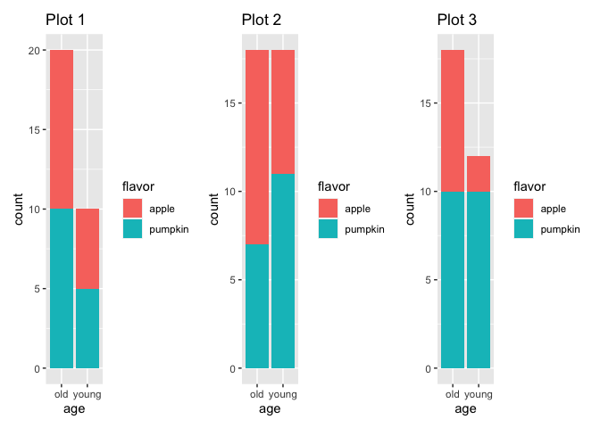<!-- -->

> ## *Question*
>
> Which one of the barcharts shows no relationship between `age` and
> `flavor`? In other words, which shows that pie preference is the same
> for both young and old?<br> <br> ✅ Plot 1<br> ⬜ Plot 2<br> ⬜ Plot
> 2<br>

## table() / tabyl(): Contingency tables

**Data**

-   `comics`

In this section you’ll working with the `comics` dataset. This is a
collection of characteristics on all of the superheroes created by
Marvel and DC comics in the last 80 years.

Let’s start by creating a contingency table, which is a useful way to
represent the total counts of observations that fall into each
combination of the levels of categorical variables.

**Packages**

-   `readr`
-   `forcats`
-   `janitor`

**Steps**

The dataset has been loaded into your workspace as `comics`.

1.  Type the name of the dataset to look at the rows and columns of the
    dataset.

``` r
# Load packages
library(readr)
library(dplyr)
```

    ## 
    ## Attaching package: 'dplyr'

    ## The following objects are masked from 'package:stats':
    ## 
    ##     filter, lag

    ## The following objects are masked from 'package:base':
    ## 
    ##     intersect, setdiff, setequal, union

``` r
library(forcats)

# Read all columns as factors
comics <- read_csv("data/comics.csv", col_types = cols(.default = "f")) |> 
  
            # Convert "NA" levels to real missing values
            mutate(across(where(is.factor), fct_recode, NULL = "NA")) |> 
  
            # Relevel columns
            mutate(align  = align  |> fct_relevel(levels = "Bad", "Good", "Neutral")) |> 
            mutate(gender = gender |> fct_relevel(levels = "Female", "Male", "Other"))

# Print the first rows of the data
comics
```

    ## # A tibble: 23,272 × 11
    ##    name     id     align eye   hair  gender gsm   alive appearances first_appear
    ##    <fct>    <fct>  <fct> <fct> <fct> <fct>  <fct> <fct> <fct>       <fct>       
    ##  1 "Spider… Secret Good  Haze… Brow… Male   <NA>  Livi… 4043        Aug-62      
    ##  2 "Captai… Public Good  Blue… Whit… Male   <NA>  Livi… 3360        Mar-41      
    ##  3 "Wolver… Public Neut… Blue… Blac… Male   <NA>  Livi… 3061        Oct-74      
    ##  4 "Iron M… Public Good  Blue… Blac… Male   <NA>  Livi… 2961        Mar-63      
    ##  5 "Thor (… No Du… Good  Blue… Blon… Male   <NA>  Livi… 2258        Nov-50      
    ##  6 "Benjam… Public Good  Blue… No H… Male   <NA>  Livi… 2255        Nov-61      
    ##  7 "Reed R… Public Good  Brow… Brow… Male   <NA>  Livi… 2072        Nov-61      
    ##  8 "Hulk (… Public Good  Brow… Brow… Male   <NA>  Livi… 2017        May-62      
    ##  9 "Scott … Public Neut… Brow… Brow… Male   <NA>  Livi… 1955        Sep-63      
    ## 10 "Jonath… Public Good  Blue… Blon… Male   <NA>  Livi… 1934        Nov-61      
    ## # … with 23,262 more rows, and 1 more variable: publisher <fct>

2.  View the `levels()` that the `align` variable can take.

``` r
# Check levels of align
levels(comics$align)
```

    ## [1] "Bad"                "Good"               "Neutral"           
    ## [4] "Reformed Criminals"

3.  View the `levels()` that the `gender` variable can take.

``` r
# Check the levels of gender
levels(comics$gender)
```

    ## [1] "Female" "Male"   "Other"

4.  Create a contingency table of the same two variables.

``` r
# Create a 2-way contingency table
tab <- table(comics$align, comics$gender)
tab
```

    ##                     
    ##                      Female Male Other
    ##   Bad                  1573 7561    32
    ##   Good                 2490 4809    17
    ##   Neutral               836 1799    17
    ##   Reformed Criminals      1    2     0

NA are displayed per default with the `tabyl()` function from the
`janitor` package.

``` r
comics |> 
  janitor::tabyl(align, gender)
```

    ##               align Female Male Other NA_
    ##                 Bad   1573 7561    32 449
    ##                Good   2490 4809    17 152
    ##             Neutral    836 1799    17 121
    ##  Reformed Criminals      1    2     0   0
    ##                <NA>    904 2250     2 257

``` r
# Identical to
# table(comics$align, comics$gender, useNA = "always")
```

## droplevels() / fct_drop(): Dropping levels

The contingency table from the last exercise revealed that there are
some levels that have very low counts. To simplify the analysis, it
often helps to drop such levels.

In R, this requires two steps: first filtering out any rows with the
levels that have very low counts, then removing these levels from the
factor variable with `droplevels()`. This is because the `droplevels()`
function would keep levels that have just 1 or 2 counts; it only drops
levels that don’t exist in a dataset.

**Steps**

1.1 Use `filter()` to filter out all rows of `comics` with that level,
then drop the unused level with `droplevels()`. Save the simplified
dataset as `comics_filtered`. 1.2 Alternatively, this can be done with
the `forcats` package and the `fct_drop()` function.

**Solution:**

``` r
# 1.1 Base r: Remove align level
comics_filtered <- comics %>%
  filter(align != "Reformed Criminals") %>%
  droplevels()

# 1.2 forcats: Remove align level
# comics_filtered <- comics %>%
#   filter(align != "Reformed Criminals") |> 
#   mutate(across(where(is.factor), fct_drop))

# See the result
comics_filtered
```

    ## # A tibble: 19,856 × 11
    ##    name     id     align eye   hair  gender gsm   alive appearances first_appear
    ##    <fct>    <fct>  <fct> <fct> <fct> <fct>  <fct> <fct> <fct>       <fct>       
    ##  1 "Spider… Secret Good  Haze… Brow… Male   <NA>  Livi… 4043        Aug-62      
    ##  2 "Captai… Public Good  Blue… Whit… Male   <NA>  Livi… 3360        Mar-41      
    ##  3 "Wolver… Public Neut… Blue… Blac… Male   <NA>  Livi… 3061        Oct-74      
    ##  4 "Iron M… Public Good  Blue… Blac… Male   <NA>  Livi… 2961        Mar-63      
    ##  5 "Thor (… No Du… Good  Blue… Blon… Male   <NA>  Livi… 2258        Nov-50      
    ##  6 "Benjam… Public Good  Blue… No H… Male   <NA>  Livi… 2255        Nov-61      
    ##  7 "Reed R… Public Good  Brow… Brow… Male   <NA>  Livi… 2072        Nov-61      
    ##  8 "Hulk (… Public Good  Brow… Brow… Male   <NA>  Livi… 2017        May-62      
    ##  9 "Scott … Public Neut… Brow… Brow… Male   <NA>  Livi… 1955        Sep-63      
    ## 10 "Jonath… Public Good  Blue… Blon… Male   <NA>  Livi… 1934        Nov-61      
    ## # … with 19,846 more rows, and 1 more variable: publisher <fct>

## Contingency table vs. side-by-side barcharts

While a contingency table represents the counts numerically, it’s often
more useful to represent them graphically.

**Steps**

Here you’ll construct two side-by-side barcharts of the `comics` data.
This shows that there can often be two or more options for presenting
the same data. Passing the argument `position = "dodge"` to `geom_bar()`
says that you want a side-by-side (i.e. not stacked) barchart.

1.  Create a side-by-side barchart with `align` on the x-axis and
    `gender` as the `fill` aesthetic.

``` r
# Create side-by-side barchart of gender by alignment
ggplot(comics_filtered, aes(x = align, fill = gender)) + 
  geom_bar(position = "dodge")
```

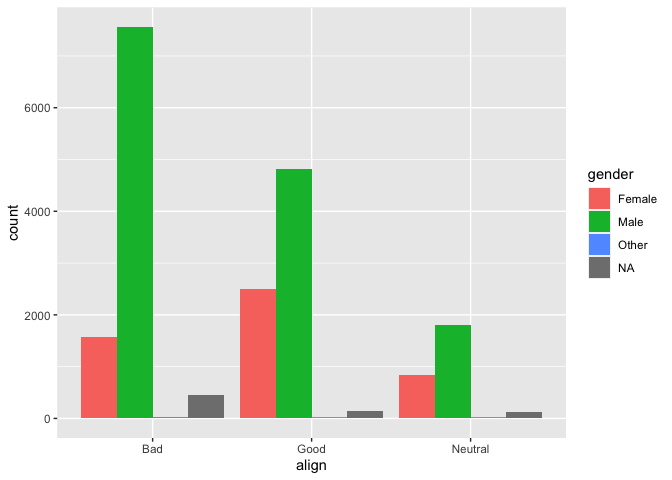<!-- -->

2.  Create another side-by-side barchart with `gender` on the x-axis and
    `align` as the `fill` aesthetic. Rotate the axis labels 90 degrees
    to help readability.

``` r
# Create side-by-side barchart of alignment by gender
ggplot(comics_filtered, aes(x = gender, fill = align)) + 
  geom_bar(position = "dodge") +
  theme(axis.text.x = element_text(angle = 90))
```

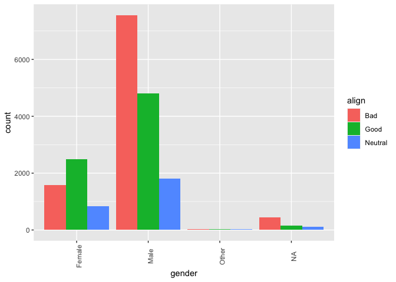<!-- -->

> ## *Question*
>
> Which of the following interpretations of the bar charts to your right
> is **not** valid?<br> <br> ⬜ Among characters with “Neutral”
> alignment, males are the most common.<br> ⬜ In general, there is an
> association between gender and alignment.<br> ✅ Across all genders,
> “Bad” is the most common alignment.<br> ⬜ There are more male
> characters than female characters in this dataset.<br>

## prop.table() / tabyl(): Conditional proportions

The following code generates tables of joint and conditional
proportions, respectively:

*base r*

``` r
tab <- table(comics_filtered$align, comics_filtered$gender)
options(scipen = 999, digits = 3) # Print fewer digits
prop.table(tab)     # Joint proportions
```

    ##          
    ##             Female     Male    Other
    ##   Bad     0.082210 0.395160 0.001672
    ##   Good    0.130135 0.251333 0.000888
    ##   Neutral 0.043692 0.094021 0.000888

``` r
prop.table(tab, 2)  # Conditional on columns
```

    ##          
    ##           Female  Male Other
    ##   Bad      0.321 0.534 0.485
    ##   Good     0.508 0.339 0.258
    ##   Neutral  0.171 0.127 0.258

*janitor*

``` r
# Load packages
library(janitor)
```

    ## 
    ## Attaching package: 'janitor'

    ## The following objects are masked from 'package:stats':
    ## 
    ##     chisq.test, fisher.test

``` r
comics_filtered |> 
  tabyl(align, gender) |> 
  
  # Conditional on columns
  adorn_percentages("col") |> 
  # Format
  adorn_pct_formatting(digits = 0) #|> 
```

    ##    align Female Male Other NA_
    ##      Bad    32%  53%   48% 62%
    ##     Good    51%  34%   26% 21%
    ##  Neutral    17%  13%   26% 17%

``` r
  # Add back the underlying Ns
  # adorn_ns()
```

> ## *Question*
>
> Approximately what proportion of all female characters are good?<br>
> <br> ⬜ 44%<br> ⬜ 1.3%<br> ⬜ 13%<br> ✅ 51%<br>

Nice! To answer this question, you needed to look at how align was
distributed within each gender. That is, you wanted to condition on the
gender variable.

## Barcharts: Counts vs. proportions

Bar charts can tell dramatically different stories depending on whether
they represent counts or proportions and, if proportions, what the
proportions are conditioned on. To demonstrate this difference, you’ll
construct two barcharts in this section: one of counts and one of
proportions.

**Steps**

1.  Create a stacked barchart of `gender` *counts* with `align` on the
    x-axis.

``` r
# Plot of gender by align
comics_filtered |> 
  
  # Reorder levels corresponding to count
  ggplot(aes(x = align, fill = gender)) +
    geom_bar()
```

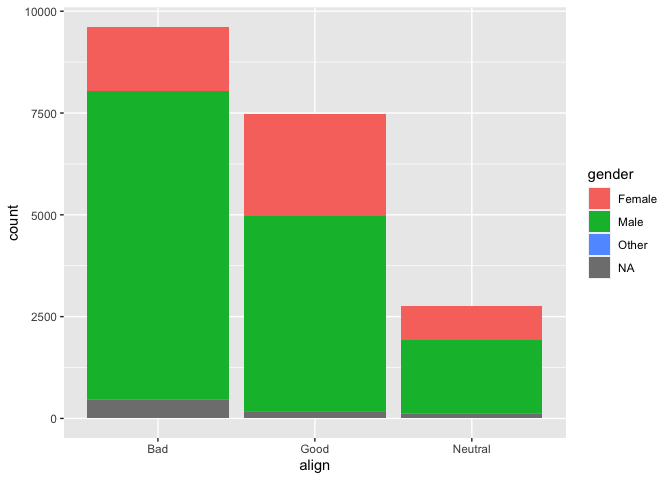<!-- -->

2.  Create a stacked barchart of `gender` *proportions* with `align` on
    the x-axis by setting the `position` argument to `geom_bar()` equal
    to `"fill"`.

``` r
# Plot proportion of gender, conditional on align
comics_filtered |> 
  
  # Reorder levels corresponding to count
  ggplot(aes(x = align, fill = gender)) + 
  geom_bar(position = "fill") +
  ylab("proportion")
```

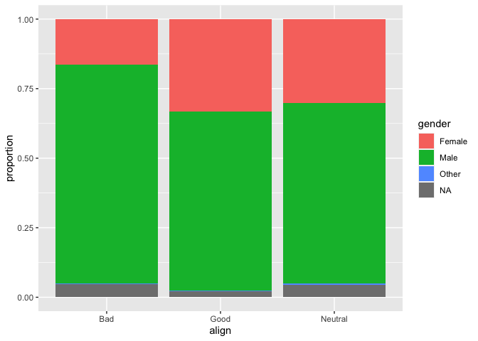<!-- -->

Excellent work! By adding `position = "fill"` to `geom_bar()`, you are
saying you want the bars to fill the entire height of the plotting
window, thus displaying proportions and not raw counts.

## fct_relevel() / fct_infreq(): Order Barcharts

### fct_relevel()

If you are interested in the distribution of alignment of *all*
superheroes, it makes sense to construct a barchart for just that single
variable.

You can improve the interpretability of the plot, though, by
implementing some sensible ordering. Superheroes that are `"Neutral"`
show an alignment between `"Good"` and `"Bad"`, so it makes sense to put
that bar in the middle.

**Steps**

1.  Reorder the levels of `align` using the
    <a href="https://www.rdocumentation.org/packages/base/topics/factor" target="_blank" rel="noopener noreferrer">`factor()`</a>
    or
    <a href="https://forcats.tidyverse.org/reference/fct_relevel.html" target="_blank" rel="noopener noreferrer">`fct_relevel()`</a>
    function so that printing them reads `"Bad"`, `"Neutral"`, then
    `"Good"`.
2.  Create a barchart of counts of the `align` variable.

*base r*

``` r
# 1. Change the order of the levels in align
comics_filtered$align <- factor(comics_filtered$align, 
                                levels = c("Bad", "Neutral", "Good"))

# 2. Create plot of align
ggplot(comics_filtered, aes(x = align)) + 
  geom_bar()
```

*forcats*

``` r
# 1. Change the order of the levels in align
comics_releveled <- comics_filtered |> 
  mutate(align = align |> fct_relevel(levels = "Bad", "Neutral", "Good"))

# 2. Create plot of align
comics_releveled |> 
  ggplot(aes(x = align)) + 
    geom_bar()
```

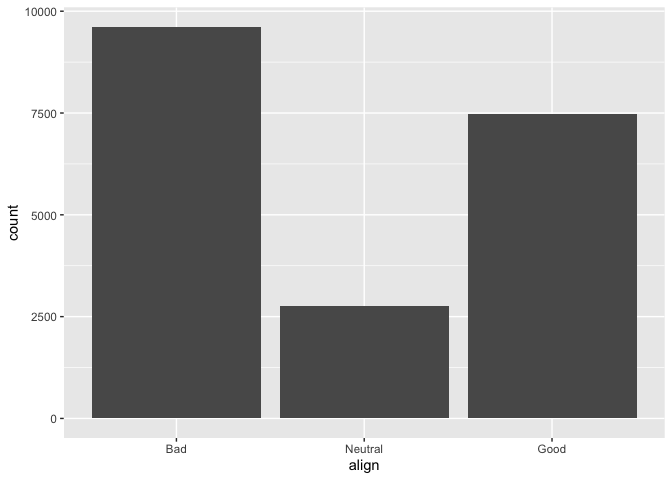<!-- -->

### fct_infreq()

The piechart is a very common way to represent the distribution of a
single categorical variable, but they can be more difficult to interpret
than barcharts.

``` r
pies <- readRDS("data/pies.rds")
pies |> 
  count(flavor) |> 
  ggplot(aes(x="", y=n, fill=flavor)) +
    geom_bar(stat="identity", width=1, color="white") +
    coord_polar("y", start=0) +
    theme_void()
```

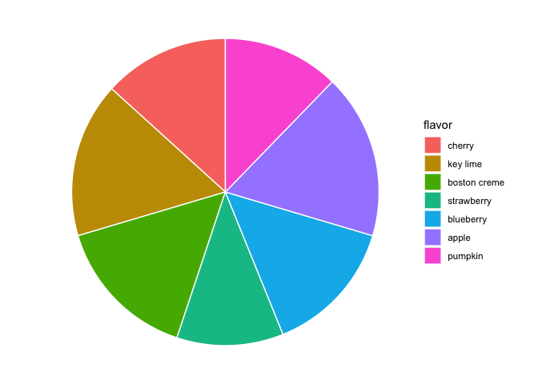<!-- -->

This is a piechart of a dataset called `pies` that contains the favorite
pie flavors of 98 people. Improve the representation of these data by
constructing a *barchart* that is ordered in descending order of count.

**Data**

-   `pies`

**Steps**

1.  Use the code provided to reorder the levels of `flavor` so that
    they’re in descending order by count.
2.  Create a barchart of `flavor` and orient the labels vertically so
    that they’re easier to read. The default coloring may look drab by
    comparison, so change the `fill` of the bars to `"chartreuse"`.

*base r*

``` r
# Put levels of flavor in descending order
# lev <- c("apple", "key lime", "boston creme", "blueberry", "cherry", "pumpkin", "strawberry")
# pies$flavor <- factor(pies$flavor, levels = lev)
```

*forcats*

``` r
# Put levels of flavor in descending order
pies |> 
  mutate(flavor = flavor |> fct_infreq()) |> 

# Create barchart of flavor
ggplot(aes(x = flavor)) + 
  geom_bar(fill = "chartreuse") + 
  theme(axis.text.x = element_text(angle = 90))
```

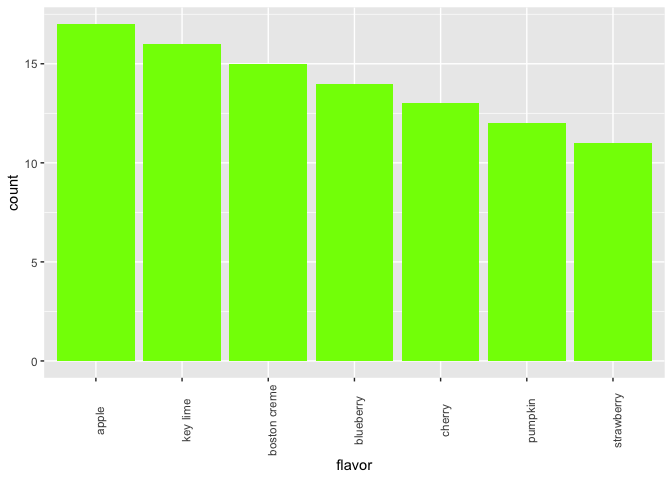<!-- -->

## facet_wrap(): Conditional barchart

Now, if you want to break down the distribution of alignment based on
gender, you’re looking for conditional distributions.

You could make these by creating multiple filtered datasets (one for
each gender) or by faceting the plot of alignment based on gender.

**Steps**

1.  Create a barchart of `align` faceted by `gender`.

``` r
# Plot of alignment broken down by gender
comics_releveled |> 

ggplot(aes(x = align)) + 
  geom_bar() +
  facet_wrap(~ gender)
```

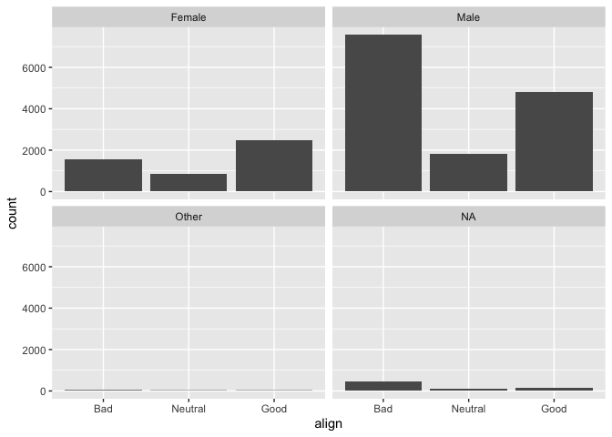<!-- -->

# 2. Exploring Numerical Data

In this section, you will learn how to graphically summarize numerical
data.

## facet_wrap(): Faceted histogram

**Data**

-   `cars`

In this section, you’ll be working with the `cars` dataset, which
records characteristics on all of the new models of cars for sale in the
US in a certain year.

You will investigate the distribution of mileage across a categorical
variable, but before you get there, you’ll want to familiarize yourself
with the dataset.

**Steps**

1.  View the size of the data and the variable types using `str()`.

``` r
cars <- read_csv("data/cars.csv", col_types = cols(name = col_factor()))

# Learn data structure
str(cars)
```

    ## spec_tbl_df [428 × 19] (S3: spec_tbl_df/tbl_df/tbl/data.frame)
    ##  $ name       : Factor w/ 425 levels "Chevrolet Aveo 4dr",..: 1 2 3 4 5 6 7 8 9 10 ...
    ##  $ sports_car : logi [1:428] FALSE FALSE FALSE FALSE FALSE FALSE ...
    ##  $ suv        : logi [1:428] FALSE FALSE FALSE FALSE FALSE FALSE ...
    ##  $ wagon      : logi [1:428] FALSE FALSE FALSE FALSE FALSE FALSE ...
    ##  $ minivan    : logi [1:428] FALSE FALSE FALSE FALSE FALSE FALSE ...
    ##  $ pickup     : logi [1:428] FALSE FALSE FALSE FALSE FALSE FALSE ...
    ##  $ all_wheel  : logi [1:428] FALSE FALSE FALSE FALSE FALSE FALSE ...
    ##  $ rear_wheel : logi [1:428] FALSE FALSE FALSE FALSE FALSE FALSE ...
    ##  $ msrp       : num [1:428] 11690 12585 14610 14810 16385 ...
    ##  $ dealer_cost: num [1:428] 10965 11802 13697 13884 15357 ...
    ##  $ eng_size   : num [1:428] 1.6 1.6 2.2 2.2 2.2 2 2 2 2 2 ...
    ##  $ ncyl       : num [1:428] 4 4 4 4 4 4 4 4 4 4 ...
    ##  $ horsepwr   : num [1:428] 103 103 140 140 140 132 132 130 110 130 ...
    ##  $ city_mpg   : num [1:428] 28 28 26 26 26 29 29 26 27 26 ...
    ##  $ hwy_mpg    : num [1:428] 34 34 37 37 37 36 36 33 36 33 ...
    ##  $ weight     : num [1:428] 2370 2348 2617 2676 2617 ...
    ##  $ wheel_base : num [1:428] 98 98 104 104 104 105 105 103 103 103 ...
    ##  $ length     : num [1:428] 167 153 183 183 183 174 174 168 168 168 ...
    ##  $ width      : num [1:428] 66 66 69 68 69 67 67 67 67 67 ...
    ##  - attr(*, "spec")=
    ##   .. cols(
    ##   ..   name = col_factor(levels = NULL, ordered = FALSE, include_na = FALSE),
    ##   ..   sports_car = col_logical(),
    ##   ..   suv = col_logical(),
    ##   ..   wagon = col_logical(),
    ##   ..   minivan = col_logical(),
    ##   ..   pickup = col_logical(),
    ##   ..   all_wheel = col_logical(),
    ##   ..   rear_wheel = col_logical(),
    ##   ..   msrp = col_double(),
    ##   ..   dealer_cost = col_double(),
    ##   ..   eng_size = col_double(),
    ##   ..   ncyl = col_double(),
    ##   ..   horsepwr = col_double(),
    ##   ..   city_mpg = col_double(),
    ##   ..   hwy_mpg = col_double(),
    ##   ..   weight = col_double(),
    ##   ..   wheel_base = col_double(),
    ##   ..   length = col_double(),
    ##   ..   width = col_double()
    ##   .. )
    ##  - attr(*, "problems")=<externalptr>

2.  Plot a histogram of `city_mpg` faceted by `suv`, a logical variable
    indicating whether the car is an SUV or not.

``` r
# Create faceted histogram
ggplot(cars, aes(x = city_mpg)) +
  geom_histogram() +
  facet_wrap(~ suv)
```

    ## `stat_bin()` using `bins = 30`. Pick better value with `binwidth`.

    ## Warning: Removed 14 rows containing non-finite values (stat_bin).

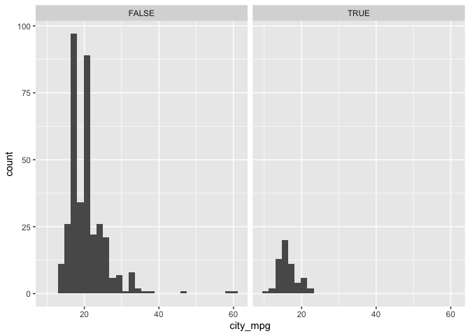<!-- -->

In this step, you faceted by the `suv` variable, but it’s important to
note that you can facet a plot by any categorical variable using
`facet_wrap()`.

## geom_boxplot() & geom_density(): Boxplots and density plots

The mileage of a car tends to be associated with the size of its engine
(as measured by the number of cylinders). To explore the relationship
between these two variables, you could stick to using histograms, but in
this exercise you’ll try your hand at two alternatives:

-   box plot
-   density plot.

**Steps**

A quick look at `unique(cars$ncyl)` shows that there are more possible
levels of `ncyl` than you might think. Here, restrict your attention to
the most common levels.

1.  Filter `cars` to include only cars with 4, 6, or 8 cylinders and
    save the result as `common_cyl`. The `%in%` operator may prove
    useful here.
2.  Create side-by-side box plots of `city_mpg` separated out by `ncyl`.

``` r
# 1. Filter cars with 4, 6, 8 cylinders
common_cyl <- cars |> 
                filter(ncyl %in% c(4,6,8))

# 2. Create box plots of city mpg by ncyl
common_cyl |> 
  ggplot(aes(x = as.factor(ncyl), y = city_mpg)) +
    geom_boxplot()
```

    ## Warning: Removed 11 rows containing non-finite values (stat_boxplot).

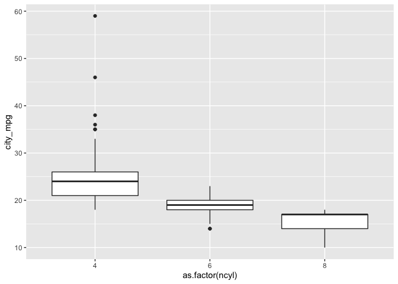<!-- -->

3.  Create overlaid density plots of `city_mpg` colored by `ncyl`.

``` r
# 3. Create overlaid density plots for same data
common_cyl |> 
  ggplot(aes(x = city_mpg, fill = as.factor(ncyl))) +
    geom_density(alpha = .3)
```

    ## Warning: Removed 11 rows containing non-finite values (stat_density).

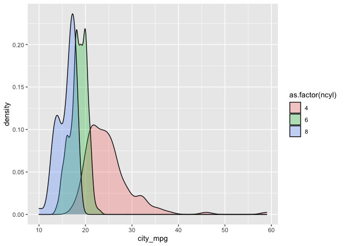<!-- -->

> ## *Question*
>
> Which of the following interpretations of the plot **is not**
> valid?<br> <br> ⬜ The highest mileage cars have 4 cylinders.<br> ⬜
> The typical 4 cylinder car gets better mileage than the typical 6
> cylinder car, which gets better mileage than the typical 8 cylinder
> car.<br> ⬜ Most of the 4 cylinder cars get better mileage than even
> the most efficient 8 cylinder cars.<br> ✅ The variability in mileage
> of 8 cylinder cars is similar to the variability in mileage of 4
> cylinder cars.<br>

The variability in mileage of 8 cylinder cars seem much smaller than
that of 4 cylinder cars.

## geom_histogram(): Marginal and conditional histograms

Now, turn your attention to a new variable: `horsepwr`. The goal is to
get a sense of the marginal distribution of this variable and then
compare it to the distribution of horsepower conditional on the price of
the car being less than $25,000.

You’ll be making two plots using the “data pipeline” paradigm, where you
start with the raw data and end with the plot.

**Steps**

1.  Create a histogram of the distribution of `horsepwr` across all cars
    and add an appropriate title. Start by piping in the raw dataset.

``` r
# Create hist of horsepwr
cars %>%
  ggplot(aes(horsepwr)) +
  geom_histogram() +
  ggtitle("hist horsepwr")
```

    ## `stat_bin()` using `bins = 30`. Pick better value with `binwidth`.

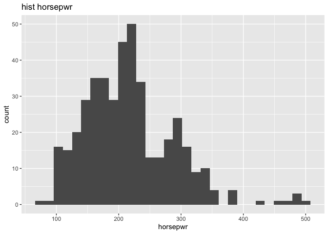<!-- -->

2.  Create a second histogram of the distribution of horsepower, but
    only for those cars that have an `msrp` less than $25,000. Keep the
    limits of the x-axis so that they’re similar to that of the first
    plot, and add a descriptive title.

``` r
# Create hist of horsepwr for affordable cars
cars %>% 
  filter(msrp < 25000) %>%
  ggplot(aes(horsepwr)) +
  geom_histogram() +
  xlim(c(90, 550)) +
  ggtitle("hist horsepwr < 25000 msrp")
```

    ## `stat_bin()` using `bins = 30`. Pick better value with `binwidth`.

    ## Warning: Removed 1 rows containing non-finite values (stat_bin).

    ## Warning: Removed 2 rows containing missing values (geom_bar).

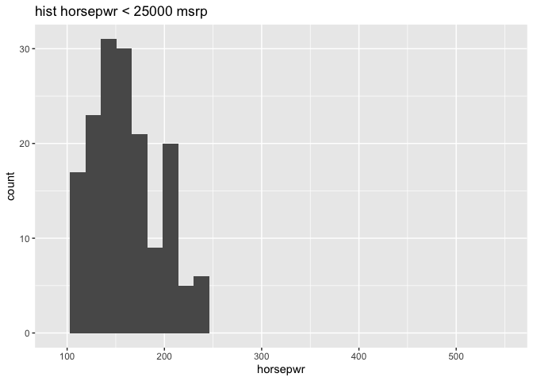<!-- -->

> ## *Question*
>
> Observe the two histograms. Which of the following **is** a valid
> interpretation.<br> <br> ⬜ Cars with around 300 horsepower are more
> common than cars with around 200 horsepower.<br> ✅ The highest
> horsepower car in the less expensive range has just under 250
> horsepower.<br> ⬜ Most cars under $25,000 vary from roughly 100
> horsepower to roughly 350 horsepower.<br>

## geom_histogram(): Binwidths

Before you take these plots for granted, it’s a good idea to see how
things change when you alter the binwidth. The binwidth determines how
smooth your distribution will appear: the smaller the binwidth, the more
jagged your distribution becomes. It’s good practice to consider several
binwidths in order to detect different types of structure in your data.

**Steps**

Create the following three plots, adding a title to each to indicate the
binwidth used:

1.  A histogram of horsepower (i.e. `horsepwr`) with a `binwidth` of 3.

``` r
# Create hist of horsepwr with binwidth of 3
cars %>%
  ggplot(aes(horsepwr)) +
  geom_histogram(binwidth = 3) +
  ggtitle("binwidth 3")
```

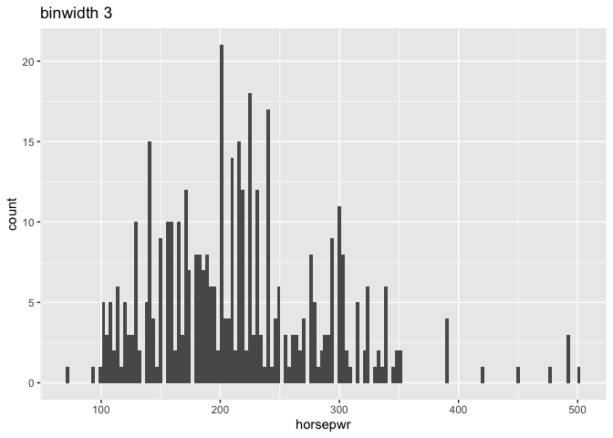<!-- -->

2.  A second histogram of horsepower with a `binwidth` of 30.

``` r
# Create hist of horsepwr with binwidth of 30
cars %>%
  ggplot(aes(horsepwr)) +
  geom_histogram(binwidth = 30) +
  ggtitle("binwidth 30")
```

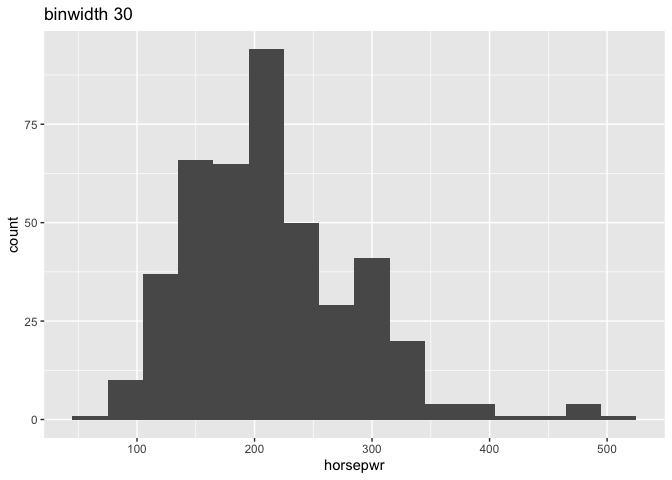<!-- -->

3.  A third histogram of horsepower with a `binwidth` of 60.

``` r
# Create hist of horsepwr with binwidth of 60
cars %>%
  ggplot(aes(horsepwr)) +
  geom_histogram(binwidth = 60) +
  ggtitle("binwidth 60")
```

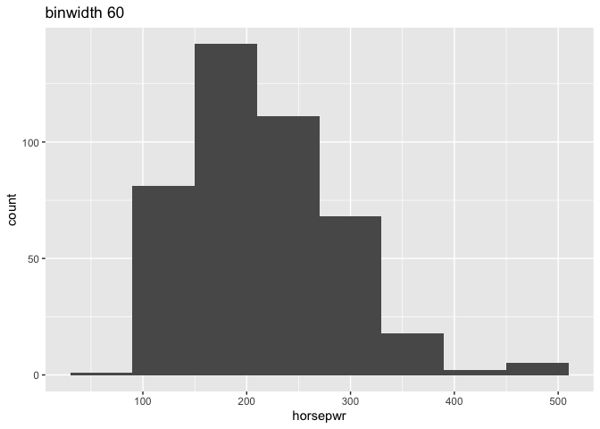<!-- -->

> ## *Question*
>
> What feature is present in Plot A that’s not found in B or C?<br> <br>
> ⬜ The most common horsepower is around 200.br\> ✅ There is a
> tendency for cars to have horsepower right at 200 or 300
> horsepower.br\> ⬜ There is a second mode around 300 horsepower.br\>

Plot A is the only histogram that shows the count for cars with exactly
200 and 300 horsepower.

## geom_boxplot(): Box plots for outliers

In addition to indicating the center and spread of a distribution, a box
plot provides a graphical means to detect outliers. You can apply this
method to the `msrp` column (manufacturer’s suggested retail price) to
detect if there are unusually expensive or cheap cars.

**Steps**

1.  Construct a box plot of `msrp`.

``` r
# Construct box plot of msrp
cars %>%
  ggplot(aes(x = 1, y = msrp)) +
  geom_boxplot()
```

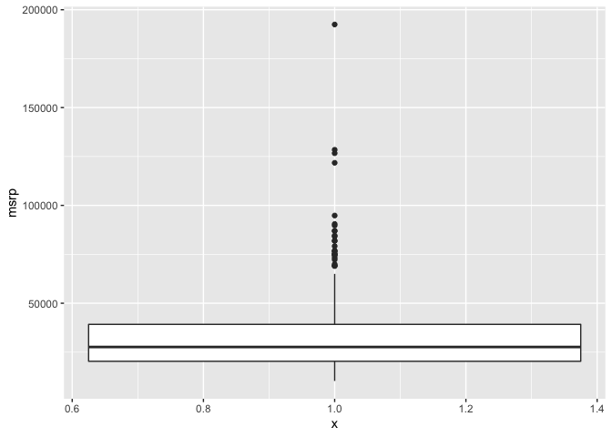<!-- -->

2.  Exclude the largest 3-5 outliers by filtering the rows to retain
    cars less than $100,000. Save this reduced dataset as `cars_no_out`.
3.  Construct a similar box plot of `msrp` using this reduced dataset.
    Compare the two plots.

``` r
# Exclude outliers from data
cars_no_out <- cars %>%
                filter(msrp < 100000)

# Construct box plot of msrp using the reduced dataset
cars_no_out %>%
  ggplot(aes(x = 1, y = msrp)) +
  geom_boxplot()
```

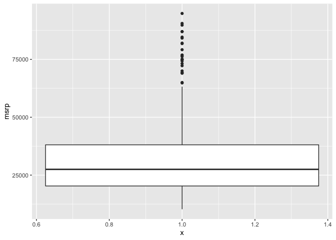<!-- -->

## geom_boxplot() vs. geom_density(): Plot selection

Consider two other columns in the `cars` dataset: `city_mpg` and
`width`. Which is the most appropriate plot for displaying the important
features of their distributions? Remember, both density plots and box
plots display the central tendency and spread of the data, but the box
plot is more robust to outliers.

**Steps**

Use density plots or box plots to construct the following
visualizations. For each variable, try both plots and submit the one
that is better at capturing the important structure.

1.  Display the distribution of `city_mpg`.

``` r
# Create plot of city_mpg
cars %>%
  ggplot(aes(x = 1, y = city_mpg)) +
  geom_boxplot()
```

    ## Warning: Removed 14 rows containing non-finite values (stat_boxplot).

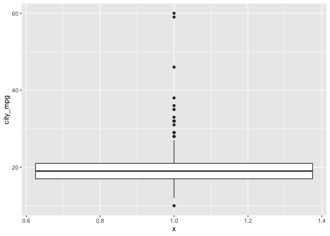<!-- -->

2.  Display the distribution of `width`.

``` r
# Create plot of width
cars %>% 
  ggplot(aes(x = width)) +
  geom_density()
```

    ## Warning: Removed 28 rows containing non-finite values (stat_density).

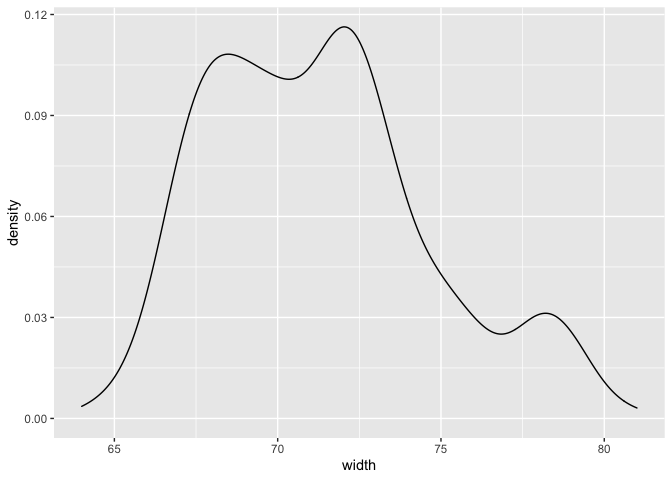<!-- -->

Because the `city_mpg` variable has a much wider range with its
outliers, it’s best to display its distribution as a box plot.

## Visualization in higher dimensions

Theory. Coming soon …

## facet_grid(): 3 variable plot

Faceting is a valuable technique for looking at several conditional
distributions at the same time. If the faceted distributions are laid
out in a grid, you can consider the association between a variable and
two others, one on the rows of the grid and the other on the columns.

**Steps**

Use `common_cyl`, which you created to contain only cars with 4, 6, or 8
cylinders.

1.  Using `common_cyl`, create a histogram of `hwy_mpg`.
2.  Grid-facet the plot rowwise by `ncyl` and columnwise by `suv`.
3.  Add a title to your plot to indicate what variables are being
    faceted on.

**Solution:**

``` r
# Facet hists using hwy mileage and ncyl
common_cyl %>%
  ggplot(aes(x = hwy_mpg)) +
  geom_histogram() +
  facet_grid(ncyl ~ suv) +
  ggtitle("Mileage by suv and ncyl")
```

    ## `stat_bin()` using `bins = 30`. Pick better value with `binwidth`.

    ## Warning: Removed 11 rows containing non-finite values (stat_bin).

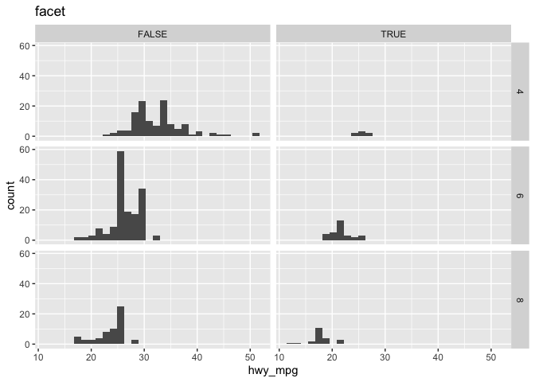<!-- -->

> ## *Question*
>
> Which of the following interpretations of the plot **is** valid?<br>
> <br> ✅ Across both SUVs and non-SUVs, mileage tends to decrease as
> the number of cylinders increases.<br> ⬜ There are more SUVs than
> non-SUVs across all cylinder types.<br> ⬜ There is more variability
> in 6-cylinder non-SUVs than in any other type of car.<br>

# 3. Numerical Summaries

Now that we’ve looked at exploring categorical and numerical data,
you’ll learn some useful statistics for describing distributions of
data.

## Measures of center

Theory. Coming soon …

## Choice of center measure

The choice of measure for center can have a dramatic impact on what we
consider to be a typical observation, so it is important that you
consider the shape of the distribution before deciding on the measure.

``` r
distributions <- readRDS("data/distributions.rds")

distributions |> 
  ggplot(aes(x = x, fill = distribution)) +
  geom_density(alpha = .3)
```

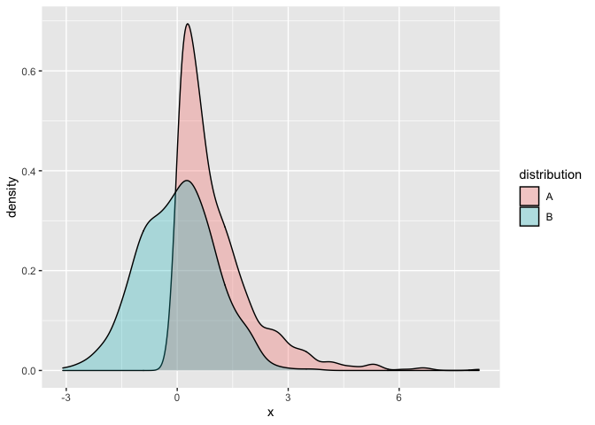<!-- -->

> ## *Question*
>
> Which set of measures of central tendency would be *worst* for
> describing the two distributions shown here?<br> <br> ⬜ A: mode, B:
> median<br> ✅ A: mean, B: mode<br> ⬜ A: median, B: mean<br> ⬜ A:
> median, B: median<br>

## summarize(): Calculate center measures

**Data**

Throughout this section, you will use data from `gapminder`, which
tracks demographic data in countries of the world over time. To learn
more about it, you can bring up the help file with `?gapminder`.

For this part, focus on how the life expectancy differs from continent
to continent. This requires that you conduct your analysis not at the
country level, but aggregated up to the continent level. This is made
possible by the one-two punch of `group_by()` and `summarize()`, a very
powerful syntax for carrying out the same analysis on different subsets
of the full dataset.

**Steps**

1.  Create a dataset called `gap2007` that contains only data from the
    year 2007.
2.  Using `gap2007`, calculate the mean and median life expectancy for
    each continent. Don’t worry about naming the new columns produced by
    `summarize()`.

``` r
# Create dataset of 2007 data
gap2007 <- filter(gapminder::gapminder, year == 2007)

# Compute groupwise mean and median lifeExp
gap2007 %>%
  group_by(continent) %>%
  summarize(mean(lifeExp),
            median(lifeExp))
```

    ## # A tibble: 5 × 3
    ##   continent `mean(lifeExp)` `median(lifeExp)`
    ##   <fct>               <dbl>             <dbl>
    ## 1 Africa               54.8              52.9
    ## 2 Americas             73.6              72.9
    ## 3 Asia                 70.7              72.4
    ## 4 Europe               77.6              78.6
    ## 5 Oceania              80.7              80.7

3.  Confirm the trends that you see in the medians by generating
    side-by-side box plots of life expectancy for each continent.

``` r
# Generate box plots of lifeExp for each continent
gap2007 %>%
  ggplot(aes(x = continent, y = lifeExp)) +
  geom_boxplot()
```

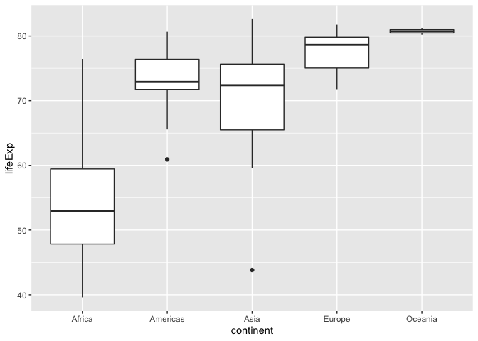<!-- -->

## Measures of variability

Theory. Coming soon …

## Choice of spread measure

The choice of measure for spread can dramatically impact how variable we
consider our data to be, so it is important that you consider the shape
of the distribution before deciding on the measure.

``` r
distributions |> 
  ggplot(aes(x = x, fill = distribution)) +
  geom_density(alpha = .3)
```

<!-- -->

> ## *Question*
>
> Which set of measures of spread would be *worst* for describing the
> two distributions shown here?<br> <br> ⬜ A: IQR, B: IQR<br> ⬜ A: SD,
> B: IQR<br> ✅ A: Variance, B: Range<br>

## sd(), IQR(), n(): Calculate spread measures

Let’s extend the powerful `group_by()` and `summarize()` syntax to
measures of spread. If you’re unsure whether you’re working with
symmetric or skewed distributions, it’s a good idea to consider a robust
measure like IQR in addition to the usual measures of variance or
standard deviation.

**Steps**

1.  For each continent in `gap2007`, summarize life expectancies using
    the `sd()`, the `IQR()`, and the count of countries, `n()`. No need
    to name the new columns produced here. The `n()` function within
    your `summarize()` call does not take any arguments.

**Solution:**

``` r
# Compute groupwise measures of spread
gap2007 %>%
  group_by(continent) %>%
  summarize(sd(lifeExp),
            IQR(lifeExp),
            n())
```

    ## # A tibble: 5 × 4
    ##   continent `sd(lifeExp)` `IQR(lifeExp)` `n()`
    ##   <fct>             <dbl>          <dbl> <int>
    ## 1 Africa            9.63          11.6      52
    ## 2 Americas          4.44           4.63     25
    ## 3 Asia              7.96          10.2      33
    ## 4 Europe            2.98           4.78     30
    ## 5 Oceania           0.729          0.516     2

2.  Graphically compare the spread of these distributions by
    constructing overlaid density plots of life expectancy broken down
    by continent.

``` r
# Generate overlaid density plots
gap2007 %>%
  ggplot(aes(x = lifeExp, fill = continent)) +
  geom_density(alpha = 0.3)
```

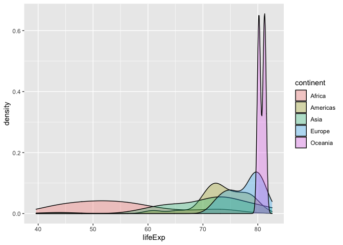<!-- -->

## Choose measures for center and spread

Consider the density plots shown here. What are the most appropriate
measures to describe their centers and spreads? In this exercise, you’ll
select the measures and then calculate them.

**Steps**

Using the shapes of the density plots, calculate the most appropriate
measures of center and spread for the following:

1.  The distribution of life expectancy in the countries of the
    Americas. Note you’ll need to apply a filter here.

``` r
# Compute stats for lifeExp in Americas
gap2007 %>%
  filter(continent == "Americas") %>%
  summarize(mean(lifeExp),
            sd(lifeExp))
```

    ## # A tibble: 1 × 2
    ##   `mean(lifeExp)` `sd(lifeExp)`
    ##             <dbl>         <dbl>
    ## 1            73.6          4.44

2.  The distribution of country *populations* across the entire
    `gap2007` dataset.

``` r
# Compute stats for population
gap2007 %>%
  summarize(median(pop),
            IQR(pop))
```

    ## # A tibble: 1 × 2
    ##   `median(pop)` `IQR(pop)`
    ##           <dbl>      <dbl>
    ## 1      10517531  26702008.

## Distribution shapes

``` r
distributions2 <- readRDS("data/distributions2.rds")

distributions2 |> 
  ggplot(aes(x = x, y = y)) +
  geom_line() +
  facet_wrap(~plot, scales = "free") +
  labs(x = "", y = "") + 
  theme(axis.title = element_blank(),
        axis.text  = element_blank(),
        axis.ticks = element_blank())
```

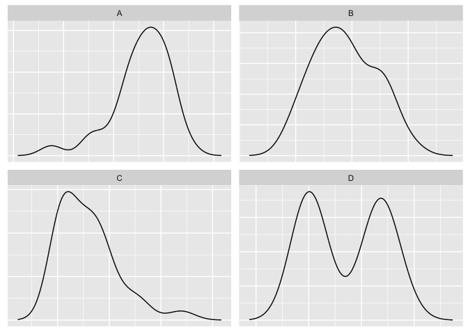<!-- -->

> ## *Question*
>
> To build some familiarity with distributions of different shapes,
> consider the four that are plotted here. Which of the following
> options does the best job of describing their shape in terms of
> modality and skew/symmetry?<br> <br> ⬜ A: bimodal symmetric; B:
> unimodal symmetric; C: unimodal left-skewed, D: bimodal
> right-skewed.<br> ✅ A: unimodal left-skewed; B: unimodal symmetric;
> C: unimodal right-skewed, D: bimodal symmetric.<br> ⬜ A: unimodal
> right-skewed; B: unimodal left-skewed; C: unimodal left-skewed; D:
> bimodal symmetric.<br> ⬜ A: unimodal left-skewed; B: bimodal
> symmetric; C: unimodal right-skewed, D: unimodal symmetric.<br>

## log(): Transformations

Highly skewed distributions can make it very difficult to learn anything
from a visualization. Transformations can be helpful in revealing the
more subtle structure.

Here you’ll focus on the population variable, which exhibits strong
right skew, and transform it with the natural logarithm function
(`log()` in R).

**Steps**

Using the `gap2007` data:

1.  Create a density plot of the population variable.

``` r
# Create density plot of old variable
gap2007 %>%
  ggplot(aes(x = pop)) +
  geom_density()
```

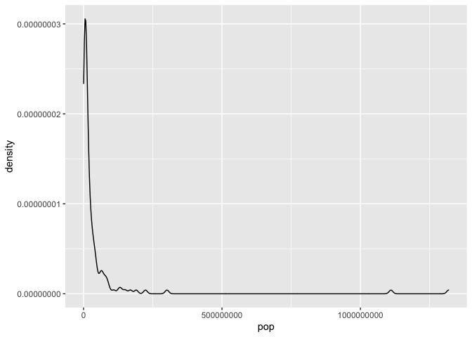<!-- -->

2.  Mutate a new column called `log_pop` that is the natural log of the
    population and save it back into `gap2007`.
3.  Create a density plot of your transformed variable.

``` r
# Transform the skewed pop variable
gap2007 <- gap2007 %>%
  mutate(log_pop = log(pop))

# Create density plot of new variable
gap2007 %>%
  ggplot(aes(x = log_pop)) +
  geom_density()
```

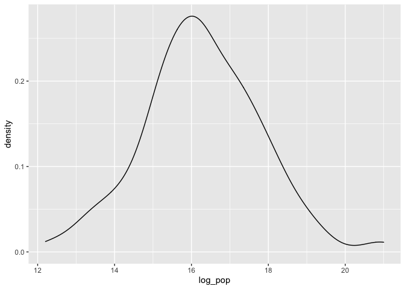<!-- -->

## Identify outliers

Consider the distribution, shown here, of the life expectancies of the
countries in Asia. The box plot identifies one clear outlier: a country
with a notably low life expectancy. Do you have a guess as to which
country this might be? Test your guess in the console using either
`min()` or `filter()`, then proceed to building a plot with that country
removed.

**Steps**

1.  Apply a filter so that it only contains observations from Asia, then
    create a new variable called `is_outlier` that is `TRUE` for
    countries with life expectancy less than 50. Assign the result to
    `gap_asia`.
2.  Filter `gap_asia` to remove all outliers, then create another box
    plot of the remaining life expectancies.

``` r
# Filter for Asia, add column indicating outliers
gap_asia <- gap2007 %>%
  filter(continent == "Asia") %>%
  mutate(is_outlier = lifeExp < 50)

# Remove outliers, create box plot of lifeExp
gap_asia %>%
  filter(!is_outlier) %>%
  ggplot(aes(x = 1, y = lifeExp)) +
  geom_boxplot()
```

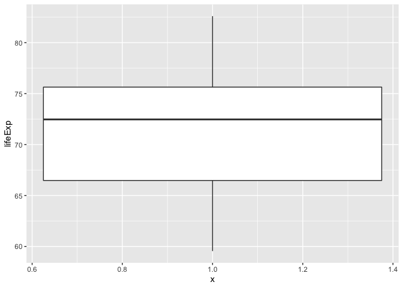<!-- -->

# 4. Case Study: Spam Emails

Apply what you’ve learned to explore and summarize a real world dataset
in this case study of email spam.

## Introducing the data

Theory. Coming soon …

### Spam and num_char

Is there an association between spam and the length of an email? You
could imagine a story either way:

-   *Spam is more likely to be a short message tempting me to click on a
    link*, or
-   *My normal email is likely shorter since I exchange brief emails
    with my friends all the time*.

Here, you’ll use the `email` dataset to settle that question. Begin by
bringing up the help file and learning about all the variables with
`?email`.

As you explore the association between spam and the length of an email,
use this opportunity to try out linking a `dplyr` chain with the layers
in a `ggplot2` object.

**Data**

-   `email` (from the `openintro` package)

**Steps**

1.  Compute appropriate measures of the center and spread of `num_char`
    for both spam and not-spam using `group_by()` and `summarize()`. No
    need to name the new columns created by `summarize()`.

``` r
# Load packages
library(openintro)
```

    ## Loading required package: airports

    ## Loading required package: cherryblossom

    ## Loading required package: usdata

``` r
# Compute summary statistics
email %>%
  group_by(spam) %>%
  summarise(median(num_char),
            IQR(num_char))
```

    ## # A tibble: 2 × 3
    ##   spam  `median(num_char)` `IQR(num_char)`
    ##   <fct>              <dbl>           <dbl>
    ## 1 0                   6.83           13.6 
    ## 2 1                   1.05            2.82

2.  Construct side-by-side box plots to visualize the association
    between the same two variables. It will be useful to `mutate()` a
    new column containing a log-transformed version of `num_char`.

``` r
# Create plot
email %>%
  mutate(log_num_char = log(num_char)) %>%
  ggplot(aes(x = spam, y = log_num_char)) +
  geom_boxplot()
```

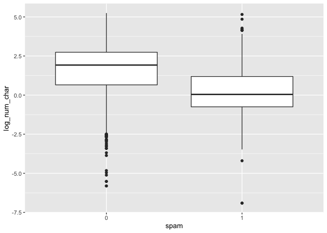<!-- -->

> ## *Question*
>
> Which of the following interpretations of the plot is valid?<br> <br>
> ⬜ The shortest email in this dataset was not spam.<br> ✅ The median
> length of not-spam emails is greater than that of spam emails.<br> ⬜
> The IQR of email length of spam is greater than that of not-spam.<br>

### Spam and !!!

Let’s look at a more obvious indicator of spam: exclamation marks.
`exclaim_mess` contains the number of exclamation marks in each message.
Using summary statistics and visualization, see if there is a
relationship between this variable and whether or not a message is spam.

Experiment with different types of plots until you find one that is the
most informative. Recall that you’ve seen:

-   Side-by-side box plots
-   Faceted histograms
-   Overlaid density plots

**Steps**

1.  Calculate appropriate measures of the center and spread of
    `exclaim_mess` for both spam and not-spam using `group_by()` and
    `summarize()`.

``` r
# Compute center and spread for exclaim_mess by spam
email %>%
    group_by(spam) %>%
    summarise(mean(exclaim_mess),
              sd(exclaim_mess))
```

    ## # A tibble: 2 × 3
    ##   spam  `mean(exclaim_mess)` `sd(exclaim_mess)`
    ##   <fct>                <dbl>              <dbl>
    ## 1 0                     6.51               47.6
    ## 2 1                     7.32               79.9

2.  Construct an appropriate plot to visualize the association between
    the same two variables, adding in a log-transformation step if
    necessary.
3.  If you decide to use a log transformation, remember that `log(0)` is
    `-Inf` in R, which isn’t a very useful value! You can get around
    this by adding a small number (like `0.01`) to the quantity inside
    the `log()` function. This way, your value is never zero. This small
    shift to the right won’t affect your results.

``` r
# Create plot for spam and exclaim_mess
email %>%
    mutate(log_exclaim_mess = log(exclaim_mess + 0.01)) %>%
    ggplot(aes(x = log_exclaim_mess, fill = spam)) +
    geom_density(alpha = 0.3)
```

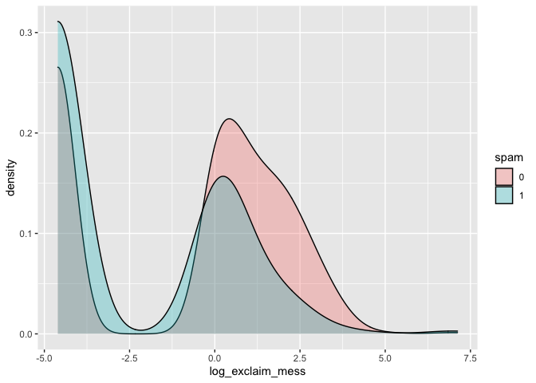<!-- -->

``` r
email %>%
  mutate(spam = spam |> fct_recode(`not-spam` = "0", spam = "1")) |> 
  mutate(log_exclaim_mess = log(exclaim_mess + 0.01)) |> 
  ggplot(aes(x = log_exclaim_mess)) +
  geom_histogram(binwidth = 0.4) +
  facet_wrap(~spam)
```

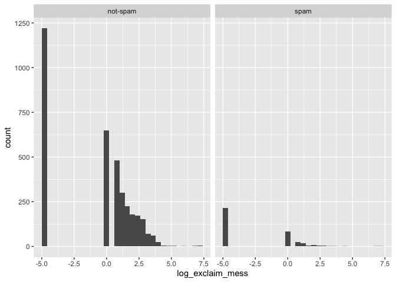<!-- -->

> ## *Question*
>
> Which interpretation of these faceted histograms **is not**
> correct?<br> <br> ⬜ The most common value of exclaim_mess in both
> classes of email is zero (a log(exclaim_mess) of -4.6 after adding
> .01).<br> ✅ There are more cases of spam in this dataset than
> not-spam.<br> ⬜ Even after a transformation, the distribution of
> exclaim_mess in both classes of email is right-skewed.<br> ⬜ The
> typical number of exclamations in the not-spam group appears to be
> slightly higher than in the spam group.<br>

### Collapsing levels

If it was difficult to work with the heavy skew of `exclaim_mess`, the
number of images attached to each email (`image`) poses even more of a
challenge. Run the following code at the console to get a sense of its
distribution:

``` r
table(email$image)
```

    ## 
    ##    0    1    2    3    4    5    9   20 
    ## 3811   76   17   11    2    2    1    1

Recall that this tabulates the number of cases in each category (so
there were 3811 emails with 0 images, for example). Given the very low
counts at the higher number of images, let’s collapse `image` into a
categorical variable that indicates whether or not the email had at
least one image. In this exercise, you’ll create this new variable and
explore its association with spam.

**Steps**

Starting with `email`, form a continuous chain that links together the
following tasks:

1.  Create a new variable called `has_image` that is `TRUE` where the
    number of images is greater than zero and `FALSE` otherwise.
2.  Create an appropriate plot with `email` to visualize the
    relationship between `has_image` and `spam`.

**Solution:**

``` r
# Create plot of proportion of spam by image
email %>%
  mutate(spam = spam |> fct_recode(`not-spam` = "0", spam = "1")) |> 
  mutate(has_image = image > 0) %>%
  ggplot(aes(x = has_image, fill = spam)) +
  geom_bar(position = "fill")
```

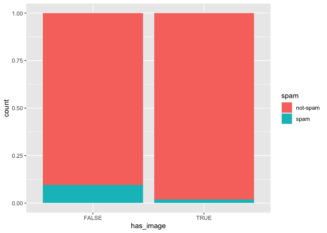<!-- -->

> ## *Question*
>
> Which of the following interpretations of the plot **is** valid?<br>
> <br> ⬜ There are more emails with images than without images.<br> ⬜
> Emails with images have a higher proportion that are spam than do
> emails without images.<br> ✅ An email without an image is more likely
> to be not-spam than spam.<br>

### Data Integrity

In the process of exploring a dataset, you’ll sometimes come across
something that will lead you to question how the data were compiled. For
example, the variable `num_char` contains the number of characters in
the email, in thousands, so it could take decimal values, but it
certainly shouldn’t take negative values.

You can formulate a test to ensure this variable is behaving as we
expect:

``` r
email$num_char < 0
```

If you run this code at the console, you’ll get a long vector of logical
values indicating for each case in the dataset whether that condition is
`TRUE`. Here, the first 1000 values all appear to be `FALSE`. To verify
that *all* of the cases indeed have non-negative values for `num_char`,
we can take the *sum* of this vector:

``` r
sum(email$num_char < 0)
```

    ## [1] 0

This is a handy shortcut. When you do arithmetic on logical values, R
treats `TRUE` as `1` and `FALSE` as `0`. Since the sum over the whole
vector is zero, you learn that every case in the dataset took a value of
`FALSE` in the test. That is, the `num_char` column is behaving as we
expect and taking only non-negative values.

**Steps**

Consider the variables `image` and `attach`. You can read about them
with `?email`, but the help file is ambiguous: do attached images count
as attached files in this dataset?

Design a simple test to determine if images count as attached files.
This involves creating a logical condition to compare the values of the
two variables, then using `sum()` to assess every case in the dataset.
Recall that the logical operators are `<` for *less than*, `<=` for
*less than or equal to*, `>` for *greater than*, `>=` for *greater than
or equal to*, and `==` for *equal to*.

``` r
# Test if images count as attachments
sum(email$attach < email$image)
```

    ## [1] 0

### Answering questions with chains

When you have a specific question about a dataset, you can find your way
to an answer by carefully constructing the appropriate chain of R code.
For example, consider the following question: “Within non-spam emails,
is the typical length of emails shorter for those that were sent to
multiple people?”

This can be answered with the following chain:

``` r
email %>%
   mutate(spam = spam |> fct_recode(`not-spam` = "0", spam = "1")) |> 
   filter(spam == "not-spam") %>%
   group_by(to_multiple) %>%
   summarize(median(num_char))
```

    ## # A tibble: 2 × 2
    ##   to_multiple `median(num_char)`
    ##   <fct>                    <dbl>
    ## 1 0                         7.20
    ## 2 1                         5.36

The code makes it clear that you are using `num_char` to measure the
length of an email and `median()` as the measure of what is typical. If
you run this code, you’ll learn that the answer to the question is
“yes”: the typical length of non-spam sent to multiple people is a bit
lower than those sent to only one person.

This chain concluded with summary statistics, but others might end in a
plot; it all depends on the question that you’re trying to answer.

**Steps**

Build a chain to answer each of the following questions, both about the
variable `dollar`.

1.  For emails containing the word “dollar”, does the typical spam email
    contain a greater number of occurrences of the word than the typical
    non-spam email? Create a summary statistic that answers this
    question.

``` r
# Question 1
email %>%
  mutate(spam = spam |> fct_recode(`not-spam` = "0", spam = "1")) |> 
  filter(dollar > 0) %>%
  group_by(spam) %>%
  summarize(median(dollar))
```

    ## # A tibble: 2 × 2
    ##   spam     `median(dollar)`
    ##   <fct>               <dbl>
    ## 1 not-spam                4
    ## 2 spam                    2

2.  If you encounter an email with greater than 10 occurrences of the
    word `dollar`, is it more likely to be spam or not-spam? Create a
    barchart that answers this question.

``` r
# Question 2
email %>%
  mutate(spam = spam |> fct_recode(`not-spam` = "0", spam = "1")) |> 
  filter(dollar > 10) %>%
  ggplot(aes(x = spam)) +
  geom_bar()
```

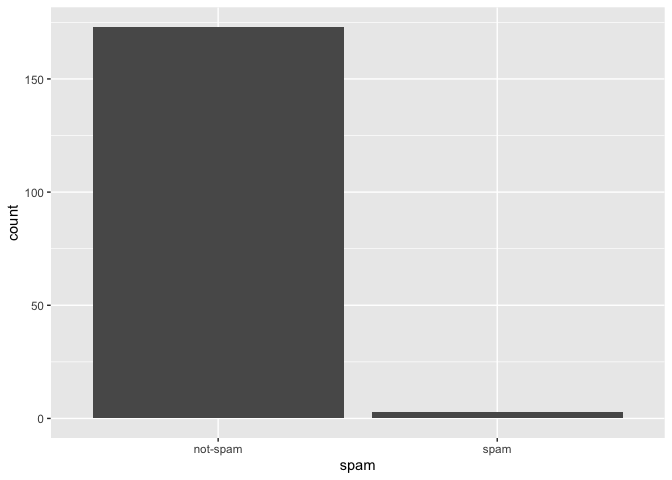<!-- -->

### What’s in a number?

Turn your attention to the variable called `number`. Read more about it
by pulling up the help file with `?email`.

To explore the association between this variable and `spam`, select and
construct an informative plot. For illustrating relationships between
categorical variables, you’ve seen

-   Faceted barcharts
-   Side-by-side barcharts
-   Stacked and normalized barcharts.

Let’s practice constructing a faceted barchart.

**Steps**

1.  Reorder the levels of `number` so that they preserve the natural
    ordering of `"none"`, then `"small"`, then `"big"`, saving to a
    `number_reordered` column.
2.  Construct a faceted barchart of the association between `number` and
    `spam`.

``` r
# Reorder levels
# base r
# email$number_reordered <- factor(email$number, levels = c("none", "small", "big"))

# forcats
email |> 
  mutate(spam = spam |> fct_recode(`not-spam` = "0", spam = "1")) |> 
  mutate(number_reordered = number |> fct_relevel(levels = "none", "small", "big")) |> 

  # Construct plot of number_reordered
  ggplot(aes(x = number_reordered, fill = spam)) +
    geom_bar() +
    facet_wrap(~spam)
```

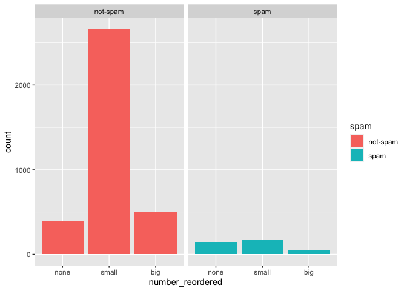<!-- -->

> ## *Question*
>
> Which of the following interpretations of the plot **is not**
> valid?<br> <br> ⬜ Given that an email contains a small number, it is
> more likely to be not-spam.<br> ✅ Given that an email contains no
> number, it is more likely to be spam.<br> ⬜ Given that an email
> contains a big number, it is more likely to be not-spam.<br> ⬜ Within
> both spam and not-spam, the most common number is a small one.<br>
