Intermediate Regression in R
================
Joschka Schwarz

-   [1. Parallel Slopes](#1-parallel-slopes)
    -   [Parallel slopes linear
        regression](#parallel-slopes-linear-regression)
    -   [Fitting a parallel slopes linear
        regression](#fitting-a-parallel-slopes-linear-regression)
    -   [Interpreting parallel slopes
        coefficients](#interpreting-parallel-slopes-coefficients)
    -   [Visualizing each explanatory
        variable](#visualizing-each-explanatory-variable)
    -   [Visualizing parallel slopes](#visualizing-parallel-slopes)
    -   [Predicting parallel slopes](#predicting-parallel-slopes)
    -   [Predicting with a parallel slopes
        model](#predicting-with-a-parallel-slopes-model)
    -   [Manually calculating
        predictions](#manually-calculating-predictions)
    -   [Assessing model performance](#assessing-model-performance)
    -   [Comparing coefficients of
        determination](#comparing-coefficients-of-determination)
    -   [Comparing residual standard
        error](#comparing-residual-standard-error)
-   [2. Interactions](#2-interactions)
    -   [Models for each category](#models-for-each-category)
    -   [One model per category](#one-model-per-category)
    -   [Predicting multiple models](#predicting-multiple-models)
    -   [Visualizing multiple models](#visualizing-multiple-models)
    -   [Assessing model performance](#assessing-model-performance-1)
    -   [One model with an interaction](#one-model-with-an-interaction)
    -   [Specifying an interaction](#specifying-an-interaction)
    -   [Interactions with understandable
        coeffs](#interactions-with-understandable-coeffs)
    -   [Making predictions with
        interactions](#making-predictions-with-interactions)
    -   [Predicting with interactions](#predicting-with-interactions)
    -   [Manually calculating predictions with
        interactions](#manually-calculating-predictions-with-interactions)
    -   [Simpson’s Paradox](#simpsons-paradox)
    -   [Modeling eBay auctions](#modeling-ebay-auctions)
    -   [Modeling each auction type](#modeling-each-auction-type)
-   [3. Multiple Linear Regression](#3-multiple-linear-regression)
    -   [Two numeric explanatory
        variables](#two-numeric-explanatory-variables)
    -   [3D visualizations](#3d-visualizations)
    -   [Modeling 2 numeric explanatory
        variables](#modeling-2-numeric-explanatory-variables)
    -   [Including an interaction](#including-an-interaction)
    -   [More than 2 explanatory
        variables](#more-than-2-explanatory-variables)
    -   [Visualizing many variables](#visualizing-many-variables)
    -   [Different levels of
        interaction](#different-levels-of-interaction)
    -   [Predicting again](#predicting-again)
    -   [How linear regression works](#how-linear-regression-works)
    -   [The sum of squares](#the-sum-of-squares)
    -   [Linear regression algorithm](#linear-regression-algorithm)
-   [4. Multiple Logistic Regression](#4-multiple-logistic-regression)
    -   [Multiple logistic regression](#multiple-logistic-regression)
    -   [Visualizing multiple explanatory
        variables](#visualizing-multiple-explanatory-variables)
    -   [Logistic regression with 2 explanatory
        variables](#logistic-regression-with-2-explanatory-variables)
    -   [Logistic regression
        prediction](#logistic-regression-prediction)
    -   [Confusion matrix](#confusion-matrix)
    -   [The logistic distribution](#the-logistic-distribution)
    -   [Cumulative distribution
        function](#cumulative-distribution-function)
    -   [Inverse cumulative distribution
        function](#inverse-cumulative-distribution-function)
    -   [binomial family argument](#binomial-family-argument)
    -   [Logistic distribution
        parameters](#logistic-distribution-parameters)
    -   [How logistic regression works](#how-logistic-regression-works)
    -   [Likelihood & log-likelihood](#likelihood--log-likelihood)
    -   [Logistic regression algorithm](#logistic-regression-algorithm)

**Short Description**

Learn to perform linear and logistic regression with multiple
explanatory variables.

**SEO Description**

Discover how to include multiple explanatory variables in a model, how
interactions affect predictions, and how linear and logistic regression
work in R.

**Long Description**

Linear regression and logistic regression are the two most widely used
statistical models and act like master keys, unlocking the secrets
hidden in datasets. This course builds on the skills you gained in
“Introduction to Regression in R”, covering linear and logistic
regression with multiple explanatory variables. Through hands-on
exercises, you’ll explore the relationships between variables in
real-world datasets, Taiwan house prices and customer churn modeling,
and more. By the end of this course, you’ll know how to include multiple
explanatory variables in a model, understand how interactions between
variables affect predictions, and understand how linear and logistic
regression work.

# 1. Parallel Slopes

Extend your linear regression skills to “parallel slopes” regression,
with one numeric and one categorical explanatory variable. This is the
first step towards conquering multiple linear regression.

## Parallel slopes linear regression

Theory. Coming soon …

## Fitting a parallel slopes linear regression

<!-- 
LO: Fit a linear regression model with two explanatory variables, without interactions.
-->

In
<a href="https://learn.datacamp.com/courses/introduction-to-regression-in-r">Introduction
to Regression in R</a>, you learned to fit linear regression models with
a single explanatory variable. In many cases, using only one explanatory
variable limits the accuracy of predictions. That means that to truly
master linear regression, you need to be able to include multiple
explanatory variables.

The case when there is one numeric explanatory variable and one
categorical explanatory variable is sometimes called a “parallel slopes”
linear regression due to the shape of the predictions – more on that in
the next exercise.

Here, you’ll revisit the Taiwan real estate dataset. Recall the meaning
of each variable.

| Variable                | Meaning                                                             |
|:------------------------|:--------------------------------------------------------------------|
| `dist_to_mrt_station_m` | Distance to nearest MRT metro station, in meters.                   |
| `n_convenience`         | No. of convenience stores in walking distance.                      |
| `house_age_years`       | The age of the house, in years, in 3 groups.                        |
| `price_twd_msq`         | House price per unit area, in New Taiwan dollars per meter squared. |

`taiwan_real_estate` is available.

**Steps**

1.  Using the `taiwan_real_estate` dataset, model the house price (in
    TWD per square meter) versus the number of nearby convenience
    stores.

``` r
# Load packages
library(fst)
library(tibble)

# Load data
taiwan_real_estate <- read_fst("data/taiwan_real_estate2.fst") |> as_tibble()

# Fit a linear regr'n of price_twd_msq vs. n_convenience
mdl_price_vs_conv <- lm(price_twd_msq ~ n_convenience, data = taiwan_real_estate)

# See the result
mdl_price_vs_conv
```

    ## 
    ## Call:
    ## lm(formula = price_twd_msq ~ n_convenience, data = taiwan_real_estate)
    ## 
    ## Coefficients:
    ##   (Intercept)  n_convenience  
    ##        8.2242         0.7981

2.  Model the house price (in TWD per square meter) versus the house age
    (in years). Don’t include an intercept term.

``` r
# Fit a linear regr'n of price_twd_msq vs. house_age_years, no intercept
mdl_price_vs_age <- lm(price_twd_msq ~ house_age_years + 0, data = taiwan_real_estate)

# See the result
mdl_price_vs_age
```

    ## 
    ## Call:
    ## lm(formula = price_twd_msq ~ house_age_years + 0, data = taiwan_real_estate)
    ## 
    ## Coefficients:
    ##  house_age_years0 to 15  house_age_years15 to 30  house_age_years30 to 45  
    ##                  12.637                    9.877                   11.393

3.  Model the house price (in TWD per square meter) versus the number of
    nearby convenience stores plus the house age (in years). Don’t
    include an intercept term.

``` r
# Fit a linear regr'n of price_twd_msq vs. n_convenience 
# plus house_age_years, no intercept
mdl_price_vs_both <- lm(price_twd_msq ~ n_convenience + house_age_years + 0, data = taiwan_real_estate)

# See the result
mdl_price_vs_both
```

    ## 
    ## Call:
    ## lm(formula = price_twd_msq ~ n_convenience + house_age_years + 
    ##     0, data = taiwan_real_estate)
    ## 
    ## Coefficients:
    ##           n_convenience   house_age_years0 to 15  house_age_years15 to 30  
    ##                  0.7915                   9.4133                   7.0852  
    ## house_age_years30 to 45  
    ##                  7.5110

Perfect parallel slopes fitting! To combine multiple explanatory
variables in the regression formula, separate them with a `+`.

## Interpreting parallel slopes coefficients

<!-- 
LO: Interpret the coefficients (one slope and several intercepts) for a parallel slopes regression.
-->

For linear regression with a single numeric explanatory variable, there
is an intercept coefficient and a slope coefficient. For linear
regression with a single categorical explanatory variable, there is an
intercept coefficient for each category.

In the “parallel slopes” case, where you have a numeric and a
categorical explanatory variable, what do the coefficients mean?

`taiwan_real_estate` and `mdl_price_vs_both` are available.

> ## *Question*
>
> Look at the coefficients of `mdl_price_vs_both`. What is the meaning
> of the `n_convenience` coefficient?<br> <br> ⬜ The mean number of
> nearby convenience stores is `0.79`.<br> ⬜ For a house with zero
> nearby convenience stores, the expected house price is `0.79` TWD per
> square meter.<br> ✅ For each additional nearby convenience store, the
> expected house price, in TWD per square meter, increases by
> `0.79`.<br> ⬜ For each additional `0.79` nearby conveniences stores,
> the expected house price increases by 1 TWD per square meter.<br>

> ## *Question*
>
> What is the meaning of the `"0 to 15 years"` coefficient?<br> <br> ⬜
> For a house aged 0 to 15 years, the mean number of nearby convenience
> stores is `9.41`.<br> ✅ For a house aged 0 to 15 years with zero
> nearby convenience stores, the expected house price is `9.41` TWD per
> square meter.<br> ⬜ For each additional year of house age, the
> expected house price, in TWD per square meter, increases by
> `9.41`.<br> ⬜ For each additional `15` years of house age, the
> expected house price increases by `9.41` TWD per square meter.<br>

Insightful interpretation! The model has one slope coefficient, and
three intercept coefficients (one for each possible value of the
categorical explanatory variable).” \<- “No. House age is given as
categories – you can’t say anything about one year of house age, only
what happens in each age group.” \<- “No. House age is a categorical
variable, so the coefficients are intercept coefficients, not slope
coefficients.

## Visualizing each explanatory variable

<!-- 
LO: Draw a scatter plot with a linear regession trend line, and a box plot.
-->

Being able to see the predictions made by a model makes it easier to
understand. In the case where there is only one explanatory variable,
ggplot lets you do this without any manual calculation or messing about.

To visualize the relationship between a numeric explanatory variable and
the numeric response, you can draw a scatter plot with a linear trend
line.

To visualize the relationship between a categorical explanatory variable
and the numeric response, you can draw a box plot.

`taiwan_real_estate` is available and `ggplot2` is loaded.

**Steps**

1.  Using the `taiwan_real_estate` dataset, plot the house price versus
    the number of nearby convenience stores.
2.  Make it a scatter plot.
3.  Add a smooth linear regression trend line without a standard error
    ribbon.

``` r
# Load packages
library(ggplot2)

# Using taiwan_real_estate, plot price_twd_msq vs. n_convenience
ggplot(taiwan_real_estate, aes(n_convenience, price_twd_msq)) +
  # Add a point layer
  geom_point() +
  # Add a smooth trend line using linear regr'n, no ribbon
  geom_smooth(method = "lm", se = FALSE)
```

    ## `geom_smooth()` using formula 'y ~ x'

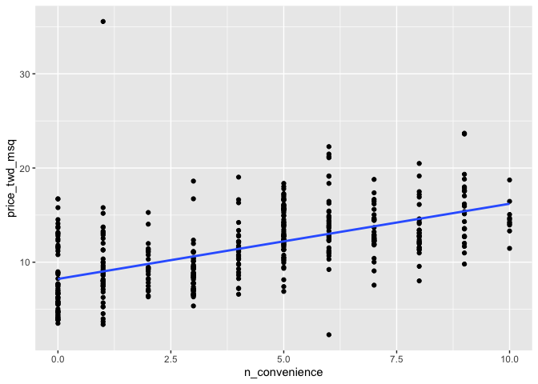<!-- -->

4.  Using the `taiwan_real_estate` dataset, plot the house price versus
    the house age.
5.  Make it a box plot.

``` r
# Using taiwan_real_estate, plot price_twd_msq vs. house_age_years
ggplot(taiwan_real_estate, aes(house_age_years, price_twd_msq)) +
  # Add a box plot layer
  geom_boxplot()
```

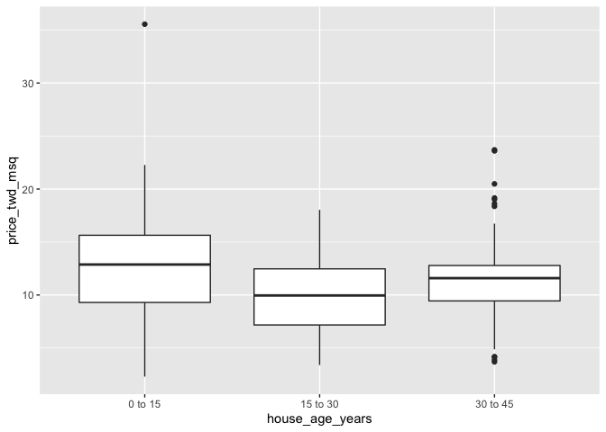<!-- -->

Veracious visualizing! With a single numeric explanatory variable, the
predictions form a single straight line. With a single categorical
explanatory variable, the predictions are the means for each category.

## Visualizing parallel slopes

<!-- 
LO: Draw a scatter plot with parallel slope predictions.
-->

The two plots in the previous exercise gave very different predictions:
one gave a predicted response that increased linearly with a numeric
variable; the other gave a fixed response for each category. The only
sensible way to reconcile these two conflicting predictions is to
incorporate both explanatory variables in the model at once.

When it comes to a linear regression model with a numeric and a
categorical explanatory variable, `ggplot2` doesn’t have an easy, “out
of the box” way to show the predictions. Fortunately, the `moderndive`
package includes an extra geom, `geom_parallel_slopes()` to make it
simple.

`taiwan_real_estate` is available; `ggplot2` and `moderndive` are
loaded.

**Steps**

1.  Using the `taiwan_real_estate` dataset, plot house prices versus the
    number of nearby convenience stores, colored by house age.
2.  Make it a scatter plot.
3.  Add parallel slopes, without a standard error ribbon.

``` r
# Load packages
library(moderndive)

# Using taiwan_real_estate, plot price_twd_msq vs. n_convenience
# colored by house_age_years
ggplot(taiwan_real_estate, aes(n_convenience, price_twd_msq, color = house_age_years)) +
  # Add a point layer
  geom_point() +
  # Add parallel slopes, no ribbon
  geom_parallel_slopes(se = FALSE)
```

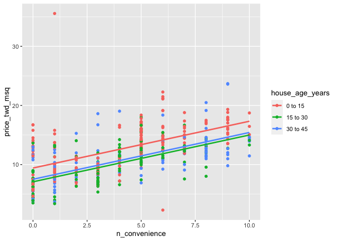<!-- -->

Parallel slope paradise! The “parallel slope” model name comes from the
fact that the prediction for each category is a slope, and all those
slopes are parallel.

## Predicting parallel slopes

Theory. Coming soon …

## Predicting with a parallel slopes model

<!-- 
LO: Make predictions with multiple explanatory variables.
-->

While ggplot can automatically show you model predictions, in order to
get those values to program with, you’ll need to do the calculations
yourself.

Just as with the case of a single explanatory variable, the workflow has
two steps: create a data frame of explanatory variables, then add a
column of predictions. To make sure you’ve got the right answer, you can
add your predictions to the ggplot with the `geom_parallel_slopes()`
lines.

`taiwan_real_estate` and `mdl_price_vs_both` are available; `dplyr`,
`tidyr`, and `ggplot2` are loaded.

**Steps**

1.  Make a grid of explanatory data, formed from combinations of the
    following variables.

2.  `n_convenience` should take the numbers zero to ten.

3.  `house_age_years` should take the unique values of the
    `house_age_years` column of `taiwan_real_estate`.

``` r
# Load packages
library(tidyr)

# Make a grid of explanatory data
explanatory_data <- expand_grid(
  # Set n_convenience to zero to ten
  n_convenience = 0:10,
  # Set house_age_years to the unique values of that variable
  house_age_years = unique(taiwan_real_estate$house_age_years)
)

# See the result
explanatory_data
```

    ## # A tibble: 33 × 2
    ##    n_convenience house_age_years
    ##            <int> <fct>          
    ##  1             0 30 to 45       
    ##  2             0 15 to 30       
    ##  3             0 0 to 15        
    ##  4             1 30 to 45       
    ##  5             1 15 to 30       
    ##  6             1 0 to 15        
    ##  7             2 30 to 45       
    ##  8             2 15 to 30       
    ##  9             2 0 to 15        
    ## 10             3 30 to 45       
    ## # … with 23 more rows

4.  Add a column to the `explanatory_data` named for the response
    variable, assigning to `prediction_data`.
5.  The response column contain predictions made using
    `mdl_price_vs_both` and `explanatory_data`.

``` r
# Load packages
library(dplyr)
```

    ## 
    ## Attaching package: 'dplyr'

    ## The following objects are masked from 'package:stats':
    ## 
    ##     filter, lag

    ## The following objects are masked from 'package:base':
    ## 
    ##     intersect, setdiff, setequal, union

``` r
# From previous step
explanatory_data <- expand_grid(
  n_convenience = 0:10,
  house_age_years = unique(taiwan_real_estate$house_age_years)
)

# Add predictions to the data frame
prediction_data <- explanatory_data %>% 
  mutate(
    price_twd_msq = predict(mdl_price_vs_both, explanatory_data)
  )

# See the result
prediction_data
```

    ## # A tibble: 33 × 3
    ##    n_convenience house_age_years price_twd_msq
    ##            <int> <fct>                   <dbl>
    ##  1             0 30 to 45                 7.51
    ##  2             0 15 to 30                 7.09
    ##  3             0 0 to 15                  9.41
    ##  4             1 30 to 45                 8.30
    ##  5             1 15 to 30                 7.88
    ##  6             1 0 to 15                 10.2 
    ##  7             2 30 to 45                 9.09
    ##  8             2 15 to 30                 8.67
    ##  9             2 0 to 15                 11.0 
    ## 10             3 30 to 45                 9.89
    ## # … with 23 more rows

6.  Update the plot to add a point layer of predictions. Use the
    `prediction_data`, set the point size to 5, and the point shape to
    15.

``` r
# From previous steps
explanatory_data <- expand_grid(
  n_convenience = 0:10,
  house_age_years = unique(taiwan_real_estate$house_age_years)
)
prediction_data <- explanatory_data %>% 
  mutate(
    price_twd_msq = predict(mdl_price_vs_both, explanatory_data)
  )

taiwan_real_estate %>% 
  ggplot(aes(n_convenience, price_twd_msq, color = house_age_years)) +
  geom_point() +
  geom_parallel_slopes(se = FALSE) +
  # Add points using prediction_data, with size 5 and shape 15
  geom_point(data = prediction_data, size = 5, shape = 15)
```

<!-- -->

Excellent grid expansion of explanatory variables! The workflow for
making predictions with multiple explanatory variables is the same as
for a single variable, except that you can use `expand_grid()` to get a
more complete set of predictions.

## Manually calculating predictions

<!-- 
LO: Can calculate parallel slopes linear regression predictions manually.
-->

As with simple linear regression, you can manually calculate the
predictions from the model coefficients. The only change for the
parallel slopes case is that the intercept is different for each
category of the categorical explanatory variable. That means you need to
consider the case when each each category occurs separately.

`taiwan_real_estate`, `mdl_price_vs_both`, and `explanatory_data` are
available; `dplyr` is loaded.

**Steps**

1.  Get the coefficients from `mdl_price_vs_both`, assigning to
    `coeffs`.
2.  Assign each of the elements of `coeffs` to the appropriate variable.

``` r
# Get the coefficients from mdl_price_vs_both
coeffs <- coefficients(mdl_price_vs_both)

# Extract the slope coefficient
slope <- coeffs[1]

# Extract the intercept coefficient for 0 to 15
intercept_0_15 <- coeffs[2]

# Extract the intercept coefficient for 15 to 30
intercept_15_30 <- coeffs[3]

# Extract the intercept coefficient for 30 to 45
intercept_30_45 <- coeffs[4]
```

3.  Add columns to `explanatory_data`.

4.  To choose the `intercept`, in the case when `house_age_years` is
    `"0 to 15"`, choose `intercept_0_15`. In the case when
    `house_age_years` is `"15 to 30"`, choose `intercept_15_30`. Do
    likewise for `"30 to 45"`.

5.  Manually calculate the predictions as the intercept plus the slope
    times `n_convenience`.

``` r
# From previous step
coeffs <- coefficients(mdl_price_vs_both)
slope <- coeffs[1]
intercept_0_15 <- coeffs[2]
intercept_15_30 <- coeffs[3]
intercept_30_45 <- coeffs[4]

prediction_data <- explanatory_data %>% 
  mutate(
    # Consider the 3 cases to choose the intercept
    intercept = case_when(
      house_age_years == "0 to 15" ~ intercept_0_15,
      house_age_years == "15 to 30" ~ intercept_15_30,
      house_age_years == "30 to 45" ~ intercept_30_45 
    ),
    # Manually calculate the predictions
    price_twd_msq = intercept + slope * n_convenience
  )

# See the results
prediction_data
```

    ## # A tibble: 33 × 4
    ##    n_convenience house_age_years intercept price_twd_msq
    ##            <int> <fct>               <dbl>         <dbl>
    ##  1             0 30 to 45             7.51          7.51
    ##  2             0 15 to 30             7.09          7.09
    ##  3             0 0 to 15              9.41          9.41
    ##  4             1 30 to 45             7.51          8.30
    ##  5             1 15 to 30             7.09          7.88
    ##  6             1 0 to 15              9.41         10.2 
    ##  7             2 30 to 45             7.51          9.09
    ##  8             2 15 to 30             7.09          8.67
    ##  9             2 0 to 15              9.41         11.0 
    ## 10             3 30 to 45             7.51          9.89
    ## # … with 23 more rows

This is the case when you’ve succeeded! Even for more complicated linear
regression models, the prediction just involve adding and multiplying
coefficients for different cases of explanatory variables.

## Assessing model performance

Theory. Coming soon …

## Comparing coefficients of determination

<!-- 
LO: Understands that using multiple explanatory variables can increase the coefficient of determination, providing a better fit.
-->

Recall that the coefficient of determination is a measure of how well
the linear regression line fits the observed values. An important
motivation for including several explanatory variables in a linear
regression is that you can improve the fit compared to considering only
a single explanatory variable.

Here you’ll compare the coefficient of determination for the three
Taiwan house price models, to see which gives the best result.

`mdl_price_vs_conv`, `mdl_price_vs_age`, and `mdl_price_vs_both` are
available; `dplyr` and `broom` are loaded.

**Steps**

1.  Get the unadjusted and adjusted coefficients of determination for
    `mdl_price_vs_conv` by glancing at the model, then selecting the
    `r.squared` and `adj.r.squared` values.
2.  Do the same for `mdl_price_vs_age` and `mdl_price_vs_both`.

``` r
# Load packages
library(broom)

mdl_price_vs_conv %>% 
  # Get the model-level coefficients
  glance() %>% 
  # Select the coeffs of determination
  select(r.squared, adj.r.squared)
```

    ## # A tibble: 1 × 2
    ##   r.squared adj.r.squared
    ##       <dbl>         <dbl>
    ## 1     0.326         0.324

``` r
# Get the coeffs of determination for mdl_price_vs_age
mdl_price_vs_age %>% 
  glance() %>% 
  select(r.squared, adj.r.squared)
```

    ## # A tibble: 1 × 2
    ##   r.squared adj.r.squared
    ##       <dbl>         <dbl>
    ## 1     0.896         0.895

``` r
# Get the coeffs of determination for mdl_price_vs_both
mdl_price_vs_both %>% 
  glance() %>% 
  select(r.squared, adj.r.squared)
```

    ## # A tibble: 1 × 2
    ##   r.squared adj.r.squared
    ##       <dbl>         <dbl>
    ## 1     0.931         0.931

> ## *Question*
>
> Which model does the adjusted coefficient of determination suggest
> gives a better fit?<br> <br> ⬜ `mdl_price_vs_conv`.<br> ⬜
> `mdl_price_vs_age`.<br> ✅ `mdl_price_vs_both`.<br> ⬜ All models are
> equally good.<br> ⬜ Adjusted coefficient of determination doesn’t
> measure the goodness of fit of a regression model.<br>

Magnificent model metric comparing! When both explanatory variables are
included in the model, the adjusted coefficient of determination is
higher, resulting in a better fit.” \<- “No. The adjusted coefficient of
determination values for the models are different, so one gives a closer
fit than the other.” \<- “No. Adjusted coefficient of determination does
measure the goodness of fit.

## Comparing residual standard error

<!--
LO: Understand that including multiple explanatory variables can lower the RSE, improving the fit.
-->

The other common metric for assessing model fit is the residual standard
error (RSE), which measures the typical size of the residuals.

In the last exercise you saw how including both explanatory variables
into the model increased the coefficient of determination. How do you
think using both explanatory variables will change the RSE?

`mdl_price_vs_conv`, `mdl_price_vs_age`, and `mdl_price_vs_both` are
available; `dplyr` and `broom` are loaded.

**Steps**

1.  Get the residual standard error for `mdl_price_vs_conv` by glancing
    at the model, then pulling the `sigma` value.
2.  Do the same for `mdl_price_vs_age`.
3.  Do the same for `mdl_price_vs_both`.

``` r
mdl_price_vs_conv %>% 
  # Get the model-level coefficients
  glance() %>% 
  # Pull out the RSE
  pull(sigma)
```

    ## [1] 3.383888

``` r
# Get the RSE for mdl_price_vs_age
mdl_price_vs_age %>% 
  glance() %>% 
  pull(sigma)
```

    ## [1] 3.950184

``` r
# Get the RSE for mdl_price_vs_both
mdl_price_vs_both %>% 
  glance() %>% 
  pull(sigma)
```

    ## [1] 3.21346

> ## *Question*
>
> Which model does the RSE suggest gives more accurate predictions?<br>
> <br> ⬜ `mdl_price_vs_conv`.<br> ⬜ `mdl_price_vs_age`.<br> ✅
> `mdl_price_vs_both`.<br> ⬜ Both models are equally good.<br> ⬜ RSE
> doesn’t measure the accuracy of a regression model.<br>

Resplendent use of RSE! By including both explanatory variables in the
model, a lower RSE was achieved, indicating a smaller difference between
the predicted responses and the actual responses.” \<- “No. The RSE
values for the models are different, so one gives more accurate
predictions than the other.” \<- “No. RSE does measure the accuracy of
predictions.

# 2. Interactions

Explore the effect of interactions between explanatory variables.
Considering interactions allows for more realistic models that can have
better predictive power. You'll also deal with Simpson's Paradox: a
non-intuitive result that arises when you have multiple explanatory
variables.

## Models for each category

Theory. Coming soon …

## One model per category

<!-- 
LO: {{This is mostly setup for the next two exercises, so not much learning.}} Can create a model for each category of a categorical variable.
-->

The model you ran on the whole dataset fits some parts of the data
better than others. It’s worth taking a look at what happens when you
run a linear model on different parts of the dataset separately, to see
if each model agrees or disagrees with the others.

`taiwan_real_estate` is available; `dplyr` is loaded.

**Steps**

1.  Filter `taiwan_real_estate` for rows where `house_age_years` is
    `"0 to 15"`, assigning to `taiwan_0_to_15`.
2.  Repeat this for the `"15 to 30"` and `"30 to 45"` house age
    categories.

``` r
# Filter for rows where house age is 0 to 15 years
taiwan_0_to_15 <- taiwan_real_estate %>%
  filter(house_age_years == "0 to 15")

# Filter for rows where house age is 15 to 30 years
taiwan_15_to_30 <- taiwan_real_estate %>%
  filter(house_age_years == "15 to 30")

# Filter for rows where house age is 30 to 45 years
taiwan_30_to_45 <- taiwan_real_estate %>%
  filter(house_age_years == "30 to 45")
```

3.  Run a linear regression of `price_twd_msq` versus `n_convenience`
    using the `taiwan_0_to_15` dataset.
4.  Repeat this for `taiwan_15_to_30` and `taiwan_30_to_45`.

``` r
# From previous step
taiwan_0_to_15 <- taiwan_real_estate %>%
  filter(house_age_years == "0 to 15")
taiwan_15_to_30 <- taiwan_real_estate %>%
  filter(house_age_years == "15 to 30")
taiwan_30_to_45 <- taiwan_real_estate %>%
  filter(house_age_years == "30 to 45")

# Model price vs. no. convenience stores using 0 to 15 data
mdl_0_to_15 <- lm(price_twd_msq ~ n_convenience, data = taiwan_0_to_15)

# Model price vs. no. convenience stores using 15 to 30 data
mdl_15_to_30 <- lm(price_twd_msq ~ n_convenience, data = taiwan_15_to_30)

# Model price vs. no. convenience stores using 30 to 45 data
mdl_30_to_45 <- lm(price_twd_msq ~ n_convenience, data = taiwan_30_to_45)

# See the results
mdl_0_to_15
```

    ## 
    ## Call:
    ## lm(formula = price_twd_msq ~ n_convenience, data = taiwan_0_to_15)
    ## 
    ## Coefficients:
    ##   (Intercept)  n_convenience  
    ##        9.2417         0.8336

``` r
mdl_15_to_30
```

    ## 
    ## Call:
    ## lm(formula = price_twd_msq ~ n_convenience, data = taiwan_15_to_30)
    ## 
    ## Coefficients:
    ##   (Intercept)  n_convenience  
    ##        6.8719         0.8519

``` r
mdl_30_to_45
```

    ## 
    ## Call:
    ## lm(formula = price_twd_msq ~ n_convenience, data = taiwan_30_to_45)
    ## 
    ## Coefficients:
    ##   (Intercept)  n_convenience  
    ##        8.1131         0.6687

Multiple model magic! You now have three models giving three different
answers. Let’s visualize the differences, then figure out how to
reconcile the differences.

## Predicting multiple models

<!-- 
LO: Make predictions from a simple linear regression model.
-->

In order to see what each of the models for individual categories are
doing, it’s helpful to make predictions from them. The flow is exactly
the same as the flow for making predictions on the whole model, though
remember that you only have a single explanatory variable in these
models (so `expand_grid()` isn’t needed.)

The models `mdl_0_to_15`, `mdl_15_to_30` and `mdl_30_to_45` are
available; `dplyr` is loaded.

**Steps**

1.  Create a tibble of explanatory data, setting `n_convenience` to a
    vector from zero to ten, assigning to `explanatory_data_0_to_15`.

``` r
# Create a tibble of explanatory data, setting
# no. of conv stores to 0 to 10
explanatory_data <- tibble(
  n_convenience = 0:10
)
```

2.  Add a column of predictions named `price_twd_msq` to
    `explanatory_data`, using `mdl_0_to_15` and `explanatory_data`.
    Assign to `prediction_data_0_to_15`.
3.  Repeat this for the 15 to 30 year and 30 to 45 year house age
    categories.

``` r
# From previous step
explanatory_data <- tibble(
  n_convenience = 0:10
)

# Add column of predictions using "0 to 15" model and explanatory data 
prediction_data_0_to_15 <- explanatory_data %>% 
  mutate(price_twd_msq = predict(mdl_0_to_15, explanatory_data))

# Same again, with "15 to 30"
prediction_data_15_to_30 <- explanatory_data %>% 
  mutate(price_twd_msq = predict(mdl_15_to_30, explanatory_data))

# Same again, with "30 to 45"
prediction_data_30_to_45 <- explanatory_data %>% 
  mutate(price_twd_msq = predict(mdl_30_to_45, explanatory_data))
```

Predictions, predictions, predictions! Now that you have predictions for
each model, let’s see how they compare.

## Visualizing multiple models

<!-- 
LO: Visualize multiple linear models on the same plot.
-->

In the last two exercises, you ran models for each category of house
ages separately, then calculated predictions for each model. Now it’s
time to visualize those predictions to see how they compare.

When you use `geom_smooth()` in a ggplot with an aesthetic that splits
the dataset into groups and draws a line for each group (like the
`color` aesthetic), you get multiple trend lines. This is the same as
running a model on each group separately, so we get a chance to test our
predictions against ggplot’s.

`taiwan_real_estate`, `prediction_data_0_to_15`,
`prediction_data_15_to_30`, and `prediction_data_30_to_45` are
available; `ggplot2` is loaded.

**Steps**

1.  Using `taiwan_real_estate`, plot `price_twd_msq` versus
    `n_convenience` colored by `house_age_years`.
2.  Add a point layer.
3.  Add smooth trend lines for each color using the linear regression
    method and turning off the standard error ribbon.

``` r
# Using taiwan_real_estate, plot price vs. no. of conv. stores
# colored by house age
ggplot(taiwan_real_estate, aes(n_convenience, price_twd_msq, color = house_age_years)) +
  # Make it a scatter plot
  geom_point() +
  # Add smooth linear regression trend lines, no ribbon
  geom_smooth(method = "lm", se = FALSE)
```

    ## `geom_smooth()` using formula 'y ~ x'

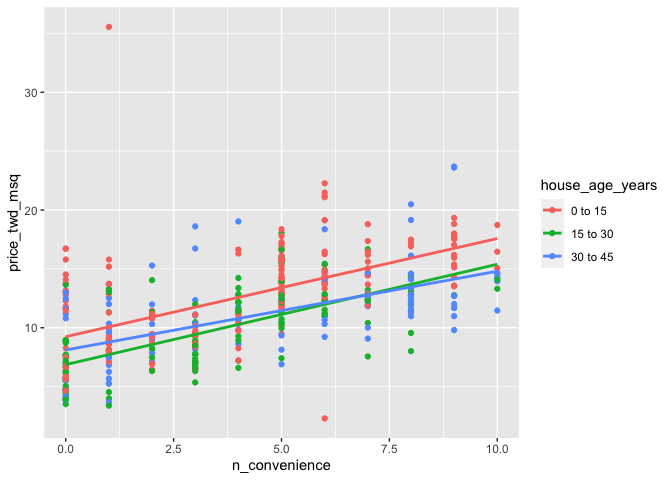<!-- -->

4.  Extend the plot by adding the prediction points from
    `prediction_data_0_to_15`. Color them red, with size 3 and shape 15.
5.  Add prediction points from `prediction_data_15_to_30`, colored
    green, size 4, and shape 15.
6.  Add prediction points from `prediction_data_30_to_45`, colored blue,
    size 4, and shape 15.

``` r
# Extend the plot to include prediction points
ggplot(taiwan_real_estate, aes(n_convenience, price_twd_msq, color = house_age_years)) +
  geom_point() +
  geom_smooth(method = "lm", se = FALSE) +
  # Add points using prediction_data_0_to_15, colored red, size 3, shape 15
  geom_point(data = prediction_data_0_to_15, color = "red", size = 3, shape = 15) +
  # Add points using prediction_data_15_to_30, colored green, size 3, shape 15
  geom_point(data = prediction_data_15_to_30, color = "green", size = 3, shape = 15) +
  # Add points using prediction_data_30_to_45, colored blue, size 3, shape 15
  geom_point(data = prediction_data_30_to_45, color = "blue", size = 3, shape = 15)
```

    ## `geom_smooth()` using formula 'y ~ x'

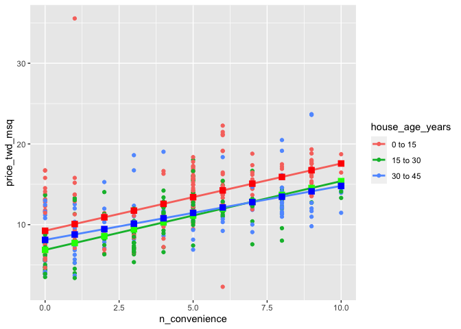<!-- -->

Three cheers for three trend lines! It’s a good sign that our
predictions match those of ggplot’s. Notice that the 30 to 45 year house
age group has a much shallower slope compared to the other lines.

## Assessing model performance

<!-- 
LO: Can extract model performance metrics from linear regression model objects.
-->

To test which approach is best – the whole dataset model or the models
for each house age category – you need to calculate some metrics.
Here’s, you’ll compare the coefficient of determination and the residual
standard error for each model.

Four models of price versus no. of convenience stores (`mdl_all_ages`,
`mdl_0_to_15`, `mdl_15_to_30`, and `mdl_30_to_45`) are available;
`dplyr` and `broom` are loaded.

**Steps**

1.  Get the coefficient of determination for `mdl_all_ages`,
    `mdl_0_to_15`, `mdl_15_to_30`, and `mdl_30_to_45`.

``` r
# Get the coeff. of determination for mdl_all_ages
mdl_all_ages <- lm(price_twd_msq ~ n_convenience, data = taiwan_real_estate)
mdl_all_ages %>% 
  glance() %>% 
  pull(r.squared)
```

    ## [1] 0.3260466

``` r
# Get the coeff. of determination for mdl_0_to_15
mdl_0_to_15 %>% 
  glance() %>% 
  pull(r.squared)
```

    ## [1] 0.3120536

``` r
# Get the coeff. of determination for mdl_15_to_30
mdl_15_to_30 %>% 
  glance() %>% 
  pull(r.squared)
```

    ## [1] 0.4424605

``` r
# Get the coeff. of determination for mdl_30_to_45
mdl_30_to_45 %>% 
  glance() %>% 
  pull(r.squared)
```

    ## [1] 0.3125713

2.  Get the residual standard error for `mdl_all_ages`, `mdl_0_to_15`,
    `mdl_15_to_30`, and `mdl_30_to_45`.

``` r
# Get the RSE for mdl_all
mdl_all_ages %>% 
  glance() %>% 
  pull(sigma)
```

    ## [1] 3.383888

``` r
# Get the RSE for mdl_0_to_15
mdl_0_to_15 %>% 
  glance() %>% 
  pull(sigma)
```

    ## [1] 3.564127

``` r
# Get the RSE for mdl_15_to_30
mdl_15_to_30 %>% 
  glance() %>% 
  pull(sigma)
```

    ## [1] 2.585273

``` r
# Get the RSE for mdl_30_to_45
mdl_30_to_45 %>% 
  glance() %>% 
  pull(sigma)
```

    ## [1] 3.239037

Meritable model metric measuring! It seems that both metrics for the 15
to 30 age group model are much better than those for the whole dataset
model, but the models for the other two age groups are similar to the
whole dataset model. Thus using individual models will improve
predictions for 15 to 30 age group.

## One model with an interaction

Theory. Coming soon …

## Specifying an interaction

<!--
LO: Specify an interaction term in a model formula using times or colon syntax.
-->

So far you used a single parallel slopes model, which gave an OK fit for
the whole dataset, then three separate models for each house age
category, which gave a better fit for each individual category, but was
clunky because you had three separate models to work with and explain.
Ideally, you’d have a single model that had all the predictive power of
the individual models.

Defining this single model is achieved through adding interactions
between explanatory variables. R’s formula syntax is flexible, and gives
you a couple of options, depending on whether you prefer concise code
that is quick to type and to read, or explicit code that describes what
you are doing in detail.

`taiwan_real_estate` is available.

**Steps**

1.  Fit a linear regression of `price_twd_msq` versus `n_convenience`
    and `house_age_years` and their interaction, using the “times”
    syntax to implicitly generate the interaction.

``` r
# Model price vs both with an interaction using "times" syntax
lm(price_twd_msq ~ n_convenience * house_age_years, data = taiwan_real_estate)
```

    ## 
    ## Call:
    ## lm(formula = price_twd_msq ~ n_convenience * house_age_years, 
    ##     data = taiwan_real_estate)
    ## 
    ## Coefficients:
    ##                           (Intercept)                          n_convenience  
    ##                               9.24170                                0.83359  
    ##               house_age_years15 to 30                house_age_years30 to 45  
    ##                              -2.36978                               -1.12858  
    ## n_convenience:house_age_years15 to 30  n_convenience:house_age_years30 to 45  
    ##                               0.01833                               -0.16489

2.  Fit a linear regression of `price_twd_msq` versus `n_convenience`
    and `house_age_years` and their interaction, using the “colon”
    syntax to explicitly generate the interaction.

``` r
# Model price vs both with an interaction using "colon" syntax
lm(
  price_twd_msq ~ n_convenience + house_age_years + n_convenience:house_age_years, 
  data = taiwan_real_estate
)
```

    ## 
    ## Call:
    ## lm(formula = price_twd_msq ~ n_convenience + house_age_years + 
    ##     n_convenience:house_age_years, data = taiwan_real_estate)
    ## 
    ## Coefficients:
    ##                           (Intercept)                          n_convenience  
    ##                               9.24170                                0.83359  
    ##               house_age_years15 to 30                house_age_years30 to 45  
    ##                              -2.36978                               -1.12858  
    ## n_convenience:house_age_years15 to 30  n_convenience:house_age_years30 to 45  
    ##                               0.01833                               -0.16489

Incredible interaction inclusion! Notice that the model coefficients are
the same in each case. The formula syntax is very flexible, giving you a
choice between ‘easy to type’ and ‘very explicit’, depending on your
preference.

## Interactions with understandable coeffs

<!--
LO: Can interpret coefficients of linear regression with interaction term.
-->

The previous model with the interaction term returned coefficients that
were a little tricky to interpret. In order clarify what the model is
predicting, you can reformulate the model in a way that returns
understandable coefficients. For further clarity, you can compare the
results to the models on the separate house age categories
(`mdl_0_to_15`, `mdl_15_to_30`, and `mdl_30_to_45`).

`taiwan_real_estate`, `mdl_0_to_15`, `mdl_15_to_30`, and `mdl_30_to_45`
are available.

**Steps**

1.  Fit a linear regression of `price_twd_msq` versus `house_age_years`
    plus an interaction between `n_convenience` and `house_age_years`,
    and no global intercept, using the `taiwan_real_estate` dataset.
2.  For comparison, get the coefficients for the three models for each
    category: `mdl_0_to_15`, `mdl_15_to_30`, and `mdl_30_to_45`.

``` r
# Model price vs. house age plus an interaction, no intercept
mdl_readable_inter <- lm(
  price_twd_msq ~ house_age_years + n_convenience:house_age_years + 0, 
  data = taiwan_real_estate
)

# See the result
mdl_readable_inter
```

    ## 
    ## Call:
    ## lm(formula = price_twd_msq ~ house_age_years + n_convenience:house_age_years + 
    ##     0, data = taiwan_real_estate)
    ## 
    ## Coefficients:
    ##                house_age_years0 to 15                house_age_years15 to 30  
    ##                                9.2417                                 6.8719  
    ##               house_age_years30 to 45   house_age_years0 to 15:n_convenience  
    ##                                8.1131                                 0.8336  
    ## house_age_years15 to 30:n_convenience  house_age_years30 to 45:n_convenience  
    ##                                0.8519                                 0.6687

``` r
# Get coefficients for mdl_0_to_15
coefficients(mdl_0_to_15)
```

    ##   (Intercept) n_convenience 
    ##     9.2417022     0.8335867

``` r
# Get coefficients for mdl_15_to_30
coefficients(mdl_15_to_30)
```

    ##   (Intercept) n_convenience 
    ##     6.8719186     0.8519172

``` r
# Get coefficients for mdl_30_to_45
coefficients(mdl_30_to_45)
```

    ##   (Intercept) n_convenience 
    ##     8.1131235     0.6686981

> ## *Question*
>
> Which statement about the coefficients of `mdl_readable_inter` is
> true?<br> <br> ⬜ For house ages of 0 to 15 years, when there are zero
> nearby convenience stores, the expected house price is 6.87 TWD per
> square meter.<br> ✅ The expected increase in house price for each
> nearby convenience store is lowest for the 30 to 45 year age
> group.<br> ⬜ The expected increase in house price for each nearby
> convenience store is lowest for the 15 to 30 year age group.<br> ⬜
> For house ages of 0 to 15 years, when there are zero nearby
> convenience stores, the expected house price is 0.83 TWD per square
> meter.<br>

Insightful intercept introspection! Sometimes fiddling about with how
the model formula is specified makes it easier to interpret the
coefficients. In this version, you can see how each category has its own
intercept and slope (just like the 3 separate models had).” \<- “No. The
15 to 30 year age has the lowest intercept, not the lowest slope.” \<-
“No. `0.83` is the slope coeffcient for the 0 to 15 year age group, not
the intercept.

## Making predictions with interactions

Theory. Coming soon …

## Predicting with interactions

<!-- 
LO: Make predictions of a linear regression containing interaction terms.
-->

As with every other regression model you’ve created, the fun part is
making predictions. Fortunately, the code flow for this case is the same
as the one without interactions – R can handle calculating the
interactions without any extra prompting from you. The only thing you
need to remember is the trick for getting combinations of explanatory
variables.

`mdl_price_vs_both_inter` is available; `dplyr` and `ggplot2` are
loaded.

**Steps**

1.  Make a grid of explanatory data, formed from combinations of the
    following variables.

2.  `n_convenience` should take the numbers zero to ten.

3.  `house_age_years` should take the unique values of the
    `house_age_years` column of `taiwan_real_estate`.

``` r
# Make a grid of explanatory data
explanatory_data <- expand_grid(
  # Set n_convenience to zero to ten
  n_convenience = 0:10,
  # Set house_age_years to the unique values of that variable
  house_age_years = unique(taiwan_real_estate$house_age_years)
)

# See the result
explanatory_data
```

    ## # A tibble: 33 × 2
    ##    n_convenience house_age_years
    ##            <int> <fct>          
    ##  1             0 30 to 45       
    ##  2             0 15 to 30       
    ##  3             0 0 to 15        
    ##  4             1 30 to 45       
    ##  5             1 15 to 30       
    ##  6             1 0 to 15        
    ##  7             2 30 to 45       
    ##  8             2 15 to 30       
    ##  9             2 0 to 15        
    ## 10             3 30 to 45       
    ## # … with 23 more rows

4.  Add a column to the `explanatory_data`, assigning to
    `prediction_data`.
5.  The column should be named after the response variable, and contain
    predictions made using `mdl_price_vs_both_inter` and
    `explanatory_data`.

``` r
# From previous step
explanatory_data <- expand_grid(
  n_convenience = 0:10,
  house_age_years = unique(taiwan_real_estate$house_age_years)
)

# Add predictions to the data frame
mdl_price_vs_both_inter <- mdl_readable_inter

prediction_data <- explanatory_data %>% 
  mutate(
    price_twd_msq = predict(mdl_price_vs_both_inter, explanatory_data)
  )

# See the result
prediction_data
```

    ## # A tibble: 33 × 3
    ##    n_convenience house_age_years price_twd_msq
    ##            <int> <fct>                   <dbl>
    ##  1             0 30 to 45                 8.11
    ##  2             0 15 to 30                 6.87
    ##  3             0 0 to 15                  9.24
    ##  4             1 30 to 45                 8.78
    ##  5             1 15 to 30                 7.72
    ##  6             1 0 to 15                 10.1 
    ##  7             2 30 to 45                 9.45
    ##  8             2 15 to 30                 8.58
    ##  9             2 0 to 15                 10.9 
    ## 10             3 30 to 45                10.1 
    ## # … with 23 more rows

6.  Using `taiwan_real_estate`, plot `price_twd_msq` versus
    `n_convenience`, colored by `house_age_years`.
7.  Add a point layer.
8.  Add smooth trend lines using linear regression, no standard error
    ribbon.
9.  Add another point layer using `prediction_data`, with `size` `5` and
    `shape` `15`.

``` r
# From previous step
explanatory_data <- expand_grid(
  n_convenience = 0:10,
  house_age_years = unique(taiwan_real_estate$house_age_years)
)
prediction_data <- explanatory_data %>% 
  mutate(
    price_twd_msq = predict(mdl_price_vs_both_inter, explanatory_data)
  )

# Using taiwan_real_estate, plot price vs. no. of convenience 
# stores, colored by house age
ggplot(taiwan_real_estate, aes(n_convenience, price_twd_msq, color = house_age_years)) +
  # Make it a scatter plot
  geom_point() +
  # Add linear regression trend lines, no ribbon
  geom_smooth(method = "lm", se = FALSE) +
  # Add points from prediction_data, size 5, shape 15
  geom_point(data = prediction_data, size = 5, shape = 15)
```

    ## `geom_smooth()` using formula 'y ~ x'

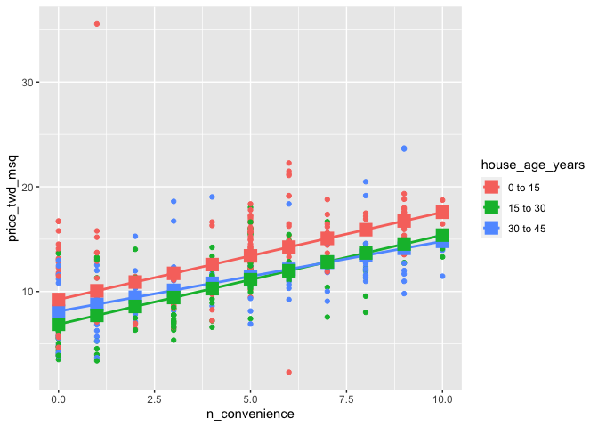<!-- -->

Pretty good predicting! The code flow here is identical to the parallel
slopes case in Chapter 1. Take a look again at that exercise to check.

## Manually calculating predictions with interactions

<!--
LO: Can calculate linear regression predictions manually for case with 1 numeric, 1 categorical explanatory variable and interaction.
-->

In order to understand how `predict()` works, it’s time to calculate the
predictions manually again. For this model, there are three separate
lines to calculate for, and in each one, the prediction is an intercept
plus a slope times the numeric explanatory value. The tricky part is
getting the right intercept and the right slope for each case.

`mdl_price_vs_both_inter` and `explanatory_data` are available; `dplyr`
and `tidyr` are available.

**Steps**

1.  Get the coefficients from `mdl_price_vs_both_inter`, assigning to
    `coeffs`.
2.  Get the three intercept coefficients from `coeffs`, assigning to
    `intercept_0_15`, `intercept_15_30`, and `intercept_30_45`.
3.  Get the three slope coefficients from `coeffs`, assigning to
    `slope_0_15`, `slope_15_30`, and `slope_30_45`.

``` r
# Get the coefficients from mdl_price_vs_both_inter
coeffs <- coefficients(mdl_price_vs_both_inter)

# Get the intercept for 0 to 15 year age group
intercept_0_15 <- coeffs[1]

# Get the intercept for 15 to 30 year age group
intercept_15_30 <- coeffs[2]

# Get the intercept for 30 to 45 year age group
intercept_30_45 <- coeffs[3]

# Get the slope for 0 to 15 year age group
slope_0_15 <- coeffs[4]

# Get the slope for 15 to 30 year age group
slope_15_30 <- coeffs[5]

# Get the slope for 30 to 45 year age group
slope_30_45 <- coeffs[6]
```

4.  Add a `price_twd_msq` column to `explanatory_data` containing the
    predictions.

5.  In the case when `house_age_years` is `"0 to 15"`, choose the
    appropriate intercept plus the appropriate slope times the number of
    nearby convenience stores.

6.  Do likewise for the cases where the house age is `"15 to 30"` and
    `"30 to 45"`.

``` r
# From previous step
coeffs <- coefficients(mdl_price_vs_both_inter)
intercept_0_15 <- coeffs[1]
intercept_15_30 <- coeffs[2]
intercept_30_45 <- coeffs[3]
slope_0_15 <- coeffs[4]
slope_15_30 <- coeffs[5]
slope_30_45 <- coeffs[6]

prediction_data <- explanatory_data %>% 
  mutate(
    # Consider the 3 cases to choose the price
    price_twd_msq = case_when(
      house_age_years == "0 to 15" ~ intercept_0_15 + slope_0_15 * n_convenience,
      house_age_years == "15 to 30" ~ intercept_15_30 + slope_15_30 * n_convenience,
      house_age_years == "30 to 45" ~ intercept_30_45 + slope_30_45 * n_convenience 
    ) 
  )

# See the result
prediction_data
```

    ## # A tibble: 33 × 3
    ##    n_convenience house_age_years price_twd_msq
    ##            <int> <fct>                   <dbl>
    ##  1             0 30 to 45                 8.11
    ##  2             0 15 to 30                 6.87
    ##  3             0 0 to 15                  9.24
    ##  4             1 30 to 45                 8.78
    ##  5             1 15 to 30                 7.72
    ##  6             1 0 to 15                 10.1 
    ##  7             2 30 to 45                 9.45
    ##  8             2 15 to 30                 8.58
    ##  9             2 0 to 15                 10.9 
    ## 10             3 30 to 45                10.1 
    ## # … with 23 more rows

Magnificent manual prediction! As before, the prediction just involved
adding and multiplying coefficients and explanatory values.

## Simpson’s Paradox

Theory. Coming soon …

## Modeling eBay auctions

<!-- 
LO: Can fit and visualize a linear regression on the whole dataset.
-->

Sometimes modeling a whole dataset suggests trends that disagree with
models on separate parts of that dataset. This is known as Simpson’s
paradox. In the most extreme case, you may see a positive slope on the
whole dataset, and negative slopes on every subset of that dataset (or
the other way around).

Over the next few exercises, you’ll look at
<a href="http://www.modelingonlineauctions.com/datasets">eBay
auctions</a> of Palm Pilot M515 PDA models.

| variable       | meaning                        |
|:---------------|:-------------------------------|
| `price`        | Final sale price, USD          |
| `openbid`      | The opening bid, USD           |
| `auction_type` | How long did the auction last? |

`auctions` is available; `dplyr` and `ggplot2` are loaded.

**Steps**

1.  Look at the structure of the `auctions` dataset and familiarize
    yourself with its columns.
2.  Fit a linear regression model of `price` versus `openbid`, using the
    `auctions` dataset. *Look at the coefficients.*

``` r
# Load data
auctions <- readRDS("data/auctions_mod.rds")

# Take a glimpse at the dataset
glimpse(auctions)
```

    ## Rows: 343
    ## Columns: 3
    ## $ price        <dbl> 260.00, 256.86, 260.00, 238.02, 231.50, 251.11, 247.50, 2…
    ## $ openbid      <dbl> 0.01, 0.01, 0.01, 0.01, 1.00, 9.99, 215.00, 155.00, 50.00…
    ## $ auction_type <chr> "7 day auction", "3 day auction", "5 day auction", "7 day…

``` r
# Model price vs. opening bid using auctions
mdl_price_vs_openbid <- lm(price ~ openbid, data = auctions)

# See the result
mdl_price_vs_openbid
```

    ## 
    ## Call:
    ## lm(formula = price ~ openbid, data = auctions)
    ## 
    ## Coefficients:
    ## (Intercept)      openbid  
    ##  229.245667    -0.002098

3.  Using auctions, plot `price` versus `openbid` as a scatter plot with
    linear regression trend lines (no ribbon). *Look at the trend line.*

``` r
# Using auctions, plot price vs. opening bid as a 
# scatter plot with linear regression trend lines
ggplot(auctions, aes(openbid, price)) +
  geom_point() +
  geom_smooth(method = "lm", se = FALSE)
```

    ## `geom_smooth()` using formula 'y ~ x'

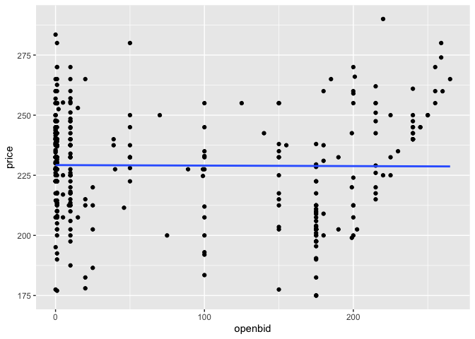<!-- -->

Amazing auction modeling! The slope coefficient is small enough that it
might as well be zero. That is, opening bid appears to have no effect on
the final sale price for Palm Pilots.

## Modeling each auction type

<!-- 
LO: Can reason about Simpson's Paradox.
-->

You just saw that the opening bid price appeared not to affect the final
sale price of Palm Pilots in the eBay auctions. Now let’s look at what
happens when you model the three auction types (3 day, 5 day, and 7 day)
separately.

`auctions` is available; `dplyr` and `ggplot2` are loaded.

**Steps**

1.  Fit a linear regression model of `price` versus `openbid` and
    `auction_type`, with an interaction, using the `auctions` dataset.
    *Look at the coefficients.*

``` r
# Fit linear regression of price vs. opening bid and auction 
# type, with an interaction.
mdl_price_vs_both <- lm(
  price ~ auction_type + openbid:auction_type + 0, # or price ~ auction_type * openbid
  data = auctions
)

# See the result
mdl_price_vs_both
```

    ## 
    ## Call:
    ## lm(formula = price ~ auction_type + openbid:auction_type + 0, 
    ##     data = auctions)
    ## 
    ## Coefficients:
    ##         auction_type3 day auction          auction_type5 day auction  
    ##                        226.369005                         221.599320  
    ##         auction_type7 day auction  auction_type3 day auction:openbid  
    ##                        231.602861                          -0.029026  
    ## auction_type5 day auction:openbid  auction_type7 day auction:openbid  
    ##                          0.084014                           0.003682

2.  Using `auctions`, plot `price` versus `openbid`, colored by
    `auction_type`, as a scatter plot with linear regression trend lines
    (no ribbon). *Look at the trend lines.*

``` r
# Using auctions, plot price vs. opening bid colored by
# auction type as a scatter plot with linear regr'n trend lines
ggplot(auctions, aes(openbid, price, color = auction_type)) +
  geom_point() +
  geom_smooth(method = "lm", se = FALSE)
```

    ## `geom_smooth()` using formula 'y ~ x'

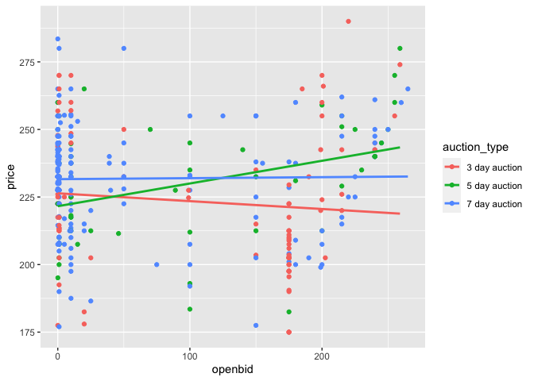<!-- -->

> ## *Question*
>
> Which statement about the model resolves Simpson’s Paradox?<br> <br>
> ⬜ The model of the whole dataset showed no expected change in final
> sale price due to opening bid. Since this model includes all the data,
> we should believe it and conclude that there is no effect from opening
> bid price.<br> ⬜ The model including auction type showed that final
> sale price increases in the 5 day auction category. Since this model
> is more specific, we should believe it and conclude that there is an
> effect from opening bid price.<br> ⬜ The two models disagree, so we
> can’t conclude anything from the models.<br> ✅ The two models
> disagree, and the best model to take advice from depends upon the
> question we are trying to answer.<br>

Super Simpson solving! Interpreting models is a subtle art, and your
conclusions need to be based on the question you are trying to answer.
Here, the answer to ‘Does opening bid affect final sale price?’ is *no*
overall, but the answer to ‘Does opening bid price affect final sale
price for any type of auction?’ is *yes, for 5 day auctions*.

# 3. Multiple Linear Regression

See how modeling, and linear regression in particular, makes it easy to
work with more than two explanatory variables. Once you've mastered
fitting linear regression models, you'll get to implement your own
linear regression algorithm.

## Two numeric explanatory variables

Theory. Coming soon …

## 3D visualizations

<!-- 
LO: Can visualize three continuous variables.
-->

Since computer screens and paper are both two-dimensional objects, most
plots are best suited to visualizing two variables at once. For the case
of three continuous variables, you can draw a 3D scatter plot, but
perspective problems usually make it difficult to interpret. There are
some “flat” alternatives that provide easier interpretation, though they
require a little thinking about to make.

`taiwan_real_estate` is available; `magrittr`, `plot3D` and `ggplot2`
are loaded.

**Steps**

1.  With the `taiwan_real_estate` dataset, draw a 3D scatter plot of the
    number of nearby convenience stores on the x-axis, the
    **square-root** of the distance to the nearest MRT stop on the
    y-axis, and the house price on the z-axis.

``` r
# Load packages
library(plot3D)
library(magrittr)
```

    ## 
    ## Attaching package: 'magrittr'

    ## The following object is masked from 'package:tidyr':
    ## 
    ##     extract

``` r
# With taiwan_real_estate, draw a 3D scatter plot of
# no. of conv. stores, sqrt dist to MRT, and price
taiwan_real_estate %$% 
  scatter3D(n_convenience, sqrt(dist_to_mrt_m), price_twd_msq)
```

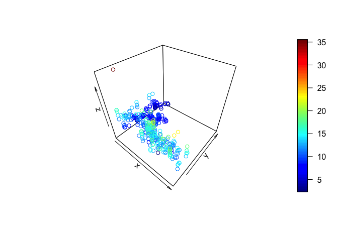<!-- -->

2.  With the `taiwan_real_estate` dataset, draw a scatter plot of the
    square-root of the distance to the nearest MRT stop versus the
    number of nearby convenience stores, colored by house price.
3.  Use the continuous viridis color scale, using the `"plasma"` option.

``` r
# Using taiwan_real_estate, plot sqrt dist to MRT vs. 
# no. of conv. stores, colored by price
ggplot(
  taiwan_real_estate, 
  aes(n_convenience, sqrt(dist_to_mrt_m), color = price_twd_msq)
) + 
  # Make it a scatter plot
  geom_point() +
  # Use the continuous viridis plasma color scale
  scale_color_viridis_c(option = "plasma")
```

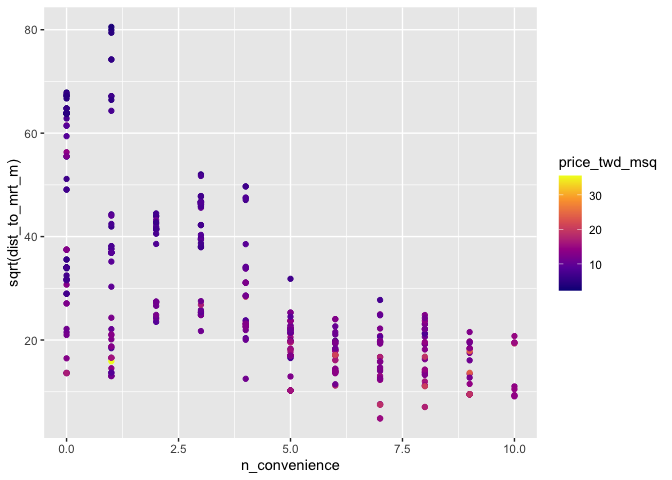<!-- -->

Three cheers for plotting three variables! 3D scatter plots are usually
a pain to easily interpret due to problems with perspective. The best
alternative for displaying a third variable involves using colors.

## Modeling 2 numeric explanatory variables

<!--
LO: Can model and predict with two numeric explanatory variables.
-->

You already saw how to make a model and predictions with a numeric and a
categorical explanatory variable. The code for modeling and predicting
with two numeric explanatory variables in the same, other than a slight
difference in how to specify the explanatory variables to make
predictions against.

Here you’ll model and predict the house prices against the number of
nearby convenience stores and the square-root of the distance to the
nearest MRT station.

`taiwan_real_estate` is available; `dplyr`, `tidyr` and `ggplot2` are
loaded.

**Steps**

1.  Fit a linear regression of house price versus the number of
    convenience stores and the square-root of the distance to the
    nearest MRT stations, without an interaction, using the
    `taiwan_real_estate` dataset.

``` r
# Fit a linear regression of price vs. no. of conv. stores
# and sqrt dist. to nearest MRT, no interaction
mdl_price_vs_conv_dist <- lm(
  price_twd_msq ~ n_convenience + sqrt(dist_to_mrt_m), data = taiwan_real_estate
)

# See the result
mdl_price_vs_conv_dist
```

    ## 
    ## Call:
    ## lm(formula = price_twd_msq ~ n_convenience + sqrt(dist_to_mrt_m), 
    ##     data = taiwan_real_estate)
    ## 
    ## Coefficients:
    ##         (Intercept)        n_convenience  sqrt(dist_to_mrt_m)  
    ##             15.1038               0.2142              -0.1573

2.  Create expanded grid of explanatory variables with number of
    convenience stores from 0 to 10 and the distance to the nearest MRT
    station as a sequence from 0 to 80 in steps of 10, all squared (0,
    100, 400, …, 6400). Assign to `explanatory_data`.
3.  Add a column of predictions to `explanatory_data` using
    `mdl_price_vs_conv_dist` and `explanatory_data`. Assign to
    `prediction_data`.

``` r
# From previous step 
mdl_price_vs_conv_dist <- lm(price_twd_msq ~ n_convenience + sqrt(dist_to_mrt_m), data = taiwan_real_estate)

# Create expanded grid of explanatory variables with
# no. of conv. stores and  dist. to nearest MRT
explanatory_data <- expand_grid(
  n_convenience = 0:10,
  dist_to_mrt_m = seq(0, 80, 10) ^ 2
)

# Add predictions using mdl_price_vs_conv_dist and explanatory_data
prediction_data <- explanatory_data %>% 
  mutate(
    price_twd_msq = predict(mdl_price_vs_conv_dist, explanatory_data)
  )

# See the result
prediction_data
```

    ## # A tibble: 99 × 3
    ##    n_convenience dist_to_mrt_m price_twd_msq
    ##            <int>         <dbl>         <dbl>
    ##  1             0             0         15.1 
    ##  2             0           100         13.5 
    ##  3             0           400         12.0 
    ##  4             0           900         10.4 
    ##  5             0          1600          8.81
    ##  6             0          2500          7.24
    ##  7             0          3600          5.67
    ##  8             0          4900          4.09
    ##  9             0          6400          2.52
    ## 10             1             0         15.3 
    ## # … with 89 more rows

4.  Extend the plot to add a layer of points using the prediction data,
    colored yellow, with size 3.

``` r
# From previous steps
mdl_price_vs_conv_dist <- lm(price_twd_msq ~ n_convenience + sqrt(dist_to_mrt_m), data = taiwan_real_estate)
explanatory_data <- expand_grid(n_convenience = 0:10, dist_to_mrt_m = seq(0, 80, 10) ^ 2)
prediction_data <- explanatory_data %>% 
  mutate(price_twd_msq = predict(mdl_price_vs_conv_dist, explanatory_data))

# Add predictions to plot
ggplot(
  taiwan_real_estate, 
  aes(n_convenience, sqrt(dist_to_mrt_m), color = price_twd_msq)
) + 
  geom_point() +
  scale_color_viridis_c(option = "plasma") +
  # Add prediction points colored yellow, size 3
  geom_point(data = prediction_data, color = "yellow", size = 3)
```

<!-- -->

Nice numeric modeling! The modeling and prediction flow for two numeric
variables is just as it was for the previous case that included a
categorical variable. R automatically handles this different scenario.

## Including an interaction

<!--
LO: Can model and predict with two numeric explanatory variables with an interaction.
-->

Just as in the case with one numeric and one categorical explanatory
variable, it is possible that numeric explanatory variables can
interact. With this model structure, you’ll get a third slope
coefficient: one for each explanatory variable and one for the
interaction.

Here you’ll run and predict the same model as in the previous exercise,
but this time including an interaction between the explanatory
variables.

`taiwan_real_estate` is available; `dplyr`, `tidyr` and `ggplot2` are
loaded.

**Steps**

1.  Fit a linear regression of house price versus the number of
    convenience stores and the square-root of the distance to the
    nearest MRT stations, *with* an interaction, using the
    `taiwan_real_estate` dataset.

``` r
# Fit a linear regression of price vs. no. of conv. stores
# and sqrt dist. to nearest MRT, with interaction
mdl_price_vs_conv_dist <- lm(
  price_twd_msq ~ n_convenience * sqrt(dist_to_mrt_m), data = taiwan_real_estate
)

# See the result
mdl_price_vs_conv_dist
```

    ## 
    ## Call:
    ## lm(formula = price_twd_msq ~ n_convenience * sqrt(dist_to_mrt_m), 
    ##     data = taiwan_real_estate)
    ## 
    ## Coefficients:
    ##                       (Intercept)                      n_convenience  
    ##                          14.73733                            0.42425  
    ##               sqrt(dist_to_mrt_m)  n_convenience:sqrt(dist_to_mrt_m)  
    ##                          -0.14121                           -0.01124

2.  Create expanded grid of explanatory variables with number of
    convenience stores from 0 to 10 and the distance to the nearest MRT
    station as a sequence from 0 to 80 in steps of 10, all squared (0,
    100, 400, …, 6400). Assign to `explanatory_data`.
3.  Add a column of predictions to `explanatory_data` using
    `mdl_price_vs_conv_dist` and `explanatory_data`. Assign to
    `prediction_data`.

``` r
# From previous step 
mdl_price_vs_conv_dist <- lm(price_twd_msq ~ n_convenience * sqrt(dist_to_mrt_m), data = taiwan_real_estate)

# Create expanded grid of explanatory variables with
# no. of conv. stores and  dist. to nearest MRT
explanatory_data <- expand_grid(
  n_convenience = 0:10,
  dist_to_mrt_m = seq(0, 80, 10) ^ 2
)

# Add predictions using mdl_price_vs_conv_dist and explanatory_data
prediction_data <- explanatory_data %>% 
  mutate(
    price_twd_msq = predict(mdl_price_vs_conv_dist, explanatory_data)
  )

# See the result
prediction_data
```

    ## # A tibble: 99 × 3
    ##    n_convenience dist_to_mrt_m price_twd_msq
    ##            <int>         <dbl>         <dbl>
    ##  1             0             0         14.7 
    ##  2             0           100         13.3 
    ##  3             0           400         11.9 
    ##  4             0           900         10.5 
    ##  5             0          1600          9.09
    ##  6             0          2500          7.68
    ##  7             0          3600          6.26
    ##  8             0          4900          4.85
    ##  9             0          6400          3.44
    ## 10             1             0         15.2 
    ## # … with 89 more rows

4.  Extend the plot to add a layer of points using the prediction data,
    colored yellow, with size 3.

``` r
# From previous steps
mdl_price_vs_conv_dist <- lm(price_twd_msq ~ n_convenience * sqrt(dist_to_mrt_m), data = taiwan_real_estate)
explanatory_data <- expand_grid(n_convenience = 0:10, dist_to_mrt_m = seq(0, 80, 10) ^ 2)
prediction_data <- explanatory_data %>% 
  mutate(price_twd_msq = predict(mdl_price_vs_conv_dist, explanatory_data))

# Add predictions to plot
ggplot(
  taiwan_real_estate, 
  aes(n_convenience, sqrt(dist_to_mrt_m), color = price_twd_msq)
) + 
  geom_point() +
  scale_color_viridis_c(option = "plasma")+
  # Add prediction points colored yellow, size 3
  geom_point(data = prediction_data, color = "yellow", size = 3)
```

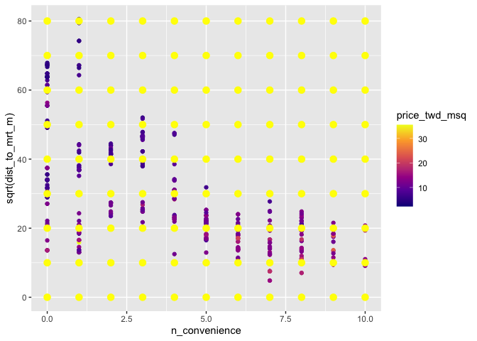<!-- -->

Insightful interaction inclusion! Although the predictions from the
model are different now that the interaction is included, the code to
create them is the same.

## More than 2 explanatory variables

Theory. Coming soon …

## Visualizing many variables

<!-- 
LO: Can visualize more than 3 variables at once.
-->

As you begin to consider more variables, plotting them all at the same
time becomes increasingly difficult. In addition to using x and y scales
for two numeric variables, you can use color for a third numeric
variable, and you can use faceting for categorical variables. And that’s
about your limit before the plots become to difficult to interpret.
There are some specialist plot types like correlation heatmaps and
parallel coordinates plots that will handle more variables, but they
give you much less information about each variable, and they aren’t
great for visualizing model predictions.

Here you’ll push the limits of the scatter plot by showing the house
price, the distance to the MRT station, the number of nearby convenience
stores, and the house age, all together in one plot.

`taiwan_real_estate` is available; `ggplot2` is loaded.

**Steps**

1.  Using the `taiwan_real_estate` dataset, draw a scatter plot of
    `n_convenience` versus the square root of `dist_to_mrt_m`, colored
    by `price_twd_msq`.
2.  Use the continuous viridis plasma color scale.
3.  Facet the plot, wrapping by `house_age_years`.

``` r
# Using taiwan_real_estate, no. of conv. stores vs. sqrt of
# dist. to MRT, colored by plot house price
ggplot(
  taiwan_real_estate, 
  aes(sqrt(dist_to_mrt_m), n_convenience, color = price_twd_msq)
) +
  # Make it a scatter plot
  geom_point() +
  # Use the continuous viridis plasma color scale
  scale_color_viridis_c(option = "plasma") +
  # Facet, wrapped by house age
  facet_wrap(vars(house_age_years))
```

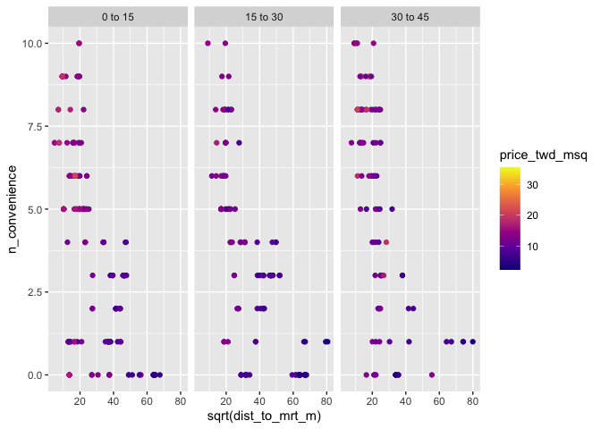<!-- -->

Sublime scatter plotting! As you add more variables, it becomes
increasingly challenging to create an easily interpretable plot.

## Different levels of interaction

<!--
LO: Can specify models with three explanatory variables, including interactions.
-->

Once you have three explanatory variables, the number of options for
specifying interactions increases. You can specify no interactions. You
can specify 2-way interactions, which gives you model coefficients for
each pair of variables. The third option is to specify all the
interactions, which means the three 2-way interactions and and
interaction between all three explanatory variables.

As the number of explanatory variables increases further, the number of
interaction possibilities rapidly increases.

`taiwan_real_estate` is available.

**Steps**

1.  Fit a linear regression of house price versus `n_convenience`, the
    square-root of `dist_to_mrt_m`, and `house_age_years`. Don’t include
    a global intercept, and don’t include any interactions.

``` r
# Model price vs. no. of conv. stores, sqrt dist. to MRT 
# station & house age, no global intercept, no interactions
mdl_price_vs_all_no_inter <- lm(
  price_twd_msq ~ n_convenience + sqrt(dist_to_mrt_m) + house_age_years + 0, 
  data = taiwan_real_estate
)

# See the result
mdl_price_vs_all_no_inter
```

    ## 
    ## Call:
    ## lm(formula = price_twd_msq ~ n_convenience + sqrt(dist_to_mrt_m) + 
    ##     house_age_years + 0, data = taiwan_real_estate)
    ## 
    ## Coefficients:
    ##           n_convenience      sqrt(dist_to_mrt_m)   house_age_years0 to 15  
    ##                  0.2577                  -0.1481                  15.4745  
    ## house_age_years15 to 30  house_age_years30 to 45  
    ##                 14.1301                  13.7655

2.  Fit a linear regression of house price versus the square-root of
    `dist_to_mrt_m`, `n_convenience`, and `house_age_years`. Don’t
    include a global intercept, but do include 2-way and 3-way
    interactions between the explanatory variables.

``` r
# Model price vs. sqrt dist. to MRT station, no. of conv.
# stores & house age, no global intercept, 3-way interactions
mdl_price_vs_all_3_way_inter <- lm(
  price_twd_msq ~ sqrt(dist_to_mrt_m) * n_convenience * house_age_years + 0, 
  data = taiwan_real_estate
)

# See the result
mdl_price_vs_all_3_way_inter
```

    ## 
    ## Call:
    ## lm(formula = price_twd_msq ~ sqrt(dist_to_mrt_m) * n_convenience * 
    ##     house_age_years + 0, data = taiwan_real_estate)
    ## 
    ## Coefficients:
    ##                                       sqrt(dist_to_mrt_m)  
    ##                                                 -0.162944  
    ##                                             n_convenience  
    ##                                                  0.374982  
    ##                                    house_age_years0 to 15  
    ##                                                 16.046849  
    ##                                   house_age_years15 to 30  
    ##                                                 13.760066  
    ##                                   house_age_years30 to 45  
    ##                                                 12.088773  
    ##                         sqrt(dist_to_mrt_m):n_convenience  
    ##                                                 -0.008393  
    ##               sqrt(dist_to_mrt_m):house_age_years15 to 30  
    ##                                                  0.036618  
    ##               sqrt(dist_to_mrt_m):house_age_years30 to 45  
    ##                                                  0.061281  
    ##                     n_convenience:house_age_years15 to 30  
    ##                                                  0.078370  
    ##                     n_convenience:house_age_years30 to 45  
    ##                                                  0.066720  
    ## sqrt(dist_to_mrt_m):n_convenience:house_age_years15 to 30  
    ##                                                 -0.003821  
    ## sqrt(dist_to_mrt_m):n_convenience:house_age_years30 to 45  
    ##                                                  0.004401

3.  Fit a linear regression of house price versus the square-root of
    `dist_to_mrt_m`, `n_convenience`, and `house_age_years`. Don’t
    include a global intercept, but do include 2-way (not 3-way)
    interactions between the explanatory variables.

``` r
# Model price vs. sqrt dist. to MRT station, no. of conv.
# stores & house age, no global intercept, 2-way interactions
mdl_price_vs_all_2_way_inter <- lm(
  price_twd_msq ~ (sqrt(dist_to_mrt_m) + n_convenience + house_age_years) ^ 2 + 0, 
  data = taiwan_real_estate
)

# See the result
mdl_price_vs_all_2_way_inter
```

    ## 
    ## Call:
    ## lm(formula = price_twd_msq ~ (sqrt(dist_to_mrt_m) + n_convenience + 
    ##     house_age_years)^2 + 0, data = taiwan_real_estate)
    ## 
    ## Coefficients:
    ##                         sqrt(dist_to_mrt_m)  
    ##                                   -0.162025  
    ##                               n_convenience  
    ##                                    0.384914  
    ##                      house_age_years0 to 15  
    ##                                   16.026633  
    ##                     house_age_years15 to 30  
    ##                                   13.880791  
    ##                     house_age_years30 to 45  
    ##                                   11.926904  
    ##           sqrt(dist_to_mrt_m):n_convenience  
    ##                                   -0.008956  
    ## sqrt(dist_to_mrt_m):house_age_years15 to 30  
    ##                                    0.031600  
    ## sqrt(dist_to_mrt_m):house_age_years30 to 45  
    ##                                    0.068198  
    ##       n_convenience:house_age_years15 to 30  
    ##                                   -0.006894  
    ##       n_convenience:house_age_years30 to 45  
    ##                                    0.143416

Magnificent model fitting! The formula syntax is flexible enough to
provide precise control over which interactions are specified.

## Predicting again

<!--
LO: Run a prediction workflow using multiple explanatory variables.
-->

You’ve followed the prediction workflow several times now with different
combinations of explanatory variables. Time to try it once more on the
model with three explanatory variables. Here, you’ll use the model with
3-way interactions, though the code is the same when using any of the
three models from the previous exercise.

`taiwan_real_estate` and `mdl_price_vs_all_3_way_inter` are available;
`dplyr`, `tidyr` and `ggplot2` are loaded.

**Steps**

1.  Make a grid of explanatory data, formed from combinations of the
    following variables.

2.  `dist_to_mrt_m` should take a sequence from zero to eighty in steps
    of ten, all squared (0, 100, 400, …, 6400).

3.  `n_convenience` should take the numbers zero to ten.

4.  `house_age_years` should take the unique values of the
    `house_age_years` column of `taiwan_real_estate`.

``` r
# Make a grid of explanatory data
explanatory_data <- expand_grid(
  # Set dist_to_mrt_m a seq from 0 to 80 by 10s, squared
  dist_to_mrt_m = seq(0, 80, 10) ^ 2,
  # Set n_convenience to 0 to 10
  n_convenience = 0:10,
  # Set house_age_years to the unique values of that variable
  house_age_years = unique(taiwan_real_estate$house_age_years)
)

# See the result
explanatory_data
```

    ## # A tibble: 297 × 3
    ##    dist_to_mrt_m n_convenience house_age_years
    ##            <dbl>         <int> <fct>          
    ##  1             0             0 30 to 45       
    ##  2             0             0 15 to 30       
    ##  3             0             0 0 to 15        
    ##  4             0             1 30 to 45       
    ##  5             0             1 15 to 30       
    ##  6             0             1 0 to 15        
    ##  7             0             2 30 to 45       
    ##  8             0             2 15 to 30       
    ##  9             0             2 0 to 15        
    ## 10             0             3 30 to 45       
    ## # … with 287 more rows

5.  Add a column to the `explanatory_data`, assigning to
    `prediction_data`.
6.  The column should be named after the response variable, and contain
    predictions made using `mdl_price_vs_all_3_way_inter` and
    `explanatory_data`.

``` r
# From previous step
explanatory_data <- expand_grid(
  dist_to_mrt_m = seq(0, 80, 10) ^ 2,
  n_convenience = 0:10,
  house_age_years = unique(taiwan_real_estate$house_age_years)
)

# Add predictions to the data frame
prediction_data <- explanatory_data %>% 
  mutate(
    price_twd_msq = predict(mdl_price_vs_all_3_way_inter, explanatory_data)
  )

# See the result
prediction_data
```

    ## # A tibble: 297 × 4
    ##    dist_to_mrt_m n_convenience house_age_years price_twd_msq
    ##            <dbl>         <int> <fct>                   <dbl>
    ##  1             0             0 30 to 45                 12.1
    ##  2             0             0 15 to 30                 13.8
    ##  3             0             0 0 to 15                  16.0
    ##  4             0             1 30 to 45                 12.5
    ##  5             0             1 15 to 30                 14.2
    ##  6             0             1 0 to 15                  16.4
    ##  7             0             2 30 to 45                 13.0
    ##  8             0             2 15 to 30                 14.7
    ##  9             0             2 0 to 15                  16.8
    ## 10             0             3 30 to 45                 13.4
    ## # … with 287 more rows

7.  Extend the plot to include predictions as points from
    `prediction_data`, with size 3 and shape 15.
8.  *Look at the plot. What do the prediction points tell you?*

``` r
# From previous step
explanatory_data <- expand_grid(
  dist_to_mrt_m = seq(0, 80, 10) ^ 2,
  n_convenience = 0:10,
  house_age_years = unique(taiwan_real_estate$house_age_years)
)
prediction_data <- explanatory_data %>% 
  mutate(price_twd_msq = predict(mdl_price_vs_all_3_way_inter, explanatory_data))

# Extend the plot
ggplot(
  taiwan_real_estate, 
  aes(sqrt(dist_to_mrt_m), n_convenience, color = price_twd_msq)
) +
  geom_point() +
  scale_color_viridis_c(option = "plasma") +
  facet_wrap(vars(house_age_years)) +
  # Add points from prediction data, size 3, shape 15
  geom_point(data = prediction_data, size = 3, shape = 15)
```

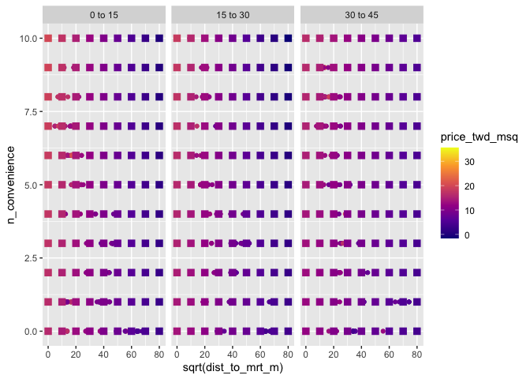<!-- -->

Premier predicting! The plot nicely shows that the house price decreases
as the square-root of the distance to the nearest MRT station increases,
and increases as the number of nearby convenience stores increases, and
is higher for houses under 15 years old.

## How linear regression works

Theory. Coming soon …

## The sum of squares

<!--
LO: Understands that linear regression involves minimizing the sum of squares metric.
-->

In order to choose the “best” line to fit the data, regression models
need to optimize some metric. For linear regression, this metric is
called the *sum of squares*.

In the dashboard, try setting different values of the intercept and
slope coefficients. In the plot, the solid black line has the intercept
and slope you specified. The dotted blue line has the intercept and
slope calculated by a linear regression on the dataset.

How does linear regression try to optimize the sum of squares metric?

> ## *Question*
>
> ???<br> <br> ⬜ Linear regression makes the sum of the squares of the
> differences between the actual responses and the predicted responses
> zero.<br> ⬜ Linear regression makes the sum of the squares of the
> differences between the actual responses and the predicted responses
> infinite.<br> ⬜ Linear regression maximizes the sum of the squares of
> the differences between the actual responses and the predicted
> responses.<br> ⬜ Linear regression minimizes the sum of the squares
> of the differences between the actual responses and the predicted
> responses.<br>

## Linear regression algorithm

<!--
LO: Can write a simple linear regression algorithm for a specific dataset. 
-->

To truly understand linear regression, it is helpful to know how the
algorithm works. The code for `lm()` is hundreds of lines because it has
to work with any formula and any dataset. However, in the case of simple
linear regression for a single dataset, you can implement a linear
regression algorithm in just a few lines of code.

The workflow is

1.  Write a script to calculate the sum of squares.
2.  Turn this into a function.
3.  Use R’s general purpose optimization function find the coefficients
    that minimize this.

The explanatory values (the `n_convenience` column of
`taiwan_real_estate`) are available as `x_actual`. The response values
(the `price_twd_msq` column of `taiwan_real_estate`) are available as
`y_actual`.

**Steps**

1.  Set the intercept to ten.
2.  Set the slope to one.
3.  Calculate the predicted y-values as the intercept plus the slope
    times the actual x-values.
4.  Calculate the differences between actual and predicted y-values.
5.  Calculate the sum of squares. Get the sum of the differences in
    y-values, squaring each value.

``` r
# set data
x_actual <- taiwan_real_estate$n_convenience
y_actual <- taiwan_real_estate$price_twd_msq

# Set the intercept to 10
intercept <- 10

# Set the slope to 1
slope <- 1

# Calculate the predicted y values
y_pred <- intercept + slope * x_actual

# Calculate the differences between actual and predicted
y_diff <- y_actual - y_pred

# Calculate the sum of squares
sum(y_diff ^ 2)
```

    ## [1] 7667.734

6.  Complete the function body.

7.  Get the intercept from the first element of `coeffs`.

8.  Get the slope from the second element of `coeffs`.

9.  Calculate the predicted y-values as the intercept plus the slope
    times the actual x-values.

10. Calculate the differences between actual and predicted y-values.

11. Calculate the sum of squares. Get the sum of the differences in
    y-values, squaring each value.

``` r
calc_sum_of_squares <- function(coeffs) {
  # Get the intercept coeff
  intercept <- coeffs[1]

  # Get the slope coeff
  slope <- coeffs[2]

  # Calculate the predicted y values
  y_pred <- intercept + slope * x_actual

  # Calculate the differences between actual and predicted
  y_diff <- y_actual - y_pred

  # Calculate the sum of squares
  sum(y_diff ^ 2)
}
```

12. Optimize the sum of squares metric.

13. Call an optimization function.

14. Initially guess that the intercept is zero and the slope is zero by
    passing a named vector of parameters.

15. Use `calc_sum_of_squares` as the optimization function.

``` r
# From previous step
calc_sum_of_squares <- function(coeffs) {
  intercept <- coeffs[1]
  slope <- coeffs[2]
  y_pred <- intercept + slope * x_actual
  y_diff <- y_actual - y_pred
  sum(y_diff ^ 2)
}

# Optimize the metric
optim(
  # Initially guess 0 intercept and 0 slope
  par = c(intercept = 0, slope = 0), 
  # Use calc_sum_of_squares as the optimization fn 
  fn = calc_sum_of_squares
)
```

    ## $par
    ## intercept     slope 
    ## 8.2260232 0.7977565 
    ## 
    ## $value
    ## [1] 4717.687
    ## 
    ## $counts
    ## function gradient 
    ##       87       NA 
    ## 
    ## $convergence
    ## [1] 0
    ## 
    ## $message
    ## NULL

``` r
# Compare the coefficients to those calculated by lm()
lm(price_twd_msq ~ n_convenience, data = taiwan_real_estate)
```

    ## 
    ## Call:
    ## lm(formula = price_twd_msq ~ n_convenience, data = taiwan_real_estate)
    ## 
    ## Coefficients:
    ##   (Intercept)  n_convenience  
    ##        8.2242         0.7981

Outstanding optimization! The results you got here with just a few lines
of code are very close to the finely-tuned results from `lm()`. All you
needed was a function to calculate the sum of squares metric, and the
`optim()` function worked its magic to find where this function had its
minimum value.

# 4. Multiple Logistic Regression

Extend your logistic regression skills to multiple explanatory
variables. Understand the logistic distribution, which underpins this
form of regression. Finally, implement your own logistic regression
algorithm.

## Multiple logistic regression

Theory. Coming soon …

## Visualizing multiple explanatory variables

<!--
LO: Can visualize logistic data with two numeric explanatory variables.
-->

Logistic regression also supports multiple explanatory variables.
Plotting has similar issues as the linear regression case: it quickly
becomes difficult to include more numeric variables in the plot. Here
we’ll look at the case of two numeric explanatory variables, and the
solution is basically the same as before: use color to denote the
response.

Here there are only two possible values of response (zero and one), and
later when we add predicted responses, the values all lie between zero
and one. Once you include predicted responses, the most important thing
to determine from the plot is whether the predictions are close to zero,
or close to one. That means that a 2-color gradient split at 0.5 is
really useful: responses above 0.5 are one color, and responses below
0.5 are another color.

The bank churn dataset is available as `churn`; `ggplot2` is loaded.

**Steps**

1.  Using the `churn` dataset, plot the recency of purchase,
    `time_since_last_purchase`, versus the length of customer
    relationship, `time_since_first_purchase`, colored by whether or not
    the customer churned, `has_churned`.
2.  Add a point layer, with transparency set to `0.5`.
3.  Use a 2-color gradient, with midpoint `0.5`.
4.  Use the black and white theme.

``` r
# Load data
churn <- read_fst("data/churn.fst")

# Using churn, plot recency vs. length of relationship,
# colored by churn status
ggplot(
  churn, 
  aes(time_since_first_purchase, time_since_last_purchase, color = has_churned)
) +
  # Make it a scatter plot, with transparency 0.5
  geom_point(alpha = 0.5) +
  # Use a 2-color gradient split at 0.5
  scale_color_gradient2(midpoint = 0.5) +
  # Use the black and white theme
  theme_bw()
```

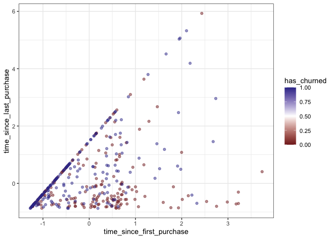<!-- -->

Cool colored scatter plot! The 2-color gradient is excellent for
distinguishing the two cases of a positive and negative response.

## Logistic regression with 2 explanatory variables

<!--
LO: Can fit a logistic regression with multiple explanatory variables.
-->

To include multiple explanatory variables in logistic regression models,
the syntax is the same as for linear regressions. The only change is the
same as in the simple case: you run a *generalized* linear model with a
binomial error family.

Here you’ll fit a model of churn status with both of the explanatory
variables from the dataset: the length of customer relationship and the
recency of purchase.

`churn` is available.

**Steps**

1.  Fit a logistic regression of churn status, `has_churned` versus
    length of customer relationship, `time_since_first_purchase` and
    recency of purchase, `time_since_last_purchase`, and an interaction
    between the explanatory variables.

``` r
# Fit a logistic regression of churn status vs. length of
# relationship, recency, and an interaction
mdl_churn_vs_both_inter <- glm(
  has_churned ~ time_since_first_purchase * time_since_last_purchase, 
  data   = churn, 
  family = binomial
)

# See the result
mdl_churn_vs_both_inter
```

    ## 
    ## Call:  glm(formula = has_churned ~ time_since_first_purchase * time_since_last_purchase, 
    ##     family = binomial, data = churn)
    ## 
    ## Coefficients:
    ##                                        (Intercept)  
    ##                                            -0.1505  
    ##                          time_since_first_purchase  
    ##                                            -0.6376  
    ##                           time_since_last_purchase  
    ##                                             0.4233  
    ## time_since_first_purchase:time_since_last_purchase  
    ##                                             0.1123  
    ## 
    ## Degrees of Freedom: 399 Total (i.e. Null);  396 Residual
    ## Null Deviance:       554.5 
    ## Residual Deviance: 519.8     AIC: 527.8

Laudable logistic regression! The formula syntax for including multiple
explanatory variables is the same for logistic regression as it is for
linear regression.

## Logistic regression prediction

<!--
LO: Can make predictions with a logistic regression model that includes multiple explanatory variables.
-->

As with linear regression, the joy of logistic regression is that you
can make predictions. Let’s step through the prediction flow one more
time!

`churn` and `mdl_churn_vs_both_inter` are available; `dplyr`, `tidyr`
and `ggplot2` are loaded.

**Steps**

1.  Create a grid of explanatory variables.

2.  Set `time_since_first_purchase` to a sequence from minus two to four
    in steps of `0.1`.

3.  Set `time_since_last_purchase` to a sequence from minus one to six
    in steps of `0.1`.

``` r
# Make a grid of explanatory data
explanatory_data <- expand_grid(
  # Set len. relationship to seq from -2 to 4 in steps of 0.1
  time_since_first_purchase = seq(-2, 4, 0.1),
  # Set recency to seq from -1 to 6 in steps of 0.1
  time_since_last_purchase = seq(-1, 6, 0.1)
)

# See the result
explanatory_data
```

    ## # A tibble: 4,331 × 2
    ##    time_since_first_purchase time_since_last_purchase
    ##                        <dbl>                    <dbl>
    ##  1                        -2                     -1  
    ##  2                        -2                     -0.9
    ##  3                        -2                     -0.8
    ##  4                        -2                     -0.7
    ##  5                        -2                     -0.6
    ##  6                        -2                     -0.5
    ##  7                        -2                     -0.4
    ##  8                        -2                     -0.3
    ##  9                        -2                     -0.2
    ## 10                        -2                     -0.1
    ## # … with 4,321 more rows

4.  Add a column to `explanatory_data` named `has_churned` containing
    predictions using `mdl_churn_vs_both_inter` and `explanatory_data`
    with type `"response"`.

``` r
# From previous steps
explanatory_data <- expand_grid(
  time_since_first_purchase = seq(-2, 4, 0.1),
  time_since_last_purchase = seq(-1, 6, 0.1)
)

# Add a column of predictions using mdl_churn_vs_both_inter
# and explanatory_data with type response
prediction_data <- explanatory_data %>% 
  mutate(
    has_churned = predict(
      mdl_churn_vs_both_inter, explanatory_data, type = "response"
    )
  )

# See the result
prediction_data
```

    ## # A tibble: 4,331 × 3
    ##    time_since_first_purchase time_since_last_purchase has_churned
    ##                        <dbl>                    <dbl>       <dbl>
    ##  1                        -2                     -1         0.716
    ##  2                        -2                     -0.9       0.720
    ##  3                        -2                     -0.8       0.724
    ##  4                        -2                     -0.7       0.728
    ##  5                        -2                     -0.6       0.732
    ##  6                        -2                     -0.5       0.736
    ##  7                        -2                     -0.4       0.740
    ##  8                        -2                     -0.3       0.744
    ##  9                        -2                     -0.2       0.747
    ## 10                        -2                     -0.1       0.751
    ## # … with 4,321 more rows

5.  Extend the plot by adding points from `prediction_data` with size 3
    and shape 15.

``` r
# From previous steps
explanatory_data <- expand_grid(
  time_since_first_purchase = seq(-2, 4, 0.1),
  time_since_last_purchase = seq(-1, 6, 0.1)
)
prediction_data <- explanatory_data %>% 
  mutate(
    has_churned = predict(mdl_churn_vs_both_inter, explanatory_data, type = "response")
  )

# Extend the plot
ggplot(
  churn, 
  aes(time_since_first_purchase, time_since_last_purchase, color = has_churned)
) +
  geom_point(alpha = 0.5) +
  scale_color_gradient2(midpoint = 0.5) +
  theme_bw() +
  # Add points from prediction_data with size 3 and shape 15
  geom_point(data = prediction_data, size = 3, shape = 15)
```

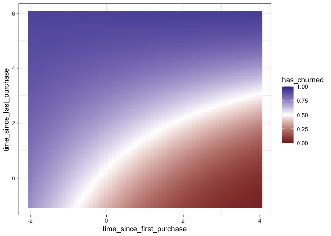<!-- -->

Painless probability predictions! The prediction workflow should be
familiar now: you’ve seen it many times before. The only thing to
remember here is to set the prediction type to `"response"`.

## Confusion matrix

<!--
LO: Can generate a confusion matrix from a dataset and logistic regression model, and plot in a mosaic plot.
-->

When the response variable has just two outcomes, like the case of
churn, the measures of success for the model are “how many cases where
the customer churned did the model correctly predict?” and “how many
cases where the customer didn’t churn did the model correctly predict?”.
These can be found by generating a confusion matrix and calculating
summary metrics on it. A mosaic plot is the natural way to visualize the
results.

`churn` and `mdl_churn_vs_both_inter` are available; `dplyr` and
`yardstick` are loaded.

**Steps**

1.  Get the actual responses from the `churn` dataset.
2.  Get the predicted responses from the rounded, fitted values of
    `mdl_churn_vs_both_inter`.
3.  Create a table of the actual and predicted response values.
4.  Convert the table to a `conf_mat` confusion matrix object.

``` r
# Load packages
library(yardstick)
```

    ## For binary classification, the first factor level is assumed to be the event.
    ## Use the argument `event_level = "second"` to alter this as needed.

``` r
# Get the actual responses from churn
actual_response <- churn$has_churned

# Get the predicted responses from the model
predicted_response <- round(fitted(mdl_churn_vs_both_inter))

# Get a table of these values
outcomes <- table(predicted_response, actual_response)

# Convert the table to a conf_mat object
confusion <- conf_mat(outcomes)

# See the result
confusion
```

    ##                   actual_response
    ## predicted_response   0   1
    ##                  0 102  53
    ##                  1  98 147

5.  “Automatically” plot the confusion matrix, `confusion`.
6.  Get summary metrics from the confusion matrix. Remember that the
    churn event is in the second row/column of the matrix.

``` r
# From previous step
actual_response <- churn$has_churned
predicted_response <- round(fitted(mdl_churn_vs_both_inter))
outcomes <- table(predicted_response, actual_response)
confusion <- conf_mat(outcomes)

# "Automatically" plot the confusion matrix
autoplot(confusion)
```

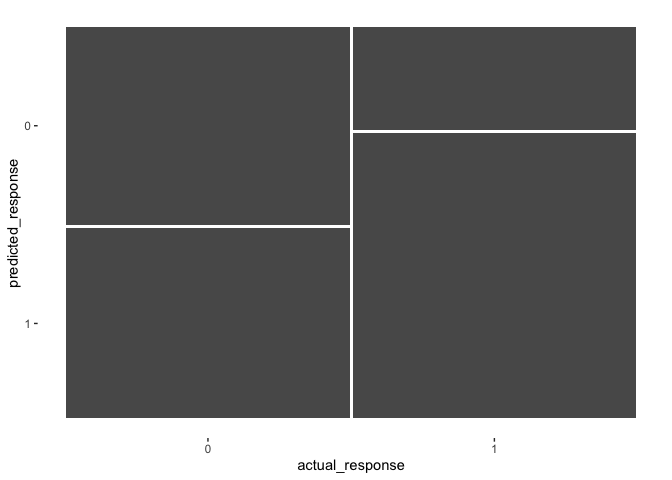<!-- -->

``` r
# Get summary metrics
summary(confusion, event_level = "second")
```

    ## # A tibble: 13 × 3
    ##    .metric              .estimator .estimate
    ##    <chr>                <chr>          <dbl>
    ##  1 accuracy             binary         0.622
    ##  2 kap                  binary         0.245
    ##  3 sens                 binary         0.735
    ##  4 spec                 binary         0.51 
    ##  5 ppv                  binary         0.6  
    ##  6 npv                  binary         0.658
    ##  7 mcc                  binary         0.251
    ##  8 j_index              binary         0.245
    ##  9 bal_accuracy         binary         0.622
    ## 10 detection_prevalence binary         0.612
    ## 11 precision            binary         0.6  
    ## 12 recall               binary         0.735
    ## 13 f_meas               binary         0.661

Metric magic! Generating a confusion matrix and calculating metrics like
accuracy, sensitivity, and specificity is the standard way to measure
how well a logistic model fits.

## The logistic distribution

Theory. Coming soon …

## Cumulative distribution function

<!--
LO: Knows what a logistic distribution CDF looks like.
-->

Understanding the logistic distribution is key to understanding logistic
regression. Like the normal (Gaussian) distribution, it is a probability
distribution of a single continuous variable. Here you’ll visualize the
*cumulative distribution function* (CDF) for the logistic distribution.
That is, if you have a logistically distributed variable, `x`, and a
possible value, `xval`, that `x` could take, then the CDF gives the
probability that `x` is less than `xval`.

The logistic distribution’s CDF is calculated with the logistic function
(hence the name). The plot of this has an S-shape, known as a *sigmoid
curve*. An important property of this function is that it takes an input
that can be any number from minus infinity to infinity, and returns a
value between zero and one.

`ggplot2` is loaded.

**Steps**

1.  Create a tibble containing three columns.

2.  `x` values as a sequence from minus ten to ten in steps of `0.1`.

3.  `logistic_x` made from `x` transformed with the logistic
    distribution CDF.

4.  `logistic_x_man` made from `x` transformed with a logistic function
    calculated from the equation \\(cdf(x) = \\frac{1}{(1 +
    exp(-x))}\\).

5.  Check that both logistic transformations (`logistic_x` and
    `logistic_x_man`) have the same values with `all.equal()`.

``` r
logistic_distn_cdf <- tibble(
  # Make a seq from -10 to 10 in steps of 0.1
  x = seq(-10, 10, 0.1),
  # Transform x with built-in logistic CDF
  logistic_x = plogis(x),
  # Transform x with manual logistic
  logistic_x_man = 1 / (1 + exp(-x))
) 

# Check that each logistic function gives the same results
all.equal(
  logistic_distn_cdf$logistic_x, 
  logistic_distn_cdf$logistic_x_man
)
```

    ## [1] TRUE

6.  Using the `logistic_distn_cdf` dataset, plot `logistic_x` versus `x`
    as a line plot.

``` r
# From previous step
logistic_distn_cdf <- tibble(
  x = seq(-10, 10, 0.1),
  logistic_x = plogis(x),
  logistic_x_man = 1 / (1 + exp(-x))
)

# Using logistic_distn_cdf, plot logistic_x vs. x
ggplot(logistic_distn_cdf, aes(x, logistic_x)) +
  # Make it a line plot
  geom_line()
```

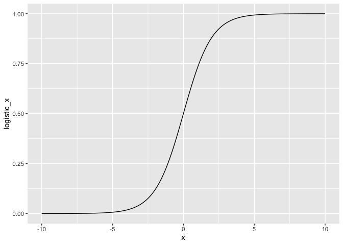<!-- -->

Super sigmoid plotting! The logistic distribution’s cumulative
distribution function has an “S” shape, known as a sigmoid curve.

## Inverse cumulative distribution function

<!--
LO: Knows what a logistic distribution inverse CDF looks like.
-->

The logistic function (logistic distribution CDF) has another important
property: each x input value is transformed to a unique value. That
means that the transformation can be reversed. The *logit function* is
the name for the *inverse logistic function*, which is also the
*logistic distribution inverse cumulative distribution function*. (All
three terms mean exactly the same thing.)

The logit function takes values between zero and one, and returns values
between minus infinity and infinity.

`dplyr` and `ggplot2` are loaded.

**Steps**

1.  Create a tibble containing three columns.

2.  `x` values as a sequence from minus `0.001` to `0.999` in steps of
    `0.001`.

3.  `logit_p` made from `p` transformed with the logistic distribution
    inverse CDF.

4.  `logit_p_man` made from `p` transformed with the equation
    \\(log(\\frac{p}{(1 - p)})\\).

5.  Check that both logit transformations (`logit_p` and `logit_p_man`)
    have the same values with `all.equal()`.

``` r
logistic_distn_inv_cdf <- tibble(
  # Make a seq from 0.001 to 0.999 in steps of 0.001
  p = seq(0.001, 0.999, 0.001),
  # Transform with built-in logistic inverse CDF
  logit_p = qlogis(p),
  # Transform with manual logit
  logit_p_man = log(p / (1 - p))
) 

# Check that each logistic function gives the same results
all.equal(
  logistic_distn_inv_cdf$logit_p,
  logistic_distn_inv_cdf$logit_p_man
)
```

    ## [1] TRUE

6.  Using the `logistic_distn_inv_cdf` dataset, plot `logit_p` versus
    `p` as a line plot.

``` r
# From previous step
logistic_distn_inv_cdf <- tibble(
  p = seq(0.001, 0.999, 0.001),
  logit_p = qlogis(p),
  logit_p_man = log(p / (1 - p))
)

# Using logistic_distn_inv_cdf, plot logit_p vs. p
ggplot(logistic_distn_inv_cdf, aes(p, logit_p)) +
  # Make it a line plot
  geom_line()
```

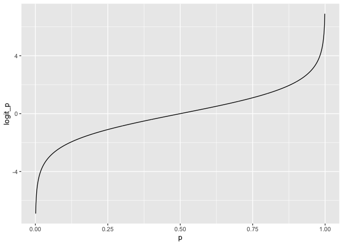<!-- -->

NA

## binomial family argument

<!--
LO: Understands the fmaily argument for glm(), in the context of logistic regression.
-->

The big difference between running a linear regression with `lm()` and
running a logistic regression with `glm()` is that you have to set
`glm()`’s `family` argument to `binomial`. `binomial()` is a function
that returns a list of other functions that tell `glm()` how to perform
calculations in the regression. The two most interesting functions are
`linkinv` and `linkfun`, which are used for transforming variables from
the whole number line (minus infinity to infinity) to probabilities
(zero to one) and back again.

A vector of values, `x`, and a vector of probabilities, `p`, are
available.

**Steps**

1.  Examine the structure of the `binomial()` function. *Notice that it
    contains two elements that are functions,* `binomial()$linkinv`*,
    and* `binomial()$linkfun`.
2.  Call `binomial()$linkinv()` on `x`, assigning to `linkinv_x`.
3.  Check that `linkinv_x` and `plogis()` of `x` give the same results
    with `all.equal()`.
4.  Call `binomial()$linkfun()` on `p`, assigning to `linkfun_p`.
5.  Check that `linkfun_p` and `qlogis()` of `p` give the same results.

``` r
# Create data
x <- seq(-10, 10, 0.2)
p <- seq(0.01, 0.99, 0.01)

# Look at the structure of binomial() function
str(binomial())
```

    ## List of 12
    ##  $ family    : chr "binomial"
    ##  $ link      : chr "logit"
    ##  $ linkfun   :function (mu)  
    ##  $ linkinv   :function (eta)  
    ##  $ variance  :function (mu)  
    ##  $ dev.resids:function (y, mu, wt)  
    ##  $ aic       :function (y, n, mu, wt, dev)  
    ##  $ mu.eta    :function (eta)  
    ##  $ initialize: language {     if (NCOL(y) == 1) { ...
    ##  $ validmu   :function (mu)  
    ##  $ valideta  :function (eta)  
    ##  $ simulate  :function (object, nsim)  
    ##  - attr(*, "class")= chr "family"

``` r
# Call the link inverse on x
linkinv_x <- binomial()$linkinv(x)

# Check linkinv_x and plogis() of x give same results 
all.equal(linkinv_x, plogis(x))
```

    ## [1] TRUE

``` r
# Call the link fun on p
linkfun_p <- binomial()$linkfun(p)

# Check linkfun_p and qlogis() of p give same results 
all.equal(linkfun_p, qlogis(p))
```

    ## [1] TRUE

Terrific transforming! The `binomial()` family object contains `linkinv`
and `linkfun` functions that correspond to the logistic distribution CDF
and inverse CDF respectively. These are used to translate between
numbers and probabilities.

## Logistic distribution parameters

<!--
LO:
-->

The logistic distribution CDF is not just a single curve. In the same
way that the normal distribution has mean and standard deviation
parameters that affect the CDF curve, the logistic distribution has
*location* and *scale* parameters. Here, you’ll visualize how changing
those parameters changes the CDF curve.

How do changes to the parameters change the CDF curve?

> ## *Question*
>
> ???<br> <br> ⬜ As `location` increases, the logistic CDF curve moves
> rightwards. As `scale` increases, the steepness of the slope
> increases.<br> ⬜ As `location` increases, the logistic CDF curve
> moves upwards. As `scale` increases, the steepness of the slope
> increases.<br> ⬜ As `location` increases, the logistic CDF curve
> moves rightwards. As `scale` increases, the steepness of the slope
> decreases.<br> ⬜ As `location` increases, the logistic CDF curve
> moves upwards. As `scale` increases, the steepness of the slope
> decreases.<br>

## How logistic regression works

Theory. Coming soon …

## Likelihood & log-likelihood

<!--
LO: Understands that logistic regression involves maximizing the likelihood metric. 
-->

Linear regression tries to optimize a “sum of squares” metric in order
to find the best fit. That metric isn’t applicable to logistic
regression. Instead, logistic regression tries to optimize a metric
called *likelihood*, or a related metric called *log-likelihood*.

The dashboard shows churn status versus line time since last purchase
from the `churn` dataset. The blue dotted line is the logistic
regression prediction line calculated by ggplot2’s `geom_smooth()`.
(That is, it’s the “best fit” line.) The black solid line shows a
prediction line calculated from the intercept and slope coefficients you
specify as `plogis(intercept + slope * time_since_last_purchase)`.

Change the intercept and slope coefficients and watch how the likelihood
and log-likelihood values change.

As you get closer to the best fit line, what statement is true about
likelihood and log-likelihood?

> ## *Question*
>
> ???<br> <br> ⬜ Both likelihood and log-likelihood increase to a
> maximum value.<br> ⬜ Both likelihood and log-likelihood decrease to a
> minimum value.<br> ⬜ Likelihood increases to a maximum value;
> log-likelihood decreases to a minimum value.<br> ⬜ Likelihood
> decreases to a minimum value; log-likelihood increases to a maximum
> value.<br>

## Logistic regression algorithm

<!--
LO: Can write a simple logistic regression algorithm for a specific dataset. 
-->

Let’s dig into the internals and implement a logistic regression
algorithm. Since R’s `glm()` function is very complex, you’ll stick to
implementing simple logistic regression for a single dataset.

Rather than using sum of squares as the metric, we want to use
likelihood. However, log-likelihood is more computationally stable, so
we’ll use that instead. Actually, there is one more change: since we
want to maximize log-likelihood, but `optim()` defaults to finding
minimum values, it is easier to calculate the *negative* log-likelihood.

The log-likelihood value for each observation is
*l**o**g*(*y*<sub>*p**r**e**d*</sub>) \* *y*<sub>*a**c**t**u**a**l*</sub> + *l**o**g*(1−*y*<sub>*p**r**e**d*</sub>) \* (1−*y*<sub>*a**c**t**u**a**l*</sub>)

The metric to calculate is minus the sum of these log-likelihood
contributions.

The explanatory values (the `time_since_last_purchase` column of
`churn`) are available as `x_actual`. The response values (the
`has_churned` column of `churn`) are available as `y_actual`.

**Steps**

1.  Set the intercept to one.
2.  Set the slope to `0.5`.
3.  Calculate the predicted y-values as the intercept plus the slope
    times the actual x-values, all transformed with the logistic
    distribution CDF.
4.  Calculate the log-likelihood for each term as the log of the
    predicted y-values times the actual y-values, plus the log of one
    minus the predicted y-values times one minus the actual y-values.
5.  Calculate minus the sum of the log-likelihoods for each term.

``` r
# Set the intercept to 1
intercept <- 1

# Set the slope to 0.5
slope <- 0.5

# Calculate the predicted y values
y_pred <- plogis(intercept + slope * x_actual)

# Calculate the log-likelihood for each term
log_likelihoods <- log(y_pred) * y_actual + log(1 - y_pred) * (1 - y_actual)

# Calculate minus the sum of the log-likelihoods for each term
-sum(log_likelihoods)
```

    ## [1] -14623.45

6.  Complete the function body.

7.  Get the intercept from the first element of `coeffs`.

8.  Get the slope from the second element of `coeffs`.

9.  Calculate the predicted y-values as the intercept plus the slope
    times the actual x-values, transformed with the logistic
    distribution CDF.

10. Calculate the log-likelihood for each term as the log of the
    predicted y-values times the actual y-values, plus the log of one
    minus the predicted y-values times one minus the actual y-values.

11. Calculate minus the sum of the log-likelihoods for each term.

``` r
calc_neg_log_likelihood <- function(coeffs) {
  # Get the intercept coeff
  intercept <- coeffs[1]

  # Get the slope coeff
  slope <- coeffs[2]

  # Calculate the predicted y values
  y_pred <- plogis(intercept + slope * x_actual)

  # Calculate the log-likelihood for each term
  log_likelihoods <- log(y_pred) * y_actual + log(1 - y_pred) * (1 - y_actual)

  # Calculate minus the sum of the log-likelihoods for each term
  -sum(log_likelihoods)
}
```

12. Optimize the sum of squares metric.

13. Call an optimization function.

14. Initially guess that the intercept is zero and the slope is one.

15. Use `calc_neg_log_likelihood` as the optimization function.

``` r
# From previous step
calc_neg_log_likelihood <- function(coeffs) {
  intercept <- coeffs[1]
  slope <- coeffs[2]
  y_pred <- plogis(intercept + slope * x_actual)
  log_likelihoods <- log(y_pred) * y_actual + log(1 - y_pred) * (1 - y_actual)
  -sum(log_likelihoods)
}

# Optimize the metric
optim(
  # Initially guess 0 intercept and 1 slope
  par = c(intercept = 0, slope = 1),
  # Use calc_neg_log_likelihood as the optimization fn 
  fn = calc_neg_log_likelihood
)
```

    ## $par
    ##   intercept       slope 
    ## 36.53941325 -0.08280129 
    ## 
    ## $value
    ## [1] -156558.5
    ## 
    ## $counts
    ## function gradient 
    ##       89       NA 
    ## 
    ## $convergence
    ## [1] 0
    ## 
    ## $message
    ## NULL

``` r
# Compare the coefficients to those calculated by glm()
glm(has_churned ~ time_since_last_purchase, data = churn, family = binomial)
```

    ## 
    ## Call:  glm(formula = has_churned ~ time_since_last_purchase, family = binomial, 
    ##     data = churn)
    ## 
    ## Coefficients:
    ##              (Intercept)  time_since_last_purchase  
    ##                 -0.03502                   0.26921  
    ## 
    ## Degrees of Freedom: 399 Total (i.e. Null);  398 Residual
    ## Null Deviance:       554.5 
    ## Residual Deviance: 546.4     AIC: 550.4

Ace algorithmic implementation! To make a really simple version of
`glm()`, you just needed a function to calculate the negative
log-likelihood, and a general-purpose optimization function.
