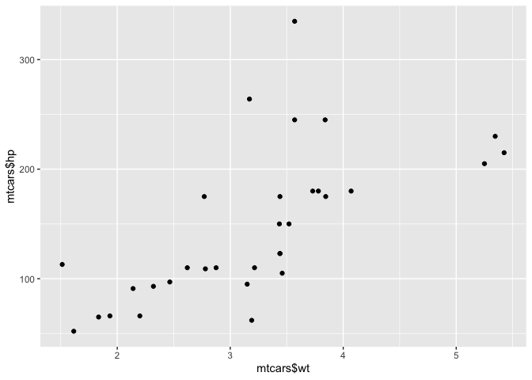

Intermediate R
================

# 1. Conditionals and Control Flow

## Equality

The most basic form of comparison is equality. Let’s briefly recap its
syntax. The following statements all evaluate to `TRUE` (feel free to
try them out in the console).

``` r
3 == (2 + 1)
#> [1] TRUE

"intermediate" != "r"
#> [1] TRUE

TRUE != FALSE
#> [1] TRUE

"Rchitect" != "rchitect"
#> [1] TRUE
```

<sup>Created on 2022-01-19 by the [reprex
package](https://reprex.tidyverse.org) (v2.0.1)</sup>

Notice from the last expression that R is case sensitive: “R” is not
equal to “r”. Keep this in mind when solving the exercises in this
chapter!

**Instructions:**

-   In the editor on the right, write R code to see if `TRUE` equals
    `FALSE`.
-   Likewise, check if `-6 * 14` is *not* equal to `17 - 101`.
-   Next up: comparison of character strings. Ask R whether the strings
    “useR” and “user” are equal.
-   Finally, find out what happens if you compare logicals to numerics:
    are `TRUE` and 1 equal?

**Solution:**

``` r
# Comparison of logicals
TRUE == FALSE
#> [1] FALSE

# Comparison of numerics
-6*14 != 17-101
#> [1] FALSE

# Comparison of character strings
"useR" == "user"
#> [1] FALSE

# Compare a logical with a numeric
TRUE == 1
#> [1] TRUE
```

<sup>Created on 2022-01-19 by the [reprex
package](https://reprex.tidyverse.org) (v2.0.1)</sup>

## Greater and less than

Apart from equality operators, Filip also introduced the *less than* and
*greater than* operators: `<` and `>`. You can also add an equal sign to
express *less than or equal to* or *greater than or equal to*,
respectively. Have a look at the following R expressions, that all
evaluate to `FALSE`:

``` r
(1 + 2) > 4
#> [1] FALSE

"dog" < "Cats"
#> [1] FALSE

TRUE <= FALSE
#> [1] FALSE
```

<sup>Created on 2022-01-19 by the [reprex
package](https://reprex.tidyverse.org) (v2.0.1)</sup>

Remember that for string comparison, R determines the *greater than*
relationship based on alphabetical order. Also, keep in mind that `TRUE`
is treated as `1` for arithmetic, and `FALSE` is treated as `0`.
Therefore, `FALSE < TRUE` is `TRUE`.

**Instructions:**

Write R expressions to check whether:

-   `-6 * 5 + 2` is greater than or equal to `-10 + 1`.
-   “raining” is less than or equal to “raining dogs”.
-   TRUE is greater than FALSE.

**Solution:**

``` r
# Comparison of numerics
-6*5+2>=-10+1
#> [1] FALSE

# Comparison of character strings
"raining" <= "raining dogs"
#> [1] TRUE

# Comparison of logicals
TRUE > FALSE
#> [1] TRUE
```

<sup>Created on 2022-01-19 by the [reprex
package](https://reprex.tidyverse.org) (v2.0.1)</sup>

## Compare vectors

You are already aware that R is very good with vectors. Without having
to change anything about the syntax, R’s relational operators also work
on vectors.

Let’s go back to the example that was started in the video. You want to
figure out whether your activity on social media platforms have paid off
and decide to look at your results for LinkedIn and Facebook. The sample
code in the editor initializes the vectors `linkedin` and `facebook`.
Each of the vectors contains the number of profile views your LinkedIn
and Facebook profiles had over the last seven days.

**Instructions:**

Using relational operators, find a logical answer, i.e. `TRUE` or
`FALSE`, for the following questions:

-   On which days did the number of LinkedIn profile views exceed 15?
-   When was your LinkedIn profile viewed only 5 times or fewer?
-   When was your LinkedIn profile visited more often than your Facebook
    profile?

**Solution:**

``` r
# The linkedin and facebook vectors have already been created for you
linkedin <- c(16, 9, 13, 5, 2, 17, 14)
facebook <- c(17, 7, 5, 16, 8, 13, 14)

# Popular days
linkedin > 15
#> [1]  TRUE FALSE FALSE FALSE FALSE  TRUE FALSE

# Quiet days
linkedin <= 5
#> [1] FALSE FALSE FALSE  TRUE  TRUE FALSE FALSE

# LinkedIn more popular than Facebook
linkedin > facebook
#> [1] FALSE  TRUE  TRUE FALSE FALSE  TRUE FALSE
```

<sup>Created on 2022-01-19 by the [reprex
package](https://reprex.tidyverse.org) (v2.0.1)</sup>

## Compare matrices

R’s ability to deal with different data structures for comparisons does
not stop at vectors. Matrices and relational operators also work
together seamlessly!

Instead of in vectors (as in the previous exercise), the LinkedIn and
Facebook data is now stored in a matrix called `views`. The first row
contains the LinkedIn information; the second row the Facebook
information. The original vectors `facebook` and `linkedin` are still
available as well.

**Instructions:**

Using the relational operators you’ve learned so far, try to discover
the following:

-   When were the views exactly equal to 13? Use the `views` matrix to
    return a logical matrix.
-   For which days were the number of views less than or equal to 14?
    Again, have R return a logical matrix.

**Solution:**

``` r
# The social data has been created for you
views <- matrix(c(linkedin, facebook), nrow = 2, byrow = TRUE)

# When does views equal 13?
views == 13
#>       [,1]  [,2]  [,3]  [,4]  [,5]  [,6]  [,7]
#> [1,] FALSE FALSE  TRUE FALSE FALSE FALSE FALSE
#> [2,] FALSE FALSE FALSE FALSE FALSE  TRUE FALSE

# When is views less than or equal to 14?
views <= 14
#>       [,1] [,2] [,3]  [,4] [,5]  [,6] [,7]
#> [1,] FALSE TRUE TRUE  TRUE TRUE FALSE TRUE
#> [2,] FALSE TRUE TRUE FALSE TRUE  TRUE TRUE
```

<sup>Created on 2022-01-19 by the [reprex
package](https://reprex.tidyverse.org) (v2.0.1)</sup>

## & and \|

Before you work your way through the next exercises, have a look at the
following R expressions. All of them will evaluate to `TRUE`:

``` r
TRUE & TRUE
#> [1] TRUE
FALSE | TRUE
#> [1] TRUE
5 <= 5 & 2 < 3
#> [1] TRUE
3 < 4 | 7 < 6
#> [1] TRUE
```

<sup>Created on 2022-01-19 by the [reprex
package](https://reprex.tidyverse.org) (v2.0.1)</sup>

Watch out: `3 < x < 7` to check if `x` is between 3 and 7 will not work;
you’ll need `3 < x & x < 7` for that.

In this exercise, you’ll be working with the `last` variable. This
variable equals the last value of the `linkedin` vector that you’ve
worked with previously. The `linkedin` vector represents the number of
LinkedIn views your profile had in the last seven days, remember? Both
the variables `linkedin` and `last` have been pre-defined for you.

**Instructions:**

Write R expressions to solve the following questions concerning the
variable `last`:

-   Is `last` under 5 or above 10?
-   Is `last` between 15 and 20, excluding 15 but including 20?

**Solution:**

``` r
last <- tail(linkedin, 1)

# Is last under 5 or above 10?
last < 5 | last > 10
#> [1] TRUE

# Is last between 15 (exclusive) and 20 (inclusive)?
last > 15 & last <= 20
#> [1] FALSE
```

<sup>Created on 2022-01-19 by the [reprex
package](https://reprex.tidyverse.org) (v2.0.1)</sup>

## & and \| (2)

Like relational operators, logical operators work perfectly fine with
vectors and matrices.

Both the vectors `linkedin` and `facebook` are available again. Also a
matrix - `views` - has been defined; its first and second row correspond
to the `linkedin` and `facebook` vectors, respectively. Ready for some
advanced queries to gain more insights into your social outreach?

**Instructions:**

-   When did LinkedIn views exceed 10 *and* did Facebook views fail to
    reach 10 for a particular day? Use the `linkedin` and `facebook`
    vectors.
-   When were one or both of your LinkedIn and Facebook profiles visited
    at least 12 times?
-   When is the `views` matrix equal to a number between 11 and 14,
    excluding 11 and including 14?

**Solution:**

``` r
# linkedin exceeds 10 but facebook below 10
linkedin > 10 & facebook < 10
#> [1] FALSE FALSE  TRUE FALSE FALSE FALSE FALSE

# When were one or both visited at least 12 times?
linkedin >= 12 | facebook >= 12
#> [1]  TRUE FALSE  TRUE  TRUE FALSE  TRUE  TRUE

# When is views between 11 (exclusive) and 14 (inclusive)?
views > 11 & views <= 14
#>       [,1]  [,2]  [,3]  [,4]  [,5]  [,6] [,7]
#> [1,] FALSE FALSE  TRUE FALSE FALSE FALSE TRUE
#> [2,] FALSE FALSE FALSE FALSE FALSE  TRUE TRUE
```

<sup>Created on 2022-01-19 by the [reprex
package](https://reprex.tidyverse.org) (v2.0.1)</sup>

## Reverse the result: !

On top of the `&` and `|` operators, you also learned about the `!`
operator, which negates a logical value. To refresh your memory, here
are some R expressions that use `!`. They all evaluate to `FALSE`:

``` r
!TRUE
#> [1] FALSE
!(5 > 3)
#> [1] FALSE
!!FALSE
#> [1] FALSE
```

<sup>Created on 2022-01-19 by the [reprex
package](https://reprex.tidyverse.org) (v2.0.1)</sup>

What would the following set of R expressions return?

``` r
x <- 5
y <- 7
!(!(x < 4) & !!!(y > 12))
#> [1] FALSE
```

<sup>Created on 2022-01-19 by the [reprex
package](https://reprex.tidyverse.org) (v2.0.1)</sup>

**Possible Answers:**

:white_large_square: `TRUE`<br> :white_check_mark: `FALSE`<br>
:white_large_square: Running this piece of code would throw an
error.<br>

## Blend it all together

With the things you’ve learned by now, you’re able to solve pretty cool
problems.

Instead of recording the number of views for your own LinkedIn profile,
suppose you conducted a survey inside the company you’re working for.
You’ve asked every employee with a LinkedIn profile how many visits
their profile has had over the past seven days. You stored the results
in a data frame called `li_df`. This data frame is available in the
workspace; type `li_df` in the console to check it out.

**Instructions:**

-   Select the entire second column, named `day2`, from the `li_df` data
    frame as a vector and assign it to `second`.
-   Use `second` to create a logical vector, that contains `TRUE` if the
    corresponding number of views is strictly greater than 25 or
    strictly lower than 5 and `FALSE` otherwise. Store this logical
    vector as `extremes`.
-   Use `sum()` on the `extremes` vector to calculate the number of
    `TRUE`s in `extremes` (i.e. to calculate the number of employees
    that are either very popular or very low-profile). Simply print this
    number to the console.

**Solution:**

``` r
# load li_df in your workspace
li_df <- readr::read_rds("data/li_df.rds")

# Select the second column, named day2, from li_df: second
second <- li_df$day2

# Build a logical vector, TRUE if value in second is extreme: extremes
extremes <- (second > 25 | second < 5)

# Count the number of TRUEs in extremes
x <- sum(extremes)

# Solve it with a one-liner
x
```

    ## [1] 16

## The if statement

Before diving into some exercises on the `if` statement, have another
look at its syntax:

``` r
if (condition) {
  expr
}
```

Remember your vectors with social profile views? Let’s look at it from
another angle. The `medium` variable gives information about the social
website; the `num_views` variable denotes the actual number of views
that particular `medium` had on the last day of your recordings. Both
variables have been pre-defined for you.

**Instructions:**

-   Examine the `if` statement that prints out
    `"Showing LinkedIn information"` if the `medium` variable equals
    `"LinkedIn"`.
-   Code an `if` statement that prints `"You are popular!"` to the
    console if the `num_views` variable exceeds 15.

**Solution:**

``` r
# Variables related to your last day of recordings
medium    <- "LinkedIn"
num_views <- 14

# Examine the if statement for medium
if (medium == "LinkedIn") {
  print("Showing LinkedIn information")
}
#> [1] "Showing LinkedIn information"

# Write the if statement for num_views
if (num_views > 15) {
    print("You're popular!")
}
```

<sup>Created on 2022-01-19 by the [reprex
package](https://reprex.tidyverse.org) (v2.0.1)</sup>

## Add an else

You can only use an `else` statement in combination with an `if`
statement. The `else` statement does not require a condition; its
corresponding code is simply run if all of the preceding conditions in
the control structure are `FALSE`. Here’s a recipe for its usage:

``` r
if (condition) {
  expr1
} else {
  expr2
}
```

*It’s important that the `else` keyword comes on the same line as the
closing bracket of the `if` part!*

Both `if` statements that you coded in the previous exercises are
already available to use. It’s now up to you to extend them with the
appropriate `else` statements!

**Instructions:**

Add an `else` statement to both control structures, such that

-   “Unknown medium” gets printed out to the console when the
    if-condition on `medium` does not hold.
-   R prints out “Try to be more visible!” when the if-condition on
    `num_views` is not met.

**Solution:**

``` r
# Control structure for medium
if (medium == "LinkedIn") {
  print("Showing LinkedIn information")
} else {
  print("Unknown medium")
}
#> [1] "Showing LinkedIn information"

# Control structure for num_views
if (num_views > 15) {
  print("You're popular!")
} else {
  print("Try to be more visible!")
}
#> [1] "Try to be more visible!"
```

<sup>Created on 2022-01-19 by the [reprex
package](https://reprex.tidyverse.org) (v2.0.1)</sup>

## Customize further: else if

The `else if` statement allows you to further customize your control
structure. You can add as many `else if` statements as you like. Keep in
mind that R ignores the remainder of the control structure once a
condition has been found that is `TRUE` and the corresponding
expressions have been executed. Here’s an overview of the syntax to
freshen your memory:

``` r
if (condition1) {
  expr1
} else if (condition2) {
  expr2
} else if (condition3) {
  expr3
} else {
  expr4
}
```

*Again, It’s important that the `else if` keywords comes on the same
line as the closing bracket of the previous part of the control
construct!*

**Instructions:**

Add code to both control structures such that:

-   R prints out “Showing Facebook information” if `medium` is equal to
    “Facebook”. Remember that R is case sensitive!
-   “Your number of views is average” is printed if `num_views` is
    between 15 (inclusive) and 10 (exclusive). Feel free to change the
    variables `medium` and `num_views` to see how the control structure
    respond. In both cases, the existing code should be extended in the
    `else if` statement. No existing code should be modified.

**Solution:**

``` r
# Control structure for medium
if (medium == "LinkedIn") {
  print("Showing LinkedIn information")
} else if (medium == "Facebook") {
  # Add code to print correct string when condition is TRUE
  print("Showing Facebook information")
} else {
  print("Unknown medium")
}
#> [1] "Showing LinkedIn information"

# Control structure for num_views
if (num_views > 15) {
  print("You're popular!")
} else if (num_views <= 15 & num_views > 10) {
  # Add code to print correct string when condition is TRUE
  print("Your number of views is average")
} else {
  print("Try to be more visible!")
}
#> [1] "Your number of views is average"
```

<sup>Created on 2022-01-19 by the [reprex
package](https://reprex.tidyverse.org) (v2.0.1)</sup>

## Else if 2.0

You can do anything you want inside if-else constructs. You can even put
in another set of conditional statements. Examine the following code
chunk:

``` r
if (number < 10) {
  if (number < 5) {
    result <- "extra small"
  } else {
    result <- "small"
  }
} else if (number < 100) {
  result <- "medium"
} else {
  result <- "large"
}
print(result)
```

Have a look at the following statements:

1.  If `number` is set to 6, “small” gets printed to the console.
2.  If `number` is set to 100, R prints out “medium”.
3.  If `number` is set to 4, “extra small” gets printed out to the
    console.
4.  If `number` is set to 2500, R will generate an error, as `result`
    will not be defined.

Select the option that lists <u>all</u> the true statements.

**Possible Answers:**

:white_large_square: 2 and 4<br> :white_check_mark: 1 and 4<br>
:white_large_square: 1 and 3<br> :white_large_square: 2 and 3<br>

## Take control!

In this exercise, you will combine everything that you’ve learned so
far: relational operators, logical operators and control constructs.
You’ll need it all!

We’ve pre-defined two values for you: `li` and `fb`, denoting the number
of profile views your LinkedIn and Facebook profile had on the last day
of recordings. Go through the instructions to create R code that
generates a ‘social media score’, `sms`, based on the values of `li` and
`fb`.

**Instructions:**

Finish the control-flow construct with the following behavior:

-   If both `li` and `fb` are 15 or higher, set `sms` equal to double
    the sum of `li` and `fb`.
-   If both `li` and `fb` are strictly below 10, set `sms` equal to half
    the sum of `li` and `fb`.
-   In all other cases, set `sms` equal to `li + fb`.
-   Finally, print the resulting `sms` variable.

**Solution:**

``` r
# Variables related to your last day of recordings
li <- 15
fb <- 9

# Code the control-flow construct
if (li >= 15 & fb >= 15) {
  sms <- 2 * (li + fb)
} else if (li < 10 & fb < 10) {
  sms <- 0.5 * (li + fb)
} else {
  sms <- li + fb
}

# Print the resulting sms to the console
sms
#> [1] 24
```

<sup>Created on 2022-01-19 by the [reprex
package](https://reprex.tidyverse.org) (v2.0.1)</sup>

# 2. Loops

## Write a while loop

Let’s get you started with building a `while` loop from the ground up.
Have another look at its recipe:

``` r
while (condition) {
  expr
}
```

Remember that the `condition` part of this recipe should become `FALSE`
at some point during the execution. Otherwise, the `while` loop will go
on indefinitely.

*If your session expires when you run your code, check the body of your
`while` loop carefully.*

Have a look at the sample code provided; it initializes the `speed`
variables and already provides a `while` loop template to get you
started.

**Instructions:**

Code a `while` loop with the following characteristics:

-   The condition of the `while` loop should check if `speed` is higher
    than 30.
-   Inside the body of the `while` loop, print out `"Slow down!"`.
-   Inside the body of the `while` loop, decrease the `speed` by 7 units
    and assign this new value to `speed` again. This step is crucial;
    otherwise your `while` loop will never stop and *your session will
    expire*.

**Solution:**

``` r
# Initialize the speed variable
speed <- 64

# Code the while loop
while (speed > 30) {
  
print("Slow down!")  
speed <- speed - 7
}
#> [1] "Slow down!"
#> [1] "Slow down!"
#> [1] "Slow down!"
#> [1] "Slow down!"
#> [1] "Slow down!"

# Print out the speed variable
speed
#> [1] 29
```

<sup>Created on 2022-01-19 by the [reprex
package](https://reprex.tidyverse.org) (v2.0.1)</sup>

## Throw in more conditionals

In the previous exercise, you simulated the interaction between a driver
and a driver’s assistant: When the speed was too high, “Slow down!” got
printed out to the console, resulting in a decrease of your speed by 7
units.

There are several ways in which you could make your driver’s assistant
more advanced. For example, the assistant could give you different
messages based on your speed or provide you with a current speed at a
given moment.

A `while` loop similar to the one you’ve coded in the previous exercise
is already available for you to use. It prints out your current speed,
but there’s no code that decreases the `speed` variable yet, which is
pretty dangerous. Can you make the appropriate changes?

**Instructions:**

-   If the speed is greater than 48, have R print out “Slow down big
    time!”, and decrease the speed by `11`.
-   Otherwise, have R simply print out “Slow down!”, and decrease the
    speed by `6`.

If the session keeps timing out and throwing an error, you are probably
stuck in an infinite loop! Check the body of your `while` loop and make
sure you are assigning new values to `speed`.

**Solution:**

``` r
# Extend/adapt the while loop
while (speed > 30) {
  print(paste("Your speed is",speed))
  if (speed > 48) {
    
  print("Slow down big time!")  
  
  speed <- speed - 11
    
  } else {
  print("Slow down!")  
  
  speed <- speed - 6  
  }
}
#> [1] "Your speed is 64"
#> [1] "Slow down big time!"
#> [1] "Your speed is 53"
#> [1] "Slow down big time!"
#> [1] "Your speed is 42"
#> [1] "Slow down!"
#> [1] "Your speed is 36"
#> [1] "Slow down!"
```

<sup>Created on 2022-01-19 by the [reprex
package](https://reprex.tidyverse.org) (v2.0.1)</sup>

## Stop the while loop: break

There are some very rare situations in which severe speeding is
necessary: what if a hurricane is approaching and you have to get away
as quickly as possible? You don’t want the driver’s assistant sending
you speeding notifications in that scenario, right?

This seems like a great opportunity to include the `break` statement in
the `while` loop you’ve been working on. Remember that the `break`
statement is a control statement. When R encounters it, the `while` loop
is abandoned completely.

**Instructions:**

Adapt the `while` loop such that it is abandoned when the `speed` of the
vehicle is greater than 80. This time, the `speed` variable has been
initialized to 88; keep it that way.

**Solution:**

``` r
# Initialize the speed variable
speed <- 88

while (speed > 30) {
  print(paste("Your speed is", speed))
  
  # Break the while loop when speed exceeds 80
  if (speed > 80 ) {
  break  
  }
  
  if (speed > 48) {
    print("Slow down big time!")
    speed <- speed - 11
  } else {
    print("Slow down!")
    speed <- speed - 6
  }
}
#> [1] "Your speed is 88"
```

<sup>Created on 2022-01-19 by the [reprex
package](https://reprex.tidyverse.org) (v2.0.1)</sup>

## Build a while loop from scratch

The previous exercises guided you through developing a pretty advanced
`while` loop, containing a `break` statement and different messages and
updates as determined by control flow constructs. If you manage to solve
this comprehensive exercise using a `while` loop, you’re totally ready
for the next topic: the `for` loop.

**Instructions:**

Finish the `while` loop so that it:

-   prints out the triple of `i`, so `3 * i`, at each run.
-   is abandoned with a `break` if the triple of `i` is divisible by 8,
    but still prints out this triple before breaking.

**Solution:**

``` r
# Initialize i as 1 
i <- 1

# Code the while loop
while (i <= 10) {
  print(3*i)
  if ( 3*i %% 8 == 0 ) {
  break
  }
  i <- i + 1
}
#> [1] 3
#> [1] 6
#> [1] 9
#> [1] 12
#> [1] 15
#> [1] 18
#> [1] 21
#> [1] 24
```

<sup>Created on 2022-01-19 by the [reprex
package](https://reprex.tidyverse.org) (v2.0.1)</sup>

## Loop over a vector

In the previous video, Filip told you about two different strategies for
using the `for` loop. To refresh your memory, consider the following
loops that are equivalent in R:

``` r
primes <- c(2, 3, 5, 7, 11, 13)

# loop version 1
for (p in primes) {
  print(p)
}
#> [1] 2
#> [1] 3
#> [1] 5
#> [1] 7
#> [1] 11
#> [1] 13

# loop version 2
for (i in 1:length(primes)) {
  print(primes[i])
}
#> [1] 2
#> [1] 3
#> [1] 5
#> [1] 7
#> [1] 11
#> [1] 13
```

<sup>Created on 2022-01-19 by the [reprex
package](https://reprex.tidyverse.org) (v2.0.1)</sup>

Remember our `linkedin` vector? It’s a vector that contains the number
of views your LinkedIn profile had in the last seven days. The
`linkedin` vector has been pre-defined so that you can fully focus on
the instructions!

**Instructions:**

Write a `for` loop that iterates over all the elements of `linkedin` and
prints out every element separately. Do this in two ways: using the
*loop version 1* and the *loop version 2* in the example code above.

**Solution:**

``` r
# The linkedin vector has already been defined for you
linkedin <- c(16, 9, 13, 5, 2, 17, 14)

# Loop version 1
for(l in linkedin){
  print(l)
}
#> [1] 16
#> [1] 9
#> [1] 13
#> [1] 5
#> [1] 2
#> [1] 17
#> [1] 14

# Loop version 2
for(l in 1:length(linkedin)){
  print(linkedin[l])
}
#> [1] 16
#> [1] 9
#> [1] 13
#> [1] 5
#> [1] 2
#> [1] 17
#> [1] 14
```

<sup>Created on 2022-01-19 by the [reprex
package](https://reprex.tidyverse.org) (v2.0.1)</sup>

## Loop over a list

Looping over a list is just as easy and convenient as looping over a
vector. There are again two different approaches here:

``` r
primes_list <- list(2, 3, 5, 7, 11, 13)

# loop version 1
for (p in primes_list) {
  print(p)
}
#> [1] 2
#> [1] 3
#> [1] 5
#> [1] 7
#> [1] 11
#> [1] 13

# loop version 2
for (i in 1:length(primes_list)) {
  print(primes_list[[i]])
}
#> [1] 2
#> [1] 3
#> [1] 5
#> [1] 7
#> [1] 11
#> [1] 13
```

<sup>Created on 2022-01-19 by the [reprex
package](https://reprex.tidyverse.org) (v2.0.1)</sup>

Notice that you need double square brackets - `[[ ]]` - to select the
list elements in loop version 2.

Suppose you have a list of all sorts of information on New York City:
its population size, the names of the boroughs, and whether it is the
capital of the United States. We’ve already defined a list `nyc`
containing this information (source: Wikipedia).

**Instructions:**

As in the previous exercise, loop over the `nyc` list in two different
ways to print its elements:

-   Loop directly over the `nyc` list (loop version 1).
-   Define a looping index and do subsetting using double brackets (loop
    version 2).

**Solution:**

``` r
# The nyc list is already specified
nyc <- list(pop      = 8405837, 
            boroughs = c("Manhattan", "Bronx", "Brooklyn", "Queens", "Staten Island"), 
            capital  = FALSE)

# Loop version 1
for(i in nyc) {
  
  print(i)
  
}
#> [1] 8405837
#> [1] "Manhattan"     "Bronx"         "Brooklyn"      "Queens"       
#> [5] "Staten Island"
#> [1] FALSE

# Loop version 2
for(j in 1:length(nyc)) {
  
  print(nyc[[j]])

}
#> [1] 8405837
#> [1] "Manhattan"     "Bronx"         "Brooklyn"      "Queens"       
#> [5] "Staten Island"
#> [1] FALSE
```

<sup>Created on 2022-01-19 by the [reprex
package](https://reprex.tidyverse.org) (v2.0.1)</sup>

## Loop over a matrix

In your workspace, there’s a matrix `ttt`, that represents the status of
a
<a href="http://en.wikipedia.org/wiki/Tic-tac-toe" target="_blank" rel="noopener noreferrer">tic-tac-toe</a>
game. It contains the values “X”, “O” and “NA”. Print out `ttt` to get a
closer look. On row 1 and column 1, there’s “O”, while on row 3 and
column 2 there’s “NA”.

To solve this exercise, you’ll need a `for` loop inside a `for` loop,
often called a nested loop. Doing this in R is a breeze! Simply use the
following recipe:

``` r
for (var1 in seq1) {
  for (var2 in seq2) {
    expr
  }
}
```

**Instructions:**

Finish the nested `for` loops to go over the elements in `ttt`:

-   The outer loop should loop over the rows, with loop index `i` (use
    `1:nrow(ttt)`).
-   The inner loop should loop over the columns, with loop index `j`
    (use `1:ncol(ttt)`).
-   Inside the inner loop, make use of `print()` and `paste()` to print
    out information in the following format: “On row i and column j the
    board contains x”, where `x` is the value on that position.

**Solution:**

``` r
# The tic-tac-toe matrix ttt has already been defined for you
ttt_values <- c("0", NA, "X", NA, "0", "0", "X", NA, "X")
ttt        <- matrix(ttt_values, byrow=TRUE, nrow=3)


# define the double for loop
for (i in 1:nrow(ttt)) {
 for (j in 1:ncol(ttt)) {
    print(paste("On row", i, "and column", j, "the board contains",ttt[i,j]))
  }
}
#> [1] "On row 1 and column 1 the board contains 0"
#> [1] "On row 1 and column 2 the board contains NA"
#> [1] "On row 1 and column 3 the board contains X"
#> [1] "On row 2 and column 1 the board contains NA"
#> [1] "On row 2 and column 2 the board contains 0"
#> [1] "On row 2 and column 3 the board contains 0"
#> [1] "On row 3 and column 1 the board contains X"
#> [1] "On row 3 and column 2 the board contains NA"
#> [1] "On row 3 and column 3 the board contains X"
```

<sup>Created on 2022-01-19 by the [reprex
package](https://reprex.tidyverse.org) (v2.0.1)</sup>

## Mix it up with control flow

Let’s return to the *LinkedIn* profile views data, stored in a vector
`linkedin`. In the first exercise on `for` loops you already did a
simple printout of each element in this vector. A little more in-depth
interpretation of this data wouldn’t hurt, right? Time to throw in some
conditionals! As with the `while` loop, you can use the `if` and `else`
statements inside the `for` loop.

**Instructions:**

Add code to the `for` loop that loops over the elements of the
`linkedin` vector:

-   If the vector element’s value exceeds 10, print out “You’re
    popular!”.
-   If the vector element’s value does not exceed 10, print out “Be more
    visible!”

**Solution:**

``` r
# The linkedin vector has already been defined for you
linkedin <- c(16, 9, 13, 5, 2, 17, 14)

# Code the for loop with conditionals
for (li in linkedin) {
  if (li>10 ) {
    print("You're popular!")
  } else {
    print("Be more visible!")
  }
  print(li)
}
#> [1] "You're popular!"
#> [1] 16
#> [1] "Be more visible!"
#> [1] 9
#> [1] "You're popular!"
#> [1] 13
#> [1] "Be more visible!"
#> [1] 5
#> [1] "Be more visible!"
#> [1] 2
#> [1] "You're popular!"
#> [1] 17
#> [1] "You're popular!"
#> [1] 14
```

<sup>Created on 2022-01-19 by the [reprex
package](https://reprex.tidyverse.org) (v2.0.1)</sup>

## Next, you break it

A possible solution to the previous exercise has been provided for you.
The code loops over the `linkedin` vector and prints out different
messages depending on the values of `li`.

In this exercise, you will use the `break` and `next` statements:

-   The `break` statement abandons the active loop: the remaining code
    in the loop is skipped and the loop is not iterated over anymore.
-   The `next` statement skips the remainder of the code in the loop,
    but continues the iteration.

**Instructions:**

Extend the `for` loop with two new, separate `if` tests as follows:

-   If the vector element’s value exceeds 16, print out “This is
    ridiculous, I’m outta here!” and have R abandon the `for` loop
    (`break`).
-   If the value is lower than 5, print out “This is too embarrassing!”
    and fast-forward to the next iteration (`next`).

**Solution:**

``` r
# The linkedin vector has already been defined for you
linkedin <- c(16, 9, 13, 5, 2, 17, 14)

# Extend the for loop
for (li in linkedin) {
  if (li > 10) {
    print("You're popular!")
  } else {
    print("Be more visible!")
  }
  
  # Add if statement with break
  if (li > 16) {
  print("This is ridiculous, I'm outta here!")
    break
  }
  
  # Add if statement with next
  if (li < 5) {
  print("This is too embarrassing!")
    next
  }
  
  print(li)
}
#> [1] "You're popular!"
#> [1] 16
#> [1] "Be more visible!"
#> [1] 9
#> [1] "You're popular!"
#> [1] 13
#> [1] "Be more visible!"
#> [1] 5
#> [1] "Be more visible!"
#> [1] "This is too embarrassing!"
#> [1] "You're popular!"
#> [1] "This is ridiculous, I'm outta here!"
```

<sup>Created on 2022-01-19 by the [reprex
package](https://reprex.tidyverse.org) (v2.0.1)</sup>

## Build a for loop from scratch

This exercise will not introduce any new concepts on `for` loops.

We already went ahead and defined a variable `rquote`. This variable has
been split up into a vector that contains separate letters and has been
stored in a vector `chars` with the
<a href="http://www.rdocumentation.org/packages/base/functions/strsplit" target="_blank" rel="noopener noreferrer">`strsplit()`</a>
function.

Can you write code that counts the number of r’s that come before the
first u in `rquote`?

**Instructions:**

-   Initialize the variable `rcount`, as 0.
-   Finish the `for` loop:
-   if `char` equals `"r"`, increase the value of `rcount` by 1.
-   if `char` equals `"u"`, leave the `for` loop entirely with a
    `break`.
-   Finally, print out the variable `rcount` to the console to see if
    your code is correct.

**Solution:**

``` r
# Pre-defined variables
rquote <- "r's internals are irrefutably intriguing"
chars  <- strsplit(rquote, split = "")[[1]]

# Initialize rcount
rcount <- 0

# Finish the for loop
for (char in chars) {

  if(char == "r"){
    
    rcount <- rcount + 1
    
  }
  
  if(char == "u") {
    
    break
    
  }
  
}

# Print out rcount
rcount
#> [1] 5
```

<sup>Created on 2022-01-19 by the [reprex
package](https://reprex.tidyverse.org) (v2.0.1)</sup>

# 3. Functions

## Function documentation

Before even thinking of using an R function, you should clarify which
arguments it expects. All the relevant details such as a description,
usage, and arguments can be found in the documentation. To consult the
documentation on the
<a href="http://www.rdocumentation.org/packages/base/functions/sample" target="_blank" rel="noopener noreferrer">`sample()`</a>
function, for example, you can use one of following R commands:

``` r
help(sample)
?sample
```

If you execute these commands, you’ll be redirected to
www.rdocumentation.org.

A quick hack to see the arguments of the
<a href="http://www.rdocumentation.org/packages/base/functions/sample" target="_blank" rel="noopener noreferrer">`sample()`</a>
function is the
<a href="http://www.rdocumentation.org/packages/base/functions/args" target="_blank" rel="noopener noreferrer">`args()`</a>
function. Try it out in the console:

``` r
args(sample)
```

In the next exercises, you’ll be learning how to use the
<a href="http://www.rdocumentation.org/packages/base/functions/mean" target="_blank" rel="noopener noreferrer">`mean()`</a>
function with increasing complexity. The first thing you’ll have to do
is get acquainted with the
<a href="http://www.rdocumentation.org/packages/base/functions/mean" target="_blank" rel="noopener noreferrer">`mean()`</a>
function.

**Instructions:**

-   Consult the documentation on the
    <a href="http://www.rdocumentation.org/packages/base/functions/mean" target="_blank" rel="noopener noreferrer">`mean()`</a>
    function: `?mean` or `help(mean)`.
-   Inspect the arguments of the
    <a href="http://www.rdocumentation.org/packages/base/functions/mean" target="_blank" rel="noopener noreferrer">`mean()`</a>
    function using the
    <a href="http://www.rdocumentation.org/packages/base/functions/args" target="_blank" rel="noopener noreferrer">`args()`</a>
    function.

**Solution:**

``` r
# Consult the documentation on the mean() function
?mean()

# Inspect the arguments of the mean() function
args(mean)
#> function (x, ...) 
#> NULL
```

<sup>Created on 2022-01-19 by the [reprex
package](https://reprex.tidyverse.org) (v2.0.1)</sup>

## Use a function

The documentation on the
<a href="http://www.rdocumentation.org/packages/base/functions/mean" target="_blank" rel="noopener noreferrer">`mean()`</a>
function gives us quite some information:

-   The
    <a href="http://www.rdocumentation.org/packages/base/functions/mean" target="_blank" rel="noopener noreferrer">`mean()`</a>
    function computes the arithmetic mean.
-   The most general method takes multiple arguments: `x` and `...`.
-   The `x` argument should be a vector containing numeric, logical or
    time-related information.

Remember that R can match arguments both by position and by name. Can
you still remember the difference? You’ll find out in this exercise!

Once more, you’ll be working with the view counts of your social network
profiles for the past 7 days. These are stored in the `linkedin` and
`facebook` vectors and have already been created for you.

**Instructions:**

-   Calculate the average number of views for both `linkedin` and
    `facebook` and assign the result to `avg_li` and `avg_fb`,
    respectively. Experiment with different types of argument matching!
-   Print out both `avg_li` and `avg_fb`.

**Solution:**

``` r
# The linkedin and facebook vectors have already been created for you
linkedin <- c(16, 9, 13, 5, 2, 17, 14)
facebook <- c(17, 7, 5, 16, 8, 13, 14)

# Calculate average number of views

avg_li <- mean(linkedin)
avg_fb <- mean(facebook)
# Inspect avg_li and avg_fb
avg_li
#> [1] 10.85714
avg_fb
#> [1] 11.42857
```

<sup>Created on 2022-01-19 by the [reprex
package](https://reprex.tidyverse.org) (v2.0.1)</sup>

## Use a function (2)

Check the documentation on the
<a href="http://www.rdocumentation.org/packages/base/functions/mean" target="_blank" rel="noopener noreferrer">`mean()`</a>
function again:

``` r
?mean
```

The Usage section of the documentation includes two versions of the
<a href="http://www.rdocumentation.org/packages/base/functions/mean" target="_blank" rel="noopener noreferrer">`mean()`</a>
function. The first usage,

``` r
mean(x, ...)
```

is the most general usage of the mean function. The ‘Default S3 method’,
however, is:

``` r
mean(x, trim = 0, na.rm = FALSE, ...)
```

The `...` is called the ellipsis. It is a way for R to pass arguments
along without the function having to name them explicitly. The ellipsis
will be treated in more detail in future courses.

For the remainder of this exercise, just work with the second usage of
the mean function. Notice that both `trim` and `na.rm` have default
values. This makes them **optional arguments**.

**Instructions:**

-   Calculate the mean of the element-wise sum of `linkedin` and
    `facebook` and store the result in a variable `avg_sum`.
-   Calculate the mean once more, but this time set the `trim` argument
    equal to 0.2 and assign the result to `avg_sum_trimmed`.
-   Print out both `avg_sum` and `avg_sum_trimmed`; can you spot the
    difference?

**Solution:**

``` r
# Calculate the mean of the sum
avg_sum <- mean(linkedin + facebook)

# Calculate the trimmed mean of the sum
avg_sum_trimmed <- mean(linkedin + facebook, trim = 0.2 )

# Inspect both new variables
avg_sum
#> [1] 22.28571
avg_sum_trimmed
#> [1] 22.6
```

<sup>Created on 2022-01-19 by the [reprex
package](https://reprex.tidyverse.org) (v2.0.1)</sup>

## Use a function (3)

In the video, Filip guided you through the example of specifying
arguments of the
<a href="http://www.rdocumentation.org/packages/stats/functions/sd" target="_blank" rel="noopener noreferrer">`sd()`</a>
function. The
<a href="http://www.rdocumentation.org/packages/stats/functions/sd" target="_blank" rel="noopener noreferrer">`sd()`</a>
function has an optional argument, `na.rm` that specified whether or not
to remove missing values from the input vector before calculating the
standard deviation.

If you’ve had a good look at the documentation, you’ll know by now that
the
<a href="http://www.rdocumentation.org/packages/base/functions/mean" target="_blank" rel="noopener noreferrer">`mean()`</a>
function also has this argument, `na.rm`, and it does the exact same
thing. By default, it is set to `FALSE`, as the Usage of the default S3
method shows:

``` r
mean(x, trim = 0, na.rm = FALSE, ...)
```

Let’s see what happens if your vectors `linkedin` and `facebook` contain
missing values (`NA`).

**Instructions:**

-   Calculate the average number of LinkedIn profile views, without
    specifying any optional arguments. Simply print the result to the
    console.
-   Calculate the average number of LinkedIn profile views, but this
    time tell R to strip missing values from the input vector.

**Solution:**

``` r
# Basic average of linkedin
mean(linkedin)
#> [1] NA

# Advanced average of linkedin
mean(linkedin, na.rm = TRUE)
#> [1] 12.33333
```

<sup>Created on 2022-01-19 by the [reprex
package](https://reprex.tidyverse.org) (v2.0.1)</sup>

## Functions inside functions

You already know that R functions return objects that you can then use
somewhere else. This makes it easy to use functions inside functions, as
you’ve seen before:

``` r
speed <- 31
print(paste("Your speed is", speed))
#> [1] "Your speed is 31"
```

<sup>Created on 2022-01-19 by the [reprex
package](https://reprex.tidyverse.org) (v2.0.1)</sup>

Notice that both the
<a href="http://www.rdocumentation.org/packages/base/functions/print" target="_blank" rel="noopener noreferrer">`print()`</a>
and
<a href="http://www.rdocumentation.org/packages/base/functions/paste" target="_blank" rel="noopener noreferrer">`paste()`</a>
functions use the ellipsis - `...` - as an argument. Can you figure out
how they’re used?

**Instructions:**

Use `abs()` on `linkedin - facebook` to get the absolute differences
between the daily Linkedin and Facebook profile views. Place the call to
`abs()` *inside* `mean()` to calculate the Mean Absolute Deviation. In
the `mean()` call, make sure to specify `na.rm` to treat missing values
correctly!

**Solution:**

``` r
# Calculate the mean absolute deviation
mean(abs(linkedin - facebook), na.rm = TRUE)
#> [1] 4.8
```

<sup>Created on 2022-01-19 by the [reprex
package](https://reprex.tidyverse.org) (v2.0.1)</sup>

## Required, or optional?

By now, you will probably have a good understanding of the difference
between required and optional arguments. Let’s refresh this difference
by having one last look at the
<a href="http://www.rdocumentation.org/packages/base/functions/mean" target="_blank" rel="noopener noreferrer">`mean()`</a>
function:

``` r
mean(x, trim = 0, na.rm = FALSE, ...)
```

`x` is required; if you do not specify it, R will throw an error. `trim`
and `na.rm` are optional arguments: they have a default value which is
used if the arguments are not explicitly specified.

Which of the following statements about the
<a href="http://www.rdocumentation.org/packages/utils/functions/read.table" target="_blank" rel="noopener noreferrer">`read.table()`</a>
function are true?

1.  `header`, `sep` and `quote` are all optional arguments.
2.  `row.names` and `fileEncoding` don’t have default values.
3.  `read.table("myfile.txt", "-", TRUE)` will throw an error. 4.\*
    `read.table("myfile.txt", sep = "-", header = TRUE)` will throw an
    error.

**Possible Answers:**

<input type="checkbox" disabled checked /> (1) and (3)<br>
<input type="checkbox" disabled /> (2) and (4)<br>
<input type="checkbox" disabled /> (1), (2) and (3)<br>
<input type="checkbox" disabled /> (1), (2) and (3)<br>

## Write your own function

Wow, things are getting serious… you’re about to write your own
function! Before you have a go at it, have a look at the following
function template:

``` r
my_fun <- function(arg1, arg2) {
  body
}
```

Notice that this recipe uses the assignment operator (`<-`) just as if
you were assigning a vector to a variable for example. This is not a
coincidence. Creating a function in R basically is the assignment of a
function object to a variable! In the recipe above, you’re creating a
new R variable `my_fun`, that becomes available in the workspace as soon
as you execute the definition. From then on, you can use the `my_fun` as
a function.

**Instructions:**

-   Create a function `pow_two()`: it takes one argument and returns
    that number squared (that number times itself).
-   Call this newly defined function with `12` as input.
-   Next, create a function `sum_abs()`, that takes two arguments and
    returns the sum of the absolute values of both arguments.
-   Finally, call the function `sum_abs()` with arguments `-2` and `3`
    afterwards.

**Solution:**

``` r
# Create a function pow_two()
pow_two <- function(x) {
  
  x*x
  
}

# Use the function
pow_two(12)
#> [1] 144

# Create a function sum_abs()
sum_abs <- function (a, b){
  
  abs(a)+abs(b)
  
}

# Use the function
sum_abs(-2, 3)
#> [1] 5
```

<sup>Created on 2022-01-19 by the [reprex
package](https://reprex.tidyverse.org) (v2.0.1)</sup>

## Write your own function (2)

There are situations in which your function does not require an input.
Let’s say you want to write a function that gives us the random outcome
of throwing a fair die:

``` r
throw_die <- function() {
  number <- sample(1:6, size = 1)
  number
}

throw_die()
```

Up to you to code a function that doesn’t take any arguments!

**Instructions:**

-   Define a function, `hello()`. It prints out “Hi there!” and returns
    `TRUE`. It has no arguments.
-   Call the function `hello()`, without specifying arguments of course.

**Solution:**

``` r
# Define the function hello()
hello <- function () {
  print("Hi there!")
  TRUE
}

# Call the function hello()
hello()
#> [1] "Hi there!"
#> [1] TRUE
```

<sup>Created on 2022-01-19 by the [reprex
package](https://reprex.tidyverse.org) (v2.0.1)</sup>

## Write your own function (3)

Do you still remember the difference between an argument with and
without default values? The usage section in the `sd()` documentation
shows the following information:

``` r
sd(x, na.rm = FALSE)
```

This tells us that `x` has to be defined for the `sd()` function to be
called correctly, however, `na.rm` already has a default value. Not
specifying this argument won’t cause an error.

You can define default argument values in your own R functions as well.
You can use the following recipe to do so:

``` r
my_fun <- function(arg1, arg2 = val2) {
  body
}
```

The editor on the right already includes an extended version of the
`pow_two()` function from before. Can you finish it?

**Instructions:**

-   Add an optional argument, named `print_info`, that is `TRUE` by
    default.
-   Wrap an `if` construct around the `print()` function: this function
    should only be executed if `print_info` is `TRUE`.
-   Feel free to experiment with the `pow_two()` function you’ve just
    coded.

**Solution:**

``` r
# Finish the pow_two() function
pow_two <- function(x, print_info = TRUE) {
  y <- x ^ 2
  
  if (print_info == TRUE) {
  print(paste(x, "to the power two equals", y))
  }
  return(y)
  
}

pow_two(5)
#> [1] "5 to the power two equals 25"
#> [1] 25
```

<sup>Created on 2022-01-19 by the [reprex
package](https://reprex.tidyverse.org) (v2.0.1)</sup>

## Function scoping

An issue that Filip did not discuss in the video is function scoping. It
implies that variables that are defined inside a function are not
accessible outside that function. Try running the following code and see
if you understand the results:

``` r
pow_two <- function(x) {
  y <- x ^ 2
  return(y)
}
pow_two(4)
y
x
```

`y` was defined inside the `pow_two()` function and therefore it is not
accessible outside of that function. This is also true for the
function’s arguments of course - `x` in this case.

Which statement is correct about the following chunk of code?

``` r
two_dice <- function() {
  possibilities <- 1:6
  dice1 <- sample(possibilities, size = 1)
  dice2 <- sample(possibilities, size = 1)
  dice1 + dice2
}
```

**Possible Answers:**

:white_large_square: Executing `two_dice()` causes an error.<br>
:white_large_square: Executing `res <- two_dice()` makes the contents of
dice1 and dice2 available outside the function.<br> :white_check_mark:
Whatever the way of calling the `two_dice()` function, R won’t have
access to `dice1` and `dice2` outside the function.

## R passes arguments by value

The title gives it away already: R passes arguments by value. What does
this mean? Simply put, it means that an R function cannot change the
variable that you input to that function. Let’s look at a simple example
(try it in the console):

``` r
triple <- function(x) {
  x <- 3*x
  x
}
a <- 5
triple(a)
a
```

Inside the `triple()` function, the argument `x` gets overwritten with
its value times three. Afterwards this new `x` is returned. If you call
this function with a variable `a` set equal to 5, you obtain 15. But did
the value of `a` change? If R were to pass `a` to `triple()` *by
reference*, the override of the `x` *inside* the function would ripple
through to the variable `a`, outside the function. However, R passes *by
value*, so the R objects you pass to a function can never change unless
you do an explicit assignment. `a` remains equal to 5, even after
calling `triple(a)`.

Can you tell which one of the following statements is <u>false</u> about
the following piece of code?

``` r
increment <- function(x, inc = 1) {
  x <- x + inc
  x
}
count <- 5
a <- increment(count, 2)
b <- increment(count)
count <- increment(count, 2)
```

**Possible Answers:**

:white_large_square: `a` and `b` equal 7 and 6 respectively after
executing this code block.<br> :white_large_square: After the first call
of `increment()`, where `a` is defined, `a` equals 7 and `count` equals
5.<br> :white_check_mark: In the end, `count` will equal 10.<br>
:white_large_square: In the last expression, the value of `count` was
actually changed because of the explicit assignment.<br>

## R you functional?

Now that you’ve acquired some skills in defining functions with
different types of arguments and return values, you should try to create
more advanced functions. As you’ve noticed in the previous exercises,
it’s perfectly possible to add control-flow constructs, loops and even
other functions to your function body.

Remember our social media example? The vectors `linkedin` and `facebook`
are already defined in the workspace so you can get your hands dirty
straight away. As a first step, you will be writing a function that can
interpret a single value of this vector. In the next exercise, you will
write another function that can handle an entire vector at once.

**Instructions:**

-   Finish the function definition for `interpret()`, that interprets
    the number of profile views on a single day:
-   The function takes one argument, `num_views`.
-   If `num_views` is greater than 15, the function prints out “You’re
    popular!” to the console and returns `num_views`.
-   Else, the function prints out “Try to be more visible!” and returns
    0.
-   Finally, call the `interpret()` function twice: on the first value
    of the `linkedin` vector and on the second element of the `facebook`
    vector.

**Solution:**

``` r
# Define the interpret function
interpret <- function(num_views) {
  if (num_views > 15) {
    
    print("You're popular!")
    num_views
    
  } else {

   print("Try to be more visible!")
   return(0)
   
  }
}

# Call the interpret function twice
interpret(linkedin[1])
#> [1] "You're popular!"
#> [1] 16
interpret(facebook[2])
#> [1] "Try to be more visible!"
#> [1] 0
```

<sup>Created on 2022-01-19 by the [reprex
package](https://reprex.tidyverse.org) (v2.0.1)</sup>

## R you functional? (2)

A possible implementation of the `interpret()` function has been
provided for you. In this exercise you’ll be writing another function
that will use the `interpret()` function to interpret *all* the data
from your daily profile views inside a vector. Furthermore, your
function will return the sum of views on popular days, if asked for. A
`for` loop is ideal for iterating over all the vector elements. The
ability to return the sum of views on popular days is something you can
code through a function argument with a default value.

**Instructions:**

Finish the template for the `interpret_all()` function:

-   Make `return_sum` an optional argument, that is `TRUE` by default.
-   Inside the `for` loop, iterate over all `views`: on every iteration,
    add the result of `interpret(v)` to `count`. Remember that
    `interpret(v)` returns `v` for popular days, and `0` otherwise. At
    the same time, `interpret(v)` will also do some printouts.
-   Finish the `if` construct:
-   If `return_sum` is `TRUE`, return `count`.
-   Else, return `NULL`.

Call this newly defined function on both `linkedin` and `facebook`.

**Solution:**

``` r
# The linkedin and facebook vectors have already been created for you
linkedin <- c(16, 9, 13, 5, 2, 17, 14)
facebook <- c(17, 7, 5, 16, 8, 13, 14)

# The interpret() can be used inside interpret_all()
interpret <- function(num_views) {
  if (num_views > 15) {
    print("You're popular!")
    return(num_views)
  } else {
    print("Try to be more visible!")
    return(0)
  }
}

# Define the interpret_all() function
# views: vector with data to interpret
# return_sum: return total number of views on popular days?
interpret_all <- function(views, return_sum = TRUE) {
  count <- 0

  for (v in views) {

      count <- count + interpret(v)
        
  }

  if (return_sum == TRUE) {
    return(count)
  } else {
    return(NULL)
  }
}

# Call the interpret_all() function on both linkedin and facebook
interpret_all(linkedin)
#> [1] "You're popular!"
#> [1] "Try to be more visible!"
#> [1] "Try to be more visible!"
#> [1] "Try to be more visible!"
#> [1] "Try to be more visible!"
#> [1] "You're popular!"
#> [1] "Try to be more visible!"
#> [1] 33
interpret_all(facebook)
#> [1] "You're popular!"
#> [1] "Try to be more visible!"
#> [1] "Try to be more visible!"
#> [1] "You're popular!"
#> [1] "Try to be more visible!"
#> [1] "Try to be more visible!"
#> [1] "Try to be more visible!"
#> [1] 33
```

<sup>Created on 2022-01-19 by the [reprex
package](https://reprex.tidyverse.org) (v2.0.1)</sup>

## Load an R Package

There are basically two extremely important functions when it comes down
to R packages:

-   <a href="http://www.rdocumentation.org/packages/utils/functions/install.packages" target="_blank" rel="noopener noreferrer">`install.packages()`</a>,
    which as you can expect, installs a given package.
-   <a href="http://www.rdocumentation.org/packages/base/functions/library" target="_blank" rel="noopener noreferrer">`library()`</a>
    which loads packages, i.e. attaches them to the search list on your
    R workspace.

To install packages, you need administrator privileges. This means that
<a href="http://www.rdocumentation.org/packages/utils/functions/install.packages" target="_blank" rel="noopener noreferrer">`install.packages()`</a>
will thus not work in the DataCamp interface. However, almost all CRAN
packages are installed on our servers. You can load them with
<a href="http://www.rdocumentation.org/packages/base/functions/library" target="_blank" rel="noopener noreferrer">`library()`</a>.

In this exercise, you’ll be learning how to load the `ggplot2` package,
a powerful package for data visualization. You’ll use it to create a
plot of two variables of the `mtcars` data frame. The data has already
been prepared for you in the workspace.

Before starting, execute the following commands in the console:

-   `search()`, to look at the currently attached packages and
-   `qplot(mtcars$wt, mtcars$hp)`, to build a plot of two variables of
    the `mtcars` data frame.

An error should occur, because you haven’t loaded the `ggplot2` package
yet!

**Instructions:**

-   To fix the error you saw in the console, **load** the
    <a href="http://www.rdocumentation.org/packages/ggplot2" target="_blank" rel="noopener noreferrer">`ggplot2`</a>
    package. Make sure you are *loading* (and not *installing*) the
    package!
-   Now, retry calling the
    <a href="http://www.rdocumentation.org/packages/ggplot2/functions/qplot" target="_blank" rel="noopener noreferrer">`qplot()`</a>
    function with the same arguments.
-   Finally, check out the currently attached packages again.

**Solution:**

``` r
# Load the ggplot2 package
library(ggplot2)

# Retry the qplot() function
qplot(mtcars$wt, mtcars$hp)
```

<!-- -->

``` r
# Check out the currently attached packages again
search()
```

    ##  [1] ".GlobalEnv"        "package:ggplot2"   "package:stats"    
    ##  [4] "package:graphics"  "package:grDevices" "package:utils"    
    ##  [7] "package:datasets"  "package:methods"   "Autoloads"        
    ## [10] "package:base"

## Different ways to load a package

The
<a href="http://www.rdocumentation.org/packages/base/functions/library" target="_blank" rel="noopener noreferrer">`library()`</a>
and
<a href="http://www.rdocumentation.org/packages/base/functions/library" target="_blank" rel="noopener noreferrer">`require()`</a>
functions are not very picky when it comes down to argument types: both
`library(rjson)` and `library("rjson")` work perfectly fine for loading
a package.

Have a look at some more code chunks that (attempt to) load one or more
packages:

``` r
# Chunk 1
library(data.table)
require(rjson)

# Chunk 2
library("data.table")
require(rjson)

# Chunk 3
library(data.table)
require(rjson, character.only = TRUE)

# Chunk 4
library(c("data.table", "rjson"))
```

Select the option that lists <u>all</u> of the chunks that do not
generate an error. The console is yours to experiment in.

**Possible Answers:**

:white_large_square: Only (1)<br> :white_check_mark: (1) and (2)<br>
:white_large_square: (1), (2) and (3)<br> :white_large_square: All of
them are valid<br>

# 4. The apply family

## Use lapply with a built-in R function

Before you go about solving the exercises below, have a look at the
documentation of the
<a href="http://www.rdocumentation.org/packages/base/functions/lapply" target="_blank" rel="noopener noreferrer">`lapply()`</a>
function. The Usage section shows the following expression:

``` r
lapply(X, FUN, ...)
```

To put it generally, `lapply` takes a vector or list `X`, and applies
the function `FUN` to each of its members. If `FUN` requires additional
arguments, you pass them after you’ve specified `X` and `FUN` (`...`).
The output of `lapply()` is a list, the same length as `X`, where each
element is the result of applying `FUN` on the corresponding element of
`X`.

Now that you are truly brushing up on your data science skills, let’s
revisit some of the most relevant figures in data science history. We’ve
compiled a vector of famous mathematicians/statisticians and the year
they were born. Up to you to extract some information!

**Instructions:**

-   Have a look at the
    <a href="http://www.rdocumentation.org/packages/base/functions/strsplit" target="_blank" rel="noopener noreferrer">`strsplit()`</a>
    calls, that splits the strings in `pioneers` on the `:` sign. The
    result, `split_math` is a list of 4 character vectors: the first
    vector element represents the name, the second element the birth
    year.
-   Use
    <a href="http://www.rdocumentation.org/packages/base/functions/lapply" target="_blank" rel="noopener noreferrer">`lapply()`</a>
    to convert the character vectors in `split_math` to lowercase
    letters: apply
    <a href="http://www.rdocumentation.org/packages/base/functions/chartr" target="_blank" rel="noopener noreferrer">`tolower()`</a>
    on each of the elements in `split_math`. Assign the result, which is
    a list, to a new variable `split_low`.
-   Finally, inspect the contents of `split_low` with
    <a href="http://www.rdocumentation.org/packages/utils/functions/str" target="_blank" rel="noopener noreferrer">`str()`</a>.

**Solution:**

``` r
# The vector pioneers has already been created for you
pioneers <- c("GAUSS:1777", "BAYES:1702", "PASCAL:1623", "PEARSON:1857")

# Split names from birth year
split_math <- strsplit(pioneers, split = ":")
split_math
#> [[1]]
#> [1] "GAUSS" "1777" 
#> 
#> [[2]]
#> [1] "BAYES" "1702" 
#> 
#> [[3]]
#> [1] "PASCAL" "1623"  
#> 
#> [[4]]
#> [1] "PEARSON" "1857"
# Convert to lowercase strings: split_low
split_low <- lapply(split_math, tolower)

# Take a look at the structure of split_low
str(split_low)
#> List of 4
#>  $ : chr [1:2] "gauss" "1777"
#>  $ : chr [1:2] "bayes" "1702"
#>  $ : chr [1:2] "pascal" "1623"
#>  $ : chr [1:2] "pearson" "1857"
```

<sup>Created on 2022-01-19 by the [reprex
package](https://reprex.tidyverse.org) (v2.0.1)</sup>

## Use lapply with your own function

As Filip explained in the instructional video, you can use
<a href="http://www.rdocumentation.org/packages/base/functions/lapply" target="_blank" rel="noopener noreferrer">`lapply()`</a>
on your own functions as well. You just need to code a new function and
make sure it is available in the workspace. After that, you can use the
function inside
<a href="http://www.rdocumentation.org/packages/base/functions/lapply" target="_blank" rel="noopener noreferrer">`lapply()`</a>
just as you did with base R functions.

In the previous exercise you already used
<a href="http://www.rdocumentation.org/packages/base/functions/lapply" target="_blank" rel="noopener noreferrer">`lapply()`</a>
once to convert the information about your favorite pioneering
statisticians to a list of vectors composed of two character strings.
Let’s write some code to select the names and the birth years
separately.

The sample code already includes code that defined `select_first()`,
that takes a vector as input and returns the first element of this
vector.

**Instructions:**

-   Apply `select_first()` over the elements of `split_low` with
    <a href="http://www.rdocumentation.org/packages/base/functions/lapply" target="_blank" rel="noopener noreferrer">`lapply()`</a>
    and assign the result to a new variable `names`.
-   Next, write a function `select_second()` that does the exact same
    thing for the second element of an inputted vector.
-   Finally, apply the `select_second()` function over `split_low` and
    assign the output to the variable `years`.

**Solution:**

``` r
# Code from previous exercise:
pioneers  <- c("GAUSS:1777", "BAYES:1702", "PASCAL:1623", "PEARSON:1857")
split     <- strsplit(pioneers, split = ":")
split_low <- lapply(split, tolower)

# Write function select_first()
select_first <- function(x) {
  x[1]
}

# Apply select_first() over split_low: names
names <- lapply(split_low, select_first)

# Write function select_second()
select_second <- function(x) {
  x[2]
}

# Apply select_second() over split_low: years
years <- lapply(split_low, select_second)
```

<sup>Created on 2022-01-19 by the [reprex
package](https://reprex.tidyverse.org) (v2.0.1)</sup>

## lapply and anonymous functions

Writing your own functions and then using them inside
<a href="http://www.rdocumentation.org/packages/base/functions/lapply" target="_blank" rel="noopener noreferrer">`lapply()`</a>
is quite an accomplishment! But defining functions to use them only once
is kind of overkill, isn’t it? That’s why you can use so-called
**anonymous functions** in R.

Previously, you learned that functions in R are objects in their own
right. This means that they aren’t automatically bound to a name. When
you create a function, you can use the assignment operator to give the
function a name. It’s perfectly possible, however, to not give the
function a name. This is called an anonymous function:

``` r
# Named function
triple <- function(x) { 3 * x }

# Anonymous function with same implementation
function(x) { 3 * x }

# Use anonymous function inside lapply()
lapply(list(1,2,3), function(x) { 3 * x })
```

**Instructions:**

-   Transform the first call of
    <a href="http://www.rdocumentation.org/packages/base/functions/lapply" target="_blank" rel="noopener noreferrer">`lapply()`</a>
    such that it uses an anonymous function that does the same thing.
-   In a similar fashion, convert the second call of `lapply` to use an
    anonymous version of the `select_second()` function.
-   Remove both the definitions of `select_first()` and
    `select_second()`, as they are no longer useful.

**Solution:**

``` r
# Transform: use anonymous function inside lapply
names <- lapply(split_low, function(x){x[1]})

# Transform: use anonymous function inside lapply
years <- lapply(split_low, function(x){x[2]})
```

<sup>Created on 2022-01-19 by the [reprex
package](https://reprex.tidyverse.org) (v2.0.1)</sup>

## Use lapply with additional arguments

In the video, the `triple()` function was transformed to the
`multiply()` function to allow for a more generic approach.
<a href="http://www.rdocumentation.org/packages/base/functions/lapply" target="_blank" rel="noopener noreferrer">`lapply()`</a>
provides a way to handle functions that require more than one argument,
such as the `multiply()` function:

``` r
multiply <- function(x, factor) {
  x * factor
}
lapply(list(1,2,3), multiply, factor = 3)
```

On the right we’ve included a generic version of the select functions
that you’ve coded earlier: `select_el()`. It takes a vector as its first
argument, and an index as its second argument. It returns the vector’s
element at the specified index.

**Instructions:**

Use `lapply()` twice to call `select_el()` over all elements in
`split_low`: once with the `index` equal to 1 and a second time with the
index equal to 2. Assign the result to `names` and `years`,
respectively.

**Solution:**

``` r
# Generic select function
select_el <- function(x, index) {
  x[index]
}

# Use lapply() twice on split_low: names and years
names <- lapply(split_low, select_el, index = 1)
years <- lapply(split_low, select_el, index = 2)
```

<sup>Created on 2022-01-19 by the [reprex
package](https://reprex.tidyverse.org) (v2.0.1)</sup>

## Apply functions that return NULL

In all of the previous exercises, it was assumed that the functions that
were applied over vectors and lists actually returned a meaningful
result. For example, the
<a href="http://www.rdocumentation.org/packages/base/functions/chartr" target="_blank" rel="noopener noreferrer">`tolower()`</a>
function simply returns the strings with the characters in lowercase.
This won’t always be the case. Suppose you want to display the structure
of every element of a list. You could use the
<a href="http://www.rdocumentation.org/packages/utils/functions/str" target="_blank" rel="noopener noreferrer">`str()`</a>
function for this, which returns `NULL`:

``` r
lapply(list(1, "a", TRUE), str)
```

This call actually returns a list, the same size as the input list,
containing all `NULL` values. On the other hand calling

``` r
str(TRUE)
```

on its own prints only the structure of the logical to the console, not
`NULL`. That’s because
<a href="http://www.rdocumentation.org/packages/utils/functions/str" target="_blank" rel="noopener noreferrer">`str()`</a>
uses
<a href="http://www.rdocumentation.org/packages/base/functions/invisible" target="_blank" rel="noopener noreferrer">`invisible()`</a>
behind the scenes, which returns an *invisible copy* of the return
value, `NULL` in this case. This prevents it from being printed when the
result of
<a href="http://www.rdocumentation.org/packages/utils/functions/str" target="_blank" rel="noopener noreferrer">`str()`</a>
is not assigned.

What will the following code chunk return (`split_low` is already
available in the workspace)? Try to reason about the result before
simply executing it in the console!

``` r
lapply(split_low, function(x) {
  if (nchar(x[1]) > 5) {
    return(NULL)
  } else {
    return(x[2])
  }
})
```

**Possible Answers:**

:white_large_square: `list(NULL, NULL, "1623", "1857")`<br>
:white_large_square: `list("gauss", "bayes", NULL, NULL)`<br>
:white_check_mark: `list("1777", "1702", NULL, NULL)`<br>
:white_large_square: `list("1777", "1702")`<br>

## How to use sapply

You can use
<a href="http://www.rdocumentation.org/packages/base/functions/lapply" target="_blank" rel="noopener noreferrer">`sapply()`</a>
similar to how you used
<a href="http://www.rdocumentation.org/packages/base/functions/lapply" target="_blank" rel="noopener noreferrer">`lapply()`</a>.
The first argument of
<a href="http://www.rdocumentation.org/packages/base/functions/lapply" target="_blank" rel="noopener noreferrer">`sapply()`</a>
is the list or vector `X` over which you want to apply a function,
`FUN`. Potential additional arguments to this function are specified
afterwards (`...`):

``` r
sapply(X, FUN, ...)
```

In the next couple of exercises, you’ll be working with the variable
`temp`, that contains temperature measurements for 7 days. `temp` is a
list of length 7, where each element is a vector of length 5,
representing 5 measurements on a given day. This variable has already
been defined in the workspace: type `str(temp)` to see its structure.

**Instructions:**

-   Use
    <a href="http://www.rdocumentation.org/packages/base/functions/lapply" target="_blank" rel="noopener noreferrer">`lapply()`</a>
    to calculate the minimum (built-in function
    <a href="http://www.rdocumentation.org/packages/base/functions/Extremes" target="_blank" rel="noopener noreferrer">`min()`</a>)
    of the temperature measurements for every day.
-   Do the same thing but this time with
    <a href="http://www.rdocumentation.org/packages/base/functions/lapply" target="_blank" rel="noopener noreferrer">`sapply()`</a>.
    See how the output differs.
-   Use
    <a href="http://www.rdocumentation.org/packages/base/functions/lapply" target="_blank" rel="noopener noreferrer">`lapply()`</a>
    to compute the the maximum
    (<a href="http://www.rdocumentation.org/packages/base/functions/Extremes" target="_blank" rel="noopener noreferrer">`max()`</a>)
    temperature for each day.
-   Again, use
    <a href="http://www.rdocumentation.org/packages/base/functions/lapply" target="_blank" rel="noopener noreferrer">`sapply()`</a>
    to solve the same question and see how
    <a href="http://www.rdocumentation.org/packages/base/functions/lapply" target="_blank" rel="noopener noreferrer">`lapply()`</a>
    and
    <a href="http://www.rdocumentation.org/packages/base/functions/lapply" target="_blank" rel="noopener noreferrer">`sapply()`</a>
    differ.

**Solution:**

``` r
# temp has already been defined in the workspace
temp <- list(c(3,7,9,6,-1),
             c(6,9,12,13,5),
             c(4,8,3,-1,-3),
             c(1,4,7,2,-2),
             c(5,7,9,4,2),
             c(-3,5,8,9,4),
             c(3,6,9,4,1))
  
# Use lapply() to find each day's minimum temperature
lapply(temp, min)
#> [[1]]
#> [1] -1
#> 
#> [[2]]
#> [1] 5
#> 
#> [[3]]
#> [1] -3
#> 
#> [[4]]
#> [1] -2
#> 
#> [[5]]
#> [1] 2
#> 
#> [[6]]
#> [1] -3
#> 
#> [[7]]
#> [1] 1

# Use sapply() to find each day's minimum temperature
sapply(temp, min)
#> [1] -1  5 -3 -2  2 -3  1

# Use lapply() to find each day's maximum temperature
lapply(temp, max)
#> [[1]]
#> [1] 9
#> 
#> [[2]]
#> [1] 13
#> 
#> [[3]]
#> [1] 8
#> 
#> [[4]]
#> [1] 7
#> 
#> [[5]]
#> [1] 9
#> 
#> [[6]]
#> [1] 9
#> 
#> [[7]]
#> [1] 9

# Use sapply() to find each day's maximum temperature
sapply(temp, max)
#> [1]  9 13  8  7  9  9  9
```

<sup>Created on 2022-01-19 by the [reprex
package](https://reprex.tidyverse.org) (v2.0.1)</sup>

## sapply with your own function

Like
<a href="http://www.rdocumentation.org/packages/base/functions/lapply" target="_blank" rel="noopener noreferrer">`lapply()`</a>,
<a href="http://www.rdocumentation.org/packages/base/functions/lapply" target="_blank" rel="noopener noreferrer">`sapply()`</a>
allows you to use self-defined functions and apply them over a vector or
a list:

``` r
sapply(X, FUN, ...)
```

Here, `FUN` can be one of R’s built-in functions, but it can also be a
function you wrote. This self-written function can be defined before
hand, or can be inserted directly as an anonymous function.

**Instructions:**

-   Finish the definition of `extremes_avg()`: it takes a vector of
    temperatures and calculates the average of the minimum and maximum
    temperatures of the vector.
-   Next, use this function inside
    <a href="http://www.rdocumentation.org/packages/base/functions/lapply" target="_blank" rel="noopener noreferrer">`sapply()`</a>
    to apply it over the vectors inside `temp`.
-   Use the same function over `temp` with
    <a href="http://www.rdocumentation.org/packages/base/functions/lapply" target="_blank" rel="noopener noreferrer">`lapply()`</a>
    and see how the outputs differ.

**Solution:**

``` r
# Finish function definition of extremes_avg
extremes_avg <- function(x) {
  ( min(x) + max(x) ) / 2
}

# Apply extremes_avg() over temp using sapply()
sapply(temp, extremes_avg)
#> [1] 4.0 9.0 2.5 2.5 5.5 3.0 5.0

# Apply extremes_avg() over temp using lapply()
lapply(temp, extremes_avg)
#> [[1]]
#> [1] 4
#> 
#> [[2]]
#> [1] 9
#> 
#> [[3]]
#> [1] 2.5
#> 
#> [[4]]
#> [1] 2.5
#> 
#> [[5]]
#> [1] 5.5
#> 
#> [[6]]
#> [1] 3
#> 
#> [[7]]
#> [1] 5
```

<sup>Created on 2022-01-19 by the [reprex
package](https://reprex.tidyverse.org) (v2.0.1)</sup>

## sapply with function returning vector

In the previous exercises, you’ve seen how
<a href="http://www.rdocumentation.org/packages/base/functions/lapply" target="_blank" rel="noopener noreferrer">`sapply()`</a>
simplifies the list that
<a href="http://www.rdocumentation.org/packages/base/functions/lapply" target="_blank" rel="noopener noreferrer">`lapply()`</a>
would return by turning it into a vector. But what if the function
you’re applying over a list or a vector returns a vector of length
greater than 1? If you don’t remember from the video, don’t waste more
time in the valley of ignorance and head over to the instructions!

**Instructions:**

-   Finish the definition of the `extremes()` function. It takes a
    vector of numerical values and returns a vector containing the
    minimum and maximum values of a given vector, with the names “min”
    and “max”, respectively.
-   Apply this function over the vector `temp` using
    <a href="http://www.rdocumentation.org/packages/base/functions/lapply" target="_blank" rel="noopener noreferrer">`sapply()`</a>.
-   Finally, apply this function over the vector `temp` using
    <a href="http://www.rdocumentation.org/packages/base/functions/lapply" target="_blank" rel="noopener noreferrer">`lapply()`</a>
    as well.

**Solution:**

``` r
# Create a function that returns min and max of a vector: extremes
extremes <- function(x) {
  c(min = min(x), max = max(x))
}

# Apply extremes() over temp with sapply()
sapply(temp, extremes)
#>     [,1] [,2] [,3] [,4] [,5] [,6] [,7]
#> min   -1    5   -3   -2    2   -3    1
#> max    9   13    8    7    9    9    9

# Apply extremes() over temp with lapply()
lapply(temp, extremes)
#> [[1]]
#> min max 
#>  -1   9 
#> 
#> [[2]]
#> min max 
#>   5  13 
#> 
#> [[3]]
#> min max 
#>  -3   8 
#> 
#> [[4]]
#> min max 
#>  -2   7 
#> 
#> [[5]]
#> min max 
#>   2   9 
#> 
#> [[6]]
#> min max 
#>  -3   9 
#> 
#> [[7]]
#> min max 
#>   1   9
```

<sup>Created on 2022-01-19 by the [reprex
package](https://reprex.tidyverse.org) (v2.0.1)</sup>

## sapply can’t simplify, now what?

It seems like we’ve hit the jackpot with
<a href="http://www.rdocumentation.org/packages/base/functions/lapply" target="_blank" rel="noopener noreferrer">`sapply()`</a>.
On all of the examples so far,
<a href="http://www.rdocumentation.org/packages/base/functions/lapply" target="_blank" rel="noopener noreferrer">`sapply()`</a>
was able to nicely simplify the rather bulky output of
<a href="http://www.rdocumentation.org/packages/base/functions/lapply" target="_blank" rel="noopener noreferrer">`lapply()`</a>.
But, as with life, there are things you can’t simplify. How does
<a href="http://www.rdocumentation.org/packages/base/functions/lapply" target="_blank" rel="noopener noreferrer">`sapply()`</a>
react?

We already created a function, `below_zero()`, that takes a vector of
numerical values and returns a vector that only contains the values that
are strictly below zero.

**Instructions:**

-   Apply `below_zero()` over `temp` using
    <a href="http://www.rdocumentation.org/packages/base/functions/lapply" target="_blank" rel="noopener noreferrer">`sapply()`</a>
    and store the result in `freezing_s`.
-   Apply `below_zero()` over `temp` using
    <a href="http://www.rdocumentation.org/packages/base/functions/lapply" target="_blank" rel="noopener noreferrer">`lapply()`</a>.
    Save the resulting list in a variable `freezing_l`.
-   Compare `freezing_s` to `freezing_l` using the
    <a href="http://www.rdocumentation.org/packages/base/functions/identical" target="_blank" rel="noopener noreferrer">`identical()`</a>
    function.

**Solution:**

``` r
# Definition of below_zero()
below_zero <- function(x) {
  return(x[x < 0])
}

# Apply below_zero over temp using sapply(): freezing_s
freezing_s <- sapply(temp, below_zero)
freezing_s
#> [[1]]
#> [1] -1
#> 
#> [[2]]
#> numeric(0)
#> 
#> [[3]]
#> [1] -1 -3
#> 
#> [[4]]
#> [1] -2
#> 
#> [[5]]
#> numeric(0)
#> 
#> [[6]]
#> [1] -3
#> 
#> [[7]]
#> numeric(0)
# Apply below_zero over temp using lapply(): freezing_l
freezing_l <- lapply(temp, below_zero)
freezing_l
#> [[1]]
#> [1] -1
#> 
#> [[2]]
#> numeric(0)
#> 
#> [[3]]
#> [1] -1 -3
#> 
#> [[4]]
#> [1] -2
#> 
#> [[5]]
#> numeric(0)
#> 
#> [[6]]
#> [1] -3
#> 
#> [[7]]
#> numeric(0)
# Are freezing_s and freezing_l identical?
identical(freezing_s, freezing_l)
#> [1] TRUE
```

<sup>Created on 2022-01-19 by the [reprex
package](https://reprex.tidyverse.org) (v2.0.1)</sup>

## sapply with functions that return NULL

You already have some apply tricks under your sleeve, but you’re surely
hungry for some more, aren’t you? In this exercise, you’ll see how
<a href="http://www.rdocumentation.org/packages/base/functions/lapply" target="_blank" rel="noopener noreferrer">`sapply()`</a>
reacts when it is used to apply a function that returns `NULL` over a
vector or a list.

A function `print_info()`, that takes a vector and prints the average of
this vector, has already been created for you. It uses the
<a href="http://www.rdocumentation.org/packages/base/functions/cat" target="_blank" rel="noopener noreferrer">`cat()`</a>
function.

**Instructions:**

-   Apply `print_info()` over the contents of `temp` with
    <a href="http://www.rdocumentation.org/packages/base/functions/lapply" target="_blank" rel="noopener noreferrer">`sapply()`</a>.
-   Repeat this process with
    <a href="http://www.rdocumentation.org/packages/base/functions/lapply" target="_blank" rel="noopener noreferrer">`lapply()`</a>.
    Do you notice the difference?

**Solution:**

``` r
# Definition of print_info()
print_info <- function(x) {
  cat("The average temperature is", mean(x), "\n")
}

# Apply print_info() over temp using sapply()
sapply(temp, print_info)
#> The average temperature is 4.8 
#> The average temperature is 9 
#> The average temperature is 2.2 
#> The average temperature is 2.4 
#> The average temperature is 5.4 
#> The average temperature is 4.6 
#> The average temperature is 4.6
#> [[1]]
#> NULL
#> 
#> [[2]]
#> NULL
#> 
#> [[3]]
#> NULL
#> 
#> [[4]]
#> NULL
#> 
#> [[5]]
#> NULL
#> 
#> [[6]]
#> NULL
#> 
#> [[7]]
#> NULL

# Apply print_info() over temp using lapply()
lapply(temp, print_info)
#> The average temperature is 4.8 
#> The average temperature is 9 
#> The average temperature is 2.2 
#> The average temperature is 2.4 
#> The average temperature is 5.4 
#> The average temperature is 4.6 
#> The average temperature is 4.6
#> [[1]]
#> NULL
#> 
#> [[2]]
#> NULL
#> 
#> [[3]]
#> NULL
#> 
#> [[4]]
#> NULL
#> 
#> [[5]]
#> NULL
#> 
#> [[6]]
#> NULL
#> 
#> [[7]]
#> NULL
```

<sup>Created on 2022-01-19 by the [reprex
package](https://reprex.tidyverse.org) (v2.0.1)</sup>

## Reverse engineering sapply

``` r
sapply(list(runif (10), runif (10)), 
       function(x) c(min = min(x), mean = mean(x), max = max(x)))
```

Without going straight to the console to run the code, try to reason
through which of the following statements are correct and why.

1.  <a href="http://www.rdocumentation.org/packages/base/functions/lapply" target="_blank" rel="noopener noreferrer">`sapply()`</a>
    can’t simplify the result that
    <a href="http://www.rdocumentation.org/packages/base/functions/lapply" target="_blank" rel="noopener noreferrer">`lapply()`</a>
    would return, and thus returns a list of vectors.<br>
2.  This code generates a matrix with 3 rows and 2 columns.<br>
3.  The function that is used inside
    <a href="http://www.rdocumentation.org/packages/base/functions/lapply" target="_blank" rel="noopener noreferrer">`sapply()`</a>
    is anonymous.<br>
4.  The resulting data structure does not contain any names.

Select the option that lists <u>all</u> correct statements.

**Possible Answers:**

:white_large_square: (1) and (3)<br> :white_check_mark: (2) and (3)<br>
:white_large_square: (1) and (4)<br> :white_large_square: (2), (3) and
(4)<br>

## Use vapply

Before you get your hands dirty with the third and last apply function
that you’ll learn about in this intermediate R course, let’s take a look
at its syntax. The function is called
<a href="http://www.rdocumentation.org/packages/base/functions/lapply" target="_blank" rel="noopener noreferrer">`vapply()`</a>,
and it has the following syntax:

``` r
vapply(X, FUN, FUN.VALUE, ..., USE.NAMES = TRUE)
```

Over the elements inside `X`, the function `FUN` is applied. The
`FUN.VALUE` argument expects a template for the return argument of this
function `FUN`. `USE.NAMES` is `TRUE` by default; in this case
<a href="http://www.rdocumentation.org/packages/base/functions/lapply" target="_blank" rel="noopener noreferrer">`vapply()`</a>
tries to generate a named array, if possible.

For the next set of exercises, you’ll be working on the `temp` list
again, that contains 7 numerical vectors of length 5. We also coded a
function `basics()` that takes a vector, and returns a named vector of
length 3, containing the minimum, mean and maximum value of the vector
respectively.

**Instructions:**

-   Apply the function `basics()` over the list of temperatures, `temp`,
    using
    <a href="http://www.rdocumentation.org/packages/base/functions/lapply" target="_blank" rel="noopener noreferrer">`vapply()`</a>.
    This time, you can use `numeric(3)` to specify the `FUN.VALUE`
    argument.

**Solution:**

``` r
# Definition of basics()
basics <- function(x) {
  c(min = min(x), mean = mean(x), max = max(x))
}

# Apply basics() over temp using vapply()
vapply(temp, basics, numeric(3))
#>      [,1] [,2] [,3] [,4] [,5] [,6] [,7]
#> min  -1.0    5 -3.0 -2.0  2.0 -3.0  1.0
#> mean  4.8    9  2.2  2.4  5.4  4.6  4.6
#> max   9.0   13  8.0  7.0  9.0  9.0  9.0
```

<sup>Created on 2022-01-19 by the [reprex
package](https://reprex.tidyverse.org) (v2.0.1)</sup>

## Use vapply (2)

So far you’ve seen that
<a href="http://www.rdocumentation.org/packages/base/functions/lapply" target="_blank" rel="noopener noreferrer">`vapply()`</a>
mimics the behavior of
<a href="http://www.rdocumentation.org/packages/base/functions/lapply" target="_blank" rel="noopener noreferrer">`sapply()`</a>
if everything goes according to plan. But what if it doesn’t?

In the video, Filip showed you that there are cases where the structure
of the output of the function you want to apply, `FUN`, does not
correspond to the template you specify in `FUN.VALUE`. In that case,
<a href="http://www.rdocumentation.org/packages/base/functions/lapply" target="_blank" rel="noopener noreferrer">`vapply()`</a>
will throw an error that informs you about the misalignment between
expected and actual output.

**Instructions:**

-   Inspect the pre-loaded code and try to run it. If you haven’t
    changed anything, an error should pop up. That’s because
    <a href="http://www.rdocumentation.org/packages/base/functions/lapply" target="_blank" rel="noopener noreferrer">`vapply()`</a>
    still expects `basics()` to return a vector of length 3. The error
    message gives you an indication of what’s wrong.
-   Try to fix the error by editing the
    <a href="http://www.rdocumentation.org/packages/base/functions/lapply" target="_blank" rel="noopener noreferrer">`vapply()`</a>
    command.

**Solution:**

``` r
# Definition of the basics() function
basics <- function(x) {
  c(min = min(x), mean = mean(x), median = median(x), max = max(x))
}

# Fix the error:
vapply(temp, basics, numeric(4))
#>        [,1] [,2] [,3] [,4] [,5] [,6] [,7]
#> min    -1.0    5 -3.0 -2.0  2.0 -3.0  1.0
#> mean    4.8    9  2.2  2.4  5.4  4.6  4.6
#> median  6.0    9  3.0  2.0  5.0  5.0  4.0
#> max     9.0   13  8.0  7.0  9.0  9.0  9.0
```

<sup>Created on 2022-01-19 by the [reprex
package](https://reprex.tidyverse.org) (v2.0.1)</sup>

## From sapply to vapply

As highlighted before,
<a href="http://www.rdocumentation.org/packages/base/functions/lapply" target="_blank" rel="noopener noreferrer">`vapply()`</a>
can be considered a more robust version of
<a href="http://www.rdocumentation.org/packages/base/functions/lapply" target="_blank" rel="noopener noreferrer">`sapply()`</a>,
because you explicitly restrict the output of the function you want to
apply. Converting your
<a href="http://www.rdocumentation.org/packages/base/functions/lapply" target="_blank" rel="noopener noreferrer">`sapply()`</a>
expressions in your own R scripts to
<a href="http://www.rdocumentation.org/packages/base/functions/lapply" target="_blank" rel="noopener noreferrer">`vapply()`</a>
expressions is therefore a good practice (and also a breeze!).

**Instructions:**

Convert all the
<a href="http://www.rdocumentation.org/packages/base/functions/lapply" target="_blank" rel="noopener noreferrer">`sapply()`</a>
expressions on the right to their
<a href="http://www.rdocumentation.org/packages/base/functions/lapply" target="_blank" rel="noopener noreferrer">`vapply()`</a>
counterparts. Their results should be exactly the same; you’re only
adding robustness. You’ll need the templates `numeric(1)` and
`logical(1)`.

**Solution:**

``` r
# Convert to vapply() expression
vapply(temp, max, numeric(1))
#> [1]  9 13  8  7  9  9  9

# Convert to vapply() expression
vapply(temp, function(x, y) { mean(x) > y }, y = 5, logical(1))
#> [1] FALSE  TRUE FALSE FALSE  TRUE FALSE FALSE
```

<sup>Created on 2022-01-19 by the [reprex
package](https://reprex.tidyverse.org) (v2.0.1)</sup>

# 5. Utilities

## Mathematical utilities

Have another look at some useful math functions that R features:

-   <a href="http://www.rdocumentation.org/packages/base/functions/MathFun" target="_blank" rel="noopener noreferrer">`abs()`</a>:
    Calculate the absolute value.
-   <a href="http://www.rdocumentation.org/packages/base/functions/sum" target="_blank" rel="noopener noreferrer">`sum()`</a>:
    Calculate the sum of all the values in a data structure.
-   <a href="http://www.rdocumentation.org/packages/base/functions/mean" target="_blank" rel="noopener noreferrer">`mean()`</a>:
    Calculate the arithmetic mean.
-   <a href="http://www.rdocumentation.org/packages/base/functions/round" target="_blank" rel="noopener noreferrer">`round()`</a>:
    Round the values to 0 decimal places by default. Try out `?round` in
    the console for variations of
    <a href="http://www.rdocumentation.org/packages/base/functions/round" target="_blank" rel="noopener noreferrer">`round()`</a>
    and ways to change the number of digits to round to.

As a data scientist in training, you’ve estimated a regression model on
the sales data for the past six months. After evaluating your model, you
see that the training error of your model is quite regular, showing both
positive and negative values. A vector `errors` containing the error
values has been pre-defined for you.

**Instructions:**

Calculate the sum of the absolute rounded values of the training errors.
You can work in parts, or with a single one-liner. There’s no need to
store the result in a variable, just have R print it.

**Solution:**

``` r
# The errors vector has already been defined for you
errors <- c(1.9, -2.6, 4.0, -9.5, -3.4, 7.3)

# Sum of absolute rounded values of errors
sum(round(abs(errors)))
#> [1] 29
```

<sup>Created on 2022-01-19 by the [reprex
package](https://reprex.tidyverse.org) (v2.0.1)</sup>

## Find the error

We went ahead and pre-loaded some code for you, but there’s still an
error. Can you trace it and fix it?

In times of despair, help with functions such as
<a href="http://www.rdocumentation.org/packages/base/functions/sum" target="_blank" rel="noopener noreferrer">`sum()`</a>
and
<a href="http://www.rdocumentation.org/packages/base/functions/rev" target="_blank" rel="noopener noreferrer">`rev()`</a>
are a single command away; simply execute the code `?sum` and `?rev`.

**Instructions:**

Fix the error by *including* code on the last line. Remember: you want
to call
<a href="http://www.rdocumentation.org/packages/base/functions/mean" target="_blank" rel="noopener noreferrer">`mean()`</a>
only once!

**Solution:**

``` r
# Don't edit these two lines
vec1 <- c(1.5, 2.5, 8.4, 3.7, 6.3)
vec2 <- rev(vec1)

# Fix the error
mean(c(abs(vec1), abs(vec2)))
#> [1] 4.48
```

<sup>Created on 2022-01-19 by the [reprex
package](https://reprex.tidyverse.org) (v2.0.1)</sup>

## Data Utilities

R features a bunch of functions to juggle around with data structures::

-   <a href="http://www.rdocumentation.org/packages/base/functions/seq" target="_blank" rel="noopener noreferrer">`seq()`</a>:
    Generate sequences, by specifying the `from`, `to`, and `by`
    arguments.
-   <a href="http://www.rdocumentation.org/packages/base/functions/rep" target="_blank" rel="noopener noreferrer">`rep()`</a>:
    Replicate elements of vectors and lists.
-   <a href="http://www.rdocumentation.org/packages/base/functions/sort" target="_blank" rel="noopener noreferrer">`sort()`</a>:
    Sort a vector in ascending order. Works on numerics, but also on
    character strings and logicals.
-   <a href="http://www.rdocumentation.org/packages/base/functions/rev" target="_blank" rel="noopener noreferrer">`rev()`</a>:
    Reverse the elements in a data structures for which reversal is
    defined.
-   <a href="http://www.rdocumentation.org/packages/utils/functions/str" target="_blank" rel="noopener noreferrer">`str()`</a>:
    Display the structure of any R object.
-   <a href="http://www.rdocumentation.org/packages/base/functions/append" target="_blank" rel="noopener noreferrer">`append()`</a>:
    Merge vectors or lists.
-   `is.*()`: Check for the class of an R object.
-   `as.*()`: Convert an R object from one class to another.
-   <a href="http://www.rdocumentation.org/packages/base/functions/unlist" target="_blank" rel="noopener noreferrer">`unlist()`</a>:
    Flatten (possibly embedded) lists to produce a vector.

Remember the social media profile views data? Your LinkedIn and Facebook
view counts for the last seven days have been pre-defined as lists.

**Instructions:**

-   Convert both `linkedin` and `facebook` lists to a vector, and store
    them as `li_vec` and `fb_vec` respectively.
-   Next, append `fb_vec` to the `li_vec` (Facebook data comes last).
    Save the result as `social_vec`.
-   Finally, sort `social_vec` *from high to low*. Print the resulting
    vector.

**Solution:**

``` r
# The linkedin and facebook lists have already been created for you
linkedin <- list(16, 9, 13, 5, 2, 17, 14)
facebook <- list(17, 7, 5, 16, 8, 13, 14)

# Convert linkedin and facebook to a vector: li_vec and fb_vec
li_vec <- as.vector(linkedin)
fb_vec <- as.vector(facebook)

# Append fb_vec to li_vec: social_vec
social_vec <- append(li_vec, fb_vec)
sort(append(unlist(linkedin), unlist(facebook)), decreasing = TRUE)
#>  [1] 17 17 16 16 14 14 13 13  9  8  7  5  5  2
```

<sup>Created on 2022-01-19 by the [reprex
package](https://reprex.tidyverse.org) (v2.0.1)</sup>

## Find the error (2)

Just as before, let’s switch roles. It’s up to you to see what
unforgivable mistakes we’ve made. Go fix them!

**Instructions:**

Correct the expression. Make sure that your fix still uses the functions
<a href="http://www.rdocumentation.org/packages/base/functions/rep" target="_blank" rel="noopener noreferrer">`rep()`</a>
and
<a href="http://www.rdocumentation.org/packages/base/functions/seq" target="_blank" rel="noopener noreferrer">`seq()`</a>.

``` r
# Fix me
seq(rep(1, 7, by = 2), times = 7)
```

**Solution:**

``` r
rep(seq(1, 7, by = 2), 7)
#>  [1] 1 3 5 7 1 3 5 7 1 3 5 7 1 3 5 7 1 3 5 7 1 3 5 7 1 3 5 7
```

<sup>Created on 2022-01-19 by the [reprex
package](https://reprex.tidyverse.org) (v2.0.1)</sup>

## Beat Gauss using R

There is a popular story about young Gauss. As a pupil, he had a lazy
teacher who wanted to keep the classroom busy by having them add up the
numbers 1 to 100. Gauss came up with an answer almost instantaneously,
5050. On the spot, he had developed a formula for calculating the sum of
an arithmetic series. There are more general formulas for calculating
the sum of an arithmetic series with different starting values and
increments. Instead of deriving such a formula, why not use R to
calculate the sum of a sequence?

**Instructions:**

-   Using the function
    <a href="http://www.rdocumentation.org/packages/base/functions/seq" target="_blank" rel="noopener noreferrer">`seq()`</a>,
    create a sequence that ranges from 1 to 500 in increments of 3.
    Assign the resulting vector to a variable `seq1`.
-   Again with the function
    <a href="http://www.rdocumentation.org/packages/base/functions/seq" target="_blank" rel="noopener noreferrer">`seq()`</a>,
    create a sequence that ranges from 1200 to 900 in increments of -7.
    Assign it to a variable `seq2`.
-   Calculate the total sum of the sequences, either by using the
    <a href="http://www.rdocumentation.org/packages/base/functions/sum" target="_blank" rel="noopener noreferrer">`sum()`</a>
    function twice and adding the two results, or by first concatenating
    the sequences and then using the
    <a href="http://www.rdocumentation.org/packages/base/functions/sum" target="_blank" rel="noopener noreferrer">`sum()`</a>
    function once. Print the result to the console.

**Solution:**

``` r
# Create first sequence: seq1
seq1 <- seq(1,500,3) 

# Create second sequence: seq2
seq2 <- seq(1200,900,-7)

# Calculate total sum of the sequences
sum(seq1,seq2)
#> [1] 87029
```

<sup>Created on 2022-01-19 by the [reprex
package](https://reprex.tidyverse.org) (v2.0.1)</sup>

## grepl & grep

In their most basic form, regular expressions can be used to see whether
a pattern exists inside a character string or a vector of character
strings. For this purpose, you can use:

-   <a href="http://www.rdocumentation.org/packages/base/functions/grep" target="_blank" rel="noopener noreferrer">`grepl()`</a>,
    which returns `TRUE` when a pattern is found in the corresponding
    character string.
-   <a href="http://www.rdocumentation.org/packages/base/functions/grep" target="_blank" rel="noopener noreferrer">`grep()`</a>,
    which returns a vector of indices of the character strings that
    contains the pattern.

Both functions need a `pattern` and an `x` argument, where `pattern` is
the regular expression you want to match for, and the `x` argument is
the character vector from which matches should be sought.

In this and the following exercises, you’ll be querying and manipulating
a character vector of email addresses! The vector `emails` has been
pre-defined so you can begin with the instructions straight away!

**Instructions:**

-   Use
    <a href="http://www.rdocumentation.org/packages/base/functions/grep" target="_blank" rel="noopener noreferrer">`grepl()`</a>
    to generate a vector of logicals that indicates whether these email
    addressess contain `"edu"`. Print the result to the output.
-   Do the same thing with
    <a href="http://www.rdocumentation.org/packages/base/functions/grep" target="_blank" rel="noopener noreferrer">`grep()`</a>,
    but this time save the resulting indexes in a variable `hits`.
-   Use the variable `hits` to select from the `emails` vector only the
    emails that contain `"edu"`.

**Solution:**

``` r
# The emails vector has already been defined for you
emails <- c("john.doe@ivyleague.edu", "education@world.gov", "dalai.lama@peace.org",
            "invalid.edu", "quant@bigdatacollege.edu", "cookie.monster@sesame.tv")

# Use grepl() to match for "edu"
grepl("edu", emails)
#> [1]  TRUE  TRUE FALSE  TRUE  TRUE FALSE

# Use grep() to match for "edu", save result to hits
hits <- grep("edu", emails)

# Subset emails using hits
emails[hits]
#> [1] "john.doe@ivyleague.edu"   "education@world.gov"     
#> [3] "invalid.edu"              "quant@bigdatacollege.edu"
```

<sup>Created on 2022-01-19 by the [reprex
package](https://reprex.tidyverse.org) (v2.0.1)</sup>

## grepl & grep (2)

You can use the caret, `^`, and the dollar sign, `$` to match the
content located in the start and end of a string, respectively. This
could take us one step closer to a correct pattern for matching only the
“.edu” email addresses from our list of emails. But there’s more that
can be added to make the pattern more robust:

-   `@`, because a valid email must contain an at-sign.
-   `.*`, which matches any character (.) zero or more times (\*). Both
    the dot and the asterisk are metacharacters. You can use them to
    match any character between the at-sign and the “.edu” portion of an
    email address.
-   `\\.edu$`, to match the “.edu” part of the email at the end of the
    string. The `\\` part *escapes* the dot: it tells R that you want to
    use the `.` as an actual character.

**Instructions:**

-   Use
    <a href="http://www.rdocumentation.org/packages/base/functions/grep" target="_blank" rel="noopener noreferrer">`grepl()`</a>
    with the more advanced regular expression to return a logical
    vector. Simply print the result.
-   Do a similar thing with
    <a href="http://www.rdocumentation.org/packages/base/functions/grep" target="_blank" rel="noopener noreferrer">`grep()`</a>
    to create a vector of indices. Store the result in the variable
    `hits`.
-   Use `emails[hits]` again to subset the `emails` vector.

**Solution:**

``` r
# Use grepl() to match for .edu addresses more robustly
grepl("@.*\\.edu$", emails)
#> [1]  TRUE FALSE FALSE FALSE  TRUE FALSE

# Use grep() to match for .edu addresses more robustly, save result to hits
hits <- grep("@.*\\.edu$", emails)

# Subset emails using hits
emails[hits]
#> [1] "john.doe@ivyleague.edu"   "quant@bigdatacollege.edu"
```

<sup>Created on 2022-01-19 by the [reprex
package](https://reprex.tidyverse.org) (v2.0.1)</sup>

## sub & gsub

While
<a href="http://www.rdocumentation.org/packages/base/functions/grep" target="_blank" rel="noopener noreferrer">`grep()`</a>
and
<a href="http://www.rdocumentation.org/packages/base/functions/grep" target="_blank" rel="noopener noreferrer">`grepl()`</a>
were used to simply check whether a regular expression could be matched
with a character vector,
<a href="http://www.rdocumentation.org/packages/base/functions/grep" target="_blank" rel="noopener noreferrer">`sub()`</a>
and
<a href="http://www.rdocumentation.org/packages/base/functions/grep" target="_blank" rel="noopener noreferrer">`gsub()`</a>
take it one step further: you can specify a `replacement` argument. If
inside the character vector `x`, the regular expression `pattern` is
found, the matching element(s) will be replaced with
`replacement`.<a href="http://www.rdocumentation.org/packages/base/functions/grep" target="_blank" rel="noopener noreferrer">`sub()`</a>
only replaces the first match, whereas
<a href="http://www.rdocumentation.org/packages/base/functions/grep" target="_blank" rel="noopener noreferrer">`gsub()`</a>
replaces all matches.

Suppose that `emails` vector you’ve been working with is an excerpt of
DataCamp’s email database. Why not offer the owners of the .edu email
addresses a new email address on the datacamp.edu domain? This could be
quite a powerful marketing stunt: Online education is taking over
traditional learning institutions! Convert your email and be a part of
the new generation!

**Instructions:**

With the advanced regular expression `"@.*\\.edu$"`, use `sub()` to
replace the match with `"@datacamp.edu"`. Since there will only be one
match per character string, `gsub()` is not necessary here. Inspect the
resulting output.

**Solution:**

``` r
# Use sub() to convert the email domains to datacamp.edu
sub("@.*\\.edu$", "@datacamp.edu", emails)
#> [1] "john.doe@datacamp.edu"    "education@world.gov"     
#> [3] "global@peace.org"         "invalid.edu"             
#> [5] "quant@datacamp.edu"       "cookie.monster@sesame.tv"
```

<sup>Created on 2022-01-19 by the [reprex
package](https://reprex.tidyverse.org) (v2.0.1)</sup>

## sub & gsub (2)

Regular expressions are a typical concept that you’ll learn by doing and
by seeing other examples. Before you rack your brains over the regular
expression in this exercise, have a look at the new things that will be
used:

-   `.*`: A usual suspect! It can be read as “any character that is
    matched zero or more times”.
-   `\\s`: Match a space. The “s” is normally a character, escaping it
    (`\\`) makes it a metacharacter.
-   `[0-9]+`: Match the numbers 0 to 9, at least once (+).
-   `([0-9]+)`: The parentheses are used to make parts of the matching
    string available to define the replacement. The `\\1` in the
    `replacement` argument of
    <a href="http://www.rdocumentation.org/packages/base/functions/grep" target="_blank" rel="noopener noreferrer">`sub()`</a>
    gets set to the string that is captured by the regular expression
    `[0-9]+`.

``` r
awards <- c("Won 1 Oscar.",
  "Won 1 Oscar. Another 9 wins & 24 nominations.",
  "1 win and 2 nominations.",
  "2 wins & 3 nominations.",
  "Nominated for 2 Golden Globes. 1 more win & 2 nominations.",
  "4 wins & 1 nomination.")

sub(".*\\s([0-9]+)\\snomination.*$", "\\1", awards)
```

What does this code chunk return? `awards` is already defined in the
workspace so you can start playing in the console straight away.

:white_large_square: A vector of integers containing: 1, 24, 2, 3, 2,
1.<br> :white_large_square: The vector `awards` gets returned as there
isn’t a single element in `awards` that matches the regular
expression.<br> :white_large_square: A vector of character strings
containing “1”, “24”, “2”, “3”, “2”, “1”.<br> :white_check_mark: A
vector of character strings containing “Won 1 Oscar.”, “24”, “2”, “3”,
“2”, “1”.<br>

# Time & Dates

## Right here, right now

In R, dates are represented by `Date` objects, while times are
represented by `POSIXct` objects. Under the hood, however, these dates
and times are simple numerical values. `Date` objects store the number
of days since the 1st of January in 1970. `POSIXct` objects on the other
hand, store the number of seconds since the 1st of January in 1970.

The 1st of January in 1970 is the common origin for representing times
and dates in a wide range of programming languages. There is no
particular reason for this; it is a simple convention. Of course, it’s
also possible to create dates and times before 1970; the corresponding
numerical values are simply negative in this case.

**Instructions:**

-   Ask R for the current date, and store the result in a variable
    `today`.
-   To see what `today` looks like under the hood, call
    <a href="http://www.rdocumentation.org/packages/base/functions/class" target="_blank" rel="noopener noreferrer">`unclass()`</a>
    on it.
-   Ask R for the current time, and store the result in a variable,
    `now`.
-   To see the numerical value that corresponds to `now`, call
    <a href="http://www.rdocumentation.org/packages/base/functions/class" target="_blank" rel="noopener noreferrer">`unclass()`</a>
    on it.

**Solution:**

``` r
``` r
# Get the current date: today
today <- Sys.Date()

# See what today looks like under the hood
unclass(today)
#> [1] 19011

# Get the current time: now

now <- Sys.time()

# See what now looks like under the hood
unclass(now)
#> [1] 1642618152
```

<sup>Created on 2022-01-19 by the [reprex
package](https://reprex.tidyverse.org) (v2.0.1)</sup>

## Create and format dates

To create a `Date` object from a simple character string in R, you can
use the
<a href="http://www.rdocumentation.org/packages/base/functions/as.Date" target="_blank" rel="noopener noreferrer">`as.Date()`</a>
function. The character string has to obey a format that can be defined
using a set of symbols (the examples correspond to 13 January, 1982):

-   `%Y`: 4-digit year (1982)
-   `%y`: 2-digit year (82)
-   `%m`: 2-digit month (01)
-   `%d`: 2-digit day of the month (13)
-   `%A`: weekday (Wednesday)
-   `%a`: abbreviated weekday (Wed)
-   `%B`: month (January)
-   `%b`: abbreviated month (Jan)

The following R commands will all create the same `Date` object for the
13th day in January of 1982:

``` r
as.Date("1982-01-13")
as.Date("Jan-13-82", format = "%b-%d-%y")
as.Date("13 January, 1982", format = "%d %B, %Y")
```

Notice that the first line here did not need a format argument, because
by default R matches your character string to the formats `"%Y-%m-%d"`
or `"%Y/%m/%d"`.

In addition to creating dates, you can also convert dates to character
strings that use a different date notation. For this, you use the
<a href="http://www.rdocumentation.org/packages/base/functions/format" target="_blank" rel="noopener noreferrer">`format()`</a>
function. Try the following lines of code:

``` r
today <- Sys.Date()
format(Sys.Date(), format = "%d %B, %Y")
format(Sys.Date(), format = "Today is a %A!")
```

**Instructions:**

-   Three character strings representing dates have been created for
    you. Convert them to dates using
    <a href="http://www.rdocumentation.org/packages/base/functions/as.Date" target="_blank" rel="noopener noreferrer">`as.Date()`</a>,
    and assign them to `date1`, `date2`, and `date3` respectively. The
    code for `date1` is already included.
-   Extract useful information from the dates as character strings using
    <a href="http://www.rdocumentation.org/packages/base/functions/format" target="_blank" rel="noopener noreferrer">`format()`</a>.
    From the first date, select the weekday. From the second date,
    select the day of the month. From the third date, you should select
    the abbreviated month and the 4-digit year, separated by a space.

**Solution:**

``` r
# Definition of character strings representing dates
str1 <- "May 23, '96"
str2 <- "2012-03-15"
str3 <- "30/January/2006"

# Convert the strings to dates: date1, date2, date3
date1 <- as.Date(str1, format = "%b %d, '%y")
date2 <- as.Date(str2)
date3 <- as.Date(str3, format = "%d/%B/%Y")


# Convert dates to formatted strings
format(date1, "%A")
#> [1] "Thursday"
format(date2, "%d")
#> [1] "15"
format(date3, "%b %Y")
#> [1] "Jan 2006"
```

<sup>Created on 2022-01-19 by the [reprex
package](https://reprex.tidyverse.org) (v2.0.1)</sup>

## Create and format times

Similar to working with dates, you can use
<a href="http://www.rdocumentation.org/packages/base/functions/as.POSIXlt" target="_blank" rel="noopener noreferrer">`as.POSIXct()`</a>
to convert from a character string to a `POSIXct` object, and
<a href="http://www.rdocumentation.org/packages/base/functions/format" target="_blank" rel="noopener noreferrer">`format()`</a>
to convert from a `POSIXct` object to a character string. Again, you
have a wide variety of symbols:

-   `%H`: hours as a decimal number (00-23)
-   `%I`: hours as a decimal number (01-12)
-   `%M`: minutes as a decimal number
-   `%S`: seconds as a decimal number
-   `%T`: shorthand notation for the typical format `%H:%M:%S`
-   `%p`: AM/PM indicator

For a full list of conversion symbols, consult the `strptime`
documentation in the console:

``` r
?strptime
```

Again,<a href="http://www.rdocumentation.org/packages/base/functions/as.POSIXlt" target="_blank" rel="noopener noreferrer">`as.POSIXct()`</a>
uses a default format to match character strings. In this case, it’s
`%Y-%m-%d %H:%M:%S`. In this exercise, abstraction is made of different
time zones.

**Instructions:**

-   Convert two strings that represent timestamps, `str1` and `str2`, to
    `POSIXct` objects called `time1` and `time2`.
-   Using
    <a href="http://www.rdocumentation.org/packages/base/functions/format" target="_blank" rel="noopener noreferrer">`format()`</a>,
    create a string from `time1` containing only the minutes.
-   From `time2`, extract the hours and minutes as “hours:minutes
    AM/PM”. Refer to the assignment text above to find the correct
    conversion symbols!

**Solution:**

``` r
# Definition of character strings representing times
str1 <- "May 23, '96 hours:23 minutes:01 seconds:45"
str2 <- "2012-3-12 14:23:08"

# Convert the strings to POSIXct objects: time1, time2
time1 <- as.POSIXct(str1, format = "%B %d, '%y hours:%H minutes:%M seconds:%S")
time2 <- as.POSIXct(str2)

# Convert times to formatted strings
format(time1, "%M")
#> [1] "01"
format(time2, "%I:%M %p")
#> [1] "02:23 PM"
```

<sup>Created on 2022-01-19 by the [reprex
package](https://reprex.tidyverse.org) (v2.0.1)</sup>

## Calculations with Dates

Both `Date` and `POSIXct` R objects are represented by simple numerical
values under the hood. This makes calculation with time and date objects
very straightforward: R performs the calculations using the underlying
numerical values, and then converts the result back to human-readable
time information again.

You can increment and decrement `Date` objects, or do actual
calculations with them:

``` r
today <- Sys.Date()
today + 1
today - 1

as.Date("2015-03-12") - as.Date("2015-02-27")
```

To control your eating habits, you decided to write down the dates of
the last five days that you ate pizza. In the workspace, these dates are
defined as five `Date` objects, `day1` to `day5`. A vector `pizza`
containing these 5 `Date` objects has been pre-defined for you.

**Instructions:**

-   Calculate the number of days that passed between the last and the
    first day you ate pizza. Print the result.
-   Use the function
    <a href="http://www.rdocumentation.org/packages/base/functions/diff" target="_blank" rel="noopener noreferrer">`diff()`</a>
    on `pizza` to calculate the differences between consecutive pizza
    days. Store the result in a new variable `day_diff`.
-   Calculate the average period between two consecutive pizza days.
    Print the result.

**Solution:**

``` r
# day1, day2, day3, day4 and day5 are already available in the workspace
day1 <- as.Date("2022-01-01")
day2 <- as.Date("2022-01-03")
day3 <- as.Date("2022-01-08")
day4 <- as.Date("2022-01-14")
day5 <- as.Date("2022-01-19")

# Difference between last and first pizza day
day5-day1
#> Time difference of 18 days

# Create vector pizza
pizza <- c(day1, day2, day3, day4, day5)

# Create differences between consecutive pizza days: day_diff
day_diff <- diff(pizza)

# Average period between two consecutive pizza days
mean(day_diff)
#> Time difference of 4.5 days
```

<sup>Created on 2022-01-19 by the [reprex
package](https://reprex.tidyverse.org) (v2.0.1)</sup>

## Calculations with Times

Calculations using `POSIXct` objects are completely analogous to those
using `Date` objects. Try to experiment with this code to increase or
decrease `POSIXct` objects:

``` r
now <- Sys.time()
now + 3600          # add an hour
now - 3600 * 24     # subtract a day
```

Adding or subtracting time objects is also straightforward:

``` r
birth <- as.POSIXct("1879-03-14 14:37:23")
death <- as.POSIXct("1955-04-18 03:47:12")
einstein <- death - birth
einstein
```

You’re developing a website that requires users to log in and out. You
want to know what is the total and average amount of time a particular
user spends on your website. This user has logged in 5 times and logged
out 5 times as well. These times are gathered in the vectors `login` and
`logout`, which are already defined in the workspace.

**Instructions:**

-   Calculate the difference between the two vectors `logout` and
    `login`, i.e. the time the user was online in each independent
    session. Store the result in a variable `time_online`.
-   Inspect the variable `time_online` by printing it.
-   Calculate the total time that the user was online. Print the result.
-   Calculate the average time the user was online. Print the result.

**Solution:**

``` r
# login and logout are already defined in the workspace
login  <- as.POSIXct(c("2022-01-05 10:18:04", "2022-01-10 09:14:18","2022-01-10 12:21:51", "2022-01-10 12:37:24","2022-01-12 21:37:55"), tz = "UTC")
logout <- as.POSIXct(c("2022-01-05 10:56:29", "2022-01-10 09:14:52","2022-01-10 12:35:48", "2022-01-10 13:17:22","2022-01-12 22:08:47"), tz = "UTC")

# Calculate the difference between login and logout: time_online
time_online <- logout - login

# Inspect the variable time_online
print(time_online)
#> Time differences in secs
#> [1] 2305   34  837 2398 1852

# Calculate the total time online
sum(time_online)
#> Time difference of 7426 secs

# Calculate the average time online
mean(time_online)
#> Time difference of 1485.2 secs
```

<sup>Created on 2022-01-19 by the [reprex
package](https://reprex.tidyverse.org) (v2.0.1)</sup>

## Time is of the essence

The dates when a season begins and ends can vary depending on who you
ask. People in Australia will tell you that spring starts on September
1st. The Irish people in the Northern hemisphere will swear that spring
starts on February 1st, with the celebration of St. Brigid’s Day. Then
there’s also the difference between astronomical and meteorological
seasons: while astronomers are used to equinoxes and solstices,
meteorologists divide the year into 4 fixed seasons that are each three
months long. (source: www.timeanddate.com)

A vector `astro`, which contains character strings representing the
dates on which the 4 astronomical seasons start, has been defined on
your workspace. Similarly, a vector `meteo` has already been created for
you, with the meteorological beginnings of a season.

**Instructions:**

-   Use `as.Date()` to convert the `astro` vector to a vector containing
    `Date` objects. You will need the `%d`, `%b` and `%Y` symbols to
    specify the `format`. Store the resulting vector as `astro_dates`.
-   Use `as.Date()` to convert the `meteo` vector to a vector with
    `Date` objects. This time, you will need the `%B`, `%d` and `%y`
    symbols for the `format` argument. Store the resulting vector as
    `meteo_dates`.
-   With a combination of `max()`, `abs()` and `-`, calculate the
    maximum absolute difference between the astronomical and the
    meteorological beginnings of a season, i.e. `astro_dates` and
    `meteo_dates`. Simply print this maximum difference to the console
    output.

**Solution:**

``` r
# data
astro <- c(spring = "20-Mar-2015", 
           summer = "25-Jun-2015",
           fall   = "23-Sep-2015",
           winter = "22-Dec-2015")

meteo <- c(spring = "March 1, 15", 
           summer = "June 1, 15",
           fall   = "September 1, 15",
           winter = "December 1, 15")

# Convert astro to vector of Date objects: astro_dates
astro_dates <- as.Date(astro, "%d-%b-%Y")

# Convert meteo to vector of Date objects: meteo_dates
meteo_dates <- as.Date(meteo, "%B %d, %y")

# Calculate the maximum absolute difference between astro_dates and meteo_dates
max(abs(astro_dates - meteo_dates))
#> Time difference of 24 days
```

<sup>Created on 2022-01-19 by the [reprex
package](https://reprex.tidyverse.org) (v2.0.1)</sup>
