Introduction to Regression in R
================
Joschka Schwarz

-   [1. Simple Linear Regression](#1-simple-linear-regression)
    -   [A tale of two variables](#a-tale-of-two-variables)
    -   [Which one is the response
        variable?](#which-one-is-the-response-variable)
    -   [Visualizing two variables](#visualizing-two-variables)
    -   [Fitting a linear regression](#fitting-a-linear-regression)
    -   [Estimate the intercept](#estimate-the-intercept)
    -   [Estimate the slope](#estimate-the-slope)
    -   [Linear regression with lm()](#linear-regression-with-lm)
    -   [Categorical explanatory
        variables](#categorical-explanatory-variables)
    -   [Visualizing numeric
        vs. categorical](#visualizing-numeric-vs-categorical)
    -   [Calculating means by category](#calculating-means-by-category)
    -   [lm() with a categorical explanatory
        variable](#lm-with-a-categorical-explanatory-variable)
-   [2. Predictions and model objects](#2-predictions-and-model-objects)
    -   [Making predictions](#making-predictions)
    -   [Predicting house prices](#predicting-house-prices)
    -   [Visualizing predictions](#visualizing-predictions)
    -   [The limits of prediction](#the-limits-of-prediction)
    -   [Working with model objects](#working-with-model-objects)
    -   [Extracting model elements](#extracting-model-elements)
    -   [Manually predicting house
        prices](#manually-predicting-house-prices)
    -   [Using broom](#using-broom)
    -   [Regression to the mean](#regression-to-the-mean)
    -   [Home run!](#home-run)
    -   [Plotting consecutive portfolio
        returns](#plotting-consecutive-portfolio-returns)
    -   [Modeling consecutive returns](#modeling-consecutive-returns)
    -   [Transforming variables](#transforming-variables)
    -   [Transforming the explanatory
        variable](#transforming-the-explanatory-variable)
    -   [Transforming the response variable
        too](#transforming-the-response-variable-too)
-   [3. Assessing model fit](#3-assessing-model-fit)
    -   [Quantifying model fit](#quantifying-model-fit)
    -   [Coefficient of determination](#coefficient-of-determination)
    -   [Residual standard error](#residual-standard-error)
    -   [Visualizing model fit](#visualizing-model-fit)
    -   [Residuals vs. fitted values](#residuals-vs-fitted-values)
    -   [Q-Q plot of residuals](#q-q-plot-of-residuals)
    -   [Scale-location](#scale-location)
    -   [Drawing diagnostic plots](#drawing-diagnostic-plots)
    -   [Outliers, leverage, and
        influence](#outliers-leverage-and-influence)
    -   [Leverage](#leverage)
    -   [Influence](#influence)
    -   [Extracting leverage and
        influence](#extracting-leverage-and-influence)
-   [4. Simple logistic regression](#4-simple-logistic-regression)
    -   [Why you need logistic
        regression](#why-you-need-logistic-regression)
    -   [Exploring the explanatory
        variables](#exploring-the-explanatory-variables)
    -   [Visualizing linear and logistic
        models](#visualizing-linear-and-logistic-models)
    -   [Logistic regression with glm()](#logistic-regression-with-glm)
    -   [Predictions and odds ratios](#predictions-and-odds-ratios)
    -   [Probabilities](#probabilities)
    -   [Most likely outcome](#most-likely-outcome)
    -   [Odds ratio](#odds-ratio)
    -   [Log odds ratio](#log-odds-ratio)
    -   [Quantifying logistic regression
        fit](#quantifying-logistic-regression-fit)
    -   [Calculating the confusion
        matrix](#calculating-the-confusion-matrix)
    -   [Measuring logistic model
        performance](#measuring-logistic-model-performance)
    -   [Accuracy, sensitivity,
        specificity](#accuracy-sensitivity-specificity)

**Short Description**

Learn how you can predict housing prices and ad click-through rate by
implementing, analyzing, and interpreting linear and logistic
regressions using R.

**Long Description**

Linear regression and logistic regression are the two most widely used
statistical models and act like master keys, unlocking the secrets
hidden in datasets. In this course, you’ll gain the skills you need to
fit simple linear and logistic regressions. Through hands-on exercises,
you’ll explore the relationships between variables in real-world
datasets, including motor insurance claims, Taiwan house prices, fish
sizes, and more. By the end of this course, you’ll know how to make
predictions from your data, quantify model performance, and diagnose
problems with model fit.

# 1. Simple Linear Regression

You’ll learn the basics of this popular statistical model, what
regression is, and how linear and logistic regressions differ. You’ll
then learn how to fit simple linear regression models with numeric and
categorical explanatory variables, and how to describe the relationship
between the response and explanatory variables using model coefficients.

## A tale of two variables

Theory. Coming soon …

## Which one is the response variable?

<!--
LO: Can identify which response and explantory variables.
-->

Regression lets you predict the values of a response variable from known
values of explanatory variables. Which variable you use as the response
variable depends on the question you are trying to answer, but in many
datasets there will be an obvious choice for variables that would be
interesting to predict. Over the next few exercises, you’ll explore a
Taiwan real estate dataset with 4 variables.

| Variable                | Meaning                                                             |
|:------------------------|:--------------------------------------------------------------------|
| `dist_to_mrt_station_m` | Distance to nearest MRT metro station, in meters.                   |
| `n_convenience`         | No. of convenience stores in walking distance.                      |
| `house_age_years`       | The age of the house, in years, in 3 groups.                        |
| `price_twd_msq`         | House price per unit area, in New Taiwan dollars per meter squared. |

> ## *Question*
>
> Type `View(taiwan_real_estate)` in the console to view the dataset,
> and decide which variable would make a good response variable.<br>
> <br> ⬜ `dist_to_mrt_station_m`<br> ⬜ `n_convenience`<br> ⬜
> `house_age_years`<br> ✅ `price_twd_msq`<br>

Rapid response! Predicting prices is a common business task, so house
price makes a good response variable.

## Visualizing two variables

<!--
LO: Can visualize the relationship between two numeric variables using a scatter plot with linear trend line.
-->

Before you can run any statistical models, it’s usually a good idea to
visualize your dataset. Here, we’ll look at the relationship between
house price per area and the number of nearby convenience stores, using
the Taiwan real estate dataset.

One challenge in this dataset is that the number of convenience stores
contains integer data, causing points to overlap. To solve this, you
will make the points transparent.

`taiwan_real_estate` is available, `ggplot2` is loaded, and its black
and white theme has been set.

**Steps**

1.  Using `taiwan_real_estate`, draw a scatter plot of `price_twd_msq`
    (y-axis) versus `n_convenience` (x-axis).

``` r
# Load packages
library(fst)
library(tibble)
library(ggplot2)

# Load data
taiwan_real_estate <- read_fst("data/taiwan_real_estate.fst") |> as_tibble()

# Draw a scatter plot of n_convenience vs. price_twd_msq
ggplot(taiwan_real_estate, aes(n_convenience, price_twd_msq)) +
  geom_point()
```

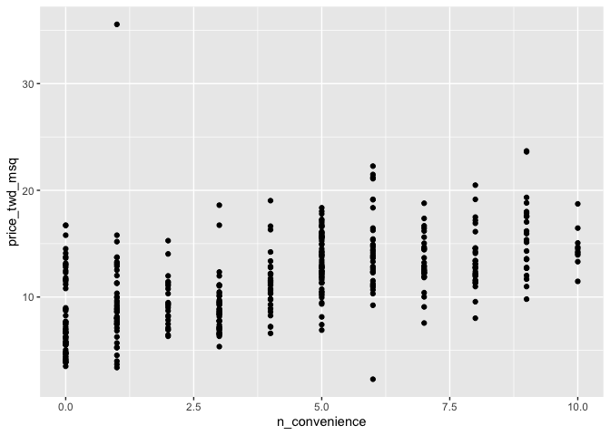<!-- -->

2.  Update the plot to make the points 50% transparent by setting
    `alpha` to `0.5`.

``` r
# Make points 50% transparent
ggplot(taiwan_real_estate, aes(n_convenience, price_twd_msq)) +
  geom_point(alpha = 0.5) 
```

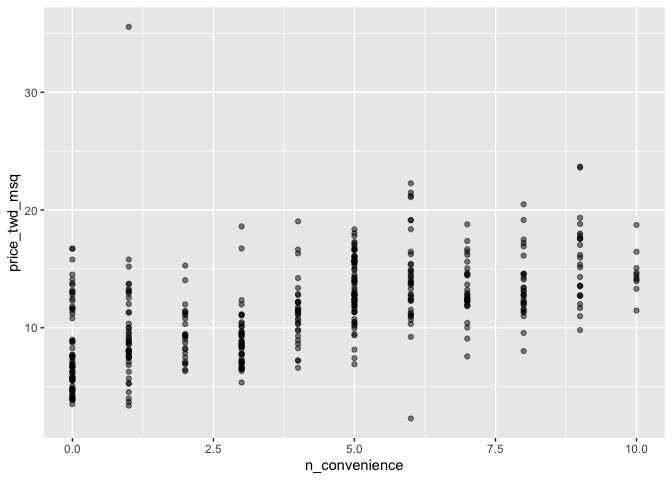<!-- -->

3.  Update the plot by adding a trend line, calculated using a linear
    regression. You can omit the confidence ribbon.

``` r
# Add a linear trend line without a confidence ribbon
ggplot(taiwan_real_estate, aes(n_convenience, price_twd_msq)) +
  geom_point(alpha = 0.5) +
  geom_smooth(method = "lm", se = FALSE)
```

    ## `geom_smooth()` using formula 'y ~ x'

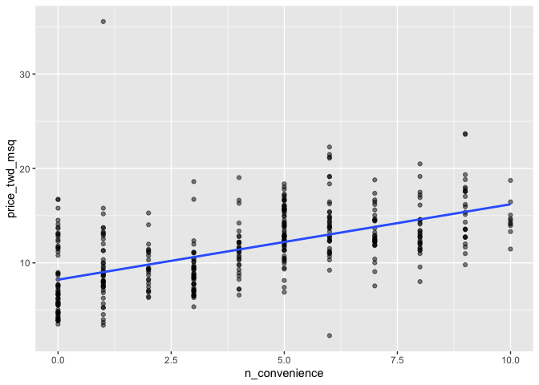<!-- -->

Scholarly scatter plotting! Scatter plots are the standard way to
visualize the relationship between two numeric variables, and ggplot
makes adding linear trend lines easy.

## Fitting a linear regression

Theory. Coming soon …

## Estimate the intercept

<!--
LO: Can estimate the intercept of a straight line.

Note: this exercise will be changed to an InputExercise once those become available.
-->

Linear regression models always fit a straight line to the data.
Straight lines are defined by two properties: their intercept and their
slope.

Here, you can see a scatter plot of house price per area versus number
of nearby convenience stores, using the Taiwan real estate dataset.

> ## *Question*
>
> Click the plot, then estimate the intercept of the linear regression
> trend line.<br> <br> ⬜ 0<br> ✅ 8.22<br> ⬜ 16.21<br>

Insightful intercept interpretation! The intercept is the y-value when x
equals zero.

## Estimate the slope

<!--
LO: Can estimate the slope of a straight line.

Note: this exercise will be changed to an InputExercise once those become available.
-->

Here is the same scatter plot of house price per area versus number of
nearby convenience stores, using the Taiwan real estate dataset.

This time, estimate the slope of the trend line. Click the line once,
then double click as different position on the line, then read the slope
value.

> ## *Question*
>
> ???<br> <br> ✅ 0.80<br> ⬜ 1<br> ⬜ 8.22<br>

Super slope-estimation! The slope is the rate of change in the y
direction divided by the rate of change in the x direction.

## Linear regression with lm()

<!--
LO: Can run a linear regression using lm()
-->

While ggplot can display a linear regression trend line using
`geom_smooth()`, it doesn’t give you access to the intercept and slope
as variables, or allow you to work with the model results as variables.
That means that sometimes you’ll need to run a linear regression
yourself.

Time to run your first model!

`taiwan_real_estate` is available. *TWD* is an abbreviation for Taiwan
dollars.

**Steps**

1.  Run a linear regression with `price_twd_msq` as the response
    variable, `n_convenience` as the explanatory variable, and
    `taiwan_real_estate` as the dataset.

``` r
# Run a linear regression of price_twd_msq vs. n_convenience
lm(price_twd_msq ~ n_convenience, data = taiwan_real_estate)
```

    ## 
    ## Call:
    ## lm(formula = price_twd_msq ~ n_convenience, data = taiwan_real_estate)
    ## 
    ## Coefficients:
    ##   (Intercept)  n_convenience  
    ##        8.2242         0.7981

> ## *Question*
>
> The model had an `(Intercept)` coefficient of `8.2242`. What does this
> mean?<br> <br> ⬜ On average, houses had a price of 8.2242 TWD per
> square meter.<br> ✅ On average, a house with zero convenience stores
> nearby had a price of 8.2242 TWD per square meter.<br> ⬜ The minimum
> house price was 8.2242 TWD per square meter.<br> ⬜ The minimum house
> price with zero convenience stores nearby was 8.2242 TWD per square
> meter.<br> ⬜ The intercept tells you nothing about house prices.<br>

> ## *Question*
>
> The model had an `n_convenience` coefficient of `0.7981`. What does
> this mean?<br> <br> ⬜ If you increase the number of nearby
> convenience stores by one, then the expected increase in house price
> is `0.7981` TWD per square meter.<br> ⬜ If you increase the house
> price by `0.7981` TWD per square meter, then the expected increase in
> the number of nearby convenience stores is one.<br> ⬜ If you increase
> the number of nearby convenience stores by `0.7981`, then the expected
> increase in house price is one TWD per square meter.<br> ✅ If you
> increase the house price by one TWD per square meter, then the
> expected increase in the number of nearby convenience stores is
> `0.7981`.<br> ⬜ The `n_convenience` coefficient tells you nothing
> about house prices.<br>

Lively linear regression modeling! The intercept is positive, so a house
with no convenience stores nearby still has a positive price. The
coefficient for convenience stores is also positive, so as the number of
nearby convenience stores increases, so does the price of the house.

## Categorical explanatory variables

Theory. Coming soon …

## Visualizing numeric vs. categorical

<!-- 
LO: Can visualize a numeric variable splitby a categorical variable using a faceted histogram.
-->

If the explanatory variable is categorical, the scatter plot that you
used before to visualize the data doesn’t make sense. Instead, a good
option is to draw a histogram for each category.

The Taiwan real estate dataset has a categorical variable in the form of
the age of each house. The ages have been split into 3 groups: 0 to 15
years, 15 to 30 years, and 30 to 45 years.

`taiwan_real_estate` is available and `ggplot2` is loaded.

**Steps**

1.  Using `taiwan_real_estate`, plot a histogram of `price_twd_msq` with
    `10` bins.
2.  Facet the plot by `house_age_years` to give 3 panels.

``` r
# Using taiwan_real_estate, plot price_twd_msq
ggplot(taiwan_real_estate, aes(price_twd_msq)) +
  # Make it a histogram with 10 bins
  geom_histogram(bins = 10) +
  # Facet the plot so each house age group gets its own panel
  facet_wrap(vars(house_age_years))
```

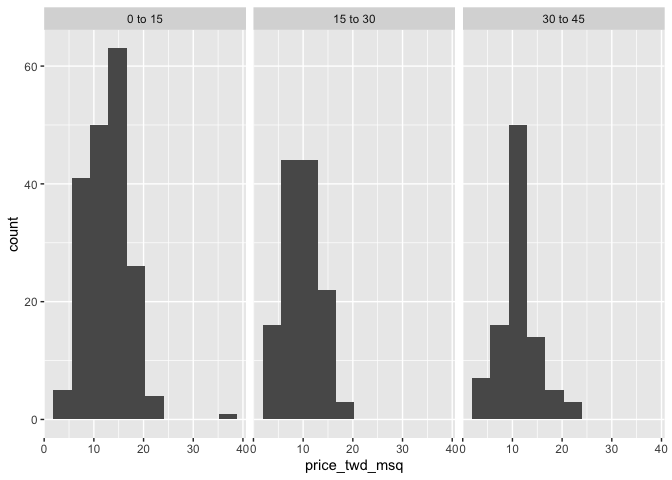<!-- -->

High five for histograms! It appears that new houses are the most
expensive on average, and the medium aged ones (15 to 30 years) are the
cheapest.

## Calculating means by category

<!-- 
LO: Can calculate grouped means.
-->

A good way to explore categorical variables is to calculate summary
statistics such as the mean for each category. Here, you’ll look at
grouped means for the house prices in the Taiwan real estate dataset.

**Steps**

1.  Group `taiwan_real_estate` by `house_age_years`.
2.  Summarize to calculate the mean `price_twd_msq` for each group,
    naming the column `mean_by_group`.
3.  Assign the result to `summary_stats` and *look at the numbers*.

``` r
# Load package
library(dplyr)
```

    ## 
    ## Attaching package: 'dplyr'

    ## The following objects are masked from 'package:stats':
    ## 
    ##     filter, lag

    ## The following objects are masked from 'package:base':
    ## 
    ##     intersect, setdiff, setequal, union

``` r
summary_stats <- taiwan_real_estate %>% 
  # Group by house age
  group_by(house_age_years) %>% 
  # Summarize to calculate the mean house price/area
  summarize(mean_by_group = mean(price_twd_msq))

# See the result
summary_stats
```

    ## # A tibble: 3 × 2
    ##   house_age_years mean_by_group
    ##   <ord>                   <dbl>
    ## 1 0 to 15                 12.6 
    ## 2 15 to 30                 9.88
    ## 3 30 to 45                11.4

Stunning summary stat calculation! Make a mental note of the results, as
they’ll feature in the next exercise too.

## lm() with a categorical explanatory variable

<!-- 
LO: Can run a simple linear regression with a categorical explanatory variable. Understands that the model coefficients are the group means.
-->

Linear regressions also work with categorical explanatory variables. In
this case, the code to run the model is the same, but the coefficients
returned by the model are different. Here you’ll run a linear regression
on the Taiwan real estate dataset.

`taiwan_real_estate` is available.

**Steps**

1.  Run a linear regression with `price_twd_msq` as the response
    variable, `house_age_years` as the explanatory variable, and
    `taiwan_real_estate` as the dataset. Assign to `mdl_price_vs_age`.

``` r
# Run a linear regression of price_twd_msq vs. house_age_years
mdl_price_vs_age <- lm(
  price_twd_msq ~ house_age_years, 
  data = taiwan_real_estate
)

# See the result
mdl_price_vs_age
```

    ## 
    ## Call:
    ## lm(formula = price_twd_msq ~ house_age_years, data = taiwan_real_estate)
    ## 
    ## Coefficients:
    ##       (Intercept)  house_age_years.L  house_age_years.Q  
    ##           11.3025            -0.8798             1.7462

2.  Update the model formula so that no intercept is included in the
    model. Assign to `mdl_price_vs_age_no_intercept`.

``` r
# Update the model formula to remove the intercept
mdl_price_vs_age_no_intercept <- lm(
  price_twd_msq ~ house_age_years + 0, 
  data = taiwan_real_estate
)

# See the result
mdl_price_vs_age_no_intercept
```

    ## 
    ## Call:
    ## lm(formula = price_twd_msq ~ house_age_years + 0, data = taiwan_real_estate)
    ## 
    ## Coefficients:
    ##  house_age_years0 to 15  house_age_years15 to 30  house_age_years30 to 45  
    ##                  12.637                    9.877                   11.393

Classy categorical linear regression! The coefficients of the model are
just the means of each category you calculated previously.

# 2. Predictions and model objects

In this chapter, you’ll discover how to use linear regression models to
make predictions on Taiwanese house prices and Facebook advert clicks.
You’ll also grow your regression skills as you get hands-on with model
objects, understand the concept of “regression to the mean”, and learn
how to transform variables in a dataset.

## Making predictions

Theory. Coming soon …

## Predicting house prices

<!--
LO: Can make predictions from linear models using predict() and stroe them in a data frame.
-->

Perhaps the most useful feature of statistical models like linear
regression is that you can make predictions. That is, you specify values
for each of the explanatory variables, feed them to the model, and you
get a prediction for the corresponding response variable. The code flow
is as follows.

``` r
explanatory_data <- tibble(
  explanatory_var = some_values
)
explanatory_data %>%
  mutate(
    response_var = predict(model, explanatory_data)
  )
```

Here, you’ll make predictions for the house prices in the Taiwan real
estate dataset.

**Steps**

1.  Create a tibble of explanatory data, where the number of convenience
    stores, `n_convenience`, takes the integer values from zero to ten.
2.  Use the model `mdl_price_vs_conv` to make predictions from
    `explanatory_data`.

``` r
# Linear regression model of house price versus number of convenience stores
mdl_price_vs_conv <- lm(formula = price_twd_msq ~ n_convenience, data = taiwan_real_estate)

# Create a tibble with n_convenience column from zero to ten
explanatory_data <- tibble(
  n_convenience = 0:10
)

# Use mdl_price_vs_conv to predict with explanatory_data
predict(mdl_price_vs_conv, explanatory_data)
```

    ##         1         2         3         4         5         6         7         8 
    ##  8.224237  9.022317  9.820397 10.618477 11.416556 12.214636 13.012716 13.810795 
    ##         9        10        11 
    ## 14.608875 15.406955 16.205035

3.  Create a tibble of predictions named `prediction_data`.

    -   Start with `explanatory_data`.
    -   Add an extra column, `price_twd_msq`, containing the
        predictions.

``` r
# Edit this, so predictions are stored in prediction_data
prediction_data <- explanatory_data %>% 
  mutate(
    price_twd_msq = predict(mdl_price_vs_conv, explanatory_data)
  )

# See the result
prediction_data
```

    ## # A tibble: 11 × 2
    ##    n_convenience price_twd_msq
    ##            <int>         <dbl>
    ##  1             0          8.22
    ##  2             1          9.02
    ##  3             2          9.82
    ##  4             3         10.6 
    ##  5             4         11.4 
    ##  6             5         12.2 
    ##  7             6         13.0 
    ##  8             7         13.8 
    ##  9             8         14.6 
    ## 10             9         15.4 
    ## 11            10         16.2

Premium predicting! Having the predictions in a data frame will make it
easier to visualize them.

## Visualizing predictions

<!--
LO: Can annotate a scatter plot of response vs. explanatory variables with predictions.
-->

The prediction data you calculated contains a column of explanatory
variable values and a column of response variable values. That means you
can plot it on the same scatter plot of response versus explanatory data
values.

`prediction_data` is available and `ggplot2` is loaded. The code for the
scatter plot with linear trend line you drew in Chapter 1 is shown.

**Steps**

1.  Extend the plotting code to include the point predictions in
    `prediction_data`. Color the points yellow.

``` r
# Add to the plot
ggplot(taiwan_real_estate, aes(n_convenience, price_twd_msq)) +
  geom_point() +
  geom_smooth(method = "lm", se = FALSE) +
  # Add a point layer of prediction data, colored yellow
  geom_point(data = prediction_data, color = "yellow")
```

    ## `geom_smooth()` using formula 'y ~ x'

<!-- -->

Perfect prediction plotting! Naturally, the predicted points lie on the
trend line.

## The limits of prediction

<!--
LO: Understand that predict() will let you make predictions about situations that are impossible in real-life.
-->

In the last exercise you made predictions on some sensible,
could-happen-in-real-life, situations. That is, the cases when the
number of nearby convenience stores were between zero and ten. To test
the limits of the model’s ability to predict, try some impossible
situations.

Use the console to try predicting house prices from `mdl_price_vs_conv`
when there are `-1` convenience stores. Do the same for `2.5`
convenience stores. What happens in each case?

`mdl_price_vs_conv` is available and `dplyr` is loaded.

**Steps**

1.  Create some impossible explanatory data. Define a tibble with one
    column, `n_convenience`, set to minus one, assigning to `minus_one`.
    Create another with `n_convenience` set to two point five, assigning
    to `two_pt_five`.

``` r
# Define a tibble where n_convenience is -1
minus_one <- tibble(n_convenience = -1)

# Define a tibble where n_convenience is 2.5
two_pt_five <- tibble(n_convenience = 2.5)
```

> ## *Question*
>
> Try making predictions on your two impossible cases. What happens?<br>
> <br> ⬜ The model throws an error because these cases are impossible
> in real life.<br> ⬜ The model throws a warning because these cases
> are impossible in real life.<br> ✅ The model successfully gives a
> prediction about cases that are impossible in real life.<br> ⬜ The
> model throws an error for `-1` stores because it violates the
> assumptions of a linear regression. `2.5` stores gives a successful
> prediction.<br> ⬜ The model throws an error for `2.5` stores because
> it violates the assumptions of a linear regression. `-1` stores gives
> a successful prediction.<br>

Legendary limit detection! Linear models don’t know what is possible or
not in real life. That means that they can give you predictions that
don’t make any sense when applied to your data. You need to understand
what your data means in order to determine whether a prediction is
nonsense or not.

## Working with model objects

Theory. Coming soon …

## Extracting model elements

<!--
LO: Can extract coefficients, fitted values, residuals, and a summary from a linear regression model.
-->

The variable returned by `lm()` that contains the model object has many
elements. In order to perform further analysis on the model results, you
need to extract the useful bits of it. The model coefficients, the
fitted values, and the residuals are perhaps the most important bits of
the linear model object.

**Steps**

1.  Print the coefficients of `mdl_price_vs_conv`.

``` r
# Get the model coefficients of mdl_price_vs_conv
coefficients(mdl_price_vs_conv)
```

    ##   (Intercept) n_convenience 
    ##     8.2242375     0.7980797

2.  Print the fitted values of `mdl_price_vs_conv`.

``` r
# Get the fitted values of mdl_price_vs_conv
fitted(mdl_price_vs_conv)
```

    ##         1         2         3         4         5         6         7         8 
    ## 16.205035 15.406955 12.214636 12.214636 12.214636 10.618477 13.810795 13.012716 
    ##         9        10        11        12        13        14        15        16 
    ##  9.022317 10.618477  9.022317 15.406955 12.214636 11.416556 11.416556  9.820397 
    ##        17        18        19        20        21        22        23        24 
    ## 13.012716  9.022317 14.608875 13.810795 10.618477 13.810795  9.022317 13.810795 
    ##        25        26        27        28        29        30        31        32 
    ## 11.416556  9.820397 12.214636 12.214636 11.416556 12.214636  8.224237 13.810795 
    ##        33        34        35        36        37        38        39        40 
    ##  9.022317 13.012716 13.810795  8.224237  9.820397  9.022317 13.012716 12.214636 
    ##        41        42        43        44        45        46        47        48 
    ##  8.224237  8.224237 12.214636 13.012716 11.416556 14.608875 15.406955 10.618477 
    ##        49        50        51        52        53        54        55        56 
    ##  8.224237  9.022317 11.416556  9.022317 10.618477 12.214636 12.214636  8.224237 
    ##        57        58        59        60        61        62        63        64 
    ## 14.608875 13.810795  9.022317 12.214636  9.820397 13.012716 10.618477 11.416556 
    ##        65        66        67        68        69        70        71        72 
    ##  8.224237 14.608875 13.012716 12.214636 13.012716 12.214636 15.406955 10.618477 
    ##        73        74        75        76        77        78        79        80 
    ## 14.608875  8.224237 16.205035  9.022317 10.618477 10.618477  9.820397  9.022317 
    ##        81        82        83        84        85        86        87        88 
    ## 11.416556 13.012716 13.810795 10.618477 13.810795 15.406955  9.022317  8.224237 
    ##        89        90        91        92        93        94        95        96 
    ##  8.224237  8.224237  9.022317  8.224237 11.416556  8.224237 12.214636 12.214636 
    ##        97        98        99       100       101       102       103       104 
    ## 15.406955 10.618477 12.214636 15.406955 11.416556  9.022317 13.012716 13.012716 
    ##       105       106       107       108       109       110       111       112 
    ## 13.012716 13.012716 14.608875  9.022317  9.820397 10.618477 12.214636 13.810795 
    ##       113       114       115       116       117       118       119       120 
    ## 10.618477 13.012716 14.608875  9.820397  9.022317  8.224237 10.618477 12.214636 
    ##       121       122       123       124       125       126       127       128 
    ## 12.214636 12.214636 11.416556  8.224237 13.810795 13.012716 11.416556 12.214636 
    ##       129       130       131       132       133       134       135       136 
    ## 13.012716 13.810795 14.608875 10.618477 12.214636 14.608875 13.012716  8.224237 
    ##       137       138       139       140       141       142       143       144 
    ## 12.214636 13.012716  8.224237 12.214636 12.214636 10.618477 12.214636 12.214636 
    ##       145       146       147       148       149       150       151       152 
    ##  9.022317 12.214636  8.224237 14.608875  8.224237 14.608875 13.810795 15.406955 
    ##       153       154       155       156       157       158       159       160 
    ##  9.022317 13.012716  8.224237  8.224237  8.224237 11.416556 12.214636 11.416556 
    ##       161       162       163       164       165       166       167       168 
    ## 14.608875 10.618477  8.224237 12.214636  8.224237  9.022317 13.012716 14.608875 
    ##       169       170       171       172       173       174       175       176 
    ## 12.214636  9.022317  8.224237 12.214636 15.406955 11.416556 13.810795 10.618477 
    ##       177       178       179       180       181       182       183       184 
    ##  8.224237 15.406955 11.416556  9.022317  8.224237 14.608875 10.618477  8.224237 
    ##       185       186       187       188       189       190       191       192 
    ##  8.224237 10.618477 10.618477  8.224237 14.608875  8.224237 14.608875  9.820397 
    ##       193       194       195       196       197       198       199       200 
    ## 13.810795 12.214636  8.224237 12.214636  9.820397 14.608875 13.810795 14.608875 
    ##       201       202       203       204       205       206       207       208 
    ##  8.224237 12.214636 10.618477 12.214636  9.022317 10.618477 16.205035 10.618477 
    ##       209       210       211       212       213       214       215       216 
    ##  9.022317 14.608875 12.214636  9.022317  9.820397 15.406955 10.618477 14.608875 
    ##       217       218       219       220       221       222       223       224 
    ##  9.022317 13.012716 12.214636 14.608875 15.406955  8.224237 16.205035  8.224237 
    ##       225       226       227       228       229       230       231       232 
    ## 13.012716 13.012716  8.224237 14.608875  8.224237  8.224237 10.618477  8.224237 
    ##       233       234       235       236       237       238       239       240 
    ##  9.022317 15.406955 11.416556 13.810795 16.205035  8.224237  8.224237  8.224237 
    ##       241       242       243       244       245       246       247       248 
    ##  9.820397 13.810795 10.618477 14.608875 10.618477 12.214636 13.012716  8.224237 
    ##       249       250       251       252       253       254       255       256 
    ##  8.224237  9.022317 13.810795  8.224237 15.406955  9.820397 12.214636  9.022317 
    ##       257       258       259       260       261       262       263       264 
    ##  9.022317  9.022317 13.012716  8.224237 11.416556 10.618477 12.214636 10.618477 
    ##       265       266       267       268       269       270       271       272 
    ## 13.810795 11.416556 10.618477 12.214636 12.214636  8.224237  9.022317 14.608875 
    ##       273       274       275       276       277       278       279       280 
    ## 12.214636  9.022317 13.810795 13.810795 12.214636 10.618477 13.012716 10.618477 
    ##       281       282       283       284       285       286       287       288 
    ## 13.012716 15.406955  9.022317  9.820397 13.810795 10.618477 15.406955 12.214636 
    ##       289       290       291       292       293       294       295       296 
    ## 13.012716 12.214636  8.224237 13.810795 12.214636 13.810795 13.012716 10.618477 
    ##       297       298       299       300       301       302       303       304 
    ## 11.416556 11.416556  8.224237 16.205035 11.416556  8.224237 10.618477  8.224237 
    ##       305       306       307       308       309       310       311       312 
    ## 10.618477 12.214636  9.022317  8.224237 12.214636  8.224237  9.820397 11.416556 
    ##       313       314       315       316       317       318       319       320 
    ## 15.406955 12.214636 13.012716  9.820397 13.810795  9.820397 16.205035 12.214636 
    ##       321       322       323       324       325       326       327       328 
    ##  8.224237 11.416556  9.022317 13.012716  9.820397 14.608875 13.810795 10.618477 
    ##       329       330       331       332       333       334       335       336 
    ## 10.618477  8.224237  8.224237  8.224237  9.820397 12.214636 12.214636 13.012716 
    ##       337       338       339       340       341       342       343       344 
    ##  9.820397 12.214636 15.406955 12.214636  8.224237  9.820397 15.406955 14.608875 
    ##       345       346       347       348       349       350       351       352 
    ##  8.224237  8.224237  9.820397  9.022317 13.012716 12.214636 12.214636 10.618477 
    ##       353       354       355       356       357       358       359       360 
    ## 10.618477 10.618477  9.022317 12.214636  9.022317 15.406955 13.012716  8.224237 
    ##       361       362       363       364       365       366       367       368 
    ## 16.205035 14.608875 11.416556 16.205035 13.810795 11.416556  9.022317  9.820397 
    ##       369       370       371       372       373       374       375       376 
    ##  9.022317 10.618477 12.214636 12.214636 13.810795  9.022317 12.214636  8.224237 
    ##       377       378       379       380       381       382       383       384 
    ##  9.820397 14.608875 14.608875 13.012716 12.214636 15.406955  8.224237 11.416556 
    ##       385       386       387       388       389       390       391       392 
    ##  8.224237 16.205035  8.224237 10.618477 11.416556 14.608875 15.406955  9.022317 
    ##       393       394       395       396       397       398       399       400 
    ## 13.012716 11.416556  9.022317 11.416556  9.022317 11.416556  9.820397  9.022317 
    ##       401       402       403       404       405       406       407       408 
    ## 12.214636 10.618477  9.022317 15.406955 12.214636 13.012716 13.810795  8.224237 
    ##       409       410       411       412       413       414 
    ## 10.618477  8.224237 15.406955 13.810795 12.214636 15.406955

3.  Print the residuals of `mdl_price_vs_conv`.

``` r
# Get the residuals of mdl_price_vs_conv
residuals(mdl_price_vs_conv)
```

    ##             1             2             3             4             5 
    ##  -4.737561094  -2.638422376   2.097012981   4.366301937   0.826211165 
    ##             6             7             8             9            10 
    ##  -0.905919870  -1.617149478   1.117390148  -3.333966186  -3.931638479 
    ##            11            12            13            14            15 
    ##   3.504157868   2.172470211  -0.323561906  -4.215346032  -1.038341493 
    ##            16            17            18            19            20 
    ##   5.459482085   8.197571691   2.293870425  -1.810085473   0.621882292 
    ##            21            22            23            24            25 
    ##  -1.753121081   1.801912549  -1.579049393   0.682396664   0.323231880 
    ##            26            27            28            29            30 
    ##  -1.650956644   4.789902542  -2.048221512   2.804321139   5.062217217 
    ##            31            32            33            34            35 
    ##  -1.537399329  -6.246498949   1.325640471   1.904076986   2.860914062 
    ##            36            37            38            39            40 
    ##   0.035974348  -2.891501273  -1.367249091   1.419962009   1.764183934 
    ##            41            42            43            44            45 
    ##  -3.413344866  -2.717429586  -1.715392466  -2.695015299   4.892066979 
    ##            46            47            48            49            50 
    ##  -3.020372916  -2.698936748   7.989692838  -4.169774518  -5.028368607 
    ##            51            52            53            54            55 
    ##   1.957119929  -2.759079650  -2.449036361  -0.444590650   3.428329168 
    ##            56            57            58            59            60 
    ##  -4.079002960  -1.931114217   2.376799085  -2.184193115   0.614410863 
    ##            61            62            63            64            65 
    ##  -3.375616251   6.109825851  -2.237236058   5.224896026  -0.569169374 
    ##            66            67            68            69            70 
    ##  -1.204941751   2.327677591   4.971445659  -2.059614391   0.493382118 
    ##            71            72            73            74            75 
    ##   2.444784886   1.726455319  -3.625516638  -2.172800236   0.254874610 
    ##            76            77            78            79            80 
    ##  -0.096447275   0.516167875  -2.872636966  -0.803755434  -1.004162858 
    ##            81            82            83            84            85 
    ##   0.777089672  -1.878071274   0.742911036  -5.262954666  -0.588405151 
    ##            86            87            88            89            90 
    ##  -0.036304373  -0.852876927  -2.687172400   6.299211866  -0.569169374 
    ##            91            92            93            94            95 
    ##   4.714445312   4.846866935  -4.820489753  -3.352830494   0.190810258 
    ##            96            97            98            99           100 
    ##   3.458586354   2.596070816  -0.149490218   3.216528866   3.413014841 
    ##           101           102           103           104           105 
    ##   0.141688764   0.932297051   3.447193476   0.814818287  -3.784273998 
    ##           106           107           108           109           110 
    ##   8.469886366  -0.357740541  -0.973905672   0.497303568  -2.025435755 
    ##           111           112           113           114           115 
    ##   3.398071982  -1.889464153  -3.629066618 -10.713169610   1.518204996 
    ##           116           117           118           119           120 
    ##   4.218937456  -5.330940467  -4.290803262  -1.359777662   5.818646869 
    ##           121           122           123           124           125 
    ##  -2.744136792   2.308813283  -1.582970843   5.542782214   3.556829342 
    ##           126           127           128           129           130 
    ##   1.692276683   7.615213726   4.426816309   5.353396199  -1.405349176 
    ##           131           132           133           134           135 
    ##  -3.262430405  -1.329520476  -0.868191255  -2.657286683  -0.244183226 
    ##           136           137           138           139           140 
    ##  -1.930742748   1.945727050   1.329190450   4.937638493   0.644668049 
    ##           141           142           143           144           145 
    ##   3.337557610  -1.874149825  -0.868191255  -0.081504417  -0.429276322 
    ##           146           147           148           149           150 
    ##   1.552383631   7.570013682  -1.537770798   5.421753470  -2.596772311 
    ##           151           152           153           154           155 
    ##   0.863939781  -1.881992724  -0.277990392  -0.637526645  -1.960999934 
    ##           156           157           158           159           160 
    ##  -3.504116424  -2.687172400  -0.644998074  -0.293304720  -0.100368725 
    ##           161           162           163           164           165 
    ##   2.879778370   1.363369086  -4.714403867   4.578102239   8.477729264 
    ##           166           167           168           169           170 
    ##   0.236381772   9.256573204  -1.477256426  -0.898448441  -1.911878440 
    ##           171           172           173           174           175 
    ##  -3.867202657   5.576589380   2.172470211  -0.796284005  -0.134547360 
    ##           176           177           178           179           180 
    ##   0.425396317  -2.414857725  -2.698936748  -0.312169027   3.867244101 
    ##           181           182           183           184           185 
    ##  -3.534373610   2.304891834  -3.477780687  -2.535886469  -1.628170887 
    ##           186           187           188           189           190 
    ##  -4.113181595  -2.842379780  -1.567656515  -1.204941751  -2.021514306 
    ##           191           192           193           194           195 
    ##  -1.810085473   1.616819453  -0.890977012   2.702156702   0.641118069 
    ##           196           197           198           199           200 
    ##  -1.745649652   1.253733220  -0.024911494  -1.980235711  -5.047604384 
    ##           201           202           203           204           205 
    ##  -0.508655002   1.673412376  -1.087462987   1.733926748  -0.973905672 
    ##           206           207           208           209           210 
    ##  -4.143438781  -2.891872743  -0.270518963  -1.094934416  -2.233686078 
    ##           211           212           213           214           215 
    ##   3.579615099   4.139558776  -0.410412015   2.142213025  -4.294724712 
    ##           216           217           218           219           220 
    ##  -0.055168680   2.989785705  -0.667783831   1.038011468  -2.445486381 
    ##           221           222           223           224           225 
    ##   8.284421800   3.424779189  -1.530299369   4.574552260   0.905589845 
    ##           226           227           228           229           230 
    ##   1.813305428  -4.351317634  -2.445486381   5.875611261  -2.475372097 
    ##           231           232           233           234           235 
    ##  -0.512576451  -3.776431099  -3.757566791  -5.603626612  -4.185088846 
    ##           236           237           238           239           240 
    ##  -1.919721339   2.524163566   3.576065119   4.060180096   0.762146813 
    ##           241           242           243           244           245 
    ##  -1.106327294  -1.284320431  -0.512576451  -0.024911494  -4.052667223 
    ##           246           247           248           249           250 
    ##   0.130295885  -0.728298203  -1.234827468  -1.476884957  -4.483739257 
    ##           251           252           253           254           255 
    ##  -4.733639645  -4.048745774   0.538582163  -1.983785691   3.458586354 
    ##           256           257           258           259           260 
    ##  -3.757566791  -1.004162858   4.260587520   6.140083037   0.489832139 
    ##           261           262           263           264           265 
    ##  -2.127600192  -3.235723199   3.821672587  -1.026948615  -1.526377920 
    ##           266           267           268           269           270 
    ##   0.111431578  -3.447523501   0.221067444  -0.081504417  -1.265084654 
    ##           271           272           273           274           275 
    ##  26.529876477  -6.590720874   0.039524327  -0.156961647  -1.405349176 
    ##           276           277           278           279           280 
    ##   1.227026014  -1.927192768  -2.237236058   0.300446123  -1.208491731 
    ##           281           282           283           284           285 
    ##   0.724046729  -1.851735538  -1.276477532  -2.709958157  -3.402323457 
    ##           286           287           288           289           290 
    ##   6.113747301   1.627840862  -2.260021815   2.418449149   1.249811771 
    ##           291           292           293           294           295 
    ##   2.970921397   2.649113759  -4.801625446  -0.951491384  -1.484727855 
    ##           296           297           298           299           300 
    ##  -4.022410037  -1.098855865  -2.793258286  -3.171287377  -2.256471835 
    ##           301           302           303           304           305 
    ##  -0.251654655   2.577577978  -3.598809432   3.394522003  -1.722863895 
    ##           306           307           308           309           310 
    ##   4.426816309   6.166790244  -0.750712491   3.821672587  -2.445114911 
    ##           311           312           313           314           315 
    ##  -2.346871924   1.351976207   8.193650241   0.735439607  -0.425726342 
    ##           316           317           318           319           320 
    ##  -1.560185086  -1.102777315   1.526047895  -1.136955950  -4.075452980 
    ##           321           322           323           324           325 
    ##  -2.596400842  -0.009597166   0.992811424  -0.153411668  -0.349897642 
    ##           326           327           328           329           330 
    ##  -3.080887289   4.978917088   0.485910689  -3.477780687  -2.414857725 
    ##           331           332           333           334           335 
    ##  -4.351317634  -3.504116424   2.161448802  -0.595876580  -5.315997609 
    ##           336           337           338           339           340 
    ##  -1.968842833   0.951161359  -2.865165537  -4.423596355   3.034985749 
    ##           341           342           343           344           345 
    ##   4.756095376   1.374761964   0.780639651  -0.509026472   4.241723213 
    ##           346           347           348           349           350 
    ##   3.243236072  -0.501183573  -5.633512328   3.235393173   2.006241423 
    ##           351           352           353           354           355 
    ##   0.584153677  -1.964921383  -2.842379780  -1.147977359   0.085095841 
    ##           356           357           358           359           360 
    ##   6.151475916   4.684188126  -1.821478352   0.633275170  -0.750712491 
    ##           361           362           363           364           365 
    ##  -1.953899974   4.543923604   0.686318113  -1.681585300  -3.795666876 
    ##           366           367           368           369           370 
    ##  -2.490686425  -1.518535021  -3.496644995   4.018530032  -3.719838176 
    ##           371           372           373           374           375 
    ##   0.523639305   3.428329168  -1.254063245   6.771933965   2.762671075 
    ##           376           377           378           379           380 
    ##  -1.023027165  -0.591955131   2.577206509  -3.292687591   8.076542946 
    ##           381           382           383           384           385 
    ##   3.912444146  -1.095305886   0.641118069   0.777089672  -4.321060448 
    ##           386           387           388           389           390 
    ##  -2.105185905   8.507986450  -2.872636966  -3.156344519   5.875239792 
    ##           391           392           393           394           395 
    ##  -3.727681075   0.448182074  -2.331929066   0.777089672  -1.548792207 
    ##           396           397           398           399           400 
    ##   1.442747765   0.629725191  -1.673742401  -2.861244087   2.263613239 
    ##           401           402           403           404           405 
    ##  -1.473334977  -2.237236058  -0.399019136  -3.394852028   0.251324630 
    ##           406           407           408           409           410 
    ##  -1.757042530  -1.556635106  -1.476884957  -2.116207314  -3.564630796 
    ##           411           412           413           414 
    ##  -0.278361861  -1.526377920   3.670386657   3.927387004

4.  Print a summary of `mdl_price_vs_conv`.

``` r
# Print a summary of mdl_price_vs_conv
summary(mdl_price_vs_conv)
```

    ## 
    ## Call:
    ## lm(formula = price_twd_msq ~ n_convenience, data = taiwan_real_estate)
    ## 
    ## Residuals:
    ##      Min       1Q   Median       3Q      Max 
    ## -10.7132  -2.2213  -0.5409   1.8105  26.5299 
    ## 
    ## Coefficients:
    ##               Estimate Std. Error t value Pr(>|t|)    
    ## (Intercept)    8.22424    0.28500   28.86   <2e-16 ***
    ## n_convenience  0.79808    0.05653   14.12   <2e-16 ***
    ## ---
    ## Signif. codes:  0 '***' 0.001 '**' 0.01 '*' 0.05 '.' 0.1 ' ' 1
    ## 
    ## Residual standard error: 3.384 on 412 degrees of freedom
    ## Multiple R-squared:  0.326,  Adjusted R-squared:  0.3244 
    ## F-statistic: 199.3 on 1 and 412 DF,  p-value: < 2.2e-16

Marvelous model manipulation! Working with individual pieces of the
model is often more useful than working with the whole model object at
once.

## Manually predicting house prices

<!--
LO: Can calculate simple linear regression predictions manually.
-->

You can manually calculate the predictions from the model coefficients.
When making predictions in real life, it is better to use `predict()`,
but doing this manually is helpful to reassure yourself that predictions
aren’t magic – they are simply arithmetic.

In fact, for a simple linear regression, the predicted value is just the
intercept plus the slope times the explanatory variable.


`mdl_price_vs_conv` and `explanatory_data` are available, and `dplyr` is
loaded.

**Steps**

1.  Get the coefficients of `mdl_price_vs_conv`, assigning to `coeffs`.
2.  Get the intercept, which is the first element of `coeffs`, assigning
    to `intercept`.
3.  Get the slope, which is the second element of `coeffs`, assigning to
    `slope`.
4.  Manually predict `price_twd_msq` using the intercept, slope, and
    `n_convenience`.

``` r
# Get the coefficients of mdl_price_vs_conv
coeffs <- coefficients(mdl_price_vs_conv)

# Get the intercept
intercept <- coeffs[1]

# Get the slope
slope <- coeffs[2]

explanatory_data %>% 
  mutate(
    # Manually calculate the predictions
    price_twd_msq = intercept + slope * n_convenience
  )
```

    ## # A tibble: 11 × 2
    ##    n_convenience price_twd_msq
    ##            <int>         <dbl>
    ##  1             0          8.22
    ##  2             1          9.02
    ##  3             2          9.82
    ##  4             3         10.6 
    ##  5             4         11.4 
    ##  6             5         12.2 
    ##  7             6         13.0 
    ##  8             7         13.8 
    ##  9             8         14.6 
    ## 10             9         15.4 
    ## 11            10         16.2

``` r
# Compare to the results from predict()
predict(mdl_price_vs_conv, explanatory_data)
```

    ##         1         2         3         4         5         6         7         8 
    ##  8.224237  9.022317  9.820397 10.618477 11.416556 12.214636 13.012716 13.810795 
    ##         9        10        11 
    ## 14.608875 15.406955 16.205035

Magic manual prediction! For simple linear regression, the prediction
just involves one addition and one multiplication.

## Using broom

<!--
LO: Can extract coefficient-/observation-/model-level data from a linear regression model object using broom.
-->

Many programming tasks are easier if you keep all your data inside data
frames. This is particularly true if you are a tidyverse fan, where
`dplyr` and `ggplot2` require you to use data frames. The `broom`
package contains functions that decompose models into three data frames:
one for the coefficient-level elements (the coefficients themselves, as
well as p-values for each coefficient), the observation-level elements
(like fitted values and residuals), and the model-level elements (mostly
performance metrics).

The functions in `broom` are generic. That is, they work with many model
types, not just linear regression model objects. They also work with
logistic regression model objects (as you’ll see in Chapter 4), and many
other types of model.

**Steps**

1.  Tidy the model to print the coefficient-level elements of
    `mdl_price_vs_conv`.

``` r
# Load package
library(broom)

# Get the coefficient-level elements of the model
tidy(mdl_price_vs_conv)
```

    ## # A tibble: 2 × 5
    ##   term          estimate std.error statistic   p.value
    ##   <chr>            <dbl>     <dbl>     <dbl>     <dbl>
    ## 1 (Intercept)      8.22     0.285       28.9 5.81e-101
    ## 2 n_convenience    0.798    0.0565      14.1 3.41e- 37

2.  Augment the model to print the observation-level elements of
    `mdl_price_vs_conv`.

``` r
# Get the observation-level elements of the model
augment(mdl_price_vs_conv)
```

    ## # A tibble: 414 × 8
    ##    price_twd_msq n_convenience .fitted .resid    .hat .sigma  .cooksd .std.resid
    ##            <dbl>         <dbl>   <dbl>  <dbl>   <dbl>  <dbl>    <dbl>      <dbl>
    ##  1         11.5             10   16.2  -4.74  0.0121    3.38  1.22e-2     -1.41 
    ##  2         12.8              9   15.4  -2.64  0.00913   3.39  2.83e-3     -0.783
    ##  3         14.3              5   12.2   2.10  0.00264   3.39  5.10e-4      0.621
    ##  4         16.6              5   12.2   4.37  0.00264   3.38  2.21e-3      1.29 
    ##  5         13.0              5   12.2   0.826 0.00264   3.39  7.92e-5      0.244
    ##  6          9.71             3   10.6  -0.906 0.00275   3.39  9.91e-5     -0.268
    ##  7         12.2              7   13.8  -1.62  0.00477   3.39  5.50e-4     -0.479
    ##  8         14.1              6   13.0   1.12  0.00343   3.39  1.88e-4      0.331
    ##  9          5.69             1    9.02 -3.33  0.00509   3.38  2.49e-3     -0.988
    ## 10          6.69             3   10.6  -3.93  0.00275   3.38  1.87e-3     -1.16 
    ## # … with 404 more rows

3.  Glance at the model to print the model-level elements of
    `mdl_price_vs_conv`.

``` r
# Get the model-level elements of the model
glance(mdl_price_vs_conv)
```

    ## # A tibble: 1 × 12
    ##   r.squared adj.r.squared sigma statistic  p.value    df logLik   AIC   BIC
    ##       <dbl>         <dbl> <dbl>     <dbl>    <dbl> <dbl>  <dbl> <dbl> <dbl>
    ## 1     0.326         0.324  3.38      199. 3.41e-37     1 -1091. 2188. 2200.
    ## # … with 3 more variables: deviance <dbl>, df.residual <int>, nobs <int>

Terrific model tidying! `broom` lets you convert model objects to data
frames for easier programming.

## Regression to the mean

Theory. Coming soon …

## Home run!

<!--
LO: Understands regression to the mean, and its application to sports.
-->

Regression to the mean is an important concept in many areas, including
sports.

Here you can see a dataset of baseball batting data in 2017 and 2018.
Each point represents a player, and more home runs is better. A naive
prediction might be that the performance in 2018 would be that it is the
same as the performance in 2017. That is, a linear regression would lie
on the “y equals x” line.

> ## *Question*
>
> Explore the plot and make predictions. What does regression to the
> mean say about the number of home runs in 2018 for a player who was
> very successful in 2017?<br> ⬜ Someone who hit 40 home runs in 2017
> is predicted to hit the same number of home runs the next year because
> regression to the mean states that performance is consistent over
> time.<br> ⬜ If someone hit 40 home runs in 2017, we can’t predict the
> number of home runs the next year because regression to the mean
> states that extremely high values are unpredictable.<br> ✅ Someone
> who hit 40 home runs in 2017 is predicted to hit 10 fewer home runs
> the next year because regression to the mean states that, on average,
> extremely high values are not sustained.<br> ⬜ Someone who hit 40
> home runs in 2017 is predicted to hit 10 more home runs the next year
> because regression to the mean states that, on average, extremely high
> values are amplified over time.<br>

Magnificent regression to the mean! Due to regression to the mean, it’s
common that one player or team that does really well one year, doesn’t
do as well the next. Likewise players or teams that perform very badly
one year do better the next year.

## Plotting consecutive portfolio returns

<!--
LO: Understands regression to the mean, and its application to investing.
-->

Regression to the mean is also an important concept in investing. Here
you’ll look at the annual returns from investing in companies in the
Standard and Poor 500 index (S&P 500), in 2018 and 2019.

The `sp500_yearly_returns` dataset contains three columns:

| variable    | meaning                                               |
|:------------|:------------------------------------------------------|
| symbol      | Stock ticker symbol uniquely identifying the company. |
| return_2018 | A measure of investment performance in 2018.          |
| return_2019 | A measure of investment performance in 2019.          |

A positive number for the return means the investment increased in
value; negative means it lost value.

Just as with baseball home runs, a naive prediction might be that the
investment performance stays the same from year to year, lying on the “y
equals x” line.

`sp500_yearly_returns` is available and `ggplot2` is loaded.

**Steps**

1.  Using `sp500_yearly_returns`, draw a scatter plot of `return_2019`
    vs. `return_2018`.
2.  Add an “A-B line”, colored `"green"`, with size `1`.
3.  Add a smooth trend line made with the linear regression method, and
    no standard error ribbon.
4.  Fix the coordinates so distances along the x and y axes appear the
    same.

``` r
# Load data
sp500_yearly_returns <- readRDS("data/sp500_yearly_returns.rds")

# Using sp500_yearly_returns, plot return_2019 vs. return_2018
ggplot(sp500_yearly_returns, aes(return_2018, return_2019)) +
  # Make it a scatter plot
  geom_point() +
  # Add a line at y = x, colored green, size 1
  geom_abline(color = "green", size = 1) +
  # Add a linear regression trend line, no std. error ribbon
  geom_smooth(method = "lm", se = FALSE) +
  # Fix the coordinate ratio
  coord_fixed()
```

    ## `geom_smooth()` using formula 'y ~ x'

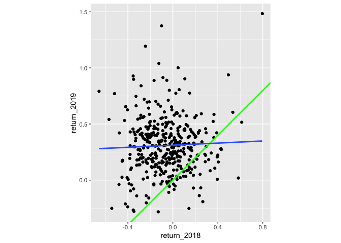<!-- -->

Super scatter plotting! The regression trend line looks very different
to the y equals x line. As the financial advisors say, “Past performance
is no guarantee of future results.”

## Modeling consecutive returns

<!--
LO: Can quantify regression to the mean using linear regression.
-->

Let’s quantify the relationship between returns in 2019 and 2018 by
running a linear regression and making predictions. By looking at
companies with extremely high or extremely low returns in 2018, we can
see if their performance was similar in 2019.

**Steps**

1.  Run a linear regression on `return_2019` versus `return_2018` using
    `sp500_yearly_returns`. Assign to `mdl_returns`.

``` r
# Run a linear regression on return_2019 vs. return_2018
# using sp500_yearly_returns
mdl_returns <- lm(
  return_2019 ~ return_2018, 
  data = sp500_yearly_returns
)

# See the result
mdl_returns
```

    ## 
    ## Call:
    ## lm(formula = return_2019 ~ return_2018, data = sp500_yearly_returns)
    ## 
    ## Coefficients:
    ## (Intercept)  return_2018  
    ##     0.31127      0.04691

2.  Create a data frame (or tibble) named `explanatory_data`. Give it
    one column with 2018 returns set to a vector containing `-1`, `0`,
    and `1`.
3.  Use `mdl_returns` to predict with `explanatory_data`.

``` r
# From previous step
mdl_returns <- lm(
  return_2019 ~ return_2018, 
  data = sp500_yearly_returns
)

# Create a data frame with return_2018 at -1, 0, and 1 
explanatory_data <- tibble(
  return_2018 = c(-1, 0, 1)
)

# Use mdl_returns to predict with explanatory_data
predict(mdl_returns, explanatory_data)
```

    ##         1         2         3 
    ## 0.2643603 0.3112714 0.3581826

Incredible investment predictions! Investments that gained a lot in
value in 2018 on average gained only a small amount in 2019. Similarly,
investments that lost a lot of value in 2018 on average also gained a
small amount in 2019.

## Transforming variables

Theory. Coming soon …

## Transforming the explanatory variable

<!--
LO: Can fit a linear regression with a transformed explanatory variable and make predictions.
-->

If there is no straight line relationship between the response variable
and the explanatory variable, it is sometimes possible to create one by
transforming one or both of the variables. Here, you’ll look at
transforming the explanatory variable.

You’ll take another look at the Taiwan real estate dataset, this time
using the distance to the nearest MRT (metro) station as the explanatory
variable. You’ll use code to make every commuter’s dream come true:
shortening the distance to the metro station by taking the square root.
Take that, geography!

**Steps**

1.  *Run the code provided, and look at the plot.*
2.  Edit the plot so the x aesthetic is square root transformed.
3.  *Look at the new plot. Notice how the numbers on the x-axis have
    changed. This is a different line to what was shown before. Do the
    points track the line more closely?*

``` r
# Run the code to see the plot
# Edit so x-axis is square root of dist_to_mrt_m
ggplot(taiwan_real_estate, aes(sqrt(dist_to_mrt_m), price_twd_msq)) +
  geom_point() +
  geom_smooth(method = "lm", se = FALSE)
```

    ## `geom_smooth()` using formula 'y ~ x'

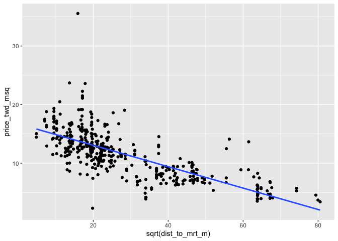<!-- -->

4.  Run a linear regression of `price_twd_msq` versus the square root of
    `dist_to_mrt_m` using `taiwan_real_estate`.

``` r
# Run a linear regression of price_twd_msq vs. 
# square root of dist_to_mrt_m using taiwan_real_estate
mdl_price_vs_dist <- lm(
  price_twd_msq ~ sqrt(dist_to_mrt_m), 
  data = taiwan_real_estate
)

# See the result
mdl_price_vs_dist
```

    ## 
    ## Call:
    ## lm(formula = price_twd_msq ~ sqrt(dist_to_mrt_m), data = taiwan_real_estate)
    ## 
    ## Coefficients:
    ##         (Intercept)  sqrt(dist_to_mrt_m)  
    ##             16.7098              -0.1828

5.  Create a data frame of prediction data named `prediction_data`.
    Start with `explanatory_data`, and add a column named after the
    response variable. Predict values using `mdl_price_vs_dist` and
    `explanatory_data`.

``` r
# From previous step
mdl_price_vs_dist <- lm(
  price_twd_msq ~ sqrt(dist_to_mrt_m), 
  data = taiwan_real_estate
)

# Use this explanatory data
explanatory_data <- tibble(
  dist_to_mrt_m = seq(0, 80, 10) ^ 2
)

# Use mdl_price_vs_dist to predict explanatory_data
prediction_data <- explanatory_data %>% 
  mutate(
    price_twd_msq = predict(mdl_price_vs_dist, explanatory_data)
  )

# See the result
prediction_data
```

    ## # A tibble: 9 × 2
    ##   dist_to_mrt_m price_twd_msq
    ##           <dbl>         <dbl>
    ## 1             0         16.7 
    ## 2           100         14.9 
    ## 3           400         13.1 
    ## 4           900         11.2 
    ## 5          1600          9.40
    ## 6          2500          7.57
    ## 7          3600          5.74
    ## 8          4900          3.91
    ## 9          6400          2.08

6.  Edit the plot to add a layer of points from `prediction_data`,
    colored `"green"`, size `5`.

``` r
# From previous steps
mdl_price_vs_dist <- lm(
  price_twd_msq ~ sqrt(dist_to_mrt_m), 
  data = taiwan_real_estate
)
explanatory_data <- tibble(
  dist_to_mrt_m = seq(0, 80, 10) ^ 2
)
prediction_data <- explanatory_data %>% 
  mutate(
    price_twd_msq = predict(mdl_price_vs_dist, explanatory_data)
  )

ggplot(taiwan_real_estate, aes(sqrt(dist_to_mrt_m), price_twd_msq)) +
  geom_point() +
  geom_smooth(method = "lm", se = FALSE) +
  # Add points from prediction_data, colored green, size 5
  geom_point(data = prediction_data, color = "green", size = 5)
```

    ## `geom_smooth()` using formula 'y ~ x'

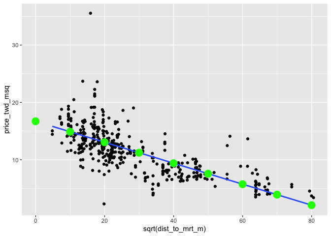<!-- -->

You transform like a robot in disguise! By transforming the explanatory
variable, the relationship with the response variable became linear, and
so a linear regression became an appropriate model.

## Transforming the response variable too

<!--
LO: Can fit a model with a transformed response variable, and use backtransformation to make predictions.
-->

The response variable can be transformed too, but this means you need an
extra step at the end to undo that transformation. That is, you “back
transform” the predictions.

In the video, you saw the first step of the digital advertising
workflow: spending money to buy ads, and counting how many people see
them (the “impressions”). The next step is determining how many people
click on the advert after seeing it.

`ad_conversion` is available and `ggplot2` and `tibble` are loaded.

**Steps**

1.  *Run the code provided, and look at the plot.*
2.  Edit the plot so the x and y aesthetics are transformed by raising
    them to the power `0.25`.
3.  *Look at the new plot. Do the points track the line more closely?*

``` r
# Load data
ad_conversion <- read_fst("data/ad_conversion.fst")

# Run the code to see the plot
# Edit to raise x, y aesthetics to power 0.25
ggplot(ad_conversion, aes(n_impressions ^ 0.25, n_clicks ^ 0.25)) +
  geom_point() +
  geom_smooth(method = "lm", se = FALSE)
```

    ## `geom_smooth()` using formula 'y ~ x'

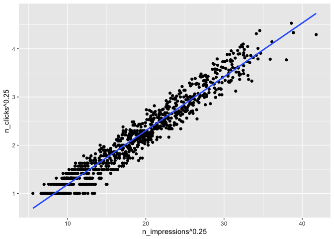<!-- -->

4.  Run a linear regression of `n_clicks` to the power `0.25` versus
    `n_impressions` to the power `0.25` using `ad_conversion`. *Each
    variable in the formula needs to be specified “as is”, using `I()`.*

``` r
# Run a linear regression of n_clicks to the power 0.25 vs. 
# n_impressions to the power 0.25 using ad_conversion
mdl_click_vs_impression <- lm(
  I(n_clicks ^ 0.25) ~ I(n_impressions ^ 0.25),
  data = ad_conversion
)
```

5.  Complete the code for the prediction data. Use
    `mdl_click_vs_impression` to predict `n_clicks` to the power `0.25`
    from `explanatory_data`.
6.  Back transform by raising `n_clicks_025` to the power `4` to get
    `n_clicks`.

``` r
# From previous step
mdl_click_vs_impression <- lm(
  I(n_clicks ^ 0.25) ~ I(n_impressions ^ 0.25),
  data = ad_conversion
)

# Use this explanatory data
explanatory_data <- tibble(
  n_impressions = seq(0, 3e6, 5e5)
)

prediction_data <- explanatory_data %>% 
  mutate(
    # Use mdl_click_vs_impression to predict n_clicks ^ 0.25
    n_clicks_025 = predict(mdl_click_vs_impression, explanatory_data),
    # Back transform to get n_clicks
    n_clicks = n_clicks_025 ^ 4
  )
```

7.  Edit the plot to add a layer of points from `prediction_data`,
    colored `"green"`.

``` r
# From previous steps
mdl_click_vs_impression <- lm(
  I(n_clicks ^ 0.25) ~ I(n_impressions ^ 0.25),
  data = ad_conversion
)
explanatory_data <- tibble(
  n_impressions = seq(0, 3e6, 5e5)
)
prediction_data <- explanatory_data %>% 
  mutate(
    n_clicks_025 = predict(mdl_click_vs_impression, explanatory_data),
    n_clicks = n_clicks_025 ^ 4
  )

ggplot(ad_conversion, aes(n_impressions ^ 0.25, n_clicks ^ 0.25)) +
  geom_point() +
  geom_smooth(method = "lm", se = FALSE) +
  # Add points from prediction_data, colored green
  geom_point(data = prediction_data, color = "green")
```

    ## `geom_smooth()` using formula 'y ~ x'

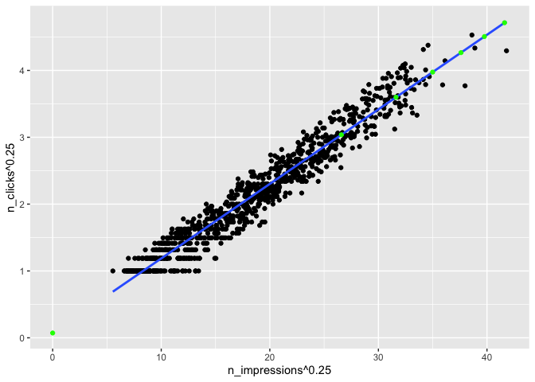<!-- -->

Two-way transform! When the response variable is transformed you need to
back transform the predictions.

# 3. Assessing model fit

In this chapter, you’ll learn how to ask questions of your model to
assess fit. You’ll learn how to quantify how well a linear regression
model fits, diagnose model problems using visualizations, and understand
the leverage and influence of each observation used to create the model.

## Quantifying model fit

Theory. Coming soon …

## Coefficient of determination

<!-- 
LO: Understands and can calculate the coefficient of determination (r-squared) of a linear regression model.
-->

The coefficient of determination is a measure of how well the linear
regression line fits the observed values. For simple linear regression,
it is equal to the square of the correlation between the explanatory and
response variables.

Here, you’ll take another look at the second stage of the advertising
pipeline: modeling the click response to impressions. Two models are
available: `mdl_click_vs_impression_orig` models `n_clicks` versus
`n_impressions`. `mdl_click_vs_impression_trans` is the transformed
model you saw in Chapter 2. It models `n_clicks ^ 0.25` versus
`n_impressions ^ 0.25`.

**Steps**

1.  Print a summary of `mdl_click_vs_impression_orig`. Do the same for
    `mdl_click_vs_impression_trans`.

``` r
# Models
mdl_click_vs_impression_orig  <- lm(formula = n_clicks ~ n_impressions, data = ad_conversion)
mdl_click_vs_impression_trans <- lm(formula = I(n_clicks^0.25) ~ I(n_impressions^0.25), data = ad_conversion)

# Print a summary of mdl_click_vs_impression_orig
summary(mdl_click_vs_impression_orig)
```

    ## 
    ## Call:
    ## lm(formula = n_clicks ~ n_impressions, data = ad_conversion)
    ## 
    ## Residuals:
    ##      Min       1Q   Median       3Q      Max 
    ## -186.099   -5.392   -1.422    2.070  119.876 
    ## 
    ## Coefficients:
    ##                Estimate Std. Error t value Pr(>|t|)    
    ## (Intercept)   1.683e+00  7.888e-01   2.133   0.0331 *  
    ## n_impressions 1.718e-04  1.960e-06  87.654   <2e-16 ***
    ## ---
    ## Signif. codes:  0 '***' 0.001 '**' 0.01 '*' 0.05 '.' 0.1 ' ' 1
    ## 
    ## Residual standard error: 19.91 on 934 degrees of freedom
    ## Multiple R-squared:  0.8916, Adjusted R-squared:  0.8915 
    ## F-statistic:  7683 on 1 and 934 DF,  p-value: < 2.2e-16

``` r
# Print a summary of mdl_click_vs_impression_trans
summary(mdl_click_vs_impression_trans)
```

    ## 
    ## Call:
    ## lm(formula = I(n_clicks^0.25) ~ I(n_impressions^0.25), data = ad_conversion)
    ## 
    ## Residuals:
    ##      Min       1Q   Median       3Q      Max 
    ## -0.57061 -0.13229  0.00582  0.14494  0.46888 
    ## 
    ## Coefficients:
    ##                        Estimate Std. Error t value Pr(>|t|)    
    ## (Intercept)           0.0717479  0.0172019   4.171 3.32e-05 ***
    ## I(n_impressions^0.25) 0.1115330  0.0008844 126.108  < 2e-16 ***
    ## ---
    ## Signif. codes:  0 '***' 0.001 '**' 0.01 '*' 0.05 '.' 0.1 ' ' 1
    ## 
    ## Residual standard error: 0.1969 on 934 degrees of freedom
    ## Multiple R-squared:  0.9445, Adjusted R-squared:  0.9445 
    ## F-statistic: 1.59e+04 on 1 and 934 DF,  p-value: < 2.2e-16

2.  Get the coefficient of determination for
    `mdl_click_vs_impression_orig` by glancing at the model, then
    pulling the `r.squared` value.

``` r
# Get coeff of determination for mdl_click_vs_impression_orig
mdl_click_vs_impression_orig %>% 
  # Get the model-level details
  glance() %>% 
  # Pull out r.squared
  pull(r.squared)
```

    ## [1] 0.8916135

3.  Do the same for `mdl_click_vs_impression_trans`.

``` r
# Do the same for the transformed model
mdl_click_vs_impression_trans %>% 
  glance() %>% 
  pull(r.squared)
```

    ## [1] 0.9445273

> ## *Question*
>
> `mdl_click_vs_impression_orig` has a coefficient of determination of
> `0.89`. Which statement about the model is true?<br> <br> ⬜ The
> number of clicks explains 89% of the variability in the number of
> impressions.<br> ✅ The number of impressions explains 89% of the
> variability in the number of clicks.<br> ⬜ The model is correct 89%
> of the time.<br> ⬜ The correlation between the number of impressions
> and the number of clicks is `0.89`.<br>

> ## *Question*
>
> Which model does the coefficient of determination suggest gives a
> better fit?<br> <br> ⬜ The original model,
> `mdl_click_vs_impression_orig`.<br> ✅ The transformed model,
> `mdl_click_vs_impression_trans`.<br> ⬜ Both models are equally
> good.<br> ⬜ Coefficient of determination doesn’t measure the goodness
> of fit of a regression model.<br>

Cool coefficient of determination calculating! The transformed model has
a higher coefficient of determination that the original model,
suggesting that it gives a better fit to the data.

## Residual standard error

<!-- 
LO: Understand and can calculate the residual standard error of a linear regression model.
-->

Residual standard error (RSE) is a measure of the typical size of the
residuals. Equivalently, it’s a measure of how badly wrong you can
expect predictions to be. Smaller numbers are better, with zero being a
perfect fit to the data.

Again, you’ll look at the models from the advertising pipeline,
`mdl_click_vs_impression_orig` and `mdl_click_vs_impression_trans`.
`broom` is loaded.

**Steps**

1.  Get the residual standard error for `mdl_click_vs_impression_orig`
    by glancing at the model, then pulling the `sigma` value.
2.  Do the same for `mdl_click_vs_impression_trans`.

``` r
# Get RSE for mdl_click_vs_impression_orig
mdl_click_vs_impression_orig %>% 
  # Get the model-level details
  glance() %>% 
  # Pull out sigma
  pull(sigma)
```

    ## [1] 19.90584

``` r
# Do the same for the transformed model
mdl_click_vs_impression_trans %>% 
  glance() %>% 
  pull(sigma)
```

    ## [1] 0.1969064

> ## *Question*
>
> `mdl_click_vs_impression_orig` has an RSE of `20`. Which statement is
> true?<br> <br> ⬜ The model explains `20%` of the variability in the
> number of clicks.<br> ⬜ `20%` of the residuals are typically greater
> than the observed values.<br> ✅ The typical difference between
> observed number of clicks and predicted number of clicks is `20`.<br>
> ⬜ The typical difference between observed number of impressions and
> predicted number of impressions is `20`.<br> ⬜ The model predicts
> that you get one click for every `20` observed impressions.<br>

> ## *Question*
>
> Which model does the RSE suggest gives more accurate predictions?<br>
> <br> ⬜ The original model, `mdl_click_vs_impression_orig`.<br> ✅ The
> transformed model, `mdl_click_vs_impression_trans`.<br> ⬜ Both models
> are equally good.<br> ⬜ RSE doesn’t measure the accuracy of a
> regression model.<br>

Rapid RSE wrangling! RSE is a measure of accuracy for regression models.
It even works on other other statistical model types like regression
trees, so you can compare accuracy across different classes of models.

## Visualizing model fit

Theory. Coming soon …

## Residuals vs. fitted values

<!-- 
LO: Can interpret a linear regression model diagnostic plot of residuals versus fitted values.
-->

Here you can see diagnostic plots of residuals versus fitted values for
two models on advertising conversion.

Original model (`n_clicks` versus `n_impressions`)


Transformed model (`n_clicks ^ 0.25` versus `n_impressions ^ 0.25`)


> ## *Question*
>
> *Look at the numbers on the y-axis scales, and how well the trend
> lines follow the \\(y = 0\\) line.* Which statement is true?<br> <br>
> ⬜ The residuals track the “y equals 0” line more closely in the
> original model compared to the transformed model, indicating that the
> original model is a better fit for the data.<br> ⬜ The residuals
> track the “y equals 0” line more closely in the transformed model
> compared to the original model, indicating that the original model is
> a better fit for the data.<br> ⬜ The residuals track the “y equals 0”
> line more closely in the original model compared to the transformed
> model, indicating that the transformed model is a better fit for the
> data.<br> ✅ The residuals track the “y equals 0” line more closely in
> the transformed model compared to the original model, indicating that
> the transformed model is a better fit for the data.<br>

Dapper diagnosis! In a good model, the residuals should have a trend
line close to zero.

## Q-Q plot of residuals

<!-- 
LO: Can interpret a linear regression model diagnostic Q-Q plot.
-->

Here are normal Q-Q plots of the previous two models.

Original model (`n_clicks` versus `n_impressions`)


Transformed model (`n_clicks ^ 0.25` versus `n_impressions ^ 0.25`)


> ## *Question*
>
> *Look at how well the points track the “normality” line.* Which
> statement is true?<br> <br> ⬜ The residuals track the “normality”
> line more closely in the original model compared to the transformed
> model, indicating that the original model is a better fit for the
> data.<br> ⬜ The residuals track the “normality” line more closely in
> the transformed model compared to the original model, indicating that
> the original model is a better fit for the data.<br> ⬜ The residuals
> track the “normality” line more closely in the original model compared
> to the transformed model, indicating that the transformed model is a
> better fit for the data.<br> ✅ The residuals track the “normality”
> line more closely in the transformed model compared to the original
> model, indicating that the transformed model is a better fit for the
> data.<br>

You have Q-Q juju! If the residuals from the model are normally
distributed, then the points will track the line on the Q-Q plot. In
this case, neither model is perfect, but the transformed model is
closer.

## Scale-location

<!-- 
LO:  Can interpret a linear regression model diagnostic scale-location plot.
-->

Here are normal scale-location plots of the previous two models. That
is, they show the size of residuals versus fitted values.

Original model (`n_clicks` versus `n_impressions`)


Transformed model (`n_clicks ^ 0.25` versus `n_impressions ^ 0.25`)


> ## *Question*
>
> *Look at the numbers on the y-axis and the slope of the trend line.*
> Which statement is true?<br> <br> ⬜ The size of the standardized
> residuals is more consistent in the original model compared to the
> transformed model, indicating that the original model is a better fit
> for the data.<br> ⬜ The size of the standardized residuals is more
> consistent in the transformed model compared to the original model,
> indicating that the original model is a better fit for the data.<br>
> ⬜ The size of the standardized residuals is more consistent in the
> original model compared to the transformed model, indicating that the
> transformed model is a better fit for the data.<br> ✅ The size of the
> standardized residuals is more consistent in the transformed model
> compared to the original model, indicating that the transformed model
> is a better fit for the data.<br>

Skillful scale-location analysis! In a good model, the size of the
residuals shouldn’t change much as the fitted values change.

## Drawing diagnostic plots

<!-- 
LO: Can draw linear regression model diagnostic plots using autoplot().
-->

It’s time for you to draw these diagnostic plots yourself. Let’s go back
to the Taiwan real estate dataset and the model of house prices versus
number of convenience stores.

Recall that `autoplot()` lets you specify which diagnostic plots you are
interested in.

-   `1` residuals vs. fitted values
-   `2` Q-Q plot
-   `3` scale-location `mdl_price_vs_conv` is available, and `ggplot2`
    and `ggfortify` are loaded.

**Steps**

1.  Plot the three diagnostic plots (numbered `1` to `3`) for
    `mdl_price_vs_conv`. Use a layout of three rows and one column.

``` r
# Load package
library(ggfortify)

# Plot the three diagnostics for mdl_price_vs_conv
autoplot(mdl_price_vs_conv, which = 1:3, 
                            nrow  = 3, 
                            ncol  = 1)
```

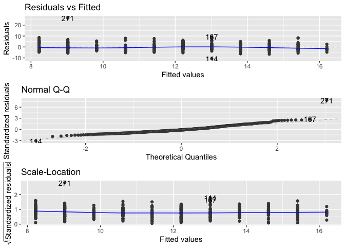<!-- -->

Awesome autoplotting! These three diagnostic plots are excellent for
sanity-checking the quality of your models.

## Outliers, leverage, and influence

Theory. Coming soon …

## Leverage

<!--
LO: Understands leverage in the context of linear regression models.
-->

Leverage measures how unusual or extreme the explanatory variables are
for each observation. Very roughly, a high leverage means that the
explanatory variable has values that are different to other points in
the dataset. In the case of simple linear regression, where there is
only one explanatory value, this typically means values with a very high
or very low explanatory value.

Here, you’ll look at highly leveraged values in the model of house price
versus the square root of distance from the nearest MRT station in the
Taiwan real estate dataset.

Guess which observations you think will have a high leverage, then move
the slider to find out.

> ## *Question*
>
> Which statement is true?<br> <br> ⬜ Observations with a large
> distance to the nearest MRT station have the highest leverage, because
> these points are furthest away from the linear regression trend
> line.<br> ⬜ Observations with a large distance to the nearest MRT
> station have the highest leverage, because leverage is proportional to
> the explanatory variable.<br> ✅ Observations with a large distance to
> the nearest MRT station have the highest leverage, because most of the
> observations have a short distance, so long distances are more
> extreme.<br> ⬜ Observations with a high price have the highest
> leverage, because most of the observations have a low price, so high
> prices are most extreme.<br>

Lovely leveraging! Highly leveraged points are the ones with explanatory
variables that are furthest away from the others.

## Influence

<!--
LO: Understands influence on the context of linear regression models.
-->

*Influence* measures how much a model would change if each observation
was left out of the model calculations, one at a time. That is, it
measures how different the prediction line would look if you ran a
linear regression on all data points except that point, compared to
running a linear regression on the whole dataset.

The standard metric for influence is *Cook’s distance*, which calculates
influence based on the size of the residual and the leverage of the
point.

Here you can see the same model as last time: house price versus the
square root of distance from the nearest MRT station in the Taiwan real
estate dataset.

Guess which observations you think will have a high influence, then move
the slider to find out.

> ## *Question*
>
> Which statement is true?<br> <br> ✅ Observations with predictions far
> away from the trend line have high influence, because they have large
> residuals and are far away from other observations.<br> ⬜
> Observations with high prices have high influence, because influence
> is proportional to the response variable.<br> ⬜ Observations with
> predictions far away from the trend line have high influence, because
> the slope of the trend is negative.<br> ⬜ Observations with
> predictions far away from the trend line have high influence, because
> that increases the leverage of those points.<br>

Impressive influence interpretation! The majority of the influential
houses were those with prices that were much higher than the model
predicted (and one with a price that was much lower).

## Extracting leverage and influence

<!--
LO: Can calculate and visualize observations with high leverage and influence.
-->

In the last few exercises you explored which observations had the
highest leverage and influence. Now you’ll extract those values from an
augmented version of the model, and visualize them.

**Steps**

1.  Augment `mdl_price_vs_dist`, then arrange observations by descending
    influence (`.hat`), and get the head of the results.

``` r
mdl_price_vs_dist %>% 
  # Augment the model
  augment() %>% 
  # Arrange rows by descending leverage
  arrange(desc(.hat)) %>% 
  # Get the head of the dataset
  head()
```

    ## # A tibble: 6 × 7
    ##   price_twd_msq `sqrt(dist_to_mrt_m)` .fitted   .hat .sigma   .cooksd .std.resid
    ##           <dbl>                 <dbl>   <dbl>  <dbl>  <dbl>     <dbl>      <dbl>
    ## 1          3.39                  80.5    1.98 0.0267   2.82 0.00351       0.506 
    ## 2          3.69                  80.0    2.09 0.0261   2.82 0.00447       0.577 
    ## 3          4.54                  79.4    2.19 0.0256   2.82 0.00937       0.844 
    ## 4          5.69                  74.2    3.13 0.0211   2.82 0.00906       0.916 
    ## 5          5.26                  74.2    3.13 0.0211   2.82 0.00630       0.764 
    ## 6          4.05                  67.9    4.30 0.0163   2.82 0.0000644    -0.0882

2.  Augment `mdl_price_vs_dist`, then arrange observations by descending
    influence (`.cooksd`), and get the head of the results.

``` r
mdl_price_vs_dist %>% 
  # Augment the model
  augment() %>% 
  # Arrange rows by descending Cook's distance
  arrange(desc(.cooksd)) %>% 
  # Get the head of the dataset
  head()
```

    ## # A tibble: 6 × 7
    ##   price_twd_msq `sqrt(dist_to_mrt_m)` .fitted    .hat .sigma .cooksd .std.resid
    ##           <dbl>                 <dbl>   <dbl>   <dbl>  <dbl>   <dbl>      <dbl>
    ## 1         35.6                   15.9   13.8  0.00385   2.61  0.116        7.73
    ## 2         13.6                   61.5    5.47 0.0121    2.79  0.0524       2.92
    ## 3         14.1                   56.3    6.41 0.00933   2.80  0.0354       2.74
    ## 4         23.7                   13.7   14.2  0.00440   2.78  0.0251       3.37
    ## 5          2.30                  19.8   13.1  0.00310   2.77  0.0228      -3.83
    ## 6         23.6                   17.8   13.4  0.00344   2.78  0.0225       3.61

3.  Plot the three outlier diagnostic plots (numbered `4` to `6`) for
    `mdl_price_vs_dist`. Use a layout of three rows and one column.

``` r
# Plot the three outlier diagnostics for mdl_price_vs_conv
autoplot(mdl_price_vs_dist, which = 4:6, nrow = 3, ncol = 1)
```

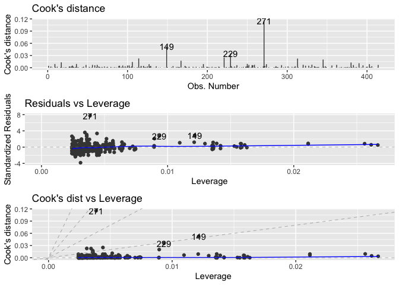<!-- -->

Delightful outlier diagnosing! Leverage and influence are important
concepts for determining your model is overly affected by some unusual
data points.

# 4. Simple logistic regression

Learn to fit logistic regression models. Using real-world data, you’ll
predict the likelihood of a customer closing their bank account as
probabilities of success and odds ratios, and quantify model performance
using confusion matrices.

## Why you need logistic regression

Theory. Coming soon …

## Exploring the explanatory variables

<!--
LO: Visualize data for a simple logistic regression using a faceted histogram.
-->

When the response variable is logical, all the points lie on the y
equals zero and y equals one lines, making it difficult to see what is
happening. In the video, until you saw the trend line, it wasn’t clear
how the explanatory variable was distributed on each line. This can be
solved with a histogram of the explanatory variable, faceted on the
response.

You will use these histograms to get to know the financial services
churn dataset seen in the video.

**Steps**

1.  Using `churn`, plot `time_since_last_purchase` as a histogram with
    binwidth `0.25` faceted in a grid with `has_churned` on each row.

``` r
# Load data
churn <- read_fst("data/churn.fst")

# Using churn, plot time_since_last_purchase
ggplot(churn, aes(time_since_last_purchase)) +
  # as a histogram with binwidth 0.25
  geom_histogram(binwidth = 0.25) +
  # faceted in a grid with has_churned on each row
  facet_grid(rows = vars(has_churned))
```

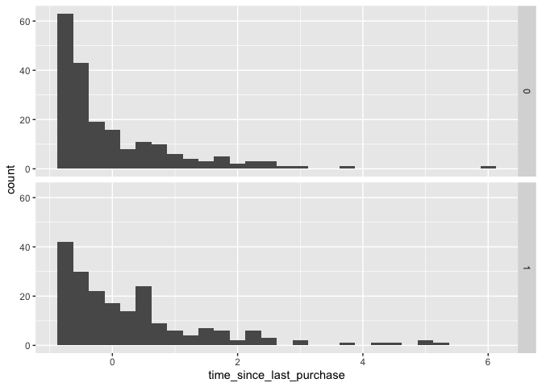<!-- -->

2.  Redraw the plot with `time_since_first_purchase`. That is, using
    `churn`, plot `time_since_first_purchase` as a histogram with
    binwidth `0.25` faceted in a grid with `has_churned` on each row.

``` r
# Redraw the plot with time_since_first_purchase
ggplot(churn, aes(time_since_first_purchase)) +
  geom_histogram(binwidth = 0.25) +
  facet_grid(rows = vars(has_churned))
```

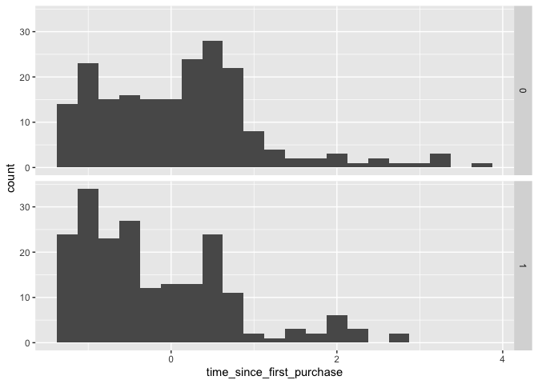<!-- -->

High five for the histograms! In the `time_since_last_purchase` plot,
the distribution of churned customers was further right than the
distribution of churned customers (churners typically has longer since
their last purchase). For `time_since_first_purchase` the opposite is
true: churners have a shorter length of relationship.

## Visualizing linear and logistic models

<!--
LO: Can visualize linear and logistic regression model predictions using geom_smooth().
-->

As with linear regressions, ggplot2 will draw model predictions for a
logistic regression without you having to worry about the modeling code
yourself. To see how the predictions differ for linear and logistic
regressions, try drawing both trend lines side by side. Spoiler: you
should see a linear (straight line) trend from the linear model, and a
logistic (S-shaped) trend from the logistic model.

**Steps**

1.  Using `churn` plot `has_churned` vs. `time_since_first_purchase` as
    a scatter plot, adding a red linear regression trend line (without a
    standard error ribbon).

``` r
# Using churn plot has_churned vs. time_since_first_purchase
ggplot(churn, aes(time_since_first_purchase, has_churned)) +
  # Make it a scatter plot
  geom_point() +
  # Add an lm trend line, no std error ribbon, colored red
  geom_smooth(method = "lm", se = FALSE, color = "red")
```

    ## `geom_smooth()` using formula 'y ~ x'

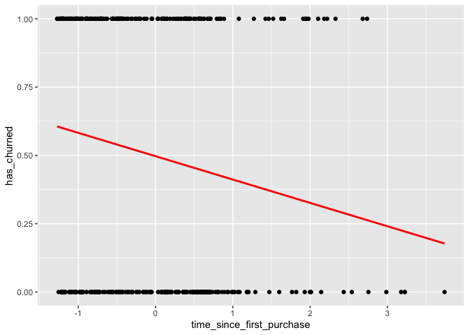<!-- -->

2.  Update the plot by adding a second trend line from logistic
    regression. (No standard error ribbon again).

``` r
ggplot(churn, aes(time_since_first_purchase, has_churned)) +
  geom_point() +
  geom_smooth(method = "lm", se = FALSE, color = "red") +
  # Add a glm trend line, no std error ribbon, binomial family
  geom_smooth(
    method = "glm", 
    se = FALSE, 
    method.args = list(family = binomial)
  )
```

    ## `geom_smooth()` using formula 'y ~ x'
    ## `geom_smooth()` using formula 'y ~ x'

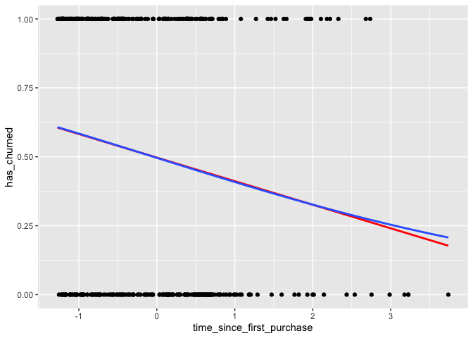<!-- -->

Magnificent model comparison plotting! The two models give similar
predictions in some places, but notice the slight curve in the logistic
model trend.

## Logistic regression with glm()

<!--
LO: Can fit a logistic regression model with glm().
-->

Linear regression and logistic regression are special cases of a broader
type of models called *generalized linear models* (“GLMs”). A linear
regression makes the assumption that the residuals follow a Gaussian
(normal) distribution. By contrast, a logistic regression assumes that
residuals follow a binomial distribution.

Here, you’ll model how the length of relationship with a customer
affects churn.

**Steps**

1.  Fit a logistic regression of `has_churned` versus
    `time_since_first_purchase` using the `churn` dataset. Assign to
    `mdl_churn_vs_relationship`.

``` r
# Fit a logistic regression of churn vs. 
# length of relationship using the churn dataset
mdl_churn_vs_relationship <- glm(
  has_churned ~ time_since_first_purchase, 
  data = churn, 
  family = binomial
)

# See the result
mdl_churn_vs_relationship
```

    ## 
    ## Call:  glm(formula = has_churned ~ time_since_first_purchase, family = binomial, 
    ##     data = churn)
    ## 
    ## Coefficients:
    ##               (Intercept)  time_since_first_purchase  
    ##                  -0.01518                   -0.35479  
    ## 
    ## Degrees of Freedom: 399 Total (i.e. Null);  398 Residual
    ## Null Deviance:       554.5 
    ## Residual Deviance: 543.7     AIC: 547.7

Lovely logistic modeling! The code to run a logistic regression is a
simple change from the code to run a linear regression. Now we need to
make some predictions with the model.

## Predictions and odds ratios

Theory. Coming soon …

## Probabilities

<!-- 
LO: Can calculate logistic regression model predictions as probabilities of success.
-->

There are four main ways of expressing the prediction from a logistic
regression model – we’ll look at each of them over the next four
exercises. Firstly, since the response variable is either “yes” or “no”,
you can make a prediction of the probability of a “yes”. Here, you’ll
calculate and visualize these probabilities.

Three variables are available:

-   `mdl_churn_vs_relationship` is the logistic regression model of
    `has_churned` versus `time_since_first_purchase`.
-   `explanatory_data` is a data frame of explanatory values.
-   `plt_churn_vs_relationship` is a scatter plot of `has_churned`
    versus `time_since_first_purchase` with a smooth glm line.

**Steps**

1.  Use the model, `mdl_churn_vs_relationship`, and the explanatory
    data, `explanatory_data`, to predict the probability of churning.
    Assign the predictions to the `has_churned` column of a data frame,
    `prediction_data`. *Remember to set the prediction* `type`.

``` r
# Create data
explanatory_data <- tibble(time_since_first_purchase = seq(-1.5, 4, 0.25))


# Make a data frame of predicted probabilities
prediction_data <- explanatory_data %>% 
  mutate(   
    has_churned = predict(
      mdl_churn_vs_relationship, 
      explanatory_data, 
      type = "response"
    )
  )

# See the result
prediction_data
```

    ## # A tibble: 23 × 2
    ##    time_since_first_purchase has_churned
    ##                        <dbl>       <dbl>
    ##  1                     -1.5        0.626
    ##  2                     -1.25       0.605
    ##  3                     -1          0.584
    ##  4                     -0.75       0.562
    ##  5                     -0.5        0.540
    ##  6                     -0.25       0.518
    ##  7                      0          0.496
    ##  8                      0.25       0.474
    ##  9                      0.5        0.452
    ## 10                      0.75       0.430
    ## # … with 13 more rows

2.  Update the `plt_churn_vs_relationship` plot to add points from
    `prediction_data`, colored yellow.

``` r
plt_churn_vs_relationship <- ggplot(churn, aes(time_since_first_purchase, has_churned)) +
  geom_point() +
  geom_smooth(
    method = "glm", 
    se = FALSE, 
    method.args = list(family = binomial)
  )
```

``` r
# From previous step
prediction_data <- explanatory_data %>% 
  mutate(   
    has_churned = predict(mdl_churn_vs_relationship, explanatory_data, type = "response")
  )

# Update the plot
plt_churn_vs_relationship +
  # Add points from prediction_data, colored yellow, size 2
  geom_point(data = prediction_data, color = "yellow", size = 2)
```

    ## `geom_smooth()` using formula 'y ~ x'

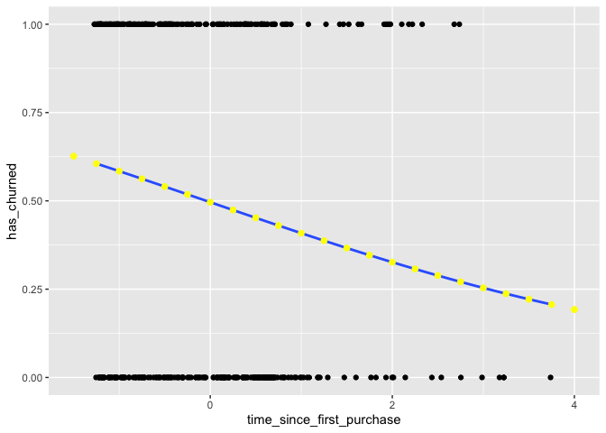<!-- -->

Probably perfect probability plotting! The probability of a positive
response is a natural way of thinking about predictions.

## Most likely outcome

<!-- 
LO: Can calculate logistic regression model predictions as most likely outcome.
-->

When explaining your results to a non-technical audience, you may wish
to side-step talking about probabilities and simply explain the most
likely outcome. That is, rather than saying there is a 60% chance of a
customer churning, you say that the most likely outcome is that the
customer will churn. The tradeoff here is easier interpretation at the
cost of nuance.

**Steps**

1.  Update `prediction_data` to add a column of the most likely churn
    outcome, `most_likely_outcome`.

``` r
# Update the data frame
prediction_data <- explanatory_data %>% 
  mutate(   
    has_churned = predict(mdl_churn_vs_relationship, explanatory_data, type = "response"),
    # Add the most likely churn outcome
    most_likely_outcome = round(has_churned)
  )

# See the result
prediction_data
```

    ## # A tibble: 23 × 3
    ##    time_since_first_purchase has_churned most_likely_outcome
    ##                        <dbl>       <dbl>               <dbl>
    ##  1                     -1.5        0.626                   1
    ##  2                     -1.25       0.605                   1
    ##  3                     -1          0.584                   1
    ##  4                     -0.75       0.562                   1
    ##  5                     -0.5        0.540                   1
    ##  6                     -0.25       0.518                   1
    ##  7                      0          0.496                   0
    ##  8                      0.25       0.474                   0
    ##  9                      0.5        0.452                   0
    ## 10                      0.75       0.430                   0
    ## # … with 13 more rows

2.  Update `plt_churn_vs_relationship`, adding yellow points of size 2
    with `most_likely_outcome` as the y aesthetic, using
    `prediction_data`.

``` r
# From previous step
prediction_data <- explanatory_data %>% 
  mutate(   
    has_churned = predict(mdl_churn_vs_relationship, explanatory_data, type = "response"),
    most_likely_outcome = round(has_churned)
  )

# Update the plot
plt_churn_vs_relationship +
  # Add most likely outcome points from prediction_data, 
  # colored yellow, size 2
  geom_point(
    aes(y = most_likely_outcome), 
    data = prediction_data, 
    color = "yellow",
    size = 2
  )
```

    ## `geom_smooth()` using formula 'y ~ x'

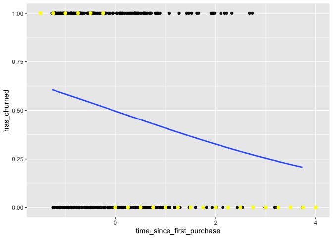<!-- -->

The most likely outcome is that you will master logistic regression!
Providing the most likely response is a great way to share the model
results with a non-technical audience.

## Odds ratio

<!-- 
LO: Can calculate logistic regression model predictions as odds ratios.
-->

Odds ratios compare the probability of something happening with the
probability of it not happening. This is sometimes easier to reason
about than probabilities, particularly when you want to make decisions
about choices. For example, if a customer has a 20% chance of churning,
it maybe more intuitive to say “the chance of them not churning is four
times higher than the chance of them churning”.

**Steps**

1.  Update `prediction_data` to add a column, `odds_ratio`, of the odds
    ratios.

``` r
# Update the data frame
prediction_data <- explanatory_data %>% 
  mutate(   
    has_churned = predict(
      mdl_churn_vs_relationship, explanatory_data, 
      type = "response"
    ),
    # Add the odds ratio
    odds_ratio = has_churned / (1 - has_churned)
  )

# See the result
prediction_data
```

    ## # A tibble: 23 × 3
    ##    time_since_first_purchase has_churned odds_ratio
    ##                        <dbl>       <dbl>      <dbl>
    ##  1                     -1.5        0.626      1.68 
    ##  2                     -1.25       0.605      1.53 
    ##  3                     -1          0.584      1.40 
    ##  4                     -0.75       0.562      1.29 
    ##  5                     -0.5        0.540      1.18 
    ##  6                     -0.25       0.518      1.08 
    ##  7                      0          0.496      0.985
    ##  8                      0.25       0.474      0.901
    ##  9                      0.5        0.452      0.825
    ## 10                      0.75       0.430      0.755
    ## # … with 13 more rows

2.  Using `prediction_data`, draw a line plot of `odds_ratio` versus
    `time_since_first_purchase`. Add a dotted horizontal line at
    `odds_ratio` equal to `1`.

``` r
# From previous step
prediction_data <- explanatory_data %>% 
  mutate(   
    has_churned = predict(mdl_churn_vs_relationship, explanatory_data, type = "response"),
    odds_ratio = has_churned / (1 - has_churned)
  )

# Using prediction_data, plot odds_ratio vs. time_since_first_purchase
ggplot(prediction_data, aes(time_since_first_purchase, odds_ratio)) +
  # Make it a line plot
  geom_line() +
  # Add a dotted horizontal line at y = 1
  geom_hline(yintercept = 1, linetype = "dotted")
```

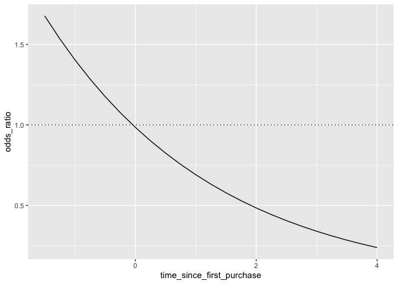<!-- -->

You beat the odds! Odds ratios provide an alternative to probabilities
that make it easier to compare positive and negative responses.

## Log odds ratio

<!-- 
LO: Can calculate logistic regression model predictions as log-odds ratios.
-->

One downside to probabilities and odds ratios for logistic regression
predictions is that the prediction lines for each are curved. This makes
it harder to reason about what happens to the prediction when you make a
change to the explanatory variable. The logarithm of the odds ratio (the
“log odds ratio”) does have a linear relationship between predicted
response and explanatory variable. That means that as the explanatory
variable changes, you don’t see dramatic changes in the response
metric - only linear changes.

Since the actual values of log odds ratio are less intuitive than
(linear) odds ratio, for visualization purposes it’s usually better to
plot the odds ratio and apply a log transformation to the y-axis scale.

**Steps**

1.  Update `prediction_data` to add the log odds ratio calculated two
    ways. Calculate it from the `odds_ratio`, then directly using
    `predict()`.

``` r
# Update the data frame
prediction_data <- explanatory_data %>% 
  mutate(   
    has_churned = predict(mdl_churn_vs_relationship, explanatory_data, type = "response"),
    odds_ratio = has_churned / (1 - has_churned),
    # Add the log odds ratio from odds_ratio
    log_odds_ratio = log(odds_ratio),
    # Add the log odds ratio using predict()
    log_odds_ratio2 = predict(mdl_churn_vs_relationship, explanatory_data)
  )

# See the result
prediction_data
```

    ## # A tibble: 23 × 5
    ##    time_since_first_purch… has_churned odds_ratio log_odds_ratio log_odds_ratio2
    ##                      <dbl>       <dbl>      <dbl>          <dbl>           <dbl>
    ##  1                   -1.5        0.626      1.68          0.517           0.517 
    ##  2                   -1.25       0.605      1.53          0.428           0.428 
    ##  3                   -1          0.584      1.40          0.340           0.340 
    ##  4                   -0.75       0.562      1.29          0.251           0.251 
    ##  5                   -0.5        0.540      1.18          0.162           0.162 
    ##  6                   -0.25       0.518      1.08          0.0735          0.0735
    ##  7                    0          0.496      0.985        -0.0152         -0.0152
    ##  8                    0.25       0.474      0.901        -0.104          -0.104 
    ##  9                    0.5        0.452      0.825        -0.193          -0.193 
    ## 10                    0.75       0.430      0.755        -0.281          -0.281 
    ## # … with 13 more rows

2.  Update the plot to use a logarithmic y-scale.

``` r
# From previous step
prediction_data <- explanatory_data %>% 
  mutate(   
    has_churned = predict(mdl_churn_vs_relationship, explanatory_data, type = "response"),
    odds_ratio = has_churned / (1 - has_churned),
    log_odds_ratio = log(odds_ratio)
  )

# Update the plot
ggplot(prediction_data, aes(time_since_first_purchase, odds_ratio)) +
  geom_line() +
  geom_hline(yintercept = 1, linetype = "dotted") +
  # Use a logarithmic y-scale
  scale_y_log10()
```

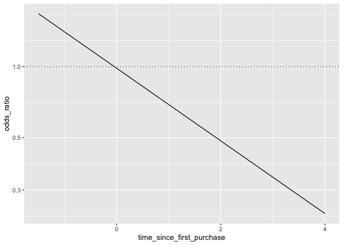<!-- -->

Laudable log odds ratio work! The linear relationship between predicted
log odds ratio and the explanatory variable makes changes easier to
reason about.

## Quantifying logistic regression fit

Theory. Coming soon …

## Calculating the confusion matrix

<!-- 
LO: Can calculate a confusion matrix form a logistic regression model.
-->

A *confusion matrix* (occasionally called a *confusion table*) is the
basis of all performance metrics for models with a categorical response
(such as a logistic regression). It contains the counts of each actual
response-predicted response pair. In this case, where there are two
possible responses (churn or not churn), there are four overall
outcomes.

1.  The customer churned and the model predicted that.
2.  The customer churned but the model didn’t predict that.
3.  The customer didn’t churn but the model predicted they did.
4.  The customer didn’t churn and the model predicted that.

**Steps**

1.  Get the actual responses from the `has_churned` column of the
    dataset. Assign to `actual_response`.
2.  Get the “most likely” predicted responses from the model. Assign to
    `predicted_response`.
3.  Create a table of counts from the actual and predicted response
    vectors. Assign to `outcomes`.

``` r
# Get the actual responses from the dataset
actual_response <- churn$has_churned

# Get the "most likely" predicted responses from the model
predicted_response <- round(fitted(mdl_churn_vs_relationship))

# Create a table of counts
outcomes <- table(predicted_response, actual_response)

# See the result
outcomes
```

    ##                   actual_response
    ## predicted_response   0   1
    ##                  0 112  76
    ##                  1  88 124

Courageous confusion creation! The name ‘confusion matrix’ sounds scary,
but it’s just a table of counts. Simple!

## Measuring logistic model performance

<!-- 
LO: Can visualize a confusion matrix as a mosaic plot.
-->

Having the confusion matrix as a table object is OK, but a little hard
to program with. By converting this to a `yardstick` confusion matrix
object, you get methods for plotting and extracting performance metrics.

The `yardstick.event_first` option is set to `FALSE`. (The global
option, yardstick.event_first, has been deprecated in favor of the new
explicit argument, `event_level`.)

``` r
options(yardstick.event_first = TRUE)  -> event_level = "first" # (the default)
options(yardstick.event_first = FALSE) -> event_level = "second"
```

**Steps**

1.  Convert `outcomes` to a yardstick confusion matrix. Assign to
    `confusion`.
2.  Automatically plot `confusion`.
3.  Get performance metrics from `confusion`, remembering that the
    positive response is in the second column.

``` r
# Load package
library(yardstick)
```

    ## For binary classification, the first factor level is assumed to be the event.
    ## Use the argument `event_level = "second"` to alter this as needed.

``` r
# Convert outcomes to a yardstick confusion matrix
confusion <- conf_mat(outcomes, event_level = "second")

# Plot the confusion matrix
autoplot(confusion, type = "mosaic")
```

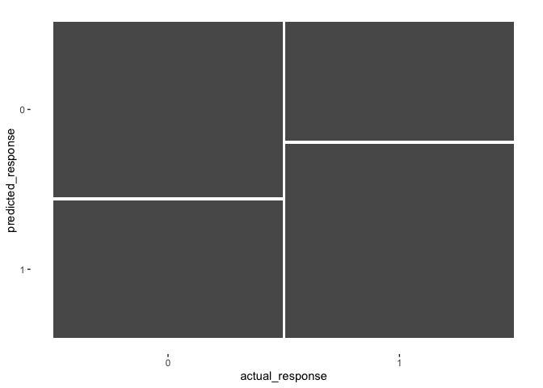<!-- -->

``` r
# Get performance metrics for the confusion matrix
summary(confusion, event_level = "second")
```

    ## # A tibble: 13 × 3
    ##    .metric              .estimator .estimate
    ##    <chr>                <chr>          <dbl>
    ##  1 accuracy             binary         0.59 
    ##  2 kap                  binary         0.18 
    ##  3 sens                 binary         0.62 
    ##  4 spec                 binary         0.56 
    ##  5 ppv                  binary         0.585
    ##  6 npv                  binary         0.596
    ##  7 mcc                  binary         0.180
    ##  8 j_index              binary         0.180
    ##  9 bal_accuracy         binary         0.59 
    ## 10 detection_prevalence binary         0.53 
    ## 11 precision            binary         0.585
    ## 12 recall               binary         0.62 
    ## 13 f_meas               binary         0.602

Magnificent model performance measuring! By converting from a standard
table object to a yardstick confusion matrix object, plotting and
getting performance metrics is easy.

## Accuracy, sensitivity, specificity

`yardstick` can compute lots of performance metrics from a confusion
matrix. For logistic regression, three of them in particular are
important: accuracy, sensitivity, and specificity. Can you identify what
each of those terms mean in the context of the churn model?

Match the definition of the churn model performance metric to the name
of that metric.

| Accuracy                                                                                     | Sensitivity                                                                                    | Specifity                                                                                                |
|----------------------------------------------------------------------------------------------|------------------------------------------------------------------------------------------------|----------------------------------------------------------------------------------------------------------|
| The proportion of customers where the model correctly predicted whether or not they churned. | The proportion of customers who churned where the model correctly predicted that they churned. | The proportion of customers who didn’t churn where the model correctly predicted that they didn’t churn. |

Insightful metric identification! Accuracy, sensitivity, and specificity
are the most important performance metrics for logistic regression
models.
