Introduction to Statistics in R
================
Joschka Schwarz

-   [1. Summary Statistics](#1-summary-statistics)
    -   [Descriptive and inferential
        statistics](#descriptive-and-inferential-statistics)
    -   [Data type classification](#data-type-classification)
    -   [Mean and median](#mean-and-median)
    -   [Mean vs. median](#mean-vs-median)
    -   [Quartiles, quantiles, and
        quintiles](#quartiles-quantiles-and-quintiles)
    -   [Variance and standard
        deviation](#variance-and-standard-deviation)
    -   [Finding outliers using IQR](#finding-outliers-using-iqr)
-   [2. Random Numbers and
    Probability](#2-random-numbers-and-probability)
    -   [With or without replacement?](#with-or-without-replacement)
    -   [Calculating probabilities](#calculating-probabilities)
    -   [Sampling deals](#sampling-deals)
    -   [Creating a probability
        distribution](#creating-a-probability-distribution)
    -   [Identifying distributions](#identifying-distributions)
    -   [Expected value vs. sample mean](#expected-value-vs-sample-mean)
    -   [Which distribution?](#which-distribution)
    -   [Data back-ups](#data-back-ups)
    -   [Simulating wait times](#simulating-wait-times)
    -   [Calculating binomial
        probabilities](#calculating-binomial-probabilities)
    -   [How many sales will be won?](#how-many-sales-will-be-won)
-   [3. More Distributions and the Central Limit
    Theorem](#3-more-distributions-and-the-central-limit-theorem)
    -   [The normal distribution](#the-normal-distribution)
    -   [Distribution of Amir’s sales](#distribution-of-amirs-sales)
    -   [Probabilities from the normal
        distribution](#probabilities-from-the-normal-distribution)
    -   [Simulating sales under new market
        conditions](#simulating-sales-under-new-market-conditions)
    -   [Which market is better?](#which-market-is-better)
    -   [The central limit theorem](#the-central-limit-theorem)
    -   [Visualizing sampling
        distributions](#visualizing-sampling-distributions)
    -   [The CLT in action](#the-clt-in-action)
    -   [The mean of means](#the-mean-of-means)
    -   [The Poisson distribution](#the-poisson-distribution)
    -   [Identifying lambda](#identifying-lambda)
    -   [Tracking lead responses](#tracking-lead-responses)
    -   [Too many distributions](#too-many-distributions)
    -   [Modeling time between leads](#modeling-time-between-leads)
    -   [The t-distribution](#the-t-distribution)
-   [4. Correlation and Experimental
    Design](#4-correlation-and-experimental-design)
    -   [Correlation](#correlation)
    -   [Relationships between
        variables](#relationships-between-variables)
    -   [What can’t correlation
        measure?](#what-cant-correlation-measure)
    -   [Transforming variables](#transforming-variables)
    -   [Does sugar improve happiness?](#does-sugar-improve-happiness)
    -   [Confounders](#confounders)
    -   [Study types](#study-types)
    -   [Longitudinal vs. cross-sectional
        studies](#longitudinal-vs-cross-sectional-studies)

Statistics is the study of how to collect, analyze, and draw conclusions
from data. It’s a hugely valuable tool that you can use to bring the
future into focus and infer the answer to tons of questions. For
example, what is the likelihood of someone purchasing your product, how
many calls will your support team receive, and how many jeans sizes
should you manufacture to fit 95% of the population? In this course,
you’ll use sales data to discover how to answer questions like these as
you grow your statistical skills and learn how to calculate averages,
use scatterplots to show the relationship between numeric values, and
calculate correlation. You’ll also tackle probability, the backbone of
statistical reasoning, and learn how to conduct a well-designed study to
draw your own conclusions from data.

# 1. Summary Statistics

## Descriptive and inferential statistics

Statistics can be used to answer lots of different types of questions,
but being able to identify which type of statistics is needed is
essential to drawing accurate conclusions. In this exercise, you’ll
sharpen your skills by identifying which type is needed to answer each
question.

Identify which questions can be answered with descriptive statistics and
which questions can be answered with inferential statistics.

| Descriptive                                                                                    | Inferential                                                                                             |
|------------------------------------------------------------------------------------------------|---------------------------------------------------------------------------------------------------------|
| Given data on all 100,000 people who viewed an ad, what percent of people clicked on it?       | Given data on 20 fish caught in a lake, what’s the average weight of all fish in the lake?              |
| Given data on every customer service request made, what’s the average time it took to respond? | After interviewing 100 customers, what percent of *all* your customers are satisfied with your product? |

## Data type classification

In the video, you learned about two main types of data: numeric and
categorical. Numeric variables can be classified as either discrete or
continuous, and categorical variables can be classified as either
nominal or ordinal. These characteristics of a variable determine which
ways of summarizing your data will work best.

Map each variable to its data type by dragging and dropping.

| Continuous numeric            | Discrete numeric                 | Categorical        |
|-------------------------------|----------------------------------|--------------------|
| Kilowatts of electricity used | Number of items in stock         | Brand of a product |
| Air temperature               | Number of DataCamp courses taken | Postal Code        |
|                               | Number of clicks on an ad        |                    |

## Mean and median

In this chapter, you’ll be working with the
<a href="https://www.nu3.de/blogs/nutrition/food-carbon-footprint-index-2018" target="_blank" rel="noopener noreferrer">2018
Food Carbon Footprint Index</a> from nu3. The `food_consumption` dataset
contains information about the kilograms of food consumed per person per
year in each country in each food category (`consumption`) as well as
information about the carbon footprint of that food category
(`co2_emissions`) measured in kilograms of carbon dioxide, or
CO<mjx-container class="MathJax CtxtMenu_Attached_0" jax="CHTML" style="font-size: 116.7%; position: relative;" role="presentation" tabindex="0" ctxtmenu_counter="1"><mjx-math class="MJX-TEX" aria-hidden="true"><mjx-msub><mjx-mi class="mjx-n" noic="true"></mjx-mi><mjx-script style="vertical-align: -0.15em;"><mjx-mn class="mjx-n" size="s"><mjx-c class="mjx-c32"></mjx-c></mjx-mn></mjx-script></mjx-msub></mjx-math><mjx-assistive-mml role="presentation" unselectable="on" display="inline"><math xmlns="http://www.w3.org/1998/Math/MathML"><msub><mi></mi><mn>2</mn></msub></math></mjx-assistive-mml></mjx-container>,
per person per year in each country.

In this exercise, you’ll compute measures of center to compare food
consumption in the US and Belgium using your `dplyr` skills.

**Steps**

1.  Create two data frames: one that holds the rows of
    `food_consumption` for `"Belgium"` and the another that holds rows
    for `"USA"`. Call these `belgium_consumption` and `usa_consumption`.

``` r
# Load packages
library(dplyr)
```

    ## 
    ## Attaching package: 'dplyr'

    ## The following objects are masked from 'package:stats':
    ## 
    ##     filter, lag

    ## The following objects are masked from 'package:base':
    ## 
    ##     intersect, setdiff, setequal, union

``` r
food_consumption <- readRDS("data/food_consumption.rds")

# 1.1 Filter for Belgium
belgium_consumption <- food_consumption |> 
  filter(country == "Belgium")

# 1.2 Filter for USA
usa_consumption <- food_consumption  |> 
  filter(country == "USA")
```

2.  Calculate the mean and median of kilograms of food consumed per
    person per year for both countries.

``` r
# 2.1 Calculate mean and median consumption in Belgium
mean(belgium_consumption$consumption)
```

    ## [1] 42.13273

``` r
median(belgium_consumption$consumption)
```

    ## [1] 12.59

``` r
# 2.2 Calculate mean and median consumption in USA
mean(usa_consumption$consumption)
```

    ## [1] 44.65

``` r
median(usa_consumption$consumption)
```

    ## [1] 14.58

3.  Filter `food_consumption` for rows with data about Belgium and the
    USA.
4.  Group the filtered data by `country`.
5.  Calculate the mean and median of the kilograms of food consumed per
    person per year in each country. Call these columns
    `mean_consumption` and `median_consumption`.

``` r
food_consumption  |> 
  # 3. Filter for Belgium and USA
  filter(country %in% c("Belgium", "USA"))  |> 
  # 4. Group by country
  group_by(country)  |> 
  # 5. Get mean_consumption and median_consumption
  summarise(mean_consumption   = mean(consumption),
            median_consumption = median(consumption))
```

    ## # A tibble: 2 × 3
    ##   country mean_consumption median_consumption
    ##   <chr>              <dbl>              <dbl>
    ## 1 Belgium             42.1               12.6
    ## 2 USA                 44.6               14.6

## Mean vs. median

In the video, you learned that the mean is the sum of all the data
points divided by the total number of data points, and the median is the
middle value of the dataset where 50% of the data is less than the
median, and 50% of the data is greater than the median. In this
exercise, you’ll compare these two measures of center.

**Steps**

1.  Filter `food_consumption` to get the rows where `food_category` is
    `"rice"`.
2.  Create a histogram using `ggplot2` of `co2_emission` for rice.

``` r
# Load packages
library(ggplot2)

food_consumption  |> 
  # 1. Filter for rice food category
  filter(food_category == "rice")  |> 
  # 2. Create histogram of co2_emission
  ggplot(aes(co2_emission)) +
    geom_histogram()
```

    ## `stat_bin()` using `bins = 30`. Pick better value with `binwidth`.

<!-- -->

> ## *Question*
>
> Take a look at the histogram of the CO2 emissions for rice you just
> calculated. Which of the following terms best describes the shape of
> the data?<br> <br> ⬜ No skew<br> ⬜ Left-skewed<br> ✅
> Right-skewed<br>

3.  Filter `food_consumption` to get the rows where `food_category` is
    `"rice"`.

``` r
food_consumption %>%
  # Filter for rice food category
  filter(food_category == "rice")  |> 
  # Create histogram of co2_emission
  ggplot(aes(co2_emission)) +
    geom_histogram()
```

    ## `stat_bin()` using `bins = 30`. Pick better value with `binwidth`.

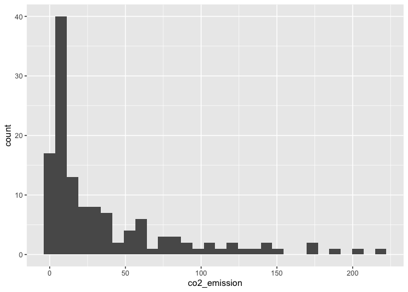<!-- -->

4.  Summarize the data to get the mean and median of `co2_emission`,
    calling them `mean_co2` and `median_co2`.

``` r
food_consumption  |> 
  # Filter for rice food category
  filter(food_category == "rice") |> 
  # Get mean_co2 and median_co2
  summarise(mean_co2   = mean(co2_emission),
            median_co2 = median(co2_emission))
```

    ## # A tibble: 1 × 2
    ##   mean_co2 median_co2
    ##      <dbl>      <dbl>
    ## 1     37.6       15.2

> ## *Question*
>
> Given the skew of this data, what measure of central tendency best
> summarizes the kilograms of CO2 emissions per person per year for
> rice?<br> <br> ⬜ Mean<br> ✅ Median<br> ⬜ Both mean and median<br>

## Quartiles, quantiles, and quintiles

Quantiles are a great way of summarizing numerical data since they can
be used to measure center and spread, as well as to get a sense of where
a data point stands in relation to the rest of the dataset. For example,
you might want to give a discount to the 10% most active users on a
website.

In this exercise, you’ll calculate quartiles, quintiles, and deciles,
which split up a dataset into 4, 5, and 10 pieces, respectively.

**Steps**

1.  Calculate the quartiles of the `co2_emission` column of
    `food_consumption`.

``` r
# Calculate the quartiles of co2_emission
quantile(food_consumption$co2_emission)
```

    ##        0%       25%       50%       75%      100% 
    ##    0.0000    5.2100   16.5300   62.5975 1712.0000

2.  Calculate the six quantiles that split up the data into 5 pieces
    (quintiles) of the `co2_emission` column of `food_consumption`.

``` r
# Calculate the quintiles of co2_emission
quantile(food_consumption$co2_emission, probs = seq(0,1,0.2))
```

    ##       0%      20%      40%      60%      80%     100% 
    ##    0.000    3.540   11.026   25.590   99.978 1712.000

3.  Calculate the eleven quantiles of `co2_emission` that split up the
    data into ten pieces (deciles).

``` r
# Calculate the deciles of co2_emission
quantile(food_consumption$co2_emission, probs = seq(0,1,0.1))
```

    ##       0%      10%      20%      30%      40%      50%      60%      70% 
    ##    0.000    0.668    3.540    7.040   11.026   16.530   25.590   44.271 
    ##      80%      90%     100% 
    ##   99.978  203.629 1712.000

## Variance and standard deviation

Variance and standard deviation are two of the most common ways to
measure the spread of a variable, and you’ll practice calculating these
in this exercise. Spread is important since it can help inform
expectations. For example, if a salesperson sells a mean of 20 products
a day, but has a standard deviation of 10 products, there will probably
be days where they sell 40 products, but also days where they only sell
one or two. Information like this is important, especially when making
predictions.

Both `dplyr` and `ggplot2` are loaded, and `food_consumption` is
available.

**Steps**

1.  Calculate the variance and standard deviation of `co2_emission` for
    each `food_category` by grouping by and summarizing variance as
    `var_co2` and standard deviation as `sd_co2`.

``` r
# 1. Calculate variance and sd of co2_emission for each food_category
food_consumption %>% 
  group_by(food_category) %>% 
  summarise(var_co2 = var(co2_emission),
     sd_co2 = sd(co2_emission))
```

    ## # A tibble: 11 × 3
    ##    food_category   var_co2  sd_co2
    ##    <fct>             <dbl>   <dbl>
    ##  1 beef          88748.    298.   
    ##  2 eggs             21.4     4.62 
    ##  3 fish            922.     30.4  
    ##  4 lamb_goat     16476.    128.   
    ##  5 dairy         17672.    133.   
    ##  6 nuts             35.6     5.97 
    ##  7 pork           3095.     55.6  
    ##  8 poultry         245.     15.7  
    ##  9 rice           2281.     47.8  
    ## 10 soybeans          0.880   0.938
    ## 11 wheat            71.0     8.43

2.  Create a histogram of `co2_emission` for each `food_category` using
    `facet_wrap()`.

``` r
# 2. Plot food_consumption with co2_emission on x-axis
ggplot(food_consumption, aes(co2_emission)) +
  # Create a histogram
  geom_histogram() +
  # Create a separate sub-graph for each food_category
  facet_wrap(~ food_category)
```

    ## `stat_bin()` using `bins = 30`. Pick better value with `binwidth`.

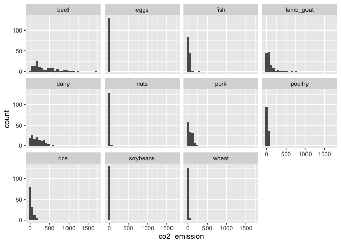<!-- -->

## Finding outliers using IQR

Outliers can have big effects on statistics like mean, as well as
statistics that rely on the mean, such as variance and standard
deviation. Interquartile range, or IQR, is another way of measuring
spread that’s less influenced by outliers. IQR is also often used to
find outliers. If a value is less than
<mjx-container class="MathJax CtxtMenu_Attached_0" jax="CHTML" style="font-size: 116.7%; position: relative;" role="presentation" tabindex="0" ctxtmenu_counter="2"><mjx-math class="MJX-TEX" aria-hidden="true"><mjx-mtext class="mjx-n"><mjx-c class="mjx-c51"></mjx-c><mjx-c class="mjx-c31"></mjx-c></mjx-mtext><mjx-mo class="mjx-n" space="3"><mjx-c class="mjx-c2212"></mjx-c></mjx-mo><mjx-mn class="mjx-n" space="3"><mjx-c class="mjx-c31"></mjx-c><mjx-c class="mjx-c2E"></mjx-c><mjx-c class="mjx-c35"></mjx-c></mjx-mn><mjx-mo class="mjx-n" space="3"><mjx-c class="mjx-cD7"></mjx-c></mjx-mo><mjx-mtext class="mjx-n" space="3"><mjx-c class="mjx-c49"></mjx-c><mjx-c class="mjx-c51"></mjx-c><mjx-c class="mjx-c52"></mjx-c></mjx-mtext></mjx-math><mjx-assistive-mml role="presentation" unselectable="on" display="inline"><math xmlns="http://www.w3.org/1998/Math/MathML"><mtext>Q1</mtext><mo>−</mo><mn>1.5</mn><mo>×</mo><mtext>IQR</mtext></math></mjx-assistive-mml></mjx-container>
or greater than
<mjx-container class="MathJax CtxtMenu_Attached_0" jax="CHTML" style="font-size: 116.7%; position: relative;" role="presentation" tabindex="0" ctxtmenu_counter="3"><mjx-math class="MJX-TEX" aria-hidden="true"><mjx-mtext class="mjx-n"><mjx-c class="mjx-c51"></mjx-c><mjx-c class="mjx-c33"></mjx-c></mjx-mtext><mjx-mo class="mjx-n" space="3"><mjx-c class="mjx-c2B"></mjx-c></mjx-mo><mjx-mn class="mjx-n" space="3"><mjx-c class="mjx-c31"></mjx-c><mjx-c class="mjx-c2E"></mjx-c><mjx-c class="mjx-c35"></mjx-c></mjx-mn><mjx-mo class="mjx-n" space="3"><mjx-c class="mjx-cD7"></mjx-c></mjx-mo><mjx-mtext class="mjx-n" space="3"><mjx-c class="mjx-c49"></mjx-c><mjx-c class="mjx-c51"></mjx-c><mjx-c class="mjx-c52"></mjx-c></mjx-mtext></mjx-math><mjx-assistive-mml role="presentation" unselectable="on" display="inline"><math xmlns="http://www.w3.org/1998/Math/MathML"><mtext>Q3</mtext><mo>+</mo><mn>1.5</mn><mo>×</mo><mtext>IQR</mtext></math></mjx-assistive-mml></mjx-container>,
it’s considered an outlier. In fact, this is how the lengths of the
whiskers in a `ggplot2` box plot are calculated.


In this exercise, you’ll calculate IQR and use it to find some outliers.

**Steps**

1.  Calculate the total `co2_emission` per country by grouping by
    country and taking the sum of `co2_emission`. Call the sum
    `total_emission` and store the resulting data frame as
    `emissions_by_country`.

``` r
# Calculate total co2_emission per country: emissions_by_country
emissions_by_country <- food_consumption %>%
  group_by(country) %>%
  summarise(total_emission = sum(co2_emission))

emissions_by_country
```

    ## # A tibble: 130 × 2
    ##    country    total_emission
    ##    <chr>               <dbl>
    ##  1 Albania             1778.
    ##  2 Algeria              708.
    ##  3 Angola               413.
    ##  4 Argentina           2172.
    ##  5 Armenia             1110.
    ##  6 Australia           1939.
    ##  7 Austria             1211.
    ##  8 Bahamas             1193.
    ##  9 Bangladesh           374.
    ## 10 Barbados             889.
    ## # … with 120 more rows

2.  Compute the first and third quartiles of `total_emission` and store
    these as `q1` and `q3`.
3.  Calculate the interquartile range of `total_emission` and store it
    as `iqr`.
4.  Calculate the lower and upper cutoffs for outliers of
    `total_emission`, and store these as `lower` and `upper`.

``` r
# 2. / 3. Compute the first and third quantiles and IQR of total_emission
q1  <- quantile(emissions_by_country$total_emission, probs = 0.25)
q3  <- quantile(emissions_by_country$total_emission, probs = 0.75)
iqr <- q3 - q1

# Calculate the lower and upper cutoffs for outliers
lower <- q1 - 1.5 * iqr
upper <- q3 + 1.5 * iqr
```

5.  Use `filter()` to get countries with a `total_emission` greater than
    the `upper` cutoff **or** a `total_emission` less than the `lower`
    cutoff.

``` r
# 5. Filter emissions_by_country to find outliers
emissions_by_country %>%
  filter(total_emission > upper | total_emission < lower)
```

    ## # A tibble: 1 × 2
    ##   country   total_emission
    ##   <chr>              <dbl>
    ## 1 Argentina          2172.

# 2. Random Numbers and Probability

In this chapter, you’ll learn how to generate random samples and measure
chance using probability. You’ll work with real-world sales data to
calculate the probability of a salesperson being successful. Finally,
you’ll use the binomial distribution to model events with binary
outcomes.

## With or without replacement?

In the video, you learned about two different ways of taking samples:
with replacement and without replacement. Although it isn’t always easy
to tell which best fits various situations, it’s important to correctly
identify this so that any probabilities you report are accurate. In this
exercise, you’ll put your new knowledge to the test and practice
figuring this out.

For each scenario, decide whether it’s sampling with replacement or
sampling without replacement.

| With replacement        | Without replacement                                                                |
|-------------------------|------------------------------------------------------------------------------------|
| Flipping a coin 3 times | Randomly selecting 5 products from the assembly line to test for quality assurance |
| Rolling a die twice     | From a deck of cards, dealing 3 players 7 cards each                               |
|                         | Randomly picking 3 people to work on the weekend from a group of 20 people         |

## Calculating probabilities

You’re in charge of the sales team, and it’s time for performance
reviews, starting with Amir. As part of the review, you want to randomly
select a few of the deals that he’s worked on over the past year so that
you can look at them more deeply. Before you start selecting deals,
you’ll first figure out what the chances are of selecting certain deals.

Recall that the probability of an event can be calculated by
<mjx-container class="MathJax CtxtMenu_Attached_0" jax="CHTML" style="font-size: 116.7%; position: relative;" display="true" role="presentation" tabindex="0" ctxtmenu_counter="1"><mjx-math display="true" style="margin-left: 0px; margin-right: 0px;" class="MJX-TEX" aria-hidden="true"><mjx-mi class="mjx-i"><mjx-c class="mjx-c1D443 TEX-I"></mjx-c></mjx-mi><mjx-mo class="mjx-n"><mjx-c class="mjx-c28"></mjx-c></mjx-mo><mjx-mtext class="mjx-n"><mjx-c class="mjx-c65"></mjx-c><mjx-c class="mjx-c76"></mjx-c><mjx-c class="mjx-c65"></mjx-c><mjx-c class="mjx-c6E"></mjx-c><mjx-c class="mjx-c74"></mjx-c></mjx-mtext><mjx-mo class="mjx-n"><mjx-c class="mjx-c29"></mjx-c></mjx-mo><mjx-mo class="mjx-n" space="4"><mjx-c class="mjx-c3D"></mjx-c></mjx-mo><mjx-mfrac space="4"><mjx-frac type="d"><mjx-num><mjx-nstrut type="d"></mjx-nstrut><mjx-mtext class="mjx-n"><mjx-c class="mjx-c23"></mjx-c><mjx-c class="mjx-c20"></mjx-c><mjx-c class="mjx-c77"></mjx-c><mjx-c class="mjx-c61"></mjx-c><mjx-c class="mjx-c79"></mjx-c><mjx-c class="mjx-c73"></mjx-c><mjx-c class="mjx-c20"></mjx-c><mjx-c class="mjx-c65"></mjx-c><mjx-c class="mjx-c76"></mjx-c><mjx-c class="mjx-c65"></mjx-c><mjx-c class="mjx-c6E"></mjx-c><mjx-c class="mjx-c74"></mjx-c><mjx-c class="mjx-c20"></mjx-c><mjx-c class="mjx-c63"></mjx-c><mjx-c class="mjx-c61"></mjx-c><mjx-c class="mjx-c6E"></mjx-c><mjx-c class="mjx-c20"></mjx-c><mjx-c class="mjx-c68"></mjx-c><mjx-c class="mjx-c61"></mjx-c><mjx-c class="mjx-c70"></mjx-c><mjx-c class="mjx-c70"></mjx-c><mjx-c class="mjx-c65"></mjx-c><mjx-c class="mjx-c6E"></mjx-c></mjx-mtext></mjx-num><mjx-dbox><mjx-dtable><mjx-line type="d"></mjx-line><mjx-row><mjx-den><mjx-dstrut type="d"></mjx-dstrut><mjx-mtext class="mjx-n"><mjx-c class="mjx-c74"></mjx-c><mjx-c class="mjx-c6F"></mjx-c><mjx-c class="mjx-c74"></mjx-c><mjx-c class="mjx-c61"></mjx-c><mjx-c class="mjx-c6C"></mjx-c><mjx-c class="mjx-c20"></mjx-c><mjx-c class="mjx-c23"></mjx-c><mjx-c class="mjx-c20"></mjx-c><mjx-c class="mjx-c6F"></mjx-c><mjx-c class="mjx-c66"></mjx-c><mjx-c class="mjx-c20"></mjx-c><mjx-c class="mjx-c70"></mjx-c><mjx-c class="mjx-c6F"></mjx-c><mjx-c class="mjx-c73"></mjx-c><mjx-c class="mjx-c73"></mjx-c><mjx-c class="mjx-c69"></mjx-c><mjx-c class="mjx-c62"></mjx-c><mjx-c class="mjx-c6C"></mjx-c><mjx-c class="mjx-c65"></mjx-c><mjx-c class="mjx-c20"></mjx-c><mjx-c class="mjx-c6F"></mjx-c><mjx-c class="mjx-c75"></mjx-c><mjx-c class="mjx-c74"></mjx-c><mjx-c class="mjx-c63"></mjx-c><mjx-c class="mjx-c6F"></mjx-c><mjx-c class="mjx-c6D"></mjx-c><mjx-c class="mjx-c65"></mjx-c><mjx-c class="mjx-c73"></mjx-c></mjx-mtext></mjx-den></mjx-row></mjx-dtable></mjx-dbox></mjx-frac></mjx-mfrac></mjx-math><mjx-assistive-mml role="presentation" unselectable="on" display="block"><math xmlns="http://www.w3.org/1998/Math/MathML" display="block"><mi>P</mi><mo stretchy="false">(</mo><mtext>event</mtext><mo stretchy="false">)</mo><mo>=</mo><mfrac><mtext>\#
ways event can happen</mtext><mtext>total \# of possible
outcomes</mtext></mfrac></math></mjx-assistive-mml></mjx-container>

**Steps**

1.  Count the number of deals Amir worked on for each `product` type.

``` r
amir_deals <-  readRDS("data/amir_deals.rds")

# Count the deals for each product
amir_deals %>%
  count(product, sort = T)
```

    ##      product  n
    ## 1  Product B 62
    ## 2  Product D 40
    ## 3  Product A 23
    ## 4  Product C 15
    ## 5  Product F 11
    ## 6  Product H  8
    ## 7  Product I  7
    ## 8  Product E  5
    ## 9  Product N  3
    ## 10 Product G  2
    ## 11 Product J  2

2.  Create a new column called prob by dividing n by the total number of
    deals Amir worked on.

``` r
# Calculate probability of picking a deal with each product
amir_deals %>%
  count(product, sort = T) %>%
  mutate(prob = n/sum(n))
```

    ##      product  n       prob
    ## 1  Product B 62 0.34831461
    ## 2  Product D 40 0.22471910
    ## 3  Product A 23 0.12921348
    ## 4  Product C 15 0.08426966
    ## 5  Product F 11 0.06179775
    ## 6  Product H  8 0.04494382
    ## 7  Product I  7 0.03932584
    ## 8  Product E  5 0.02808989
    ## 9  Product N  3 0.01685393
    ## 10 Product G  2 0.01123596
    ## 11 Product J  2 0.01123596

> ## *Question*
>
> If you randomly select one of Amir’s deals, what’s the probability
> that the deal will involve Product C?<br> <br> ⬜ 15%<br> ⬜
> 80.43%<br> ✅ 8.43%<br> ⬜ 22.5%<br>

## Sampling deals

In the previous exercise, you counted the deals Amir worked on. Now it’s
time to randomly pick five deals so that you can reach out to each
customer and ask if they were satisfied with the service they received.
You’ll try doing this both with and without replacement.

Additionally, you want to make sure this is done randomly and that it
can be reproduced in case you get asked how you chose the deals, so
you’ll need to set the random seed before sampling from the deals.

**Steps**

1.  Set the random seed to `31`.
2.  Take a sample of 5 deals **without** replacement.

``` r
# Set random seed to 31
set.seed(31)

# Sample 5 deals without replacement
amir_deals %>%
  sample_n(5)
```

    ##     product  client status  amount num_users
    ## 1 Product D Current   Lost 3086.88        55
    ## 2 Product C Current   Lost 3727.66        19
    ## 3 Product D Current   Lost 4274.80         9
    ## 4 Product B Current    Won 4965.08         9
    ## 5 Product A Current    Won 5827.35        50

3.  Take a sample of 5 deals **with** replacement.

``` r
# Set random seed to 31
set.seed(31)

# Sample 5 deals with replacement
amir_deals %>%
  sample_n(5, replace = T)
```

    ##     product  client status  amount num_users
    ## 1 Product D Current   Lost 3086.88        55
    ## 2 Product C Current   Lost 3727.66        19
    ## 3 Product D Current   Lost 4274.80         9
    ## 4 Product B Current    Won 4965.08         9
    ## 5 Product A Current    Won 5827.35        50

> ## *Question*
>
> What type of sampling is better to use for this situation?<br> <br> ⬜
> With replacement<br> ✅ Without replacement<br> ⬜ It doesn’t
> matter<br>

## Creating a probability distribution

A new restaurant opened a few months ago, and the restaurant’s
management wants to optimize its seating space based on the size of the
groups that come most often. On one night, there are 10 groups of people
waiting to be seated at the restaurant, but instead of being called in
the order they arrived, they will be called randomly. In this exercise,
you’ll investigate the probability of groups of different sizes getting
picked first. Data on each of the ten groups is contained in the
`restaurant_groups` data frame.

Remember that expected value can be calculated by multiplying each
possible outcome with its corresponding probability and taking the sum.

**Steps**

1.  Create a histogram of the `group_size` column of
    `restaurant_groups`, setting the number of bins to `5`.

``` r
# restaurant groups
restaurant_groups <- tibble(
  group_id   = c(1:10),
  group_size = c(2, 4, 6, 2, 2, 2, 3, 2, 4, 2)
)

# 1. Create a histogram of group_size
restaurant_groups |> 
  ggplot(aes(group_size)) +
    geom_histogram(bins = 5)
```

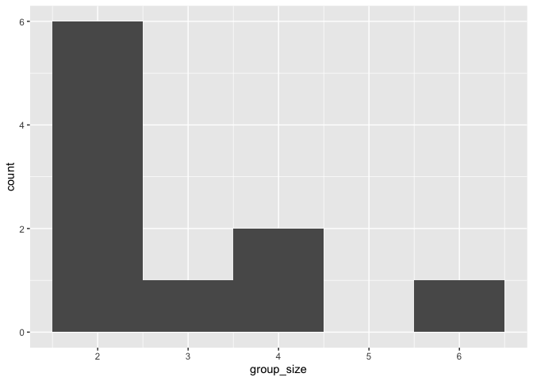<!-- --> 2. Count the
number of each `group_size` in `restaurant_groups`, then add a column
called `probability` that contains the probability of randomly selecting
a group of each size. Store this in a new data frame called
`size_distribution`.

``` r
# 2. Create probability distribution
size_distribution <- restaurant_groups %>%
  # Count number of each group size
  count(group_size) %>%
  # Calculate probability
  mutate(probability = n / sum(n))

size_distribution
```

    ## # A tibble: 4 × 3
    ##   group_size     n probability
    ##        <dbl> <int>       <dbl>
    ## 1          2     6         0.6
    ## 2          3     1         0.1
    ## 3          4     2         0.2
    ## 4          6     1         0.1

3.  Calculate the expected value of the `size_distribution`, which
    represents the expected group size.

``` r
# 3. Calculate expected group size
expected_val <- sum(size_distribution$probability *
                    size_distribution$group_size)
expected_val
```

    ## [1] 2.9

4.  Calculate the probability of randomly picking a group of 4 or more
    people by filtering and summarizing.

``` r
# 4. Calculate probability of picking group of 4 or more
size_distribution %>%
  # Filter for groups of 4 or larger
  filter(group_size >= 4 ) %>%
  # Calculate prob_4_or_more by taking sum of probabilities
  summarise(prob_4_or_more = sum(probability))
```

    ## # A tibble: 1 × 1
    ##   prob_4_or_more
    ##            <dbl>
    ## 1            0.3

## Identifying distributions

``` r
library(patchwork)
p1 <- readRDS("data/p1.rds"); p2 <- readRDS("data/p2.rds"); p3 <- readRDS("data/p3.rds")
p1 + p2 + p3
```

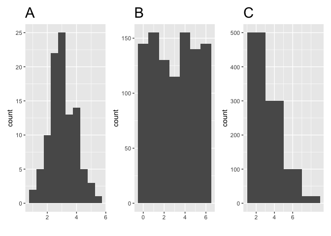<!-- -->

> ## *Question*
>
> Which sample is most likely to have been taken from a uniform
> distribution?<br> <br> ✅ A<br> ⬜ B<br> ⬜ C<br>

## Expected value vs. sample mean

``` r
library(purrr)

sample_sizes <- c(10,100,1000,5000, 10000)

sample_sizes |> 
  
  # Set names, so that the data can be faceted according to the names
  set_names() |> 
  # map rdunif against the sample sizes
  map(rdunif, b = 9, a = 1) |> 
  map(as_tibble) |> 
  # Stack data
  bind_rows(.id = "sample_size") |> 
  # Change order
  mutate(sample_size = sample_size |> forcats::fct_inorder()) |> 
  # Plot
  ggplot(aes(value)) + 
        geom_histogram(binwidth = 1) + 
        facet_wrap(~sample_size, scales = "free", nrow = 1)
```

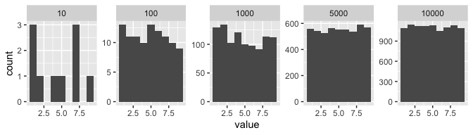

The code above will take a sample from a discrete uniform distribution,
which includes the numbers 1 through 9, and calculate the sample’s mean.
You can adjust the size of the samples by changing the values of
`sample_sizes`. Note that the expected value of this distribution is 5.

> ## *Question*
>
> A sample is taken, and you win twenty dollars if the sample’s mean is
> less than 4. There’s a catch: you get to pick the sample’s size. Which
> sample size is most likely to win you the twenty dollars?<br> <br> ✅
> 10<br> ⬜ 100<br> ⬜ 1000<br> ⬜ 5000<br> ⬜ 10000<br>

## Which distribution?

At this point, you’ve learned about the two different variants of the
uniform distribution: the discrete uniform distribution, and the
continuous uniform distribution. In this exercise, you’ll decide which
situations follow which distribution.


**Steps**

Map each situation to the probability distribution it would best be
modeled by.

| Discrete Uniform                                                                                  | Continuous Unifrom                                                                                                                            | Other                          |
|---------------------------------------------------------------------------------------------------|-----------------------------------------------------------------------------------------------------------------------------------------------|--------------------------------|
| The ticket number of a raffle winner, assuming there is one ticket for each number from 1 to 100. | The time you’ll have to wait for a geyser to erupt if you show up at a random time, knowing that the geyser erupts exactly every ten minutes. | The height of a random person. |
| The outcome of rolling a 4-sided die.                                                             | The time of day a baby will be born.                                                                                                          |                                |

## Data back-ups

The sales software used at your company is set to automatically back
itself up, but no one knows exactly what time the back-ups happen. It is
known, however, that back-ups happen exactly every 30 minutes. Amir
comes back from sales meetings at random times to update the data on the
client he just met with. He wants to know how long he’ll have to wait
for his newly-entered data to get backed up. Use your new knowledge of
continuous uniform distributions to model this situation and answer
Amir’s questions.

**Steps**

1.  To model how long Amir will wait for a back-up using a continuous
    uniform distribution, save his lowest possible wait time as `min`
    and his longest possible wait time as `max`. Remember that back-ups
    happen every 30 minutes.
2.  Calculate the probability that Amir has to wait less than 5 minutes,
    and store in a variable called `prob_less_than_5`.

``` r
# 1. Min and max wait times for back-up that happens every 30 min
min <- 0
max <- 30

# 2. Calculate probability of waiting less than 5 mins
prob_less_than_5 <- punif(5, min = min, max = max)
prob_less_than_5
```

    ## [1] 0.1666667

3.  Calculate the probability that Amir has to wait more than 5 minutes,
    and store in a variable called `prob_greater_than_5`.

``` r
# 3. Calculate probability of waiting more than 5 mins
prob_greater_than_5 <- punif(5, min = min, max = max, lower.tail = F)
prob_greater_than_5
```

    ## [1] 0.8333333

4.  Calculate the probability that Amir has to wait between 10 and 20
    minutes, and store in a variable called `prob_between_10_and_20`.

``` r
# 4. Calculate probability of waiting 10-20 mins
prob_between_10_and_20 <- punif(20, min = min, max = max) - punif(10, min = min, max = max)
prob_between_10_and_20
```

    ## [1] 0.3333333

## Simulating wait times

To give Amir a better idea of how long he’ll have to wait, you’ll
simulate Amir waiting 1000 times and create a histogram to show him what
he should expect. Recall from the last exercise that his minimum wait
time is 0 minutes and his maximum wait time is 30 minutes.

**Steps**

1.  Set the random seed to `334`.
2.  Generate 1000 wait times from the continuous uniform distribution
    that models Amir’s wait time. Add this as a new column called `time`
    in the `wait_times` data frame.

``` r
wait_times <- tibble(simulation_nb=c(1:1000))

# 1. Set random seed to 334
set.seed(334)

# 2. Generate 1000 wait times between 0 and 30 mins, save in time column
wait_times %>%
  mutate(time = runif(1000, min = 0, max = 30))
```

    ## # A tibble: 1,000 × 2
    ##    simulation_nb   time
    ##            <int>  <dbl>
    ##  1             1 29.5  
    ##  2             2 16.3  
    ##  3             3  0.369
    ##  4             4 24.2  
    ##  5             5 23.4  
    ##  6             6 15.9  
    ##  7             7 17.5  
    ##  8             8  2.81 
    ##  9             9  1.23 
    ## 10            10 18.8  
    ## # … with 990 more rows

-   3.  Create a histogram of the simulated wait times with 30 bins.

``` r
# 1. Set random seed to 334
set.seed(334)

# 3. Generate 1000 wait times between 0 and 30 mins, save in time column
wait_times %>%
  mutate(time = runif(1000, min = 0, max = 30)) %>%
  # Create a histogram of simulated times
  ggplot(aes(time)) +
  geom_histogram()
```

    ## `stat_bin()` using `bins = 30`. Pick better value with `binwidth`.

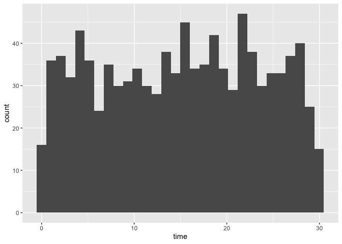<!-- --> \## The
binomial distribution \## Simulating sales deals

Assume that Amir usually works on 3 deals per week, and overall, he wins
30% of deals he works on. Each deal has a binary outcome: it’s either
lost, or won, so you can model his sales deals with a binomial
distribution. In this exercise, you’ll help Amir simulate a year’s worth
of his deals so he can better understand his performance.

**Steps**

1.  Set the random seed to 10 and simulate a single deal.

``` r
# 1. Set random seed to 10
set.seed(10)

# 1. Simulate a single deal
rbinom(1, 1, 0.3)
```

    ## [1] 0

2.  Simulate a typical week of Amir’s deals, or one week of 3 deals.

``` r
# 1. Set random seed to 10
set.seed(10)

# 2. Simulate a single deal
rbinom(1, 3, 0.3)
```

    ## [1] 1

3.  Simulate a year’s worth of Amir’s deals, or 52 weeks of 3 deals
    each, and store in `deals`.
4.  Calculate the mean number of deals he won per week.

``` r
# Set random seed to 10
set.seed(10)

# Simulate 52 weeks of 3 deals
deals <- rbinom(52,3,0.3)

# Calculate mean deals won per week
mean(deals)
```

    ## [1] 0.8076923

## Calculating binomial probabilities

Just as in the last exercise, assume that Amir wins 30% of deals. He
wants to get an idea of how likely he is to close a certain number of
deals each week. In this exercise, you’ll calculate what the chances are
of him closing different numbers of deals using the binomial
distribution.

**Steps**

1.  What’s the probability that Amir closes all 3 deals in a week?

``` r
# Probability of closing 3 out of 3 deals
dbinom(3,3,0.3)
```

    ## [1] 0.027

2.  What’s the probability that Amir closes 1 or fewer deals in a week?

``` r
# Probability of closing <= 1 deal out of 3 deals
pbinom(1,3,0.3)
```

    ## [1] 0.784

3.  What’s the probability that Amir closes more than 1 deal?

``` r
# Probability of closing > 1 deal out of 3 deals
pbinom(1,3,0.3,lower.tail=F)
```

    ## [1] 0.216

## How many sales will be won?

Now Amir wants to know how many deals he can expect to close each week
if his win rate changes. Luckily, you can use your binomial distribution
knowledge to help him calculate the expected value in different
situations. Recall from the video that the expected value of a binomial
distribution can be calculated by
<mjx-container class="MathJax CtxtMenu_Attached_0" jax="CHTML" style="font-size: 116.7%; position: relative;" role="presentation" tabindex="0" ctxtmenu_counter="1"><mjx-math class="MJX-TEX" aria-hidden="true"><mjx-mi class="mjx-i"><mjx-c class="mjx-c1D45B TEX-I"></mjx-c></mjx-mi><mjx-mo class="mjx-n" space="3"><mjx-c class="mjx-cD7"></mjx-c></mjx-mo><mjx-mi class="mjx-i" space="3"><mjx-c class="mjx-c1D45D TEX-I"></mjx-c></mjx-mi></mjx-math><mjx-assistive-mml role="presentation" unselectable="on" display="inline"><math xmlns="http://www.w3.org/1998/Math/MathML"><mi>n</mi><mo>×</mo><mi>p</mi></math></mjx-assistive-mml></mjx-container>.

**Steps**

1.  Calculate the expected number of sales out of the **3** he works on
    that Amir will win each week if he maintains his 30% win rate.

``` r
# Expected number won with 30% win rate
won_30pct <- 3 * 0.30
won_30pct
```

    ## [1] 0.9

2.  Calculate the expected number of sales out of the 3 he works on that
    he’ll win if his win rate drops to 25%.

``` r
# Expected number won with 25% win rate
won_25pct <- 3 * 0.25
won_25pct
```

    ## [1] 0.75

3.  Calculate the expected number of sales out of the 3 he works on that
    he’ll win if his win rate rises to 35%.

``` r
# Expected number won with 35% win rate
won_35pct <- 3 * 0.35
won_35pct
```

    ## [1] 1.05

# 3. More Distributions and the Central Limit Theorem

It’s time to explore one of the most important probability distributions
in statistics, normal distribution. You’ll create histograms to plot
normal distributions and gain an understanding of the central limit
theorem, before expanding your knowledge of statistical functions by
adding the Poisson, exponential, and t-distributions to your repertoire.

## The normal distribution

## Distribution of Amir’s sales

Since each deal Amir worked on (both won and lost) was different, each
was worth a different amount of money. These values are stored in the
`amount` column of `amir_deals` As part of Amir’s performance review,
you want to be able to estimate the probability of him selling different
amounts, but before you can do this, you’ll need to determine what kind
of distribution the `amount` variable follows.

**Steps**

1.  Create a histogram with 10 bins to visualize the distribution of the
    `amount`.

``` r
# Histogram of amount with 10 bins
ggplot(amir_deals, aes(amount)) +
    geom_histogram(bins = 10)
```

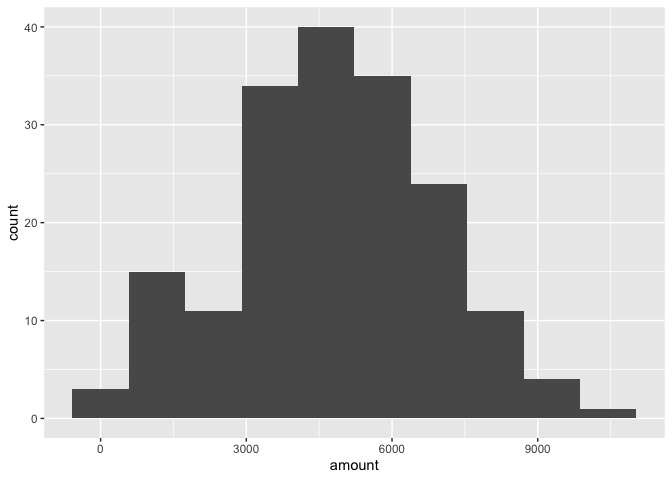<!-- -->

> ## *Question*
>
> Which probability distribution do the sales amounts most closely
> follow?<br> <br> ⬜ Uniform<br> ⬜ Binomial<br> ✅ Normal<br> ⬜ None
> of the above<br>

## Probabilities from the normal distribution

Since each deal Amir worked on (both won and lost) was different, each
was worth a different amount of money. These values are stored in the
`amount` column of `amir_deals` and follow a normal distribution with a
mean of 5000 dollars and a standard deviation of 2000 dollars. As part
of his performance metrics, you want to calculate the probability of
Amir closing a deal worth various amounts.

**Steps**

1.  What’s the probability of Amir closing a deal worth less than $7500?

``` r
# Probability of deal < 7500
pnorm(7500, 5000, 2000)
```

    ## [1] 0.8943502

2.  What’s the probability of Amir closing a deal worth more than $1000?

``` r
# Probability of deal > 1000
pnorm(1000, 5000, 2000, lower.tail=F)
```

    ## [1] 0.9772499

3.  What’s the probability of Amir closing a deal worth between $3000
    and $7000?

``` r
# Probability of deal between 3000 and 7000
pnorm(7000, 5000, 2000) - pnorm(3000, 5000, 2000)
```

    ## [1] 0.6826895

4.  What amount will 75% of Amir’s sales be *more than*?

``` r
# Calculate amount that 75% of deals will be more than
qnorm(0.75, 5000, 2000, lower.tail =F)
```

    ## [1] 3651.02

## Simulating sales under new market conditions

The company’s financial analyst is predicting that next quarter, the
worth of each sale will increase by 20% and the volatility, or standard
deviation, of each sale’s worth will increase by 30%. To see what Amir’s
sales might look like next quarter under these new market conditions,
you’ll simulate new sales amounts using the normal distribution and
store these in the `new_sales` data frame, which has already been
created for you.

**Steps**

1.  Currently, Amir’s average sale amount is $5000. Calculate what his
    new average amount will be if it increases by 20% and store this in
    `new_mean`.
2.  Amir’s current standard deviation is $2000. Calculate what his new
    standard deviation will be if it increases by 30% and store this in
    `new_sd`.
3.  Add a new column called `amount` to the data frame `new_sales`,
    which contains 36 simulated amounts from a normal distribution with
    a mean of `new_mean` and a standard deviation of `new_sd`.

``` r
new_sales <- tibble(sale_num = c(1:36))

# Calculate new average amount
new_mean <- 5000 * 1.2

# Calculate new standard deviation
new_sd <- 2000 * 1.3

# Simulate 36 sales
new_sales <- new_sales %>% 
  mutate(amount = rnorm(36, new_mean, new_sd))
```

4.  Plot the distribution of the `new_sales` `amount`s using a histogram
    with 10 bins.

``` r
# 4. Create histogram with 10 bins
ggplot(new_sales, aes(amount)) +
  geom_histogram(bins = 10)
```

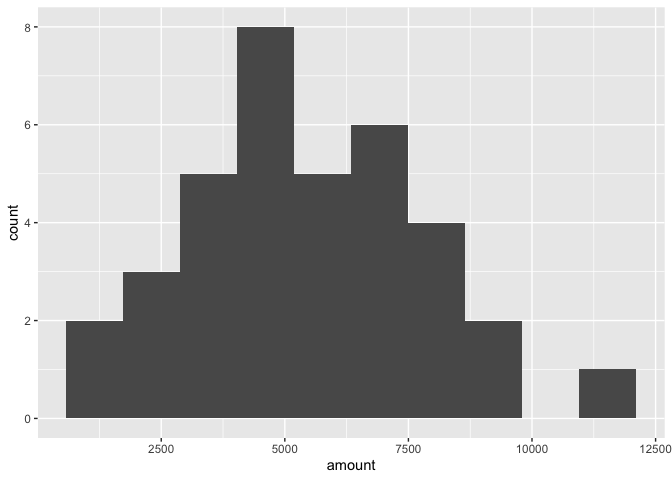<!-- -->

## Which market is better?

The key metric that the company uses to evaluate salespeople is the
percent of sales they make over $1000 since the time put into each sale
is usually worth a bit more than that, so the higher this metric, the
better the salesperson is performing.

Recall that Amir’s current sales amounts have a mean of $5000 and a
standard deviation of $2000, and Amir’s predicted amounts in next
quarter’s market have a mean of $6000 and a standard deviation of $2600.

> ## *Question*
>
> Based only on the metric of **percent of sales over $1000**, does Amir
> perform better in the current market or the predicted market?<br> <br>
> ⬜ Amir performs much better in the current market.<br> ⬜ Amir
> performs much better in next quarter’s predicted market.<br> ✅ Amir
> performs about equally in both markets.<br>

## The central limit theorem

## Visualizing sampling distributions

``` r
# Function to resample distributions
resample_dist <- function(x, sample_mean = 100000, sample_size = 20) {
  replicate(n    = sample_mean,
            expr = mean(sample(x       = x,
                               size    = sample_size,
                               replace = TRUE)))
}

# Set seed
set.seed(1234)

n <- 4000
# 1 Exponential Distribution
x_exp    <- rexp(n = n, rate = 0.1)
dist_exp <- resample_dist(x_exp)

# 2 Uniform Distribution
x_unif    <- runif(n = n, min = 0, max = 1)
dist_unif <- resample_dist(x_unif)

# 3 Normal Distribution
x_norm    <-rnorm(n = n, mean = 0, sd = 1)
dist_norm <- resample_dist(x_norm)

# 4 Binomial Distribution
x_binom    <- rbinom(n = n, size = 500, prob = 0.7)
dist_binom <- resample_dist(x_binom)

# 5 Chisquare Distribution
x_chisq    <- rchisq(n = 4000, df = 10, ncp = 1)
dist_chisq <- resample_dist(x_binom)


# Bind data together
bind_rows( tibble(values = x_exp,      dist = "Exponential Distribution", var = "Histogram") )   |> 
bind_rows( tibble(values = dist_exp,   dist = "Exponential Distribution", var = "Histogram of Resampling Distribution") ) |> 
bind_rows( tibble(values = x_unif,     dist = "Uniform Distribution",     var = "Histogram") ) |> 
bind_rows( tibble(values = dist_unif,  dist = "Uniform Distribution",     var = "Histogram of Resampling Distribution") ) |> 
bind_rows( tibble(values = x_norm,     dist = "Normal Distribution",      var = "Histogram") ) |>
bind_rows( tibble(values = dist_norm,  dist = "Normal Distribution",      var = "Histogram of Resampling Distribution") ) |> 
bind_rows( tibble(values = x_binom,    dist = "Binomial Distribution",    var = "Histogram") ) |>
bind_rows( tibble(values = dist_binom, dist = "Binomial Distribution",    var = "Histogram of Resampling Distribution") ) |> 
bind_rows( tibble(values = x_chisq,    dist = "Chisquare Distribution",   var = "Histogram") ) |>
bind_rows( tibble(values = dist_chisq, dist = "Chisquare Distribution",   var = "Histogram of Resampling Distribution") ) |> 

# Change order
mutate(dist = dist |> forcats::fct_relevel("Exponential Distribution",
                                           "Uniform Distribution",
                                           "Normal Distribution",
                                           "Binomial Distribution")) |> 
# Plot
ggplot(aes(values)) + 
  geom_histogram() +
  facet_wrap(vars(dist, var), scales = "free", dir = "v", nrow = 2) +
  theme(axis.title = element_blank(),
        axis.text  = element_blank(),
        axis.ticks = element_blank())
```

    ## `stat_bin()` using `bins = 30`. Pick better value with `binwidth`.

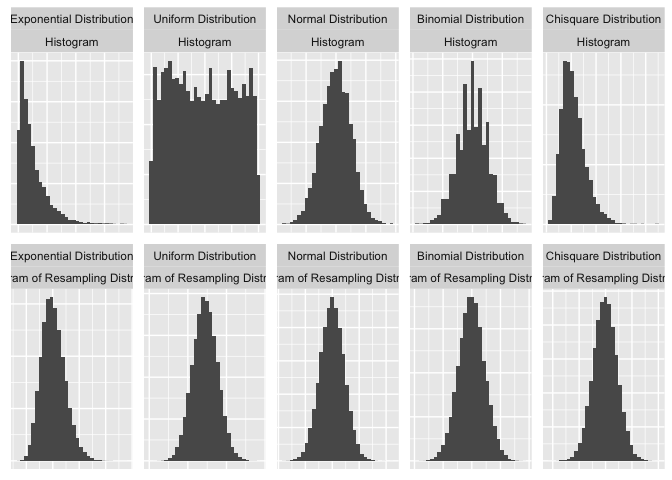<!-- -->
<https://audhiaprilliant.medium.com/the-statistics-simulation-of-central-limit-theorem-and-law-of-large-number-b4e489a139c4>

> ## *Question*
>
> Try creating sampling distributions of different summary statistics
> from samples of different distributions. Which distribution does the
> central limit theorem not apply to?<br> <br> ⬜ Discrete uniform
> distribution<br> ⬜ Continuous uniform distribution<br> ⬜ Binomial
> distribution<br> ⬜ All of the above<br> ✅ None of the above<br>

Regardless of the shape of the distribution you’re taking sample means
from, the central limit theorem will apply if the sampling distribution
contains enough sample means.

## The CLT in action

The central limit theorem states that a sampling distribution of a
sample statistic approaches the normal distribution as you take more
samples, no matter the original distribution being sampled from.

In this exercise, you’ll focus on the sample mean and see the central
limit theorem in action while examining the `num_users` column of
`amir_deals` more closely, which contains the number of people who
intend to use the product Amir is selling.

**Steps**

1.  Create a histogram of the `num_users` column of `amir_deals`. Use 10
    bins.

``` r
# 1. Create a histogram of num_users
ggplot(amir_deals, aes(num_users)) +
    geom_histogram(bins = 10)
```

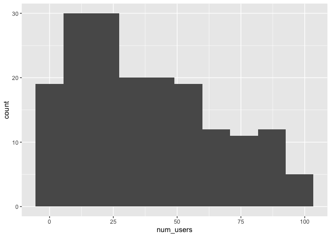<!-- -->

2.  Set the seed to `104`.
3.  Take a sample of size `20` with replacement from the `num_users`
    column of `amir_deals`, and take the mean.

``` r
# 2. Set seed to 104
set.seed(104)

# 3. Sample 20 num_users with replacement from amir_deals
sample(amir_deals$num_users, 20, replace = T) %>%
  # Take mean
  mean()
```

    ## [1] 30.35

4.  Repeat this 100 times and store as `sample_means`. This will take
    100 different samples and calculate the mean of each.

``` r
set.seed(104)
# 4. Repeat the above 100 times
sample_means <- replicate(100, sample(amir_deals$num_users, size = 20, replace = TRUE) %>% mean())
```

5.  A data frame called `samples` has been created for you with a column
    `mean`, which contains the values from `sample_means`. Create a
    histogram of the `mean` column with 10 bins.

``` r
# Set seed to 104
set.seed(104)


# Create data frame for plotting
samples <- data.frame(mean = sample_means)

# Histogram of sample means
ggplot(samples, aes(mean)) +
  geom_histogram(bins=10)
```

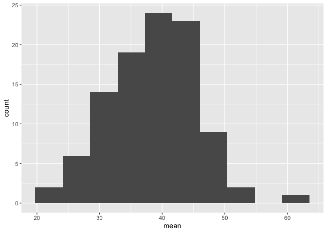<!-- -->

## The mean of means

You want to know what the average number of users (`num_users`) is per
deal, but you want to know this number for the entire company so that
you can see if Amir’s deals have more or fewer users than the company’s
average deal. The problem is that over the past year, the company has
worked on more than ten thousand deals, so it’s not realistic to compile
all the data. Instead, you’ll estimate the mean by taking several random
samples of deals, since this is much easier than collecting data from
everyone in the company.

The user data for all the company’s deals is available in `all_deals`.

**Steps**

1.  Set the random seed to `321`.
2.  Take 30 samples of size 20 from `all_deals$num_users` and take the
    mean of each sample. Store the sample means in `sample_means`.
3.  Take the mean of `sample_means`.

``` r
all_deals <- readRDS("data/all_deals.rds")

# 1. Set seed to 321
set.seed(321)

# 2. Take 30 samples of 20 values of num_users, take mean of each sample
sample_means <- replicate(30, sample(x = all_deals$num_users, size = 20) %>% mean())

# 3. Calculate mean of sample_means
mean(sample_means)
```

    ## [1] 37.02667

4.  Take the mean of the `num_users` column of `amir_deals`.

``` r
# 4. Calculate mean of num_users in amir_deals
mean(amir_deals$num_users)
```

    ## [1] 37.65169

## The Poisson distribution

## Identifying lambda

Now that you’ve learned about the Poisson distribution, you know that
its shape is described by a value called lambda. In this exercise,
you’ll match histograms to lambda values.

``` r
c(1,2,5,10,20) |> 
  set_names() |>
  map(rpois, n = 10000) |> 
  map(as_tibble) |> 
  bind_rows(.id = "lambda") |> 
  mutate(lambda = lambda |> forcats::fct_inorder()) |> 
  ggplot(aes(x=value)) + 
  geom_density(aes(group = lambda, color=lambda, fill=lambda), adjust = 4, alpha = 1/3) +
  scale_color_discrete() + 
  scale_fill_discrete() + 
  ggtitle("Probability Mass Function")
```

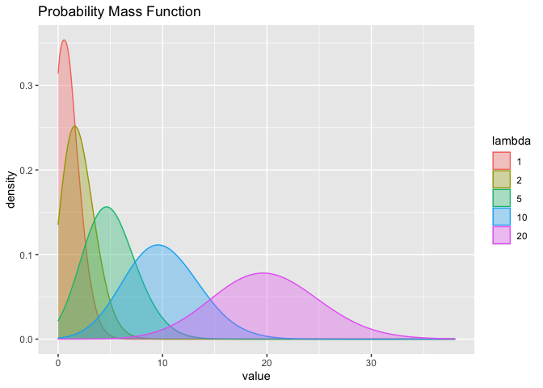<!-- -->

Match each Poisson distribution to its lambda value.

## Tracking lead responses

Your company uses sales software to keep track of new sales leads. It
organizes them into a queue so that anyone can follow up on one when
they have a bit of free time. Since the number of lead responses is a
countable outcome over a period of time, this scenario corresponds to a
Poisson distribution. On average, Amir responds to 4 leads each day. In
this exercise, you’ll calculate probabilities of Amir responding to
different numbers of leads.

**Steps**

1.  What’s the probability that Amir responds to 5 leads in a day, given
    that he responds to an average of 4?

``` r
# 1. Probability of 5 responses
dpois(5, lambda = 4)
```

    ## [1] 0.1562935

2.  Amir’s coworker responds to an average of 5.5 leads per day. What is
    the probability that she answers 5 leads in a day?

``` r
# 2. Probability of 5 responses from coworker
dpois(5, 5.5)
```

    ## [1] 0.1714007

3.  What’s the probability that Amir responds to 2 or fewer leads in a
    day?

``` r
# Probability of 2 or fewer responses
ppois(2, 4)
```

    ## [1] 0.2381033

4.  What’s the probability that Amir responds to more than 10 leads in a
    day?

``` r
# Probability of > 10 responses
ppois(10, 4, lower.tail =F)
```

    ## [1] 0.002839766

## Too many distributions

By this point, you’ve learned about so many different probability
distributions that it can be difficult to remember which is which. In
this exercise, you’ll practice distinguishing between distributions and
identifying the distribution that best matches different scenarios.

Match each situation to the distribution that best models it.

| Poisson                                          | Exponential                                             | Binomial                                                         |
|--------------------------------------------------|---------------------------------------------------------|------------------------------------------------------------------|
| Number of customers that enter a store each hour | Amount of time until the next customer makes a purchase | Number of people from a group of 30 that pass their driving test |
| Number of products sold each week                | Amount of time until someone pays off their loan        |                                                                  |

## Modeling time between leads

To further evaluate Amir’s performance, you want to know how much time
it takes him to respond to a lead after he opens it. On average, it
takes 2.5 hours for him to respond. In this exercise, you’ll calculate
probabilities of different amounts of time passing between Amir
receiving a lead and sending a response.

**Steps**

1.  What’s the probability it takes Amir less than an hour to respond to
    a lead?

``` r
# Probability response takes < 1 hour
pexp(1, rate = 0.4)
```

    ## [1] 0.32968

2.  What’s the probability it takes Amir more than 4 hours to respond to
    a lead?

``` r
# Probability response takes > 4 hours
pexp(4, rate = 0.4, lower.tail = F)
```

    ## [1] 0.2018965

3.  What’s the probability it takes Amir 3-4 hours to respond to a lead?

``` r
# Probability response takes 3-4 hours
pexp(4, 0.4) - pexp(3, 0.4)
```

    ## [1] 0.09929769

## The t-distribution

> ## *Question*
>
> Which statement is **not** true regarding the t-distribution?<br> <br>
> ⬜ The t-distribution has thicker tails than the normal
> distribution.<br> ⬜ A t-distribution with high degrees of freedom
> resembles the normal distribution.<br> ⬜ The number of degrees of
> freedom affects the distribution’s variance.<br> ✅ The t-distribution
> is skewed.<br>

# 4. Correlation and Experimental Design

In this chapter, you’ll learn how to quantify the strength of a linear
relationship between two variables, and explore how confounding
variables can affect the relationship between two other variables.
You’ll also see how a study’s design can influence its results, change
how the data should be analyzed, and potentially affect the reliability
of your conclusions.

## Correlation

> ## *Question*
>
> Which of the following statements is NOT true about correlation?<br>
> <br> ⬜ If the correlation between `x` and `y` has a high magnitude,
> the data points will be clustered closely around a line.<br> ⬜
> Correlation can be written as *r*.<br> ⬜ If `x` and `y` are
> negatively correlated, values of `y` decrease as values of `x`
> increase.<br> ✅ Correlation cannot be 0.<br>

## Relationships between variables

In this chapter, you’ll be working with a dataset `world_happiness`
containing results from the
<a href="https://worldhappiness.report/ed/2019/" target="_blank" rel="noopener noreferrer">2019
World Happiness Report</a>. The report scores various countries based on
how happy people in that country are. It also ranks each country on
various societal aspects such as social support, freedom, corruption,
and others. The dataset also includes the GDP per capita and life
expectancy for each country.

In this exercise, you’ll examine the relationship between a country’s
life expectancy (`life_exp`) and happiness score (`happiness_score`)
both visually and quantitatively. Both `dplyr` and `ggplot2` are loaded
and `world_happiness` is available.

**Steps**

1.  Create a scatterplot of `happiness_score` vs. `life_exp` using
    `ggplot2`.

``` r
world_happiness <- readRDS("data/world_happiness_sugar.rds")

# 1. Create a scatterplot of happiness_score vs. life_exp
ggplot(world_happiness, aes(x = life_exp, y = happiness_score)) +
    geom_point()
```

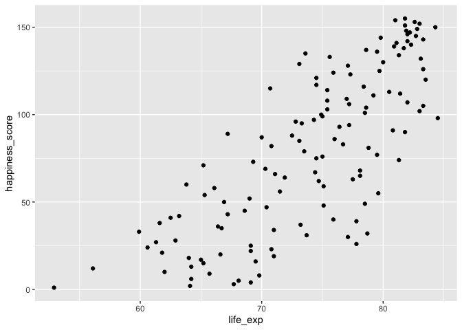<!-- -->

2.  Add a linear trendline to the scatterplot, setting `se` to `FALSE`.

``` r
# 2. Add a linear trendline to scatterplot
ggplot(world_happiness, aes(life_exp, happiness_score)) +
  geom_point() +
  geom_smooth(method = "lm", se = F)
```

    ## `geom_smooth()` using formula 'y ~ x'

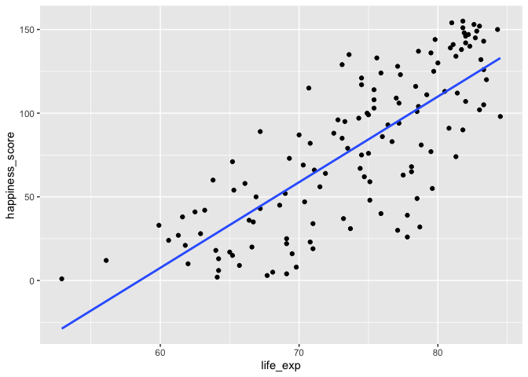<!-- -->

> ## *Question*
>
> Based on the scatterplot, which is most likely the correlation between
> `life_exp` and `happiness_score`?<br> <br> ⬜ 0.3<br> ⬜ -0.3<br> ✅
> 0.8<br> ⬜ -0.8<br>

3.  Calculate the correlation between `life_exp` and `happiness_score`.

``` r
# 3. Correlation between life_exp and happiness_score
cor(world_happiness$life_exp, world_happiness$happiness_score)
```

    ## [1] 0.7737615

## What can’t correlation measure?

While the correlation coefficient is a convenient way to quantify the
strength of a relationship between two variables, it’s far from perfect.
In this exercise, you’ll explore one of the caveats of the correlation
coefficient by examining the relationship between a country’s GDP per
capita (`gdp_per_cap`) and happiness score.

**Steps**

1.  Create a scatterplot showing the relationship between `gdp_per_cap`
    (on the x-axis) and `life_exp` (on the y-axis).

``` r
# 1. Scatterplot of gdp_per_cap and life_exp
ggplot(world_happiness, aes(x = gdp_per_cap, y = life_exp)) +
    geom_point()
```

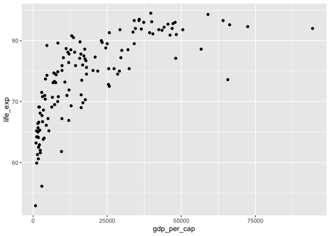<!-- -->

2.  Calculate the correlation between `gdp_per_cap` and `life_exp`.

``` r
# Correlation between gdp_per_cap and life_exp
cor(world_happiness$gdp_per_cap, world_happiness$life_exp)
```

    ## [1] 0.7235027

> ## *Question*
>
> The correlation between GDP per capita and life expectancy is 0.7. Why
> is correlation not the best way to measure the relationship between
> the two variables?<br> <br> ⬜ Correlation measures how one variable
> affects another.<br> ✅ Correlation only measures linear
> relationships.<br> ⬜ Correlation cannot properly measure
> relationships between numeric variables.<br>

## Transforming variables

When variables have skewed distributions, they often require a
transformation in order to form a linear relationship with another
variable so that correlation can be computed. In this exercise, you’ll
perform a transformation yourself.

**Steps**

1.  Create a scatterplot of `happiness_score` versus `gdp_per_cap`.

``` r
# 1. Scatterplot of happiness_score vs. gdp_per_cap
ggplot(world_happiness, aes(x=gdp_per_cap, y = happiness_score)) +
    geom_point()
```

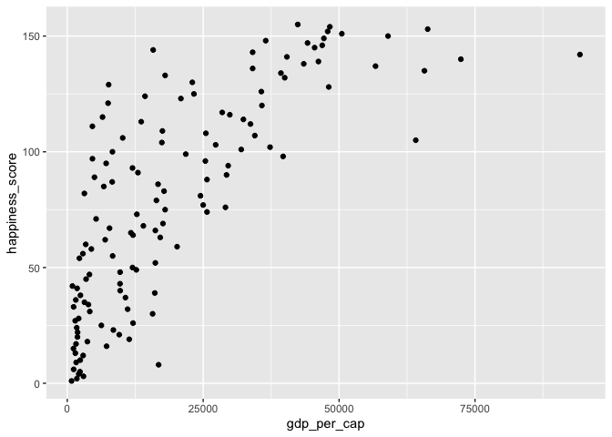<!-- -->

2.  Calculate the correlation between `happiness_score` and
    `gdp_per_cap`.

``` r
# 2. Calculate correlation
cor(world_happiness$happiness_score, world_happiness$gdp_per_cap)
```

    ## [1] 0.7601853

3.  Add a new column to `world_happiness` called `log_gdp_per_cap` that
    contains the log of `gdp_per_cap`.
4.  Create a scatterplot of `happiness_score` versus `log_gdp_per_cap`.

``` r
# 3. Create log_gdp_per_cap column
world_happiness <- world_happiness %>%
  mutate(log_gdp_per_cap = log(gdp_per_cap))

# 4. Scatterplot of log_gdp_per_cap vs. happiness_score
ggplot(world_happiness, aes(x=log_gdp_per_cap, y=happiness_score)) +
  geom_point()
```

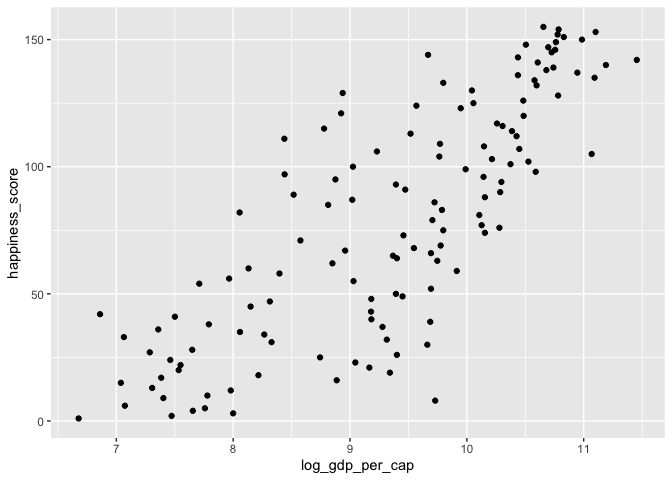<!-- -->

5.  Calculate the correlation between `happiness_score` and
    `log_gdp_per_cap`.

``` r
# 5. Calculate correlation
cor(world_happiness$log_gdp_per_cap, world_happiness$happiness_score)
```

    ## [1] 0.7965484

## Does sugar improve happiness?

A new column has been added to `world_happiness` called
`grams_sugar_per_day`, which contains the average amount of sugar eaten
per person per day in each country. In this exercise, you’ll examine the
effect of a country’s average sugar consumption on its happiness score.

**Steps**

1.  Create a scatterplot showing the relationship between
    `grams_sugar_per_day` (on the x-axis) and `happiness_score` (on the
    y-axis).

``` r
# Scatterplot of grams_sugar_per_day and happiness_score
ggplot(world_happiness, aes(x=grams_sugar_per_day, y = happiness_score)) +
    geom_point()
```

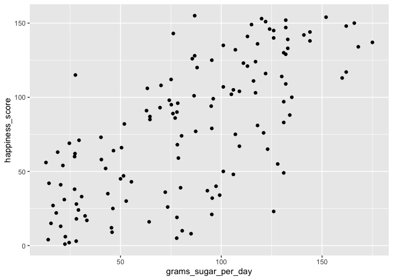<!-- -->

2.  Calculate the correlation between `grams_sugar_per_day` and
    `happiness_score`.

``` r
# Correlation between grams_sugar_per_day and happiness_score
cor(world_happiness$grams_sugar_per_day, world_happiness$happiness_score)
```

    ## [1] 0.69391

> ## *Question*
>
> Based on this data, which statement about sugar consumption and
> happiness scores is true?<br> <br> ⬜ Increased sugar consumption
> leads to a higher happiness score.<br> ⬜ Lower sugar consumption
> results in a lower happiness score<br> ✅ Increased sugar consumption
> is associated with a higher happiness score.<br> ⬜ Sugar consumption
> is not related to happiness.<br>

## Confounders

A study is investigating the relationship between neighborhood residence
and lung capacity. Researchers measure the lung capacity of thirty
people from neighborhood A, which is located near a highway, and thirty
people from neighborhood B, which is not near a highway. Both groups
have similar smoking habits and a similar gender breakdown.

> ## *Question*
>
> Which of the following could be a *confounder* in this study?<br> <br>
> ⬜ Lung capacity<br> ⬜ Neighborhood<br> ✅ Air pollution<br> ⬜
> Smoking status<br> ⬜ Gender<br>

## Study types

While controlled experiments are ideal, many situations and research
questions are not conducive to a controlled experiment. In a controlled
experiment, causation can likely be inferred if the control and test
groups have similar characteristics and don’t have any systematic
difference between them. On the other hand, causation cannot usually be
inferred from observational studies, whose results are often
misinterpreted as a result.

In this exercise, you’ll practice distinguishing controlled experiments
from observational studies.

Determine if each study is a controlled experiment or observational
study.

| Controlled Experiment                                                                                                                               | Observational Study                                                                                                                                  |
|-----------------------------------------------------------------------------------------------------------------------------------------------------|------------------------------------------------------------------------------------------------------------------------------------------------------|
| Purchasing rates are compared between users of an e-commerce site who are randomly directed to a new version of the home page or an old version.    | A week ago, the home page of an e-commerce site was updated. Purchasing rates are compared between users who saw the old and new home page versions. |
| Subjects are randomly assigned to a diet and weight loss is compared.                                                                               | Prevalence of heart disease is compared between veterans with PTSD and veterans without PTSD.                                                        |
| Asthma symptoms are compared between children randomly assigned to receive professional home pest management services or pest management education. |                                                                                                                                                      |

## Longitudinal vs. cross-sectional studies

<div class="">

A company manufactures thermometers, and they want to study the
relationship between a thermometer’s age and its accuracy. To do this,
they take a sample of 100 different thermometers of different ages and
test how accurate they are. Is this data longitudinal or
cross-sectional?

> ## *Question*
>
> Which of the following could be a *confounder* in this study?<br> <br>
> ⬜ Longitudinal<br> ✅ Cross-sectional<br> ⬜ Both<br> ⬜ Neither<br>
